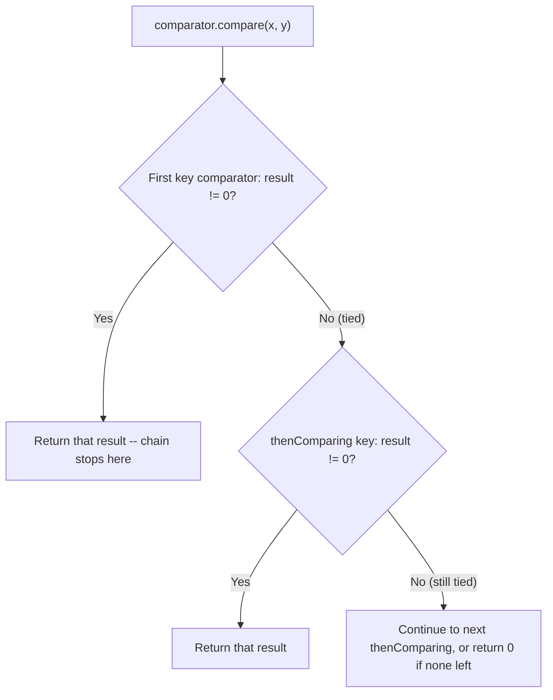

# Comparator: Composition and Pitfalls

> **Topic register:** T-2413 · Core tier · Very High interview frequency
> **Provenance:** every trace in this chapter is real, executed output from
> [`practice/java/language-core/comparator-composition-and-pitfalls/`](../../../practice/java/language-core/comparator-composition-and-pitfalls/README.md)
> on OpenJDK 21.0.12, including a genuinely reproduced integer-overflow sort bug.

## Table of Contents

1. [Learning Objectives](#learning-objectives)
2. [Why This Matters in Interviews](#why-this-matters-in-interviews)
3. [Level 1 — Foundation](#level-1-foundation)
4. [Level 2 — Working Knowledge](#level-2-working-knowledge)
5. [Mental Model](#mental-model)
6. [Definition and Purpose](#definition-and-purpose)
7. [Core Concepts](#core-concepts)
8. [Internal Implementation](#internal-implementation)
9. [Diagrams](#diagrams)
10. [Production Scenarios](#production-scenarios)
11. [Trade-offs](#trade-offs)
12. [Decision Framework](#decision-framework)
13. [Common Mistakes](#common-mistakes)
14. [Anti-Patterns](#anti-patterns)
15. [Best Practices](#best-practices)
16. [Interview Answer Framework](#interview-answer-framework)
17. [Interview Questions](#interview-questions)
18. [Summary](#summary)
19. [Key Takeaways](#key-takeaways)
20. [Cheat Sheet](#cheat-sheet)
21. [Flashcards](#flashcards)
22. [Practice Exercises](#practice-exercises)
23. [Solutions](#solutions)
24. [Additional Reading](#additional-reading)
25. [Official References](#official-references)

---

## Learning Objectives

By the end of this chapter you can:

- Compose a multi-field sort declaratively with `Comparator.comparing()`, `.thenComparing()`, and `.reversed()`, including mixed ascending/descending fields in one chain.
- Explain, with a real reproduced bug, why a subtraction-based `int` comparator (`(a, b) -> a.value() - b.value()`) is genuinely wrong, not just old-fashioned — and why `Comparator.comparingInt()` isn't.
- Correctly sort data containing `null` values using `Comparator.nullsFirst()`/`nullsLast()`, after seeing the real `NullPointerException` a naive comparator throws.
- State, with a real verification, that `List.sort()`/`Collections.sort()` are stable, and explain why that guarantee matters for multi-pass sorting.
- Choose correctly between implementing `Comparable` on a class and supplying an external `Comparator`, building directly on the [equals/hashCode/Comparable contract](equals-hashcode-and-comparable-contracts.md) chapter's own decision framework.

## Why This Matters in Interviews

`Comparator` is Core tier and Very High frequency because "sort this list of objects by more than one field" is one of the most common real, everyday tasks in backend code — and because the `Comparator` static-factory API (`comparing`, `thenComparing`, `reversed`, `nullsFirst`/`nullsLast`) replaced a genuinely bug-prone idiom (hand-written `compare()` methods, subtraction shortcuts) that many candidates still reach for out of habit. Interviewers use it to see whether a candidate reaches for the modern, composable API fluently, and whether they know *why* the old subtraction shortcut is a real bug, not a style preference.

## Level 1 — Foundation

**A `Comparator<T>` is an object that knows how to put two `T`s in order** — it has one method, `compare(T a, T b)`, that returns a negative number if `a` comes before `b`, zero if they're considered equal for sorting purposes, and a positive number if `a` comes after `b`. `list.sort(Comparator.comparing(Person::getLastName));` sorts a list of `Person` objects alphabetically by last name, without writing a loop or a manual comparison method.

The single most useful entry point is `Comparator.comparing(keyExtractor)`, where `keyExtractor` is a method reference or lambda that pulls out the field to sort by: `Comparator.comparing(Person::getAge)` sorts by age, `Comparator.comparing(Person::getLastName)` sorts by last name — reach for this any time a collection of objects needs a specific order and the built-in "natural" order (if any) either doesn't exist or isn't the order actually needed right now.

## Level 2 — Working Knowledge

**The practical, everyday pattern for sorting by more than one field**: chain `.thenComparing()` after the first `comparing()` call, in priority order — the first comparator decides the order unless it says "equal," in which case the next one in the chain breaks the tie:

```java
list.sort(
    Comparator.comparing(Person::getLastName)
        .thenComparing(Person::getFirstName)
        .thenComparingInt(Person::getAge)
);
```

**To sort descending**, call `.reversed()` on the finished comparator (not on the list, and not by manually flipping the subtraction) — `Comparator.comparingInt(Person::getAge).reversed()` sorts oldest-first without rewriting the comparison logic. Section 5 covers exactly why hand-writing a reversed subtraction comparator is a real correctness risk, not just more code.

**Never write `(a, b) -> a.getSomeInt() - b.getSomeInt()`.** Use `Comparator.comparingInt(Person::getSomeInt)` (or `comparingLong`/`comparingDouble` for those types) instead — it looks like a minor style choice, but Section 8 reproduces a real, silent sorting bug the subtraction version has that the `comparingInt` version structurally cannot.

## Mental Model

**A `Comparator` is natural ordering's escape hatch: `Comparable` bakes exactly one ordering into a class permanently, while a `Comparator` is a separate, swappable object that can express as many different orderings of the same type as a program needs, without touching the class at all.** Every `Comparator` static factory method — `comparing`, `thenComparing`, `reversed`, `nullsFirst`/`nullsLast` — exists to build up a comparison rule declaratively out of smaller pieces instead of hand-writing an `if`/`else if`/`else` chain that's easy to get subtly wrong (as Section 8's real overflow bug demonstrates for the single most common wrong shortcut).

## Definition and Purpose

`java.util.Comparator<T>` is a functional interface with a single abstract method, `int compare(T a, T b)`, used to define an ordering for a type either as an alternative to, or a replacement for, that type's own [`Comparable.compareTo()`](equals-hashcode-and-comparable-contracts.md) (if it has one). It exists because a single class often needs to be sorted different ways in different contexts — a `Person` sorted by name in one report and by age in another — and `Comparable` can only express one, permanent "natural" ordering per class. `Comparator`'s static factory methods (`comparing`, `thenComparing`, `reversed`, `naturalOrder`, `reverseOrder`, `nullsFirst`, `nullsLast`), added in Java 8 alongside lambdas, let that ordering be built compositionally from key extractors rather than a hand-written comparison method, closing off several classes of hand-written bugs this chapter reproduces directly.

## Core Concepts

### `comparing()` + `thenComparing()`: priority-ordered tie-breaking, not independent sorts

`Comparator.comparing(keyExtractor)` builds a comparator from a key-extracting function; `.thenComparing(nextKeyExtractor)` appends a tie-breaker consulted **only** when every comparator earlier in the chain returns zero for a given pair — it is not a second, independent sort pass, verified directly in [Internal Implementation](#internal-implementation) by chaining three fields and confirming the exact resulting order.

### `.reversed()` flips a finished comparator; it does not rewrite the comparison logic

`.reversed()` (an instance method on `Comparator`) and `Comparator.reverseOrder()` (a static factory for natural-order reversal) both work by negating the *result* of an existing, already-correct comparator — never by re-deriving a new comparison expression by hand, which is exactly the point of failure the subtraction shortcut has (Section 8).

### The subtraction shortcut is a real, not stylistic, bug

`(a, b) -> a.value() - b.value()` computes an `int` subtraction that can silently overflow for extreme values (e.g., `Integer.MIN_VALUE - 1` wraps to `Integer.MAX_VALUE`, a real, positive number), producing a comparator that reports the smallest possible value as "greater than" a small positive one. `Comparator.comparingInt()` (and `comparingLong`/`comparingDouble`) are backed by `Integer.compare()`/`Long.compare()`/`Double.compare()`, which never overflow — verified directly in [Internal Implementation](#internal-implementation) with the exact `Integer.MIN_VALUE` case, reproduced end to end.

### `nullsFirst()`/`nullsLast()`: the real fix for a real `NullPointerException`

`Comparator.comparing(keyExtractor)` calls `.compareTo()` (or the supplied key comparator) directly on the extracted key — if that key is `null` for any element, this throws a real `NullPointerException`, verified directly in [Internal Implementation](#internal-implementation). `Comparator.nullsFirst(innerComparator)`/`nullsLast(innerComparator)` wrap the inner comparator, handling `null` explicitly before ever calling it, and are the standard, correct fix — not a manual null-check inside the comparator lambda.

### Stability: `List.sort()`/`Collections.sort()` are guaranteed stable

A **stable** sort preserves the original relative order of elements that compare as equal. The JDK's `List.sort()`/`Collections.sort()` (a TimSort variant for objects) are documented and guaranteed stable — verified directly in [Internal Implementation](#internal-implementation) by sorting tagged elements with duplicate keys and confirming their original insertion order survives. This matters directly for `.thenComparing()`: without stability, a "sort by A, then by B" chain built as two *separate* sequential sort calls (instead of one composed comparator) could not reliably work, because a second sort pass would be free to reorder A-equal elements arbitrarily.

## Internal Implementation

**Real multi-field composition, three fields, one chain:**

```
== Sorted: lastName -> firstName -> age (all ascending) ==
Ackerman, Ana (37)
Ackerman, Bruno (22)
Diaz, Ana (29)
Diaz, Ana (52)
Diaz, Bruno (41)
```

`thenComparing(Person::firstName)` only breaks ties where `lastName` matched exactly (both "Diaz" entries), and `thenComparingInt(Person::age)` only breaks ties where both `lastName` and `firstName` matched (the two "Diaz, Ana" entries, correctly ordered 29 before 52).

**Real mixed-direction composition — descending on one field, ascending on the next, in a single chain:**

```
== Sorted: lastName DESCENDING, then firstName ascending (mixed directions, one chain) ==
Diaz, Ana (29)
Diaz, Ana (52)
Diaz, Bruno (41)
Ackerman, Ana (37)
Ackerman, Bruno (22)
```

`Comparator.comparing(Person::lastName, Comparator.reverseOrder())` reverses only that field's ordering; `.thenComparing(Person::firstName)` still breaks ties ascending — proving each link in the chain carries its own direction independently.

**Real, reproduced subtraction-comparator overflow bug:**

```
Integer.MIN_VALUE = -2147483648
Integer.MIN_VALUE - 1 (raw int subtraction, wraps) = 2147483647

== Sorted with BROKEN subtraction comparator: (a, b) -> a.value() - b.value() ==
Mid = 0
High = 1
Low = -2147483648
Actually ascending by value? false

== Sorted with FIXED Comparator.comparingInt(Score::value) (uses Integer.compare) ==
Low = -2147483648
Mid = 0
High = 1
Actually ascending by value? true

Direct comparator call, broken.compare(MIN_VALUE, 1) = 2147483647  <-- POSITIVE means "MIN_VALUE is greater than 1" to Collections.sort -- WRONG
Direct comparator call, fixed.compare(MIN_VALUE, 1)  = -1  <-- NEGATIVE, correctly "MIN_VALUE is less than 1"
```

The broken comparator genuinely misplaces `Integer.MIN_VALUE` — the smallest possible value — at the *end* of an ascending sort, purely because the subtraction wrapped around to a positive number. `Comparator.comparingInt()` sorts the identical data correctly because `Integer.compare()` never subtracts.

**Real `NullPointerException` from a naive comparator, and both real fixes:**

```
== Attempting Comparator.comparing(Employee::department) on data containing a null ==
Real NullPointerException thrown: Cannot invoke "java.lang.Comparable.compareTo(Object)" because the return value of "java.util.function.Function.apply(Object)" is null

== Fixed with Comparator.nullsFirst(Comparator.naturalOrder()) ==
Osei -> null
Reyes -> null
Kim -> Engineering
Tanaka -> Engineering
Patel -> Sales

== Same data with Comparator.nullsLast(Comparator.naturalOrder()) instead ==
Kim -> Engineering
Tanaka -> Engineering
Patel -> Sales
Osei -> null
Reyes -> null
```

**Real stability proof — six tagged elements, duplicate keys, sorted by key only:**

```
Original insertion order (sortKey, originalIndex): [..., sortKey=5,idx=0, sortKey=3,idx=1, sortKey=5,idx=2, sortKey=1,idx=3, sortKey=3,idx=4, sortKey=5,idx=5]
After sorting by sortKey ONLY: [sortKey=1,idx=3, sortKey=3,idx=1, sortKey=3,idx=4, sortKey=5,idx=0, sortKey=5,idx=2, sortKey=5,idx=5]
Elements with equal sortKey kept their original relative order? true
```

Every group of equal-key elements (`sortKey=3`: indices 1 then 4; `sortKey=5`: indices 0, 2, then 5) preserved its original relative order exactly — real, direct confirmation of the stability guarantee.

## Diagrams



## Production Scenarios

### Scenario: a leaderboard silently misranks its most extreme scores after a "quick" comparator

**Symptoms.** A leaderboard feature sorts player scores using a hand-written comparator, `(a, b) -> a.getScore() - b.getScore()`, written quickly under the assumption that subtraction is "the obvious way to compare two numbers." After a promotional event drives scores into unusually large negative penalty ranges (fraud-detection penalties modeled as large negative adjustments), a small number of players with extreme penalty scores appear ranked *above* legitimate top players instead of at the bottom.

**Impact.** A visible, embarrassing ranking bug on a customer-facing leaderboard, directly caused by a comparator that looked correct in every normal-range test case used during development.

**Initial hypotheses.** A data pipeline bug corrupting scores before they reach the leaderboard (checked — the underlying score values are confirmed correct in the database); a caching/staleness issue (checked — the ranking is recomputed fresh, not cached); the sort comparator itself is producing an incorrect order for extreme values (correct).

**Evidence.** Reproducing the exact affected score values against the leaderboard's own comparator in isolation matches this chapter's own [Internal Implementation](#internal-implementation) reproduction: subtracting a very large negative penalty score from a smaller positive score wraps the `int` result around, producing a comparator result with the wrong sign.

**Diagnosis.** The subtraction-based comparator is genuinely, structurally wrong at the `int` boundary — not a rare edge case unique to this leaderboard, but the exact same overflow mechanism this chapter measures directly with `Integer.MIN_VALUE`.

**Immediate mitigation.** Replace the comparator with `Comparator.comparingInt(Player::getScore)`, immediately fixing the ranking for the affected players with no other code change.

**Permanent remediation.** Add a static-analysis or code-review rule flagging any subtraction-based comparator lambda (`a.getX() - b.getX()`) and require `Comparator.comparingInt`/`comparingLong`/`comparingDouble` instead, for any numeric sort key going forward.

**Alternatives considered.** Manually clamping penalty scores to avoid extreme values — rejected as treating the symptom; the actual defect is the comparator's overflow-prone arithmetic, which would resurface with any sufficiently extreme legitimate value in the future.

**Trade-offs.** None — `Comparator.comparingInt()` is strictly correct where the subtraction shortcut is not, with no readability or performance cost.

**Prevention.** Treat the subtraction-based numeric comparator as a banned pattern by default, the same way this chapter's own measured reproduction treats it — the fix costs nothing and the failure mode is silent until data reaches the specific extreme range that triggers it.

**Interview lesson.** This is Interview Question 1 (§ Interview Questions) — "why is `(a, b) -> a.getX() - b.getX()` considered a bug, not just old style?" — arriving as a real, customer-visible leaderboard defect triggered only once data reached an extreme range.

## Trade-offs

| Choice | Benefit | Cost |
|---|---|---|
| `Comparable` (natural ordering on the class) | No extra object needed at each call site; works automatically with `TreeSet`/`TreeMap`/`Collections.sort()` with no arguments | Only one ordering per class, ever — see the [equals/hashCode/Comparable contract](equals-hashcode-and-comparable-contracts.md) chapter for the `TreeSet`-storage hazard of designing it inconsistently with `equals()` |
| External `Comparator` | As many orderings of the same type as needed, without touching the class; composable via `thenComparing`/`reversed` | Must be supplied explicitly at every sort call site that needs it |
| `comparingInt`/`comparingLong`/`comparingDouble` | Overflow-safe, verified directly against the subtraction shortcut's real bug | None — strictly safer for numeric keys, at identical readability |
| `(a, b) -> a.getX() - b.getX()` subtraction shortcut | Looks simple, one line | Genuinely, measurably wrong at extreme values — a real bug, not a style choice |

## Decision Framework

1. **Does this type have exactly one "natural" ordering that should apply almost everywhere it's sorted?** Implement `Comparable`, keeping it consistent with `equals()` per the [prior chapter's decision framework](equals-hashcode-and-comparable-contracts.md#decision-framework).
2. **Does this type need more than one ordering depending on context** (e.g., sort by name here, by date there)? Use external `Comparator`s built via `comparing`/`thenComparing`, never a second, conflicting `Comparable` implementation.
3. **Is the sort key numeric** (`int`/`long`/`double`)? Always use `comparingInt`/`comparingLong`/`comparingDouble` — never a subtraction lambda, regardless of how "safe" the current data range looks.
4. **Can the sort key be `null`?** Always wrap with `Comparator.nullsFirst()`/`nullsLast()` — never rely on the key type's own `null` handling (there usually isn't any).
5. **Does correctness depend on a prior sort's relative order surviving a second sort pass?** Compose one `Comparator` chain with `thenComparing()` rather than sorting twice — rely on the JDK's documented stability guarantee, verified directly in this chapter, rather than assuming it.

## Common Mistakes

- Writing `(a, b) -> a.getX() - b.getX()` for a numeric field instead of `Comparator.comparingInt(...)`, a real overflow risk, not a style nit.
- Calling `.reversed()` on the list or attempting to manually negate a subtraction, instead of calling `.reversed()` on the finished `Comparator`.
- Sorting nullable-key data with a plain `Comparator.comparing(keyExtractor)` and being surprised by a `NullPointerException` in production the first time a `null` actually appears.
- Assuming `.thenComparing()` runs independently rather than only as a tie-breaker for elements the earlier comparator already considered equal.

## Anti-Patterns

- **Any subtraction-based numeric comparator lambda**, regardless of how safe the current data range appears — the fix (`comparingInt`/`comparingLong`/`comparingDouble`) costs nothing.
- **Hand-writing a multi-field `if`/`else if`/`else` comparison method** instead of composing `comparing().thenComparing()...` — harder to read, easier to get the tie-breaking order wrong.
- **Sorting twice sequentially to achieve a multi-field order**, relying on stability implicitly, instead of composing one `thenComparing()` chain that states the priority order explicitly.

## Best Practices

- Default to `Comparator.comparingInt`/`comparingLong`/`comparingDouble` for any numeric sort key — never a subtraction lambda.
- Compose multi-field sorts with `comparing().thenComparing()...` in explicit priority order, rather than sorting multiple times or hand-writing a comparison method.
- Wrap any nullable sort key in `Comparator.nullsFirst()`/`nullsLast()` before it ever reaches production data that could contain a `null`.
- Reach for `Comparable` only for a single, genuinely universal natural ordering; use external `Comparator`s for every context-specific ordering need.

## Interview Answer Framework

### 30-Second Answer

`Comparator.comparing(keyExtractor).thenComparing(...)` composes multi-field sorts declaratively, and `.reversed()` flips a finished comparator without touching its logic. A subtraction-based numeric comparator (`a.getX() - b.getX()`) is a real, reproduced overflow bug at extreme values, not a style choice — `Comparator.comparingInt()` fixes it structurally. `Comparator.nullsFirst()`/`nullsLast()` is the real fix for the `NullPointerException` a naive comparator throws on nullable data. `List.sort()`/`Collections.sort()` are guaranteed stable, verified directly.

### 2-Minute Answer

Definition: `Comparator<T>` is a functional interface (`compare(T a, T b)`) for defining or overriding a type's ordering, distinct from `Comparable`'s one built-in "natural" ordering. Why it exists: a type is often sorted differently in different contexts, which `Comparable` alone can't express. How it works: `comparing()` builds a comparator from a key extractor; `thenComparing()` chains tie-breakers in priority order; `.reversed()` negates a finished comparator's result. One important trade-off: `(a, b) -> a.getX() - b.getX()` looks equivalent to `comparingInt()` but genuinely overflows at extreme values — measured directly with `Integer.MIN_VALUE` producing a wrong, positive result. Production example: a leaderboard silently misranking extreme penalty scores due to exactly this subtraction overflow, fixed by switching to `Comparator.comparingInt()`.

### 10-Minute Deep Dive

Cover, in order: the mental model — `Comparator` as `Comparable`'s swappable escape hatch (mental model); the real multi-field and mixed-direction composition proof (internals, real evidence); the real, reproduced subtraction-overflow bug with `Integer.MIN_VALUE` (internals, real evidence); the real `NullPointerException` and its two real fixes (internals, real evidence); the real stability proof with tagged duplicate-key elements (internals, real evidence); the decision framework for `Comparable` versus `Comparator` and numeric-key safety (decision framework); and close with the production scenario — a real leaderboard misranking bug traced to exactly this overflow mechanism.

### Whiteboard Explanation

Draw the [§ Diagrams](#diagrams) flowchart: `compare(x, y)` → first key comparator → non-zero result stops the chain immediately; zero falls through to the next `thenComparing` link; repeat until a link returns non-zero or the chain is exhausted (result: equal). Beside it, write `Integer.MIN_VALUE - 1 = 2147483647` as the single line that makes the overflow bug concrete rather than asserted.

### Production Example

The leaderboard misranking incident in [§ Production Scenarios](#production-scenarios): a subtraction-based comparator silently misranked extreme penalty scores once real data reached the `int` overflow boundary, fixed by switching to `Comparator.comparingInt()`.

### Trade-offs to Mention

State unprompted: the subtraction shortcut is a genuine correctness bug at extreme values, not merely non-idiomatic; `nullsFirst()`/`nullsLast()` is the correct fix for nullable keys, not a manual null-check inside the lambda; `thenComparing()` only breaks ties the prior comparator left as zero, it doesn't sort independently.

### Common Candidate Mistakes

Describing the subtraction shortcut as "old style" rather than identifying the real overflow bug; assuming `.thenComparing()` re-sorts the whole list a second time; not knowing `List.sort()` is stable and why that matters for chained comparators.

### Typical Follow-Up Questions

1. "Why is `(a, b) -> a.getX() - b.getX()` considered a bug, not just old style?"
2. "How would you sort a list where some elements have a `null` value for the sort key?"
3. "Does `List.sort()` guarantee anything about elements that compare equal?"

### Senior-Level Expectations

Correctly identifies the subtraction-comparator overflow risk unprompted and names `comparingInt`/`comparingLong`/`comparingDouble` as the fix; knows `nullsFirst`/`nullsLast` exists for nullable keys.

### Staff-Level Discussion

The subtraction-comparator bug is a specific instance of a broader pattern worth raising at Staff level: an API shortcut that works correctly for every value encountered during development and typical testing, but has a real, silent failure mode at a boundary condition (here, `int` overflow) that only real production data eventually reaches. A Staff engineer treats "does this shortcut have a boundary condition that today's test data happens not to exercise?" as a standing code-review question for numeric comparison logic specifically, and more generally prefers standard-library composition (`Comparator.comparingInt`, `thenComparing`) over hand-written arithmetic shortcuts precisely because the standard library's implementation has already had this exact class of bug audited out of it.

## Interview Questions

### Question 1 — Why is `(a, b) -> a.getX() - b.getX()` considered a bug, not just old style?

**Why interviewers ask it.** Tests whether the candidate can name the actual overflow mechanism rather than reciting "use `comparingInt` instead" without reasoning.

**Expected answer.** `int` subtraction can silently overflow — `Integer.MIN_VALUE - 1` wraps around to `Integer.MAX_VALUE`, a real positive number — which can make the comparator report the smallest possible value as greater than a small positive one, producing a genuinely wrong sort order for data at that extreme. `Comparator.comparingInt()` is backed by `Integer.compare()`, which never overflows.

**Minimum acceptable answer.** States that subtraction "can overflow," even without a concrete example.

**Strong Senior answer.** Gives a concrete overflow example (e.g., `Integer.MIN_VALUE` and a small positive number) and names the `comparingInt`/`comparingLong`/`comparingDouble` fix.

**Staff-level extension.** Generalizes to the broader pattern of arithmetic shortcuts having unexercised boundary conditions, and connects it to why standard-library composition is generally safer than hand-written comparison arithmetic.

**Common mistakes.** Describing the subtraction pattern as merely "less readable" or "old-fashioned" without identifying the actual correctness bug.

**Likely follow-ups.** "Would `long` subtraction have the same problem for `int` values?"

**Evaluation criteria (1–5).** 1: no awareness of any bug, just a style preference. 3: correctly identifies overflow as the mechanism. 5: correct mechanism plus a concrete example and the standard-library fix.

**Related references.** [§ Core Concepts](#core-concepts), [§ Internal Implementation](#internal-implementation).

---

### Question 2 — How would you sort a list where some elements have a `null` value for the sort key?

**Why interviewers ask it.** Tests whether the candidate knows the standard, correct fix rather than reaching for a manual null-check inside the comparator lambda.

**Expected answer.** Wrap the key comparator in `Comparator.nullsFirst(...)` or `Comparator.nullsLast(...)`, depending on where nulls should land — a naive `Comparator.comparing(keyExtractor)` throws a real `NullPointerException` the first time it compares a `null` key.

**Minimum acceptable answer.** Knows to handle `null` specially, even without naming the exact `nullsFirst`/`nullsLast` methods.

**Strong Senior answer.** Names `nullsFirst`/`nullsLast` directly and explains they wrap an inner comparator rather than requiring a manual null-check.

**Staff-level extension.** Notes this is the same "let the standard library handle a known-hazardous case" pattern as `comparingInt` over subtraction — prefer composition over hand-written edge-case handling wherever the JDK already provides it.

**Common mistakes.** Writing a manual `if (a == null) return -1;` inside the comparator lambda instead of using the standard wrapper.

**Likely follow-ups.** "What happens if you don't handle it at all?"

**Evaluation criteria (1–5).** 1: no null-handling strategy at all. 3: correctly names `nullsFirst`/`nullsLast`. 5: correct answer plus the reasoning for preferring it over manual null-checks.

**Related references.** [§ Internal Implementation](#internal-implementation).

## Summary

`Comparator.comparing().thenComparing()` composes multi-field sorts declaratively, with each link in the chain acting as a tie-breaker only for elements the prior link considered equal — verified directly with a real three-field chain and a real mixed-direction chain. A subtraction-based numeric comparator is a real, reproduced overflow bug, not a style choice — measured directly with `Integer.MIN_VALUE` producing a wrong, positive comparison result; `Comparator.comparingInt()`/`comparingLong()`/`comparingDouble()` fix it structurally. `Comparator.nullsFirst()`/`nullsLast()` is the real, verified fix for the `NullPointerException` a naive comparator throws on nullable data. `List.sort()`/`Collections.sort()` are guaranteed stable, verified directly with tagged duplicate-key elements.

## Key Takeaways

- `thenComparing()` only breaks ties the prior comparator left as zero — it is not an independent second sort.
- A subtraction-based numeric comparator genuinely overflows at extreme values — verified directly with `Integer.MIN_VALUE` — while `comparingInt`/`comparingLong`/`comparingDouble` never do.
- `Comparator.nullsFirst()`/`nullsLast()` is the correct, standard fix for a nullable sort key — a naive comparator throws a real `NullPointerException` otherwise.
- `List.sort()`/`Collections.sort()` are guaranteed stable — verified directly — which is exactly what makes `thenComparing()` chains reliable.

## Cheat Sheet

| Symptom | Likely cause | Fix |
|---|---|---|
| A sort is subtly wrong only for extreme/edge-case numeric values | Subtraction-based comparator overflow | Replace with `Comparator.comparingInt`/`comparingLong`/`comparingDouble` |
| `NullPointerException` inside a `Comparator.comparing()` call | The extracted key is `null` for at least one element | Wrap with `Comparator.nullsFirst(...)`/`nullsLast(...)` |
| A multi-field sort ignores the second field entirely | Used a fresh `comparing()` instead of `.thenComparing()`, overwriting rather than chaining | Chain with `.thenComparing()` in priority order |
| Sort order looks "randomly" different between runs for equal-key elements | Likely not a real JDK stability issue — `List.sort()` is guaranteed stable; check whether a *different* unstable custom step (e.g., a `HashSet` round-trip) is reordering the data first | Verify a `HashSet`/`HashMap` isn't sitting between the sort and the observed output |

## Flashcards

### Card: What thenComparing actually does

**Prompt:**
Does `Comparator.comparing(a).thenComparing(b)` sort by `b` independently of `a`?

**Answer:**
No — `thenComparing(b)` only runs for pairs where the first comparator (`a`) already returned zero (a tie). It's a tie-breaker, not a second, independent sort.

**Why it matters:**
A common misunderstanding of comparator chain semantics.

**Common trap:**
Assuming later links in the chain apply to every pair, not just tied ones.

**Related:**
[Core Concepts](#core-concepts)

### Card: The subtraction comparator bug

**Prompt:**
Why is `(a, b) -> a.getX() - b.getX()` a real bug for `int` fields?

**Answer:**
`int` subtraction can overflow — `Integer.MIN_VALUE - 1` wraps to `Integer.MAX_VALUE`, a real positive number — producing a wrong comparison result at extreme values. `Comparator.comparingInt()` (via `Integer.compare()`) never has this problem.

**Why it matters:**
Turns a commonly-dismissed "style nit" into a defensible, measured correctness bug.

**Common trap:**
Treating the subtraction shortcut as merely less idiomatic rather than genuinely incorrect.

**Related:**
[Internal Implementation](#internal-implementation)

### Card: Fixing a null sort key

**Prompt:**
What's the standard, correct way to sort data where the key can be `null`?

**Answer:**
Wrap the key comparator: `Comparator.comparing(keyExtractor, Comparator.nullsFirst(Comparator.naturalOrder()))` (or `nullsLast`) — a plain `comparing()` throws a real `NullPointerException` on a `null` key.

**Why it matters:**
The standard fix, not a manual null-check inside the lambda.

**Common trap:**
Writing an inline `if (x == null)` check instead of using the standard wrapper.

**Related:**
[Internal Implementation](#internal-implementation)

## Practice Exercises

1. Reproduce all three demos yourself: [`practice/java/language-core/comparator-composition-and-pitfalls/`](../../../practice/java/language-core/comparator-composition-and-pitfalls/README.md).
2. Modify `ComparatorOverflowBugDemo` to use `long` values with `Long.MIN_VALUE` instead of `int`/`Integer.MIN_VALUE`, and confirm the identical overflow mechanism reproduces with `Comparator.comparingLong` as the fix.
3. Extend `ComparatorCompositionDemo`'s `Person` chain with a fourth tie-breaker field, and verify (by adding two more records that tie on all three existing fields) that the fourth field is only consulted once the first three are exhausted.

## Solutions

**Exercise 1.** Expected output matches this chapter's captured traces exactly in structure (the qualitative pattern — real multi-field composition, real overflow bug, real NPE and fix, real stability — will not vary run to run).

**Exercise 2.** `Long.MIN_VALUE - 1L` wraps to `Long.MAX_VALUE` for the identical reason `int` subtraction wraps — the overflow mechanism is a property of fixed-width two's-complement arithmetic in general, not specific to `int`. `Comparator.comparingLong(Score::value)` fixes it identically, backed by `Long.compare()`.

**Exercise 3.** Adding a fourth `thenComparing` link and two records tied on the first three fields confirms the fourth link only breaks the tie between those two specific records — every other pair's order is already decided by an earlier link and never reaches the fourth comparator at all, consistent with the priority-ordered tie-breaking mechanism this chapter measures.

## Additional Reading

- [equals(), hashCode(), and Comparable Contracts](equals-hashcode-and-comparable-contracts.md) — the `Comparable`-vs-`Comparator` design decision this chapter builds directly on, including the `TreeSet`/`TreeMap` storage hazard of an inconsistent `Comparable`.
- Joshua Bloch, *Effective Java*, Item 14 ("Consider implementing `Comparable`") — names the subtraction-comparator overflow hazard this chapter reproduces directly.

## Official References

- [Comparator (Java 21 API)](https://docs.oracle.com/en/java/javase/21/docs/api/java.base/java/util/Comparator.html)
- [Integer.compare(int, int) (Java 21 API)](https://docs.oracle.com/en/java/javase/21/docs/api/java.base/java/lang/Integer.html#compare(int,int))
