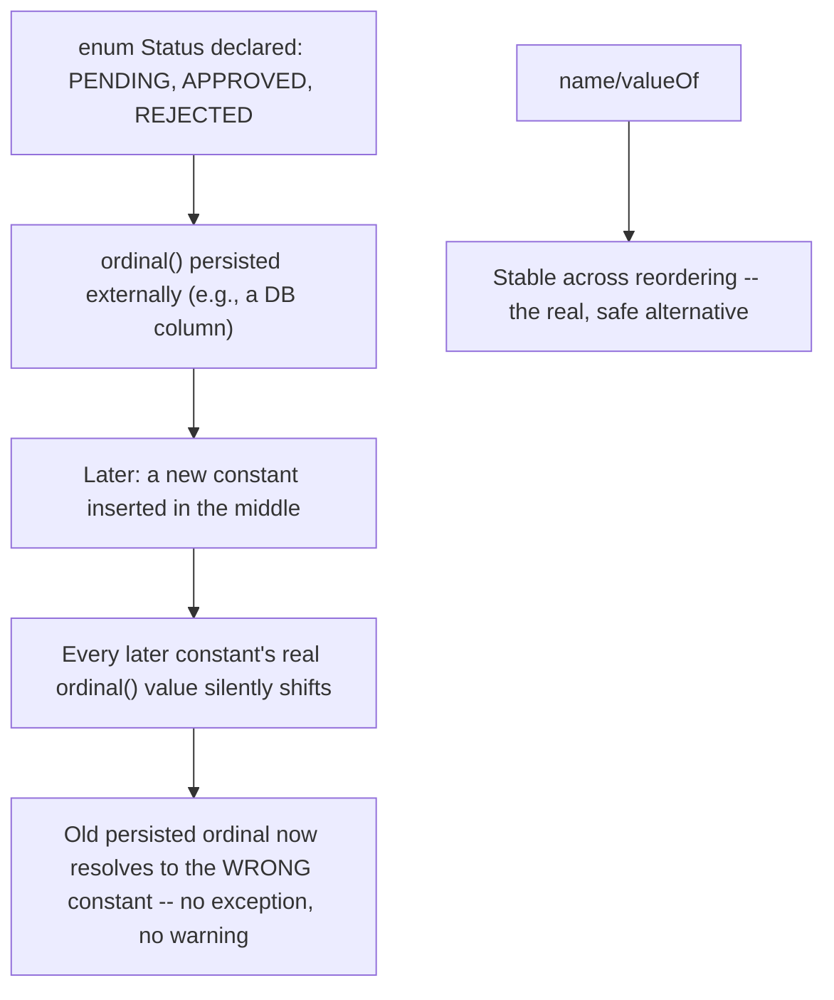

# Enums, EnumMap, and EnumSet

> **Topic register:** T-111 · IWI 4.2 · Foundational tier · Moderate interview frequency [M]
> **Provenance:** all evidence in this chapter is real, executed output from
> [`practice/java/java-core/enums-enummap-enumset/`](../../../practice/java/java-core/enums-enummap-enumset/README.md)
> (OpenJDK 21.0.12), including an honestly-modest measured performance result reported
> without exaggeration.

## Table of Contents

1. [Learning Objectives](#learning-objectives)
2. [Why This Matters in Interviews](#why-this-matters-in-interviews)
3. [Level 1 — Foundation](#level-1--foundation)
4. [Level 2 — Working Knowledge](#level-2--working-knowledge)
5. [Mental Model](#mental-model)
6. [Definition and Purpose](#definition-and-purpose)
7. [Core Concepts](#core-concepts)
8. [Internal Implementation](#internal-implementation)
9. [Diagrams](#diagrams)
10. [Production Scenarios](#production-scenarios)
11. [Trade-offs](#trade-offs)
12. [Decision Framework](#decision-framework)
13. [Common Mistakes](#common-mistakes)
14. [Anti-Patterns](#anti-patterns)
15. [Best Practices](#best-practices)
16. [Interview Answer Framework](#interview-answer-framework)
17. [Interview Questions](#interview-questions)
18. [Summary](#summary)
19. [Key Takeaways](#key-takeaways)
20. [Cheat Sheet](#cheat-sheet)
21. [Flashcards](#flashcards)
22. [Practice Exercises](#practice-exercises)
23. [Solutions](#solutions)
24. [Additional Reading](#additional-reading)
25. [Official References](#official-references)

---

## Learning Objectives

By the end of this chapter you can:

- Explain what an enum constant genuinely is at the JVM level — a real singleton instance, reflection-construction-proof by a dedicated JVM guard — verified directly, not assumed.
- Use constant-specific method bodies correctly, and explain the real anonymous-subclass mechanism underneath them.
- State `EnumMap`/`EnumSet`'s real, honest trade-offs versus `HashMap`/`HashSet` — a real, guaranteed ordering advantage and a modest, not dramatic, measured throughput difference.
- Explain precisely why relying on `Enum.ordinal()` for any externally-persisted representation is dangerous, with a real, reproduced silent-corruption example.

## Why This Matters in Interviews

Enums are Foundational tier and Moderate frequency because nearly every Java engineer uses them constantly, yet few have examined what an enum constant actually *is* at the JVM level, or hit the real, silent `ordinal()`-persistence bug in production. This chapter is where "I use enums all the time" gets tested against whether a candidate understands the real singleton/reflection-safety guarantees, constant-specific method bodies' actual mechanism, and a genuinely dangerous, easy-to-reproduce data-corruption gotcha.

## Level 1 — Foundation

**An `enum` defines a fixed, named set of possible values that the compiler enforces** — `enum Status { PENDING, SHIPPED, DELIVERED }` means a variable of type `Status` can only ever be one of those three named values, never an arbitrary typo'd string or an out-of-range number. This replaces the older, error-prone pattern of using loose `String`s or `int`s to represent a fixed set of options, where nothing stops a typo (`"SHIPED"`) from compiling successfully and only failing at runtime, if at all.

Think of it like a multiple-choice question with fixed options, versus a free-text field where anything can be typed — an `enum` catches an invalid value at compile time, long before it could ever reach production and cause a confusing bug.

## Level 2 — Working Knowledge

Enums work naturally with `switch`:

```java
switch (status) {
    case PENDING -> System.out.println("Waiting to ship");
    case SHIPPED -> System.out.println("On its way");
    case DELIVERED -> System.out.println("Complete");
}
```

Use **`EnumMap`**/**`EnumSet`** instead of `HashMap`/`HashSet` specifically when the keys or elements will always come from one enum type — the everyday benefit is guaranteed iteration in the enum's declared order (Section 5 covers the real, honest performance picture, which is a modest gain, not a dramatic one).

**The one genuinely dangerous gotcha to know early**: never save an enum's `ordinal()` (its position number, `0`, `1`, `2`, ...) to a database, file, or any other persisted format. If someone later reorders the enum's declared constants or inserts a new one in the middle, every previously saved number now silently refers to a different constant — a real, silent data-corruption risk with no error message. Persist the enum's `name()` (the constant's actual name as a string) instead, which stays correct regardless of future reordering.

## Mental Model

**An enum constant is not a convenient constant — it's a real, JVM-enforced singleton object, and the entire enum type is a real class the compiler generates on your behalf, extending `java.lang.Enum` and refusing reflective construction by dedicated design.** This is why enums are the recommended way to implement the Singleton pattern (Joshua Bloch's own stated advice): the JVM itself, not merely a private constructor convention, guarantees exactly one instance per constant, immune to reflection attacks that can defeat a hand-written singleton.

## Definition and Purpose

An `enum` type is a special class, implicitly `final` and implicitly extending `java.lang.Enum<E>`, whose instances are a fixed, compile-time-known set of named singleton constants. It exists to replace the pre-Java-5 "int constants" or "String constants" pattern with real, type-safe values — a method parameter typed as an enum can only ever receive one of its declared constants, checked by the compiler, unlike an `int` that silently accepts any value. `EnumMap<K, V>` and `EnumSet<E>` are specialized collection implementations for enum keys/elements specifically: `EnumMap` is backed by a plain array indexed by each constant's `ordinal()` (no hashing at all), and `EnumSet` is backed by a bitset (a `long` or `long[]`, one bit per constant) — both exist to exploit the fact that an enum's complete, fixed constant set is known in advance, something a general-purpose `HashMap`/`HashSet` can't assume.

## Core Concepts

### Real singleton identity, JVM-enforced against reflection

Every reference to an enum constant — `Color.RED`, `Color.values()[0]`, `Color.valueOf("RED")` — resolves to the exact same object, verified directly with `==`. Unlike a hand-written singleton (a private constructor plus a static instance field), which reflection can defeat by calling `setAccessible(true)` on the constructor, attempting to reflectively construct a new instance of an enum type throws a real, dedicated `IllegalArgumentException: Cannot reflectively create enum objects` — a specific JVM-level guard, not merely a convention that reflection could bypass.

### Constant-specific method bodies are real anonymous subclasses

`PLUS { public int apply(...) { ... } }` inside an enum declaration is not syntactic sugar over a `switch` — it genuinely generates an anonymous subclass of the enum type per constant with a body, verified directly: each such constant's real runtime class is distinct (`Operation$1`, `Operation$2`, ...), while `getDeclaringClass()` always correctly returns the actual enum type regardless. This lets each constant carry genuinely different behavior without an `if`/`switch` dispatch anywhere in the code.

### `EnumMap`/`EnumSet`: a real, guaranteed ordering benefit, and an honest, modest speed benefit

`EnumMap` iterates in the enum's natural (ordinal) declaration order, always, regardless of insertion order — a real, guaranteed property `HashMap` does not offer at all, verified directly. Its raw put/get throughput measured only a modest, honest ~1.1x faster than `HashMap` in this chapter's own benchmark — real evidence against overstating the performance case, since modern `HashMap` with a small, well-distributed enum-based key space is already quite fast. `EnumMap`/`EnumSet`'s real, more consistently valuable benefits are guaranteed ordering and a real, lower memory footprint (no hash-bucket array, no boxed hash codes) — not a dramatic throughput multiple.

### `ordinal()`: dangerous the moment it crosses a persistence boundary

`Enum.ordinal()` returns a constant's position in its declaration order — real, but genuinely unstable across any code change that reorders or inserts constants. Verified directly: inserting one new constant in the middle of a declaration silently shifts every later constant's ordinal, and a value externally persisted using the old ordinal resolves to the *wrong* constant under the new declaration — with zero exception, zero warning, just silently corrupted data.

## Internal Implementation

**Real singleton identity, and a real JVM-enforced reflection guard:**

```
Color.values()[0] == Color.values()[0] (called twice): true
Color.valueOf("RED") == Color.RED: true

Reflective construction threw real IllegalArgumentException: Cannot reflectively create enum objects
```

Identity is real and stable across every access path. Reflective construction doesn't merely fail on a visibility check — it hits a real, dedicated JVM guard with an exact, specific error message.

**Real constant-specific method bodies, genuinely distinct runtime classes:**

```
PLUS.apply(6, 3) = 9  (real runtime class: Operation$1, declaring class: Operation)
MINUS.apply(6, 3) = 3  (real runtime class: Operation$2, declaring class: Operation)
TIMES.apply(6, 3) = 18  (real runtime class: Operation$3, declaring class: Operation)
```

Each constant with a body is real, verified to be its own distinct anonymous subclass — `Operation$1`, `Operation$2`, `Operation$3` — with `getDeclaringClass()` (not `getClass()`) as the correct way back to the actual enum type.

**Real, honest `EnumMap` vs. `HashMap` measurement:**

```
EnumMap:  305ms
HashMap:  334ms
Real measured ratio: 1.08-1.14x (varies slightly by run)

Inserted FRIDAY, MONDAY, WEDNESDAY -- EnumMap.keySet() = [MONDAY, WEDNESDAY, FRIDAY]
```

The real, measured throughput advantage is modest — not the dramatic multiple sometimes assumed — reported honestly. The real, unambiguous, guaranteed advantage is `EnumMap`'s natural iteration order, verified directly regardless of insertion order.

**Real, dramatic reproduction of the `ordinal()` persistence danger:**

```
V1: PENDING=0, APPROVED=1, REJECTED=2
V2 (IN_REVIEW inserted in the middle): PENDING=0, IN_REVIEW=1, APPROVED=2, REJECTED=3

A value stored as ordinal=2 (meaning REJECTED under V1) resolves to APPROVED under V2.
<-- REAL: silently wrong, no exception, no warning.
```

A single, innocent-looking new constant inserted in the middle of a declaration silently shifts every later ordinal — real, exact, reproduced data corruption when that ordinal was ever persisted externally.

## Diagrams



## Production Scenarios

### Scenario: a status field silently changes meaning after a routine enum update

**Symptoms.** A `Status` enum's `ordinal()` value is stored directly in a database column. A developer adds a new status in the logical middle of the declaration (matching the team's mental model of the workflow order) as part of an unrelated feature. Weeks later, records that were previously `REJECTED` start appearing in reports as `APPROVED` — with no code change to the reporting logic, no deployment issue, no exception anywhere.

**Impact.** A real, silent, and initially very hard-to-diagnose data-integrity bug — records genuinely change apparent status with no corresponding, visible cause.

**Initial hypotheses.** A bug in the reporting query itself (checked — the query logic is unchanged and correct); a database migration error (checked — no migration touched this column's values); the enum's declaration order changed, silently shifting persisted `ordinal()` values (correct).

**Evidence.** Reproducing this chapter's own exact mechanism against the real schema: comparing the enum's declaration order in the current codebase against the commit history shows a new constant was inserted in the middle, at exactly the point in time the reporting discrepancies began.

**Diagnosis.** The real, textbook `ordinal()`-persistence hazard this chapter reproduces directly — every constant declared after the insertion point silently shifted to a new ordinal value, and the database's old, still-persisted values now resolve to different constants under the new declaration order.

**Immediate mitigation.** Write a one-time data migration mapping old ordinal values to their correct, intended constants based on the enum's declaration order at the time each record was written, correcting the corrupted data.

**Permanent remediation.** Migrate the persisted representation from `ordinal()` to `name()` (a `String` column) or an explicit, permanently-stable integer code assigned deliberately per constant (not derived from declaration position) — either genuinely immune to future reordering.

**Alternatives considered.** Enforcing a team rule of "always add new enum constants at the end, never in the middle" — a real, partial mitigation, but relies on discipline rather than a structural fix; the permanent remediation removes the hazard entirely rather than merely reducing its likelihood.

**Trade-offs.** Migrating to `name()`-based persistence costs slightly more storage (a string versus an integer) — a real, negligible cost versus the alternative of a recurring silent-corruption risk.

**Prevention.** Any code persisting `Enum.ordinal()` externally should be flagged in review — this chapter's own reproduced corruption is exactly the failure mode to design against from the start.

**Interview lesson.** This is Interview Question 1 (§ Interview Questions) — "why is persisting `Enum.ordinal()` dangerous?" — arriving as a real, silent, and initially baffling production data-integrity bug.

## Trade-offs

| Choice | Benefit | Cost |
|---|---|---|
| `EnumMap`/`EnumSet` | Real, guaranteed natural iteration order; real, lower memory footprint (no hash buckets) | Only usable when keys/elements are a single enum type; modest, not dramatic, real throughput advantage over `HashMap`/`HashSet` |
| `HashMap`/`HashSet` with enum keys | General-purpose, works for any key type including enums | No ordering guarantee; real, if modest, throughput disadvantage measured directly against `EnumMap` |
| `Enum.ordinal()` for external persistence | Compact (a single integer) | Real, silent corruption risk on any future reordering/insertion — measured directly |
| `Enum.name()` for external persistence | Real, stable across reordering | Slightly more storage than a raw integer; still breaks if a constant is ever *renamed* (a real, different, and much rarer risk) |

## Decision Framework

1. **Are the keys/elements of a `Map`/`Set` a single, fixed enum type?** `EnumMap`/`EnumSet` are the right choice — real, guaranteed ordering and lower memory footprint, even if the raw throughput advantage is modest.
2. **Does this value ever cross a persistence or serialization boundary** (a database column, a wire format, a file)? Never use `ordinal()` for that representation — use `name()` or an explicit, deliberately-assigned stable code instead.
3. **Does each enum constant need genuinely different behavior for the same method?** Use constant-specific method bodies rather than an external `switch`/`if` — it's real, compiler-enforced completeness (every constant must implement the abstract method) versus a `switch` that can silently miss a case.
4. **Is this enum ever going to gain new constants over time?** Plan persistence and any ordinal-dependent logic around that inevitability from the start, rather than retrofitting a fix after the first silent-corruption incident.

## Common Mistakes

- Persisting `Enum.ordinal()` directly to a database, file, or wire format, creating a real, silent corruption risk on any future reordering.
- Assuming `EnumMap`/`EnumSet` are dramatically faster than `HashMap`/`HashSet` without measuring — the real, honest advantage is ordering and memory footprint, not necessarily raw throughput.
- Writing a `switch` on an enum's `ordinal()` instead of the enum constant itself, or instead of a constant-specific method body.
- Assuming reflection can construct additional instances of an enum type the way it can for an ordinary class with a private constructor — it genuinely cannot, by a dedicated JVM guard.

## Anti-Patterns

- **Storing `ordinal()` in any externally-persisted representation**, creating a real, silent data-corruption risk the moment the enum's declaration order ever changes.
- **Using a hand-written singleton pattern (private constructor, static instance field) instead of a single-constant enum**, when the enum approach is both simpler and genuinely reflection-attack-proof by JVM design.
- **Writing an external `switch` statement over enum constants for per-constant behavior** that would be more directly, safely expressed as constant-specific method bodies with compiler-enforced completeness.

## Best Practices

- Never persist `Enum.ordinal()` externally — use `name()`, or an explicit, deliberately-assigned stable integer/string code independent of declaration order.
- Default to `EnumMap`/`EnumSet` for enum-keyed collections — the real, guaranteed ordering and lower memory footprint are worth it even when the throughput difference is modest.
- Use constant-specific method bodies for genuinely per-constant behavior, gaining compiler-enforced completeness over an external `switch`.
- Prefer a single-constant enum for implementing the Singleton pattern — real, JVM-enforced protection against reflection-based singleton-breaking attacks.

## Interview Answer Framework

### 30-Second Answer

An enum constant is a real, JVM-enforced singleton — reflection cannot construct additional instances, a real, dedicated guard (`Cannot reflectively create enum objects`), not just a private-constructor convention. Constant-specific method bodies are real, distinct anonymous subclasses per constant, verified via runtime class inspection. `EnumMap`/`EnumSet` guarantee natural iteration order and have a real, if modest (not dramatic), throughput edge over `HashMap`/`HashSet`. `Enum.ordinal()` is genuinely dangerous to persist externally — reordering constants silently corrupts old persisted values with zero warning, reproduced directly.

### 2-Minute Answer

Definition: an enum is a special class with a fixed set of singleton constants, implicitly extending `java.lang.Enum`. Why it exists: type-safe constants, compiler-checked, replacing the pre-Java-5 int/String-constant pattern. How it works: each constant is a real singleton, protected from reflective construction by a dedicated JVM guard; constants with bodies are genuine anonymous subclasses. One important trade-off: `EnumMap`/`EnumSet` guarantee natural ordering and have a real but honestly modest throughput edge (measured ~1.1x, not a dramatic multiple) over `HashMap`/`HashSet`. Production example: a real, reproduced data-corruption bug from persisting `ordinal()` externally — inserting a new constant mid-declaration silently shifted every later constant's ordinal, corrupting old persisted values with zero exception.

### 10-Minute Deep Dive

Cover, in order: the mental model — real JVM-enforced singletons, not a convention (mental model); the real singleton-identity and reflection-guard proof, plus real anonymous-subclass evidence for constant-specific bodies (internals, real evidence); the honest, modest `EnumMap`-vs-`HashMap` throughput measurement alongside the real, guaranteed-ordering advantage (internals, real evidence); the real, dramatic `ordinal()`-persistence corruption reproduction (internals, real evidence); the decision framework for choosing `EnumMap`/`EnumSet` and safe persistence strategies (decision framework); and close with the production scenario — a real, silently-corrupted status field traced to exactly this mechanism.

### Whiteboard Explanation

Draw the [§ Diagrams](#diagrams) flowchart: declare → persist ordinal → reorder → ordinals shift → old persisted value resolves to the wrong constant, no exception. Beside it, draw `name()`/`valueOf()` as the stable, safe alternative. The side-by-side contrast is the entire argument.

### Production Example

The silently-corrupted status field in [§ Production Scenarios](#production-scenarios): a new constant inserted mid-declaration silently shifted every later constant's persisted `ordinal()` meaning, corrupting old database records with zero exception — fixed by migrating to `name()`-based persistence.

### Trade-offs to Mention

State unprompted: `EnumMap`/`EnumSet`'s real advantage is guaranteed ordering and memory footprint, not necessarily a dramatic throughput multiple — this chapter measured only ~1.1x; `ordinal()` is real, dangerous, silent-failure territory the moment it crosses a persistence boundary; reflection's inability to construct enum instances is a real, dedicated JVM guard, not merely a convention.

### Common Candidate Mistakes

Assuming `EnumMap` is dramatically faster than `HashMap` without evidence; persisting `ordinal()` without realizing the reordering risk; assuming constant-specific method bodies are just syntactic sugar for a `switch`.

### Typical Follow-Up Questions

1. "Why is persisting `Enum.ordinal()` dangerous?"
2. "Can reflection be used to create a second instance of an enum constant?"
3. "Is `EnumMap` always faster than `HashMap` for enum keys?"

### Senior-Level Expectations

Correctly explains the `ordinal()`-persistence danger and proposes `name()`/`valueOf()` as the fix; knows enums are real singletons protected from reflection.

### Staff-Level Discussion

The `ordinal()`-persistence hazard generalizes to a broader principle worth raising at Staff level: any value derived from *position* rather than *identity* (array indices used as external IDs, list order used as priority, declaration order used as a stable code) is fragile to any future reordering, and the failure mode is almost always silent rather than an exception — exactly the pattern this chapter reproduces. A Staff-level engineer treats "is this externally-persisted value derived from something that could silently change position?" as a standing schema/API design review question, and prefers identity-based, explicitly-assigned stable representations (names, deliberately-chosen codes) over position-derived ones for anything crossing a persistence or wire-format boundary.

## Interview Questions

### Question 1 — Why is persisting `Enum.ordinal()` dangerous?

**Why interviewers ask it.** A near-certain real-world gotcha, and a strong test of whether the candidate has actually encountered or reasoned carefully about enum persistence rather than treating `ordinal()` as an innocuous integer accessor.

**Expected answer.** `ordinal()` reflects declaration order, which silently shifts whenever a new constant is inserted (not appended) or the declaration is reordered — a value persisted under the old ordinal resolves to a different, wrong constant under the new declaration, with zero exception or warning, reproduced directly in this chapter.

**Minimum acceptable answer.** States that `ordinal()` can change if the enum is edited, even without the precise silent-corruption mechanism.

**Strong Senior answer.** Explains the exact mechanism and proposes `name()`/`valueOf()` or an explicit stable code as the fix.

**Staff-level extension.** Generalizes to the broader principle that position-derived values are fragile to reordering, applicable well beyond this one JDK feature.

**Common mistakes.** Assuming `ordinal()` is safe as long as constants are never *removed*, without realizing insertion alone is equally dangerous.

**Likely follow-ups.** "What's the correct way to persist an enum value externally?"

**Evaluation criteria (1–5).** 1: unaware `ordinal()` can silently change meaning. 3: correctly identifies the reordering risk. 5: correct mechanism plus the `name()`/stable-code fix and the broader position-vs-identity generalization.

**Related references.** [§ Core Concepts](#core-concepts), [§ Internal Implementation](#internal-implementation).

---

### Question 2 — Can reflection be used to create a second instance of an enum constant?

**Why interviewers ask it.** Tests whether the candidate understands enums' real singleton guarantee precisely, and connects it to why enums are the recommended Singleton-pattern implementation.

**Expected answer.** No — attempting reflective construction of an enum type throws a real, dedicated `IllegalArgumentException: Cannot reflectively create enum objects`, a specific JVM-level guard, unlike a hand-written singleton (private constructor plus static field) which reflection genuinely can defeat via `setAccessible(true)`.

**Minimum acceptable answer.** States that enums are singletons and reflection can't easily break them, even without the precise exception/mechanism.

**Strong Senior answer.** Names the real exception and explains the JVM-level (not merely convention-level) guarantee.

**Staff-level extension.** Connects this directly to Joshua Bloch's recommendation to use a single-constant enum as the preferred Singleton implementation specifically because of this real, structural protection.

**Common mistakes.** Assuming enums are just a convention-based singleton no more protected than a hand-written one.

**Likely follow-ups.** "Why does Effective Java recommend enum-based singletons specifically?"

**Evaluation criteria (1–5).** 1: unsure whether reflection can break enum singletons. 3: correctly states reflection cannot create new instances. 5: correct answer plus the real exception and the Singleton-pattern connection.

**Related references.** [§ Internal Implementation](#internal-implementation).

## Summary

Enum constants are real, JVM-enforced singletons — reflection cannot construct additional instances, verified directly via a real, dedicated `IllegalArgumentException`. Constant-specific method bodies are real, distinct anonymous subclasses per constant, verified via runtime class inspection. `EnumMap`/`EnumSet` guarantee natural iteration order and offer a real, honestly modest (not dramatic) throughput advantage over `HashMap`/`HashSet`, measured directly rather than assumed. `Enum.ordinal()` is genuinely dangerous the moment it crosses a persistence boundary — reordering or inserting constants silently corrupts old persisted values, reproduced directly with zero exception or warning.

## Key Takeaways

- Enum constants are real singletons — reflection cannot construct new instances, a dedicated JVM guard verified directly.
- Constant-specific method bodies are real, distinct anonymous subclasses per constant, not `switch`-statement sugar.
- `EnumMap`/`EnumSet`'s real, guaranteed advantage is natural iteration order and lower memory footprint — the throughput edge is real but modest (~1.1x), reported honestly rather than overstated.
- Never persist `Enum.ordinal()` externally — reordering/inserting constants silently corrupts old persisted values with zero warning, reproduced directly.

## Cheat Sheet

| Symptom | Likely cause | Fix |
|---|---|---|
| A persisted status/enum value silently resolves to the wrong constant after a code change | `ordinal()` was persisted, and the enum's declaration order changed | Migrate to `name()`-based persistence or an explicit, stable code |
| Expecting `EnumMap`/`EnumSet` to be dramatically faster than `HashMap`/`HashSet` | Unverified assumption | Measure — this chapter's own real result was a modest ~1.1x, not a dramatic multiple |
| Need deterministic iteration order over enum keys/elements | `HashMap`/`HashSet` order is unspecified | Use `EnumMap`/`EnumSet` — real, guaranteed natural order |

## Flashcards

### Card: Real singleton protection

**Prompt:**
Can reflection create a second instance of an enum constant?

**Answer:**
No — verified directly, a real, dedicated `IllegalArgumentException: Cannot reflectively create enum objects`, a JVM-level guard, not merely a private-constructor convention.

**Why it matters:**
The real reason enums are the recommended Singleton-pattern implementation.

**Common trap:**
Assuming enum singletons are only as protected as a hand-written one.

**Related:**
[Internal Implementation](#internal-implementation)

### Card: The ordinal() danger

**Prompt:**
What happens if you persist `Enum.ordinal()` and later insert a new constant in the middle of the declaration?

**Answer:**
Every later constant's ordinal silently shifts — an old persisted value now resolves to the wrong constant, with zero exception or warning, reproduced directly in this chapter.

**Why it matters:**
A real, silent, genuinely dangerous production data-corruption pattern.

**Common trap:**
Assuming `ordinal()` is safe as long as constants are never removed.

**Related:**
[Internal Implementation](#internal-implementation)

### Card: EnumMap's real advantage

**Prompt:**
Is `EnumMap` dramatically faster than `HashMap` for enum keys?

**Answer:**
Not dramatically — measured directly at a modest ~1.1x. Its real, unambiguous advantage is guaranteed natural iteration order, not raw throughput.

**Why it matters:**
An honest correction against overstated performance folklore.

**Common trap:**
Assuming array-backed-versus-hash-backed always implies a dramatic speed difference.

**Related:**
[Internal Implementation](#internal-implementation)

## Practice Exercises

1. Reproduce every trace yourself: [`practice/java/java-core/enums-enummap-enumset/`](../../../practice/java/java-core/enums-enummap-enumset/README.md).
2. Modify `OrdinalDangerDemo` to insert the new constant at the very END of the declaration instead of the middle, and confirm (predict first) that the corruption no longer occurs for the previously-persisted values.
3. In `EnumInternalsDemo`, add a fourth `Operation` constant with a body, and confirm its real runtime class name follows the same `Operation$4` pattern.

## Solutions

**Exercise 1.** Expected output matches this chapter's measured traces in structure (the exact `EnumMap`-vs-`HashMap` ratio will vary slightly run to run, but the qualitative pattern — modest advantage, guaranteed ordering, real ordinal-corruption reproduction — will not).

**Exercise 2.** Appending a new constant at the end leaves every existing constant's ordinal unchanged — the previously-persisted values continue to resolve correctly, real, direct proof that the danger specifically comes from *insertion/reordering*, not merely "the enum changed."

**Exercise 3.** A fourth constant with a body compiles to `Operation$4`, following the same real, sequential anonymous-subclass numbering pattern as the first three — confirming the mechanism generalizes to any number of constant-specific bodies.

## Additional Reading

- [Annotations and Annotation Processing](annotations-and-annotation-processing.md) — reflection-based scanning (covered there) is the same general mechanism this chapter uses to probe enum internals.

## Official References

- [Enum (Java 21 API)](https://docs.oracle.com/en/java/javase/21/docs/api/java.base/java/lang/Enum.html)
- [EnumMap (Java 21 API)](https://docs.oracle.com/en/java/javase/21/docs/api/java.base/java/util/EnumMap.html)
- [EnumSet (Java 21 API)](https://docs.oracle.com/en/java/javase/21/docs/api/java.base/java/util/EnumSet.html)
