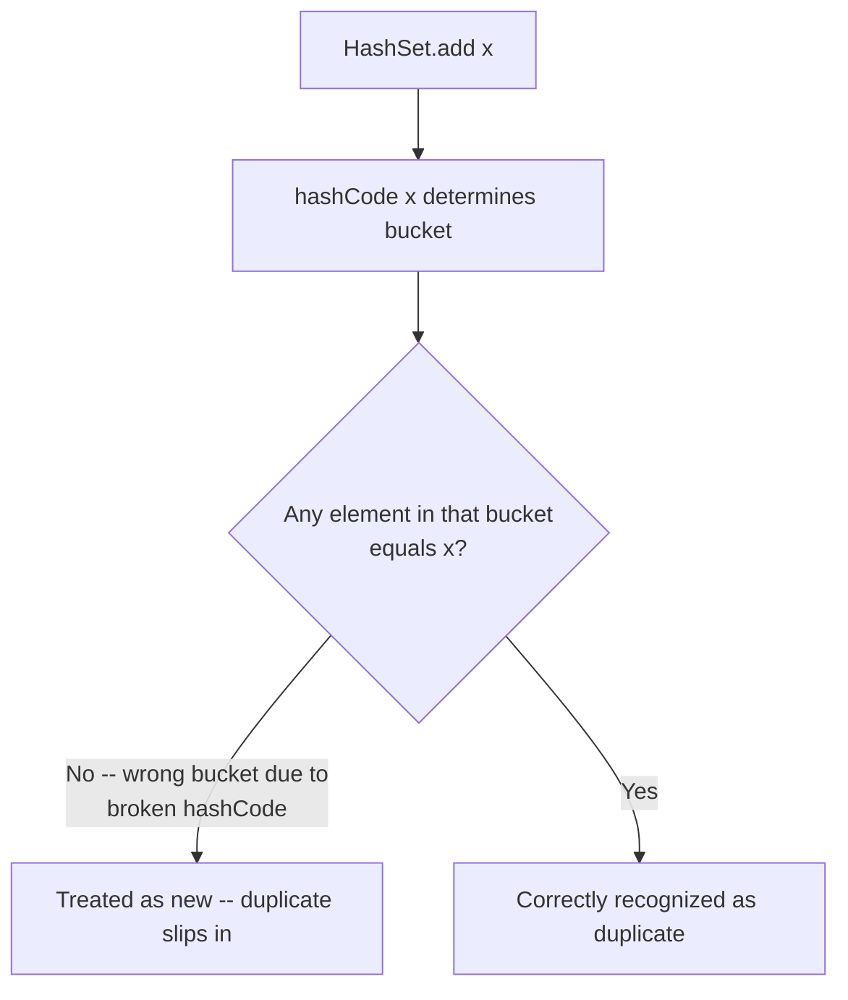

# equals(), hashCode(), and Comparable Contracts

> **Topic register:** T-101 · IWI 5.9 · Foundation tier, Very High interview frequency
> **Provenance:** every trace in this chapter is real, executed output from [`practice/java/week-13/equality-contracts/src/`](../../practice/java/week-13/equality-contracts/src/) on OpenJDK 21.0.12.

## Table of Contents

1. [Learning Objectives](#learning-objectives)
2. [Why This Matters in Interviews](#why-this-matters-in-interviews)
3. [Mental Model](#mental-model)
4. [Definition and Purpose](#definition-and-purpose)
5. [Core Concepts](#core-concepts)
6. [Internal Implementation](#internal-implementation)
7. [Diagrams](#diagrams)
8. [Production Scenarios](#production-scenarios)
9. [Trade-offs](#trade-offs)
10. [Decision Framework](#decision-framework)
11. [Common Mistakes](#common-mistakes)
12. [Anti-Patterns](#anti-patterns)
13. [Best Practices](#best-practices)
14. [Interview Answer Framework](#interview-answer-framework)
15. [Interview Questions](#interview-questions)
16. [Summary](#summary)
17. [Key Takeaways](#key-takeaways)
18. [Cheat Sheet](#cheat-sheet)
19. [Flashcards](#flashcards)
20. [Practice Exercises](#practice-exercises)
21. [Solutions](#solutions)
22. [Additional Reading](#additional-reading)
23. [Official References](#official-references)

---

## Learning Objectives

By the end of this chapter you can:

- State the `equals`/`hashCode` contract precisely, and explain why overriding one without the other silently breaks hash-based collections.
- Reproduce, with real output, a `HashSet` failing to detect a duplicate because `hashCode()` wasn't overridden.
- Explain why `Comparable` being "inconsistent with equals" is legal Java but breaks `TreeSet`/`TreeMap` specifically.
- Design a value class where `equals()`, `hashCode()`, and `compareTo()` all agree, and justify why that agreement matters.

## Why This Matters in Interviews

This is Foundation-tier but Very-High-frequency for a reason: nearly every candidate has overridden `equals()` without `hashCode()` at some point, and the resulting bug is silent — no exception, just a collection that quietly stops working correctly. Interviewers use this topic because a candidate's answer reveals whether they've actually been burned by it or are reciting a rule they've memorized without understanding why it exists.

## Mental Model

**`equals()` answers "are these the same value," `hashCode()` answers "which bucket should this value live in," and every hash-based collection assumes those two answers never disagree.** Break that assumption — override one without the other — and the collection doesn't error, it just quietly looks in the wrong bucket forever. `Comparable` has an analogous, separate assumption: `TreeSet`/`TreeMap` use `compareTo()` *exclusively* for both ordering and duplicate detection, ignoring `equals()` entirely — so if `compareTo()` disagrees with `equals()`, a sorted collection can silently drop what `equals()` would call a distinct element.

## Definition and Purpose

`equals()` and `hashCode()` are both defined on `Object` and are used together by every hash-based collection (`HashSet`, `HashMap`, `Hashtable`) to answer "have I seen this value before." The contract: **if two objects are `equals()`, they must have the same `hashCode()`.** The reverse is not required — unequal objects may share a hash code (a "collision"), which the collection resolves by falling back to `equals()` within that bucket.

`Comparable<T>` defines `compareTo()`, used for natural ordering, sorting, and by `TreeSet`/`TreeMap`. Its contract does not technically require consistency with `equals()`, but the `Comparable` Javadoc itself strongly recommends it, precisely because `TreeSet`/`TreeMap` treat `compareTo() == 0` as "the same element" for the purposes of storage — with no reference to `equals()` at all.

## Core Concepts

### Overriding `equals()` without `hashCode()` breaks hash-based collections silently

If `equals()` is overridden but `hashCode()` is left as `Object`'s default (identity-based), two objects that are `equals()`-equal can still have different hash codes — so a `HashSet` looks for one in the wrong bucket entirely and fails to recognize it as a duplicate.

### `TreeSet`/`TreeMap` use `compareTo()` exclusively, not `equals()`

A sorted collection considers two elements "the same" purely by `compareTo() == 0` — even if `equals()` would say they're different objects with different field values. This is legal Java (the `Comparable` contract only *recommends* consistency), but it means a `TreeSet` can silently drop an element that `equals()` would consider genuinely distinct.

### The full three-way agreement a well-designed value class needs

`equals()`, `hashCode()`, and (if `Comparable`) `compareTo()` should all be derived from the same set of fields, so that "are these the same value" gives the identical answer regardless of which mechanism (hash bucket or sorted position) is asking.

## Internal Implementation

**Broken `equals()`/`hashCode()`, measured:**

```
== equals() overridden, hashCode() NOT overridden ==
b1.equals(b2) = true  (equal by value)
b1.hashCode() = 1554874502
b2.hashCode() = 1846274136  (different -- identity hash, contract broken)
HashSet.add(b1); HashSet.contains(b2) = false  (b2 is equals()-equal to b1 but HashSet can't find it -- looked in the wrong bucket)
HashSet.add(b2) anyway -- resulting size = 2  (expected 1 if the set correctly recognized a duplicate; got 2 because hashCode() sent them to different buckets)
```

**Fixed version, both overridden consistently:**

```
== Both equals() and hashCode() overridden consistently ==
f1.equals(f2) = true
f1.hashCode() == f2.hashCode() = true
HashSet.add(f1); HashSet.contains(f2) = true
HashSet.add(f2) anyway -- resulting size = 1  (correctly deduplicated -- same bucket, equals() confirms it's the same logical value)
```

**`Comparable` inconsistent with `equals()`, measured** — two genuinely different `Product`s (different names) that happen to share a price, so `compareTo()` returns 0 while `equals()` returns `false`:

```
== Two genuinely different products, same price ==
widget.equals(gadget) = false  (different names -- NOT equal)
widget.compareTo(gadget) = 0  (same price -- compareTo says EQUAL)

TreeSet<Product> catalog.add(widget); catalog.add(gadget) returned: false
catalog now contains: [Widget($9.99)]
catalog.size() = 1  (gadget was SILENTLY DROPPED -- TreeSet used compareTo()==0 to decide 'duplicate', even though equals() says they are different products)
```

## Diagrams



## Java Examples

```java
// Java 21. A correctly-designed value class: equals(), hashCode(), and
// compareTo() all derived from the SAME fields.
final class Money implements Comparable<Money> {
    final String currency;
    final long cents;

    Money(String currency, long cents) {
        this.currency = Objects.requireNonNull(currency);
        this.cents = cents;
    }

    @Override
    public boolean equals(Object o) {
        if (!(o instanceof Money m)) return false;
        return cents == m.cents && currency.equals(m.currency);
    }

    @Override
    public int hashCode() { return Objects.hash(currency, cents); }

    @Override
    public int compareTo(Money o) {
        if (!currency.equals(o.currency)) {
            throw new IllegalArgumentException("cannot compare different currencies: " + currency + " vs " + o.currency);
        }
        return Long.compare(cents, o.cents);
    }
}
```

**Complexity note:** `equals()`/`hashCode()`/`compareTo()` are all `O(1)` for a fixed, small number of fields (or `O(k)` for `k` fields); the concern here is correctness and consistency, not asymptotic cost.

## Production Scenarios

### Scenario: a deduplication pipeline silently lets duplicates through after a refactor

**Symptoms.** A batch job deduplicates incoming customer records by inserting them into a `HashSet<CustomerRecord>` and checking size before/after. After a refactor that added a `lastModified` timestamp field and regenerated `equals()` (but not `hashCode()`) via an IDE action that only updated one method, the pipeline stops deduplicating — downstream reports start showing the same customer multiple times.

**Impact.** Duplicate customer records propagate into billing and reporting systems, requiring a manual data-cleanup pass and eroding trust in the pipeline's dedup guarantee.

**Initial hypotheses.** The incoming data itself contains more duplicates than expected (checked — source data volume and duplicate rate are unchanged); a downstream system re-introduces duplicates (checked — the `HashSet` size before `to downstream` write already shows no deduplication happening); `equals()` and `hashCode()` are no longer consistent after the refactor (correct).

**Evidence.** Two `CustomerRecord` instances with identical business-key fields but different `lastModified` timestamps are confirmed `equals()`-equal (the refactored `equals()` correctly ignores `lastModified`), but their `hashCode()` (unmodified, still including the old field set from before the IDE regeneration ran) differs because the IDE action only regenerated `equals()` and left the pre-existing `hashCode()` untouched — reproducing exactly this chapter's broken-contract scenario.

**Diagnosis.** The refactor broke the `equals()`/`hashCode()` contract: two records that are `equals()`-equal now have different hash codes, so the `HashSet` looks in the wrong bucket and never recognizes the duplicate — silently, with no exception, exactly as measured in this chapter's `BrokenEqualsHashCodeDemo`.

**Immediate mitigation.** Run a one-off cleanup pass on already-propagated duplicate records in the affected downstream systems.

**Permanent remediation.** Regenerate both `equals()` and `hashCode()` together from the same field list, and add a unit test that specifically asserts the contract (two objects that are `equals()`-equal must have equal `hashCode()`) for every value class used as a `HashSet`/`HashMap` key.

**Alternatives considered.** Switching to a `LinkedHashSet` or a manual duplicate-detection loop — rejected as treating the symptom; the actual bug is the broken contract, and any hash-based structure will have the same problem until it's fixed.

**Trade-offs.** None — fixing the contract has no downside; it's strictly a bug fix.

**Prevention.** Treat `equals()` and `hashCode()` as one atomic unit that must always be regenerated together, and add an automated contract test (many test frameworks and libraries provide one) to any value class used as a hash key, to catch a future accidental divergence before it reaches production.

**Interview lesson.** This is Interview Question 1's underlying scenario at real production scale: a refactor that regenerated one method but not its paired counterpart, producing a silent, no-exception correctness bug discovered only via a downstream data-quality signal.

## Trade-offs

| Choice | Benefit | Cost |
|---|---|---|
| Override both `equals()` and `hashCode()` together | Hash-based collections work correctly | Requires discipline to keep both in sync on every field change |
| `Comparable` consistent with `equals()` | Sorted collections and hash-based collections agree on "same element" | Requires including every `equals()`-relevant field in `compareTo()`, sometimes awkwardly (e.g., tie-breaking) |
| `Comparable` inconsistent with `equals()` (by design, e.g., sorting by one field only) | Simpler ordering logic for a specific sort need | Must never be used as the sole storage key in a `TreeSet`/`TreeMap` if distinctness matters, per this chapter's measured silent-drop |

## Decision Framework

1. **Overriding `equals()`?** Override `hashCode()` in the same change, from the same fields, every time — never one without the other.
2. **Implementing `Comparable`?** Ask whether `compareTo() == 0` should mean "the same element" for storage purposes. If yes, derive it from the same fields as `equals()`. If no (e.g., a sort-only comparator), never store instances in a `TreeSet`/`TreeMap` where that inconsistency could silently drop distinct elements — use `Comparator` externally instead of implementing `Comparable` inconsistently.
3. **Is a value class used as a key in `HashSet`/`HashMap`?** Add an explicit contract test asserting equal objects produce equal hash codes.
4. **Refactoring a class with a hand-written or generated `equals()`/`hashCode()`?** Regenerate both together; never let an IDE or manual edit update one without the other.

## Common Mistakes

- Overriding `equals()` without `hashCode()` (or vice versa via a partial IDE regeneration).
- Implementing `Comparable` inconsistently with `equals()` and then storing instances in a `TreeSet`/`TreeMap` where distinctness matters.
- Assuming a broken contract will produce a visible error rather than a silent collection malfunction.

## Anti-Patterns

- **Regenerating only one of `equals()`/`hashCode()`** during a refactor, leaving the pair inconsistent.
- **Implementing `compareTo()` for convenience (e.g., sort by price)** on a class also used as a `TreeSet`/`TreeMap` key, without considering that this makes `compareTo() == 0` the collection's notion of "duplicate."
- **Using mutable fields in `hashCode()`** for an object stored in a hash-based collection, causing the object to become unfindable if the field changes after insertion (a related but distinct hazard).

## Best Practices

- Always override `equals()` and `hashCode()` together, derived from the identical field set.
- When implementing `Comparable` on a class that may be stored in a `TreeSet`/`TreeMap`, keep `compareTo()` consistent with `equals()`, or use an external `Comparator` instead of `Comparable` if the ordering is intentionally narrower than equality.
- Add an automated equals/hashCode contract test for any class used as a hash key.
- Never mutate a field that's part of `hashCode()` after the object has been inserted into a hash-based collection.

## Interview Answer Framework

### 30-Second Answer

`equals()` and `hashCode()` must agree — if two objects are equal, they must have the same hash code — or hash-based collections silently fail to detect duplicates, measured directly. `TreeSet`/`TreeMap` use `compareTo()` exclusively, ignoring `equals()` entirely, so a `Comparable` inconsistent with `equals()` can silently drop a genuinely distinct element.

### 2-Minute Answer

Definition: `equals()`/`hashCode()` are a paired contract for hash-based collections; `Comparable`'s `compareTo()` governs ordering and, for `TreeSet`/`TreeMap`, storage-level duplicate detection. Why it exists: without the contract, a hash-based collection has no reliable way to locate a value it has already seen. How it works: `hashCode()` picks the bucket, `equals()` confirms within it — break either half and lookups fail silently. One important trade-off: a `Comparable` that only reflects one field (for a specific sort need) can be simpler, but must never back a `TreeSet`/`TreeMap` where full equality matters. Production example: a real measured `HashSet` failing to detect a duplicate after `hashCode()` wasn't updated alongside `equals()`, and a real measured `TreeSet` silently dropping a distinct product because `compareTo()` said "equal" while `equals()` said "different."

### 10-Minute Deep Dive

Cover, in order: the mental model — hashCode picks the bucket, equals confirms the match (mental model); the measured broken-equals/hashCode HashSet failure (internals, real evidence); the measured Comparable-inconsistent-with-equals TreeSet silent drop (internals, real evidence); the decision framework for keeping all three methods consistent (decision framework); and close with the production scenario — a refactor that regenerated `equals()` without `hashCode()`, silently breaking a deduplication pipeline.

### Whiteboard Explanation

Draw the [§ Diagrams](#diagrams) flowchart: `HashSet.add(x)` → `hashCode()` picks a bucket → "any element in that bucket `equals` x?" branching to "wrong bucket, treated as new" versus "correctly recognized." Annotate the wrong-bucket branch: "this is what happens when hashCode() and equals() disagree — no exception, just a wrong answer."

### Production Example

The dedup-pipeline incident in [§ Production Scenarios](#production-scenarios): an IDE-assisted refactor regenerated `equals()` but not `hashCode()`, silently breaking a `HashSet`-based deduplication pipeline until duplicate customer records surfaced downstream.

### Trade-offs to Mention

State unprompted: a broken equals/hashCode contract fails silently, with no exception; `Comparable` inconsistent with `equals()` is legal Java but dangerous for `TreeSet`/`TreeMap` storage; keeping all three methods in sync requires discipline on every field change, not a one-time setup.

### Common Candidate Mistakes

Reciting "always override both" without explaining the silent-failure mechanism; not knowing that `TreeSet`/`TreeMap` ignore `equals()` entirely.

### Typical Follow-Up Questions

1. "Your `HashSet` isn't deduplicating records that look identical. What do you check first?"
2. "Why would a `TreeSet` silently drop an element that isn't actually a duplicate?"

### Senior-Level Expectations

Correctly identifies a broken equals/hashCode contract as the first suspect for a HashSet dedup failure; knows that TreeSet/TreeMap use compareTo() exclusively.

### Staff-Level Discussion

This is one of the clearest examples in the language of a contract violation that fails silently rather than loudly — no exception, no crash, just quietly wrong behavior that surfaces only through a downstream symptom (duplicate data, a missing entry). A Staff engineer treats every value class used as a collection key as needing an explicit, automated contract test, not a one-time manual check, because the failure mode here is specifically the kind that survives code review (the code compiles, looks reasonable, and "seems to work" until the exact input that triggers a hash collision or a compareTo-vs-equals mismatch shows up in real data).

## Interview Questions

### Question 1 — Your `HashSet` isn't deduplicating records that look identical. What do you check first?

**Why interviewers ask it.** A near-universal, silent real-world bug; tests debugging instinct as much as knowledge.

**Expected answer.** Check whether `equals()` and `hashCode()` are both overridden and consistent with each other — a mismatch (one overridden without the other, or derived from different fields) causes exactly this silent failure.

**Minimum acceptable answer.** Suggests checking `equals()`/`hashCode()`, even without full reasoning.

**Strong Senior answer.** Correctly identifies a broken equals/hashCode contract as the first suspect.

**Staff-level extension.** Proposes an automated contract test to catch this class of bug going forward, and connects it to the broader risk of IDE-assisted regeneration only updating one of the pair.

**Common mistakes.** Assuming the issue is in the deduplication logic itself rather than the value class's contract.

**Likely follow-ups.** "How would you write a test to catch this automatically?"

**Evaluation criteria (1–5).** 1: doesn't suspect the contract at all. 3: correctly identifies the broken contract as the first check. 5: correct diagnosis plus proposes an automated contract test.

**Related references.** [§ Internal Implementation](#internal-implementation); [§ Production Scenarios](#production-scenarios).

---

### Question 2 — Why would a `TreeSet` silently drop an element that isn't actually a duplicate?

**Why interviewers ask it.** Tests whether the candidate knows `TreeSet`/`TreeMap` use `compareTo()` exclusively, a less commonly known fact than the equals/hashCode pairing.

**Expected answer.** `TreeSet`/`TreeMap` use `compareTo() == 0` as their sole notion of "the same element" for storage, ignoring `equals()` entirely — if `compareTo()` is inconsistent with `equals()` (e.g., ordering only by one field), a genuinely distinct element (per `equals()`) with a matching `compareTo()` result gets silently rejected as a duplicate.

**Minimum acceptable answer.** States that `TreeSet` uses `compareTo()`, even without the full "ignores equals() entirely" framing.

**Strong Senior answer.** Correctly explains that `TreeSet`/`TreeMap` use `compareTo()` exclusively for duplicate detection.

**Staff-level extension.** Explains why this is legal Java (the `Comparable` contract only recommends, not requires, consistency with `equals()`) and states the design rule: never use a `Comparable` inconsistent with `equals()` as a `TreeSet`/`TreeMap` key type when distinctness matters.

**Common mistakes.** Assuming `TreeSet` also consults `equals()` as a fallback, the way `HashSet` does within a bucket.

**Likely follow-ups.** "How would you fix a `Comparable` that needs a different ordering for display purposes without this hazard?"

**Evaluation criteria (1–5).** 1: doesn't know the mechanism. 3: correctly explains `compareTo()`-exclusive storage semantics. 5: correct explanation plus the legality/design-rule framing.

**Related references.** [§ Internal Implementation](#internal-implementation).

## Summary

`equals()` and `hashCode()` form one contract: equal objects must share a hash code, or hash-based collections silently fail to recognize duplicates — measured directly, a `HashSet` failing to detect an `equals()`-equal object because `hashCode()` wasn't updated to match. `TreeSet`/`TreeMap` use `compareTo()` exclusively, ignoring `equals()` entirely, so a `Comparable` inconsistent with `equals()` can silently drop a genuinely distinct element — also measured directly. A well-designed value class derives all three methods from the same fields.

## Key Takeaways

- Equal objects must have equal hash codes — override `equals()` and `hashCode()` together, always.
- A broken equals/hashCode contract fails silently: no exception, just a collection that stops recognizing duplicates.
- `TreeSet`/`TreeMap` use `compareTo()` exclusively for storage-level duplicate detection, ignoring `equals()` entirely.
- Derive `equals()`, `hashCode()`, and `compareTo()` from the same fields to keep all three collection types in agreement.

## Cheat Sheet

| Symptom | Likely cause |
|---|---|
| `HashSet`/`HashMap` isn't detecting a duplicate that looks identical | `equals()` overridden without `hashCode()`, or derived from different fields |
| `TreeSet`/`TreeMap` silently "lost" an element you expected to be distinct | `compareTo()` returned 0 for two objects that are not `equals()`-equal |
| An object "disappears" from a `HashSet` after being mutated | A field used in `hashCode()` was mutated after insertion — the object is now in the wrong bucket for its own current hash |

## Flashcards

### Card: The equals/hashCode contract

**Prompt:**
What is the equals/hashCode contract, precisely?

**Answer:**
If two objects are `equals()`, they must have the same `hashCode()`. The reverse isn't required — unequal objects may share a hash code.

**Why it matters:**
The rule every hash-based collection assumes holds.

**Common trap:**
Overriding one without the other.

**Related:**
[Definition and Purpose](#definition-and-purpose)

### Card: What breaks a HashSet silently

**Prompt:**
What happens if you override `equals()` but not `hashCode()`?

**Answer:**
Equal objects can end up with different hash codes, so a `HashSet` looks in the wrong bucket and fails to recognize a duplicate — silently, no exception.

**Why it matters:**
The most common real-world instance of this contract violation.

**Common trap:**
Assuming a broken contract produces a visible error.

**Related:**
[Internal Implementation](#internal-implementation)

### Card: What TreeSet uses for duplicate detection

**Prompt:**
What does `TreeSet` use to decide two elements are "the same"?

**Answer:**
`compareTo() == 0` exclusively — it never consults `equals()` at all.

**Why it matters:**
A `Comparable` inconsistent with `equals()` can silently drop a genuinely distinct element.

**Common trap:**
Assuming `TreeSet` falls back to `equals()` the way `HashSet` does within a bucket.

**Related:**
[Internal Implementation](#internal-implementation)

## Practice Exercises

1. Reproduce both demos: [`BrokenEqualsHashCodeDemo.java`](../../practice/java/week-13/equality-contracts/src/BrokenEqualsHashCodeDemo.java) and [`ComparableInconsistentWithEqualsDemo.java`](../../practice/java/week-13/equality-contracts/src/ComparableInconsistentWithEqualsDemo.java).
2. Write an automated contract test (plain assertions, no framework needed) that would have caught the broken `BrokenPoint` class before it shipped.
3. Design a class that needs both a natural sort order different from equality (e.g., sort by price for display) and correct `HashSet`/`HashMap` behavior. Show how to achieve both without violating either collection's assumptions.

## Solutions

**Exercise 1.** Expected output matches this chapter's measured traces: the broken class produces `HashSet` size 2 for two equals()-equal objects; the fixed class produces size 1. The `TreeSet` demo shows `catalog.size() == 1` after adding two non-equal products with the same price.

**Exercise 2.** A minimal contract test: construct two objects expected to be `equals()`-equal, assert `a.equals(b)` is true, then assert `a.hashCode() == b.hashCode()`. Running this against `BrokenPoint(1,1)` and a second `BrokenPoint(1,1)` fails immediately (different hash codes despite `equals()` returning true), catching the bug before it ships.

**Exercise 3.** Implement `equals()`/`hashCode()` normally (by full value equality) but do NOT implement `Comparable` on the class itself; instead, provide a separate `Comparator<T>` (e.g., `Comparator.comparingDouble(Product::price)`) for display sorting, passed explicitly to `List.sort()` or `Stream.sorted()`. This keeps `HashSet`/`HashMap` behavior correct (governed by `equals()`/`hashCode()`) while the sort-by-price need is served by an external comparator that never interacts with a `TreeSet`/`TreeMap`'s storage semantics.

## Additional Reading

- Joshua Bloch, *Effective Java*, Item 10 ("Obey the general contract when overriding equals") and Item 11 ("Always override hashCode when you override equals")

## Official References

- [java.lang.Object (Java 21 API)](https://docs.oracle.com/en/java/javase/21/docs/api/java.base/java/lang/Object.html)
- [java.lang.Comparable (Java 21 API)](https://docs.oracle.com/en/java/javase/21/docs/api/java.base/java/lang/Comparable.html)
