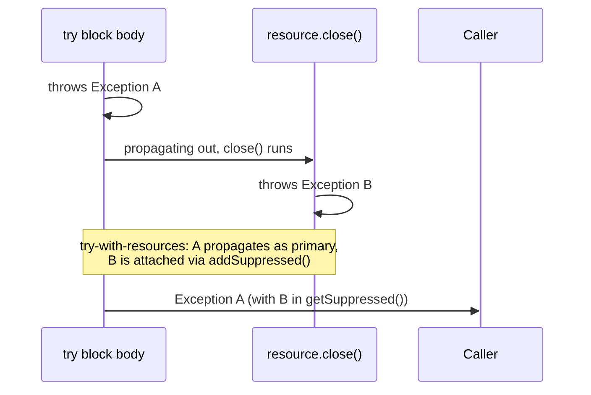

# Exception Design and Hierarchy Strategy

> **Topic register:** T-105 · IWI 5.5 · Core tier, High interview frequency
> **Provenance:** every trace in this chapter is real, executed output from [`practice/java/week-13/exception-design/src/`](../../practice/java/week-13/exception-design/src/) on OpenJDK 21.0.12.

## Table of Contents

1. [Learning Objectives](#learning-objectives)
2. [Why This Matters in Interviews](#why-this-matters-in-interviews)
3. [Mental Model](#mental-model)
4. [Definition and Purpose](#definition-and-purpose)
5. [Core Concepts](#core-concepts)
6. [Internal Implementation](#internal-implementation)
7. [Diagrams](#diagrams)
8. [Java Examples](#java-examples)
9. [Production Scenarios](#production-scenarios)
10. [Trade-offs](#trade-offs)
11. [Decision Framework](#decision-framework)
12. [Common Mistakes](#common-mistakes)
13. [Anti-Patterns](#anti-patterns)
14. [Best Practices](#best-practices)
15. [Interview Answer Framework](#interview-answer-framework)
16. [Interview Questions](#interview-questions)
17. [Summary](#summary)
18. [Key Takeaways](#key-takeaways)
19. [Cheat Sheet](#cheat-sheet)
20. [Flashcards](#flashcards)
21. [Practice Exercises](#practice-exercises)
22. [Solutions](#solutions)
23. [Additional Reading](#additional-reading)
24. [Official References](#official-references)

---

## Learning Objectives

By the end of this chapter you can:

- Explain, with a measured example, why wrapping an exception without chaining its cause destroys real debugging information.
- Explain exactly what try-with-resources does when both the body and `close()` throw, and how suppressed exceptions preserve the second failure.
- Explain why a manual `finally`-block `close()` that also throws is strictly worse, and reproduce the exact failure with real output.
- Design an exception hierarchy that distinguishes recoverable from unrecoverable failures deliberately, not by habit.

## Why This Matters in Interviews

Exception design questions test whether a candidate treats exception handling as a deliberate design decision or as boilerplate to get past the compiler. The cause-chaining and try-with-resources behaviors specifically are near-universal real-world traps: most Java codebases have at least one exception wrapper that silently drops the original cause, and most engineers have never actually traced through what happens when both a resource's body and its `close()` throw.

## Mental Model

**An exception's job is to carry information to whoever eventually catches it — and every re-throw, wrap, or `finally` block is a place that information can be silently destroyed instead of preserved.** Chaining the cause via `Throwable(String, Throwable)` is the difference between "we know exactly what broke and why" and "something broke, we have no idea what." Try-with-resources exists specifically because a `finally` block's own exception would otherwise silently replace whatever exception the try block was already propagating — suppressed exceptions are the mechanism that prevents that replacement from happening invisibly.

## Definition and Purpose

Exception design is the discipline of choosing an exception hierarchy (checked vs. unchecked, custom exception types vs. generic ones) and a wrapping discipline (always chaining the cause) that preserves enough information for whoever eventually handles the failure to actually understand what happened. Java's checked-exception mechanism forces callers to acknowledge certain failure categories at compile time; unchecked exceptions (`RuntimeException` and its subtypes) do not, trading compile-time enforcement for less boilerplate at every call site.

Exception wrapping exists because a low-level failure (a `SQLException`, an `IOException`) is often not meaningful to a caller several layers up — but wrapping it in a higher-level, more meaningful exception must preserve the original as the **cause**, or the information needed to actually debug the failure is gone the moment it's wrapped.

## Core Concepts

### Wrapping without chaining the cause destroys the original failure

Throwing a new exception with only a message (`new MyException("failed")`) inside a `catch` block, without passing the caught exception as the cause, discards the original exception and its entire stack trace — permanently, the moment the new exception is constructed.

### `getCause()` and the chained stack trace are how real debugging information survives a wrap

Using the `Throwable(String, Throwable)` constructor (or `initCause()`) preserves the original exception, retrievable via `getCause()`, and `printStackTrace()` prints the full chain with a `Caused by:` section.

### Try-with-resources propagates the body's exception as primary, the `close()` exception as suppressed

If both the try block's body and the resource's `close()` throw, the body's exception is what propagates to the caller; the `close()` exception is attached via `addSuppressed()` and retrievable via `getSuppressed()` — neither is lost.

### A manual `finally` block with a throwing `close()` has no such protection

Without try-with-resources, if the `finally` block itself throws, that exception *replaces* whatever was propagating from the `try` block — the original failure is gone entirely, with no suppressed-exception mechanism to recover it.

## Internal Implementation

**Wrapping without chaining the cause, measured:**

```
== Wrapping without chaining the cause: the real root cause is gone ==
Caught: SwallowedCauseDemo$OrderProcessingException: could not process order
e.getCause() = null  (null -- the IOException and its stack trace are LOST)
```

**Wrapping with the cause chained, measured:**

```
== Wrapping WITH the cause chained: root cause is preserved ==
Caught: SwallowedCauseDemo$OrderProcessingExceptionFixed: could not process order
e.getCause() = java.io.IOException: disk full on volume /data  (the real IOException, recoverable for logging/debugging)

Full chained stack trace (printStackTrace):
SwallowedCauseDemo$OrderProcessingExceptionFixed: could not process order
	at SwallowedCauseDemo.fixedWrapper(SwallowedCauseDemo.java:33)
	at SwallowedCauseDemo.main(SwallowedCauseDemo.java:49)
Caused by: java.io.IOException: disk full on volume /data
	at SwallowedCauseDemo.lowLevelIO(SwallowedCauseDemo.java:17)
	at SwallowedCauseDemo.fixedWrapper(SwallowedCauseDemo.java:31)
	... 1 more
```

**Try-with-resources, both body and `close()` throwing, measured:**

```
== try-with-resources: what happens when BOTH the body and close() throw ==
Primary exception propagated: resource-A: failure during doWork()
(this is the doWork() failure -- try-with-resources always propagates
 the exception from the BODY as primary, not the one from close())
e.getSuppressed().length = 1
  suppressed: resource-A: failure during close()  (the close() failure -- NOT lost, but demoted to suppressed so it's still visible)
```

**Manual `finally` block, both throwing, measured:**

```
== Without try-with-resources, a manual finally block LOSES the original exception ==
Exception that actually propagated: resource-B: failure during close()
(the ORIGINAL doWork() failure is completely gone -- a manual finally-block
 close() that also throws silently replaces it, with no suppressed-exception
 mechanism to recover it. This is exactly why try-with-resources exists.)
```

## Diagrams



## Java Examples

```java
// Java 21. Correct wrapping: the low-level cause is preserved.
class OrderProcessingException extends RuntimeException {
    OrderProcessingException(String message, Throwable cause) {
        super(message, cause);
    }
}

try {
    lowLevelIO();
} catch (IOException e) {
    throw new OrderProcessingException("could not process order", e); // cause chained
}
```

```java
// Java 21. try-with-resources: both close() failures are preserved as
// suppressed exceptions, never silently discarded.
try (FlakyResource r = new FlakyResource("resource-A")) {
    r.doWork(); // throws -- this becomes the PRIMARY propagated exception
} // close() also throws -- attached via addSuppressed(), retrievable via getSuppressed()
```

**Complexity note:** exception construction, chaining, and suppression are all `O(1)` per exception (aside from stack trace capture, which is proportional to call-stack depth); the concern here is information preservation, not performance.

## Production Scenarios

### Scenario: an on-call engineer spends an hour debugging a generic error because the real cause was silently dropped

**Symptoms.** A production alert fires for `OrderProcessingException: could not process order` with no further detail. The on-call engineer has no `getCause()` to inspect, no chained stack trace pointing at a specific downstream failure, and has to reproduce the issue manually by re-running the failing order through a staging environment to discover the actual root cause (a disk-full condition on a specific volume).

**Impact.** A production incident that could have been diagnosed in seconds from a chained stack trace instead takes over an hour of manual reproduction, extending the incident's resolution time and the affected customers' downtime.

**Initial hypotheses.** The alerting system itself is stripping detail (checked — the alert payload includes the full exception message and stack trace as captured; there's simply nothing more captured to include); the failure is non-deterministic and hard to reproduce (checked — it reproduces reliably once the actual cause, a disk-full condition, is identified); the exception wrapping code discards the original cause (correct).

**Evidence.** The code that throws `OrderProcessingException` uses the single-argument constructor (`new OrderProcessingException("could not process order")`) inside a catch block for the actual low-level `IOException`, exactly matching this chapter's measured `getCause() == null` scenario.

**Diagnosis.** The wrapping exception was designed with only a message constructor, discarding the caught `IOException` (and its stack trace pointing at the specific disk volume) at the exact moment it was wrapped — precisely the mechanism this chapter measures directly.

**Immediate mitigation.** Manually reproduce the failure in staging by testing likely causes one at a time until the disk-full condition is found.

**Permanent remediation.** Add a `Throwable`-accepting constructor to every custom exception type in the codebase, and update every `catch`-and-wrap site to pass the caught exception as the cause; add a static analysis rule flagging any exception construction inside a `catch` block that doesn't reference the caught variable.

**Alternatives considered.** Logging the original exception separately before throwing the wrapped one, instead of chaining it — rejected as strictly worse than chaining, since it requires correlating two separate log entries by timestamp/thread instead of getting the full chain from one exception object.

**Trade-offs.** None — chaining the cause has no real cost; it was simply omitted in the original exception class design.

**Prevention.** Require every custom exception class to expose a cause-accepting constructor as a matter of code-review policy, and treat any `catch` block that constructs a new exception without referencing the caught variable as a review flag.

**Interview lesson.** This is the production-scale version of this chapter's own measured demo: a wrapped exception with `getCause() == null`, turning a diagnosable failure into a costly manual investigation.

## Trade-offs

| Choice | Benefit | Cost |
|---|---|---|
| Checked exceptions | Compiler forces callers to acknowledge the failure category | Boilerplate at every call site; can encourage catch-and-ignore just to satisfy the compiler |
| Unchecked exceptions | No forced boilerplate; failures propagate naturally | Nothing forces a caller to even notice the failure category exists |
| Wrapping with the cause chained | Full diagnostic information survives every layer | None — this is strictly better than not chaining |
| try-with-resources | Both body and `close()` failures are preserved (primary + suppressed) | Requires the resource to implement `AutoCloseable` correctly |

## Decision Framework

1. **Is this exception being constructed inside a `catch` block?** Always pass the caught exception as the cause, using a constructor or `initCause()` — never construct a message-only exception when a caught exception is available.
2. **Does this class implement `AutoCloseable` and get used in a `try` block?** Prefer try-with-resources over a manual `finally` block, specifically because of the suppressed-exception guarantee.
3. **Should this failure category force callers to handle it explicitly?** Use a checked exception. Should it propagate more like a programming error or an unrecoverable condition? Use an unchecked exception.
4. **Is a custom exception class missing a cause-accepting constructor?** Add one — every custom exception type should support chaining, without exception.

## Common Mistakes

- Constructing a new exception inside a `catch` block without passing the caught exception as the cause.
- Using a manual `try`/`finally` for a resource that implements `AutoCloseable`, rather than try-with-resources.
- Designing a custom exception class with only a message constructor, with no way to chain a cause at all.

## Anti-Patterns

- **`catch (Exception e) { throw new MyException("failed"); }`** — the single most common instance of the cause-swallowing bug this chapter measures directly.
- **Logging an exception and then constructing an unrelated new one to throw**, instead of chaining and letting the log statement include the full chain.
- **A custom exception class with no `Throwable`-accepting constructor at all**, structurally preventing correct chaining even by a careful caller.

## Best Practices

- Always chain the cause when wrapping an exception — no exceptions to this rule.
- Prefer try-with-resources over manual `finally`-block cleanup for anything implementing `AutoCloseable`.
- Design every custom exception class with a cause-accepting constructor from the start.
- Choose checked vs. unchecked deliberately based on whether callers should be compiler-forced to handle the failure, not by habit or convention alone.

## Interview Answer Framework

### 30-Second Answer

Wrapping an exception without chaining its cause destroys the original failure's information — measured directly: `getCause()` returns `null`, and the stack trace pointing at the real root cause is gone. Try-with-resources propagates the try-block body's exception as primary and the `close()` failure as suppressed, preserving both; a manual `finally`-block `close()` that also throws silently replaces the original exception entirely, with nothing to recover it.

### 2-Minute Answer

Definition: exception design is choosing a hierarchy (checked/unchecked) and a wrapping discipline that preserves diagnostic information. Why it exists: a low-level exception isn't always meaningful several layers up, but wrapping it must not discard it. How it works: `Throwable(String, Throwable)` chains the cause, retrievable via `getCause()` and visible in `printStackTrace()`'s `Caused by:` section; try-with-resources attaches a `close()` failure as suppressed rather than letting it silently replace the body's exception, which is exactly what a manual `finally` block does instead. One important trade-off: none for cause-chaining — it's strictly better; checked vs. unchecked trades compiler enforcement for boilerplate. Production example: a real measured incident-shaped scenario where a message-only wrapped exception with `getCause() == null` cost significant on-call debugging time that a chained cause would have eliminated instantly.

### 10-Minute Deep Dive

Cover, in order: the mental model — an exception's job is to carry information, and every re-throw is a place it can be lost (mental model); the measured cause-swallowing vs. cause-chaining comparison (internals, real evidence); the measured try-with-resources suppressed-exception behavior versus the measured manual-`finally` exception loss (internals, real evidence); the decision framework for wrapping, checked-vs-unchecked, and try-with-resources adoption (decision framework); and close with the production scenario — an hour-long on-call investigation caused by exactly the cause-swallowing bug this chapter measures.

### Whiteboard Explanation

Draw the [§ Diagrams](#diagrams) sequence: the try-block body throwing Exception A, `close()` throwing Exception B during propagation, with A shown propagating to the caller and B attached via `addSuppressed()`. Annotate: "without try-with-resources, B would silently REPLACE A instead of being attached to it."

### Production Example

The on-call incident in [§ Production Scenarios](#production-scenarios): a message-only wrapped exception with no chained cause turned a diagnosable disk-full condition into an hour-long manual reproduction effort.

### Trade-offs to Mention

State unprompted: cause-chaining has no real cost and should always be done; checked exceptions trade boilerplate for compiler-enforced acknowledgment; try-with-resources requires `AutoCloseable` but is strictly safer than manual cleanup for anything that implements it.

### Common Candidate Mistakes

Constructing a wrapped exception without chaining the cause out of habit; not knowing what happens when both a try-with-resources body and `close()` throw; assuming a manual `finally` block behaves the same as try-with-resources.

### Typical Follow-Up Questions

1. "Your on-call alert shows a generic exception with no detail. What's the first thing you check in the code?"
2. "What happens if both the try block and close() throw, with and without try-with-resources?"

### Senior-Level Expectations

States that exceptions should always chain their cause when wrapping; correctly describes try-with-resources' suppressed-exception behavior.

### Staff-Level Discussion

Cause-chaining and suppressed exceptions are both instances of a broader principle: a good exception design never has to choose between two pieces of information — it should always be possible to know both what ultimately propagated and what else happened along the way. A Staff engineer treats "does this custom exception type support chaining" as a mandatory review item for any new exception class, not a nice-to-have, because the cost of adding it is zero and the cost of omitting it is measured directly in this chapter: real production debugging time lost to information that was available and then deliberately discarded.

## Interview Questions

### Question 1 — Your on-call alert shows a generic exception with no detail. What's the first thing you check in the code?

**Why interviewers ask it.** Tests debugging instinct grounded in a specific, common real-world failure mode.

**Expected answer.** Check whether the exception's construction site (typically inside a `catch` block) passed the caught exception as the cause — a missing or `null` cause, with no chained stack trace, is the classic signature of this bug.

**Minimum acceptable answer.** Suggests checking for a missing cause, even without full reasoning.

**Strong Senior answer.** States that exceptions should always chain their cause when wrapping and identifies the missing-cause pattern as the first suspect.

**Staff-level extension.** Proposes a static-analysis or code-review rule to catch this class of bug systematically, rather than fixing it one exception class at a time.

**Common mistakes.** Assuming the lack of detail means the failure itself was non-deterministic or hard to capture, rather than that the detail was captured and then discarded.

**Likely follow-ups.** "How would you prevent this going forward?"

**Evaluation criteria (1–5).** 1: doesn't suspect the wrapping code. 3: correctly identifies the missing-cause pattern. 5: correct diagnosis plus a systematic prevention proposal.

**Related references.** [§ Internal Implementation](#internal-implementation); [§ Production Scenarios](#production-scenarios).

---

### Question 2 — What happens if both the try block and `close()` throw, with and without try-with-resources?

**Why interviewers ask it.** Tests precise knowledge of a mechanism most candidates have used but never traced through.

**Expected answer.** With try-with-resources, the body's exception propagates as primary and the `close()` exception is attached via `addSuppressed()`, retrievable via `getSuppressed()` — neither is lost. Without it (a manual `finally` block that also throws), the `finally` block's exception silently replaces the original, which is gone entirely.

**Minimum acceptable answer.** States that try-with-resources preserves both exceptions somehow.

**Strong Senior answer.** Correctly describes try-with-resources' suppressed-exception behavior.

**Staff-level extension.** Explains precisely why the manual `finally` case is strictly worse (no suppressed-exception mechanism at all — the replacement is silent and unrecoverable) and connects this directly to why try-with-resources was introduced.

**Common mistakes.** Assuming a manual `finally` block behaves the same as try-with-resources.

**Likely follow-ups.** "How would you retrieve the suppressed exception programmatically?"

**Evaluation criteria (1–5).** 1: doesn't know the suppressed-exception mechanism exists. 3: correctly describes try-with-resources' behavior. 5: correct description plus the manual-finally contrast and why try-with-resources was introduced.

**Related references.** [§ Internal Implementation](#internal-implementation); [§ Java Examples](#java-examples).

## Summary

Wrapping an exception without chaining its cause destroys the original failure's diagnostic information permanently — measured directly, `getCause()` returns `null` and the real stack trace is gone. Chaining the cause preserves it, visible via `getCause()` and in the full `Caused by:` chain. Try-with-resources propagates a try-block body's exception as primary and a `close()` failure as suppressed, preserving both; a manual `finally` block with a throwing `close()` silently replaces the original exception entirely, with nothing to recover it — exactly why try-with-resources exists.

## Key Takeaways

- Always chain the cause when wrapping an exception — there is no cost to doing so and a real cost to not doing it.
- A message-only wrapped exception permanently discards the original failure's stack trace.
- Try-with-resources preserves both a body exception (primary) and a `close()` exception (suppressed) when both occur.
- A manual `finally` block's throwing `close()` silently replaces the original exception with no suppressed-exception recovery.

## Cheat Sheet

| Situation | Correct approach |
|---|---|
| Wrapping a caught exception in a new one | Always use the cause-accepting constructor |
| Cleaning up an `AutoCloseable` resource | Try-with-resources, not a manual `finally` block |
| Designing a custom exception class | Always include a `Throwable`-accepting constructor |
| Deciding checked vs. unchecked | Checked if callers must be compiler-forced to acknowledge; unchecked otherwise |

## Flashcards

### Card: What chaining the cause preserves

**Prompt:**
What does chaining the cause when wrapping an exception actually preserve?

**Answer:**
The original exception and its full stack trace, retrievable via `getCause()` and shown in `printStackTrace()`'s `Caused by:` section.

**Why it matters:**
Without it, `getCause()` returns `null` and the real root cause is gone permanently.

**Common trap:**
Constructing a message-only wrapped exception inside a `catch` block.

**Related:**
[Internal Implementation](#internal-implementation)

### Card: What try-with-resources does when both throw

**Prompt:**
What happens when both a try-with-resources body and `close()` throw?

**Answer:**
The body's exception propagates as primary; the `close()` exception is attached via `addSuppressed()` and retrievable via `getSuppressed()` — neither is lost.

**Why it matters:**
The specific guarantee that motivated try-with-resources over manual cleanup.

**Common trap:**
Assuming a manual `finally` block behaves the same way.

**Related:**
[Internal Implementation](#internal-implementation)

### Card: Why manual finally cleanup is strictly worse

**Prompt:**
Why is a manual `finally`-block `close()` that also throws strictly worse than try-with-resources?

**Answer:**
It silently replaces the original exception entirely, with no suppressed-exception mechanism to recover it — measured directly.

**Why it matters:**
The concrete reason try-with-resources exists as a language feature.

**Common trap:**
Assuming both approaches are equivalent as long as `close()` is called.

**Related:**
[Internal Implementation](#internal-implementation)

## Practice Exercises

1. Reproduce both demos: [`SwallowedCauseDemo.java`](../../practice/java/week-13/exception-design/src/SwallowedCauseDemo.java) and [`SuppressedExceptionDemo.java`](../../practice/java/week-13/exception-design/src/SuppressedExceptionDemo.java).
2. Modify `SuppressedExceptionDemo` to open two resources in one try-with-resources statement, both of whose `close()` methods throw, and predict (then verify) how many suppressed exceptions the primary exception ends up carrying.
3. Design a custom exception hierarchy for a payment-processing service (e.g., `PaymentException`, `InsufficientFundsException`, `PaymentGatewayException`) and justify which should be checked versus unchecked.

## Solutions

**Exercise 1.** Expected output matches this chapter's measured traces: `getCause() == null` for the unchained wrapper, a populated `getCause()` and full `Caused by:` chain for the chained one, and `getSuppressed().length == 1` for the try-with-resources case versus complete loss of the original exception for the manual `finally` case.

**Exercise 2.** With two resources whose `close()` methods both throw, closing happens in reverse declaration order; the body's exception remains primary, and BOTH resources' `close()` failures are attached as suppressed exceptions — `getSuppressed().length == 2`.

**Exercise 3.** `PaymentException` as an unchecked base (payment failures are numerous and varied enough that forcing every caller to declare `throws PaymentException` everywhere adds boilerplate without proportionate value); `InsufficientFundsException` as unchecked but specific, since it's a business-rule outcome callers may want to catch specifically without being forced to; `PaymentGatewayException` could reasonably be checked if it represents a genuinely recoverable, expected failure mode (a timeout) that callers are expected to explicitly handle (e.g., with a retry), since checked exceptions are best reserved for failures a well-written caller can and should react to explicitly.

## Additional Reading

- Joshua Bloch, *Effective Java*, Item 73 ("Throw exceptions appropriate to the abstraction") and Item 77 ("Don't ignore exceptions")

## Official References

- [java.lang.Throwable (Java 21 API)](https://docs.oracle.com/en/java/javase/21/docs/api/java.base/java/lang/Throwable.html)
- [The Java Tutorials — try-with-resources](https://docs.oracle.com/javase/tutorial/essential/exceptions/tryResourceClose.html)
