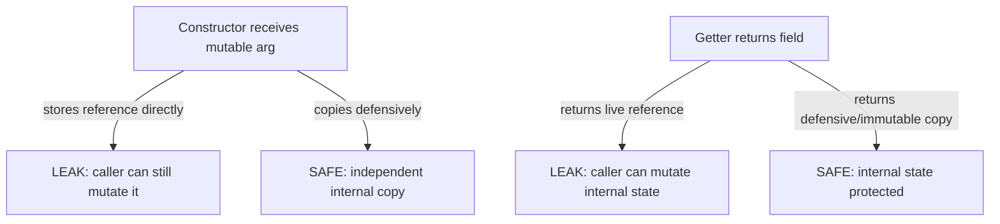

# Immutability and Defensive Copying

> **Topic register:** T-103 · IWI 5.4 · Foundation tier, High interview frequency
> **Provenance:** the trace in this chapter is real, executed output from [`practice/java/week-13/immutability/src/MutableLeakDemo.java`](../../practice/java/week-13/immutability/src/MutableLeakDemo.java) on OpenJDK 21.0.12.

## Table of Contents

1. [Learning Objectives](#learning-objectives)
2. [Why This Matters in Interviews](#why-this-matters-in-interviews)
3. [Mental Model](#mental-model)
4. [Definition and Purpose](#definition-and-purpose)
5. [Core Concepts](#core-concepts)
6. [Internal Implementation](#internal-implementation)
7. [Diagrams](#diagrams)
8. [Java Examples](#java-examples)
9. [Production Scenarios](#production-scenarios)
10. [Trade-offs](#trade-offs)
11. [Decision Framework](#decision-framework)
12. [Common Mistakes](#common-mistakes)
13. [Anti-Patterns](#anti-patterns)
14. [Best Practices](#best-practices)
15. [Interview Answer Framework](#interview-answer-framework)
16. [Interview Questions](#interview-questions)
17. [Summary](#summary)
18. [Key Takeaways](#key-takeaways)
19. [Cheat Sheet](#cheat-sheet)
20. [Flashcards](#flashcards)
21. [Practice Exercises](#practice-exercises)
22. [Solutions](#solutions)
23. [Additional Reading](#additional-reading)
24. [Official References](#official-references)

---

## Learning Objectives

By the end of this chapter you can:

- Identify both places a "final-fields-only" class can still leak mutability, with real measured examples.
- Apply defensive copying correctly on both construction and retrieval.
- Explain why `List.copyOf()` is stronger than a plain defensive copy (it rejects mutation outright, rather than merely being independent of the original).
- Connect immutability directly to thread-safety guarantees without synchronization.

## Why This Matters in Interviews

This topic tests whether "immutable" is understood as a structural guarantee or just a naming convention (`final` fields, no setters). A class can look immutable by every surface signal and still leak a mutable reference through its constructor or a getter — and that leak is exactly the kind of subtle correctness bug that shows up in real production incidents involving shared mutable state, which is why interviewers use it to probe beyond the textbook definition.

## Mental Model

**A class is only as immutable as its most permissive point of entry or exit for mutable state.** `final` fields prevent *reassignment* of the field itself, but say nothing about whether the object the field points to can still be mutated by someone else who holds a reference to it — either because they handed it to the constructor and kept a reference, or because a getter handed it back out. True immutability requires defensive copying at both boundaries: on the way in (constructor) and on the way out (any getter that would otherwise return a live reference to internal mutable state).

## Definition and Purpose

An object is **immutable** if its observable state cannot change after construction. **Defensive copying** is the technique of copying a mutable object (rather than storing or returning a direct reference to it) at the two places a reference could otherwise leak: when a mutable argument is received in a constructor, and when a getter would otherwise hand out a live reference to internal mutable state.

Immutability exists because shared mutable state is a major source of bugs — both obvious ones (a caller mutates an object expecting it to be independent) and subtle ones (an object silently changes underneath code that assumed it wouldn't), and because immutable objects are automatically thread-safe with no synchronization needed at all, since there is no mutation to race on.

## Core Concepts

### `final` fields don't prevent the referenced object from being mutated

A `final Date when` field can never be reassigned to point at a different `Date`, but the `Date` object it points to is itself mutable (`setTime()`) — nothing about `final` prevents that.

### A leak on the way in: the constructor storing the caller's reference directly

If a constructor does `this.when = when;` instead of copying, the caller retains the ability to mutate the exact object the class now considers its own internal state.

### A leak on the way out: a getter returning the live internal reference

If a getter does `return attendees;` on a mutable `List` field, external code that calls the getter can mutate the class's own internal list directly, bypassing every method the class provides for controlled mutation (or lack thereof).

### `List.copyOf()` is stronger than a defensive copy into a new mutable list

Copying into a new `ArrayList` prevents the *original* list from affecting the class, but the returned copy is still itself mutable if handed out directly. `List.copyOf()` produces an unmodifiable view that throws `UnsupportedOperationException` on any mutation attempt — closing both the "still mutable if returned" gap and the independence gap in one call.

## Internal Implementation

**Leak #1 — constructor storing a live reference, measured:**

```
== Leak #1: caller mutates the Date AFTER construction ==
Event date right after construction: Tue Nov 14 16:13:20 CST 2023
Event date after caller mutates the original Date object: Wed Dec 31 18:00:00 CST 1969  (changed! the constructor kept a live reference, not a copy)
```

**Leak #2 — getter returning a live reference, measured:**

```
== Leak #2: caller mutates the List returned by the getter ==
attendees before external mutation: [carol]
attendees after calling getAttendees().add("mallory") from OUTSIDE the class: [carol, mallory]  (the object's own internal list was mutated by an outsider)
```

**The fixed version, defensively copying on both construction and retrieval, measured:**

```
== The fixed, truly immutable version resists both leaks ==
Event date after caller mutates the ORIGINAL Date passed to the constructor: Tue Nov 14 16:13:20 CST 2023  (unchanged -- the constructor copied it)
getAttendees().add("mallory") threw UnsupportedOperationException  (List.copyOf() returns an immutable view -- mutation is rejected outright, not just copied)
```

## Diagrams



## Java Examples

```java
// Java 21. A truly immutable class: defensive copy on construction AND
// on every getter that would otherwise expose mutable internal state.
final class SafeEvent {
    private final Date when;
    private final List<String> attendees;

    SafeEvent(Date when, List<String> attendees) {
        this.when = new Date(when.getTime());       // copy on the way IN
        this.attendees = new ArrayList<>(attendees); // copy on the way IN
    }

    Date getWhen() { return new Date(when.getTime()); } // copy on the way OUT
    List<String> getAttendees() { return List.copyOf(attendees); } // immutable view on the way OUT
}
```

**Complexity note:** defensive copying is `O(n)` in the size of the copied structure per construction/getter call — a real, bounded cost, not free, which is why immutable record-like classes often prefer genuinely immutable types (`java.time` types instead of `Date`, `List.copyOf()` instead of repeated `ArrayList` copies) where possible to reduce the copying overhead.

## Production Scenarios

### Scenario: a shared configuration object is silently mutated by one caller, corrupting behavior for every other caller

**Symptoms.** A service loads a `Config` object once at startup and passes it by reference to multiple independent subsystems. Weeks after a refactor, one subsystem begins behaving as if a feature flag changed mid-request, even though the flag was never intentionally toggled — and other subsystems using the same `Config` instance intermittently see the same unexpected flip.

**Impact.** A shared, supposedly-static configuration silently changes at runtime, producing inconsistent behavior across subsystems that all assumed the config was immutable for the life of the process.

**Initial hypotheses.** A race condition in flag evaluation logic (checked — the flag read itself is a simple field access, no concurrency bug there); an external config-reload mechanism firing unexpectedly (checked — no reload mechanism exists in this service); one subsystem is mutating the shared `Config` object directly, since it was handed a live reference rather than a copy (correct).

**Evidence.** The `Config` class exposes its underlying `Map<String, Boolean>` of feature flags directly via a getter with no defensive copy, and a recently-added subsystem calls `config.getFlags().put(...)` internally as a local override mechanism, not realizing that `Map` is the exact same shared instance every other subsystem also holds.

**Diagnosis.** Exactly this chapter's Leak #2: a getter returning a live reference to mutable internal state, allowing one caller's local mutation to silently become global mutation, affecting every other holder of the same reference.

**Immediate mitigation.** Have the offending subsystem stop mutating the shared map directly, using a local copy for its override logic instead.

**Permanent remediation.** Change `Config.getFlags()` to return an immutable view (`Map.copyOf(flags)`), so any future attempt to mutate it fails loudly with `UnsupportedOperationException` at the point of the mistake, rather than silently corrupting shared state for every other holder.

**Alternatives considered.** Documenting "do not mutate this map" as a comment on the getter — rejected, since this chapter's whole premise is that such conventions are silently violated exactly when someone doesn't realize the object is shared; only a structural guarantee (an immutable view) actually prevents the bug.

**Trade-offs.** None meaningful — `Map.copyOf()` costs a one-time copy at construction and returns an already-immutable view thereafter, with no ongoing cost difference from the mutable version for read-only callers.

**Prevention.** Any object shared across multiple independent subsystems, especially configuration or reference data intended to be read-only, should expose its collection-typed fields via immutable views by default, not by convention.

**Interview lesson.** This is the production-scale version of this chapter's own measured Leak #2: a getter handing out a live, mutable reference, letting one caller's mutation corrupt shared state for every other holder.

## Trade-offs

| Choice | Benefit | Cost |
|---|---|---|
| Storing a caller's reference directly (no defensive copy) | Zero copying cost | The object is not actually immutable — a caller can mutate it after the fact |
| Defensive copy into a new mutable structure | Independent from the original reference | The copy itself can still be mutated if handed out directly by a getter |
| `List.copyOf()` / `Map.copyOf()` (immutable view) | Independent AND rejects mutation outright | A small one-time copy cost; mutation attempts fail at runtime rather than compile time |
| Fully immutable value types throughout (e.g., `java.time` instead of `Date`) | No defensive copying needed at all — the type itself can't mutate | Requires choosing immutable types from the start; can't retrofit onto an existing mutable-typed field without a copy step anyway |

## Decision Framework

1. **Does a constructor accept a mutable type** (a `Date`, a `List`, an array)? Copy it defensively on the way in, unless the type is itself genuinely immutable (`java.time.Instant`, a record of immutable fields).
2. **Does a getter return a field of a mutable type?** Return a defensive copy or an immutable view (`List.copyOf()`, `Map.copyOf()`), never the live internal reference.
3. **Is the object shared across multiple callers or subsystems** who might not realize it's shared? Prefer an immutable view over a plain defensive copy, so any mutation attempt fails loudly rather than being silently possible on the returned copy.
4. **Can this field's type be changed to something genuinely immutable** (e.g., `java.time` instead of `java.util.Date`)? Prefer that over ongoing defensive copying wherever the type choice is still open.

## Common Mistakes

- Believing `final` fields alone make a class immutable, without checking whether the referenced objects are themselves mutable.
- Copying on construction but not on the getter (or vice versa) — both boundaries need protection.
- Returning a new mutable copy from a getter (safer than the live reference, but still allows the caller to mutate their own copy without realizing the original class considers itself immutable — usually harmless, but weaker than an immutable view when the intent is to signal "you cannot mutate this").

## Anti-Patterns

- **`final List<String> items;` with a getter that does `return items;`** — the single most common instance of Leak #2.
- **Storing a constructor argument directly** (`this.when = when;`) for any mutable type, assuming `final` alone provides protection.
- **Assuming a class with no setters is automatically immutable**, without auditing every getter and constructor for a live-reference leak.

## Best Practices

- Defensively copy every mutable-typed constructor argument on the way in.
- Return defensive copies or immutable views from every getter exposing a mutable-typed field.
- Prefer `List.copyOf()`/`Map.copyOf()`/`Set.copyOf()` over a plain `new ArrayList<>(...)` copy when the intent is "this must never be mutated," since the immutable view fails loudly on any mutation attempt.
- Prefer genuinely immutable types (`java.time`, records of immutable fields) over mutable ones (`java.util.Date`) wherever the choice is still open, eliminating the need for defensive copying entirely.

## Interview Answer Framework

### 30-Second Answer

`final` fields prevent reassignment, not mutation of the referenced object — a class can leak mutability through its constructor (storing a caller's reference directly) or its getters (returning a live reference), measured directly in both cases. Defensive copying on both boundaries, or an immutable view like `List.copyOf()`, closes both leaks.

### 2-Minute Answer

Definition: an immutable object's observable state can't change after construction; defensive copying protects that guarantee at the constructor and getter boundaries. Why it exists: shared mutable state is a major bug source, and immutable objects are automatically thread-safe with no synchronization. How it works: a constructor storing a caller's reference directly, or a getter returning a live reference, both leak mutability even with `final` fields — measured directly, mutating the original `Date` after construction changed the "immutable" object's state. One important trade-off: `List.copyOf()` is stronger than a plain defensive copy, rejecting mutation outright rather than merely being independent. Production example: a real-shaped incident where a shared `Config` object's getter returned a live map reference, letting one subsystem's local mutation silently corrupt shared state for every other subsystem.

### 10-Minute Deep Dive

Cover, in order: the mental model — a class is only as immutable as its most permissive entry/exit point (mental model); the measured constructor-leak and getter-leak demonstrations (internals, real evidence); the measured fixed version resisting both leaks via defensive copying and `List.copyOf()` (internals, real evidence); the decision framework for when to defensively copy versus use an immutable view (decision framework); and close with the production scenario — a shared config object's getter leak silently corrupting behavior across multiple subsystems.

### Whiteboard Explanation

Draw the [§ Diagrams](#diagrams) flowchart: a constructor receiving a mutable argument, branching to "stores reference directly → LEAK" versus "copies defensively → SAFE"; a getter returning a field, branching to "live reference → LEAK" versus "defensive/immutable copy → SAFE." Circle both LEAK branches and annotate: "final fields alone protect against neither of these."

### Production Example

The shared-config corruption in [§ Production Scenarios](#production-scenarios): a `Config` getter returning a live `Map` reference let one subsystem's local mutation silently become global mutation for every other subsystem sharing the same instance.

### Trade-offs to Mention

State unprompted: defensive copying has a real, bounded `O(n)` cost per call, not free; `List.copyOf()` is stronger than a plain copy because it rejects mutation outright; choosing genuinely immutable types up front avoids the need for ongoing defensive copying entirely.

### Common Candidate Mistakes

Believing `final` fields alone guarantee immutability; defending copying on only one of the two boundaries (constructor or getter) rather than both.

### Typical Follow-Up Questions

1. "Your class has only final fields and no setters. Is it immutable? How would you check?"
2. "What's the difference between defensively copying into a new ArrayList versus using List.copyOf()?"

### Senior-Level Expectations

Correctly identifies that final fields don't prevent mutation of referenced mutable objects; proposes defensive copying at both the constructor and getter boundaries.

### Staff-Level Discussion

Immutability is one of the few Java Core disciplines that pays for itself directly in concurrency terms: an object that is genuinely immutable requires zero synchronization to share safely across threads, because there is no mutation to race on — this connects immutability directly to the Java Memory Model's safe-publication guarantee for final fields of properly constructed objects. A Staff engineer auditing a "shared, read-only" object treats every mutable-typed field as a potential leak until both its constructor and its getters are verified, because — as this chapter's production scenario shows — the failure mode is silent corruption of shared state, discovered only through inconsistent behavior far from the actual mutation site.

## Interview Questions

### Question 1 — Your class has only final fields and no setters. Is it immutable? How would you check?

**Why interviewers ask it.** Tests whether the candidate treats immutability as a structural property to verify, or a naming convention to assume.

**Expected answer.** Not necessarily — check every constructor for whether it stores a mutable-typed argument directly (versus copying it), and every getter for whether it returns a live reference to a mutable-typed field (versus a defensive copy or immutable view).

**Minimum acceptable answer.** States that final fields alone aren't sufficient, even without the precise two-boundary check.

**Strong Senior answer.** Correctly identifies that final fields don't prevent mutation of referenced mutable objects.

**Staff-level extension.** Proposes defensive copying (or immutable views) at both the constructor and getter boundaries as the systematic fix, and connects it to thread-safety without synchronization.

**Common mistakes.** Assuming `final` fields plus no setters is sufficient proof of immutability.

**Likely follow-ups.** "What's the difference between defensively copying into a new ArrayList versus using List.copyOf()?"

**Evaluation criteria (1–5).** 1: assumes final-fields-only is sufficient. 3: correctly identifies both leak points. 5: correct identification plus the thread-safety connection.

**Related references.** [§ Internal Implementation](#internal-implementation).

---

### Question 2 — What's the difference between defensively copying into a new `ArrayList` versus using `List.copyOf()`?

**Why interviewers ask it.** Tests whether the candidate understands the specific, stronger guarantee `copyOf()` provides.

**Expected answer.** A new `ArrayList` copy is independent of the original (mutating the source doesn't affect it), but the copy itself is still mutable if handed out directly. `List.copyOf()` produces an unmodifiable view that throws `UnsupportedOperationException` on any mutation attempt — both independent AND immutable.

**Minimum acceptable answer.** States that `List.copyOf()` is somehow "more immutable," even without the precise mechanism.

**Strong Senior answer.** Correctly explains both the independence and the mutation-rejection properties.

**Staff-level extension.** Connects this to the general principle that a structural guarantee (an exception on mutation attempt) is stronger and more debuggable than a convention (a copy that happens to not be mutated by well-behaved callers), since a violation surfaces immediately and loudly rather than silently.

**Common mistakes.** Treating the two approaches as equivalent since both "copy" the data.

**Likely follow-ups.** "When would you still prefer a plain mutable copy over an immutable view?"

**Evaluation criteria (1–5).** 1: treats them as equivalent. 3: correctly explains both properties. 5: correct explanation plus the structural-guarantee-vs-convention framing.

**Related references.** [§ Core Concepts](#core-concepts); [§ Java Examples](#java-examples).

## Summary

A class with only `final` fields is not automatically immutable — mutability can leak through a constructor that stores a caller's mutable reference directly, or a getter that returns a live reference to internal mutable state, both measured directly in this chapter. Defensive copying at both boundaries closes the leak; `List.copyOf()` (and its `Map`/`Set` equivalents) is stronger still, rejecting any mutation attempt outright rather than merely being independent of the original.

## Key Takeaways

- `final` fields prevent reassignment, not mutation of the object they reference.
- A constructor storing a mutable argument directly, or a getter returning a live mutable reference, both leak mutability.
- Defensive copying at both boundaries (constructor and getter) is required for genuine immutability.
- `List.copyOf()`/`Map.copyOf()`/`Set.copyOf()` reject mutation outright, a stronger guarantee than a plain defensive copy.

## Cheat Sheet

| Check | If missing, the class isn't truly immutable |
|---|---|
| Does the constructor copy every mutable-typed argument? | Constructor-side leak |
| Does every getter return a copy or immutable view, not the live field? | Getter-side leak |
| Is `List.copyOf()`/equivalent used rather than a plain mutable copy, where mutation should be rejected outright? | Weaker guarantee than intended |

## Flashcards

### Card: What final fields do and don't guarantee

**Prompt:**
Do `final` fields alone make a class immutable?

**Answer:**
No — `final` prevents reassigning the field, but the object it references can still be mutated if a live reference leaks through the constructor or a getter.

**Why it matters:**
The single most common misconception about Java immutability.

**Common trap:**
Treating "all fields final, no setters" as sufficient proof of immutability.

**Related:**
[Internal Implementation](#internal-implementation)

### Card: The two leak points

**Prompt:**
What are the two places a supposedly-immutable class can leak mutability?

**Answer:**
The constructor (storing a caller's mutable reference directly) and a getter (returning a live reference to internal mutable state).

**Why it matters:**
Both must be defensively copied for genuine immutability.

**Common trap:**
Fixing only one of the two boundaries.

**Related:**
[Internal Implementation](#internal-implementation)

### Card: Why List.copyOf() is stronger than a plain copy

**Prompt:**
Why is `List.copyOf()` stronger than copying into a new `ArrayList`?

**Answer:**
It rejects any mutation attempt outright (`UnsupportedOperationException`), not just providing independence from the original list.

**Why it matters:**
A structural guarantee (loud failure on violation) is stronger than a convention (a mutable copy nobody's supposed to mutate).

**Common trap:**
Treating a plain defensive copy as equivalent to an immutable view.

**Related:**
[Core Concepts](#core-concepts)

## Practice Exercises

1. Reproduce: [`MutableLeakDemo.java`](../../practice/java/week-13/immutability/src/MutableLeakDemo.java).
2. Add a third leak to the demo: a constructor that stores an array field (`private final int[] scores`) directly rather than cloning it, and demonstrate the same class of bug with `int[]` instead of `List`/`Date`.
3. Rewrite `LeakyEvent` to use `java.time.Instant` instead of `java.util.Date` for the `when` field, and explain why this eliminates the need for defensive copying on that field specifically.

## Solutions

**Exercise 1.** Expected output matches this chapter's measured traces: both leaks reproduce (the event's date changes after external mutation of the original `Date`; the attendees list gains an externally-added entry), and the fixed version resists both.

**Exercise 2.** An `int[]` field stored directly via `this.scores = scores;` (not `scores.clone()`) lets a caller mutate the array's elements after construction (`scores[0] = 999;`) and see that change reflected in the "immutable" object's state — arrays are mutable reference types just like `List`/`Date`, and `final` on the field reference does nothing to protect the array's contents.

**Exercise 3.** `java.time.Instant` (and the rest of the `java.time` package) is itself genuinely immutable — every "mutating" method (`plusSeconds()`, etc.) returns a new `Instant` rather than modifying the receiver. Storing an `Instant` directly (no copy needed) is safe because there is no way for a caller to mutate the object after handing it to the constructor; the entire defensive-copying discipline exists only because `java.util.Date` (a legacy, genuinely mutable type) requires it.

## Additional Reading

- Joshua Bloch, *Effective Java*, Item 17 ("Minimize mutability") and Item 50 ("Make defensive copies when needed")

## Official References

- [java.util.List#copyOf (Java 21 API)](https://docs.oracle.com/en/java/javase/21/docs/api/java.base/java/util/List.html#copyOf(java.util.Collection))
