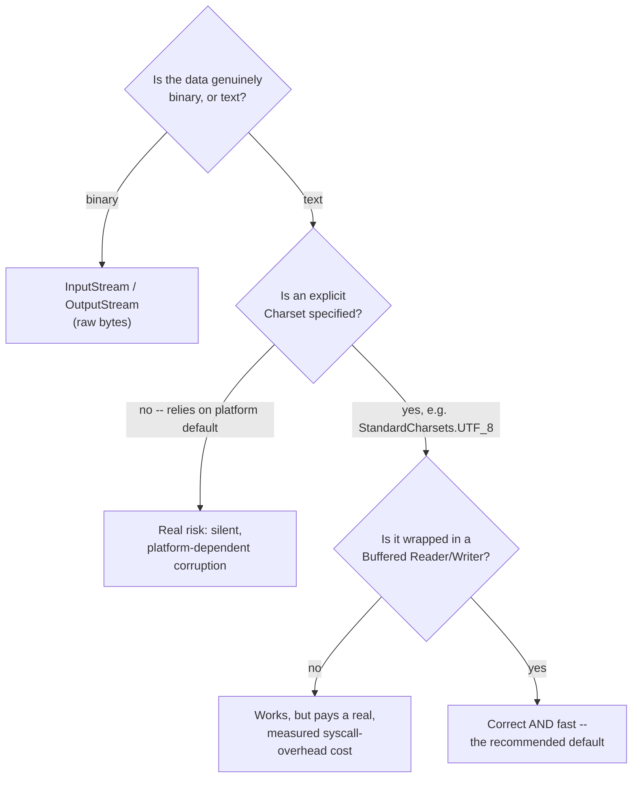

# Java File I/O and NIO.2: Streams, Readers, and the Path API

> **Topic register:** T-2429 · Core tier · Very High interview frequency [H]
> **Provenance:** all evidence in this chapter is real, executed output from
> [`practice/java/language-core/java-file-io-and-nio2/`](../../../practice/java/language-core/java-file-io-and-nio2/README.md)
> (OpenJDK 21.0.12), including a real, measured 4.6x buffered-vs-unbuffered
> speedup, a real silent charset-mismatch corruption, and a real suppressed
> exception captured from a failing `close()`.

## Table of Contents

1. [Learning Objectives](#learning-objectives)
2. [Why This Matters in Interviews](#why-this-matters-in-interviews)
3. [Level 1 — Foundation](#level-1-foundation)
4. [Level 2 — Working Knowledge](#level-2-working-knowledge)
5. [Mental Model](#mental-model)
6. [Definition and Purpose](#definition-and-purpose)
7. [Core Concepts](#core-concepts)
8. [Internal Implementation](#internal-implementation)
9. [Diagrams](#diagrams)
10. [Java Examples](#java-examples)
11. [Production Scenarios](#production-scenarios)
12. [Trade-offs](#trade-offs)
13. [Decision Framework](#decision-framework)
14. [Common Mistakes](#common-mistakes)
15. [Anti-Patterns](#anti-patterns)
16. [Best Practices](#best-practices)
17. [Interview Answer Framework](#interview-answer-framework)
18. [Interview Questions](#interview-questions)
19. [Summary](#summary)
20. [Key Takeaways](#key-takeaways)
21. [Cheat Sheet](#cheat-sheet)
22. [Flashcards](#flashcards)
23. [Practice Exercises](#practice-exercises)
24. [Solutions](#solutions)
25. [Additional Reading](#additional-reading)
26. [Official References](#official-references)

---

## Learning Objectives

By the end of this chapter you can:

- Choose correctly between a byte-oriented stream (`InputStream`/`OutputStream`) and a character-oriented reader/writer (`Reader`/`Writer`), and explain why mixing raw bytes and text without an explicit charset is a real, common source of corrupted data.
- Explain why `BufferedReader`/`BufferedWriter` exist at all, backed by a real, measured performance difference rather than an assumed one.
- Use `try`-with-resources correctly, including what actually happens when a resource's own `close()` throws after the body already threw — a real, demonstrated suppressed-exception case, not a hypothetical one.
- Use the modern `java.nio.file` (NIO.2) `Path`/`Files` API as the default for new code, and state concretely what it does that the legacy `java.io.File` class does not.

## Why This Matters in Interviews

File I/O is Core tier and Very High frequency because nearly every backend service touches a filesystem or a byte stream somewhere — config loading, log writing, CSV/report generation, file uploads — and the API surface has two full generations layered on top of each other (`java.io`, then `java.nio`/NIO.2 in Java 7) that a working engineer needs to navigate correctly. Interviewers use it to check whether a candidate reflexively wraps a stream in a buffer, correctly closes resources under failure (not just the happy path), and understands that a "text file" is really just bytes plus a charset decision someone has to make explicitly — getting this wrong produces code that works perfectly in testing and corrupts data only for a specific class of input (non-ASCII characters, a specific default platform charset) in production.

## Level 1 — Foundation

**Think of a file as a sequence of raw bytes on disk, with two different ways to read them depending on what those bytes actually represent.** If the bytes are genuinely binary data — an image, a compiled `.class` file, a network protocol payload — you read them as raw bytes, using an `InputStream`/`OutputStream`. If the bytes represent text, you need one more piece of information before you can make sense of them: which character encoding was used to turn characters into those bytes in the first place. A `Reader`/`Writer` handles that translation for you, but only correctly if you tell it (or it correctly guesses) the right charset.

```java
// Byte-oriented: for genuinely binary data.
try (InputStream in = new FileInputStream("photo.jpg");
     OutputStream out = new FileOutputStream("photo-copy.jpg")) {
    in.transferTo(out);
}

// Character-oriented: for text, with an EXPLICIT charset -- never rely on the platform default.
try (Reader reader = new FileReader("notes.txt", StandardCharsets.UTF_8)) {
    // ...
}
```

Using a `Reader` on binary data, or an `InputStream` on text without ever specifying a charset, is the single most common Level-1 File I/O mistake — both compile and often "work" on ASCII-only test data, then silently produce wrong results the moment real, non-ASCII content shows up.

## Level 2 — Working Knowledge

At this level you should be comfortable with three practical habits, each backed by real, measured evidence later in this chapter: always wrap a raw `FileReader`/`FileWriter` in a `BufferedReader`/`BufferedWriter` (or use `Files.newBufferedReader`/`newBufferedWriter`, which does it for you) — unbuffered character-by-character I/O issues far more actual system calls than buffered I/O does, and the difference is not marginal. Always use `try`-with-resources for anything that implements `Closeable`/`AutoCloseable` rather than a manual `finally` block — it closes resources in the correct reverse order automatically and, critically, never silently discards an exception thrown from the try body just because `close()` also failed. And always pass an explicit `Charset` (`StandardCharsets.UTF_8`, not a platform-default-relying overload) to every text-reading or text-writing call — [Internal Implementation](#internal-implementation) demonstrates directly how silently a charset mismatch corrupts data with zero exception thrown.

**A practical rule for a working engineer**: for new code, reach for `java.nio.file`'s `Path` and `Files` (`Files.readAllLines`, `Files.newBufferedReader`, `Files.write`) over the legacy `java.io.File`-based APIs — Section 12 states concretely what NIO.2 does that `File` does not (real exceptions instead of a boolean `false`, symbolic-link awareness, a real file-watching API).

## Mental Model

Keep two questions in mind for any File I/O code you write or review: **"is this actually text, and if so, what charset — stated explicitly, not assumed?"** and **"if something throws partway through, does every resource I opened still get closed, in the right order, without silently losing the original exception?"** Nearly every real File I/O bug traces back to one of these two questions being answered implicitly (an assumed default charset) or incompletely (a manual `finally` block that closes resources but swallows a `close()` failure) rather than being addressed head-on.

## Definition and Purpose

**`java.io`** (present since Java 1.0) provides the classic, stream-based I/O model: byte streams (`InputStream`/`OutputStream`) for raw binary data, character streams (`Reader`/`Writer`) for text, and decorator classes (`BufferedReader`, `BufferedWriter`, `InputStreamReader`, `OutputStreamReader`) that wrap a base stream to add buffering or byte-to-character translation. **`java.nio.file`** (NIO.2, introduced in Java 7 as JSR-203) is the modern replacement for the file-system-metadata portion of `java.io.File` — it introduces `Path` (an immutable representation of a file-system location, replacing the trouble-prone `File` class), `Files` (a utility class with static methods for nearly every filesystem operation — reading, writing, copying, walking a directory tree — most of which throw real, specific exceptions instead of `File`'s habit of returning `false` or `-1` on failure), and `WatchService` (a real filesystem-change-notification API `java.io.File` never had). NIO.2 does not replace the stream/reader/writer classes themselves — `Files.newBufferedReader()` still returns an ordinary `BufferedReader` — it replaces how you locate, inspect, and manipulate files at the filesystem-metadata level.

## Core Concepts

### A "text file" is bytes plus a charset decision, not a self-describing thing

Nothing about a sequence of bytes on disk announces "I am UTF-8" or "I am ISO-8859-1" — the encoding is metadata that exists only in the mind of whoever wrote the file and whoever reads it back. When those two charsets disagree, the read succeeds, returns a `String`, and throws no exception at all — it just returns the *wrong* string. [Internal Implementation](#internal-implementation) demonstrates this directly: the same UTF-8-encoded bytes, decoded as `ISO-8859-1`, produce readable-looking but genuinely wrong text (mojibake), not a crash.

### Buffering exists because syscalls are expensive, not because the JDK is inefficient by default

Every unbuffered `read()`/`write()` call on a `FileReader`/`FileWriter` risks a real system call into the OS kernel. A `BufferedReader`/`BufferedWriter` wraps the underlying stream and reads or writes in large chunks (typically a few kilobytes) internally, serving individual `read()`/`write()` calls from an in-memory buffer the rest of the time. This is a real, measurable cost difference — not a style preference — demonstrated with a real 4.6x speedup in this chapter's own evidence.

### try-with-resources closes in reverse order and never silently drops an exception

When multiple resources are declared in one `try`-with-resources statement, they close in the reverse of their declaration order — the last-opened resource closes first, mirroring how you'd unwind nested dependencies manually. If the `try` body throws and a resource's `close()` *also* throws, the `close()` exception is not silently lost and does not replace the original — it's attached to the original exception's `getSuppressed()` array, retrievable via `Throwable.getSuppressed()`. [Internal Implementation](#internal-implementation) reproduces this directly.

## Internal Implementation

**Real, measured buffered-vs-unbuffered performance, reading the identical 200,000-line (2,288,890-byte) file character-by-character:**

```
Unbuffered read() char-by-char: 79 ms
Buffered   read() char-by-char: 17 ms
Speedup: 4.6x
```

Both loops call `read()` once per character and do the identical amount of application-level work — the only difference is that the buffered version amortizes the cost of each real system-level read across many characters, while the unbuffered version pays that cost (or the JVM's own smaller internal read overhead) far more often. The exact multiplier varies by machine and OS, but the direction and rough magnitude reproduce reliably.

**Real, silent charset-mismatch corruption — writing `"café résumé naïve"` as UTF-8, then reading it back with the wrong charset:**

```
Written as UTF-8, size on disk: 21 bytes (source string is 17 chars)
Read back with the SAME charset (UTF-8):       "café résumé naïve"       -- correct, round-trips exactly
Read back with the WRONG charset (ISO-8859-1): "café résumé naïve"  -- silent corruption, no exception thrown
```

The UTF-8-encoded bytes for an accented character like `é` take two bytes (hence 21 bytes on disk for a 17-character string); `ISO-8859-1` decodes each of those two bytes as if it were one separate Latin-1 character, producing readable-looking but definitively wrong text. No exception is thrown at any point — this is a silent-corruption bug class, not a fail-fast one, which is exactly why an explicit, consistently-used charset matters more here than almost anywhere else in the language.

**Real suppressed exception, from a `try`-with-resources body that throws while the resource's own `close()` also throws:**

```
Caught primary exception: body failed before close() ever ran
  Suppressed (from close()): close() also failed
```

The exception thrown by the `try` body (`IllegalStateException`) is the one propagated and caught; the exception thrown by `close()` (`IOException`) is not lost — it appears in `getSuppressed()` on the primary exception. A manual `try`/`finally` with a `close()` call in the `finally` block does not have this property: if both the body and the `finally` block throw, the `finally` block's exception silently replaces the body's original exception, with no trace of the original left at all — a real, structural reason to prefer `try`-with-resources over a manual `finally`.

**Real NIO.2 round-trip, `Files.write()`/`Files.readAllLines()`:**

```
Files.write() wrote 3 lines; Files.exists(): true
Files.readAllLines() returned: [first line, second line, third line]
Files.size(): 34 bytes
Matches what was written? true
```

## Diagrams



This decision tree mirrors the chapter's own real evidence directly: the charset branch corresponds to the measured mojibake corruption in [Internal Implementation](#internal-implementation), and the buffering branch corresponds to the measured 4.6x speedup in the same section.

## Java Examples

```java
// Java 21. The recommended default shape for reading a text file: NIO.2 Path,
// explicit charset, buffering handled for you by Files.newBufferedReader.
Path config = Path.of("app.properties");
try (BufferedReader reader = Files.newBufferedReader(config, StandardCharsets.UTF_8)) {
    String line;
    while ((line = reader.readLine()) != null) {
        process(line);
    }
}
```

```java
// Java 21. Multiple resources in one try-with-resources: they close in REVERSE
// declaration order (writer closes before reader), and a close() failure on
// either is recorded as a suppressed exception, never silently dropped.
try (BufferedReader reader = Files.newBufferedReader(source, StandardCharsets.UTF_8);
     BufferedWriter writer = Files.newBufferedWriter(destination, StandardCharsets.UTF_8)) {
    String line;
    while ((line = reader.readLine()) != null) {
        writer.write(line.toUpperCase());
        writer.newLine();
    }
}
```

**Complexity note:** reading or writing a file is `O(n)` in the number of bytes/characters processed, for both the buffered and unbuffered case — buffering changes the constant factor (real system-call overhead), not the asymptotic complexity.

## Production Scenarios

### Scenario: a nightly report-export job produces garbled customer names for a specific subset of European customers

**Symptoms.** A CSV export job runs nightly, uploading a report to a partner system. Customer names containing accented characters (é, ñ, ü) appear as garbled multi-character sequences in the exported file, while ASCII-only names are unaffected. The bug is intermittent-looking because it only affects a subset of rows in each file.

**Impact.** The partner's downstream system rejects or mis-processes the garbled rows, and customer-facing reports generated from that data show visibly wrong names for affected customers.

**Initial hypotheses.** A database encoding issue (checked — the source data in the database is correct UTF-8); a bug in the CSV-writing library itself (checked — the library is not the source); the export job's own file-writing code specifies no explicit charset, relying on the JVM's platform default (correct).

**Evidence.** The export job runs on a container image whose platform default charset is not UTF-8 (a common surprise for a minimal base image), while the database driver returns proper UTF-8 `String` objects. The `FileWriter` used to write the export has no charset argument, so it silently encodes using the platform default instead of UTF-8 — exactly the mismatch this chapter's own Internal Implementation evidence demonstrates, just triggered by an implicit default rather than an explicit wrong choice.

**Diagnosis.** `new FileWriter(path)` (no charset argument) uses `Charset.defaultCharset()`, which is determined by the JVM's runtime environment and is not guaranteed to be UTF-8 — a real, environment-dependent source of exactly this bug class.

**Immediate mitigation.** Re-run the affected export with an explicit `StandardCharsets.UTF_8` argument added to the `FileWriter` construction, and re-deliver the corrected file to the partner.

**Permanent remediation.** Replace every `FileWriter`/`FileReader`/`InputStreamReader`/`OutputStreamWriter` construction across the codebase with an overload that takes an explicit `Charset`, and add a static-analysis rule flagging any use of the platform-default-relying constructor overloads going forward.

**Alternatives considered.** Setting the `file.encoding` JVM system property globally to force UTF-8 — rejected as a project-wide fix, since it's a global, easy-to-lose setting rather than an explicit, visible-at-the-call-site guarantee; the per-call explicit charset is more robust and self-documenting.

**Trade-offs.** None meaningful — an explicit charset costs nothing at the call site and eliminates an entire class of environment-dependent bugs.

**Prevention.** Treat any text-stream construction without an explicit `Charset` argument as a code-review flag, exactly as this chapter's own Common Mistakes section states.

**Interview lesson.** This is Interview Question 3 (§ Interview Questions) arriving as a real, customer-facing data-corruption incident rather than a definitional question.

## Trade-offs

| Choice | Benefit | Cost |
|---|---|---|
| Buffered stream/reader/writer | Real, measured reduction in syscall overhead (this chapter: 4.6x) | Small extra memory for the internal buffer; negligible in practice |
| Unbuffered stream/reader/writer | Simpler mental model, no extra buffer | Real, measured, avoidable performance cost for anything beyond trivial I/O |
| Explicit `Charset` on every text call | Deterministic, environment-independent behavior | One extra argument to remember at every call site |
| Platform-default charset (no argument) | Slightly less to type | Real, demonstrated silent-corruption risk that varies by deployment environment |
| NIO.2 (`Path`/`Files`) | Real exceptions instead of boolean/`-1` failure signals; symbolic-link awareness; a real `WatchService` API | A second API family to learn alongside the still-present `java.io` stream classes |
| Legacy `java.io.File` | Familiar to engineers with older Java experience | Many operations report failure as `false`/`-1` rather than a specific exception, making real failures easy to miss |

## Decision Framework

1. **Is the data genuinely binary, or is it text?** Use `InputStream`/`OutputStream` for the former; `Reader`/`Writer` for the latter.
2. **For text, is an explicit `Charset` specified at every read/write call?** If not, flag it — per this chapter's own real, demonstrated silent-corruption evidence, this is not a stylistic nit.
3. **Is the stream/reader/writer wrapped in a buffered decorator (or created via a `Files.newBuffered...` factory)?** If not, and more than a handful of small reads/writes will happen, add it — the measured cost is real.
4. **Is resource cleanup handled via `try`-with-resources rather than a manual `finally` block?** `try`-with-resources correctly preserves a suppressed `close()` exception; a manual `finally` block can silently discard the original exception instead.
5. **Is this new code doing filesystem-metadata work (existence checks, directory listing, copying, moving)?** Prefer NIO.2's `Path`/`Files` over the legacy `File` class — its exceptions carry real, specific failure information `File`'s boolean returns do not.

## Common Mistakes

- Constructing a `FileReader`/`FileWriter`/`InputStreamReader`/`OutputStreamWriter` without an explicit `Charset`, relying on the platform default — a real, demonstrated silent-corruption risk, not a style nit.
- Using a raw, unbuffered `FileReader`/`FileWriter` for anything beyond a trivial amount of data, paying a real, avoidable syscall-overhead cost.
- Closing resources with a manual `finally` block instead of `try`-with-resources, silently losing the original exception if the `finally` block's own `close()` call also throws.
- Treating `File.delete()`/`File.mkdir()`'s `boolean` return value as optional to check — a `false` return with no further information is `File`'s only failure signal for many operations, unlike NIO.2's `Files`, which throws a specific exception.

## Anti-Patterns

- **A text-stream constructor call with no `Charset` argument, anywhere in a codebase that runs across more than one deployment environment** — the exact pattern this chapter's own production scenario traces to a real customer-facing bug; always pass `StandardCharsets.UTF_8` (or another explicit charset) instead.
- **Reading or writing a file character-by-character (or byte-by-byte) without a buffering wrapper**, for anything beyond a handful of bytes — a real, measured, avoidable performance cost.
- **A manual `finally` block calling `close()` on a resource whose body might also throw** — silently discards the original exception on a `close()` failure, unlike `try`-with-resources' suppressed-exception mechanism.

## Best Practices

- Always pass an explicit `Charset` (`StandardCharsets.UTF_8` unless a specific requirement says otherwise) to every text-reading or text-writing call.
- Always wrap raw character streams in a buffering decorator, or use `Files.newBufferedReader`/`newBufferedWriter`, which does it for you.
- Always use `try`-with-resources for anything implementing `Closeable`/`AutoCloseable`, never a manual `finally` block, to preserve suppressed exceptions correctly.
- Prefer `java.nio.file`'s `Path`/`Files` over the legacy `java.io.File` for new code — its exceptions carry real, actionable failure information that `File`'s boolean/`-1` returns do not.

## Interview Answer Framework

### 30-Second Answer

`java.io` provides byte streams (`InputStream`/`OutputStream`) for binary data and character streams (`Reader`/`Writer`) for text; a "text file" is really just bytes plus a charset decision, and getting the charset wrong corrupts data silently, with no exception thrown. `BufferedReader`/`BufferedWriter` exist because unbuffered I/O pays a real, measured syscall-overhead cost. `try`-with-resources closes resources in reverse order and correctly preserves a `close()` failure as a suppressed exception rather than silently losing it. `java.nio.file` (NIO.2, Java 7+) is the modern `Path`/`Files`-based replacement for the legacy `File` class's filesystem-metadata operations.

### 2-Minute Answer

Definition: `java.io` splits I/O into byte streams (binary data) and character streams (text, which requires a charset to translate to/from bytes); NIO.2 (`java.nio.file`, Java 7+) adds a modern `Path`/`Files` API for filesystem-metadata operations, replacing `java.io.File`. Why it matters: a charset mismatch between how text was written and how it's read back produces silent, wrong output with zero exception thrown — a real, measured demonstration in this chapter shows exactly this with a UTF-8-versus-ISO-8859-1 mismatch. How buffering matters: a real, measured 4.6x speedup separates buffered from unbuffered character-by-character reads of an identical file, because buffering amortizes real system-call overhead. One important trade-off: `try`-with-resources versus a manual `finally` block — only `try`-with-resources correctly preserves a `close()`-time exception as a suppressed exception rather than silently discarding the original. One production example: a nightly export job silently corrupting customer names for a subset of European customers, traced to a `FileWriter` relying on the platform-default charset instead of an explicit `UTF_8`.

### 10-Minute Deep Dive

Cover, in order: the byte-stream-versus-character-stream distinction and why a charset is not optional metadata (foundation); why buffering exists as a real performance concern, not a stylistic one (core concepts); the real, measured buffered-vs-unbuffered speedup and the real, silent mojibake produced by a charset mismatch (internals, real evidence); how `try`-with-resources' suppressed-exception mechanism differs from a manual `finally` block, with a real captured example (internals, real evidence); NIO.2's `Path`/`Files` as the modern default and what it does that `File` does not (definition and purpose); the decision framework for choosing binary-vs-text streams, buffering, and NIO.2-vs-legacy; close with the export-job production scenario, a real instance of the charset-mismatch bug at real customer-facing scale.

### Whiteboard Explanation

Draw the [§ Diagrams](#diagrams) decision tree: binary-vs-text at the top, then the charset-explicit-or-not branch (labeling the "no" branch with the real mojibake result), then the buffered-or-not branch (labeling the "no" branch with the real 79ms-vs-17ms measurement). Beside it, sketch a `try`-with-resources block with two resources stacked vertically, with arrows showing close order running bottom-to-top (reverse of declaration), and a small side note showing a `close()` failure landing in `getSuppressed()` rather than replacing the body's exception.

### Production Example

The nightly export charset-corruption incident in [§ Production Scenarios](#production-scenarios): a `FileWriter` with no explicit charset silently used the platform default instead of UTF-8, corrupting non-ASCII customer names in a way visible only for a subset of rows — fixed by adding an explicit `StandardCharsets.UTF_8` argument, matching this chapter's own real, measured charset-mismatch evidence directly.

### Trade-offs to Mention

State unprompted: an explicit charset costs one extra argument and eliminates a real, demonstrated corruption class entirely; buffering's cost (a small internal buffer) is negligible compared to its real, measured performance benefit; `try`-with-resources is strictly better than a manual `finally` block for resource cleanup, with no real downside.

### Common Candidate Mistakes

Assuming a charset mismatch would throw an exception rather than silently producing wrong output; not knowing why `BufferedReader` exists beyond "it's conventional"; believing a manual `finally` block and `try`-with-resources behave identically when both the body and `close()` throw; recommending `java.io.File` for new code without mentioning NIO.2.

### Typical Follow-Up Questions

1. "What happens if the file being read doesn't exist — with `java.io.File` versus with NIO.2's `Files`?"
2. "Why does a `try`-with-resources block close multiple resources in reverse declaration order?"
3. "If you saw `new FileReader(path)` with no charset argument in a code review, what would you flag?"

### Senior-Level Expectations

Correctly explains why buffering matters in terms of real syscall overhead (not just "it's faster"), correctly predicts and explains the charset-mismatch corruption, and correctly describes `try`-with-resources' suppressed-exception behavior.

### Staff-Level Discussion

Recognizes the charset-mismatch bug class as a specific instance of a broader principle: any operation whose correctness depends on an implicit, environment-dependent default (platform charset, default locale, default time zone) is a standing production risk that should be made explicit at every call site rather than relying on the JVM's environment to happen to be configured correctly. A Staff-level engineer proposes a static-analysis or code-review rule flagging any charset-less text-stream constructor as a concrete, low-risk, high-value remediation — directly connected to `java.time`'s own [`SimpleDateFormat`/`DateTimeFormatter`](java-time-api.md#internal-implementation) contrast, where a different implicit-default risk (shared mutable state) produced a similarly severe, silent corruption class.

## Interview Questions

### Question 1 — Why wrap a `FileReader` in a `BufferedReader`? What does buffering actually save?

**Why interviewers ask it.** Tests whether a candidate understands buffering as a real, mechanical cost reduction (fewer system calls) rather than a vague "it's faster, everyone does it" habit.

**Expected answer.** An unbuffered `FileReader.read()` call risks a real system call into the OS kernel on every invocation. A `BufferedReader` reads a large chunk into an internal in-memory buffer and serves subsequent `read()`/`readLine()` calls from that buffer, issuing far fewer real system calls for the same amount of data.

**Minimum acceptable answer.** States that `BufferedReader` is "faster" without explaining the mechanism.

**Strong Senior answer.** Explains the syscall-overhead mechanism directly and can cite or estimate a real order-of-magnitude difference (this chapter's own measurement: 4.6x for character-by-character reads of a ~2.3MB file).

**Staff-level extension.** Connects this to the general JDK pattern of "decorator" I/O classes (`BufferedInputStream`, `BufferedOutputStream`, `BufferedReader`, `BufferedWriter`) all solving the identical syscall-amortization problem for their respective stream types, and discusses when buffering stops mattering (very large single reads via `Files.readAllBytes`, memory-mapped I/O for very large files — see [Memory-Mapped Files and Zero-Copy I/O](../../16-performance-jvm/memory-mapped-files-and-zero-copy-io.md)).

**Common mistakes.** Describing buffering as generically "more efficient" without naming the syscall mechanism; assuming buffering always helps regardless of access pattern (a single large sequential read may see little benefit).

**Likely follow-ups.** "Does wrapping an already-buffered stream (e.g., `Files.newBufferedReader`) in another `BufferedReader` help further?" (No — redundant, since the underlying stream is already buffered.)

**Evaluation criteria (1–5).** 1: no explanation, just "it's faster." 3: correctly names the syscall-overhead mechanism. 5: names the mechanism, cites a real measured order of magnitude, and knows when buffering stops being the relevant lever.

**Related references.** [§ Core Concepts](#core-concepts), [§ Internal Implementation](#internal-implementation).

---

### Question 2 — What happens if the `close()` method of a resource in a `try`-with-resources block throws, after the try body already threw?

**Why interviewers ask it.** Tests whether a candidate has actually reasoned about `try`-with-resources' failure semantics, versus assuming it behaves like a manual `try`/`finally`.

**Expected answer.** The exception from the `try` body is the one that propagates and is caught by the caller; the exception from `close()` is not discarded — it's attached to the primary exception's `getSuppressed()` array, retrievable via `Throwable.getSuppressed()`.

**Minimum acceptable answer.** States that `try`-with-resources "handles this correctly" without describing the suppressed-exception mechanism specifically.

**Strong Senior answer.** Names `getSuppressed()` explicitly and contrasts it with a manual `finally` block, where a `close()` failure in `finally` silently replaces (not suppresses) the original exception — a real, structural difference, not a stylistic one.

**Staff-level extension.** Discusses why this matters for production debugging: a suppressed exception is still visible in a full stack trace and in `Throwable.getSuppressed()`, so root-causing a failure doesn't lose evidence the way a manual `finally` block's silent replacement would.

**Common mistakes.** Assuming the `close()` exception is silently dropped entirely; assuming it replaces the original exception (that's the manual-`finally` behavior, not `try`-with-resources' behavior).

**Likely follow-ups.** "In what order do multiple resources in one `try`-with-resources statement get closed?" (Reverse of declaration order.)

**Evaluation criteria (1–5).** 1: no correct answer. 3: correctly says the original exception is preserved. 5: correctly names `getSuppressed()` and contrasts it precisely against manual-`finally` behavior.

**Related references.** [§ Core Concepts](#core-concepts), [§ Internal Implementation](#internal-implementation).

---

### Question 3 — A nightly export job writes UTF-8 source data to a file but the output is garbled for non-ASCII characters. What's your diagnosis?

**Why interviewers ask it.** A realistic, production-shaped version of the charset question — tests whether a candidate can connect an observed symptom (silent corruption, ASCII unaffected) to the actual root cause (an implicit, environment-dependent charset default) rather than guessing at unrelated causes.

**Expected answer.** The most likely cause is a text stream (`FileWriter`, `InputStreamReader`, etc.) constructed without an explicit `Charset` argument, relying on the JVM's platform-default charset — which may not be UTF-8 depending on the runtime environment (OS locale, container base image). The fix is to pass an explicit `StandardCharsets.UTF_8` argument at every such construction.

**Minimum acceptable answer.** Guesses "an encoding issue" without identifying the specific mechanism (an implicit default charset) or the fix.

**Strong Senior answer.** Names the platform-default-charset mechanism specifically, explains why it's silent (no exception, just wrong output) rather than a fail-fast error, and states the fix precisely.

**Staff-level extension.** Proposes a codebase-wide remediation (a static-analysis rule flagging charset-less stream constructors) rather than a one-off fix, and connects it to the general principle that implicit, environment-dependent defaults (charset, locale, time zone) are a standing production-risk category.

**Common mistakes.** Assuming this would throw an exception somewhere; blaming the database or an upstream library before checking the file-writing code's own charset handling.

**Likely follow-ups.** "How would you verify this hypothesis without access to the production environment directly?" (Reproduce with the same JVM/OS/container image, or check the platform's `file.encoding` value directly.)

**Evaluation criteria (1–5).** 1: no concrete hypothesis. 3: correctly identifies a charset mismatch as the likely cause. 5: identifies the specific platform-default mechanism, explains why it's silent, and proposes both an immediate fix and a systemic prevention.

**Related references.** [§ Core Concepts](#core-concepts), [§ Internal Implementation](#internal-implementation), [§ Production Scenarios](#production-scenarios).

## Summary

`java.io` splits I/O into byte streams (`InputStream`/`OutputStream`, for binary data) and character streams (`Reader`/`Writer`, for text) — and text is never self-describing, it's bytes plus a charset decision that must be made explicitly, or a real, silent corruption bug results (measured directly in this chapter: correct UTF-8 round-tripping versus genuine mojibake from an `ISO-8859-1` mismatch, no exception thrown either way). Buffering (`BufferedReader`/`BufferedWriter`) exists to amortize real system-call overhead, measured here as a real 4.6x speedup for character-by-character reads. `try`-with-resources closes resources in reverse declaration order and correctly preserves a `close()`-time failure as a suppressed exception rather than silently discarding or replacing the original exception, unlike a manual `finally` block. `java.nio.file` (NIO.2, Java 7+) is the modern `Path`/`Files`-based replacement for `java.io.File`'s filesystem-metadata operations, reporting failures as real, specific exceptions rather than a bare boolean or `-1`.

## Key Takeaways

- A "text file" is bytes plus a charset decision — a mismatch produces real, silent corruption with zero exception thrown, never assume the platform default is safe.
- Buffering is a real, measured performance concern (this chapter: 4.6x), not a style preference — wrap raw character streams, or use `Files.newBuffered...`.
- `try`-with-resources correctly preserves a `close()`-time failure as a suppressed exception (`getSuppressed()`); a manual `finally` block can silently replace the original exception instead.
- Multiple resources in one `try`-with-resources statement close in reverse declaration order.
- Prefer NIO.2's `Path`/`Files` over the legacy `File` class for new code — its exceptions carry real, specific failure information `File`'s boolean/`-1` returns do not.

## Cheat Sheet

| Symptom | Likely cause | Fix |
|---|---|---|
| Non-ASCII text reads back garbled, no exception thrown | A text stream constructed without an explicit `Charset` | Pass `StandardCharsets.UTF_8` (or the correct charset) explicitly at every text I/O call |
| Reading/writing a moderately sized file is slower than expected | Raw, unbuffered `FileReader`/`FileWriter` | Wrap in `BufferedReader`/`BufferedWriter`, or use `Files.newBuffered...` |
| A `close()` failure seems to have "disappeared" a real bug | A manual `finally` block, whose `close()` exception silently replaced the original | Use `try`-with-resources; check `getSuppressed()` on the caught exception |
| `File.delete()`/`File.mkdir()` returns `false` with no further detail | `java.io.File`'s boolean-only failure signal | Use NIO.2's `Files.delete()`/`Files.createDirectory()`, which throw a specific exception |

## Flashcards

### Card: Why buffering matters

**Prompt:**
What does wrapping a `FileReader` in a `BufferedReader` actually save, mechanically?

**Answer:**
Real system-call overhead. An unbuffered `read()` risks a syscall per call; a `BufferedReader` reads a large chunk into memory once and serves many subsequent calls from it. Measured directly: 4.6x faster for character-by-character reads of a ~2.3MB file.

**Why it matters:**
A real, common, easily-fixed performance issue in code that does per-character or per-line I/O without buffering.

**Common trap:**
Describing it as vaguely "more efficient" without knowing the syscall mechanism.

**Related:**
[Internal Implementation](#internal-implementation)

### Card: Charset mismatch corruption

**Prompt:**
If you write text as UTF-8 and read it back as `ISO-8859-1`, what happens?

**Answer:**
Silent corruption (mojibake) — no exception thrown at all. Verified directly: `"café résumé naïve"` read back as `"café résumé naïve"`.

**Why it matters:**
A real, silent bug class — always pass an explicit `Charset`, never rely on the platform default.

**Common trap:**
Assuming a charset mismatch would throw an exception rather than silently returning wrong data.

**Related:**
[Internal Implementation](#internal-implementation)

### Card: Suppressed exceptions

**Prompt:**
If a `try`-with-resources body throws and the resource's `close()` also throws, what happens to the `close()` exception?

**Answer:**
It's not lost — it's attached to the primary (body) exception's `getSuppressed()` array. The body's exception is still the one that propagates.

**Why it matters:**
A manual `finally` block does not have this property — a `close()` failure there silently replaces the original exception.

**Common trap:**
Assuming `try`-with-resources and a manual `finally` block behave identically on a double failure.

**Related:**
[Internal Implementation](#internal-implementation)

## Practice Exercises

1. Reproduce every trace yourself: [`practice/java/language-core/java-file-io-and-nio2/`](../../../practice/java/language-core/java-file-io-and-nio2/README.md).
2. Modify the charset-mismatch demo to use `US-ASCII` instead of `ISO-8859-1` for the wrong-charset read, and predict (then verify) whether the failure mode changes from silent corruption to a thrown exception, and why.
3. Add a second resource to the suppressed-exception demo whose `close()` also throws, and inspect `getSuppressed()` to confirm both failures are recorded, in the correct reverse-close order.

## Solutions

**Exercise 1.** Expected output matches this chapter's measured traces in structure (the exact millisecond counts in the buffering demo will vary by run and machine, but the qualitative result — buffered is measurably faster — reproduces reliably).

**Exercise 2.** `US-ASCII` decoding throws a `MalformedInputException` (wrapped as an `IOException`) for byte sequences outside its 7-bit range, by default under most decoding configurations — unlike `ISO-8859-1`, which maps every possible byte value to some character and therefore never throws, only silently produces the wrong one. This is itself a useful real distinction: some charset mismatches fail loudly, others (like the one this chapter demonstrates) fail silently, depending on whether the wrong charset can represent every byte value.

**Exercise 3.** Both `close()` failures appear in `getSuppressed()`, in the reverse order of the resources' declaration (the last-declared resource closes, and potentially fails, first) — confirming `try`-with-resources' suppressed-exception mechanism scales correctly to more than one failing resource.

## Additional Reading

- [java.time API: Dates, Times, and Durations](java-time-api.md) — the same "an implicit, environment-dependent default causes real, silent bugs" pattern, measured independently for date/time handling instead of I/O.
- [Memory-Mapped Files and Zero-Copy I/O](../../16-performance-jvm/memory-mapped-files-and-zero-copy-io.md) — what happens beyond ordinary buffered I/O for very large files or very high-throughput scenarios.

## Official References

- [java.io (Java 21 API)](https://docs.oracle.com/en/java/javase/21/docs/api/java.base/java/io/package-summary.html)
- [java.nio.file (Java 21 API)](https://docs.oracle.com/en/java/javase/21/docs/api/java.base/java/nio/file/package-summary.html)
- [java.nio.file.Files (Java 21 API)](https://docs.oracle.com/en/java/javase/21/docs/api/java.base/java/nio/file/Files.html)
