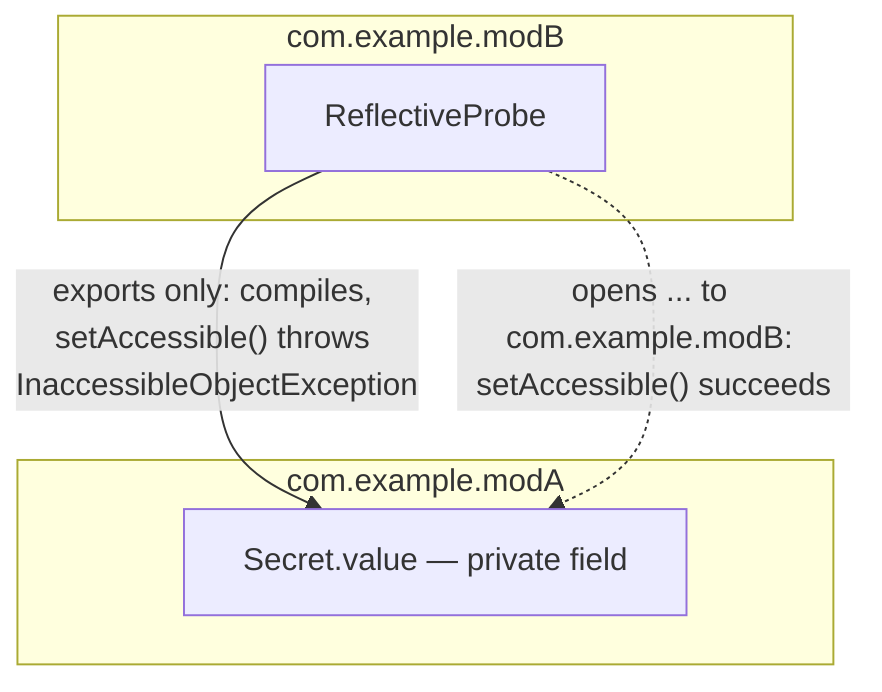
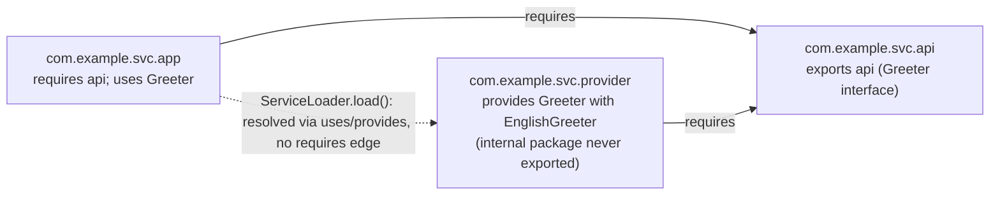

# Java Platform Module System (JPMS)

> **Topic register:** T-116 · IWI 3.2 · Expert tier · Rare interview frequency
> **Provenance:** all evidence in this chapter is real, executed output from
> [`practice/java/language-core/jpms-module-system/`](../../../practice/java/language-core/jpms-module-system/README.md)
> (OpenJDK 21.0.12) — a real `InaccessibleObjectException`, a real `opens`-qualified fix,
> real cross-module `ServiceLoader` resolution, and a real javac encapsulation error.

## Table of Contents

1. [Learning Objectives](#learning-objectives)
2. [Why This Matters in Interviews](#why-this-matters-in-interviews)
3. [Level 1 — Foundation](#level-1--foundation)
4. [Level 2 — Working Knowledge](#level-2--working-knowledge)
5. [Mental Model](#mental-model)
6. [Definition and Purpose](#definition-and-purpose)
7. [Core Concepts](#core-concepts)
8. [Internal Implementation](#internal-implementation)
9. [Diagrams](#diagrams)
10. [Production Scenarios](#production-scenarios)
11. [Trade-offs](#trade-offs)
12. [Decision Framework](#decision-framework)
13. [Common Mistakes](#common-mistakes)
14. [Anti-Patterns](#anti-patterns)
15. [Best Practices](#best-practices)
16. [Interview Answer Framework](#interview-answer-framework)
17. [Interview Questions](#interview-questions)
18. [Summary](#summary)
19. [Key Takeaways](#key-takeaways)
20. [Cheat Sheet](#cheat-sheet)
21. [Flashcards](#flashcards)
22. [Practice Exercises](#practice-exercises)
23. [Solutions](#solutions)
24. [Additional Reading](#additional-reading)
25. [Official References](#official-references)

---

## Learning Objectives

By the end of this chapter you can:

- Explain what a module adds on top of a package that a package alone cannot provide: a real, enforced boundary around both compile-time visibility and runtime reflective access.
- State the precise difference between `exports` and `opens`, and prove it with a real reflective call that succeeds under one and throws under the other.
- Explain how `ServiceLoader` resolves a provider module into the module graph via `uses`/`provides`, without a `requires` edge between consumer and provider — and why that doesn't create a general encapsulation hole.
- Describe the classpath-to-module-path migration path (unnamed module, automatic modules, `jdeps`) well enough to reason about why most existing applications still run mostly unmodularized on Java 21.

## Why This Matters in Interviews

JPMS is genuinely rare in day-to-day interview questions — most production Java services still run on the classpath, and this chapter's own topic register marks it "Rare" frequency, honestly, rather than inflating its importance. It earns a place in this program for two real reasons: it's the mechanism behind `--add-opens`/`--add-exports` workarounds every Java 9+ engineer eventually hits (a library doing reflection into `java.base` internals, a testing framework needing deep access), and it's exactly the kind of "why did the JDK ship this, and what problem was JAR-hell actually solving" question that separates candidates who've only used Java from candidates who understand why the platform evolved the way it did.

## Level 1 — Foundation

Before Java 9, the JDK's own internal implementation classes lived in the same giant, flat `rt.jar` as everything else — nothing stopped your code from reflectively reaching into an internal `sun.*` class, because there was no real wall, only a naming convention everyone was supposed to respect. A **module** is that missing wall, made real. Think of the classpath (pre-modules) as one enormous shared warehouse where anyone with a badge can walk into any aisle, including the ones marked "staff only" — the sign is a request, not a lock. A module turns each aisle into a room with a real door: a `module-info.java` file declares exactly which rooms (packages) this module lets other rooms compile against (`exports`), and, separately, which rooms it lets other rooms reflectively rummage through even at runtime (`opens`) — two different keys for two different kinds of access, where before there was only an honor system.

## Level 2 — Working Knowledge

The working distinction this program keeps returning to at Level 2 is: **`exports` grants compile-time and normal runtime access (a caller can `import` the class and call its public methods); `opens` additionally grants reflective access (a caller can `Field.setAccessible(true)` into it, even into private members) — and neither one implies the other.** A module that only `exports` a package is genuinely reflection-hardened for that package: legitimate public API usage works exactly as it always did, but a testing framework, serialization library, or dependency-injection container that relies on reflective field access into that package will hit a real `InaccessibleObjectException` at runtime, not a warning.

The second working idea worth internalizing: `ServiceLoader`-based service provision is a deliberate, narrow exception to strong encapsulation, not a loophole in it. A module can `provide` a service implementation from a package it never `exports` or `opens` — `ServiceLoader.load()` can still find and instantiate it, because the module system specifically resolves `uses`/`provides` edges during module resolution, independent of `requires`. But that exception is scoped exactly to `ServiceLoader`'s own instantiation path — a normal `import` of that same class from the same caller still fails to compile, with a real, specific javac error naming the package as "not visible." This is the practical answer to "doesn't a module using ServiceLoader defeat the whole point of encapsulation?" — no, because the grant is narrowly scoped to the SPI mechanism itself, not to the package in general.

## Mental Model

**A module is a package's compile-time visibility contract (`exports`) and its runtime reflective-access contract (`opens`) made explicit and independently grantable, replacing a classpath-era honor system where both were effectively all-or-nothing and unenforced.** Every other JPMS mechanic — the unnamed module, automatic modules, qualified exports/opens, `uses`/`provides` service binding — exists to make that one core idea adoptable incrementally across a codebase and its dependency tree that predates modules entirely, rather than requiring a big-bang rewrite.

## Definition and Purpose

The Java Platform Module System (JPMS), introduced in Java 9 via [JEP 261](https://openjdk.org/jeps/261) (Project Jigsaw), adds a `module-info.java` descriptor above the package level that declares a module's name, its dependencies (`requires`), which of its packages are visible to other modules at compile/run time (`exports`), which are additionally visible to reflection (`opens`), and which services it consumes (`uses`) or provides (`provides ... with ...`). It exists to solve two real, long-standing problems: **JAR hell** (no reliable way to declare "this JAR requires exactly this version of that JAR," and no error until a `NoClassDefFoundError` at runtime when something was silently missing or duplicated) and **unenforced encapsulation** (any code on the classpath could reflectively reach into any other code's internals, including the JDK's own, because there was no real access boundary above the class level). The JDK itself was the first, and remains the most complete, real-world consumer of JPMS — the entire Java SE platform is now organized into named modules (`java.base`, `java.sql`, `java.desktop`, and so on), which is precisely why `--add-opens java.base/java.lang=ALL-UNNAMED` is a command real engineers eventually type.

## Core Concepts

### `requires`, `exports`, and `opens` are three independent grants, not one

**`requires <module>`** declares a compile-time and runtime dependency on another module — without it, a module's code cannot even reference another module's exported types. **`exports <package>`** makes a package's public types visible to any module that `requires` this one, for normal compilation and execution — the equivalent of the classpath's old default visibility, now opt-in per package instead of automatic for the whole JAR. **`opens <package>`** additionally permits reflective access (including deep reflection into private members) into that package at runtime, independent of whether it's also exported — a package can be opened without being exported (usable only reflectively, e.g., for a framework that scans annotated classes but shouldn't be a compile-time API), or exported without being opened (a real, enforced "look but don't reflectively touch" API), or both, or neither. A whole module can also be declared `open` (`open module com.example.x { ... }`), which opens every package in it to reflection — a common escape hatch for modules that haven't been reflection-audited package-by-package yet.

### The unnamed module and automatic modules make migration incremental, not all-or-nothing

Code still run from the classpath (not the module path) lands in the **unnamed module** — it reads every other module, and, notably, every named module that doesn't explicitly `exports`-restrict against it can still be read by it (the classpath's old "everything sees everything" behavior is preserved for classpath code specifically, so pre-Java-9 applications keep working unmodified). A plain JAR placed on the *module path* without a `module-info.java` becomes an **automatic module** — the JDK derives a module name from the JAR's filename (or its `Automatic-Module-Name` manifest entry) and grants it `requires` access to everything and lets everything `requires` it, as a deliberately permissive bridge so a real, large, only-partially-modularized dependency tree can still resolve.

### `jdeps` and `jlink` are the two real tools this migration path depends on

**`jdeps`** analyzes a JAR's actual bytecode-level dependencies (not just its declared ones) and can suggest a starting `module-info.java`, or flag exactly which internal JDK APIs (`sun.*`, `com.sun.*`) a legacy dependency reaches into — the real, mechanical answer to "which of my dependencies will break under strong encapsulation." **`jlink`** assembles a custom, minimal runtime image containing only the modules an application actually needs (rather than shipping a full JDK), a real, measurable deployment-size and startup-time win for a fully modularized application — the concrete payoff JPMS offers beyond encapsulation alone, though one only a genuinely modularized dependency tree can realize.

### `uses`/`provides` service binding is a real, narrow, deliberate exception to encapsulation

A module declares `provides <service-interface> with <implementation>;` to register a service implementation, and a consumer declares `uses <service-interface>;` to request one via `ServiceLoader.load()`. This chapter's own real demo (`practice/java/language-core/jpms-module-system/src-b/`) proves the mechanic precisely: the consumer module (`com.example.svc.app`) has no `requires` edge at all to the provider module (`com.example.svc.provider`) — module resolution adds the provider module to the graph specifically because a resolved module declares `uses` for a service type the provider `provides`. The provider's implementation class lives in a package (`com.example.svc.provider.internal`) that is never `exports`-ed or `opens`-ed, yet `ServiceLoader` successfully instantiates it. This is not a hole in strong encapsulation — a direct `import` of that same class from the same consumer module fails to compile with a real, specific error (§ Internal Implementation) — it is a purpose-built, narrowly-scoped exception for exactly the SPI use case, letting a module ship a pluggable implementation without exposing that implementation as a general-purpose API.

## Internal Implementation

Three real, captured pieces of evidence from `practice/java/language-core/jpms-module-system/output-transcript.txt`, run against OpenJDK 21.0.12:

**Reflection blocked by `exports`-only, fixed by `opens`.** With `module com.example.modA { exports com.example.modA; }` (no `opens`), `com.example.modB`'s `ReflectiveProbe` compiles cleanly against `Secret` (export covers that), but calling `Field.setAccessible(true)` on `Secret`'s private field at runtime throws:

```
Exception in thread "main" java.lang.reflect.InaccessibleObjectException: Unable to make field private java.lang.String com.example.modA.Secret.value accessible: module com.example.modA does not "opens com.example.modA" to module com.example.modB
	at java.base/java.lang.reflect.AccessibleObject.throwInaccessibleObjectException(AccessibleObject.java:391)
	at java.base/java.lang.reflect.AccessibleObject.checkCanSetAccessible(AccessibleObject.java:367)
	...
```

Adding `opens com.example.modA to com.example.modB;` to the identical `module-info.java`, recompiling, and rerunning the identical `ReflectiveProbe` produces: `read private field via reflection: classified-42` — the same JVM, same reflective call, same field; only the module descriptor's `opens` grant changed the outcome.

**`ServiceLoader` resolving an unrequired provider module.** `com.example.svc.app`'s `module-info.java` declares only `requires com.example.svc.api; uses com.example.svc.api.Greeter;` — no `requires com.example.svc.provider` anywhere. Running `java --module-path out-b -m com.example.svc.app/com.example.svc.app.Main` produces:

```
com.example.svc.provider.internal.EnglishGreeter -> Hello, World!
providers found: 1
```

The module system's resolver added `com.example.svc.provider` to the module graph purely because it is present on the module path and `provides` a service the resolved `com.example.svc.app` module `uses` — real service binding, not a `requires` edge.

**The same provider package is still compile-time-inaccessible for a normal import.** Adding `import com.example.svc.provider.internal.EnglishGreeter;` directly into `com.example.svc.app`'s `Main.java` and recompiling produces a real javac error, not a warning:

```
src-b/com.example.svc.app/com/example/svc/app/Main.java:4: error: package com.example.svc.provider.internal is not visible
import com.example.svc.provider.internal.EnglishGreeter;
                               ^
  (package com.example.svc.provider.internal is declared in module com.example.svc.provider, but module com.example.svc.app does not read it)
1 error
```

This is the direct evidence for this chapter's central claim: `ServiceLoader`'s special-cased provider resolution and ordinary compile-time package visibility are two genuinely separate mechanisms, not one relaxed into the other.

## Diagrams





The second diagram is the chapter's central, non-obvious fact: the dotted edge is real module resolution, not a `requires` dependency — `app` never declares one on `provider`.

## Production Scenarios

### Scenario: upgrading to Java 17+ breaks a library that reflects into JDK internals

**Symptoms.** A service upgrading its JDK from 8 to 17 starts failing at startup, or throwing `InaccessibleObjectException` at runtime, from a dependency (an older ORM, a serialization library, an internal-tooling agent) that reflectively accessed a JDK internal class or field that worked without complaint on Java 8.

**Impact.** The service fails to start, or a specific feature path that depended on the reflective access breaks, with no code change on the team's own side.

**Initial hypotheses.** A real regression in the team's own code (checked — the failure traces into JDK-internal reflective access inside the dependency, not application code); a JVM configuration problem (checked — the JVM starts fine for everything not depending on that specific reflective path); the real cause: strong encapsulation, enforced in two real steps — [JEP 396](https://openjdk.org/jeps/396) (Java 16) flipped `--illegal-access`'s default from `permit` to `deny`, and [JEP 403](https://openjdk.org/jeps/403) (Java 17) then made the `--illegal-access` flag itself inert entirely — now actually enforces module boundaries the dependency was silently violating for years (correct).

**Diagnosis.** Run `jdeps --jdk-internals` against the dependency's JAR to identify exactly which internal JDK packages it reaches into reflectively — the mechanical, evidence-based version of "which of my dependencies will this actually break."

**Immediate mitigation.** Add the specific `--add-opens <module>/<package>=ALL-UNNAMED` (or to the specific consuming module) flags `jdeps` identified as needed, as a documented, temporary JVM startup flag.

**Permanent remediation.** Upgrade the dependency to a version that has removed its reliance on JDK-internal reflection (most major libraries did this specifically for Java 17+ compatibility) rather than carrying `--add-opens` flags indefinitely.

**Alternatives considered.** Staying on an older JDK LTS release — rejected as a long-term plan, since it only delays an upgrade that strong encapsulation will eventually force regardless, and forgoes real JDK improvements (performance, security patches) in the meantime.

**Trade-offs.** `--add-opens` flags are a real, working mitigation but are a form of technical debt — each one is a documented exception to a safety mechanism the JDK now defaults to, and needs to be tracked and eventually removed as dependencies are upgraded.

**Prevention.** Run `jdeps --jdk-internals` against new dependencies before adopting them, and treat any reliance on JDK-internal reflection as a real, trackable risk rather than an invisible one.

**Interview lesson.** Strong encapsulation didn't create a new class of bug — it turned a previously silent, working-by-accident reliance on unstable internals into a real, visible failure, specifically so it could be found and fixed rather than discovered later at a worse time.

## Trade-offs

| Choice | Benefit | Cost |
|---|---|---|
| Fully modularizing an application (`module-info.java` throughout) | Real compile-time and runtime encapsulation; `jlink`-able minimal runtime images | Real migration effort proportional to how much reflection-based tooling (DI, ORMs, serialization) the dependency tree relies on |
| Staying on the classpath (unnamed module) | Zero migration cost; every pre-Java-9 dependency keeps working unmodified | No encapsulation benefit at all; still exposed to JAR-hell-style dependency conflicts |
| Automatic modules as a bridge | Lets a partially-modularized dependency tree resolve without a big-bang rewrite | Automatic modules grant broad, permissive access — not real encapsulation, just compatibility |
| `--add-opens`/`--add-exports` flags | Real, immediate fix for a specific broken reflective dependency | Each flag is a tracked exception to strong encapsulation, not a permanent architectural answer |

## Decision Framework

1. **Is this a new application, or migrating dependency-heavy legacy code?** A genuinely new application can adopt full modularization from the start; a legacy migration should expect automatic modules and `jdeps`-guided incremental adoption, not a rewrite.
2. **Does a specific dependency need reflective access into your code, or into the JDK's internals?** Use `jdeps --jdk-internals` to find out mechanically before guessing; grant the narrowest `opens ... to <specific module>` the dependency actually needs, not a blanket `open module`.
3. **Does this module need to expose a pluggable implementation without exposing it as a general API?** Use `provides ... with ...` plus `uses`, keeping the implementation package unexported — the real, narrow answer, not an `opens` grant that would expose it to arbitrary reflection too.
4. **Is minimal runtime image size or startup time a real, measured requirement?** Only a genuinely modularized dependency tree can be `jlink`-ed meaningfully — this is a reason to modularize, not a reason to adopt JPMS's encapsulation rules alone.

## Common Mistakes

- Treating `exports` and `opens` as the same grant, or assuming one implies the other.
- Assuming `ServiceLoader`'s ability to reach a non-exported package means normal `import`-based access would also work.
- Reaching for a blanket `open module` or `--add-opens ... ALL-UNNAMED` instead of a narrow, targeted grant, once a real reflective access need is identified.
- Assuming every dependency needs full modularization before it can run on the module path — automatic modules exist precisely so this isn't required.

## Anti-Patterns

- **Granting `opens` (or an `open module`) broadly "to be safe," rather than the narrowest qualified `opens ... to <specific module>` a real, identified caller needs.**
- **Carrying `--add-opens` JVM flags indefinitely as a permanent fix**, instead of tracking them as debt against a dependency upgrade that removes the underlying reflective reliance.
- **Modularizing an application before its dependency tree can actually support it**, discovering mid-migration that several dependencies still reflectively reach into packages that would need to stay open, defeating much of the intended encapsulation benefit.

## Best Practices

- Grant the narrowest `exports`/`opens` (qualified to a specific module, not blanket) a real, identified caller needs.
- Run `jdeps --jdk-internals` against new dependencies before adoption, and against the existing dependency tree before any JDK upgrade that changes the illegal-access default.
- Reserve `provides ... with ...` for genuinely pluggable, SPI-style implementations you don't want to expose as a general compile-time API — not as a general-purpose way to "hide" a class that's still meant to be directly used.

## Interview Answer Framework

### 30-Second Answer

JPMS (Java 9+) adds a `module-info.java` descriptor above the package level, declaring dependencies (`requires`) and two independent, real grants per package: `exports` (compile-time/runtime visibility) and `opens` (reflective access) — replacing the classpath's unenforced, all-or-nothing visibility. `ServiceLoader`'s `uses`/`provides` mechanism is a narrow, deliberate exception letting a module provide a pluggable implementation without exporting or opening it.

### 2-Minute Answer

Definition: JPMS adds real module boundaries with independently-grantable compile-time (`exports`) and reflective (`opens`) access, plus a `requires`-based dependency graph. Why it exists: to fix JAR hell (no reliable dependency declaration) and unenforced encapsulation (any classpath code could reflectively reach any other code's internals, including the JDK's own). How it works: a module descriptor declares each grant explicitly; the unnamed module and automatic modules make adoption incremental rather than all-or-nothing. One important trade-off: full modularization enables real encapsulation and `jlink`-able minimal runtime images, but costs real migration effort proportional to how reflection-dependent the existing dependency tree is. Production example: a Java 17+ upgrade breaking a dependency that silently relied on JDK-internal reflection since strong encapsulation defaulted on with JEP 403.

### 10-Minute Deep Dive

Cover, in order: the mental model — `exports` and `opens` as two independent, real grants (mental model); the unnamed module and automatic modules as the incremental-migration bridge, plus `jdeps`/`jlink` as the real tooling (core concepts); the real captured evidence — `InaccessibleObjectException` under exports-only, fixed by a qualified `opens`, and `ServiceLoader` resolving an unrequired provider module while a direct import of the same package still fails to compile (internal implementation); and close with the production scenario — a JDK upgrade turning a previously silent reflective dependency into a real, visible failure.

### Whiteboard Explanation

Draw the [§ Diagrams](#diagrams) two flowcharts in order: first the `exports`-vs-`opens` distinction (solid arrow succeeding, dotted arrow throwing until `opens` is added), then the `ServiceLoader` resolution diagram, emphasizing that the dotted `app → provider` edge is real module resolution via `uses`/`provides`, not a `requires` dependency the app ever declares.

### Production Example

The Java 17+ upgrade scenario in [§ Production Scenarios](#production-scenarios): a dependency's silent reliance on JDK-internal reflection, invisible on Java 8–15's permissive default, becomes a real, diagnosable `InaccessibleObjectException` once strong encapsulation defaults on — found via `jdeps --jdk-internals`, mitigated with a narrow `--add-opens`, fixed permanently by a dependency upgrade.

### Trade-offs to Mention

State unprompted: `exports` and `opens` are independent grants, not one relaxed into the other; automatic modules trade real encapsulation for migration compatibility; `--add-opens` flags are a real but temporary mitigation, not a permanent fix.

### Common Candidate Mistakes

Describing modules as "just packages with extra config" without naming the real compile-time/reflective access distinction; assuming `ServiceLoader` access implies general import access to the same package; not knowing why `--add-opens` exists or when it's needed.

### Typical Follow-Up Questions

1. "A dependency broke after a Java 17 upgrade with an `InaccessibleObjectException`. Walk me through how you'd diagnose and fix it."
2. "How does `ServiceLoader` find an implementation in a package that was never exported or opened — doesn't that break encapsulation?"

### Senior-Level Expectations

Correctly distinguishes `exports` from `opens`, and can name `jdeps`/`--add-opens` as the real diagnostic and mitigation tools for a strong-encapsulation break.

### Staff-Level Discussion

The Staff-level move is recognizing JPMS's real organizational cost curve: modularizing a genuinely large, long-lived dependency tree is rarely justified purely for encapsulation's sake alone (most teams get most of the safety benefit "for free" the moment they upgrade past Java 17, where `--illegal-access` stopped being a usable override at all, without writing a single `module-info.java`), and is only clearly worth the migration effort when a concrete `jlink` minimal-runtime-image or genuinely enforced internal-API boundary is an actual, measured organizational requirement — not a default best practice to apply uniformly. A Staff engineer evaluating a modularization proposal asks what real, measured problem it solves for this specific system, rather than treating "we should modularize" as self-justifying.

## Interview Questions

### Question 1 — A dependency broke after a Java 17 upgrade with an `InaccessibleObjectException`. Walk me through how you'd diagnose and fix it.

**Why interviewers ask it.** Tests whether the candidate understands strong encapsulation as a real platform change with real, diagnosable causes and fixes, not just an abstract JPMS fact.

**Expected answer.** Run `jdeps --jdk-internals` against the dependency to identify exactly which internal package it reflects into; apply the narrowest `--add-opens` flag needed as an immediate, documented mitigation; track and resolve it permanently by upgrading the dependency to a version that no longer relies on JDK-internal reflection.

**Minimum acceptable answer.** Recognizes strong encapsulation (not a regression in the team's own code) as the cause, even without naming `jdeps` specifically.

**Strong Senior answer.** Correctly names the diagnostic (`jdeps --jdk-internals`), the immediate mitigation (`--add-opens`), and the permanent fix (dependency upgrade).

**Staff-level extension.** Frames `--add-opens` flags as trackable technical debt against a dependency-upgrade backlog, and connects the root cause to the two-step enforcement change: JEP 396 (Java 16) flipping `--illegal-access`'s default to `deny`, then JEP 403 (Java 17) removing the flag's effect entirely.

**Common mistakes.** Assuming the fix is reverting the JDK upgrade rather than diagnosing and mitigating the actual dependency issue.

**Likely follow-ups.** "Why did this work fine on Java 8, and what specifically changed?"

**Evaluation criteria (1–5).** 1: cannot explain the cause. 3: correctly diagnoses strong encapsulation as the cause and proposes `--add-opens`. 5: correct diagnosis plus `jdeps`-based evidence gathering and a permanent-fix framing.

**Related references.** [§ Production Scenarios](#production-scenarios); [§ Core Concepts](#core-concepts).

---

### Question 2 — How does `ServiceLoader` find an implementation in a package that was never exported or opened — doesn't that break encapsulation?

**Why interviewers ask it.** Tests whether the candidate understands `uses`/`provides` as a real, scoped mechanism rather than assuming either "it must be a loophole" or "it must not actually work."

**Expected answer.** Module resolution adds a provider module to the graph when a resolved module declares `uses` for a service type the provider `provides`, independent of any `requires` edge — a deliberate, narrow exception scoped specifically to `ServiceLoader`'s instantiation path. It does not create a general encapsulation hole: a normal `import` of the same implementation class from the same consumer still fails to compile with a real "package ... is not visible" error.

**Minimum acceptable answer.** States that `ServiceLoader` has some special-cased access, even without the precise `requires`-independent resolution detail.

**Strong Senior answer.** Correctly explains the `uses`/`provides` resolution mechanism and confirms it doesn't grant general import access.

**Staff-level extension.** Connects this to the general design principle: JPMS's grants are narrowly scoped and additive by default, which is why a service-provider exception could be added without weakening the platform's default encapsulation stance elsewhere.

**Common mistakes.** Assuming `ServiceLoader` access implies the package is effectively exported for any purpose.

**Likely follow-ups.** "What real error would you get if you tried to `import` that same implementation class directly?"

**Evaluation criteria (1–5).** 1: cannot explain the mechanism. 3: correctly explains the `uses`/`provides` resolution. 5: correct explanation plus confirming the import-access boundary still holds, with the specific error.

**Related references.** [§ Internal Implementation](#internal-implementation); [§ Diagrams](#diagrams).

## Summary

JPMS (Java 9+) turns package visibility and reflective access into two independent, explicitly-grantable module descriptors (`exports`, `opens`) instead of the classpath's unenforced, all-or-nothing honor system, and adds a `uses`/`provides` mechanism letting a module offer a pluggable service implementation without exposing it as a general compile-time API. This chapter's own real, executed evidence proves both halves precisely: a reflective call that throws under `exports`-only and succeeds under a qualified `opens`, and a `ServiceLoader` call that resolves an unrequired provider module's non-exported implementation while a direct `import` of that same class still fails to compile.

## Key Takeaways

- `exports` (compile-time/runtime visibility) and `opens` (reflective access) are independent grants — neither implies the other.
- The unnamed module and automatic modules exist specifically to make modularization adoptable incrementally, not all-or-nothing.
- `ServiceLoader`'s `uses`/`provides` mechanism resolves a provider module into the graph without a `requires` edge, but this is a narrow, SPI-scoped exception, not a general relaxation of encapsulation.
- `jdeps --jdk-internals` and `--add-opens` are the real diagnostic and mitigation tools for a strong-encapsulation break after a JDK upgrade.

## Cheat Sheet

| Need | Directive/Tool |
|---|---|
| Depend on another module | `requires <module>` |
| Grant compile-time/runtime visibility to a package | `exports <package>` |
| Grant reflective access to a package | `opens <package>` (optionally qualified: `opens <package> to <module>`) |
| Provide a pluggable implementation without exporting it | `provides <interface> with <impl>` + consumer's `uses <interface>` |
| Find which internal JDK APIs a dependency uses | `jdeps --jdk-internals <jar>` |
| Build a minimal custom runtime image | `jlink` |
| Temporarily restore reflective access after a break | `--add-opens <module>/<package>=<target-module-or-ALL-UNNAMED>` |
| Run legacy, unmodularized code unchanged | classpath (unnamed module) |
| Run a plain JAR on the module path without a `module-info.java` | automatic module (name derived from JAR filename or `Automatic-Module-Name`) |

## Flashcards

### Card: `exports` vs. `opens`

**Prompt:**
What's the real difference between `exports` and `opens`, and does either imply the other?

**Answer:**
`exports` grants compile-time and normal runtime visibility; `opens` grants reflective access (including deep reflection into private members). Neither implies the other — a package can be exported without being opened (a real, enforced "look but don't reflect" API) or opened without being exported.

**Why it matters:**
The single most commonly confused JPMS fact — proven directly by this chapter's real `InaccessibleObjectException` under exports-only.

**Common trap:**
Assuming a package visible enough to `import` is automatically visible enough to reflect into.

**Related:**
[Core Concepts](#core-concepts)

### Card: ServiceLoader and the `requires` edge

**Prompt:**
Does a module using `ServiceLoader.load()` need a `requires` edge to the provider module?

**Answer:**
No. Module resolution adds a provider module to the graph because a resolved module declares `uses` for a service type the provider `provides` — independent of any `requires` edge. This chapter's real demo proves it: the consumer module has zero `requires` reference to the provider module.

**Why it matters:**
The most non-obvious real JPMS fact for anyone who's only read about modules, not run one.

**Common trap:**
Assuming `ServiceLoader` access means the provider's package is effectively exported for any purpose — it isn't; a direct import still fails to compile.

**Related:**
[Internal Implementation](#internal-implementation)

### Card: Why strong encapsulation started actually breaking things around Java 16-17

**Prompt:**
Why did Java 9-era modularization not break most applications immediately, but a Java 16+ upgrade often does?

**Answer:**
Java 9-15 defaulted `--illegal-access` to `permit`, quietly allowing most illegal reflective access with only a warning. JEP 396 (Java 16) flipped that default to `deny`; JEP 403 (Java 17) then made the flag itself inert, removing the override entirely — the same strong-encapsulation rules were always there, but only became actually enforced by default across these two releases.

**Why it matters:**
Explains a real, common production incident pattern without requiring the candidate to have memorized JEP numbers.

**Common trap:**
Assuming JPMS's encapsulation rules themselves changed between Java 9 and 17, rather than the *enforcement default*.

**Related:**
[Production Scenarios](#production-scenarios)

## Practice Exercises

1. Given a module `com.example.lib` that `exports com.example.lib.api` but does not open it, and a Jackson-style serialization library that needs reflective access to private fields of a class in that package, what is the narrowest correct fix?
2. Explain why a module declaring `provides com.example.Service with com.example.impl.RealService;` does not need to `exports` the `com.example.impl` package for `ServiceLoader` to work, but does need to `exports com.example` (the package containing `Service`) if `Service` lives there.
3. A team is deciding whether to fully modularize a 200-dependency legacy application. What real, measured requirement would justify the migration effort, versus what would not?

## Solutions

**Exercise 1.** Add a qualified `opens com.example.lib.api to <the serialization library's module>;` (or, if the library runs as part of the unnamed module/classpath, an unqualified `opens com.example.lib.api;`, or, as a last resort without touching the descriptor, an `--add-opens` JVM flag) — the narrowest grant that fixes exactly the reflective access needed, without exposing the package to reflection from every other module.

**Exercise 2.** `provides ... with ...` only requires the module to `requires` whatever module declares the service interface `Service` (and `Service`'s own containing package must be `exports`-ed by whichever module declares it, so consumers can compile against the interface type) — the module system's service-binding resolution reaches the implementation class directly via the `provides` declaration itself, bypassing the normal export check specifically for that instantiation path, exactly as this chapter's real demo proves.

**Exercise 3.** A real, measured requirement: a genuine need for `jlink`-minimized deployment images (real startup-time or image-size constraints), or a genuine, enforced internal-API boundary a team has repeatedly had violated via reflection and needs actually stopped. Not a real justification on its own: "modularization is the modern way to structure Java" — without one of the above concrete, measured drivers, the real migration cost (auditing 200 dependencies for `jdeps`-flagged internal reflection, resolving each one) is unlikely to be justified by encapsulation benefits most of those dependencies' actual callers never exploit anyway.

## Additional Reading

- Oracle's `ModuleDescriptor` Javadoc, for the precise, complete set of directives (`requires transitive`, `exports ... to`, `opens ... to`, `uses`, `provides ... with`) this chapter's Core Concepts section covers a working subset of

## Official References

- [JEP 261: Module System](https://openjdk.org/jeps/261)
- [JEP 396: Strongly Encapsulate JDK Internals by Default](https://openjdk.org/jeps/396)
- [JEP 403: Strongly Encapsulate JDK Internals](https://openjdk.org/jeps/403)
- [`java.lang.module.ModuleDescriptor` (Java 21 API)](https://docs.oracle.com/en/java/javase/21/docs/api/java.base/java/lang/module/ModuleDescriptor.html)
