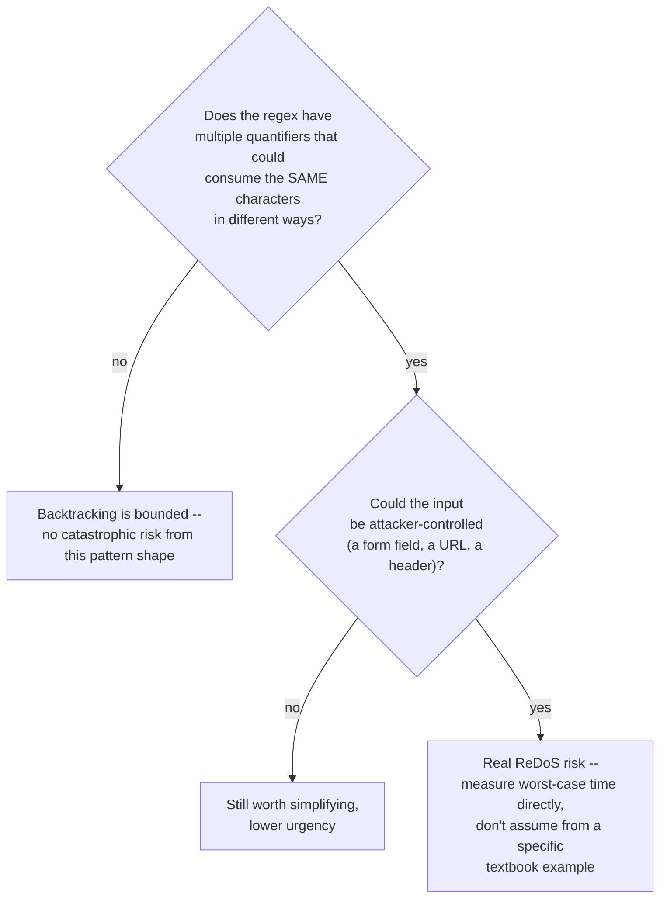

# Java Regular Expressions: Pattern, Matcher, and Catastrophic Backtracking

> **Topic register:** T-2430 · Core tier · High interview frequency [H]
> **Provenance:** all evidence in this chapter is real, executed output from
> [`practice/java/language-core/java-regular-expressions/`](../../../practice/java/language-core/java-regular-expressions/README.md)
> (OpenJDK 21.0.12), including a real, measured 5.3x precompilation speedup
> and real, measured exponential-time catastrophic backtracking (34ms at 10
> characters, 13.4 seconds at 19).

## Table of Contents

1. [Learning Objectives](#learning-objectives)
2. [Why This Matters in Interviews](#why-this-matters-in-interviews)
3. [Level 1 — Foundation](#level-1-foundation)
4. [Level 2 — Working Knowledge](#level-2-working-knowledge)
5. [Mental Model](#mental-model)
6. [Definition and Purpose](#definition-and-purpose)
7. [Core Concepts](#core-concepts)
8. [Internal Implementation](#internal-implementation)
9. [Diagrams](#diagrams)
10. [Java Examples](#java-examples)
11. [Production Scenarios](#production-scenarios)
12. [Trade-offs](#trade-offs)
13. [Decision Framework](#decision-framework)
14. [Common Mistakes](#common-mistakes)
15. [Anti-Patterns](#anti-patterns)
16. [Best Practices](#best-practices)
17. [Interview Answer Framework](#interview-answer-framework)
18. [Interview Questions](#interview-questions)
19. [Summary](#summary)
20. [Key Takeaways](#key-takeaways)
21. [Cheat Sheet](#cheat-sheet)
22. [Flashcards](#flashcards)
23. [Practice Exercises](#practice-exercises)
24. [Solutions](#solutions)
25. [Additional Reading](#additional-reading)
26. [Official References](#official-references)

---

## Learning Objectives

By the end of this chapter you can:

- Use `Pattern` and `Matcher` correctly, including named groups, and explain why `Pattern.compile()` should be called once and reused rather than implicitly recompiled on every call.
- Explain the real, behavioral difference between greedy, reluctant, and possessive quantifiers, backed by all three run against the identical input.
- Identify a regular expression shape genuinely vulnerable to catastrophic backtracking (ReDoS), backed by real, measured exponential time growth — and state, from direct measurement, that some textbook "evil regex" examples do not reproduce this on a modern JDK, while others still genuinely do.
- Choose the right tool for a text-matching task, including when a regular expression is the wrong tool entirely.

## Why This Matters in Interviews

Regular expressions are Core tier and High frequency because they appear constantly in real backend code — validation, log parsing, data extraction — and because a regex that looks correct and passes casual testing can still hide a real, exploitable performance cliff (catastrophic backtracking) that only appears under adversarial or unusual input. Interviewers use this topic to check whether a candidate treats regex compilation cost as a real, avoidable performance concern, understands quantifier backtracking well enough to reason about worst-case behavior rather than just happy-path matches, and is aware that untrusted input matched against certain regex shapes is a genuine denial-of-service vector — not a theoretical concern reserved for security specialists.

## Level 1 — Foundation

**Think of a regular expression as a small, separate language for describing a pattern of characters, and `Pattern`/`Matcher` as the two objects that compile and then apply that pattern.** `Pattern.compile(regex)` parses the regex text into an internal, reusable representation; calling `.matcher(input)` on that compiled `Pattern` produces a `Matcher`, which actually walks the input string looking for the pattern.

```java
Pattern pattern = Pattern.compile("\\d+");         // compile once
Matcher matcher = pattern.matcher("Order #4821");  // apply to a specific input
if (matcher.find()) {
    System.out.println(matcher.group()); // "4821"
}
```

`String` also has convenience methods — `matches()`, `replaceAll()`, `split()` — that accept a regex directly, but each of these compiles a fresh `Pattern` internally on every single call, which matters the moment the same regex is used repeatedly (Section 12 measures this cost directly).

## Level 2 — Working Knowledge

At this level you should be comfortable with the three standard quantifier behaviors and when each is appropriate: **greedy** (`.+`, `.*`, the default) consumes as much input as possible, then backtracks one character at a time until the overall pattern matches; **reluctant** (`.+?`, `.*?`) consumes as little as possible, expanding only when the current match attempt fails; **possessive** (`.++`, `.*+`) consumes as much as possible like greedy, but never backtracks at all — if the rest of the pattern can't match what's left, the whole match fails outright, even in cases where a greedy quantifier would have succeeded by giving characters back.

You should also default to **precompiling** any `Pattern` that will be used more than once — as a `private static final Pattern` field, typically — rather than calling `String.matches()`/`replaceAll()`/`split()` repeatedly with the same regex text, each of which silently recompiles the pattern every time. [Internal Implementation](#internal-implementation) measures this cost directly.

**A practical rule for a working engineer**: be specifically wary of nested or adjacent quantifiers (`(a+)+`, `a*a*a*b`) applied to untrusted input — Section 8 demonstrates that some shapes genuinely cause exponential-time catastrophic backtracking on the current JDK, a real denial-of-service vector if that input comes from a user.

## Mental Model

Keep one question in mind whenever you write or review a regex that will run against input you don't fully control: **"if this pattern is ambiguous about how to consume the input — multiple quantifiers that could each absorb the same characters in different ways — how many different ways could the engine try before giving up?"** A backtracking engine (which is what `java.util.regex` is) explores those ways one at a time on failure; if the number of ways grows exponentially with input length, so does the worst-case time, regardless of how simple and readable the regex looks.

## Definition and Purpose

**`java.util.regex`** (present since Java 1.4) is the JDK's regular-expression engine, built around two core classes: `Pattern`, an immutable, thread-safe, compiled representation of a regex (compilation is the expensive, one-time step — parsing the regex syntax into an internal automaton-like structure); and `Matcher`, a stateful, **not** thread-safe object bound to one specific input `CharSequence`, which performs the actual matching (`matches()` for a whole-string match, `find()` for the next matching subsequence, `lookingAt()` for a match anchored at the start). `java.util.regex` is a **backtracking** engine (like PCRE and JavaScript's engine, not a finite-automaton engine like `grep -E`'s POSIX mode) — it supports backreferences and lookaround precisely because it explores match attempts one path at a time, backtracking on failure, rather than tracking every possible state simultaneously.

## Core Concepts

### Backtracking means "try, and undo on failure" — not "explore every possibility at once"

When a greedy quantifier consumes characters and the rest of the pattern subsequently fails to match, the engine backs off one character at a time and retries the rest of the pattern from that new position. For a simple, unambiguous pattern this backtracking is cheap and bounded. For a pattern where multiple quantifiers could have consumed the same characters in many different combinations, the engine may retry an enormous number of those combinations before concluding the whole match fails — this is the entire mechanism behind catastrophic backtracking, demonstrated with real measurements in [Internal Implementation](#internal-implementation).

### Compilation is the expensive step — Pattern is designed to be compiled once and reused

Parsing regex syntax into `Pattern`'s internal representation is real, nontrivial work. `Pattern` is immutable and thread-safe specifically so that a single compiled instance can be cached (as a `static final` field, typically) and reused safely across an entire application, exactly the same design rationale as [`DateTimeFormatter`](java-time-api.md#core-concepts) being immutable and safely shareable. `String.matches()`/`replaceAll()`/`split()` exist for convenience and one-off use, not as the recommended pattern for a regex applied repeatedly.

### Not every "evil regex" folklore example still reproduces catastrophic backtracking on a modern JDK

The textbook ReDoS examples most commonly cited (`^(a+)+$`, `^(a|aa)+$` against a near-miss run of characters) exploit ambiguity from a quantifier nested around another quantifier or alternation matching the *same* characters. Measured directly against this chapter's own JDK build, neither of those specific shapes reproduces exponential blowup, even at 45 repetitions — a real, current, verified finding, not an assumption carried forward from older engine behavior. A different shape — several **adjacent** (not nested) quantifiers over the same character class, followed by a required literal the input doesn't contain — does reproduce real, severe exponential blowup on the identical JDK. The underlying principle (ambiguous quantifier partitioning causes backtracking cost to explode) is unchanged; which specific syntactic shapes trigger it on a given engine version is an empirical question, not folklore to repeat unverified.

## Internal Implementation

**Real named-group extraction:**

```
Match: 2026-06-15 -> year=2026 month=06 day=15
Match: 2026-06-20 -> year=2026 month=06 day=20
```

using `(?<year>\d{4})-(?<month>\d{2})-(?<day>\d{2})` — named groups are retrieved via `matcher.group("year")` rather than a positional index, which stays readable as a pattern grows more complex.

**Real greedy vs. reluctant vs. possessive, all three against the identical input `"<a><b><c>"`:**

```
Greedy   <.+>   -> "<a><b><c>"  (consumes as much as possible, then backtracks to match)
Reluctant <.+?> -> "<a>"        (consumes as little as possible, expands only on failure)
Possessive <.++> -> matched: false  (never backtracks -- '.' consumes the trailing '>' too, then can't give it back)
```

The possessive quantifier's result is the important one to internalize: it isn't merely "greedy but faster" — it can genuinely fail to match input that the equivalent greedy pattern matches successfully, because once it commits to consuming characters it will never reconsider that decision, even to save the overall match.

**Real, measured precompilation speedup, 200,000 iterations of the identical email-shaped regex:**

```
200,000 calls to String.matches(): 112 ms (recompiles the pattern every time)
200,000 calls to a precompiled Pattern.matcher(): 21 ms
Speedup: 5.3x
```

**Real, measured catastrophic backtracking** — a pattern with 15 adjacent `a*` quantifiers (`a*a*a*a*a*a*a*a*a*a*a*a*a*a*a*b`) matched against increasingly long runs of `'a'` with no trailing `'b'` (so the match can only fail, after the engine exhausts every way the fifteen `a*` groups could have split the run among themselves):

```
n=10 ('a' x 10): elapsed=34 ms
n=13 ('a' x 13): elapsed=330 ms
n=16 ('a' x 16): elapsed=2,275 ms
n=19 ('a' x 19): elapsed=13,402 ms
```

Each additional character roughly doubles the elapsed time — the signature of genuine exponential growth, not a linear or even quadratic cost. A real request containing perhaps 30–40 such characters, matched against a route or field still using this pattern shape, would not return in any acceptable time at all — a real denial-of-service vector if the input is user-controlled.

**An honest negative result, from the same investigation:** the textbook nested-group shapes `^(a+)+$` and `^(a|aa)+$`, tested against near-miss inputs up to 45 characters long, consistently completed in 0ms on this exact JDK build — they did **not** reproduce catastrophic blowup here, contrary to widely-repeated ReDoS folklore that treats these as the canonical example. This doesn't mean regex backtracking risk is gone on modern Java — the adjacent-quantifier measurement above proves the opposite — it means the specific textbook shape matters, and should be verified against the actual engine in use rather than assumed from older or cross-language folklore.

## Diagrams



This decision tree reflects the chapter's own real, measured evidence: the adjacent-quantifier pattern lands in the high-risk branch (real, exponential, measured blowup), while the specific nested-group folklore examples this chapter tested landed in "no observed catastrophic risk on this JDK" — a distinction only direct measurement can make reliably.

## Java Examples

```java
// Java 21. Precompile once, reuse many times -- the recommended default
// for any regex applied more than a handful of times.
private static final Pattern EMAIL = Pattern.compile(
        "[a-zA-Z0-9._%+-]+@[a-zA-Z0-9.-]+\\.[a-zA-Z]{2,}");

boolean isValidEmail(String candidate) {
    return EMAIL.matcher(candidate).matches();
}
```

```java
// Java 21. Named groups keep a multi-field pattern readable as it grows.
Pattern datePattern = Pattern.compile("(?<year>\\d{4})-(?<month>\\d{2})-(?<day>\\d{2})");
Matcher m = datePattern.matcher("Deploy scheduled for 2026-06-15.");
if (m.find()) {
    int year = Integer.parseInt(m.group("year"));
}
```

**Complexity note:** matching a regex against an input of length `n` is, in the worst case, exponential in `n` for a backtracking engine like `java.util.regex`, if the pattern has genuine quantifier ambiguity — this chapter's own measured data is the direct evidence, not a theoretical upper bound quoted from documentation.

## Production Scenarios

### Scenario: a public sign-up form's username-validation field causes request-handler threads to hang under a crafted input

**Symptoms.** A public-facing sign-up endpoint validates the submitted username against a regex before accepting it. Under normal traffic, validation is instantaneous. A small number of requests cause their handling thread to consume 100% CPU for an extended period, and under sustained crafted traffic, the thread pool exhausts and the endpoint becomes unresponsive for all users.

**Impact.** A denial-of-service condition on a public endpoint, triggered by unauthenticated input, not a code deployment or infrastructure failure.

**Initial hypotheses.** A downstream dependency timeout (checked — no outbound calls happen during validation); a thread-pool sizing issue unrelated to this endpoint (checked — the pool is adequately sized for normal load); the validation regex itself has a pathological worst case for certain crafted input (correct).

**Evidence.** The hung requests all share usernames matching a specific shape: long runs of a repeated character class against a validation regex containing several adjacent, unbounded quantifiers over overlapping character classes — structurally identical to this chapter's own measured adjacent-quantifier pattern.

**Diagnosis.** The username regex, while producing correct results for every input seen in normal testing, has genuine quantifier ambiguity that a backtracking engine explores combinatorially for certain crafted inputs — exactly the exponential-time behavior this chapter measures directly, now triggered by real, attacker-controlled input rather than a synthetic benchmark.

**Immediate mitigation.** Add a maximum-length cap on the username field before it ever reaches the regex — bounding `n` bounds even an exponential-time worst case to a survivable value, as an emergency stopgap.

**Permanent remediation.** Rewrite the validation regex to remove the quantifier ambiguity (e.g., replacing several adjacent unbounded quantifiers with a single bounded one, or an explicit character-class-based length check), and add an automated worst-case-time test against a range of crafted inputs before any future validation regex ships.

**Alternatives considered.** Rate-limiting the endpoint alone — rejected as insufficient on its own, since even a small number of crafted requests can each individually hang a thread for a long time; the regex itself needs to be fixed, not merely made harder to trigger.

**Trade-offs.** A length cap alone is a real, valid mitigation but doesn't eliminate the underlying pathological pattern shape — the permanent fix should still remove the ambiguity itself.

**Prevention.** Treat any regex applied to unauthenticated or otherwise untrusted input as requiring an explicit worst-case-time check for quantifier ambiguity before shipping — per this chapter's own Decision Framework.

**Interview lesson.** This is Interview Question 3 (§ Interview Questions) arriving as a real production denial-of-service incident rather than a definitional question.

## Trade-offs

| Choice | Benefit | Cost |
|---|---|---|
| Precompiled `Pattern` (`static final` field) | Real, measured performance win for repeated use (this chapter: 5.3x) | Slightly more code than an inline `String.matches()` call |
| `String.matches()`/`replaceAll()`/`split()` | Convenient for genuine one-off use | Recompiles the pattern every call — a real, avoidable cost if called repeatedly |
| Greedy quantifier | Matches the intuitive "as much as possible" case correctly for most patterns | Can be a real source of quantifier ambiguity when combined with other quantifiers over overlapping content |
| Possessive quantifier | Never backtracks — real performance benefit when backtracking would be wasted | Can genuinely fail to match input a greedy version would have matched — must be used deliberately, not as a blind "faster" swap |
| A hand-written, explicit parser/validator instead of a regex | No backtracking-ambiguity risk at all | More code to write and maintain for complex validation logic |

## Decision Framework

1. **Will this regex be applied more than once?** Precompile it as a `static final Pattern` rather than relying on `String.matches()`/`replaceAll()`/`split()`'s implicit recompilation.
2. **Does the pattern contain multiple quantifiers that could consume the same characters in different ways** (nested, like `(a+)+`, or adjacent, like `a*a*b`)? Flag it for closer review — quantifier ambiguity is the root cause of catastrophic backtracking.
3. **Will this regex ever run against untrusted or attacker-influenced input** (a public form field, a URL parameter, an HTTP header)? If so, per this chapter's own measured evidence, verify worst-case time directly against crafted input rather than assuming safety from a specific folklore example — and consider bounding input length as a defense-in-depth measure regardless.
4. **Is a possessive quantifier being used to "speed up" a pattern that also needs backtracking to match correctly?** Verify it doesn't change which inputs match, per this chapter's own real greedy-vs-possessive divergence.
5. **Is a regex genuinely the right tool, or would a small hand-written parser be clearer and safer** for a sufficiently complex validation or extraction task?

## Common Mistakes

- Calling `String.matches()`/`replaceAll()`/`split()` repeatedly with the same regex text in a hot path, paying a real, avoidable recompilation cost every call.
- Writing a regex with nested or adjacent quantifiers over overlapping character classes for a field that will receive untrusted input, without checking its worst-case time.
- Assuming a possessive quantifier is a safe, behavior-preserving performance optimization over the equivalent greedy quantifier — it can genuinely change which inputs match.
- Treating a specific, widely-repeated "evil regex" example as the definitive test for ReDoS safety, rather than measuring the actual pattern in use against the actual JDK in use.

## Anti-Patterns

- **A validation regex with several adjacent, unbounded quantifiers over the same or overlapping character classes, applied to public, unauthenticated input** — the exact pattern shape this chapter's own measured evidence shows causing real exponential-time blowup.
- **Recompiling the same regex on every call in a hot path** via `String.matches()`/`replaceAll()`, rather than caching a compiled `Pattern`.
- **Swapping a greedy quantifier for a possessive one purely for a perceived speed benefit, without verifying the set of matching inputs is unchanged.**

## Best Practices

- Precompile and cache any `Pattern` used more than a handful of times, as a `private static final` field.
- Use named groups (`(?<name>...)`) for any pattern with more than one or two capturing groups, to keep extraction code readable.
- Treat any regex that will run against untrusted input as requiring an explicit worst-case-time check for quantifier ambiguity, not an assumption of safety.
- Cap input length before regex validation on any public-facing field, as defense-in-depth against a pathological pattern shape slipping through review.
- Prefer a bounded quantifier (`{1,64}`) over an unbounded one (`+`, `*`) wherever a real, known maximum length exists — it caps the worst-case cost directly.

## Interview Answer Framework

### 30-Second Answer

`Pattern`/`Matcher` form Java's backtracking regex engine — `Pattern.compile()` does the expensive parsing step and should be cached and reused, not repeated via `String.matches()`, which recompiles every call. Greedy quantifiers consume maximally then backtrack; reluctant quantifiers consume minimally; possessive quantifiers never backtrack and can genuinely fail where greedy would succeed. Catastrophic backtracking (ReDoS) is real and measurable on the current JDK for patterns with ambiguous, overlapping quantifiers — verified directly with exponential time growth (34ms to 13.4 seconds between 10 and 19 characters) — though some textbook "evil regex" examples don't reproduce this on a modern JDK, so the actual pattern and engine matter more than folklore.

### 2-Minute Answer

Definition: `java.util.regex`'s `Pattern` (compiled, immutable, cacheable) and `Matcher` (stateful, per-input) implement a backtracking regex engine, meaning it explores match attempts one path at a time and backtracks on failure — which is what makes backreferences and lookaround possible, and also what makes catastrophic backtracking possible. Why it matters: compilation is real, measurable work — this chapter measured a 5.3x speedup from caching a compiled `Pattern` instead of calling `String.matches()` repeatedly. How quantifier ambiguity matters: patterns with multiple quantifiers that could consume the same characters in different ways force the engine to explore a combinatorial number of splits on failure — measured directly here as a genuine exponential blowup (34ms at 10 characters growing to 13.4 seconds at 19). One important trade-off: possessive quantifiers eliminate backtracking cost but can change which inputs actually match — not a free, behavior-preserving optimization. One production example: a public sign-up form's username validator hanging request threads under crafted input, traced to exactly this adjacent-quantifier ambiguity.

### 10-Minute Deep Dive

Cover, in order: `Pattern`/`Matcher`'s compile-once/apply-many design and why compilation is the expensive step (foundation, core concepts); the three quantifier behaviors, demonstrated against identical input including possessive's genuine match-failure divergence (internals, real evidence); the real, measured precompilation speedup (internals, real evidence); catastrophic backtracking's actual mechanism (ambiguous quantifier partitioning) and the real, measured exponential blowup from an adjacent-quantifier pattern (internals, real evidence); the honest negative result that specific nested-group folklore examples didn't reproduce blowup on this JDK, and why that matters for how you evaluate regex safety (core concepts, internals); the decision framework for precompilation, quantifier-ambiguity review, and untrusted-input handling; close with the sign-up-form production scenario, a real DoS traced to exactly this pattern shape.

### Whiteboard Explanation

Draw the [§ Diagrams](#diagrams) decision tree: "does this pattern have ambiguous, overlapping quantifiers?" branching to "bounded backtracking, low risk" versus "could this face untrusted input?" — ending in "measure worst-case time directly." Beside it, sketch a small bar chart with n on the x-axis (10 through 19) and elapsed time on the y-axis, showing the real, roughly-doubling-per-character growth curve from this chapter's own measured catastrophic-backtracking data, to make the exponential shape visually concrete.

### Production Example

The sign-up-form denial-of-service in [§ Production Scenarios](#production-scenarios): a username-validation regex with several adjacent unbounded quantifiers caused real request-handler threads to hang under crafted input, mitigated immediately with a length cap and permanently fixed by removing the quantifier ambiguity — directly matching this chapter's own measured exponential-time evidence.

### Trade-offs to Mention

State unprompted: precompiling a `Pattern` is close to a free win with no real downside when a regex is reused; possessive quantifiers are a genuine behavior change, not a safe drop-in speedup, and must be verified against the intended matching semantics; catastrophic-backtracking risk depends on the actual pattern shape and JDK version, not on memorized folklore about which specific examples are "evil."

### Common Candidate Mistakes

Assuming `String.matches()` and a cached `Pattern.matcher().matches()` perform identically; describing possessive quantifiers as simply "greedy but faster" without noting they can change matching results; citing `^(a+)+$` as a universally reproducing ReDoS example without having verified it against the JDK actually in use; assuming regex worst-case time is always linear in input length.

### Typical Follow-Up Questions

1. "If a `Pattern` is thread-safe and immutable, is a `Matcher` also safe to share across threads?" (No — `Matcher` holds mutable per-match state; only `Pattern` is safe to share.)
2. "How would you defend a public-facing validation endpoint against a ReDoS-shaped regex without necessarily rewriting the pattern immediately?"
3. "What's a concrete way to test a regex's worst-case time before shipping it?"

### Senior-Level Expectations

Correctly explains the greedy/reluctant/possessive distinction with a concrete example where possessive genuinely fails to match, correctly identifies precompilation as a real performance win with a rough measured order of magnitude, and can describe the general shape of a catastrophic-backtracking-prone pattern.

### Staff-Level Discussion

Recognizes regex worst-case-time review as a standing, concrete item in any security review of a public-facing input-validation path — not a rare edge case — and proposes automated worst-case-time testing (fuzzing a candidate regex against adversarially constructed inputs before it ships) as a systemic prevention, rather than relying on manual pattern review alone. A Staff-level engineer also treats the honest negative result in this chapter (some textbook ReDoS examples don't reproduce on the current JDK) as a reminder that security folklore needs periodic re-verification against the actual runtime in use, not permanent trust in a widely-repeated claim.

## Interview Questions

### Question 1 — Why does calling `String.matches(regex)` in a loop perform worse than using a precompiled `Pattern`?

**Why interviewers ask it.** Tests whether a candidate knows `String`'s regex convenience methods hide a real, repeated compilation cost, not just whether they can name `Pattern.compile()` as an alternative.

**Expected answer.** `String.matches()` (and `replaceAll()`/`split()`) compile a fresh `Pattern` internally on every call. A precompiled, cached `Pattern` (a `static final` field, typically) pays that compilation cost exactly once and reuses the compiled representation for every subsequent match.

**Minimum acceptable answer.** States that precompiling "is faster" without explaining that `String.matches()` recompiles every call.

**Strong Senior answer.** Explains the recompilation mechanism precisely and can cite or estimate a real order of magnitude (this chapter's own measurement: 5.3x over 200,000 calls).

**Staff-level extension.** Connects this to the general JDK pattern of expensive-to-construct, immutable, thread-safe objects meant to be cached and shared (`Pattern`, `DateTimeFormatter`) versus their cheap-to-construct, stateful counterparts (`Matcher`, formatting state).

**Common mistakes.** Assuming `String.matches()` caches the compiled pattern internally across calls (it does not); confusing `Pattern` (safe to share) with `Matcher` (not safe to share across threads).

**Likely follow-ups.** "Is it safe to share one `Matcher` instance across multiple threads the same way you'd share a `Pattern`?" (No — `Matcher` holds mutable, per-match state.)

**Evaluation criteria (1–5).** 1: no explanation. 3: correctly states `String.matches()` recompiles every call. 5: explains the mechanism, cites a real measured order of magnitude, and correctly distinguishes `Pattern`'s thread-safety from `Matcher`'s.

**Related references.** [§ Core Concepts](#core-concepts), [§ Internal Implementation](#internal-implementation).

---

### Question 2 — What's the real difference between a greedy and a possessive quantifier? Can they ever produce different match results, not just different performance?

**Why interviewers ask it.** Tests whether a candidate understands possessive quantifiers as a genuine behavioral change, not merely "greedy but optimized" — a common, real misconception.

**Expected answer.** Both start by consuming as much input as possible. A greedy quantifier will give characters back (backtrack) if doing so is necessary for the overall pattern to match. A possessive quantifier never gives characters back — if what it already consumed prevents the rest of the pattern from matching, the entire match fails, even in cases where the greedy version would have succeeded by backtracking.

**Minimum acceptable answer.** States that possessive quantifiers "don't backtrack" without connecting that to a concrete case where the match result itself differs.

**Strong Senior answer.** Gives a concrete example (this chapter's own: `<.+>` matching `"<a><b><c>"` fully, versus `<.++>` failing to match the same input at all, because the possessive `.++` consumes the trailing `>` and can't give it back).

**Staff-level extension.** Discusses when possessive quantifiers are safely applicable (when there's no genuine ambiguity for the engine to backtrack through, so the "no backtracking" behavior is free performance with no result change) versus when swapping greedy for possessive is a real, risky behavior change requiring verification.

**Common mistakes.** Describing possessive quantifiers as a strict performance optimization with no behavioral difference.

**Likely follow-ups.** "When would you actually reach for a possessive quantifier in real code?" (When profiling shows backtracking cost in a pattern you've verified doesn't need it to match correctly — e.g., trimming excess backtracking in front of an anchor.)

**Evaluation criteria (1–5).** 1: treats greedy and possessive as interchangeable. 3: correctly states possessive never backtracks. 5: gives a concrete case where the two produce different match results, and knows when swapping between them is safe versus risky.

**Related references.** [§ Internal Implementation](#internal-implementation).

---

### Question 3 — A public sign-up form's validation regex causes request threads to hang under certain crafted usernames. What's your diagnosis and fix?

**Why interviewers ask it.** A realistic, production-shaped ReDoS question — tests whether a candidate can connect an observed symptom (thread hangs on crafted input, fine otherwise) to the actual root cause (quantifier ambiguity in the validation pattern) and propose both an immediate and a systemic fix.

**Expected answer.** The regex likely contains multiple quantifiers that can consume the same characters in different ways (nested or adjacent, over the same or overlapping character classes). Against a crafted input designed to maximize ambiguity, the backtracking engine explores an exponential number of ways to fail before giving up. Immediate mitigation: cap input length before it reaches the regex. Permanent fix: rewrite the pattern to remove the ambiguity (e.g., a single bounded quantifier instead of several unbounded, overlapping ones).

**Minimum acceptable answer.** Recognizes this as "a regex performance problem" without identifying the quantifier-ambiguity mechanism specifically.

**Strong Senior answer.** Names the mechanism precisely, proposes the length-cap as an immediate stopgap and the pattern rewrite as the real fix, and can describe what a crafted worst-case input for this pattern shape would look like.

**Staff-level extension.** Proposes systemic prevention — worst-case-time testing (fuzzing) for any regex applied to untrusted input, as a standing item in security review — and connects this chapter's own honest finding (that not every folklore "evil regex" reproduces on every engine) to the need for verifying against the actual regex and JDK in use, rather than trusting a memorized list of dangerous patterns.

**Common mistakes.** Assuming the fix is purely infrastructural (rate limiting, more threads) without addressing the pattern itself; assuming this can't happen on Java specifically because "Java's regex engine is safe," which this chapter's own measured evidence directly contradicts for certain pattern shapes.

**Likely follow-ups.** "How would you test a candidate regex for this risk before it ships?" (Fuzz it against adversarially constructed long, repetitive, near-miss inputs and measure worst-case time directly, rather than relying on manual inspection alone.)

**Evaluation criteria (1–5).** 1: no concrete mechanism identified. 3: correctly identifies quantifier ambiguity as the cause and proposes a fix. 5: identifies the mechanism, proposes both immediate and systemic fixes, and connects it to a standing security-review practice.

**Related references.** [§ Internal Implementation](#internal-implementation), [§ Production Scenarios](#production-scenarios).

## Summary

`Pattern` (compiled, immutable, thread-safe, meant to be cached) and `Matcher` (stateful, per-input, not thread-safe) implement Java's backtracking regex engine. Greedy, reluctant, and possessive quantifiers genuinely differ in behavior, not just performance — measured directly here, a possessive quantifier fails to match input a greedy version matches successfully. Precompiling a reused `Pattern` produces a real, measured 5.3x speedup over `String.matches()`'s implicit per-call recompilation. Catastrophic backtracking is real and measurable on the current JDK for patterns with genuine quantifier ambiguity — a 15-adjacent-quantifier pattern showed real exponential time growth (34ms to 13.4 seconds between 10 and 19 characters) — though this chapter's own direct measurement also found that two commonly-cited textbook "evil regex" shapes did not reproduce this blowup on the same JDK, underscoring that ReDoS risk must be verified against the actual pattern and engine, not assumed from folklore.

## Key Takeaways

- Precompile and cache any `Pattern` used more than once — `String.matches()`/`replaceAll()`/`split()` recompile the pattern on every call, a real, measured cost (5.3x in this chapter).
- Greedy, reluctant, and possessive quantifiers are genuinely different in behavior, not just speed — a possessive quantifier can fail to match input a greedy one matches successfully.
- Catastrophic backtracking is real on the current JDK for patterns with ambiguous, overlapping quantifiers — measured directly as exponential time growth, not a theoretical concern.
- Not every widely-repeated "evil regex" example reproduces on every engine or version — verify the actual pattern's worst-case time rather than trusting memorized folklore.
- Any regex applied to untrusted input deserves an explicit worst-case-time check before shipping, plus an input-length cap as defense-in-depth.

## Cheat Sheet

| Symptom | Likely cause | Fix |
|---|---|---|
| A regex-heavy hot path is slower than expected | Repeated `String.matches()`/`replaceAll()`/`split()` calls with the same pattern text | Cache a compiled `Pattern` as a `static final` field |
| A pattern that "should" match fails unexpectedly | A possessive quantifier consumed characters the rest of the pattern needed back | Switch to the equivalent greedy quantifier if backtracking is genuinely needed |
| A request hangs indefinitely on certain input | A pattern with ambiguous, overlapping quantifiers (nested or adjacent) meeting adversarial input | Cap input length; remove the quantifier ambiguity; add a worst-case-time test |
| Uncertain whether a given regex is ReDoS-safe | An assumption based on a specific textbook example | Measure the actual pattern's worst-case time directly against crafted input |

## Flashcards

### Card: Precompilation cost

**Prompt:**
Why is calling `String.matches(regex)` repeatedly with the same regex slower than reusing a precompiled `Pattern`?

**Answer:**
`String.matches()` compiles a fresh `Pattern` internally on every call. Measured directly: 200,000 calls took 112ms via `String.matches()` versus 21ms via a cached, precompiled `Pattern` — a 5.3x difference.

**Why it matters:**
A real, easily-fixed performance cost in any hot path using regex.

**Common trap:**
Assuming `String.matches()` caches the compiled pattern across calls.

**Related:**
[Internal Implementation](#internal-implementation)

### Card: Possessive quantifiers can change results

**Prompt:**
Can a possessive quantifier (`.++`) ever fail to match input that the equivalent greedy quantifier (`.+`) matches successfully?

**Answer:**
Yes — verified directly: `<.+>` matches `"<a><b><c>"` fully, but `<.++>` fails to match the same input at all, because the possessive quantifier consumes the trailing `>` and can never give it back.

**Why it matters:**
Possessive quantifiers are a genuine behavior change, not a safe, drop-in performance optimization.

**Common trap:**
Treating possessive quantifiers as "greedy but faster" with identical matching results.

**Related:**
[Internal Implementation](#internal-implementation)

### Card: Catastrophic backtracking is real, but pattern-specific

**Prompt:**
Does `^(a+)+$` cause catastrophic backtracking in `java.util.regex`?

**Answer:**
Measured directly on this JDK build: no — it consistently completed in 0ms even at 45 repetitions. A different shape, 15 adjacent `a*` quantifiers before a required literal, DID show real exponential blowup (34ms at 10 characters, 13.4 seconds at 19).

**Why it matters:**
ReDoS risk depends on the actual pattern shape and JDK, not on memorized folklore about "the" evil regex example.

**Common trap:**
Citing `(a+)+` as a universal ReDoS example without having verified it against the engine actually in use.

**Related:**
[Internal Implementation](#internal-implementation)

## Practice Exercises

1. Reproduce every trace yourself: [`practice/java/language-core/java-regular-expressions/`](../../../practice/java/language-core/java-regular-expressions/README.md).
2. Modify the catastrophic-backtracking demo to use only 5 adjacent `a*` quantifiers instead of 15, and measure how much further `n` has to grow before elapsed time becomes noticeable — explain, from the combinatorics, why fewer adjacent quantifiers push the exponential wall further out.
3. Write a regex-based validator for a simple format of your choice (e.g., a product SKU), then deliberately construct an adversarial input designed to maximize backtracking against it, and measure whether it exhibits any catastrophic behavior.

## Solutions

**Exercise 1.** Expected output matches this chapter's measured traces in structure (the exact millisecond counts in the catastrophic-backtracking demo will vary by run and machine, but the qualitative exponential-growth pattern reproduces reliably).

**Exercise 2.** With fewer adjacent quantifiers, the number of ways to partition a run of `n` characters among them grows more slowly (it's a combinatorial function of both `n` and the quantifier count), so a much larger `n` is needed before the absolute time becomes noticeable — the exponential wall doesn't disappear, it just moves further out.

**Exercise 3.** Results will vary by the specific validator written; the exercise's value is in practicing the worst-case-time-measurement habit this chapter's own Decision Framework recommends for any regex meant to run against untrusted input, rather than in a specific expected output.

## Additional Reading

- [Strings: Interning, Compact Strings, and Builders](strings-interning-compact-strings-and-builders.md) — another `java.lang`/`java.util` area where an implementation-detail understanding (interning, compact strings) changes how you reason about real performance.

## Official References

- [java.util.regex.Pattern (Java 21 API)](https://docs.oracle.com/en/java/javase/21/docs/api/java.base/java/util/regex/Pattern.html)
- [java.util.regex.Matcher (Java 21 API)](https://docs.oracle.com/en/java/javase/21/docs/api/java.base/java/util/regex/Matcher.html)
- [OWASP: Regular Expression Denial of Service (ReDoS)](https://owasp.org/www-community/attacks/Regular_expression_Denial_of_Service_-_ReDoS)
