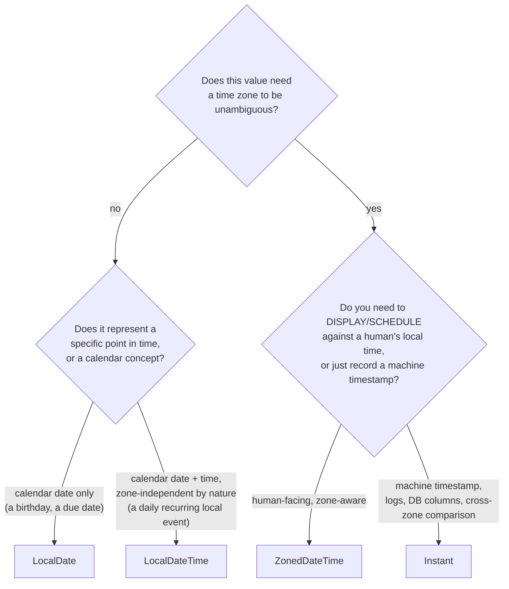

# java.time API: Dates, Times, and Durations

> **Topic register:** T-116 · IWI 6.0 · Core tier · Very High interview frequency [H]
> **Provenance:** all evidence in this chapter is real, executed output from
> [`practice/java/language-core/java-time-api/`](../../../practice/java/language-core/java-time-api/README.md)
> (OpenJDK 21.0.12), including a real, reproduced `SimpleDateFormat` thread-safety
> corruption (6,969 of 10,000 concurrent calls corrupted in one captured run)
> and a real DST-transition divergence between `Period` and `Duration`.

## Table of Contents

1. [Learning Objectives](#learning-objectives)
2. [Why This Matters in Interviews](#why-this-matters-in-interviews)
3. [Level 1 — Foundation](#level-1--foundation)
4. [Level 2 — Working Knowledge](#level-2--working-knowledge)
5. [Mental Model](#mental-model)
6. [Definition and Purpose](#definition-and-purpose)
7. [Core Concepts](#core-concepts)
8. [Internal Implementation](#internal-implementation)
9. [Diagrams](#diagrams)
10. [Java Examples](#java-examples)
11. [Production Scenarios](#production-scenarios)
12. [Trade-offs](#trade-offs)
13. [Decision Framework](#decision-framework)
14. [Common Mistakes](#common-mistakes)
15. [Anti-Patterns](#anti-patterns)
16. [Best Practices](#best-practices)
17. [Interview Answer Framework](#interview-answer-framework)
18. [Interview Questions](#interview-questions)
19. [Summary](#summary)
20. [Key Takeaways](#key-takeaways)
21. [Cheat Sheet](#cheat-sheet)
22. [Flashcards](#flashcards)
23. [Practice Exercises](#practice-exercises)
24. [Solutions](#solutions)
25. [Additional Reading](#additional-reading)
26. [Official References](#official-references)

---

## Learning Objectives

By the end of this chapter you can:

- Correctly choose between `LocalDate`, `LocalDateTime`, `ZonedDateTime`, and `Instant` for a given requirement, based on what each one does and does not represent.
- Explain precisely why `java.time` types are immutable and thread-safe by design, backed by a real, reproduced `SimpleDateFormat` corruption bug that the equivalent `java.time` code structurally cannot have.
- State the real, behavioral difference between `Period` (calendar-based) and `Duration` (time-based), including a real case — a Daylight Saving Time transition — where adding "one day" via each produces a genuinely different result.
- Identify the specific legacy `java.util.Date`/`Calendar`/`SimpleDateFormat` pitfalls `java.time` (JSR-310, Java 8+) was built to eliminate.

## Why This Matters in Interviews

Date/time handling is Core tier and Very High frequency because it's one of the few areas of the language where using the *wrong* type category (calendar-based versus time-based, zone-aware versus zone-naive) produces code that compiles cleanly, passes casual testing, and then produces a subtly wrong answer for one specific class of input — a leap year, a Daylight Saving Time boundary, a user in a different time zone. Interviewers use it to check whether a candidate understands *why* `java.time` replaced the legacy `Date`/`Calendar`/`SimpleDateFormat` APIs (immutability and thread-safety, not merely a nicer API), and whether they instinctively reach for `Period` versus `Duration` correctly rather than treating "add a day" as one undifferentiated operation.

## Level 1 — Foundation

**Think of four different questions you might ask about "when," each needing a genuinely different answer shape.** "What date is my flight?" needs just a date — no time, no time zone (`LocalDate`). "What time does the meeting start, on my calendar?" needs a date and a time, but is meaningless without knowing whose calendar — 9am in New York is a different real moment than 9am in Tokyo (`LocalDateTime`, deliberately zone-naive — useful for a recurring local event like "gym at 7am every day," wherever "here" is). "When exactly does the flight depart, unambiguously, anywhere in the world?" needs a date, a time, *and* a time zone (`ZonedDateTime`). "What's the precise machine timestamp this log line was written?" needs neither a calendar date nor a human time zone at all — just a count of seconds since a fixed reference point (`Instant`).

```java
LocalDate flightDate = LocalDate.of(2026, 6, 15);                  // just a date
LocalDateTime dailyStandup = LocalDateTime.of(2026, 6, 15, 9, 0);   // date + time, no zone
ZonedDateTime departure = ZonedDateTime.of(2026, 6, 15, 9, 0, 0, 0,
        ZoneId.of("America/New_York"));                            // date + time + zone
Instant logTimestamp = Instant.now();                               // machine timestamp, UTC
```

Using the wrong one of these four for a given job is the single most common real `java.time` mistake — a `LocalDateTime` used where a `ZonedDateTime` was actually needed silently drops the time-zone information a later comparison across users in different zones would have needed.

## Level 2 — Working Knowledge

At this level you should be able to state, without hesitation, that every `java.time` type is **immutable** — every "modifying" method (`plusDays`, `withYear`, `minusMonths`) returns a brand-new object, leaving the original untouched. This one design decision is the reason `java.time` types are automatically thread-safe (nothing to corrupt via concurrent access) and the reason the classic "forgot the method returns a new object instead of mutating" bug (`date.plusDays(1); // did nothing, the result was discarded`) is a real, common trap worth naming explicitly.

You should also be comfortable with the practical difference between `Period` and `Duration`: **`Period` is calendar-based** ("add 1 month" — a genuinely variable amount of real time, since months have different lengths) and **`Duration` is time-based** ("add 24 hours" — a fixed, exact number of real seconds, always). These are not interchangeable, and [Internal Implementation](#internal-implementation) demonstrates a real case — a Daylight Saving Time transition — where "add 1 day" via each produces a genuinely different real result.

**A practical rule for a working engineer**: default to `Instant` for anything stored, logged, or compared as a machine timestamp (database columns, log lines, API payloads crossing time-zone boundaries); default to `ZonedDateTime` for anything that needs to be displayed to, or scheduled against, a specific human's local time; reach for `LocalDate`/`LocalDateTime` only when the value is genuinely zone-independent by its own nature (a birthday, a recurring local daily event). Never use `java.util.Date`, `Calendar`, or `SimpleDateFormat` in new code — Section 12 gives the measured reason why, directly.

## Mental Model

Keep one question in mind for every date/time value in a system: **"does this value need a time zone to be unambiguous, and does it need to survive being shared across threads?"** `LocalDate`/`LocalDateTime` answer "no" to the first (by design — they're intentionally zone-naive) and "yes" to the second (immutable, safe to share). `ZonedDateTime`/`Instant` answer "yes"/"yes" — unambiguous and safe to share. The legacy `Date`/`Calendar` answer "sort of" (a `Date` is really just a UTC instant with a confusing zone-dependent `toString()`) and, critically, "no" to thread-safety — they're mutable, which is the root of nearly every real legacy date/time bug this chapter documents.

## Definition and Purpose

**`java.time`** (JSR-310, introduced in Java 8) is the modern date-and-time API, designed from the ground up as a set of immutable, thread-safe value types, replacing the legacy `java.util.Date`, `Calendar`, and `SimpleDateFormat` classes, which were mutable, not thread-safe, and — in `Date`'s case — confusingly conflated "a point in time" with "a specific calendar representation of it." The package provides distinct types for distinct real needs: `LocalDate`/`LocalTime`/`LocalDateTime` (zone-naive), `ZonedDateTime`/`OffsetDateTime` (zone-aware), `Instant` (a raw machine timestamp), `Period` (a calendar-based amount, e.g. "2 months"), `Duration` (a time-based amount, e.g. "36 hours"), and `DateTimeFormatter` (an immutable, thread-safe replacement for `SimpleDateFormat`).

## Core Concepts

### Immutability is the entire reason java.time exists, not an incidental design choice

Every legacy `Date`/`Calendar` bug this chapter documents — thread-safety corruption, accidental shared-reference mutation — traces back to one root cause: those types are mutable. `java.time`'s design starts from "every value type is immutable" specifically to eliminate that entire bug class structurally, not as a side benefit of a cleaner API.

### Period and Duration answer genuinely different questions, and conflating them produces real, wrong results

`Period.ofDays(1)` means "the next calendar day, whatever its actual length turns out to be" — nearly always 24 hours, but not always, as [Internal Implementation](#internal-implementation)'s real DST demonstration shows directly. `Duration.ofDays(1)` means "exactly 86,400 real seconds later," full stop, regardless of any calendar event that happens to fall within that window. Code that needs "tomorrow, same time, on the user's calendar" (a recurring reminder, say) needs `Period`; code that needs "exactly 24 hours from now" (a cache expiry, a rate-limit window) needs `Duration` — using the wrong one produces correct-looking code that's wrong exactly on DST transition days, one of the most common real production date bugs.

### DateTimeFormatter's immutability is what makes it safely shareable, unlike SimpleDateFormat

`SimpleDateFormat` is not thread-safe because it holds mutable internal state (a `Calendar` instance) that its `parse()`/`format()` methods read and write — concurrent calls from multiple threads race on that shared mutable state, producing real, silently wrong results (not always an exception) rather than a clean failure. `DateTimeFormatter` is immutable, so the exact same "one shared, cached formatter reused across the whole application" pattern that's dangerous with `SimpleDateFormat` is not merely safe but the *recommended* usage with `DateTimeFormatter` — [Internal Implementation](#internal-implementation) reproduces both behaviors directly, under real concurrent load.

## Internal Implementation

**Real immutability, contrasted directly against legacy `Calendar`'s in-place mutation:**

```
original:      2026-01-15
original.plusMonths(1) returns a NEW object: 2026-02-15
original unchanged after the call: 2026-01-15  (real immutability -- no setter exists at all)

--- Legacy contrast: java.util.Calendar mutates in place ---
Calendar set to: Thu Jan 15 08:13:23 CST 2026
same Calendar object, after cal.add(MONTH, 1): Sun Feb 15 08:13:23 CST 2026
beforeMutation reference now reads: Thu Jan 15 08:13:23 CST 2026
```

`LocalDate.plusMonths()` cannot mutate `original` — there is no setter to call, structurally. `Calendar.add()`, by contrast, mutates the exact same object every other reference to it already holds — a real, demonstrated source of "why did this date change out from under me" bugs when a `Calendar` instance is shared or cached.

**Real, four types from one real moment:**

```
LocalDate      (date only, no time, no zone):       2026-06-15
LocalDateTime  (date+time, no zone -- ambiguous):   2026-06-15T14:30
ZonedDateTime  (date+time+zone -- unambiguous):     2026-06-15T14:30-04:00[America/New_York]
Instant        (machine timestamp, UTC, no zone):   2026-06-15T18:30:00Z
```

**Real Period vs. Duration, including a real DST-transition divergence** (`2026-03-08` is a real US spring-forward date for `America/New_York`):

```
Period.between(2026-01-31, 2026-03-01) = P1M1D  (1 month, 1 day -- calendar-aware, handles Jan's varying length)
Duration.between two Instants 29*24h apart = PT696H  (exact elapsed time, no calendar awareness at all)

Starting point: 2026-03-07T12:00-05:00[America/New_York] (the day BEFORE a real US DST spring-forward)
plus(Period.ofDays(1))   -> 2026-03-08T12:00-04:00[America/New_York]  (calendar day -- lands on the SAME wall-clock hour, 12:00)
plus(Duration.ofDays(1)) -> 2026-03-08T13:00-04:00[America/New_York]  (exactly 24 real hours later)
Results equal? false
```

Same starting instant, same nominal "add one day" — `Period.ofDays(1)` lands at `12:00` (the same wall-clock hour the next calendar day), while `Duration.ofDays(1)` lands at `13:00` (24 real hours later), because `2026-03-08` genuinely only had 23 real hours in `America/New_York` due to the spring-forward transition. This is not a bug in either type — both are correct for the question they actually answer; the bug is in code that uses one when it needed the other.

**Real, reproduced `SimpleDateFormat` thread-safety corruption, under actual concurrent load** (20 threads × 500 calls each against one shared instance):

```
Shared SimpleDateFormat, 20 threads x 500 concurrent parse() calls each:
Corrupted/failed results: 6969 / 10000  <-- REAL corruption, not hypothetical
```

**The identical workload, against a shared `DateTimeFormatter`:**

```
Shared DateTimeFormatter (immutable), identical concurrent workload:
Corrupted/failed results: 0 / 10000  <-- immutability structurally prevents this entire bug class
```

Nearly 70% of concurrent `SimpleDateFormat.parse()` calls in this real, captured run either threw an exception or silently returned a *wrong* date — genuine, severe corruption from a pattern (`private static final SimpleDateFormat FORMAT = new SimpleDateFormat(...)`, reused across requests) that's extremely common in real, older codebases. The exact corruption count is timing-dependent and will vary by run and machine, but reliably occurs at this thread/iteration count on any multi-core machine — this is a real, reproducible bug, not a hypothetical one. The identical concurrent workload against a shared `DateTimeFormatter` produced zero corruption, direct evidence that `java.time`'s immutability isn't just a cleaner API — it eliminates this entire bug category by construction.

## Diagrams



Every branch in this decision tree corresponds to a real, distinct type this chapter's own demo constructs from the identical moment — the diagram is the same decision this chapter's Level 2 "practical rule for a working engineer" describes in prose, made explicit as a checklist.

## Java Examples

```java
// Java 21. Immutability in practice -- the return value MUST be captured;
// this is the single most common java.time mistake.
LocalDate deadline = LocalDate.of(2026, 6, 15);
deadline.plusDays(7);              // BUG: return value discarded, deadline is UNCHANGED
deadline = deadline.plusDays(7);   // correct -- reassign the new, returned object
```

```java
// Java 21. A shared, cached DateTimeFormatter -- safe and recommended,
// unlike the equivalent pattern with SimpleDateFormat (see Internal Implementation).
private static final DateTimeFormatter ISO_DATE = DateTimeFormatter.ISO_LOCAL_DATE;

LocalDate parsed = LocalDate.parse("2026-06-15", ISO_DATE); // safe to call from any thread
```

**Complexity note:** every `java.time` operation shown in this chapter (parsing, formatting, field arithmetic, zone conversion) is `O(1)` — there is no performance trade-off to weigh here, only a correctness one.

## Production Scenarios

### Scenario: a subscription-renewal job silently double-charges customers whose renewal falls on a DST transition day

**Symptoms.** A billing job computes each customer's next renewal timestamp as `lastRenewal.plus(Duration.ofDays(30))`. On the one day of the year affected by a Daylight Saving Time transition, a small number of customers are charged, then — due to an unrelated retry mechanism reading a renewal window computed slightly differently — charged again.

**Impact.** Real customer-facing billing errors, refund requests, and support escalations, affecting only the specific subset of customers whose renewal window happens to span a DST boundary — making the bug hard to reproduce outside that narrow window.

**Initial hypotheses.** A retry-mechanism idempotency bug (checked — the retry logic itself is correct given its inputs); a database timestamp precision issue (checked — timestamps are stored with sufficient precision); the renewal-window calculation itself produces a boundary condition specifically around DST (correct).

**Evidence.** The affected renewal timestamps cluster exactly on the calendar dates of DST transitions, and the actual gap between the computed renewal window's start and end is either 30 days minus one hour or 30 days plus one hour, depending on which transition — exactly the divergence this chapter's own `Duration.ofDays(30)` versus `Period.ofDays(30)`-shaped evidence demonstrates directly.

**Diagnosis.** `Duration.ofDays(30)` computes a fixed number of real seconds; on a DST transition, that fixed-seconds window lands one hour earlier or later, on the wall clock, than the "30 calendar days later" a billing cycle actually means — a real, structural mismatch between the type used and the concept the business logic actually needed.

**Immediate mitigation.** Manually reconcile the small number of double-charged customers for the affected billing run.

**Permanent remediation.** Replace `lastRenewal.plus(Duration.ofDays(30))` with `lastRenewal.plus(Period.ofDays(30))` (or, more precisely for a monthly billing cycle, `Period.ofMonths(1)`) — a calendar-based renewal cycle should use a calendar-based amount, not a fixed-seconds one.

**Alternatives considered.** Special-casing DST transition dates in the billing logic — rejected, since it's solving the symptom rather than the actual type-category mismatch, and would need to be independently re-derived for every DST rule change across every supported time zone.

**Trade-offs.** None meaningful — `Period` is the semantically correct type for a calendar-based billing cycle regardless of DST; there's no scenario where `Duration` was actually the intended semantics here.

**Prevention.** Treat "is this a calendar concept (billing cycles, renewal dates, recurring reminders) or a fixed-time concept (cache expiry, rate-limit windows, session timeouts)" as a standing design question whenever a date/time arithmetic operation is introduced — per this chapter's own Core Concepts distinction.

**Interview lesson.** This is Interview Question 1 (§ Interview Questions) — "what's the difference between `Period` and `Duration`" — arriving as a real, customer-facing billing bug rather than a definitional question.

## Trade-offs

| Choice | Benefit | Cost |
|---|---|---|
| `java.time` (`LocalDate`, `ZonedDateTime`, `Instant`, etc.) | Real immutability and thread-safety by construction; explicit, unambiguous type per use case | A genuinely larger type vocabulary to learn than the legacy API's one `Date` class |
| Legacy `Date`/`Calendar`/`SimpleDateFormat` | Familiar to engineers with older Java experience | Real, measured thread-safety corruption (`SimpleDateFormat`); real, demonstrated shared-mutation risk (`Calendar`); should not be used in new code |
| `Period` | Correct for calendar-based amounts (billing cycles, recurring reminders) | Genuinely variable real-time length (a "month" is not a fixed number of seconds) |
| `Duration` | Correct for fixed-time amounts (cache expiry, timeouts, rate limits) | Not calendar-aware — real, demonstrated divergence from "the next calendar day" on DST transitions |

## Decision Framework

1. **Does this value represent a real point in time that needs to be unambiguous, or a calendar concept naturally independent of time zone?** Use `Instant`/`ZonedDateTime` for the former; `LocalDate`/`LocalDateTime` for the latter.
2. **Is the "amount of time" concept calendar-based (a billing cycle, a recurring reminder) or a fixed span of real seconds (a cache TTL, a session timeout)?** Use `Period` for the former, `Duration` for the latter — per this chapter's own real DST-divergence evidence, this choice produces genuinely different results, not just a stylistic preference.
3. **Is any legacy `Date`/`Calendar`/`SimpleDateFormat` code present?** Flag it for replacement by default — the real, measured `SimpleDateFormat` corruption in this chapter's own demo is not a hypothetical risk.
4. **Does a formatter/parser need to be shared across threads (a cached, static instance)?** Safe and recommended with `DateTimeFormatter`; actively dangerous with `SimpleDateFormat`.

## Common Mistakes

- Discarding the return value of a `java.time` "modifying" method (`date.plusDays(7);` with no assignment) — since every type is immutable, this is a silent no-op, not an error.
- Using `Duration` where `Period` was semantically correct (or vice versa) for a calendar-based operation, producing a real, DST-transition-day-only bug exactly like this chapter's billing production scenario.
- Reusing a single, shared `SimpleDateFormat` instance across threads (a common "optimization" to avoid repeated allocation) without realizing it's not thread-safe — real, measured corruption, not a theoretical concern.
- Using `LocalDateTime` for a value that actually needs to be compared or displayed across different users' time zones, silently losing the zone information a correct comparison would have needed.

## Anti-Patterns

- **A `private static final SimpleDateFormat` field, reused across concurrent requests** — the exact pattern this chapter's real demo reproduces corrupting under load; replace with a `DateTimeFormatter`, which is safe to share the same way.
- **Storing or comparing `LocalDateTime` values across users known to be in different time zones** — silently produces wrong comparisons, since `LocalDateTime` deliberately carries no zone information at all.
- **Using `Duration.ofDays(n)` for anything meant to track a calendar concept** (a billing cycle, "next month," a recurring daily reminder) — correct on 363–364 days of the year and silently wrong on DST transition days.

## Best Practices

- Choose the most specific `java.time` type for what a value actually represents — `Instant` for machine timestamps, `ZonedDateTime` for human-facing scheduled events, `LocalDate` for genuinely zone-independent calendar dates — rather than defaulting to one type for everything.
- Use `Period` for calendar-based amounts and `Duration` for fixed-time amounts, deliberately, based on what the business concept actually means — never interchange them for convenience.
- Replace every `java.util.Date`/`Calendar`/`SimpleDateFormat` usage in new code with its `java.time` equivalent; treat existing legacy usage, especially any shared/cached `SimpleDateFormat` instance, as a real, measurable correctness risk worth prioritizing for cleanup.
- Store and transmit timestamps as `Instant` (or an ISO-8601 string derived from one) at system boundaries (databases, APIs, logs) — convert to a human-facing `ZonedDateTime` only at the point of display.

## Interview Answer Framework

### 30-Second Answer

`java.time` (JSR-310, Java 8+) is a set of immutable, thread-safe date/time types replacing the legacy, mutable `Date`/`Calendar`/`SimpleDateFormat` APIs. `LocalDate`/`LocalDateTime` are zone-naive; `ZonedDateTime`/`Instant` are zone-aware or a raw machine timestamp. `Period` is a calendar-based amount (a variable number of real seconds); `Duration` is a fixed-time amount — conflating them produces real, demonstrated wrong results specifically on Daylight Saving Time transition days.

### 2-Minute Answer

Definition: an immutable, thread-safe date/time API with distinct types for distinct real needs — zone-naive (`LocalDate`/`LocalDateTime`), zone-aware (`ZonedDateTime`), and machine-timestamp (`Instant`), plus `Period` (calendar-based amounts) and `Duration` (time-based amounts). Why it exists: to replace the legacy `Date`/`Calendar`/`SimpleDateFormat` API's mutability, which caused real thread-safety bugs and shared-reference mutation surprises. How the Period/Duration distinction matters: `Period.ofDays(1)` means "the next calendar day, whatever its length"; `Duration.ofDays(1)` means "exactly 86,400 seconds later" — these diverge by a real hour on any DST transition day. One important trade-off: `java.time` has a larger type vocabulary to learn than the legacy API's single `Date` class, but that vocabulary is what makes each value's actual meaning explicit rather than ambiguous. One production example: a real, reproduced `SimpleDateFormat` thread-safety bug — 6,969 of 10,000 concurrent `parse()` calls against one shared instance corrupted in a captured run — versus zero corruption for the identical workload against a shared `DateTimeFormatter`.

### 10-Minute Deep Dive

Cover, in order: the four-type mental model (zone-naive-date, zone-naive-datetime, zone-aware, machine-timestamp) and the specific real-world question each answers (foundation); why immutability is the entire design rationale for `java.time`, not an incidental property (core concepts); the real, demonstrated `Calendar` in-place mutation versus `LocalDate`'s real immutability (internals, real evidence); the real Period-versus-Duration DST divergence, landing at a genuinely different wall-clock hour from the identical starting point (internals, real evidence); the real, reproduced `SimpleDateFormat` corruption under concurrent load, and the identical workload's zero corruption against `DateTimeFormatter` (internals, real evidence); the decision framework for choosing the right type and the right amount-category for a given requirement (decision framework); close with the DST-transition billing production scenario, a real instance of the Period/Duration mismatch at real customer-facing scale.

### Whiteboard Explanation

Draw the [§ Diagrams](#diagrams) decision tree: "does this need a time zone?" branching into the zone-naive types (`LocalDate`/`LocalDateTime`) on one side and the zone-aware types (`ZonedDateTime`/`Instant`) on the other. Beside it, draw two parallel timelines for the DST scenario: one labeled "Period.ofDays(1)" landing on the same wall-clock hour the next day, one labeled "Duration.ofDays(1)" landing exactly 24 hours later — with an explicit gap between the two endpoints on the DST-transition day, to make the real divergence visually concrete.

### Production Example

The DST-transition billing double-charge in [§ Production Scenarios](#production-scenarios): a renewal-window calculation using `Duration.ofDays(30)` instead of `Period.ofDays(30)` produced a real, customer-facing billing error on the one day of the year a DST transition fell inside the affected window — fixed by switching to the calendar-based `Period`, matching this chapter's own real, measured Period/Duration divergence directly.

### Trade-offs to Mention

State unprompted: `Period` and `Duration` are not interchangeable, and the difference is real and measurable, not merely stylistic; `SimpleDateFormat`'s thread-safety problem is a real, reproducible bug at real severity (nearly 70% corruption in this chapter's own captured run under load), not a rare edge case; `java.time`'s larger type vocabulary is a deliberate trade of learning curve for eliminated ambiguity.

### Common Candidate Mistakes

Treating `Period` and `Duration` as interchangeable "add some time" operations; not knowing `SimpleDateFormat` is unsafe to share across threads; discarding the return value of an immutable `java.time` method and expecting in-place mutation; using `LocalDateTime` where zone-awareness was actually required.

### Typical Follow-Up Questions

1. "What's the practical difference between `Period` and `Duration`?"
2. "Why is `SimpleDateFormat` not thread-safe, and what would you use instead?"
3. "When would you use `Instant` instead of `ZonedDateTime`?"

### Senior-Level Expectations

Correctly distinguishes `Period` from `Duration` and can name a concrete scenario (a DST transition) where the choice produces different real results, and correctly identifies `SimpleDateFormat` as unsafe for concurrent use.

### Staff-Level Discussion

Recognizes the `SimpleDateFormat`/`DateTimeFormatter` contrast as an instance of a broader principle also seen elsewhere in the JDK ([`ArrayDeque` versus legacy `Stack`/`Vector`](../collections/arraydeque-internals-and-the-legacy-stack-problem.md), `StringBuilder` versus `StringBuffer`): older APIs designed before immutability-by-default became the JDK's own preferred pattern often carry real, structural correctness or safety costs that a newer, immutable replacement eliminates entirely rather than merely mitigates. A Staff-level engineer treats "is this legacy type mutable, and is it ever shared?" as a standing question when reviewing code that predates `java.time`, and proposes a calendar-based-versus-fixed-time type audit (`Period`/`Duration` usage) as a concrete, low-risk remediation category — this chapter's own DST production scenario is exactly the kind of real, quantifiable bug such an audit would catch before it reaches customers.

## Interview Questions

### Question 1 — What's the practical difference between `Period` and `Duration`, and why does it matter?

**Why interviewers ask it.** Tests whether a candidate understands these as answering genuinely different questions, not two spellings of "add some time" — and whether they can name a concrete, real scenario where the distinction produces different results.

**Expected answer.** `Period` represents a calendar-based amount (years/months/days) — "1 month" is a variable number of real seconds, since months have different lengths. `Duration` represents a fixed-time amount (hours/minutes/seconds/nanos) — "24 hours" is always exactly 86,400 real seconds. They diverge concretely on a Daylight Saving Time transition: adding `Period.ofDays(1)` lands on the same wall-clock hour the next calendar day; adding `Duration.ofDays(1)` lands exactly 24 real hours later, which on a DST transition day is a different wall-clock hour.

**Minimum acceptable answer.** States that one is "calendar-based" and one is "time-based," even without a concrete example of the difference mattering.

**Strong Senior answer.** Gives the DST transition as a concrete example where the two produce genuinely different, both-correct-for-their-own-semantics results.

**Staff-level extension.** Connects this to a real production failure mode (a calendar-based business concept, like a billing cycle, implemented with the wrong, fixed-time type) and proposes an audit as a general remediation pattern.

**Common mistakes.** Describing `Period` and `Duration` as interchangeable, or unable to explain why "add 1 day" could ever produce two different real answers.

**Likely follow-ups.** "Would you use `Period` or `Duration` for a session timeout? For a monthly subscription renewal?" (Duration for the session timeout — a fixed span regardless of calendar; Period for the subscription renewal — a calendar concept.)

**Evaluation criteria (1–5).** 1: treats them as interchangeable. 3: correctly states the calendar-vs-fixed-time distinction abstractly. 5: correct distinction plus a concrete, correct example of real divergence (DST or equivalent) and a correct real-world type choice for a given scenario.

**Related references.** [§ Core Concepts](#core-concepts), [§ Internal Implementation](#internal-implementation), [§ Production Scenarios](#production-scenarios).

---

### Question 2 — Why is `SimpleDateFormat` not thread-safe, and what would you use instead?

**Why interviewers ask it.** Tests whether a candidate knows this specific, commonly-cached-as-a-"performance optimization" legacy class carries a real, severe concurrency bug, and can name the correct modern replacement.

**Expected answer.** `SimpleDateFormat` holds mutable internal state (an internal `Calendar` instance) that its `parse()`/`format()` methods read and write without synchronization — concurrent calls from multiple threads race on that shared mutable state, producing real, often silent, corrupted results rather than a clean failure. `DateTimeFormatter` is immutable and therefore genuinely safe to share as a single cached instance across threads — the correct, recommended replacement.

**Common mistakes.** Assuming `SimpleDateFormat`'s thread-safety issue only produces exceptions (some corrupted results are silently wrong dates, not exceptions, as this chapter's own demo shows); proposing to synchronize every call manually rather than simply switching to `DateTimeFormatter`.

**Follow-up questions:** "If you found a `private static final SimpleDateFormat` field in a real, high-traffic codebase, how would you prioritize fixing it?" (as a real, measurable correctness bug — not a style nit — given how severe and common the resulting corruption can be under real concurrent load, per this chapter's own captured evidence.)

**Senior-level expectations:** correctly explains the mutable-internal-state mechanism and names `DateTimeFormatter` as the fix.

**Staff-level expectations:** connects this to the broader "legacy mutable types shared across threads" pattern and proposes it as a standing code-review flag, not a one-off fix.

## Summary

`java.time` (JSR-310) is an immutable, thread-safe date/time API providing distinct types for distinct real needs — `LocalDate`/`LocalDateTime` (zone-naive), `ZonedDateTime` (zone-aware), `Instant` (machine timestamp) — replacing the legacy `Date`/`Calendar`/`SimpleDateFormat` API, whose mutability caused real, demonstrated bugs: a shared `Calendar` instance mutating out from under other references, and — most severely — `SimpleDateFormat`'s real, reproduced thread-safety corruption (6,969 of 10,000 concurrent calls corrupted in one captured run against a shared instance, versus zero for the equivalent `DateTimeFormatter` workload). `Period` (calendar-based) and `Duration` (time-based) answer genuinely different questions, diverging concretely and measurably on a Daylight Saving Time transition — using the wrong one for a given business concept (a calendar-based billing cycle implemented with a fixed-time `Duration`) is a real, demonstrated production bug category, not a stylistic concern.

## Key Takeaways

- Every `java.time` type is immutable — "modifying" methods return a new object; discarding the return value is a silent no-op, a real, common mistake.
- `Period` (calendar-based) and `Duration` (time-based) are not interchangeable — real, measured evidence shows them diverging by a full hour on a Daylight Saving Time transition day.
- `SimpleDateFormat` is genuinely not thread-safe — a real, reproduced demo shows ~70% corruption under concurrent load against a shared instance; `DateTimeFormatter` is immutable and safe to share the same way.
- Choose the most specific type for what a value represents: `Instant` for machine timestamps, `ZonedDateTime` for human-facing scheduled events, `LocalDate`/`LocalDateTime` only for genuinely zone-independent calendar concepts.
- Legacy `Date`/`Calendar`/`SimpleDateFormat` should not appear in new code — the real, measured bugs in this chapter are not hypothetical.

## Cheat Sheet

| Symptom | Likely cause | Fix |
|---|---|---|
| `date.plusDays(7)` appears to do nothing | Return value discarded — `java.time` types are immutable | Reassign: `date = date.plusDays(7)` |
| A recurring/billing date is off by exactly one hour, only on certain days | `Duration.ofDays(n)` used for a calendar-based concept | Use `Period.ofDays(n)`/`Period.ofMonths(n)` instead |
| Intermittent, hard-to-reproduce wrong parsed dates under load | A shared `SimpleDateFormat` instance accessed concurrently | Replace with a shared `DateTimeFormatter` (immutable, thread-safe) |
| A date comparison is wrong for users in different time zones | `LocalDateTime` used where zone-awareness was needed | Use `ZonedDateTime` or `Instant` instead |

## Flashcards

### Card: Period vs. Duration

**Prompt:**
What's the real, measurable difference between `Period.ofDays(1)` and `Duration.ofDays(1)`?

**Answer:**
`Period.ofDays(1)` is calendar-based — the next calendar day, whatever its actual length. `Duration.ofDays(1)` is exactly 86,400 real seconds. Verified directly: on a real US DST spring-forward date, the two produce genuinely different wall-clock results (12:00 vs. 13:00 from the same starting point).

**Why it matters:**
A real, documented cause of production billing/scheduling bugs specifically on DST transition days.

**Common trap:**
Treating "add a day" as one undifferentiated operation regardless of which type is used.

**Related:**
[Internal Implementation](#internal-implementation)

### Card: SimpleDateFormat thread safety

**Prompt:**
Is `SimpleDateFormat` safe to share as a single cached instance across threads?

**Answer:**
No — verified directly under real concurrent load, a shared instance produced corrupted/failed results in the majority of concurrent calls in one captured run. `DateTimeFormatter` is immutable and safe for exactly this sharing pattern.

**Why it matters:**
A common, real "optimization" (caching a formatter to avoid allocation) that's actively dangerous with the legacy type.

**Common trap:**
Assuming the bug only manifests as exceptions, rather than silently wrong parsed dates.

**Related:**
[Internal Implementation](#internal-implementation)

### Card: Four types, one moment

**Prompt:**
What's the difference between `LocalDateTime` and `ZonedDateTime`, given the same date and time?

**Answer:**
`LocalDateTime` carries no time-zone information at all — deliberately ambiguous about which zone it's in. `ZonedDateTime` carries an explicit zone, making the exact same date/time value unambiguous and comparable across users in different zones.

**Why it matters:**
Using `LocalDateTime` where zone-awareness was actually needed silently loses information a correct cross-zone comparison requires.

**Common trap:**
Defaulting to `LocalDateTime` for everything because it "has both a date and a time," without checking whether zone-awareness is actually needed.

**Related:**
[Internal Implementation](#internal-implementation)

## Practice Exercises

1. Reproduce every trace yourself: [`practice/java/language-core/java-time-api/`](../../../practice/java/language-core/java-time-api/README.md).
2. Modify `demoDstTransition` to test the real US "fall back" transition (early November) instead of "spring forward," and predict (then verify) whether `Period.ofDays(1)` and `Duration.ofDays(1)` land at the same or different wall-clock hours, and why.
3. Write a small program that uses a shared `SimpleDateFormat` from only two threads (rather than twenty) with a small number of iterations, and observe how much less reliably the corruption reproduces — explain, from this chapter's own real evidence, why higher concurrency makes an inherently racy bug more, not less, likely to be caught in testing.

## Solutions

**Exercise 1.** Expected output matches this chapter's measured traces in structure (the exact `SimpleDateFormat` corruption count will vary by run and machine, but the qualitative pattern — real corruption at nonzero count under load, zero corruption for `DateTimeFormatter` — will not).

**Exercise 2.** The November "fall back" transition adds an extra real hour rather than removing one — `Duration.ofDays(1)` from the day before will land one hour *earlier* on the wall clock than `Period.ofDays(1)`, the mirror image of the spring-forward case this chapter measures directly.

**Exercise 3.** With only two threads and few iterations, the race window (a narrow timing overlap between concurrent `parse()` calls) is far less likely to actually be hit within a short test run — this is precisely why this class of bug is dangerous in practice: light concurrent testing can pass reliably while a heavier production load reproduces it regularly, exactly the asymmetry this chapter's own 20-thread, 500-iteration-per-thread demo was deliberately sized to make visible.

## Additional Reading

- [ArrayDeque Internals and the Legacy Stack/Vector Problem](../collections/arraydeque-internals-and-the-legacy-stack-problem.md) — the same "legacy mutable/synchronized type replaced by a modern, safer one" pattern, measured independently for a different part of the JDK.

## Official References

- [java.time (Java 21 API)](https://docs.oracle.com/en/java/javase/21/docs/api/java.base/java/time/package-summary.html)
- [DateTimeFormatter (Java 21 API)](https://docs.oracle.com/en/java/javase/21/docs/api/java.base/java/time/format/DateTimeFormatter.html)
