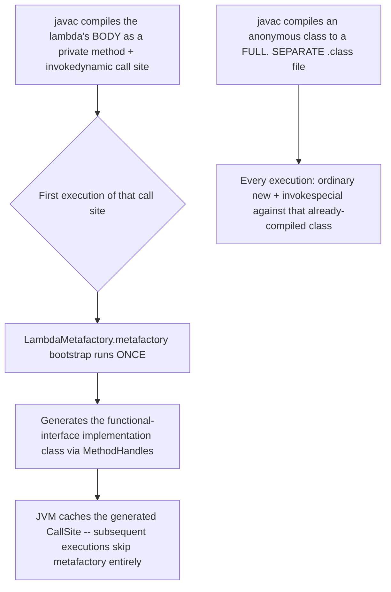

# Lambdas and Functional Interfaces

> **Topic register:** T-108 · IWI 5.3 · Core tier · High interview frequency [H]
> **Provenance:** all evidence in this chapter is real, executed/compiled output from
> [`practice/java/lambdas-and-functional-interfaces/`](../../../practice/java/lambdas-and-functional-interfaces/README.md)
> (OpenJDK 21.0.12), including two real `javac` compiler errors.

## Table of Contents

1. [Learning Objectives](#learning-objectives)
2. [Why This Matters in Interviews](#why-this-matters-in-interviews)
3. [Level 1 — Foundation](#level-1--foundation)
4. [Level 2 — Working Knowledge](#level-2--working-knowledge)
5. [Mental Model](#mental-model)
6. [Definition and Purpose](#definition-and-purpose)
7. [Core Concepts](#core-concepts)
8. [Internal Implementation](#internal-implementation)
9. [Diagrams](#diagrams)
10. [Production Scenarios](#production-scenarios)
11. [Trade-offs](#trade-offs)
12. [Decision Framework](#decision-framework)
13. [Common Mistakes](#common-mistakes)
14. [Anti-Patterns](#anti-patterns)
15. [Best Practices](#best-practices)
16. [Interview Answer Framework](#interview-answer-framework)
17. [Interview Questions](#interview-questions)
18. [Summary](#summary)
19. [Key Takeaways](#key-takeaways)
20. [Cheat Sheet](#cheat-sheet)
21. [Flashcards](#flashcards)
22. [Practice Exercises](#practice-exercises)
23. [Solutions](#solutions)
24. [Additional Reading](#additional-reading)
25. [Official References](#official-references)

---

## Learning Objectives

By the end of this chapter you can:

- Explain, with real bytecode, why a lambda compiles to `invokedynamic` and a `LambdaMetafactory` bootstrap rather than a compiler-generated inner class — and what that actually buys over the old anonymous-class idiom.
- State the effectively-final capture rule precisely, explain *why* it exists (value capture, not reference capture), and apply the two real workarounds correctly.
- Explain what the single-abstract-method (SAM) contract actually requires, and why `default`/`static` interface methods don't count toward it.
- Identify and correctly apply all four kinds of method references as pure syntactic sugar over specific lambda shapes.

## Why This Matters in Interviews

Lambdas are Core tier and High frequency for an unusual reason: almost every Senior/Staff candidate writes them fluently, which means interviewers routinely probe *underneath* the syntax — what a lambda actually compiles to, why the effectively-final rule exists rather than just "it's a Java rule," and what a functional interface's contract really requires. This is a topic where "I use lambdas every day" and "I can explain what's happening" are frequently two different candidates, and this chapter closes that gap with real bytecode and real compiler errors rather than a syntax refresher.

## Level 1 — Foundation

**A lambda is a compact way to write "a small piece of behavior" that you can pass around like a value**, instead of writing a full class just to implement one method. `list.sort((a, b) -> a.compareTo(b));` passes a tiny piece of comparison logic directly where it's needed, rather than defining a separate named class that implements `Comparator`.

Think of it like the difference between hiring and formally naming someone for a one-time errand versus just handing a colleague a sticky note with instructions — a lambda is the sticky note. Everyday places you'll already see this: sorting with a custom comparison (`Comparator`), running a small task on a background thread (`Runnable`), or reacting to a button click or event.

## Level 2 — Working Knowledge

The everyday lambda shape is `(parameters) -> expression` (or `{ statements }` for more than one line): `x -> x * 2`, `(a, b) -> a + b`, `() -> System.out.println("done")`. When a lambda's body is *just* calling one existing method, a **method reference** is a shorter equivalent: `s -> s.toUpperCase()` can be written as `String::toUpperCase`, and `x -> System.out.println(x)` as `System.out::println` — purely a shorthand, with no behavior difference.

**The one practical rule that trips people up**: a lambda can only reference a local variable from its enclosing method if that variable is never reassigned after it's first set ("effectively final"). `int count = 0; list.forEach(x -> count++);` fails to compile — `count` is being reassigned, so the lambda can't capture it. The everyday workaround is an `AtomicInteger` (or restructuring to avoid needing a mutable local at all) — Section 5 explains precisely why this restriction exists.

## Mental Model

**A lambda is not an object literal — it's a deferred call to a factory the JVM builds for you at runtime, the first time that specific call site executes.** Unlike an anonymous class, which the compiler fully materializes as a `.class` file at compile time, a lambda leaves only a small private method and an `invokedynamic` instruction in the enclosing class; the actual implementation class is synthesized on demand by `LambdaMetafactory` using `MethodHandle`s. This is why lambdas have effectively no per-instance class-loading cost at startup and why they capture *values*, not *variable slots* — there is no live variable to point back to once the enclosing method returns.

## Definition and Purpose

A **functional interface** is an interface with exactly one abstract method (a "SAM" — single abstract method), optionally annotated `@FunctionalInterface` for compiler-enforced documentation of that contract. A **lambda expression** is a compact, anonymous implementation of a functional interface's single abstract method — `(params) -> expression` or `(params) -> { statements }`. They exist because Java 8 needed a way to pass behavior as a value (for `Stream`, `Comparator`, `Runnable`, event handlers, and beyond) without the verbosity of a full anonymous class for every single-method implementation, and — more importantly — without allocating and loading a distinct compiled class for every use site, which is exactly what the `invokedynamic`-based implementation avoids (see [Internal Implementation](#internal-implementation)).

## Core Concepts

### The SAM contract, precisely

A functional interface must have exactly one **abstract** method. `default` and `static` methods do not count — an interface with one abstract method plus any number of `default`/`static` methods is still a valid functional interface, verified directly in [Internal Implementation](#internal-implementation). `@FunctionalInterface` is not just documentation: `javac` genuinely enforces the constraint and fails compilation if a second abstract method is added.

### Capture is by value, not by reference — hence "effectively final"

A lambda that references a local variable from its enclosing scope captures that variable's **value at the moment the lambda object is created**, not a live reference to the variable's storage location. The JLS therefore requires any captured local to be `final` or *effectively final* (never reassigned after initialization) — if reassignment were allowed, the captured copy and the "real" variable could silently diverge with no way for the lambda to observe the change. This restriction applies only to **local variables**; instance and static **fields** are read through `this` (or the class) at call time and have no such restriction at all.

### Method references are pure sugar over a specific lambda shape

`ClassName::staticMethod` (static), `instance::method` (bound instance), `ClassName::instanceMethod` (unbound instance — the receiver becomes the first parameter), and `ClassName::new` (constructor) are each shorthand for one specific lambda shape a candidate should be able to expand by hand. There is no runtime distinction between a method reference and its expanded lambda equivalent — both compile through the identical `invokedynamic`/`LambdaMetafactory` mechanism.

## Internal Implementation

**A lambda produces no extra `.class` file; an anonymous class does — measured directly:**

```
$ javac -d out src/LambdaExample.java src/AnonymousExample.java
$ ls out/
AnonymousExample$1.class
AnonymousExample.class
LambdaExample.class
```

The anonymous inner class produces a real, separately-compiled `AnonymousExample$1.class`. The lambda produces nothing beyond `LambdaExample.class` itself — its implementation doesn't exist as a class file until the JVM generates it at runtime.

**Real bytecode: `invokedynamic` versus ordinary object construction:**

```
=== LambdaExample ===
    0: invokedynamic #7,  0    // InvokeDynamic #0:run:()Ljava/lang/Runnable;
    ...
  private static void lambda$main$0();   // the lambda body, compiled as an ordinary private method

=== AnonymousExample ===
    0: new           #7        // class AnonymousExample$1
    3: dup
    4: invokespecial #9        // Method AnonymousExample$1."<init>":()V
```

The lambda's body is compiled as an ordinary private method (`lambda$main$0`) in the *same* class, and the call site is a single `invokedynamic` instruction. The anonymous class compiles to completely ordinary `new` + constructor-call bytecode against its own separately-compiled class.

**The real bootstrap method that actually builds the lambda's implementation class:**

```
BootstrapMethods:
  0: #43 REF_invokeStatic java/lang/invoke/LambdaMetafactory.metafactory:(...)Ljava/lang/invoke/CallSite;
```

`invokedynamic`'s bootstrap is `java.lang.invoke.LambdaMetafactory.metafactory` — it generates the `Runnable` implementation using `MethodHandle`s the first time the call site executes, not at compile time. This is the real mechanism behind the "no extra `.class` file" observation above.

**Effectively-final capture: a real compiler error, and why it's correct:**

```
$ javac -d out src/CapturingBroken.java
src/CapturingBroken.java:7: error: local variables referenced from a lambda expression must be final or effectively final
            count++;
            ^
2 errors
```

```
$ java -cp out CapturingFixed
Fix 1 (AtomicInteger box): 1, 2, 3
Fix 2 (static field mutation, no restriction at all): 3
Effectively-final (never reassigned) local, no error: captured-once-used-in-lambda
```

Boxing the mutable state (`AtomicInteger`) works because the *captured local* — the reference to the box — never changes after capture, only the object it points to. Field mutation has no restriction at all, since fields aren't value-captured the way locals are.

**The SAM contract, real compiler enforcement, and real proof that `default`/`static` don't count:**

```
$ javac -d out src/FunctionalInterfaceContractBroken.java
error: Unexpected @FunctionalInterface annotation
  TwoAbstractMethods is not a functional interface
    multiple non-overriding abstract methods found in interface TwoAbstractMethods
```

```
$ java -cp out FunctionalInterfaceContractFixed
lambda satisfies the single abstract method
default method -- does not count toward SAM
static method -- does not count toward SAM either
```

## Diagrams



## Production Scenarios

### Scenario: a shared mutable counter captured in a lambda produces a compile error that blocks a hotfix

**Symptoms.** An engineer adds a quick metrics-counting lambda inside a request handler — `int errorCount = 0; requests.forEach(r -> { if (r.failed()) errorCount++; });` — and the build fails with `variable errorCount might not have been initialized` or the effectively-final error, blocking what was meant to be a five-minute hotfix during an active incident.

**Impact.** A time-pressured fix stalls on a compiler error the engineer doesn't immediately recognize the cause of, during an incident where every minute matters.

**Initial hypotheses.** A build/tooling flake (checked — the error is a real, deterministic `javac` diagnostic, reproduced on a clean build); an unrelated syntax mistake (checked — the code is syntactically valid Java, just semantically disallowed); the lambda is capturing a local variable it then reassigns (correct).

**Evidence.** The exact error text matches this chapter's [§ Internal Implementation](#internal-implementation) reproduction verbatim: `local variables referenced from a lambda expression must be final or effectively final`.

**Diagnosis.** The engineer's `int errorCount` is a local variable reassigned inside the lambda — exactly the restriction this chapter measures, because the lambda would otherwise be operating on a stale, capture-time copy with no way to write back to the enclosing method's variable.

**Immediate mitigation.** Swap the local `int` for an `AtomicInteger` (or, in a purely single-threaded context, a one-element array) so the captured local — the reference — never changes, unblocking the build immediately.

**Permanent remediation.** None needed beyond the fix itself — this is exactly the intended, correct compiler behavior, not a defect to work around structurally; document the effectively-final rule in onboarding material so it stops costing incident time to rediscover.

**Alternatives considered.** Rewriting the loop as an explicit `for` loop instead of `forEach` — a reasonable alternative when a mutable accumulator is the natural shape, but the boxed-counter fix is faster and preserves the stream idiom already in use elsewhere in the codebase.

**Trade-offs.** `AtomicInteger` adds a small, real allocation and indirection cost versus a primitive `int` — negligible for a per-request counter, and irrelevant compared to unblocking an incident fix.

**Prevention.** Treat this error as informative, not obstructive — it is the compiler correctly preventing a genuine capture-semantics bug, and the fix (box the mutable state) is a five-second, well-understood pattern once recognized.

**Interview lesson.** This is Interview Question 1 (§ Interview Questions) — "why can't a lambda capture a mutable local variable?" — arriving as a real, time-pressured build failure rather than an abstract rule to recite.

## Trade-offs

| Choice | Benefit | Cost |
|---|---|---|
| Lambda | No extra `.class` file; concise; captures enclosing scope implicitly | Effectively-final capture restriction on locals; harder to name/reuse across call sites without extracting a variable |
| Anonymous inner class | Can have multiple methods/state, no SAM restriction; explicit `this` refers to the anonymous instance | A real, separate `.class` file per use site; more verbose |
| Method reference | Most concise where it applies directly; unambiguous about which method is being referenced | Only applies when an existing method's signature matches the target functional interface exactly |
| Boxed mutable capture (`AtomicInteger`, one-element array) | Works around the effectively-final restriction correctly | Extra allocation/indirection versus a primitive local |

## Decision Framework

1. **Does the target functional interface need more than one method's worth of behavior, or per-instance mutable state beyond what's captured?** Use an anonymous (or named) class, not a lambda — a lambda is fundamentally a single-method value.
2. **Does an existing method already do exactly what the lambda body would do, with a matching signature?** Prefer a method reference — it's not just shorter, it names the actual behavior being invoked.
3. **Does the lambda need to mutate a variable from the enclosing scope?** It can't, for a local — box the state (`AtomicInteger`, a small mutable holder class) or restructure to avoid the need, rather than fighting the restriction.
4. **Is the interface meant to be implemented via lambda by callers?** Annotate it `@FunctionalInterface` — the compiler will catch a future accidental second abstract method before it becomes a breaking API change.

## Common Mistakes

- Believing a lambda "captures the variable" the way a closure captures a mutable reference in some other languages — Java captures the *value*, which is precisely why the effectively-final rule exists.
- Assuming `default`/`static` interface methods block `@FunctionalInterface`, and needlessly avoiding them.
- Treating a method reference as a different runtime mechanism from a lambda rather than recognizing it's the identical `invokedynamic` path underneath.
- Writing an anonymous class out of habit for a simple single-method implementation, incurring an unnecessary extra compiled class.

## Anti-Patterns

- **Fighting the effectively-final restriction with a hacky single-element array** as a matter of course, instead of reaching for `AtomicInteger`/a small named holder class that documents intent.
- **Overusing method references where the resulting code is less clear than the equivalent lambda** — e.g., an unbound instance reference on an unfamiliar type, where a short lambda would read more obviously.
- **Treating every functional-interface parameter as an invitation for a one-line inline lambda**, even when the logic is complex enough that a named method (referenced via `::`) would be clearer.

## Best Practices

- Annotate custom functional interfaces with `@FunctionalInterface` so accidental contract violations are caught by the compiler, not discovered by a caller.
- Prefer a method reference over a lambda whenever an existing method already does exactly the required work with a matching signature.
- When a lambda genuinely needs mutable shared state, box it explicitly (`AtomicInteger`, a small named holder) rather than working around the restriction indirectly.
- Reach for an anonymous or named class, not a lambda, the moment more than one method or meaningful per-instance state is actually needed.

## Interview Answer Framework

### 30-Second Answer

A lambda is a compact implementation of a functional interface's single abstract method; unlike an anonymous class, it compiles to an `invokedynamic` call site plus a private method, with the actual implementation class generated at runtime by `LambdaMetafactory` — not written out as a `.class` file by `javac`. Captured local variables must be effectively final because a lambda captures their *value*, not a live reference. Method references are pure syntactic sugar over specific lambda shapes — same runtime mechanism.

### 2-Minute Answer

Definition: a functional interface has exactly one abstract method; a lambda is a compact implementation of it. Why it exists: to pass behavior as a value without full anonymous-class verbosity or per-use-site class-loading cost. How it works: `javac` compiles the lambda body to a private method and an `invokedynamic` call site; `LambdaMetafactory` generates the actual implementation class at runtime, once, on first execution. One important trade-off: captured locals must be effectively final (value capture, not reference capture), while fields have no such restriction. Production example: a real `javac` error — `local variables referenced from a lambda expression must be final or effectively final` — reproduced from a mutable local counter captured inside a `forEach` lambda, fixed by boxing the counter in an `AtomicInteger`.

### 10-Minute Deep Dive

Cover, in order: the mental model — a lambda is a deferred factory call, not a compile-time class (mental model); the real, measured `.class`-file-count and bytecode difference between a lambda and an anonymous class, down to the `LambdaMetafactory` bootstrap (internals, real evidence); the effectively-final capture rule, its real compiler error, and both real fixes — boxing versus field mutation (internals, real evidence); the SAM contract's precise scope, with real proof that `default`/`static` methods don't count (internals, real evidence); the four kinds of method references as sugar over specific lambda shapes (core concepts); and close with the production scenario — a real incident-time build failure caused by exactly this capture restriction.

### Whiteboard Explanation

Draw the [§ Diagrams](#diagrams) flowchart: compile time produces a private method plus an `invokedynamic` call site; the *first* runtime execution triggers `LambdaMetafactory` to generate the implementation class once; every subsequent execution reuses the cached call site. Contrast with the anonymous-class path directly beside it: a full, separate class file compiled once, constructed via ordinary `new` on every execution. This makes the "no extra `.class` file" claim concrete rather than asserted.

### Production Example

The incident-time build failure in [§ Production Scenarios](#production-scenarios): a mutable local counter captured and reassigned inside a `forEach` lambda produced the real effectively-final compiler error, fixed in seconds once recognized by boxing the counter in an `AtomicInteger`.

### Trade-offs to Mention

State unprompted: a lambda's implementation class doesn't exist until runtime, generated by `LambdaMetafactory` — this is a real mechanism, not an implementation detail to hand-wave; the effectively-final rule is about value capture, not an arbitrary restriction; method references are not a distinct runtime mechanism from lambdas.

### Common Candidate Mistakes

Describing the effectively-final rule as "just a Java rule" without the value-capture reasoning; assuming an anonymous class and a lambda are compiled identically; not recognizing that `default`/`static` methods are exempt from the SAM count.

### Typical Follow-Up Questions

1. "Why can't a lambda capture a mutable local variable?"
2. "What actually happens the first time a lambda expression executes?"
3. "Is there ever a runtime difference between a method reference and its equivalent lambda?"

### Senior-Level Expectations

Correctly states the value-capture reasoning for effectively-final and can name at least one real fix (boxing); knows lambdas compile via `invokedynamic`, even without every bytecode detail.

### Staff-Level Discussion

The lambda-versus-anonymous-class distinction is a specific instance of a broader JVM design principle worth generalizing in an interview: deferring class generation to runtime (via `invokedynamic` and `MethodHandle`s) trades a small first-use cost for avoiding upfront class-loading and `.class`-file bloat across every call site in a large codebase — the same mechanism underlies `String` concatenation via `invokedynamic` (JEP 280) and parts of the records/pattern-matching machinery. A Staff-level engineer recognizes this as part of a broader shift in how the JVM handles "generate code on demand" problems, not as an isolated lambda-specific quirk, and can connect it to real startup-time and class-metadata-footprint conversations relevant to container cold-start and CDS (Class Data Sharing) discussions.

## Interview Questions

### Question 1 — Why can't a lambda capture a mutable local variable?

**Why interviewers ask it.** Tests whether the candidate understands *why* the restriction exists (value capture) rather than reciting it as an arbitrary rule.

**Expected answer.** A lambda captures a local variable's value at creation time, not a live reference to its storage slot; if reassignment were allowed after capture, the captured copy could silently diverge from the "real" variable with no way to detect or propagate the change, so the JLS requires captured locals to be effectively final.

**Minimum acceptable answer.** States that captured locals must be effectively final, even without the underlying value-capture reasoning.

**Strong Senior answer.** Explains the value-capture reasoning and names a correct workaround (boxing).

**Staff-level extension.** Contrasts this with instance/static field capture (no restriction, read through `this`/the class at call time) and connects it to why the restriction is specifically about *local* variables.

**Common mistakes.** Describing it as "just a compiler rule" without the reasoning; confusing it with a general Java immutability requirement.

**Likely follow-ups.** "How would you fix code that needs to mutate a captured counter?"

**Evaluation criteria (1–5).** 1: "it's a Java rule" with no reasoning. 3: correctly states value capture as the reason. 5: correct reasoning plus a working fix and the field/local contrast.

**Related references.** [§ Core Concepts](#core-concepts), [§ Internal Implementation](#internal-implementation).

---

### Question 2 — What actually happens the first time a lambda expression executes?

**Why interviewers ask it.** A near-certain differentiator between candidates who've only used lambda syntax and candidates who understand the underlying mechanism, and a strong signal for JVM-internals depth.

**Expected answer.** The `invokedynamic` instruction's bootstrap method, `LambdaMetafactory.metafactory`, runs once and generates the actual functional-interface implementation class using `MethodHandle`s; the resulting `CallSite` is then cached, so subsequent executions of that call site skip the metafactory step entirely.

**Minimum acceptable answer.** Knows lambdas involve `invokedynamic`, even without the full metafactory mechanism.

**Strong Senior answer.** Explains the bootstrap-then-cache behavior and contrasts it with an anonymous class's compile-time-generated, always-present `.class` file.

**Staff-level extension.** Connects this to the broader "defer class generation to runtime" pattern used elsewhere in the JVM (e.g., `invokedynamic`-based `String` concatenation).

**Common mistakes.** Assuming the lambda's implementation class is generated once per JVM startup rather than lazily, on first execution of that specific call site.

**Likely follow-ups.** "Why does this matter for startup time in a large codebase?"

**Evaluation criteria (1–5).** 1: "it just runs the code." 3: correctly names `invokedynamic`/`LambdaMetafactory`. 5: correct mechanism plus the caching behavior and its startup-time implications.

**Related references.** [§ Internal Implementation](#internal-implementation); [§ Staff-Level Discussion](#staff-level-discussion).

## Summary

A lambda compiles to a private method plus an `invokedynamic` call site — measured directly as zero extra `.class` files, versus a real, separate compiled class for an equivalent anonymous class — with `LambdaMetafactory` generating the actual implementation lazily, once, at runtime. Captured local variables must be effectively final because capture is by value, not reference — verified with a real compiler error and two real, working fixes. The single-abstract-method contract is really enforced by `javac`, and `default`/`static` methods provably don't count toward it. Method references are pure syntactic sugar over specific lambda shapes, verified side by side for all four kinds.

## Key Takeaways

- A lambda produces no extra `.class` file at compile time; an anonymous class does — its implementation is generated lazily at runtime by `LambdaMetafactory` via `invokedynamic`.
- Captured local variables must be effectively final because lambdas capture values, not live references — fields have no such restriction.
- `@FunctionalInterface` is really enforced by the compiler; `default`/`static` methods don't count toward the single-abstract-method requirement.
- All four method-reference kinds (static, bound instance, unbound instance, constructor) are pure sugar over an equivalent lambda — no runtime difference.

## Cheat Sheet

| Symptom | Likely cause | Fix |
|---|---|---|
| "local variables referenced from a lambda expression must be final or effectively final" | Reassigning a captured local inside the lambda | Box the mutable state (`AtomicInteger`, a small holder) so the captured reference itself never changes |
| "X is not a functional interface" | More than one abstract method | Reduce to one abstract method; convert extras to `default`/`static` if appropriate |
| Unsure whether a method reference and a lambda behave differently | They don't | Both compile through the identical `invokedynamic`/`LambdaMetafactory` path |

## Flashcards

### Card: Why effectively final

**Prompt:**
Why must a local variable captured by a lambda be effectively final?

**Answer:**
The lambda captures the variable's value at creation time, not a live reference — allowing reassignment would let the captured copy silently diverge from the real variable.

**Why it matters:**
The reasoning, not just the rule, is what interviewers probe for.

**Common trap:**
Reciting it as an arbitrary Java rule without the value-capture explanation.

**Related:**
[Core Concepts](#core-concepts)

### Card: Lambda vs. anonymous class, on disk

**Prompt:**
Does compiling a lambda produce an extra `.class` file, like an anonymous class does?

**Answer:**
No — verified directly: the anonymous class produces a real, separate `$1.class`; the lambda produces nothing beyond the enclosing class itself.

**Why it matters:**
The concrete, measurable difference behind "lambdas are more lightweight."

**Common trap:**
Assuming lambdas are "just anonymous classes with shorter syntax" at the bytecode level.

**Related:**
[Internal Implementation](#internal-implementation)

### Card: What counts toward SAM

**Prompt:**
Do `default` and `static` interface methods count toward the single-abstract-method requirement?

**Answer:**
No — verified by a real compiling example with one abstract method plus both kinds of extras.

**Why it matters:**
A common source of unnecessary hesitation when designing functional interfaces.

**Common trap:**
Assuming any extra method on the interface breaks `@FunctionalInterface`.

**Related:**
[Internal Implementation](#internal-implementation)

## Practice Exercises

1. Reproduce every piece of evidence yourself: [`practice/java/lambdas-and-functional-interfaces/`](../../../practice/java/lambdas-and-functional-interfaces/README.md).
2. Modify `CapturingBroken.java` to capture the local variable in a *nested* lambda (a lambda inside a lambda) instead, and confirm the same effectively-final error still applies at every capturing level.
3. Write a functional interface with one abstract method taking two `int` parameters and returning an `int`, implement it with a method reference to `Math::max`, and confirm it compiles and runs correctly.

## Solutions

**Exercise 1.** Expected output matches this chapter's captured evidence exactly (the two "Broken" files are expected to fail compilation with the exact error text shown).

**Exercise 2.** A nested lambda referencing an outer local still requires that local to be effectively final — the restriction applies at every level of lambda nesting that references the same enclosing-scope local, for the identical value-capture reason.

**Exercise 3.** `interface IntBinaryOp { int apply(int a, int b); }` implemented as `IntBinaryOp op = Math::max;` — this is a static method reference (`Math::max` is `public static int max(int, int)`), and it compiles and runs identically to `(a, b) -> Math.max(a, b)`. (The built-in `java.util.function.IntBinaryOperator` covers this exact shape in real code — a custom interface is shown here purely for the exercise.)

## Additional Reading

- [Streams and Collectors](streams-and-collectors.md) — the primary real-world consumer of lambdas and method references covered in this chapter.
- [Reflection and Dynamic Proxies](reflection-and-dynamic-proxies.md) — `invokedynamic`/`LambdaMetafactory`'s runtime-code-generation approach, contrasted directly against classic reflection's real, measured cost.

## Official References

- [LambdaMetafactory (Java 21 API)](https://docs.oracle.com/en/java/javase/21/docs/api/java.base/java/lang/invoke/LambdaMetafactory.html)
- [java.util.function package summary](https://docs.oracle.com/en/java/javase/21/docs/api/java.base/java/util/function/package-summary.html)
- [Java Language Specification §15.27 — Lambda Expressions](https://docs.oracle.com/javase/specs/jls/se21/html/jls-15.html#jls-15.27)
