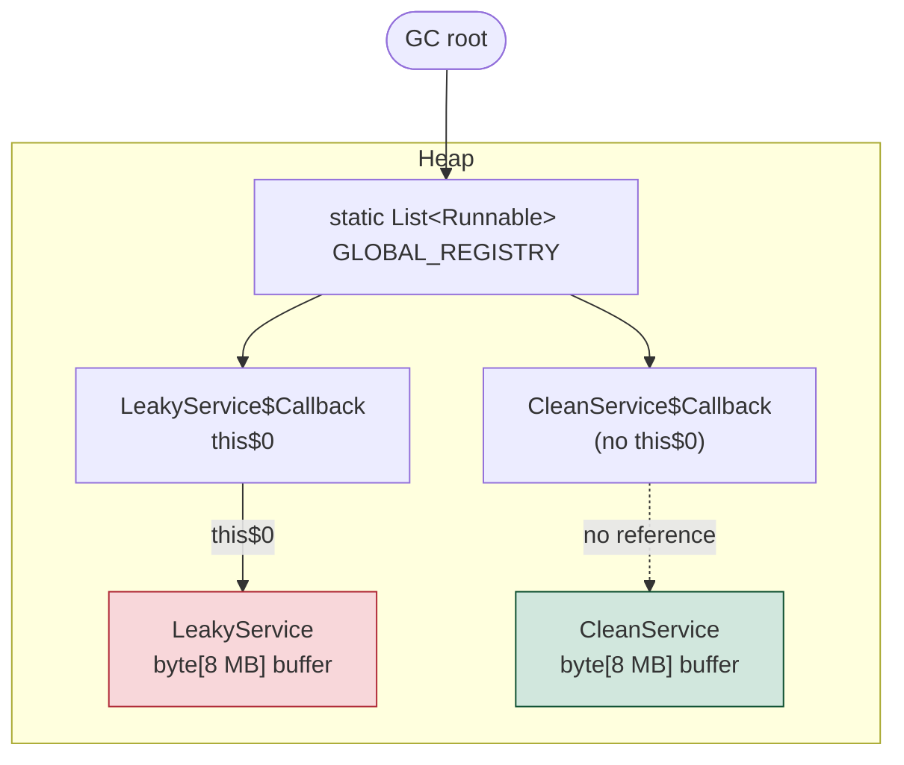
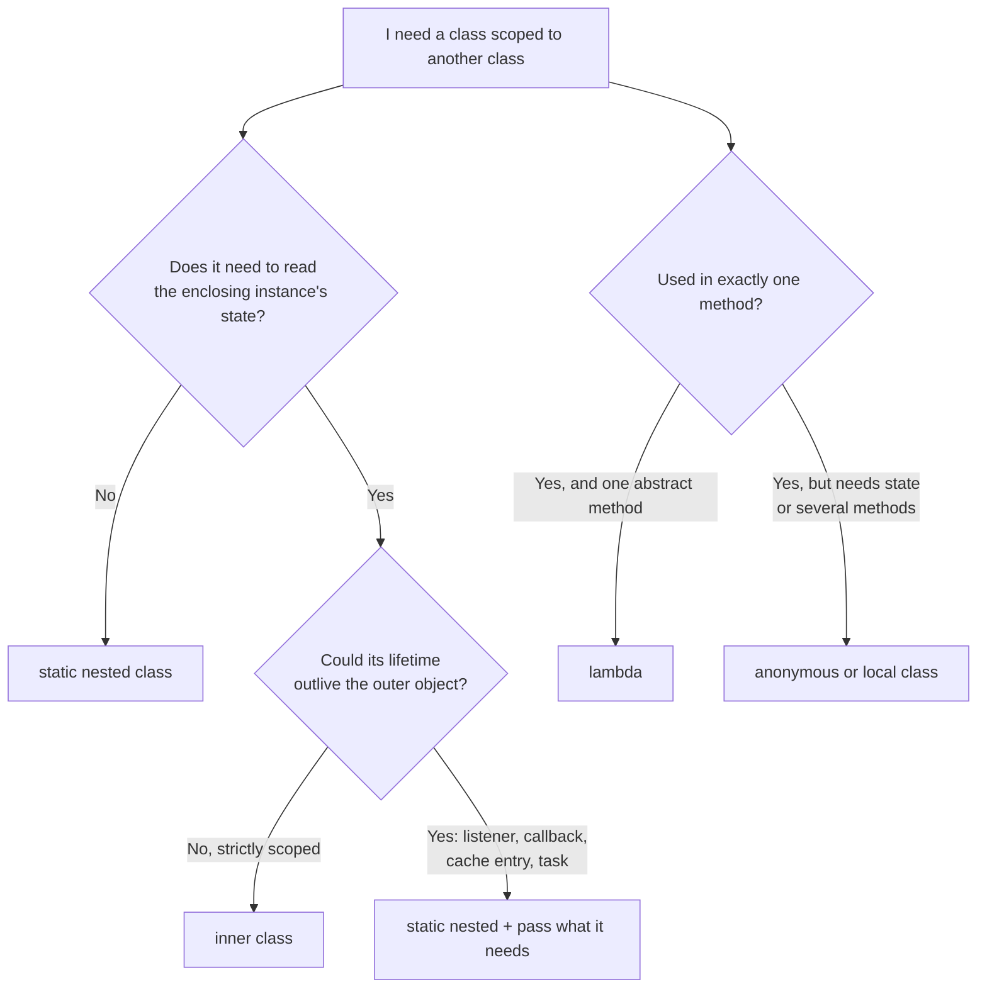

# Nested and Inner Classes: Static Nested, Inner, Local, and Anonymous

> **Topic register:** T-2431 · Core tier · High interview frequency [H]
> **Provenance:** every claim below is real, executed output from
> [`practice/java/language-core/nested-and-inner-classes/`](../../../practice/java/language-core/nested-and-inner-classes/README.md)
> (OpenJDK 21.0.12), including a real `NotSerializableException`, a real
> `javap`-confirmed `this$0` field, and a real, measured 8 MB retention that
> **disappears** when the inner class stops reading its enclosing instance.

## Table of Contents

1. [Learning Objectives](#learning-objectives)
2. [Why This Matters in Interviews](#why-this-matters-in-interviews)
3. [Level 1 — Foundation](#level-1-foundation)
4. [Level 2 — Working Knowledge](#level-2-working-knowledge)
5. [Mental Model](#mental-model)
6. [Definition and Purpose](#definition-and-purpose)
7. [Core Concepts](#core-concepts)
8. [Internal Implementation](#internal-implementation)
9. [Diagrams](#diagrams)
10. [Java Examples](#java-examples)
11. [Production Scenarios](#production-scenarios)
12. [Trade-offs](#trade-offs)
13. [Decision Framework](#decision-framework)
14. [Common Mistakes](#common-mistakes)
15. [Anti-Patterns](#anti-patterns)
16. [Best Practices](#best-practices)
17. [Interview Answer Framework](#interview-answer-framework)
18. [Interview Questions](#interview-questions)
19. [Summary](#summary)
20. [Key Takeaways](#key-takeaways)
21. [Cheat Sheet](#cheat-sheet)
22. [Flashcards](#flashcards)
23. [Practice Exercises](#practice-exercises)
24. [Solutions](#solutions)
25. [Additional Reading](#additional-reading)
26. [Official References](#official-references)

---

## Learning Objectives

By the end of this chapter you can:

- Name Java's four nested-class forms — static nested, inner, local, anonymous — and state the one structural difference that drives every behavioral difference between them.
- Explain what `this$0` is, when javac emits it, and prove from real output that it points at the exact enclosing instance.
- Explain why a `Serializable` inner class can fail to serialize even when every field it declares is serializable, backed by a real `NotSerializableException`.
- Diagnose the inner-class memory leak in a heap dump, and state precisely when a modern JDK does *not* produce it.
- Choose the right form for a given design, and justify why `static` is the correct default for a nested class.

## Why This Matters in Interviews

This topic is Core tier and High frequency for a reason that is not obvious from how simple the syntax looks: nested classes are where a candidate's mental model of *object identity and reachability* gets tested without the interviewer ever having to say the words "garbage collector." "What's the difference between a static nested class and an inner class?" reads like a syntax question, and a weak answer treats it as one ("you need an instance of the outer class for the inner one"). The strong answer explains that an inner-class instance carries a hidden reference to its enclosing instance, and then names the three consequences that reference has in production: it keeps the outer object alive, it drags the outer object into serialization, and it makes the inner class impossible to construct or test in isolation.

It also appears indirectly in almost every listener, callback, and `Runnable` a Java codebase contains — which is exactly why "our service leaks memory under load" interview scenarios so often bottom out here.

## Level 1 — Foundation

A class can be declared *inside* another class, the same way a method or a field can. Doing that says something about the code's organization: this class exists to serve the class around it, and there is no reason for the rest of the program to think about it separately.

Java has four ways to do this, and the names are worth getting right from the start because interviewers use them precisely:

- A **static nested class** is declared with `static` inside another class. It behaves exactly like a normal, top-level class that simply happens to live inside another class's namespace. You create one with `new Config(3)` — no other object required.
- An **inner class** is declared *without* `static`. Every instance of it belongs to an instance of the enclosing class. You cannot create one out of thin air; you create it *from* an outer object: `outer.new Session()`.
- A **local class** is a named class declared inside a method body. Only that method can see it.
- An **anonymous class** is a class with no name, declared and instantiated in a single expression: `new Runnable() { public void run() { ... } }`.

The real, executed demo prints exactly this difference:

```text
Static nested, no outer instance needed: new Config(3).retries() = 3
Inner, requires an outer instance (outer.new Session()): session of alice
A bare `new Session()` from a static context does not compile at all.
```

If you remember one sentence from this level, make it this one: **an inner class instance is attached to an outer instance; a static nested class instance is not.** Everything else in this chapter follows from that.

## Level 2 — Working Knowledge

The attachment is not a metaphor — it is a real field that the compiler adds to the inner class for you. Reflection over both classes shows it directly:

```text
Declared fields of the STATIC nested class Config:
  int retries  synthetic=false
Declared fields of the INNER class Session:
  NestedClassesDemo this$0  synthetic=true
Synthetic field name: this$0
Does it point at the exact outer instance? true
```

`synthetic=true` means "the compiler generated this; it is not in the source." The field is named `this$0`, it is `final`, and it holds the enclosing instance. That single field explains the three behaviors that matter at work:

1. **Access without qualification.** An inner class can read `owner` from its enclosing instance with no prefix, because the compiler rewrites it to `this$0.owner`. When both classes declare a field with the same name, the inner one wins, and you disambiguate with `Outer.this.field`. Real output: unqualified `label` gives `INNER-label`, while `NestedClassesDemo.this.label` gives `OUTER-label`.
2. **Reachability.** Anything holding the inner instance transitively holds the outer instance. That is the memory leak, and it is covered in full below.
3. **Serialization.** Serializing an inner-class instance means serializing `this$0` too, because it is part of the object's state.

At this level the practical rule is simple and almost always right: **make nested classes `static` unless the class genuinely needs to read the enclosing instance's state.** `static` here does not mean "shared" or "global" in the way `static` fields do; on a nested class it means only "does not carry an enclosing instance."

## Mental Model

Think of a static nested class as a **file in a folder** — the folder organizes it, but the file is complete on its own and you can move it anywhere. Think of an inner class as a **sticky note attached to a specific page** — it does not exist apart from the page it is stuck to, it can read what is written on that page without asking, and as long as someone keeps the sticky note, they are keeping the whole page too.

The leak follows directly from that image: a sticky note is small, but you cannot file it away without filing the entire page it is attached to.

## Definition and Purpose

Per JLS §8.1.3, a nested class is any class declared within the body of another class or interface. A nested class that is not `static` is an **inner class**, and an inner-class instance is associated with an instance of its immediately enclosing class, called its *enclosing instance*.

The feature exists to let a type be scoped to the one place it is meaningful. Before nested classes, a helper that only made sense inside one class still had to be a top-level type, visible to the whole package, named defensively (`OrderServiceInternalNode`) to avoid collisions. Nested classes let that type live where it is used, take a short name, and access the enclosing class's `private` members — which is legal because JLS access rules are scoped to the top-level enclosing class, a rule covered in [Java Modifiers and Method Signatures](java-modifiers-and-method-signatures.md).

Anonymous classes exist for a narrower reason: implementing an interface at the point of use without naming a class. Since Java 8, lambdas cover the common case (a functional interface with exactly one abstract method) more compactly — see [Lambdas and Functional Interfaces](lambdas-and-functional-interfaces.md) for the bytecode-level differences. Anonymous classes remain necessary when you need to implement more than one method, extend an abstract class, or hold per-instance state.

## Core Concepts

### The four forms, and what each one can and cannot do

| Form | Needs an enclosing instance | Can declare `static` members | Can access outer instance state | Emitted class name |
|---|---|---|---|---|
| Static nested | No | Yes | Only `static` outer state | `Outer$Name` |
| Inner | Yes | Yes (since Java 16) | Yes | `Outer$Name` |
| Local | Only if declared in an instance method | Yes (since Java 16) | Yes, plus effectively-final locals | `Outer$1Name` |
| Anonymous | Only if the expression is in an instance context | Yes (since Java 16) | Yes, plus effectively-final locals | `Outer$1` |

Two details in that table get missed. First, the emitted names are real, and the demo prints them: `NestedClassesDemo$1Multiplier` for a local class, `NestedClassesDemo$1` for an anonymous one. The numeric prefix on local classes exists because two different methods may each declare a local class with the same name. Second, before Java 16 an inner class could not declare a `static` member at all (other than a constant); JEP 395, which delivered records, relaxed that restriction as a side effect.

### Anonymous is not the same as synthetic

The demo checks this explicitly, because the two words get conflated:

```text
Anonymous class runtime name: NestedClassesDemo$1
Is the anonymous class synthetic? false  (anonymous != synthetic -- it is a real emitted class)
```

An anonymous class is a real class with a real `.class` file. "Synthetic" is a separate flag meaning "the compiler invented this member, it has no source counterpart" — which is what `this$0` is.

### `getDeclaredClasses()` sees only members

Local and anonymous classes are not *members* of their enclosing class, so reflection over members does not list them:

```text
  NestedClassesDemo$Config  [static nested]
  NestedClassesDemo$SafeRecordHolder  [static nested]
  NestedClassesDemo$Session  [inner]
  NestedClassesDemo$Shadowing  [inner]
  NestedClassesDemo$UnsafeRecordHolder  [inner]
  (local and anonymous classes are NOT reported by getDeclaredClasses())
```

This matters for any framework that scans a class's nested types — a test discovery mechanism, a JSON binder, a bean scanner. They will find your static nested and inner classes and silently skip your local and anonymous ones.

### Serialization pulls in the enclosing instance

Two classes with identical declared fields, one static nested and one inner, serialize differently:

```text
Serializing the static nested SafeRecordHolder:
  wrote SafeRecordHolder successfully
Serializing the inner UnsafeRecordHolder (outer is NOT Serializable):
  NotSerializableException: NestedClassesDemo
```

Read the exception message carefully: it names `NestedClassesDemo`, the *outer* class, in a call that serialized an `UnsafeRecordHolder`. Nothing in `UnsafeRecordHolder`'s source refers to the outer class; `this$0` does. This is why [Serialization Hazards and Alternatives](serialization-hazards-and-alternatives.md) treats inner classes as a serialization anti-pattern outright.

## Internal Implementation

javac compiles every nested form to an ordinary top-level class file with a mangled name, plus metadata (`InnerClasses` attribute) recording the nesting. There is no such thing as a nested class at the JVM level in the source sense; the nesting is a compile-time concept preserved as an attribute.

For an inner class, javac:

1. Adds a `final` synthetic field `this$0` of the enclosing type — **if the class body actually needs it**.
2. Adds the enclosing instance as the first constructor parameter.
3. Rewrites unqualified references to enclosing state as `this$0.field` accesses.

Step 1's conditional is the part most explanations get wrong, and the demo proves it with `javap` on two callbacks that differ only in whether `run()` reads an outer field:

```text
class InnerClassLeakDemo$LeakyService$Callback implements java.lang.Runnable {
  final InnerClassLeakDemo$LeakyService this$0;
  InnerClassLeakDemo$LeakyService$Callback(InnerClassLeakDemo$LeakyService);
  public void run();
}

class InnerClassLeakDemo$IndifferentService$Callback implements java.lang.Runnable {
  InnerClassLeakDemo$IndifferentService$Callback(InnerClassLeakDemo$IndifferentService);
  public void run();
}
```

The second class has **no `this$0` field**. Its constructor still accepts the enclosing instance — the call site passes it — and then discards it. Modern javac elides the field when the body never uses the enclosing instance.

The measured consequence, with each service owning an 8 MB buffer and its callback parked in a long-lived static list:

```text
=== A: inner-class callback that USES the enclosing instance ===
Fields emitted on the callback: LeakyService this$0
LeakyService collected after GC? false

=== B: inner-class callback that never touches the enclosing instance ===
Fields emitted on the callback: (none)
IndifferentService collected after GC? true

=== C: same callback written as a static nested class ===
Fields emitted on the callback: (none)
CleanService collected after GC?  true
```

Case A is the textbook inner-class leak, real and reproducible. Case B is the part worth carrying into an interview: on this JDK the retention is **conditional on actually using the enclosing instance**, so the blanket claim "an inner class always retains its outer object" is no longer accurate as stated. It is still the right default assumption for design purposes — you should not have to audit every method body to know whether a callback retains 8 MB — but as a factual claim about the emitted class, it is conditional.

One more real detail, discovered while building the demo rather than planned: the first version of case A declared `private final String name = "leaky"`. That is a compile-time constant, so javac inlined the value into the inner class body, no outer access remained, no `this$0` was emitted, and the leak did not reproduce. Assigning the field in the constructor made it a genuine runtime read and the retention appeared. Constant folding can hide this entire effect, which is a good reason not to conclude "no leak here" from a single small experiment.

## Diagrams



The diagram is the whole leak. `GLOBAL_REGISTRY` is reachable from a GC root, so every callback in it is reachable, so anything a callback references is reachable. The left path keeps 8 MB alive; the right path does not, because the arrow simply is not there. Reference strength and reachability are covered in [GC Roots, Reachability, and Reference Strength](../jvm-internals/gc-roots-reachability-and-reference-strength.md).



## Java Examples

All examples are extracted from the real, compiled demo at [`practice/java/language-core/nested-and-inner-classes/`](../../../practice/java/language-core/nested-and-inner-classes/README.md).

**The construction asymmetry:**

```java
// Static nested: complete on its own.
static class Config {
    private final int retries;
    Config(int retries) { this.retries = retries; }
    int retries() { return retries; }
}

// Inner: bound to an enclosing instance, reads its state unqualified.
class Session {
    String describe() {
        return "session of " + owner;   // compiles to this$0.owner
    }
}

Config config = new Config(3);                     // fine anywhere
NestedClassesDemo outer = new NestedClassesDemo("alice");
Session session = outer.new Session();             // requires an outer instance
```

**Disambiguating a shadowed field with `Outer.this`:**

```java
private final String label = "OUTER-label";

class Shadowing {
    private final String label = "INNER-label";

    String unqualified() { return label; }                       // INNER-label
    String qualified()   { return NestedClassesDemo.this.label; } // OUTER-label
}
```

**The fix for a leaking callback** — the same behavior, with the enclosing instance replaced by exactly the data the callback needs:

```java
// Before: inner class, retains the whole service including its 8 MB buffer.
class Callback implements Runnable {
    @Override public void run() { System.out.print(name); }
}

// After: static nested class, retains only the String it was given.
static final class Callback implements Runnable {
    private final String name;
    Callback(String name) { this.name = name; }
    @Override public void run() { System.out.print(name); }
}
```

## Production Scenarios

### Scenario: a metrics-reporting service grows an 8 MB-per-hour heap staircase

**Symptoms.** A reporting service's old-generation occupancy climbs in an even staircase, roughly 8 MB per hour, matching its hourly job schedule. Full GCs reclaim nothing. No request-path latency change; the service simply OOMs after several days and gets restarted by its orchestrator, which is why nobody filed a bug for two months.

**Initial hypotheses.** A cache without eviction; an unbounded queue; a `ThreadLocal` not cleared (a real and adjacent failure mode, covered in [ThreadLocal-Mediated Classloader Leaks](../concurrency/threadlocal-mediated-classloader-leaks.md)).

**Evidence collected.** A heap dump taken after four days shows thousands of `ReportJob` instances, each retaining a large `byte[]`. The dominator tree shows the retaining path is a `static` scheduler list holding `ReportJob$ProgressCallback` objects. Each callback's only field is `this$0`.

**Diagnosis.** Every hourly job registered a progress callback written as an inner class and never unregistered it. The callback itself is tiny; `this$0` retains the entire job, including its buffer. The leak is not in the code anyone was reading — `ProgressCallback`'s body is three lines and mentions no buffer.

**Immediate mitigation.** Unregister the callback in a `finally` block. This stops the growth without changing any class shape, and can ship in an hour.

**Permanent remediation.** Make `ProgressCallback` a `static` nested class taking a job id and a progress sink in its constructor. The retained set drops to two references, the buffer becomes collectable the moment the job finishes regardless of unregistration discipline, and the fix cannot be undone by someone later forgetting a `finally`.

**Trade-offs.** The static version is more verbose: the constructor has to spell out what the inner version got for free. That verbosity is the point — it makes the retention visible at the declaration.

**Prevention.** A code-review rule that any class registered into a longer-lived collection must be `static` nested or top-level; and an alert on old-gen growth across a 24-hour window rather than only on OOM.

**Interview lessons.** This is a complete, honest Senior answer to "tell me about a memory leak you debugged," because it has a real mechanism, a real diagnostic path (heap dump, dominator tree), a cheap mitigation, a structural fix, and a prevention step that is not just "be careful."

### Scenario: a cache entry fails to serialize into Redis after a refactor

**Symptoms.** After a refactor that moved a `CacheKey` helper class inside the service that uses it, every write to a Java-serialization-backed cache fails with `NotSerializableException`, naming the *service* class — which is not the object being cached.

**Diagnosis.** The refactor dropped `static` from the nested class declaration. The class's own fields were all serializable; `this$0` was not.

**Remediation.** Add `static`. The one-word diff is the whole fix, and the exception message pointing at an apparently unrelated class is the reason it took an afternoon rather than a minute.

**Prevention.** Prefer an explicit serialization format over Java serialization (see [Serialization Hazards and Alternatives](serialization-hazards-and-alternatives.md)); the failure mode disappears entirely when the wire format is declared rather than derived from object graphs.

## Trade-offs

| Choice | Gains | Costs |
|---|---|---|
| `static` nested | No hidden retention; constructible and testable alone; serializes predictably | Must pass in what it needs explicitly; more constructor boilerplate |
| Inner | Direct, unqualified access to outer state; expresses a genuine part-of relationship | Hidden retention; cannot be constructed without an outer instance; serialization hazard; harder to unit test |
| Local | Scoped to one method; can capture effectively-final locals | Invisible to reflection-based frameworks; cannot be reused; lengthens the method |
| Anonymous | Shortest way to implement several methods or extend a class inline | No name in stack traces beyond `Outer$1`; cannot be reused; captures like a local class |
| Lambda | Most compact for a single abstract method; no extra `.class` file | Only works for functional interfaces; no per-instance state |

## Decision Framework

Ask these in order:

1. **Does the class need the enclosing instance's state?** No → `static` nested. This is most cases and should be the default.
2. **Could an instance be stored somewhere that outlives the outer object** — a listener registry, a cache, a scheduled task, a thread pool queue? Yes → `static` nested, even if it would be convenient to read outer state. Convenience is not worth an unbounded retention path.
3. **Will it be serialized, in any form that walks the object graph?** Yes → `static` nested, unconditionally.
4. **Is it used in exactly one method, implementing one abstract method?** → lambda.
5. **Is it used in exactly one method, but needs state or multiple methods?** → anonymous class if used once inline, local class if it needs a name and a constructor.
6. **Is it part of the class's public API** (a `Builder`, a typed result)? → `static` nested, so callers can write `Outer.Builder` without an enclosing instance.

## Common Mistakes

- **Reading `static` on a nested class as "shared mutable state."** On a nested class, `static` means only "no enclosing instance." It has nothing to do with the sharing semantics of a `static` field.
- **Assuming `Outer.Inner x = new Outer.Inner()` works.** For a non-static inner class it does not; the syntax is `outer.new Inner()`.
- **Believing the leak is universal.** Real, measured: when the inner class never touches the enclosing instance, javac 21 emits no `this$0` and nothing is retained. Design as if the reference exists; do not *claim* it always does.
- **Making a `Builder` an inner class.** Callers then need an instance of the thing they are trying to build. Builders are `static` nested, always.
- **Expecting a `ConcurrentModificationException` to catch listener bugs.** Related, and covered in [Fail-Fast vs. Weakly Consistent Iterators](../collections/fail-fast-vs-weakly-consistent-iterators.md): modification during iteration does not always throw.
- **Trusting a small experiment that shows no retention.** Constant folding of a `final` field initialized to a literal removes the outer access entirely, which is exactly what happened on the first attempt at this chapter's own demo.

## Anti-Patterns

- **Inner-class listeners registered into long-lived collections.** The single most common Java memory leak shape that is not a cache.
- **Deep nesting for organization.** Three levels of nested classes to express a hierarchy produces names like `A$B$C` in every stack trace and heap dump, for no gain over separate files in a package.
- **Anonymous classes with real logic.** An anonymous class with forty lines of behavior appears in production stack traces as `Outer$3`. Name it.
- **Inner classes in serialized types.** Any `Serializable` type with a non-static nested member class is a latent `NotSerializableException`.

## Best Practices

- Default to `static` on every nested class; remove it only when you have a specific reason.
- Give any nested class that appears in stack traces a name — prefer a local or named static nested class over an anonymous one for non-trivial bodies.
- Keep nested classes small and private where possible; if a nested class grows past a screen, it usually wants to be a top-level class in the same package.
- When a callback needs three fields from its enclosing object, pass those three fields, not the object.
- In code review, treat "inner class + registered somewhere" as a defect pattern, not a style preference.

## Interview Answer Framework

### 30-Second Answer

A nested class declared `static` is just a normal class scoped inside another; an inner class is non-static and every instance carries a hidden, compiler-generated `this$0` reference to an enclosing instance. That reference is why an inner class can read outer state unqualified, why it keeps the outer object reachable, and why it can break serialization. Default to `static`.

### 2-Minute Answer

Add: local classes are named classes inside a method body, anonymous classes are unnamed one-off implementations, and both can capture effectively-final locals. Explain that javac compiles all four to top-level class files with mangled names — `Outer$Inner`, `Outer$1` — and adds the enclosing instance as a hidden constructor parameter for inner classes. Give one production consequence: a listener written as an inner class and registered in a long-lived list retains its entire enclosing object; I have measured 8 MB staying alive that way, and the same code as a `static` nested class is collected. Close with the rule: `static` by default, non-static only when the class genuinely is a part of a specific outer instance.

### 10-Minute Deep Dive

Cover, in order: the four forms and the one structural difference; `this$0` as a synthetic final field, with the reflection output showing `synthetic=true`; `Outer.this` for shadowed names; the reachability consequence with the GC-root diagram; the serialization consequence with the real `NotSerializableException` naming the outer class; the modern nuance that javac elides `this$0` when the body never uses the enclosing instance, proven with `javap`, and why you should still design as if it were always present; the constant-folding trap that can hide the effect in a small test; and the decision framework, ending on `Builder` as the canonical case for `static` nested.

### Whiteboard Explanation

Draw two boxes side by side, `Outer` and `Inner`. Draw an arrow from `Inner` to `Outer` labeled `this$0`. Above them draw a box labeled `static List listeners` with an arrow down to `Inner`. Then trace, out loud, from the static list to `Inner` to `Outer`: "this is reachable, so this is reachable, so this is reachable — the outer object cannot be collected." Erase the `this$0` arrow and say "declare it `static` and this arrow does not exist." That single erased arrow is the whole answer.

### Production Example

The hourly reporting job above: an even 8 MB-per-hour old-gen staircase, heap dump showing a static scheduler list dominating `ProgressCallback` instances whose only field is `this$0`, a `finally`-block mitigation shipped in an hour, and a structural fix making the callback `static` nested with an explicit constructor.

### Trade-offs to Mention

Explicitness versus convenience: the `static` version must state its dependencies in a constructor, which is more code and is exactly why it is safer. Mention that lambdas replaced the common anonymous-class case but not the multi-method or stateful one.

### Common Candidate Mistakes

Reciting "you need an outer instance" with no account of *why*; claiming the leak is unconditional without ever having checked; not knowing `Outer.this`; not connecting the `NotSerializableException` message to `this$0`.

### Typical Follow-Up Questions

"What does `Outer.this` do?" → "Why does an inner class break Java serialization?" → "How would you find this in a heap dump?" → "Does the retention happen even if the inner class never reads the outer instance?" → "When would you still choose an inner class?" → "Why is a `Builder` always static?"

### Senior-Level Expectations

Names the mechanism precisely, diagnoses it from a heap dump rather than by reading source, and gives both a tactical mitigation and a structural fix with the trade-off between them stated.

### Staff-Level Discussion

Frames it as a defaults problem rather than a knowledge problem: individual engineers knowing the rule does not prevent the leak, because the dangerous form is the *shorter* one to write and the retention is invisible at the declaration site. The organizational fixes are a review checklist item for "registered into a longer-lived collection," a static-analysis rule (SpotBugs `SIC_INNER_SHOULD_BE_STATIC` catches precisely the case where no enclosing access exists), and an old-gen growth alert measured over days rather than a bare OOM alert. Also worth raising: a codebase-wide migration from inner to static nested classes is mechanical and low-risk for classes with no enclosing access, and genuinely risky for those with it — so the two cases should be separated in any large cleanup, not batched.

## Interview Questions

### Question 1 — What is the difference between a static nested class and an inner class, and what does that difference cost at runtime?

**Why interviewers ask it.** It looks like syntax recall but separates candidates who know the emitted structure from those who memorized a sentence.

**Expected answer.** A static nested class is an ordinary class scoped inside another and constructible on its own. A non-static (inner) class instance is bound to an enclosing instance through a compiler-generated `final synthetic` field, `this$0`, added as the first constructor parameter. At runtime this costs one reference per instance and, far more importantly, keeps the entire enclosing object reachable for as long as the inner instance is reachable.

**Minimum acceptable answer.** Knows that an inner class needs an outer instance and a static nested class does not.

**Strong Senior answer.** Names `this$0`, explains the reachability consequence with a concrete retention example, and mentions the serialization consequence.

**Staff-level extension.** Frames the default as an organizational safety property: the dangerous form is shorter to write and its cost is invisible at the declaration, so tooling and review defaults matter more than individual knowledge.

**Common mistakes.** Saying `static` means "shared"; not knowing the field exists; claiming the only difference is syntactic convenience.

**Likely follow-ups.** "Does that reference exist even if the inner class never uses the outer instance?" (On JDK 21, no — javac elides it, verified with `javap`. Design as if it does.) "How do you disambiguate a shadowed field?" (`Outer.this.field`.)

**Evaluation criteria.** Correct mechanism, at least one real runtime consequence, and a stated default.

### Question 2 — This `Serializable` class has only `String` and `int` fields, but serializing it throws `NotSerializableException` naming a different class entirely. What happened?

**Why interviewers ask it.** It is a real debugging scenario where the exception message points somewhere the source does not.

**Expected answer.** The class is a non-static nested class, so its state includes the synthetic `this$0` reference to the enclosing instance, and the enclosing class is not `Serializable`. Serialization walks the object graph, reaches `this$0`, and fails naming the outer class. The fix is adding `static` — assuming the class does not actually need enclosing state.

**Minimum acceptable answer.** Connects the failure to the hidden outer reference, even without naming `this$0`.

**Strong Senior answer.** Notes that the same object graph walk is why `transient` on a field is not enough here — the problematic reference is not declared in source, so there is nothing to mark `transient` — and that making the outer class `Serializable` "fixes" it by serializing far more than intended, which is usually worse than the exception.

**Staff-level extension.** Argues for moving off graph-walking serialization for anything crossing a process or version boundary, since the failure class here is a symptom of a wire format derived from object structure rather than declared.

**Common mistakes.** Suggesting `transient` on the declared fields; making the outer class `Serializable` without considering what that now writes.

**Likely follow-ups.** "What if the inner class genuinely needs outer state?" (Copy the needed values into fields of a static nested class.) "Would a record help?" (Yes — a nested record is implicitly static.)

**Evaluation criteria.** Identifies the hidden reference, gives the one-word fix, and does not recommend making the outer class serializable as a first resort.

### Question 3 — A service leaks roughly 8 MB per scheduled job run. Heap dump shows a static list of tiny callback objects. Walk me through it.

**Why interviewers ask it.** It is the realistic form of the question — the leak is nowhere near the code that looks suspicious.

**Expected answer.** The callbacks are inner-class instances, each holding `this$0` to the job object that owns the large buffer. Reachability runs GC root → static list → callback → job → buffer. The tactical fix is unregistering in a `finally`; the structural fix is making the callback `static` nested and passing in only what it needs, which removes the retention regardless of unregistration discipline.

**Minimum acceptable answer.** Identifies that the callbacks retain their enclosing objects.

**Strong Senior answer.** Describes the diagnostic path explicitly — dominator tree, retained size, inspecting the callback's fields to find `this$0` — and states both fixes with the trade-off between them.

**Staff-level extension.** Adds prevention: static analysis for nested classes with no enclosing access, a review rule for registration into longer-lived collections, and monitoring old-gen growth over a multi-day window rather than waiting for OOM.

**Common mistakes.** Jumping to "add more heap" or "call `System.gc()`"; blaming the buffer rather than the retention path.

**Likely follow-ups.** "Would a `WeakReference` fix it?" (It would, but it trades a leak for a callback that can silently disappear — usually the wrong trade unless the listener is genuinely optional.) "How would you prove the fix worked?" (Same heap dump procedure after the change; the retained set drops.)

**Evaluation criteria.** Traces reachability correctly, proposes both fixes, and names a prevention mechanism that is not "be careful."

## Summary

Java's four nested-class forms differ in exactly one structural way: whether an instance carries a reference to an enclosing instance. Static nested classes do not; inner, local, and anonymous classes (in an instance context) can. That single `this$0` field explains unqualified access to outer state, the need for `Outer.this` when names shadow, the memory-retention behavior measured here at 8 MB, and a `NotSerializableException` that names a class the source never mentions. On JDK 21 the field is elided when the class body never uses the enclosing instance — a real nuance worth knowing and a poor thing to rely on. Default to `static`, and reach for a non-static form only when the class genuinely is a part of one specific outer object.

## Key Takeaways

- `static` on a nested class means "no enclosing instance," not "shared state."
- `this$0` is a real, `final`, synthetic field — reflection prints it, `javap` prints it.
- Inner-class instances keep their enclosing object reachable; that is the leak.
- Serialization walks `this$0`, which is why the exception names the outer class.
- javac 21 omits `this$0` when the body never uses the outer instance; design as if it did not.
- Builders, cache keys, callbacks, and anything registered anywhere: `static` nested.

## Cheat Sheet

Condensed version: [`cheat-sheets/nested-and-inner-classes.md`](../../../cheat-sheets/nested-and-inner-classes.md).

## Flashcards

Review deck: [`flashcards/nested-and-inner-classes.md`](../../../flashcards/nested-and-inner-classes.md).

## Practice Exercises

1. Write a class with a non-static nested class whose method reads an outer field, compile it, and run `javap -p` on the inner class. Confirm `this$0` is present. Now delete the outer field access and recompile. Predict whether the field survives before you look.
2. Take a `Serializable` inner class and serialize it with an outer class that does not implement `Serializable`. Capture the exact exception message. Then add `static` and re-run.
3. Register an inner-class `Runnable` into a static list from a method that creates a 16 MB array, drop the local reference, force GC, and check a `WeakReference` to the owner. Then convert the callback to a static nested class and repeat.
4. Declare a local class and an anonymous class in the same method, print both `getClass().getName()` values, and explain the `$1Name` versus `$1` difference.
5. Find one inner class in a codebase you work on that is registered into a longer-lived collection. Determine whether it accesses enclosing state, and decide whether converting it is mechanical or risky.

## Solutions

1. `this$0` appears in the first compile and is gone in the second — the elision is conditional on use. If your "no access" version still shows the field, check whether you left an implicit outer method call in the body.
2. The message names the *outer* class, because the unserializable object reached by the graph walk is the enclosing instance, not the one you passed to `writeObject`. Adding `static` makes it succeed unchanged.
3. The inner version is not collected; the static version is. If both are collected, your inner class body probably never touched the enclosing instance, or the field it read was a compile-time constant that got folded — the exact trap this chapter's own demo hit first.
4. Local classes get a numeric prefix before the name (`Outer$1Multiplier`) because two methods may declare the same local class name; anonymous classes have no name, so they get a bare index (`Outer$1`).
5. If it accesses no enclosing state, adding `static` is a compile-checked, mechanical change. If it does, the conversion requires deciding which values to copy in, and that is a design change worth reviewing separately.

## Additional Reading

- [Java OOP Fundamentals: Classes, Objects, and Interfaces](java-oop-fundamentals-classes-objects-and-interfaces.md) — where anonymous classes are first introduced.
- [Lambdas and Functional Interfaces](lambdas-and-functional-interfaces.md) — measured bytecode differences between a lambda and an anonymous class.
- [Serialization Hazards and Alternatives](serialization-hazards-and-alternatives.md) — why graph-walking serialization makes this failure mode possible at all.
- [Memory Leak Diagnosis and Heap Dump Analysis](../jvm-internals/memory-leak-diagnosis-and-heap-dump-analysis.md) — the dominator-tree workflow used in the production scenario.
- [GC Roots, Reachability, and Reference Strength](../jvm-internals/gc-roots-reachability-and-reference-strength.md) — the reachability rules the leak diagram depends on.

## Official References

- [JLS §8.1.3 — Inner Classes and Enclosing Instances](https://docs.oracle.com/javase/specs/jls/se21/html/jls-8.html#jls-8.1.3)
- [JLS §15.9 — Class Instance Creation Expressions](https://docs.oracle.com/javase/specs/jls/se21/html/jls-15.html#jls-15.9)
- [The Java Tutorials — Nested Classes](https://docs.oracle.com/javase/tutorial/java/javaOO/nested.html)
