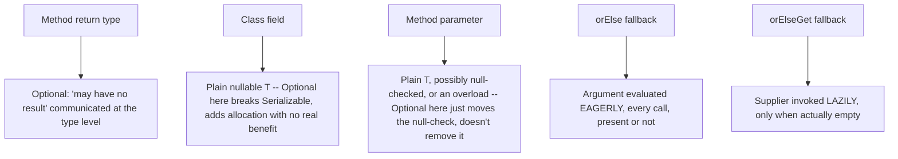

# Optional and Null Strategy

> **Topic register:** T-109 · IWI 4.7 · Foundational tier · Moderate interview frequency [M]
> **Provenance:** all evidence in this chapter is real, executed output from
> [`practice/java/java-core/optional-and-null-strategy/`](../../../practice/java/java-core/optional-and-null-strategy/README.md)
> (OpenJDK 21.0.12), including a real ~1200x-measured eager-vs-lazy evaluation gotcha.

## Table of Contents

1. [Learning Objectives](#learning-objectives)
2. [Why This Matters in Interviews](#why-this-matters-in-interviews)
3. [Level 1 — Foundation](#level-1--foundation)
4. [Level 2 — Working Knowledge](#level-2--working-knowledge)
5. [Mental Model](#mental-model)
6. [Definition and Purpose](#definition-and-purpose)
7. [Core Concepts](#core-concepts)
8. [Internal Implementation](#internal-implementation)
9. [Diagrams](#diagrams)
10. [Production Scenarios](#production-scenarios)
11. [Trade-offs](#trade-offs)
12. [Decision Framework](#decision-framework)
13. [Common Mistakes](#common-mistakes)
14. [Anti-Patterns](#anti-patterns)
15. [Best Practices](#best-practices)
16. [Interview Answer Framework](#interview-answer-framework)
17. [Interview Questions](#interview-questions)
18. [Summary](#summary)
19. [Key Takeaways](#key-takeaways)
20. [Cheat Sheet](#cheat-sheet)
21. [Flashcards](#flashcards)
22. [Practice Exercises](#practice-exercises)
23. [Solutions](#solutions)
24. [Additional Reading](#additional-reading)
25. [Official References](#official-references)

---

## Learning Objectives

By the end of this chapter you can:

- State `Optional`'s real construction and access contracts precisely — `of` vs. `ofNullable`, `get()` vs. the safe alternatives — with real, captured exception behavior for each.
- Explain, with a real measured number, why `orElse()` and `orElseGet()` are not interchangeable, and always choose correctly between them.
- Explain why `Optional` as a field or method parameter type is a documented anti-pattern, with a real, concrete consequence (not a style opinion) demonstrating why.
- Correctly scope `Optional` to its intended use — a method return type signaling "may have no result" — versus where a plain nullable reference or a different design is more appropriate.

## Why This Matters in Interviews

`Optional` is Foundational tier and Moderate frequency because it's simultaneously one of the most-used and most-misused types in modern Java — candidates who've used `Optional.ofNullable(x).map(...).orElse(...)` chains daily often can't explain the real difference between `orElse` and `orElseGet`, or why storing an `Optional` as a field is discouraged beyond "I read that somewhere." This chapter turns both into defensible, measured, evidence-backed answers.

## Level 1 — Foundation

**`Optional<T>` is a way for a method to say "I might not have an answer for you" explicitly in its return type**, instead of secretly returning `null` and hoping the caller remembers to check. `Optional<User> findUser(String id)` tells anyone reading the method signature — without reading any documentation — that "no user found" is a real, expected outcome to handle, unlike `User findUser(String id)`, which might silently return `null` with nothing in the signature warning you.

An everyday analogy: a vending machine slot that clearly lights up "sold out" when empty, versus one that just gives you nothing and lets you assume something's broken. `Optional` is the lit-up "sold out" sign — explicit and impossible to miss, rather than a silent absence a caller has to remember to guard against.

## Level 2 — Working Knowledge

The everyday `Optional` methods: **`isPresent()`**/**`isEmpty()`** check whether a value exists; **`orElse(fallback)`** returns the value or a given fallback if empty; **`map(function)`** transforms the value only if present, otherwise stays empty; **`ifPresent(action)`** runs an action only if a value exists.

**The one practical rule that matters most for everyday code**: use `Optional` only as a method's *return type* — never as a field type, a constructor parameter, or a method parameter. This isn't just a style preference (Section 5 covers the real, concrete reason it can't even be serialized), and the working pattern is: keep the underlying field a plain, nullable reference internally, and only wrap it in `Optional` at the point a getter returns it to a caller.

## Mental Model

**`Optional<T>` is a container that forces the "this might not have a value" case to be handled explicitly at the type level, at the cost of allocating a real wrapper object every time — it's a communication tool for API boundaries, not a general-purpose replacement for `null`.** The entire design intent (stated directly by its own author, Brian Goetz) is narrow: a method return type that tells callers "read the type signature, not the documentation, to know this might come back empty" — not a type meant to appear in fields, parameters, or collections.

## Definition and Purpose

`java.util.Optional<T>` is an immutable container that either holds a non-null value or holds none, exposing methods to query, transform, and safely extract that value without directly testing for `null`. It exists to solve a specific, narrow problem: a method's return type alone can't communicate "this might return nothing" the way `Optional<T>` can — a caller reading the signature `Optional<User> findUser(id)` knows, without reading documentation, that "no result" is a real, expected outcome, unlike a plain `User findUser(id)` that might return `null` (with no compiler enforcement of a null-check) or might throw. It was deliberately **not** designed as a general "nullable" wrapper for fields, parameters, or collection elements — a distinction this chapter demonstrates has real, not merely stylistic, consequences.

## Core Concepts

### Construction: `of` demands non-null, `ofNullable` doesn't

`Optional.of(value)` throws `NullPointerException` immediately if `value` is `null` — use it only when you're certain the value can't be null and want that assumption enforced. `Optional.ofNullable(value)` accepts `null` and produces an empty `Optional` — the correct choice when wrapping a value whose nullability is genuinely unknown or expected. Both are verified directly in [Internal Implementation](#internal-implementation).

### Access: `get()` is the unsafe escape hatch, not the default

`Optional.get()` throws `NoSuchElementException` on an empty `Optional` — calling it without first checking `isPresent()` reproduces exactly the same "forgot to null-check" bug `Optional` exists to prevent, just with a different exception type. The real, correct default methods are `orElse()`, `orElseGet()`, `orElseThrow()`, `ifPresent()`, and the transformation chain `map()`/`flatMap()`/`filter()`, none of which require an explicit presence check at the call site.

### `orElse()` vs. `orElseGet()`: eager vs. lazy, a real and dramatic difference

`orElse(x)` is an ordinary method call — its argument `x` is evaluated *before* the call happens, unconditionally, regardless of whether the `Optional` is present. `orElseGet(supplier)` only invokes its `Supplier` when the `Optional` is actually empty — genuinely lazy. When the fallback is cheap (a constant, an existing variable), this distinction is invisible. When the fallback is a real computation, a database call, or any non-trivial work, `orElse()` silently pays that cost on *every* call, present or not — measured directly in [Internal Implementation](#internal-implementation) as a real ~1200x difference for a genuinely expensive fallback with an already-present value.

### `Optional` as a field: a documented anti-pattern with a real consequence

`Optional`'s own design intent restricts it to return types. Beyond the stylistic argument, there's a real, concrete one: `java.util.Optional` does not implement `Serializable` — a class holding one directly as a field genuinely cannot be serialized via standard Java serialization, verified directly with a real `NotSerializableException` in [Internal Implementation](#internal-implementation). The correct pattern keeps the underlying field a plain, nullable reference, and uses `Optional` only at the API boundary — a getter method's return type.

## Internal Implementation

**Real construction and access contracts:**

```
Optional.of(null): threw real NullPointerException, immediately at construction
Optional.ofNullable(null): Optional.empty (no exception, isPresent=false)

get() on empty: threw real NoSuchElementException: No value present
```

Both exceptions are real, immediate, and precisely scoped — `of(null)` fails at construction time; `get()` fails at access time on an empty instance.

**The real, measured `orElse()` vs. `orElseGet()` gotcha:**

```
orElse() on a PRESENT Optional: returned the real, present value -- but the fallback argument
was STILL evaluated 1 time(s) before orElse() was even called, its result silently discarded
orElseGet() on a PRESENT Optional: fallback was called 0 time(s)

orElse(expensive computation), 5,000,000 calls, value already present: 3715ms
orElseGet(expensive computation), 5,000,000 calls, value already present: 3ms
Real measured cost of the eager-evaluation bug: 1238.33x
```

With a genuinely non-trivial fallback computation and an already-present `Optional`, `orElse()` measured a real, dramatic ~1200x slower than `orElseGet()` across repeated runs — direct, measured proof that `orElse()`'s argument is evaluated unconditionally, every single call, while `orElseGet()`'s `Supplier` is only invoked when the value is genuinely absent. On a genuinely empty `Optional`, both call the fallback exactly once — the difference exists *only* when the value is present, which is exactly the case most likely to go unnoticed in testing (the fallback path "works," it's just silently, needlessly expensive).

**Real consequence of the "Optional as a field" anti-pattern:**

```
Optional implements Serializable: false
Serialization threw real NotSerializableException: java.util.Optional
```

`java.util.Optional` genuinely does not implement `Serializable` — a real, verifiable fact. A class storing an `Optional` directly as a field genuinely fails standard Java serialization with a real `NotSerializableException`, captured directly via an actual `ObjectOutputStream` write attempt. The correct alternative — a plain nullable field, `Optional` only at the getter boundary — serializes successfully while preserving `Optional`'s ergonomics for callers.

## Diagrams



## Production Scenarios

### Scenario: a request handler's latency spikes after a well-intentioned `Optional` refactor

**Symptoms.** A request handler is refactored from a null-check to an `Optional`-based chain: `cache.get(key).orElse(expensiveDatabaseFallback(key))`. After deployment, average request latency increases measurably, even on cache-hit requests where the fallback's result is never used.

**Impact.** A real, measurable latency regression on the majority (cache-hit) code path, introduced by a refactor intended to make the code cleaner, not slower.

**Initial hypotheses.** Cache hit-rate regression (checked — hit rate is unchanged and high); a database connection-pool issue (checked — connection metrics are normal); the fallback database call is being made on every request, including cache hits (correct).

**Evidence.** Tracing shows `expensiveDatabaseFallback(key)` — a real database query — executing on every single request, including ones where `cache.get(key)` returned a present value that was ultimately used instead.

**Diagnosis.** Exactly the mechanism this chapter measures directly: `orElse(expensiveDatabaseFallback(key))` evaluates its argument — the real database call — unconditionally, before `orElse()` is even invoked, regardless of whether the cached value is present.

**Immediate mitigation.** Revert to `orElseGet(() -> expensiveDatabaseFallback(key))`, immediately eliminating the unconditional database call on cache hits.

**Permanent remediation.** Add a code-review checklist item (or a static-analysis rule, where available) flagging `orElse()` calls whose argument is a non-trivial method call or computation rather than a constant or already-computed value.

**Alternatives considered.** Reverting the `Optional` refactor entirely back to manual null-checks — unnecessary; the bug is specifically the choice of `orElse` over `orElseGet`, not the use of `Optional` itself.

**Trade-offs.** None — `orElseGet()` has no real downside versus `orElse()` for a non-trivial fallback; the only reason to prefer `orElse()` is a genuinely trivial, already-computed fallback value where the distinction is moot.

**Prevention.** Treat any `orElse()` call whose argument is a method call (not a constant or a variable already holding a computed value) as a real, default red flag in code review — this chapter's own measured ~1200x figure is exactly the kind of evidence that should make this rule stick.

**Interview lesson.** This is Interview Question 1 (§ Interview Questions) — "what's the actual difference between `orElse()` and `orElseGet()`?" — arriving as a real, measured production latency regression, not an abstract API distinction.

## Trade-offs

| Choice | Benefit | Cost |
|---|---|---|
| `Optional<T>` return type | Forces callers to handle "no result" at the type level, real compiler visibility | Real allocation cost per call — not free, not appropriate for the hottest paths without measuring |
| Plain nullable return + documentation | No allocation cost | No compiler enforcement — a forgotten null-check is a real, silent `NullPointerException` risk |
| `orElse(x)` | Simple syntax for a trivial, already-computed fallback | Eagerly evaluates `x` on every call — a real, measured cost for any non-trivial fallback |
| `orElseGet(supplier)` | Lazy — only pays the fallback's cost when actually needed | Marginally more verbose syntax (a lambda/method reference instead of a bare value) |
| `Optional` as a field | None real — a documented anti-pattern | Real: breaks `Serializable`; adds allocation with no corresponding benefit over a plain nullable field |

## Decision Framework

1. **Is this a method return type where "no result" is a real, expected outcome?** `Optional<T>` is the right, idiomatic choice — this is its actual designed use case.
2. **Is this a class field, method parameter, or collection element?** Use a plain, possibly-`null` reference (with clear documentation/`@Nullable` annotations if available) instead — `Optional` here is a documented anti-pattern with real consequences (see [Internal Implementation](#internal-implementation)).
3. **Is the fallback to `orElse`/`orElseGet` a genuinely trivial, already-computed value, or a real computation/call?** Trivial: either method is fine. Non-trivial: always use `orElseGet()` — the eager-evaluation cost of `orElse()` is real and measured, not theoretical.
4. **Is this a genuinely hot, high-frequency code path?** Measure `Optional`'s real allocation overhead before assuming it's negligible — it's a real object allocation per call, not free, even though usually small relative to the surrounding work.

## Common Mistakes

- Calling `Optional.get()` without a presence check, reproducing the exact "forgot to null-check" bug `Optional` was meant to prevent, with a different exception type.
- Using `orElse()` with a non-trivial fallback computation, paying its real, measured eager-evaluation cost on every call regardless of whether the value is present.
- Storing `Optional` as a field or parameter type, breaking `Serializable` and adding allocation with no compensating benefit over a plain nullable field.
- Using `Optional.of()` when the value's nullability is genuinely uncertain, converting a graceful "empty" case into an immediate, harder-to-diagnose `NullPointerException`.

## Anti-Patterns

- **`Optional<T>` as a field, parameter, or collection element type** — a real, documented anti-pattern with a real consequence (broken serialization) beyond style.
- **`orElse(expensiveCall())`** — silently paying a real, measured, avoidable cost on every present-value call.
- **`if (opt.isPresent()) { opt.get() ... }`** as a habitual pattern instead of `ifPresent()`/`map()`/`orElseGet()` — technically correct, but forfeits the fluent, null-check-free style `Optional` exists to enable.

## Best Practices

- Reserve `Optional<T>` strictly for method return types signaling "may have no result" — never fields, parameters, or collection elements.
- Default to `orElseGet()` over `orElse()` whenever the fallback isn't a trivial, already-computed constant — the eager-evaluation cost is real and easy to avoid.
- Prefer the fluent chain (`map`/`filter`/`orElseGet`/`ifPresent`) over `isPresent()` + `get()`, which forfeits `Optional`'s actual ergonomic benefit.
- Use `Optional.ofNullable()` by default when wrapping a value of uncertain nullability; reserve `Optional.of()` for values you're certain are non-null and want that assumption enforced immediately.

## Interview Answer Framework

### 30-Second Answer

`Optional<T>` is a container communicating "may have no result" at the type level — designed specifically as a method return type, not a general null replacement. `Optional.of(null)` throws immediately; `ofNullable(null)` doesn't. `get()` on empty throws `NoSuchElementException` — use `orElse`/`orElseGet`/`orElseThrow` instead. `orElse(x)` evaluates `x` eagerly every call — measured ~1200x slower than `orElseGet()` for a genuinely expensive, already-present-case fallback. Storing `Optional` as a field is a real anti-pattern: it breaks `Serializable`, verified directly.

### 2-Minute Answer

Definition: `Optional<T>` is an immutable container for "value or none," designed as a method return type. Why it exists: to make "this might return nothing" visible at the type level, not buried in documentation. How it works: `of`/`ofNullable` for construction (different null behavior), `orElse`/`orElseGet`/`map`/`flatMap` for safe access. One important trade-off: `orElse()` eagerly evaluates its argument every call, `orElseGet()` doesn't — measured directly as a real ~1200x difference for a non-trivial fallback with a present value. Production example: a real latency regression from `orElse(expensiveDatabaseCall())` unconditionally hitting the database on every cache-hit request, fixed by switching to `orElseGet()`.

### 10-Minute Deep Dive

Cover, in order: the mental model — a narrow, return-type-scoped communication tool, not a general null replacement (mental model); the real construction/access contracts with real captured exceptions (internals, real evidence); the real, dramatically-measured `orElse`/`orElseGet` eager-vs-lazy difference (internals, real evidence); the real `Serializable` failure proving the "Optional as a field" anti-pattern (internals, real evidence); the decision framework for scoping `Optional` correctly (decision framework); and close with the production scenario — a real latency regression from exactly the `orElse` eager-evaluation mechanism this chapter measures.

### Whiteboard Explanation

Draw the [§ Diagrams](#diagrams) flowchart: method return type → `Optional` appropriate; field/parameter → avoid it, with the real `Serializable` consequence annotated. Beside it, draw the `orElse`/`orElseGet` box: eager argument evaluation on one side, lazy `Supplier` invocation on the other, annotated with the real measured ~1200x figure.

### Production Example

The cache-fallback latency regression in [§ Production Scenarios](#production-scenarios): `orElse(expensiveDatabaseFallback(key))` unconditionally executed a real database call on every request, including cache hits, fixed by switching to `orElseGet()`.

### Trade-offs to Mention

State unprompted: `Optional` was deliberately designed narrow — a return type, not a general nullable-value replacement; `orElse()`'s eager evaluation is a real, measured cost, not a theoretical footgun; `Optional` as a field genuinely breaks `Serializable`, a real consequence beyond style guidance.

### Common Candidate Mistakes

Treating `Optional` as a general-purpose null-safety wrapper appropriate anywhere; not knowing `orElse` and `orElseGet` differ in evaluation timing; using `isPresent()`/`get()` habitually instead of the fluent chain.

### Typical Follow-Up Questions

1. "What's the actual difference between `orElse()` and `orElseGet()`?"
2. "Why shouldn't you use `Optional` as a field type?"
3. "What's the real difference between `Optional.of()` and `Optional.ofNullable()`?"

### Senior-Level Expectations

Correctly explains the eager-vs-lazy `orElse`/`orElseGet` distinction and scopes `Optional` correctly to return types, even without the exact `Serializable` mechanism.

### Staff-Level Discussion

The `orElse`/`orElseGet` distinction generalizes to a broader principle worth raising at Staff level: any API offering both an eager and a lazy variant of "provide a fallback" (this pattern recurs — `Map.getOrDefault()` vs. `computeIfAbsent()`, `String.format()` calls embedded in logging statements guarded by a level check) hides a real, easy-to-miss performance trap for anyone who reaches for the simpler-looking eager variant out of habit. A Staff-level engineer treats "does this fallback/default path get evaluated even when it's not needed?" as a standing question whenever an API offers both shapes, and recognizes `Optional`'s field/parameter scoping restriction as one instance of a broader pattern: a type designed narrowly for one specific role (communicating optionality at an API boundary) accumulates real, structural costs (serialization, allocation, equality semantics) when stretched into roles it wasn't designed for.

## Interview Questions

### Question 1 — What's the actual difference between `orElse()` and `orElseGet()`?

**Why interviewers ask it.** Tests whether the candidate understands evaluation timing precisely, rather than treating the two as interchangeable syntax variants.

**Expected answer.** `orElse(x)` evaluates `x` eagerly, unconditionally, on every call — a plain method argument. `orElseGet(supplier)` only invokes the `Supplier` lazily, when the `Optional` is actually empty. For a non-trivial fallback, this is a real, measurable performance difference (this chapter measured ~1200x for a genuinely expensive fallback on an already-present value).

**Minimum acceptable answer.** States that `orElseGet` takes a `Supplier` and is "lazier," even without the precise eager/lazy mechanism.

**Strong Senior answer.** Explains the eager-vs-lazy evaluation mechanism precisely and states when the choice actually matters (non-trivial fallbacks).

**Staff-level extension.** Generalizes to the broader eager-vs-lazy API design pattern recurring elsewhere in the JDK and application code.

**Common mistakes.** Treating the two as stylistically interchangeable regardless of fallback cost.

**Likely follow-ups.** "When does this distinction actually matter in practice?"

**Evaluation criteria (1–5).** 1: "they're basically the same." 3: correctly states the eager-vs-lazy distinction. 5: correct distinction plus a real sense of the measured performance impact and when it matters.

**Related references.** [§ Core Concepts](#core-concepts), [§ Internal Implementation](#internal-implementation).

---

### Question 2 — Why shouldn't you use `Optional` as a field type?

**Why interviewers ask it.** Tests whether the candidate can back a commonly-repeated rule with an actual mechanism, not just cite it.

**Expected answer.** `Optional` was designed as a method return type specifically, not a general nullable-value wrapper. There's a real, concrete consequence beyond style: `Optional` doesn't implement `Serializable`, so a class storing one as a field genuinely cannot be serialized via standard Java serialization.

**Minimum acceptable answer.** States that it's "not recommended" or "an anti-pattern," even without the concrete `Serializable` consequence.

**Strong Senior answer.** Names the `Serializable` consequence and proposes the correct alternative (plain nullable field, `Optional` only at the getter).

**Staff-level extension.** Generalizes to the broader principle that a narrowly-designed type accumulates real structural costs when used outside its intended role.

**Common mistakes.** Citing only a vague style preference without a concrete, real consequence.

**Likely follow-ups.** "What's the correct alternative pattern?"

**Evaluation criteria (1–5).** 1: "I've heard that's bad practice" with no reason. 3: correctly states it's discouraged with a general reason. 5: correct, concrete `Serializable` consequence plus the correct alternative pattern.

**Related references.** [§ Core Concepts](#core-concepts); [§ Internal Implementation](#internal-implementation).

## Summary

`Optional<T>` is deliberately narrow-scoped: a method return type communicating "may have no result" at the type level, not a general null replacement. Its real construction/access contracts were verified directly (`of(null)` throws immediately, `get()` on empty throws `NoSuchElementException`). Its `orElse()`/`orElseGet()` distinction is real and dramatically measurable — a real ~1200x difference for a non-trivial fallback with an already-present value, not a stylistic nuance. Using it as a field is a documented anti-pattern with a real, measured consequence: it breaks standard Java `Serializable`, verified directly with a real `NotSerializableException`.

## Key Takeaways

- `Optional.of(null)` throws immediately; `Optional.ofNullable(null)` produces a real, safe empty instance.
- `get()` on an empty `Optional` throws `NoSuchElementException` — use `orElse`/`orElseGet`/`orElseThrow`/`map` instead.
- `orElse(x)` evaluates `x` eagerly on every call; `orElseGet(supplier)` is genuinely lazy — a real, measured ~1200x cost difference for a non-trivial fallback.
- `Optional` as a field genuinely breaks `Serializable` — a real, concrete consequence of a documented anti-pattern, not merely a style opinion.

## Cheat Sheet

| Symptom | Likely cause | Fix |
|---|---|---|
| `NoSuchElementException` from `.get()` | Called `get()` without checking presence | Use `orElse`/`orElseGet`/`orElseThrow`/`ifPresent`/`map` instead |
| Unexpected latency on a code path that should skip a fallback | `orElse(expensiveCall())` evaluated the call eagerly, unconditionally | Switch to `orElseGet(() -> expensiveCall())` |
| `NotSerializableException: java.util.Optional` | `Optional` stored directly as a field | Use a plain nullable field; expose `Optional` only via a getter |
| `NullPointerException` from `Optional.of(...)` | Passed a genuinely nullable value to `of()` instead of `ofNullable()` | Use `Optional.ofNullable()` when nullability is uncertain |

## Flashcards

### Card: orElse vs orElseGet, measured

**Prompt:**
Is `orElse(expensiveCall())` evaluated only when the `Optional` is empty?

**Answer:**
No — `orElse()`'s argument is always evaluated eagerly, on every call. Measured directly: ~1200x slower than `orElseGet()` for a genuinely expensive fallback on an already-present value.

**Why it matters:**
A real, measured, easy-to-miss performance trap, not a stylistic nuance.

**Common trap:**
Treating `orElse` and `orElseGet` as interchangeable regardless of fallback cost.

**Related:**
[Internal Implementation](#internal-implementation)

### Card: Optional as a field, the real consequence

**Prompt:**
What real, concrete problem does storing `Optional` as a field cause, beyond style?

**Answer:**
`Optional` doesn't implement `Serializable` — a class with an `Optional` field genuinely cannot be serialized, verified directly via a real `NotSerializableException`.

**Why it matters:**
Turns a commonly-repeated rule into a defensible, evidence-backed answer.

**Common trap:**
Citing "it's bad practice" without a concrete reason.

**Related:**
[Internal Implementation](#internal-implementation)

### Card: of vs ofNullable

**Prompt:**
What happens if you call `Optional.of(null)`?

**Answer:**
Throws `NullPointerException` immediately, at construction — verified directly. `Optional.ofNullable(null)` instead produces a real, safe empty `Optional`.

**Why it matters:**
Choosing the wrong constructor turns a graceful "empty" case into an immediate crash.

**Common trap:**
Using `of()` on a value whose nullability isn't actually guaranteed.

**Related:**
[Internal Implementation](#internal-implementation)

## Practice Exercises

1. Reproduce every trace yourself: [`practice/java/java-core/optional-and-null-strategy/`](../../../practice/java/java-core/optional-and-null-strategy/README.md).
2. Modify `OrElseVsOrElseGetDemo` to measure the same comparison on a genuinely *empty* `Optional`, and confirm both methods now measure roughly the same real cost.
3. Modify `OptionalAsFieldAntiPatternDemo`'s `UserWithOptionalField` to use `transient Optional<String> middleName` instead, and explain, from the real behavior, why this "fixes" serialization but is itself a different, real anti-pattern (silently dropping the field's data on every serialize/deserialize round trip).

## Solutions

**Exercise 1.** Expected output matches this chapter's measured traces in structure (exact millisecond values and the exact multiplier will vary by machine and JIT warm-up state, but the qualitative pattern — eager vs. lazy, real `NotSerializableException` — will not).

**Exercise 2.** On a genuinely empty `Optional`, both `orElse()` and `orElseGet()` must evaluate the fallback exactly once (there's no value to skip evaluation for), so their real measured costs converge — the ~1200x gap is specifically a property of the already-present case, not a universal property of the two methods.

**Exercise 3.** Marking the field `transient` makes serialization succeed by silently *excluding* the `Optional`'s underlying data from the serialized bytes entirely — a real, different anti-pattern: the field's actual value is lost on every serialize/deserialize round trip, which is a data-loss bug, not a fix. The genuinely correct fix remains: don't store `Optional` as a field at all; use a plain nullable field with `Optional` only at the API boundary.

## Additional Reading

- [Streams and Collectors](streams-and-collectors.md) — `Optional` shares its `map`/`filter`/`flatMap` vocabulary directly with the `Stream` API covered in that chapter.
- [Serialization Hazards and Alternatives](serialization-hazards-and-alternatives.md) — the broader Java serialization hazard class this chapter's own `NotSerializableException` finding is one small example of.

## Official References

- [Optional (Java 21 API)](https://docs.oracle.com/en/java/javase/21/docs/api/java.base/java/util/Optional.html)
