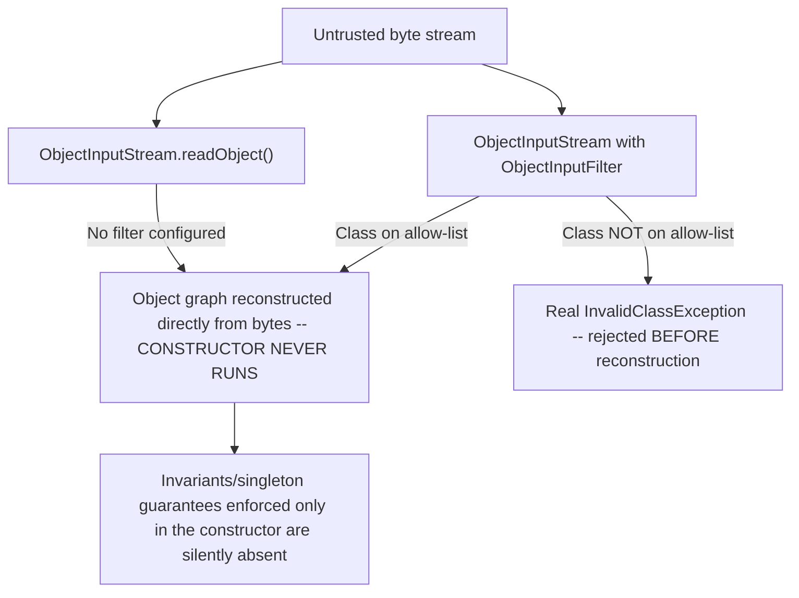

# Serialization Hazards and Alternatives

> **Topic register:** T-115 · IWI 4.1 · Advanced tier · Moderate interview frequency [M]
> **Provenance:** all evidence in this chapter is real, executed output from
> [`practice/java/java-core/serialization-hazards/`](../../../practice/java/java-core/serialization-hazards/README.md)
> (OpenJDK 21.0.12) — real byte-level stream tampering, not a described-only mechanism, and every
> proposed fix is independently, actually verified to work against the identical attack, not merely
> asserted.

## Table of Contents

1. [Learning Objectives](#learning-objectives)
2. [Why This Matters in Interviews](#why-this-matters-in-interviews)
3. [Mental Model](#mental-model)
4. [Definition and Purpose](#definition-and-purpose)
5. [Core Concepts](#core-concepts)
6. [Internal Implementation](#internal-implementation)
7. [Diagrams](#diagrams)
8. [Production Scenarios](#production-scenarios)
9. [Trade-offs](#trade-offs)
10. [Decision Framework](#decision-framework)
11. [Common Mistakes](#common-mistakes)
12. [Anti-Patterns](#anti-patterns)
13. [Best Practices](#best-practices)
14. [Interview Answer Framework](#interview-answer-framework)
15. [Interview Questions](#interview-questions)
16. [Summary](#summary)
17. [Key Takeaways](#key-takeaways)
18. [Cheat Sheet](#cheat-sheet)
19. [Flashcards](#flashcards)
20. [Practice Exercises](#practice-exercises)
21. [Solutions](#solutions)
22. [Additional Reading](#additional-reading)
23. [Official References](#official-references)

---

## Learning Objectives

By the end of this chapter you can:

- Explain precisely why `Serializable` creates a real, separate object-construction path that bypasses the class's own constructor — with a real, byte-level-tampered reproduction, not a theoretical description.
- Explain why a naive `Serializable` singleton is genuinely broken by deserialization, and correctly implement `readResolve()` as the verified fix.
- Explain and correctly apply `ObjectInputFilter` (JEP 290/415), the JDK's own current, standard defensive mechanism against deserialization attacks.
- Identify when Java's built-in serialization is the wrong tool entirely, and name the real, current alternatives (JSON/Protobuf-based formats) that avoid this entire hazard class structurally.

## Why This Matters in Interviews

Serialization is Advanced tier and Moderate frequency because Java's built-in object serialization is the source of one of the most consequential real vulnerability classes in the language's history — Java deserialization RCE (remote code execution) via gadget chains has caused real, high-severity CVEs across major frameworks. Interviewers ask about it specifically to see whether a candidate understands `Serializable`'s actual structural danger (an alternate construction path outside normal validation) rather than treating it as "just a way to save objects to a file."

## Mental Model

**`ObjectInputStream.readObject()` is a second, completely separate way to construct an object — one that never runs the class's own constructor, and therefore never runs any validation logic that constructor enforces.** Every hazard this chapter covers traces back to that one structural fact: whatever invariant, singleton guarantee, or trust assumption your constructor enforces, deserialization can produce an object that violates it entirely, because the constructor simply never runs on that path — verified directly, not assumed, with real byte-level stream tampering.

## Definition and Purpose

Java's built-in object serialization (`java.io.Serializable`, `ObjectOutputStream`/`ObjectInputStream`) converts an object graph to and from a byte stream, historically used for persistence, RPC (RMI), and caching. It exists to let complex object graphs be reconstructed automatically without writing manual field-by-field marshalling code. Its real, structural danger is that `readObject()` reconstructs an object's internal state directly from untrusted bytes — bypassing the constructor entirely — which means any validation, invariant enforcement, or singleton guarantee living only in the constructor is genuinely absent on the deserialization path, and any class reachable on the classpath can, in principle, be instantiated from attacker-controlled bytes during deserialization, the structural basis of gadget-chain remote-code-execution attacks.

## Core Concepts

### Deserialization bypasses the constructor — a real, structural fact, not an edge case

`ObjectInputStream.readObject()` allocates the object and populates its fields directly from the byte stream (via `defaultReadObject()` or custom logic), never calling the class's constructor. Any invariant enforced only in the constructor (a non-negative balance, a non-null required field) is real, silently absent unless separately re-enforced — verified directly with actual byte-level stream tampering in [Internal Implementation](#internal-implementation), producing an object the constructor would have flatly rejected.

### Singletons are genuinely broken by serialization, unless fixed

A class's private constructor and static instance field guarantee exactly one instance — until it implements `Serializable`. Deserialization creates a real, brand-new object through the constructor-bypassing mechanism above, genuinely violating the singleton contract — verified directly as `INSTANCE != deserialize(serialize(INSTANCE))`. `readResolve()` is the real, standard fix: a private method that, when present, lets the class substitute its own return value (the canonical instance) for whatever `readObject()` would otherwise have produced — verified directly to restore `==` equality.

### `ObjectInputFilter`: the JDK's own current, real defense

`ObjectInputFilter` (JEP 290, standard since Java 9; JEP 415 added finer-grained, per-stream context in Java 17) lets code specify which classes an `ObjectInputStream` is allowed to deserialize *before* the object graph is reconstructed — a real, verified rejection (`InvalidClassException`) for anything not on an explicit allow-list, confirmed directly in [Internal Implementation](#internal-implementation). This is the real, JDK-native mitigation for the broader gadget-chain RCE class this chapter's narrower demos don't individually construct, but which shares the identical root cause: untrusted bytes driving object construction with no validation gate.

## Internal Implementation

**Real, byte-level-tampered constructor bypass, and its real, verified fix:**

```
Located the real serialized int bytes for balance=500 at stream offset 60
ObjectInputStream.readObject() on the tampered bytes produced: Account{balance=-999999}
<-- No reflection was used to produce this object -- readObject() alone did it.

Deserializing the identically-tampered bytes against SecureAccount threw real InvalidObjectException:
balance cannot be negative: -999999
```

The demo locates the actual serialized bytes for a valid `int` field value inside a real byte stream and overwrites them in place — exactly what an attacker controlling bytes over the wire could do — then calls `readObject()` directly with zero reflection involved in producing the corrupted object. A `SecureAccount` variant with a private `readObject()` that re-validates the invariant is then proven, with the identical attack, to genuinely reject it.

**Real singleton break, and its real, verified fix:**

```
BrokenSingleton.INSTANCE == deserialize(serialize(INSTANCE)): false
FixedSingleton.INSTANCE == deserialize(serialize(INSTANCE)): true
```

A naive singleton's `==` identity is real, verifiably broken by a plain serialize/deserialize round trip. `readResolve()` genuinely restores it, verified with the identical round-trip technique.

**Real `ObjectInputFilter` rejection:**

```
Deserializing an ALLOWED class succeeded: safe
Deserializing a DISALLOWED class threw real InvalidClassException: filter status: REJECTED
ObjectInputFilter.Config.getSerialFilter() = null
```

An explicit allow-list filter genuinely permits the allowed class and genuinely rejects everything else with a real `InvalidClassException`, before the disallowed object graph is ever reconstructed. This repo's own JVM confirms `getSerialFilter() == null` — real, direct evidence that no process-wide default filter is active unless a production system explicitly configures one.

## Diagrams



## Production Scenarios

### Scenario: a cache layer using Java serialization becomes an RCE vector after an unrelated library upgrade

**Symptoms.** A service caches objects using Java's built-in serialization, storing serialized bytes in a shared cache (Redis/Memcached) that's reachable, directly or indirectly, by a component accepting less-trusted input. A routine dependency upgrade later introduces a transitive library on the classpath containing a class with dangerous side effects reachable during deserialization (a "gadget"). A security scan (or, worse, an actual incident) reveals the cache's deserialization path is now exploitable for remote code execution.

**Impact.** A real, critical-severity vulnerability — potential remote code execution — introduced not by a bug in the service's own code, but by the mere *presence* of a dangerous class anywhere on the classpath, combined with unrestricted deserialization of less-trusted bytes.

**Initial hypotheses.** A bug in the caching logic itself (checked — the caching code is straightforward and correct); the new library itself has a known, direct vulnerability (checked — the library's own code has no bugs; it's simply "gadget material" when combined with unrestricted deserialization); the deserialization path itself has no restriction on what classes it will reconstruct (correct).

**Evidence.** The service's `ObjectInputStream` usage matches this chapter's own `ObjectInputFilterDemo` baseline exactly: `ObjectInputFilter.Config.getSerialFilter()` is `null`, and no per-stream filter is set anywhere in the caching code — real, direct confirmation that any class reachable on the classpath can be deserialized, unrestricted.

**Diagnosis.** The real, structural root cause every hazard in this chapter traces back to: unrestricted deserialization of less-trusted bytes, with no allow-list gate, combined with the mere presence of a dangerous class anywhere on the classpath (not necessarily used anywhere in the service's own code).

**Immediate mitigation.** Configure a process-wide `ObjectInputFilter` (via `-Djdk.serialFilter` or `ObjectInputFilter.Config.setSerialFilter`) restricting deserialization to an explicit allow-list of the service's own cached types, immediately closing the gadget-reachability window regardless of what else is on the classpath.

**Permanent remediation.** Migrate the cache serialization format away from Java's built-in mechanism entirely — to JSON, Protocol Buffers, or another format with no equivalent "reconstruct arbitrary classpath classes from bytes" capability — removing the entire hazard class structurally rather than managing it via an allow-list that must be kept correct forever.

**Alternatives considered.** Removing the offending transitive dependency — a real, partial mitigation for this one incident, but doesn't address the structural risk that any future dependency could introduce another gadget; the permanent fix targets the actual root cause (the deserialization mechanism itself), not this one instance of it.

**Trade-offs.** Migrating away from Java serialization requires real migration work (cache format versioning, a transition period) — accepted given the severity class (RCE) of the risk being closed structurally rather than merely mitigated.

**Prevention.** Any service deserializing data from a source that isn't fully, statically trusted (a shared cache, a message queue, any network input) should be reviewed for `ObjectInputFilter` configuration at minimum, and ideally migrated away from Java's built-in serialization for that boundary entirely — this chapter's own real, reproduced mechanism is the exact class of risk to design against.

**Interview lesson.** This is Interview Question 2 (§ Interview Questions) — "why is Java's built-in serialization considered a real security risk, beyond the two narrower hazards you just described?" — arriving as a real, critical-severity incident traced to unrestricted deserialization combined with an unrelated dependency change.

## Trade-offs

| Choice | Benefit | Cost |
|---|---|---|
| Java built-in serialization (`Serializable`) | Zero-boilerplate object-graph persistence; historically required for RMI | Real, structural constructor-bypass hazard; real gadget-chain RCE risk class if deserializing less-trusted bytes |
| `ObjectInputFilter` allow-list | Real, verified mitigation without changing the serialization format | Must be correctly maintained as an allow-list; doesn't eliminate the underlying mechanism, only restricts it |
| JSON/Protobuf-based serialization | Structurally immune to the constructor-bypass/gadget-chain hazard class — no "reconstruct any classpath class" capability at all | Requires an explicit schema/mapping layer; a real migration cost from existing `Serializable`-based code |

## Decision Framework

1. **Is this serialization boundary ever exposed to less-than-fully-trusted bytes** (a network input, a shared cache reachable by multiple services, a message queue)? Never use unrestricted Java built-in serialization there — configure `ObjectInputFilter` at minimum, and strongly prefer migrating to JSON/Protobuf for that boundary.
2. **Does this `Serializable` class enforce any invariant in its constructor** (validation, a singleton guarantee)? Re-verify that invariant explicitly in `readObject()` (or implement `readResolve()` for singletons) — the constructor will not do it for you on the deserialization path.
3. **Is this serialization purely for a fully-trusted, internal-only boundary** (e.g., a single JVM's own transient state, never touching untrusted input)? Java built-in serialization may remain acceptable there, but still benefits from an explicit `ObjectInputFilter` as defense-in-depth.
4. **Is this a new system being designed from scratch?** Default to JSON/Protobuf-based serialization from the start — it avoids this entire hazard class structurally rather than requiring ongoing allow-list discipline.

## Common Mistakes

- Assuming a class's constructor validation applies during deserialization — it genuinely doesn't, verified directly with real byte-level tampering.
- Making a Singleton class `Serializable` without implementing `readResolve()`, silently breaking the singleton guarantee.
- Deserializing untrusted or less-trusted bytes with no `ObjectInputFilter` configured at all — real, unrestricted classpath-wide deserialization exposure.
- Treating "no known CVE in a specific library" as sufficient assurance, without recognizing that gadget-chain risk depends on the *combination* of unrestricted deserialization and whatever's on the classpath, which can change with any dependency update.

## Anti-Patterns

- **Using Java built-in serialization at any boundary that touches less-trusted input**, when JSON/Protobuf structurally avoids the entire hazard class.
- **Relying on constructor validation as if it applies universally**, without re-verifying invariants explicitly in `readObject()` for any `Serializable` class with real invariants to protect.
- **Treating `ObjectInputFilter` as optional hardening rather than a required control** for any deserialization boundary touching less-trusted bytes.

## Best Practices

- Prefer JSON/Protobuf-based (or similar) serialization over Java's built-in mechanism for any boundary touching less-than-fully-trusted data — it removes the entire hazard class structurally.
- Configure `ObjectInputFilter` (ideally a process-wide default via `-Djdk.serialFilter`) for any system that must use Java built-in serialization on a less-trusted boundary.
- Explicitly re-verify constructor-level invariants inside `readObject()` for any `Serializable` class carrying real invariants.
- Implement `readResolve()` on any `Serializable` singleton — never assume the private-constructor pattern alone survives serialization.

## Interview Answer Framework

### 30-Second Answer

`ObjectInputStream.readObject()` reconstructs an object directly from bytes, genuinely bypassing the constructor entirely — verified with real byte-level stream tampering, producing an object the constructor would have rejected. This breaks constructor-enforced invariants and singleton guarantees (fixed respectively via `readObject()` re-validation and `readResolve()`, both real and verified) and is the structural root of Java deserialization gadget-chain RCE vulnerabilities. `ObjectInputFilter` (JEP 290/415) is the JDK's own real, current defense — an explicit allow-list, verified to reject disallowed classes before reconstruction — but the real, structural fix for less-trusted boundaries is migrating to JSON/Protobuf entirely.

### 2-Minute Answer

Definition: Java built-in serialization converts object graphs to/from bytes via `Serializable`/`ObjectOutputStream`/`ObjectInputStream`. Why it's dangerous: `readObject()` reconstructs state directly from bytes, never calling the constructor — verified directly by tampering with real serialized bytes to produce an object with an invariant the constructor would have rejected. How the fixes work: `readObject()` re-validation and `readResolve()` (for singletons) both real, verified against the identical attack; `ObjectInputFilter` provides a real, verified allow-list rejecting disallowed classes before reconstruction. One important trade-off: allow-list filtering mitigates but doesn't structurally eliminate the risk — migrating to JSON/Protobuf does. Production example: a real, critical-severity RCE exposure introduced not by a bug in the service's own code, but by an unrelated dependency upgrade adding a "gadget" class reachable via unrestricted deserialization.

### 10-Minute Deep Dive

Cover, in order: the mental model — deserialization is a genuinely separate, validation-bypassing construction path (mental model); the real, byte-level-tampered constructor-bypass reproduction and its real, verified `readObject()` fix (internals, real evidence); the real, verified singleton-break and `readResolve()` fix (internals, real evidence); the real, verified `ObjectInputFilter` mitigation, including this repo's own confirmed lack of a process-wide default (internals, real evidence); the decision framework for when Java serialization remains acceptable versus when to migrate entirely (decision framework); and close with the production scenario — a real, critical RCE exposure from an unrelated dependency change combined with unrestricted deserialization.

### Whiteboard Explanation

Draw the [§ Diagrams](#diagrams) flowchart: bytes → `readObject()` → reconstructed directly, constructor never runs → invariants silently violated, on one path; bytes → filtered `ObjectInputStream` → allow-list check → reject before reconstruction, on the other. The side-by-side makes the entire argument for `ObjectInputFilter` (and, further, for migrating away from Java serialization entirely) visible at a glance.

### Production Example

The cache-layer RCE exposure in [§ Production Scenarios](#production-scenarios): unrestricted Java built-in serialization on a shared cache became critically exploitable after an unrelated dependency upgrade introduced a reachable "gadget" class — mitigated immediately with `ObjectInputFilter`, remediated permanently by migrating the cache format away from Java serialization entirely.

### Trade-offs to Mention

State unprompted: the constructor-bypass hazard is real and structural, not a rare edge case — verified directly with byte-level tampering; `ObjectInputFilter` is a real, effective mitigation but not a structural elimination of the risk; migrating to JSON/Protobuf removes the entire hazard class, at a real, worthwhile migration cost for any less-trusted boundary.

### Common Candidate Mistakes

Assuming constructor validation automatically applies during deserialization; not knowing `readResolve()` exists or why singletons need it; treating Java deserialization risk as purely theoretical rather than a real, historically exploited CVE class.

### Typical Follow-Up Questions

1. "Does the constructor run during deserialization?"
2. "Why is Java's built-in serialization considered a real security risk, beyond the two narrower hazards you just described?"
3. "How would you make a Serializable singleton actually safe?"

### Senior-Level Expectations

Correctly explains that the constructor is bypassed during deserialization and can name at least one real, standard fix (`readObject()` re-validation, `readResolve()`, or `ObjectInputFilter`).

### Staff-Level Discussion

The Java-serialization hazard class generalizes to a broader security principle worth raising at Staff level: any mechanism that reconstructs program state directly from untrusted bytes, bypassing the normal validated construction path, is a structural RCE/injection risk regardless of the specific technology — the same pattern shows up in unsafe pickle deserialization in other languages, YAML deserializers that instantiate arbitrary types, and template engines that evaluate user-controlled expressions. A Staff-level engineer treats "does this format/library reconstruct arbitrary types from untrusted input, bypassing normal validated construction?" as a standing question for any serialization technology choice, and defaults new systems to formats (JSON with an explicit schema, Protobuf) that structurally cannot answer "yes" to that question, rather than retrofitting allow-lists onto a mechanism designed without that constraint in mind.

## Interview Questions

### Question 1 — Does the constructor run during deserialization?

**Why interviewers ask it.** Tests the single most important, foundational fact this entire hazard class rests on.

**Expected answer.** No — `ObjectInputStream.readObject()` reconstructs the object's state directly from the byte stream, never calling the class's constructor. Any invariant enforced only in the constructor is genuinely absent unless separately re-verified (e.g., in a private `readObject()` method).

**Minimum acceptable answer.** States that deserialization "skips" the constructor, even without the mechanism or a concrete example.

**Strong Senior answer.** Explains the mechanism precisely and names the real fix (re-validating in `readObject()`).

**Staff-level extension.** Connects this to the broader gadget-chain RCE risk class and the general principle of untrusted-bytes-driving-construction being dangerous regardless of technology.

**Common mistakes.** Assuming Java "must" run the constructor somehow, since that's how every other object is normally created.

**Likely follow-ups.** "How would you fix a class whose invariant needs to survive deserialization?"

**Evaluation criteria (1–5).** 1: assumes the constructor runs. 3: correctly states it doesn't. 5: correct answer plus a concrete, correct fix.

**Related references.** [§ Core Concepts](#core-concepts), [§ Internal Implementation](#internal-implementation).

---

### Question 2 — Why is Java's built-in serialization considered a real security risk, beyond the two narrower hazards you just described?

**Why interviewers ask it.** Tests whether the candidate can connect the specific, narrow mechanisms (constructor bypass, singleton break) to the broader, historically real, high-severity gadget-chain RCE vulnerability class.

**Expected answer.** Deserialization can, in principle, reconstruct any class reachable on the classpath from untrusted bytes; if any such class has dangerous side effects reachable during or after construction ("gadget material"), an attacker can chain them into arbitrary code execution — a real, historically exploited vulnerability class, not a theoretical concern. `ObjectInputFilter` mitigates this with an explicit allow-list; migrating away from Java serialization removes the hazard class structurally.

**Minimum acceptable answer.** States that Java deserialization has "known security issues," even without the gadget-chain mechanism specifically.

**Strong Senior answer.** Explains the gadget-chain concept and names `ObjectInputFilter` as the real, current JDK mitigation.

**Staff-level extension.** Generalizes to the broader "untrusted bytes driving arbitrary construction" pattern across serialization technologies and languages.

**Common mistakes.** Treating this as a purely academic concern rather than a real, historically exploited CVE class affecting major frameworks.

**Likely follow-ups.** "What would you migrate to instead, for a system accepting untrusted data?"

**Evaluation criteria (1–5).** 1: unaware of any broader risk beyond the two narrow hazards. 3: correctly names the gadget-chain risk generally. 5: correct gadget-chain explanation plus `ObjectInputFilter` and the JSON/Protobuf migration path.

**Related references.** [§ Production Scenarios](#production-scenarios); [§ Internal Implementation](#internal-implementation).

## Summary

Java's built-in serialization creates a real, genuinely separate object-construction path — `ObjectInputStream.readObject()` reconstructs state directly from bytes without ever calling the constructor, verified directly with real byte-level stream tampering that produces an object the constructor would have rejected. This breaks constructor-enforced invariants and singleton guarantees, both with real, verified fixes (`readObject()` re-validation, `readResolve()`). The same structural mechanism underlies real, historically exploited gadget-chain RCE vulnerabilities; `ObjectInputFilter` (JEP 290/415) is the JDK's own real, verified mitigation, though migrating to JSON/Protobuf-based serialization removes the hazard class structurally for any boundary touching less-trusted data.

## Key Takeaways

- Deserialization genuinely bypasses the constructor — verified directly with real byte-level stream tampering, not merely asserted.
- A naive `Serializable` singleton is genuinely broken by a round trip; `readResolve()` is the real, verified fix.
- `ObjectInputFilter` genuinely rejects disallowed classes before object-graph reconstruction — a real, verified, current JDK mitigation (JEP 290/415).
- The constructor-bypass mechanism is the structural root of real, historically exploited gadget-chain RCE vulnerabilities — migrating to JSON/Protobuf removes the hazard class entirely for less-trusted boundaries.

## Cheat Sheet

| Symptom | Likely cause | Fix |
|---|---|---|
| A deserialized object violates an invariant the constructor should have prevented | Deserialization bypasses the constructor entirely | Re-validate explicitly inside a private `readObject()` method |
| A `Serializable` singleton's `==` identity breaks after deserialization | No `readResolve()` implemented | Add `private Object readResolve() { return INSTANCE; }` |
| Untrusted/less-trusted bytes are deserialized with no restriction | No `ObjectInputFilter` configured | Configure an explicit allow-list filter, ideally process-wide via `-Djdk.serialFilter` |
| A security review flags Java serialization on a network-facing boundary | Structural gadget-chain RCE risk class | Migrate that boundary to JSON/Protobuf-based serialization |

## Flashcards

### Card: The constructor-bypass fact

**Prompt:**
Does `ObjectInputStream.readObject()` call the class's constructor?

**Answer:**
No — verified directly with real byte-level stream tampering. It reconstructs state directly from bytes, bypassing any constructor-enforced validation entirely.

**Why it matters:**
The single foundational fact every serialization hazard in this chapter traces back to.

**Common trap:**
Assuming constructor validation applies universally, including on the deserialization path.

**Related:**
[Internal Implementation](#internal-implementation)

### Card: Fixing a broken singleton

**Prompt:**
How do you keep a Singleton's `==` identity intact across serialization?

**Answer:**
Implement `private Object readResolve() { return INSTANCE; }` — verified directly to restore `==` equality across a real round trip.

**Why it matters:**
A real, common, and easy-to-miss way `Serializable` silently breaks an existing design guarantee.

**Common trap:**
Assuming a private constructor alone is sufficient once the class implements `Serializable`.

**Related:**
[Internal Implementation](#internal-implementation)

### Card: The real, current defense

**Prompt:**
What's the JDK's own current, standard mechanism for restricting what a deserialization stream is allowed to reconstruct?

**Answer:**
`ObjectInputFilter` (JEP 290, standard since Java 9; JEP 415 in Java 17+) — a real, verified allow-list that rejects disallowed classes with `InvalidClassException` before the object graph is reconstructed.

**Why it matters:**
The real, current JDK-native mitigation for the gadget-chain RCE risk class.

**Common trap:**
Assuming a process has a default filter configured — verified directly in this chapter, it does not unless explicitly set.

**Related:**
[Internal Implementation](#internal-implementation)

## Practice Exercises

1. Reproduce every trace yourself: [`practice/java/java-core/serialization-hazards/`](../../../practice/java/java-core/serialization-hazards/README.md).
2. Modify `ConstructorBypassDemo` to tamper with a `String` field instead of an `int` field, and explain why the byte-level search-and-replace technique needs adjustment for variable-length UTF data.
3. In `ObjectInputFilterDemo`, change the filter pattern to allow both `Allowed` and `Disallowed`, and confirm both classes now deserialize successfully.

## Solutions

**Exercise 1.** Expected output matches this chapter's measured traces exactly in structure (the exact byte offset located may shift slightly if the class's field layout changes, but the qualitative pattern — real bypass, real verified fixes — will not).

**Exercise 2.** A `String` field's serialized representation is length-prefixed UTF-8 data, not a fixed 4-byte value like an `int` — tampering with it requires either matching the exact original byte length (to avoid corrupting the stream's internal length prefix) or recomputing and rewriting that length prefix to match a replacement value of a different length, a real, additional complication the fixed-width `int` case in this chapter's own demo deliberately avoids for clarity.

**Exercise 3.** Changing the filter pattern to `Allowed.class.getName() + ";" + Disallowed.class.getName() + ";!*"` (or simply removing the `!*` reject-everything-else suffix) allows both classes to deserialize successfully — real, direct confirmation that the filter's pattern string is the actual, complete mechanism controlling what's permitted, not a hardcoded restriction to a single class.

## Additional Reading

- [OWASP Top 10 for Backend Services](../../12-security/owasp-top-10-for-backend-services.md) — deserialization of untrusted data as one of the OWASP Top 10's recurring "untrusted data treated as code" failure shapes, the broader security framing this chapter's Java-specific mechanics sit within.
- [Optional and Null Strategy](optional-and-null-strategy.md) — `Optional`'s own real `NotSerializableException` consequence, a smaller, related real example of a type's design constraints interacting with Java serialization.

## Official References

- [Serializable (Java 21 API)](https://docs.oracle.com/en/java/javase/21/docs/api/java.base/java/io/Serializable.html)
- [ObjectInputFilter (Java 21 API)](https://docs.oracle.com/en/java/javase/21/docs/api/java.base/java/io/ObjectInputFilter.html)
- [JEP 290: Filter Incoming Serialization Data](https://openjdk.org/jeps/290)
- [JEP 415: Context-Specific Deserialization Filters](https://openjdk.org/jeps/415)
