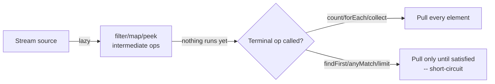

# Streams and Collectors

> **Topic register:** T-107 · IWI 6.2 · Core tier
> **Provenance:** every trace in this chapter is real, executed output from [`practice/java/week-13/streams-collectors/src/`](../../practice/java/week-13/streams-collectors/src/) on OpenJDK 21.0.12.

## Table of Contents

1. [Learning Objectives](#learning-objectives)
2. [Why This Matters in Interviews](#why-this-matters-in-interviews)
3. [Mental Model](#mental-model)
4. [Definition and Purpose](#definition-and-purpose)
5. [Core Concepts](#core-concepts)
6. [Internal Implementation](#internal-implementation)
7. [Diagrams](#diagrams)
8. [Java Examples](#java-examples)
9. [Production Scenarios](#production-scenarios)
10. [Trade-offs](#trade-offs)
11. [Decision Framework](#decision-framework)
12. [Common Mistakes](#common-mistakes)
13. [Anti-Patterns](#anti-patterns)
14. [Best Practices](#best-practices)
15. [Interview Answer Framework](#interview-answer-framework)
16. [Interview Questions](#interview-questions)
17. [Summary](#summary)
18. [Key Takeaways](#key-takeaways)
19. [Cheat Sheet](#cheat-sheet)
20. [Flashcards](#flashcards)
21. [Practice Exercises](#practice-exercises)
22. [Solutions](#solutions)
23. [Additional Reading](#additional-reading)
24. [Official References](#official-references)

---

## Learning Objectives

By the end of this chapter you can:

- Explain, with a measured trace, why a stream pipeline does nothing until a terminal operation runs, and why `findFirst()` short-circuits.
- State exactly why `Collectors.toMap()` throws on duplicate keys, and how a merge function fixes it.
- Explain why a shared, non-thread-safe collection corrupts under `parallel().forEach()`, with a measured corruption count.
- Justify, with properly-warmed-up measurements, why parallel streams can be *slower* than sequential for small or cheap-per-element workloads.

## Why This Matters in Interviews

Streams questions separate candidates who use the fluent API correctly from those who understand its actual execution model. The laziness/short-circuiting behavior and the `parallel()` pitfalls are both near-universal real-world traps — most Java codebases have at least one `parallel()` call added for a speedup that never materialized, or a `toMap()` call one production dataset away from an `IllegalStateException`.

## Mental Model

**A stream is a recipe, not a result — nothing runs until a terminal operation asks for output, and even then, only as much of the recipe executes as the terminal operation actually needs.** `peek()`-based tracing makes this concrete: elements only flow through the pipeline when someone downstream is actually pulling. `parallel()` changes *how* that pulling happens (across threads via fork/join), not *whether* the recipe itself needs to be thread-safe — which is exactly where most parallel-stream bugs live.

## Definition and Purpose

A **stream** is a sequence of elements supporting functional-style, lazily-evaluated operations, built by chaining zero or more *intermediate* operations (`filter`, `map`, `peek`) and ending in exactly one *terminal* operation (`collect`, `forEach`, `count`, `findFirst`). **Collectors** are the standard mechanism for accumulating a stream's elements into a result (a `List`, a `Map`, a grouped structure) via `Stream.collect(Collector)`.

Streams exist to let element-at-a-time transformations be expressed declaratively, and — because the pipeline is only a description until a terminal operation runs — to let the runtime decide how much work is actually necessary (short-circuiting) and, optionally, whether to parallelize it.

## Core Concepts

### Intermediate operations are lazy; terminal operations trigger execution

Building a pipeline with `filter`/`map`/`peek` does no work at all. Only calling a terminal operation (`count()`, `forEach()`, `collect()`, `findFirst()`) pulls elements through the pipeline.

### Short-circuiting terminal operations can stop pulling early

`findFirst()`, `anyMatch()`, and `limit()` don't need every element — the stream machinery stops requesting more elements from the source the moment the terminal operation is satisfied.

### A stream can only be consumed once

Calling a terminal operation marks the stream "operated upon"; any further operation on the same stream object throws `IllegalStateException`.

### `Collectors.toMap()` throws on duplicate keys without a merge function

The two-argument `toMap(keyFn, valueFn)` overload has no way to resolve a collision, so it throws. The three-argument overload `toMap(keyFn, valueFn, mergeFn)` requires the caller to state how duplicates combine.

### `parallel()` does not make shared mutable state thread-safe

`parallel().forEach(sharedList::add)` runs `add` calls from multiple threads concurrently; a non-thread-safe collection (a plain `ArrayList`) loses updates under that concurrent access, silently, with no exception.

### Parallel streams have real overhead that can exceed the savings

Splitting work across the fork/join pool costs thread coordination; for small collections or cheap per-element work, that coordination cost can dominate, making `parallel()` a net loss — measurable only after JIT warmup, since a single untuned timing call is not a reliable benchmark.

## Internal Implementation

**Laziness and short-circuiting, measured:**

```
== A stream pipeline does nothing until a terminal operation runs ==
Pipeline built. No peek output above this line yet.
Now calling .count() (a terminal operation):
peek saw: 1
peek saw: 2
peek saw: 3
peek saw: 4
peek saw: 5
count = 2

== Short-circuiting: findFirst() stops pulling elements once satisfied ==
evaluating: 1
evaluating: 2
evaluating: 3
findFirst result = 3
(peek should only have printed 1, 2, 3 -- not the whole 10-element source)

== A stream can only be consumed once ==
IllegalStateException on reuse: stream has already been operated upon or closed
```

**`toMap()` duplicate-key behavior, measured:**

```
== Collectors.toMap() throws on duplicate keys without a merge function ==
IllegalStateException: Duplicate key alice (attempted merging values 100.0 and 75.0)

== Fixed: a merge function tells the collector how to combine duplicates ==
totals per customer: {alice=175.0, bob=50.0, carol=200.0}
```

**Parallel-stream corruption of shared state, measured** — `IntStream.range(0, 100_000).parallel().forEach(sharedList::add)` against a plain `ArrayList`:

```
== A non-thread-safe accumulator corrupted by a parallel stream ==
Expected size: 100000, actual size: 24494  <-- CORRUPTED, lost updates from concurrent ArrayList.add()

== The correct, thread-safe way: a proper collector ==
Collector-based size: 100000 (always correct)
```

**Parallel overhead for small, cheap-per-element work, measured with proper JIT warmup** (20,000 warmup iterations, then 20,000 measured iterations, summing a 1,000-element `IntStream`):

```
Sequential sum=499500, avg over 20,000 iters: 3,111 ns/iter
Parallel   sum=499500, avg over 20,000 iters: 20,539 ns/iter
```

Roughly 6.6x slower for the parallel version, entirely from fork/join task-splitting and thread-handoff overhead — for a workload this small and this cheap per element, there is no computation expensive enough to amortize that cost. A naive, single-shot `nanoTime()` comparison without warmup can even show the opposite result purely from JIT compilation timing, which is itself a lesson in why microbenchmarks need warmup, not just a lesson about streams.

## Diagrams



## Java Examples

```java
// Java 21. A custom Collector via Collector.of -- the four building blocks:
// supplier, accumulator, combiner, finisher.
Collector<Order, double[], String> runningTotalCollector = Collector.of(
        () -> new double[1],                         // supplier: fresh accumulator
        (acc, order) -> acc[0] += order.amount(),     // accumulator: fold one element in
        (acc1, acc2) -> { acc1[0] += acc2[0]; return acc1; }, // combiner: merge parallel partials
        acc -> String.format("$%.2f", acc[0])         // finisher: produce the final result
);
String grandTotal = orders.stream().collect(runningTotalCollector);
```

```java
// Java 21. groupingBy with a downstream collector -- count per group,
// not just the grouped lists themselves.
Map<String, Long> counts = orders.stream()
        .collect(Collectors.groupingBy(Order::customer, Collectors.counting()));
```

**Complexity note:** a single-pass stream pipeline (`filter`/`map`/`collect`) is `O(n)` in the source size; `sorted()` is `O(n log n)`; `parallel()` changes the constant factor and threading model, not the asymptotic complexity.

## Production Scenarios

### Scenario: a "performance optimization" adding `parallel()` regresses a hot request path

**Symptoms.** A service processes a list of roughly 200 items per request using a stream pipeline. An engineer adds `.parallel()` to "speed it up," and after deployment, p99 latency for that endpoint increases rather than decreases, and CPU utilization across the fleet rises noticeably under load.

**Impact.** A change intended as a performance win becomes a regression, consuming more CPU fleet-wide for worse latency on the affected endpoint.

**Initial hypotheses.** An unrelated deploy caused the regression (checked — the parallel-stream change is the only diff in the release); the workload changed (checked — request shapes are unchanged); the parallel stream's fork/join overhead exceeds the per-element work it parallelizes (correct).

**Evidence.** Profiling shows every request now spawns fork/join tasks competing for the shared common pool, and per-request latency variance increases (some requests wait behind other requests' fork/join tasks sharing the same pool) — exactly the overhead this chapter measures directly for small, cheap-per-element workloads.

**Diagnosis.** 200 elements with cheap per-element transformation is exactly the profile where `parallel()`'s fork/join coordination cost dominates — the same mechanism measured in this chapter's 6.6x-slower benchmark, now at production scale and additionally contending on the shared `ForkJoinPool.commonPool()` across concurrent requests.

**Immediate mitigation.** Revert the `.parallel()` call.

**Permanent remediation.** Establish a rule that `.parallel()` is only added after measuring with a proper warmed-up benchmark on realistic data volume, never applied reflexively as a "should be faster" change; if genuine parallelism is needed for a large, CPU-heavy batch job, use a dedicated `ForkJoinPool` rather than the shared common pool to avoid cross-request contention.

**Alternatives considered.** Tuning the common pool's parallelism level instead of removing `.parallel()` — rejected, since the fundamental issue (per-element work too cheap to amortize coordination cost) isn't fixed by pool sizing.

**Trade-offs.** None — reverting a change that measurably regressed both latency and CPU cost has no downside here.

**Prevention.** Treat `parallel()` as requiring the same measurement discipline as any other performance change: a warmed-up, realistic benchmark before merging, not an assumption that "parallel" implies "faster."

**Interview lesson.** This is the production-scale version of this chapter's own measured benchmark: `parallel()` added without measurement, regressing exactly the way the chapter's warmed-up numbers predict for small, cheap-per-element work.

## Trade-offs

| Choice | Benefit | Cost |
|---|---|---|
| Sequential stream | No coordination overhead, predictable | Single-threaded — doesn't use multiple cores |
| Parallel stream | Can use multiple cores for large, CPU-heavy work | Fork/join coordination overhead; can regress small/cheap workloads; shares the common pool with everything else unless a custom pool is used |
| `toMap()` (2-arg) | Simplest form | Throws on any duplicate key |
| `toMap()` (3-arg, with merge function) | Handles duplicates explicitly | Requires the caller to decide the merge semantics up front |

## Decision Framework

1. **Is the collection large and is the per-element work genuinely CPU-heavy?** Only then consider `parallel()` — and measure with a warmed-up benchmark before keeping it.
2. **Does the stream pipeline write to any shared, non-thread-safe state** (a plain collection, a mutable field)? If using `parallel()`, that state must be replaced with a proper collector or an atomic/concurrent structure — never assume `forEach` serializes the writes.
3. **Can the key ever collide** in a `toMap()` call? Use the 3-argument overload with an explicit merge function rather than risking `IllegalStateException` in production.
4. **Does the terminal operation only need some elements** (existence check, first match)? Use `findFirst`/`anyMatch`/`limit` to get the short-circuiting benefit rather than collecting everything first.

## Common Mistakes

- Assuming a stream pipeline executes as it's being built, rather than only at the terminal operation.
- Using `Collectors.toMap()` without a merge function on data that can contain duplicate keys.
- Writing to a shared, non-thread-safe collection inside a `parallel().forEach()`.
- Adding `.parallel()` without measuring, assuming "parallel" always means "faster."

## Anti-Patterns

- **`parallel().forEach(sharedMutableCollection::add)`** — a specific, common instance of the shared-state corruption this chapter measures directly.
- **Reflexively adding `.parallel()`** to any stream "for performance" without a warmed-up benchmark showing an actual improvement for the real data size.
- **Reusing a `Stream` reference** after a terminal operation has already consumed it.

## Best Practices

- Measure before adding `.parallel()`, with proper JIT warmup and realistic data volume — never assume it helps.
- Use a proper `Collector` (or a concurrent/atomic accumulator) for any parallel accumulation, never a plain mutable collection.
- Default to the 3-argument `Collectors.toMap()` with an explicit merge function whenever key collisions are even plausible.
- Prefer short-circuiting terminal operations (`findFirst`, `anyMatch`, `limit`) when the full result set isn't actually needed.

## Interview Answer Framework

### 30-Second Answer

A stream pipeline is lazy — intermediate operations build a recipe, and nothing executes until a terminal operation runs, with short-circuiting terminal operations (`findFirst`) stopping early. `Collectors.toMap()` throws on duplicate keys without a merge function. `parallel()` doesn't make shared state thread-safe — measured directly: a plain `ArrayList` loses updates under `parallel().forEach()` — and for small or cheap-per-element workloads, parallel overhead can make it measurably slower than sequential.

### 2-Minute Answer

Definition: a stream chains lazy intermediate operations ending in one terminal operation; collectors accumulate results. Why it exists: lets transformations be expressed declaratively while letting the runtime decide how much work is actually necessary. How it works: nothing runs until the terminal operation; short-circuiting operations stop early; `parallel()` changes the execution model (fork/join) but not the need for thread-safety. One important trade-off: parallel streams have real coordination overhead that can exceed their benefit for small/cheap workloads. Production example: a real measured 6.6x slowdown from adding `parallel()` to a small, cheap-per-element pipeline after proper JIT warmup, and a real ArrayList corruption (100,000 expected, ~24,000 actual) from a non-thread-safe accumulator under `parallel().forEach()`.

### 10-Minute Deep Dive

Cover, in order: the mental model — a stream is a recipe, not a result (mental model); the measured laziness/short-circuiting trace (internals, real evidence); `toMap()`'s duplicate-key behavior and the merge-function fix (internals, real evidence); the measured parallel-stream shared-state corruption (internals, real evidence); the measured, warmed-up parallel-vs-sequential overhead comparison (internals, real evidence); the decision framework for when `parallel()` is actually justified (decision framework); and close with the production scenario — a reflexive `parallel()` addition regressing a hot path exactly as the chapter's benchmark predicts.

### Whiteboard Explanation

Draw the [§ Diagrams](#diagrams) flowchart: source → intermediate ops (labeled "lazy, nothing runs yet") → a diamond "terminal op called?" branching to "pull everything" (count/forEach/collect) versus "pull only until satisfied" (findFirst/anyMatch/limit). Annotate the branch point: "this is where laziness becomes visible — before this, nothing has executed."

### Production Example

The `parallel()` regression in [§ Production Scenarios](#production-scenarios): adding `.parallel()` to a small, cheap-per-element hot-path pipeline increased both latency and fleet-wide CPU usage, exactly matching this chapter's own measured 6.6x overhead finding.

### Trade-offs to Mention

State unprompted: `parallel()` is not a free performance win and needs measurement; a stream can only be consumed once; `toMap()`'s duplicate-key behavior needs an explicit merge function decision, not a hope that data never collides.

### Common Candidate Mistakes

Assuming stream operations execute as the pipeline is built rather than at the terminal operation; assuming `parallel()` always improves performance; writing to a shared collection inside a parallel stream without considering thread-safety.

### Typical Follow-Up Questions

1. "Your `parallel()` change made things slower. Why might that happen?"
2. "How would you accumulate results safely from a parallel stream instead of a shared list?"

### Senior-Level Expectations

Correctly explains stream laziness and short-circuiting with a concrete example; identifies that `parallel()` requires thread-safe accumulation.

### Staff-Level Discussion

The 6.6x measured slowdown from adding `parallel()` to a small, cheap workload is a specific instance of a general principle: any concurrency mechanism has a fixed coordination cost, and that cost only pays for itself past some workload-size threshold that must be measured, not assumed. A Staff engineer treats "add `.parallel()`" the same way they'd treat "add a thread pool" or "add a cache" — as a change requiring a before/after measurement on realistic data, not a reflexive optimization. The shared-common-pool contention risk (multiple unrelated parallel streams across a service competing for the same fork/join pool) is the less obvious, more consequential version of this same principle at true production scale.

## Interview Questions

### Question 1 — Your `parallel()` change made things slower. Why might that happen?

**Why interviewers ask it.** Tests whether the candidate understands that parallelism has a real, measurable coordination cost, not just abstract concurrency benefits.

**Expected answer.** Fork/join task-splitting and thread-handoff overhead can exceed the savings for small collections or cheap per-element work; the fix is measuring with proper warmup before adding `parallel()`, not assuming it helps.

**Minimum acceptable answer.** States that parallel streams have overhead, even without the fork/join specifics.

**Strong Senior answer.** Correctly explains the coordination-cost-vs-workload-size trade-off.

**Staff-level extension.** Names the shared-common-pool contention risk across unrelated concurrent parallel streams in the same process, and proposes measuring with a proper warmed-up benchmark before any such change ships.

**Common mistakes.** Assuming `parallel()` always improves performance regardless of workload size or per-element cost.

**Likely follow-ups.** "How would you benchmark this properly?"

**Evaluation criteria (1–5).** 1: no explanation, "should be faster." 3: names fork/join overhead as the cause. 5: correct cause plus the shared-pool contention risk and proper measurement discipline.

**Related references.** [§ Internal Implementation](#internal-implementation); [§ Production Scenarios](#production-scenarios).

---

### Question 2 — How would you accumulate results safely from a parallel stream instead of a shared list?

**Why interviewers ask it.** Tests whether the candidate knows the correct fix, not just that the bug exists.

**Expected answer.** Use a proper `Collector` (`Collectors.toList()`, `Collectors.toMap()` with a merge function, or a custom `Collector.of(...)`) rather than a shared mutable collection with `forEach`.

**Minimum acceptable answer.** States that `forEach` with a shared collection is unsafe under `parallel()`.

**Strong Senior answer.** Proposes `.collect(Collectors.toList())` or an equivalent proper collector.

**Staff-level extension.** Explains why: collectors are designed with a combiner step specifically to merge per-thread partial results correctly, which a shared mutable collection's `add()` calls cannot do safely under concurrent access.

**Common mistakes.** Reaching for a manually-synchronized shared list instead of the built-in collector mechanism designed for exactly this.

**Likely follow-ups.** "What does the combiner step of a custom Collector actually do?"

**Evaluation criteria (1–5).** 1: doesn't recognize the shared-list approach is unsafe. 3: proposes a proper collector. 5: correct proposal plus explains the combiner mechanism.

**Related references.** [§ Internal Implementation](#internal-implementation); [§ Java Examples](#java-examples).

## Summary

A stream pipeline is lazy — nothing executes until a terminal operation runs, measured directly via `peek()` tracing, and short-circuiting operations like `findFirst()` stop pulling elements once satisfied. `Collectors.toMap()` throws on duplicate keys without an explicit merge function. `parallel()` does not make shared state thread-safe — a plain `ArrayList` measurably loses updates under concurrent `forEach`-based writes — and for small or cheap-per-element workloads, parallel overhead can make execution measurably slower than sequential, visible only after proper JIT warmup.

## Key Takeaways

- Streams are lazy: intermediate operations build a pipeline, terminal operations execute it.
- Short-circuiting terminal operations (`findFirst`, `anyMatch`, `limit`) stop pulling elements once satisfied.
- `Collectors.toMap()` throws on duplicate keys unless given an explicit merge function.
- `parallel()` requires thread-safe accumulation and real measurement — it is not a free performance win.

## Cheat Sheet

| Need | Approach |
|---|---|
| Accumulate stream results safely, possibly in parallel | A proper `Collector`, never a shared mutable collection with `forEach` |
| Build a `Map` from a stream with possible duplicate keys | `Collectors.toMap(keyFn, valueFn, mergeFn)` |
| Stop as soon as one match is found | `findFirst()` / `anyMatch()`, not `collect()` then check |
| Decide whether to add `.parallel()` | Measure first, with warmup, on realistic data size — never assume |

## Flashcards

### Card: When a stream pipeline actually executes

**Prompt:**
When does a stream pipeline actually execute?

**Answer:**
Only when a terminal operation is called — intermediate operations (filter, map, peek) build a lazy pipeline that does nothing on its own.

**Why it matters:**
Explains why `peek()`-based debugging can look confusing if you expect output immediately.

**Common trap:**
Assuming intermediate operations run as soon as they're called.

**Related:**
[Internal Implementation](#internal-implementation)

### Card: Why toMap() throws on duplicates

**Prompt:**
Why does `Collectors.toMap()` throw on duplicate keys by default?

**Answer:**
The two-argument overload has no way to resolve a collision; the three-argument overload requires an explicit merge function.

**Why it matters:**
A common production `IllegalStateException` waiting to happen on real-world data.

**Common trap:**
Using the two-argument `toMap()` on data that could plausibly contain duplicate keys.

**Related:**
[Internal Implementation](#internal-implementation)

### Card: What parallel() does and doesn't do

**Prompt:**
Does `parallel()` make a stream's writes to shared state thread-safe?

**Answer:**
No — measured directly: a plain `ArrayList` loses updates under `parallel().forEach()`. Use a proper collector instead.

**Why it matters:**
A silent, no-exception data-loss bug, not a crash — easy to miss without a size check.

**Common trap:**
Assuming `parallel()` handles thread-safety of the stream's own side effects.

**Related:**
[Production Scenarios](#production-scenarios)

## Practice Exercises

1. Reproduce all three demos: [`StreamLazinessDemo.java`](../../practice/java/week-13/streams-collectors/src/StreamLazinessDemo.java), [`ParallelStreamPitfallDemo.java`](../../practice/java/week-13/streams-collectors/src/ParallelStreamPitfallDemo.java), [`CustomCollectorDemo.java`](../../practice/java/week-13/streams-collectors/src/CustomCollectorDemo.java).
2. Modify `ParallelStreamPitfallDemo` to use a much larger, genuinely CPU-heavy per-element computation (e.g., checking primality of large numbers) and confirm whether `parallel()` becomes faster than sequential at that workload size.
3. Write a custom `Collector` that computes both the min and max of a stream of `Integer` in a single pass, using an `int[]` accumulator.

## Solutions

**Exercise 1.** Expected output matches this chapter's measured traces exactly, including the ~24,000-of-100,000 corrupted `ArrayList` size (the exact number varies run to run due to timing, but is reliably far below 100,000) and the ~6.6x parallel slowdown after warmup.

**Exercise 2.** With a genuinely CPU-heavy per-element computation (e.g., trial-division primality checking on numbers in the millions), `parallel()` should measurably outperform sequential once the per-element cost is high enough to amortize the fork/join coordination overhead — confirming the decision framework's "large and CPU-heavy" criterion rather than a blanket rule against `parallel()`.

**Exercise 3.** An `int[2]` accumulator (`{Integer.MAX_VALUE, Integer.MIN_VALUE}`) updated via `Math.min`/`Math.max` in the accumulator step, merged via `Math.min`/`Math.max` in the combiner step, and finished by returning both values (e.g., as an `int[]` or a small record) computes min and max in a single pass without two separate stream traversals.

## Additional Reading

- [Martin Fowler-adjacent] Oracle's own Streams tutorial: [The Java Tutorials — Aggregate Operations](https://docs.oracle.com/javase/tutorial/collections/streams/)
- [Lambdas and Functional Interfaces](lambdas-and-functional-interfaces.md) — the mechanism (capture rules, `invokedynamic`, method references) underneath every lambda used throughout this chapter.
- [Optional and Null Strategy](optional-and-null-strategy.md) — shares `map`/`filter`/`flatMap` vocabulary directly with the `Stream` API in this chapter.

## Official References

- [java.util.stream.Stream (Java 21 API)](https://docs.oracle.com/en/java/javase/21/docs/api/java.base/java/util/stream/Stream.html)
- [java.util.stream.Collectors (Java 21 API)](https://docs.oracle.com/en/java/javase/21/docs/api/java.base/java/util/stream/Collectors.html)
