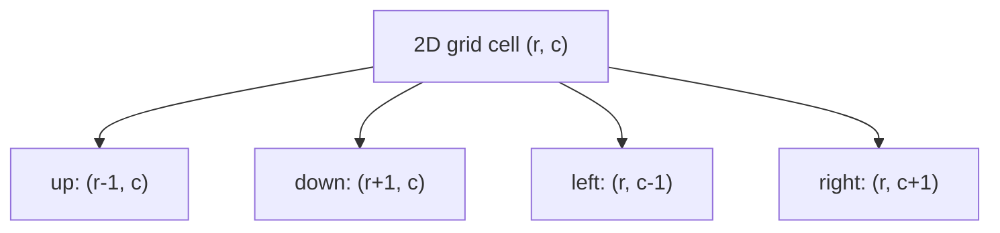

# Matrix and Grid Traversal Patterns

> **Provenance.** All correctness checks and the recursion-depth measurements in this chapter are real, executed output from [`practice/java/algorithms/matrix-and-grid-traversal-patterns/`](../../practice/java/algorithms/matrix-and-grid-traversal-patterns/README.md) (OpenJDK 21.0.12).

This is a genuinely new topic — absent from both the original Master Topic Register and this domain's own originally-planned 18-chapter list, assigned `T-2121` (continuing this domain's own dedicated `T-2100`–`T-2199` reserved range, after `T-2119` Sorting Algorithms and `T-2120` Coding Interview Pattern-Recognition Methodology). A gap audit found matrix/2D-grid problems — in-place rotation, spiral traversal, flood-fill/connected-component counting — covered nowhere as their own pattern: [Graphs: BFS, DFS, Topological Sort, Dijkstra, Union-Find](graphs-bfs-dfs-and-shortest-paths.md) already teaches BFS/DFS mechanics generally (including one grid example, Rotting Oranges) and explicitly names Number of Islands as a real, already-solved problem it doesn't itself elevate into a worked example — this chapter is that elevation, plus the genuinely grid-specific idioms (in-place matrix transforms, direction-vector iteration) neither the general graphs chapter nor the 1D-focused [Arrays, Two Pointers, and Sliding Window](arrays-two-pointers-and-sliding-window.md) chapter covers.

## 1. Why This Matters

Matrix and grid problems (Rotate Image, Spiral Matrix, Number of Islands) are among the most frequently asked patterns in real interview loops at exactly this repository's target companies, precisely because they combine two skills at once: 2D-array indexing discipline (off-by-one errors here are immediate and visible) and, for the flood-fill family, a real, non-obvious robustness question this chapter measures directly — does a recursive solution's correctness depend on how large a single connected region happens to be?

## 2. Prerequisites

[Graphs: BFS, DFS, Topological Sort, Dijkstra, Union-Find](graphs-bfs-dfs-and-shortest-paths.md) — this chapter assumes BFS/DFS mechanics are already understood and focuses specifically on the grid-as-implicit-graph idioms and the recursion-depth risk unique to a grid's large connected regions, not on re-teaching traversal from scratch. [How a Computer Executes a Program](../01-computer-science-foundations/how-a-computer-executes-a-program.md) — the call-stack mechanism this chapter's Section 10 measures a real, grid-specific failure mode of.

## 3. Foundation (L1)

**A 2D grid (an `int[][]` or `char[][]`) is, for traversal purposes, an implicit graph**: each cell is a node, and its up-to-four orthogonal neighbors are its edges — nothing about BFS or DFS changes fundamentally versus an explicit adjacency list, only how neighbors are discovered (arithmetic on row/column indices, not a lookup). Three distinct problem families recur constantly in this shape:

1. **In-place geometric transformation** — rotate a matrix 90 degrees, without allocating a second matrix.
2. **Boundary-following traversal** — visit every cell in a specific geometric order (spiral) rather than row-by-row.
3. **Connected-component discovery** — flood fill / count separate regions of matching cells (Number of Islands).



**The direction-vector idiom** (`int[] dr = {-1,1,0,0}; int[] dc = {0,0,-1,1};`, looped together) is the standard way to enumerate a cell's orthogonal neighbors without four repetitive, error-prone if-statements — nearly every grid-traversal solution in this pattern family uses it.

## 4. Core Concepts (L2)

**In-place matrix rotation (Section 7, Problem 1, Rotate Image) decomposes a 90-degree clockwise rotation into two simpler, well-known operations: transpose (reflect across the main diagonal), then reverse each row.** Neither step alone rotates the matrix; composed, they do — a real, provable geometric identity, not a memorized trick: transposing swaps `(r,c)` with `(c,r)`, and reversing each row afterward maps column `c` to column `n-1-c`, and the composition of those two coordinate transforms is exactly a 90-degree clockwise rotation's own coordinate mapping.

**Spiral traversal (Section 7, Problem 2, Spiral Matrix) tracks four shrinking boundaries** (`top`, `bottom`, `left`, `right`) rather than a direction-vector walk with explicit turn-detection — after fully traversing one edge of the current boundary rectangle, that boundary shrinks inward by one, and the loop terminates once the boundaries cross. This is simpler to get right than turn-detection precisely because it never needs to ask "have I already visited this cell" — the shrinking boundaries guarantee that question's answer by construction.

**Flood fill (Section 7, Problem 3, Number of Islands) is ordinary DFS/BFS applied to the grid-as-implicit-graph model from Section 3** — the only genuinely new content versus the general graphs chapter is Section 5's robustness finding: a naive recursive implementation's correctness silently depends on how large a single connected region is, a property invisible from the algorithm's pseudocode alone.

## 5. How It Works Internally (L3)

**A recursive flood fill's call-stack depth is bounded by the size of the single largest connected region it ever needs to explore in one unbroken chain of recursive calls — not by the grid's overall width or height.** A grid with many small, separate islands never recurses deep, regardless of total grid size; a grid with one enormous connected region (a "lake") pushes one stack frame per cell in that region, in the worst case. This is genuinely different from the general graphs chapter's own coverage, because a typical graph example (a social network, a dependency graph) rarely has this "one giant connected blob" shape as its default case the way a filled-in grid naturally does.

**Measured directly** (`practice/java/algorithms/matrix-and-grid-traversal-patterns/`, one fresh JVM process per size — see the README's own methodological note on why a same-process sweep produced a misleading, JIT-warmup-skewed result instead): on this machine's default thread stack, a single solid connected region of 14,000 cells recurses successfully; 16,000 cells overflows. A real, narrow, and — critically — silent threshold: the exact same algorithm, exact same code, correct on every unit test built from small examples, fails in production the first time it meets one real, large, densely-connected input region.

**The fix converts the traversal from call-stack-bounded to heap-bounded**, using an explicit `ArrayDeque` as a manually-managed stack (for DFS) or queue (for BFS) instead of the JVM's own call stack — precisely the abstract technique [Memory Hierarchy: Caches, RAM, and Virtual Memory](../01-computer-science-foundations/memory-hierarchy-caches-ram-and-virtual-memory.md)'s own Design Exercise describes for exactly this class of problem, made concrete and measured here: the same 2,000,000-cell solid region that would overflow recursively (over 100x past the measured 16,000-cell recursive breaking point) completes correctly and immediately with an explicit stack, because "pending work" now lives in heap-allocated `ArrayDeque` nodes, bounded by available memory rather than a fixed, comparatively tiny per-thread stack reservation.

## 6. Practical Usage

- **Default to the direction-vector idiom (Section 3) for any grid-neighbor enumeration** — it's shorter, less error-prone, and immediately recognizable to an interviewer versus four separate bounds-checked if-statements.
- **Prefer iterative BFS/DFS (explicit `ArrayDeque`) over recursive DFS for any flood-fill-style grid traversal in real, non-toy code** — Section 5's measurement is the concrete argument: recursion's worst case depends on input shape in a way that's easy to miss in code review and easy to trigger in production with one sufficiently large real input.
- **Recognize "rotate," "spiral," and "flood fill/connected regions" as three distinct sub-patterns within this one topic** — a candidate who correctly identifies which of the three a new problem actually is, before writing code, avoids the most common failure mode in this pattern family: applying the wrong technique's mental model to the wrong problem shape.

## 7. Examples

**Problem 1 — LC 48, Rotate Image.**

```java
static void rotate(int[][] m) {
    int n = m.length;
    for (int r = 0; r < n; r++)
        for (int c = r + 1; c < n; c++) {
            int tmp = m[r][c]; m[r][c] = m[c][r]; m[c][r] = tmp; // transpose
        }
    for (int[] row : m)
        for (int lo = 0, hi = n - 1; lo < hi; lo++, hi--) {
            int tmp = row[lo]; row[lo] = row[hi]; row[hi] = tmp; // reverse each row
        }
}
```

**Retrospective:** see Section 4's transpose-then-reverse geometric argument. Checked programmatically against a brute-force, separately-allocated rotated copy across seven sizes (1×1 through 200×200), not just the textbook 3×3 case. **Complexity:** O(n²) time, O(1) extra space — genuinely in-place, no second matrix allocated.

**Problem 2 — LC 54, Spiral Matrix.**

```java
static List<Integer> spiralOrder(int[][] m) {
    List<Integer> result = new ArrayList<>();
    int top = 0, bottom = m.length - 1, left = 0, right = m[0].length - 1;
    while (top <= bottom && left <= right) {
        for (int c = left; c <= right; c++) result.add(m[top][c]);
        top++;
        for (int r = top; r <= bottom; r++) result.add(m[r][right]);
        right--;
        if (top <= bottom) {
            for (int c = right; c >= left; c--) result.add(m[bottom][c]);
            bottom--;
        }
        if (left <= right) {
            for (int r = bottom; r >= top; r--) result.add(m[r][left]);
            left++;
        }
    }
    return result;
}
```

**Retrospective:** see Section 4's shrinking-boundary argument. The two `if` guards (before the bottom-row and left-column passes) are the actual crux of this problem — omitting them double-counts cells for single-row or single-column inputs, verified directly against those exact degenerate shapes. **Complexity:** O(rows × cols) time, O(1) extra space beyond the output itself.

**Problem 3 — LC 200, Number of Islands (iterative, per Section 5's finding).**

```java
static int numIslands(char[][] grid) {
    int rows = grid.length, cols = grid[0].length;
    boolean[][] visited = new boolean[rows][cols];
    int[] dr = {-1, 1, 0, 0}, dc = {0, 0, -1, 1};
    int islands = 0;
    for (int r = 0; r < rows; r++) {
        for (int c = 0; c < cols; c++) {
            if (grid[r][c] != '1' || visited[r][c]) continue;
            islands++;
            ArrayDeque<int[]> stack = new ArrayDeque<>();
            stack.push(new int[]{r, c});
            visited[r][c] = true;
            while (!stack.isEmpty()) {
                int[] cell = stack.pop();
                for (int d = 0; d < 4; d++) {
                    int nr = cell[0] + dr[d], nc = cell[1] + dc[d];
                    if (nr < 0 || nr >= rows || nc < 0 || nc >= cols) continue;
                    if (grid[nr][nc] != '1' || visited[nr][nc]) continue;
                    visited[nr][nc] = true;
                    stack.push(new int[]{nr, nc});
                }
            }
        }
    }
    return islands;
}
```

**Retrospective:** see Section 5's real, measured recursion-depth argument for why this chapter's reference solution is iterative rather than the more commonly seen recursive version. **Complexity:** O(rows × cols) time (each cell visited once), O(rows × cols) worst-case space for `visited` and the explicit stack.

## 8. Common Mistakes

- **Writing a recursive flood fill and considering it "done" once it passes small unit tests** — Section 5's measurement is the direct counter-evidence: correctness on small inputs says nothing about behavior on one large, real connected region, and the failure is a hard crash (`StackOverflowError`), not a slow-but-correct degradation.
- **Omitting the two mid-loop boundary guards in spiral traversal** (Section 7, Problem 2) — the single most common bug in this specific pattern, silently double-counting cells for any non-square, single-row, or single-column input.
- **Allocating a second matrix for rotation when the problem asks for in-place** — a correct but non-compliant solution; the transpose-then-reverse technique (Section 4) is what "in-place" specifically requires.

## 9. Edge Cases

- **A 1×1 matrix rotation** — the practice suite's own verified case; transpose and row-reverse both trivially no-op, correctly leaving the single cell unchanged.
- **A single-row or single-column matrix for spiral traversal** — both real, verified cases (Section 7, Problem 2's guard conditions exist specifically for these).
- **A grid with zero connected regions (all cells empty/water)** — `numIslands` correctly returns 0, since the outer loop's `continue` never finds a `'1'` to start a traversal from.

## 10. Performance Implications

Real, executed output from `practice/java/algorithms/matrix-and-grid-traversal-patterns/` (OpenJDK 21.0.12), one fresh JVM process per recursion-depth measurement:

```
  cells=1000     rows=100    cols=10   recursive DFS: OK, counted=1000
  cells=5000     rows=500    cols=10   recursive DFS: OK, counted=5000
  cells=10000    rows=1000   cols=10   recursive DFS: OK, counted=10000
  cells=12000    rows=1200   cols=10   recursive DFS: OK, counted=12000
  cells=14000    rows=1400   cols=10   recursive DFS: OK, counted=14000
  cells=16000    rows=1600   cols=10   recursive DFS: StackOverflowError
  cells=18000    rows=1800   cols=10   recursive DFS: StackOverflowError
  cells=20000    rows=2000   cols=10   recursive DFS: StackOverflowError

cells=2000000 (far beyond the recursive breaking point above):
  iterative DFS (explicit stack): counted=2000000, matches expected=true
  iterative BFS (explicit queue): counted=2000000, matches expected=true
```

**Honest reading.** The 14,000-to-16,000-cell breaking point is specific to this machine's default JVM thread stack size (`-Xss`, unmodified) and this exact recursive implementation's frame size — a different machine, a different default stack size, or a solution with more local variables per stack frame would break at a different cell count. What the measurement supports without overclaiming a universal number: recursion depth for this pattern scales with connected-region size, the threshold is low enough to hit with realistically-sized real-world grids (16,000 cells is a modest 126×126 grid, not an extreme input), and the iterative fix removes the failure mode entirely rather than merely raising the threshold.

## 11. Trade-offs

| Choice | Gains | Costs |
|---|---|---|
| In-place rotation (transpose + reverse) | O(1) extra space | Mutates the input; a brute-force copy is simpler to reason about if mutation is unacceptable |
| Boundary-shrinking spiral traversal | No visited-set needed, simple termination condition | Easy to miss the two mid-loop guards for non-square/degenerate shapes (Section 8) |
| Recursive DFS flood fill | Simplest to write, closest to the "textbook" solution | Real, measured call-stack-depth risk scaling with connected-region size (Section 10) |
| Iterative DFS/BFS (explicit stack/queue) flood fill | No call-stack depth risk at any connected-region size (Section 10) | Marginally more code (manual stack/queue management) than the recursive version |

## 12. Senior-Level Considerations (L3)

The Senior-level skill this chapter tests specifically is **treating "passes on small test cases" and "correct" as different claims for any recursive grid traversal** — recognizing that a flood-fill solution's worst-case call-stack usage is a real, input-shape-dependent property worth stating explicitly (and defending the iterative alternative) rather than something a candidate discovers for the first time when a production input happens to be one large connected region.

## 13. Staff/System-Level Considerations (L4)

At Staff scope, Section 5's finding generalizes past this specific coding pattern into a broader code-review discipline: **any recursive traversal over externally-supplied or user-controlled data (a grid, a JSON document, a file-system tree) has an implicit, easy-to-miss assumption about maximum nesting/connectivity depth, and that assumption should be stated and defended, not left implicit.** [How a Computer Executes a Program](../01-computer-science-foundations/how-a-computer-executes-a-program.md)'s own Staff-level section makes exactly this argument for arbitrarily-nested JSON parsing; this chapter's Section 5 is the same principle's concrete instance for grid/matrix data specifically, with a real measured number (16,000 cells) rather than an abstract warning.

## 14. Production Scenarios

No existing `production-cookbook/` entry has a grid-traversal/recursion-depth-specific algorithmic root cause.

> Planned reference: a future `production-cookbook/` entry covering a real recursive-traversal `StackOverflowError` triggered by an unexpectedly large connected region in production data (e.g., a flood-fill-shaped feature — connected-pixel region detection, connected-cell grouping in a spreadsheet-like data model) would be a natural, non-duplicative addition connecting this chapter's measured recursion-depth risk to a genuine production incident.

## 15. Interview Questions

### Question 1 — How would you rotate an N×N matrix 90 degrees clockwise, in place?

**Why interviewers ask it.** It's a fast, direct check of 2D-array indexing discipline and whether a candidate knows (or can derive) the transpose-then-reverse decomposition, versus reaching immediately for a second allocated matrix.

**Expected answer.** Transpose the matrix (swap `m[r][c]` with `m[c][r]` for every `r < c`), then reverse each row in place. The composition of these two well-understood operations is exactly a 90-degree clockwise rotation — see Section 4's geometric argument.

**Minimum acceptable answer.** Produces a correct rotation, even via a second allocated matrix rather than truly in-place.

**Strong Senior answer.** Derives or clearly explains *why* transpose-then-reverse specifically produces a clockwise (not counter-clockwise) rotation, and can state the counter-clockwise variant (transpose, then reverse each column instead — or equivalently, reverse rows first, then transpose).

**Staff-level extension.** Recognizes this as a specific instance of a broader technique — composing two simpler, individually-understood in-place transforms to achieve a more complex one without extra memory — and can name another example of the same idea (e.g., reversing a sentence's words in place via a full reverse followed by per-word reverses).

**Common mistakes.** Allocating a full second matrix when the problem explicitly asks for in-place; transposing correctly but reversing columns instead of rows (producing a counter-clockwise result instead of clockwise).

**Follow-up questions.** "How would you rotate 90 degrees counter-clockwise instead?" (Reverse each row first, then transpose — or transpose then reverse columns; either composition works, reversing the order/axis relative to the clockwise version.)

### Question 2 — Your recursive "Number of Islands" solution passes every test case you can think of. Are you confident it's production-ready?

**Why interviewers ask it.** It directly probes whether a candidate's understanding of recursive flood fill includes its real, input-shape-dependent failure mode (Section 5), or stops at "it's correct because it passes my tests."

**Expected answer.** No — a recursive flood fill's call-stack depth scales with the size of the largest single connected region, not the grid's overall dimensions, and one sufficiently large real connected region can trigger a real `StackOverflowError` regardless of how many small-grid unit tests pass. The production-safe version replaces recursion with an explicit `ArrayDeque`-based stack or queue, converting the traversal from call-stack-bounded to heap-bounded.

**Minimum acceptable answer.** Recognizes recursion has *some* depth limit in principle, even without connecting it specifically to connected-region size as the actual driver.

**Strong Senior answer.** Cites a concrete mechanism (or, ideally, a concrete measured number from direct experience) for why this is a real, not theoretical, risk — and proposes the iterative fix unprompted.

**Staff-level extension.** Generalizes to the broader Section 13 principle: any recursive traversal over externally-supplied or unbounded-shape data carries an implicit depth assumption worth stating and defending explicitly during design review, not discovered for the first time in production.

**Common mistakes.** Treating "it works on LeetCode's test cases" as equivalent to "it's production-ready" — LeetCode's own test inputs are rarely adversarially large single connected regions.

**Follow-up questions.** "Would increasing the JVM's `-Xss` fix this?" (It raises the threshold, not the underlying risk — the same class of non-fix [How a Computer Executes a Program](../01-computer-science-foundations/how-a-computer-executes-a-program.md)'s own Staff section rejects for the analogous unbounded-JSON-nesting case; the real fix is removing the call-stack dependency entirely via iteration.)

## 16. Coding/Practice Exercises

- Run the [existing practice code](../../practice/java/algorithms/matrix-and-grid-traversal-patterns/) yourself and reproduce Section 10's recursion-depth breaking point — confirm on your own machine whether your own threshold differs from the one measured here (it likely will, per Section 10's own honest-reading note about `-Xss` and frame-size dependence).
- Implement counter-clockwise matrix rotation from scratch, predicting first (per Interview Question 1's follow-up) which of the two compositions produces it, then verify against a brute-force rotated copy the way `RotateMatrixDemo.java` does for the clockwise version.
- Modify `GridFloodFillStackDemo.java`'s recursive version to track and print the *actual* maximum recursion depth reached (a counter incremented on entry, decremented on exit, tracking the peak) for a grid just below the breaking point — confirm it's close to the cell count, supporting Section 5's "one stack frame per cell in the worst case" claim directly rather than only by inference from the crash threshold.

## 17. Debugging Exercises

**Symptom:** a "count connected regions" feature works correctly in all automated tests and in staging, but throws `StackOverflowError` in production on one specific customer's dataset.

**Diagnose:** identify this as Section 5's exact failure mode — check whether the failing dataset has one unusually large connected region (not necessarily an unusually large grid overall; a sparse, mostly-empty large grid with only small connected regions would never trigger this). Confirm by constructing a synthetic test case with one large connected region, sized similarly to the suspected real one, and reproducing the crash directly rather than guessing. State the correct fix (convert to iterative DFS/BFS, Section 5) versus the incorrect one (raising `-Xss`, which only raises the threshold without removing the underlying unbounded-recursion-depth risk — the same distinction [How a Computer Executes a Program](../01-computer-science-foundations/how-a-computer-executes-a-program.md) draws for its own analogous JSON-nesting scenario).

## 18. Design Exercises

**Design constraint:** you're building a service that processes user-uploaded grid-shaped data (e.g., detecting connected regions in an uploaded image mask, or connected cell groups in an uploaded spreadsheet) of unknown, potentially very large size, and must guarantee it never crashes regardless of how large a single connected region in the uploaded data happens to be.

Design the traversal using this chapter's iterative technique (Section 5, Section 7 Problem 3) specifically, and explain why an explicit heap-allocated stack/queue removes the failure mode this chapter measured, rather than merely raising its threshold (the way a larger `-Xss` would). State what should still be bounded explicitly at the input-validation layer regardless (total grid size, to bound memory and processing time) and why that's a different, and much larger, resource ceiling than the call-stack depth this specific design decision addresses — the same "different resource, different ceiling" reasoning [Memory Hierarchy: Caches, RAM, and Virtual Memory](../01-computer-science-foundations/memory-hierarchy-caches-ram-and-virtual-memory.md)'s own Staff-level section applies to cache capacity versus total RAM.

## 19. Further Reading

- [Graphs: BFS, DFS, Topological Sort, Dijkstra, Union-Find](graphs-bfs-dfs-and-shortest-paths.md) — the general BFS/DFS mechanics this chapter assumes and specifically does not re-teach.
- [How a Computer Executes a Program](../01-computer-science-foundations/how-a-computer-executes-a-program.md) — the call-stack mechanism (Section 5 of that chapter) this chapter's own Section 5 measures a grid-specific real failure mode of.
- [Memory Hierarchy: Caches, RAM, and Virtual Memory](../01-computer-science-foundations/memory-hierarchy-caches-ram-and-virtual-memory.md) — whose own Design Exercise describes, in the abstract, exactly the call-stack-to-heap conversion this chapter's Section 5 and Section 18 make concrete.

## 20. Mastery Checklist

| Level | You can... | Verify with |
|---|---|---|
| L1 | Identify a 2D grid as an implicit graph and enumerate a cell's orthogonal neighbors using the direction-vector idiom | [Section 3](#3-foundation-l1) |
| L2 | Explain the transpose-then-reverse decomposition for in-place matrix rotation and the shrinking-boundary technique for spiral traversal | [Section 4](#4-core-concepts-l2) |
| L3 | Explain precisely why recursive flood fill's call-stack depth depends on connected-region size rather than grid size, and correctly read this chapter's own real recursion-depth measurement | [Section 5](#5-how-it-works-internally-l3), [Section 10's real measurements](#10-performance-implications) |
| L4 | Diagnose a production `StackOverflowError` in a grid-traversal feature as this exact failure mode (Section 17), and design a production-safe, unbounded-region-tolerant grid-processing service using the iterative technique (Section 18) | [Debugging Exercise](#17-debugging-exercises), [Section 13](#13-staffsystem-level-considerations-l4) |
