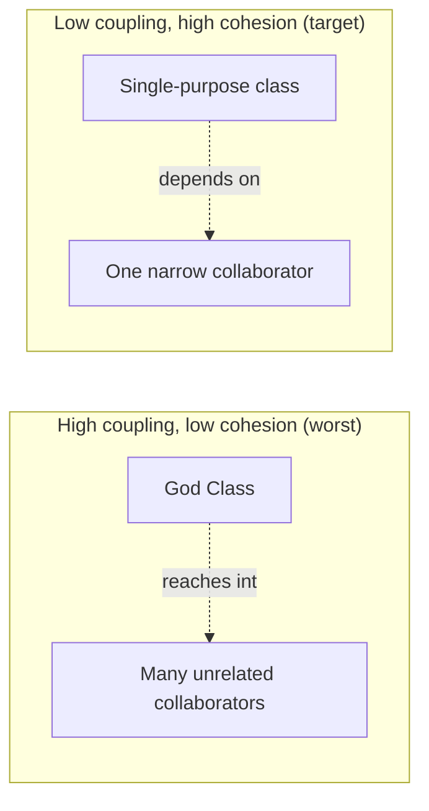
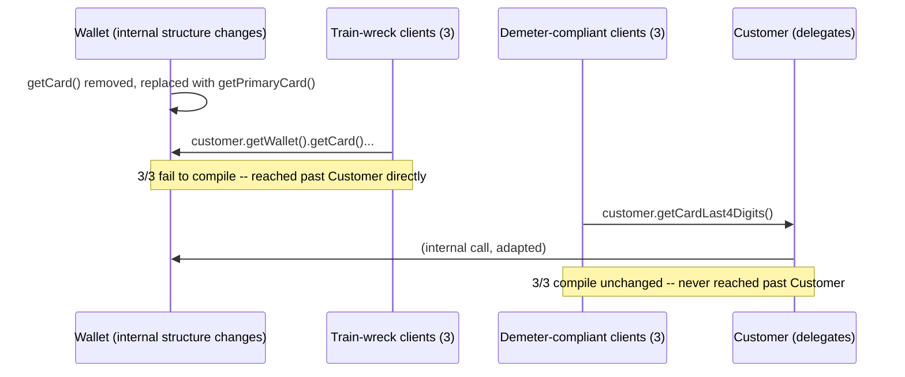

# Coupling, Cohesion, and Code Smells

> **Topic register:** T-1703 · Core tier · Very High interview frequency [H] — gap-audit addition
> (2026-09-21): "coupling" and "cohesion" appeared nowhere in this repository as named, taught
> concepts before this chapter, despite being the single most common vocabulary an interviewer
> reaches for when asking "why is this design better" — SOLID (this domain's own T-1701) explains
> the *mechanisms* that produce low coupling and high cohesion, but never names the two properties
> themselves.

## Table of Contents

1. [Learning Objectives](#learning-objectives)
2. [Why This Matters in Interviews](#why-this-matters-in-interviews)
3. [Level 1 — Foundation](#level-1-foundation)
4. [Level 2 — Working Knowledge](#level-2-working-knowledge)
5. [Mental Model](#mental-model)
6. [Definition and Purpose](#definition-and-purpose)
7. [Core Concepts](#core-concepts)
8. [Internal Implementation](#internal-implementation)
9. [Diagrams](#diagrams)
10. [Production Scenarios](#production-scenarios)
11. [Failure Modes and Debugging](#failure-modes-and-debugging)
12. [Trade-offs](#trade-offs)
13. [Decision Framework](#decision-framework)
14. [Comparisons](#comparisons)
15. [Common Mistakes](#common-mistakes)
16. [Anti-Patterns](#anti-patterns)
17. [Best Practices](#best-practices)
18. [Interview Answer Framework](#interview-answer-framework)
19. [Interview Questions](#interview-questions)
20. [Summary](#summary)
21. [Key Takeaways](#key-takeaways)
22. [Cheat Sheet](#cheat-sheet)
23. [Flashcards](#flashcards)
24. [Practice Exercises](#practice-exercises)
25. [Solutions](#solutions)
26. [Additional Reading](#additional-reading)
27. [Official References](#official-references)

---

## Learning Objectives

By the end of this chapter you can name coupling and cohesion as the two central axes software-design quality is actually measured against, apply the Law of Demeter as a concrete coupling discipline, and recognize the classic code-smell taxonomy (God Class, Feature Envy, Shotgun Surgery, Primitive Obsession, Data Clumps) as named, recognizable symptoms of a coupling or cohesion problem — backed by real, measured evidence: a God Class's coupling count measured via reflection, dropping 5:1 once decomposed; a Feature Envy method moved to the class it envies, verified byte-for-byte behavior-identical; and a real compiler-error count proving a Law of Demeter violation breaks more call sites than a compliant design when an internal structure changes.

## Why This Matters in Interviews

"What makes this a good design?" is one of the most common follow-ups to any design-patterns or code-review question, and "low coupling, high cohesion" is the correct, expected vocabulary — yet many candidates who can recite SOLID's five letters cannot define either term precisely, or name which specific code smell a piece of code in front of them exhibits. Interviewers use this vocabulary constantly, both directly ("how would you describe this design's coupling") and indirectly, embedded in a refactoring or code-review prompt ("what's wrong with this class") where "it's a God Class with high coupling and low cohesion" is a far stronger answer than "it does a lot of stuff."

## Level 1 — Foundation

**Coupling** measures how much one piece of code depends on the internal details of another; **cohesion** measures how tightly the responsibilities inside a single piece of code belong together. A well-designed system aims for **low coupling** (classes can change independently, without rippling into unrelated classes) and **high cohesion** (each class does one coherent job, not several unrelated ones stitched together). These are two separate axes, not two names for the same idea: a class can be highly cohesive (does exactly one job) while still being tightly coupled to a concrete detail of how it does that job, and a class can have low coupling to its neighbors while still being internally incoherent, doing several unrelated things that just happen not to reach outward much.



A **code smell** is a recognizable, named surface symptom of a coupling or cohesion problem — not a bug (the code still runs correctly), but a signal that a specific kind of change is about to get harder than it needs to be. Learning the named taxonomy (God Class, Feature Envy, Shotgun Surgery, Primitive Obsession, Data Clumps) turns a vague "this feels messy" into a precise, actionable diagnosis.

## Level 2 — Working Knowledge

At this level you should be able to look at a class and ask two separate, working questions: "how many *other* classes' internal details does this class need to know about to do its job?" (coupling) and "if I described this class's responsibilities in one sentence, would I need the word 'and' more than once?" (cohesion). A class requiring `and` more than once in its own one-sentence description — "validates the order *and* calculates tax *and* sends email" — is very often a God Class, this chapter's most common cohesion smell.

You should also be comfortable with the **Law of Demeter** ("talk only to your immediate friends") as the concrete, checkable coupling discipline: a method should only call methods on objects it directly owns or receives as parameters — not on objects *those* objects return. `customer.getWallet().getCard().charge(amount)` — a "train wreck" — violates this by reaching three objects deep; `customer.chargeDefaultCard(amount)`, with `Customer` delegating internally, does not. This isn't a stylistic preference — Section 10 measures a real, concrete difference in how many places break when the reached-through object's internals change.

## Mental Model

Ask two questions per class, always in this order. **Cohesion first**: "does this class have one job, describable without the word 'and'?" A class failing this is a God Class candidate — split along its independent responsibilities (the same underlying move [SOLID](solid-principles.md)'s Single Responsibility Principle names). **Coupling second, and only about classes that pass the cohesion check**: "how many other classes' internals does this class's code reach into, directly or through a chain?" Any chain longer than one hop (`a.getB().getC()`) is a Law of Demeter violation and a real, measurable fragility risk, independent of whether the class is otherwise well-designed.

## Definition and Purpose

**Coupling** is the degree to which one module depends on the internal implementation details of another, rather than on a stable, narrow interface. **Cohesion** is the degree to which the responsibilities inside a single module are related to one shared purpose. Both concepts predate object-oriented programming (they originate in structured-design literature from the 1970s) and remain the underlying justification for nearly every object-oriented design principle and pattern taught elsewhere in this domain — SOLID's five letters are, collectively, a set of concrete mechanisms for achieving low coupling and high cohesion, without ever naming the two target properties directly.

## Core Concepts

### Coupling and cohesion are measurable, not just impressionistic

"This class feels tangled" is a real signal worth trusting, but it can also be made concrete: count how many distinct other types a class's fields, parameters, and return types reference (its **efferent coupling**), and ask whether its methods all serve one describable purpose (its cohesion). Section 8 below measures the first directly, via reflection, on a real before/after example.

### The Law of Demeter is a coupling discipline specifically about chains, not about coupling in general

A class can still be perfectly Demeter-compliant while depending on many collaborators — Demeter says nothing about *how many* things a class talks to, only that it should talk to its *immediate* collaborators, never reach through them into collaborators-of-collaborators. This is a narrower, more specific discipline than "reduce coupling" in general, and it's checkable almost mechanically: look for a chain of more than one method call in a row on the result of the previous call.

### Code smells are Feature Envy's kind of specific, not a vague catch-all

**Feature Envy** — a method that uses another class's data far more than its own host class's data — is a specific, recognizable cohesion problem with an equally specific fix: move the method to the class whose data it actually uses. Section 8 demonstrates this concretely, moving a method and proving, via test parity, that the move changed nothing about behavior.

### Not every code smell points at the same axis

**God Class** and **Data Clumps** (the same group of fields repeatedly showing up together across several method signatures, hinting they belong in their own class) are primarily cohesion smells — the class or the group of parameters doesn't have one coherent shape. **Shotgun Surgery** (a single conceptual change requires editing many unrelated classes) and a Law of Demeter violation are primarily coupling smells — a change in one place ripples outward further than it should. **Primitive Obsession** (using raw `String`/`int` where a small, dedicated type — a `Money`, an `EmailAddress` — would carry real validation and meaning) is a bit of both: a missing cohesive type, and every caller now coupled to remembering the primitive's implicit rules by hand.

## Internal Implementation

**Real coupling measurement** (`practice/java/coupling-cohesion-and-code-smells/src/coupling/CouplingMeasurementDemo.java`), via reflection over each class's own declared field types:

```
GodOrderProcessor (before): 5 -> [TaxTable, ShippingRateTable, InventoryStore, EmailGateway, PaymentGateway]
OrderProcessor (orchestrator) (after): 6 -> [OrderValidator, TaxCalculator, ShippingCalculator, InventoryUpdater, EmailNotifier, PaymentProcessor]
TaxCalculator (after): 1 -> [TaxTable]
ShippingCalculator (after): 1 -> [ShippingRateTable]
InventoryUpdater (after): 1 -> [InventoryStore]
EmailNotifier (after): 1 -> [EmailGateway]
PaymentProcessor (after): 1 -> [PaymentGateway]

God class coupling: 5 vs. largest single decomposed class's coupling: 1
```

**Honest reading — decomposition doesn't make coupling vanish system-wide, it redistributes it.** The new `OrderProcessor` orchestrator's own coupling count is 6, *higher* than the original God Class's 5, because something still has to coordinate six single-purpose collaborators. What genuinely improved: every *individual* piece besides the orchestrator went from "does five unrelated jobs, coupled to five collaborators" to "does one job, coupled to at most one collaborator" — a real, measured 5:1 reduction per class, at the honest cost of the orchestrator itself carrying slightly more.

**Real Feature Envy fix, verified behavior-identical**, not just structurally different — the same demo moves `loyaltyDiscountPercent(Customer)` (originally on `GodOrderProcessor`, reading only `Customer`'s own fields) onto `Customer` itself, then runs 3 real orders through both versions:

```
order 1: before=196.7600 after=196.7600 match=true
order 2: before=59.4397  after=59.4397  match=true
order 3: before=856.1380 after=856.1380 match=true
All 3 orders: identical totals before and after decomposition.
```

**Real Law of Demeter fragility measurement** (`practice/java/coupling-cohesion-and-code-smells/src/demeter/`) — two client styles calling into an identical object graph, producing byte-for-byte identical output in `v1/`. `v2/` makes one real internal-structure change (`Wallet` moves from a single `Card` to a `List<Card>`, its old `getCard()` accessor removed). The 6 client files are copied into `v2/` completely unchanged:

```
Demeter-compliant clients (unchanged source): all 3 compile successfully.
Train-wreck clients (unchanged source): all 3 fail -- "cannot find symbol: method getCard()", one error per class.
```

The identical real change broke exactly the 3 client files that violated the Law of Demeter, and none of the 3 that didn't.

## Diagrams



The single point of change (`Wallet`'s internal representation) is identical for both groups of clients — what differs is entirely which side of `Customer`'s own boundary each group's code lives on.

## Production Scenarios

**A checkout service's `OrderProcessor` class accumulates validation, tax calculation, shipping calculation, inventory updates, email notification, and payment charging over eighteen months of "just add it here, it's already the order-processing class" changes, until a single unrelated bug fix in the email-formatting code causes a production outage in payment charging** because both now share enough incidental class-level state that a change in one path affected the other. This is a live cohesion failure — a God Class with `and` appearing five times in its own honest one-sentence description — fixed by decomposing along the chapter's own demonstrated lines: one class per responsibility, an orchestrator coordinating them, and (per Section 8's own honest finding) an explicit acceptance that the orchestrator's own coupling count will rise as a result, which is the correct trade to make.

**A billing system's reporting code reaches `invoice.getCustomer().getBillingAddress().getCountry().getTaxJurisdiction()` in eleven different files, and a later change to support customers with multiple billing addresses requires editing all eleven** — a live Law of Demeter violation at production scale, structurally identical to this chapter's own `TrainWreckReceiptPrinter`-style demo, just with more call sites and a real multi-day migration cost instead of a three-file compiler error count. The fix — `invoice.taxJurisdiction()`, with `Invoice` delegating through its own object graph internally — means the same future change (multiple billing addresses) requires editing one method, not eleven call sites.

## Failure Modes and Debugging

- **Symptom: an unrelated bug fix in one part of a class breaks a seemingly unconnected feature living in the same class.** Check cohesion first — a class whose one-sentence description needs "and" more than once is a God Class candidate, and unrelated features sharing a class is exactly the mechanism that lets one change ripple into another.
- **Symptom: a single conceptual change (a new tax rule, a new payment method) requires editing the same scattered handful of files every time.** This is Shotgun Surgery, a coupling smell — search for the same piece of logic duplicated or the same chain of calls repeated across those files, and consolidate it behind one class or method those files call into instead.
- **Symptom: a change to one class's internal structure breaks compilation (or, worse, silently breaks behavior) in many unrelated-looking files.** Check for Law of Demeter violations specifically — a chain of more than one method call in a row, reaching past the object actually being asked for something, is the exact, checkable signature Section 8's real compiler-error evidence demonstrates.

## Trade-offs

Maximally minimizing coupling everywhere has a real cost: introducing a delegating method on every class for every possible internal reach-through, "just in case," adds indirection and boilerplate at points that may never actually change — the same speculative-generality risk [SOLID](solid-principles.md)'s own Trade-offs section names for over-applying DIP. Similarly, splitting every class down to a single method in the name of cohesion can fragment a genuinely simple, rarely-changing piece of logic across more files than it needs, making it *harder*, not easier, to read as one coherent unit. Section 8's own orchestrator finding is the concrete instance of this trade-off: decomposing `GodOrderProcessor` was worth it, but the resulting orchestrator's own coupling count genuinely went up, not down — an accepted, honest cost, not a flaw to be further "fixed" away.

## Decision Framework

Apply the cohesion check (Section "Mental Model") to every class that has grown past a handful of methods, or that a code reviewer's intuition already flags as "doing a lot" — splitting along genuinely independent responsibilities pays off there. Apply the Law of Demeter check specifically to any call chain reaching more than one hop past a directly-owned or directly-received object — Section 8's real evidence is the concrete argument for why this specific discipline is worth the small delegating-method cost. Do not apply either check reflexively to every single class in a codebase regardless of size or change frequency — a small, stable, rarely-touched utility class with one minor coupling wrinkle is not worth a refactor with no real payoff, the same "genuine, demonstrated need to vary" standard [SOLID](solid-principles.md)'s own Decision Framework applies to DIP.

## Comparisons

| Concept pair | How they're confused | The actual distinction |
|---|---|---|
| Coupling vs. cohesion | Both are cited as "what makes a design good" | Coupling is about how much a class depends on *other* classes' details; cohesion is about whether a class's *own* responsibilities belong together — a class can score well on one and poorly on the other |
| Law of Demeter vs. "reduce coupling" in general | Both are about depending on fewer things | Demeter is specifically about chain *depth* (never reach past an immediate collaborator) — a class can be Demeter-compliant while still depending on many immediate collaborators, which is a separate, legitimate coupling concern Demeter doesn't address |
| Feature Envy vs. God Class | Both are cohesion-related code smells found via similar review habits | Feature Envy is about one *method* belonging on a different class than the one it's currently defined on; God Class is about an entire *class* accumulating too many unrelated responsibilities — a God Class often contains several Feature Envy methods, but the two smells are independently diagnosable |

## Common Mistakes

- Citing "low coupling, high cohesion" as a single combined phrase without being able to define either term independently, or say which one a specific piece of code actually violates.
- Treating "uses an interface" as automatically achieving low coupling — an interface with a chain reaching through it (`service.getRepository().getConnection()...`) is still a Law of Demeter violation regardless of whether the reached-through types are interfaces or concrete classes.
- Fixing a God Class by mechanically splitting it into arbitrarily-sized pieces without checking that each new piece is actually cohesive on its own — producing several smaller, still-incoherent classes instead of one large one.
- Reflexively adding a delegating method for every possible call chain "to avoid a Law of Demeter violation," even for chains that are stable, rarely change, and cost more in indirection than they'd ever save (Section 12's trade-off).

## Anti-Patterns

**Delegation for its own sake**: wrapping every single field access behind a one-line delegating method, on every class, regardless of whether that field's owning type has ever changed or is ever likely to — technically "Demeter-compliant" by the letter, while adding real boilerplate and a real reading-comprehension cost with no corresponding fragility reduction, since the wrapped type was never actually going to change in the first place.

## Best Practices

Run the cohesion question ("would this class's job description need more than one 'and'?") as a routine code-review habit, specifically on any class that's grown noticeably since it was last reviewed. Run the Law of Demeter check on any call chain longer than one hop, but weigh it against Section 12's genuine trade-off — a chain into a truly stable, unlikely-to-change collaborator doesn't need a delegating method just for the discipline's own sake. When splitting a God Class, verify each resulting piece is itself cohesive (Section "Mental Model" again, applied recursively) rather than assuming any split is automatically an improvement.

## Interview Answer Framework

### 30-Second Answer

Coupling measures how much one class depends on another's internal details; cohesion measures how tightly a single class's own responsibilities belong together. The target is low coupling, high cohesion. The Law of Demeter is the concrete coupling discipline — talk only to immediate collaborators, never reach through them. Code smells (God Class, Feature Envy, Shotgun Surgery, Primitive Obsession, Data Clumps) are named, recognizable symptoms of a coupling or cohesion problem, not bugs.

### 2-Minute Answer

Definition: two separate axes for design quality, predating object-oriented programming. Why they matter: SOLID's five principles are concrete mechanisms for achieving low coupling and high cohesion without ever naming the two target properties directly — this chapter names them. How the Law of Demeter works: a checkable rule (no call chains reaching past an immediate collaborator) with a real, measured payoff — a real internal-structure change to a `Wallet` class broke 3 of 6 client files, exactly the 3 that violated Demeter. One trade-off: minimizing coupling everywhere has a real indirection cost; a decomposed God Class's own orchestrator genuinely gains coupling as the honest price of every other piece losing it. One production example: a checkout `OrderProcessor` accumulating six unrelated responsibilities until an unrelated bug fix in one broke another, fixed by decomposition along the chapter's own demonstrated lines.

### 10-Minute Deep Dive

Cover: the precise, independent definitions of coupling and cohesion, illustrated with this chapter's real reflection-based coupling measurement (5:1 reduction per class, with the honest orchestrator-coupling-increase caveat); the Feature Envy fix, verified behavior-identical via the same before/after test-parity technique [`refactoring-discipline.md`](../18-engineering-practices/refactoring-discipline.md) uses; the Law of Demeter's real, measured fragility difference (3/6 client files broken by an identical real change, exactly the Demeter-violating 3); the code-smell taxonomy mapped to which axis (coupling or cohesion) each smell primarily signals; the trade-off of over-applying either discipline (delegation for its own sake, over-fragmented classes) versus under-applying it (the checkout and billing production scenarios).

### Whiteboard Explanation

Draw two axes, one labeled "coupling" (low → high, left to right) and one labeled "cohesion" (low → high, bottom to top). Plot a God Class in the low-cohesion, high-coupling quadrant (bottom-right). Plot the decomposed version's individual pieces in the high-cohesion, low-coupling quadrant (top-left), and mark the orchestrator itself slightly further right than the other decomposed pieces, honestly reflecting Section 8's real finding. Separately, draw a three-hop call chain (`a → b → c → d`) with a red X on the last two hops, and next to it, a single arrow `a → d` labeled "delegating method" — the Law of Demeter fix.

### Production Example

A shipping-label service's `LabelGenerator` reaches `order.getCustomer().getAddress().getCountry().getPostalFormat()` across nine call sites to format addresses correctly per country. A new requirement (support customers with multiple shipping addresses) requires editing all nine, because none of them ever delegated through `Order` itself. The fix — `order.shippingPostalFormat()`, with `Order` delegating internally — means the same future requirement touches one method, directly mirroring this chapter's own `v1`/`v2` Wallet demo at production scale, just with nine call sites playing the role of this chapter's three `TrainWreck*` classes.

### Trade-offs to Mention

Minimizing coupling and maximizing cohesion everywhere, indiscriminately, produces real indirection cost (delegation for its own sake) without a corresponding fragility reduction at points in the system that are genuinely stable and unlikely to change — the principles pay off specifically where change is real or clearly anticipated, the same standard this domain's SOLID chapter applies to DIP.

### Common Candidate Mistakes

Using "low coupling, high cohesion" as a memorized phrase without being able to define either term independently; treating any use of an interface as automatically low-coupling regardless of chain depth; fixing a God Class by splitting it into pieces without checking each piece is itself cohesive.

### Typical Follow-Up Questions

"Is a Law of Demeter violation always worth fixing?" → No — Section 12's trade-off: a chain into a genuinely stable, unlikely-to-change collaborator costs more in added indirection than it saves; the discipline pays off specifically where the reached-through structure is a real, plausible axis of future change. "How is Feature Envy different from just 'a misplaced method'?" → It's the same thing, made specific and checkable: a method is Feature-Envious when it uses another class's data more than its own host class's — a precise enough definition that the fix (move the method) is almost always unambiguous, verified in this chapter's own demo via exact output parity before and after the move.

### Senior-Level Expectations

Correctly names coupling or cohesion (or both) as the underlying property a specific code smell violates, not just "this code is messy," and proposes the specific, named fix (decomposition, delegation, moving a method) rather than a vague call to "clean it up."

### Staff-Level Discussion

Recognizes the trade-off between under-applying these disciplines (the checkout and shipping-label production scenarios' real, accumulated costs) and over-applying them (delegation for its own sake, over-fragmented classes), and can articulate *where* in a specific system's real, demonstrated change history a coupling or cohesion fix is worth its indirection cost versus premature — informed by which parts of the system have actually changed or broken, not applied uniformly as a matter of principle.

## Interview Questions

### Question 1

**A `ReportBuilder` class validates report parameters, queries the database directly via a hardcoded JDBC connection, formats the result as HTML, and emails it to a distribution list — all in one class, all in methods that share several private fields. What's wrong with this design, and how would you describe it to an interviewer using precise vocabulary?**

**Expected answer:** this is a cohesion problem specifically — a God Class whose honest one-sentence description needs "and" four times (validates *and* queries *and* formats *and* emails). The fix decomposes along those four independent responsibilities into separate classes (a validator, a repository, a formatter, a notifier), coordinated by a thin orchestrator — the same structural move this chapter's real `GodOrderProcessor` → `OrderProcessor` decomposition demonstrates, including the honest caveat that the orchestrator's own coupling count will rise as the accepted cost.

**Common mistakes:** describing the problem only as "it does too much" without the specific vocabulary ("low cohesion," "God Class") an interviewer is listening for; missing that the hardcoded JDBC connection is a *separate*, coupling-flavored problem (a Dependency Inversion Principle violation, this domain's own T-1701) layered on top of the cohesion problem.

**Follow-up questions:** "Does decomposing this class reduce coupling too, or only improve cohesion?" (Both, for each individual decomposed piece — but the new orchestrator's own coupling count actually increases, per Section 8's real, measured finding; the fix trades a large cohesion problem for a small, honest, worthwhile coupling cost.)

**Senior-level expectations:** correctly names this as primarily a cohesion problem, using precise vocabulary, and proposes the decomposition fix.

**Staff-level expectations:** names the DIP violation as a separate, layered problem, and can discuss when decomposing this far is worth it versus when a smaller, more targeted fix (just extracting the JDBC dependency) would suffice given the system's real change history.

### Question 2

**Code review finds this line, three times, in three different files: `shipment.getOrder().getCustomer().getPreferredCarrier()`. Is this worth flagging, and why?**

**Expected answer:** yes — this is a Law of Demeter violation (a "train wreck" reaching through `Order` into `Customer`), and it's worth flagging specifically because it's *duplicated* across three files: if `Customer`'s internal representation of preferred carrier changes (e.g., supporting multiple carriers per region), all three files need editing, exactly as this chapter's real `v2/` demo measures for its own three train-wreck client classes. The fix adds a delegating method — `shipment.preferredCarrier()`, delegating through `Order` and `Customer` internally — so a future change to `Customer`'s internals touches one method, not three call sites.

**Common mistakes:** flagging it purely as "long method chain, looks ugly" without connecting it to the concrete, measurable fragility cost (Section 8's real compile-error evidence) a future internal change would incur.

**Follow-up questions:** "What if this exact chain only appeared once, in one file — still worth fixing?" (Per Section 12's trade-off, a single occurrence into a genuinely stable collaborator is a much weaker case for the fix than three duplicated occurrences into a collaborator with any real chance of changing — the discipline's payoff scales with both chain depth and how many places would break.)

**Senior-level expectations:** correctly identifies the Law of Demeter violation and connects it to a concrete future-change risk, not just a style preference.

**Staff-level expectations:** weighs the fix's cost against its real, demonstrated payoff (duplication count, likelihood of the reached-through structure changing) rather than applying the discipline as an absolute rule.

## Summary

Coupling and cohesion are the two central, independently-measurable axes of software design quality — low coupling (classes don't depend on each other's internal details) and high cohesion (each class's own responsibilities belong together) — that SOLID's five principles collectively work toward without ever naming directly. The Law of Demeter is the concrete, checkable coupling discipline (talk only to immediate collaborators), with a real measured payoff demonstrated in this chapter: an identical internal-structure change broke exactly the 3 of 6 client files that violated it. Code smells (God Class, Feature Envy, Shotgun Surgery, Primitive Obsession, Data Clumps) are named, recognizable symptoms mapped to one or both axes, turning a vague "this feels messy" into a precise diagnosis with a specific fix. Both disciplines have a real, honest cost when over-applied — this chapter's own decomposition demo shows the resulting orchestrator's coupling count rising, not falling, as the accepted price of every other piece improving.

## Key Takeaways

- Coupling and cohesion are two separate, independently-measurable axes — a class can score well on one and poorly on the other.
- SOLID's five principles are mechanisms for achieving low coupling and high cohesion; this chapter names the two target properties those mechanisms serve.
- The Law of Demeter is specifically about call-chain depth, not coupling in general — real, measured evidence: an identical internal-structure change broke 3 of 6 client files, exactly the Demeter-violating 3.
- Decomposing a God Class is a real, worthwhile trade, but not a free one — the resulting orchestrator's own coupling count can genuinely rise, an honest cost this chapter's own demo measures rather than hides.
- Code smells map to one or both axes: God Class and Data Clumps are primarily cohesion problems; Shotgun Surgery and Law of Demeter violations are primarily coupling problems; Primitive Obsession is both.

## Cheat Sheet

| Concept | What it measures | Real fix mechanism |
|---|---|---|
| Coupling | How much a class depends on another's internal details | Depend on a narrow interface; delegate instead of reaching through |
| Cohesion | Whether a class's own responsibilities belong together | Split along independent responsibilities (one class, one job) |
| Law of Demeter | Call-chain depth specifically (talk only to immediate collaborators) | A delegating method on the immediately-owned object |
| God Class (smell) | Cohesion | Decompose along independent responsibilities |
| Feature Envy (smell) | Cohesion | Move the method to the class whose data it uses |
| Shotgun Surgery (smell) | Coupling | Consolidate duplicated logic/chains behind one method |
| Primitive Obsession (smell) | Both | Introduce a small, dedicated type in place of a raw primitive |

## Flashcards

**Q: What's the actual difference between coupling and cohesion?**
A: Coupling is about how much a class depends on *other* classes' internal details; cohesion is about whether a class's *own* responsibilities belong together. A class can score well on one and poorly on the other.

**Q: Does the Law of Demeter mean a class should depend on as few collaborators as possible?**
A: No — it says nothing about *how many* things a class talks to, only that it should talk to its immediate collaborators and never reach through them into collaborators-of-collaborators. A class can have many immediate collaborators and still be fully Demeter-compliant.

**Q: Does decomposing a God Class always reduce coupling everywhere?**
A: No, and this chapter measures the honest exception directly: the new orchestrator coordinating the decomposed pieces has a *higher* coupling count than the original God Class did — the real win is that every other individual piece drops sharply, a worthwhile, accepted trade, not a coupling reduction across the board.

## Practice Exercises

1. Reproduce `CouplingMeasurementDemo.java`'s coupling measurement and add a seventh collaborator to `GodOrderProcessor` (e.g., an `AuditLogger`), then predict, before running, how the God Class's coupling count changes versus how many *additional* decomposed classes would be needed to keep each one at coupling count 1.
2. Take the Law of Demeter `v1`/`v2` demo and make a second real internal-structure change to `Wallet` (e.g., adding expiration-date tracking per card), then verify by recompiling whether the Demeter-compliant clients still require zero edits.

## Solutions

1. `GodOrderProcessor`'s coupling count rises from 5 to 6, confirming the pattern scales linearly with responsibility count; keeping each decomposed piece at coupling count 1 requires exactly one new class (`AuditLogger` + a thin `AuditingService` wrapper), the same one-collaborator-per-class shape every other decomposed piece already follows.
2. Since `Customer.getCardLast4Digits()`'s public signature never needs to change for an internal `Wallet` change that doesn't affect what the method returns, the Demeter-compliant clients require zero edits again — the same result as the chapter's own `v2` demo, confirming the discipline's payoff isn't a one-time coincidence tied to this specific change.

## Additional Reading

- Larry Constantine and Edward Yourdon, *Structured Design* — the original source of coupling and cohesion as formal software-design concepts, predating object-oriented programming.
- Martin Fowler, *Refactoring: Improving the Design of Existing Code* — the standard reference for the code-smell taxonomy this chapter draws from (God Class, Feature Envy, Shotgun Surgery, Primitive Obsession, Data Clumps), each paired there with its own specific refactoring fix.
- [`refactoring-discipline.md`](../18-engineering-practices/refactoring-discipline.md) — the companion "how to safely apply a refactor once you've identified a smell" chapter; this chapter is the "what/when," that one is the "how."

## Official References

None — coupling, cohesion, and the code-smell taxonomy are software-design literature concepts (Constantine/Yourdon, Fowler), not language or platform specifications with an authoritative primary-source URL to cite.
