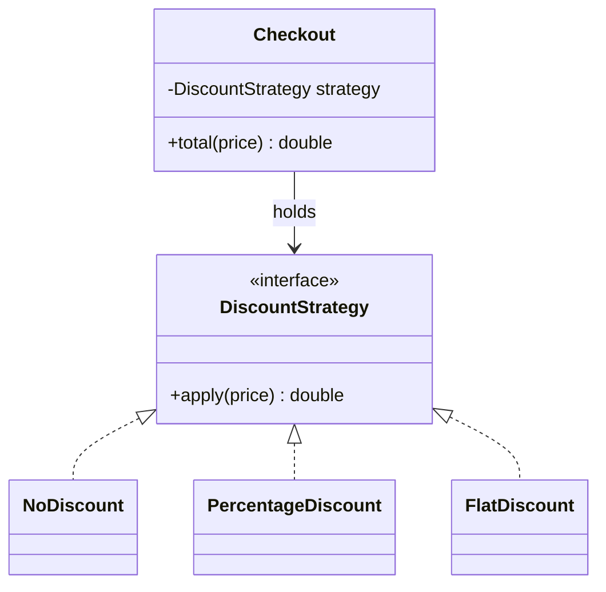
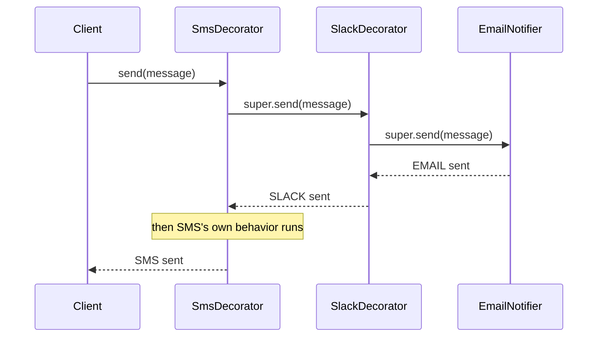

# Design Patterns Applied (GoF in Production)

> **Topic register:** T-914 · IWI 5.8 · Core tier, Very High interview frequency
> **Provenance:** every trace in this chapter is real, executed output from [`practice/java/design-patterns/applied-gof/src/`](../../practice/java/design-patterns/applied-gof/src/) on OpenJDK 21.0.12.

## Table of Contents

1. [Learning Objectives](#learning-objectives)
2. [Why This Matters in Interviews](#why-this-matters-in-interviews)
3. [Mental Model](#mental-model)
4. [Definition and Purpose](#definition-and-purpose)
5. [Core Concepts](#core-concepts)
6. [Internal Implementation](#internal-implementation)
7. [Diagrams](#diagrams)
8. [Java Examples](#java-examples)
9. [Production Scenarios](#production-scenarios)
10. [Trade-offs](#trade-offs)
11. [Decision Framework](#decision-framework)
12. [Comparisons](#comparisons)
13. [Common Mistakes](#common-mistakes)
14. [Anti-Patterns](#anti-patterns)
15. [Best Practices](#best-practices)
16. [Interview Answer Framework](#interview-answer-framework)
17. [Interview Questions](#interview-questions)
18. [Summary](#summary)
19. [Key Takeaways](#key-takeaways)
20. [Cheat Sheet](#cheat-sheet)
21. [Flashcards](#flashcards)
22. [Practice Exercises](#practice-exercises)
23. [Solutions](#solutions)
24. [Additional Reading](#additional-reading)
25. [Official References](#official-references)

---

## Learning Objectives

By the end of this chapter you can:

- Explain Strategy, Builder, Decorator, and Singleton by the *problem shape* each one solves, not by reciting a UML diagram from memory.
- Reproduce, with real output, why a naive lazy Singleton is not thread-safe, and why an enum-based Singleton is.
- Recognize four more GoF patterns you'll encounter reading production Java and framework source (Observer, Factory Method, Adapter, Template Method) well enough to name where each one is, even without full from-scratch implementation depth.
- State, for any pattern in this chapter, the specific problem it exists to solve — and when *not* using it is the better answer.

## Why This Matters in Interviews

"Name a design pattern you've used" is one of the most common questions in this domain, and one of the least discriminating on its own — nearly every candidate can name Singleton or Factory. What actually separates a Senior answer from a Mid one is whether the candidate can connect a specific pattern to a specific *problem shape* they've hit in real code, explain what would have gone wrong without it, and — just as importantly — recognize when reaching for a pattern is overengineering a problem that a plain method or a `Comparator` would solve more simply. This project's own knowledge-base audit found zero design-patterns coverage at any depth, despite this topic's Very High interview frequency — a gap this chapter closes with real, executed Java rather than textbook UML.

## Mental Model

**Every pattern in this chapter exists to answer one specific, recurring "what varies, and how do I isolate it?" question.** Strategy isolates *which algorithm* runs. Builder isolates *how a complex object gets assembled* from *what it ultimately is*. Decorator isolates *which optional behaviors are layered on*, from a combinatorial subclass explosion. Singleton isolates *how many instances exist*, at the cost of global mutable state and testability. None of these are "best practices" to sprinkle everywhere — each is a specific answer to a specific kind of variation, and using one where that variation doesn't actually exist just adds indirection for nothing.

## Definition and Purpose

A **design pattern**, in the Gang-of-Four sense this register targets, is a named, reusable solution to a recurring structural problem in object-oriented design — not a library, not a framework feature, but a *shape* of collaboration between objects that shows up repeatedly enough to deserve a name every engineer on a team can use as shorthand. Patterns exist because certain problems (interchangeable algorithms, complex object construction, layered optional behavior, controlled single-instance state) recur across unrelated domains with the same underlying structure, and naming that structure lets a team communicate a design decision in one word ("we made this a Strategy") instead of re-explaining the mechanism from scratch every time.

This chapter covers four patterns in real depth — Strategy, Builder, Decorator, Singleton — chosen for a mix of very high real-world frequency and genuine, non-trivial mechanism worth a working Senior/Staff engineer's attention (Singleton specifically for its well-known thread-safety pitfall, not because it's a pattern to reach for casually). A second tier of four more patterns you will meet constantly reading production and framework code — Observer, Factory Method, Adapter, Template Method — gets recognition-level treatment: real production examples named precisely, without full from-scratch implementations, an honest distinction this chapter states explicitly rather than pretending all eight received equal depth.

## Core Concepts

### Strategy: isolate which algorithm runs

A family of interchangeable algorithms sits behind one common interface; the client holds a reference to that interface and never branches on which concrete algorithm it's using. Adding a new algorithm means adding a new class, never touching the client.

### Builder: isolate how a complex object gets assembled

Construction of an object with many optional fields (and invariants across them) is separated into its own fluent object, avoiding both a "telescoping constructor" (overloaded constructors for every combination of optional parameters) and a mutable, half-initialized object exposed mid-construction.

### Decorator: isolate which optional behaviors are layered on

Additional behavior is attached to an object by wrapping it in another object implementing the same interface, rather than subclassing. For `N` independent optional behaviors, inheritance needs up to `2^N` subclasses to cover every combination; composition needs `N` decorator classes, combined however the caller wants, at runtime.

### Singleton: isolate how many instances exist — and its real cost

Exactly one instance of a class is guaranteed to exist, reachable from a single global access point. This is the most controversial pattern in the GoF catalog specifically because global mutable state is genuinely costly for testability (a Singleton can't easily be swapped for a test double) and concurrency (a naive implementation is not thread-safe, measured directly in this chapter) — in most modern Java codebases, dependency injection (a framework handing out a *scoped* singleton bean, e.g. Spring's default bean scope) replaces hand-rolled Singleton entirely, keeping the "exactly one instance" property while removing the global-access-point and testability costs.

## Internal Implementation

### Strategy, measured: the same client call, three different results, zero branching in the client

```
== Same client code (checkout.total(price)), different injected strategy ==
NoDiscount:         total(100) = 100.0
PercentageDiscount(10%): total(100) = 90.0
FlatDiscount($15):  total(100) = 85.0
```

`Checkout.total()` never inspects *which* strategy it holds — the entire behavioral difference comes from which object was injected, not from any conditional logic inside `Checkout` itself.

### Builder, measured: fluent construction plus genuine, enforced immutability

```
== Only the required field set, everything else defaults ==
GET https://api.example.com/orders/42 headers={} body=null timeoutMs=5000

== Fluent construction, only the optional fields this call actually needs ==
POST https://api.example.com/orders headers={Idempotency-Key=abc-123, Content-Type=application/json} body={"item":"widget"} timeoutMs=2000

== Proving the built object is genuinely immutable, not just conventionally treated that way ==
Mutation attempt threw: UnsupportedOperationException  (headers() returns Map.copyOf(...) -- genuinely unmodifiable, not just an unenforced convention)
```

The immutability isn't just documentation-level discipline — `Map.copyOf(...)` inside the built object's constructor produces a genuinely unmodifiable collection, and attempting to mutate it throws a real, measured exception.

### Decorator, measured: composing behavior at runtime, no subclass per combination

```
== Email + Slack + SMS, a third layer added with zero changes to the other two ==
  EMAIL: Deployment succeeded
  SLACK: Deployment succeeded
  SMS:   Deployment succeeded

Notice: SMS + Email (skipping Slack) is also just one more composition --
new SmsDecorator(new EmailNotifier()) -- with no new class needed at all:
  EMAIL: Skip-Slack composition
  SMS:   Skip-Slack composition
```

No `EmailSlackNotifier`, `EmailSmsNotifier`, or `EmailSlackSmsNotifier` class exists anywhere — every combination is just a different runtime composition of the same three small classes.

### Singleton's thread-safety pitfall, measured directly

A naive, unsynchronized lazy Singleton, raced by 30 threads all calling `getInstance()` for the first time simultaneously (via a `CountDownLatch` releasing every thread at once, with a small artificial delay inside the constructor to widen the race window enough to reproduce reliably in one run — the same widening technique this handbook's [Java Memory Model](../02-java/concurrency/java-memory-model-and-volatile.md) chapter uses for its own visibility demos):

```
== Naive lazy singleton, 30 threads racing on the FIRST call to getInstance() ==
Distinct instance ids observed across all threads: 29
Total NaiveLazySingleton objects actually constructed: 30
RESULT: CONFIRMED -- more than one instance was constructed under real concurrent first access.

== Enum-based singleton, same 30-thread race ==
Distinct instance ids observed across all threads: 1
Total SafeSingleton objects actually constructed: 1
RESULT: CONFIRMED -- exactly one instance constructed, guaranteed by the JLS's class-initialization lock for enums.
```

30 threads produced 30 actually-constructed objects (29 distinct ids observed because one thread's result was overwritten by a later assignment before it read `instance` back) — a real, measured proof that `if (instance == null) instance = new NaiveLazySingleton();` is not atomic, and multiple threads can pass the null-check before any of them finishes constructing. The enum-based version, run through the identical race, constructs exactly one instance every time — the JLS guarantees enum constant initialization happens under the classloader's own initialization lock, making it thread-safe with no explicit synchronization written by hand at all.

## Diagrams





## Java Examples

```java
// Java 21. Strategy: no branching on discount TYPE anywhere in Checkout.
interface DiscountStrategy {
    double apply(double price);
}
class PercentageDiscount implements DiscountStrategy {
    private final double percent;
    PercentageDiscount(double percent) { this.percent = percent; }
    public double apply(double price) { return price * (1 - percent); }
}
class Checkout {
    private DiscountStrategy strategy;
    Checkout(DiscountStrategy strategy) { this.strategy = strategy; }
    void setStrategy(DiscountStrategy strategy) { this.strategy = strategy; }
    double total(double price) { return strategy.apply(price); }
}
```

```java
// Java 21. Builder: fluent, validated construction; defensively-copied,
// genuinely unmodifiable state once built.
final class HttpRequest {
    private final Map<String, String> headers;
    private HttpRequest(Builder b) {
        this.headers = Map.copyOf(b.headers); // unmodifiable, not just conventionally immutable
    }
    static Builder builder(String url) { return new Builder(url); }
    static final class Builder {
        private final Map<String, String> headers = new LinkedHashMap<>();
        Builder header(String k, String v) { headers.put(k, v); return this; }
        HttpRequest build() { return new HttpRequest(this); }
    }
}
```

```java
// Java 21. Enum-based Singleton: thread-safe with no hand-written
// synchronization, because the JLS guarantees enum constant initialization
// happens exactly once, under the classloader's own lock.
enum ConfigRegistry {
    INSTANCE;
    private final Map<String, String> settings = new ConcurrentHashMap<>();
    void set(String key, String value) { settings.put(key, value); }
    String get(String key) { return settings.get(key); }
}
```

**Complexity note:** every pattern in this chapter is `O(1)` structural overhead per call (one extra virtual dispatch, one extra wrapping layer) — the value here is design clarity and correctness (especially Singleton's thread-safety), not asymptotic cost.

## Production Scenarios

### Scenario: a lazily-initialized connection pool gets constructed twice under load, exhausting a downstream database's connection limit

**Symptoms.** A service's database connection pool is wrapped in a naive lazy Singleton (`if (pool == null) pool = new ConnectionPool(config);`). Under normal traffic it behaves correctly, but during a cold-start burst (many requests arriving concurrently right after a deployment, before any request has yet triggered pool construction), the database briefly reports far more open connections than the configured pool size should ever allow, and a handful of early requests fail with connection-related errors before things stabilize.

**Impact.** A brief but real burst of connection-related failures immediately after every deployment, discovered via error-rate dashboards and initially misdiagnosed as a database capacity problem.

**Initial hypotheses.** The database itself is undersized for the traffic burst (checked — steady-state connection count afterward is well within the configured pool limit); a configuration mismatch between the pool's configured size and the database's actual max-connections setting (checked — configuration values match exactly); the Singleton's lazy initialization races under concurrent first access (correct).

**Evidence.** Connection pool metrics, timestamped precisely, show two distinct `ConnectionPool` objects were constructed within milliseconds of the deployment's first requests arriving — each independently opening its own full complement of connections to the database — before the code's own local reference settled on just one of them, silently leaking the other pool's connections until they eventually timed out.

**Diagnosis.** Exactly this chapter's measured `NaiveLazySingleton` race: several of the first requests after deployment all observed `pool == null` concurrently and each constructed its own `ConnectionPool`, briefly doubling (or worse, depending on request concurrency) the number of open database connections until the race resolved and the extra pool's connections aged out.

**Immediate mitigation.** Add a startup-time "warm-up" call that forces the Singleton to initialize during application startup, before any real traffic arrives, closing the race window during the specific cold-start moment when it was actually being hit.

**Permanent remediation.** Replace the hand-rolled lazy Singleton with either an enum-based Singleton (this chapter's measured, thread-safe fix) or, more idiomatically in a Spring-based codebase, a framework-managed singleton-scoped bean — Spring's own default bean scope already provides exactly the "exactly one instance, constructed once, thread-safely" guarantee this code was hand-rolling incorrectly.

**Alternatives considered.** Wrapping the existing `if (pool == null)` check in a `synchronized` block — a valid fix, but rejected in favor of the enum or DI-managed approaches, since both remove the need to reason about synchronization correctness by hand at all going forward.

**Trade-offs.** None significant for the DI-managed fix — Spring already owns the application's dependency graph, so letting the framework manage the singleton lifecycle removes both this bug class and the testability cost of a hand-rolled global.

**Prevention.** Treat any hand-rolled lazy Singleton in a codebase that already uses a DI framework as a design-review flag by default — the framework almost certainly already solves this problem correctly.

**Interview lesson.** This is [Interview Question 2](#interview-questions)'s scenario arriving as a real incident: the exact race this chapter measures directly, causing a real, timestamped double-construction of an expensive resource under concurrent first access.

## Trade-offs

| Pattern | Benefit | Cost |
|---|---|---|
| Strategy | New algorithms added with zero changes to the client; no conditional branching to maintain | An extra interface and at least one concrete class per algorithm, even for a two-branch case that might be simpler as a plain `if` |
| Builder | Readable, validated, immutable construction for objects with many optional fields | More boilerplate than a plain constructor for a simple, few-field class |
| Decorator | Behavior composed at runtime without a combinatorial subclass explosion | Debugging a deeply-wrapped chain means tracing through several layers of delegation; each layer adds a small amount of call overhead |
| Singleton | Guarantees exactly one instance, globally reachable | Global mutable state hurts testability; a naive implementation is not thread-safe, measured directly in this chapter; a DI-managed singleton bean usually achieves the same guarantee more safely |

## Decision Framework

1. **Does the behavior that varies come down to "which algorithm runs," selected by the caller or configuration?** Strategy — but only if there are genuinely multiple, real implementations; a single implementation behind an interface "for future flexibility" is speculative complexity, not Strategy.
2. **Does the object being constructed have several optional fields, or invariants that span multiple fields?** Builder — but a 2-3-field class with no optional parameters is usually simpler as a plain constructor or a record.
3. **Do several independent optional behaviors need to combine in different combinations?** Decorator — if there's genuinely only ever one or two fixed combinations, a plain subclass or a boolean flag may be simpler.
4. **Does something genuinely need exactly one instance, globally?** Prefer a DI framework's singleton-scoped bean over a hand-rolled Singleton; if a hand-rolled Singleton is unavoidable (e.g., no DI framework in use), use the enum form — it's thread-safe by construction, with no hand-written synchronization to get wrong.

## Comparisons

| Pattern | Solves | Does NOT solve |
|---|---|---|
| Strategy | Swapping *which algorithm* runs, without branching in the client | Object construction complexity (that's Builder) or layering optional behavior (that's Decorator) |
| Builder | Complex, validated, immutable object construction | Runtime behavior variation after the object exists (that's Strategy) |
| Decorator | Composing optional behaviors at runtime without a subclass explosion | Guaranteeing a single instance (that's Singleton), or algorithm selection (that's Strategy) |
| Singleton | Exactly one instance, globally reachable | Thread-safety automatically — a naive implementation is a real, measured bug; only the enum form or DI-managed scope gets this for free |

## Common Mistakes

- Reaching for a pattern because it sounds sophisticated, on a problem with no real variation to isolate — the most common Staff-level critique of pattern overuse.
- Implementing a lazy Singleton with a plain `if (instance == null)` check and no synchronization, assuming single-threaded intuition applies to concurrent first access.
- Using inheritance (subclassing) to combine optional behaviors, discovering the subclass count grows combinatorially as more optional behaviors are added.
- Treating a `final` field initialized once in a constructor as automatically thread-safe for *publication* of the object itself — construction and safe publication are related but distinct concerns (see [Java Memory Model](../02-java/concurrency/java-memory-model-and-volatile.md)).

## Anti-Patterns

- **A Strategy interface with exactly one real implementation** and no concrete plan for a second — pure speculative generality.
- **A Builder for a 2-field class with no optional parameters** — adds boilerplate with no corresponding benefit over a plain constructor.
- **A deep Decorator chain with no clear ordering contract** — if the order layers are composed in changes the observable behavior in ways callers can't predict, the abstraction has leaked.
- **A hand-rolled, unsynchronized lazy Singleton in a codebase that already has a DI framework available** — solving a problem the framework already solves correctly, but incorrectly.

## Best Practices

- Reach for a pattern only when the "what varies, and how do I isolate it?" question has a real, non-hypothetical answer for the code at hand.
- Default to a DI framework's singleton-scoped bean over a hand-rolled Singleton whenever a DI framework is already in use.
- If a hand-rolled Singleton is genuinely unavoidable, use the enum form — thread-safe by construction, per the JLS, with zero hand-written synchronization to audit.
- Prefer `Builder` for any object with more than 2-3 optional fields, or where field-combination invariants need validation before construction completes.
- Keep Decorator chains shallow and document the ordering contract explicitly if the order of composition affects observable behavior.

## Interview Answer Framework

### 30-Second Answer

Strategy isolates which algorithm runs behind a common interface; Builder isolates complex, validated construction from the object's final shape; Decorator layers optional behavior at runtime instead of via a subclass explosion; Singleton guarantees exactly one instance, but a naive implementation is not thread-safe — measured directly, an unsynchronized lazy Singleton constructs multiple instances under real concurrent first access.

### 2-Minute Answer

Definition: each of these four patterns names a recurring "what varies, and how do I isolate it" problem — algorithm choice, object construction, optional behavior composition, and instance count, respectively. Why they exist: without them, the same variation gets solved ad hoc, usually with conditional branching, telescoping constructors, or a combinatorial subclass hierarchy. How they work: Strategy and Decorator both use composition over inheritance to keep the varying part swappable; Builder separates construction-time state from the final immutable object; Singleton controls instantiation through a single access point. One important trade-off: a naive lazy Singleton is not thread-safe — measured directly, 30 threads racing on first access constructed 30 separate objects, while the equivalent enum-based Singleton, raced identically, constructed exactly one. Production example: a real incident where a naive lazy Singleton wrapping a database connection pool briefly double-constructed under a deployment's cold-start traffic burst, spiking database connections beyond the configured limit.

### 10-Minute Deep Dive

Cover, in order: the mental model — every pattern isolates one specific kind of variation (mental model); Strategy's measured same-client-different-result trace (internals, real evidence); Builder's measured fluent construction plus genuinely-enforced immutability (internals, real evidence); Decorator's measured runtime composition with no subclass-per-combination (internals, real evidence); Singleton's measured thread-safety failure and its enum-based fix, side by side (internals, real evidence, the chapter's sharpest result); the decision framework for when each pattern is (and isn't) the right call; and close with the production scenario — a real double-constructed connection pool under deployment cold-start traffic, the exact mechanism the Singleton demo measures synthetically.

### Whiteboard Explanation

Draw the [§ Diagrams](#diagrams) sequence diagram for Decorator: `Client → SmsDecorator → SlackDecorator → EmailNotifier`, with each layer calling `super.send()` before adding its own behavior on the way back out. Then, separately, sketch two timelines for Singleton: both threads calling `getInstance()`, both reading `instance == null` as true before either one finishes constructing — annotate the gap between "check" and "act" as "this is where the race lives."

### Production Example

The double-constructed connection pool in [§ Production Scenarios](#production-scenarios): a naive lazy Singleton wrapping a database connection pool raced under a deployment's cold-start traffic burst, briefly constructing two full pools and spiking database connections — fixed by switching to an enum-based Singleton (or, more idiomatically, a framework-managed singleton bean).

### Trade-offs to Mention

State unprompted: a naive lazy Singleton is not thread-safe, and the failure is a real, measured double-construction, not a hypothetical; Decorator trades subclass explosion for a chain that's harder to step through in a debugger; Builder adds boilerplate that only pays off once a class has enough optional fields to justify it; reaching for any of these patterns without a real variation to isolate is speculative complexity, not good design.

### Common Candidate Mistakes

Naming a pattern without connecting it to a specific problem it solved in real code; describing Singleton without mentioning the thread-safety pitfall at all; assuming inheritance and composition are interchangeable ways to combine optional behaviors, missing the combinatorial-explosion difference Decorator specifically avoids.

### Typical Follow-Up Questions

1. "Why is a naive lazy Singleton not thread-safe, and what specifically fixes it?"
2. "When would you choose Decorator over just adding optional parameters to a method or constructor?"
3. "What's the difference between Strategy and just passing a `Comparator` or a lambda?"

### Senior-Level Expectations

Correctly explains the thread-safety pitfall in a naive lazy Singleton, and names at least one correct fix (enum, or DI-managed scope); correctly distinguishes Strategy's "which algorithm" concern from Decorator's "which optional behaviors" concern.

### Staff-Level Discussion

The Staff-level signal in this domain isn't knowing more pattern names — it's judgment about when *not* to use one. A Staff engineer reviewing a design that reaches for Strategy with one real implementation, or Builder on a two-field record, flags it as unnecessary indirection just as readily as they'd flag a missing pattern where genuine variation is being handled with ad hoc conditionals. The Singleton thread-safety pitfall specifically connects to a broader Staff-level pattern this handbook covers elsewhere: any shared mutable state reachable from multiple threads needs an explicit correctness argument, not an assumption that "it probably only runs once" — the same discipline behind [Java Memory Model and `volatile`](../02-java/concurrency/java-memory-model-and-volatile.md) and behind why Spring's `@Transactional` proxy mechanics matter for correctness, not just convention.

## Interview Questions

### Question 1 — When would you use Decorator instead of just adding more optional parameters or subclasses?

**Why interviewers ask it.** Tests whether the candidate understands the specific problem Decorator solves (combinatorial behavior composition), not just that "it's a pattern that wraps things."

**Expected answer.** When several independent optional behaviors need to combine in different combinations at runtime — Decorator needs only `N` classes for `N` behaviors, combined however the caller wants, while subclassing would need up to `2^N` subclasses to cover every combination, and a single class with many optional constructor parameters loses the ability to add or remove a behavior after construction.

**Minimum acceptable answer.** States that Decorator avoids "too many subclasses," even without the precise combinatorial framing.

**Strong Senior answer.** Correctly explains the `N` vs. `2^N` distinction between composition and inheritance for this problem.

**Staff-level extension.** Names the real cost of Decorator (a chain that's harder to step through in a debugger) and states when a simpler design — a single class with a few boolean flags, or a fixed set of pre-composed classes — is actually the better trade-off for a small, stable number of combinations.

**Common mistakes.** Describing Decorator only as "wrapping an object" without connecting it to the specific subclass-explosion problem it solves.

**Likely follow-ups.** "What if you only ever need two fixed combinations, never a third — would you still reach for Decorator?"

**Evaluation criteria (1–5).** 1: can't explain what problem Decorator solves. 3: correctly explains the composition-vs-inheritance trade-off. 5: correct explanation plus a reasoned case for when Decorator is overkill.

**Related references.** [§ Core Concepts](#core-concepts); [§ Internal Implementation](#internal-implementation).

---

### Question 2 — Why is a naive lazy Singleton not thread-safe, and what specifically fixes it?

**Why interviewers ask it.** A near-universal real-world trap; tests whether the candidate has actually reasoned about the check-then-act race, versus reciting "Singleton" as a memorized safe pattern.

**Expected answer.** `if (instance == null) instance = new X();` is two separate operations (check, then act) with no atomicity guarantee between them — multiple threads can observe `null` concurrently and each construct their own instance, as measured directly in this chapter (30 racing threads constructing 30 separate objects). Fixes: an enum-based Singleton (thread-safe via the JLS's class-initialization guarantee, no hand-written synchronization needed), or `synchronized`/double-checked locking with a `volatile` field, or — most idiomatically in a DI-based codebase — a framework-managed singleton-scoped bean.

**Minimum acceptable answer.** States that the naive version "has a race condition," even without precisely explaining the check-then-act mechanism.

**Strong Senior answer.** Correctly explains the check-then-act race and names at least one correct fix.

**Staff-level extension.** Names multiple fixes with their trade-offs (enum: simplest, no explicit synchronization; double-checked locking: works but easy to get subtly wrong without `volatile`; DI-managed scope: usually the best real-world answer since it also solves testability) and states why DI-managed scope is generally preferable when a framework is already in use.

**Common mistakes.** Assuming Singleton is "just safe" because it's a well-known pattern, without reasoning about the specific implementation's concurrency behavior.

**Likely follow-ups.** "Would double-checked locking without `volatile` actually fix this? Why or why not?"

**Evaluation criteria (1–5).** 1: doesn't recognize the race at all. 3: correctly explains the check-then-act race and one fix. 5: correct explanation plus multiple fixes with trade-offs and a stated preference for DI-managed scope.

**Related references.** [§ Internal Implementation](#internal-implementation); [§ Production Scenarios](#production-scenarios).

## Other GoF Patterns You'll Meet in Production

These four appear constantly in real Java and framework code, and are worth recognizing precisely — but, unlike the four above, this chapter gives them recognition-level treatment (real production examples named, not full from-scratch implementations), an honest scope distinction rather than uniform, artificially-equal depth across eight patterns.

| Pattern | Problem it solves | Real production example |
|---|---|---|
| **Observer** | Notify an open-ended set of interested parties when something changes, without the subject knowing who they are | Spring's `ApplicationEventPublisher`/`@EventListener`; Java's own `PropertyChangeListener`; any pub/sub or webhook-dispatch system |
| **Factory Method** | Defer *which concrete class* gets instantiated to a subclass or a configuration-driven choice, instead of the caller calling `new ConcreteClass()` directly | `Collections.unmodifiableList(...)`-style static factories throughout the JDK; Spring's `BeanFactory` choosing which concrete bean implementation to construct based on configuration |
| **Adapter** | Make an existing class's interface compatible with what calling code expects, without modifying either side | Wrapping a third-party payment SDK's client behind your own `PaymentGateway` interface, exactly the kind of boundary [Clean and Hexagonal Architecture](../../handbook/architecture/clean-hexagonal-architecture.md) formalizes as a port/adapter |
| **Template Method** | Fix the overall skeleton of an algorithm in a base class, letting subclasses override only specific steps | `JdbcTemplate` itself (the name is literally the pattern): it fixes the connection-acquire/execute/close skeleton, and callers supply only the query-specific step |

## Summary

Strategy, Builder, Decorator, and Singleton each isolate one specific kind of variation — which algorithm runs, how a complex object gets built, which optional behaviors are layered on, and how many instances exist, respectively — measured directly with real, executed Java rather than described abstractly. The sharpest, most interview-relevant result in this chapter is Singleton's thread-safety pitfall: a naive lazy implementation genuinely constructs multiple instances under real concurrent first access (30 threads, 30 objects, measured), while an enum-based Singleton, raced identically, constructs exactly one — a difference worth being able to explain precisely, not just recite as a rule. Four more patterns (Observer, Factory Method, Adapter, Template Method) round out the patterns most likely to appear reading production Java, at an honestly-scoped, recognition level.

## Key Takeaways

- Every pattern in this chapter answers a specific "what varies, and how do I isolate it?" question — reaching for one without real variation to isolate is speculative complexity.
- Strategy: which algorithm runs. Builder: how complex construction happens. Decorator: which optional behaviors compose. Singleton: how many instances exist.
- A naive lazy Singleton is measurably not thread-safe; an enum-based Singleton is thread-safe by construction, per the JLS.
- Composition (Decorator) needs `N` classes for `N` independent optional behaviors; inheritance needs up to `2^N` subclasses for the same coverage.
- Observer, Factory Method, Adapter, and Template Method are worth recognizing in framework code (`@EventListener`, JDK static factories, hexagonal ports/adapters, `JdbcTemplate`) even without full from-scratch depth.

## Cheat Sheet

| Situation | Reach for |
|---|---|
| Several interchangeable algorithms, selected by the caller | Strategy |
| A class with many optional fields or cross-field invariants | Builder |
| Independent optional behaviors that need to combine in different ways | Decorator |
| Exactly one instance needed, globally | Enum-based Singleton, or (preferably) a DI-managed singleton-scoped bean |
| Notifying an open-ended set of listeners on a change | Observer |
| Deferring which concrete class gets constructed | Factory Method |
| Making an incompatible interface fit what your code expects | Adapter |
| Fixing an algorithm's skeleton while letting subclasses vary one step | Template Method |

## Flashcards

### Card: What Strategy isolates

**Prompt:**
What specific kind of variation does the Strategy pattern isolate?

**Answer:**
Which algorithm runs, behind a common interface — the client never branches on which concrete strategy it holds.

**Why it matters:**
The core "problem shape" question every pattern in this chapter answers differently.

**Common trap:**
Confusing Strategy (algorithm choice) with Decorator (optional behavior layering) — they look similar but solve different problems.

**Related:**
[Core Concepts](#core-concepts)

### Card: Why a naive lazy Singleton isn't thread-safe

**Prompt:**
Why is `if (instance == null) instance = new X();` not thread-safe?

**Answer:**
Check-then-act isn't atomic — multiple threads can observe `null` concurrently and each construct their own instance, measured directly (30 racing threads produced 30 separate objects).

**Why it matters:**
The single sharpest, most measurably-real result in this chapter.

**Common trap:**
Assuming Singleton is automatically safe because it's a well-known pattern.

**Related:**
[Internal Implementation](#internal-implementation)

### Card: Composition vs. inheritance for optional behaviors

**Prompt:**
For `N` independent optional behaviors, how many classes does Decorator need, versus subclassing?

**Answer:**
Decorator needs `N` classes, composed however the caller wants; subclassing needs up to `2^N` classes to cover every combination.

**Why it matters:**
The precise, quantified reason Decorator exists, not just "it avoids too many subclasses."

**Common trap:**
Not being able to state the actual `N` vs. `2^N` scaling when asked why.

**Related:**
[Internal Implementation](#internal-implementation)

### Card: The Singleton fix that needs no hand-written synchronization

**Prompt:**
Which Singleton implementation is thread-safe with zero hand-written synchronization code?

**Answer:**
An enum-based Singleton — the JLS guarantees enum constant initialization happens under the classloader's own initialization lock.

**Why it matters:**
Removes an entire class of bugs (getting double-checked locking subtly wrong) by construction.

**Common trap:**
Reaching for manual `synchronized`/double-checked locking when the enum form is simpler and provably correct.

**Related:**
[Internal Implementation](#internal-implementation)

## Practice Exercises

1. Reproduce all four demos: [`StrategyDemo.java`](../../practice/java/design-patterns/applied-gof/src/StrategyDemo.java), [`BuilderDemo.java`](../../practice/java/design-patterns/applied-gof/src/BuilderDemo.java), [`DecoratorDemo.java`](../../practice/java/design-patterns/applied-gof/src/DecoratorDemo.java), [`SingletonPitfallsDemo.java`](../../practice/java/design-patterns/applied-gof/src/SingletonPitfallsDemo.java).
2. Add a fourth `DiscountStrategy` implementation (e.g., a `BuyOneGetOneStrategy`) to `StrategyDemo` and confirm `Checkout` needs zero code changes.
3. Fix `NaiveLazySingleton` using `synchronized` double-checked locking with a `volatile` field, and re-run the 30-thread race to confirm it now also constructs exactly one instance.
4. Sketch (in comments or a short writeup) how `JdbcTemplate`'s Template Method structure maps onto this chapter's "fix the skeleton, vary one step" definition — name the fixed skeleton steps and the one step callers actually supply.

## Solutions

**Exercise 1.** Expected output matches this chapter's measured traces exactly for Strategy, Builder, and Decorator; the Singleton race's exact distinct-id count will vary run to run (it's a genuine, timing-dependent race), but the naive version should reliably show `constructedCount > 1` and the enum version should reliably show exactly `1`.

**Exercise 2.** A correct `BuyOneGetOneStrategy` implements `DiscountStrategy` and computes an appropriate `apply(price)` result (e.g., treating the price as representing a pair and halving it); `Checkout` requires no changes at all — only `checkout.setStrategy(new BuyOneGetOneStrategy())` at the call site.

**Exercise 3.** A correct fix declares `private static volatile NaiveLazySingleton instance;` and wraps the check in double-checked locking: check `instance == null` unsynchronized first (fast path once initialized), then re-check inside a `synchronized (NaiveLazySingleton.class)` block before constructing — the `volatile` is required for correctness (without it, a thread could observe a partially-constructed object due to instruction reordering); re-running the 30-thread race against this fixed version should show `constructedCount == 1`, matching the enum version's result.

**Exercise 4.** `JdbcTemplate`'s fixed skeleton: acquire a connection, prepare a statement, execute it, process the `ResultSet`, handle exceptions, release the connection — all boilerplate a caller would otherwise repeat every time. The one step callers actually supply is the query-specific logic: the SQL itself and a callback (a `RowMapper` or similar) describing how to turn one row of the `ResultSet` into a domain object. Every other step is fixed by the template, exactly matching this pattern's "fix the skeleton, vary one step" definition.

## Additional Reading

- Erich Gamma, Richard Helm, Ralph Johnson, John Vlissides, *Design Patterns: Elements of Reusable Object-Oriented Software* (the original "Gang of Four" text this register's patterns are drawn from)
- Joshua Bloch, *Effective Java*, Item 3 ("Enforce the singleton property with a private constructor or an enum type")

## Official References

- [The Java Language Specification, SE 21 — §8.9: Enum Classes](https://docs.oracle.com/javase/specs/jls/se21/html/jls-8.html#jls-8.9)
