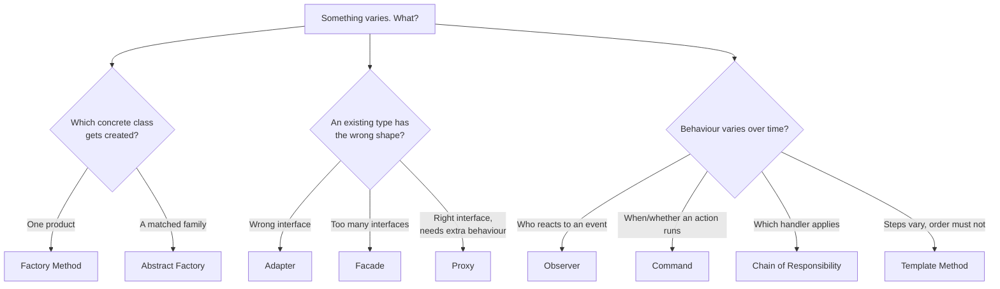
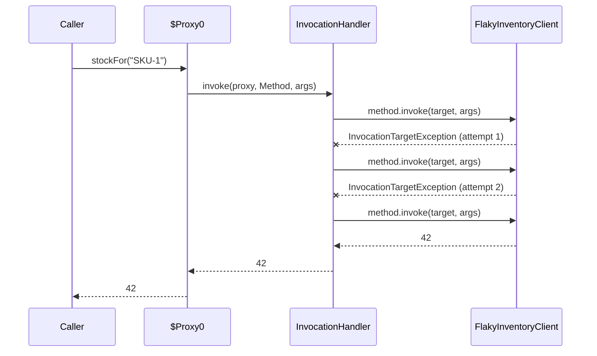

# Design Patterns Catalog Beyond the Core Four

> **Topic register:** T-2432 · Core tier · High interview frequency [H]
> **Provenance:** every behavior claimed below is real, executed output from
> [`practice/java/design-patterns/catalog-beyond-core-four/`](../../practice/java/design-patterns/catalog-beyond-core-four/README.md)
> (OpenJDK 21.0.12), including a real JDK dynamic proxy retrying a
> deterministically flaky client, and a real, unplanned finding: a listener
> that unsubscribes during dispatch caused a **silently skipped subscriber**
> rather than the `ConcurrentModificationException` the textbook predicts.

This chapter completes the catalog. [Design Patterns Applied](design-patterns-applied.md) covers Strategy, Builder, Decorator, and Singleton in depth; those four are not repeated here. Everything below is the rest of what a Java backend interview actually asks about.

## Table of Contents

1. [Learning Objectives](#learning-objectives)
2. [Why This Matters in Interviews](#why-this-matters-in-interviews)
3. [Level 1 — Foundation](#level-1-foundation)
4. [Level 2 — Working Knowledge](#level-2-working-knowledge)
5. [Mental Model](#mental-model)
6. [Definition and Purpose](#definition-and-purpose)
7. [Core Concepts](#core-concepts)
8. [Internal Implementation](#internal-implementation)
9. [Diagrams](#diagrams)
10. [Java Examples](#java-examples)
11. [Production Scenarios](#production-scenarios)
12. [Trade-offs](#trade-offs)
13. [Decision Framework](#decision-framework)
14. [Common Mistakes](#common-mistakes)
15. [Anti-Patterns](#anti-patterns)
16. [Best Practices](#best-practices)
17. [Interview Answer Framework](#interview-answer-framework)
18. [Interview Questions](#interview-questions)
19. [Summary](#summary)
20. [Key Takeaways](#key-takeaways)
21. [Cheat Sheet](#cheat-sheet)
22. [Flashcards](#flashcards)
23. [Practice Exercises](#practice-exercises)
24. [Solutions](#solutions)
25. [Additional Reading](#additional-reading)
26. [Official References](#official-references)

---

## Learning Objectives

By the end of this chapter you can:

- Explain each of the nine patterns here in one sentence that names the *problem* it solves, not its class diagram.
- Distinguish Factory Method from Abstract Factory, and Adapter from Facade, with a concrete case where confusing them produces a worse design.
- Implement a Proxy with `java.lang.reflect.Proxy` and explain how Spring's `@Transactional` uses the same mechanism.
- Name the real failure mode of each pattern — the thing that goes wrong in production, not in the diagram.
- Recognize where the JDK and Spring already implement these patterns, which is how most follow-up questions are actually phrased.

## Why This Matters in Interviews

Pattern questions get asked in two very different ways, and candidates who prepare for only one get caught. The first way is direct recall: "explain the Adapter pattern." The second, far more common at Senior level, is recognition inside an existing system: "how does `@Transactional` actually work?", "we need to add retries to twelve clients without touching them, what do you do?", "our event listeners sometimes don't fire, why?". Those are Proxy, Proxy, and Observer questions, but nobody says so.

The catalog also functions as shared vocabulary. Saying "put a chain of responsibility in front of the handler" compresses a paragraph of design discussion into five words that a reviewer immediately understands. That compression is the pattern's real value — and it is also why naming one wrongly is costly, because it sends the reader to the wrong mental model.

What interviewers penalize is pattern recitation with no failure analysis. Every pattern here has a way it goes wrong; the failure is what separates someone who has read about patterns from someone who has shipped them.

## Level 1 — Foundation

A design pattern is a name for a solution shape that keeps reappearing. Nothing more mystical than that. Someone noticed that dozens of unrelated programs solved "I need to add behavior to an object without changing its class" the same way, wrote the shape down, and gave it a name so the next person could say the name instead of redrawing the shape.

The nine in this chapter, one sentence each:

- **Factory Method** — a method decides which concrete class to create, so callers never name one.
- **Abstract Factory** — one object creates a *family* of related things that must match each other.
- **Adapter** — a wrapper that makes an existing class fit an interface it was not written for.
- **Proxy** — a stand-in with the same interface as the real object, which adds something (retries, caching, access checks) before or after delegating.
- **Facade** — one simple entry point in front of several complicated subsystems.
- **Observer** — one object announces events; many others react, and the announcer does not know who they are.
- **Command** — an action packaged as an object, so it can be stored, queued, logged, or undone.
- **Chain of Responsibility** — a request travels along a list of handlers until one deals with it.
- **Template Method** — a base class fixes the *order* of steps; subclasses fill in the steps.

These are grouped in the original catalog as creational (Factory Method, Abstract Factory), structural (Adapter, Proxy, Facade), and behavioral (Observer, Command, Chain of Responsibility, Template Method). The grouping is a filing convenience, not a deep truth, and no interviewer cares whether you recite it.

## Level 2 — Working Knowledge

Two distinctions cause most of the confusion at this level, and both are worth getting exactly right because interviewers probe them deliberately.

**Factory Method versus Abstract Factory.** A factory method produces *one* kind of thing: give it a key, get a `PaymentProcessor`. An abstract factory produces a *matched set*: pick the German factory and you get both the German tax calculator and the German invoice formatter, and you cannot accidentally combine German tax rules with American invoice wording. The real demo makes the difference visible:

```text
DE: Rechnung: 100,00 EUR (davon 19,00 EUR MwSt.)
US: Invoice: $100.00 (incl. $8.75 sales tax)
```

If there is only one product type, you want a factory method, and calling it an abstract factory adds an interface for nothing.

**Adapter versus Facade versus Proxy.** All three are objects that sit in front of other objects, which is why they blur together. The distinguishing question is what happens to the *interface*:

- **Adapter** changes the interface. Input shape A, output shape B, because the caller wants B and the existing class only speaks A.
- **Facade** simplifies a *set* of interfaces into a smaller one. It reduces surface area; it does not translate a mismatch.
- **Proxy** keeps the interface identical. Same methods, same signatures — the difference is invisible to the caller, which is exactly what allows it to be inserted transparently.

That last property is why Proxy, not Adapter, is the mechanism behind `@Transactional`, `@Cacheable`, and most AOP: the caller must not be able to tell.

## Mental Model

Think of the whole catalog as answers to one question — *what varies, and how do I keep that variation in one place?*

- Varies by **which concrete type**: Factory Method, Abstract Factory.
- Varies by **what shape the outside world speaks**: Adapter.
- Varies by **what happens around a call**: Proxy.
- Varies by **how many steps a caller should have to know about**: Facade.
- Varies by **who cares about an event**: Observer.
- Varies by **when an action runs, and whether it can be reversed**: Command.
- Varies by **which handler applies**: Chain of Responsibility.
- Varies by **the steps, but not their order**: Template Method.

If you can state what varies, the pattern usually names itself.

## Definition and Purpose

Each pattern below gets a definition, the problem it exists for, and the real, executed evidence backing the behavioral claims.

### Factory Method

**Definition.** A method that returns an instance of one of several possible implementations, selected at runtime, with the return type being the abstraction.

**Why it exists.** Without it, every call site that needs a payment processor has to name a concrete provider, so adding a provider means editing every call site, and swapping one for testing means editing code rather than configuration.

**Evidence.**

```text
processorFor("stripe").charge(2500) -> Stripe charged 2500 cents (PaymentIntent API)
processorFor("adyen").charge(2500) -> Adyen charged 2500 cents (Payments API)
processorFor("paypal") -> IllegalArgumentException: Unknown payment provider: paypal
```

The unknown-key case matters: a factory needs a defined failure, and returning `null` for an unknown key pushes an avoidable `NullPointerException` into the caller.

### Abstract Factory

**Definition.** An interface whose methods each create one member of a family of related products, with concrete factories guaranteeing internal consistency.

**Why it exists.** Some objects only make sense together. A tax calculator and an invoice formatter must agree on jurisdiction; a widget set must agree on platform. An abstract factory makes the inconsistent combination unrepresentable rather than merely discouraged.

**Cost.** Adding a new *product type* to the family means changing the factory interface and every implementation. Abstract Factory is cheap to extend with new families, expensive to extend with new product kinds — the standard, real trade-off.

### Adapter

**Definition.** A class implementing the interface a client expects, delegating to a class with an incompatible interface.

**Why it exists.** Third-party code cannot be edited, and its shape is rarely the shape your domain wants. The adapter confines the translation to one class.

**Evidence.** The demo's legacy SDK returns `Object[]{"DE", "Berlin", 52.52, 13.405}`; the adapter turns that into a typed `countryOf()` result:

```text
lookup.countryOf("203.0.113.7") = DE
```

The value is not the translation itself — it is that the `Object[]` unpacking exists in exactly one place, so replacing the SDK is a one-class change.

### Proxy

**Definition.** An object with the same interface as a target, controlling access to it.

**Why it exists.** Cross-cutting behavior — retries, caching, transactions, authorization, lazy loading, metrics — belongs neither in every caller nor tangled into the implementation.

**Evidence.** The demo builds a real `java.lang.reflect.Proxy` adding retries to a client that fails deterministically twice:

```text
guarded.stockFor("SKU-1") = 42
  stockFor failed on attempt 1: transient upstream failure on attempt 1
  stockFor failed on attempt 2: transient upstream failure on attempt 2
  stockFor succeeded on attempt 3
Real underlying calls made: 3
Proxy runtime class: $Proxy0
FlakyInventoryClient contains no retry code at all.
```

`$Proxy0` is the real runtime class name the JDK generated. The bounded case is equally important — with `maxAttempts=2` against five failures, the last error genuinely propagates rather than being swallowed.

### Facade

**Definition.** A single object offering a simplified interface over a set of subsystem interfaces.

**Why it exists.** Multi-step orchestration with a mandatory ordering is a correctness hazard when every caller re-implements it.

**Evidence.**

```text
new CheckoutFacade().checkout("SKU-1", 3):
  RES-SKU-1-3 | subtotal 59.97 | tax 12.59 | total 72.56
```

The four services stay independently usable — a facade adds an easy path, it does not block the hard one. A facade that *forbids* direct subsystem access has become something else (a gateway, or a bounded-context boundary), which is a legitimate design but a different decision.

### Observer

**Definition.** A subject maintains a list of dependents and notifies them of state changes, without knowing their concrete types.

**Why it exists.** It decouples "something happened" from "here is everything that should happen as a result," which otherwise grows into a single method that every team needs to edit.

**Evidence, including both real failure modes** — these are covered under [Internal Implementation](#internal-implementation), because they are the part interviews actually probe.

### Command

**Definition.** An action, and everything needed to perform it, encapsulated as an object.

**Why it exists.** Once an action is an object, it can be put in a queue, retried, logged, scheduled, or reversed. Undo in particular is essentially impossible without it.

**Evidence.**

```text
After three commands: "Hello, world!!!"
undo -> AppendText("!!!")  document: "Hello, world"
undo -> AppendText(", world")  document: "Hello"
undo -> AppendText("Hello")  document: ""
undo -> (nothing)  document: ""
```

Note the empty-history case returns cleanly rather than throwing — a real undo stack needs a defined answer for "nothing to undo."

### Chain of Responsibility

**Definition.** A request is passed along a sequence of handlers; each either handles it or forwards it.

**Why it exists.** Request processing has cross-cutting stages — authenticate, rate-limit, validate size, route — that should be independently addable and reorderable.

**Evidence.**

```text
200 handled /api/orders
AuthHandler stopped it: 401 missing API key
SizeLimitHandler stopped it: 413 body too large (5000 bytes)
RouteHandler stopped it: 404 no route for /admin
```

Order is the design. Auth before size means an unauthenticated oversized request is `401`, never `413` — which matters, because a `413` for an unauthenticated caller leaks that the endpoint exists and what its limits are.

### Template Method

**Definition.** A base class defines an algorithm's skeleton in a `final` method, deferring individual steps to subclasses.

**Why it exists.** Some sequences must not vary — fetch, then transform, then publish — while the steps must.

**Evidence.**

```text
DailySalesReport.run()  -> emailed [sales=1500,refunds=30]
ComplianceExport.run()  -> uploaded to SFTP [PII=REDACTED,ROWS=42]
```

Both ran the same three steps in the same order, enforced by `final String run()`. `ComplianceExport` overrode the optional `transform` hook; neither subclass could reorder or skip anything.

## Core Concepts

### Patterns you are already using

Most of these are already in your dependency tree, and interviewers love this framing:

| Pattern | In the JDK | In Spring |
|---|---|---|
| Factory Method | `List.of`, `Optional.of`, `Executors.newFixedThreadPool` | `BeanFactory.getBean` |
| Abstract Factory | `DocumentBuilderFactory`, `SSLContext` | `FactoryBean<T>` implementations |
| Adapter | `Arrays.asList`, `InputStreamReader` | `HandlerAdapter` in Spring MVC |
| Proxy | `java.lang.reflect.Proxy`, `Collections.unmodifiableList` | `@Transactional`, `@Cacheable`, `@Async`, all AOP |
| Facade | `java.net.http.HttpClient` | `JdbcTemplate`, `RestClient` |
| Observer | `PropertyChangeListener`, `Flow.Subscriber` | `ApplicationEventPublisher`, `@EventListener` |
| Command | `Runnable`, `Callable` | `@Scheduled` methods |
| Chain of Responsibility | `java.util.logging` handler chain | `javax.servlet.Filter` chain, Spring Security filter chain |
| Template Method | `AbstractList`, `InputStream` | `AbstractController`, `JdbcTemplate` callbacks |

The Proxy row is the highest-value one to memorize, because "how does `@Transactional` work?" is among the most common Spring questions and the honest answer starts with "it is a proxy" — see [Transactional Proxy Mechanics and Propagation](../05-spring/transactional-proxy-mechanics-and-propagation.md) for why self-invocation silently bypasses it.

### The failure mode of each pattern

This table is the part most pattern write-ups omit, and the part interviews reward.

| Pattern | How it fails in production |
|---|---|
| Factory Method | Becomes a god-switch touched by every team; unknown keys return `null` instead of throwing |
| Abstract Factory | A new product kind forces edits across every factory implementation |
| Adapter | Adapter chains — an adapter over an adapter — where no one can say what the real shape is |
| Proxy | Self-invocation bypasses it entirely; stack traces become unreadable; behavior is invisible at the call site |
| Facade | Grows into a god object as callers keep asking for "one more convenience method" |
| Observer | A throwing listener starves later listeners; subscription during dispatch corrupts iteration; listeners never unsubscribed leak memory |
| Command | Undo stacks that grow without bound; commands capturing stale state |
| Chain of Responsibility | Silent fall-through when no handler matches; order changes altering behavior with no test catching it |
| Template Method | Inheritance coupling — a base-class change breaks every subclass; deep hierarchies for small variations |

### Composition beats inheritance, except where it does not

Template Method is the one pattern here built on inheritance, and it is the one to be most careful with. Strategy (see [Design Patterns Applied](design-patterns-applied.md)) solves a similar problem with composition and no base class. Choose Template Method when the *sequence* genuinely is the invariant worth enforcing and the variation is small; choose Strategy when the variations are substantial or need to be swapped at runtime.

## Internal Implementation

### How a JDK dynamic proxy actually works

`Proxy.newProxyInstance(loader, interfaces, handler)` generates a class at runtime that implements the given interfaces and routes every method call to `InvocationHandler.invoke(proxy, method, args)`. The demo's output confirms the generated class name is `$Proxy0`.

Three consequences follow, and all three are interview follow-ups:

1. **Interfaces only.** JDK proxies cannot proxy a concrete class. Spring falls back to CGLIB subclass proxies for that case, which is why `final` classes and `final` methods cannot be proxied at all.
2. **`invoke` receives the reflective `Method`**, so behavior is uniform across every method, and selectivity has to be implemented explicitly (by annotation, name, or signature).
3. **Exception unwrapping is manual.** `method.invoke(target, args)` wraps whatever the target threw in an `InvocationTargetException`; the handler must unwrap the cause or callers see the wrong exception type. The demo does this explicitly. Getting it wrong is one of the most common real bugs in hand-written proxies.

See [Reflection and Dynamic Proxies](../02-java/language-core/reflection-and-dynamic-proxies.md) for the measured cost of reflective invocation.

### Observer's two real failure modes, measured

**A throwing listener aborts the dispatch loop.** Real output from a naive publisher with three listeners, where the middle one throws:

```text
Naive publish():
  EmailListener: confirmation queued for ORD-1002
  propagated out of publish(): downstream webhook endpoint is down
  AnalyticsListener never ran -- registration order silently decided
  which subscribers survive an unrelated failure.
```

The hardened version wraps each callback and collects failures:

```text
Hardened publishIsolated():
  EmailListener: confirmation queued for ORD-1003
  AnalyticsListener: order_placed recorded for ORD-1003
  contained failures: [BrokenListener: downstream webhook endpoint is down]
```

**Unsubscribing during dispatch does not reliably throw.** This is the chapter's unplanned finding, and it is worth reading twice. A listener that removes itself mid-dispatch produced *no exception at all*:

```text
  EmailListener: confirmation queued for ORD-1004
  one-shot listener fired for ORD-1004, unsubscribing now
  publish() returned with NO exception at all.
  AnalyticsListener was third in the list and never ran: removing the
  second-of-three element left the iterator's cursor equal to the new
  size, so hasNext() returned false before the modCount check could fire.
  A silently skipped subscriber is strictly worse than the
  ConcurrentModificationException most people expect here.
```

`ArrayList`'s iterator checks `modCount` inside `next()`, but `hasNext()` is only `cursor != size`. Removing the second of three elements leaves `cursor == 2` and `size == 2`, so iteration ends cleanly and the third listener is skipped with no error anywhere. Relying on fail-fast iteration to *catch* listener bugs is therefore unsound — see [Fail-Fast vs. Weakly Consistent Iterators](../02-java/collections/fail-fast-vs-weakly-consistent-iterators.md). Using `CopyOnWriteArrayList` as the listener store makes the same scenario run every listener with no exception, at the cost of a copy per mutation.

## Diagrams





The sequence diagram is the measured run: three real calls to the target, one call from the caller's point of view, and no retry code anywhere in `FlakyInventoryClient`.

## Java Examples

Full, compiled sources at [`practice/java/design-patterns/catalog-beyond-core-four/`](../../practice/java/design-patterns/catalog-beyond-core-four/README.md).

**Abstract Factory — the consistency guarantee:**

```java
interface RegionFactory {
    TaxCalculator taxCalculator();
    InvoiceFormatter invoiceFormatter();
}

static final class GermanyFactory implements RegionFactory {
    @Override public TaxCalculator taxCalculator() {
        return amount -> Math.round(amount * 0.19);          // 19% VAT
    }
    @Override public InvoiceFormatter invoiceFormatter() {
        return (amount, tax) -> "Rechnung: %d,%02d EUR (davon %d,%02d EUR MwSt.)"
                .formatted(amount / 100, amount % 100, tax / 100, tax % 100);
    }
}
```

**Proxy — retries with correct exception unwrapping:**

```java
InvocationHandler handler = (proxyInstance, method, arguments) -> {
    RuntimeException last = null;
    for (int attempt = 1; attempt <= maxAttempts; attempt++) {
        try {
            return method.invoke(target, arguments);
        } catch (InvocationTargetException e) {
            Throwable cause = e.getCause();
            if (!(cause instanceof RuntimeException runtime)) {
                throw cause;                  // never swallow checked/Error causes
            }
            last = runtime;
        }
    }
    throw last;
};
return (T) Proxy.newProxyInstance(contract.getClassLoader(),
        new Class<?>[]{contract}, handler);
```

**Observer — the hardened dispatch, both fixes in four lines:**

```java
List<String> publishIsolated(String orderId) {
    List<String> failures = new ArrayList<>();
    for (OrderListener listener : List.copyOf(listeners)) {   // snapshot: safe to mutate during dispatch
        try {
            listener.onOrderPlaced(orderId);
        } catch (RuntimeException e) {                        // isolation: one failure cannot starve the rest
            failures.add(listener.getClass().getSimpleName() + ": " + e.getMessage());
        }
    }
    return failures;
}
```

**Template Method — the skeleton is `final` on purpose:**

```java
abstract static class ReportJob {
    final String run() {                 // final: subclasses customise steps, never the sequence
        return publish(transform(fetch()));
    }
    abstract String fetch();
    String transform(String raw) { return raw.trim(); }   // hook with a default
    abstract String publish(String payload);
}
```

## Production Scenarios

### Scenario: order confirmation emails stop sending after an unrelated analytics deploy

**Symptoms.** Customers report missing confirmation emails. Error rates are flat, the email service is healthy, and the order service shows no failed sends — because it is not attempting them.

**Initial hypotheses.** Email provider throttling; a template change; a feature flag.

**Evidence collected.** Application logs show an exception from a webhook listener registered on the same order-placed event. Comparing the listener registration order in the deployed build against the previous one shows the analytics module now registers before the email module.

**Diagnosis.** A single-loop Observer dispatch with no per-listener isolation. When the webhook listener throws, dispatch aborts and every listener registered after it is skipped. The deploy did not break email; it changed registration order, which silently changed *which* subscribers survive an unrelated failure. Measured directly in this chapter's demo: with a throwing listener in the middle, the third listener never runs.

**Immediate mitigation.** Wrap each listener invocation in try/catch and log failures. One method, minutes to ship.

**Permanent remediation.** Dispatch over a snapshot with per-listener isolation and a failure metric per listener, so a broken subscriber is visible rather than inferred. Consider moving genuinely independent side effects onto a message broker so failures are retried rather than merely isolated — see [Event-Driven Architecture Integration Styles](../09-messaging-event-driven/event-driven-architecture-integration-styles.md).

**Trade-offs.** Isolation means a failing listener no longer stops the sequence, which is desirable here — but if two listeners have a genuine ordering dependency, isolation hides a real failure. Ordering dependencies between listeners are the actual defect; the fix is to make the dependency explicit, not to rely on dispatch order.

**Prevention.** A test that registers a deliberately throwing listener and asserts every other listener still ran.

**Interview lessons.** The pattern was implemented correctly by the diagram and still failed. That is the level of answer "tell me about a production bug" is looking for.

### Scenario: a retry proxy turns a brief outage into a sustained one

**Symptoms.** A downstream service degrades for 30 seconds. The calling service's error rate stays elevated for eight minutes after the dependency recovers, and the dependency's inbound traffic during the outage is four times normal.

**Diagnosis.** A retry proxy applied uniformly to every method of every client, with fixed maximum attempts and no backoff, no jitter, and no circuit breaker. Every failing call became four calls. The pattern's transparency — the reason it is attractive — is precisely what made the amplification invisible at the call sites.

**Remediation.** Retry only idempotent operations, add exponential backoff with jitter, and put a circuit breaker in front so a sustained failure stops generating load. See [Resilience Patterns](../11-system-design/resilience-patterns.md) and [Idempotency](../11-system-design/idempotency.md).

**Interview lessons.** "Add retries with a proxy" is an incomplete answer. The complete answer names idempotency as the precondition and backoff plus circuit breaking as the companions.

## Trade-offs

| Pattern | Use when | Avoid when |
|---|---|---|
| Factory Method | Implementation choice is runtime data (config, tenant, region) | There is exactly one implementation and no near-term second |
| Abstract Factory | Products must be mutually consistent | The family has one member, or product kinds change often |
| Adapter | An external type's shape is wrong and unchangeable | You own both sides — fix the interface instead |
| Proxy | Cross-cutting behavior must apply uniformly and invisibly | The behavior is business logic, or callers need to see it |
| Facade | A multi-step subsystem has one dominant correct usage | Callers legitimately need the full surface |
| Observer | Reactions are independent and the publisher must not know them | Reactions are ordered, transactional, or must not be lost |
| Command | Actions need queueing, undo, logging, or scheduling | A direct method call does the job |
| Chain of Responsibility | Stages are independent and reorderable | One handler always handles it |
| Template Method | The sequence is the invariant and variation is small | Variation is large or needs runtime swapping — use Strategy |

## Decision Framework

1. **Name what varies.** If you cannot, you do not need a pattern yet.
2. **Check whether the interface must stay identical.** If yes and you are adding behavior, it is a Proxy. If it must change, Adapter. If it must shrink, Facade.
3. **Check whether variation is in types or in behavior over time.** Types → factories. Behavior over time → the behavioral group.
4. **Check the failure mode before committing.** Look up the row in [The failure mode of each pattern](#core-concepts) and ask whether you can live with it and detect it.
5. **Check whether the framework already does it.** Spring's event publisher, filter chain, and AOP proxies exist; a hand-rolled version of any of them needs a reason.
6. **Prefer the smallest thing that works.** A switch statement in one place is not a design failure. Patterns pay off at the second or third variation, not the first.

## Common Mistakes

- **Confusing Factory Method and Abstract Factory.** One product versus a matched family.
- **Calling every wrapper an Adapter.** If the interface is unchanged, it is a Proxy or a Decorator.
- **Confusing Proxy and Decorator.** Both keep the interface; a Decorator is chosen and composed by the caller to add optional behavior, while a Proxy is typically inserted transparently and controls access to a target the caller may not even know it has.
- **Dispatching Observer events without isolation.** Measured: one throwing listener skips the rest.
- **Assuming fail-fast iteration catches listener bugs.** Measured: it did not throw, and a listener was silently skipped.
- **Retrying non-idempotent operations through a proxy.** Duplicated charges are the classic outcome.
- **Using Template Method for large variation.** Deep inheritance for behavior swapping is a Strategy in disguise.

## Anti-Patterns

- **Pattern-first design.** Choosing the pattern before the problem produces `AbstractRequestHandlerFactoryProvider` and no benefit.
- **The god facade.** A facade that accumulates every convenience method becomes the coupling point it was meant to remove.
- **Proxy stacking.** Five layers of proxy around one bean makes stack traces unreadable and behavior unpredictable at the call site.
- **Silent chain fall-through.** A chain where no handler matches and the request quietly returns success.
- **Unbounded command history.** An undo stack that never truncates is a memory leak with a friendly name.

## Best Practices

- Name classes after the pattern only when it aids the reader: `RetryingInventoryClient` beats `InventoryClientProxy`.
- Give every factory a defined failure for unknown input.
- Make Observer dispatch isolated and snapshot-based by default; the four-line version in this chapter is the whole fix.
- Bound every Command history, and store the data needed for undo, not a reference to mutable state that may have changed.
- Document a chain's order where the chain is built, since the order is the behavior.
- Keep Template Method hierarchies one level deep, and mark the skeleton `final`.
- When a framework provides the pattern, use it — and know the mechanism well enough to explain its edge cases (proxy self-invocation, listener ordering).

## Interview Answer Framework

### 30-Second Answer

Beyond Strategy, Builder, Decorator, and Singleton, the patterns that actually come up are: factories for choosing implementations, Adapter for reshaping a third-party interface, Proxy for adding behavior transparently — which is how `@Transactional` works — Facade for simplifying a subsystem, Observer for event fan-out, Command for queueable and undoable actions, Chain of Responsibility for request pipelines, and Template Method for fixing a sequence while varying its steps.

### 2-Minute Answer

Pick two and go deeper rather than listing all nine. Proxy is the highest-value pair with Observer: explain that a JDK dynamic proxy generates a class implementing the target interfaces and routes everything through an `InvocationHandler` — I have measured a real one retrying a flaky client with the implementation containing no retry code — and that Spring uses exactly this for `@Transactional`, which is why self-invocation bypasses it. Then explain Observer's real failure modes: a throwing listener aborts dispatch and silently starves later subscribers, and removing a listener during dispatch does not reliably throw — I measured a silently skipped subscriber with no exception. The fix is a snapshot plus per-listener try/catch.

### 10-Minute Deep Dive

Structure it as: the "what varies" framing; the three confusable wrappers (Adapter changes the interface, Facade shrinks it, Proxy preserves it) and why the preserved interface is what makes AOP possible; the dynamic proxy mechanism with its three consequences (interfaces only, uniform interception, manual `InvocationTargetException` unwrapping); the Observer failure modes with measured evidence; the JDK-and-Spring table showing the patterns already in use; and the retry-amplification production scenario as the reason pattern knowledge without failure analysis is incomplete.

### Whiteboard Explanation

Draw a caller box, a target box, and a box between them. Label the middle box three times in sequence — Adapter, Facade, Proxy — and each time write what happens to the interface: changed, shrunk, identical. Then circle Proxy and write `@Transactional` next to it. Three boxes and one word each carries the whole distinction.

### Production Example

The confirmation-email outage: no error rate change, no failed sends, because an unrelated analytics listener registering earlier and throwing aborted the dispatch loop before the email listener ran. The fix was a snapshot and per-listener isolation.

### Trade-offs to Mention

Proxy transparency is both the benefit and the hazard — behavior invisible at the call site is behavior nobody reviews. Abstract Factory is cheap to extend with families, expensive with product kinds. Template Method buys sequence safety with inheritance coupling.

### Common Candidate Mistakes

Listing patterns with no failure analysis; confusing Proxy and Decorator; not knowing the framework already implements the pattern being described; proposing retries without mentioning idempotency.

### Typical Follow-Up Questions

"How does `@Transactional` actually work?" → "Why doesn't it apply when a method calls another method on the same bean?" → "Could you proxy a `final` class?" → "What happens if one listener throws?" → "Would `ConcurrentModificationException` catch a listener unsubscribing mid-dispatch?" → "How would you make retries safe?"

### Senior-Level Expectations

Explains mechanism, not diagrams; names at least one failure mode per pattern discussed; connects to the framework implementation the team actually uses.

### Staff-Level Discussion

Treats the catalog as a vocabulary problem with organizational consequences. Patterns compress design discussion, so a codebase where names are used precisely reviews faster — and one where every wrapper is called an Adapter reviews slower and drifts. The transparency of Proxy is a governance concern as much as a technical one: behavior injected by annotation is behavior that does not appear in code review of the call site, which argues for a small, explicitly-documented set of sanctioned cross-cutting proxies rather than ad-hoc AOP. On migration: introducing a factory or a facade is usually incremental and low-risk, while introducing Template Method into existing code means committing to an inheritance hierarchy that is expensive to reverse — so the reversible patterns should be adopted freely and the irreversible ones deliberately.

## Interview Questions

### Question 1 — What is the difference between Adapter, Facade, and Proxy? They all wrap something.

**Why interviewers ask it.** It separates diagram memorization from understanding intent, and all three genuinely look alike in code.

**Expected answer.** Adapter changes the interface so a client can use an otherwise-incompatible class. Facade provides one simplified interface over several subsystem interfaces to reduce surface area. Proxy keeps the interface exactly the same and controls access to the target, adding behavior such as retries, caching, laziness, or transactions.

**Minimum acceptable answer.** Knows Adapter is about incompatible interfaces and Facade is about simplification.

**Strong Senior answer.** States the identical-interface property as the defining feature of Proxy and explains that this is what makes transparent insertion — and therefore AOP and `@Transactional` — possible. Distinguishes Proxy from Decorator: same interface in both, but a Decorator is explicitly composed by the caller to add optional behavior, while a Proxy controls access and is usually inserted without the caller's knowledge.

**Staff-level extension.** Notes that transparency is a governance trade-off: behavior added by proxy never appears in a review of the call site, which is an argument for a small sanctioned set of cross-cutting concerns rather than unconstrained AOP.

**Common mistakes.** Describing Facade as "an Adapter for multiple classes"; treating Proxy and Decorator as interchangeable.

**Likely follow-ups.** "Which one is `@Transactional`?" (Proxy.) "Can you proxy a `final` class?" (Not with JDK proxies, which need interfaces, and not with CGLIB, which needs to subclass.)

**Evaluation criteria.** Correctly uses the interface as the discriminator, and gives one real example of each.

### Question 2 — Our event listeners sometimes don't fire and nothing is logged. How do you debug that, and what is the fix?

**Why interviewers ask it.** It is a real, common production symptom whose cause is invisible in the listener that failed to run.

**Expected answer.** Two candidate mechanisms in a single-threaded Observer dispatch. First, a listener earlier in the list threw, aborting the loop before later listeners ran — registration order then decides who survives an unrelated failure. Second, a listener that subscribes or unsubscribes during dispatch corrupts iteration. The fix for both is dispatching over a snapshot with each callback wrapped in try/catch, plus a per-listener failure metric so the broken subscriber is visible.

**Minimum acceptable answer.** Identifies that one listener's exception can prevent others from running.

**Strong Senior answer.** Knows that mid-dispatch removal does not reliably throw: removing the second of three elements from an `ArrayList` leaves the iterator's cursor equal to the new size, so `hasNext()` returns false and the third listener is skipped with no exception at all — verified directly. Concludes that fail-fast iteration cannot be relied on to surface listener bugs, and that a `CopyOnWriteArrayList` listener store removes the iteration hazard at the cost of a copy per mutation.

**Staff-level extension.** Questions whether in-process Observer is the right mechanism when the side effects must not be lost — isolation prevents starvation but does not provide retry or durability, which argues for a broker-backed event for genuinely independent, must-happen work, and for making any real ordering dependency between listeners explicit rather than implicit in registration order.

**Common mistakes.** Assuming a `ConcurrentModificationException` would always be thrown; adding a global try/catch around the whole dispatch loop, which stops the crash but still skips listeners.

**Likely follow-ups.** "What if two listeners genuinely depend on each other's order?" (That dependency is the defect; make it explicit or merge them.) "How would you test this?" (Register a deliberately throwing listener and assert the others still ran.)

**Evaluation criteria.** Names both mechanisms, does not over-trust fail-fast behavior, and gives a fix that makes failures visible rather than merely survivable.

### Question 3 — You need to add retries to twelve HTTP clients without modifying them. What do you build, and what could go wrong?

**Why interviewers ask it.** It is a Proxy question phrased as a task, and the "what could go wrong" half is where Senior and Staff answers separate.

**Expected answer.** A Proxy: with JDK dynamic proxies if the clients are behind interfaces, or a framework mechanism (Spring AOP, a Resilience4j decorator) otherwise. The handler intercepts each call, retries on failure, and unwraps `InvocationTargetException` so callers see the original exception type.

**Minimum acceptable answer.** Proposes a wrapper implementing the same interface, rather than editing twelve classes.

**Strong Senior answer.** States idempotency as the precondition — retrying a non-idempotent write duplicates it — and adds exponential backoff with jitter plus a circuit breaker, because uniform fixed retries multiply load exactly when the dependency is least able to take it. Mentions that JDK proxies require interfaces and that `final` classes and methods cannot be proxied.

**Staff-level extension.** Raises the amplification math explicitly: retries turn a partial outage into a self-sustaining one, so the retry budget belongs in the platform's defaults and should be observable per client. Also notes that behavior invisible at the call site needs documentation and metrics, or the next engineer debugging a duplicate charge has no path to the cause.

**Common mistakes.** Retrying everything uniformly; swallowing the final exception; forgetting the `InvocationTargetException` unwrap so callers see the wrong exception type.

**Likely follow-ups.** "Which HTTP methods are safe to retry?" (`GET`, `PUT`, `DELETE` if genuinely idempotent; `POST` only with an idempotency key.) "How do you keep retries from amplifying an outage?" (Backoff, jitter, circuit breaker, retry budget.)

**Evaluation criteria.** Names Proxy, names idempotency as the precondition, and describes retry amplification without prompting.

## Summary

The four patterns in [Design Patterns Applied](design-patterns-applied.md) plus the nine here cover essentially everything a Java backend interview asks about patterns. Each one answers "what varies, and where does that variation live?" The distinctions worth memorizing precisely are Factory Method versus Abstract Factory (one product versus a matched family) and Adapter versus Facade versus Proxy (interface changed, shrunk, or identical) — the last being why Proxy is the mechanism behind `@Transactional` and most AOP. The measured evidence here also supplies what most pattern material lacks: a real dynamic proxy retrying a flaky client, and two real Observer failure modes, one of which silently skipped a subscriber without throwing anything at all.

## Key Takeaways

- Name what varies first; the pattern usually follows from the answer.
- Adapter changes the interface, Facade shrinks it, Proxy keeps it identical.
- `@Transactional`, `@Cacheable`, and `@Async` are all Proxy — which is why self-invocation bypasses them.
- Observer dispatch needs a snapshot and per-listener isolation; both fit in four lines.
- Fail-fast iteration does not reliably catch mid-dispatch listener removal — measured, no exception, subscriber silently skipped.
- Retries through a proxy need idempotency, backoff, and a circuit breaker, or they amplify the outage.
- Template Method is the one inheritance-based pattern here; prefer Strategy when variation is large.

## Cheat Sheet

Condensed version: [`cheat-sheets/design-patterns-catalog-beyond-the-core-four.md`](../../cheat-sheets/design-patterns-catalog-beyond-the-core-four.md).

## Flashcards

Review deck: [`flashcards/design-patterns-catalog-beyond-the-core-four.md`](../../flashcards/design-patterns-catalog-beyond-the-core-four.md).

## Practice Exercises

1. Implement a factory method returning one of three notification channels, with a defined failure for an unknown key. Then extend it to an abstract factory that also supplies a channel-appropriate message formatter, and explain what becomes unrepresentable.
2. Write a JDK dynamic proxy that logs method name and elapsed time for every call on an interface. Then make it throw from the target and confirm the caller sees the original exception type, not `InvocationTargetException`.
3. Build an Observer with three listeners where the middle one throws. Verify the third does not run. Fix it with a snapshot and per-listener isolation, and write a test asserting the third listener ran.
4. Reproduce the silent-skip result: three listeners, where the second unsubscribes itself during dispatch. Check whether an exception is thrown and whether the third listener runs. Then swap in `CopyOnWriteArrayList`.
5. Implement a Chain of Responsibility for auth, rate limit, and routing. Reorder two handlers and write down every externally-visible difference in status codes.
6. Take a Template Method hierarchy and rewrite it with Strategy. List what you gained and what you lost.

## Solutions

1. The abstract factory makes a channel paired with the wrong formatter unrepresentable — the mismatch cannot be constructed, so it cannot be tested for either. The cost is that adding a third product kind changes every factory implementation.
2. Without unwrapping `e.getCause()`, callers see `UndeclaredThrowableException` or `InvocationTargetException` and every downstream `catch` for the real exception type stops matching.
3. The third listener does not run. Registration order therefore determines which subscribers survive an unrelated failure — the bug behind this chapter's email-outage scenario.
4. No exception is thrown and the third listener is skipped, because `hasNext()` is `cursor != size` and the removal made those equal. `CopyOnWriteArrayList` iterates a snapshot, so every listener runs.
5. Moving the size check before auth turns an unauthenticated oversized request from `401` into `413`, which tells an unauthenticated caller both that the endpoint exists and what its limit is.
6. Strategy gains runtime swappability and removes base-class coupling; it loses the enforced sequence, which now lives in whatever object composes the strategies.

## Additional Reading

- [Design Patterns Applied](design-patterns-applied.md) — Strategy, Builder, Decorator, Singleton, with the same measured treatment.
- [SOLID Principles](solid-principles.md) — the design pressures these patterns relieve.
- [Coupling, Cohesion, and Code Smells](coupling-cohesion-and-code-smells.md) — how to tell a pattern from ceremony.
- [Reflection and Dynamic Proxies](../02-java/language-core/reflection-and-dynamic-proxies.md) — measured cost of reflective invocation.
- [Transactional Proxy Mechanics and Propagation](../05-spring/transactional-proxy-mechanics-and-propagation.md) — the Proxy pattern as Spring actually implements it, including self-invocation.
- [Resilience Patterns](../11-system-design/resilience-patterns.md) — backoff, jitter, and circuit breaking around a retry proxy.

## Official References

- [`java.lang.reflect.Proxy` — Java SE 21 API](https://docs.oracle.com/en/java/javase/21/docs/api/java.base/java/lang/reflect/Proxy.html)
- [`CopyOnWriteArrayList` — Java SE 21 API](https://docs.oracle.com/en/java/javase/21/docs/api/java.base/java/util/concurrent/CopyOnWriteArrayList.html)
- [Spring Framework Reference — Proxying Mechanisms](https://docs.spring.io/spring-framework/reference/core/aop/proxying.html)
