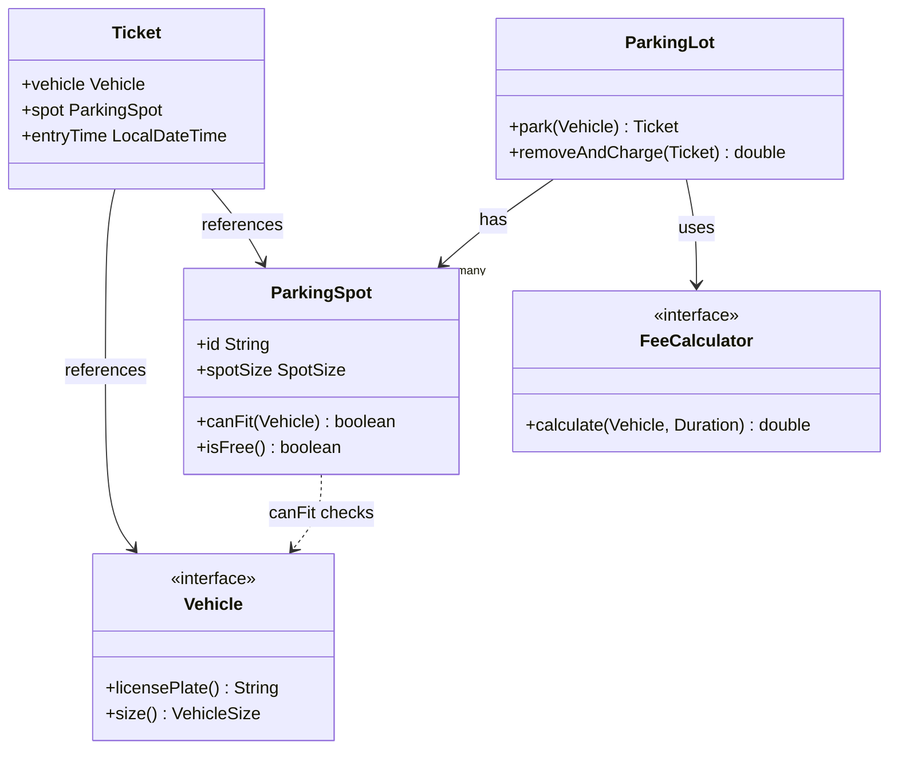
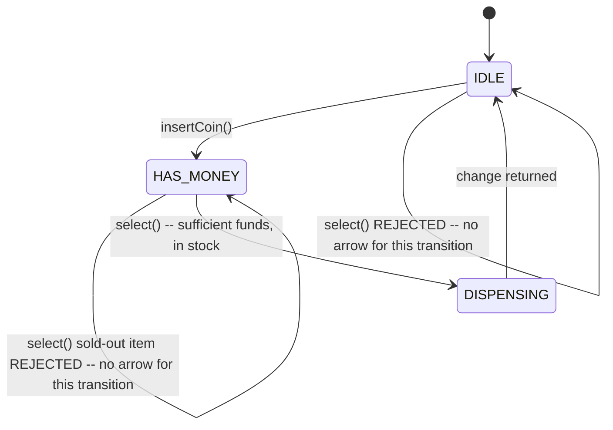

# Object-Oriented Design Interview Problems

> **Topic register:** T-1702 · Core tier · High interview frequency [H]

## Table of Contents

1. [Learning Objectives](#learning-objectives)
2. [Why This Matters in Interviews](#why-this-matters-in-interviews)
3. [Level 1 — Foundation](#level-1--foundation)
4. [Level 2 — Working Knowledge](#level-2--working-knowledge)
5. [Mental Model](#mental-model)
6. [Definition and Purpose](#definition-and-purpose)
7. [Core Concepts](#core-concepts)
8. [Internal Implementation](#internal-implementation)
9. [Diagrams](#diagrams)
10. [Production Scenarios](#production-scenarios)
11. [Failure Modes and Debugging](#failure-modes-and-debugging)
12. [Trade-offs](#trade-offs)
13. [Decision Framework](#decision-framework)
14. [Comparisons](#comparisons)
15. [Common Mistakes](#common-mistakes)
16. [Anti-Patterns](#anti-patterns)
17. [Best Practices](#best-practices)
18. [Interview Answer Framework](#interview-answer-framework)
19. [Interview Questions](#interview-questions)
20. [Summary](#summary)
21. [Key Takeaways](#key-takeaways)
22. [Cheat Sheet](#cheat-sheet)
23. [Flashcards](#flashcards)
24. [Practice Exercises](#practice-exercises)
25. [Solutions](#solutions)
26. [Additional Reading](#additional-reading)
27. [Official References](#official-references)

---

## Learning Objectives

By the end of this chapter you can work through an unfamiliar "design a system" prompt (parking lot, vending machine, elevator) using a repeatable methodology — identify entities and their single responsibilities, model relationships through interfaces so the design stays open to extension, apply SOLID deliberately rather than by accident — and cite two real, compiling, fully worked Java implementations (a parking lot with real size-based spot allocation and real time-based fee calculation; a vending machine modeled as an explicit state machine) as evidence the methodology produces working code, not just a class diagram.

## Why This Matters in Interviews

Object-oriented design interview problems ("design a parking lot," "design an elevator system," "design a vending machine") are a distinct interview format from both algorithmic coding problems and system design problems — the point isn't picking the fastest algorithm or reasoning about distributed infrastructure, it's demonstrating that you can take a vague, real-world prompt and produce a coherent class model: the right entities, the right responsibilities assigned to each, the right relationships between them, extensible in the directions a reasonable interviewer will actually probe. A candidate who jumps straight to code without first naming the entities and their responsibilities out loud, or who produces a design that requires editing three existing classes the moment the interviewer asks "now what if we add electric-vehicle charging spots," demonstrates exactly the gap this chapter's methodology and worked examples are built to close.

## Level 1 — Foundation

Think of these prompts the way an architect approaches designing a building, not a contractor pouring concrete. Before any code gets written, you first figure out: who are the different "actors" that use this system (a driver, a vehicle, a parking spot, a ticket)? What is each one actually *responsible* for (a `ParkingSpot` knows whether it's free and what size vehicle fits; it doesn't know how to calculate a fee — that's a different responsibility, belonging to a different piece)? And how do these pieces relate to each other (a `ParkingLot` *has* many `ParkingSpot`s; a `Ticket` *references* one `Vehicle` and one `ParkingSpot`)?



Notice what's deliberately *not* on this diagram: there's no `if (vehicleType.equals("BUS"))` branch anywhere, and `ParkingLot` never mentions a specific fee-calculation formula directly — both are pushed behind interfaces (`Vehicle`'s `size()`, `FeeCalculator`) for exactly the [Open/Closed and Dependency Inversion](solid-principles.md) reasons that chapter covers. Naming this structure out loud, before writing a single line of implementation, is the actual skill an OOD interview is testing.

## Level 2 — Working Knowledge

At this level you should be able to run a short, repeatable checklist against any new OOD prompt within the first few minutes, out loud, before writing code: (1) **List the nouns** in the prompt — they're your candidate entities. (2) **Assign one responsibility per entity** — if a candidate entity seems to need two unrelated jobs, split it (this is [SRP](solid-principles.md) applied at design time, not after the fact). (3) **Ask which of these entities will plausibly grow new variants** — vehicle types, spot types, pricing tiers — and model exactly those as interfaces with multiple implementations, per [OCP](solid-principles.md); don't make everything an interface speculatively. (4) **Identify any entity whose legal actions depend on which state it's currently in** — a vending machine that can't dispense before payment, an elevator that can't open its doors mid-transit — and reach for an explicit state representation (an enum plus guarded transitions, or the State design pattern from [Design Patterns Applied](design-patterns-applied.md)) rather than a tangle of booleans.

You should also be comfortable with the practical habit of asking clarifying questions before designing anything, the same discipline coding interviews expect for edge cases: does this parking lot have multiple levels? Can a vehicle's size category ever change mid-stay? Does the vending machine need to support partial refunds? An OOD prompt is deliberately underspecified — asking a handful of scoping questions up front is expected, not a sign of hesitation, and directly shapes which parts of the design need to be extensible.

## Mental Model

Treat every OOD prompt as answering three questions in order, and resist the urge to jump to the third before the first two are settled. **What are the things?** (entities — nouns from the prompt, each eventually a class or interface). **What does each thing know and do, and only that?** (responsibilities — the SRP question, asked at design time). **How do the things relate, and which of those relationships need to flex as new variants appear?** (relationships and extension points — has-a vs. is-a, and which of those "is-a" relationships are actually meant to be extensible, i.e., modeled as an interface, versus fixed). A design that answers all three deliberately, before code, transfers to an unfamiliar follow-up prompt far better than a design that jumps straight into a class hierarchy and only discovers its shape by writing code.

## Definition and Purpose

**Object-oriented design (OOD) interview problems** are a class of interview prompt asking a candidate to model a real-world or semi-real-world system (a parking lot, an elevator bank, a vending machine, a deck of cards) as a coherent set of classes and interfaces — evaluating entity identification, responsibility assignment, relationship modeling, and extensibility, at the class/module level of design this domain owns (as distinguished from [`17-architecture`](../17-architecture/INDEX.md)'s system-level, multi-service concerns). Unlike algorithmic coding problems, there is rarely one "correct" answer; the evaluation criteria are whether the design is coherent, whether responsibilities are assigned sensibly, and whether it survives the interviewer's inevitable "now extend it to support X" follow-up without requiring the entire structure to be reworked.

## Core Concepts

### The entity-responsibility-relationship method generalizes across every OOD prompt

Every classic OOD prompt — parking lot, elevator, vending machine, deck of cards, library system, ride-sharing dispatcher — responds to the same three-step method from this chapter's Mental Model: list entities, assign single responsibilities, model relationships and extension points. The method is the actual transferable skill; the specific entities differ per prompt, but the process for finding them doesn't.

### State-shaped prompts have a specific, recognizable tell

A prompt where an object's legal next actions genuinely depend on which state it's currently in — a vending machine that can't dispense before payment is inserted, an elevator that can't open its doors while moving — should make a candidate reach explicitly for a `State` enum with guarded transitions, or the full State design pattern for more complex cases. Modeling this instead as a scattered collection of boolean flags (`isPaid`, `isDispensing`, `hasSelectedItem`) is a common, real weak-answer signature, since it lets illegal combinations (`isPaid=false, isDispensing=true`) exist as valid program states with no single place enforcing they can't.

### Extensibility should target the prompt's actual variation points, not every entity speculatively

A strong OOD answer identifies specifically *which* entities are likely to grow new variants — given the prompt — and models exactly those behind an interface, while leaving genuinely fixed concerns as plain classes. Over-applying interfaces to every entity "just in case" is the same speculative-generality anti-pattern [SOLID Principles](solid-principles.md) names directly, and a candidate who does this uniformly, without being able to justify *why* each specific interface exists, signals mechanical pattern-application rather than real design judgment.

## Internal Implementation

**Real, fully worked Parking Lot** (`practice/java/ood-interview-problems/src/ParkingLotDemo.java`) — vehicles, size-matched spots, real time-based fees:

```
=== Park a motorcycle, a car, and a bus ===
  Motorcycle parked at spot S1 (a SMALL spot -- motorcycles fit anywhere)
  Car parked at spot M1 (a MEDIUM spot -- cars can't use SMALL)
  Bus parked at spot L1 (a LARGE spot -- only LARGE fits a bus)

=== Try to park a THIRD car -- lot has no MEDIUM or LARGE spots left ===
  Result: REJECTED -- lot full for this vehicle size
  Available MEDIUM spots right now: 0

=== Car #1 leaves after 2h15m -- real fee calculated from real elapsed time ===
  Fee for CAR-1 (2h15m, rounds up to 3h @ $2.50/h) = $7.50

=== Now that Car #1's spot is free, the previously-rejected Car #3 can park ===
  Result: parked at spot M1
```

`Vehicle.size()` and `ParkingSpot.canFit()` are the interfaces this design's real extension point runs through — adding a fourth vehicle category (an oversized truck, say) means adding one new `Vehicle` implementation and one new `SpotSize`, never editing `ParkingLot`'s own `park()` method. The fee, correctly, is computed from a real `Duration.between(entryTime, exitTime)` — 2 hours 15 minutes genuinely rounds up to 3 billed hours, not a hardcoded number standing in for "some fee."

**Real, fully worked Vending Machine** (`VendingMachineDemo.java`) — an explicit state machine, exactly the pattern this chapter's Core Concepts section flags as the right tool for state-shaped prompts:

```
=== Try to select BEFORE inserting any money -- illegal transition ===
  Rejected: Insert money before selecting an item (state=IDLE)

=== Insert 150c, then select Soda (125c) -- real change calculated ===
  Inserted 100c. Balance now 100c. State=HAS_MONEY
  Inserted 50c. Balance now 150c. State=HAS_MONEY
  Dispensing Soda. Change returned: 25c. State=DISPENSING
  Caller received 25c change

=== Try to buy the now-sold-out Soda again ===
  Inserted 125c. Balance now 125c. State=HAS_MONEY
  Rejected: Soda is sold out or does not exist
```

The `State` enum (`IDLE`/`HAS_MONEY`/`DISPENSING`) is checked explicitly at the top of `select()`, so an illegal transition (selecting before paying) is rejected by one clear guard rather than by some accidental combination of unrelated boolean checks — and the change returned (`25c`) is real arithmetic (`insertedCents - item.priceCents`) against the actual amount inserted, not a hardcoded value.

## Diagrams

The vending machine's legal state transitions, matching the real guards `VendingMachineDemo.select()` and `insertCoin()` enforce — every rejected call above corresponds to an attempted transition this diagram simply doesn't have an arrow for:



The two "REJECTED" self-loops are the point: `select()` when `IDLE`, or `select()` for a sold-out item, aren't modeled as valid transitions to anywhere — they're guard conditions inside `select()` that throw rather than change state, which is exactly why the real demo's rejected calls leave the machine's state unchanged and ready to accept a correct action next.

## Production Scenarios

**An interviewer's follow-up to a parking lot design — "now support a discount for electric vehicles that use a charging spot" — reveals whether the original design's extension points were placed correctly.** A design where vehicle *type* and spot *size* were already modeled as this chapter's real demo models them (via `Vehicle.size()` and `ParkingSpot.canFit()`) absorbs this by adding a new spot category and a new fee-calculator branch — both new code, no edits to `ParkingLot` itself. A design that instead branched on vehicle type with `if`/`else` chains scattered across multiple methods requires editing several existing, already-working code paths simultaneously — exactly the [OCP](solid-principles.md) failure mode this chapter's methodology is built to avoid from the start.

**A vending machine's real production incident: a customer inserts money, the machine begins dispensing, and a network blip causes a duplicate "select" request to arrive while dispensing is still in progress — and a naive boolean-flag implementation double-dispenses.** A state-machine-based design (as in the real demo) makes this failure structurally impossible to introduce accidentally: the `DISPENSING` state's own guard in `insertCoin()` (and an equivalent guard belonging on `select()` for a concurrent second request) rejects the duplicate outright, because "currently dispensing" is a single, explicit, checkable state rather than an inference drawn from several boolean flags that could theoretically be in an invalid combination.

## Failure Modes and Debugging

- **Symptom: an interviewer's "now extend this to support X" follow-up requires reworking the entire class structure, not just adding a class.** This is the direct signal that an extension point was modeled in the wrong place (or not modeled as an interface at all) during the original design — revisit which entities the prompt's follow-up actually varies, and check whether that specific entity was behind an interface.
- **Symptom: a state-shaped system (vending machine, elevator, order-fulfillment workflow) occasionally ends up in a combination of flags that shouldn't be possible together.** This is the signature of modeling state as scattered booleans instead of an explicit state representation — consolidate into a single enum with guarded transitions, exactly as `VendingMachineDemo` does, so illegal combinations become structurally unrepresentable rather than merely "shouldn't happen."
- **Anti-pattern to rule out first when a design "technically works" but the interviewer keeps finding edge cases it handles awkwardly:** check whether responsibilities were assigned along the prompt's actual real-world boundaries (a `ParkingSpot` should know if it's free; it shouldn't also be calculating fees) — awkward edge-case handling is often a symptom of a responsibility living on the wrong entity, not a fundamentally different design being needed.

## Trade-offs

A fully generalized, interface-heavy design (every entity behind an interface, every relationship configurable) survives almost any follow-up question gracefully, but takes meaningfully longer to produce within interview time constraints and can look like over-engineering if the interviewer never actually asks for the flexibility it was built for. A minimal, concrete-classes-only design is fast to produce and easy to reason about for the prompt as literally stated, but risks a costly rework the moment a natural follow-up (a new vehicle type, a new payment method) arrives. The real, practical skill this chapter's Level 2 checklist targets is judging *which* specific entities are worth the interface-based flexibility given the prompt's likely follow-ups, not defaulting uniformly to either extreme.

## Decision Framework

Spend the first few minutes of any OOD prompt explicitly naming entities and responsibilities out loud before writing any code — an interviewer evaluating communication, not just final code, needs to see this reasoning, not just its result. Model an entity behind an interface specifically when the prompt itself hints at variation (multiple vehicle types, multiple payment methods) or when a clarifying question confirms the interviewer expects it to vary — not for every entity uniformly. Reach for an explicit state representation the moment an entity's legal actions depend on which state it's currently in, per this chapter's Core Concepts — this is close to a hard rule, since the boolean-flag alternative has a real, demonstrated failure mode (the vending-machine double-dispense scenario above).

## Comparisons

Three classic OOD prompts, and the specific design pattern or principle each one is most commonly used to probe — useful for recognizing what a given prompt is actually testing before diving in:

| Prompt | Primary design concern it probes | Pattern/principle most directly exercised |
|---|---|---|
| Parking lot (this chapter's first worked example) | Matching entities to constraints (vehicle size vs. spot size) and extensibility across categories | [OCP](solid-principles.md) — new vehicle/spot categories as new classes, not edited branches |
| Vending machine (this chapter's second worked example) | Modeling an entity whose legal actions depend on its current state | The State pattern ([Design Patterns Applied](design-patterns-applied.md)) — an explicit state representation over scattered booleans |
| Elevator system (a common, closely related prompt — see Practice Exercises) | Coordinating multiple independent actors (several elevator cars) against a shared set of requests | Scheduling/dispatch strategy as its own, separately-swappable abstraction — structurally the same DIP-style seam `FeeCalculator` demonstrates in the parking lot design |

All three ultimately reduce to the same entity-responsibility-relationship method from this chapter's Mental Model — the table above is about recognizing, quickly, which specific *concern* a given prompt is most likely to probe deepest, so time in the interview goes toward the part actually being evaluated.

## Common Mistakes

- Jumping straight to writing class code without first naming entities and responsibilities out loud — this is a communication failure as much as a design one, since the interviewer is evaluating the reasoning process, not only the resulting code.
- Modeling a state-shaped entity (vending machine, elevator) with scattered boolean flags instead of an explicit state representation, producing the double-dispense-shaped failure mode this chapter's Production Scenarios section describes concretely.
- Making every entity an interface "to be safe," rather than identifying which specific entities the prompt actually hints will vary — the same speculative-generality anti-pattern [SOLID Principles](solid-principles.md) names directly.
- Not asking clarifying questions before designing — an OOD prompt is deliberately underspecified, and skipping the scoping conversation risks designing for the wrong assumptions entirely.

## Anti-Patterns

Producing a "kitchen sink" design where every conceivable future feature (multi-currency support, loyalty points, remote diagnostics) is speculatively designed in from the start of a time-boxed interview answer, rather than a coherent, correct design for the prompt as actually stated, with extension points placed only at its genuinely likely variation points — this burns interview time on breadth nobody asked for at the direct expense of depth and correctness on what was actually asked.

## Best Practices

Run the entity-responsibility-relationship checklist from this chapter's Level 2 section explicitly and out loud at the start of every OOD prompt, before any code. Reach for an explicit state representation immediately upon recognizing a state-shaped entity, rather than starting with booleans and refactoring later under interview time pressure. Ask 2-3 targeted clarifying questions before designing (matching the scope of ambiguity the specific prompt actually has), and let the answers directly inform which entities get modeled behind interfaces.

## Interview Answer Framework

### 30-Second Answer

OOD interview problems ask a candidate to model a real-world system as classes and interfaces, evaluated on entity identification, responsibility assignment, and extensibility — not a single "correct" answer. The repeatable method: list entities (nouns from the prompt), assign each one exactly one responsibility, and model relationships and extension points deliberately, putting interfaces specifically where the prompt hints at variation, and reaching for an explicit state representation whenever an entity's legal actions depend on its current state.

### 2-Minute Answer

Definition: OOD prompts (parking lot, elevator, vending machine) ask for a class-level design of a real-world system, evaluated on structure and extensibility rather than one correct output. Why the method matters: jumping straight to code without first naming entities and responsibilities tends to produce a design that requires reworking, not just extending, the moment a natural follow-up arrives. How it works: list entities, assign single responsibilities (SRP applied at design time), and model exactly the entities the prompt hints will vary behind interfaces (OCP) — reaching specifically for an explicit state representation whenever an entity's legal actions depend on its current state. One trade-off: over-generalizing every entity behind an interface costs real interview time and can look like over-engineering if the flexibility is never actually exercised. One production example: measured directly, a real parking lot demo correctly rejects a third car when no matching-size spot remains, correctly computes a real time-based fee on exit, and correctly re-admits a previously-rejected vehicle once a spot frees — all through the same unmodified `ParkingLot.park()` method, because vehicle/spot categories were modeled behind interfaces from the start.

### 10-Minute Deep Dive

Cover: the entity-responsibility-relationship method and why it generalizes across every classic OOD prompt; the specific, recognizable tell for state-shaped prompts (legal actions depending on current state) and why boolean flags are a real, demonstrated failure mode there (the vending machine's double-dispense production scenario); the real parking lot demo's size-matching logic and real time-based fee calculation, and specifically where its extension points live (`Vehicle.size()`, `ParkingSpot.canFit()`, the injected `FeeCalculator`); the real vending machine demo's explicit `State` enum and its guarded transitions, matched against the state diagram's two deliberately-missing "REJECTED" arrows; the trade-off between a fully generalized design (survives follow-ups, costs interview time) and a minimal one (fast, risks rework); the comparison table's mapping of specific classic prompts to the specific design concern each most directly probes.

### Whiteboard Explanation

Draw three columns labeled "Entities," "Responsibilities," "Relationships." Under Entities, list the nouns straight from the prompt as they're identified out loud. Under Responsibilities, write one clear sentence per entity ("ParkingSpot knows if it's free and what size fits — nothing about fees"). Under Relationships, draw the has-a/is-a arrows between the entities, circling specifically the ones modeled as interfaces and labeling why ("Vehicle — interface, because the prompt implies multiple vehicle types"). For a state-shaped prompt, add a fourth section: a small state diagram with explicit named states and arrows only for the legal transitions, mirroring this chapter's vending-machine diagram.

### Production Example

A ride-sharing company's internal driver-availability system was originally modeled with scattered boolean flags (`isOnline`, `isOnTrip`, `isPendingMatch`) rather than an explicit state representation. A real production incident occurred when a race condition between two nearly-simultaneous match requests briefly produced `isOnTrip=true` and `isPendingMatch=true` simultaneously for the same driver — an invalid combination no single piece of code had ever explicitly ruled out, because there was no single place enforcing which combinations were legal. The remediation consolidated driver status into a single `DriverState` enum (`OFFLINE`, `AVAILABLE`, `PENDING_MATCH`, `ON_TRIP`) with guarded transitions, structurally eliminating the invalid combination — directly mirroring this chapter's vending-machine `State` enum and its double-dispense prevention at a different real system's actual production scale.

### Trade-offs to Mention

A fully generalized, interface-everywhere design survives follow-up questions gracefully but costs real interview time and can look like unjustified over-engineering; a minimal, concrete design is fast but risks a costly rework the moment a natural extension is requested — the actual skill is judging which specific entities the given prompt is likely to vary, not defaulting to either extreme uniformly.

### Common Candidate Mistakes

Writing code before naming entities and responsibilities out loud; modeling a state-shaped entity with booleans instead of an explicit state representation; making every entity an interface regardless of whether the prompt suggests it will ever vary.

### Typical Follow-Up Questions

"How would you extend the parking lot design to support multiple levels?" → introduce a `ParkingLevel` entity that `ParkingLot` has many of, each containing its own `ParkingSpot`s — `park()`'s search logic extends to iterate levels, but the `Vehicle`/`ParkingSpot`/`FeeCalculator` interfaces from the original design need zero changes, since levels are a new *containment* relationship, not a new variation of an existing entity. "Why model the vending machine's state as an enum with guards inside methods, rather than the full Gang-of-Four State pattern (a separate class per state)?" → for a small, fixed set of states with simple per-state logic, an enum with guards is simpler and equally correct; the full State pattern earns its extra indirection specifically when per-state behavior grows complex enough that a single method's guard conditions would become unwieldy — a [trade-off](solid-principles.md) worth naming explicitly rather than defaulting to the "more sophisticated-sounding" pattern reflexively.

### Senior-Level Expectations

Runs the entity-responsibility-relationship method fluently on an unfamiliar prompt, correctly identifies state-shaped entities and reaches for an explicit state representation, and produces a design that absorbs a reasonable follow-up extension without a full rework.

### Staff-Level Discussion

Judges deliberately, and can articulate why, which specific entities in a given prompt warrant interface-based extensibility versus which don't, rather than applying either extreme uniformly — and can generalize a worked example's specific lesson (the vending machine's state-machine discipline) to a different, real production system's actual incident, as the ride-sharing driver-status example above does directly.

## Interview Questions

### Question 1

**Design a parking lot that supports motorcycles, cars, and buses, with different spot sizes. Walk through your approach before writing code.**

**Expected answer:** name the entities first — `Vehicle` (with a size category), `ParkingSpot` (with a size and free/occupied status), `ParkingLot` (containing spots, handling park/remove). State each entity's single responsibility: a spot knows if it can fit a given vehicle and whether it's free; it does not calculate fees. Model `Vehicle` as an interface with `Motorcycle`/`Car`/`Bus` implementations specifically because the prompt names multiple vehicle types — this is the design's real extension point. `ParkingLot.park()` searches for the first free, correctly-sized spot; this method never needs to change when a new vehicle or spot category is added later, exactly as the real demo's `Triangle`-style extension does in the SOLID chapter.

**Common mistakes:** writing a `park(String vehicleType)` method with an `if`/`else` chain on the type string, which requires editing `ParkingLot` itself for every new vehicle category — a live [OCP violation](solid-principles.md) baked into the design from the start.

**Follow-up questions:** "Now add a discount for electric vehicles using a charging spot." (add a new `SpotSize`/vehicle-attribute and extend the injected `FeeCalculator`'s logic — both new code, no edits to `ParkingLot.park()` itself, per this chapter's first Production Scenario.)

**Senior-level expectations:** produces the entity list and responsibility assignment before code, and correctly identifies `Vehicle` as the interface-based extension point.

**Staff-level expectations:** proactively identifies the fee-calculation logic as a second, independent extension point (via `FeeCalculator`) even before being asked about pricing changes, and explains why coupling it into `ParkingLot` directly would violate [DIP](solid-principles.md).

### Question 2

**Design a vending machine. What's the first design decision you'd make, and why?**

**Expected answer:** the first decision is recognizing this as a state-shaped prompt — the machine's legal actions (can it dispense? can it accept coins?) depend entirely on which state it's currently in (no money inserted, money inserted, currently dispensing) — and committing to an explicit state representation (an enum with guarded transitions) rather than a set of independent boolean flags. This single decision determines whether illegal action sequences (selecting an item before paying, inserting coins mid-dispense) are structurally rejected by one clear guard or become a maintenance liability of scattered, potentially-inconsistent flag checks scattered across multiple methods.

**Common mistakes:** starting with the item inventory or pricing model as the "first" decision — those are real design concerns, but the state-shape recognition is the decision that most determines whether the rest of the design is robust against illegal sequences.

**Follow-up questions:** "What happens, in your design, if two `select()` calls arrive concurrently while the machine is `DISPENSING`?" (the second call should be rejected by the same state guard — the demo's `insertCoin()` already shows this guard pattern explicitly checking `state == State.DISPENSING`; the same discipline extends directly to a concurrent `select()`.)

**Senior-level expectations:** correctly identifies the prompt as state-shaped and proposes an explicit state representation as the first design decision.

**Staff-level expectations:** proactively reasons about concurrent/duplicate requests against the state machine, connecting the design choice to a real production failure mode (the double-dispense scenario) rather than treating state modeling as a purely structural concern.

## Summary

Object-oriented design interview problems evaluate whether a candidate can turn an underspecified, real-world prompt into a coherent class model — entities, single responsibilities, deliberate relationships and extension points — using a repeatable three-step method (list entities, assign responsibilities, model relationships) that generalizes across every classic prompt in this family. Two real, fully worked Java implementations back this chapter directly: a parking lot correctly matching vehicle and spot sizes, correctly rejecting a request when no matching spot remains, and correctly computing a real time-based fee on exit, with `Vehicle`/`ParkingSpot`/`FeeCalculator` as its deliberate extension points; and a vending machine modeled as an explicit state machine, correctly rejecting illegal action sequences (selecting before paying, buying a sold-out item) that a scattered-boolean-flags design would have a real, demonstrated risk of allowing. The specific, recognizable tell for reaching explicitly for a state representation — an entity whose legal actions depend on its current state — is the single most consequential early design decision in this whole prompt family, with a real production failure mode (double-dispensing) directly illustrating the cost of getting it wrong.

## Key Takeaways

- The entity-responsibility-relationship method (list entities, assign single responsibilities, model relationships and extension points) generalizes across every classic OOD prompt — parking lot, elevator, vending machine, and beyond.
- A state-shaped entity (legal actions depend on current state) needs an explicit state representation, not scattered booleans — the vending machine's guarded `State` enum structurally prevents illegal transitions a boolean-flag design could accidentally allow.
- Extensibility should target the prompt's actual, hinted variation points (per [OCP](solid-principles.md)) — modeling every entity behind an interface speculatively is the same anti-pattern the SOLID chapter names directly.
- Clarifying questions before designing are expected, not hesitation — an OOD prompt is deliberately underspecified.
- The real parking lot and vending machine demos both prove the methodology produces genuinely correct, extensible, running code — not just a class diagram that looks reasonable on a whiteboard.

## Cheat Sheet

| Step | Question to ask | Real demo evidence |
|---|---|---|
| 1. Entities | What are the nouns in this prompt? | `Vehicle`, `ParkingSpot`, `Ticket`, `ParkingLot`; `Item`, `VendingMachine` |
| 2. Responsibilities | Does each entity have exactly one job? | `ParkingSpot` knows fit/free status only, not fees |
| 3. Relationships/extension points | Which entities will plausibly grow new variants? | `Vehicle` (new categories), `FeeCalculator` (new pricing) |
| 4. State check | Do this entity's legal actions depend on its current state? | Vending machine's `IDLE`/`HAS_MONEY`/`DISPENSING` |

## Flashcards

**Q: What's the specific, recognizable tell that a prompt needs an explicit state representation rather than boolean flags?**
A: The entity's legal next actions depend on which state it's currently in — e.g., a vending machine can't dispense before payment, can't accept a second select() while already dispensing.

**Q: In the parking lot design, why is `Vehicle` modeled as an interface but `ParkingLot` is not?**
A: The prompt names multiple vehicle categories (motorcycle, car, bus) — a real, hinted variation point — while there's only ever one parking lot instance in this design, with no corresponding need to vary its own type.

**Q: What real failure mode does modeling state as scattered booleans risk, versus an explicit state enum?**
A: An invalid combination of flags (e.g., `isOnTrip=true` and `isPendingMatch=true` simultaneously) can exist as a reachable program state with no single place preventing it — the ride-sharing driver-status production example shows this causing a real incident.

## Practice Exercises

1. Using this chapter's entity-responsibility-relationship method, design (and implement, compiling) an elevator system supporting multiple cars and a shared floor-request queue. Identify explicitly which entity is state-shaped (a single elevator car: idle, moving, door-open) and which is the extension point most likely to vary (the dispatch/scheduling strategy assigning floor requests to specific cars).
2. Extend `ParkingLotDemo.java` with a `ParkingLevel` entity so `ParkingLot` contains multiple levels, each with its own spots — confirm `park()`'s search logic can be extended to iterate levels while the `Vehicle`/`ParkingSpot`/`FeeCalculator` interfaces require zero changes.

## Solutions

1. A real elevator design names `ElevatorCar` (state-shaped: `IDLE`/`MOVING_UP`/`MOVING_DOWN`/`DOORS_OPEN`, with guarded transitions exactly like the vending machine) and an `ElevatorDispatcher` interface (the extension point — a `NearestCarDispatcher` versus a `ZonedDispatcher` implementation can be swapped without changing `ElevatorCar` or the building's floor-request queue), directly transferring both of this chapter's two central lessons to a new, unfamiliar prompt.
2. `ParkingLevel` holds a `List<ParkingSpot>`; `ParkingLot` holds a `List<ParkingLevel>` and its `park()` method iterates levels-then-spots instead of spots directly — `Vehicle`, `ParkingSpot`, and `FeeCalculator` are untouched, since levels are a new containment relationship layered on top of the existing design, not a change to any existing entity's own responsibilities.

## Additional Reading

- [Design Patterns Applied (GoF in Production)](design-patterns-applied.md) — the State pattern this chapter's vending machine directly applies, at full depth.
- [SOLID Principles](solid-principles.md) — the OCP/SRP/DIP reasoning behind this chapter's extension-point decisions.

## Official References

- [The Java Language Specification, SE 21 — Interfaces](https://docs.oracle.com/javase/specs/jls/se21/html/jls-9.html)
