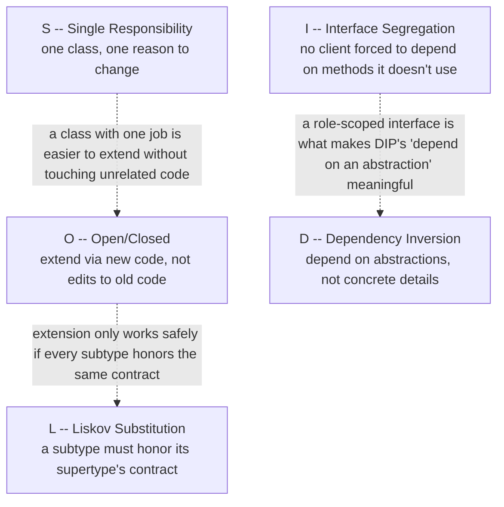
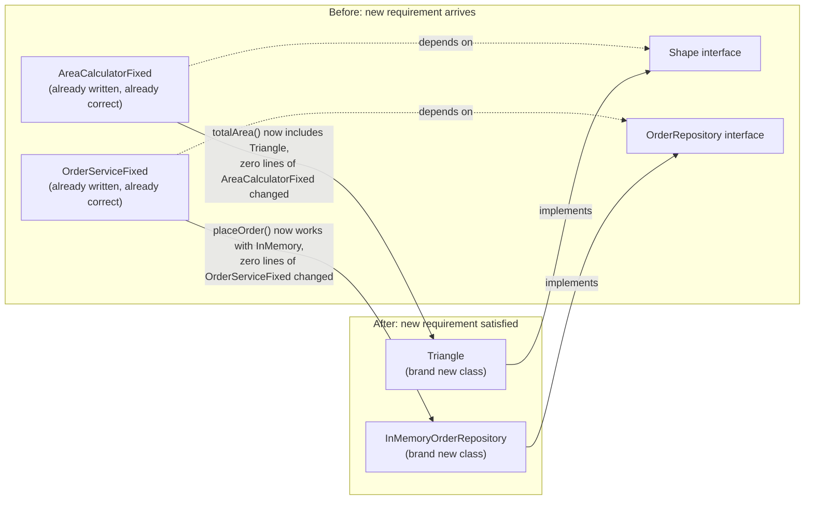

# SOLID Principles

> **Topic register:** T-1701 · Core tier · Very High interview frequency [H]

## Table of Contents

1. [Learning Objectives](#learning-objectives)
2. [Why This Matters in Interviews](#why-this-matters-in-interviews)
3. [Level 1 — Foundation](#level-1--foundation)
4. [Level 2 — Working Knowledge](#level-2--working-knowledge)
5. [Mental Model](#mental-model)
6. [Definition and Purpose](#definition-and-purpose)
7. [Core Concepts](#core-concepts)
8. [Internal Implementation](#internal-implementation)
9. [Diagrams](#diagrams)
10. [Production Scenarios](#production-scenarios)
11. [Failure Modes and Debugging](#failure-modes-and-debugging)
12. [Trade-offs](#trade-offs)
13. [Decision Framework](#decision-framework)
14. [Comparisons](#comparisons)
15. [Common Mistakes](#common-mistakes)
16. [Anti-Patterns](#anti-patterns)
17. [Best Practices](#best-practices)
18. [Interview Answer Framework](#interview-answer-framework)
19. [Interview Questions](#interview-questions)
20. [Summary](#summary)
21. [Key Takeaways](#key-takeaways)
22. [Cheat Sheet](#cheat-sheet)
23. [Flashcards](#flashcards)
24. [Practice Exercises](#practice-exercises)
25. [Solutions](#solutions)
26. [Additional Reading](#additional-reading)
27. [Official References](#official-references)

---

## Learning Objectives

By the end of this chapter you can state all five SOLID principles precisely (not just expand the acronym), explain the specific design smell each one names, and cite a real, compiling Java demonstration for each — a reflection-based view of one class carrying three responsibilities versus three carrying one each; a new shape class added with zero changes to an existing calculator; a real Liskov-violating assertion failure; a real `UnsupportedOperationException` from a fat interface; and one unmodified service class run against two different injected dependencies.

## Why This Matters in Interviews

SOLID questions are asked constantly, but most candidates can only recite the five expansions ("Single Responsibility... Open/Closed...") without being able to name the specific *symptom* each principle is a name for — a God class with too many reasons to change, a `switch`/`instanceof` chain that must be edited every time a new case appears, a subtype that silently breaks its parent's contract, a fat interface forcing empty or throwing method stubs, a high-level class that directly constructs its own dependencies and therefore can never be tested or reconfigured independently. Interviewers use SOLID both directly ("what does the Open/Closed Principle mean, give an example") and indirectly, embedded inside a design-patterns or code-review question ("why is this Strategy pattern a better fit than a big `if`/`else` chain here") — a candidate who can name the underlying principle a specific piece of code violates, not just recite the acronym, demonstrates the transferable understanding interviewers are actually screening for.

## Level 1 — Foundation

Think of designing a small business's staff. **Single Responsibility** says each employee should have one job — a cashier who also does the accounting and also fixes the plumbing is one person with three unrelated reasons to get pulled away from their actual work, and a mistake in any one of those three jobs disrupts all three. **Open/Closed** says you should be able to hire a new kind of specialist (a barista, say) without having to retrain every existing employee — the business should be extendable by *adding* new roles, not by editing everyone's job description each time. **Liskov Substitution** says if you advertise a job as "cashier," anyone you hire into that role needs to actually be able to run a register the way the job description promises — a "cashier" who refuses to handle cash breaks a promise the label itself made. **Interface Segregation** says a job posting shouldn't bundle unrelated skills nobody needs together — don't require every applicant to also know how to weld, just because one past hire happened to know welding. **Dependency Inversion** says a manager should give instructions in terms of the *role* ("whoever is on register today"), not insist on one specific named person — so the business keeps running smoothly even when today's cashier is out sick and someone else fills in.



The five principles aren't five independent rules to memorize in isolation — they reinforce each other, as the dotted arrows above suggest: a class that does one thing (S) is easier to extend without touching its existing code (O); extension only stays safe if every new subtype actually honors the shape's contract (L); and a small, role-scoped interface (I) is exactly what makes "depend on an abstraction, not a concrete detail" (D) a meaningful, checkable statement rather than a vague slogan.

## Level 2 — Working Knowledge

At this level you should be able to look at a short code snippet and name which SOLID principle it violates, not just recognize the principle by name when someone else names it first. The single most useful diagnostic habit: ask "what would I have to *edit* — not add — to support a new requirement here?" If the honest answer involves modifying an existing, already-working class (adding a new branch to a `switch`, adding a new `if (x instanceof Y)` check, adding a new method to an already-large interface), that's very often an Open/Closed or Interface Segregation violation waiting to be named.

You should also be comfortable with the practical, working distinction between Liskov Substitution and "does it compile." The classic Rectangle/Square example *compiles* fine — `Square extends Rectangle` is perfectly legal Java — but silently breaks any code written against `Rectangle`'s own behavioral contract (that `setWidth` and `setHeight` are independent). LSP is a *behavioral* contract, not a type-system one, which is exactly why a compiler can't catch a violation of it.

Practically, when reviewing a class's constructor, the working question worth asking is: "does this constructor build its own dependencies with `new`, or does it receive them?" A constructor that reaches for `new SomeConcreteThing()` internally has usually inverted the dependency the wrong way — the class can now never be given a different, substitutable implementation (a test double, a different backend) without editing its source.

## Mental Model

Keep one question per letter, and ask it about the specific piece of code in front of you. **S**: "how many genuinely different reasons would cause this class to change?" — more than one is a smell. **O**: "to support a plausible new case, would I add a new class, or edit an existing one?" — editing is the smell. **L**: "if I swap in any subtype here, does every promise the supertype's own callers were relying on still hold?" — a broken promise is the smell, even if the code compiles. **I**: "does every implementer of this interface actually need every method on it?" — an implementer with an empty or throwing stub is the smell. **D**: "does this high-level class name a concrete, specific low-level detail, or an abstraction it was handed?" — naming the concrete detail directly is the smell.

## Definition and Purpose

**SOLID** is an acronym for five object-oriented design principles, popularized by Robert C. Martin, aimed at producing code that is easier to understand, extend, and maintain as requirements change over time. **Single Responsibility Principle (SRP)**: a class should have only one reason to change. **Open/Closed Principle (OCP)**: software entities should be open for extension but closed for modification. **Liskov Substitution Principle (LSP)**: objects of a superclass should be replaceable with objects of a subclass without altering the correctness of the program. **Interface Segregation Principle (ISP)**: no client should be forced to depend on methods it does not use. **Dependency Inversion Principle (DIP)**: high-level modules should not depend on low-level modules — both should depend on abstractions.

## Core Concepts

### SRP's "reason to change" is about actors and axes of change, not literal method count

A class with five methods isn't automatically an SRP violation, and a class with one method isn't automatically compliant — the actual test is whether the class's various pieces of behavior are driven by genuinely different sources of change (a validation-rules change, a database-technology change, a notification-channel change are three independent axes, even if today they happen to live in one small class).

### OCP is achieved through abstraction, not through never touching a file again

"Closed for modification" doesn't mean a class can literally never be edited — it means the class's own already-correct behavior shouldn't need to change just to accommodate a new case that fits the same conceptual shape. The mechanism that makes this possible is polymorphism: code that depends on an interface, not a concrete enumeration of cases, doesn't need editing when a new implementer of that interface appears.

### LSP is a behavioral contract, and the compiler cannot verify it

Java's type system verifies that `Square extends Rectangle` satisfies `Square IS-A Rectangle` structurally — it compiles. It says nothing about whether `Square` actually honors every behavioral assumption code written against `Rectangle` might reasonably make (here, that `width` and `height` vary independently). This is exactly why LSP violations tend to surface as runtime bugs, not compile errors — the demo below reproduces one directly.

### ISP is what makes DIP's "abstraction" actually small enough to be useful

A single giant interface technically lets a high-level class "depend on an abstraction" and satisfy DIP's letter while still forcing every implementer to support methods it has no business supporting. ISP is the principle that keeps the abstractions DIP asks you to depend on genuinely role-scoped and minimal, rather than a fat interface in disguise.

## Internal Implementation

**Real SRP evidence** (`practice/java/solid-principles/src/SolidPrinciplesDemo.java`), via reflection over each class's own declared methods:

```
--- VIOLATION: UserManagerViolation's own declared methods (one class) ---
  [sendWelcomeEmail, saveToDatabase, validate]  <-- validation + persistence + notification, ALL in one class
--- FIXED: three separate classes, each with exactly one declared method ---
  UserValidator:    [validate]
  UserRepository:   [save]
  WelcomeNotifier:  [notifyUser]
```

**Real OCP evidence** — `Triangle` is added *after* `AreaCalculatorFixed` was already written; the demo file itself has zero `Triangle` references above `AreaCalculatorFixed`'s own definition, and the total still comes out correct:

```
--- FIXED: same shapes, via AreaCalculatorFixed (never touched since first written) ---
  total area (circle+square) = 21.57
--- FIXED: added Triangle -- a NEW class -- zero changes to AreaCalculatorFixed's source ---
  total area (circle+square+triangle) = 31.57
```

**Real LSP violation** — the classic Rectangle/Square case, with a real, failing invariant check:

```
  Rectangle : setWidth(5); setHeight(4); expected area=20, actual area=20  OK
  SquareLsp : setWidth(5); setHeight(4); expected area=20, actual area=16  VIOLATION -- setHeight silently changed width too
```

`SquareLsp extends Rectangle` compiles without a single warning — the violation is entirely behavioral, invisible to the type system, and only shows up when code written against `Rectangle`'s own contract actually runs against a `SquareLsp` instance.

**Real ISP violation** — a fat interface forces a real thrown exception:

```
--- VIOLATION: RobotWorkerViolation.eat() must exist to satisfy WorkerViolation, and throws ---
  Caught: UnsupportedOperationException: Robots don't eat
--- FIXED: RobotWorkerFixed implements only Workable -- no eat() method exists to call at all ---
  RobotWorkerFixed's declared methods: [work]
```

**Real DIP evidence** — the identical `OrderServiceFixed` class, run against two different injected implementations, with zero source changes between runs:

```
--- FIXED: identical OrderServiceFixed class, swapped repository via constructor injection ---
  [MySQL] INSERT order: order-2
  [InMemory] stored order: order-3 (list size=1)
  Same OrderServiceFixed.java, zero changes -- only the injected implementation differs.
```

## Diagrams

The OCP and DIP demos above share the same underlying shape — a fixed, unmodified piece of code (`AreaCalculatorFixed`, `OrderServiceFixed`) consuming new behavior through an interface it was already written against, rather than being edited to know about a new concrete type:



Both arrows into the "after" boxes point at brand-new classes, not at edits to the existing ones — that's the concrete, verifiable shape of "open for extension, closed for modification" (OCP) and "depend on an abstraction, not a concrete detail" (DIP) at once, since the same interface-based structure satisfies both principles simultaneously here.

## Production Scenarios

**A payment-processing service's `PaymentProcessor` class grows a new `if (paymentMethod.equals("APPLE_PAY"))` branch every time a new payment method is added, and a bug fix for PayPal's branch accidentally breaks Apple Pay's neighboring branch in the same method during a later change.** This is a live OCP violation: the class must be *edited* — not extended — for every new payment method, and because all the branches live in one method, an unrelated change has a real chance of breaking a case it wasn't even touching. The fix introduces a `PaymentMethod` interface with one implementation per payment method; `PaymentProcessor` iterates over registered implementations rather than branching on a string, and adding Google Pay becomes a new class, not an edit to `PaymentProcessor` or any of its existing, already-tested payment methods.

**A reporting service's `ReportGenerator` class directly constructs a `MySqlConnection` inside its constructor, and a team trying to write a unit test for the report-formatting logic finds they cannot run the test without a real, reachable MySQL database.** This is a live DIP violation, with a very concrete cost: the report-formatting logic (genuinely unit-testable in isolation) is coupled to a real database connection purely because of how the dependency was obtained, not because the formatting logic actually needs one. The fix — constructor-injecting a `DataSource` abstraction, exactly as `OrderServiceFixed`'s real demo does — lets the exact same test run against an in-memory fake instead, with zero changes to `ReportGenerator`'s own logic.

## Failure Modes and Debugging

- **Symptom: a small, unrelated bug fix in one part of a class breaks an entirely different feature that happens to live in the same class.** Check for an SRP violation first — if the class's various methods are driven by genuinely independent reasons to change, they're likely to interfere with each other exactly this way; the fix is splitting the class along those independent axes, not being more careful with future edits.
- **Symptom: every time a new case/type is added to the system, the same handful of existing, unrelated files need to be edited.** This is the direct, observable signature of an OCP violation — search for `switch`/`instanceof` chains or hardcoded enumerations of "known types" as the likely culprit, and replace the enumeration with polymorphism over a shared interface.
- **Anti-pattern to rule out first when a subtype passes all its own unit tests but causes failures wherever it's used polymorphically through its supertype:** this is the specific signature of an LSP violation — the subtype's own tests only verify its own behavior in isolation, never the supertype's contract as seen by *existing* client code, which is exactly the gap the Rectangle/Square demo makes concrete.

## Trade-offs

Applying every SOLID principle maximally, everywhere, produces real costs of its own — an interface for every class "just in case" it might need to vary later adds a layer of indirection that can make a small, genuinely simple system harder to read, not easier, and premature abstraction (introducing a seam nothing currently needs) is itself a recognized anti-pattern (see Anti-Patterns below). The principles are most valuable specifically at the points in a system that are known, from real experience or a real requirement, to vary — applying DIP to a class's one, permanent, never-swapped dependency is often unnecessary ceremony rather than a genuine design improvement.

## Decision Framework

Apply SRP by asking whether a class's methods are driven by genuinely independent reasons to change — if yes, split along those axes; if a class's methods all change together, in practice, for the same reasons, splitting them further is not automatically an improvement. Apply OCP specifically at points in the system with a demonstrated or clearly anticipated need to add new cases (payment methods, notification channels, shape types) — introducing an interface for a genuinely closed, unchanging set of cases is unnecessary indirection. Apply DIP at the boundaries between a class's core logic and a swappable detail (a specific database technology, a specific external API, anything a test needs to substitute) — not at every single collaborator a class happens to use internally, some of which may never need to vary at all.

## Comparisons

Two principles are frequently confused because both involve "not editing existing code," and two more are frequently confused because both involve interfaces — worth distinguishing precisely:

| Principle pair | How they're confused | The actual distinction |
|---|---|---|
| OCP vs. SRP | Both are cited as "the reason to split a class" | SRP is about a class doing too many *unrelated jobs at once*, today; OCP is about a class needing to be *edited* every time a new case of the *same* job appears over time |
| ISP vs. DIP | Both involve depending on an interface rather than a concrete class | ISP is about the *shape* of the interface (is it small and role-scoped, or fat); DIP is about the *direction* of the dependency (does the high-level class depend on the abstraction, or does the abstraction's concrete implementation get constructed directly inside the high-level class) — a fat interface can still technically satisfy DIP's letter while violating ISP |
| LSP vs. "does it compile" | Both are checked when reviewing an inheritance hierarchy | Compilation verifies the type-system relationship (`Square IS-A Rectangle`, structurally); LSP verifies the *behavioral* contract holds too — the Rectangle/Square demo compiles cleanly and still violates LSP |

## Common Mistakes

- Reciting the five expansions of the acronym without being able to name which principle a specific piece of code in front of you actually violates.
- Treating "uses an interface" as automatically satisfying both ISP and DIP — a fat interface (violating ISP) can still be injected as a dependency (technically satisfying DIP's letter, not its spirit).
- Applying every principle maximally everywhere, producing premature abstraction at points in the system with no real, demonstrated need to vary.
- Confusing LSP with "the code compiles" — Java's type system verifies the structural relationship, not the behavioral contract the Rectangle/Square example violates.

## Anti-Patterns

Introducing an interface, a factory, and a configuration mechanism for a dependency that has exactly one implementation and no realistic plan to ever have a second one — "speculative generality," applying DIP's mechanism without an actual axis of variation to justify it, adding real indirection cost for a benefit that never materializes.

## Best Practices

Use the "what would I have to edit, not add?" diagnostic question from this chapter's Level 2 section as a routine code-review habit for OCP and ISP violations specifically, since both tend to surface exactly there. Constructor-inject collaborators that represent a genuine, demonstrated axis of variation (per this chapter's Decision Framework) rather than defaulting every single dependency to an injected interface regardless of whether it will ever actually vary. When reviewing an inheritance hierarchy, explicitly ask what behavioral contract the supertype's existing callers rely on, and verify a new subtype honors it — not just that it compiles.

## Interview Answer Framework

### 30-Second Answer

SOLID is five object-oriented design principles: Single Responsibility (one class, one reason to change), Open/Closed (extend via new code, not edits to existing code), Liskov Substitution (a subtype must honor its supertype's behavioral contract, not just its type signature), Interface Segregation (no client forced to depend on methods it doesn't use), and Dependency Inversion (high-level code depends on abstractions, not concrete low-level details). Each names a specific, recognizable design smell, not just an abstract ideal.

### 2-Minute Answer

Definition: five principles for object-oriented design, each naming a specific maintainability smell. Why they exist: as requirements change over time, certain code shapes make change safe and localized (SOLID-compliant) while others make change require editing multiple unrelated places or risk breaking existing behavior (SOLID-violating). How they interact: SRP keeps a class focused enough to extend safely (enabling OCP); OCP is achieved through polymorphism, which only stays safe if subtypes honor their supertype's contract (LSP); a small, role-scoped interface (ISP) is what makes "depend on an abstraction" (DIP) meaningful rather than a fat interface in disguise. One trade-off: applying every principle maximally everywhere introduces real indirection cost without a real benefit at points in the system with no genuine need to vary. One production example: a `PaymentProcessor` growing a new `if` branch per payment method (a live OCP violation) where an unrelated bug fix in one branch broke a neighboring one, fixed by introducing a `PaymentMethod` interface so new methods become new classes, not edits to existing, already-tested code.

### 10-Minute Deep Dive

Cover: the specific design smell each principle names, illustrated by this chapter's five real demos (reflection-based SRP evidence, OCP's zero-edits Triangle addition, LSP's real failing invariant assertion, ISP's real thrown exception, DIP's identical class run against two injected implementations); why LSP is uniquely dangerous among the five, since it's a behavioral contract the compiler cannot verify, unlike the others which tend to surface as more obviously structural issues; the relationship between the principles (SRP enables safe OCP; ISP is what makes DIP's abstraction genuinely small); the trade-off of over-applying the principles (speculative generality) versus under-applying them (the payment-processor and report-generator production scenarios); the practical "what would I have to edit, not add?" diagnostic for spotting OCP/ISP violations during review.

### Whiteboard Explanation

Draw five small boxes in a row, one letter each. Under S, draw one box splitting into three smaller boxes labeled "validate / persist / notify." Under O, draw an existing box labeled "AreaCalculator" with an arrow pointing at a NEW box labeled "Triangle," explicitly not touching the AreaCalculator box. Under L, draw a supertype box with an arrow into two subtype boxes, one checked green ("honors the contract") and one checked red with an X ("breaks it, still compiles"). Under I, draw one fat interface splitting into two smaller ones. Under D, draw a high-level box with an arrow pointing at an abstraction box (not a concrete box), with two different concrete boxes both implementing that same abstraction below it.

### Production Example

A logging library's `Logger` class both formats log messages AND writes them directly to a hardcoded file path AND applies a hardcoded severity filter — three independent axes of change (message formatting, output destination, filtering policy) tangled into one class. A request to add console output alongside file output requires editing the same class that also handles formatting, and a later formatting bug fix accidentally changes filtering behavior because both live in code paths that share state. The fix splits the class along its three real axes (a `Formatter`, an `Appender` abstraction with `FileAppender`/`ConsoleAppender` implementations, and a separate `Filter`), directly mirroring this chapter's `UserManagerViolation` SRP demo at production scale.

### Trade-offs to Mention

Full SOLID compliance everywhere trades simplicity for extensibility at points in the system that may never actually need to extend; the principles pay off specifically at genuine, demonstrated axes of variation, and applying them everywhere indiscriminately produces real, unrewarded indirection cost (speculative generality).

### Common Candidate Mistakes

Reciting the five expansions without being able to name which principle a specific snippet violates; confusing "compiles" with LSP compliance; treating every use of an interface as automatically satisfying both ISP and DIP.

### Typical Follow-Up Questions

"Can you give an example where applying DIP would actually be overkill?" → a class's one, permanent, never-swapped, framework-provided dependency (e.g., `java.time.Clock.systemUTC()` in a script with no tests and no planned variation) — introducing an injected abstraction here is ceremony without a corresponding benefit. "Why is the Rectangle/Square example specifically about LSP rather than just 'bad inheritance'?" → because the violation is entirely behavioral — the code compiles and the type hierarchy is structurally valid — LSP is precisely the principle that names *behavioral* contract violations the type system itself cannot catch.

### Senior-Level Expectations

Correctly names which SOLID principle a given code smell violates, not just defines the five principles abstractly, and can propose a concrete refactor for each.

### Staff-Level Discussion

Recognizes the trade-off between under-applying SOLID (the payment-processor and report-generator scenarios' real costs) and over-applying it (speculative generality's real, unrewarded indirection cost), and can articulate *where* in a specific system's actual, demonstrated variation points the principles are worth applying versus where they're premature — a judgment call informed by the system's real change history, not a rule applied uniformly everywhere.

## Interview Questions

### Question 1

**Here's a class: `AreaCalculator.area(Object shape)` uses `if (shape instanceof Circle) ... else if (shape instanceof Square) ...`. A new requirement asks for triangle support. What SOLID principle does this design violate, and how would you fix it?**

**Expected answer:** this violates the Open/Closed Principle — supporting a new shape requires *editing* `AreaCalculator`'s existing, already-correct method rather than *adding* new code. The fix introduces a `Shape` interface with an `area()` method; each shape implements it; `AreaCalculator` sums over a `List<Shape>` polymorphically. Adding `Triangle` becomes a new class implementing `Shape`, with zero changes to `AreaCalculator` itself.

**Common mistakes:** naming Single Responsibility instead of Open/Closed — `AreaCalculator` genuinely has one job (calculate area); the problem is specifically that supporting new cases requires modification, not that the class does multiple unrelated things.

**Follow-up questions:** "Does this fix introduce any new risk?" (each new `Shape` implementation needs its own correctness verification — OCP doesn't eliminate the need for testing new code, it just isolates that testing from the already-correct existing code.)

**Senior-level expectations:** correctly identifies OCP specifically (not SRP or another principle) and proposes the interface-based fix.

**Staff-level expectations:** discusses when this fix would be overkill (a genuinely closed, permanently fixed set of shapes) versus warranted (an actively growing set of cases), per this chapter's Decision Framework.

### Question 2

**A `Square` class extends a `Rectangle` class, overriding `setWidth` and `setHeight` to keep both dimensions equal. The code compiles cleanly. Why might this still be a design problem?**

**Expected answer:** this is a Liskov Substitution Principle violation — `Square` compiles as a valid `Rectangle` subtype, but breaks a behavioral contract that existing code written against `Rectangle` may reasonably rely on (that `width` and `height` vary independently). Code that does `rect.setWidth(5); rect.setHeight(4); assert rect.area() == 20;` passes for a real `Rectangle` and silently fails for a `Square` substituted in its place — a real, demonstrated behavioral break invisible to the compiler.

**Common mistakes:** concluding "it compiles, so it's fine" — LSP is specifically about the gap between structural (compiler-checked) and behavioral (not compiler-checked) correctness.

**Follow-up questions:** "How would you redesign this to avoid the violation entirely?" (remove the inheritance relationship — `Square` and `Rectangle` both implement a shared `Shape` interface independently, with no shared mutable base class whose contract could be violated, exactly as this chapter's real fix does.)

**Senior-level expectations:** correctly identifies this as an LSP violation and explains why the compiler can't catch it.

**Staff-level expectations:** proposes the composition-over-inheritance-style fix (independent implementations of a shared interface) rather than a narrower patch within the existing hierarchy.

## Summary

SOLID names five object-oriented design principles, each corresponding to a specific, recognizable maintainability smell rather than an abstract ideal: SRP (one class, one reason to change), OCP (extend via new code, not edits to existing code), LSP (a subtype must honor its supertype's behavioral contract, which the compiler cannot verify), ISP (no client forced to depend on methods it doesn't use), and DIP (high-level code depends on abstractions, not concrete details). All five were demonstrated with real, compiling Java evidence: a reflection-based view of a class carrying three unrelated responsibilities versus three carrying one each; a new shape class added with zero edits to an existing, already-correct calculator; a real assertion failure from the classic Rectangle/Square LSP violation; a real thrown exception from a fat interface; and one unmodified service class run successfully against two different injected dependencies. The principles reinforce each other (SRP enables safe OCP; ISP is what makes DIP's abstraction genuinely useful) but are not free — applying them at points in a system with no genuine, demonstrated need to vary produces real, unrewarded indirection cost.

## Key Takeaways

- Each SOLID principle names a specific, recognizable design smell — being able to identify *which* principle a piece of code violates is the actual interview skill, not reciting the acronym.
- OCP is achieved through polymorphism: code depending on an interface doesn't need editing when a new implementer appears; the real demo proves this by adding `Triangle` with zero changes to `AreaCalculatorFixed`.
- LSP is a behavioral contract the compiler cannot verify — the classic Rectangle/Square example compiles cleanly and still fails a real invariant test.
- ISP keeps interfaces small and role-scoped; DIP is about the direction of a dependency — a fat interface can technically satisfy DIP's letter while violating ISP.
- Applying SOLID maximally everywhere is itself an anti-pattern (speculative generality) — the principles pay off at genuine, demonstrated points of variation, not universally.

## Cheat Sheet

| Letter | Principle | Smell it names | Real fix mechanism |
|---|---|---|---|
| S | Single Responsibility | One class, multiple unrelated reasons to change | Split along independent axes of change |
| O | Open/Closed | Must edit existing code to support a new case | Depend on an interface; new cases become new classes |
| L | Liskov Substitution | A subtype compiles but breaks the supertype's behavioral contract | Verify behavioral contracts, not just type compatibility; prefer composition when a hierarchy can't honor a shared contract |
| I | Interface Segregation | A fat interface forces unused/throwing method stubs | Split into small, role-scoped interfaces |
| D | Dependency Inversion | A high-level class directly constructs a concrete low-level detail | Constructor-inject an abstraction instead |

## Flashcards

**Q: What's the difference between an OCP violation and an SRP violation?**
A: SRP is about a class doing multiple unrelated jobs *today*; OCP is about needing to *edit* a class every time a new case of the *same* job appears over time.

**Q: Why can't the compiler catch a Liskov Substitution violation?**
A: LSP is a behavioral contract, not a type-system one — `Square extends Rectangle` is structurally valid and compiles cleanly even though it breaks `Rectangle`'s own behavioral assumptions.

**Q: Can a class satisfy Dependency Inversion's letter while still violating Interface Segregation?**
A: Yes — injecting a fat interface as a dependency technically satisfies "depend on an abstraction," but the fat interface itself still forces implementers to support methods they don't need, violating ISP.

## Practice Exercises

1. Reproduce `SolidPrinciplesDemo.java`'s OCP section and add a `Rhombus` shape, confirming (by inspecting the diff) that zero lines of `AreaCalculatorFixed` needed to change.
2. Take the DIP section's `OrderServiceFixed` and write a real JUnit test that injects `InMemoryOrderRepository` and asserts the order was recorded — confirming, concretely, that the constructor-injection fix is what makes this class unit-testable without a real database.

## Solutions

1. `Rhombus` implements `Shape` with its own `area()` method (e.g., via diagonals); adding it to the `List<Shape>` passed to `AreaCalculatorFixed.totalArea()` correctly includes it in the sum, and `AreaCalculatorFixed`'s own source requires zero edits — the same structural evidence the chapter's own `Triangle` addition demonstrates.
2. `new OrderServiceFixed(new InMemoryOrderRepository()).placeOrder("test-order")` followed by asserting the injected repository's internal list contains `"test-order"` requires no database, no mocking framework, and no changes to `OrderServiceFixed` — directly demonstrating DIP's practical payoff for testability.

## Additional Reading

- Robert C. Martin, *Agile Software Development, Principles, Patterns, and Practices* — the original source of the SOLID acronym's five principles.

## Official References

- [The Java Language Specification, SE 21 — Interfaces](https://docs.oracle.com/javase/specs/jls/se21/html/jls-9.html)
