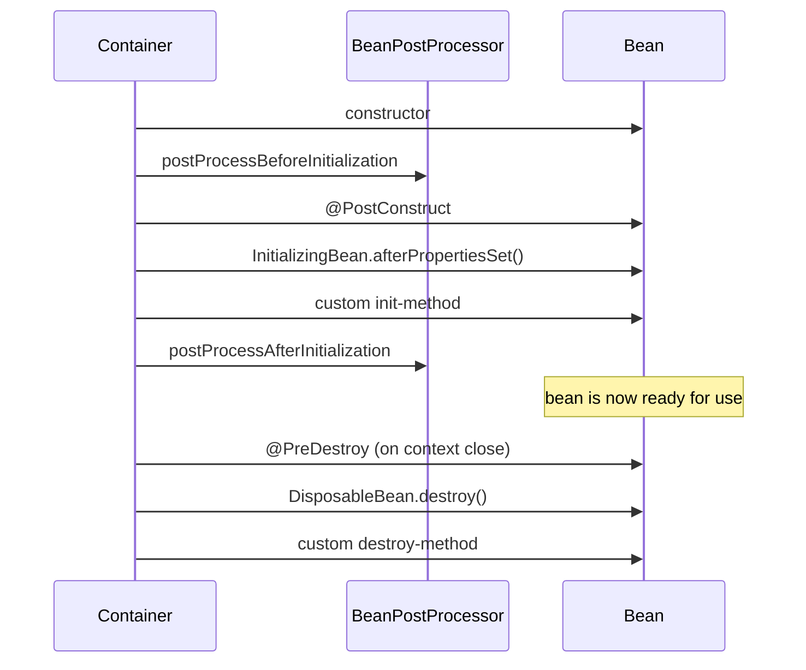

# Spring Auto-Configuration and Bean Lifecycle

> **Topic register:** T-506/T-501 · IWI 7.30 · Advanced tier · Prerequisite: [Transactional Proxy Mechanics and Propagation](transactional-proxy-mechanics-and-propagation.md) — auto-configuration and proxying are two different mechanisms that interact
> **Provenance:** the lifecycle order and the `@Async`+`@Transactional` behavior in this chapter are real, executed Spring Framework 6.1.14 output. Reproducible source: [`practice/java/week-07/spring-internals/`](../../practice/java/week-07/spring-internals/).

## Table of Contents

1. [Learning Objectives](#learning-objectives)
2. [Why This Matters in Interviews](#why-this-matters-in-interviews)
3. [Level 1 — Foundation](#level-1--foundation)
4. [Level 2 — Working Knowledge](#level-2--working-knowledge)
5. [Mental Model](#mental-model)
6. [Definition and Purpose](#definition-and-purpose)
7. [Core Concepts](#core-concepts)
8. [Internal Implementation](#internal-implementation)
9. [Diagrams](#diagrams)
10. [Java Examples](#java-examples)
11. [Production Scenarios](#production-scenarios)
12. [Trade-offs](#trade-offs)
13. [Decision Framework](#decision-framework)
14. [Common Mistakes](#common-mistakes)
15. [Anti-Patterns](#anti-patterns)
16. [Best Practices](#best-practices)
17. [Interview Answer Framework](#interview-answer-framework)
18. [Interview Questions](#interview-questions)
19. [Summary](#summary)
20. [Key Takeaways](#key-takeaways)
21. [Cheat Sheet](#cheat-sheet)
22. [Flashcards](#flashcards)
23. [Practice Exercises](#practice-exercises)
24. [Solutions](#solutions)
25. [Additional Reading](#additional-reading)
26. [Official References](#official-references)

---

## Learning Objectives

By the end of this chapter you can:

- Recite the real, observed bean lifecycle order and explain why `BeanPostProcessor` runs before `@PostConstruct`.
- Explain exactly which hook creates a `@Transactional` proxy, and why that determines what gets injected everywhere else.
- Explain why `@ConditionalOnMissingBean` requires auto-configuration to run after application configuration, and what breaks if that ordering were reversed.
- Reproduce and explain the `@Async` + `@Transactional` gotcha: why the transaction is correct but its failure is invisible to the caller.

## Why This Matters in Interviews

Auto-configuration and bean lifecycle questions test whether a candidate has only used Spring Boot's conveniences or actually understands the mechanism underneath them. The `@Async`+`@Transactional` gotcha specifically is a near-universal real-world trap — most Spring codebases have at least one instance of it — and a candidate who can explain precisely *why* it's surprising (visibility, not correctness) demonstrates operational depth beyond "I've used `@Transactional`."

## Level 1 — Foundation

**Every object Spring manages ("bean") goes through the same fixed sequence of steps** — created, wired up with its dependencies, initialized, ready for use, and eventually destroyed when the application shuts down — and you can hook into specific steps to run your own setup or cleanup logic at exactly the right moment. `@PostConstruct` is the everyday hook for "run this once my dependencies have been injected" — the most common lifecycle hook a working engineer actually writes.

**Auto-configuration** is Spring Boot's related but separate convenience: it automatically sets up common things (a database connection, a web server) for you based on what's on your project's classpath, unless you've already configured that thing yourself — in which case Spring Boot quietly backs off and uses your configuration instead.

## Level 2 — Working Knowledge

**The everyday, practical use of `@PostConstruct`**: mark a method with it when you need setup logic that depends on injected fields already being populated (a constructor runs *before* dependency injection completes for field injection, so `@PostConstruct` is the right place for logic that needs those fields ready).

**A practical, common scenario**: if Spring Boot auto-configured something you'd rather control yourself (say, a `DataSource` with settings you want to customize), you don't need to explicitly "turn off" auto-configuration — just define your own bean of that type in your own `@Configuration` class, and Spring Boot's `@ConditionalOnMissingBean` guard automatically detects your bean already exists and skips its own default. This is the standard, idiomatic way to override exactly one piece of Spring Boot's auto-configured behavior without disabling the rest.

## Mental Model

**Every Spring bean goes through the same fixed assembly line, and every framework feature you rely on (transactions, validation, security) is implemented by hooking into a specific station on that line.** Auto-configuration is a separate, later concern: a set of conditionally-applied `@Configuration` classes that only take effect if the application hasn't already supplied its own answer. Understanding both means understanding not just *that* `@Transactional` works, but *which exact moment* in the assembly line makes it work — and that same precision is what explains why `@Async` interacts with it the way it does.

## Definition and Purpose

Every Spring bean passes through a fixed sequence of lifecycle callbacks between construction and being ready for use, and a mirrored sequence on shutdown. **Auto-configuration** is a separate mechanism layered on top: a set of `@Configuration` classes, each guarded by conditions (`@ConditionalOnClass`, `@ConditionalOnMissingBean`, etc.), that Spring Boot evaluates and applies automatically based on what's on the classpath and what the application has already defined itself.

The lifecycle callbacks exist because different integration points need to hook in at different, precise moments: a `BeanPostProcessor` needs to run *before* any bean's own initialization to have a chance to wrap or modify it (this is literally how `@Transactional` proxies get created); `@PostConstruct` needs to run *after* dependency injection completes, since it typically uses injected fields. Auto-configuration exists to eliminate boilerplate `@Configuration` classes for common integrations (a `DataSource`, a `JdbcTemplate`, a `RestTemplate`) while still allowing the application to override any of it by simply defining its own bean.

## Core Concepts

### The lifecycle order is fixed and observable

Constructor, then `BeanPostProcessor.postProcessBeforeInitialization`, then `@PostConstruct`, then `InitializingBean.afterPropertiesSet()`, then a custom init-method, then `BeanPostProcessor.postProcessAfterInitialization` — at which point the bean is ready for use. Shutdown mirrors this: `@PreDestroy`, then `DisposableBean.destroy()`, then a custom destroy-method.

### The `@Transactional` proxy is created before `@PostConstruct` even runs

`postProcessBeforeInitialization` is the exact hook transaction management's `BeanPostProcessor` uses — it wraps the raw bean in a proxy *before* `@PostConstruct` runs, which is why the proxy, not the raw object, is what gets injected everywhere else in the container.

### `@ConditionalOnMissingBean` depends on an ordering guarantee

Auto-configuration classes are processed *after* application-defined configuration. This ordering is what makes `@ConditionalOnMissingBean` reliable: if the application already defined its own bean of that type, the condition is false and the auto-configured default is silently skipped. This is what lets a developer override exactly one bean without disabling auto-configuration entirely.

### `@Async` + `@Transactional` produces a correct transaction with an invisible failure

Stacking `@Async` and `@Transactional` on the same method is a well-known real gotcha — the transaction itself works correctly (it starts on whichever thread the async executor actually runs the method on), but a `void @Async` method returns to its caller **immediately**, before the transactional work even executes. Any failure — including a correct rollback — happens invisibly on the background thread.

## Internal Implementation

**Real, observed lifecycle output** ([`BeanLifecycleDemo.java`](../../practice/java/week-07/spring-internals/BeanLifecycleDemo.java)):

```
3. constructor
4. BeanPostProcessor.postProcessBeforeInitialization
5. @PostConstruct
6. InitializingBean.afterPropertiesSet()
7. custom init-method (from @Bean(initMethod=...))
8. BeanPostProcessor.postProcessAfterInitialization
(context fully refreshed -- bean is now ready for use)
9. @PreDestroy
10. DisposableBean.destroy()
11. custom destroy-method (from @Bean(destroyMethod=...))
```

**The `@Async` + `@Transactional` gotcha, reproduced** — real output:

```
Calling the @Async @Transactional method...
Call returned after 12ms. Exception visible to caller: false
(At this point the caller has NO idea whether the operation succeeded, failed, or is still running on the async executor thread.)

[test observer] async work actually completed: true
GRAVE: Unexpected exception occurred invoking async method: ...
[test observer] row count after the exception: 0 (0 means the transaction correctly rolled back, even though it ran on a different thread)
```

**Reading this precisely:** the transaction is entirely correct (row count 0 confirms the rollback). The "unexpected" part is purely about *visibility*: the caller's method call returned in 12ms with no exception, and the actual failure — including the real rollback — happened invisibly on a background thread, surfaced only in Spring's default uncaught-exception log line. A caller relying on a try/catch around this call to detect failure will never see one.

## Diagrams



## Java Examples

```java
// Spring Framework 6.1.x. An auto-configuration class: a normal
// @Configuration class, activated conditionally.
@Configuration
@ConditionalOnClass(DataSource.class)          // only if DataSource is on the classpath
@ConditionalOnMissingBean(DataSource.class)     // only if the application hasn't defined its own
public class DataSourceAutoConfiguration {
    @Bean
    DataSource dataSource() { /* sensible default */ return null; }
}
```

```java
// Spring Framework 6.1.x. The @Async + @Transactional gotcha: the
// transaction is correct, but a void return type hides the failure
// from the caller entirely.
@Async
@Transactional
public void doWorkAndFail() {
    jdbc.update("INSERT INTO work_log (id) VALUES (1)");
    throw new RuntimeException("simulated failure");
}

// Fix: return a CompletableFuture so the caller can observe the outcome.
@Async
@Transactional
public CompletableFuture<Void> doWorkAndFailObservably() {
    jdbc.update("INSERT INTO work_log (id) VALUES (1)");
    if (somethingWentWrong()) {
        return CompletableFuture.failedFuture(new RuntimeException("simulated failure"));
    }
    return CompletableFuture.completedFuture(null);
}
```

**Complexity note:** every operation here is `O(1)` bookkeeping around bean creation; this chapter's value is in the ordering guarantees, not algorithmic cost.

## Production Scenarios

### Scenario: a background job's silent failures go unnoticed for weeks because of the `@Async`+`@Transactional` gotcha

**Symptoms.** A nightly reconciliation job invokes a service method annotated `@Async` and `@Transactional` that occasionally throws (a downstream validation failure on malformed input). The calling code wraps the call in a try/catch expecting to log and alert on failure. No alerts ever fire, yet a data audit weeks later reveals a small, steady percentage of reconciliation records were never processed.

**Impact.** A real, recurring data-processing failure goes completely unnoticed for weeks because the failure-detection mechanism (the try/catch) was structurally incapable of seeing it.

**Initial hypotheses.** The reconciliation logic itself silently swallows errors (checked — the method body has no catch block, it lets exceptions propagate); the scheduler isn't invoking the job at all on affected records (checked — logs confirm the job runs on every record); the `@Async` return type hides the exception from the caller (correct).

**Evidence.** Spring's default logs show `Unexpected exception occurred invoking async method` entries at the exact times affected records were skipped, but the calling code's try/catch — which should have caught and alerted on exactly this — never triggered, because the annotated method returns `void` and the async invocation returns to the caller long before the exception is thrown.

**Diagnosis.** Exactly this chapter's measured gotcha: the transaction correctly rolled back on failure (data integrity was never at risk), but the void return type meant the caller's exception-handling code was checking a code path that had already returned successfully by the time the real work — and its failure — happened on a different thread.

**Immediate mitigation.** Add alerting directly on Spring's `AsyncUncaughtExceptionHandler` (a global hook designed for exactly this class of otherwise-invisible failure) so future occurrences are caught immediately rather than discovered via audit.

**Permanent remediation.** Change the method's signature to return `CompletableFuture<Void>` and have the caller explicitly handle the future's exception path, restoring real visibility into success/failure for this specific call site.

**Alternatives considered.** Removing `@Async` entirely — rejected, since the reconciliation job's throughput genuinely benefits from asynchronous execution; the fix is restoring visibility, not removing the mechanism that caused the blind spot.

**Trade-offs.** Returning `CompletableFuture<Void>` requires the caller to actually call `.get()` or attach a callback — if that discipline lapses again, the same blind spot silently returns; a global `AsyncUncaughtExceptionHandler` is a more robust safety net precisely because it doesn't depend on every call site remembering to check.

**Prevention.** Configure a custom `AsyncUncaughtExceptionHandler` as a standing default for every `@Async` method in the codebase, so visibility into failures doesn't depend on each call site's discipline; treat a `void`-returning `@Async` method as a code-review flag by default.

**Interview lesson.** This is Interview Question 1's scenario at real production scale: a mechanism that's transactionally correct but observably silent, causing a real data-quality gap that took a manual audit — not monitoring — to surface.

## Trade-offs

| Approach | Benefit | Cost |
|---|---|---|
| `@PostConstruct`/`@PreDestroy` | Simple, annotation-based, no Spring-specific interface needed | Runs only within a Spring-managed bean; not portable to non-Spring construction |
| `InitializingBean`/`DisposableBean` | Explicit, typed interface | Couples the class directly to Spring's API |
| `@Async` alone (returning `void`) | Simplest fire-and-forget syntax | No way for the caller to observe success, failure, or completion at all |
| `@Async` returning `CompletableFuture` | Caller can observe success/failure via `.get()`/exception handling | Requires the caller to actually call `.get()` or attach a callback — easy to forget, silently reverting to the same blind-spot |

## Decision Framework

1. **Does this bean need to hook a lifecycle moment other frameworks/tools might also need to portably recognize?** Prefer `@PostConstruct`/`@PreDestroy` (portable annotations) over `InitializingBean`/`DisposableBean` (Spring-coupled interfaces) unless a specific reason favors the interface.
2. **Is this `@Async` method's return type `void`?** If the caller needs any visibility into success/failure, change it to `CompletableFuture<T>` (or configure a global `AsyncUncaughtExceptionHandler` as a safety net).
3. **Is a bean conditionally auto-configured** (`@ConditionalOnMissingBean`)? Verify the application's own equivalent bean, if any, is defined in regular `@Configuration`, not itself conditionally in a way that could race with the auto-configuration ordering.
4. **Does this class rely on another bean's `@PostConstruct` having already completed?** Don't assume cross-bean initialization order beyond what dependency injection itself guarantees — use an explicit `@DependsOn` or restructure instead.

## Common Mistakes

- Believing `@Transactional` "doesn't work" on `@Async` methods — it works; the surprise is about visibility, not correctness.
- Using `@PostConstruct` for logic that depends on other beans' own `@PostConstruct` having already run — initialization order across beans isn't guaranteed by lifecycle phase alone.
- Assuming auto-configuration can't be overridden without disabling it entirely — `@ConditionalOnMissingBean` exists specifically so a single bean can be overridden.

## Anti-Patterns

- **Returning `void` from an `@Async` method that can fail**, with no global `AsyncUncaughtExceptionHandler` as a safety net — a silent, undetectable failure mode by construction.
- **Relying on undocumented cross-bean `@PostConstruct` ordering** instead of an explicit `@DependsOn` or restructuring to remove the dependency.
- **Disabling an entire auto-configuration class** to override one bean, instead of simply defining that one bean and letting `@ConditionalOnMissingBean` skip the auto-configured default.

## Best Practices

- Prefer `CompletableFuture<T>` return types for any `@Async` method whose failure the caller needs to observe.
- Configure a global `AsyncUncaughtExceptionHandler` as a standing safety net, independent of individual call-site discipline.
- Override exactly one auto-configured bean by defining it directly, rather than disabling the surrounding auto-configuration class.
- Treat lifecycle-callback ordering as a contract other beans and framework features rely on — don't build logic that assumes an unstated ordering across unrelated beans.

## Interview Answer Framework

### 30-Second Answer

Beans go through a fixed lifecycle: constructor, `BeanPostProcessor.before`, `@PostConstruct`, `InitializingBean`, custom init, `BeanPostProcessor.after` — `@Transactional`'s proxy is created at the `BeanPostProcessor.before` step, before `@PostConstruct` even runs. Auto-configuration runs after application config specifically so `@ConditionalOnMissingBean` can detect an override. `@Async` + `@Transactional` produces a correct transaction with an invisible failure, since a void async method returns before the work executes.

### 2-Minute Answer

Definition: every bean passes through a fixed lifecycle of callbacks; auto-configuration is a separate, conditional layer on top. Why it exists: different integration points (proxying, injection-dependent init) need to hook in at different precise moments; auto-configuration eliminates boilerplate while staying overridable. How it works: `BeanPostProcessor` wraps beans in proxies before `@PostConstruct` runs; `@ConditionalOnMissingBean` relies on auto-configuration running after application config. One important trade-off: a void `@Async` method gives the caller zero visibility into success or failure. Production example: a real measured trace showing a `@Transactional` `@Async` method returning in 12ms with no visible exception, while the transaction correctly rolled back invisibly on a background thread.

### 10-Minute Deep Dive

Cover, in order: the mental model — every framework feature hooks a specific lifecycle station (mental model); the measured, real lifecycle order and exactly where the `@Transactional` proxy gets created (internals, real evidence); the `@ConditionalOnMissingBean` ordering guarantee and what breaks if reversed (core concepts); the measured `@Async`+`@Transactional` gotcha, precisely separating transactional correctness from caller visibility (internals, real evidence); the `CompletableFuture` and `AsyncUncaughtExceptionHandler` fixes (trade-offs); and close with the production scenario — weeks of silently-skipped reconciliation records caused by exactly this visibility gap.

### Whiteboard Explanation

Draw the [§ Diagrams](#diagrams) sequence: Container → Bean (constructor) → BeanPostProcessor (before) → Bean (`@PostConstruct`, `InitializingBean`, custom init) → BeanPostProcessor (after) → "ready for use." Circle the `BeanPostProcessor.before` step and annotate "this is where `@Transactional`'s proxy gets created — before the bean has even run its own init logic."

### Production Example

The silent reconciliation failures in [§ Production Scenarios](#production-scenarios): a void-returning `@Async` `@Transactional` method's failures went undetected for weeks because the caller's try/catch structurally could not see them — fixed by returning `CompletableFuture<Void>` and adding a global `AsyncUncaughtExceptionHandler`.

### Trade-offs to Mention

State unprompted: a void `@Async` method gives the caller zero failure visibility, regardless of how correct the underlying transaction is; `@ConditionalOnMissingBean`'s reliability depends entirely on an ordering guarantee, not magic; overriding one auto-configured bean doesn't require disabling the whole auto-configuration class.

### Common Candidate Mistakes

Claiming `@Transactional` "doesn't work" under `@Async`; not knowing which specific lifecycle hook creates the `@Transactional` proxy; assuming cross-bean `@PostConstruct` ordering is guaranteed.

### Typical Follow-Up Questions

1. "How would you fix this so the caller can react to the failure?"
2. "What would break if auto-configuration ran BEFORE application config?"
3. "What initialization-order guarantees does Spring actually make across unrelated beans?"

### Senior-Level Expectations

Correctly separates "the transaction rolled back correctly" from "the caller can't see it"; states the `@ConditionalOnMissingBean` ordering guarantee.

### Staff-Level Discussion

The `@Async`+`@Transactional` gotcha is a specific instance of a general Staff-level principle: any mechanism that changes which thread executes code changes what "the caller" can observe, and every async boundary in a system needs an explicit answer to "how does the caller find out this failed." This is the same underlying concern as network-level distributed failure modes (ambiguity about whether an operation succeeded) recreated *within a single process* — the fix (a `CompletableFuture` the caller actually awaits) is the in-process analogue of an idempotency-key mechanism: moving the burden of resolving ambiguity to a mechanism designed for it, rather than hoping a bare method call communicates enough.

## Interview Questions

### Question 1 — Explain why `@Transactional` on an `@Async` method behaves unexpectedly.

**Why interviewers ask it.** A near-universal real-world Spring trap; tests whether the candidate separates transactional correctness from caller visibility.

**Expected answer.** The transaction itself works correctly on the executor thread, but a void async method returns to its caller before the work runs, so any failure (including the correct rollback) is invisible to the caller unless a `Future`/`CompletableFuture` is used and awaited.

**Minimum acceptable answer.** States that the caller can't see the failure, even without precisely explaining the transaction's own correctness.

**Strong Senior answer.** Correctly separates "the transaction rolled back correctly" from "the caller can't see it."

**Staff-level extension.** Proposes returning `CompletableFuture<T>` (or a custom `AsyncUncaughtExceptionHandler` for void methods) and states the trade-off of each fix.

**Common mistakes.** Claiming the transaction itself doesn't work correctly — it does; the surprise is about caller visibility, not transactional correctness.

**Likely follow-ups.** "How would you fix this so the caller can react to the failure?"

**Evaluation criteria (1–5).** 1: claims the transaction is broken. 3: correctly separates correctness from visibility. 5: correct separation plus both fixes with their trade-offs.

**Related references.** [§ Internal Implementation](#internal-implementation); [§ Production Scenarios](#production-scenarios).

---

### Question 2 — What does `@ConditionalOnMissingBean` actually guarantee about ordering?

**Why interviewers ask it.** Tests whether the candidate understands the mechanism behind auto-configuration's overridability, not just that it "works."

**Expected answer.** Auto-configuration classes are processed after application-defined configuration, so the condition correctly reflects whether the application already supplied its own bean.

**Minimum acceptable answer.** States that auto-configuration runs after application config, even without stating why that matters.

**Strong Senior answer.** States the ordering guarantee.

**Staff-level extension.** Explains the failure mode if the ordering were reversed — the application's own bean definition would arrive too late to prevent the auto-configured default from also being created, likely producing a bean-conflict error or silently the wrong bean winning depending on definition order.

**Common mistakes.** Describing the condition without the ordering guarantee that makes it reliable.

**Likely follow-ups.** "What would break if auto-configuration ran BEFORE application config?"

**Evaluation criteria (1–5).** 1: describes the annotation without the ordering guarantee. 3: states the ordering guarantee. 5: correct statement plus the reversed-ordering failure mode.

**Related references.** [§ Core Concepts](#core-concepts).

## Summary

Bean lifecycle callbacks fire in a fixed, observable order — constructor, `BeanPostProcessor.before`, `@PostConstruct`, `InitializingBean`, custom init-method, `BeanPostProcessor.after`, then the mirror sequence on shutdown. Auto-configuration layers conditional bean creation on top, ordered to run after application configuration specifically so `@ConditionalOnMissingBean` reliably detects an application override. Stacking `@Async` and `@Transactional` produces a correct transaction with an invisible failure path — reproduced with real numbers (12ms return, no exception visible, correct rollback happening silently).

## Key Takeaways

- Lifecycle order: constructor → `BeanPostProcessor.before` → `@PostConstruct` → `InitializingBean` → custom init → `BeanPostProcessor.after`.
- `@Transactional`'s proxy is created via a `BeanPostProcessor`, before `@PostConstruct` even runs.
- `@ConditionalOnMissingBean` relies on auto-configuration running after application configuration.
- `@Async` + `@Transactional`: the transaction is correct; the caller's visibility into failure is the actual gotcha.

## Cheat Sheet

| Need | Mechanism |
|---|---|
| Hook before dependency injection completes | Not possible via standard callbacks — use a `BeanPostProcessor` |
| Hook after injection, using injected fields | `@PostConstruct` |
| Wrap/modify a bean before its own init logic runs | `BeanPostProcessor.postProcessBeforeInitialization` (how `@Transactional` proxies are made) |
| Override exactly one auto-configured bean | Define that bean directly — `@ConditionalOnMissingBean` skips the default |
| Observe an `@Async` method's success/failure | Return `CompletableFuture<T>`, or configure `AsyncUncaughtExceptionHandler` |

## Flashcards

### Card: Correct bean lifecycle order

**Prompt:**
What's the correct bean lifecycle order?

**Answer:**
Constructor → `BeanPostProcessor.before` → `@PostConstruct` → `InitializingBean.afterPropertiesSet()` → custom init-method → `BeanPostProcessor.after`.

**Why it matters:**
The fixed sequence every framework feature (transactions, validation) hooks into at a specific point.

**Common trap:**
Assuming `@PostConstruct` runs before any proxy wrapping occurs.

**Related:**
[Internal Implementation](#internal-implementation)

### Card: What creates a @Transactional proxy

**Prompt:**
What mechanism creates a `@Transactional` proxy?

**Answer:**
A `BeanPostProcessor`, running in `postProcessBeforeInitialization` — before `@PostConstruct`.

**Why it matters:**
Explains why the proxy, not the raw bean, is what's injected everywhere else in the container.

**Common trap:**
Assuming the proxy is created lazily at first method call rather than during bean initialization.

**Related:**
[Core Concepts](#core-concepts)

### Card: The @Async + @Transactional gotcha

**Prompt:**
Is `@Transactional` broken on an `@Async` method?

**Answer:**
No — the transaction works correctly; the caller just can't see a void method's failure without a `Future`/`CompletableFuture`.

**Why it matters:**
A near-universal real-world Spring trap that looks like a transaction bug but is actually a visibility gap.

**Common trap:**
Concluding the transaction itself is broken rather than identifying the visibility gap.

**Related:**
[Production Scenarios](#production-scenarios)

## Practice Exercises

1. Reproduce both demos yourself: [`practice/java/week-07/spring-internals/`](../../practice/java/week-07/spring-internals/).
2. Modify `AsyncTransactionalDemo` to return a `CompletableFuture<Void>` instead of `void`, and confirm the caller can now observe the exception via `.get()`.
3. Add a second `BeanPostProcessor` to the lifecycle demo and confirm both processors' before/after callbacks interleave in registration order.

## Solutions

**Exercise 1.** Expected output matches this chapter's measured traces: the lifecycle demo prints the fixed order shown in [§ Internal Implementation](#internal-implementation); the async/transactional demo returns in ~12ms with no visible exception while the transaction correctly rolls back (row count 0).

**Exercise 2.** Changing the return type to `CompletableFuture<Void>` and having the caller call `.get()` (or attach a `.exceptionally()` callback) surfaces the underlying `RuntimeException` at the caller, wrapped in an `ExecutionException` — restoring the visibility a void return type structurally cannot provide.

**Exercise 3.** Two registered `BeanPostProcessor` beans run their `postProcessBeforeInitialization` callbacks in registration order, then the bean's own init logic runs, then both processors' `postProcessAfterInitialization` callbacks run, again in registration order — the two processors interleave around the bean's own init step, not around each other.

## Additional Reading

- [Spring Framework documentation — Bean Factory](https://docs.spring.io/spring-framework/reference/core/beans/factory-nature.html)

## Official References

- [Spring Framework documentation — Task Execution and Scheduling (`@Async`)](https://docs.spring.io/spring-framework/reference/integration/scheduling.html)
- [Spring Boot documentation — Auto-configuration](https://docs.spring.io/spring-boot/reference/using/auto-configuration.html)
