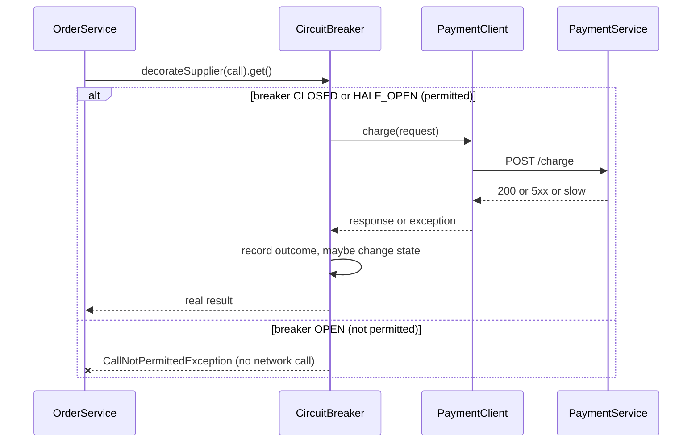

# Microservices Patterns with Spring Boot

> **Topic register:** T-519 · Core tier · High interview frequency [H] — gap-audit addition (2026-09-16): this
> repository already taught microservices patterns as language-agnostic system design
> (`../11-system-design/resilience-patterns.md`, `../11-system-design/load-balancing-service-discovery-and-health-checking.md`,
> `../07-api-design/api-gateway-bff-and-edge-concerns.md`) and taught Spring Boot as a framework
> (`05-spring`'s other 12 chapters), but never connected the two — nothing showed how you actually
> *build* a circuit breaker or a declarative inter-service client with real Spring Boot code. This
> chapter is that connection, not a restatement of either side.
> **Provenance:** the circuit-breaker and declarative-client sections are real, executed output from a
> real Spring Framework 6.1.14 + Spring Boot 3.3.5 + Resilience4j 2.2.0 app
> (`practice/java/spring/microservices-patterns-with-spring-boot/`), including a genuinely unplanned
> discovery about what a circuit breaker's default configuration does and does not protect against. The
> service-discovery, API gateway, and distributed config sections teach real, valid Spring Cloud
> configuration but are explicitly labeled as reference material, not executed in this chapter's own lab
> — see the Provenance note at each of those sections for why.

## Table of Contents

1. [Learning Objectives](#learning-objectives)
2. [Why This Matters in Interviews](#why-this-matters-in-interviews)
3. [Level 1 — Foundation](#level-1-foundation)
4. [Level 2 — Working Knowledge](#level-2-working-knowledge)
5. [Mental Model](#mental-model)
6. [Definition and Purpose](#definition-and-purpose)
7. [Core Concepts](#core-concepts)
8. [Internal Implementation](#internal-implementation)
9. [Diagrams](#diagrams)
10. [Production Scenarios](#production-scenarios)
11. [Trade-offs](#trade-offs)
12. [Decision Framework](#decision-framework)
13. [Common Mistakes](#common-mistakes)
14. [Anti-Patterns](#anti-patterns)
15. [Best Practices](#best-practices)
16. [Interview Answer Framework](#interview-answer-framework)
17. [Interview Questions](#interview-questions)
18. [Summary](#summary)
19. [Key Takeaways](#key-takeaways)
20. [Cheat Sheet](#cheat-sheet)
21. [Flashcards](#flashcards)
22. [Practice Exercises](#practice-exercises)
23. [Additional Reading](#additional-reading)
24. [Official References](#official-references)

## Learning Objectives

By the end of this chapter you can:

- Build a real declarative HTTP client between two Spring Boot services using `@HttpExchange`, without Spring Cloud OpenFeign.
- Wrap an inter-service call in a real Resilience4j `CircuitBreaker`, both programmatically and via the `@CircuitBreaker` annotation, and explain exactly what each one protects against.
- State precisely what a circuit breaker's default configuration does *not* protect you from, and configure it to close that gap.
- Read and correctly reason about real Spring Cloud Gateway routes, Spring Cloud Config clients, and service-discovery registration, even though this chapter's own lab does not run them.
- Explain, at Staff depth, why "just add a circuit breaker" is an incomplete answer to a cascading-failure question.

## Why This Matters in Interviews

"How would you make a call between two microservices resilient?" is one of the most common Senior/Staff
Spring Boot questions at companies with a genuine microservices estate (Netflix, Uber, Amazon, and any
organization running more than a handful of services). A weak answer names "circuit breaker" as a
keyword. A strong answer can write the annotation, explain what the sliding window actually counts, and —
this is the part that separates Senior from Staff — state clearly that a circuit breaker's default
configuration does not, by itself, protect you from a downstream that is merely *slow*. This chapter's own
lab exists because that exact gap is easy to miss and expensive to discover in production.

## Level 1 — Foundation

Picture two food-truck vendors parked next to each other at a festival. Vendor A (order-service) takes
your order and payment, but doesn't handle food — it phones Vendor B (payment-service) to actually charge
the card, then hands your receipt back. That phone call between two independent trucks, each with its own
staff and its own till, is a microservice-to-microservice call. Nothing forces Vendor A to write its own
one-off way of phoning Vendor B each time — a **declarative HTTP client** is like Vendor A having a single
speed-dial button that already knows Vendor B's number and how to format the request; you just describe
*what* to ask for, not *how* to dial.

Now imagine Vendor B's card reader jams. If Vendor A keeps dialing and waiting on hold every single time a
customer orders, the line at Vendor A backs up too — one truck's problem becomes both trucks' problem. A
**circuit breaker** is the rule Vendor A's staff follows after enough failed calls: stop dialing for a
while, tell customers "card payments are down, try again shortly" immediately, and only try dialing again
once some time has passed. That's the entire idea before any Java is involved: a declarative way to call
another service, and a rule for giving up on it fast when it's clearly broken.

## Level 2 — Working Knowledge

A production microservices estate needs more than one truck-to-truck phone call. The patterns this
chapter's related chapters already cover conceptually are: **service discovery** (how does order-service
even know payment-service's current address, when instances scale up and down and get rescheduled
constantly? — see `../11-system-design/load-balancing-service-discovery-and-health-checking.md`),
**API gateway** (a single front door that routes external traffic to the right internal service — see
`../07-api-design/api-gateway-bff-and-edge-concerns.md`), **externalized configuration** (so the same
built artifact behaves differently in staging vs. production without a rebuild — see
`../15-cloud/twelve-factor-config.md`), and **resilience patterns** beyond circuit breakers — retries,
bulkheads, timeouts (see `../11-system-design/resilience-patterns.md`). This chapter's job is narrower and
more concrete: given that you already know *why* these patterns exist, here is exactly what Spring Boot
code implements the two most interview-relevant ones — the inter-service call itself, and the resilience
wrapped around it — plus how to correctly read the Spring Cloud configuration for the rest.

## Mental Model

A resilient inter-service call in Spring Boot is three separate concerns stacked on top of each other,
and interviews reward being able to name which layer a given failure belongs to:

1. **How do I even reach it?** — service discovery / a fixed URL. This chapter's own lab uses a fixed
   `localhost` URL (the simplest, always-correct case); real deployments typically resolve this through a
   platform mechanism (Kubernetes `Service` DNS, a service mesh, or a Eureka/Consul registry).
2. **How do I call it without hand-rolling HTTP plumbing?** — a declarative client (`@HttpExchange` in this
   chapter, or Spring Cloud OpenFeign's `@FeignClient` in older codebases).
3. **What do I do when it's slow or broken?** — a `CircuitBreaker`, decorating the call from layer 2.

Each layer fails independently and needs a different fix. A `CircuitBreaker` misconfigured for layer 3
cannot fix a layer-1 problem (the address is wrong), and no amount of retrying at layer 2 fixes a
downstream that is fundamentally down. Reflexively identify which layer's problem you're being asked about
before proposing a fix.

## Definition and Purpose

- **Declarative HTTP client**: an interface, annotated with the target HTTP method and path per method,
  that a framework implements at runtime as a dynamic proxy — the caller writes a method signature, not
  request-building code. Spring Framework 6.0 introduced this as a first-party feature (the **HTTP
  Interface**, built on `@HttpExchange` + `HttpServiceProxyFactory`), independent of Spring Cloud.
- **Circuit breaker**: a stateful guard in front of a call that tracks recent outcomes in a sliding window
  and, once a configured failure (or slow-call) rate is crossed, stops attempting the real call for a
  cool-down period — failing fast instead. This chapter uses Resilience4j, the library Spring's own
  Circuit Breaker abstraction (`spring-cloud-circuitbreaker`) defaults to, and the one most current Spring
  Boot codebases use directly.

## Core Concepts

### `@HttpExchange` is a proxy factory, not a code generator

`PaymentClient` in this chapter's lab is a plain interface — no implementation exists anywhere in the
source tree:

```java
public interface PaymentClient {
    @PostExchange("/charge")
    ChargeResponse charge(@RequestBody ChargeRequest request);
}
```

`HttpServiceProxyFactory.builderFor(RestClientAdapter.create(restClient)).build().createClient(PaymentClient.class)`
builds a real `java.lang.reflect.Proxy` at runtime that implements `PaymentClient`, translating each call
into a real `RestClient` request against the `RestClient`'s configured base URL. No annotation processor,
no compile-time code generation — the proxy is built once, at startup, and reused. This is the same
runtime-proxy idea already covered for Spring's transactional proxies
(`transactional-proxy-mechanics-and-propagation.md`) and Spring Data repositories
(`spring-data-jpa-repository-abstraction.md`) — Spring reaches for a dynamic proxy whenever it needs to
implement an interface's behavior from metadata rather than from hand-written code, and a declarative HTTP
client is a fourth instance of that same mechanism, not a new one.

### A circuit breaker's sliding window counts every call, not just a failure streak

This chapter's own lab (`CircuitBreakerFailureTrippingTest`) configures `slidingWindowSize(5)` and
`minimumNumberOfCalls(5)`, then drives one healthy call followed by failing calls — and the real, executed
output shows the breaker opening on the **4th** failing call, not the 5th:

```text
Result: ChargeResult[success=true, ...]                                          <- 1 healthy call
Call 1: ChargeResult[success=false, ...] | breaker state=CLOSED
Call 2: ChargeResult[success=false, ...] | breaker state=CLOSED
Call 3: ChargeResult[success=false, ...] | breaker state=CLOSED
Call 4: ChargeResult[success=false, ...] | breaker state=OPEN                     <- opens here
```

By the 4th failing call, the window already holds all 5 configured calls (1 success + 4 failures) — an
80% failure rate, already past the 50% threshold. The window is a genuine rolling record of the last N
calls, including successes; it is not reset or excluded just because a failure streak starts. Assuming
"the Nth *failure*" trips the breaker, rather than "the Nth call in the window," is a real, easy
off-by-one misunderstanding — this repository's own first draft of the test made exactly that assumption
before the real output corrected it.

### A circuit breaker's default configuration does not protect you from a slow, successful downstream

This is the chapter's central, genuinely unplanned finding (see the practice pack's own README for the
full narrative). Two `CircuitBreakerConfig`s, both driven against the same real, artificially slow (300ms)
downstream that still returns `200 CHARGED` every time:

```java
// Config A -- failureRateThreshold only
CircuitBreakerConfig.custom()
    .slidingWindowSize(5).minimumNumberOfCalls(5)
    .failureRateThreshold(50)
    .build();
// Real result: stays CLOSED through all 5 slow-but-successful calls.

// Config B -- adds slow-call detection
CircuitBreakerConfig.custom()
    .slidingWindowSize(5).minimumNumberOfCalls(5)
    .failureRateThreshold(50)
    .slowCallDurationThreshold(Duration.ofMillis(200))
    .slowCallRateThreshold(50)
    .build();
// Real result: OPENs on the 5th call.
```

Config A has nothing to count as a failure — the calls genuinely succeed, just slowly. Resilience4j only
treats a call as a "failure" if it throws or if it exceeds `slowCallDurationThreshold` *and*
`slowCallRateThreshold` is configured. Without that second setting, a downstream that hangs for seconds
per call — silently exhausting thread pools and connection pools in every caller — reports as perfectly
healthy to a naively-configured breaker. "We have a circuit breaker on that call" is not, by itself, a
complete answer to "what happens if that dependency gets slow?"

### Reference: Spring Cloud Gateway, Config Server, and service discovery (not executed in this chapter)

These three are real, correct Spring Cloud configuration — read them to be able to recognize and reason
about real code in an interview or a codebase — but, unlike the circuit-breaker and `@HttpExchange`
material above, none of it was run as part of this chapter's own lab. Running a Eureka server, a Config
Server, and a Gateway instance together is a genuinely different scope (three additional running
processes, not one more class in an existing test) than this repository's single-process,
`junit-platform-console-standalone`-driven demo convention supports; that trade-off is stated here
honestly rather than presenting untested configuration as executed, per this repository's own no-fabrication
standard.

**API gateway** (Spring Cloud Gateway) — a route definition, conceptually the same "front door" pattern
`../07-api-design/api-gateway-bff-and-edge-concerns.md` already covers:

```yaml
spring:
  cloud:
    gateway:
      routes:
        - id: payment-service
          uri: lb://payment-service
          predicates:
            - Path=/api/payments/**
          filters:
            - StripPrefix=1
```

**Externalized config** (Spring Cloud Config Server) — a client pulls its configuration from a Git-backed
server at startup instead of packaging it into the artifact, the concrete Spring Cloud implementation of
the twelve-factor config principle already covered in `../15-cloud/twelve-factor-config.md`:

```yaml
# bootstrap.yml (or spring.config.import, in newer Spring Cloud versions)
spring:
  config:
    import: "configserver:http://config-server:8888"
  application:
    name: payment-service
```

**Service discovery** (Eureka client registration) — the client-side discovery pattern
`../11-system-design/load-balancing-service-discovery-and-health-checking.md` already explains
conceptually; `@EnableDiscoveryClient` is what actually registers this instance:

```java
@SpringBootApplication
@EnableDiscoveryClient
public class PaymentServiceApplication {
    public static void main(String[] args) {
        SpringApplication.run(PaymentServiceApplication.class, args);
    }
}
```

```yaml
eureka:
  client:
    service-url:
      defaultZone: http://eureka-server:8761/eureka
```

With this registered, the Gateway route above (`uri: lb://payment-service`) resolves `payment-service` to
a real, currently-registered instance instead of a fixed host:port — the `lb://` scheme is what tells
Spring Cloud Gateway to consult the discovery client rather than treat the URI as a literal address.

## Internal Implementation

`CircuitBreaker.decorateSupplier(circuitBreaker, supplier)` wraps a `Supplier<T>` in a new `Supplier<T>`
that, on each `get()`: (1) asks the breaker's internal state machine `isCallPermitted()` — if `OPEN`,
throws `CallNotPermittedException` immediately without invoking the real supplier at all (the "fail fast"
this chapter's Demo 1 explicitly verifies via `server.requestCount()` staying flat); (2) if permitted,
invokes the real supplier, timing the call; (3) records the outcome (success, failure, or slow) into the
breaker's sliding window; (4) if the resulting failure/slow-call rate crosses the configured threshold,
transitions the breaker's state (`CLOSED` → `OPEN`, or a `HALF_OPEN` trial call back to `OPEN` on failure
or to `CLOSED` on enough successes). The `@CircuitBreaker(name = "...")` annotation (from
`resilience4j-spring-boot3`, not used in this chapter's own lab to keep its dependency footprint small) is
a Spring AOP aspect that generates a proxy performing exactly this same `decorateSupplier`/`executeSupplier`
call around the annotated method — the annotation is sugar over the same mechanism this chapter's lab uses
directly, not a different code path.

## Diagrams



Every arrow into `PaymentService` in the top branch is a real network call this chapter's lab actually
makes; the bottom branch is the exact path Demo 1 verifies via `server.requestCount()` never increasing
while `OPEN`.

## Production Scenarios

**Scenario: a payment provider's API starts responding in 4–6 seconds instead of 200ms, with a 100% success
rate.** Every caller's thread pool (or, on a blocking stack, its request-handling threads) fills up
waiting on those slow-but-successful calls. Latency cascades upstream through every service that calls the
one calling the slow provider, even though no error is ever returned anywhere. Dashboards showing error
rates stay green. The team's circuit breakers, configured with `failureRateThreshold` only (this chapter's
Config A), never open — from the breaker's point of view, nothing is failing. The fix is exactly this
chapter's Demo 2: add `slowCallDurationThreshold`/`slowCallRateThreshold` so a circuit breaker's definition
of "unhealthy" includes "technically succeeding, but far too slowly," and pair it with a request-level
timeout (a `TimeLimiter`, Resilience4j's separate module for bounding how long a single call may run) so a
single hung call cannot itself occupy a thread indefinitely regardless of what the breaker later decides.

## Trade-offs

- **Fixed URL vs. service discovery**: a fixed URL (this chapter's lab) is simpler and has one less moving
  part to misconfigure, but requires every caller to know about scaling/rescheduling out-of-band (typically
  delegated to a platform load balancer or DNS, per
  `../11-system-design/load-balancing-service-discovery-and-health-checking.md`). Client-side discovery adds
  real operational complexity in exchange for removing that extra network hop.
- **`@HttpExchange` vs. Spring Cloud OpenFeign**: `@HttpExchange` is first-party (Spring Framework itself,
  no Spring Cloud BOM), simpler to reason about, and Spring's own current recommendation. OpenFeign remains
  common in older/existing codebases and has a larger ecosystem of Spring-Cloud-specific integrations
  (built-in load-balancer-aware clients, request/response interceptor chains tuned for Netflix-style
  stacks). Choosing OpenFeign for a new service today is usually inertia, not a technical requirement.
- **Programmatic `decorateSupplier` vs. `@CircuitBreaker` annotation**: the annotation is less code at each
  call site but hides the exact decoration point inside an AOP proxy — self-invocation (calling an
  annotated method from within the same class) silently bypasses it, the same self-invocation trap that
  applies to `@Transactional` (`transactional-proxy-mechanics-and-propagation.md`). Programmatic decoration
  makes the wrapped boundary explicit at the cost of more code.

## Decision Framework

| Question | Lean toward |
|---|---|
| Is the downstream's address stable and known at deploy time? | Fixed URL / config-driven base URL |
| Do instances scale up/down or get rescheduled independently? | Service discovery (platform-level or client-side) |
| Is this a brand-new service with no existing Feign clients? | `@HttpExchange` |
| Is this joining an existing codebase already full of `@FeignClient`s? | Stay consistent — OpenFeign |
| Could the downstream ever succeed slowly rather than fail outright? | Configure `slowCallDurationThreshold`/`slowCallRateThreshold`, not just `failureRateThreshold` |
| Is the call site itself calling another method in the same class? | Use programmatic decoration, not `@CircuitBreaker`, to avoid the self-invocation trap |

## Common Mistakes

- Assuming "we added a circuit breaker" fully answers a resilience question without stating what its
  configured thresholds actually cover (this chapter's own central finding: failure rate alone misses slow
  calls entirely).
- Expecting the sliding window to reset when a failure streak starts, rather than understanding it as a
  rolling record that includes prior successes (this chapter's Demo 1 finding).
- Calling an `@CircuitBreaker`-annotated method from another method in the same Spring bean and being
  surprised the breaker never engages — the same AOP self-invocation trap as `@Transactional`.
- Treating a circuit breaker as a substitute for a timeout, when the two solve different problems: a
  timeout bounds one call's duration; a breaker decides whether to attempt future calls at all based on
  recent history.

## Anti-Patterns

- **Retry-then-circuit-breaker in the wrong order**: retrying *inside* an already-`OPEN` breaker's rejected
  call defeats the fail-fast purpose entirely — retries belong wrapped by the breaker (each retry is itself
  a call the breaker can reject once open), not wrapping the breaker.
- **One shared circuit breaker instance for multiple, unrelated downstreams**: a failure-prone read-only
  downstream and a critical write-path downstream sharing one breaker means one dependency's failures can
  trip a breaker guarding an unrelated call — the bulkhead-isolation argument made in
  `../11-system-design/resilience-patterns.md` applies identically here: give unrelated dependencies their
  own named breaker instances.

## Best Practices

- Configure `slowCallDurationThreshold`/`slowCallRateThreshold` on every circuit breaker guarding a network
  call, not only `failureRateThreshold` — this chapter's whole point.
- Give every distinct downstream its own named `CircuitBreaker` (this chapter's lab names it `"payment"`),
  never a single shared instance across unrelated calls.
- Prefer `@HttpExchange` for new Spring Boot services; only reach for Spring Cloud OpenFeign to stay
  consistent with an existing codebase already using it.
- Always define a fallback path (this chapter's `ChargeResult` with a `fallbackReason`) for the `OPEN`
  state — a caller needs a real, handled response, not an unhandled `CallNotPermittedException` propagating
  up.

## Interview Answer Framework

### 30-Second Answer

A resilient microservice-to-microservice call in Spring Boot is a declarative HTTP client (Spring's own
`@HttpExchange`, or Spring Cloud OpenFeign) wrapped in a Resilience4j `CircuitBreaker` — the breaker tracks
recent outcomes in a sliding window and fails fast once a configured failure rate is crossed, instead of
letting every caller wait on a downstream that's already known to be unhealthy.

### 2-Minute Answer

Definition: a circuit breaker is a stateful guard — `CLOSED` (calling normally), `OPEN` (rejecting
immediately without calling), `HALF_OPEN` (a few trial calls after a cool-down). Why it exists: without it,
callers of a failing or slow downstream keep waiting on it, exhausting their own thread/connection pools
and cascading the failure upstream. How it works: Resilience4j's `CircuitBreaker.decorateSupplier` wraps a
call, recording every outcome into a rolling window and computing a failure (and optionally slow-call)
rate against configured thresholds. One important trade-off: the default configuration only counts thrown
exceptions/error responses as failures — a downstream that succeeds slowly needs
`slowCallDurationThreshold`/`slowCallRateThreshold` explicitly configured, or the breaker never engages no
matter how slow the dependency gets. Production example: a payment provider degrading to 5-second response
times with a 100% success rate silently exhausts every caller's resources while a naively-configured
breaker reports everything healthy.

### 10-Minute Deep Dive

Cover: the three-layer mental model (reachability, declarative call, resilience); the real sliding-window
mechanics (a rolling record of the last N calls, not a reset-per-streak counter — this chapter's own
executed proof showed a breaker opening on the 4th failing call of a 5-size window because 1 prior success
was still counted); the slow-call gotcha with the exact two configs and their real, opposite outcomes;
`CallNotPermittedException` as the real, typed signal a caller must handle for the `OPEN`-state fallback
path; the self-invocation trap shared with `@Transactional`; how this composes with retries (retries
belong inside the breaker's boundary, not outside it) and with a `TimeLimiter` for bounding an individual
call's duration independent of the breaker's own state.

### Whiteboard Explanation

Draw three boxes left to right: `OrderService` → `CircuitBreaker` → `PaymentService`, with a dashed box
around `CircuitBreaker` labeled with its three states (`CLOSED`/`OPEN`/`HALF_OPEN`) and an arrow cycle
between them. Below `CircuitBreaker`, draw a small sliding window of 5 slots, filling them in one at a time
(✓✓✗✗✗) to show the failure-rate calculation live as you narrate a request sequence. Off to the side, draw
a second, smaller box labeled "slow call?" feeding into the same window, to show that a slow *success* can
also fill a slot as a failure — but only if that box is wired in via configuration.

### Production Example

The payment-provider slow-degradation scenario in this chapter's own Production Scenarios section above.

### Trade-offs to Mention

`@HttpExchange` vs. OpenFeign; fixed URL vs. service discovery; shared vs. per-dependency breaker
instances — all covered in this chapter's own Trade-offs section above.

### Common Candidate Mistakes

Naming "circuit breaker" as a complete answer without describing what it actually monitors; assuming
retries and circuit breakers are alternatives rather than composable (retries nested inside a breaker's
call); forgetting the self-invocation trap when explaining the annotation-driven form.

### Typical Follow-Up Questions

"What does the sliding window actually count?" · "Does this protect you if the downstream is slow but
still returns 200?" · "What's the difference between this and just setting a timeout?" · "What happens if
two unrelated features share one circuit breaker?"

### Senior-Level Expectations

Can implement the pattern correctly, explain the state machine precisely, and already know the slow-call
gotcha without being prompted.

### Staff-Level Discussion

At scale, per-dependency circuit breaker configuration becomes a real operational surface: dozens of
breakers, each needing sane, non-default thresholds, ideally centrally templated (a platform team owning a
shared, sane default `CircuitBreakerConfig` rather than each service team hand-tuning their own) so a new
service doesn't ship with an under-protective default the way this chapter's own Config A demonstrates.
Staff-level framing also connects this to organizational failure: a single team discovering "our breakers
don't catch slow calls" in a postmortem is a one-service fix; the same gap existing platform-wide because
every team copy-pasted the same incomplete example is a platform governance failure worth raising
independent of the specific incident.

## Interview Questions

### Question 1 — Your circuit breaker's dashboard shows it has never opened, but users are reporting a specific downstream call is consistently slow. What's going on?

**Expected answer:** the breaker's configuration almost certainly only sets `failureRateThreshold`, not
`slowCallDurationThreshold`/`slowCallRateThreshold` — a call that succeeds slowly is not counted as a
failure by default, so the breaker has nothing to react to no matter how slow the downstream gets. This is
this chapter's own executed, central finding.

**Common mistakes:** assuming the breaker must be misconfigured with the wrong threshold *value*, rather
than missing the slow-call settings entirely; suggesting a retry as the fix (retrying a slow call makes
latency worse, not better).

**Follow-up questions:** "What would you set `slowCallDurationThreshold` to, and from what data?" ·
"Does fixing this also require a `TimeLimiter`, or is the breaker enough on its own?"

**Senior-level expectations:** names the missing configuration precisely and can write it.

**Staff-level expectations:** raises the platform-wide version of the question — is this one service's
oversight, or a template every service copied?

### Question 2 — Why did the circuit breaker in this chapter's own demo open on the 4th failing call rather than the 5th, given `minimumNumberOfCalls(5)`?

**Expected answer:** the sliding window (size 5) already contained 1 prior healthy call plus the first 4
failing calls — 5 calls total, 80% failure rate, already past the 50% threshold. The window counts every
recorded call, not just calls since the last failure began.

**Common mistakes:** assuming `minimumNumberOfCalls` means "N consecutive failures required."

**Follow-up questions:** "What would change if the sliding window type were time-based instead of
count-based?"

**Senior-level expectations:** correctly reconstructs the window's contents at each step.

**Staff-level expectations:** discusses count-based vs. time-based sliding windows and when each is the
right choice for a given traffic pattern.

### Question 3 — Why choose Spring's `@HttpExchange` over Spring Cloud OpenFeign for a brand-new microservice today?

**Expected answer:** `@HttpExchange` is part of Spring Framework itself (6.0+), needs no Spring Cloud BOM
or extra dependency beyond `spring-web`, and is Spring's own current recommendation. OpenFeign remains
common in existing codebases and Spring-Cloud-heavy stacks, but choosing it fresh today is usually
consistency with an existing pattern, not a technical requirement `@HttpExchange` can't meet.

**Common mistakes:** claiming Feign is deprecated or "wrong" — it isn't; the honest answer is about
first-party simplicity versus ecosystem inertia, not one being broken.

**Follow-up questions:** "What would make you choose Feign anyway, on a new service?"

**Senior-level expectations:** states the real trade-off without overclaiming either side.

**Staff-level expectations:** frames this as a platform-consistency decision — a new service joining an
existing Feign-heavy estate has a real cost to breaking pattern, independent of which client is
technically better.

## Summary

Microservices patterns already covered elsewhere in this repository as architecture (service discovery,
API gateways, resilience, externalized config) become concrete in Spring Boot through a small number of
real mechanisms: a declarative HTTP client (`@HttpExchange`, a dynamic proxy built at startup) and a
Resilience4j `CircuitBreaker` decorating that client's calls. The breaker's sliding window counts every
recorded call, not just a failure streak, and — the chapter's central, executed finding — its default
configuration does not protect against a downstream that merely responds slowly rather than failing
outright, unless `slowCallDurationThreshold`/`slowCallRateThreshold` are explicitly configured.

## Key Takeaways

- `@HttpExchange` + `HttpServiceProxyFactory` is Spring's own first-party declarative HTTP client, no
  Spring Cloud OpenFeign dependency required.
- `CircuitBreaker.decorateSupplier` (or the `@CircuitBreaker` annotation, an AOP proxy over the same
  mechanism) fails fast once a sliding window's failure rate crosses a threshold — verified in this
  chapter's own executed demo to reject calls without ever reaching the network.
- The sliding window is a rolling record of all recent calls, including successes — not a counter that
  resets when a failure streak begins.
- A default-configured breaker (`failureRateThreshold` only) does **not** react to a downstream that
  succeeds slowly — `slowCallDurationThreshold`/`slowCallRateThreshold` must be configured explicitly, a
  real, verified gap this chapter's lab exists specifically to demonstrate.
- Service discovery, API gateways, and externalized config remain owned by their existing chapters
  (linked throughout) — this chapter is the Spring-specific "how" for the inter-service call and its
  resilience wrapper, not a restatement of the architecture-level "why."

## Cheat Sheet

See `cheat-sheets/microservices-patterns-with-spring-boot.md`.

## Flashcards

### Card: What does a circuit breaker's sliding window actually count?

**Prompt:**
A `CircuitBreaker` is configured with `slidingWindowSize(5)` and `minimumNumberOfCalls(5)`. After 1 healthy
call and 4 failing calls, has it opened?

**Answer:**
Yes, if `failureRateThreshold` is 50% or lower — the window already holds all 5 calls (1 success + 4
failures = 80% failure rate), which crosses the threshold on the 4th failing call, not a hypothetical 5th.

**Why it matters:**
The window counts every recorded call, not just failures since a streak began — a real, executed
Resilience4j run in this chapter's own lab confirmed this exact off-by-one-looking (but correct) behavior.

**Common trap:**
Assuming `minimumNumberOfCalls(N)` means "N consecutive failures required" rather than "N total calls
recorded in the window."

**Related:**
[Microservices Patterns with Spring Boot](microservices-patterns-with-spring-boot.md)

### Card: Does a default circuit breaker protect against a slow-but-successful downstream?

**Prompt:**
A `CircuitBreakerConfig` sets only `failureRateThreshold(50)`. The downstream now takes 5 seconds per call
but still returns 200 every time. Does the breaker open?

**Answer:**
No. Without `slowCallDurationThreshold`/`slowCallRateThreshold` configured, a successful-but-slow response
is not counted as a failure at all — verified directly: the same 300ms-slow downstream left a
default-configured breaker `CLOSED` through 5 calls, while a second breaker with slow-call thresholds
added opened on the 5th call against the identical server.

**Why it matters:**
This is the single most common gap in a real "we have a circuit breaker" claim — it silently misses the
"hangs but doesn't error" failure mode, which is exactly the kind that exhausts thread/connection pools.

**Common trap:**
Treating "we have a circuit breaker on that call" as a complete resilience answer without stating whether
slow-call detection is configured.

**Related:**
[Microservices Patterns with Spring Boot](microservices-patterns-with-spring-boot.md), [Resilience Patterns](../11-system-design/resilience-patterns.md)

## Practice Exercises

1. Run this chapter's own lab (`practice/java/spring/microservices-patterns-with-spring-boot/`) and modify
   `CircuitBreakerFailureTrippingTest`'s `slidingWindowSize` to 10 while keeping `minimumNumberOfCalls(5)`
   — predict, then verify, on which call the breaker actually opens.
2. Add a `TimeLimiter` (Resilience4j's separate module) around the same `PaymentClient` call and observe
   how a hung call now fails on its own timeout independent of whatever the circuit breaker's own state is.
3. Convert the programmatic `decorateSupplier` call in `OrderService` to the `@CircuitBreaker` annotation
   (requires adding `resilience4j-spring-boot3` and `spring-boot-starter-aop` to `fetch-deps.sh`) and
   reproduce the same Demo 1 state sequence through the annotation-driven path instead.

## Additional Reading

- [Spring Framework Reference — HTTP Interface](https://docs.spring.io/spring-framework/reference/integration/rest-clients.html#rest-http-interface)
- [Resilience4j — CircuitBreaker](https://resilience4j.readme.io/docs/circuitbreaker)
- [Spring Cloud Gateway Reference](https://docs.spring.io/spring-cloud-gateway/reference/index.html)
- [Spring Cloud Config Reference](https://docs.spring.io/spring-cloud-config/reference/)
- [Spring Cloud OpenFeign Reference](https://docs.spring.io/spring-cloud-openfeign/reference/spring-cloud-openfeign.html)

## Official References
