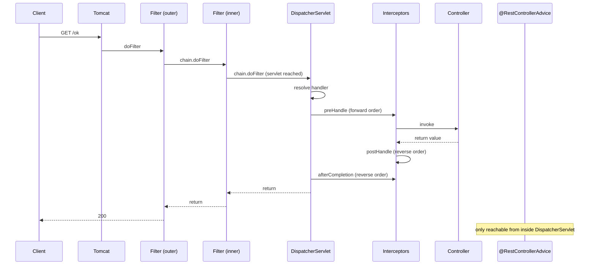
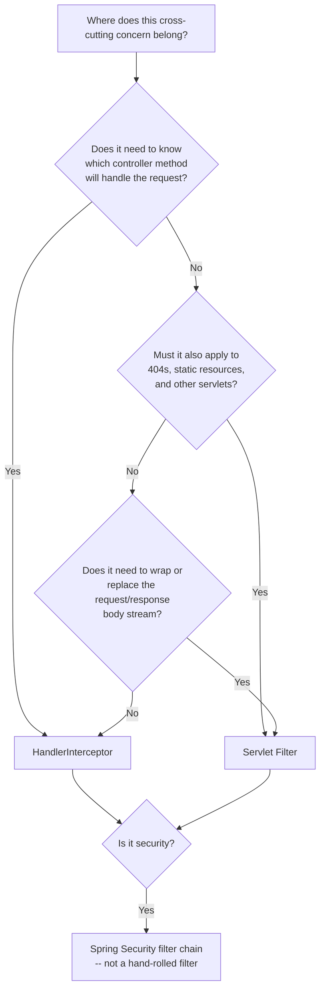

# Request Filters, Interceptors, and the Servlet Chain

> **Topic register:** T-2441 · Core tier · High interview frequency [H]
> **Provenance:** every ordering and behavioral claim below is real, executed
> output from
> [`practice/java/spring/filters-and-interceptors/`](../../practice/java/spring/filters-and-interceptors/README.md)
> — a Spring Boot 3.5.16 app on embedded Tomcat 10.1.55 and OpenJDK 21.0.12,
> with two Servlet filters and two Spring MVC interceptors registered at once,
> so nesting order and reverse-unwinding order are both visible rather than
> inferred. Four requests were issued; all four transcripts are committed.

## Table of Contents

1. [Learning Objectives](#learning-objectives)
2. [Why This Matters in Interviews](#why-this-matters-in-interviews)
3. [Level 1 — Foundation](#level-1-foundation)
4. [Level 2 — Working Knowledge](#level-2-working-knowledge)
5. [Mental Model](#mental-model)
6. [Definition and Purpose](#definition-and-purpose)
7. [Core Concepts](#core-concepts)
8. [Internal Implementation](#internal-implementation)
9. [Diagrams](#diagrams)
10. [Java Examples](#java-examples)
11. [Production Scenarios](#production-scenarios)
12. [Trade-offs](#trade-offs)
13. [Decision Framework](#decision-framework)
14. [Common Mistakes](#common-mistakes)
15. [Anti-Patterns](#anti-patterns)
16. [Best Practices](#best-practices)
17. [Interview Answer Framework](#interview-answer-framework)
18. [Interview Questions](#interview-questions)
19. [Summary](#summary)
20. [Key Takeaways](#key-takeaways)
21. [Cheat Sheet](#cheat-sheet)
22. [Flashcards](#flashcards)
23. [Practice Exercises](#practice-exercises)
24. [Solutions](#solutions)
25. [Additional Reading](#additional-reading)
26. [Official References](#official-references)

---

## Learning Objectives

By the end of this chapter you can:

- State the exact order in which filters, interceptors, the handler, and the exception resolver run for one request, and explain *why* that order follows from where each component is installed.
- Choose between a `Filter` and a `HandlerInterceptor` for a given concern using a mechanical criterion, not taste.
- Explain why `@ControllerAdvice` cannot handle an exception thrown in a filter, and what the client receives instead.
- Say what `preHandle` returning `false` actually skips, including the part most candidates get wrong.
- Read `afterCompletion`'s `ex` parameter correctly, and avoid the silent observability gap it causes.

## Why This Matters in Interviews

"What's the difference between a filter and an interceptor?" is one of the most common Spring screening questions, and the reason it survives is that the shallow answer and the correct answer sound similar. The shallow answer is "filters are servlet-level, interceptors are Spring-level" — true, memorized, and inert. The correct answer derives every practical consequence from that one structural fact: what each layer can see, which one your exception handling reaches, which one can access a controller's annotations, and which one still runs when the other short-circuits.

It also matters because both are where teams put their most load-bearing cross-cutting code — authentication, correlation IDs, rate limiting, audit logging, tenancy resolution. Putting a concern in the wrong layer usually works in development and fails in a specific, hard-to-diagnose production case. Two of those cases are measured directly in this chapter.

## Level 1 — Foundation

A web request arriving at a Spring Boot application does not go straight to your controller method. It passes through a series of wrappers, each of which can look at the request, change it, stop it, or let it continue.

The outermost of those wrappers come from the **Servlet API** — the Jakarta EE standard that Tomcat, Jetty, and Undertow all implement. That standard defines a type called a `Filter`. A filter is not a Spring concept at all; it would work in an application with no Spring in it. Its job is to wrap *the entire servlet*, whatever that servlet happens to be.

In a Spring Boot web application there is essentially one servlet: the `DispatcherServlet`. Everything Spring MVC does — deciding which controller method matches the URL, converting JSON into your parameter objects, converting your return value back into JSON, handling exceptions — happens inside it.

Inside that servlet, Spring defines its own extension point: a `HandlerInterceptor`. An interceptor also wraps something, but it wraps a *handler* — one specific controller method — rather than the whole servlet.

So the picture is two nested boxes:

```text
Tomcat
 └─ Filter chain  (Servlet API -- knows nothing about controllers)
     └─ DispatcherServlet  (Spring MVC)
         └─ Interceptor chain  (Spring -- knows exactly which controller method)
             └─ your @GetMapping method
```

Everything else in this chapter follows from that nesting.

## Level 2 — Working Knowledge

The practical question is not "what are they" but "which one do I use." The mechanical criterion is **what the layer needs to know**.

A filter runs before Spring has decided which controller method (if any) handles this URL. It sees the raw `HttpServletRequest` — the URI, the headers, the body stream — and nothing else. It cannot know whether the request will be handled by `OrderController#place`, rejected as a 404, or served as a static resource, because none of that has been determined yet.

An interceptor runs after that decision. Spring hands it the resolved handler as an `Object`, which for an annotated controller is a `HandlerMethod` — from which you can read the controller class, the method, and any annotations on either.

That difference is measurable, and the demo measures it. Every filter step in the committed transcript records `handler-known=NO`; every interceptor step records the real resolved method:

```text
 1. Filter[outer-filter] BEFORE chain  | uri=/ok, handler-known=NO (DispatcherServlet not entered yet)
 2. Filter[inner-filter] BEFORE chain  | uri=/ok, handler-known=NO (DispatcherServlet not entered yet)
 3. Interceptor[first-interceptor] preHandle | handler=DemoController#ok (RESOLVED -- a filter cannot see this)
```

So: **if your concern is expressed in terms of the HTTP request, use a filter. If it is expressed in terms of the controller method, use an interceptor.** A correlation ID applies to every request including 404s and static assets — filter. A check for a custom `@RequiresFeatureFlag` annotation on the handler is meaningless without a handler — interceptor.

## Mental Model

Think of the two layers as **the building's front door versus the office door**.

The front door (filter) is open to everyone who walks into the building. The guard there sees you arrive, can turn you away, and sees you leave — but has no idea which office you were going to, because you had not yet been directed anywhere. The front door also stays in the picture for people who walk in and find no office matching their request at all.

The office door (interceptor) is at a specific office. By the time you reach it, reception has already looked up where you belong, so the person at that door knows exactly which office you are entering and can apply that office's own rules. But someone turned away at the front door never reaches it.

The model predicts the two failure cases correctly. If something goes wrong *at the front door*, the office's own complaint procedure never runs, because you never got there. And if the office turns you away, the front-door guard still sees you leave — their part of the process always completes.

## Definition and Purpose

A **Servlet `Filter`** (`jakarta.servlet.Filter`) is a Servlet-API component that wraps servlet invocation. Its single method, `doFilter(request, response, chain)`, receives the request, may act on it, and either calls `chain.doFilter(...)` to continue or returns without doing so to stop the request. Code after the `chain.doFilter(...)` call runs on the way back out, after the response has been produced.

A **`HandlerInterceptor`** (`org.springframework.web.servlet.HandlerInterceptor`) is a Spring MVC component with three callbacks around a resolved handler:

- `preHandle(request, response, handler)` — before the handler runs. Returning `false` stops the request.
- `postHandle(request, response, handler, modelAndView)` — after the handler returned *normally*.
- `afterCompletion(request, response, handler, ex)` — after the response is complete, including when things went wrong.

Both exist so cross-cutting behavior lives in one place instead of being copy-pasted into every controller method. They exist as *two* mechanisms rather than one because they sit at different levels of the stack and therefore have access to genuinely different information.

## Core Concepts

### The order is fixed, and it unwinds in reverse

For a normal request, the demo's four registered components plus the controller produce eleven ordered steps, all on one thread:

```text
 1. Filter[outer-filter] BEFORE chain
 2. Filter[inner-filter] BEFORE chain
 3. Interceptor[first-interceptor] preHandle   -> returning true
 4. Interceptor[second-interceptor] preHandle  -> returning true
 5. Controller#ok                              | handler body running
 6. Interceptor[second-interceptor] postHandle
 7. Interceptor[first-interceptor] postHandle
 8. Interceptor[second-interceptor] afterCompletion | ex=null, status=200
 9. Interceptor[first-interceptor] afterCompletion  | ex=null, status=200
10. Filter[inner-filter] AFTER chain   | status=200, response committed=true
11. Filter[outer-filter] AFTER chain   | status=200, response committed=true
```

Two things to read off this. First, the outer layer's "before" runs first and its "after" runs last — ordinary nesting, exactly like a stack of `try`/`finally` blocks, which is literally how a filter is written. Second, registration order is *forward* on the way in and *reverse* on the way out, for both layers. An interceptor registered second sees `postHandle` before the one registered first.

Everything ran on `http-nio-8080-exec-1`. That single-threaded property is what makes `ThreadLocal`-based context (MDC for logging, `SecurityContextHolder`, transaction synchronization) work at all in the classic servlet model — and it is exactly what stops holding once asynchronous dispatch is involved, which [Structured Logging, Correlation IDs, and Log Hygiene](../13-observability/structured-logging-correlation-ids-and-log-hygiene.md) covers in its own right.

### `@ControllerAdvice` cannot see a filter's exception

This is the single most consequential difference, and it follows mechanically from the nesting: `@ControllerAdvice`/`@RestControllerAdvice` is wired into the `DispatcherServlet` as a `HandlerExceptionResolver`. It can only resolve exceptions that surface *inside* the `DispatcherServlet`. A filter that throws does so before the `DispatcherServlet` is ever entered.

The demo has an identical failure triggered from each layer. From the controller, the advice handles it and produces the application's own error shape:

```text
$ curl -s -w "\nHTTP %{http_code}\n" http://localhost:8080/boom-controller
{"error":"deliberate failure inside the controller"}
HTTP 422
```

From a filter, the advice never runs — there is no `CAUGHT` line anywhere in the trace — and the client receives the container's default error body instead:

```text
$ curl -s -w "\nHTTP %{http_code}\n" http://localhost:8080/boom-filter
{"timestamp":"2026-09-29T15:05:57.715+00:00","status":500,"error":"Internal Server Error","path":"/boom-filter"}
HTTP 500
```

Note that these are not merely different status codes — they are **different JSON shapes**. A client parsing `error` as a human-readable string gets a machine-readable status phrase instead, and `timestamp`/`status`/`path` appear from nowhere. An API's error contract silently changes shape depending on which layer failed. Any team that documents one error schema and enforces it in a contract test against controller-level failures has an untested second schema in production.

The corresponding trace shows how little runs:

```text
 1. Filter[outer-filter] BEFORE chain  | uri=/boom-filter, handler-known=NO
 2. Filter[inner-filter] BEFORE chain  | uri=/boom-filter, handler-known=NO
 3. Filter[inner-filter] THROWS        | about to throw ServletException
 4. Filter[outer-filter] AFTER chain   | status=200, response committed=false
```

No interceptor ran. No handler ran. No advice ran.

### A filter's `finally` block sees the wrong status

Step 4 above is a genuine finding the demo was not built to look for, and it is worth more than the headline. The outer filter's `finally` block recorded `status=200` for a request the client received as `500`.

The reason is where the status is set. Tomcat converts an escaped exception into a `500` in its `StandardHostValve`/`ErrorReportValve`, which sit *outside* the whole application filter chain — so at the moment the outermost filter's `finally` runs, the response status is still its default `200` and the response is not yet committed.

This is a real, silent observability trap. The most common piece of code anyone writes in a filter is exactly this:

```java
try {
    chain.doFilter(request, response);
} finally {
    log.info("{} {} -> {}", method, uri, response.getStatus());  // reports 200 for a 500
}
```

Access logs built this way under-report server errors, and the dashboard built on them looks healthy during precisely the incidents it exists to reveal. The fix is to record the throwable in a `catch` block rather than trusting the status, or to use the container's own access-log valve, which runs late enough to see the final status.

The same transcript incidentally reveals Spring's own filters sitting in the chain between the two demo filters, which is a useful reminder that your filters are never the only ones:

```text
	at org.springframework.web.filter.CharacterEncodingFilter.doFilterInternal(CharacterEncodingFilter.java:201)
	at org.springframework.web.filter.OncePerRequestFilter.doFilter(OncePerRequestFilter.java:116)
```

### `afterCompletion`'s `ex` is the *unresolved* exception, not "the exception"

The name suggests `afterCompletion` receives whatever the handler threw. It does not. It receives the exception still unresolved at that point — and anything a `HandlerExceptionResolver` already handled arrives as `null`.

In the `/boom-controller` trace, the controller definitely threw, the advice definitely caught it, and both interceptors nonetheless recorded:

```text
 7. Interceptor[second-interceptor] afterCompletion | ex=null, status=422
 8. Interceptor[first-interceptor] afterCompletion  | ex=null, status=422
```

An interceptor that logs failures by checking `if (ex != null)` therefore logs nothing for every exception the application handles correctly — which is to say, for almost all of them. The reliable signal at that point is the response status, not the `ex` parameter.

The same trace shows a second detail worth internalizing: **`postHandle` did not run at all.** It runs only when the handler returned normally. Any interceptor logic placed in `postHandle` — adding a response header, recording a timing, enriching the model — silently vanishes on every error path. Work that must always happen belongs in `afterCompletion`.

### `preHandle` returning `false` skips more than you would guess

When `second-interceptor`'s `preHandle` returned `false`:

```text
 3. Interceptor[first-interceptor] preHandle  -> returning true
 4. Interceptor[second-interceptor] preHandle -> returning FALSE (short-circuit)
 5. Interceptor[first-interceptor] afterCompletion | ex=null, status=403
 6. Filter[inner-filter] AFTER chain   | status=403, response committed=false
 7. Filter[outer-filter] AFTER chain   | status=403, response committed=false
```

The handler never ran and no `postHandle` ran — both expected. The part candidates get wrong is that **`second-interceptor`'s own `afterCompletion` did not run either.** Spring calls `afterCompletion` only on interceptors whose `preHandle` already returned `true`, tracked by an index into the interceptor array. An interceptor that acquires a resource in `preHandle` and releases it in `afterCompletion` is safe — if it returns `false`, it never acquired anything. But an interceptor that *rejects* a request in `preHandle` cannot rely on its own `afterCompletion` for cleanup or metrics.

Both filters still completed normally, because the short-circuit happens entirely inside the `DispatcherServlet`. An interceptor cannot prevent a filter's outbound half from running.

Note also that when `preHandle` returns `false`, **it is the interceptor's job to write the response.** Spring does not supply one. The demo's interceptor sets the status and writes a body itself; had it simply returned `false`, the client would have received an empty `200`.

## Internal Implementation

The filter chain is Tomcat's. `ApplicationFilterChain.internalDoFilter` walks an array of filters by index, calling each one's `doFilter` and passing itself along as the chain. When the index passes the last filter, it invokes the servlet. That is why a filter's post-chain code is just the remainder of its own stack frame — there is no callback registry, only nesting. The committed stack trace shows exactly this, alternating between `ApplicationFilterChain.internalDoFilter` and each filter in turn.

Spring Boot does not ask you to edit `web.xml`. `FilterRegistrationBean` is picked up by `ServletWebServerApplicationContext` at startup and registered with the embedded container's `ServletContext`. Ordering comes from `setOrder(...)`; the demo pins `outer-filter` to `Ordered.HIGHEST_PRECEDENCE` and `inner-filter` to one step below, and the trace confirms the resulting nesting. A filter that is simply declared as an `@Component` is also registered automatically, across all URLs — convenient and a frequent source of surprise when someone intended it to apply to one path.

The interceptor chain is Spring's, and it lives in `HandlerExecutionChain`. `DispatcherServlet.doDispatch` resolves the handler, then calls `applyPreHandle`, which iterates forward and records `interceptorIndex` as it goes. On `false` it calls `triggerAfterCompletion` immediately — which iterates *backwards from `interceptorIndex`*, and that single detail is the mechanical reason the rejecting interceptor's own `afterCompletion` is skipped. On the normal path, `applyPostHandle` iterates backwards, and `triggerAfterCompletion` runs after the response is rendered.

Exception resolution sits between the handler and `postHandle`. `doDispatch` catches whatever the handler threw, stores it, and calls `processDispatchResult`, which asks each registered `HandlerExceptionResolver` — including `ExceptionHandlerExceptionResolver`, the one backing `@ControllerAdvice` — to handle it. If one does, the exception is considered resolved and is *not* passed on to `triggerAfterCompletion`. That is the precise mechanism behind `ex=null`.

## Diagrams



The decision tree for placing a concern:



## Java Examples

A filter, with the status-reporting bug the transcript exposed, and its fix:

```java
// Java 21, Spring Boot 3.5.x
import jakarta.servlet.*;
import jakarta.servlet.http.*;
import java.io.IOException;

public class AccessLogFilter extends org.springframework.web.filter.OncePerRequestFilter {

    @Override
    protected void doFilterInternal(HttpServletRequest request, HttpServletResponse response,
                                    FilterChain chain) throws ServletException, IOException {
        long startNanos = System.nanoTime();
        try {
            chain.doFilter(request, response);
            log(request, response.getStatus(), startNanos, null);
        } catch (Exception ex) {
            // Required: at this point the status is still 200 -- the container
            // sets 500 further out, after this frame has already returned.
            log(request, 500, startNanos, ex);
            throw ex;
        }
    }

    private void log(HttpServletRequest request, int status, long startNanos, Exception ex) {
        // ... structured record; see 13-observability for the field design
    }
}
```

`OncePerRequestFilter` is Spring's base class rather than raw `Filter`, and it earns its place: it guarantees the filter body runs once per request even when the container performs an internal `FORWARD` or `ERROR` dispatch, which a raw `Filter` mapped to all dispatcher types does not.

An interceptor doing something a filter structurally cannot — reading an annotation off the resolved handler:

```java
import org.springframework.web.method.HandlerMethod;
import org.springframework.web.servlet.HandlerInterceptor;

public class FeatureFlagInterceptor implements HandlerInterceptor {

    @Override
    public boolean preHandle(HttpServletRequest request, HttpServletResponse response, Object handler)
            throws Exception {
        if (!(handler instanceof HandlerMethod method)) {
            return true;  // static resource, or a non-annotated handler
        }
        RequiresFlag required = method.getMethodAnnotation(RequiresFlag.class);
        if (required == null || flags.isEnabled(required.value())) {
            return true;
        }
        // Returning false means WE own the response. Spring writes nothing.
        response.setStatus(HttpServletResponse.SC_NOT_FOUND);
        response.setContentType("application/problem+json");
        response.getWriter().write("{\"title\":\"Not found\"}");
        return false;
    }

    @Override
    public void afterCompletion(HttpServletRequest request, HttpServletResponse response,
                                Object handler, Exception ex) {
        // Check the status, not `ex`: an exception already handled by
        // @ControllerAdvice arrives here as null -- measured, not assumed.
        if (response.getStatus() >= 500) {
            metrics.counter("handler.failures").increment();
        }
    }
}
```

Registration, both layers, in one configuration class:

```java
@Configuration
class WebConfig implements WebMvcConfigurer {

    @Bean
    FilterRegistrationBean<AccessLogFilter> accessLogFilter() {
        var registration = new FilterRegistrationBean<>(new AccessLogFilter());
        registration.addUrlPatterns("/*");
        registration.setOrder(Ordered.HIGHEST_PRECEDENCE);  // outermost: sees everything
        return registration;
    }

    @Override
    public void addInterceptors(InterceptorRegistry registry) {
        registry.addInterceptor(new FeatureFlagInterceptor())
                .addPathPatterns("/api/**")
                .excludePathPatterns("/api/health");
    }
}
```

Note the asymmetry in path matching. A filter's `addUrlPatterns` uses Servlet-spec URL patterns; an interceptor's `addPathPatterns` uses Spring's own path patterns, including `/**`. They are not the same syntax, and a pattern copied between them will not always mean the same thing.

## Production Scenarios

### Scenario: correlation IDs are missing from exactly the logs that matter

**Symptoms.** A team adds correlation IDs so a request can be traced across services. Every normal request logs a `correlation_id`. But for the incidents anyone actually investigates — 500s, timeouts, rejected requests — the field is absent, and support cannot follow a customer's failing request through the system.

**Initial hypotheses.** A logging-configuration problem; the upstream caller not sending the header on retries; a sampling rule.

**Evidence collected.** The ID is set in an interceptor's `preHandle` (into MDC) and cleared in `postHandle`. Log records from failing requests have no `correlation_id`. Records from requests rejected by an earlier interceptor have none either. Requests to URLs with no matching handler at all — genuine 404s — have none.

**Diagnosis.** Three distinct instances of the same structural error. `postHandle` does not run when the handler throws (measured directly in this chapter's `/boom-controller` trace), so the MDC was never cleared and, worse, leaked onto the *next* request served by that pooled thread. An interceptor never runs at all when an earlier interceptor short-circuits. And an interceptor never runs for a request with no resolved handler, so 404s were never going to be covered.

**Immediate mitigation.** Move the clear into `afterCompletion`, which runs on every path an interceptor participates in at all.

**Permanent remediation.** Move the whole concern into a filter. A correlation ID is a property of the HTTP request, not of a controller method, and the criterion in [Level 2](#level-2-working-knowledge) places it in a filter for that reason. In a filter's `finally` block it is set and cleared for literally every request, including 404s, static assets, and requests rejected before any handler is resolved.

**Trade-offs.** The filter version cannot read controller annotations, so per-endpoint sampling rules are no longer expressible there. If those are genuinely needed, they belong in a second, narrower interceptor that enriches the context the filter already established.

**Prevention.** Treat "which paths does this run on?" as a required design question for every cross-cutting concern, and enumerate the error paths explicitly rather than testing only the happy path.

**Interview lessons.** This is the strongest available answer to "give an example where you had to choose between a filter and an interceptor." It is concrete, the failure mode is specific, and the reasoning is structural rather than preferential.

### Scenario: an API's error contract has a second, undocumented shape

**Symptoms.** A mobile client crashes for a small fraction of users. The crash is a JSON parse failure on an error response. The backend team cannot reproduce it; every error response they generate matches the documented schema.

**Evidence collected.** The crashing responses have a `timestamp`, `status`, `error`, and `path` — none of which appear in the documented schema, which specifies `{"code": ..., "message": ...}` produced by `@RestControllerAdvice`. Correlating by time, the affected requests all carry an expired authentication token.

**Diagnosis.** Token validation lives in a filter. On an expired token it throws. The advice never runs, because the filter sits outside the `DispatcherServlet` — exactly this chapter's measured `/boom-filter` result — and the client receives the container's default error body, which is a different shape. The contract test suite only ever exercised controller-level failures, so the second shape was never tested.

**Immediate mitigation.** Have the filter write the documented error body itself rather than throwing.

**Permanent remediation.** Move authentication onto the Spring Security filter chain, which has its own `AuthenticationEntryPoint` designed for exactly this, and add a contract test that triggers a filter-level failure — not just a controller-level one.

**Trade-offs.** Writing error bodies by hand in a filter duplicates serialization logic the advice already owns. A shared component that both call keeps one source of truth, at the cost of a small piece of infrastructure to maintain.

**Prevention.** Ask, for every error-handling mechanism: *what is the outermost layer this covers?* Anything thrown outside it produces a response the mechanism never sees.

## Trade-offs

| Dimension | Servlet `Filter` | `HandlerInterceptor` |
|---|---|---|
| Runs for unmapped URLs (404s), static resources | Yes | No |
| Can read the resolved controller method and its annotations | No | Yes |
| Can wrap/replace the request or response body stream | Yes (`HttpServletRequestWrapper`) | No |
| Exception reachable by `@ControllerAdvice` | No | Yes (thrown from `preHandle`) |
| Portable to a non-Spring servlet application | Yes | No |
| Distinct before/after/always callbacks | One method, with `try`/`finally` | Three explicit callbacks |
| Path matching syntax | Servlet URL patterns | Spring path patterns (`/**`) |
| Sees the final response status in its post-processing | **No** — measured: reports `200` for a container-generated `500` | Yes, in `afterCompletion` |

The last row is the one that surprises people, and it is the reason "put the access log in a filter, it sees everything" is only half right: a filter sees every *request*, but not every request's true outcome.

## Decision Framework

1. **Is it security (authentication, authorization, CSRF, CORS)?** Use the Spring Security filter chain, not a hand-rolled filter or interceptor. See [Security Filter Chain](security-filter-chain.md). Hand-rolling these is the most common way to get ordering wrong relative to Spring Security's own filters.
2. **Does it need the resolved handler or its annotations?** Interceptor. A filter structurally cannot provide this.
3. **Must it cover requests with no handler — 404s, static resources, other servlets?** Filter. An interceptor is not invoked at all for these.
4. **Does it need to wrap or buffer the request/response body?** Filter. Response wrapping requires being outside the servlet, which is where filters are.
5. **Does it need to run reliably on every path including errors?** Either, but place the code correctly: a filter's `finally`, or an interceptor's `afterCompletion` — never `postHandle`.
6. **Otherwise, prefer the interceptor.** It is the narrower, more testable mechanism, it participates in Spring's exception handling, and it has explicit callbacks rather than one method whose meaning depends on where in it you are.

## Common Mistakes

- Putting cleanup in `postHandle` and assuming it always runs. It does not run when the handler throws — measured. `ThreadLocal`/MDC cleanup placed there leaks onto the next request on that pooled thread.
- Reading `afterCompletion`'s `ex` parameter as "the exception the handler threw." It is `null` for every exception already handled by `@ControllerAdvice` — measured.
- Expecting `@ControllerAdvice` to handle an exception thrown in a filter. It cannot; the client silently receives a different error shape.
- Logging `response.getStatus()` in a filter's `finally` block and trusting it. For container-generated errors the status is still `200` at that point — measured.
- Returning `false` from `preHandle` without writing a response, producing an empty `200` where a rejection was intended.
- Assuming a rejecting interceptor's own `afterCompletion` will run for cleanup or metrics. It does not.
- Declaring a filter as a bare `@Component` and being surprised it applies to every URL. Use `FilterRegistrationBean` when the scope matters.
- Assuming an interceptor runs for static resources or 404s. It does not — there is no handler.
- Copying a path pattern between `addUrlPatterns` and `addPathPatterns` and expecting identical matching. The two use different syntaxes.
- Using a raw `Filter` where `OncePerRequestFilter` is wanted, then seeing the body run twice across an internal `FORWARD` or `ERROR` dispatch.

## Anti-Patterns

- **Business logic in a filter or interceptor.** These layers are for cross-cutting concerns. Logic that differs per endpoint belongs in the endpoint, where it is visible to anyone reading the controller.
- **Hand-rolled authentication filters alongside Spring Security.** Two independent mechanisms with independent ordering, and the resulting order is emergent rather than designed.
- **An interceptor that mutates request attributes a controller silently depends on.** This creates invisible coupling: the controller's correctness now depends on configuration in a different file that its signature does not mention.
- **Reading the request body in a filter without wrapping it.** The body stream is read-once; consuming it leaves the controller with nothing. Wrap with a caching wrapper or do not read it.
- **A large ordered stack of filters whose order is load-bearing but undocumented.** Order emerges from scattered `@Order` values; a reordering during a refactor changes behavior with no compile-time signal.

## Best Practices

- Place the concern using the mechanical criterion — does it need the handler? — rather than by habit.
- Prefer `OncePerRequestFilter` over raw `Filter` for anything that must run exactly once per request.
- Register filters with an explicit `FilterRegistrationBean` and an explicit order when either the URL scope or the position matters.
- Put always-run logic in a filter's `finally` or an interceptor's `afterCompletion`. Treat `postHandle` as a happy-path-only hook.
- Derive failure signals from the response status, not from `afterCompletion`'s `ex`.
- When a filter must reject a request, have it produce the same error body shape the application's `@ControllerAdvice` produces, via a shared component.
- Test the error paths of every filter and interceptor explicitly — a filter-level failure, an interceptor short-circuit, and a 404 — not just a successful request.
- Delegate security to the Spring Security filter chain.

## Interview Answer Framework

### 30-Second Answer

A filter is a Servlet API component that wraps the whole `DispatcherServlet`, so it runs for every request including 404s and static resources, but it has no idea which controller method will handle the request. An interceptor is a Spring MVC component that runs inside the `DispatcherServlet`, after handler resolution, so it knows the exact `HandlerMethod` and its annotations. The practical consequence: `@ControllerAdvice` can handle an exception from an interceptor but not from a filter.

### 2-Minute Answer

Add the ordering and the reason it matters. For one request the sequence is: filters inbound in registration order, then `preHandle` forward, then the handler, then `postHandle` in reverse, then `afterCompletion` in reverse, then filters outbound in reverse — all on one container thread in the classic servlet model.

Then the decision rule: if the concern is expressed in terms of the HTTP request, it goes in a filter; if it is expressed in terms of the controller method, it goes in an interceptor. A correlation ID is a filter concern because it must apply to 404s too. A check on a custom annotation is an interceptor concern because without a handler there is nothing to check.

Then the consequence worth volunteering: because `@ControllerAdvice` is a `HandlerExceptionResolver` inside the `DispatcherServlet`, a filter that throws bypasses it entirely and the client gets the container's default error body — a different JSON shape from the application's own, which is how an API ends up with a second, undocumented error contract.

### 10-Minute Deep Dive

Cover, in order:

1. The nesting, and that everything else derives from it.
2. The measured eleven-step order, including reverse unwinding on both layers.
3. What each layer can see: raw request versus resolved `HandlerMethod`.
4. `@ControllerAdvice`'s reach, and the two different error shapes that result.
5. `afterCompletion`'s `ex` being the *unresolved* exception, and the observability gap that follows.
6. `postHandle` not running on the error path, and the MDC leak that causes.
7. `preHandle` returning `false`: the handler and `postHandle` skipped, the rejecting interceptor's own `afterCompletion` skipped, and the response now being the interceptor's responsibility.
8. The internals that explain all of it: `ApplicationFilterChain` index walking, `HandlerExecutionChain.interceptorIndex`, `processDispatchResult` consuming the exception before `triggerAfterCompletion`.
9. Where security belongs, and why.

### Whiteboard Explanation

Draw two nested boxes: Tomcat's filter chain outside, `DispatcherServlet` inside, the controller innermost. Put `@ControllerAdvice` *inside* the `DispatcherServlet` box and circle it — that placement alone answers the exception question. Then draw the request as a line in and back out, numbering the stages, and mark the outbound arrows as reverse order. Finally, draw an X on the filter box and trace what the request can no longer reach.

Say while drawing: "Everything here follows from which box each thing lives in. The advice is inside this box, so it can only see exceptions that happen inside this box."

### Production Example

Use the correlation-ID scenario above. It is concrete, it has a specific and slightly surprising failure mode (missing from exactly the error logs it existed to support), and the fix is the decision rule rather than a patch.

### Trade-offs to Mention

Filters cover more requests but know less and cannot see the final status in their own post-processing. Interceptors know more and participate in Spring's exception handling, but never run for 404s, static resources, or after a short-circuit by another interceptor. Neither is a general-purpose replacement for the other.

### Common Candidate Mistakes

Stopping at "servlet-level versus Spring-level" without deriving a single consequence. Claiming `@ControllerAdvice` catches everything. Believing `postHandle` always runs. Describing the order but not the reverse unwinding.

### Typical Follow-Up Questions

- "Where would you put rate limiting, and why?"
- "A request returns 500 but nothing appears in your access log. Where do you look?"
- "Your interceptor's `afterCompletion` logs nothing for failed requests. Why?"
- "How does Spring Security relate to all of this?"
- "What changes for `@Async` controller methods or `DeferredResult`?"

### Senior-Level Expectations

Derives behavior from structure rather than recalling a table. Knows `postHandle` is a happy-path hook and `afterCompletion` is not. Reaches for Spring Security rather than hand-rolling authentication. Can name what breaks in async dispatch.

### Staff-Level Discussion

Frames the filter/interceptor stack as a platform concern rather than a per-service one. The argument: cross-cutting behavior that every service must implement identically — correlation ID propagation, access logging, tenancy resolution — is exactly the kind of thing that drifts when each team writes its own, and the drift is invisible because each implementation works on the happy path. A shared starter that registers a correct, error-path-tested set of filters makes the guarantee uniform and makes the *absence* of a concern the thing that requires a decision.

The counter-argument deserves equal weight: a shared filter stack becomes a piece of infrastructure with its own upgrade cost and its own blast radius, and a bug in it reaches every service simultaneously. The judgment is about how many services there are and how uniform their requirements genuinely are — below a handful of services, the coordination cost usually exceeds the drift cost.

The error-contract observation generalizes past this chapter: any error-handling mechanism covers exactly one layer, and something can always throw outside it. Treating the outermost layer's default response as part of the API's public contract — and testing it — is the discipline that prevents the second, undocumented schema.

## Interview Questions

### Question 1 — What is the difference between a Servlet filter and a Spring `HandlerInterceptor`, and give one consequence that actually matters?

**Why interviewers ask it.** It is easy to answer superficially, which makes it a good discriminator: the memorized answer and the understood answer start the same way and diverge immediately.

**Expected answer.** A filter is a Servlet API component wrapping the entire `DispatcherServlet`; an interceptor is a Spring component running inside it, after handler resolution. The consequence: an interceptor receives the resolved `HandlerMethod` and can read the controller method's annotations, while a filter cannot — it runs before Spring has decided which handler applies, or whether one applies at all. Conversely a filter runs for requests an interceptor never sees, including 404s and static resources. The most consequential difference is that `@ControllerAdvice` is a `HandlerExceptionResolver` inside the `DispatcherServlet`, so it can handle an exception from an interceptor but not from a filter.

**Minimum acceptable answer.** States that filters are servlet-level and interceptors are Spring-level, and that filters run first.

**Strong Senior answer.** The expected answer, plus the decision rule (does the concern need the handler?) applied to a concrete example, plus the observation that a filter throwing produces the container's error body rather than the application's.

**Staff-level extension.** Raises the error-contract consequence — that an API silently has two error schemas, only one of which is tested — and argues for testing the outermost layer's default response as part of the public contract.

**Common mistakes.** Stopping at the level labels. Asserting `@ControllerAdvice` catches filter exceptions. Claiming interceptors run for static resources.

**Likely follow-ups.** "Where would you put a correlation ID, and why?" (Filter — it must cover 404s.) "Where would you put a check on a custom annotation?" (Interceptor — a filter cannot see annotations.)

**Evaluation criteria (1–5).** 1: cannot distinguish them. 3: correct levels and ordering. 5: derives at least two practical consequences from the structural difference, including the exception-handling boundary.

### Question 2 — An interceptor logs failures with `if (ex != null)` in `afterCompletion`. It logs nothing in production even though the service returns 500s. Why?

**Why interviewers ask it.** It tests whether the candidate has actually observed the callback contract rather than inferred it from the parameter name, and it is a real bug that ships often.

**Expected answer.** `afterCompletion`'s `ex` parameter is the exception still *unresolved* at that point, not the exception the handler threw. Any exception already handled by a `HandlerExceptionResolver` — which includes every `@ControllerAdvice`/`@ExceptionHandler` — arrives as `null`. Since a well-built service handles almost all of its exceptions, `ex` is almost always `null`. The fix is to key off the response status instead.

**Minimum acceptable answer.** Recognizes that exception handling somewhere else is consuming the exception before `afterCompletion` sees it.

**Strong Senior answer.** The above, plus the mechanism: `DispatcherServlet.processDispatchResult` resolves the exception and does not pass it to `triggerAfterCompletion`. Also notes the neighbouring trap — `postHandle` does not run at all on the error path, so anything placed there is lost precisely when it is needed.

**Staff-level extension.** Generalizes it: monitoring that infers failure from an exception object rather than from the observable outcome will under-report in exactly the systems that handle errors well, so the better-engineered the service, the blinder the dashboard. Argues for deriving signals from what the client actually received.

**Common mistakes.** Blaming the logging framework or log levels. Proposing to move the logic into `postHandle`, which makes it strictly worse.

**Likely follow-ups.** "Where would you put this instead?" "Does a filter's `finally` block see the right status?" (No — measured: `200` for a container-generated `500`.)

**Evaluation criteria (1–5).** 1: no hypothesis. 3: identifies that the exception is already handled. 5: names the mechanism, proposes the status-based fix, and connects it to `postHandle`'s error-path behavior.

### Question 3 — Your `preHandle` returns `false` to reject a request. What does and does not run afterwards?

**Why interviewers ask it.** The obvious parts are guessable; one part is not, and it is the part that causes real resource leaks.

**Expected answer.** The handler does not run. No `postHandle` runs. `afterCompletion` runs only on interceptors *earlier in the chain* whose `preHandle` already returned `true` — the rejecting interceptor's own `afterCompletion` does **not** run, because Spring tracks how far it got via `interceptorIndex` and unwinds only that far. Both filters still complete normally, since the short-circuit happens inside the `DispatcherServlet` and a filter's outbound half is just its own stack frame. And because Spring writes no response for a rejection, the interceptor must set the status and body itself or the client receives an empty `200`.

**Minimum acceptable answer.** States that the handler and `postHandle` are skipped.

**Strong Senior answer.** Adds the `interceptorIndex` asymmetry and the "you own the response" point.

**Staff-level extension.** Notes that this makes `preHandle` an unsafe place to acquire anything that needs releasing on the rejection path, and that rejection metrics must be emitted inline rather than in `afterCompletion` — a constraint worth encoding in a shared base class rather than rediscovering per service.

**Common mistakes.** Assuming the rejecting interceptor's own `afterCompletion` runs. Assuming Spring produces a sensible default response.

**Likely follow-ups.** "Where do you release a resource acquired in `preHandle` then?" "What status does the client get if you just `return false`?" (An empty `200`.)

**Evaluation criteria (1–5).** 1: unsure what is skipped. 3: handler and `postHandle`. 5: the `interceptorIndex` behavior plus response ownership.

## Summary

Filters and interceptors are two layers of the same request pipeline, and every practical difference between them follows from one structural fact: a filter wraps the `DispatcherServlet` from outside, and an interceptor runs within it, after handler resolution. That fact determines what each can see, which one your exception handling reaches, and which requests each one covers at all.

The measured behavior contains several things the API's naming does not suggest. `postHandle` does not run on the error path. `afterCompletion`'s `ex` is `null` for every exception the application handled correctly. A rejecting interceptor's own `afterCompletion` is skipped. A filter's `finally` block reports `200` for a container-generated `500`. Each of these has produced real production bugs, and each is a consequence of the same nesting, not an arbitrary quirk.

## Key Takeaways

- Filters wrap the `DispatcherServlet`; interceptors run inside it, after handler resolution. Everything else follows.
- The decision rule: if the concern is about the HTTP request, use a filter; if it is about the controller method, use an interceptor.
- `@ControllerAdvice` cannot handle a filter's exception — the client receives the container's error body, a different JSON shape.
- `postHandle` is a happy-path-only hook; always-run logic belongs in `afterCompletion` or a filter's `finally`.
- `afterCompletion`'s `ex` is the *unresolved* exception and is `null` for anything already handled. Use the response status instead.
- `preHandle` returning `false` skips the rejecting interceptor's own `afterCompletion`, and the response becomes its responsibility.
- A filter's `finally` block sees the pre-error status, so access logs built there under-report 500s.
- Security belongs on the Spring Security filter chain, not in a hand-rolled filter.

## Cheat Sheet

See [Request Filters and Interceptors Cheat Sheet](../../cheat-sheets/request-filters-interceptors-and-the-servlet-chain.md).

## Flashcards

### Card: Filter or interceptor for a correlation ID?

**Front:** A correlation ID must appear on every log line for every request. Filter or interceptor?

**Back:** Filter. It must cover requests with no resolved handler — 404s and static resources — which an interceptor never sees. An interceptor also misses every request short-circuited by an earlier interceptor.

**Common mistake:** Using an interceptor and setting/clearing MDC in `preHandle`/`postHandle`, which leaks the value onto the next pooled request whenever the handler throws.

### Card: Why is `afterCompletion`'s `ex` usually null?

**Front:** Your interceptor's `afterCompletion` receives `ex == null` even though the controller threw. Why?

**Back:** `ex` is the exception still *unresolved* at that point. `@ControllerAdvice` runs as a `HandlerExceptionResolver` inside `DispatcherServlet.processDispatchResult`, which consumes the exception before `triggerAfterCompletion` is called. Key off the response status instead.

### Card: What does `preHandle` returning `false` skip?

**Front:** An interceptor's `preHandle` returns `false`. Which callbacks still run?

**Back:** Only the `afterCompletion` of interceptors *earlier* in the chain whose `preHandle` already returned `true`. The rejecting interceptor's own `afterCompletion` does not run. No `postHandle` runs, and the handler never executes. Both filters complete normally.

### Card: Can `@ControllerAdvice` handle a filter's exception?

**Front:** A filter throws. Does `@RestControllerAdvice` handle it?

**Back:** No. The advice is a `HandlerExceptionResolver` inside the `DispatcherServlet`, and the filter sits outside it. The client receives the container's default error body (`timestamp`/`status`/`error`/`path`) — a different JSON shape from the application's own error schema.

## Practice Exercises

1. Run the demo in [`practice/java/spring/filters-and-interceptors/`](../../practice/java/spring/filters-and-interceptors/README.md) and add a third interceptor between the existing two. Predict its position in both the inbound and outbound order before running, then verify.
2. Modify the demo so the outer filter logs `response.getStatus()` in a `catch` block as well as its `finally`. Request `/boom-filter` and explain the two different values.
3. Add an endpoint whose controller method carries a custom annotation, and write an interceptor that reads it. Then try to read the same annotation from a filter and articulate precisely why you cannot.
4. Make the demo's blocking interceptor `return false` *without* writing a response. Observe what the client receives and explain it.
5. Implement a correlation-ID filter that sets and clears MDC, and demonstrate — with a request that fails — that the value does not leak to the next request on the same thread.

## Solutions

**Exercise 1.** A third interceptor registered last runs `preHandle` last and `postHandle`/`afterCompletion` first, since the outbound pass iterates the array backwards from `interceptorIndex`.

**Exercise 2.** The `catch` block sees no status change yet either — but it has the throwable, which is the reliable signal. The `finally` block reports `200` because Tomcat sets the `500` in `StandardHostValve`/`ErrorReportValve`, outside the entire application filter chain and therefore after this frame returns. This is the measured result in `trace-transcript.txt` step 4.

**Exercise 3.** The interceptor casts `handler` to `HandlerMethod` and calls `getMethodAnnotation(...)`. A filter has no equivalent because handler resolution has not happened: `HandlerMapping` runs inside `DispatcherServlet.doDispatch`, which the filter chain has not yet reached. The only way to approximate it in a filter is to re-implement URL-to-handler matching, which duplicates Spring's own mapping logic and drifts from it.

**Exercise 4.** An empty `200`. Spring writes no response on a `false` return; the response object is untouched and the container commits whatever default is set. This is why rejection logic must always set a status and body explicitly.

**Exercise 5.** Set the MDC before `chain.doFilter(...)` and clear it in a `finally` block. Because the filter's post-chain code is simply the rest of its own stack frame, the `finally` runs whether the downstream code returned normally or threw — unlike an interceptor's `postHandle`, which is skipped entirely on the error path.

## Additional Reading

- [Spring MVC Fundamentals](spring-mvc-fundamentals.md) — the `DispatcherServlet` request lifecycle this chapter sits inside.
- [Security Filter Chain](security-filter-chain.md) — where authentication and authorization actually belong.
- [Bean Validation and Global Exception Handling](bean-validation-and-global-exception-handling.md) — the `@ControllerAdvice` side of the exception boundary.
- [Structured Logging, Correlation IDs, and Log Hygiene](../13-observability/structured-logging-correlation-ids-and-log-hygiene.md) — what to put in the correlation context once a filter establishes it.
- [Spring Bean Scopes and Proxy Modes](spring-bean-scopes-and-proxy-modes.md) — request-scoped beans, an alternative way to carry per-request state.

## Official References

- [Jakarta Servlet 6.0 Specification](https://jakarta.ee/specifications/servlet/6.0/jakarta-servlet-spec-6.0.html) — the `Filter` and `FilterChain` contracts.
- [Spring Framework — Interception](https://docs.spring.io/spring-framework/reference/web/webmvc/mvc-servlet/handlermapping-interceptor.html) — the `HandlerInterceptor` callback contract.
- [Spring Framework — The DispatcherServlet](https://docs.spring.io/spring-framework/reference/web/webmvc/mvc-servlet.html) — request processing order and exception resolution.
- [Spring Boot — Servlet Web Applications](https://docs.spring.io/spring-boot/reference/web/servlet.html) — `FilterRegistrationBean` and servlet registration.
