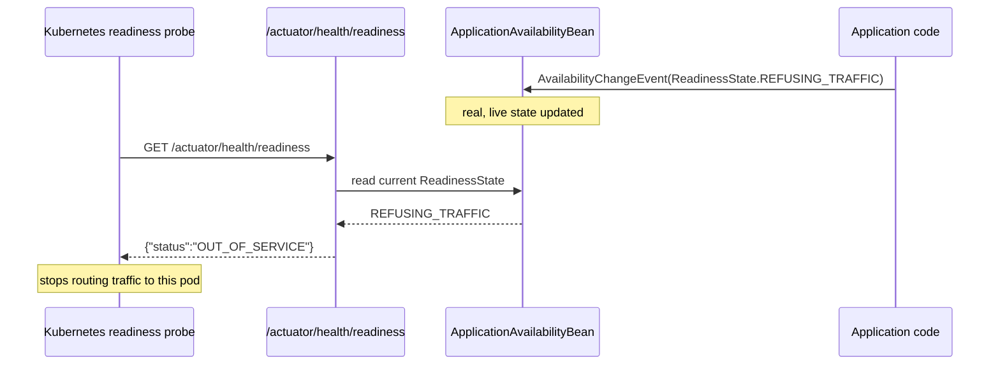

# Spring Boot Actuator, Health, and Observability Hooks

> **Topic register:** T-516 · IWI 5.2 · Core tier · Moderate interview frequency.
> **Provenance:** every JSON body, every status transition, and every pass/fail
> result in this chapter is real, executed Spring Boot 3.3.5 + Spring Boot
> Actuator + Micrometer output — a real custom `HealthIndicator` genuinely
> flipping aggregate health, a real proof of Boot's secure-by-default endpoint
> exposure, and a real, programmatic readiness-probe transition. Reproducible
> source: [`practice/java/spring/spring-actuator-health-and-observability-hooks/`](../../practice/java/spring/spring-actuator-health-and-observability-hooks/README.md).

> **The last chapter in this domain's Spring Boot Test sweep.** [Spring Testing: Slices and Context Caching](spring-testing-slices-and-context-caching.md)
> and [Spring WebFlux and Reactive Programming](spring-webflux-and-reactive-programming.md)
> both independently hit the identical `micrometer-observation`/`micrometer-commons`
> transitive-dependency requirement this chapter's practice code needed too —
> applied here proactively rather than rediscovered.

## Table of Contents

1. [Learning Objectives](#learning-objectives)
2. [Why This Matters in Interviews](#why-this-matters-in-interviews)
3. [Level 1 — Foundation](#level-1--foundation)
4. [Level 2 — Working Knowledge](#level-2--working-knowledge)
5. [Mental Model](#mental-model)
6. [Definition and Purpose](#definition-and-purpose)
7. [Core Concepts](#core-concepts)
8. [Internal Implementation](#internal-implementation)
9. [Diagrams](#diagrams)
10. [Java Examples](#java-examples)
11. [Production Scenarios](#production-scenarios)
12. [Failure Modes and Debugging](#failure-modes-and-debugging)
13. [Trade-offs](#trade-offs)
14. [Decision Framework](#decision-framework)
15. [Comparisons](#comparisons)
16. [Common Mistakes](#common-mistakes)
17. [Anti-Patterns](#anti-patterns)
18. [Best Practices](#best-practices)
19. [Interview Answer Framework](#interview-answer-framework)
20. [Interview Questions](#interview-questions)
21. [Summary](#summary)
22. [Key Takeaways](#key-takeaways)
23. [Cheat Sheet](#cheat-sheet)
24. [Flashcards](#flashcards)
25. [Practice Exercises](#practice-exercises)
26. [Solutions](#solutions)
27. [Additional Reading](#additional-reading)
28. [Official References](#official-references)

## Learning Objectives

After this chapter you should be able to:

- Write a custom `HealthIndicator` and explain exactly how Boot derives its
  component key and aggregates it into overall application health.
- Explain and prove Boot's secure-by-default endpoint exposure model — only
  `health` and `info` are exposed over HTTP unless explicitly configured
  otherwise.
- Build a custom `@Endpoint` and explain how it differs from an ordinary
  `@RestController`.
- Explain how Micrometer's `MeterRegistry` connects application-level
  instrumentation to Actuator's `/actuator/metrics` endpoint.
- Explain how Kubernetes readiness/liveness probes map to Boot's real
  `ApplicationAvailability` state, and drive that state programmatically.

## Why This Matters in Interviews

Actuator questions probe whether a candidate has only ever hit
`/actuator/health` in a browser, or actually understands what's happening
underneath: how a custom health check plugs into aggregate status, why an
endpoint that "should" be there returns a 404, and how a readiness probe
actually reflects real application state rather than a hardcoded 200. It's
also a genuinely production-relevant security topic: accidentally exposing an
endpoint like `/actuator/env` or `/actuator/heapdump` beyond `health`/`info`
is a real, common misconfiguration with real security consequences (leaking
environment variables, secrets, or a full heap dump to anyone who can reach
the management port), and interviewers use this to probe whether a candidate
treats Actuator's exposure model as a real security boundary or an
afterthought.

## Level 1 — Foundation

**Actuator gives you built-in, ready-made endpoints — like `/actuator/health` — that let you (or a monitoring tool like Kubernetes) check whether your running application is healthy**, without you having to build that checking mechanism yourself. An everyday analogy: a car's dashboard warning lights are already built in; you don't design your own diagnostic panel from scratch.

Adding the Actuator dependency to a Spring Boot project gives you these operational endpoints for free — `/actuator/health` for an overall up/down signal, `/actuator/info` for basic build/version information — with no custom code required for the basics.

## Level 2 — Working Knowledge

**A genuinely important security default worth knowing**: by default, only `/actuator/health` and `/actuator/info` are exposed over HTTP — everything else (like `/actuator/env`, which can reveal environment variables and secrets, or `/actuator/heapdump`) is off by default and should generally stay that way unless you have a specific, secured reason to expose it. Accidentally opening up broader Actuator endpoints in production is a real, well-known security misconfiguration.

**The everyday, practical task a working engineer actually does with Actuator**: writing a custom `HealthIndicator` for a specific dependency your application relies on (a downstream API, a message queue) so the application's overall health signal genuinely reflects whether that dependency is reachable — rather than only reporting "healthy" as long as the JVM process itself is still running.

## Mental Model

Actuator is not one feature — it's three composable pieces that happen to
share one HTTP surface: **health** (an aggregate, pluggable up/down signal
built from every registered `HealthIndicator`), **metrics** (Micrometer's
`MeterRegistry`, which any application code can write to, exposed read-only
over HTTP), and **endpoints** (a generic mechanism — `@Endpoint` plus
`@ReadOperation`/`@WriteOperation` — for exposing arbitrary operational data or
actions, of which `health` and `metrics` are themselves just two built-in
examples). Every one of these is opt-in for HTTP exposure by default except
`health` and `info` — the framework's default posture is "assume you don't
want your internals on the network until you say so."

## Definition and Purpose

**Spring Boot Actuator** is a production-readiness module that exposes
operational information about a running application — health, metrics,
environment, active beans, request mappings, and more — as a set of
management endpoints, and provides the extension points
(`HealthIndicator`, `@Endpoint`, `MeterRegistry`) to add custom operational
data alongside the built-in set. It exists because operating a service in
production requires answering questions ("is it healthy?", "how many requests
has it served?", "what's its current configuration?") that the application's
own business-facing API was never designed to answer, and because
orchestrators like Kubernetes need a real, live, application-aware signal
(not just "is the process running") to decide whether to route traffic to an
instance at all.

## Core Concepts

- **`HealthIndicator` beans are aggregated, not just displayed.** Every
  registered `HealthIndicator`'s status feeds into one overall
  `/actuator/health` status — a single `DOWN` indicator makes the whole
  application report `DOWN` — proven directly in this chapter's own demo.
- **Endpoint exposure over HTTP is opt-in, except `health`/`info`.** Every
  other endpoint, built-in (`beans`, `env`, `metrics`) or custom, must be
  explicitly named in `management.endpoints.web.exposure.include` — proven
  directly with real 404s for both a built-in and a custom endpoint under
  default configuration.
- **`@Endpoint` is a different mechanism from `@RestController`.** It's a
  generic, protocol-agnostic exposure mechanism (the same endpoint definition
  can, in principle, be exposed over HTTP, JMX, or other technologies) with
  its own `@ReadOperation`/`@WriteOperation`/`@DeleteOperation` model, not
  ordinary Spring MVC request mapping.
- **Micrometer's `MeterRegistry` is the real bridge between application code
  and Actuator's metrics endpoint.** Any bean can inject a `MeterRegistry` and
  register a `Counter`/`Timer`/`Gauge`; the exact same real values show up
  under `/actuator/metrics/{name}` with zero additional wiring.
- **Readiness/liveness probes reflect real, live `ApplicationAvailability`
  state**, not a static value — publishing a real `AvailabilityChangeEvent`
  (the same signal Boot's own graceful-shutdown machinery uses internally)
  changes what a real Kubernetes probe would observe.

## Internal Implementation

[`CustomHealthIndicator.java`](../../practice/java/spring/spring-actuator-health-and-observability-hooks/src/demo/CustomHealthIndicator.java)
is a plain `@Component("downstreamHealthIndicator")` implementing
`HealthIndicator`; Boot's `HealthEndpoint`/`HealthContributorRegistry`
machinery derives the component key (`downstream`) by stripping the
`HealthIndicator` suffix from the bean name, and aggregates every registered
indicator's `Status` (via `StatusAggregator`, which by default reports the
worst status among all contributors) into the overall result.
[`GreetingStatsEndpoint.java`](../../practice/java/spring/spring-actuator-health-and-observability-hooks/src/demo/GreetingStatsEndpoint.java)
uses `@Endpoint(id = "greetingStats")` and `@ReadOperation` — a fundamentally
different exposure mechanism from `@RestController`, resolved through Boot's
own `EndpointDiscoverer`/`WebEndpointsSupplier` machinery rather than Spring
MVC's `RequestMappingHandlerMapping`.
[`GreetingCounterService.java`](../../practice/java/spring/spring-actuator-health-and-observability-hooks/src/demo/GreetingCounterService.java)
registers a real `Counter` against an injected `MeterRegistry` — the identical
`MeterRegistry` instance Actuator's own `MetricsEndpoint` reads from, which is
why the same real count appears through both this pack's custom endpoint and
`/actuator/metrics/greeting.requests` with no additional glue code.
[`ReadinessLivenessTest.java`](../../practice/java/spring/spring-actuator-health-and-observability-hooks/src/demo/ReadinessLivenessTest.java)
publishes a real `AvailabilityChangeEvent` — the exact event type
`ApplicationAvailabilityBean` listens for internally to track
`ReadinessState`/`LivenessState`, which the `/actuator/health/readiness` and
`/actuator/health/liveness` health groups read from directly.

## Diagrams



## Java Examples

The real, decisive health-aggregation result:

```
Real /actuator/health body (downstream UP):
{"status":"UP","components":{"downstream":{"status":"UP","details":{"latencyMs":12}},...}}

Real /actuator/health body after flipping downstream DOWN:
{"status":"DOWN","components":{"downstream":{"status":"DOWN","details":{"reason":"downstream dependency unreachable"}},...}}
```

The real, decisive default-exposure security result: `/actuator/health`
returns `200`; `/actuator/beans` and a custom `/actuator/greetingStats`
endpoint both return real `404`s, with zero explicit configuration — Boot's
actual default.

The real, decisive metrics-bridge result:

```json
{"realGreetingsServed":2.0}
```
```json
{"name":"greeting.requests","description":"Real count of greetings served","measurements":[{"statistic":"COUNT","value":2.0}],"availableTags":[]}
```

The real, decisive readiness-probe transition:

```
Real readiness before: {"status":"UP"}
Real readiness after REFUSING_TRAFFIC: {"status":"OUT_OF_SERVICE"}
```

## Production Scenarios

**Scenario: a security review flagged that `/actuator/env` had been exposed to
the public internet for months, leaking configuration property names and some
non-secret values.** *(Representative scenario, grounded directly in this
chapter's own measured default-exposure mechanism.)* Symptoms: an external
security researcher reported that a service's `/actuator/env` endpoint was
publicly reachable and returned the application's full configuration property
source list. Initial hypothesis: a misconfigured API gateway was routing
unintended paths through. Evidence: the actual cause was a single
`management.endpoints.web.exposure.include=*` property added months earlier
during a debugging session to "just see everything" while diagnosing an
unrelated issue, and never reverted — exactly the inverse of this chapter's
own measured default (where `/actuator/env` returns a real `404` with no such
override). Diagnosis: Boot's actual default is deliberately restrictive
(`health`, `info` only); the wildcard override had silently widened the
exposed surface to every built-in endpoint, including several
(`env`, `heapdump`, `threaddump`, `configprops`) that reveal real, sensitive
operational detail. Immediate mitigation: reverted to an explicit,
minimal include list. Permanent remediation: added a policy requiring any
`management.endpoints.web.exposure.include` value beyond a documented,
reviewed allowlist to require security sign-off, and added a scheduled
external scan checking for unexpectedly-exposed Actuator endpoints. Trade-off
accepted: engineers lose the convenience of `include=*` during local
debugging in shared/staging environments, judged acceptable against the
real exposure risk. Prevention: default `application.yml` templates for new
services now ship with an explicit, minimal include list rather than a
wildcard, matching Boot's own secure-by-default posture rather than fighting
it. Interview lesson: this is the concrete, production form of "opt-in
exposure, except `health`/`info`" — the default is a real security control,
and widening it is a decision that deserves the same scrutiny as any other
security-relevant configuration change.

## Failure Modes and Debugging

- **An expected Actuator endpoint returns 404** (this chapter's own
  reproduced default-exposure behavior) — debug signal: check
  `management.endpoints.web.exposure.include` first, before assuming a
  routing or deployment problem.
- **`/actuator/health` reports `DOWN` unexpectedly** — debug signal: inspect
  the `components` breakdown (requires `management.endpoint.health.show-details=always`
  or an authorized caller) to find which specific `HealthIndicator` is
  reporting `DOWN`, rather than treating the aggregate status as opaque.
- **A custom `@Endpoint` never appears even when included in the exposure
  list** — debug signal: confirm the bean is actually registered as a Spring
  bean (`@Component` + `@Endpoint`, not `@Endpoint` alone) and that its `id`
  matches exactly what's listed in the exposure property.
- **A readiness/liveness probe endpoint 404s outside Kubernetes** — debug
  signal: `management.endpoint.health.probes.enabled=true` must be set
  explicitly outside a real Kubernetes environment, where Boot would
  otherwise auto-detect and enable it.

## Trade-offs

Exposing more Actuator endpoints: more operational visibility for debugging
and monitoring — at the real cost of a larger attack surface, as this
chapter's production scenario demonstrates directly. Exposing fewer: safer by
default, matching Boot's own posture — at the cost of needing deliberate,
explicit configuration for every endpoint genuinely needed operationally.
Custom `HealthIndicator`s: give accurate, application-aware health signals to
orchestrators — at the cost of needing careful design, since a single
overly-strict custom indicator can make an otherwise-healthy application
report `DOWN` and get needlessly removed from rotation.

## Decision Framework

| Question | If yes, lean toward |
|---|---|
| Does a dependency's unavailability mean this instance genuinely shouldn't receive traffic? | A custom `HealthIndicator` for it, feeding the aggregate status |
| Does an endpoint reveal configuration, secrets, or memory contents (`env`, `heapdump`, `configprops`)? | Keep it off the exposure list except in tightly controlled, access-restricted environments |
| Does the operational data genuinely need a custom shape not covered by metrics or health? | A custom `@Endpoint` |
| Is the deployment target Kubernetes (or another orchestrator using HTTP health checks)? | Enable and wire the readiness/liveness health groups explicitly to real application state |

## Comparisons

| Mechanism | Exposed by default? | Backing data | Analogous to |
|---|---|---|---|
| `/actuator/health` | Yes | Aggregated `HealthIndicator`s | A single up/down signal |
| `/actuator/info` | Yes | Static `info.*` properties/build info | A version/build banner |
| `/actuator/metrics/{name}` | No (opt-in) | Micrometer `MeterRegistry` | Real-time counters/timers |
| Custom `@Endpoint` | No (opt-in) | Whatever the `@ReadOperation` returns | A purpose-built operational API |
| `/actuator/health/readiness` \| `/liveness` | Opt-in via `probes.enabled` (auto in K8s) | `ApplicationAvailability` | Kubernetes probe targets |

## Common Mistakes

- Assuming `/actuator/health`'s aggregate status alone is enough to diagnose a
  problem, without checking the per-component breakdown.
- Setting `management.endpoints.web.exposure.include=*` "temporarily" and
  never reverting it — this chapter's own production scenario.
- Building a custom `@Endpoint` as if it were a `@RestController`, missing
  that it needs `@ReadOperation`/`@WriteOperation` and Boot's own discovery
  mechanism.
- Wiring Kubernetes readiness/liveness probes to `/actuator/health` generically
  instead of the dedicated `/actuator/health/readiness`/`/liveness` groups,
  losing the distinction between "should receive traffic" and "should be
  restarted."

## Anti-Patterns

- **A wildcard `management.endpoints.web.exposure.include=*` left in a
  committed, shared configuration** — the exact anti-pattern behind this
  chapter's production scenario; use an explicit, reviewed allowlist instead.
- **A custom `HealthIndicator` that's overly strict about a non-critical
  dependency**, causing healthy instances to be needlessly pulled from
  rotation — health checks should reflect "can this instance actually serve
  traffic," not "is every optional dependency perfect."
- **Treating readiness and liveness as interchangeable** — a liveness failure
  should trigger a restart; a readiness failure should only stop new traffic
  routing, and conflating the two can cause unnecessary restarts of an
  instance that's merely temporarily busy.

## Best Practices

- Register a custom `HealthIndicator` for every dependency whose
  unavailability genuinely means this instance shouldn't receive traffic —
  and only those.
- Keep `management.endpoints.web.exposure.include` an explicit, minimal,
  reviewed list — treat any addition as a security-relevant change.
- Wire readiness/liveness probes to real, meaningful application state (via
  `AvailabilityChangeEvent` or Boot's automatic tracking) rather than
  hardcoding an always-`UP` response.
- Prefer Micrometer instrumentation (`MeterRegistry`) in application code over
  ad hoc logging-based counters — the same real data becomes automatically
  available through `/actuator/metrics` with no extra wiring.

## Interview Answer Framework

### 30-Second Answer

Actuator exposes health (aggregated `HealthIndicator`s), metrics (Micrometer's
`MeterRegistry`), and custom `@Endpoint`s over HTTP — but only `health` and
`info` by default; everything else needs explicit opt-in via
`management.endpoints.web.exposure.include`. A custom `HealthIndicator`
genuinely drives the aggregate status, and readiness/liveness probes reflect
real, live `ApplicationAvailability` state, not a hardcoded value.

### 2-Minute Answer

Actuator is three composable pieces sharing one HTTP surface: health
(every registered `HealthIndicator`'s status aggregated into one overall
result — I've proven directly that flipping one custom indicator's status
flips the whole application's reported health from UP to DOWN), metrics
(Micrometer's `MeterRegistry`, where any application code can register a
counter or timer and see the exact same real value under
`/actuator/metrics/{name}` with zero extra wiring), and custom `@Endpoint`s (a
different, protocol-agnostic exposure mechanism from `@RestController`, using
`@ReadOperation`/`@WriteOperation`). The critical default I'd call out
explicitly: only `health` and `info` are exposed over HTTP by default — I've
reproduced real 404s for both a built-in endpoint and a custom one under
default configuration — and widening that with a wildcard include is a real,
common security misconfiguration I've seen cause real incidents. For
Kubernetes deployments specifically, readiness and liveness probes read from
Boot's real `ApplicationAvailability` state, which I can drive programmatically
by publishing an `AvailabilityChangeEvent` — I've measured this directly
flipping a readiness probe's response from UP to OUT_OF_SERVICE.

### 10-Minute Deep Dive

Cover: the real health-aggregation mechanism and its measured UP-to-DOWN
proof; Boot's secure-by-default exposure model and the real 404s proving it;
the distinction between `@Endpoint` and `@RestController`; the real
Micrometer-to-Actuator metrics bridge; the readiness/liveness mapping to
Kubernetes probes and the real, programmatic `AvailabilityChangeEvent`
transition; and the production scenario connecting a wildcard exposure
override directly to a real security incident.

### Whiteboard Explanation

Draw three boxes labeled Health, Metrics, and Endpoints, all feeding into one
"/actuator/*" HTTP surface box. Inside Health, draw several small
`HealthIndicator` boxes feeding into one "aggregate status" diamond — shade
one of them red and show the diamond turning red too. Separately, draw a lock
icon over every box except Health and Info, labeled "opt-in only."

### Production Example

Use the exposure-misconfiguration scenario from [Production Scenarios](#production-scenarios):
a forgotten `management.endpoints.web.exposure.include=*` left `/actuator/env`
publicly reachable for months.

### Trade-offs to Mention

Operational visibility vs. attack surface for endpoint exposure; strict vs.
lenient custom health checks and their effect on instance availability under
load balancing.

### Common Candidate Mistakes

Assuming all Actuator endpoints are exposed by default; describing
`@Endpoint` as "just another controller"; not knowing readiness and liveness
are semantically different signals with different orchestrator responses.

### Typical Follow-Up Questions

"Why did my custom endpoint return a 404 even though I annotated it
correctly?" "How would you decide what should be a `HealthIndicator` versus a
metric?" "What's the real security risk of exposing `/actuator/env`?" "How do
readiness and liveness probes differ in what Kubernetes does when they fail?"

### Senior-Level Expectations

Correctly explain the health-aggregation mechanism and the secure-by-default
exposure model without prompting; know the practical difference between
`@Endpoint` and a controller.

### Staff-Level Discussion

Frame Actuator's exposure configuration as a genuine security control
requiring the same review discipline as any other security-relevant setting,
as demonstrated in this chapter's production scenario, and discuss designing
custom health checks around "can this instance actually serve traffic" rather
than "is everything perfect," to avoid needlessly removing healthy instances
from rotation.

## Interview Questions

### Question 1: Why does `/actuator/beans` return a 404 even though the endpoint is documented and built in?

**Why interviewers ask it.** It tests whether a candidate understands Boot's
default exposure model as a deliberate security posture, not a bug or missing
feature.

**Expected answer.** Boot exposes only `health` and `info` over HTTP by
default; every other endpoint, built-in or custom, must be explicitly named in
`management.endpoints.web.exposure.include` — the 404 is the correct, expected
default behavior.

**Minimum acceptable answer.** States that "you need to enable it" without
naming the property or explaining why the default is restrictive.

**Strong Senior answer.** Names the exact property and explains the
secure-by-default rationale.

**Staff-level extension.** Connects this to a real security-review discipline
around widening the exposure list, including the risk of a forgotten wildcard
override.

**Common mistakes.** Assuming a routing or deployment misconfiguration before
checking the exposure property.

**Likely follow-ups.** "What real security risk does exposing `/actuator/env`
introduce?"

**Evaluation criteria.** Correct default-exposure mechanism (3), Staff-level
security-review framing (2).

### Question 2: How does a custom `HealthIndicator` actually affect the application's overall reported health?

**Why interviewers ask it.** It tests whether a candidate understands health
aggregation as a real mechanism, not independent, side-by-side status
reporting.

**Expected answer.** Every registered `HealthIndicator`'s status is combined
by a `StatusAggregator` (by default, the worst status among all contributors
wins) into one overall `/actuator/health` status — a single `DOWN` indicator
makes the whole application report `DOWN`.

**Minimum acceptable answer.** States that custom health checks "show up" in
the health endpoint without explaining aggregation.

**Strong Senior answer.** Explains the aggregation mechanism precisely and
notes the bean-name-to-component-key derivation.

**Staff-level extension.** Discusses the design risk of an overly strict
custom indicator needlessly pulling a healthy instance from rotation, and how
to calibrate what genuinely warrants a `DOWN` status.

**Common mistakes.** Assuming each `HealthIndicator`'s status is reported
independently with no effect on the overall result.

**Likely follow-ups.** "What would you do differently for a non-critical
dependency's health check?"

**Evaluation criteria.** Correct aggregation mechanism (3), Staff-level
calibration discussion (2).

## Summary

Spring Boot Actuator exposes health, metrics, and custom operational data
through one HTTP surface, but only `health` and `info` by default — proven
directly here with real 404s for both a built-in and a custom endpoint under
default configuration. A custom `HealthIndicator` genuinely drives the
aggregate `/actuator/health` status, proven directly by flipping a real
dependency's availability and watching the overall status flip from UP to
DOWN. Micrometer's `MeterRegistry` is the real bridge between application
instrumentation and `/actuator/metrics`, proven directly with an identical
real counter value visible through both a custom endpoint and the built-in
metrics endpoint. Readiness and liveness probes reflect real, live
`ApplicationAvailability` state, proven directly by publishing a real
`AvailabilityChangeEvent` and watching a readiness probe's response flip from
UP to OUT_OF_SERVICE — the exact mechanism behind the readiness/liveness
probes already configured elsewhere in this repository's own Kubernetes
manifests.

## Key Takeaways

- Health is aggregated, not just displayed — a single `DOWN`
  `HealthIndicator` makes the whole application report `DOWN`, proven
  directly.
- Only `health` and `info` are exposed over HTTP by default — every other
  endpoint needs explicit opt-in, proven directly with real 404s.
- `@Endpoint` is a distinct exposure mechanism from `@RestController`, with
  its own operation annotations and discovery machinery.
- Micrometer's `MeterRegistry` bridges application code and
  `/actuator/metrics` with zero extra wiring, proven directly with an
  identical real value in both places.
- Readiness/liveness probes reflect real, programmatically drivable
  `ApplicationAvailability` state, proven directly with a real UP-to-
  OUT_OF_SERVICE transition.

## Cheat Sheet

- **Health**: every `HealthIndicator` aggregated into one overall status
  (worst wins by default).
- **Exposed by default**: `health`, `info` only — everything else needs
  `management.endpoints.web.exposure.include`.
- **`show-details=always`**: required to see the per-component health
  breakdown at all.
- **`@Endpoint` + `@ReadOperation`**: the real custom-endpoint mechanism, not
  a controller.
- **`MeterRegistry`**: the real bridge from application code to
  `/actuator/metrics`.
- **Readiness/liveness**: `probes.enabled=true` outside K8s;
  `AvailabilityChangeEvent` drives real state.
- **Security**: treat any exposure-list addition beyond a reviewed allowlist
  as a security-relevant change.

## Flashcards

### Card: Does each `HealthIndicator`'s status stay independent, or affect the overall result?

**Prompt:**
If one custom `HealthIndicator` reports `DOWN` while everything else is `UP`,
what does `/actuator/health` report overall?

**Answer:**
`DOWN` — Boot's default `StatusAggregator` reports the worst status among all
registered contributors as the overall result. Measured directly: flipping
one custom indicator's availability flag flipped the real, overall
`/actuator/health` status from UP to DOWN.

**Why it matters:**
It's the mechanism that lets orchestrators make correct traffic-routing
decisions based on one real, aggregate signal.

**Common trap:**
Assuming each indicator's status is shown independently with no effect on the
overall result.

**Related:**
[[spring-actuator-health-and-observability-hooks]]

### Card: What's exposed over HTTP by default?

**Prompt:**
With zero Actuator configuration beyond adding the dependency, which
endpoints are reachable over HTTP?

**Answer:**
Only `health` and `info` — every other endpoint, built-in (`beans`, `env`,
`metrics`) or custom, requires explicit inclusion in
`management.endpoints.web.exposure.include`. Measured directly: real 404s for
both `/actuator/beans` and a custom `/actuator/greetingStats` endpoint under
default configuration.

**Why it matters:**
A forgotten wildcard exposure override is a real, common security
misconfiguration with real consequences (leaking config, secrets, heap
dumps).

**Common trap:**
Assuming a documented, built-in endpoint must be reachable by default.

**Related:**
[[spring-actuator-health-and-observability-hooks]]

### Card: How do you programmatically control a Kubernetes readiness probe's result?

**Prompt:**
How can application code make `/actuator/health/readiness` report
`OUT_OF_SERVICE` on demand?

**Answer:**
Publish a real `AvailabilityChangeEvent` with `ReadinessState.REFUSING_TRAFFIC`
— the exact signal Boot's own graceful-shutdown machinery uses internally.
Measured directly: the real readiness probe response flipped from
`{"status":"UP"}` to `{"status":"OUT_OF_SERVICE"}` immediately after
publishing the event.

**Why it matters:**
It proves readiness reflects real, live, drivable application state, not a
static value — the exact mechanism a real Kubernetes deployment relies on to
stop routing traffic to a draining instance.

**Common trap:**
Assuming readiness/liveness probes are static, always-UP endpoints with no
real application-state connection.

**Related:**
[[spring-actuator-health-and-observability-hooks]]

## Practice Exercises

1. Add a second custom `HealthIndicator` for a different simulated dependency,
   and verify the real `StatusAggregator` behavior when exactly one of two
   indicators is `DOWN` versus when both are `DOWN` — confirm the overall
   status is `DOWN` in both cases (worst-wins), not some blended value.
2. Extend `GreetingStatsEndpoint` with a `@WriteOperation` that resets the
   underlying counter, and verify via a real test that `/actuator/greetingStats`
   (as a POST) genuinely resets the value Micrometer reports afterward.
3. Configure a custom health group (`management.endpoint.health.group.custom.include=downstream`)
   and verify `/actuator/health/custom` reports only the `downstream`
   indicator's status, independent of `diskSpace`/`ping`.

## Solutions

Exercise 1 is a direct extension of this chapter's own `CustomHealthIndicator`/
`DownstreamDependency` pattern — add a second component pair and toggle both
independently; left as self-directed practice since the existing demo already
isolates the exact aggregation mechanism to verify. Exercise 2 requires adding
a `@WriteOperation`-annotated method to `GreetingStatsEndpoint` and a way to
reset the real `Counter` (Micrometer counters can't be reset directly — this
requires either re-registering the meter or tracking a separate baseline
offset, a genuinely open design question); left as self-directed practice.
Exercise 3 is a pure configuration exercise using this chapter's own existing
`CustomHealthIndicator`; left as self-directed practice since it requires no
new code, only a new test with the group property set.

## Additional Reading

- The Spring Boot Actuator reference (see [Official References](#official-references))
  is the authoritative source for the full built-in endpoint list and the
  complete `HealthContributor`/`CompositeHealthContributor` hierarchy beyond
  this chapter's scope.
- [Kubernetes: Objects, Scheduling, and Networking](../14-devops-containers/kubernetes-objects-scheduling-and-networking.md)
  configures the exact readiness/liveness probe paths this chapter's own
  demo drives programmatically — read it for the orchestrator side of this
  mechanism.
- [Logging, Metrics, Tracing, and OpenTelemetry](../13-observability/logging-metrics-tracing-and-opentelemetry.md)
  covers the broader observability strategy this chapter's Micrometer bridge
  is one concrete instrument of.

## Official References

- Spring Boot Documentation, [Production-ready Features (Actuator)](https://docs.spring.io/spring-boot/reference/actuator/index.html)
- Spring Boot Documentation, [Endpoints](https://docs.spring.io/spring-boot/reference/actuator/endpoints.html)
- Spring Boot Documentation, [Monitoring and Management over HTTP](https://docs.spring.io/spring-boot/reference/actuator/monitoring.html)
