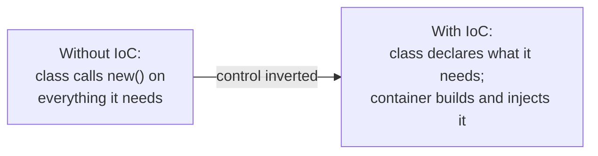

# Spring and Spring Boot Fundamentals

## Table of Contents

1. [Why This Matters](#1-why-this-matters)
2. [Prerequisites](#2-prerequisites)
3. [Foundation (L1)](#3-foundation-l1)
4. [Core Concepts (L2)](#4-core-concepts-l2)
5. [How It Works Internally (L3)](#5-how-it-works-internally-l3)
6. [Practical Usage](#6-practical-usage)
7. [Examples](#7-examples)
8. [Common Mistakes](#8-common-mistakes)
9. [Edge Cases](#9-edge-cases)
10. [Performance Implications](#10-performance-implications)
11. [Trade-offs](#11-trade-offs)
12. [Senior-Level Considerations (L3)](#12-senior-level-considerations-l3)
13. [Staff/System-Level Considerations (L4)](#13-staffsystem-level-considerations-l4)
14. [Production Scenarios](#14-production-scenarios)
15. [Interview Questions](#15-interview-questions)
16. [Coding/Practice Exercises](#16-codingpractice-exercises)
17. [Debugging Exercises](#17-debugging-exercises)
18. [Design Exercises](#18-design-exercises)
19. [Further Reading](#19-further-reading)
20. [Mastery Checklist](#20-mastery-checklist)

## 1. Why This Matters

A widely-shared "Spring Fundamentals — High Priority" interview checklist lists twenty questions — what is the Spring Framework, what is Dependency Injection, what is IoC, what is a bean, and so on — as the ones that open the overwhelming majority of real Spring interview loops, before any topic-specific deep dive. Every one of these twenty concepts is already taught somewhere in this domain, several in genuine depth (`spring-mvc-fundamentals.md`'s stereotype-annotation table and its three-way injection comparison, in particular) — but none of them exist as an actual, answerable **interview question** with a Junior baseline through a Staff extension, the exact format an interviewer is listening for. This chapter is that missing floor: twenty real interview questions, each answered at every seniority level, plus two concepts (IoC as its own named idea, and the full set of bean scopes) that this domain's existing chapters name but never actually define on their own terms.

## 2. Prerequisites

[Java OOP Fundamentals: Classes, Objects, and Interfaces](../02-java/language-core/java-oop-fundamentals-classes-objects-and-interfaces.md) — Spring's dependency injection is built directly on ordinary Java constructors and interfaces, not a special language feature; nothing here requires prior Spring exposure.

## 3. Foundation (L1)

Think of a restaurant kitchen before and after it hires an expediter. Before: every station (grill, sauté, salad) has to know which other stations exist, walk over, and personally hand off a finished component whenever a dish needs one — every station is wired directly to every other station it depends on. After: the expediter holds the full picture, and every station just says what it needs ("I need the sauce station's reduction for table 12") without knowing or caring who actually makes it or how they were assembled into today's staff. **Inversion of Control (IoC)** is exactly this shift: instead of your code constructing and wiring the objects it depends on (`new`-ing them up itself, station-to-station), a container takes over that job — your classes just declare what they need, and the container (the expediter) builds the whole object graph and hands dependencies in. **Dependency Injection (DI)** is the specific mechanism the container uses to do the handing-in; IoC is the broader principle DI is one implementation of.

## 4. Core Concepts (L2)

### The IoC container and the bean

The **IoC container** (Spring's `ApplicationContext`) is the object that actually performs the inversion described above: at startup it discovers every class Spring should manage, constructs one instance of each, resolves what each one depends on, and wires the whole graph together. Any object the container manages this way is called a **bean** — the container's own vocabulary for "an object I created, own the lifecycle of, and can hand out on request," as opposed to any other ordinary Java object your code creates itself with `new` and Spring never sees.

### The full set of bean scopes, not just singleton and prototype

[Spring Bean Scopes and Proxy Modes](spring-bean-scopes-and-proxy-modes.md) covers the singleton-vs-prototype injection gotcha in real depth; the table below is this chapter's contribution — naming every scope Spring actually ships, since an interview question phrased as "what are the bean scopes" expects all of them, not just the two with a famous gotcha attached.

| Scope | Lifetime | Requires a web context? |
|---|---|---|
| `singleton` (default) | One shared instance for the entire `ApplicationContext` | No |
| `prototype` | A new instance every time the bean is requested from the container | No |
| `request` | One instance per HTTP request; discarded when the request completes | Yes |
| `session` | One instance per `HttpSession`; discarded when the session expires | Yes |
| `application` | One instance per `ServletContext` (effectively singleton-like, scoped to the web app rather than the Spring context) | Yes |
| `websocket` | One instance per WebSocket session | Yes |

Requesting a `request`- or `session`-scoped bean outside of an actual active HTTP request or session (e.g., from a background scheduled task) throws a real `BeanCreationException` — there is no request or session for the container to scope the bean to.

### Stereotype annotations, auto-configuration, and starters — one line each, full depth elsewhere

`@Component`/`@Service`/`@Repository`/`@Controller` mark a class as a bean under a self-documenting name for its layer, `@Configuration`/`@Bean` register a bean from a method instead of a class-level annotation, and `@SpringBootApplication`/auto-configuration/starters are Spring Boot's own layer on top of the same container, eliminating boilerplate — [Spring MVC Fundamentals](spring-mvc-fundamentals.md#core-concepts) and [Spring Framework vs. Spring Boot](spring-framework-vs-spring-boot.md#core-concepts) already teach every one of these in real depth (including `@Repository`'s persistence exception translation and exactly what `@SpringBootApplication` expands into); Section 15 below answers each as a direct interview question, citing that existing depth rather than repeating it.

## 5. How It Works Internally (L3)

See [Spring MVC Fundamentals § Internal Implementation](spring-mvc-fundamentals.md#internal-implementation) for the real, demonstrated mechanics of component scanning and constructor-based dependency resolution (including the real, captured difference between a constructor-injection circular dependency, which fails loudly with `BeanCurrentlyInCreationException`, and the identical cycle via field injection, which resolves silently) and [Auto-Configuration and Bean Lifecycle § Internal Implementation](auto-configuration-and-bean-lifecycle.md#internal-implementation) for the real lifecycle-callback ordering (`BeanPostProcessor` before and after initialization, `@PostConstruct`, `@ConditionalOnMissingBean`). This chapter does not duplicate either demo — Section 15 routes each specific interview question to whichever of the two actually proves the answer.

## 6. Practical Usage

Default to constructor injection and `singleton` scope unless you have a specific, stated reason to reach for something else (Section 15, Questions 3 and 7, name the specific reasons). Reach for `@Configuration`/`@Bean` specifically for types you don't own the source of (a third-party client); reach for a stereotype annotation for everything else. Treat `@Profile`-gated beans (Section 15, Question 19) as the standard mechanism for swapping an implementation per environment, not custom `if` branches reading an environment variable.

## 7. Examples

This chapter is a recognition-and-interview-question synthesis over this domain's own already-executed evidence, not a new demo — [Spring MVC Fundamentals](spring-mvc-fundamentals.md) and [Auto-Configuration and Bean Lifecycle](auto-configuration-and-bean-lifecycle.md) both cite real, compiled, captured Java output for the mechanics this chapter's interview questions answer. Section 15 links each question to the specific real evidence backing it.

## 8. Common Mistakes

- Answering "what is Dependency Injection" by describing the *container* (IoC) rather than the *mechanism* (constructor/setter/field injection) — the two are related but not the same word for the same thing (Section 3).
- Naming only `singleton` and `prototype` when asked for "the bean scopes," missing `request`/`session`/`application`/`websocket` entirely (Section 4).
- Believing `@Autowired` is required on every injection point — a class with exactly one constructor has not needed it since Spring Framework 4.3, a real, commonly-missed detail (Section 15, Question 10).

## 9. Edge Cases

- Two beans of the same type with neither `@Primary` nor a `@Qualifier` — Spring fails to start with a `NoUniqueBeanDefinitionException`, not a silent pick of "the first one found" (Section 15, Question 11).
- A `@Profile`-gated bean with no active profile matching it — the bean is simply never created; a use case depending on it fails to start with an unsatisfied-dependency error, not a null at runtime (Section 15, Question 19).

## 10. Performance Implications

Component scanning and bean instantiation happen once, at application startup — not per request — so the cost of "how many beans does my application have" is a one-time startup-latency concern, not a runtime one; [Auto-Configuration and Bean Lifecycle](auto-configuration-and-bean-lifecycle.md) covers the real, measurable startup-time implications of auto-configuration's own conditional evaluation.

## 11. Trade-offs

Constructor injection's own real trade-off (immutability and visible dependencies, at the cost of a large parameter list becoming an obvious "too many responsibilities" smell) versus field injection's (terse, but hides dependencies from anything outside the class and makes plain-`new` unit testing impossible) is the practical version of the deeper IoC trade-off: handing control to a container buys testability and swappable implementations, at the cost of a class no longer being fully understandable by reading its own source in isolation — you also need to know what the container will inject.

## 12. Senior-Level Considerations (L3)

A Senior candidate distinguishes IoC (the principle) from DI (Spring's specific mechanism for it) without being asked to, and can explain *why* Spring detects a constructor-injection circular dependency at startup but silently tolerates the identical cycle via field injection — not just that the difference exists (Section 5).

## 13. Staff/System-Level Considerations (L4)

At Staff scope, the twenty questions in this chapter stop being individually-scored trivia and become one coherent judgment: does this candidate understand Spring as a container built on ordinary Java constructs (IoC via constructors, auto-configuration via conditional `@Configuration` classes), or as a collection of memorized annotations with no underlying model? The follow-up chain in Section 15 ("how does it work internally," "why do we use it," "what are the alternatives") is specifically designed to surface that difference within a single question.

## 14. Production Scenarios

No dedicated production-cookbook entry is cited here — an honest gap, not a placeholder. This chapter routes to [Auto-Configuration and Bean Lifecycle](auto-configuration-and-bean-lifecycle.md)'s own real production scenario (an unintended `DataSource` auto-configured from a test-scoped dependency leaking onto the production classpath) rather than inventing a new one for fundamentals-level questions.

## 15. Interview Questions

### Question 1 — What is the Spring Framework?

**Why interviewers ask it.** The literal opening question of most Spring loops — tests whether a candidate can state what Spring actually is before any annotation-level detail.

**Expected answer (Junior).** A Java framework providing dependency injection, a container that manages application objects ("beans"), and supporting modules (MVC for web, transaction management, data access) that reduce the boilerplate of wiring an application together by hand.

**Strong Mid answer.** Adds: Spring's core is the IoC container itself; everything else (MVC, Data, Security) is a module built on top of that same container, not a separate mechanism.

**Strong Senior answer.** Distinguishes Spring Framework from Spring Boot precisely — Spring Framework is the programming model; Spring Boot is a layer on top adding starters, auto-configuration, and an embedded server (full depth: [Spring Framework vs. Spring Boot](spring-framework-vs-spring-boot.md)).

**Staff-level extension.** Frames the choice to adopt Spring at all as an organizational one — a large, opinionated framework trades some flexibility for a common vocabulary across every team's services, which pays off specifically at multi-team scale.

**Common mistakes.** Describing only Spring Boot (starters, auto-configuration) as if it were "Spring" itself, with no awareness of the underlying framework.

**Follow-up questions.** "What's the actual difference between Spring and Spring Boot?" "What problem did Spring solve when it was first created?"

**Evaluation criteria (1–5).** 1: no clear definition. 3: correct definition, no Framework/Boot distinction. 5: precise definition plus the Framework/Boot distinction, unprompted.

### Question 2 — What is Dependency Injection (DI)?

**Why interviewers ask it.** Spring's own central idea — a candidate who can't explain this cleanly has a real gap, not a minor one.

**Expected answer (Junior).** Instead of a class creating the objects it depends on with `new`, it declares what it needs (usually as a constructor parameter), and the Spring container builds the dependency and hands it in.

**Strong Mid answer.** Names all three injection styles (constructor, setter, field) and states which is recommended by default and why (full comparison table: [Spring MVC Fundamentals § Core Concepts](spring-mvc-fundamentals.md#core-concepts)).

**Strong Senior answer.** Explains DI as the specific mechanism Spring uses to implement the broader IoC principle (Section 3) — the class stops being responsible for knowing how to construct its own dependencies, only for stating what it needs.

**Staff-level extension.** Connects DI to testability at the organizational level: a codebase that consistently uses constructor injection can be unit-tested with plain `new` and no Spring context anywhere, a real velocity difference across an entire team's test suite, not just one class.

**Common mistakes.** Confusing DI with the IoC container itself, or being unable to name more than one injection style.

**Follow-up questions.** "What is IoC, and how does it relate to DI?" (Question 4.) "Which injection style would you use, and why?" (Question 3.)

**Evaluation criteria (1–5).** 1: no working definition. 3: correct definition, one injection style named. 5: correct definition, all three styles named, states the recommended default with a reason.

### Question 3 — Constructor Injection vs. Field Injection — which approach and why?

**Why interviewers ask it.** Tests whether a candidate has an opinion grounded in real trade-offs, not just familiarity with `@Autowired`.

**Expected answer (Junior).** Constructor injection is generally recommended — dependencies are visible in one place (the constructor signature) and the class can be fully constructed and unit-tested with plain `new`, no Spring container required.

**Strong Mid answer.** Adds the immutability point (constructor-injected fields can be `final`; field-injected ones cannot) and the "too many dependencies" smell (a 10-parameter constructor is an obvious code smell; silently-accumulating `@Autowired` fields are not) — full 10-row comparison: [Spring MVC Fundamentals § Core Concepts](spring-mvc-fundamentals.md#core-concepts).

**Strong Senior answer.** States that field injection makes a class untestable with plain `new` (a private field can't be set without reflection or a Spring test context) and explains this as the real, practical cost, not a style preference.

**Staff-level extension.** Names the real circular-dependency divergence: constructor injection fails loudly at startup (`BeanCurrentlyInCreationException`) when two beans depend on each other; field injection resolves the identical cycle silently, which "fixes" the symptom without fixing the underlying design issue (real, captured evidence: [Spring MVC Fundamentals § Internal Implementation](spring-mvc-fundamentals.md#internal-implementation)).

**Common mistakes.** Recommending field injection "because it's shorter to write," with no acknowledgment of the visibility/immutability/testability costs.

**Follow-up questions.** "What happens if two beans depend on each other via constructor injection?" "When would setter injection actually be the right choice?" (A genuinely optional dependency.)

**Evaluation criteria (1–5).** 1: no stated preference or reasoning. 3: recommends constructor injection with one correct reason. 5: full trade-off table plus the circular-dependency divergence, unprompted.

### Question 4 — What is IoC (Inversion of Control)?

**Why interviewers ask it.** The principle underneath the whole framework; a candidate who only knows "DI" as a memorized term often can't answer this one cleanly, which is exactly what this question is designed to surface.

**Expected answer (Junior).** Instead of your code controlling how objects get created and wired together (calling `new` on everything it needs), that control is handed to a container — your code just states what it needs (the mental model: Section 3's expediter analogy).

**Strong Mid answer.** States explicitly that DI is *one implementation* of the broader IoC principle — the two terms are related, not interchangeable, and IoC could in principle be implemented other ways (a service locator, for instance) even though Spring specifically uses DI.

**Strong Senior answer.** Names the concrete container that performs this inversion in Spring (the `ApplicationContext`) and connects it to the bean lifecycle it manages (Question 6).

**Staff-level extension.** Discusses the real trade-off IoC introduces: a class's full behavior can no longer be understood by reading its own source alone, since what gets injected depends on container configuration elsewhere — a real cost weighed against the testability and swappability benefit (Section 11).

**Common mistakes.** Treating "IoC" and "DI" as fully synonymous with no distinction at all — the single most common gap this question is designed to catch.

**Follow-up questions.** "Is DI the only way to implement IoC?" "What's actually being inverted, compared to what?"

**Evaluation criteria (1–5).** 1: no distinction from DI at all. 3: states the inversion correctly but conflates it with DI. 5: precise definition, explicit DI-is-one-implementation distinction, names the `ApplicationContext`.

### Question 5 — What is a Spring Bean?

**Why interviewers ask it.** Tests basic container vocabulary — surprisingly often answered vaguely even by candidates who use beans daily.

**Expected answer (Junior).** Any object that the Spring IoC container creates, configures, and manages the lifecycle of — as opposed to an ordinary object your own code creates with `new`, which Spring never sees or manages.

**Strong Mid answer.** States how a class becomes a bean (a stereotype annotation like `@Component`, or a `@Bean`-annotated method inside a `@Configuration` class) and that the container discovers it via component scanning.

**Strong Senior answer.** Distinguishes "a bean" from "a POJO instantiated with `new`" precisely: only the container-managed instance is a bean, even if the exact same class is used both ways in the same application.

**Staff-level extension.** Connects bean management to every other framework feature that depends on it — transactions, caching, security — all of which are implemented as proxies wrapped around beans at the point the container creates them, not as a separate mechanism.

**Common mistakes.** Defining "bean" so loosely it would describe any Java object, with no reference to the container managing it.

**Follow-up questions.** "How does a class become a bean?" (Question 14.) "What's the difference between a bean and a regular object?"

**Evaluation criteria (1–5).** 1: no working definition. 3: correct definition, doesn't name the discovery mechanism. 5: precise definition, names component scanning or `@Bean`, connects to proxy-based features.

### Question 6 — Explain the Spring Bean Lifecycle.

**Why interviewers ask it.** Tests whether a candidate understands beans as going through a real, ordered sequence with hookable moments, not "Spring just creates them."

**Expected answer (Junior).** A bean is created, has its dependencies injected, is initialized (ready for use), and is eventually destroyed when the application shuts down — `@PostConstruct` is the everyday hook for "run this once my dependencies are ready."

**Strong Mid answer.** States that a constructor runs *before* dependency injection completes for field injection, which is exactly why `@PostConstruct` (not the constructor) is the right place for logic needing injected fields already populated (real detail: [Auto-Configuration and Bean Lifecycle § Level 1](auto-configuration-and-bean-lifecycle.md#level-1-foundation)).

**Strong Senior answer.** Names `BeanPostProcessor` as a hook that runs before and after every bean's own initialization — the actual mechanism behind framework features like `@Transactional` proxy creation, not a separate special case.

**Staff-level extension.** Explains why this precision matters operationally: knowing *which exact moment* in the lifecycle a feature hooks into is what lets an engineer correctly diagnose why, say, `@Async` and `@Transactional` interact unexpectedly on the same method (real evidence: [Auto-Configuration and Bean Lifecycle § Interview Questions, Q1](auto-configuration-and-bean-lifecycle.md#interview-questions)).

**Common mistakes.** Describing only "created then destroyed" with no mention of dependency injection or initialization as distinct, orderable steps.

**Follow-up questions.** "What runs first — the constructor or dependency injection, for field injection?" "What's a `BeanPostProcessor`, and what real Spring feature is built on it?"

**Evaluation criteria (1–5).** 1: no real sequence. 3: names create/inject/initialize/destroy in order. 5: full sequence plus `BeanPostProcessor` and a real framework feature built on it.

### Question 7 — What are the different Bean Scopes?

**Why interviewers ask it.** A commonly under-answered question — most candidates know `singleton` is the default and stop there.

**Expected answer (Junior).** `singleton` (one shared instance for the whole application, the default) and `prototype` (a new instance every time the bean is requested).

**Strong Mid answer.** Names all six real Spring scopes, including the four web-context-specific ones: `request`, `session`, `application`, and `websocket` (full table: Section 4).

**Strong Senior answer.** States the real gotcha: injecting a `prototype`-scoped bean directly into a `singleton` via ordinary constructor injection does *not* give a fresh instance each use — Spring resolves it once, at the singleton's own creation, and it's held forever after (real, captured evidence: [Spring Bean Scopes and Proxy Modes](spring-bean-scopes-and-proxy-modes.md)).

**Staff-level extension.** Names the actual fix (`ObjectProvider<T>` or a scoped proxy) and explains *why* a plain injected field can't solve it — the singleton's dependency is resolved exactly once, permanently, regardless of the target bean's own declared scope.

**Common mistakes.** Naming only `singleton`/`prototype`, or believing a request/session-scoped bean can be safely injected into a singleton without a scoped proxy.

**Follow-up questions.** "What happens if you inject a prototype bean into a singleton?" "What error do you get requesting a request-scoped bean outside an active HTTP request?"

**Evaluation criteria (1–5).** 1: names only `singleton`. 3: names all six scopes. 5: all six scopes plus the prototype-into-singleton gotcha and its real fix.

### Question 8 — Difference between `@Component`, `@Service`, `@Repository`, and `@Controller`.

**Why interviewers ask it.** Tests whether a candidate treats these as functionally meaningful or as interchangeable decoration.

**Expected answer (Junior).** All four register a class as a bean via component scanning; `@Component` is the generic form, and the other three are the same mechanism under self-documenting names for three conventional layers — business logic, data access, and web request handling.

**Strong Mid answer.** Names the one functionally-real difference among them: `@Repository` additionally enables persistence exception translation, converting a technology-specific exception (e.g., a JDBC `SQLException`) into one of Spring's own unchecked `DataAccessException` subtypes.

**Strong Senior answer.** States that `@Service` and `@Controller` add no behavior beyond `@Component` itself — their entire value is documentation and convention, a real and often-surprising fact to say out loud confidently.

**Staff-level extension.** Frames the choice to use the specific stereotypes (rather than `@Component` everywhere) as an organizational-clarity decision — a codebase where every class is `@Component` loses the layer-identification value these annotations exist to provide, a real cost at multi-team scale even though nothing breaks technically.

**Common mistakes.** Claiming `@Service` has real, enforced behavioral differences from `@Component` — it doesn't; only `@Repository`'s exception translation is a genuine behavioral difference.

**Follow-up questions.** "Which of these four actually changes runtime behavior, versus just naming?" "What does `@Repository`'s exception translation actually do?"

**Evaluation criteria (1–5).** 1: treats all four as identical with no distinction. 3: names them as layer-conventions. 5: correctly isolates `@Repository`'s exception translation as the one real behavioral difference.

### Question 9 — `@RestController` vs. `@Controller`.

**Why interviewers ask it.** A very commonly asked, easy-to-get-wrong pair — tests precise understanding of annotation composition, not just "one is for REST."

**Expected answer (Junior).** `@RestController` is `@Controller` + `@ResponseBody` combined — every method's return value is written directly to the HTTP response body (JSON, by default) instead of being resolved as a view name.

**Strong Mid answer.** States what `@Controller` alone does without `@ResponseBody`: a method's return value is treated as a *view name* (for a server-rendered app using Thymeleaf or JSPs), not response data.

**Strong Senior answer.** Connects this exact composition pattern to its parallel elsewhere in Spring: `@RestControllerAdvice` = `@ControllerAdvice` + `@ResponseBody`, the identical relationship applied to exception handling (full depth: [Bean Validation and Global Exception Handling § `@ControllerAdvice` vs. `@RestControllerAdvice`](bean-validation-and-global-exception-handling.md)).

**Staff-level extension.** Notes that a mixed codebase (some `@Controller` serving views, some `@RestController` serving JSON) is a legitimate, common pattern during a server-rendered-to-API migration, not automatically a sign of inconsistency.

**Common mistakes.** Describing `@RestController` as "a completely different annotation" rather than the specific composition of `@Controller` + `@ResponseBody`.

**Follow-up questions.** "What's the equivalent composition for global exception handling?" "Why would a real application use both annotations in the same codebase?"

**Evaluation criteria (1–5).** 1: no real explanation of the composition. 3: states the composition correctly. 5: composition plus the `@ControllerAdvice`/`@RestControllerAdvice` parallel, unprompted.

### Question 10 — How does `@Autowired` work internally?

**Why interviewers ask it.** Tests whether a candidate understands `@Autowired` as type-based resolution against the container's bean graph, not "magic."

**Expected answer (Junior).** At startup, the container inspects the annotated constructor, field, or setter, determines what type it needs, and looks for a bean of that type in the `ApplicationContext` to inject.

**Strong Mid answer.** States the real, commonly-missed detail: `@Autowired` has been unnecessary on a class's *only* constructor since Spring Framework 4.3 — Spring uses that single constructor automatically; it's still required for field/setter injection or when a class has multiple constructors.

**Strong Senior answer.** Explains resolution order precisely: by type first; if multiple beans of that type exist, by `@Qualifier` name if present, then by `@Primary` if one candidate is marked as the default, failing with `NoUniqueBeanDefinitionException` if neither disambiguates it (Question 11).

**Staff-level extension.** Connects this to the recursive nature of the whole resolution process: resolving one bean's dependencies can require building other beans first, recursively, until the full graph resolves — the same mechanism that produces a `BeanCurrentlyInCreationException` when a cycle has no valid starting point (Question 3's Staff extension).

**Common mistakes.** Describing `@Autowired` as name-based matching rather than type-based (with name as a tiebreaker only via `@Qualifier`).

**Follow-up questions.** "What happens when multiple beans of the same type exist?" (Question 11.) "When is `@Autowired` actually required today?"

**Evaluation criteria (1–5).** 1: "it just injects the dependency," no mechanism. 3: correct type-based resolution described. 5: full resolution order (type → qualifier → primary → failure) plus the 4.3 single-constructor detail.

### Question 11 — What happens when multiple beans of the same type are available?

**Why interviewers ask it.** Directly tests whether a candidate knows Spring fails loudly here rather than guessing.

**Expected answer (Junior).** Spring fails to start the application with a `NoUniqueBeanDefinitionException`, unless the ambiguity is resolved with `@Qualifier` or `@Primary`.

**Strong Mid answer.** States both resolution mechanisms and their relationship: `@Qualifier` picks a specific named bean at the injection point; `@Primary` marks one candidate as the application-wide default when no `@Qualifier` is present (Question 12).

**Strong Senior answer.** Notes this is a startup-time failure, not a runtime one — the ambiguity is caught before the application ever accepts a request, a deliberate fail-fast design choice.

**Staff-level extension.** Discusses the real design trade-off of having multiple implementations of the same interface as beans at all (e.g., two `PaymentGateway` implementations) — a legitimate pattern for a strategy-style design, but one that requires disambiguation discipline (`@Qualifier`/`@Primary`) applied consistently across every injection point, not just the ones that happen to break first.

**Common mistakes.** Assuming Spring picks "the first one found" silently — it does not; this is a hard startup failure by design.

**Follow-up questions.** "How do you fix this ambiguity?" (Question 12.) "Is this caught at startup or at request time?"

**Evaluation criteria (1–5).** 1: assumes silent, arbitrary selection. 3: correctly names the exception and one fix. 5: correct exception, both fixes, states this is a deliberate fail-fast startup check.

### Question 12 — `@Primary` vs. `@Qualifier`.

**Why interviewers ask it.** Directly follows Question 11 in most real loops — tests the specific mechanism, not just that ambiguity exists.

**Expected answer (Junior).** `@Qualifier("beanName")` on an injection point picks a specific bean by name when multiple candidates of the same type exist; `@Primary` on a bean's own class or `@Bean` method marks it as the default choice when no `@Qualifier` narrows the choice.

**Strong Mid answer.** States the precedence relationship explicitly: an explicit `@Qualifier` at the injection point always wins over `@Primary` — `@Primary` is only the fallback default.

**Strong Senior answer.** Gives a concrete example distinguishing when each is the right tool: `@Primary` for "this is the one almost every caller wants" (a default `PaymentGateway`); `@Qualifier` for "this specific caller needs the non-default one" (a sandbox `PaymentGateway` used by exactly one test-support class).

**Staff-level extension.** Notes the maintainability cost of over-using `@Qualifier` string literals scattered across a codebase (typo-prone, no compile-time check) versus a more structured alternative (a custom qualifier annotation) once a codebase has more than a handful of ambiguous injection points.

**Common mistakes.** Believing `@Primary` and `@Qualifier` are interchangeable, or forgetting that an explicit `@Qualifier` overrides `@Primary` rather than the two conflicting.

**Follow-up questions.** "Which one wins if both are present?" "What's a real downside of relying heavily on `@Qualifier` string literals?"

**Evaluation criteria (1–5).** 1: can't distinguish the two. 3: correct definitions, no precedence stated. 5: correct definitions, precedence stated, a concrete example of when each is the right choice.

### Question 13 — What are `@Configuration` and `@Bean`?

**Why interviewers ask it.** Tests the second, less common way to register a bean — many candidates only know stereotype annotations.

**Expected answer (Junior).** `@Configuration` marks a class as a source of bean definitions; a method inside it annotated `@Bean` is called once, and its return value is registered as a bean — the alternative to a stereotype annotation for a class you don't own the source of (a third-party library class, for instance).

**Strong Mid answer.** States precisely why this alternative is necessary: you can't add `@Component` to a class you didn't write, so `@Bean` inside your own `@Configuration` class is how a third-party type becomes a managed bean.

**Strong Senior answer.** Explains that `@Configuration` classes are themselves proxied by CGLIB by default (`proxyBeanMethods = true`), so calling one `@Bean` method from another *within the same class* returns the same singleton instance rather than a fresh object — a real, sometimes-surprising mechanism (full depth: [Auto-Configuration and Bean Lifecycle § Internal Implementation](auto-configuration-and-bean-lifecycle.md#internal-implementation)).

**Staff-level extension.** Discusses when `proxyBeanMethods = false` is the deliberate right choice (a "lite" configuration class with no cross-bean-method calls, trading the proxy's small overhead for simpler behavior) versus the default.

**Common mistakes.** Assuming calling one `@Bean` method from another creates two separate instances — it does not, by default, precisely because of the CGLIB proxy.

**Follow-up questions.** "Why would you use `@Bean` instead of a stereotype annotation?" "What happens if one `@Bean` method calls another in the same `@Configuration` class?"

**Evaluation criteria (1–5).** 1: no clear definition. 3: correct definition and the third-party-class use case. 5: correct definition, use case, and the CGLIB proxy/`proxyBeanMethods` detail.

### Question 14 — What is Component Scanning?

**Why interviewers ask it.** The mechanism underneath every stereotype annotation — tests whether a candidate knows beans don't register themselves.

**Expected answer (Junior).** At startup, Spring walks the application's packages looking for classes annotated `@Component` (or a stereotype specialization), and registers each one it finds as a bean.

**Strong Mid answer.** States the scanning boundary precisely: `@ComponentScan` (implied by `@SpringBootApplication` for its own package and every sub-package) determines which packages actually get scanned — a class outside that boundary is never discovered, no matter how correctly it's annotated.

**Strong Senior answer.** Names the real, concrete failure mode this produces: a class in the application's *default package*, or outside the main application class's package tree, is silently never scanned — a genuine, documented gotcha (full depth: [Spring Framework vs. Spring Boot § Internal Implementation](spring-framework-vs-spring-boot.md#internal-implementation)).

**Staff-level extension.** Frames package structure itself as an architectural decision because of this mechanism: a multi-module project needs an explicit, deliberate `@ComponentScan` base-package strategy, not an assumption that "it'll just find everything."

**Common mistakes.** Assuming every `@Component`-annotated class in the classpath gets picked up regardless of package location.

**Follow-up questions.** "What determines which packages actually get scanned?" "What happens to a `@Component` class outside the scanned package tree?"

**Evaluation criteria (1–5).** 1: no mention of a scan boundary at all. 3: correct mechanism, boundary vaguely stated. 5: correct mechanism, precise boundary, names the real default-package gotcha.

### Question 15 — What does `@SpringBootApplication` contain?

**Why interviewers ask it.** A near-certain question — tests whether "just put this on your main class" is understood or memorized.

**Expected answer (Junior).** It's a composition of three separate annotations: `@Configuration` (this class can define beans), `@EnableAutoConfiguration` (turn on Spring Boot's auto-configuration), and `@ComponentScan` (scan this package and its sub-packages).

**Strong Mid answer.** States what each of the three specifically contributes on its own, not just that there are three (full breakdown: [Spring Framework vs. Spring Boot § Core Concepts](spring-framework-vs-spring-boot.md#core-concepts)).

**Strong Senior answer.** Connects `@ComponentScan`'s inclusion here directly to Question 14's package-boundary gotcha — it's specifically *this* composed annotation's placement (on the main class, in the application's root package) that determines the entire scan boundary for the whole application.

**Staff-level extension.** Discusses why Spring Boot chose composition over three separate required annotations: reducing the boilerplate every single Spring Boot application would otherwise need to write identically, the same design philosophy behind starters and auto-configuration generally.

**Common mistakes.** Treating `@SpringBootApplication` as one atomic, opaque thing rather than three real, independently-meaningful annotations.

**Follow-up questions.** "What does each of the three annotations do on its own?" "Where does this annotation need to live, and why does that matter?"

**Evaluation criteria (1–5).** 1: "it sets up the app," no decomposition. 3: names the three annotations. 5: names all three, explains each, connects placement to the scan-boundary gotcha.

### Question 16 — How does Spring Boot Auto-Configuration work?

**Why interviewers ask it.** One of the highest-frequency Spring Boot questions — tests real mechanism understanding versus "it just works."

**Expected answer (Junior).** Spring Boot ships a large set of `@Configuration` classes, each guarded by conditions (like "only if this class is on the classpath" or "only if the application hasn't already defined this bean itself"), which activate automatically based on what's actually present.

**Strong Mid answer.** Names `@ConditionalOnMissingBean` specifically as the guard that lets an application override exactly one piece of auto-configured behavior — define your own bean of that type, and Spring Boot's own default quietly backs off, no explicit "disable this" step needed.

**Strong Senior answer.** States precisely where these conditional configuration classes live (`spring-boot-autoconfigure`) and that `@EnableAutoConfiguration` (part of `@SpringBootApplication`, Question 15) is what actually turns this scanning-and-conditional-activation process on.

**Staff-level extension.** Connects this mechanism to a real, non-obvious production risk: a test-scoped dependency that leaks onto the production classpath can cause auto-configuration to silently activate something never intended for production (real production scenario: [Auto-Configuration and Bean Lifecycle](auto-configuration-and-bean-lifecycle.md#production-scenarios)) — the same conditional mechanism that removes boilerplate can also silently do the wrong thing if the classpath itself is wrong.

**Common mistakes.** Describing auto-configuration as "Spring Boot guessing what you want" rather than a real, deterministic, classpath-and-existing-bean-conditional mechanism.

**Follow-up questions.** "How do you override one specific piece of auto-configured behavior?" "What's the real risk this mechanism creates if your classpath is wrong?"

**Evaluation criteria (1–5).** 1: no real mechanism described. 3: correct conditional-activation mechanism. 5: full mechanism, `@ConditionalOnMissingBean` override pattern, and the real classpath-leak production risk.

### Question 17 — What is `@EnableAutoConfiguration`?

**Why interviewers ask it.** Tests whether a candidate can decompose `@SpringBootApplication` (Question 15) rather than treating it as atomic.

**Expected answer (Junior).** The specific annotation, composed inside `@SpringBootApplication`, that actually turns on Spring Boot's auto-configuration mechanism (Question 16) — without it, none of Spring Boot's conditional `@Configuration` classes would ever be considered.

**Strong Mid answer.** States that this is one of exactly three annotations `@SpringBootApplication` composes (alongside `@Configuration` and `@ComponentScan`), each with a distinct, separable job.

**Strong Senior answer.** Explains that `@EnableAutoConfiguration` can, in principle, be used on its own (without the rest of `@SpringBootApplication`'s composition) — it's a real, independent annotation, not purely internal syntax sugar with no standalone meaning.

**Staff-level extension.** Discusses why Spring Boot's design separates "turn on auto-configuration" from "scan for components" as two distinct concerns (Question 14) rather than one undifferentiated "start Spring Boot" switch — each concern can, and occasionally does, need independent control.

**Common mistakes.** Being unable to name this annotation at all when asked to decompose `@SpringBootApplication`, defaulting to "it's all just `@SpringBootApplication`."

**Follow-up questions.** "What are the other two annotations composed alongside it?" "Could you use this annotation without `@SpringBootApplication`?"

**Evaluation criteria (1–5).** 1: can't name or place this annotation. 3: correctly names it as part of `@SpringBootApplication`'s composition. 5: correct placement, explains it as independently usable, connects to Question 16's mechanism.

### Question 18 — What are Spring Boot Starter Dependencies?

**Why interviewers ask it.** Tests understanding of Spring Boot's dependency-management story, a real, everyday practical concern.

**Expected answer (Junior).** Curated dependency bundles (e.g., `spring-boot-starter-web`) that pull in everything commonly needed together — Spring MVC, an embedded Tomcat, and Jackson, in that example — with compatible, pre-aligned versions, instead of a developer choosing and version-matching each dependency individually.

**Strong Mid answer.** States the specific problem this solves: assembling a production-ready Spring application by hand means choosing every dependency version and confirming they're mutually compatible — repetitive, error-prone boilerplate a starter eliminates for the overwhelming majority of applications wanting a sensible, conventional default.

**Strong Senior answer.** Connects starters to auto-configuration directly: a starter's real job is putting the right things *on the classpath*; it's auto-configuration (Question 16) that then reacts to that classpath and actually wires up the beans — two distinct, cooperating mechanisms, not one.

**Staff-level extension.** Discusses the trade-off of starters at scale: they make getting started fast and consistent across a whole organization's services, at the cost of pulling in more than any single service might strictly need — a real, if usually acceptable, dependency-footprint cost worth naming when asked about it directly.

**Common mistakes.** Describing a starter as "just a library" rather than a curated, version-aligned bundle whose main value is the alignment itself.

**Follow-up questions.** "How do starters relate to auto-configuration?" "What's a real cost of using a broad starter like `spring-boot-starter-web`?"

**Evaluation criteria (1–5).** 1: no clear definition. 3: correct definition and example. 5: correct definition, the version-alignment problem it solves, and the starter/auto-configuration relationship.

### Question 19 — How do Profiles work? (`@Profile`, `application.properties`, `application.yml`)

**Why interviewers ask it.** A near-universal real-world question — every non-trivial Spring Boot application runs in more than one environment.

**Expected answer (Junior).** A **profile** is a named label (`dev`, `staging`, `prod`, or any string a team chooses) that controls which beans get created and which configuration values get loaded; `@Profile("dev")` on a bean restricts it to being registered only when the `dev` profile is active.

**Strong Mid answer.** States the concrete swap-per-environment pattern this enables: two classes implementing the same interface, one `@Profile("prod")` and one `@Profile("dev")` (a real payment gateway versus a sandbox/mock one), with application code depending on the interface never needing to know which is actually wired in (full mechanism and this exact example: [Spring Profiles: the Concrete Spring Boot Implementation of This Precedence Story](../15-cloud/twelve-factor-config.md#spring-profiles-the-concrete-spring-boot-implementation-of-this-precedence-story)).

**Strong Senior answer.** Connects `application.yml`'s `spring.profiles.active` (or an environment variable of the same name) to which profile-gated beans and `application-{profile}.yml` property overrides actually take effect, and states this as Spring Boot's own concrete implementation of the general externalized-configuration-precedence model.

**Staff-level extension.** Discusses profile-per-environment as an organizational discipline question, not just a technical mechanism: which profiles exist, who can introduce a new one, and how a team prevents "prod" and "dev" configuration from silently drifting apart in ways nobody notices until a deploy.

**Common mistakes.** Believing profiles only affect property values, with no awareness that `@Profile` can also gate which *beans* exist at all.

**Follow-up questions.** "How do you activate a specific profile?" "What happens to a bean whose `@Profile` doesn't match any active profile?" (Section 9's edge case.)

**Evaluation criteria (1–5).** 1: no real mechanism. 3: correct property-override behavior, no bean-gating awareness. 5: full mechanism (bean-gating and property overrides both), a concrete swap-per-environment example, unprompted.

### Question 20 — How do you handle Configuration Management across different environments?

**Why interviewers ask it.** The practical, applied version of Question 19 — tests whether the mechanism translates into a real operational discipline.

**Expected answer (Junior).** Externalize environment-specific values (database URLs, credentials, feature flags) out of the packaged application into `application-{profile}.yml` files or environment variables, and activate the correct profile per environment rather than hardcoding values or maintaining separate builds.

**Strong Mid answer.** States Spring Boot's real property-source precedence order at a high level: command-line arguments and environment variables override `application-{profile}.yml`, which overrides the base `application.yml` — so the same packaged artifact can run correctly in every environment without being rebuilt per environment.

**Strong Senior answer.** Names secrets specifically as a case needing more than plain profile-scoped YAML — credentials belong in a real secrets manager or vault-injected environment variable, never committed in any `application-{profile}.yml`, profile mechanism or not.

**Staff-level extension.** Frames this as the concrete Spring Boot instance of the general twelve-factor "config in the environment" principle (full depth: [Twelve-Factor Config](../15-cloud/twelve-factor-config.md)) — the same reasoning applies whether the mechanism happens to be Spring profiles, a Kubernetes ConfigMap, or a cloud provider's parameter store; the organizational discipline (one artifact, environment-supplied config, no environment-specific rebuilds) is the actual point, not the specific tool.

**Common mistakes.** Treating "we use profiles" as a complete answer with no mention of secrets handling or the precedence order that makes one build artifact deployable everywhere.

**Follow-up questions.** "Where do secrets belong, and why not in `application-prod.yml`?" "What happens if the same property is set in both `application.yml` and an environment variable?"

**Evaluation criteria (1–5).** 1: describes only "different files per environment," no precedence or secrets awareness. 3: correct profile mechanism and precedence order. 5: full precedence order, explicit secrets-handling answer, and the twelve-factor framing.

## 16. Coding/Practice Exercises

1. Write two classes implementing the same interface, annotate one `@Primary`, and inject the interface into a third bean with no `@Qualifier` — confirm the `@Primary` one is chosen. Then add a `@Qualifier` at the injection point naming the *other* implementation, and confirm it now wins over `@Primary`.
2. Reproduce [Spring MVC Fundamentals](spring-mvc-fundamentals.md)'s own circular-dependency demo: two beans requiring each other via constructor injection (observe the real `BeanCurrentlyInCreationException`), then the identical cycle via field injection (observe it silently resolving instead).

## 17. Debugging Exercises

Given a `@Component`-annotated class that Spring never picks up despite correct annotations and no typos, work through Question 14's diagnostic in order: is it inside the scanned package tree at all (check the main class's package versus this class's package), and is it in Java's default (unnamed) package specifically — the single most common real cause.

## 18. Design Exercises

You're designing a service that needs a different `NotificationSender` implementation per environment (a real SMS/email provider in production, a console-logging stub in local development) with zero `if` branches reading an environment variable anywhere in application code. Describe which two mechanisms from this chapter (Questions 12 and 19) combine to solve this cleanly, and why neither one alone is sufficient.

## 19. Further Reading

- [Spring MVC Fundamentals](spring-mvc-fundamentals.md) — the full, real, demonstrated mechanics of dependency injection, component scanning, and stereotype annotations this chapter routes to repeatedly.
- [Auto-Configuration and Bean Lifecycle](auto-configuration-and-bean-lifecycle.md) — the full bean-lifecycle and auto-configuration internals.
- [Spring Framework vs. Spring Boot](spring-framework-vs-spring-boot.md) — the full `@SpringBootApplication` decomposition and starter/auto-configuration relationship.
- [Twelve-Factor Config](../15-cloud/twelve-factor-config.md) — Spring Profiles as one concrete implementation of the general config-per-environment principle.

## 20. Mastery Checklist

- [ ] I can state the difference between IoC (the principle) and DI (Spring's mechanism for it), without conflating the two.
- [ ] I can name all six Spring bean scopes, not just singleton and prototype.
- [ ] I can explain why `@Repository` is the one stereotype annotation with a real behavioral difference from `@Component`.
- [ ] I can trace `@Autowired`'s resolution order (type → `@Qualifier` → `@Primary` → failure) without looking it up.
- [ ] I can decompose `@SpringBootApplication` into its three real, separately-meaningful annotations.
- [ ] I can explain how `@Profile` gates both beans and configuration values, and where secrets belong instead.
