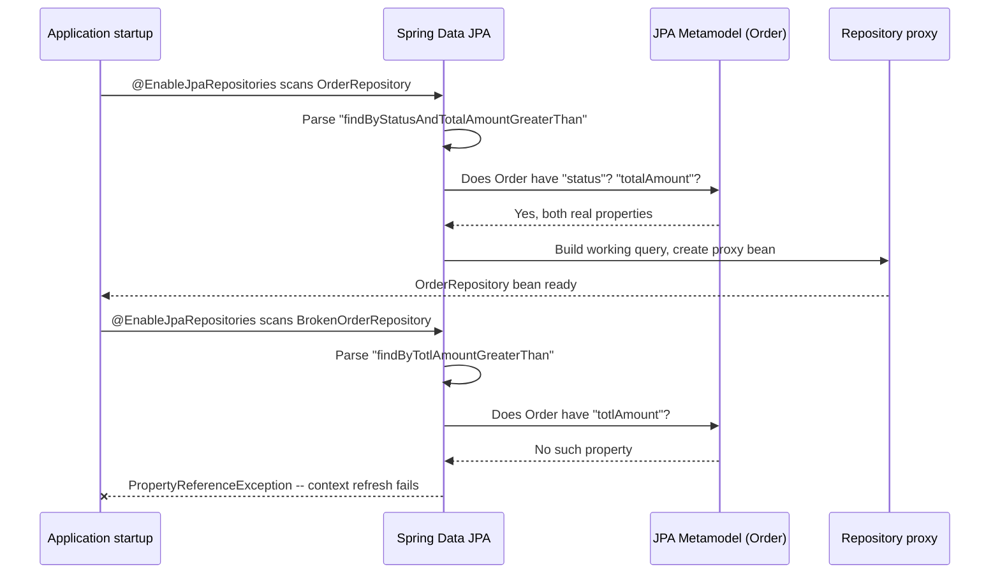

# Spring Data JPA Repository Abstraction

> **Topic register:** T-510 · IWI 5.3 · Core tier · High interview frequency [H]
> **Provenance:** all evidence in this chapter is real, executed output from a real Spring Framework
> 6.2.19 + Spring Data JPA 3.5.13 + Hibernate ORM 6.6.55.Final app
> (`practice/java/spring-data-jpa-repositories/`), including a real `ApplicationContext` startup
> failure proving derived query methods are validated eagerly, not on first call.

## Table of Contents

1. [Learning Objectives](#learning-objectives)
2. [Why This Matters in Interviews](#why-this-matters-in-interviews)
3. [Level 1 — Foundation](#level-1--foundation)
4. [Level 2 — Working Knowledge](#level-2--working-knowledge)
5. [Mental Model](#mental-model)
6. [Definition and Purpose](#definition-and-purpose)
7. [Core Concepts](#core-concepts)
8. [Internal Implementation](#internal-implementation)
9. [Diagrams](#diagrams)
10. [Production Scenarios](#production-scenarios)
11. [Trade-offs](#trade-offs)
12. [Decision Framework](#decision-framework)
13. [Common Mistakes](#common-mistakes)
14. [Anti-Patterns](#anti-patterns)
15. [Best Practices](#best-practices)
16. [Interview Answer Framework](#interview-answer-framework)
17. [Interview Questions](#interview-questions)
18. [Summary](#summary)
19. [Key Takeaways](#key-takeaways)
20. [Cheat Sheet](#cheat-sheet)
21. [Flashcards](#flashcards)
22. [Practice Exercises](#practice-exercises)
23. [Additional Reading](#additional-reading)
24. [Official References](#official-references)

---

## Learning Objectives

By the end of this chapter you can choose correctly between a derived query method, a JPQL `@Query`, a native `@Query`, and a `Specification` for a given repository requirement, explain why a typo in a derived method name fails at application startup rather than at first call, and use interface-based projections and `Pageable` correctly — backed by real, executed evidence for every mechanism, including a real `PropertyReferenceException` from a genuinely broken repository interface.

## Why This Matters in Interviews

Spring Data JPA repositories are Core tier and High frequency because nearly every Spring Boot backend uses them, and because the interface — no implementation class, no boilerplate `EntityManager` calls — hides real mechanics interviewers specifically probe for: how does a method name alone produce a working query, why does that fail at startup instead of at runtime, and when does a derived method or `@Query` stop being the right tool at all. A candidate who has only ever called `findById()` and `save()` and never had to reach for a `Specification` or explain the cost of `Pageable`'s extra `COUNT` query reveals a surface-level, tutorial-only understanding of a tool used in essentially every Java backend role.

## Level 1 — Foundation

**A Spring Data repository is a Java interface you write; you never write its implementation.** Extend `JpaRepository<Order, Long>` (entity type, ID type) and you get `save()`, `findById()`, `findAll()`, `deleteById()`, and more, for free — Spring Data generates a working class behind the scenes at application startup.

```java
public interface OrderRepository extends JpaRepository<Order, Long> {
    List<Order> findByStatus(OrderStatus status); // you write only this line
}
```

**That one extra line — `findByStatus` — is enough for Spring Data to build a real, working query.** It reads the method name as a small grammar: `findBy` + a property name (`Status`) that must exist on `Order`. No JPQL, no SQL, no annotation needed for a simple case like this.

## Level 2 — Working Knowledge

At this level you should be able to name, and choose correctly between, the four real mechanisms this chapter demonstrates: a **derived query method** (a name Spring Data parses into a query, for simple, fixed conditions); `@Query` with **JPQL** (hand-written, operates against the entity model — needed once a query needs a join, an aggregate, or logic a method name can't express cleanly); `@Query` with a **native query** (raw SQL, needed for database-specific syntax or when JPQL genuinely can't express something); and a **`Specification`** (predicates built and composed at runtime, needed the moment a query has an unknown number of optional filters — a search screen with five independent, all-optional fields being the canonical case).

You should also understand the one fact interviewers use to separate candidates who've only used derived methods from those who understand how they actually work: **a derived method's property path is checked against the entity's real JPA metamodel when the repository proxy is created — during `ApplicationContext` startup — not the first time the method is called.** A typo like `findByTotlAmountGreaterThan` (missing an `a`) never compiles into a real bug that surfaces in production traffic; it fails the moment the application tries to start, with a message that names the exact bad property.

## Mental Model

Think of a Spring Data repository interface as a form you fill in, not a program you write: you're not describing *how* to fetch the data, you're describing *what* you want, in one of four vocabularies (a method name, JPQL, native SQL, or a composable predicate object), and Spring Data is responsible for turning that description into a real, executable query. The method-name vocabulary is deliberately the most restrictive of the four — precisely because that restriction is what lets Spring Data check it against the entity's real structure before the application ever starts, the same way a strictly-typed form catches an invalid field reference before submission rather than after.

## Definition and Purpose

**Spring Data JPA** is the module that generates a working repository implementation from an interface at runtime, using a JDK dynamic proxy, so that the vast majority of a Java backend's data-access code never has to hand-write `EntityManager` calls, boilerplate CRUD methods, or repetitive query-building logic. **`JpaRepository<T, ID>`** is the base interface supplying generic CRUD and paging operations; a project-specific repository interface extends it and adds only the queries genuinely specific to that entity, expressed through one (or more) of the four mechanisms this chapter covers.

## Core Concepts

### Derived query methods: a name is parsed into a property tree, then validated against the real metamodel

A method like `findByStatusAndTotalAmountGreaterThan(OrderStatus status, BigDecimal amount, Sort sort)` is split by Spring Data's query-creation mechanism into a subject (`findBy`) and a predicate (`StatusAndTotalAmountGreaterThan`), which is further split on `And`/`Or` into individual conditions (`Status`, `TotalAmountGreaterThan`), each resolved against a real property on the entity (or a nested property, via `_` or camelCase traversal, for associations). [Internal Implementation](#internal-implementation) shows the real, generated SQL this produces for a two-condition method with sorting — confirming the mechanism directly rather than asserting it.

### `@Query` with JPQL operates on the entity model; `@Query` with `nativeQuery = true` operates on raw tables

A JPQL `@Query` (the default) is written against entity names and their associations (`SELECT o FROM Order o JOIN o.items i WHERE ...`), letting Hibernate translate it into whatever SQL the underlying database needs. A native `@Query` (`nativeQuery = true`) is raw SQL exactly as written, reaching the database with zero translation — the only option when a query needs a database-specific function, a window function, or a shape JPQL cannot express. [Internal Implementation](#internal-implementation) demonstrates both, including a native aggregate query bound to a plain interface projection with zero manual `ResultSet` mapping.

### `Specification` composes predicates at runtime, not at compile time

A derived method's conditions and a `@Query`'s text are both fixed the moment the code is compiled — neither can express "apply this filter only if the caller actually supplied it." `Specification<T>` (a functional interface producing a JPA Criteria `Predicate` from a `Root`, `CriteriaQuery`, and `CriteriaBuilder`) is built and combined with `.and()`/`.or()` at runtime, letting a repository correctly handle zero, one, or many simultaneously-active optional filters without an explosion of overloaded methods or string-concatenated JPQL.

### Pageable adds a second, independent query — not a free slice of the first one

A repository method returning `Page<T>` (as opposed to a plain `List<T>`) executes two real queries: the one for the requested page's content, and a separate `COUNT` query to populate `Page#getTotalElements()`/`getTotalPages()`. [Internal Implementation](#internal-implementation) shows both statements captured directly from the Hibernate SQL log — a real cost worth knowing about before defaulting every list endpoint to `Pageable` without considering whether the caller actually needs total counts.

## Internal Implementation

All four mechanisms below run against the same two entities (`Order`, with a one-to-many `items` association to `OrderItem`) in one `OrderRepository` interface, over a real, seeded H2 database.

**1. Derived query method — real generated SQL, captured from the Hibernate log:**

```
select o1_0.id,o1_0.customerId,o1_0.status,o1_0.total_amount from orders o1_0
where o1_0.status=? and o1_0.total_amount>? order by o1_0.total_amount desc
  -> Order{id=3, customerId=cust-1, status=SHIPPED, totalAmount=300.00}
  -> Order{id=1, customerId=cust-1, status=SHIPPED, totalAmount=120.00}
```

`findByStatusAndTotalAmountGreaterThan(OrderStatus, BigDecimal, Sort)` produced this exact query from its name alone — no JPQL or SQL was written for this method.

**2. Derived query method + `Pageable` — two real, separate statements:**

```
select ... from orders o1_0 where o1_0.status=? fetch first ? rows only
select count(o1_0.id) from orders o1_0 where o1_0.status=?
  page size=1: content.size()=1 totalElements=2 totalPages=2
```

Real, direct evidence of the cost described in [§ Core Concepts](#core-concepts): a page of size 1 required a second, independent `COUNT` query to populate `totalElements`.

**3. `@Query` with JPQL — an entity join:**

```java
@Query("SELECT DISTINCT o FROM Order o JOIN o.items i WHERE i.sku = :sku")
List<Order> findOrdersContainingSku(@Param("sku") String sku);
```

```
select distinct o1_0.id,o1_0.customerId,o1_0.status,o1_0.total_amount
from orders o1_0 join order_items i1_0 on o1_0.id=i1_0.order_id where i1_0.sku=?
  -> Order{id=1, customerId=cust-1, status=SHIPPED, totalAmount=120.00}
  -> Order{id=3, customerId=cust-1, status=SHIPPED, totalAmount=300.00}
```

`DISTINCT` is required here because the join fans out one row per matching `OrderItem` — an order with two items would otherwise print twice for a query matching both.

**4. `@Query` with a native query — raw SQL + interface projection:**

```java
@Query(value = "SELECT status AS status, COUNT(*) AS order_count, SUM(total_amount) AS total " +
        "FROM orders GROUP BY status ORDER BY status", nativeQuery = true)
List<StatusSummary> statusSummaryNative();
```

```
SELECT status AS status, COUNT(*) AS order_count, SUM(total_amount) AS total FROM orders GROUP BY status ORDER BY status
  -> status=CANCELLED orderCount=1 total=15.00
  -> status=PENDING orderCount=1 total=45.50
  -> status=SHIPPED orderCount=2 total=420.00
```

This exact SQL string reaches the database untranslated. `StatusSummary` is a plain interface (`getStatus()`, `getOrderCount()`, `getTotal()`); Spring Data binds each accessor to the matching column alias with zero manual `ResultSet` mapping.

**5. `Specification` — dynamic predicate composition, real counts:**

```
select count(o1_0.id) from orders o1_0
  no filters                          -> 4 orders
select count(o1_0.id) from orders o1_0 where o1_0.status=?
  status=SHIPPED                      -> 2 orders
select count(o1_0.id) from orders o1_0 where o1_0.status=? and o1_0.total_amount>=?
  status=SHIPPED AND total>=200.00    -> 1 orders
```

`OrderSpecifications.hasStatus(...)` and `.minTotal(...)` are ordinary static methods returning `Specification<Order>`; they compose with `.and(...)` at runtime, based on which filters are actually present — the mechanism a search screen with several independent optional filters genuinely needs.

**6. A broken derived method — real, captured `ApplicationContext` startup failure:**

```
Could not create query for public abstract java.util.List
demo.broken.BrokenOrderRepository.findByTotlAmountGreaterThan(java.math.BigDecimal);
Reason: ... No property 'totlAmount' found for type 'Order'; Did you mean 'totalAmount'

Root cause class:   org.springframework.data.mapping.PropertyReferenceException
Root cause message: No property 'totlAmount' found for type 'Order'; Did you mean 'totalAmount'
```

`BrokenOrderRepository` declares `findByTotlAmountGreaterThan` — a real typo (`Totl`, not `Total`). It compiles fine; `javac` has no way to know `Order` lacks a `totlAmount` property from a string embedded in a method name. The real, decisive fact this demo proves directly: the failure happens while `@EnableJpaRepositories` is creating the repository proxy — during application **startup** — not the first time a request calls this method. Spring's own message even names the likely fix ("Did you mean 'totalAmount'").

## Diagrams



Both repository interfaces are validated the same way, at the same point (startup) — the diagram's only difference is which one has a property the metamodel actually recognizes.

## Production Scenarios

### Scenario: an admin search screen with five optional filters, built as five overloaded repository methods, becomes unmaintainable

**Context.** An internal admin tool's order-search endpoint needs to filter by any combination of status, customer, minimum total, date range, and SKU — every field optional, any subset of them present on a given request.

**Symptoms.** The repository interface has grown to a dozen overloaded `findBy...` derived methods, one per combination of filters actually requested by the frontend team so far, and the controller has a large `if`/`else` chain choosing which one to call based on which parameters are non-null.

**Impact.** Every new filter combination the frontend team asks for requires a new repository method and a new controller branch; a genuinely new combination (say, status + date range, not yet built) means the request either silently ignores one of the filters or the team ships a new method under time pressure.

**Initial hypotheses.** A missing query-builder library (ruled out — the actual gap is architectural, not a missing dependency); the entity design itself (ruled out — the entity model is fine; the problem is purely how filtering is expressed).

**Evidence.** Counting the repository interface's methods against the number of distinct filter combinations the frontend has requested over the tool's lifetime shows a 1:1 correspondence — strong evidence the team has been solving a combinatorial problem with an enumeration strategy.

**Root cause.** Derived query methods and static JPQL are both fixed at compile time; they cannot express "apply this predicate only if it was supplied," which is exactly what an N-optional-filter screen needs.

**Immediate mitigation.** None needed operationally — this is a maintainability problem, not an incident, but it should be treated with the same priority the next time a new filter combination is requested under a deadline.

**Permanent remediation.** Replace the overloaded derived methods with a single method taking a `Specification<Order>` (or a small filter-criteria object translated into one), built by combining `OrderSpecifications.hasStatus(...)`, `.minTotal(...)`, and similar building blocks with `.and()` only for the filters actually present in the request — exactly this chapter's own real, demonstrated pattern.

**Alternatives considered.** A single derived method with every field nullable, checked with `IsNull`-style OR-branches in the method name — rejected as producing extremely long, unreadable method names and still not covering every combination without additional methods. Building JPQL strings by hand with string concatenation — rejected as a real SQL/JPQL-injection risk and a maintenance burden equivalent to the original problem.

**Trade-offs.** `Specification`-based queries are less immediately readable at the call site than a descriptively-named derived method — the trade is combinatorial coverage and maintainability against per-query readability, worth it once the number of optional filters exceeds two or three.

**Prevention.** Recognize "an unknown number of optional filters" as the specific signal to reach for `Specification` from the start, rather than after the derived-method interface has already grown unmanageable.

**Interview lesson.** This is Interview Question 2 (§ Interview Questions) — "when would a derived query method or `@Query` genuinely not be enough" — arriving as a real, gradually-worsening maintainability shape rather than an abstract rule.

## Trade-offs

| Approach | Benefit | Cost |
|---|---|---|
| Derived query method | No query text at all; validated against the real metamodel at startup | Fixed at compile time; unwieldy past 2-3 conditions; cannot express optional filters |
| `@Query` (JPQL) | Full control over joins/aggregates; still entity-model-aware | Query text not validated until first execution in older Hibernate versions' worst case; more to maintain than a derived method |
| `@Query` (native) | Full database-specific SQL power; the only option for some queries | Bypasses JPQL portability; couples the query to one database dialect |
| `Specification` | Composes an unknown number of optional predicates correctly, at runtime | More code per query than a derived method; requires understanding the Criteria API's `Root`/`CriteriaBuilder` |
| `Pageable` return type | Real `totalElements`/`totalPages` metadata for UI pagination | A second, independent `COUNT` query on every call — real evidence in this chapter shows this directly |

## Decision Framework

1. **Is the condition a small, fixed number of `AND`/`OR`-joined properties, always present?** Use a derived query method — this chapter's real evidence shows Spring Data validates it against the entity's metamodel at startup, for free.
2. **Does the query need a join, an aggregate, or logic a method name can't cleanly express, but is still naturally about the entity model?** Use `@Query` with JPQL.
3. **Does the query need database-specific syntax, or a shape JPQL genuinely cannot express?** Use `@Query` with `nativeQuery = true`, and consider an interface projection if only a subset of columns is needed.
4. **Does the number of active filters vary per call, with any subset potentially absent?** Use `Specification`, composing only the predicates actually present — this chapter's own Production Scenario shows what happens when this signal is missed.
5. **Does the caller need real total-count/page-count metadata, not just "give me the next N rows"?** Use `Pageable`/`Page<T>`, but budget for its real, separate `COUNT` query.

## Common Mistakes

- Growing a repository interface to a dozen overloaded derived methods to cover every observed combination of optional filters, instead of recognizing the shape and reaching for `Specification`.
- Assuming a derived method's property-path typo will be caught by the compiler — it will not; this chapter's real evidence shows it fails only when the `ApplicationContext` actually starts.
- Reaching for `Pageable` on every list endpoint by default, without considering that its real, separate `COUNT` query is a genuine cost the caller may not need.
- Writing a native query when a JPQL query would have expressed the same thing portably, losing database independence for no real benefit.

## Anti-Patterns

- **String-concatenated JPQL or native SQL** built from raw user input for "flexible" filtering — a real SQL/JPQL-injection risk `Specification` (or, at minimum, parameterized `@Query`) avoids entirely.
- **A derived-method interface that keeps growing** to cover every new filter combination a frontend team requests, rather than migrating to `Specification` once the combinatorial signal is clear.
- **Ignoring `Pageable`'s real second query** and being surprised in production when a "simple" paginated list endpoint shows up as two queries per request in a slow-query log.

## Best Practices

- Default to a derived query method for simple, fixed-shape queries — it needs no query text and is validated against the real entity metamodel at startup, per this chapter's own real evidence.
- Reach for `Specification` the moment a query has more than two or three genuinely optional, independently-present filters, rather than after the repository interface has already become unmanageable.
- Prefer JPQL over native SQL unless a specific database feature is genuinely required, to keep queries portable across database engines.
- Treat interface-based projections (`StatusSummary` in this chapter's demo) as the default for a native or JPQL query that returns a shape narrower than a full entity — no manual `ResultSet` mapping or DTO constructor needed.

## Interview Answer Framework

### 30-Second Answer

Spring Data JPA generates a repository's implementation from an interface at runtime. Simple, fixed queries use derived method names (`findByStatusAndTotalAmountGreaterThan`), parsed and validated against the entity's real JPA metamodel when the application starts — a typo fails at startup, not on first call, real evidence this chapter demonstrates directly. `@Query` (JPQL or native) covers joins, aggregates, and database-specific SQL. `Specification` composes predicates at runtime, the right tool once a query has an unknown number of optional filters that no fixed method name or query text can express.

### 2-Minute Answer

Definition: a Spring Data repository interface gets a real, working implementation generated at runtime, via a JDK dynamic proxy, from one of four mechanisms — a derived method name, JPQL `@Query`, native `@Query`, or `Specification`. Why it matters: nearly every Spring Boot backend uses this, and choosing the wrong mechanism (an ever-growing pile of overloaded derived methods instead of one `Specification`-based method) is a real, common maintainability failure. How it works: a derived method's name is parsed into a property tree and checked against the entity's real metamodel while the repository proxy is created, at application startup — this chapter's real evidence shows a deliberately broken method name (`findByTotlAmountGreaterThan`) throwing a real `PropertyReferenceException` at context-refresh time, not on first call. One important trade-off: `Pageable` return types add a real, separate `COUNT` query, a genuine cost captured directly in this chapter's Hibernate SQL log. One production example: an admin search screen's filter logic grown into a dozen overloaded methods, fixed by switching to composable `Specification` predicates.

### 10-Minute Deep Dive

Cover, in order: the mental model — a repository interface as a form describing *what*, not *how* (mental model); the four real mechanisms and what each is actually for, with real generated SQL/output for each (core concepts, internals); the metamodel-validation-at-startup mechanism specifically, using the real `PropertyReferenceException` demo as direct proof rather than an assertion (internals); the real, separate `COUNT` query `Pageable` adds (internals, trade-offs); the production scenario of a repository interface growing unmanageably from overloaded derived methods, and how `Specification` fixes it structurally, not just tactically (production scenario); the decision framework choosing among all four mechanisms for a given requirement.

### Whiteboard Explanation

Draw the [§ Diagrams](#diagrams) sequence diagram: one repository interface's method name flowing through Spring Data's parser into a check against the real entity metamodel, succeeding; a second, broken interface's method name failing that same check. Annotate the failure arrow "at application STARTUP, not first call" to make the timing claim visually explicit rather than merely asserted.

### Production Example

The optional-filter search-screen scenario in [§ Production Scenarios](#production-scenarios): a repository interface that grew to a dozen overloaded derived methods, one per filter combination the frontend team had so far requested, fixed by replacing them with one method taking a composed `Specification<Order>` built only from the filters actually present in a given request.

### Trade-offs to Mention

State unprompted: derived query methods need zero query text but cannot express an unknown/variable number of optional conditions; `Specification` handles that case but costs more code per query and requires understanding the Criteria API; `Pageable` return types buy real total-count metadata at the real cost of a second, separate query on every call, evidenced directly in this chapter's own SQL log.

### Common Candidate Mistakes

Claiming a derived-method typo would be caught by the compiler; not knowing `Pageable` executes two real queries, not one; reaching immediately for native SQL out of habit rather than considering whether JPQL would express the same query portably; not recognizing "an unknown number of optional filters" as the specific signal for `Specification`.

### Typical Follow-Up Questions

1. "If `findByTotlAmountGreaterThan` compiles fine, when exactly does the typo actually surface, and why then?"
2. "Your search screen has five independent optional filters. Would you write five overloaded derived methods? Why or why not?"
3. "What real, additional cost does returning `Page<Order>` instead of `List<Order>` add, and when would you avoid it?"

### Senior-Level Expectations

Correctly distinguishes all four query mechanisms and picks the right one for a given requirement; correctly explains that `Pageable` adds a real, separate `COUNT` query.

### Staff-Level Discussion

Recognizes an ever-growing pile of overloaded derived methods as an architectural smell early — the specific signal being "the number of methods is tracking the number of filter *combinations* observed so far, not the number of distinct *concepts*" — and proactively migrates to `Specification` before the interface becomes unmaintainable, rather than after; can reason about when native SQL's loss of portability is an acceptable, deliberate trade (a database-specific feature genuinely needed) versus an avoidable one (habit, or unfamiliarity with JPQL's own capabilities).

## Interview Questions

### Question 1 — A derived query method has a typo in a property name that doesn't exist on the entity. When does this actually fail, and why then and not earlier or later?

**Why interviewers ask it.** Tests whether a candidate understands derived query methods are validated against the entity's real JPA metamodel eagerly — at repository-proxy creation during `ApplicationContext` startup — rather than assuming (incorrectly) that either the compiler catches it, or that it silently fails/returns nothing on first call.

**Expected answer.** It compiles fine — `javac` has no way to check a string embedded in a method name against the entity's real fields. Spring Data parses the method name into a property path and checks it against the entity's JPA metamodel while creating the repository proxy bean, which happens while the `ApplicationContext` is starting (specifically, while `@EnableJpaRepositories` processes the repository interfaces it found). A bad property path throws a `PropertyReferenceException` at that point — the application fails to start at all, before it can ever accept a request.

**Common mistakes.** Assuming the compiler would catch this (it structurally cannot — the property name only exists as a string inside a method name), or assuming the failure happens lazily on first invocation rather than eagerly at startup.

**Follow-up questions:** "What does that mean for how quickly this kind of bug is caught in practice?" (Before the application ever serves traffic, in local development or CI, rather than as a runtime error hit by a real user — this chapter's real evidence shows Spring's own exception message even names the likely correct property.)

**Senior-level expectations:** correctly identifies `PropertyReferenceException` (or at least "some startup-time validation failure") and the startup timing.

**Staff-level expectations:** connects this to a broader principle — that Spring Data's derived-method vocabulary trades expressive flexibility for exactly this kind of early, structural validation, which is itself a deliberate design choice worth naming, not an incidental detail.

**Related references.** [§ Core Concepts](#core-concepts), [§ Internal Implementation](#internal-implementation).

---

### Question 2 — When would a derived query method or a static `@Query` genuinely not be enough, and what would you reach for instead?

**Why interviewers ask it.** Tests whether a candidate's experience with Spring Data repositories goes past simple, fixed-shape queries into the genuinely common case of a variable number of optional filters — and whether they know `Specification` by name and purpose, not just derived methods and `@Query`.

**Expected answer.** Both a derived method's name and a static `@Query`'s text are fixed at compile time — neither can express "apply this condition only if the caller actually supplied it." The moment a query needs to handle an unknown or varying subset of several independent optional filters (a search screen being the canonical case), `Specification` is the right tool: predicates are built and composed with `.and()`/`.or()` at runtime, based on which filters are actually present for a given call.

**Common mistakes.** Proposing to solve this by writing one overloaded derived method per observed combination of filters — this chapter's own Production Scenario shows exactly this pattern becoming unmanageable in practice.

**Follow-up questions:** "How does a `Specification`'s predicate get combined with others, and when is that combination decided?" (At runtime, via `.and()`/`.or()` on `Specification<T>` instances — only the specifications for filters actually present in a given call are combined, unlike a derived method's fixed condition list decided at compile time.)

**Senior-level expectations:** correctly names `Specification` and explains the runtime-composition distinction versus derived methods/`@Query`.

**Staff-level expectations:** proactively recognizes the "number of repository methods tracking number of observed filter combinations" pattern as the specific, nameable signal that a codebase has missed this decision point, rather than describing `Specification` only in the abstract.

**Related references.** [§ Core Concepts](#core-concepts), [§ Production Scenarios](#production-scenarios).

## Summary

A Spring Data JPA repository interface gets a real, generated implementation via one of four mechanisms: derived query methods (a name parsed into a query, validated against the entity's real JPA metamodel at application startup — real evidence in this chapter shows a typo producing a genuine `PropertyReferenceException` at context-refresh time, not at first call), JPQL `@Query` (entity-model-aware, needed for joins and aggregates a method name can't express), native `@Query` (raw SQL, needed for database-specific syntax, pairable with a zero-boilerplate interface projection), and `Specification` (predicates composed at runtime, the correct tool the moment a query has a variable number of optional filters). `Pageable` return types add real value — `totalElements`/`totalPages` — at a real, separate-`COUNT`-query cost, captured directly in this chapter's own Hibernate SQL log rather than merely asserted.

## Key Takeaways

- A derived query method's property path is validated against the entity's real JPA metamodel at repository-proxy creation, during `ApplicationContext` startup — not the first time the method is called. This chapter's real evidence shows a typo failing at startup with a `PropertyReferenceException`.
- JPQL `@Query` operates on the entity model (joins, associations); native `@Query` is raw, untranslated SQL — the only option for database-specific syntax.
- Interface-based projections (a plain interface with getter methods) bind to a native or JPQL query's result columns automatically, with zero manual `ResultSet` mapping or DTO constructor.
- `Specification` composes predicates at runtime; it is the correct tool the moment a query has an unknown or varying number of optional filters — a derived method or static `@Query` cannot express that.
- `Page<T>` return types execute two real, separate queries (content plus a `COUNT`), a genuine cost this chapter's own captured SQL log demonstrates directly.

## Cheat Sheet

| Situation | Mechanism | This chapter's real evidence |
|---|---|---|
| Fixed, small set of conditions | Derived query method | Real generated SQL from `findByStatusAndTotalAmountGreaterThan` |
| Query needs a join/aggregate over entities | `@Query` (JPQL) | Real `DISTINCT o FROM Order o JOIN o.items i` join query |
| Query needs database-specific SQL or a narrow projection | `@Query(nativeQuery = true)` | Real native `GROUP BY` query bound to a `StatusSummary` projection |
| Unknown/varying number of optional filters | `Specification` | Real 0/1/2-filter counts, composed at runtime with `.and()` |
| Need total-count/page-count metadata | `Pageable`/`Page<T>` | Real, captured second `COUNT` query alongside the content query |
| Property typo in a derived method name | N/A — this is the failure mode | Real `PropertyReferenceException` at `ApplicationContext` startup |

## Flashcards

### Card: When does a derived method's typo actually fail?

**Prompt:**
`findByTotlAmountGreaterThan` compiles without error. When does this actually break, and why not sooner?

**Answer:**
At `ApplicationContext` startup, when Spring Data creates the repository proxy and validates the parsed property path against the entity's real JPA metamodel — not at compile time (the property name is just a string inside a method name) and not on first invocation.

**Why it matters:**
A real, demonstrated example of a whole class of bugs caught before the application ever serves a request, not after.

**Common trap:**
Assuming the compiler catches this, or assuming it fails silently/lazily on first call.

**Related:**
[Internal Implementation](#internal-implementation)

### Card: Derived method vs. Specification

**Prompt:**
Why can't a derived query method or a static `@Query` handle "any subset of five independent optional filters"?

**Answer:**
Both are fixed at compile time — a method name or query string can't decide, per call, which conditions to include. `Specification` composes predicates at runtime with `.and()`/`.or()`, including only the ones actually present for a given call.

**Why it matters:**
A real, common production shape (search/filter screens); this chapter's Production Scenario shows what happens when this signal is missed — a repository interface growing to a dozen overloaded methods.

**Common trap:**
Writing one overloaded derived method per observed filter combination instead of recognizing the pattern and switching to `Specification`.

**Related:**
[Production Scenarios](#production-scenarios), [Core Concepts](#core-concepts)

## Practice Exercises

1. Reproduce every demo in this chapter yourself: [`practice/java/spring-data-jpa-repositories/`](../../practice/java/spring-data-jpa-repositories/README.md).
2. Add a third `Specification` (e.g., a customer-ID filter) to `OrderSpecifications`, compose all three with `.and()`, and confirm the real generated `COUNT`/`SELECT` SQL includes all three conditions.
3. Deliberately introduce a second typo into a different derived method's property name, re-run `BrokenRepositoryDemo`, and confirm the real exception message names your specific typo.

## Additional Reading

- [Bean Validation and Global Exception Handling](bean-validation-and-global-exception-handling.md) — the request-validation layer that typically sits in front of the repository calls this chapter covers.
- [JPA Entity Lifecycle and the N+1 Problem](../06-databases/jpa-entity-lifecycle-and-the-n1-problem.md) — the entity/persistence-context mechanics this chapter's repository layer sits on top of.

## Official References

- [Spring Data JPA — Query Methods](https://docs.spring.io/spring-data/jpa/reference/jpa/query-methods.html)
- [Spring Data JPA — Specifications](https://docs.spring.io/spring-data/jpa/reference/jpa/specifications.html)
