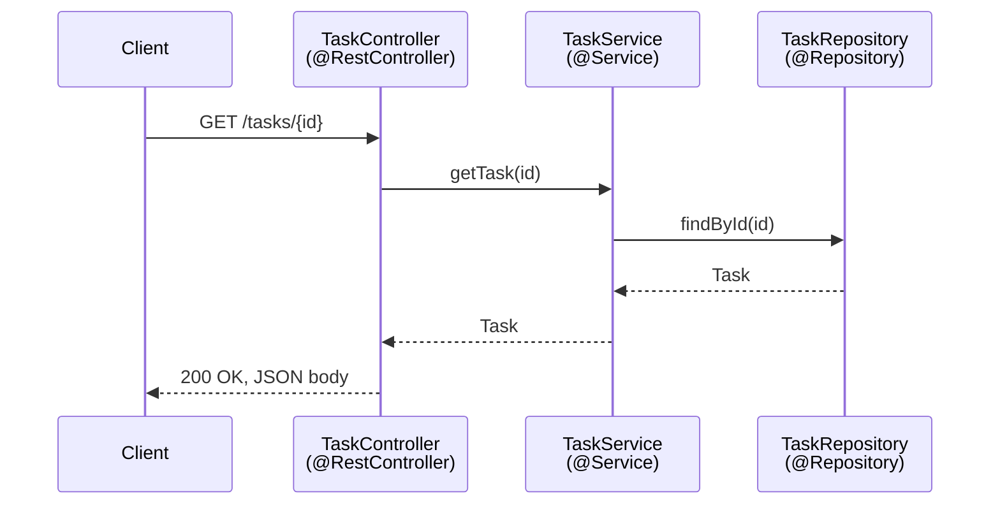

# Spring MVC Fundamentals

## Table of Contents

1. [Why This Matters](#1-why-this-matters)
2. [Prerequisites](#2-prerequisites)
3. [Foundation (L1)](#3-foundation-l1)
4. [Core Concepts (L2)](#4-core-concepts-l2)
5. [How It Works Internally (L3)](#5-how-it-works-internally-l3)
6. [Practical Usage](#6-practical-usage)
7. [Examples](#7-examples)
8. [Common Mistakes](#8-common-mistakes)
9. [Edge Cases](#9-edge-cases)
10. [Performance Implications](#10-performance-implications)
11. [Trade-offs](#11-trade-offs)
12. [Senior-Level Considerations (L3)](#12-senior-level-considerations-l3)
13. [Staff/System-Level Considerations (L4)](#13-staffsystem-level-considerations-l4)
14. [Production Scenarios](#14-production-scenarios)
15. [Interview Questions](#15-interview-questions)
16. [Coding/Practice Exercises](#16-codingpractice-exercises)
17. [Debugging Exercises](#17-debugging-exercises)
18. [Design Exercises](#18-design-exercises)
19. [Further Reading](#19-further-reading)
20. [Mastery Checklist](#20-mastery-checklist)

## 1. Why This Matters

Every other chapter in `05-spring` assumes you already know what `@Autowired` does and can read a `@RestController` at a glance — reasonable for the Senior/Staff-only version of this repository, not reasonable once it explicitly covers Junior through Staff. This chapter is that missing floor, the same role [Java OOP Fundamentals](../02-java/language-core/java-oop-fundamentals-classes-objects-and-interfaces.md) plays for `02-java`. Nearly every Java backend job posting says "Spring Boot experience required," and nearly every technical screen opens with some version of "walk me through how a request flows through your controller" — a question this chapter answers directly, and one every advanced chapter in this domain (bean lifecycle, proxy mechanics, security filter chains) silently assumes you can already answer.

## 2. Prerequisites

[Java OOP Fundamentals: Classes, Objects, and Interfaces](../02-java/language-core/java-oop-fundamentals-classes-objects-and-interfaces.md) — specifically the constructor and interface material; Spring's own dependency injection (Section 4) is built directly on ordinary Java constructors, not a special language feature.

## 3. Foundation (L1)

**Before any Spring concept makes sense, two files on disk define what a Spring Boot project actually is: `pom.xml` (or `build.gradle`) declares what the project depends on and how it's built, and `application.yml` (or `application.properties`) holds the project's own runtime configuration.** Neither is Spring-specific machinery — `pom.xml` is plain Maven, `application.yml` is a plain YAML file Spring Boot happens to read at startup — but a real project is unreadable without knowing what belongs in each.

**A real, minimal `pom.xml` for a Spring Boot web service:**

```xml
<?xml version="1.0" encoding="UTF-8"?>
<project xmlns="http://maven.apache.org/POM/4.0.0">
    <modelVersion>4.0.0</modelVersion>

    <parent>
        <groupId>org.springframework.boot</groupId>
        <artifactId>spring-boot-starter-parent</artifactId>
        <version>3.3.4</version>
        <relativePath/>
    </parent>

    <groupId>com.example</groupId>
    <artifactId>task-service</artifactId>
    <version>0.0.1-SNAPSHOT</version>

    <properties>
        <java.version>21</java.version>
    </properties>

    <dependencies>
        <dependency>
            <groupId>org.springframework.boot</groupId>
            <artifactId>spring-boot-starter-web</artifactId>
        </dependency>
        <dependency>
            <groupId>org.springframework.boot</groupId>
            <artifactId>spring-boot-starter-data-jpa</artifactId>
        </dependency>
        <dependency>
            <groupId>org.postgresql</groupId>
            <artifactId>postgresql</artifactId>
            <scope>runtime</scope>
        </dependency>
        <dependency>
            <groupId>org.springframework.boot</groupId>
            <artifactId>spring-boot-starter-test</artifactId>
            <scope>test</scope>
        </dependency>
    </dependencies>

    <build>
        <plugins>
            <plugin>
                <groupId>org.springframework.boot</groupId>
                <artifactId>spring-boot-maven-plugin</artifactId>
            </plugin>
        </plugins>
    </build>
</project>
```

Each part earns its place:

- **`<parent>spring-boot-starter-parent</parent>`** — inherits a curated, tested set of dependency *versions* (Spring Boot's own "Bill of Materials"), so none of the dependencies below need their own `<version>` tag — the parent picks one consistent, compatible version for all of them. It also configures sensible default plugin behavior (UTF-8 source encoding, resource filtering) that would otherwise need to be set up by hand.
- **`<groupId>`/`<artifactId>`/`<version>`** — this project's own Maven coordinates, identifying it uniquely (to itself, and to anything that might depend on it).
- **`<properties><java.version>`** — tells `spring-boot-starter-parent` which Java version to compile and target; changing this one line changes the compiler's `--release` flag project-wide.
- **`spring-boot-starter-web`, `spring-boot-starter-data-jpa`** — **starters**: each one is a single dependency that pulls in a coherent, tested bundle of transitive dependencies for one concern — `-web` brings an embedded Tomcat, Spring MVC, and Jackson (JSON) together; `-data-jpa` brings Hibernate and Spring Data JPA together — so a project states *what it needs* (web, JPA) rather than hand-assembling every individual library and hoping the versions are compatible.
- **`<scope>runtime</scope>` on the database driver** — the driver is needed only when the application actually runs (to open a real connection), never at compile time, since application code depends on JPA/Hibernate's own abstractions, not the driver class directly.
- **`<scope>test</scope>` on `spring-boot-starter-test`** — this dependency (JUnit 5, Mockito, AssertJ, Spring's own test utilities, all bundled) is only ever on the test classpath, never packaged into the deployed application.
- **`spring-boot-maven-plugin`** — without this, `mvn package` produces a plain, non-runnable `.jar` missing every dependency; this plugin's `repackage` goal is what turns that into a real, executable "fat jar" (`java -jar task-service.jar` actually works) with every dependency bundled inside it.

**A real `application.yml` for the same service:**

```yaml
server:
  port: 8080

spring:
  application:
    name: task-service
  datasource:
    url: jdbc:postgresql://localhost:5432/tasks
    username: ${DB_USER:tasks_app}
    password: ${DB_PASSWORD}
  jpa:
    hibernate:
      ddl-auto: validate
    show-sql: false

logging:
  level:
    root: INFO
    com.example.taskservice: DEBUG

management:
  endpoints:
    web:
      exposure:
        include: health,info,metrics
```

- **`server.port`** — the embedded servlet container's listening port; omit it entirely and Spring Boot defaults to `8080`.
- **`spring.application.name`** — this service's own logical name, surfaced in logs, Actuator's `/info` endpoint, and (in a real microservice deployment) service-discovery registration.
- **`spring.datasource.*`** — the JDBC connection details; `${DB_USER:tasks_app}` is placeholder syntax meaning "read the `DB_USER` environment variable, or fall back to `tasks_app` if it's unset" — `${DB_PASSWORD}` (no default) means a missing environment variable fails fast at startup rather than silently connecting with an empty password. This is the exact environment-variable-override mechanism [The Twelve-Factor App: Config](../15-cloud/twelve-factor-config.md) covers in depth, including Spring's own `spring.profiles.active` precedence for swapping this entire block per environment.
- **`spring.jpa.hibernate.ddl-auto`** — controls whether Hibernate touches the database schema at startup; `validate` (compares entities against the existing schema and fails if they disagree, but never modifies it) is the only safe choice in a real deployment — `update` and `create-drop` are for local development only, never production, since either can silently alter or destroy real data.
- **`logging.level.*`** — per-logger minimum severity; setting the application's own package to `DEBUG` while leaving `root` at `INFO` is the standard way to get verbose logging from your own code without being flooded by framework-internal noise. Precisely what's actually doing the logging: application code (and Spring itself) logs against the **SLF4J** facade (`org.slf4j.Logger`) — an interface, not an implementation — and `spring-boot-starter-web`/`spring-boot-starter` pulls in **Logback** as the concrete implementation behind it by default, pre-wired with a sensible console pattern out of the box. This two-layer design (a facade plus a swappable implementation) is why switching to Log4j2 is a dependency change (excluding the default Logback starter, adding `spring-boot-starter-log4j2`), never a code change — application code never references Logback directly, only the SLF4J interface.
- **`management.endpoints.web.exposure.include`** — explicitly allowlists which Actuator endpoints are reachable over HTTP; Spring Boot exposes almost none by default specifically so a team must opt in deliberately, covered in full in [Spring Boot Actuator, Health, and Observability Hooks](spring-actuator-health-and-observability-hooks.md).

**Dependency injection** is Spring's central idea, and it is simpler than it sounds: instead of a class creating the objects it depends on (`new TaskRepository()`), it declares what it needs — usually as a constructor parameter — and a container builds the object graph and hands the dependencies in. The class stops being responsible for knowing how to construct its own dependencies; it only states what it needs.

Spring calls the objects it manages **beans**. A class becomes a bean by being annotated with a **stereotype annotation** — `@Component` is the generic form, and `@Service`, `@Repository`, and `@Controller`/`@RestController` are the same mechanism under three more specific, self-documenting names for three conventional layers: business logic, data access, and web request handling, respectively. At startup, Spring scans for these annotations, constructs one instance of each, and wires them together based on what each one's constructor asks for.

A **`@RestController`** is a class whose methods handle incoming HTTP requests and write their return value directly into the HTTP response body (as JSON, by default) — no HTML page, no template. `@GetMapping("/tasks")` on a method means "run this method when an HTTP `GET` request arrives at `/tasks`." `@PostMapping`, `@PutMapping`, and `@DeleteMapping` are the same idea for `POST`, `PUT`, and `DELETE`.

## 4. Core Concepts (L2)

The conventional three-layer shape this chapter's demo uses, and the reason it exists:

- **Controller** (`@RestController`) — the only layer that knows HTTP exists. It reads the request (path variables, query parameters, the request body) and returns a value; it should contain no real business logic.
- **Service** (`@Service`) — the business logic. [`TaskService`](../../practice/java/spring-mvc-fundamentals/src/demo/TaskService.java) never mentions HTTP at all — it is just as usable from a test, a CLI tool, or a background job as from a web request, which is the actual point of keeping it separate from the controller.
- **Repository** (`@Repository`) — data access. This chapter's demo uses a plain in-memory list on purpose, so the pattern (controller depends on service depends on repository) stays visible without a real database's own concerns mixed in.

**Stereotype annotations, side by side** — all four are the same underlying mechanism (`@Component` scanning); the specific names exist purely to self-document a class's layer, and two of them add real behavior on top:

| Annotation | Layer / meaning | What it adds beyond `@Component` |
|---|---|---|
| `@Component` | Generic — any Spring-managed bean that doesn't fit a more specific stereotype | Nothing; the plain base case |
| `@Service` | Business logic | Nothing functionally over `@Component` — purely a self-documenting label for "this is a business/domain-logic class" |
| `@Repository` | Data access | Enables Spring's **persistence exception translation** — a data-access-technology-specific exception (e.g. a JDBC `SQLException`) is caught and rethrown as one of Spring's own unchecked `DataAccessException` subtypes, so calling code doesn't need to know which persistence technology is underneath |
| `@Controller` | Web layer, classic MVC | Return values are resolved as *view names* (e.g. a Thymeleaf template) unless a method is also annotated `@ResponseBody` |
| `@RestController` | Web layer, REST APIs | Shorthand for `@Controller` + `@ResponseBody` on every method — every return value is serialized straight into the HTTP response body (JSON, by default), which is why this chapter's [`TaskController`](../../practice/java/spring-mvc-fundamentals/src/demo/TaskController.java) uses it and not plain `@Controller` |

**Other annotations this chapter's demo doesn't use but every Spring codebase has**, since "what stereotype annotations exist and what do they do" is rarely asked in isolation from these:

| Annotation | Where it goes | What it's for |
|---|---|---|
| `@Configuration` | A class | Marks a class as a source of bean definitions — its `@Bean`-annotated methods are called once and their return values registered as beans, an alternative to component-scanning for beans you don't control the source of (a third-party class, for instance) |
| `@Bean` | A method inside an `@Configuration` class | Registers that method's return value as a bean — the go-to for beans of types you can't add `@Component` to directly |
| `@Autowired` | A constructor, field, or setter | Tells Spring to inject a matching bean there. Unnecessary on a class's *only* constructor since Spring Framework 4.3 (Section 4 above), still required for field/setter injection or when a class has multiple constructors |
| `@Qualifier("beanName")` | Alongside `@Autowired`, on a parameter | Disambiguates which specific bean to inject when more than one bean of the same type exists (e.g. two different `PaymentGateway` implementations) |
| `@Primary` | On a bean's class or `@Bean` method | Marks that bean as the default choice when multiple candidates of the same type exist and no `@Qualifier` narrows it — the "pick this one unless told otherwise" annotation |
| `@Value("${property.name}")` | A field or constructor parameter | Injects a single configuration property value (from `application.properties`/`application.yml` or an environment variable), rather than a whole bean |

**The three ways to get a dependency injected**, since Spring supports all three and only one of them is actually recommended by default:

- **Constructor injection** — dependencies are declared as constructor parameters; Spring calls the constructor with the resolved beans. The recommended default (Section 6 explains why).
- **Setter injection** — dependencies are declared as parameters to a `public` setter method annotated `@Autowired`; Spring calls the setter after constructing the bean. Mainly useful for a genuinely *optional* dependency, since the bean is fully constructable without it.
- **Field injection** — `@Autowired` directly on a field, with no constructor or setter involved; Spring assigns the field via reflection after construction. The shortest to write, and the one this chapter recommends against by default.

| Aspect | Constructor injection | Setter injection | Field injection |
|---|---|---|---|
| Where `@Autowired` goes | Not needed (single constructor) or on the constructor | On the setter method | Directly on the field |
| Dependency visibility | All required dependencies visible in one signature | Spread across setter methods | Invisible from outside the class — only reflection sees it |
| Can use `final` fields | Yes | No | No |
| Immutability | Fully immutable once constructed | Mutable after construction | Mutable after construction |
| Plain `new` in a unit test | Works directly, no Spring needed | Needs the setter called manually | Needs reflection or a Spring test context — can't set a `private` field with plain `new` |
| Makes "too many dependencies" visible | Yes — a 10-parameter constructor is an obvious smell | Not really | No — fields can silently accumulate indefinitely |
| Best for | The default — required dependencies | A genuinely optional dependency | Generally avoided; occasionally seen in legacy code or `@Configuration` classes |

**Constructor-based dependency injection**, the one this chapter's own demo uses, works like this: a class declares one constructor listing what it needs as parameters, and — since Spring Framework 4.3 — a class with exactly one constructor does not even need an `@Autowired` annotation; Spring uses that single constructor automatically. [`TaskController`](../../practice/java/spring-mvc-fundamentals/src/demo/TaskController.java)'s constructor asks for a `TaskService`; [`TaskService`](../../practice/java/spring-mvc-fundamentals/src/demo/TaskService.java)'s constructor asks for a `TaskRepository`. Spring builds the `TaskRepository` first, then the `TaskService` (handing in the repository), then the `TaskController` (handing in the service) — resolving the whole chain without any class in it ever writing `new` for another bean.



Startup wiring runs in the opposite, dependency-first order: Spring builds `TaskRepository` first (it needs nothing), then `TaskService` (handing in the repository), then `TaskController` (handing in the service) — no class in the chain ever writes `new` for another bean.

Three annotations bind pieces of the incoming HTTP request directly to method parameters: `@PathVariable` binds a segment of the URL path (`/tasks/{id}` → the method parameter matching `id`), `@RequestParam` binds a query-string parameter (`?status=done`), and `@RequestBody` binds the entire request body, deserialized from JSON into a Java object by Jackson (already on the classpath).

**Design patterns Spring resolves for you**, since "which design patterns does Spring use internally" is a recurring interview question in its own right — Spring is, in large part, a set of classic Gang-of-Four patterns applied consistently so application code doesn't have to hand-roll them:

| Pattern | Where Spring uses it | What it buys you |
|---|---|---|
| **Singleton** | Every bean's default scope (`@Scope` unset) | One shared instance per application context, handed to every injection point — see [Spring Bean Scopes and Proxy Modes](spring-bean-scopes-and-proxy-modes.md) for the real mechanics and its gotchas |
| **Factory** | `BeanFactory`/`ApplicationContext` (Spring's container itself); `@Bean` methods in an `@Configuration` class | Object creation is centralized in the container instead of scattered `new` calls across the codebase — this chapter's own dependency-injection model (Section 4) *is* the Factory pattern in practice |
| **Proxy** | AOP in general; `@Transactional`, `@Async`, `@Cacheable` specifically | Spring wraps a bean in a dynamically-generated proxy that adds behavior (starting a transaction, running async, checking a cache) around the real method call, without the real class containing any of that cross-cutting code itself — see [Spring @Transactional: Proxy Mechanics, Rollback Rules, and Propagation](transactional-proxy-mechanics-and-propagation.md) for exactly how, including the self-invocation pitfall it causes |
| **Template Method** | `JdbcTemplate`, `RestTemplate`, `TransactionTemplate` | Each `*Template` class fixes the invariant steps of an operation (open a connection, handle exceptions, clean up) and leaves only the actually-variable part (your SQL, your request) to the caller — you provide a callback, the template handles everything around it. `RestTemplate` specifically is in maintenance mode; see [Spring WebFlux and Reactive Programming](spring-webflux-and-reactive-programming.md#core-concepts) for why `WebClient` is the current choice, even from a service that stays otherwise fully blocking. |
| **Observer** | `ApplicationEvent` + `@EventListener`/`ApplicationListener` | A bean publishes an event (`applicationEventPublisher.publishEvent(...)`) without knowing or caring who's listening; any number of other beans react to it independently — decouples the publisher from every subscriber |
| **Strategy** | Any interface with multiple `@Component` implementations, selected via `@Qualifier`/`@Primary` (Section 4's stereotype-annotation table above) | The calling code depends only on the interface; which concrete algorithm/implementation runs is a wiring decision, not a code change |
| **Decorator** | `HttpServletRequestWrapper`/`HttpServletResponseWrapper` and Spring Security's filter chain | Each filter/wrapper adds behavior around the request/response while still exposing the same interface, so wrapping is transparent to whatever runs next in the chain |

Most of these are worth recognizing by name rather than reimplementing — the Proxy and Singleton rows in particular explain real, observable behavior (why a `@Transactional` self-invocation silently does nothing; why a mutable field on a default-scoped bean is a concurrency bug) that this domain's other chapters cover in depth.

## 5. How It Works Internally (L3)

At startup, `@SpringBootApplication` triggers **component scanning**: Spring walks the application's packages looking for classes annotated `@Component` (or one of its stereotype specializations), and constructs the **application context** — the actual container holding every bean instance. Dependency injection happens as this container is built: Spring inspects each bean class's constructor, sees what types it asks for, and either supplies an already-built bean of that type or builds it first if it doesn't exist yet — recursively, until the whole graph (repository → service → controller, in this chapter's demo) is resolved. If two beans depended on each other's constructors directly, this resolution would have no valid starting point — a genuine circular-dependency failure Spring detects and reports at startup, not silently.

**Three real, different outcomes for what looks like "the same" circular dependency**, verified directly in [`CircularDependencyDemo.java`](../../practice/java/spring/configuration-properties-and-di-internals/src/CircularDependencyDemo.java): two beans requiring each other via **constructor** injection genuinely cannot start — a real `BeanCurrentlyInCreationException` ("Requested bean is currently in creation") is thrown, because there is no valid order to call either constructor first. The identical cycle via **field** injection resolves silently, with no error at all — Spring calls each bean's no-arg constructor first (both objects now exist, incomplete but constructed), *then* wires every `@Autowired` field afterward, so there's no ordering problem left by the time fields are assigned. This is exactly why "just use field injection" sometimes appears to "fix" a circular dependency in practice — it doesn't fix the underlying design issue, it just relocates the wiring to a point in the lifecycle where the cycle happens not to matter.

The standard, deliberate fix for a genuine constructor-injected cycle is `@Lazy` on one side: `ServiceA(@Lazy ServiceB b)` makes Spring inject a real CGLIB proxy standing in for `ServiceB`, deferring the actual lookup until the proxy's first real use — by which point both beans already exist and the cycle has nothing left to resolve. The demo's own construction surfaces a genuine, sharp-edged limitation of that proxy worth knowing explicitly: the proxy only intercepts **method calls**, never direct field reads. Calling a real method through it (`lazyProxy.getSomething()`) correctly delegates to the real target bean, verified directly — but reading a `public`/package-visible field directly off the same proxy (`lazyProxy.someField`) returns the proxy's own, uninitialized value instead, because field access in Java is never virtual and bypasses the proxy's interception mechanism entirely. A `@Lazy`-injected dependency should always be accessed through its methods, never its fields, for exactly this reason.

For the web layer specifically, Spring Boot starts an **embedded servlet container** (Tomcat, by default) as part of the same application process — no separate application-server installation or deployment step. Every incoming HTTP request passes through Spring's own `DispatcherServlet`, which matches the request's path and method against every `@GetMapping`/`@PostMapping`/etc. across every controller bean, invokes the matching method, and converts its return value to the HTTP response using a registered `HttpMessageConverter` (Jackson, for JSON, in this chapter's demo).

`@PathVariable`'s binding-by-name (Section 4) depends on the method parameter's actual name being available at runtime — and by default, compiled Java bytecode does **not** retain parameter names unless compiled with the `-parameters` flag. Section 7's demo hit this directly: `@PathVariable Long id` (no explicit name) failed with a genuine `500` and the exact message `Name for argument of type [java.lang.Long] not specified, and parameter name information not available via reflection` the first time it was run — not a hypothetical, the actual failure this repository's own build produced. The fix, `@PathVariable("id") Long id`, states the binding explicitly rather than depending on a build flag every future compilation of the project would also need to remember.

## 6. Practical Usage

Keep the controller thin — if a method is doing anything beyond reading the request and calling the service layer, that logic almost always belongs in the service instead, testable without spinning up a whole HTTP stack. Default to constructor injection over field `@Autowired` — it makes a class's dependencies visible in one place (the constructor signature), makes the class straightforward to construct directly in a unit test with plain `new`, and makes a class with too many dependencies visibly awkward to construct rather than silently accumulating unlimited `@Autowired` fields. Name `@PathVariable`/`@RequestParam` bindings explicitly, per Section 5's real failure, rather than relying on the `-parameters` compiler flag being present in every build.

## 7. Examples

All output below is real, from a live Spring Boot 3.5.16 app running on embedded Tomcat, `localhost:8080` — [`practice/java/spring-mvc-fundamentals/`](../../practice/java/spring-mvc-fundamentals/), full transcript in `curl-transcript.txt`.

**Empty state, `GET /tasks`:**
```
$ curl -s http://localhost:8080/tasks
[]
```

**Creating a resource, `POST /tasks`** — the request body is real JSON, and the response is the real object the service/repository layer produced, `id` assigned by the repository:
```
$ curl -s -X POST http://localhost:8080/tasks -H "Content-Type: application/json" -d '{"title":"Write chapter"}'
{"id":1,"title":"Write chapter","done":false}
```

**Listing again after two creations, `GET /tasks`:**
```
$ curl -s http://localhost:8080/tasks
[{"id":1,"title":"Write chapter","done":false},{"id":2,"title":"Run the demo","done":false}]
```

**A real path-variable bug, hit while building this exact demo** — the original controller wrote `@PathVariable Long id` with no explicit name; `GET /tasks/1` failed with a genuine `500`:
```
$ curl -s -w "\nHTTP status: %{http_code}\n" http://localhost:8080/tasks/1
{"timestamp":"...","status":500,"error":"Internal Server Error","path":"/tasks/1"}
HTTP status: 500
```
The real cause, from the application's own log: `IllegalArgumentException: Name for argument of type [java.lang.Long] not specified, and parameter name information not available via reflection. Ensure that the compiler uses the '-parameters' flag.` The fix — naming the binding explicitly, `@PathVariable("id") Long id` — resolved it:
```
$ curl -s -w "\nHTTP status: %{http_code}\n" http://localhost:8080/tasks/1
{"id":1,"title":"Write chapter","done":false}
HTTP status: 200
$ curl -s -w "\nHTTP status: %{http_code}\n" http://localhost:8080/tasks/999
HTTP status: 404
```
`GET /tasks/999` (an id that was never created) correctly returns an empty body and a real `404`, produced by `ResponseEntity.notFound().build()` in [`TaskController`](../../practice/java/spring-mvc-fundamentals/src/demo/TaskController.java) — see the full, uncut before/after transcripts in `curl-transcript-before-fix.txt` and `curl-transcript.txt`.

## 8. Common Mistakes

- **Writing `@PathVariable Long id` (or `@RequestParam`) without an explicit name and without the `-parameters` compiler flag** — Section 5/7's real, hit-while-building-this-chapter bug. Always name the binding explicitly; it costs nothing and depends on no build configuration.
- **Putting business logic directly in the controller** — makes the logic untestable without a running HTTP stack, and impossible to reuse from anywhere that isn't a web request.
- **Using field `@Autowired` on every dependency instead of a constructor** — hides how many dependencies a class actually has (there's no single place listing them), and makes the class impossible to construct with plain `new` in a unit test.
- **Forgetting that `@RequestBody` deserialization needs a no-argument constructor on the target class** — [`Task`](../../practice/java/spring-mvc-fundamentals/src/demo/Task.java)'s own empty constructor exists specifically because Jackson needs it; removing it (leaving only the all-args constructor) breaks every `POST`/`PUT` endpoint that accepts a `Task` body, with an error that doesn't obviously point at "the constructor" as the cause.
- **Reaching for field injection "to make a circular dependency go away"** instead of recognizing the cycle itself is a design signal — Section 5's own real evidence shows field injection resolves the cycle by accident of lifecycle ordering, not because the design issue was fixed; a `@Lazy` constructor parameter is the deliberate fix when the cycle genuinely can't be restructured away.
- **Importing and coding directly against Logback's own API** (`ch.qos.logback.classic.Logger`) instead of the SLF4J facade (`org.slf4j.Logger`) — couples application code to one specific logging implementation, defeating the entire point of the facade/implementation split Section 4 describes.

## 9. Edge Cases

- A **`GET` request to a URL with no matching `@GetMapping`** returns Spring Boot's default `404` error response, structurally identical in shape to Section 7's `ResponseEntity.notFound().build()` result, but produced by an entirely different mechanism (no controller method ran at all, versus a controller method explicitly choosing to return 404) — both look the same from the client's side, which is worth knowing when debugging "why is this returning 404" during development.
- **Two `@RestController` methods mapped to the same path and HTTP method** is a startup-time ambiguity error, not a runtime "first one wins" — Spring refuses to start rather than silently picking one.
- **A constructor-injected dependency that Spring cannot find a bean for** (e.g., an interface with zero or more than one implementing bean, and no qualifier to disambiguate) fails at startup with a clear "no qualifying bean" message — a real, common Mid-level debugging scenario `05-spring`'s other chapters explore further.

## 10. Performance Implications

Component scanning and dependency-graph resolution happen once, at application startup — not per request — so this chapter's mechanics add no per-request overhead of their own; the request-handling cost model (matching a path, invoking a method, serializing a response) is dominated by whatever the service/repository layers actually do, not by the DI mechanism that wired them together. [Spring Auto-Configuration and Bean Lifecycle](auto-configuration-and-bean-lifecycle.md) covers what actually happens during that one-time startup cost in depth.

## 11. Trade-offs

| Concern | Constructor injection | Field `@Autowired` injection |
|---|---|---|
| Visibility of dependencies | All listed in one place — the constructor signature | Scattered across the class body, no single list |
| Testability | Constructible with plain `new` in a unit test, no Spring context needed | Requires either a Spring test context or reflection-based mocking to set the fields |
| Immutability | Dependencies can be stored in `final` fields | Fields injected after construction cannot be `final` |
| Circular dependency detection | Fails fast and clearly at startup (Section 5) | Can sometimes be worked around with a proxy, hiding a design problem rather than surfacing it |

## 12. Senior-Level Considerations (L3)

A Senior engineer treats a controller class with ten constructor parameters as a real design signal, not just a long line to scroll past — Section 6's "constructor injection makes too many dependencies visibly awkward" property is only useful if the awkwardness is actually acted on, usually by asking whether that controller (or the service behind it) is doing too many unrelated things and should be split. The same review instinct applies to Section 9's "no qualifying bean" failures: the fix is rarely just adding a qualifier annotation; it's worth asking first whether having two implementations of the same interface active as beans simultaneously was actually the intended design.

## 13. Staff/System-Level Considerations (L4)

At Staff scope, the three-layer shape in this chapter (controller/service/repository) is a convention, not a law enforced by the compiler — nothing stops a team from putting a database call directly in a controller method. The actual leverage a Staff engineer has here is the same as [Clean and Hexagonal Architecture](../17-architecture/clean-hexagonal-architecture.md)'s own argument at a larger scale: a consistently-enforced layering convention (via code review, or an automated architecture test) is what makes it possible for any engineer to predict where a given piece of logic lives without reading the whole codebase, and what makes a future change (swapping the in-memory repository for a real database, in this chapter's own demo) touch only one layer instead of being smeared across every controller method that happened to call the database directly.

## 14. Production Scenarios

No existing `production-cookbook/` entry has an MVC-fundamentals-specific root cause — the closest adjacent entries are proxy- and transaction-scale, not basic-request-routing-scale.

> Planned reference: a future `production-cookbook/` entry covering a real incident caused by business logic embedded directly in a controller method — untestable without a full HTTP stack, and duplicated across two controllers that both needed the same logic — would be a natural, non-duplicative addition connecting this chapter's Section 8 warning to a genuine production incident.

## 15. Interview Questions

**Q1 (Junior): "What does `@Autowired` do?"**
Expected answer: it tells Spring to inject a dependency — Section 3/4's core idea — though the strongest answers note that on a single constructor (Spring Framework 4.3+), the annotation isn't even required.

**Q2 (Junior/Mid): "Walk me through what happens when a GET request hits your `/tasks/{id}` endpoint."**
Expected answer: Section 5's real flow — `DispatcherServlet` matches the path and method to `TaskController.getTask`, the `{id}` path segment binds to the `id` parameter, the controller calls into the service, the service calls the repository, and the return value is serialized to JSON by a message converter.

**Q3 (Mid): "Why prefer constructor injection over field `@Autowired`?"**
Expected answer: Section 11's trade-off table — visibility of the full dependency list, testability with plain `new`, and the ability to use `final` fields; the strongest answers add that an awkwardly-long constructor is a useful, visible design smell that field injection hides.

**Q4 (Mid/Senior): "You add a second implementation of an interface your controller already depends on, and the app fails to start. Why, and how do you fix it?"**
Expected answer: Section 9's "no qualifying bean" ambiguity — Spring can no longer determine which implementation to inject; fixed with `@Qualifier`, marking one implementation `@Primary`, or (per Section 12) reconsidering whether both implementations should really be active beans simultaneously.

**Q5 (Senior/Staff): "Your team's controllers have started accumulating direct database calls instead of going through the service layer. How do you address it?"**
Expected answer: Section 13's framing — this is a convention-erosion problem, not a one-off bug; the fix is process/tooling (code review discipline, or an automated architecture test enforcing the layering) rather than a single code change, because the same shortcut will keep recurring under time pressure otherwise.

**Q6 (Junior/Mid): "What's the actual difference between `spring-boot-starter-parent` and a regular Maven dependency, and why does `spring-boot-maven-plugin` need to be there too?"**
Expected answer: Section 3's `pom.xml` breakdown — the parent supplies a tested, consistent set of dependency *versions* (so individual starters don't need their own `<version>` tag) plus default plugin configuration; the `spring-boot-maven-plugin`'s `repackage` goal is what turns a plain, non-runnable `.jar` into a real executable one with every dependency bundled inside — without it, `mvn package` produces something `java -jar` can't actually run.

**Q7 (Mid/Senior): "Two of your beans need each other. The app won't start. A teammate suggests switching to field injection and it 'fixes' it. What's actually going on, and is that a good fix?"**
Expected answer: Section 5's real evidence — constructor injection has no valid construction order for a genuine cycle, so it fails loudly and correctly; field injection "fixes" it only because Spring constructs both no-arg objects first and wires fields afterward, which sidesteps the ordering problem without addressing why the two beans depend on each other in the first place. Not a good fix on its own — either restructure the design to break the cycle, or make the dependency deliberately lazy with `@Lazy` on one constructor parameter if the cycle genuinely can't be removed.

## 16. Coding/Practice Exercises

1. Add a `PUT /tasks/{id}` endpoint that updates an existing task's `title` and `done` fields, returning `404` (matching the existing `GET /tasks/{id}` pattern) if the id doesn't exist.
2. Add a `@RequestParam(required = false) Boolean done` to `GET /tasks`, filtering the returned list to only tasks matching that `done` value when the parameter is present, and returning the full list when it's absent.
3. Deliberately remove `Task`'s no-argument constructor (Section 8's warning) and reproduce the real failure `POST /tasks` now produces; then restore it and confirm the endpoint works again.

## 17. Debugging Exercises

Given `@PathVariable Long id` (no explicit name), and a controller compiled without the `-parameters` flag, predict what happens when a request hits that endpoint, then verify against Section 7's own real transcript.

The answer is a genuine `500 Internal Server Error`, not a `400 Bad Request` or a silently-null `id` — Spring cannot even attempt to bind the path variable without knowing what name to bind it under, so the failure happens before the controller method body ever runs. A candidate guessing "it would just receive `null`" is assuming a more forgiving failure mode than what Spring actually does here; the exact, real message is `Name for argument of type [java.lang.Long] not specified, and parameter name information not available via reflection` — worth recognizing on sight, since it's a genuinely common first-project Spring MVC error.

## 18. Design Exercises

Design the controller/service/repository layering for a simple comment system: `POST /posts/{postId}/comments` (create a comment on a post), `GET /posts/{postId}/comments` (list them). State explicitly which layer is responsible for verifying the post actually exists before allowing a comment to be created against it, and why that check does not belong in the controller.

## 19. Further Reading

- [Spring Auto-Configuration and Bean Lifecycle](auto-configuration-and-bean-lifecycle.md) — the full startup-time mechanism this chapter's Section 5 only summarizes.
- [Spring Bean Scopes and Proxy Modes](spring-bean-scopes-and-proxy-modes.md) — what happens once a bean needs more than one instance, or a scope other than the application-wide default this chapter's demo uses.
- [API Design](../07-api-design/api-design.md) — how to design the URLs and status codes this chapter's controller uses well, at a larger scale.

## 20. Mastery Checklist

- [ ] Can explain dependency injection in one sentence, with a concrete constructor example.
- [ ] Can name the controller/service/repository layering and state what belongs in each.
- [ ] Can trace a request through `DispatcherServlet` to a controller method to a JSON response, in the right order.
- [ ] Can explain why the Section 7/17 `@PathVariable` bug happens, and state the fix.
- [ ] Can justify constructor injection over field `@Autowired` with more than one concrete reason.
- [ ] Can diagnose a "no qualifying bean" startup failure and name at least two ways to resolve it.
- [ ] Can explain why a constructor-injected circular dependency fails at startup, why field injection "resolves" the identical cycle without fixing the design issue, and how `@Lazy` deliberately breaks it when restructuring isn't an option.
