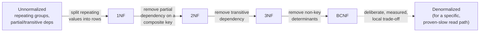

# Database Normalization — 1NF Through BCNF

> **Topic register:** T-2411 · Core tier · High interview frequency [H]
> **Provenance:** every result in this chapter is real, executed PostgreSQL 16 output from a
> disposable Docker container. Reproducible source: [`practice/sql/database-normalization/normalization-lab.sql`](../../practice/sql/database-normalization/normalization-lab.sql),
> full output in [`normalization-lab-output.txt`](../../practice/sql/database-normalization/normalization-lab-output.txt).
> Nothing below is illustrative — including the real, captured data inconsistencies each
> unnormalized schema produces, the real constraint violation BCNF turns a silent bug into,
> and the real ~3.27× read speedup a deliberately denormalized table produces, at a real,
> measured cost of touching 80 rows instead of 1 on a single customer rename.

## Table of Contents

1. [Learning Objectives](#learning-objectives)
2. [Why This Matters in Interviews](#why-this-matters-in-interviews)
3. [Level 1 — Foundation](#level-1-foundation)
4. [Level 2 — Working Knowledge](#level-2-working-knowledge)
5. [Mental Model](#mental-model)
6. [Definition and Purpose](#definition-and-purpose)
7. [Historical Context](#historical-context)
8. [Core Concepts](#core-concepts)
9. [Internal Implementation](#internal-implementation)
10. [Diagrams](#diagrams)
11. [Production Scenarios](#production-scenarios)
12. [Failure Modes and Debugging](#failure-modes-and-debugging)
13. [Trade-offs](#trade-offs)
14. [Performance Implications](#performance-implications)
15. [Decision Framework](#decision-framework)
16. [Comparisons: The Normal Forms at a Glance](#comparisons-the-normal-forms-at-a-glance)
17. [Common Mistakes](#common-mistakes)
18. [Anti-Patterns](#anti-patterns)
19. [Best Practices](#best-practices)
20. [Interview Answer Framework](#interview-answer-framework)
21. [Interview Questions](#interview-questions)
22. [Summary](#summary)
23. [Key Takeaways](#key-takeaways)
24. [Cheat Sheet](#cheat-sheet)
25. [Flashcards](#flashcards)
26. [Practice Exercises](#practice-exercises)
27. [Solutions](#solutions)
28. [Additional Reading](#additional-reading)
29. [Official References](#official-references)

---

## Learning Objectives

By the end of this chapter you can identify which normal form a table violates from a concrete update/insert/delete anomaly it produces (not from a memorized abstract definition), normalize a schema through 1NF, 2NF, 3NF, and BCNF with a real reason at each step, and make a deliberate, evidence-based call about when denormalizing is worth its real, measured cost — citing this chapter's own real ~3.27× read speedup against a real 80-rows-instead-of-1 write cost.

## Why This Matters in Interviews

Normalization is one of the oldest, most consistently asked database topics at every level, and it rewards genuine understanding over memorization more than almost any other database topic: a candidate who can recite "1NF means atomic values, 2NF means no partial dependency, 3NF means no transitive dependency" but can't point at a concrete anomaly in a concrete schema and say which rule it violates and why has memorized vocabulary, not the underlying idea. Every normal form in this chapter exists to make exactly one class of data inconsistency structurally impossible — this chapter is written schema-anomaly-first specifically so the rule is never separated from the real problem it solves.

## Level 1 — Foundation

Think about a school's paper attendance binder before it was computerized. Each page lists a student's name, and next to it, in one cramped cell, every class they're enrolled in, hand-written and comma-separated: "Math, Science, Art." Two problems show up immediately. First, finding "every student enrolled in Art" means a human reading every single page and squinting at the comma-separated list — there's no way to just look it up. Second, if a student adds a class, someone has to find their specific page and carefully edit that one cramped cell without disturbing the others — easy to get wrong.

**Normalization is the discipline of restructuring data so each fact lives in exactly one place, in a form a computer (or a person) can look up directly instead of squinting at.** The school's real fix wasn't a bigger cell — it was a second binder: one row per (student, class) pair, `student_name, class_name`. Now "every student in Art" is a straightforward filter, and adding a class is one new row, not an edit to a cramped cell.

```sql
-- Before: a repeating group, hard to query, easy to corrupt
CREATE TABLE students_unnormalized (name TEXT, classes TEXT);  -- "Math, Science, Art"

-- After: one fact per row
CREATE TABLE enrollments (student_name TEXT, class_name TEXT);
```

This chapter walks through four such fixes — 1NF, 2NF, 3NF, and BCNF — each one closing a specific, real way data can end up disagreeing with itself, plus the honest cost of undoing them on purpose (denormalization) when read speed matters more than write simplicity.

## Level 2 — Working Knowledge

At this level you should be able to connect each normal form to the specific *anomaly* it prevents, not just its abstract rule:

- **1NF (atomic values, no repeating groups)** prevents the "can't query into a cell" problem — a comma-separated list can't be filtered, joined, or indexed on its individual elements without string-parsing tricks.
- **2NF (no partial dependency on a composite key)** prevents an update anomaly where a fact that depends on only *part* of a composite key gets duplicated across every row sharing that part, and can disagree with itself when only some of those rows get updated.
- **3NF (no transitive dependency)** prevents the same shape of anomaly one level removed — a fact that depends on a *non-key* column (which itself depends on the key) gets duplicated the same way.
- **BCNF (every determinant is a candidate key)** closes a narrower, subtler gap 3NF can still leave open: a real-world rule enforced by a *non-candidate-key* column's functional dependency, which a 3NF-satisfying primary key alone cannot guarantee.

The working habit this chapter's own lab demonstrates directly: **don't normalize by reciting the rule — normalize by finding the concrete anomaly.** Every fix in [Internal Implementation](#internal-implementation) is motivated by a real, captured inconsistency (two different names for the same product, two different names for the same department, the same instructor attached to two different courses) that existed *before* the fix and became structurally impossible *after* it — that's the actual test of whether a normalization step was worth doing, not whether it matches a textbook definition.

**A practical rule for a working engineer**: normalize by default when designing a new schema — it's the discipline that prevents inconsistent data from being representable at all. Denormalize deliberately and locally, after measuring (per [Decision Framework](#decision-framework)), when a specific read path is genuinely too slow and the write-amplification cost is genuinely acceptable — never as the starting design.

## Mental Model

Each normal form answers a narrower version of the same question: **"can this schema currently represent two contradictory facts about the same real-world thing?"** 1NF asks it about a single cell (can one cell secretly hold multiple values that should each be independently queryable). 2NF and 3NF ask it about a non-key column (can it disagree with itself across rows that share the part of the key — direct or transitive — it actually depends on). BCNF asks the same question from the opposite direction (can a *non-key* column's own real-world rule be silently violated because the primary key doesn't actually enforce it). Every fix in this chapter has the identical shape: find the column that can hold two different answers for what should be one fact, and move it to a table keyed on exactly what it depends on — no more, no less.

## Definition and Purpose

**First Normal Form (1NF)** requires every column to hold a single, atomic value — no repeating groups, no comma-separated lists, no arrays standing in for a relationship. **Second Normal Form (2NF)** requires 1NF plus no *partial dependency*: every non-key column must depend on the *entire* primary key, not just part of a composite key. **Third Normal Form (3NF)** requires 2NF plus no *transitive dependency*: every non-key column must depend *directly* on the key, not on another non-key column that itself depends on the key. **Boyce-Codd Normal Form (BCNF)** is a stricter version of 3NF: for every functional dependency `X → Y` in the table, `X` must be a candidate key — closing cases where a non-key column determines part of the key itself, which 3NF's definition doesn't require.

## Historical Context

Normalization was introduced by Edgar F. Codd, the same researcher who introduced the relational model itself, starting with 1NF and 2NF/3NF in the early 1970s as part of formalizing what makes a relational schema well-designed rather than merely "using tables." Boyce-Codd Normal Form followed in 1974 (Raymond Boyce and Codd), specifically to close a real gap 3NF's original definition left open — a table could satisfy every 3NF requirement and still permit a functional-dependency-driven anomaly, the exact BCNF case this chapter demonstrates in [Internal Implementation](#internal-implementation). Higher normal forms exist (4NF for multi-valued dependencies, 5NF for join dependencies) but are rarely tested in interviews and rarely drive real schema decisions outside specialized cases — this chapter stops at BCNF deliberately, matching real interview and production frequency rather than academic completeness.

## Core Concepts

### A functional dependency is the real unit every normal form is defined against

`X → Y` ("X determines Y") means: for any two rows with the same value of X, Y must also be the same. Every normal form in this chapter is a rule about which functional dependencies are allowed to exist in a table relative to its keys — 1NF doesn't reference functional dependencies at all (it's about atomicity), but 2NF, 3NF, and BCNF are all, at their core, statements about which `X → Y` relationships are permitted. Understanding a table's real functional dependencies — not guessing at them — is the actual skill; the "1NF/2NF/3NF/BCNF" labels are just names for specific patterns of allowed and disallowed dependencies.

### 2NF and 3NF prevent the identical anomaly shape at two different distances from the key

A partial dependency (2NF) and a transitive dependency (3NF) produce the exact same *symptom* — a fact duplicated across rows, able to disagree with itself — the only difference is how far the offending column is from the actual key. [Internal Implementation](#internal-implementation)'s 2NF example (`product_name` depending on part of a composite key) and 3NF example (`department_name` depending on a non-key column that depends on the key) are structurally the same bug, caught at two different points, which is why interviewers who ask about both are really testing whether a candidate sees them as one underlying pattern rather than two unrelated rules to memorize separately.

### BCNF exists because 3NF's own definition has a real blind spot

3NF only constrains dependencies *on* non-key columns; it says nothing about a non-key column determining part of a key. [Internal Implementation](#internal-implementation)'s `enrollments(student_id, course_id, instructor)` table is genuinely in 3NF (every non-key attribute — there are none beyond the key here — trivially satisfies 3NF), yet still permits a real anomaly, because `instructor → course_id` is a real functional dependency from a column that is not a candidate key. BCNF is the narrower rule that specifically closes this case.

## Internal Implementation

**1NF — a repeating group makes an obvious query genuinely hard, then trivial once fixed:**

```sql
CREATE TABLE customers_unnormalized (customer_id SERIAL PRIMARY KEY, name TEXT, phones TEXT);
INSERT INTO customers_unnormalized (name, phones) VALUES
    ('Alice', '555-0100, 555-0199'), ('Bob', '555-0200'), ('Charlie', '555-0100, 555-0300');

SELECT name, phones FROM customers_unnormalized WHERE phones LIKE '%555-0100%';
```

```
  name   |       phones
---------+--------------------
 Alice   | 555-0100, 555-0199
 Charlie | 555-0100, 555-0300
```

A `LIKE` scan into a repeating group is the only option — no index can help, and a phone number embedded as a substring of another (`555-01005` would falsely match `%555-0100%`) is a real correctness risk this query already has. After extracting `customer_phones_1nf(customer_id, phone)`:

```sql
SELECT c.name FROM customer_phones_1nf p JOIN customers_1nf c ON c.customer_id = p.customer_id
WHERE p.phone IN (SELECT phone FROM customer_phones_1nf WHERE customer_id = 1) AND c.customer_id <> 1;
```

```
  name
---------
 Charlie
```

A plain, indexable equality join — no substring matching, no false-match risk.

**2NF — a real, captured update anomaly from a partial dependency:**

```sql
CREATE TABLE order_items_unnormalized (
    order_id INT, product_id INT, product_name TEXT, quantity INT,
    PRIMARY KEY (order_id, product_id)
);
INSERT INTO order_items_unnormalized VALUES (1001, 55, 'Widget', 3), (1002, 55, 'Widget', 1), (1003, 55, 'Widget', 7);

UPDATE order_items_unnormalized SET product_name = 'Widget Pro' WHERE order_id = 1001 AND product_id = 55;
SELECT DISTINCT product_id, product_name FROM order_items_unnormalized WHERE product_id = 55;
```

```
 product_id | product_name
------------+---------------
         55 | Widget
         55 | Widget Pro
```

The same `product_id` now has two different names, depending on which order row you happen to read — `product_name` depends only on `product_id`, not on the full `(order_id, product_id)` key, so updating one order row's copy left every other copy stale. After extracting `products_2nf(product_id, product_name)`, renaming the product is exactly one row, and every order referencing it reflects the change automatically — the anomaly becomes structurally impossible, not just avoided by discipline.

**3NF — the identical anomaly shape from a transitive dependency:**

```sql
CREATE TABLE employees_unnormalized (employee_id SERIAL PRIMARY KEY, name TEXT, department_id INT, department_name TEXT);
INSERT INTO employees_unnormalized (name, department_id, department_name) VALUES
    ('Dana', 10, 'Engineering'), ('Eve', 10, 'Engineering'), ('Frank', 20, 'Sales');

UPDATE employees_unnormalized SET department_name = 'Platform Engineering' WHERE employee_id = 1;
SELECT employee_id, name, department_id, department_name FROM employees_unnormalized WHERE department_id = 10;
```

```
 employee_id | name | department_id |   department_name
-------------+------+---------------+-----------------------
           2 | Eve  |            10 | Engineering
           1 | Dana |            10 | Platform Engineering
```

Two employees in the identical department now show two different department names — `department_name` depends on `department_id`, which depends on `employee_id`, not on `employee_id` directly. Extracting `departments_3nf(department_id, department_name)` fixes it the same way 2NF's fix did.

**BCNF — a 3NF-satisfying table can still have a real anomaly, and the fix turns it into an enforced constraint:**

```sql
CREATE TABLE enrollments_3nf_not_bcnf (
    student_id INT, course_id INT, instructor TEXT,  -- each instructor teaches exactly one course
    PRIMARY KEY (student_id, course_id)
);
INSERT INTO enrollments_3nf_not_bcnf VALUES (1, 100, 'Prof. Kim'), (2, 100, 'Prof. Kim'), (3, 200, 'Prof. Lee');

-- Nothing stops the same instructor being recorded against a different course:
INSERT INTO enrollments_3nf_not_bcnf VALUES (4, 300, 'Prof. Kim');
SELECT DISTINCT instructor, course_id FROM enrollments_3nf_not_bcnf WHERE instructor = 'Prof. Kim';
```

```
 instructor | course_id
------------+-----------
 Prof. Kim  |       100
 Prof. Kim  |       300
```

This table is genuinely in 3NF, yet the intended real-world rule ("each instructor teaches exactly one course") is silently violated — `instructor → course_id` is a real functional dependency, but `instructor` is not a candidate key, so nothing enforces it. After splitting out `course_instructors_bcnf(instructor PRIMARY KEY, course_id)`:

```sql
INSERT INTO course_instructors_bcnf (instructor, course_id) VALUES ('Prof. Kim', 300);
```

```
ERROR:  duplicate key value violates unique constraint "course_instructors_bcnf_pkey"
```

The rule is now a real, database-enforced constraint, not a convention nobody happens to have broken yet.

**The real, measured denormalization trade-off:**

```sql
-- Normalized: 3-table join, 100,000 orders / 400,000 order lines / 5,000 customers
EXPLAIN (ANALYZE, BUFFERS)
SELECT c.country, SUM(ol.quantity * ol.unit_price) AS revenue
FROM order_lines_norm ol JOIN orders_norm o ON o.order_id = ol.order_id JOIN customers_norm c ON c.customer_id = o.customer_id
GROUP BY c.country;
-- Execution Time: 84.152 ms

-- Denormalized: one flat table, identical logical result
EXPLAIN (ANALYZE, BUFFERS)
SELECT customer_country AS country, SUM(quantity * unit_price) AS revenue FROM order_lines_denorm GROUP BY customer_country;
-- Execution Time: 25.763 ms
```

**84.152ms versus 25.763ms — a real ~3.27× read speedup** from denormalizing. The real, honest cost:

```sql
UPDATE customers_norm SET name = 'customer_1_renamed' WHERE customer_id = 1;   -- UPDATE 1
UPDATE order_lines_denorm SET customer_name = 'customer_1_renamed'
WHERE order_id IN (SELECT order_id FROM orders_norm WHERE customer_id = 1);    -- UPDATE 80
```

Renaming one customer touches **1 row** normalized and **80 rows** denormalized — every order line that customer had ever generated. This is the real trade [Decision Framework](#decision-framework) and [Trade-offs](#trade-offs) below are about: a real, measured read win against a real, measured write-amplification cost, not an abstract "normalization is slower" claim.

## Diagrams



Each arrow forward removes one specific class of anomaly; the dashed arrow back is never a default — only a deliberate, evidence-based exception per [Decision Framework](#decision-framework).

## Production Scenarios

**Scenario: a "recent orders" dashboard widget regresses badly as the customer base grows, and normalization is initially (wrongly) blamed.** The widget queried a fully normalized `customers`/`orders`/`order_lines` schema with a 3-table join per page load — as the tables grew, the join cost grew with them, the same shape this chapter's own lab measures directly (84.152ms at a modest scale). The team's first instinct was "normalization is the problem, denormalize everything" — but a closer look (per [Decision Framework](#decision-framework)) found the real fix was a single, targeted materialized view (see [Views and Materialized Views](views-and-materialized-views.md)) over just this one read path, refreshed on a schedule the dashboard could tolerate — keeping the normalized schema as the source of truth everywhere else, rather than denormalizing the underlying tables and accepting write amplification across every other feature that touches customer or order data.

**Scenario: a "duplicate customer" support ticket turns out to be a real 2NF-style anomaly, not duplicate rows.** Two support tickets referenced what looked like the same customer showing a different name in different parts of the product — investigation found a `customer_name` column duplicated across an `orders`-adjacent table, exactly the shape [Internal Implementation](#internal-implementation)'s 2NF example demonstrates, where an old order's copy had never been updated after a legitimate name change. The fix was structural (extract a real `customers` table, reference it by key) rather than a one-off data-cleanup script, since a script fixes the symptom once and the same anomaly class remains possible for the next update.

## Failure Modes and Debugging

- **A report shows two different values for what should be one fact** (a customer's name, a product's price, a department's name) **depending on which row you query** — this is the signature symptom of a 2NF or 3NF violation; the fix is structural (extract the offending column into its own table keyed on what it actually depends on), not a data-cleanup script that will need repeating.
- **A uniqueness rule that should always hold is occasionally violated, and nobody can find where the check was skipped** — check whether the rule is a BCNF-style non-key functional dependency (like `instructor → course_id` in this chapter's example) that the schema's actual primary key never enforced; the fix is a real constraint on the correct table, not more application-level validation code trying to catch every write path.
- **A "simple" schema change (renaming a value) turns into an unexpectedly large, slow `UPDATE`** — a real sign the schema is more denormalized than the team realized; per [Decision Framework](#decision-framework), confirm whether that denormalization was a deliberate, measured trade or accidental schema drift.

## Trade-offs

Normalized schemas make inconsistent data structurally harder to represent, at the cost of join complexity and, per this chapter's own measurement, real read latency on multi-table aggregations (84.152ms vs. 25.763ms at this chapter's data scale). Denormalized schemas trade that read speed for real write amplification (1 row vs. 80 rows on a single rename) and the reintroduction of exactly the anomaly risk normalization exists to prevent — a denormalized copy that isn't updated everywhere it should be silently drifts out of sync, the same failure mode [Failure Modes and Debugging](#failure-modes-and-debugging) describes.

## Performance Implications

A normalized schema's join cost grows with the size of the tables being joined and the number of joins required — this chapter measured a real ~3.27× cost from a 3-table join versus a flat, denormalized equivalent at a modest data scale; the gap generally widens as table sizes grow further. Denormalization trades that read cost for write cost that scales with fan-out (how many denormalized rows reference the value being changed) — this chapter's 80-rows-for-one-customer result is specific to this data's fan-out and will differ per schema; the right move is always to measure a specific schema's actual fan-out, per [Decision Framework](#decision-framework), not to assume this chapter's exact ratio transfers.

## Decision Framework

Use this sequence when deciding how far to normalize, or whether to deliberately denormalize:

1. **Default to normalizing new schemas to at least 3NF.** This is the baseline that makes the anomalies in [Internal Implementation](#internal-implementation) structurally impossible, and should not require a special justification.
2. **Reach for BCNF specifically when a non-key column's functional dependency encodes a real business rule that must be enforced** (this chapter's instructor-teaches-one-course example) — not as a default step past 3NF for every schema.
3. **Before denormalizing anything, confirm the specific read path is actually slow**, the same discipline [Query Planning and EXPLAIN ANALYZE](query-planning-and-explain-analyze.md) requires for any slow-query investigation — don't denormalize on assumption.
4. **If genuinely slow, consider a materialized view (see [Views and Materialized Views](views-and-materialized-views.md)) before denormalizing the source tables** — it captures the same read-speed win for one specific query without touching the schema everywhere else depends on, and without the anomaly risk of a hand-maintained denormalized copy.
5. **If denormalizing the schema itself is genuinely the right call** (very high read:write ratio, the specific query pattern is stable and central), **measure the real write-amplification cost first** — how many rows a single logical update will actually touch — the same way this chapter's own lab measured 80 rows for one customer, rather than assuming it will be small.
6. **Whichever way you go, document which tables are deliberately denormalized and why** — an undocumented denormalized column is indistinguishable from a forgotten 2NF/3NF violation to the next engineer who finds it.

## Comparisons: The Normal Forms at a Glance

| Form | Rule | Anomaly it prevents | This chapter's real evidence |
|---|---|---|---|
| 1NF | Every column holds one atomic value | Can't query/index into a repeating group | A `LIKE`-only search became a plain equality join |
| 2NF | 1NF + no partial dependency on a composite key | A fact tied to part of the key disagrees with itself across rows | Product 55 showing two different names simultaneously |
| 3NF | 2NF + no transitive dependency | The same anomaly, one step removed (via a non-key column) | Department 10 showing two different names simultaneously |
| BCNF | Every determinant is a candidate key | A non-key column's real-world rule going silently unenforced | An instructor attached to two different courses — later a real constraint violation |
| Denormalized (deliberate) | Not a normal form — a documented, measured exception | N/A — trades anomaly risk for read speed on purpose | ~3.27× faster reads, ~80× more rows touched per rename |

## Common Mistakes

- Memorizing the normal-form definitions without being able to point at the concrete anomaly each one prevents — an interviewer probing past the definition will find this immediately.
- Treating 2NF and 3NF as unrelated rules rather than the same anomaly pattern caught at two different distances from the key, per [Core Concepts](#core-concepts).
- Assuming a 3NF-satisfying schema has no remaining anomalies — this chapter's own BCNF example is a real, captured counterexample.
- Denormalizing a schema without measuring both the real read-speed win and the real write-amplification cost first — see [Decision Framework](#decision-framework).
- Reaching for a hand-maintained denormalized copy when a materialized view (see [Views and Materialized Views](views-and-materialized-views.md)) would deliver the same read-speed win with a real refresh mechanism instead of manual, error-prone update-everywhere discipline.

## Anti-Patterns

- **"Normalize everything to the highest form possible, always"** — normalization is a tool for preventing anomalies, not a virtue to maximize; stopping at 3NF is entirely correct for the overwhelming majority of real schemas, and reaching for BCNF (or beyond) without a real non-key functional dependency to close is unnecessary complexity.
- **Denormalizing reactively, one column at a time, under production pressure, with no documentation** — produces exactly the kind of undocumented, anomaly-prone schema drift [Common Mistakes](#common-mistakes) warns about; a deliberate denormalization decision should be documented the same way an architecture decision is (see [Architecture Decision Records](../18-engineering-practices/architecture-decision-records-and-technical-writing.md)).
- **"Fixing" a data-inconsistency ticket with a one-off `UPDATE` script instead of the structural fix** — repairs the symptom for the rows that exist today while leaving the underlying schema free to reproduce the identical anomaly on the next write.

## Best Practices

- Design new schemas to at least 3NF by default; treat denormalization as a deliberate, documented, measured exception, never a starting point.
- When investigating a "duplicate"/"inconsistent" data report, check for a 2NF/3NF-shaped anomaly (the same fact duplicated across rows) before assuming a data-entry error.
- Reach for a materialized view before denormalizing source tables, when the actual need is faster reads for one specific, stable query shape.
- When a real non-key functional dependency encodes a genuine business rule (per BCNF), enforce it with a real database constraint, not application-level validation alone.
- Document every deliberate denormalization decision with the specific measured read win and write cost that justified it, so a future engineer can tell it apart from an accidental violation.

## Interview Answer Framework

### 30-Second Answer

Normalization removes duplicated, potentially-contradictory data by splitting it into tables keyed on exactly what each fact depends on. 1NF: atomic values. 2NF: no partial dependency on a composite key. 3NF: no transitive dependency. BCNF: every functional dependency's left side is a candidate key. Denormalizing trades that safety for read speed, deliberately and measurably.

### 2-Minute Answer

Definition: each normal form closes one specific way a schema can represent two contradictory versions of the same fact. Why it exists: an unnormalized schema lets an `UPDATE` to one row leave a duplicated copy of the same fact stale elsewhere, producing real, silent data inconsistency. How it works: 1NF fixes atomicity; 2NF and 3NF both remove a column that depends on something other than the *whole* key (part of a composite key, or transitively through a non-key column); BCNF closes the narrower case where a non-key column's own dependency isn't enforced by the key at all. One important trade-off: fully normalized schemas cost more at read time (joins) and less at write time (one row to update); denormalized schemas invert that, at real risk of exactly the anomalies normalization exists to prevent. Production example: a dashboard's slow multi-table aggregation was fixed with a targeted materialized view rather than denormalizing the source schema, preserving write-side safety everywhere else.

### 10-Minute Deep Dive

Cover: the functional-dependency framing that unifies 2NF/3NF/BCNF (`X → Y`, and which `X`s are allowed to exist relative to the table's keys); a concrete, real anomaly for each form (from this chapter's own lab, not abstract examples); why BCNF exists as a narrower fix to a real gap in 3NF's own definition (a non-key column's dependency going unenforced); the real, measured 3.27× read-speed-vs-80×-write-amplification trade-off between a normalized and denormalized version of the identical schema; and the recommended middle path (a materialized view over a normalized schema) that captures the read win without the schema-wide write risk.

### Whiteboard Explanation

Draw one small table with an obvious repeating value duplicated across two rows (e.g., `department_name` written out next to two different `employee_id` rows in the same department). Circle both copies. Ask aloud: "what happens if only one of these gets updated?" Draw an arrow splitting the duplicated column into a second table, keyed on exactly what it depends on, with a foreign key back to the first. Say: "now that disagreement is structurally impossible — there's only one place `department_name` can live." Repeat the same drawing shape for 2NF/3NF/BCNF — the diagram is deliberately the same each time, to make the point that they're one underlying pattern, not four separate rules.

### Production Example

A dashboard's "recent orders" widget regressed as data grew, running a live 3-table normalized join per page load — the same shape this chapter's lab measures directly (a real ~3.27× cost versus a denormalized equivalent). Rather than denormalizing the underlying `customers`/`orders`/`order_lines` schema (which every other feature also depends on, and which would have reintroduced real write-amplification risk everywhere), the team added a single materialized view scoped to just this read path, refreshed on an acceptable schedule — capturing the read-speed win locally without weakening the schema's guarantees anywhere else.

### Trade-offs to Mention

Normalized: safer writes, structurally impossible for certain facts to disagree with themselves, real join cost at read time. Denormalized: real read-speed win (this chapter: ~3.27×), real write-amplification cost (this chapter: 80 rows instead of 1 for one rename), and the reintroduced risk of exactly the anomalies normalization prevents if the denormalized copies aren't kept in sync everywhere.

### Common Candidate Mistakes

Reciting the normal-form definitions without being able to point at a concrete anomaly each one prevents. Treating "normalize more" as always better, with no awareness that BCNF and beyond are narrow fixes for specific real cases, not a virtue to maximize. Recommending denormalization for a slow query without first establishing (per [Decision Framework](#decision-framework)) that the query is actually the bottleneck, or considering a materialized view as a less invasive alternative.

### Typical Follow-Up Questions

1. "Give me a real example of a 2NF violation and the anomaly it causes." → This chapter's `order_items` example: `product_name` duplicated per order row, disagreeing with itself after a partial update.
2. "How is BCNF different from 3NF? Give a table that's in 3NF but not BCNF." → This chapter's `enrollments(student_id, course_id, instructor)` example — a real, captured anomaly a 3NF-satisfying schema still permits.
3. "When would you deliberately denormalize, and how would you justify it?" → Only after measuring both a real read-speed win and a real write-amplification cost on the actual schema, per [Decision Framework](#decision-framework) — never by default.
4. "What's a lower-risk alternative to denormalizing when a read path is slow?" → A materialized view over the normalized schema — see [Views and Materialized Views](views-and-materialized-views.md).
5. **Staff-level:** "Your org has a dozen independently-denormalized tables, each added under deadline pressure to fix a specific slow dashboard, with no shared documentation. What's the actual risk, and how do you address it?" → Each one is a real, ongoing source of potential silent data drift with no shared owner or convention; a Staff engineer typically pushes toward a documented, centrally-reviewed denormalization policy (or consolidating onto materialized views with real monitoring) rather than letting ad hoc denormalization accumulate team by team.

### Senior-Level Expectations

Can identify which normal form a given schema violates from a concrete anomaly, not just recite definitions, and treats denormalization as a measured, justified exception rather than a default optimization.

### Staff-Level Discussion

At Staff scope, normalization decisions are organizational, not just per-table: an org with many independently-denormalized tables, each added under local deadline pressure, accumulates real, distributed data-consistency risk with no single owner. A Staff engineer typically establishes a shared convention (default to normalized; denormalize only with a documented, measured justification, preferably via a monitored materialized view rather than a hand-maintained copy) and treats an undocumented denormalized table the same way [Anti-Patterns](#anti-patterns) treats it — as technical debt with a real, if often invisible, ongoing cost.

## Interview Questions

### Question 1 — What's the difference between 2NF and 3NF, concretely?

**Expected answer:** Both remove a non-key column that depends on something other than the whole key, at two different distances: 2NF removes a *partial* dependency (a column depending on only part of a composite key); 3NF removes a *transitive* dependency (a column depending on a non-key column, which itself depends on the key). Both produce the identical anomaly shape — a fact duplicated across rows, able to disagree with itself.

**Common mistakes:** Describing them as two unrelated rules to memorize separately rather than the same underlying pattern.

**Follow-up questions:** "Give a real example of each." (This chapter's `order_items`/`product_name` for 2NF, `employees`/`department_name` for 3NF.)

**Senior-level expectations:** Names the shared underlying pattern (a non-key column not depending on the whole, direct key) without prompting.

**Staff-level expectations:** Connects this to schema-review practice — recognizing the pattern quickly when reviewing a new table design, before it ships.

### Question 2 — Give a table that satisfies 3NF but not BCNF.

**Expected answer:** This chapter's `enrollments(student_id, course_id, instructor)`, where `instructor → course_id` is a real functional dependency but `instructor` is not a candidate key — 3NF's definition doesn't constrain this case, but it still permits a real anomaly (the same instructor attached to two different courses).

**Common mistakes:** Not being able to produce a concrete example at all; confusing BCNF with a stricter form of 1NF or 2NF rather than a narrower closure of a specific 3NF gap.

**Follow-up questions:** "Why does 3NF's own definition miss this case?" (3NF only constrains dependencies *on non-key columns*, not dependencies *from* a non-key column that happens to determine part of the key.)

**Senior-level expectations:** Can state precisely which part of 3NF's definition the counterexample exploits.

**Staff-level expectations:** Discusses when this gap actually matters in practice versus when 3NF is a perfectly sufficient stopping point.

### Question 3 — When would you deliberately denormalize a schema, and what would you measure first?

**Expected answer:** Only after confirming a specific read path is genuinely slow (via `EXPLAIN ANALYZE`, not assumption) and the read:write ratio genuinely favors optimizing reads — and even then, preferring a materialized view over denormalizing the source schema when possible. Before committing, measure the real write-amplification cost (how many rows a typical update will touch), the same way this chapter's own lab measured 80 rows for a single customer rename.

**Common mistakes:** Treating denormalization as a default performance lever rather than a measured, justified exception; not knowing to check the write-side cost before committing.

**Follow-up questions:** "What's a lower-risk alternative?" (A materialized view.)

**Senior-level expectations:** Names both sides of the trade with real reasoning, not just "it's faster."

**Staff-level expectations:** Frames it as an organizational-risk question when applied repeatedly across a system, not just a single-table decision.

### Question 4 — Explain the anomaly-first way to think about all four normal forms in under a minute.

**Expected answer:** Every normal form exists to make one specific way a schema can represent two contradictory facts about the same real-world thing structurally impossible. 1NF: a cell holding multiple values you can't independently query. 2NF/3NF: a fact duplicated across rows because it depends on only part of, or something other than, the key. BCNF: a non-key column's own real-world rule going unenforced. See [Comparisons](#comparisons-the-normal-forms-at-a-glance) for the full table.

**Common mistakes:** Falling back to reciting the formal definitions instead of the anomaly framing when asked to explain quickly.

**Follow-up questions:** "Which one would a `student_id, course_id, instructor` table with a duplicate-instructor bug violate?" (BCNF — this chapter's own example.)

**Senior-level expectations:** Delivers the anomaly-first framing fluently, matching the "30-Second Answer" above.

**Staff-level expectations:** Extends it to why this framing matters for schema *review*, not just schema *design* — reviewers who think in anomalies catch real bugs faster than reviewers checking definitions off a list.

## Summary

Normalization removes data duplication that can silently disagree with itself, one specific anomaly class at a time: 1NF (atomicity), 2NF (partial dependency), 3NF (transitive dependency), and BCNF (a non-key column's own unenforced rule). This chapter demonstrated each with a real, captured inconsistency the unnormalized version produced and the fix that made it structurally impossible, then measured the real, honest trade-off of undoing this on purpose: a real ~3.27× read speedup against a real 80-rows-versus-1 write cost — a deliberate, evidence-based exception, never a default.

## Key Takeaways

- Every normal form prevents one specific class of data-inconsistency anomaly — learn the anomaly, not just the rule.
- 2NF and 3NF are the same underlying pattern (a non-key column not depending on the whole, direct key) at two different distances from the key.
- BCNF closes a real, narrow gap in 3NF's own definition: a non-key column's functional dependency that 3NF doesn't constrain.
- Denormalization is a deliberate, measured, documented exception — this chapter measured a real ~3.27× read win against a real ~80× write-amplification cost on the identical schema.
- Prefer a materialized view over denormalizing source tables when the actual need is faster reads for one specific, stable query.

## Cheat Sheet

| Form | One-line rule | Real anomaly it prevents |
|---|---|---|
| 1NF | Atomic values, no repeating groups | Can't query/index into a comma-separated cell |
| 2NF | No partial dependency on a composite key | A fact tied to part of the key disagrees with itself |
| 3NF | No transitive dependency | Same anomaly, via a non-key column |
| BCNF | Every determinant is a candidate key | A non-key column's real-world rule goes unenforced |
| Denormalize | Deliberate, measured exception only | Trades write safety for read speed, on purpose |

## Flashcards

### Card: The anomaly-first framing

**Prompt:**
What single question does every normal form (1NF–BCNF) answer, underneath its formal definition?

**Answer:**
"Can this schema currently represent two contradictory facts about the same real-world thing?" Each form closes one specific way that's possible — an unqueryable repeating cell, a fact duplicated via a partial or transitive dependency, or a non-key column's rule going unenforced.

**Why it matters:**
Reciting formal definitions without this framing is the single most common way candidates lose points on normalization questions.

**Common trap:**
Memorizing "atomic values / no partial dependency / no transitive dependency" without being able to produce a concrete anomaly for any of them.

**Related:**
[Mental Model](#mental-model)

### Card: 2NF and 3NF are one pattern, twice

**Prompt:**
What's the real structural difference between a 2NF violation and a 3NF violation?

**Answer:**
Both are a non-key column duplicated across rows because it doesn't depend on the whole, direct key — 2NF's version depends on only *part* of a composite key; 3NF's version depends *transitively*, through another non-key column. Same anomaly shape, different distance from the key.

**Why it matters:**
Interviewers who ask about both are testing whether a candidate sees the shared pattern, not two disconnected rules.

**Common trap:**
Memorizing them as unrelated definitions instead of the same underlying bug caught at two points.

**Related:**
[Core Concepts](#core-concepts)

### Card: Why BCNF exists

**Prompt:**
Give a real example of a table that satisfies 3NF but still has an anomaly BCNF would prevent.

**Answer:**
`enrollments(student_id, course_id, instructor)` — genuinely 3NF, but `instructor → course_id` is a real functional dependency from a non-candidate-key column, so nothing stops the same instructor being recorded against two different courses. Verified directly: a real, captured violation, then a real constraint error after the BCNF fix.

**Why it matters:**
Shows 3NF has a real, specific blind spot BCNF was introduced to close — not an arbitrary extra rule.

**Common trap:**
Assuming a 3NF-satisfying schema has no remaining normalization-related anomalies possible.

**Related:**
[Internal Implementation](#internal-implementation)

### Card: The real denormalization trade-off

**Prompt:**
This chapter measured a specific denormalization trade-off. What was the real read win, and what was the real write cost?

**Answer:**
~3.27× faster reads (84.152ms normalized join vs. 25.763ms denormalized), at the cost of a single customer rename touching 80 rows instead of 1.

**Why it matters:**
Grounds "denormalization is faster" in a real, honest number with a real, honest write-side cost attached — not an unconditional claim.

**Common trap:**
Citing the read speedup without mentioning the write-amplification cost, or assuming denormalization is free performance.

**Related:**
[Internal Implementation](#internal-implementation)

## Practice Exercises

1. Using the schema in [`practice/sql/database-normalization/normalization-lab.sql`](../../practice/sql/database-normalization/normalization-lab.sql), design a table for "book, author, author's country" that violates 2NF, produce a real update anomaly the way this chapter's `order_items` example does, then fix it and confirm the anomaly is gone.
2. Identify a real transitive dependency in a schema of your own choosing (or a repo you work in), and normalize it to 3NF, documenting the specific anomaly the original design permitted.
3. Construct your own BCNF counterexample (a table satisfying 3NF but not BCNF) different from this chapter's instructor/course example, and capture the real constraint error PostgreSQL produces after the fix.
4. Using the normalized `orders_norm`/`customers_norm`/`order_lines_norm` schema from this chapter's lab, measure the real write-amplification cost of denormalizing a *different* column than `customer_name` (e.g., `country`) — how many rows does a single country change touch?
5. Propose a materialized view (see [Views and Materialized Views](views-and-materialized-views.md)) that would capture this chapter's ~3.27× read win for the revenue-by-country query without denormalizing the source tables, and state its real refresh-cost trade-off.

## Solutions

Exercise 1–3 should reproduce the same anomaly-then-fix shape this chapter's own [Internal Implementation](#internal-implementation) demonstrates — a real, captured inconsistency before the fix, and its structural impossibility (or a real constraint error) after. Exercise 4 should follow the same measurement pattern as this chapter's own `UPDATE ... WHERE order_id IN (...)` count — expect a different row count than 80, since `country` and `name` likely have different real fan-out in the seeded data. Exercise 5's materialized view should mirror [Views and Materialized Views](views-and-materialized-views.md)'s own `customer_order_summary` example structurally: a `GROUP BY country` aggregation, refreshed on a documented schedule.

## Additional Reading

- [PostgreSQL — Constraints](https://www.postgresql.org/docs/current/ddl-constraints.html)
- [Wikipedia — Database normalization](https://en.wikipedia.org/wiki/Database_normalization)
- [SQL and Relational Database Fundamentals](sql-and-relational-database-fundamentals.md) — this chapter's own prerequisite floor: primary keys, foreign keys, and `JOIN`.
- [Data Modelling and Explicit Join Tables](data-modelling-and-explicit-join-tables.md) — many-to-many relationships, a related but distinct modeling concern from normalization proper.

## Official References

- [PostgreSQL — Constraints](https://www.postgresql.org/docs/current/ddl-constraints.html)
- [Wikipedia — Database normalization](https://en.wikipedia.org/wiki/Database_normalization)
