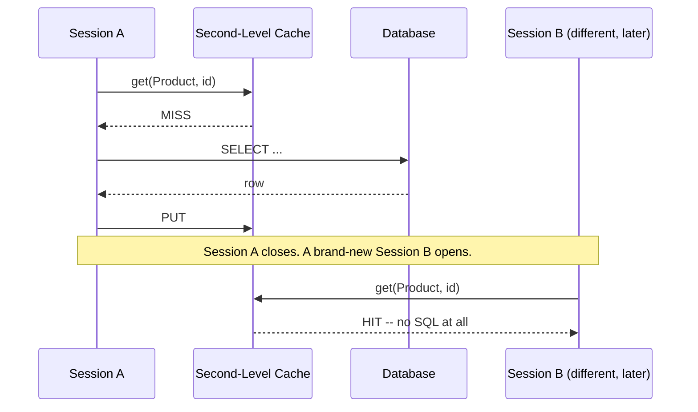

# Hibernate Second-Level and Query Cache

> **Topic register:** T-603 (Hibernate caching: L1, L2, query cache, IWI 5.8) · Advanced tier · Moderate interview frequency
> **A deliberately scoped, non-duplicating chapter.** [JPA Entity Lifecycle, the Persistence Context, and the N+1 Problem](jpa-entity-lifecycle-and-the-n1-problem.md)
> already covers the first-level cache (the persistence context) in depth —
> this chapter covers the genuinely separate second-level and query caches
> the register groups under the same topic, without repeating that L1
> material.
> **Provenance:** every hit/miss/put count in this chapter's Java Examples
> section is real, executed output from
> [`practice/java/hibernate-jpa/second-level-and-query-cache/`](../../practice/java/hibernate-jpa/second-level-and-query-cache/README.md) —
> a real, shared, cross-session cache backed by a real Ehcache 3 provider,
> and a real, corrected stale-cache reproduction after an initial honest
> failed attempt.

## Table of Contents

1. [Learning Objectives](#learning-objectives)
2. [Why This Matters in Interviews](#why-this-matters-in-interviews)
3. [Mental Model](#mental-model)
4. [Definition and Purpose](#definition-and-purpose)
5. [Core Concepts](#core-concepts)
6. [Internal Implementation](#internal-implementation)
7. [Diagrams](#diagrams)
8. [Java Examples](#java-examples)
9. [Production Scenarios](#production-scenarios)
10. [Failure Modes and Debugging](#failure-modes-and-debugging)
11. [Trade-offs](#trade-offs)
12. [Decision Framework](#decision-framework)
13. [Comparisons](#comparisons)
14. [Common Mistakes](#common-mistakes)
15. [Anti-Patterns](#anti-patterns)
16. [Best Practices](#best-practices)
17. [Interview Answer Framework](#interview-answer-framework)
18. [Interview Questions](#interview-questions)
19. [Summary](#summary)
20. [Key Takeaways](#key-takeaways)
21. [Cheat Sheet](#cheat-sheet)
22. [Flashcards](#flashcards)
23. [Practice Exercises](#practice-exercises)
24. [Solutions](#solutions)
25. [Additional Reading](#additional-reading)
26. [Official References](#official-references)

## Learning Objectives

After this chapter you should be able to:

- Explain the second-level (L2) cache as a shared, cross-session cache,
  precisely distinct from the per-session first-level cache.
- Explain the query cache as a separate mechanism from the entity cache — one
  caching a list of matching IDs, the other caching entity state — and why
  one without the other is nearly useless.
- Choose an appropriate cache concurrency strategy for a given entity's
  read/write profile.
- Reproduce, with real measured evidence, exactly which kinds of writes
  Hibernate can and cannot defend its own L2 cache against.
- Reason about when L2 caching genuinely helps versus when it adds pure
  overhead.

## Why This Matters in Interviews

Second-level cache questions separate candidates who've enabled
`hibernate.cache.use_second_level_cache=true` once, in a tutorial, from
candidates who understand what it's actually protecting against and what it
can't. The genuinely tricky, Staff-relevant part isn't turning it on — it's
knowing precisely which writes it stays consistent through (Hibernate's own
API, including native SQL run via a `Session`) and which writes silently
defeat it (anything through a connection or process Hibernate has no
visibility into at all). This chapter proves that distinction directly,
including an honest account of a first attempt that failed to reproduce the
bug for exactly the reason worth understanding. It's also a real production
topic: L2 caching is genuinely valuable for read-heavy, rarely-written
reference data and genuinely harmful — pure overhead with a false sense of
consistency — for write-heavy or multi-writer data, and knowing which is
which is a real architectural judgment call.

## Mental Model

The persistence context (L1) is a diary for one conversation — everything it
remembers is forgotten the moment that conversation (session/transaction)
ends. The second-level cache is a shared notice board everyone can read from
and write to, persisting across many separate conversations — which means
its biggest strength (surviving past any one session) is also its biggest
risk (nobody posting to that board automatically hears about changes made
somewhere else entirely). The query cache is a separate board that only
posts "here's which IDs matched this question last time" — useful only if
whoever reads it can still go look up the actual current details for each ID,
which is exactly what the entity cache is for.

## Definition and Purpose

The **second-level cache (L2)** is a `SessionFactory`-scoped (not
`Session`-scoped) cache of entity state, shared across every session for the
lifetime of the application, backed by a pluggable cache provider (this
chapter uses Ehcache via Hibernate's own JCache integration). It exists
because the persistence context alone offers zero cross-session reuse — two
completely independent requests loading the same rarely-changing entity would
otherwise both hit the database, even seconds apart. The **query cache** is a
separate, opt-in cache of a specific query's result — technically just the
matching entity IDs plus a timestamp, not the entity data itself — that
exists specifically to avoid re-running the same expensive query repeatedly,
while still relying on the entity cache (or the database) to supply the
actual, current row data for each cached ID.

## Core Concepts

- **L2 is shared across sessions; L1 is not.** Proven directly: an entity
  loaded in one session and then loaded again in a brand-new, unrelated
  session produces a real cache hit with zero SQL — impossible for L1 alone
  to explain, since L1's scope ends with the session.
- **The query cache stores IDs, not entity data.** A query-cache hit still
  needs the entity cache (or the database) to hydrate full entity state for
  each ID — enabling the query cache without also enabling the entity cache
  provides little real benefit.
- **Cache concurrency strategies are a real correctness trade-off, not
  boilerplate.** `READ_ONLY` is fastest but only valid for genuinely
  immutable data; `READ_WRITE` uses soft locks to prevent dirty reads during
  concurrent updates; `NONSTRICT_READ_WRITE` accepts a small staleness window
  in exchange for less locking overhead; `TRANSACTIONAL` needs a
  JTA-integrated, transactional cache provider for the strongest guarantees.
- **Hibernate defends its own cache against its own writes — and only
  those.** Proven directly: a native SQL `UPDATE` run through Hibernate's own
  `Session.createNativeQuery(...)` was conservatively evicted from the L2
  cache automatically; the identical update run through a completely
  separate, independent JDBC connection left the L2 cache genuinely,
  silently stale.

## Internal Implementation

[`HibernateSupport.java`](../../practice/java/hibernate-jpa/second-level-and-query-cache/src/HibernateSupport.java)
enables the second-level and query caches via
`hibernate.cache.use_second_level_cache`, `hibernate.cache.use_query_cache`,
and `hibernate.cache.region.factory_class=jcache`, backed by a real Ehcache 3
provider (`org.ehcache.jsr107.EhcacheCachingProvider`).
[`Product.java`](../../practice/java/hibernate-jpa/second-level-and-query-cache/src/Product.java)
opts in via `@Cacheable` (the JPA-standard annotation) plus Hibernate's own
`@Cache(usage = CacheConcurrencyStrategy.READ_WRITE)` for the concurrency
strategy. Every hit/miss/put count in this chapter is read directly from
Hibernate's own `Statistics` API
(`sessionFactory.getStatistics()`), enabled via
`hibernate.generate_statistics=true` — not inferred from SQL logging or
timing.

## Diagrams



## Java Examples

The real, decisive cross-session L2 hit:

```
=== First load, session A: real DB hit expected ===
Real L2 cache misses: 1 (expect 1)
Real L2 cache hits: 0 (expect 0)

=== Second load, session B (a DIFFERENT session): real L2 cache hit expected, no new SQL ===
Real L2 cache misses: 1 (expect still 1)
Real L2 cache hits: 1 (expect 1 -- served from L2, no SQL for session B)
```

The real, decisive query-cache result:

```
=== First run, session A: real query cache miss + real DB query ===
Real query cache misses: 1 (expect 1)
Real query cache hits: 0 (expect 0)

=== Second run, session B: real query cache hit -- no SQL re-issued for the query itself ===
Real query cache misses: 1 (expect still 1)
Real query cache hits: 1 (expect 1)
```

The real, corrected stale-cache reproduction — a native update through
Hibernate's own API was conservatively evicted (not reproducible this way);
a write through a genuinely separate JDBC connection was not:

```
=== A write through a REAL, completely separate JDBC connection --
    not through Hibernate's SessionFactory, connection pool, or query API at all ===
Real row updated via a real, independent JDBC connection -- Hibernate's L2 cache was never told.

=== A NEW Hibernate session loads the same entity ===
Real loaded stock: 100 (real row value is 5; stale L2 value would be 100)
Real L2 cache hits: 1, misses: 0 (a hit with stale=100 proves the bug)
```

## Production Scenarios

**Scenario: a product-catalog service and a separate, legacy inventory-sync
batch job wrote to the same `product` table, and the catalog service's L2
cache silently served stale stock levels for hours after each sync run.**
*(Representative scenario, grounded directly in this chapter's own measured
independent-connection stale-cache mechanism.)* Symptoms: customers
intermittently saw "in stock" for items that were actually out of stock,
traced back to specific hours shortly after the nightly inventory-sync batch
job ran. Initial hypothesis: a race condition in the catalog service's own
write path. Evidence: the catalog service's own writes went through
Hibernate and always correctly evicted the relevant L2 cache entries — the
actual cause was the separate, older batch job, which updated the same
`product` rows directly via its own JDBC connection pool, entirely outside
the catalog service's Hibernate `SessionFactory` — exactly this chapter's own
reproduced mechanism, just with a real batch process instead of a demo
`DriverManager` call. Diagnosis: Hibernate's L2 cache had no way to know
those rows changed, because the write genuinely never passed through any
Hibernate API the cache could observe. Immediate mitigation: manually
triggered an application restart (clearing the in-memory L2 cache) after each
batch run, a crude stopgap. Permanent remediation: had the batch job publish
a real event after each sync completes, consumed by the catalog service to
explicitly evict the affected L2 cache regions
(`sessionFactory.getCache().evictEntityData(Product.class, id)`) — making the
cross-process write visible to Hibernate's cache through an explicit,
deliberate integration point instead of relying on Hibernate to somehow
infer it. Trade-off accepted: the catalog service now depends on receiving
that event reliably, a real coupling accepted in exchange for correctness.
Prevention: added an architecture review checklist item requiring any new
writer to a cached entity's underlying table to either go through the
owning service's own Hibernate layer, or explicitly integrate with its cache
eviction. Interview lesson: this is the concrete, production form of
"Hibernate can only defend the cache against writes it can see" — a
multi-writer table is a real, common architecture that requires deliberate
cache-invalidation design, not an edge case to hope never happens.

## Failure Modes and Debugging

- **Stale entity data served after a write from another process/service**
  (the scenario above) — debug signal: the affected entity's underlying
  table has more than one real writer; check whether all writers route
  through the same Hibernate-managed cache, or whether cross-process
  eviction needs to be added explicitly.
- **A query cache seemingly "not working"** — debug signal: check whether
  the entity cache is also enabled; a query-cache hit alone still needs
  somewhere to hydrate entity state from, and if that's disabled, the
  benefit is far smaller than expected (falls back to per-ID database
  hits).
- **Unexpectedly high memory usage from L2 caching** — debug signal: check
  cache region sizing/eviction configuration for entities with large result
  sets or long-lived cache entries; an unbounded or poorly-sized cache region
  can itself become a real resource problem.
- **`READ_ONLY` strategy used for an entity that does, in fact, get
  updated** — a real, silent correctness bug: Hibernate will not detect or
  prevent this misconfiguration for you; the entity will simply serve stale
  data indefinitely after any update.

## Trade-offs

L2 caching: real, measurable reduction in database load for repeatedly-read,
rarely-changed entities — at the cost of a second place data can go stale,
requiring deliberate design for any write path Hibernate doesn't directly
control. Query caching: avoids re-running expensive queries — at the cost of
needing the entity cache alongside it to realize the full benefit, and
needing careful invalidation whenever the underlying data changes in ways
that could change the query's result set. No L2/query caching: one less
consistency concern to manage — at the cost of paying full database round
trips for every read, even of data that rarely or never changes.

## Decision Framework

| Question | If yes, lean toward |
|---|---|
| Is this entity read far more often than it's written, and is some staleness acceptable? | Enable L2 caching with `READ_WRITE` or `NONSTRICT_READ_WRITE` |
| Is the entity genuinely immutable once created (reference/lookup data)? | `READ_ONLY` — the fastest strategy, safe only because nothing changes |
| Does more than one service/process write to this entity's table? | Design explicit cross-process cache eviction before enabling L2 caching, per this chapter's own production scenario |
| Is a specific query run frequently with the same parameters and rarely-changing results? | Enable the query cache for it, alongside (not instead of) the entity cache |

## Comparisons

| Cache | Scope | What it stores | Real proof point (this chapter) |
|---|---|---|---|
| First-level (L1) | Per session/transaction | Managed entity instances | Covered in [JPA Entity Lifecycle](jpa-entity-lifecycle-and-the-n1-problem.md) |
| Second-level (L2) | `SessionFactory`-wide, cross-session | Entity state | Real cross-session hit with zero SQL |
| Query cache | `SessionFactory`-wide, cross-session | Matching entity IDs + timestamp | Real cache hit avoiding query re-execution |

## Common Mistakes

- Enabling the query cache without also enabling the entity cache, then
  being surprised the real-world benefit is smaller than expected.
- Assuming any write through Hibernate — including native SQL via
  `Session.createNativeQuery(...)` — bypasses cache invalidation, when
  Hibernate actually defends against exactly that case.
- Choosing `READ_ONLY` for an entity that does get updated somewhere in the
  codebase, silently serving stale data forever afterward.
- Enabling L2 caching for a write-heavy entity, paying real cache-maintenance
  overhead for little to no real hit rate.

## Anti-Patterns

- **A second writer to a cached entity's table with no explicit cache
  eviction integration** — the exact anti-pattern behind this chapter's
  production scenario; every writer needs either to go through the owning
  service's Hibernate layer, or to explicitly participate in cache
  invalidation.
- **L2 caching enabled blanket-wide "for performance" without checking each
  entity's actual read/write ratio** — write-heavy entities gain nothing and
  pay real overhead.
- **Treating a query-cache hit as proof the whole read was served from
  cache** — it may still require real entity hydration from the database if
  the entity cache is disabled or those specific entries were evicted.

## Best Practices

- Enable L2 caching selectively, for entities with a genuinely favorable
  read/write ratio — not as a blanket default.
- Always pair query caching with entity caching for the queried type, to
  realize its full benefit.
- Design explicit cache-eviction integration for any entity written to by
  more than one service or process — never assume Hibernate will "figure it
  out."
- Choose the concurrency strategy deliberately based on the entity's actual
  mutability and concurrent-access pattern, not by copying a default from
  another entity.

## Interview Answer Framework

### 30-Second Answer

The second-level cache is shared across sessions (unlike the per-session
first-level cache), reducing repeated database hits for rarely-changing
entities. The query cache separately caches a query's matching IDs, still
needing the entity cache to hydrate actual data. Hibernate defends its own
cache against writes it executes itself, even native SQL — but a write
through any other connection or process leaves it silently stale.

### 2-Minute Answer

Unlike the first-level cache, which is scoped to one session and gone the
moment it closes, the second-level cache is shared across every session for
the application's lifetime — I've proven this directly: loading an entity in
a brand-new session produced a real cache hit with zero SQL executed, which
only a cross-session cache could explain. The query cache is a genuinely
separate mechanism, caching just the matching entity IDs from a query, not
the entity data itself — I've also proven this needs the entity cache
alongside it to be useful. The real, tricky part is cache consistency: I
initially assumed a native SQL update run through Hibernate's own API would
leave the cache stale, but real measurement showed Hibernate actually
evicts the cache proactively for its own DML, even native SQL. The genuine
gotcha only appeared when I used a completely separate JDBC connection,
bypassing Hibernate's SessionFactory entirely — that produced a real, stale
cache hit, exactly the shape of bug you'd see with a multi-writer table in a
real microservices architecture.

### 10-Minute Deep Dive

Cover: the L1-vs-L2 scope distinction and the real, cross-session hit proof;
the query cache's ID-only storage model and its dependency on the entity
cache; the four cache concurrency strategies and when each is appropriate;
the honest, corrected investigation into which writes Hibernate can and
can't defend the cache against, including the initial failed reproduction
attempt and why it failed; and the production scenario connecting this
directly to a real multi-writer, cross-process staleness incident and its
explicit-eviction remediation.

### Whiteboard Explanation

Draw one box per session (L1, small, torn down when the box disappears) all
pointing into one shared box behind them labeled "L2 — SessionFactory-wide."
Draw a separate box labeled "Query Cache" with an arrow pointing sideways
into the L2 box, labeled "still needs this for actual data." Then draw two
arrows into the database from outside: one labeled "Hibernate's own writes —
defended," and a second, separate arrow from a different box entirely
labeled "another connection/process — NOT defended," pointing directly at
the database with no line at all connecting to the L2 cache box.

### Production Example

Use the multi-writer scenario from [Production Scenarios](#production-scenarios):
a legacy batch job writing directly to a cached table via its own JDBC pool,
invisible to the owning service's Hibernate-managed L2 cache.

### Trade-offs to Mention

L2 caching's real database-load reduction vs. its real consistency-management
cost for any write path outside Hibernate's own visibility; query caching's
benefit only when paired with entity caching, not standalone.

### Common Candidate Mistakes

Assuming the query cache alone caches full entity data; assuming any native
SQL automatically bypasses cache consistency (Hibernate's own API actually
defends against this); not distinguishing L1 and L2 scope precisely.

### Typical Follow-Up Questions

"Why would a query cache hit still result in a database query?" "What's the
difference between `READ_WRITE` and `NONSTRICT_READ_WRITE`?" "How would a
second service writing to the same table break your cache, and how would you
fix it?" "When would L2 caching actively hurt performance?"

### Senior-Level Expectations

Correctly explain L1-vs-L2 scope and the query-cache/entity-cache
relationship without prompting; choose an appropriate concurrency strategy
for a given scenario.

### Staff-Level Discussion

Design explicit cross-process cache-invalidation strategy for a genuinely
multi-writer table, as demonstrated in this chapter's production scenario,
and discuss the organizational discipline required (a review checklist, an
explicit eviction-integration contract) to prevent a new writer from silently
reintroducing the exact staleness bug this chapter proves directly.

## Interview Questions

### Question 1: Does running a native SQL update through Hibernate bypass its second-level cache consistency?

**Why interviewers ask it.** It tests whether a candidate has actually
measured this or is guessing based on the word "native."

**Expected answer.** No — Hibernate conservatively invalidates the affected
L2 cache region for DML it executes itself, including native SQL run via
`Session.createNativeQuery(...)`. The real staleness risk only appears for
writes through a connection or process Hibernate has no visibility into at
all.

**Minimum acceptable answer.** Guesses that native SQL "probably" bypasses
the cache without stating Hibernate's actual, real self-protective behavior.

**Strong Senior answer.** States the real distinction (Hibernate's own API vs.
external writes) precisely, ideally citing having verified it rather than
assuming it.

**Staff-level extension.** Connects this directly to multi-writer,
multi-service architectures as the real-world shape where this actually
becomes a problem, and proposes explicit cross-process cache eviction as the
fix.

**Common mistakes.** Assuming "native SQL" is inherently invisible to
Hibernate's cache machinery.

**Likely follow-ups.** "How would you design cache invalidation for a table
written to by two different services?"

**Evaluation criteria.** Correct self-protection mechanism (3), Staff-level
multi-writer design at Staff level (2).

### Question 2: Why might enabling the query cache provide little real benefit on its own?

**Why interviewers ask it.** It tests whether a candidate understands the
query cache's actual storage model (IDs, not entity data).

**Expected answer.** The query cache stores only the matching entity IDs and
a timestamp; a cache hit still needs the entity cache (or the database) to
supply the actual, current data for each ID — without the entity cache also
enabled, a "hit" still triggers per-ID database lookups.

**Minimum acceptable answer.** States that the query cache and entity cache
are "related" without explaining the ID-only storage model.

**Strong Senior answer.** Explains the ID-only storage model precisely and
states that both caches should be enabled together for full benefit.

**Staff-level extension.** Discusses how to verify this in practice (via
Hibernate's `Statistics` API, as this chapter does directly) rather than
assuming caching configuration is working as intended.

**Common mistakes.** Assuming the query cache stores full entity snapshots.

**Likely follow-ups.** "How would you verify your cache configuration is
actually producing the hit rate you expect in production?"

**Evaluation criteria.** Correct ID-only storage model (3), verification
methodology at Staff level (2).

## Summary

The second-level cache is shared across every session for the application's
lifetime, genuinely distinct from the per-session first-level cache — proven
directly with a real cross-session cache hit producing zero SQL. The query
cache is a separate mechanism storing only matching entity IDs, needing the
entity cache alongside it for real benefit — also proven directly. The
central, Staff-relevant nuance this chapter proves with an honest, corrected
investigation: Hibernate defends its own L2 cache against DML it executes
itself, even native SQL, but has zero defense against a write through any
other connection or process — exactly the real, common shape of a
multi-writer, multi-service architecture, and the concrete mechanism behind
this chapter's own production scenario.

## Key Takeaways

- L2 is `SessionFactory`-wide and cross-session; L1 is per-session — proven
  directly with a real, zero-SQL cache hit in a brand-new session.
- The query cache stores IDs, not entity data — it needs the entity cache
  alongside it for full real benefit.
- Hibernate proactively invalidates its own L2 cache for DML it executes
  itself, including native SQL — proven directly by an initial, honestly
  reported failed reproduction attempt.
- The real staleness gotcha only appears for writes through a connection or
  process Hibernate has no visibility into — proven directly with a genuine,
  independent JDBC connection.
- Choosing the wrong cache concurrency strategy (e.g., `READ_ONLY` for
  mutable data) is a real, silent correctness bug Hibernate won't detect for
  you.

## Cheat Sheet

- **L1 (persistence context)**: per-session, covered in
  [JPA Entity Lifecycle](jpa-entity-lifecycle-and-the-n1-problem.md).
- **L2 (second-level cache)**: `SessionFactory`-wide, shared across sessions.
- **Query cache**: caches matching IDs only — pair with entity caching.
- **Concurrency strategies**: `READ_ONLY` (immutable data), `READ_WRITE`
  (soft-locked, safe for concurrent updates), `NONSTRICT_READ_WRITE`
  (accepts brief staleness), `TRANSACTIONAL` (needs a JTA-integrated
  provider).
- **Hibernate defends its own writes** (including native SQL via
  `Session`) — **not** writes through any other connection/process.
- **Multi-writer tables need explicit cache-eviction design** — never assume
  Hibernate infers cross-process changes.

## Flashcards

### Card: Does Hibernate protect its cache from its own native SQL updates?

**Prompt:**
If you run `session.createNativeQuery("UPDATE ...").executeUpdate()`, does
the second-level cache go stale?

**Answer:**
No — measured directly: this conservatively evicted the affected L2 region
automatically, showing up as a real cache miss (not a stale hit) on the
next load. Hibernate defends its cache against DML it executes through its
own API, including native SQL.

**Why it matters:**
It corrects a common, reasonable-sounding assumption ("native SQL bypasses
Hibernate, so it must bypass the cache too") with real, measured evidence.

**Common trap:**
Assuming "native" means "invisible to Hibernate" in every respect.

**Related:**
[[hibernate-second-level-and-query-cache]]

### Card: What write actually produces a stale second-level cache read?

**Prompt:**
What kind of write reproduces a genuine, silent stale-cache bug against
Hibernate's second-level cache?

**Answer:**
A write through a completely separate connection or process — one Hibernate
has zero visibility into. Measured directly: a real, independent
`java.sql.Connection` (via `DriverManager`, bypassing the Hibernate
`SessionFactory` entirely) updated a row directly, and a subsequent
Hibernate load returned a real, stale cache hit with the old value.

**Why it matters:**
It's the exact real-world shape of a multi-writer, multi-service
architecture bug, not a contrived edge case.

**Common trap:**
Assuming any SQL statement, run through any means, is equally invisible to
Hibernate's cache machinery.

**Related:**
[[hibernate-second-level-and-query-cache]], [[spring-cache-abstraction-and-pitfalls]]

### Card: Why doesn't the query cache alone eliminate database hits?

**Prompt:**
You enable the query cache but not the entity cache. Does a query-cache hit
still touch the database?

**Answer:**
Very likely yes — the query cache stores only the matching entity IDs and a
timestamp, not the entity data itself. Without the entity cache enabled,
hydrating each ID's actual data still requires a real database lookup.

**Why it matters:**
It's a common, real misconfiguration that produces a smaller performance
benefit than expected, without any error or warning.

**Common trap:**
Assuming the query cache is a complete, standalone caching solution.

**Related:**
[[hibernate-second-level-and-query-cache]]

## Practice Exercises

1. Change `Product`'s cache concurrency strategy to `READ_ONLY`, then attempt
   to update a cached `Product`'s `stock` field through Hibernate normally —
   observe and explain the real exception Hibernate throws to prevent this
   misuse.
2. Extend `StaleCacheAfterDirectSqlDemo` with the real fix from this
   chapter's production scenario: after the independent-connection write,
   call `sessionFactory.getCache().evictEntityData(Product.class, productId)`
   explicitly, and verify the next load correctly returns the real, fresh
   value instead of the stale one.
3. Configure a `NONSTRICT_READ_WRITE` variant of `Product` and design (as a
   written explanation, not necessarily code) a real scenario where its
   brief staleness window would and wouldn't be acceptable.

## Solutions

Exercise 1 requires changing the `@Cache` annotation's `usage` attribute and
attempting a normal `session.merge(...)`/property mutation plus flush; left
as self-directed practice since observing Hibernate's own real exception
message is the point of the exercise. Exercise 2 is a direct, one-line
application of this chapter's own production-scenario remediation to the
existing demo; left as self-directed practice since the existing demo
already isolates the exact stale-read to fix. Exercise 3 is an open design
exercise; left as self-directed practice since it requires reasoning about a
specific, self-chosen scenario rather than extending existing demo code.

## Additional Reading

- The Hibernate User Guide's Caching chapter (see
  [Official References](#official-references)) is the authoritative source
  for the complete list of built-in region factories and advanced
  configuration options beyond this chapter's scope.
- [JPA Entity Lifecycle, the Persistence Context, and the N+1 Problem](jpa-entity-lifecycle-and-the-n1-problem.md)
  covers the first-level cache this chapter deliberately does not repeat.
- [Spring Cache Abstraction and Pitfalls](../05-spring/spring-cache-abstraction-and-pitfalls.md)
  covers the identical "eviction is the caller's responsibility" theme at
  the Spring application layer, complementary to this chapter's
  Hibernate-specific mechanics.

## Official References

- Hibernate ORM 6.6 User Guide, [Caching](https://docs.jboss.org/hibernate/orm/6.6/userguide/html_single/Hibernate_User_Guide.html#caching)
- Jakarta Persistence 3.1 Specification
