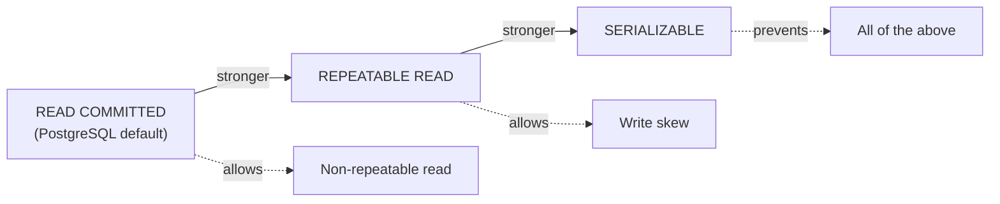

# Isolation Levels and Concurrency Anomalies

> **Topic register:** T-611 · IWI 7.95 (#13 of 198) · Advanced tier · Very High interview frequency [H]
> **Closes the Database Triad:** [Index Structures](index-structures-btree-composite-covering.md) (T-609) → [Query Planning](query-planning-and-explain-analyze.md) (T-610) → Isolation Levels (T-611).
> **Provenance:** the write-skew reproduction and prevention in this chapter are real, executed PostgreSQL 16 output from two genuinely concurrent `psql` sessions, not a simulated transcript. Reproducible source: [`practice/sql/week-03/write-skew-setup.sql`](../../practice/sql/week-03/write-skew-setup.sql), [`write-skew-tx.sh`](../../practice/sql/week-03/write-skew-tx.sh), full session output in [`practice/sql/week-03/output/`](../../practice/sql/week-03/output/).

## Table of Contents

1. [Learning Objectives](#learning-objectives)
2. [Why This Matters in Interviews](#why-this-matters-in-interviews)
3. [Mental Model](#mental-model)
4. [Definition and Purpose](#definition-and-purpose)
5. [Historical Context](#historical-context)
6. [Core Concepts](#core-concepts)
7. [Internal Implementation](#internal-implementation)
8. [Execution Flow](#execution-flow)
9. [Diagrams](#diagrams)
10. [Java Examples](#java-examples)
11. [Production Scenarios](#production-scenarios)
12. [Failure Modes and Debugging](#failure-modes-and-debugging)
13. [Trade-offs](#trade-offs)
14. [Performance Implications](#performance-implications)
15. [Memory Implications](#memory-implications)
16. [Concurrency Implications](#concurrency-implications)
17. [Security Implications](#security-implications)
18. [Decision Framework](#decision-framework)
19. [Comparisons](#comparisons)
20. [Common Mistakes](#common-mistakes)
21. [Anti-Patterns](#anti-patterns)
22. [Best Practices](#best-practices)
23. [Interview Answer Framework](#interview-answer-framework)
24. [Interview Questions](#interview-questions)
25. [Summary](#summary)
26. [Key Takeaways](#key-takeaways)
27. [Cheat Sheet](#cheat-sheet)
28. [Flashcards](#flashcards)
29. [Practice Exercises](#practice-exercises)
30. [Solutions](#solutions)
31. [Additional Reading](#additional-reading)
32. [Official References](#official-references)

---

## Learning Objectives

By the end of this chapter you can:

- State precisely what each of PostgreSQL's three isolation levels prevents and still allows, without inventing a fourth behavior.
- Explain write skew with a concrete, reproducible example, and distinguish it from a lost update — the single most commonly conflated pair of anomalies in this domain.
- Walk "two transactions read a balance and both write" correctly at all three isolation levels, including the atomic-`UPDATE`-vs-application-read-then-write distinction most candidates miss.
- Justify choosing SERIALIZABLE (or not) as a cross-cutting architectural decision, including its mandatory retry-on-serialization-failure requirement.
- Name `SELECT ... FOR UPDATE` as the READ-COMMITTED-compatible fix for an application-level read-then-write race, without reflexively escalating to SERIALIZABLE.

## Why This Matters in Interviews

Isolation levels are Very-High-frequency because nearly every backend system has at least one cross-row invariant, and most engineers have never been asked to name the specific mechanism that protects it — or doesn't. This topic contains what this project's own interview-feedback record calls **the discriminating question**: "explain write skew with a concrete example." It discriminates cleanly because a shallow answer (confusing write skew with a lost update) is audibly different from a real one, and because the correct answer requires having actually reasoned about *why* a weaker isolation level misses a specific class of bug rather than reciting a definition.

## Mental Model

**An isolation level is a promise about what one transaction is allowed to see of another's concurrent work — and every anomaly is just a specific way of breaking a promise you didn't actually need.** Read the three PostgreSQL levels not as an arbitrary ladder but as answers to one question, asked with increasing strictness: *"if two transactions run at the same time, must the result look like they ran one after another?"* READ COMMITTED says "no, mostly not." REPEATABLE READ says "not for what I read, but my writes can still interact with concurrent ones in cross-row ways I won't be told about." SERIALIZABLE says "yes — behave as if this ran alone, or tell me so I can retry."

## Definition and Purpose

An **isolation level** governs how much of another transaction's concurrent, uncommitted, or otherwise-in-progress work a given transaction can observe, and what anomalies that visibility permits. It exists because unconstrained concurrent access to shared data can produce results that could never occur under any serial (one-at-a-time) execution of the same transactions — which would make "transaction" as a unit of correctness meaningless. Isolation levels exist as a deliberate spectrum, because true serial execution (the strongest possible guarantee) has a real throughput cost, and most application code doesn't need the strongest guarantee for most of its data — but *some* invariants do, and picking the wrong level for those silently allows a specific, nameable class of bug instead of raising an error.

## Historical Context

The now-standard four SQL isolation levels (READ UNCOMMITTED, READ COMMITTED, REPEATABLE READ, SERIALIZABLE) were formalized in the SQL-92 standard, defined in terms of which of three anomalies (dirty read, non-repeatable read, phantom read) each level permits. This anomaly-based definition is now understood to be incomplete — it says nothing about write skew, which doesn't fit neatly into "dirty/non-repeatable/phantom read" at all, because write skew involves no single row being read inconsistently; it involves two *different* rows being written based on a shared read. This gap is precisely why Jim Gray and colleagues' 1995 paper "A Critique of ANSI SQL Isolation Levels" mattered, and why PostgreSQL's implementation of true SERIALIZABLE uses **Serializable Snapshot Isolation (SSI)** — introduced in PostgreSQL 9.1 (2011), based on Cahill, Röhm, and Fekete's 2008 research — rather than the older, more expensive approach of literally locking everything a transaction touches (two-phase locking). SSI instead runs on top of REPEATABLE READ's existing snapshot mechanism and adds runtime *dependency tracking*, aborting a transaction only when it detects a specific dangerous cycle of read-write dependencies — a fundamentally cheaper strategy than serializing everything by locking.

## Core Concepts

### The three levels, precisely (PostgreSQL)

| Level | Prevents | Still allows | Mechanism |
|---|---|---|---|
| **READ COMMITTED** (PostgreSQL's default) | Dirty reads | Non-repeatable reads, write skew, phantoms | Each *statement* sees a fresh snapshot as of its own start |
| **REPEATABLE READ** | Non-repeatable reads within one transaction | Write skew (§ Internal Implementation) | One snapshot for the *whole transaction*, taken at its start |
| **SERIALIZABLE** | Write skew and all weaker anomalies | Nothing — behaves as if transactions ran one at a time | REPEATABLE READ's snapshot, plus SSI's runtime read-write dependency tracking, which aborts a transaction forming a dangerous cycle |

**A correction most candidates need, unprompted:** PostgreSQL has no separate `READ UNCOMMITTED` behavior — the standard permits dirty reads at that level, but PostgreSQL's `READ UNCOMMITTED` setting behaves identically to `READ COMMITTED`, and dirty reads never occur in PostgreSQL at any level. Naming this unprompted is itself an engine-precision signal, the same category of correction as T-609's clustered-index terminology.

### Lost update vs. write skew — the distinction that is the entire point

A **lost update** is a *same-row* conflict: two transactions read the same row, both compute a new value from it, and the second write silently overwrites the first's intent. PostgreSQL prevents this even at READ COMMITTED for a single atomic `UPDATE ... SET balance = balance - ?` statement, because `UPDATE` itself takes a row lock — the second transaction's `UPDATE` blocks until the first commits, then re-evaluates against the now-current row. The danger reappears specifically when application code does a **separate** read, then a conditional write, without holding a lock across the two (§ Internal Implementation).

**Write skew** is fundamentally different: it is a **cross-row** invariant violation. Two transactions each read a *shared, multi-row* state, and each writes to a *different* row based on that shared read. Neither transaction's own single-row write conflicts with the other's — there is no row both transactions touch — yet the *combination* of their two independent, individually-valid writes violates an invariant that spans both rows. REPEATABLE READ's snapshot isolation has nothing to detect here: from each transaction's perspective, its own read was consistent and its own write was uncontested.

## Internal Implementation

### Write skew, reproduced

**The scenario.** An `on_call` table enforces an invariant: at least one doctor must always be on call. Alice and Bob are both currently on call. Each, independently and concurrently, checks "is at least one *other* doctor on call?" before going off call themselves.

**At `REPEATABLE READ` — the anomaly occurs.**

```
Alice's transaction: SELECT count(*) -> 2, UPDATE Alice off-call, COMMIT (succeeds)
Bob's transaction:   SELECT count(*) -> 2, UPDATE Bob off-call,   COMMIT (succeeds)

Final state: Alice = false, Bob = false
```

Each transaction reads `on_call_count = 2` from its own consistent snapshot — the other doctor's change hasn't committed yet from either transaction's point of view — so both proceed to go off call. **Zero doctors on call: the invariant is violated**, even though neither transaction did anything individually incorrect, and each one's own snapshot was perfectly internally consistent. No single-row conflict exists for REPEATABLE READ to catch, because Alice's transaction only ever wrote Alice's row, and Bob's only ever wrote Bob's.

**At `SERIALIZABLE` — the anomaly is prevented.** Identical application code, only the isolation level changed:

```
Alice's transaction: SELECT count(*) -> 2, UPDATE Alice off-call, COMMIT -> FAILS:
  ERROR: could not serialize access due to read/write dependencies among transactions
  DETAIL: Reason code: Canceled on identification as a pivot, during commit attempt.
  HINT: The transaction might succeed if retried.

Bob's transaction:   SELECT count(*) -> 2, UPDATE Bob off-call,   COMMIT (succeeds)

Final state: Alice = true, Bob = false
```

SSI detected the dangerous read-write dependency structure between the two transactions and aborted one at commit time with a specific, real error. **The application must retry the aborted transaction** — on retry, it re-reads the now-current state (Bob already off call) and correctly refuses to also go off call. The invariant survives, but only because the application was written to retry a serialization failure as expected, recoverable behavior — not to surface it as an unhandled error.

### Two transactions read a balance and both write — walked at all three levels

- **READ COMMITTED.** A single atomic `UPDATE orders SET balance = balance - ? WHERE id = ?` does **not** lose an update — the second `UPDATE` blocks on the first's row lock, then re-evaluates `balance - ?` against the post-commit value once unblocked. The danger is specifically a **separate** read-then-conditionally-write pattern in application code (read `balance` into a variable, compute a new value, then `UPDATE ... SET balance = ?` with the computed literal) — that pattern is not protected by any row lock and can silently lose an update even at READ COMMITTED.
- **REPEATABLE READ.** The second transaction's `UPDATE` on a row already modified by a concurrent, uncommitted transaction blocks; on the first's commit, PostgreSQL gives the second transaction a serialization error rather than silently overwriting — REPEATABLE READ specifically prevents lost updates this way, even though it does not prevent write skew.
- **SERIALIZABLE.** Same lost-update protection as REPEATABLE READ, plus the write-skew protection demonstrated above.

**The fix for the read-then-write race without escalating isolation level:** `SELECT balance FROM orders WHERE id = ? FOR UPDATE` takes the row lock at read time, closing the window that a plain `SELECT` leaves open — this is the READ-COMMITTED-compatible remedy, and naming it unprompted is a Staff-level signal (§ Interview Answer Framework).

## Execution Flow

```mermaid
sequenceDiagram
    participant Alice
    participant DB as PostgreSQL (REPEATABLE READ)
    participant Bob

    Alice->>DB: BEGIN; SELECT count(*) WHERE on_call
    DB-->>Alice: 2 (snapshot taken here)
    Bob->>DB: BEGIN; SELECT count(*) WHERE on_call
    DB-->>Bob: 2 (Bob's own snapshot, also taken here)
    Alice->>DB: UPDATE alice SET on_call = false
    DB-->>Alice: OK
    Alice->>DB: COMMIT
    DB-->>Alice: success
    Bob->>DB: UPDATE bob SET on_call = false
    DB-->>Bob: OK (no conflict detected — different row than Alice's)
    Bob->>DB: COMMIT
    DB-->>Bob: success — invariant now violated
```

At SERIALIZABLE, the identical sequence of statements triggers SSI's dependency tracker to detect that Alice's read depended on data Bob's transaction later wrote (and vice versa), forming a cycle — one of the two commits fails instead of both succeeding.

## Diagrams



Read this left to right on a whiteboard: each arrow to the right removes one more anomaly, at the cost of more blocking or more aborted-and-retried transactions.

## Java Examples

Isolation-level choice is set per-transaction, and Spring's `@Transactional` annotation is the primary point of contact for a Java engineer. This example shows the read-then-write race and its two valid fixes — row locking, or escalated isolation with mandatory retry.

```java
// Java 21 / Spring. VULNERABLE: separate read, then conditional write — races
// even at READ COMMITTED (the connection pool's default) because no lock is
// held across the SELECT and the UPDATE.
@Transactional
public void deductBalanceBroken(Long accountId, BigDecimal amount) {
    BigDecimal balance = jdbcTemplate.queryForObject(
        "SELECT balance FROM accounts WHERE id = ?", BigDecimal.class, accountId);
    if (balance.compareTo(amount) >= 0) {
        jdbcTemplate.update(
            "UPDATE accounts SET balance = ? WHERE id = ?",
            balance.subtract(amount), accountId);
    }
}

// FIX 1 — SELECT ... FOR UPDATE: closes the race at READ COMMITTED by taking
// the row lock at read time, without escalating isolation level or requiring
// retry logic.
@Transactional
public void deductBalanceRowLocked(Long accountId, BigDecimal amount) {
    BigDecimal balance = jdbcTemplate.queryForObject(
        "SELECT balance FROM accounts WHERE id = ? FOR UPDATE",
        BigDecimal.class, accountId);
    if (balance.compareTo(amount) >= 0) {
        jdbcTemplate.update(
            "UPDATE accounts SET balance = ? WHERE id = ?",
            balance.subtract(amount), accountId);
    }
}

// FIX 2 — a single atomic UPDATE avoids the race entirely by never reading
// the value into application code at all; PostgreSQL's row lock on UPDATE
// is sufficient, no FOR UPDATE needed.
@Transactional
public int deductBalanceAtomic(Long accountId, BigDecimal amount) {
    return jdbcTemplate.update(
        "UPDATE accounts SET balance = balance - ? WHERE id = ? AND balance >= ?",
        amount, accountId, amount);  // returns 0 rows updated if insufficient funds
}
```

```java
// Cross-row invariant (write-skew shape): requires SERIALIZABLE plus explicit
// retry, since Spring's @Transactional does not retry on serialization
// failure by default.
@Retryable(retryFor = CannotSerializeTransactionException.class, maxAttempts = 3)
@Transactional(isolation = Isolation.SERIALIZABLE)
public void goOffCall(Long doctorId) {
    int otherDoctorsOnCall = jdbcTemplate.queryForObject(
        "SELECT count(*) FROM on_call WHERE doctor_id != ? AND on_call = true",
        Integer.class, doctorId);
    if (otherDoctorsOnCall < 1) {
        throw new IllegalStateException("cannot go off call: no coverage remains");
    }
    jdbcTemplate.update("UPDATE on_call SET on_call = false WHERE doctor_id = ?", doctorId);
}
```

**Complexity note:** all three account-deduction variants are `O(1)` database operations; the distinction is entirely about *correctness under concurrency*, not algorithmic cost — this is the recurring theme of the whole chapter.

## Production Scenarios

### Scenario: intermittent double-refund under concurrent customer support actions

**Symptoms.** A small number of refund requests, processed within seconds of each other by two different support agents (or an agent and an automated retry), result in the customer being refunded twice for the same order.

**Impact.** Direct financial loss, plus a support/finance reconciliation burden discovered only in a monthly audit — not caught by any error log, because neither transaction failed.

**Initial hypotheses.** A duplicate API call from a flaky client (checked — request IDs differ, so this isn't simple retried-request duplication); a missing idempotency key (plausible, and a real gap, but doesn't fully explain why *both* refunds succeeded rather than one being rejected); a database-level race (plausible).

**Evidence.** Application logs show the refund-eligibility check ("has this order already been refunded?") executed as a separate `SELECT` before the `UPDATE order SET refunded = true`, with both requests' `SELECT`s completing before either `UPDATE` — the classic read-then-write race from § Internal Implementation, running at the connection pool's default READ COMMITTED.

**Diagnosis.** No row lock was held across the eligibility check and the state-changing update; both concurrent requests read `refunded = false`, both proceeded, both wrote — not a lost *update* in the narrow sense (the final `refunded = true` value is correct), but a duplicated *side effect* (two refund transactions issued to the payment processor) caused by the identical race pattern.

**Immediate mitigation.** Add `SELECT ... FOR UPDATE` on the order row for the duration of the refund-eligibility check and the state update, closing the window without changing the isolation level or requiring retry logic.

**Permanent remediation.** Add an idempotency key to the refund endpoint (a separate, complementary fix — this addresses client-side duplicate calls, while the row lock addresses the server-side race) and a unique constraint on `(order_id)` in a dedicated `refunds` table, so even a future code path that reintroduces the race fails at the database's constraint layer rather than silently double-refunding.

**Alternatives considered.** Escalating the whole transaction to SERIALIZABLE — rejected as unnecessarily expensive and requiring new retry-handling for a same-row race that `FOR UPDATE` closes more cheaply; SERIALIZABLE is reserved for genuinely cross-row invariants elsewhere in the system.

**Trade-offs.** `SELECT ... FOR UPDATE` holds the row lock for the duration of the transaction, which is a real (small, bounded) concurrency cost on that specific order row — acceptable, since concurrent refund attempts on the *same* order are rare and the lock only blocks other transactions touching that exact row.

**Prevention.** Any "check a condition, then act on it" pattern touching money, inventory, or another externally-visible side effect gets a design-review checklist item: is this same-row (row lock / atomic `UPDATE` suffices) or cross-row (needs SERIALIZABLE plus retry)? — the two questions this whole chapter exists to teach how to tell apart.

**Interview lesson.** This is the read-then-write race from § Internal Implementation arriving with a real financial consequence, and it is deliberately *not* the write-skew scenario — the fix here is `FOR UPDATE`, not SERIALIZABLE, because the conflict is same-row. Confusing the two is exactly the common mistake this topic is designed to expose.

## Failure Modes and Debugging

| Symptom | Likely cause | Debugging step |
|---|---|---|
| Two concurrent requests both "succeed" but the end state violates a business invariant | Write skew — a cross-row invariant with no isolation stronger than the default in place | Identify the shared read and the different rows written; reproduce under REPEATABLE READ, verify it's prevented under SERIALIZABLE |
| A value computed from a `SELECT` is silently stale by the time an `UPDATE` applies it | Application-level read-then-write race, not protected by any row lock | Replace with `SELECT ... FOR UPDATE`, or collapse into a single atomic `UPDATE ... WHERE` |
| Transactions intermittently fail with "could not serialize access due to read/write dependencies" | Expected SERIALIZABLE behavior — SSI detected a dependency cycle | Confirm the calling code retries on `CannotSerializeTransactionException` (Java/Spring) or the equivalent SQLSTATE (`40001`); this is not a bug to suppress |
| SERIALIZABLE transactions fail far more often than expected | High contention on the same rows/predicates from many concurrent transactions | Reconsider whether SERIALIZABLE is needed system-wide, or only for the specific cross-row invariant, and whether a narrower lock (`FOR UPDATE`, an advisory lock) suffices instead |

## Trade-offs

| Level | Benefit | Cost |
|---|---|---|
| READ COMMITTED | Highest concurrency; PostgreSQL's default for a reason | Application code must be written defensively against non-repeatable reads and write skew — the database won't catch these for you |
| REPEATABLE READ | Consistent snapshot for the whole transaction; prevents same-row lost updates | Write skew still possible; more serialization failures than READ COMMITTED under contention |
| SERIALIZABLE | Strongest guarantee — behaves as if transactions ran serially | Real throughput cost from SSI's dependency tracking; **application must implement retry-on-serialization-failure**, or transactions silently fail under contention |

## Performance Implications

Each stronger isolation level trades throughput for a stronger correctness guarantee — REPEATABLE READ and SERIALIZABLE both hold one snapshot for the transaction's full duration rather than one per statement, which extends how long that snapshot's associated resources must be retained (§ Memory Implications), and SERIALIZABLE additionally pays SSI's runtime dependency-tracking cost on every read and write. At scale, choosing SERIALIZABLE for data with genuinely low write-contention on the relevant rows costs little in practice; choosing it for high-contention hot rows (a shared counter, a popular inventory item) can produce a retry storm of its own, which is why the Staff-level answer is scoped per-invariant, not applied uniformly.

## Memory Implications

A long-running transaction under REPEATABLE READ or SERIALIZABLE holds its snapshot open for its entire duration, which prevents PostgreSQL's vacuum process from reclaiming row versions that became dead *after* that snapshot was taken but are still needed to satisfy it under MVCC. A single long-held transaction can therefore cause table and index bloat far beyond what its own workload would suggest — the connective link to MVCC and vacuum (T-612): isolation-level choice is not just a correctness decision, it's a resource-retention decision.

## Concurrency Implications

This entire chapter *is* the concurrency-implications discussion: isolation level is the primary lever controlling how concurrent transactions can interact, and the choice determines which of three qualitatively different failure modes (dirty read — impossible in PostgreSQL at any level; non-repeatable read; write skew) remains possible. The row-locking behavior of `UPDATE` and `SELECT ... FOR UPDATE` operates *underneath* the isolation-level abstraction and is available at any level — meaning a same-row race can often be fixed more cheaply (via explicit locking) than by escalating the whole transaction's isolation level, which is the single most valuable practical distinction this chapter teaches.

## Security Implications

A write-skew-style invariant violation can itself be a security-relevant bug when the invariant in question is an authorization or entitlement boundary — for example, two concurrent requests each independently verifying "does this user have fewer than N active sessions" before creating a new one, where the check-then-act race lets the user exceed N despite each individual check passing. Isolation-level and locking decisions belong in the threat model for any invariant that limits access, quota, or entitlement, not only for financial correctness.

## Decision Framework

1. **Is the invariant same-row or cross-row?** Same-row (a single account balance, a single row's status field): a row lock (`SELECT ... FOR UPDATE`) or an atomic `UPDATE ... WHERE` is usually sufficient at READ COMMITTED. Cross-row (an invariant spanning multiple rows, like "at least one doctor on call"): no amount of row locking on a single row prevents write skew; the invariant needs either SERIALIZABLE with retry, or an explicit application-level lock (e.g., a `SELECT ... FOR UPDATE` on a shared "control" row, or an advisory lock) covering all the rows involved.
2. **Can application code tolerate retrying an aborted transaction?** SERIALIZABLE is only a valid choice if every code path touching the protected data implements retry-on-serialization-failure. If any path can't (a fire-and-forget background job with no retry wrapper, say), the guarantee is not actually enforced system-wide.
3. **What's the contention level on the relevant rows?** High contention under SERIALIZABLE risks a retry storm; consider whether a narrower, explicit lock scoped to just the invariant's rows is cheaper than escalating the whole transaction.
4. **Is this decision being made once, for the whole system, or per-invariant?** Per the Staff-level discussion below, isolation-level choice should be scoped to the specific invariant it protects, not applied as a single blanket policy.

## Comparisons

| Anomaly | Scope | Prevented by | Example |
|---|---|---|---|
| Dirty read | Reading another transaction's *uncommitted* write | READ COMMITTED and above (PostgreSQL never allows this, at any level) | Reading a balance mid-update, before the writer commits or rolls back |
| Non-repeatable read | Same row, re-read within one transaction, sees a different value | REPEATABLE READ and above | Re-querying a row twice in one transaction and getting two different answers because another transaction committed in between |
| Lost update | Same row, two transactions both write based on a stale read | Prevented by row-level locking even at READ COMMITTED for atomic `UPDATE`; application-level read-then-write still needs `FOR UPDATE` | Two withdrawal requests both compute a new balance from the same stale read |
| Write skew | **Different rows**, shared read, invariant spans both | SERIALIZABLE only | The on-call-doctors scenario in this chapter |

**The interview-relevant point:** three of these four are same-row phenomena with well-known, cheap mitigations available below SERIALIZABLE; write skew is the one genuinely different animal, and it is the one most candidates have never had to reason about directly.

## Common Mistakes

- Conflating write skew with a lost update — they are different anomaly classes with different scopes (cross-row vs. same-row) and different required fixes.
- Assuming READ COMMITTED always risks lost updates — PostgreSQL's atomic `UPDATE` prevents this for the common case; the risk is specifically in application-level read-then-write logic.
- Choosing SERIALIZABLE everywhere without accounting for the retry logic it requires in every code path touching the protected data.
- Believing REPEATABLE READ, because it prevents non-repeatable reads and lost updates, must also prevent write skew — it explicitly does not, and this chapter's reproduction exists to make that concrete rather than assumed.
- Assuming PostgreSQL's `READ UNCOMMITTED` setting permits dirty reads, because the SQL standard's definition of that level does.

## Anti-Patterns

- **Escalating to SERIALIZABLE as a default reflex** whenever any concurrency bug is reported, without first determining whether the bug is actually same-row (cheaper fix available) or cross-row (SERIALIZABLE's actual use case).
- **Shipping SERIALIZABLE without retry logic** — this doesn't make the system more correct, it makes it *fail intermittently* under contention, with the failure mode indistinguishable from a bug unless the team knows to expect and handle it.
- **Read-then-write in application code without a row lock**, on any data path where two requests can plausibly race — the single most common source of same-row concurrency bugs in ordinary CRUD backends.
- **Treating isolation level as a single, system-wide setting** rather than a per-invariant decision — a cross-row invariant enforced by SERIALIZABLE in one code path is not protected if a second code path touches the same rows at READ COMMITTED.

## Best Practices

- Prefer a single atomic `UPDATE ... SET x = x - ? WHERE ...` over a separate read-then-write whenever the logic allows it — it sidesteps the race entirely, at any isolation level.
- Use `SELECT ... FOR UPDATE` for read-then-write patterns that can't be collapsed into one atomic statement, before reaching for a stronger isolation level.
- Reserve SERIALIZABLE specifically for genuinely cross-row invariants, and pair it unconditionally with retry-on-serialization-failure in every code path that touches the protected data.
- Treat isolation-level choice as an architectural decision made per invariant, documented (an [ADR](../17-architecture/architecture-decision-records.md) is appropriate here), not a connection-pool-wide default silently inherited by every query.
- When reproducing or testing concurrency behavior, use two genuinely concurrent sessions (as in this chapter's verification), not a single-threaded simulation — the anomaly only exists under real interleaving.

## Interview Answer Framework

### 30-Second Answer

Isolation levels control how much of another transaction's concurrent work you can see. PostgreSQL's three practical levels — READ COMMITTED, REPEATABLE READ, SERIALIZABLE — each prevent one more class of anomaly than the last. The one nearly everyone misses: REPEATABLE READ prevents same-row lost updates but *not* write skew, a cross-row invariant violation where two transactions each write a different row based on a shared read.

### 2-Minute Answer

Definition: an isolation level is the database's promise about what concurrent transactions can see of each other. Why it exists: without it, concurrent execution could produce results no serial execution ever would, defeating the point of transactions; full serial execution guarantees correctness but costs throughput, so isolation levels are a deliberate trade-off spectrum. How it works: READ COMMITTED gives each statement a fresh snapshot; REPEATABLE READ gives the whole transaction one snapshot; SERIALIZABLE adds runtime dependency tracking (SSI) that aborts a transaction when it detects a dangerous read-write cycle. One important trade-off: SERIALIZABLE's guarantee is only real if every code path touching the protected data both uses it and retries on serialization failure. Production example: a real reproduction of write skew — two doctors independently going off call, each correctly seeing "one other doctor is on call," both succeeding at REPEATABLE READ and violating the on-call invariant; the identical code at SERIALIZABLE aborted one transaction with a real, specific error.

### 10-Minute Deep Dive

Cover, in order: the promise-based mental model and why it explains the whole level ladder (internals); the precise prevents/allows table for all three levels including the READ UNCOMMITTED-equals-READ-COMMITTED correction (internals); lost update vs. write skew as the core distinction, same-row vs. cross-row (edge case, the discriminating point); the live reproduction — write skew occurring at REPEATABLE READ, prevented at SERIALIZABLE with a real SSI abort error (failure mode + fix); the balance-read-then-write walkthrough at all three levels, including `SELECT ... FOR UPDATE` as the cheaper, non-escalating fix (alternative); and close with the production scenario in this chapter — a same-row read-then-write race causing real double-refunds, deliberately *not* a write-skew case, to reinforce that not every concurrency bug needs SERIALIZABLE.

### Whiteboard Explanation

Draw the [§ Diagrams](#diagrams) ladder first (READ COMMITTED → REPEATABLE READ → SERIALIZABLE, each arrow removing one more anomaly). Then draw two columns, "Alice" and "Bob," each with a `SELECT` box reading the same shared value, branching down to two *separate* `UPDATE` boxes on two *different* rows, converging into a single "invariant" box at the bottom marked with an X — this is the moment to narrate that neither individual arrow (each transaction's own read-then-write) is wrong, only their combination is. This visual — two independent, individually-correct paths converging on a shared violated invariant — is what makes write skew click for an interviewer watching you reason live, rather than reciting a memorized definition.

### Production Example

The double-refund incident in [§ Production Scenarios](#production-scenarios): two concurrent support actions on the same order both passed a "not yet refunded" check under READ COMMITTED because neither held a row lock across the check-then-act sequence, resulting in two refund transactions issued to the payment processor. Fixed with `SELECT ... FOR UPDATE` (same-row fix, no isolation escalation needed) plus a unique constraint as defense in depth — deliberately chosen as the production example instead of a write-skew case, to reinforce that the two anomaly classes have different fixes.

### Trade-offs to Mention

State unprompted: REPEATABLE READ does not prevent write skew, only same-row lost updates; SERIALIZABLE's correctness guarantee requires retry logic everywhere the protected data is touched, or it's not actually enforced; a same-row race is usually cheaper to fix with `FOR UPDATE` or an atomic `UPDATE` than by escalating the whole transaction's isolation level.

### Common Candidate Mistakes

Conflating write skew with a lost update; claiming READ COMMITTED unconditionally risks lost updates (it doesn't, for atomic `UPDATE`); recommending SERIALIZABLE everywhere without mentioning the retry requirement; being unable to state precisely why REPEATABLE READ misses write skew when it does catch same-row conflicts.

### Typical Follow-Up Questions

1. "Does `SELECT ... FOR UPDATE` change the READ COMMITTED lost-update answer?"
2. "Why doesn't REPEATABLE READ catch write skew, when it does catch a lost update?"
3. "What must application code do differently to safely use SERIALIZABLE?"
4. "Give a second write-skew example, in a different domain than on-call doctors."
5. "Is isolation level a per-query setting, or something bigger?"

### Senior-Level Expectations

Correctly distinguishes an atomic `UPDATE` from an application-level read-then-write when discussing lost updates; gives a correct, concrete write-skew example (on-call doctors, or an equivalent like two independent overdraft-protection checks); states the three-level prevents/allows table accurately.

### Staff-Level Discussion

Choosing an isolation level is a **cross-cutting architectural decision, not a per-query tuning knob**. SERIALIZABLE's correctness guarantee is only real if every code path touching the affected tables both uses it *and* implements retry-on-serialization-failure — a single READ COMMITTED code path touching the same invariant reintroduces the anomaly regardless of what every other path does. This is why the Staff-level answer to "should we use SERIALIZABLE" is almost never "yes, everywhere" or "no, never" — it's "which specific invariants are cross-row, and are all the code paths that could violate them prepared to retry." Naming `SELECT ... FOR UPDATE` as the correct, cheaper fix for the far more common same-row case — rather than reflexively reaching for SERIALIZABLE — is itself a scope-and-judgment signal distinguishing Staff from Senior.

## Interview Questions

### Question 1 — Two transactions read a balance and both write. Walk it at all three isolation levels.

**Why interviewers ask it.** Tests whether the candidate distinguishes an atomic database operation from an application-level race, the most common source of confusion in this topic.

**Expected answer.** The § Internal Implementation walkthrough: PostgreSQL prevents lost updates even at READ COMMITTED via row-level locking on an atomic `UPDATE`, but a separate application-level read-then-write is not protected without `SELECT ... FOR UPDATE`.

**Minimum acceptable answer.** States that concurrent writes to the same row are handled with locking of some kind, even without precisely separating atomic-`UPDATE` from read-then-write.

**Strong Senior answer.** Correctly distinguishes atomic `UPDATE` (safe at READ COMMITTED) from application-level read-then-write (unsafe without an explicit lock).

**Staff-level extension.** Names `SELECT ... FOR UPDATE` unprompted as the READ-COMMITTED-compatible fix for the read-then-write pattern, without needing to escalate the whole transaction to SERIALIZABLE.

**Common mistakes.** Claiming READ COMMITTED unconditionally allows lost updates.

**Likely follow-ups.** "Does `SELECT ... FOR UPDATE` change this?"

**Evaluation criteria (1–5).** 1: no distinction between atomic update and read-then-write. 3: correct distinction stated. 5: distinction stated plus `FOR UPDATE` named unprompted as the targeted fix.

**Related references.** [§ Internal Implementation](#internal-implementation); [§ Java Examples](#java-examples).

---

### Question 2 — Explain write skew with a concrete example. *(the discriminating question)*

**Why interviewers ask it.** This project's own interview-feedback record names it directly as the question that separates candidates who've reasoned about cross-row invariants from those who haven't.

**Expected answer.** The exact on-call-doctors scenario from § Internal Implementation, or an equivalent: two transactions, each reading a shared multi-row state and writing to a *different* row, whose combination violates an invariant neither transaction's own single-row change would violate alone.

**Minimum acceptable answer.** Attempts a concrete example, even if the invariant or mechanism is stated imprecisely.

**Strong Senior answer.** Gives a correct, concrete write-skew example and correctly distinguishes it from a lost update when asked.

**Staff-level extension.** Explains precisely *why* REPEATABLE READ misses it — each transaction's own single-row write has no conflict; the violated invariant spans rows neither transaction locked — while correctly stating REPEATABLE READ *does* prevent same-row lost updates. The distinction between the two anomaly classes, stated together, is the full answer.

**Common mistakes.** Confusing write skew with a lost update — extremely common, and exactly what makes this the discriminating question.

**Likely follow-ups.** "Why doesn't REPEATABLE READ catch this, when it does catch a lost update?"

**Evaluation criteria (1–5).** 1: cannot produce a concrete example. 3: correct example given. 5: correct example plus the precise "why REPEATABLE READ misses it, but does catch lost updates" explanation.

**Related references.** [§ Core Concepts](#core-concepts), lost update vs. write skew; [§ Internal Implementation](#internal-implementation), write skew reproduction.

---

### Question 3 — What must application code do differently to safely use SERIALIZABLE?

**Why interviewers ask it.** Tests whether the candidate understands SERIALIZABLE as a contract requiring cooperation from calling code, not a drop-in stronger guarantee with no side effects.

**Expected answer.** Implement retry-on-serialization-failure: an aborted transaction under SERIALIZABLE (SQLSTATE `40001` / `CannotSerializeTransactionException` in Java) is expected, recoverable behavior that must be retried, not an error to surface to the end user or leave unhandled.

**Minimum acceptable answer.** States that SERIALIZABLE transactions can fail and need some form of handling.

**Strong Senior answer.** Names retry-on-serialization-failure specifically as the required behavior.

**Staff-level extension.** Extends this to the architectural point: the guarantee only holds if *every* code path touching the protected data both uses SERIALIZABLE and retries — a single unprotected path reintroduces the anomaly.

**Common mistakes.** Assuming SERIALIZABLE "just works" with no code changes beyond the isolation-level setting.

**Likely follow-ups.** "What happens if only some of the code paths touching this data use SERIALIZABLE?"

**Evaluation criteria (1–5).** 1: no awareness of the retry requirement. 3: names retry-on-serialization-failure. 5: names it plus the cross-code-path architectural requirement.

**Related references.** [§ Internal Implementation](#internal-implementation), write skew prevention; [§ Java Examples](#java-examples), `@Retryable` example.

## Summary

Isolation levels trade concurrency for correctness guarantees. Write skew — two transactions each reading a shared multi-row state and writing to different rows in a way that jointly violates an invariant — is real, reproducible, and specifically *not* caught by REPEATABLE READ even though REPEATABLE READ does prevent same-row lost updates. SERIALIZABLE catches it by tracking read-write dependencies (SSI) and aborting one of the conflicting transactions at commit time, which means the application must be written to retry. Choosing an isolation level is an architectural decision scoped to the specific invariant it protects, not a single system-wide default.

## Key Takeaways

- Write skew is a cross-row invariant violation, not a same-row lost update — the distinction is the whole point of the discriminating question.
- PostgreSQL prevents same-row lost updates even at READ COMMITTED via row-level `UPDATE` locking.
- REPEATABLE READ does not prevent write skew — verified via real reproduction in this chapter.
- SERIALIZABLE prevents it by aborting one transaction at commit time — the application must retry.
- `SELECT ... FOR UPDATE` fixes the common same-row read-then-write race without escalating isolation level.
- Isolation-level choice is architectural, not per-query — every code path touching the invariant must cooperate.

## Cheat Sheet

| Situation | What to reach for |
|---|---|
| Simple same-row read-modify-write, can be expressed as one statement | Atomic `UPDATE ... SET x = x - ? WHERE ...` |
| Same-row read-then-write that can't be collapsed to one statement | `SELECT ... FOR UPDATE` |
| Cross-row invariant (shared read, different rows written) | SERIALIZABLE, with mandatory retry-on-serialization-failure in every touching code path |
| Reporting/read-only work, no write-path invariant at risk | READ COMMITTED is fine — it's the default for a reason |
| Deciding whether to escalate at all | Ask: same-row (cheap fix available) or cross-row (needs SERIALIZABLE)? |

## Flashcards

### Card: Lost update vs. write skew

**Prompt:**
What's the difference between a lost update and write skew?

**Answer:**
Lost update is a same-row conflict, prevented by locking. Write skew is a cross-row invariant violation — each transaction's own single-row write looks fine in isolation, but the combination breaks an invariant spanning both rows.

**Why it matters:**
The single most commonly conflated pair of anomalies; this project's own interview feedback names the write-skew question as specifically discriminating.

**Common trap:**
Answering a write-skew question by describing a lost update instead.

**Related:**
[Core Concepts](#core-concepts)

### Card: Does REPEATABLE READ prevent write skew?

**Prompt:**
Does REPEATABLE READ prevent write skew?

**Answer:**
No — confirmed via real reproduction in this chapter. It prevents same-row lost updates but not cross-row invariant violations.

**Why it matters:**
The specific, non-obvious gap that makes write skew "the discriminating question."

**Common trap:**
Assuming any isolation level stronger than READ COMMITTED must prevent all anomalies.

**Related:**
[Internal Implementation](#internal-implementation)

### Card: What SERIALIZABLE requires from application code

**Prompt:**
What must application code do to safely use SERIALIZABLE?

**Answer:**
Implement retry-on-serialization-failure — an aborted transaction under SSI is expected, recoverable behavior, not an error to surface to the user.

**Why it matters:**
SERIALIZABLE without retry logic fails intermittently under contention instead of being "more correct."

**Common trap:**
Treating SERIALIZABLE as a drop-in stronger guarantee with no code changes required.

**Related:**
[Internal Implementation](#internal-implementation)

### Card: Cheaper fix for a same-row race

**Prompt:**
What's the READ-COMMITTED-compatible fix for an application-level read-then-write race, without escalating isolation level?

**Answer:**
`SELECT ... FOR UPDATE` — takes the row lock at read time, closing the window a plain `SELECT` leaves open.

**Why it matters:**
Prevents reflexively escalating every concurrency bug to SERIALIZABLE when a cheaper, narrower fix exists.

**Common trap:**
Reaching for SERIALIZABLE for a same-row problem that a row lock would solve more cheaply.

**Related:**
[Java Examples](#java-examples)

## Practice Exercises

1. Reproduce the write-skew scenario yourself: [`practice/sql/week-03/write-skew-setup.sql`](../../practice/sql/week-03/write-skew-setup.sql) and [`write-skew-tx.sh`](../../practice/sql/week-03/write-skew-tx.sh), using two genuinely concurrent `psql` sessions.
2. Construct a second write-skew example in a different domain (e.g., meeting-room double-booking, inventory oversell across two warehouses) and verify it reproduces at REPEATABLE READ and is prevented at SERIALIZABLE.
3. Identify one invariant in a system you know that spans multiple rows. Determine which isolation level — and which specific code paths — would need to change to actually guarantee it.
4. Take the `deductBalanceBroken` example in this chapter, write a concurrent test that demonstrates the race (two threads/connections racing the same account), then fix it with `SELECT ... FOR UPDATE` and re-verify the race is closed.

## Solutions

**Exercise 1.** Expected output matches this chapter's reproduction: at REPEATABLE READ, both Alice's and Bob's transactions commit successfully, leaving zero doctors on call. At SERIALIZABLE, one transaction commits and the other fails with `could not serialize access due to read/write dependencies among transactions`.

**Exercise 2.** A correct meeting-room example: two transactions each check "is this room free for this time slot?" against a shared availability view, then each independently books a *different* overlapping slot on the same room — no single booking row conflicts with the other, but the combination double-books the room. Should reproduce identically to the on-call-doctors case: allowed at REPEATABLE READ, prevented at SERIALIZABLE.

**Exercise 3.** No single expected answer — the exercise is complete when the candidate names a specific cross-row invariant (e.g., "total allocated inventory across warehouses must not exceed total received inventory") and correctly identifies that *every* code path capable of writing to the relevant rows would need to move to SERIALIZABLE with retry, not just the one path that happened to be reviewed.

**Exercise 4.** The concurrent test should launch two threads/connections executing `deductBalanceBroken` against the same account with a starting balance sufficient for one deduction but not two; without a fix, both can pass the `compareTo` check before either commits, resulting in a negative balance. Replacing the body with the `FOR UPDATE` variant should make the test consistently show only one deduction succeeding, the second correctly failing the balance check against the now-current value.

## Additional Reading

- Martin Kleppmann, *Designing Data-Intensive Applications*, Chapter 7, "Transactions," pp. 233–251 (weak isolation levels, including the write-skew treatment this chapter's demonstration follows)
- Michael J. Cahill, Uwe Röhm, Alan D. Fekete, "Serializable Isolation for Snapshot Databases" (2008) — the research underlying PostgreSQL's SSI implementation

## Official References

- PostgreSQL documentation, [Chapter 13, "Concurrency Control"](https://www.postgresql.org/docs/current/mvcc.html) — §13.2 "Transaction Isolation," §13.3 "Explicit Locking"
