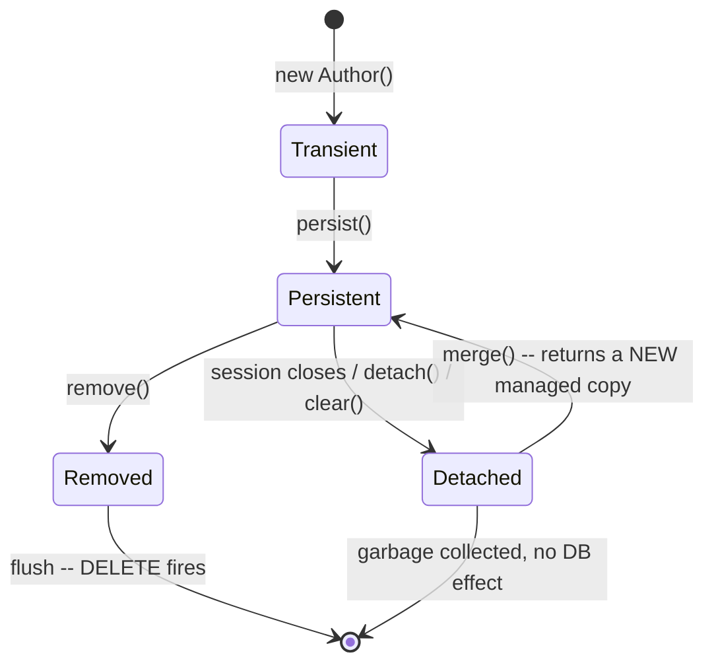
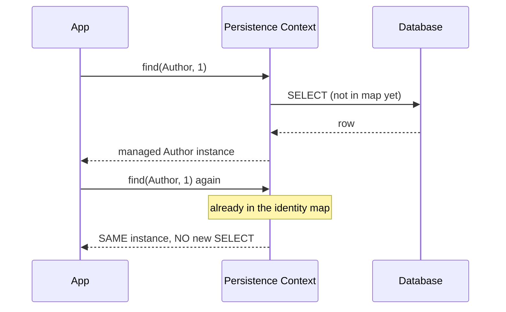
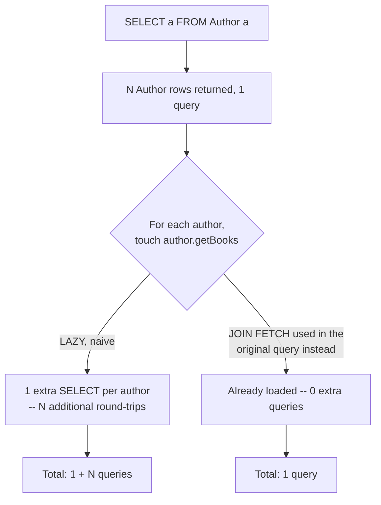

# JPA Entity Lifecycle, the Persistence Context, and the N+1 Problem

> **Topic register:** T-601 (JPA entity lifecycle & persistence context, IWI 6.6) / T-602 (Fetch strategies & the N+1 problem, IWI 7.2, top-25 tied of 198) · Core/Advanced tier, Very High interview frequency
> **Why grouped as one chapter:** N+1 is genuinely unexplainable without the persistence context first — the entire mechanism (why a second `find()` doesn't re-query, why an unsaved mutation still produces an `UPDATE`, why a lazy collection can throw after a session closes) is the same one concept, the persistence context, and N+1 is that concept's most consequential real-world consequence.
> **Provenance:** every trace in this chapter is real, executed output from [`practice/java/hibernate-jpa/entity-lifecycle-and-n1/src/`](../../practice/java/hibernate-jpa/entity-lifecycle-and-n1/src/) — genuine Hibernate ORM 6.6.55.Final against a real H2 database, with `hibernate.generate_statistics=true` providing the exact query counts cited below, not estimates.

## Table of Contents

1. [Learning Objectives](#learning-objectives)
2. [Why This Matters in Interviews](#why-this-matters-in-interviews)
3. [Level 1 — Foundation](#level-1-foundation)
4. [Level 2 — Working Knowledge](#level-2-working-knowledge)
5. [Mental Model](#mental-model)
6. [Definition and Purpose](#definition-and-purpose)
7. [Core Concepts](#core-concepts)
8. [JPA and Hibernate Annotations Reference](#jpa-and-hibernate-annotations-reference)
9. [Internal Implementation](#internal-implementation)
10. [Diagrams](#diagrams)
11. [Java Examples](#java-examples)
12. [Production Scenarios](#production-scenarios)
13. [Failure Modes and Debugging](#failure-modes-and-debugging)
14. [Trade-offs](#trade-offs)
15. [Decision Framework](#decision-framework)
16. [Comparisons](#comparisons)
17. [Common Mistakes](#common-mistakes)
18. [Anti-Patterns](#anti-patterns)
19. [Best Practices](#best-practices)
20. [Interview Answer Framework](#interview-answer-framework)
21. [Interview Questions](#interview-questions)
22. [Summary](#summary)
23. [Key Takeaways](#key-takeaways)
24. [Cheat Sheet](#cheat-sheet)
25. [Flashcards](#flashcards)
26. [Practice Exercises](#practice-exercises)
27. [Solutions](#solutions)
28. [Additional Reading](#additional-reading)
29. [Official References](#official-references)

---

## Learning Objectives

By the end of this chapter you can:

- Draw the full four-state entity lifecycle (Transient/Persistent/Detached/Removed) and state precisely why `merge()` does not make the object passed into it managed.
- Explain the persistence context (the "first-level cache") precisely enough to predict, without running the code, whether a given `find()` call issues a new query.
- Reproduce, with real measured output, dirty checking (an `UPDATE` fired with no explicit save call) and a `LazyInitializationException` on a detached entity.
- Diagnose an N+1 query pattern from its symptom (query count scaling linearly with result-set size) and fix it with the correct tool for the specific access pattern, not a reflexive "just make it EAGER."
- State, precisely, why switching a lazy association to `EAGER` is usually the *wrong* fix for N+1 — it relocates the problem rather than solving it, and often makes it worse.

## Why This Matters in Interviews

N+1 is one of this project's own blueprint-named top-25 topics by interview weight, and for good reason: "your endpoint fires 400 queries, fix it without breaking lazy loading elsewhere" is a single question that simultaneously tests whether a candidate understands the persistence context, fetch strategies, and the trade-offs between four or five genuinely different fixes — not just whether they've heard the term "N+1" before. The most common wrong answer (`switch everything to EAGER`) is wrong in an instructive way: it doesn't eliminate the extra queries, it just moves them earlier and applies them unconditionally to every query touching that entity, whether the association is needed or not. A candidate who can explain *why* that's wrong, not just that it is, is demonstrating real operational depth with an ORM most Java backend teams depend on daily.

## Level 1 — Foundation

**JPA/Hibernate automatically maps your Java objects to database rows**, so you write `user.setName("Alice")` and Hibernate translates that into the right SQL for you — no hand-written `UPDATE` statements for everyday changes. The **persistence context** is Hibernate's memory of every object it's currently tracking during one unit of work (typically one transaction): call `entityManager.find(User.class, 1L)` twice within that same unit of work, and you get back the exact same object both times, with only one real database query issued.

## Level 2 — Working Knowledge

**The N+1 problem, in plain terms**: fetching a list of N items, then looping over that list and separately fetching each item's related data one at a time, produces `1 + N` total database round trips instead of the 1 or 2 the same data actually needs. `for (Order o : orders) { o.getCustomer().getName(); }` — if `orders` has 100 entries and `customer` is lazily loaded, this innocent-looking loop can fire 100 extra queries.

**The practical, everyday fix**: when you notice a query count scaling with your result-set size, don't reflexively switch the relevant association to `EAGER` — that just moves the extra queries earlier and applies them to *every* query touching that entity, needed or not. Instead, use a `JOIN FETCH` in your query (or a batch-fetch setting) for the specific access pattern you actually have, fetching the related data in one extra query (or the same query) instead of one query per row.

## Mental Model

**The persistence context is a per-transaction identity map: within one session, there is exactly one managed Java object per database row, and every operation — reads, in-place mutations, lazy loads — is mediated through that one map.** `find()` twice for the same id returns the same object because the second call checks the map first. A plain setter call on a managed entity produces a real `UPDATE` at commit because Hibernate compares the entity's current state against a snapshot taken when it entered the map — no explicit "save" step is needed, because the object *is* the thing being tracked. And a lazy association throws once its session closes because the map (and the open connection lazy loading depends on) no longer exists — the object is now "detached," structurally cut off from the mechanism that made lazy loading work in the first place. N+1 is what happens when this same lazy-loading mechanism is invoked once per row in a loop, each invocation issuing its own round-trip, instead of being fetched once, up front, for the whole result set.

## Definition and Purpose

The **persistence context** (Hibernate calls it the *Session*; JPA calls it the *EntityManager*'s first-level cache) is the set of managed entities associated with one unit of work — typically one transaction. It exists to give an application a single, consistent, in-memory view of any row it has touched during that transaction: repeated reads of the same row return the identical object (not just an equal one), and any in-place change to a managed entity is automatically detected and persisted at flush/commit time, without an explicit save call for every mutation.

A JPA/Hibernate **association** (a `@OneToMany`, `@ManyToOne`, etc.) can be fetched **eagerly** (loaded immediately, as part of the owning entity's own query) or **lazily** (loaded only the first time code actually accesses it, via a proxy or an uninitialized collection wrapper that transparently issues a query on first touch). This exists so that loading one entity doesn't have to pull its entire object graph along with it by default — most access patterns only need a fraction of an entity's associations, and eager-loading everything would be both slower and often outright impossible for large or cyclic graphs. The **N+1 problem** is the specific failure mode where this laziness, combined with a loop, turns "1 query for the list, plus 1 query per item's lazily-touched association" into `N+1` total round-trips instead of the 1 or 2 queries the same data genuinely requires.

## Core Concepts

### The identity map guarantees reference equality within one session

Two `find()` calls for the same entity and id, within the same session, return the exact same Java object — not two equal-but-distinct objects. This is a direct consequence of the persistence context being a map keyed by (entity type, id).

### Dirty checking makes mutation implicitly persistent

Hibernate takes a snapshot of a managed entity's state when it's loaded (or first made managed). At flush time (commit, or an explicit flush), it compares the entity's *current* field values against that snapshot and issues an `UPDATE` for anything that changed — automatically, with no explicit `save()`/`update()` call required for an already-managed entity.

### A detached entity's lazy state is unreachable

Once a session closes, its persistence context is gone, and any entities that were managed by it become **detached**. A detached entity's already-loaded fields remain readable, but any association still marked as an uninitialized lazy proxy has no session left to fetch through — accessing it throws `LazyInitializationException`, not a silent `null` or an automatic re-fetch.

### N+1 is a symptom of *when* an association gets loaded, not *whether* it's needed

The extra queries in N+1 aren't wasted in the sense of fetching unneeded data — the application genuinely needs each author's books. The waste is entirely in fetching them one round-trip at a time instead of one round-trip total; the fix is changing the *shape* of the fetch for this specific access pattern, not whether the data is fetched.

### EAGER doesn't fix N+1 — it relocates and usually worsens it

Marking an association `EAGER` makes it load as part of every query for the owning entity, unconditionally — including in code paths that never touch that association at all, and including nested associations that can each trigger their own N+1 at load time. It converts a per-access-pattern problem (fixable per query) into a blanket, always-on cost with no way to opt out for the access patterns that don't need it.

### The four-state entity lifecycle, and the methods that transition between them

This chapter's title promises "entity lifecycle," and everything above has been building toward it implicitly — this is the explicit state machine. Every JPA entity is, at any moment, in exactly one of four states:

- **Transient** — a plain `new Author()`, never associated with any persistence context. No row exists for it, and Hibernate isn't tracking it at all.
- **Persistent (Managed)** — tracked by a persistence context; the identity map, dirty checking, and lazy loading all apply. Reached via `persist()` (a transient entity becomes managed, a row is scheduled for `INSERT` at flush) or via `find()`/a query (the entity comes back already managed).
- **Detached** — was managed, but its persistence context is gone (the session closed, or `detach()`/`clear()` was called explicitly). Already-loaded fields remain readable; any untouched lazy proxy throws `LazyInitializationException` on access (Internal Implementation, Demo 3).
- **Removed** — `remove()` was called on a managed entity; it's still in the persistence context (still tracked, still dirty-checked) until flush, at which point the actual `DELETE` fires and the row is gone.



**The single most common mistake in this state machine: `merge()` does not make the object you passed in managed.** `Author managed = entityManager.merge(detachedAuthor);` copies the detached entity's state onto a *different*, newly-loaded (or newly-created) managed instance and returns *that* — `detachedAuthor` itself remains detached, forever. Code that calls `merge()` and then keeps using the original reference as if it were now managed is a real, recurring bug, precisely because `merge()`'s return value is easy to ignore when the method "looks like" it should mutate in place.

Two more transition details worth knowing precisely: calling `persist()` on an already-managed entity is a harmless no-op (it's already going to be inserted or is already persisted); calling `persist()` on a *detached* entity (one that already has a database-assigned id) is undefined behavior per the JPA spec, and Hibernate specifically throws `PersistentObjectException` rather than silently doing something reasonable — `merge()`, not `persist()`, is the correct operation for "make this detached entity's state persistent again."

### Cascade types control which operations propagate from a parent entity to its associations

By default, calling `persist()`, `merge()`, or `remove()` on an entity affects only that entity — a `@OneToMany` child collection is entirely unaffected unless a **cascade type** says otherwise. `cascade = CascadeType.ALL` (used in this chapter's own `Author.books` mapping) means every one of `PERSIST`, `MERGE`, `REMOVE`, `REFRESH`, and `DETACH` propagates from the parent to every child in the collection — save the author, and every book in its `books` list gets saved too, with no separate call needed per book.

**`orphanRemoval = true` is a distinct, separate setting from `CascadeType.REMOVE`**, and the difference is a real, frequently-tested gotcha: `CascadeType.REMOVE` only deletes children when the *parent itself* is removed. `orphanRemoval = true` additionally deletes a child the moment it's removed from the parent's collection (`author.getBooks().remove(someBook)`) even while the parent itself stays alive — the child becomes an "orphan" (no parent references it anymore) and Hibernate deletes it at the next flush, without `remove()` ever being called on it directly.

### ID generation strategy determines whether Hibernate can batch inserts at all

`@GeneratedValue(strategy = ...)` has four real options, and the choice has a direct, measurable consequence for insert performance, not just a stylistic one:

| Strategy | How the id is assigned | Batch-insert-friendly? |
|---|---|---|
| `IDENTITY` | The database assigns it on `INSERT` (an auto-increment column) | **No** — Hibernate needs the real id immediately to place the entity in the identity map, so it must execute each `INSERT` individually and read back the generated key; JDBC batching is structurally defeated |
| `SEQUENCE` | A database sequence, which Hibernate can pre-fetch a block of (`allocationSize`) before ever hitting the database for real inserts | **Yes** — ids are known up front, so multiple `INSERT`s can be batched into one round-trip |
| `TABLE` | A dedicated table simulates a sequence via row locking | Portable across databases lacking real sequences, but adds its own locking overhead — rarely the right default when `SEQUENCE` is available |
| `AUTO` | The persistence provider picks a strategy based on the database dialect | Whatever the provider defaults to for that dialect — worth confirming explicitly rather than assuming, since it silently determines the `IDENTITY`-vs-`SEQUENCE` batching trade-off above |

This is a real, common Staff-level surprise: a team enables `hibernate.jdbc.batch_size` expecting faster bulk inserts, sees no improvement, and the cause is `GenerationType.IDENTITY` structurally preventing batching regardless of that setting — `SEQUENCE` is the fix, not a larger batch size.

### `equals()`/`hashCode()` on JPA entities is a classic, easy-to-get-wrong gotcha

The obvious approach — generate `equals()`/`hashCode()` from the entity's `@Id` field — breaks in a specific, common way: a transient entity's id is `null` until `persist()` actually assigns one, so two different transient entities are indistinguishable (`equals()` returns `true` for two different not-yet-saved objects if the comparison falls back to "both ids null"), and worse, an entity's `hashCode()` *changes* the moment it transitions from transient to persistent — a real problem for any entity already placed in a `HashSet` or used as a `HashMap` key before being saved, since its bucket position becomes wrong the instant its hash changes.

Using **all fields** for `equals()`/`hashCode()` has a different problem: a lazy Hibernate proxy may not have every field loaded, so comparing a proxy against a fully-loaded instance can produce `LazyInitializationException` or a spuriously `false` result depending on which fields are involved. The two real, defensible approaches: (1) don't override `equals()`/`hashCode()` at all, and rely on Java's default reference equality — correct as long as the application never needs to compare a database-loaded entity against a freshly-constructed one representing "the same" row; or (2) use a genuine, immutable **business key** (a natural unique identifier that exists and never changes, independent of whether the row has been saved yet — an email address, an order number) rather than the surrogate `@Id`, since a business key doesn't have the null-before-persist problem the generated id does.

## JPA and Hibernate Annotations Reference

This chapter's own demo uses only `@Entity`, `@Id`, `@GeneratedValue`, `@OneToMany`, and `cascade`/`fetch` — the rest of a real codebase's mapping annotations, grouped by where they come from, since JPA (the `jakarta.persistence` package, portable across providers) and Hibernate-specific extensions (`org.hibernate.annotations`, provider-specific, not portable to EclipseLink or OpenJPA) are frequently confused for being the same thing:

**Core JPA (`jakarta.persistence`) — portable across any JPA provider:**

| Annotation | Purpose |
|---|---|
| `@Entity`, `@Table` | Marks a class as a persistent entity; `@Table` names the backing table (defaults to the class name) |
| `@Id`, `@GeneratedValue` | Marks the primary-key field; `@GeneratedValue` selects the id-generation strategy (table above) |
| `@Column` | Customizes a field's column mapping (name, nullability, length, uniqueness) |
| `@OneToMany`, `@ManyToOne`, `@ManyToMany`, `@OneToOne` | Association mappings; `mappedBy` marks the non-owning side of a bidirectional relationship |
| `@JoinColumn`, `@JoinTable` | Specifies the foreign-key column (`@JoinColumn`) or the join table (`@JoinTable`, for `@ManyToMany`) an association uses |
| `@Embeddable`, `@Embedded` | `@Embeddable` marks a class with no identity of its own (e.g., `Address`); `@Embedded` includes one inline as part of an owning entity's own table row |
| `@MappedSuperclass` | A base class contributing mapped fields to subclasses, without being an entity or having its own table |
| `@Transient` | Excludes a field from persistence entirely — not saved, not loaded, purely in-memory (unrelated to the "transient" lifecycle state despite the shared name) |
| `@Version` | Marks a field used for optimistic locking (see [Optimistic vs. Pessimistic Locking](optimistic-vs-pessimistic-locking.md)) |
| `@Enumerated`, `@Lob` | `@Enumerated` controls how a Java `enum` is stored (ordinal vs. `STRING`); `@Lob` marks a large object field (a `CLOB`/`BLOB`-backed `String`/`byte[]`) |
| `@PrePersist`, `@PostPersist`, `@PreUpdate`, `@PostUpdate`, `@PreRemove`, `@PostRemove`, `@PostLoad` | Lifecycle callbacks — a method annotated with one of these runs automatically at the matching point in the state machine above (e.g., `@PrePersist` runs immediately before the transient→persistent `INSERT`) |

**Hibernate-specific (`org.hibernate.annotations`) — real, commonly used, but not portable to another JPA provider:**

| Annotation | Purpose |
|---|---|
| `@BatchSize` | Batches lazy-collection or lazy-entity loads into groups instead of one query each (this chapter's Trade-offs table) |
| `@Cache` | Enables second-level caching for an entity/collection (see [Hibernate Second-Level and Query Cache](hibernate-second-level-and-query-cache.md)) |
| `@DynamicUpdate`, `@DynamicInsert` | Generates `UPDATE`/`INSERT` statements that include only changed/non-null columns, instead of every mapped column every time |
| `@Fetch(FetchMode...)` | Chooses the SQL-level fetch mechanism (`JOIN`, `SELECT`, `SUBSELECT`) for an association, a finer-grained control than the JPA `fetch = LAZY/EAGER` alone |
| `@NaturalId` | Marks a field as a stable, natural business key, enabling Hibernate's own natural-id lookup cache — directly relevant to the equals/hashCode discussion above |
| `@CreationTimestamp`, `@UpdateTimestamp` | Automatically populates a field with the row's creation/last-update time, without an explicit `@PrePersist`/`@PreUpdate` method |
| `@SQLDelete` | Replaces the actual `DELETE` Hibernate would issue with a custom SQL statement — the standard mechanism for implementing soft deletes |
| `@Immutable` | Marks an entity as never updated after creation — Hibernate skips dirty-checking it entirely, a real performance optimization for genuinely read-only data |

## Internal Implementation

**The identity map, measured — the same id, `find()`'d twice, returns the same object:**

```
== 1. The identity map: the SAME managed entity, fetched twice in one session, is the SAME Java object ==
Hibernate: select a1_0.id,a1_0.name from author a1_0 where a1_0.id=?
first == second (reference equality): true
(the second find() did NOT issue a new SELECT -- Hibernate's persistence context returned the already-managed instance)
```

Only one `SELECT` appears in the log for two `find()` calls — the second one never reached the database at all.

**Dirty checking, measured — an `UPDATE` with no explicit save call:**

```
== 2. Dirty checking: mutating a managed entity's field, with NO explicit save()/update() call ==
Hibernate: select a1_0.id,a1_0.name from author a1_0 where a1_0.id=?
Hibernate: update author set name=? where id=?
Entity update statements issued by Hibernate: 1  (an UPDATE fired with no explicit save/update call -- this is dirty checking)
```

The code called only `author.setName(...)` — a plain setter — and `tx.commit()`. Hibernate's own `Statistics` API confirms one entity `UPDATE` was actually issued.

**A detached entity's lazy collection, measured:**

```
== 3. A detached entity's lazy collection throws when accessed after its session is closed ==
Hibernate: select a1_0.id,a1_0.name from author a1_0 where a1_0.id=?
Accessing the lazy collection threw: LazyInitializationException
("failed to lazily initialize a collection of role: Author.books: could not initialize proxy - no Session")
```

The real, unmodified exception message from Hibernate itself — this is the exact error a production log shows when this bug happens for real.

**N+1, measured directly with real query counts, not estimates:**

```
== N+1, measured: fetch all authors, then touch each author's LAZY books collection ==
Prepared statements after the initial author query: 1  (1 -- just the SELECT for all authors)
Prepared statements after touching 5 authors' lazy books collections: 6
RESULT: 1 initial query + 5 lazy-load queries (one per author) = 6 total -- the classic N+1.

== The fix, measured: JOIN FETCH pulls authors AND their books in a single query ==
Prepared statements for the same 5 authors + their books, via JOIN FETCH: 1
RESULT: 1 query total -- N+1 eliminated by fetching the association eagerly, for THIS specific access pattern, in THIS specific query.
```

5 authors, 6 total prepared statements for the naive access pattern; the identical data, via a single `JOIN FETCH` HQL query, in exactly 1 — both counts read directly from Hibernate's own `Statistics.getPrepareStatementCount()`, not counted by hand from log output.

## Diagrams





## Java Examples

```java
// Java 21, Jakarta Persistence 3.1 / Hibernate 6.6. LAZY is the JPA default
// for @OneToMany; explicit here since it's the mechanism this chapter measures.
@Entity
public class Author {
    @Id @GeneratedValue(strategy = GenerationType.IDENTITY)
    private Long id;
    private String name;

    @OneToMany(mappedBy = "author", fetch = FetchType.LAZY, cascade = CascadeType.ALL)
    private List<Book> books = new ArrayList<>();
    // getters/setters omitted
}
```

```java
// Java 21. The N+1-causing access pattern -- looks completely ordinary.
List<Author> authors = session.createQuery("select a from Author a", Author.class).list();
for (Author author : authors) {
    int bookCount = author.getBooks().size(); // <-- one SELECT per author, here
}
```

```java
// Java 21. The targeted fix: JOIN FETCH for THIS specific query's access
// pattern, without changing the association's default fetch type anywhere
// else in the codebase.
List<Author> authors = session.createQuery(
    "select distinct a from Author a join fetch a.books", Author.class
).list();
// authors' books are already loaded -- no further queries when accessed
```

**Complexity note:** the naive N+1 pattern is `O(N)` additional round-trips for `N` parent rows touched; the `JOIN FETCH` fix is `O(1)` round-trips regardless of `N` (the join itself still scales with total row count, but as one query's cost, not `N` separate network round-trips — the round-trip count, not raw row volume, is what usually dominates real-world latency for this pattern).

## Production Scenarios

### Scenario: an order-listing endpoint's p99 latency scales linearly with page size after a "harmless" feature addition

**Symptoms.** An `/orders` listing endpoint, previously fast and flat-latency regardless of page size, starts showing p99 latency that scales almost linearly with the number of orders returned per page, immediately after a feature adds each order's line-item count to the response DTO.

**Impact.** A page of 50 orders now takes noticeably longer than a page of 10, degrading the experience specifically for power users and any client requesting larger pages — exactly the users a team least wants to punish.

**Initial hypotheses.** A missing database index on the orders table (checked — the base query itself is fast and unchanged); the new feature's line-item-counting logic has an algorithmic inefficiency (checked — the counting logic itself is `O(1)` per order, just `lineItems.size()`); the line-item association is being lazily loaded once per order (correct).

**Evidence.** Enabling Hibernate's statistics (exactly this chapter's `hibernate.generate_statistics=true`) in a staging environment shows the endpoint's prepared-statement count is `1 + N` for `N` orders on the page — one query for the order list, then one additional query per order the moment `.getLineItems().size()` is called on each — a direct, measured N+1, not a guess.

**Diagnosis.** The line-item count feature reads `order.getLineItems().size()` inside the DTO-mapping loop, and `lineItems` is a `LAZY` `@OneToMany` — exactly this chapter's measured pattern, now happening once per order on every request to this endpoint.

**Immediate mitigation.** None needed beyond the fix itself — this isn't correctness-breaking, only a latency regression, so it can go straight to the permanent fix without a stopgap.

**Permanent remediation.** Change the specific listing query to a `JOIN FETCH` on `lineItems` (if the full entities are genuinely needed elsewhere in the response), or — since only a *count* is actually needed here, not the full line-item entities — replace the lazy-collection-size approach entirely with a single aggregate query (`SELECT o.id, COUNT(li) FROM Order o LEFT JOIN o.lineItems li GROUP BY o.id`) or a DTO projection, both of which return exactly the needed data in one round-trip without loading full `LineItem` entities the endpoint never uses.

**Alternatives considered.** Marking `lineItems` `EAGER` — rejected explicitly, since it would apply to every other code path loading an `Order` too, most of which never need line items at all, permanently adding an unconditional join (or an unconditional extra query, depending on the eager fetch strategy chosen) to every one of those unrelated call sites.

**Trade-offs.** The aggregate-query/projection approach is the most efficient fix but requires writing a query specific to this endpoint's exact needs rather than reusing the general-purpose entity-loading code path — a small amount of extra, endpoint-specific query code in exchange for avoiding both N+1 and loading data (full `LineItem` entities) the endpoint never actually uses.

**Prevention.** Enable Hibernate statistics (or an equivalent SQL-count assertion in integration tests) in any environment where N+1 could plausibly be introduced, and add a regression test asserting a fixed, small query count for hot-path listing endpoints — turning "prepared statement count doubled" into a test failure instead of a production latency regression discovered later.

**Interview lesson.** This is [Interview Question 1](#interview-questions)'s scenario at real production scale: a change that looks completely unrelated to persistence (adding a count to a DTO) reintroduces N+1 the moment it touches a lazy association inside a loop.

## Failure Modes and Debugging

| Symptom | Likely cause | Debugging step |
|---|---|---|
| Endpoint latency scales with result-set size, base query itself is fast | N+1 from a lazy association touched inside a loop | Enable `hibernate.generate_statistics=true` (or log SQL) and check prepared-statement count against expected result-set size |
| `LazyInitializationException` in a service or web layer, but not in the repository/DAO layer | An entity is being read after its originating session/transaction has already closed | Trace where the transaction boundary actually ends relative to where the lazy field is accessed; either widen the transaction, fetch the association eagerly for that access pattern, or map to a DTO before the session closes |
| A field mutation "doesn't seem to persist" despite no exception | The entity was never actually managed (e.g., mutated after the session closed, or it's a detached copy) — dirty checking only applies to managed entities | Confirm the mutation happens on an entity still attached to an open session/transaction, not a detached or manually-constructed copy |
| An `UPDATE` fires for a field the code never intentionally changed | An accidental mutation somewhere touched a managed entity (a common source: a getter that lazily initializes a field, or an equals/hashCode implementation with a side effect) — dirty checking has no concept of "intentional" | Audit any code path with side effects running against a managed entity between load and flush |

## Trade-offs

| Fix for N+1 | Benefit | Cost |
|---|---|---|
| `JOIN FETCH` in the specific query | Exactly the data needed, one round-trip, scoped to just this access pattern | Must be added per query where the pattern occurs; a `JOIN FETCH` on a collection can produce a Cartesian-product row multiplication if more than one collection is fetched in the same query |
| `EAGER` fetch type on the association | No code changes needed at each call site | Applies unconditionally everywhere the entity is loaded, including code paths that never need the association — usually the wrong default |
| Batch fetching (`@BatchSize`) | Reduces N+1 to a small, bounded number of queries (`N/batchSize`, roughly) with zero call-site changes | Still more than 1 query; less precise than a targeted `JOIN FETCH` for a known access pattern |
| DTO projection / a purpose-built query | Loads only the exact fields needed, often the most efficient option, no entity/proxy overhead at all | Bypasses the entity/persistence-context machinery entirely for that query — no dirty checking, no identity map, by design |

## Decision Framework

1. **Does this specific access pattern always need the association?** If yes and it's a known, fixed query, use `JOIN FETCH` in that query specifically.
2. **Is the association needed unpredictably, across many different call sites, with no single dominant pattern?** Consider `@BatchSize` as a broad, low-effort mitigation rather than fetching it eagerly everywhere.
3. **Is only a derived value (a count, a sum) needed, not the full associated entities?** Skip loading the association at all — write an aggregate query or a DTO projection instead.
4. **Is an entity being read outside the transaction/session that loaded it?** Don't reach for `EAGER` as a workaround — either keep the transaction open through the point of use, or map to a DTO before the session closes.
5. **Is a lazy association ever accessed from a web/presentation layer, after the service-layer transaction has committed?** This is the structural cause of most real `LazyInitializationException`s — the boundary where "still transactional" ends needs to be explicit and match where lazy access actually happens.

## Comparisons

| Approach | What it optimizes for | What it does NOT solve |
|---|---|---|
| `JOIN FETCH` | A specific, known access pattern, in one round-trip | Doesn't help access patterns that don't need the association — applying it broadly can over-fetch |
| `EAGER` fetch type | Nothing, really — a blanket default that ignores per-access-pattern needs | The actual N+1 problem; it just changes *when* the cost is paid, unconditionally |
| `@BatchSize` | A broad, low-effort reduction with no call-site changes | Precision — it's still `N/batchSize` queries, not 1 |
| DTO projection | The minimum possible data transfer for read-only use cases | Write scenarios needing managed entities (dirty checking, cascades) — projections are read-only by nature |

## Common Mistakes

- Reflexively marking a lazy association `EAGER` to "fix" an N+1 symptom, without recognizing it applies everywhere, unconditionally.
- Reading a lazy association from a controller or view layer after the service-layer transaction has already committed, then being surprised by `LazyInitializationException`.
- Assuming a mutated field "must have been saved" because no exception was thrown, without confirming the entity was actually managed at the time of mutation.
- Not measuring query count directly (statistics, or SQL logging) and instead guessing at N+1's presence or absence from latency alone.

## Anti-Patterns

- **Marking every association `EAGER` "to be safe"** — the single most common wrong fix for N+1, and one of the most common Hibernate performance anti-patterns in real codebases.
- **Widening a transaction boundary to cover an entire request** just to avoid `LazyInitializationException`, rather than mapping to a DTO at the actual persistence boundary — trades one problem (a thrown exception) for another (long-held database connections/locks for the duration of unrelated request processing).
- **Fetching multiple `@OneToMany` collections eagerly in a single query via multiple `JOIN FETCH`es** — produces a Cartesian product, multiplying result rows and often making performance *worse* than the N+1 it was meant to fix.

## Best Practices

- Default associations to `LAZY` and fetch eagerly only per-query, via `JOIN FETCH`, for the specific access patterns that need it.
- Measure query count directly (Hibernate statistics, SQL logging, or an integration-test assertion) rather than inferring N+1 from latency symptoms alone.
- Keep the transaction/session boundary aligned with where lazy access actually happens; map to DTOs before crossing out of that boundary if the data needs to travel further.
- For read-only, high-volume endpoints, consider a DTO projection or aggregate query over loading full managed entities at all.

## Interview Answer Framework

### 30-Second Answer

The persistence context is a per-session identity map: managed entities are tracked, mutations are auto-detected and flushed (dirty checking), and repeated fetches return the same object. N+1 happens when a lazy association gets touched inside a loop, turning one query into `1 + N`. The fix is a targeted `JOIN FETCH` for the specific access pattern that needs it — not switching the association to `EAGER`, which applies the cost unconditionally everywhere instead of solving it.

### 2-Minute Answer

Definition: the persistence context tracks every managed entity in one unit of work, backing the identity map, dirty checking, and lazy loading, all as the same underlying mechanism. Why it exists: a single, consistent in-memory view of touched rows, with change tracking that doesn't require an explicit save call per mutation. How it works: `find()` checks the map before querying; flush compares current state to a loaded snapshot; a lazy association is an uninitialized proxy that queries on first touch, and throws if that touch happens after the session has closed. One important trade-off: N+1 comes from lazy loading inside a loop, and the correct fix is per-query (`JOIN FETCH`), not global (`EAGER`), since `EAGER` applies the cost to every access path regardless of need. Production example: an order-listing endpoint whose latency scaled with page size after a feature innocuously read a lazy collection's size inside a mapping loop — measured directly via Hibernate statistics, not inferred.

### 10-Minute Deep Dive

Cover, in order: the mental model — one persistence context, one managed identity map per row (mental model); the measured identity-map and dirty-checking traces (internals, real evidence); the measured `LazyInitializationException` on a detached entity, and what "detached" structurally means (internals, real evidence, common production bug); the measured N+1 trace with exact query counts, and the `JOIN FETCH` fix measured identically (internals, real evidence, this chapter's central result); why `EAGER` is usually the wrong fix, precisely (decision framework); and close with the production scenario — a latency regression from a seemingly unrelated feature touching a lazy collection inside a loop.

### Whiteboard Explanation

Draw the [§ Diagrams](#diagrams) N+1 flowchart: one query returns `N` rows, then a loop branching into either "1 extra query per row" (naive lazy touch) or "0 extra queries" (`JOIN FETCH` already loaded it). Annotate the naive branch: "this is exactly what a lazy `@OneToMany` does when accessed inside a `for` loop, with no code that looks obviously wrong."

### Production Example

The order-listing latency regression in [§ Production Scenarios](#production-scenarios): a feature reading `order.getLineItems().size()` inside a DTO-mapping loop reintroduced N+1, measured directly via Hibernate statistics showing exactly `1 + N` prepared statements for `N` orders on a page.

### Trade-offs to Mention

State unprompted: `EAGER` doesn't fix N+1, it relocates the cost and applies it unconditionally; `JOIN FETCH` on more than one collection in the same query risks a Cartesian-product row explosion; a `LazyInitializationException` means the transaction boundary and the point of lazy access are misaligned, not that lazy loading itself is broken; dirty checking has no concept of "intentional" — any mutation on a managed entity gets flushed.

### Common Candidate Mistakes

Proposing `EAGER` as the fix for N+1 without acknowledging its blanket cost; not knowing why a `LazyInitializationException` happens structurally (session closed, not "a bug in lazy loading"); assuming N+1 means data is being fetched unnecessarily, rather than the same necessary data being fetched inefficiently.

### Typical Follow-Up Questions

1. "Your endpoint fires 400 queries. Fix it without breaking lazy loading elsewhere."
2. "Why would fetching two `@OneToMany` collections eagerly in one query make things worse, not better?"
3. "Where exactly should the transaction boundary sit relative to where a DTO gets built?"

### Senior-Level Expectations

Correctly diagnoses N+1 from a described symptom (query count scaling with result size); proposes `JOIN FETCH` (or an equivalent targeted fix) rather than `EAGER`; correctly explains why a detached entity throws on lazy access.

### Staff-Level Discussion

N+1 is a specific instance of a much more general Staff-level pattern: a mechanism designed for the common case (don't load what you don't need) silently degrades when the *shape* of access changes from "one item at a time" to "many items in a loop," and the fix is almost always to change the shape of the *fetch* to match the shape of the *access*, not to disable the optimization globally. This is the same underlying judgment behind choosing `acks=all` + `min.insync.replicas` deliberately rather than reflexively, or choosing a specific isolation level rather than defaulting to the strictest one everywhere — a Staff engineer names the specific access pattern a fix is scoped to, rather than reaching for a blanket setting that trades a known, bounded cost (per-query `JOIN FETCH` maintenance) for an unbounded, hidden one (`EAGER` everywhere).

## Interview Questions

### Question 1 — Your endpoint fires 400 queries for a page of 20 records. Fix it without breaking lazy loading elsewhere.

**Why interviewers ask it.** Named explicitly in this project's own blueprint as a discriminating follow-up; a shallow answer ("switch it to EAGER") reveals the candidate never reasoned past the surface symptom.

**Expected answer.** Diagnose N+1: 1 query for the page plus roughly `N` per-record lazy-load queries. Fix with a `JOIN FETCH` scoped to this specific query/access pattern (or a DTO projection if only specific fields are needed), leaving the association's default fetch type as `LAZY` for every other code path that doesn't need it.

**Minimum acceptable answer.** Identifies the pattern as N+1, even without a precise fix.

**Strong Senior answer.** Correctly proposes `JOIN FETCH` (or an equivalent targeted mechanism) scoped to the specific query.

**Staff-level extension.** Explains explicitly why `EAGER` is the wrong fix (unconditional cost everywhere) and names an alternative (DTO projection, `@BatchSize`) with its own trade-off for a case where a targeted `JOIN FETCH` doesn't fit.

**Common mistakes.** Proposing `EAGER` as a complete fix, with no acknowledgment of its blanket cost.

**Likely follow-ups.** "What if two different collections both need to be loaded for this same query?"

**Evaluation criteria (1–5).** 1: doesn't recognize N+1 or proposes `EAGER` with no caveat. 3: correctly diagnoses N+1 and proposes `JOIN FETCH`. 5: correct diagnosis, correct fix, plus an alternative for the multi-collection Cartesian-product case.

**Related references.** [§ Internal Implementation](#internal-implementation); [§ Production Scenarios](#production-scenarios).

---

### Question 2 — Why does a `LazyInitializationException` happen, and what's the actual fix?

**Why interviewers ask it.** Near-universal real-world error; tests whether the candidate understands the persistence-context/session-lifecycle mechanism, not just that "you need to open the session longer."

**Expected answer.** The entity's session (persistence context) has closed, so the uninitialized lazy proxy has no way to fetch its data — this isn't a bug in lazy loading, it's the structural consequence of accessing lazy state on a detached entity. The real fix aligns the transaction boundary with where the lazy access actually happens: either fetch the needed association eagerly (via `JOIN FETCH`) within the original transaction, or map to a DTO before the session closes, rather than reading lazy fields after the fact.

**Minimum acceptable answer.** States that the session is closed, even without a specific fix.

**Strong Senior answer.** Correctly explains the detached-entity mechanism and proposes at least one real fix.

**Staff-level extension.** Explicitly rejects "just widen the transaction to cover the whole request" as usually the wrong fix (holding a transaction/connection open across unrelated processing), in favor of DTO mapping at the actual persistence boundary.

**Common mistakes.** Treating the exception as a bug to work around with a blanket, overly-wide transaction rather than a signal that the fetch strategy or boundary needs adjusting for that specific access pattern.

**Likely follow-ups.** "What's the downside of just making the transaction span the whole request?"

**Evaluation criteria (1–5).** 1: doesn't know why it happens. 3: correctly explains the mechanism and proposes a fix. 5: correct explanation plus explicitly rejecting the wide-transaction anti-pattern.

**Related references.** [§ Internal Implementation](#internal-implementation), Demo 3; [§ Anti-Patterns](#anti-patterns).

---

### Question 3 — What's the difference between `persist()` and `merge()`, and what happens to the object you pass into `merge()`?

**Why interviewers ask it.** A near-universal source of a real, silent bug: candidates who've used `merge()` correctly by accident (always using its return value) versus candidates who've never noticed it returns something different from what was passed in.

**Expected answer.** `persist()` makes a *transient* entity managed — it must not already have a database-assigned identity, and it schedules an `INSERT`. `merge()` takes a *detached* entity (one with an id, previously saved) and copies its state onto a different, managed instance — either an already-loaded one from the persistence context or a freshly-queried one — and returns that managed copy. The object originally passed into `merge()` remains detached; only the returned reference is managed.

**Minimum acceptable answer.** Knows `persist()` is for new entities and `merge()` is for reattaching detached ones, even without the return-value detail.

**Strong Senior answer.** States explicitly that `merge()`'s argument stays detached and only its return value is managed — and names the real bug this causes when code assumes otherwise.

**Staff-level extension.** Connects this to calling `persist()` on an already-detached entity (one with an existing id) — Hibernate throws `PersistentObjectException` rather than silently doing something reasonable, which is exactly why `merge()`, not `persist()`, is the correct operation for that case.

**Common mistakes.** Assuming `merge()` mutates its argument into a managed entity in place.

**Likely follow-ups.** "What happens if you call `persist()` on an entity that already has an id from a previous save?"

**Evaluation criteria (1–5).** 1: doesn't know the difference. 3: correctly distinguishes the two operations. 5: correctly states `merge()`'s return-value behavior and the `persist()`-on-detached failure mode.

**Related references.** [§ Core Concepts](#core-concepts) — "The four-state entity lifecycle."

---

### Question 4 — You enable JDBC batch inserts for a bulk-import feature and see no performance improvement at all. What's the first thing you check?

**Why interviewers ask it.** Tests whether a candidate understands that `@GeneratedValue` strategy choice isn't cosmetic — it structurally determines whether batching is even possible, a real, common surprise for teams that enable `hibernate.jdbc.batch_size` and see nothing change.

**Expected answer.** Check the entity's id-generation strategy. `GenerationType.IDENTITY` requires the database to assign the id on `INSERT` and Hibernate to read it back immediately (to place the entity correctly in the identity map), which structurally forces one `INSERT` per entity — no batch-size setting can override this. `SEQUENCE` (with a pre-fetched `allocationSize`) is the fix, since ids are known before the inserts happen, letting Hibernate actually batch them.

**Minimum acceptable answer.** Suspects the id-generation strategy as a possible cause, even without naming which strategies batch and which don't.

**Strong Senior answer.** Correctly names `IDENTITY` as batch-incompatible and `SEQUENCE` as the fix.

**Staff-level extension.** Explains *why* `IDENTITY` is structurally incompatible (the persistence context needs the real id immediately for identity-map placement, not just eventually) rather than treating it as an arbitrary provider limitation.

**Common mistakes.** Assuming a larger `batch_size` value alone will eventually produce batching regardless of id-generation strategy.

**Likely follow-ups.** "Why doesn't `TABLE` have the same batching problem as `IDENTITY`, even though it's also provider-managed?" (A `TABLE` generator can still pre-allocate a block of ids before the real inserts happen, the same way `SEQUENCE` does — the batching-incompatibility is specific to `IDENTITY`'s requirement that the database itself assign the id at insert time.)

**Evaluation criteria (1–5).** 1: doesn't suspect id-generation strategy at all. 3: correctly identifies `IDENTITY` as the likely cause. 5: correct diagnosis plus the structural "why," unprompted.

**Related references.** [§ Core Concepts](#core-concepts) — "ID generation strategy."

## Summary

The persistence context is one mechanism — a per-session identity map — behind three behaviors that look unrelated until you see the connection: repeated `find()` calls return the same object, mutations flush automatically via dirty checking, and lazy associations throw once their session closes. N+1 is that same lazy-loading mechanism's most consequential real-world failure mode: a loop touching a lazy association turns 1 necessary query into `1 + N`, measured directly in this chapter (5 authors, 6 total queries) and fixed to exactly 1 via a targeted `JOIN FETCH` — not by making the association `EAGER` everywhere, which relocates the cost rather than removing it.

## Key Takeaways

- The persistence context is a per-session identity map: same id, same object, within one session.
- Dirty checking flushes any mutation on a managed entity automatically — no explicit save call needed, and no concept of "intentional."
- A detached entity's lazy state throws `LazyInitializationException` when accessed, because there's no session left to fetch through.
- N+1 comes from touching a lazy association inside a loop; the fix is a targeted `JOIN FETCH` (or DTO projection) for the specific access pattern, not a blanket `EAGER`.
- `EAGER` doesn't solve N+1 — it applies the cost unconditionally to every access path, whether that path needs the association or not.
- The lifecycle is Transient → Persistent → Detached/Removed; `merge()` returns a *new* managed copy, it does not mutate its argument in place.
- `orphanRemoval = true` deletes a child the moment it leaves the parent's collection, even while the parent is still alive — a distinct behavior from `CascadeType.REMOVE`, which only fires when the parent itself is removed.
- `GenerationType.IDENTITY` structurally prevents JDBC batch inserts; `SEQUENCE` (with `allocationSize`) doesn't.

## Cheat Sheet

| Situation | What to know |
|---|---|
| Same entity, fetched twice in one session | Same object reference — the identity map, no second query |
| Field mutated with no explicit save call | Flushed automatically via dirty checking at commit/flush |
| `LazyInitializationException` | The session closed before the lazy field was accessed — fix the boundary, not the exception |
| Query count scales with result-set size | N+1 — measure with Hibernate statistics, fix with a targeted `JOIN FETCH` |
| Considering `EAGER` to fix N+1 | Don't — it applies everywhere, unconditionally; use `JOIN FETCH` for the specific query instead |
| Reattaching a detached entity | `merge()` — and use its *return value*, not the object you passed in |
| Calling `persist()` on an entity with an existing id | Wrong operation — throws `PersistentObjectException` in Hibernate; use `merge()` instead |
| Child should be deleted only when removed from the collection, parent unaffected | `orphanRemoval = true`, not `CascadeType.REMOVE` alone |
| Bulk inserts not getting faster after enabling batching | Check `@GeneratedValue` strategy — `IDENTITY` blocks batching structurally; switch to `SEQUENCE` |
| Writing `equals()`/`hashCode()` on an entity | Avoid the generated `@Id` (null before persist, changes hashCode after) — use a real business key, or don't override at all |

## Flashcards

### Card: What the persistence context guarantees

**Prompt:**
What does the persistence context guarantee about two `find()` calls for the same id, in the same session?

**Answer:**
They return the exact same Java object (reference equality), not just two equal objects — the second call never re-queries.

**Why it matters:**
The identity map is the single mechanism behind dirty checking, lazy loading, and cache-like `find()` behavior all at once.

**Common trap:**
Assuming JPA/Hibernate does value-equality comparison instead of returning the tracked instance.

**Related:**
[Internal Implementation](#internal-implementation)

### Card: Why LazyInitializationException happens

**Prompt:**
Why does accessing a lazy field on a detached entity throw `LazyInitializationException`?

**Answer:**
The entity's session (persistence context) has already closed, so the uninitialized lazy proxy has no open session left to fetch through.

**Why it matters:**
The single most common real Hibernate production bug — measured directly in this chapter.

**Common trap:**
"Fixing" it by widening the transaction to cover the whole request, rather than aligning the boundary with where lazy access actually happens.

**Related:**
[Internal Implementation](#internal-implementation)

### Card: Why EAGER doesn't fix N+1

**Prompt:**
Why is switching a lazy association to `EAGER` usually the wrong fix for N+1?

**Answer:**
It applies the extra load unconditionally to every code path touching that entity, including ones that never needed the association — relocating the cost rather than eliminating it.

**Why it matters:**
The most common wrong answer to this domain's single most-asked interview question.

**Common trap:**
Proposing `EAGER` as a complete fix with no acknowledgment of its blanket cost.

**Related:**
[Internal Implementation](#internal-implementation)

### Card: What merge() actually returns

**Prompt:**
After `Author managed = entityManager.merge(detachedAuthor);`, is `detachedAuthor` now managed?

**Answer:**
No — `merge()` copies the detached entity's state onto a *different*, managed instance and returns that. `detachedAuthor` itself remains detached forever; only the returned `managed` reference is actually tracked by the persistence context.

**Why it matters:**
A real, recurring bug: code that calls `merge()` and then keeps using the original object as if it were now managed.

**Common trap:**
Ignoring `merge()`'s return value, assuming the method mutates its argument in place.

**Related:**
[Core Concepts](#core-concepts)

### Card: orphanRemoval vs. CascadeType.REMOVE

**Prompt:**
What's the difference between `orphanRemoval = true` and `CascadeType.REMOVE`?

**Answer:**
`CascadeType.REMOVE` only deletes children when the parent itself is removed. `orphanRemoval = true` additionally deletes a child the instant it's taken out of the parent's collection, even while the parent stays alive.

**Why it matters:**
A frequently-tested distinction — assuming they're the same thing leads to orphaned rows that were expected to be cleaned up automatically.

**Common trap:**
Using only `CascadeType.REMOVE` and expecting a child removed from the collection (but not via deleting the parent) to also be deleted from the database.

**Related:**
[Core Concepts](#core-concepts)

### Card: Why IDENTITY blocks batch inserts

**Prompt:**
Why does `GenerationType.IDENTITY` prevent Hibernate from batching `INSERT` statements, while `SEQUENCE` doesn't?

**Answer:**
`IDENTITY` requires the database to assign the id on `INSERT` and Hibernate to read it back immediately, to place the entity correctly in the identity map — forcing one `INSERT` per entity. `SEQUENCE` pre-fetches a block of ids (`allocationSize`) before any real inserts happen, so the ids are already known and multiple inserts can be batched into one round-trip.

**Why it matters:**
A real, common Staff-level surprise: enabling `hibernate.jdbc.batch_size` does nothing if the entity uses `IDENTITY`.

**Common trap:**
Assuming a larger batch-size setting alone fixes slow bulk inserts, regardless of id-generation strategy.

**Related:**
[Core Concepts](#core-concepts)

### Card: Why the generated @Id breaks equals()/hashCode()

**Prompt:**
Why is generating `equals()`/`hashCode()` from an entity's `@Id` field a common mistake?

**Answer:**
The id is `null` until `persist()` assigns one, so two different transient entities can compare equal; worse, an entity's `hashCode()` changes the moment it transitions from transient to persistent, breaking any `HashSet`/`HashMap` it was already placed in before being saved.

**Why it matters:**
A classic, easy-to-hit JPA gotcha — the "obvious" implementation is the wrong one.

**Common trap:**
Using all fields instead, which has its own problem: a lazy proxy may not have every field loaded, producing wrong or exception-throwing comparisons.

**Related:**
[Core Concepts](#core-concepts)

## Practice Exercises

1. Reproduce all measured traces: [`EntityLifecycleDemo.java`](../../practice/java/hibernate-jpa/entity-lifecycle-and-n1/src/EntityLifecycleDemo.java) and [`N1ProblemDemo.java`](../../practice/java/hibernate-jpa/entity-lifecycle-and-n1/src/N1ProblemDemo.java) (run `fetch-deps.sh` first to download the real Hibernate/H2 jars).
2. Modify `N1ProblemDemo` to use `@BatchSize(size = 10)` on `Author.books` instead of `JOIN FETCH`, and measure the resulting query count for the same 5-author, 15-book dataset.
3. Reproduce `LazyInitializationException` a second way: fetch an `Author` inside a transaction, commit the transaction (closing it) while keeping the session-scoped reference, and access `getBooks()` afterward — confirm whether the behavior differs from this chapter's session-close version and explain why or why not.

## Solutions

**Exercise 1.** Expected output matches this chapter's four measured traces exactly: `first == second: true`; one entity update statement; a caught `LazyInitializationException` with the exact quoted message; and the N+1 counts `1`, `6`, then `1` again after the `JOIN FETCH` fix.

**Exercise 2.** With `@BatchSize(size = 10)`, Hibernate batches the lazy collection loads: instead of 5 separate single-author `IN (?)` queries, it issues roughly `ceil(5/10) = 1` batched query fetching multiple authors' book collections at once (the exact count depends on access order) — more queries than the single `JOIN FETCH`, but far fewer than the naive 5, with zero changes needed at any call site touching `.getBooks()`.

**Exercise 3.** Committing a transaction does not, by itself, close the session (a session can span multiple transactions) — so accessing `getBooks()` after `tx.commit()` but before the session itself closes should still succeed, issuing a fresh lazy-load query, since the persistence context (and its underlying connection) is still open. The exception specifically requires the *session* to be closed, not merely the transaction committed — a distinction worth confirming by comparing this run's behavior directly against the chapter's `try-with-resources` version, where the session closes at the end of the block.

## Additional Reading

- Vlad Mihalcea, *High-Performance Java Persistence* — the standard deep-dive reference for exactly this chapter's mechanisms (persistence context, fetch strategies, N+1)

## Official References

- [Jakarta Persistence 3.1 Specification](https://jakarta.ee/specifications/persistence/3.1/)
- [Hibernate ORM 6.6 User Guide](https://docs.jboss.org/hibernate/orm/6.6/userguide/html_single/Hibernate_User_Guide.html)
