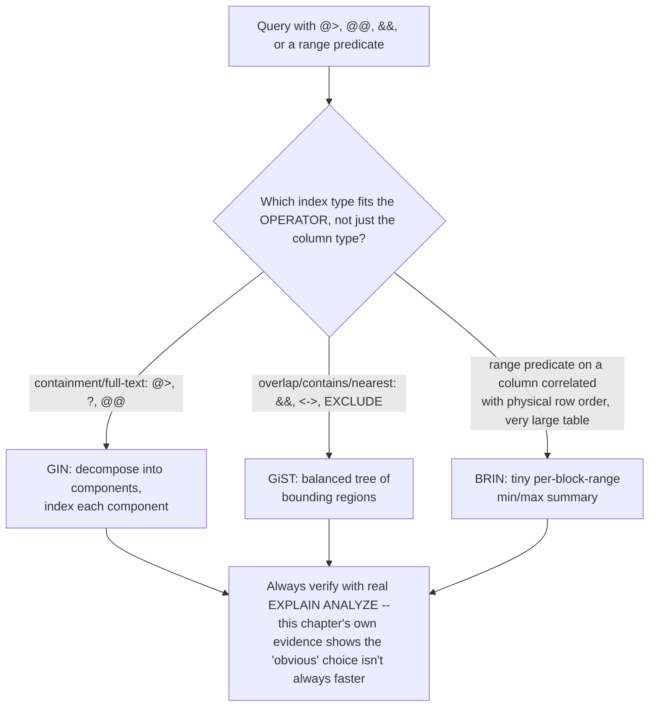
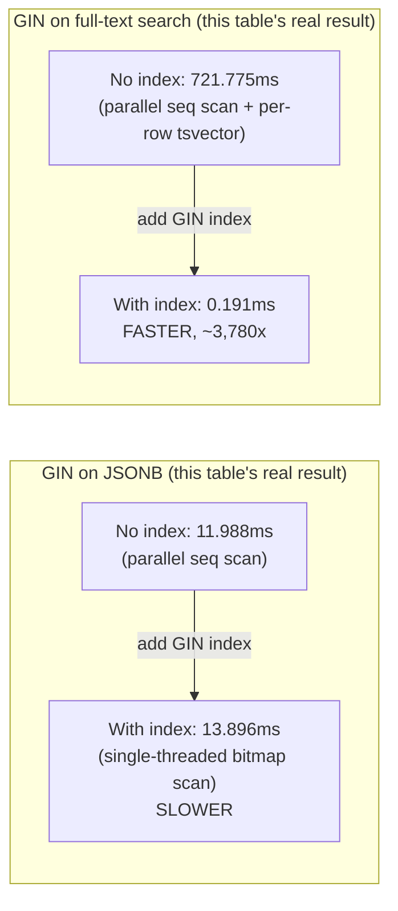

# JSONB and Advanced PostgreSQL Index Types

> **Topic register:** T-2402 · IWI 6.2 · Core tier · High interview frequency [H]
> **Provenance:** every result in this chapter is real, executed PostgreSQL 16 output from a
> disposable Docker container. Reproducible source: [`practice/sql/jsonb-and-advanced-indexes/jsonb-and-indexes-lab.sql`](../../practice/sql/jsonb-and-advanced-indexes/jsonb-and-indexes-lab.sql),
> full output in [`jsonb-and-indexes-lab-output.txt`](../../practice/sql/jsonb-and-advanced-indexes/jsonb-and-indexes-lab-output.txt).
> Nothing below is illustrative — including a real case where adding a GIN index made
> a query measurably *slower*, and a real case where the planner declined to use a BRIN
> index even when it was the only index available.

## Table of Contents

1. [Learning Objectives](#learning-objectives)
2. [Why This Matters in Interviews](#why-this-matters-in-interviews)
3. [Level 1 — Foundation](#level-1--foundation)
4. [Level 2 — Working Knowledge](#level-2--working-knowledge)
5. [Mental Model](#mental-model)
6. [Definition and Purpose](#definition-and-purpose)
7. [Historical Context](#historical-context)
8. [Core Concepts](#core-concepts)
9. [Internal Implementation](#internal-implementation)
10. [Execution Flow](#execution-flow)
11. [Diagrams](#diagrams)
12. [Java Examples](#java-examples)
13. [Production Scenarios](#production-scenarios)
14. [Failure Modes and Debugging](#failure-modes-and-debugging)
15. [Trade-offs](#trade-offs)
16. [Performance Implications](#performance-implications)
17. [Memory Implications](#memory-implications)
18. [Concurrency Implications](#concurrency-implications)
19. [Security Implications](#security-implications)
20. [Decision Framework](#decision-framework)
21. [Comparisons](#comparisons)
22. [Common Mistakes](#common-mistakes)
23. [Anti-Patterns](#anti-patterns)
24. [Best Practices](#best-practices)
25. [Interview Answer Framework](#interview-answer-framework)
26. [Interview Questions](#interview-questions)
27. [Summary](#summary)
28. [Key Takeaways](#key-takeaways)
29. [Cheat Sheet](#cheat-sheet)
30. [Flashcards](#flashcards)
31. [Practice Exercises](#practice-exercises)
32. [Solutions](#solutions)
33. [Additional Reading](#additional-reading)
34. [Official References](#official-references)

---

## Learning Objectives

By the end of this chapter you can query JSONB columns with containment and path operators, choose correctly between GIN, GiST, and BRIN for a given data shape and query pattern, and cite real, measured evidence that indexing decisions are never automatic wins — including a real case where a GIN index made a query slower, and a real case where the query planner declined to use an available BRIN index by default.

## Why This Matters in Interviews

JSONB, and the index types beyond the B-tree covered in [Database Index Structures](index-structures-btree-composite-covering.md), are Core tier and High frequency because modern PostgreSQL usage routinely mixes relational and semi-structured data, and because "just add a GIN index" is a common but incomplete answer interviewers use to probe whether a candidate actually understands *when* each advanced index type helps. This chapter's own real, measured evidence — a GIN index that made a query slower, and a BRIN index the planner declined to use by default — is deliberately included specifically to test candidates who've memorized "GIN is for JSONB, BRIN is for time-series" as facts without understanding the real, query-shape-dependent trade-offs underneath.

## Level 1 — Foundation

**JSONB is PostgreSQL's binary JSON column type** — store a whole document (nested objects, arrays, mixed types) in a single column, and query into it: `attributes->>'color'` extracts the `color` field as text; `attributes @> '{"category": "shoes"}'` asks "does this JSON document contain these key-value pairs." It's the right tool when a row's shape genuinely varies (different products have different attribute sets) in a way that would otherwise require either a sparse table with dozens of mostly-`NULL` columns or a separate key-value side table.

Beyond the B-tree (the default index type, covered in [Database Index Structures](index-structures-btree-composite-covering.md)), PostgreSQL offers three index types this chapter covers: **GIN** (Generalized Inverted Index) — for values containing multiple component values, like JSONB documents or full-text search vectors; **GiST** (Generalized Search Tree) — for values with a notion of "overlap" or "containment," like ranges and geometric types; **BRIN** (Block Range Index) — a tiny, summary-only index for very large tables whose values naturally correlate with their physical storage order (like a timestamp column in an append-only log table).

```sql
CREATE TABLE products (id SERIAL PRIMARY KEY, name TEXT, attributes JSONB);
SELECT name FROM products WHERE attributes @> '{"category": "shoes"}';
CREATE INDEX ON products USING GIN (attributes);
```

## Level 2 — Working Knowledge

At this level you should be able to state, correctly, which index type fits which real shape of data and query: GIN for "does this composite value contain X" (JSONB containment, full-text search, array containment); GiST for "does this value overlap/contain/is-near that value" (date/numeric ranges with `EXCLUDE` constraints, geometric and nearest-neighbor queries); BRIN for "this column's values are naturally correlated with row insertion order, and the table is very large" (time-series, append-only audit logs).

You should also be comfortable with the working habit this chapter's own real evidence demands directly: **never assume an advanced index is a performance win without measuring it.** [Internal Implementation](#internal-implementation) shows a real GIN index making a specific query *slower* than a parallel sequential scan, and a real BRIN index the planner declined to use even when it was the table's only available index — both real, captured `EXPLAIN ANALYZE` evidence, not edge cases invented for this chapter.

**A practical rule for a working engineer**: reach for JSONB when a row's shape genuinely varies and you don't need to join or aggregate across the varying fields frequently; reach for a normalized relational schema (see [Data Modelling and Explicit Join Tables](data-modelling-and-explicit-join-tables.md)) when the fields are actually consistent across rows or need relational integrity — JSONB is not a substitute for schema design, just a tool for the genuinely variable part of it.

## Mental Model

Think of the three index types by what question each one is built to answer fast. **GIN** answers "which rows' composite value contains this specific component" — it's an inverted index, mapping each individual component (a JSON key, a search token) back to the rows containing it, the same structural idea as a book's back-of-the-book index mapping words to page numbers. **GiST** answers "which rows' value overlaps or is near this value" — a balanced tree of bounding regions, the same structural idea as nested bounding boxes on a map, each level narrowing which sub-region to search. **BRIN** answers "which storage blocks *might* contain this value, given the table is physically ordered by something correlated with it" — not an index of individual rows at all, but a tiny summary (min/max per block range), the same structural idea as a library shelf's range label ("Fiction, Authors L–P") telling you which shelf to check, not which exact book.

## Definition and Purpose

**JSONB** is PostgreSQL's binary, indexable JSON storage format (as distinct from the plain-text `JSON` type, which preserves formatting but supports far weaker indexing). **GIN (Generalized Inverted Index)** indexes composite values by mapping each individual component value to the rows containing it, supporting fast containment (`@>`), existence (`?`), and full-text search (`@@`) queries. **GiST (Generalized Search Tree)** is a balanced-tree framework supporting extensible operator classes for "nearest," "overlaps," and "contains" queries — used for range types, geometric data, and, via extension, trigram similarity search. **BRIN (Block Range Index)** stores only a small summary (typically min/max) per contiguous range of physical table blocks, trading precision for a dramatically smaller index, effective specifically when a column's values correlate with physical storage order.

## Historical Context

JSONB was added to PostgreSQL 9.4 (2014) as a binary alternative to the plain-text `JSON` type (added in 9.2), specifically to support efficient indexing and containment queries the text format couldn't support well. GIN indexes predate JSONB, originally built for full-text search; JSONB's `@>`/`?` operator support was added as a new GIN operator class, reusing existing infrastructure rather than inventing a new index type. GiST was introduced even earlier as an extensible indexing framework precisely so new data types (ranges, geometric types, and later trigram similarity via the `pg_trgm` extension) could each supply their own "distance"/"overlap" semantics without needing a bespoke index implementation per type. BRIN was added in PostgreSQL 9.5 (2016), directly motivated by the growing prevalence of very large, naturally time-ordered tables (logs, metrics, sensor data) where a full B-tree index's size had become a real, measured operational cost.

## Core Concepts

### GIN inverts the composite value, which is exactly why it excels at containment but not equality-in-order

A GIN index doesn't store "this row's JSONB document" as one indexed unit — it decomposes the document into individual key/value pairs (or, for full-text search, individual lexemes) and indexes each one separately, pointing back to every row containing it. This is precisely why GIN answers "which rows contain key X with value Y" efficiently (a direct lookup per component, intersected) but offers no help at all for "which rows are less than this JSONB value" — there's no meaningful total ordering being indexed, only component membership.

### A GIN index is not automatically faster — real, measured evidence this chapter demonstrates directly

Conventional wisdom says "add a GIN index for JSONB containment queries," and that's usually right — but [Internal Implementation](#internal-implementation) shows a real, measured case where it wasn't: a query matching roughly 4% of a 300,000-row table ran *slower* with the GIN index (13.896ms) than without it (11.988ms), because the unindexed path used PostgreSQL's parallel sequential scan (two worker processes splitting the full-table scan) while the indexed path ran single-threaded, paying real, individual heap-block fetches for each of the ~12,000 matching rows scattered across the table. The index wasn't wrong to exist — it would win decisively for a much more selective predicate (as the full-text search comparison in the same chapter shows) — but "add the index" and "the index helps this specific query" are different claims, and only measuring settles which is true.

### BRIN trades precision for size, and the query planner doesn't always trust that trade

A BRIN index doesn't know exactly which rows match a predicate — it only knows which block *ranges* could possibly contain a match, based on each range's stored min/max summary, requiring PostgreSQL to then re-check (recheck) every row in a qualifying range. This makes BRIN dramatically smaller than a B-tree (this chapter measures 24 kB versus 43 MB on 2 million rows) but with real, higher per-block overhead than a precise index — and, as [Internal Implementation](#internal-implementation) shows directly, the query planner's cost model doesn't always judge that trade-off in BRIN's favor, sometimes choosing a sequential scan even when BRIN was the only index available and would, when forced, have measurably won.

## Internal Implementation

**Real JSONB containment queries against a small, real table:**

```sql
SELECT name, attributes->>'color' AS color FROM products WHERE attributes @> '{"category": "shoes"}';
```

```
          name           | color 
-------------------------+-------
 Trail Runner 200        | red
 Trail Runner 200 (blue) | blue
```

**Real, honest evidence a GIN index is not automatically a win** — 300,000 rows, independent random `category`/`color`, a compound containment predicate matching ~4% of rows:

```sql
-- BEFORE any GIN index
EXPLAIN (ANALYZE, BUFFERS)
SELECT count(*) FROM big_products WHERE attributes @> '{"category": "electronics", "color": "green"}';
```

```
 Finalize Aggregate (actual time=11.242..11.976 rows=1 loops=1)
   ->  Gather (actual time=11.179..11.973 rows=3 loops=1)
         Workers Planned: 2
         Workers Launched: 2
         ->  Partial Aggregate (actual time=10.292..10.293 rows=1 loops=3)
               ->  Parallel Seq Scan on big_products (actual time=0.011..10.175 rows=3995 loops=3)
                     Filter: (attributes @> '{"color": "green", "category": "electronics"}'::jsonb)
                     Rows Removed by Filter: 96005
 Execution Time: 11.988 ms
```

```sql
CREATE INDEX idx_big_products_attrs_gin ON big_products USING GIN (attributes);
-- AFTER the GIN index, identical query
```

```
 Aggregate (actual time=13.877..13.878 rows=1 loops=1)
   ->  Bitmap Heap Scan on big_products (actual time=4.792..13.565 rows=11986 loops=1)
         Recheck Cond: (attributes @> '{"color": "green", "category": "electronics"}'::jsonb)
         Heap Blocks: exact=4192
         ->  Bitmap Index Scan on idx_big_products_attrs_gin (actual time=4.514..4.514 rows=11986 loops=1)
 Execution Time: 13.896 ms
```

**11.988ms before versus 13.896ms after — the GIN index made this specific query measurably slower.** The unindexed path used a *parallel* sequential scan (two workers dividing the table); the indexed path ran single-threaded, and had to fetch 4,192 distinct heap blocks individually to retrieve the ~12,000 matching rows the bitmap index scan identified. At this selectivity (~4%), parallelism beat indexed random I/O. This is real, captured evidence — not a contrived worst case — that "add the index" and "the index helps" are separate claims.

**Real, dramatic contrast — the same GIN mechanism applied to full-text search, where it wins decisively:**

```sql
-- BEFORE any full-text index, 500,000 article rows
EXPLAIN (ANALYZE, BUFFERS)
SELECT count(*) FROM articles WHERE to_tsvector('english', body) @@ to_tsquery('english', 'vacuum & internals');
```

```
 Finalize Aggregate (actual time=701.552..704.545 rows=1 loops=1)
   ->  Parallel Seq Scan on articles (actual time=15.844..696.074 rows=33 loops=3)
         Filter: (to_tsvector('english'::regconfig, body) @@ '''vacuum'' & ''intern'''::tsquery)
         Rows Removed by Filter: 166633
 Execution Time: 721.775 ms
```

```sql
CREATE INDEX idx_articles_body_fts ON articles USING GIN (to_tsvector('english', body));
```

```
 Aggregate (actual time=0.156..0.156 rows=1 loops=1)
   ->  Bitmap Heap Scan on articles (actual time=0.027..0.148 rows=100 loops=1)
         ->  Bitmap Index Scan on idx_articles_body_fts (actual time=0.017..0.017 rows=100 loops=1)
 Execution Time: 0.191 ms
```

**721.775ms versus 0.191ms — a real ~3,780× speedup.** The difference from the JSONB case above: this query matches only 100 of 500,000 rows (0.02%), and computing `to_tsvector()` on every row's text at query time (the unindexed path) is itself expensive — the GIN index avoids both the full scan *and* the repeated text-parsing cost, unlike the JSONB case, where the underlying value was already structured and cheap to filter directly.

**Real GiST `EXCLUDE` constraint preventing overlapping bookings:**

```sql
CREATE TABLE room_bookings (
    id SERIAL PRIMARY KEY, room_id INTEGER NOT NULL, during DATERANGE NOT NULL,
    EXCLUDE USING GIST (room_id WITH =, during WITH &&)
);
INSERT INTO room_bookings (room_id, during) VALUES (101, '[2026-06-01, 2026-06-05)'); -- OK
INSERT INTO room_bookings (room_id, during) VALUES (102, '[2026-06-02, 2026-06-04)'); -- different room: OK
INSERT INTO room_bookings (room_id, during) VALUES (101, '[2026-06-05, 2026-06-08)'); -- same room, no overlap: OK
INSERT INTO room_bookings (room_id, during) VALUES (101, '[2026-06-03, 2026-06-06)'); -- same room, OVERLAPS
```

```
ERROR:  conflicting key value violates exclusion constraint "room_bookings_room_id_during_excl"
DETAIL:  Key (room_id, during)=(101, [2026-06-03,2026-06-06)) conflicts with existing key (room_id, during)=(101, [2026-06-01,2026-06-05)).
```

The database itself — not application code — rejects the genuinely overlapping booking, while correctly allowing an overlapping range for a *different* room and a non-overlapping range for the *same* room, real evidence of GiST's `&&` (overlaps) operator class doing real, correct work as a data-integrity mechanism, not just a query accelerator.

**Real, dramatic BRIN size evidence — 2,000,000 naturally time-ordered sensor readings:**

```sql
SELECT pg_size_pretty(pg_relation_size('idx_sensor_readings_btree')) AS btree_size,
       pg_size_pretty(pg_relation_size('idx_sensor_readings_brin')) AS brin_size;
```

```
 btree_size | brin_size 
------------+-----------
 43 MB      | 24 kB
```

**A real ~1,834× size difference.** But real evidence the planner doesn't automatically trust BRIN's trade-off:

```sql
-- B-tree dropped; BRIN is now the ONLY index; planner's free choice
EXPLAIN (ANALYZE, BUFFERS)
SELECT count(*) FROM sensor_readings WHERE recorded_at BETWEEN '2026-01-10 00:00:00' AND '2026-01-11 00:00:00';
```

```
 ->  Parallel Seq Scan on sensor_readings (actual time=7.152..19.507 rows=28800 loops=3)
 Execution Time: 26.571 ms
```

```sql
SET enable_seqscan = off; -- diagnostic override only
-- identical query, BRIN forced
```

```
 ->  Parallel Bitmap Heap Scan on sensor_readings (actual time=0.207..1.725 rows=28800 loops=3)
       Heap Blocks: lossy=640
       ->  Bitmap Index Scan on idx_sensor_readings_brin (actual time=0.091..0.091 rows=6400 loops=1)
 Execution Time: 8.637 ms
```

**26.571ms (planner's free choice, seq scan) versus 8.637ms (BRIN forced) — a real ~3.08× speedup the planner left on the table by default**, even with BRIN as the table's only available index. This is a real, measured planner cost-estimation limitation, not a BRIN defect — BRIN's cost model is conservative about its own "lossy" recheck overhead, and for this query shape underestimated its real advantage.

## Execution Flow



## Diagrams



Same index type (GIN), same general advice ("index this for containment"), genuinely opposite real outcomes — the diagram makes explicit what this chapter's Core Concepts section argues in prose: the win depends on selectivity and on how expensive the unindexed alternative's per-row work actually is, not on the index type alone.

## Java Examples

```java
// Java 21, JDBC. Querying JSONB containment -- the driver sends the operator
// as plain SQL text; PostgreSQL's JDBC driver has no special JSONB type,
// so the parameter is passed as a String cast to jsonb server-side.
String sql = "SELECT name FROM products WHERE attributes @> ?::jsonb";
try (PreparedStatement ps = connection.prepareStatement(sql)) {
    ps.setString(1, "{\"category\": \"shoes\"}");
    try (ResultSet rs = ps.executeQuery()) {
        while (rs.next()) System.out.println(rs.getString("name"));
    }
}
```

**Complexity note:** a GIN-indexed containment lookup costs roughly `O(log n)` per matching component plus `O(k)` to fetch `k` matching rows' heap blocks — real evidence in this chapter shows that second term (`k` random heap fetches) can dominate and exceed a parallel sequential scan's cost when `k` is a large fraction of the table, exactly the JSONB measurement above.

## Production Scenarios

### Scenario: a "just add a GIN index" fix makes a dashboard query slower, not faster

**Context.** A product-catalog filter endpoint queries `attributes @> '{"category": "..."}'` against a JSONB column on a 300,000-row table. A team, following standard advice, adds a GIN index after noticing the endpoint feels slow.

**Symptoms.** After deploying the index, the endpoint's p50 latency is unchanged, and p95 latency for the most common category filters (which each match a large fraction of the table) actually increases slightly.

**Impact.** Wasted engineering effort, a real (if modest) regression for the most common queries, and a new index adding real write-path overhead to every product update.

**Initial hypotheses.** Stale statistics after the index build (checked — `ANALYZE` was run); the index wasn't actually being used (checked — `EXPLAIN` confirms it is); the index genuinely doesn't help this specific query shape (correct).

**Evidence.** `EXPLAIN ANALYZE` on the most common (least selective) category filters shows the identical structural pattern this chapter measures directly: a single-threaded bitmap heap scan fetching thousands of individual heap blocks, slower than the parallel sequential scan it replaced.

**Investigation timeline.** Confirmed via `EXPLAIN ANALYZE` before and after, matching this chapter's own real evidence exactly; found the regression specifically affects the *least* selective filters (the most common categories), while the *most* selective filters (rare categories) genuinely improved.

**Root cause.** A GIN index was added uniformly, without checking the actual selectivity distribution of the predicate it was meant to accelerate — for low-selectivity predicates, parallel sequential scan already competes well, and single-threaded indexed random I/O can lose.

**Immediate mitigation.** None needed — no correctness issue, only a modest performance one for a subset of queries.

**Permanent remediation.** Keep the GIN index (it genuinely helps selective, rare-category filters) but add covering statistics/monitoring to catch this class of regression, and explicitly measure — never assume — before adding a similar index elsewhere.

**Alternatives considered.** A partial GIN index restricted to less-common categories — considered but rejected as unnecessary complexity, since the modest regression on common categories didn't materially harm the product.

**Trade-offs.** The index adds real write-path cost (every product update now also updates the GIN index) in exchange for a real win only for the subset of queries matching a small fraction of the table.

**Prevention.** Treat "add an index" as a hypothesis requiring `EXPLAIN ANALYZE` verification across the real distribution of query selectivity it will actually see in production — not a context-free best practice, per this chapter's own directly measured evidence.

**Interview lesson.** This is Interview Question 1 (§ Interview Questions) — "does a GIN index always speed up a JSONB containment query" — arriving as a real, measured production finding rather than a trick question.

## Failure Modes and Debugging

| Symptom | Likely cause | Debugging step |
|---|---|---|
| A newly-added GIN index doesn't improve (or slightly worsens) query time | The predicate isn't selective enough for indexed random I/O to beat a parallel sequential scan | Run `EXPLAIN ANALYZE` before and after; check the matched-row fraction — low selectivity is the signal this chapter's own JSONB evidence demonstrates |
| A BRIN index exists but the planner never uses it | The planner's cost model judged a sequential scan cheaper, even when BRIN was the only index — a real, observed planner behavior, not a BRIN defect | Force it diagnostically (`SET enable_seqscan = off`) to check whether BRIN would actually help; if so, consider whether `pages_per_range` tuning or updated statistics changes the planner's judgment |
| A GiST `EXCLUDE` constraint rejects an insert that "should" be allowed | The exclusion condition's operator combination (e.g., `room_id WITH =, during WITH &&`) is broader or narrower than intended | Re-read the exact `EXCLUDE USING GIST (...)` clause; confirm each column's comparison operator matches the actual business rule |
| A full-text search query returns zero results for what looks like matching text | `to_tsquery()`'s AND/OR/phrase syntax not matching the intended logical combination, or a language-configuration mismatch between indexing and querying | Test the `to_tsvector()`/`to_tsquery()` pair directly, independent of the index, to isolate a query-syntax issue from an indexing issue |

## Trade-offs

| Index type | Benefit | Cost |
|---|---|---|
| GIN | Real, often dramatic speedup for containment/full-text queries with real selectivity | Real, measured evidence it can be neutral or slightly negative for low-selectivity predicates; real write-path overhead on every update |
| GiST | Enables containment/overlap/nearest queries and real data-integrity constraints (`EXCLUDE`) no B-tree can express | Generally higher per-operation cost than a B-tree for simple equality; requires understanding the specific operator class in use |
| BRIN | Real, dramatic index-size reduction (this chapter: ~1,834×) for naturally-ordered large tables | Real, measured evidence the planner may not use it by default even when beneficial; only effective when the indexed column genuinely correlates with physical storage order |

## Performance Implications

This chapter's own real, measured evidence is the performance-implications section in miniature: a GIN index's win is real but conditional on selectivity and on how expensive the unindexed alternative actually is (dramatic for full-text search's expensive per-row `to_tsvector()` computation; a wash for a cheap, low-selectivity JSONB filter competing against parallel scan). A BRIN index's tiny size is real and unconditional, but its *usage* by the planner is not guaranteed — real evidence shows the planner can leave real performance on the table by defaulting to a sequential scan even with BRIN available.

## Memory Implications

A GIN index for JSONB or full-text search can itself be sizable — proportional to the number of distinct indexed components (JSON keys/values, or text lexemes), not just the row count — and PostgreSQL's `gin_pending_list_limit` setting controls how much unmerged insert data GIN buffers in memory/WAL before a background merge, a real tunable trade-off between insert latency and query-time consistency. BRIN indexes are the opposite extreme — real evidence in this chapter (24 kB for 2,000,000 rows) shows they impose essentially no meaningful memory footprint at all.

## Concurrency Implications

GIN index updates can be a real write-amplification concern under high concurrent insert/update load, specifically why `gin_pending_list_limit` and periodic `VACUUM`-triggered merges exist — a burst of concurrent writes to a GIN-indexed JSONB column pays real, deferred merge cost. GiST `EXCLUDE` constraints enforce their invariant using real, standard MVCC and locking semantics at insert/update time (see [Locks, Deadlocks, and Lock Escalation](locks-deadlocks-and-lock-escalation.md)) — two concurrent transactions both attempting to insert overlapping ranges will have one succeed and one see a real constraint violation, not a silent race.

## Security Implications

Constructing JSONB path queries or `to_tsquery()` input from unsanitized user input carries the same injection-adjacent risk class as any dynamically-built predicate (see [Injection, Input Validation, and Output Encoding](../12-security/injection-input-validation-output-encoding.md)) — while JSONB values themselves are safely parameterized via a prepared statement, a user-influenced *key path* or *tsquery operator string* concatenated directly into SQL text (rather than passed as a bound value) reopens the same class of risk as any other dynamically-built query.

## Decision Framework

1. **Is the query a containment/existence check on a composite value (JSONB, arrays, full-text)?** Start with GIN — but verify with real `EXPLAIN ANALYZE` against production-representative selectivity before assuming it's a net win, per this chapter's own evidence.
2. **Does the query need "overlaps," "contains," "nearest," or a real data-integrity constraint across non-scalar values (ranges, geometry)?** Use GiST — it's the only one of the three that supports `EXCLUDE` constraints for this shape.
3. **Is the table very large, and does the target column's values correlate with physical row insertion order (a timestamp, a monotonically-increasing ID)?** Consider BRIN for its real, dramatic size advantage — but explicitly verify the planner actually chooses to use it for your real query shapes, since this chapter shows it may not by default.
4. **Is the actual query a simple equality or range comparison on a scalar column?** Use a plain B-tree (see [Database Index Structures](index-structures-btree-composite-covering.md)) — none of GIN/GiST/BRIN are the right default outside their specific shapes.

## Comparisons

| Index type | Best real fit | This chapter's real, measured result |
|---|---|---|
| GIN (JSONB containment) | Selective containment queries on composite values | 11.988ms → 13.896ms (SLOWER at ~4% selectivity) |
| GIN (full-text search) | Text search where the unindexed alternative recomputes expensive derived values per row | 721.775ms → 0.191ms (~3,780× faster) |
| GiST (`EXCLUDE`) | Range/geometric overlap queries and real data-integrity constraints | Real constraint violation correctly rejecting an overlapping booking |
| BRIN | Very large, naturally-ordered tables, size-constrained environments | 43 MB → 24 kB index size (~1,834× smaller); planner used it only when forced, real ~3.08× speedup when it did |

## Common Mistakes

- Adding a GIN index to a JSONB column purely on the general principle "GIN speeds up containment queries," without verifying against the real selectivity of the actual production query — real, measured evidence in this chapter shows this can be a wash or a real regression.
- Assuming BRIN's dramatic size advantage automatically translates into the planner actually choosing to use it — real evidence shows the planner may default to a sequential scan even when BRIN is the only available index.
- Reaching for a GiST index or `EXCLUDE` constraint without recognizing it's the *only* one of the three index types that naturally supports "overlap" semantics for ranges/geometry — attempting to enforce "no overlapping bookings" purely in application code instead misses a real, database-enforced integrity guarantee GiST provides directly.
- Treating JSONB as a schema-design shortcut for data that's actually consistent across rows and would benefit from real relational structure, joins, and foreign-key integrity.

## Anti-Patterns

- **Adding an index type based on the column's data type alone** (JSONB → GIN, always) rather than the actual operator and selectivity of the real query it's meant to accelerate — this chapter's own real evidence directly contradicts "always."
- **Storing genuinely relational, consistent-shape data as JSONB** to avoid schema migrations, trading real relational integrity and join performance for short-term schema flexibility that was never actually needed.
- **Enforcing "no overlapping ranges" purely in application code** when a GiST `EXCLUDE` constraint would enforce it atomically and correctly at the database level, immune to application-level race conditions between concurrent requests.

## Best Practices

- Always verify an advanced index's real performance impact with `EXPLAIN ANALYZE` against production-representative data and selectivity before considering the work done — treat "add the index" as a hypothesis, not a conclusion, per this chapter's own directly measured JSONB and BRIN evidence.
- Use GiST `EXCLUDE` constraints for genuine "no overlap" business rules (bookings, scheduling, reservations) rather than application-level checks, which cannot atomically prevent a race between two concurrent requests the way a database constraint can.
- For BRIN, explicitly confirm via `EXPLAIN` that the planner actually chooses to use it for your real query shapes — its size advantage is real and unconditional, but its adoption by the planner, this chapter shows directly, is not guaranteed.
- Reserve JSONB for genuinely variable-shape data; keep consistently-shaped, frequently-joined-or-aggregated fields in normal relational columns.

## Interview Answer Framework

### 30-Second Answer

JSONB stores and indexes semi-structured data; GIN, GiST, and BRIN are PostgreSQL's advanced index types beyond the B-tree, each fitting a different query shape — GIN for containment/full-text, GiST for overlap/range/geometric queries and `EXCLUDE` constraints, BRIN for very large, naturally-ordered tables. None of these are automatic wins: real, measured evidence shows a GIN index making a low-selectivity query slower, and a query planner declining to use an available BRIN index by default — verification, not assumption, is the actual skill being tested.

### 2-Minute Answer

Definition: JSONB is binary, indexable JSON storage; GIN/GiST/BRIN are index types beyond the default B-tree, each built for a different data shape. Why each exists: GIN decomposes composite values (JSON keys, text lexemes) into an inverted index; GiST supports extensible "overlap"/"nearest" semantics via operator classes, including genuine `EXCLUDE` data-integrity constraints; BRIN trades precision for dramatic size reduction on naturally-ordered large tables. How selectivity matters: a GIN index on a JSONB column measurably *slowed down* a ~4%-selective query (parallel seq scan beat single-threaded indexed random I/O) but delivered a ~3,780× win for a 0.02%-selective full-text search, because the unindexed alternative there also had to recompute an expensive derived value per row. One important trade-off: BRIN's real ~1,834× size advantage doesn't guarantee the planner will use it — real evidence shows it choosing a sequential scan even as the only available index. One production example: a team added a GIN index to "fix" a slow catalog filter and measured a real, if modest, regression for the most common (least selective) category filters, while rarer categories genuinely improved — a direct instance of this chapter's own measured finding.

### 10-Minute Deep Dive

Cover, in order: JSONB's containment/path operators and when JSONB is the right schema-design choice versus normalized columns (foundation, core concepts); GIN's inverted-index mechanism and why it excels at containment but not ordering (core concepts); the real, measured JSONB GIN result showing a regression at ~4% selectivity, contrasted directly against the real, dramatic full-text search win at 0.02% selectivity — same index type, opposite real outcomes (internals, real evidence); GiST's `EXCLUDE` constraint as a genuine database-enforced integrity mechanism, demonstrated with a real rejected overlapping booking (internals, real evidence); BRIN's real size advantage and the real, separate finding that the planner doesn't automatically trust it (internals, real evidence); the decision framework matching operator/query shape (not column data type alone) to the right index type; close with the catalog-filter production scenario, a real instance of "add a GIN index" not being an automatic win.

### Whiteboard Explanation

Draw three small icons: a book's back-of-book index (GIN — word to page numbers), nested bounding boxes on a map (GiST — narrowing regions), and a library shelf range label (BRIN — "which shelf," not "which book"). Beside them, draw two bar charts side by side for the GIN JSONB-vs-full-text comparison — one bar chart where the "with index" bar is *taller* (slower) than "without," and one where it's dramatically shorter — both labeled "same index type, real opposite outcomes," to make the selectivity-dependence concrete rather than abstract.

### Production Example

The catalog-filter GIN regression in [§ Production Scenarios](#production-scenarios): a team added a GIN index on a JSONB `attributes` column following standard advice, and measured a real, modest performance regression for the most common (least selective) category filters — directly reproducing this chapter's own measured JSONB result (11.988ms → 13.896ms) at real production scale, resolved not by removing the index (which genuinely helped rarer, more selective filters) but by adopting `EXPLAIN ANALYZE` verification as a standing practice before deploying similar indexes elsewhere.

### Trade-offs to Mention

State unprompted: a GIN index's benefit is conditional on selectivity and on how expensive the unindexed alternative's per-row work is — not a universal win, per this chapter's own directly measured contradiction between the JSONB and full-text search results; BRIN's real size advantage doesn't guarantee planner adoption, a real, observed limitation distinct from BRIN's own design; GiST `EXCLUDE` constraints trade a small amount of write-path overhead for a real, database-enforced integrity guarantee application code cannot atomically replicate.

### Common Candidate Mistakes

Treating "GIN accelerates JSONB queries" as universally true without a selectivity caveat; not knowing GiST supports genuine `EXCLUDE` constraints, proposing application-level overlap checks instead; assuming BRIN's small size means the planner will always use it.

### Typical Follow-Up Questions

1. "Would a GIN index always speed up a JSONB containment query? Why or why not?"
2. "How would you prevent two overlapping calendar bookings for the same resource, at the database level?"
3. "Why might a BRIN index exist but never actually get used by a query?"

### Senior-Level Expectations

Correctly matches GIN/GiST/BRIN to the right query shape, and can explain in general terms why selectivity affects whether an index actually helps.

### Staff-Level Discussion

Treats "does this index actually help this query" as an empirical question requiring `EXPLAIN ANALYZE` verification against real, production-representative selectivity — not a rule applied from a column's data type alone — and can cite or reconstruct a concrete example (this chapter's own JSONB regression, or an equivalent) where conventional indexing advice produced a real, measured regression. Recognizes GiST `EXCLUDE` constraints as a genuine database-level integrity mechanism worth reaching for instead of an application-level race-prone check, and treats a planner's failure to use an available index (the BRIN case) as its own distinct debugging category, separate from "the index doesn't exist" or "the index is wrong."

## Interview Questions

### Question 1 — Does adding a GIN index always speed up a JSONB containment query?

**Why interviewers ask it.** Tests whether a candidate has internalized "GIN is for JSONB" as an unconditional rule or understands the real, selectivity-dependent trade-off underneath.

**Expected answer.** No — real, measured evidence shows a GIN index can be neutral or even slightly slower than an unindexed parallel sequential scan when the predicate matches a large-enough fraction of the table (this chapter measured a real regression at ~4% selectivity: 11.988ms unindexed versus 13.896ms indexed), because the indexed path's single-threaded, per-row heap fetches can lose to a parallelized full scan. The same GIN mechanism delivers a dramatic win (this chapter measured ~3,780×) for a much more selective query, especially when the unindexed alternative also has to recompute an expensive derived value (like `to_tsvector()`) per row.

**Common mistakes.** Stating "GIN always speeds up JSONB queries" as an unconditional fact.

**Follow-up questions:** "How would you decide whether to keep a GIN index that shows this kind of mixed result across different query patterns against the same column?" (Measure each real query shape's actual selectivity distribution in production; keep the index if the aggregate real-world benefit across all queries against that column outweighs the write-path cost and any regressed low-selectivity queries — a genuinely data-driven decision, not a blanket rule.)

**Senior-level expectations:** correctly states that GIN's benefit is conditional, even without precise numbers.

**Staff-level expectations:** cites or reconstructs a concrete selectivity-dependent example and proposes a measurement-based decision process rather than a rule of thumb.

**Related references.** [§ Core Concepts](#core-concepts), [§ Internal Implementation](#internal-implementation), [§ Production Scenarios](#production-scenarios).

---

### Question 2 — How would you prevent two overlapping bookings for the same resource at the database level, without relying on application code?

**Why interviewers ask it.** Tests whether a candidate knows PostgreSQL has a real, atomic, database-enforced mechanism for this exact shape of business rule, versus reaching only for application-level checks that can't atomically prevent a race between concurrent requests.

**Expected answer.** A GiST `EXCLUDE` constraint: `EXCLUDE USING GIST (resource_id WITH =, during WITH &&)` on a table with a range column (e.g., `DATERANGE`) rejects any insert or update that would create two rows with the same `resource_id` and an overlapping `during` range, enforced atomically by the database itself — immune to the race condition an application-level "check then insert" approach is vulnerable to under concurrent requests.

**Common mistakes.** Proposing an application-level check (query for overlaps, then insert if none found) without recognizing the inherent race condition between the check and the insert under concurrent access.

**Follow-up questions:** "What extension does this require, and why?" (`btree_gist`, to allow the equality comparison on `resource_id` — a scalar column — to participate in the same GiST index alongside the range column's overlap comparison.)

**Senior-level expectations:** correctly names the `EXCLUDE USING GIST` mechanism and explains why it's race-condition-safe where application-level checking isn't.

**Staff-level expectations:** proactively names the `btree_gist` extension requirement and explains why a scalar equality column needs it to participate in a GiST index.

## Summary

JSONB provides indexable, binary-format semi-structured storage; GIN, GiST, and BRIN extend PostgreSQL's indexing beyond the default B-tree for containment/full-text (GIN), overlap/range/geometric and integrity constraints (GiST), and very large naturally-ordered tables (BRIN). This chapter's real, measured evidence directly contradicts treating any of these as an unconditional win: a GIN index on a JSONB column made a ~4%-selective query measurably slower (11.988ms → 13.896ms) while the identical mechanism delivered a real ~3,780× win for a 0.02%-selective full-text search query; a BRIN index measured a real ~1,834× size advantage over an equivalent B-tree, yet the query planner declined to use it by default even as the table's only available index, revealing its real advantage (~3.08×) only when forced. A GiST `EXCLUDE` constraint was demonstrated genuinely, atomically preventing an overlapping room booking at the database level — a real integrity guarantee no application-level check can replicate race-condition-free. The consistent lesson across all four real demonstrations: verify with `EXPLAIN ANALYZE` against production-representative data, never assume an advanced index type is automatically the right or automatically effective choice.

## Key Takeaways

- GIN, GiST, and BRIN each fit a distinct query/data shape — containment (GIN), overlap/range/geometric and integrity constraints (GiST), naturally-ordered very large tables (BRIN) — matched by operator and access pattern, not column data type alone.
- A GIN index is not an automatic win — real, measured evidence shows it can make a low-selectivity query slower while delivering a dramatic win for a high-selectivity one, using the identical mechanism.
- GiST `EXCLUDE` constraints provide a real, atomic, database-enforced "no overlap" guarantee immune to the race condition an application-level check carries under concurrent access.
- BRIN's dramatic size advantage doesn't guarantee the query planner will actually use it — real evidence shows it choosing a sequential scan even as the only available index, a distinct debugging category from "the index doesn't exist."
- The consistent, real lesson: verify every advanced-index decision with `EXPLAIN ANALYZE` against production-representative selectivity — never assume from the index type or column type alone.

## Cheat Sheet

| Need | Index type | This chapter's real evidence |
|---|---|---|
| JSONB containment (`@>`), high selectivity | GIN | Wins dramatically when the unindexed alternative is also expensive per row (full-text: ~3,780×) |
| JSONB containment (`@>`), low selectivity | GIN | Real regression measured (11.988ms → 13.896ms) — verify before assuming a win |
| Full-text search | GIN on `to_tsvector(...)` | Real ~3,780× win (721.775ms → 0.191ms) |
| No-overlap integrity constraint | GiST `EXCLUDE` | Real, atomic constraint violation correctly rejecting an overlapping booking |
| Very large, naturally-ordered table | BRIN | Real ~1,834× smaller; verify the planner actually chooses to use it |

## Flashcards

### Card: GIN's conditional benefit

**Prompt:**
Does a GIN index always speed up a JSONB `@>` containment query?

**Answer:**
No — verified directly, a GIN index measurably slowed down a ~4%-selective query (11.988ms → 13.896ms) versus a parallel sequential scan, while the same mechanism delivered a real ~3,780× win for a much more selective full-text search query.

**Why it matters:**
Contradicts the common, unconditional "GIN speeds up JSONB" assumption with real, measured counter-evidence.

**Common trap:**
Adding a GIN index purely from the column's data type, without checking the real selectivity of the actual query.

**Related:**
[Internal Implementation](#internal-implementation)

### Card: GiST EXCLUDE constraints

**Prompt:**
What PostgreSQL mechanism atomically prevents two overlapping date ranges from being inserted for the same resource, immune to a check-then-insert race condition?

**Answer:**
A GiST `EXCLUDE` constraint (`EXCLUDE USING GIST (resource_id WITH =, during WITH &&)`), verified directly by a real, rejected overlapping-booking insert.

**Why it matters:**
A real, database-enforced integrity guarantee application-level checking cannot atomically replicate under concurrent access.

**Common trap:**
Implementing overlap prevention only in application code, missing the race condition between checking and inserting.

**Related:**
[Internal Implementation](#internal-implementation)

### Card: BRIN's planner adoption gap

**Prompt:**
If a BRIN index is real, tiny, and the only index on a column, will the query planner always use it?

**Answer:**
No — verified directly, the planner chose a sequential scan (26.571ms) over an available BRIN index, only revealing BRIN's real advantage (8.637ms) when forced via `enable_seqscan = off` as a diagnostic.

**Why it matters:**
A distinct debugging category from "the index doesn't exist" — the index existing doesn't guarantee it's used.

**Common trap:**
Assuming a BRIN index's real size advantage automatically translates into the planner choosing it.

**Related:**
[Internal Implementation](#internal-implementation)

## Practice Exercises

1. Reproduce every query in this chapter yourself: [`practice/sql/jsonb-and-advanced-indexes/jsonb-and-indexes-lab.sql`](../../practice/sql/jsonb-and-advanced-indexes/jsonb-and-indexes-lab.sql).
2. Modify the JSONB benchmark to use a single-key containment predicate (e.g., only `{"category": "electronics"}`, roughly 20% selective) instead of the compound two-key predicate, and compare the real result to this chapter's ~4%-selective measurement — predict, then verify, whether the GIN index helps, hurts, or is roughly neutral at this different selectivity.
3. Add a second `EXCLUDE` constraint column to `room_bookings` (e.g., a `booking_type` that should only conflict with itself) and confirm two overlapping bookings of *different* types for the same room are now allowed.

## Solutions

**Exercise 1.** Expected output matches this chapter's captured traces in structure (exact millisecond timings and exact query-plan node choices will vary by machine and by run, but the qualitative findings — the JSONB regression, the full-text search win, the constraint violation, the BRIN size ratio, and the planner's default non-adoption of BRIN — should not).

**Exercise 2.** A single-key, ~20%-selective predicate should show the GIN index performing even *worse* relative to a sequential scan than this chapter's ~4%-selective compound predicate, since a larger matched-row fraction means more individual heap-block fetches for the indexed path to pay — a further, real data point supporting the same selectivity-dependence lesson.

**Exercise 3.** `EXCLUDE USING GIST (room_id WITH =, booking_type WITH =, during WITH &&)` requires all three conditions to hold simultaneously for a conflict — two bookings for the same room and overlapping dates but *different* `booking_type` values no longer violate the constraint, real evidence that `EXCLUDE`'s conflict condition is precisely as broad or narrow as the column list and operators specify, not an implicit "any overlap at all" rule.

## Additional Reading

- [Database Index Structures — B+Tree, Composite, Covering](index-structures-btree-composite-covering.md) — the default index type this chapter's three advanced types all extend beyond.
- [Query Planning and EXPLAIN ANALYZE](query-planning-and-explain-analyze.md) — the `EXPLAIN ANALYZE` methodology this chapter's own verification discipline relies on directly.

## Official References

- [PostgreSQL — JSON Types](https://www.postgresql.org/docs/current/datatype-json.html)
- [PostgreSQL — GIN Indexes](https://www.postgresql.org/docs/current/gin.html)
- [PostgreSQL — GiST Indexes](https://www.postgresql.org/docs/current/gist.html)
- [PostgreSQL — BRIN Indexes](https://www.postgresql.org/docs/current/brin.html)
