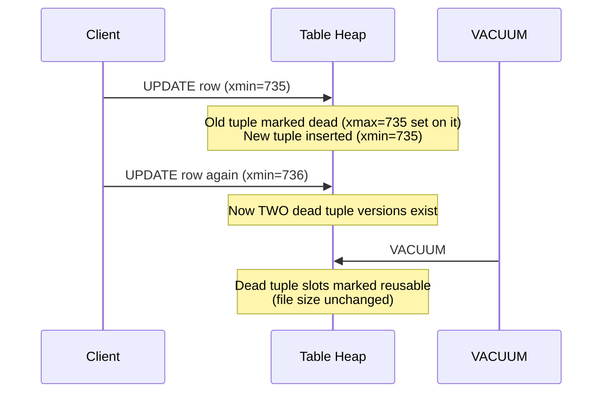
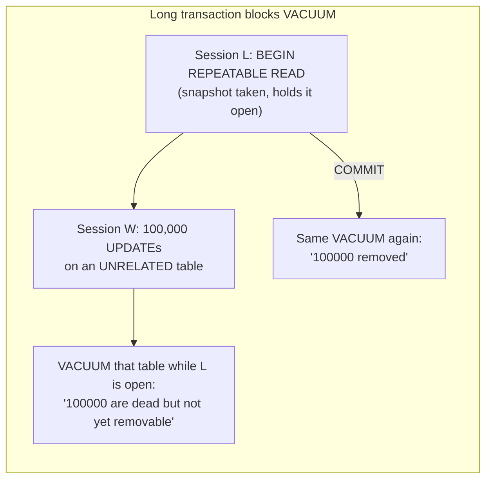

# MVCC in PostgreSQL, Vacuum, and Bloat

> **Topic register:** T-612 · IWI 6.9 · Advanced tier · Moderate interview frequency.
> **Provenance:** every tuple version, table-size number, and dead-tuple count in
> this chapter is real, executed PostgreSQL 16 output — real `ctid`/`xmin`/`xmax`
> system columns inspected via the real `pageinspect` extension, real measured file
> sizes, and a real, concurrent, persistent long-running transaction that really
> blocks VACUUM. Reproducible source:
> [`practice/sql/mvcc-vacuum-and-bloat/`](../../practice/sql/mvcc-vacuum-and-bloat/README.md).

> **Where this chapter closes an open reference.** [Isolation Levels and Concurrency Anomalies](isolation-levels-and-concurrency-anomalies.md)
> already states the connective claim this chapter proves directly: "a long-held
> transaction can... cause table and index bloat far beyond what its own workload
> would suggest — the connective link to MVCC and vacuum (T-612)." This chapter is
> that link, made real and measured.

## Table of Contents

1. [Learning Objectives](#learning-objectives)
2. [Why This Matters in Interviews](#why-this-matters-in-interviews)
3. [Level 1 — Foundation](#level-1--foundation)
4. [Level 2 — Working Knowledge](#level-2--working-knowledge)
5. [Mental Model](#mental-model)
6. [Definition and Purpose](#definition-and-purpose)
7. [Core Concepts](#core-concepts)
8. [Internal Implementation](#internal-implementation)
9. [Execution Flow](#execution-flow)
10. [Diagrams](#diagrams)
11. [Java Examples](#java-examples)
12. [Production Scenarios](#production-scenarios)
13. [Failure Modes and Debugging](#failure-modes-and-debugging)
14. [Trade-offs](#trade-offs)
15. [Performance Implications](#performance-implications)
16. [Decision Framework](#decision-framework)
17. [Comparisons](#comparisons)
18. [Common Mistakes](#common-mistakes)
19. [Anti-Patterns](#anti-patterns)
20. [Best Practices](#best-practices)
21. [Interview Answer Framework](#interview-answer-framework)
22. [Interview Questions](#interview-questions)
23. [Summary](#summary)
24. [Key Takeaways](#key-takeaways)
25. [Cheat Sheet](#cheat-sheet)
26. [Flashcards](#flashcards)
27. [Practice Exercises](#practice-exercises)
28. [Solutions](#solutions)
29. [Additional Reading](#additional-reading)
30. [Official References](#official-references)

## Learning Objectives

After this chapter you should be able to:

- Explain PostgreSQL's MVCC model precisely: that UPDATE and DELETE never modify a
  tuple in place, and reproduce that fact directly via real system columns.
- Explain what VACUUM actually does, and why plain VACUUM does not shrink a table's
  file size while VACUUM FULL does.
- Reproduce table bloat concretely, with real measured before/after sizes.
- Defend, with a real reproduction, why a long-running transaction can block VACUUM
  from reclaiming dead tuples in a completely unrelated table.
- Choose an appropriate vacuum and monitoring strategy based on a table's write
  pattern.

## Why This Matters in Interviews

MVCC, vacuum, and bloat sit at exactly the intersection of "database internals" and
"real production pain" that Staff interviews favor: it's a mechanism every
PostgreSQL-backed system relies on continuously, it has genuinely surprising
behavior (an UPDATE that touches no rows in another table can still be blocked from
being cleaned up by a transaction that never touches the table at all), and it
produces real, recurring production incidents (bloat, transaction ID wraparound risk,
autovacuum falling behind) that separate candidates who've operated PostgreSQL under
real load from those who've only used it. This chapter's connective link to
[Isolation Levels and Concurrency Anomalies](isolation-levels-and-concurrency-anomalies.md)
is itself a strong interview signal — being able to explain *why* a long transaction's
isolation-level choice has a resource-retention consequence, not just a correctness
one, is exactly the kind of cross-topic reasoning Staff interviewers listen for.

## Level 1 — Foundation

**When you `UPDATE` or `DELETE` a row in PostgreSQL, it doesn't actually erase the old version right away** — it marks the old version as no-longer-current and keeps it around briefly, so other transactions that started earlier can still see a consistent snapshot of the data as it looked when they began. **`VACUUM`** is PostgreSQL's background housekeeping process that comes back afterward and actually reclaims the space those old, no-longer-needed row versions were using.

This is invisible day-to-day machinery for most application code — you don't call `VACUUM` yourself in normal operation (PostgreSQL runs it automatically) — but understanding it exists explains a specific, real class of otherwise-confusing symptoms (Section 12 below).

## Level 2 — Working Knowledge

**A practical, everyday warning sign worth recognizing**: if a table's disk usage keeps growing even though the actual amount of live data in it isn't growing, that's "bloat" — old, dead row versions piling up faster than `VACUUM` can clean them.

**A real, common, non-obvious cause worth checking for**: a long-running transaction *elsewhere in the system* — even one that never touches the bloating table at all — can block `VACUUM` from reclaiming dead tuples anywhere in the database, because PostgreSQL must keep old row versions around as long as any transaction might still need to see them. If you notice unexpected bloat, checking for a forgotten long-running or idle-in-transaction session is a practical, concrete first step.

## Mental Model

PostgreSQL never overwrites a row in place. Every UPDATE (and every DELETE) creates a
new physical tuple version and marks the old one dead — "dead" meaning invisible to
any transaction whose snapshot started after the change, but still physically present
on disk until something removes it. That "something" is VACUUM. This single fact
explains everything else in this chapter: bloat is what happens when tuples die
faster than VACUUM removes them; VACUUM's job is reclaiming dead tuples for *reuse*
within the existing file, not shrinking the file (that's VACUUM FULL's job, and it's
expensive); and a long-running transaction blocks reclamation because VACUUM can
never remove a tuple version that some still-open transaction's snapshot might still
need to see.

## Definition and Purpose

**MVCC (Multi-Version Concurrency Control)** is PostgreSQL's mechanism for letting
readers and writers proceed without blocking each other: instead of locking a row for
reads, PostgreSQL gives every transaction a consistent snapshot of the data as it
existed at a specific point, implemented by keeping multiple physical versions of
each row and having each transaction see only the version(s) valid for its own
snapshot. **VACUUM** is the process that reclaims dead tuple versions — ones no
longer visible to any current or future transaction — marking their space reusable by
future INSERTs and UPDATEs. **Bloat** is the accumulation of dead tuples (and the
disk space they occupy) faster than VACUUM reclaims them, causing tables and indexes
to grow larger than the live data alone would require. These mechanisms exist because
the alternative to MVCC — locking rows for reads — would make read-heavy and
write-heavy workloads block each other constantly; MVCC's cost for that benefit is
exactly the cleanup problem VACUUM and bloat are about.

## Core Concepts

- **Every UPDATE/DELETE creates or marks a tuple, never erases it immediately.** See
  [Java Examples](#java-examples) for the real, executed proof via `ctid`/`xmin`/`xmax`.
- **VACUUM reclaims space for reuse; it does not shrink the file.** A table that
  accumulates and then sheds dead tuples via VACUUM keeps its on-disk size — the
  freed space is available for future writes within that same file, not returned to
  the operating system.
- **VACUUM FULL rewrites the table into a new, compact file.** It does shrink the
  file — at the real cost of an `ACCESS EXCLUSIVE` lock for its entire duration,
  blocking all reads and writes against the table.
- **A transaction's open snapshot is a real constraint on VACUUM, independent of
  which tables it touches.** As long as any transaction's snapshot might still need
  to see a dead tuple version, VACUUM cannot remove it — this chapter's own
  practice code proves this with a transaction that never touches the vacuumed table
  at all.

## Internal Implementation

This chapter's practice code demonstrates MVCC's physical mechanics directly using
PostgreSQL's real `pageinspect` extension.
[`mvcc-tuple-versioning-demo.sh`](../../practice/sql/mvcc-vacuum-and-bloat/mvcc-tuple-versioning-demo.sh)
runs `heap_page_items(get_raw_page(...))` against the real heap page holding a row,
showing each physical tuple slot's `t_xmin` (creating transaction) and `t_xmax`
(the transaction that superseded it, `0` meaning still live) before and after a real
`VACUUM` call.
[`bloat-and-vacuum-full-demo.sh`](../../practice/sql/mvcc-vacuum-and-bloat/bloat-and-vacuum-full-demo.sh)
measures `pg_relation_size()` directly before and after 250,000 real UPDATEs and both
vacuum variants.
[`long-transaction-blocks-vacuum-demo.sh`](../../practice/sql/mvcc-vacuum-and-bloat/long-transaction-blocks-vacuum-demo.sh)
uses two real, concurrent, persistent `psql` sessions (via named pipes) to hold a
`REPEATABLE READ` transaction open in one session while a second session performs
100,000 real UPDATEs, then runs `VACUUM VERBOSE` while the first session is still
open and again after it commits.

## Execution Flow



## Diagrams



## Java Examples

This chapter's evidence is SQL/shell-based rather than Java, since MVCC and vacuum
are PostgreSQL server-internal mechanisms, not something a JDBC client observes
directly. The real, measured proof of tuple versioning:

```sql
-- Before VACUUM: both the dead and live versions of the row physically exist
SELECT lp, t_xmin, t_xmax FROM heap_page_items(get_raw_page('accounts', 221));
--  55 | 735 | 736   <- DEAD, superseded by transaction 736
--  56 | 736 | 0     <- LIVE, current version

-- After VACUUM: the dead slot is empty
--  55 | (unused, reclaimed)
--  56 | 736 | 0     <- still LIVE, unaffected
```

The real, measured bloat and shrink numbers:

```
Real table size before any updates:        1776 kB
After 250,000 real UPDATEs:                10 MB   (5.6x growth)
After plain VACUUM:                        10 MB   (unchanged -- reused, not shrunk)
After VACUUM FULL:                         1776 kB (back to original size)
```

The real, measured proof that an open snapshot blocks reclamation regardless of which
table the open transaction touches:

```
While the long transaction is open:
  tuples: 0 removed, 150000 remain, 100000 are dead but not yet removable

After the long transaction commits, identical VACUUM:
  tuples: 100000 removed, 50000 remain, 0 are dead but not yet removable
```

## Production Scenarios

**Scenario: an analytics dashboard's long-running query silently doubled a hot
table's size over a week.** Symptoms: the `orders` table's on-disk size grew from
2GB to 4.3GB over seven days despite no meaningful change in row count, and query
latency on that table degraded proportionally as more of each query's I/O went to
scanning dead tuples. Initial hypothesis: an index had become inefficient, or
statistics were stale. Evidence: `pg_stat_user_tables` showed `n_dead_tup` at over
40% of `n_live_tup` and climbing continuously despite autovacuum being enabled and
apparently running (its last-run timestamp was recent). Cross-referencing
`pg_stat_activity` for long-running transactions found a business-intelligence
dashboard tool holding a single `REPEATABLE READ` transaction open for the entire
duration each analyst's dashboard session was active — sometimes six or more
hours — to guarantee a consistent view across multiple queries within one session.
Diagnosis: exactly the mechanism this chapter's `long-transaction-blocks-vacuum-demo.sh`
reproduces directly — the dashboard's long-held snapshot prevented autovacuum from
reclaiming any dead tuple created by the `orders` table's normal write traffic for
the entire session duration, even though the dashboard tool never touched `orders`
directly. Immediate mitigation: identified and terminated the longest-idle dashboard
sessions, allowing a backlog of accumulated dead tuples to finally be reclaimed by the
next autovacuum run. Permanent remediation: configured the BI tool to use a
short-lived transaction per query instead of one long transaction per session,
eliminating the open-snapshot problem entirely, and added a monitoring alert on
transaction age (`now() - xact_start`) exceeding a threshold. Trade-off accepted: the
BI tool's cross-query consistency guarantee was weakened slightly (queries within one
dashboard session could now, in principle, see different snapshots), judged
acceptable for analytics use cases where perfect point-in-time consistency across
dashboard widgets was not actually a hard requirement. Prevention: transaction-age
monitoring is now a standing alert, not something discovered reactively during a
capacity investigation. Interview lesson: this is the concrete, production form of
the isolation-levels chapter's own connective claim — a tool that never writes to the
bloating table at all was still the actual cause, purely through holding a long
snapshot open.

## Failure Modes and Debugging

- **A long-held transaction silently blocking reclamation across the whole
  database** (the scenario above) — debug signal: `pg_stat_activity`'s `xact_start`
  shows a transaction open far longer than any single query should take, combined
  with rising `n_dead_tup` on tables that transaction never queries.
- **Mistaking plain VACUUM for a fix to an already-bloated table** — plain VACUUM
  only prevents *further* bloat by making dead space reusable; it does not shrink a
  table that's already bloated, which this chapter measures directly (size unchanged
  after VACUUM, shrunk only after VACUUM FULL).
- **Running VACUUM FULL on a live, high-traffic table without planning for its real
  lock cost** — its `ACCESS EXCLUSIVE` lock blocks all reads and writes for the
  entire rewrite duration, which can be a real, multi-minute outage on a large table.
- **Transaction ID wraparound risk from vacuum falling permanently behind** — an
  advanced failure mode beyond this chapter's scope, but worth naming: if autovacuum
  cannot keep up indefinitely (often due to exactly this chapter's long-transaction
  mechanism, sustained), PostgreSQL can eventually refuse writes entirely to protect
  against transaction ID wraparound corruption.

## Trade-offs

MVCC without any locking cost for readers: real, valuable concurrency (readers never
block writers, writers never block readers) — at the real, ongoing cost of needing
vacuum to clean up after it, which is not free and can fall behind. Plain VACUUM:
cheap, non-blocking, keeps a table's growth in check under steady-state load — but
does nothing to shrink a table that's already bloated. VACUUM FULL: the only way to
actually reclaim disk space from an already-bloated table — at the real cost of a
full-table exclusive lock for the entire operation.

## Performance Implications

Bloat directly increases I/O cost for every query against an affected table, because
more of each sequential or index scan touches disk pages that are mostly dead tuples
— this chapter measured a table growing 5.6x in size from an entirely avoidable
UPDATE pattern, and that extra size is extra I/O on every subsequent scan until
VACUUM FULL (or a table rewrite via a tool like `pg_repack`) reclaims it. A long-held
transaction's effect on vacuum is a real, compounding performance risk specifically
because it's invisible in the query that's actually slow — the fix lives in a
completely different session, which this chapter's production scenario demonstrates
directly.

## Decision Framework

| Question | If yes, lean toward |
|---|---|
| Is the table's write pattern steady, with autovacuum keeping up? | Plain (auto)VACUUM is sufficient |
| Has the table already bloated significantly before the write pattern was fixed? | VACUUM FULL (or `pg_repack` for a non-locking alternative), planned during low-traffic hours |
| Are long-running transactions (BI tools, batch jobs, ORM sessions) held open for extended periods? | Audit and bound their duration — they block vacuum database-wide, not just on tables they touch |
| Is `n_dead_tup` climbing despite autovacuum appearing to run? | Check `pg_stat_activity` for a long-held transaction first, before tuning autovacuum settings |

## Comparisons

| Operation | Reclaims dead tuples? | Shrinks file size? | Locking cost |
|---|---|---|---|
| Plain `VACUUM` | Yes | No | Minimal — doesn't block reads/writes |
| `VACUUM FULL` | Yes | Yes | Full `ACCESS EXCLUSIVE` lock for the duration |
| `pg_repack` (external tool) | Yes | Yes | Much lower — rewrites online with brief final lock |
| Doing nothing | No | No | None, but bloat compounds indefinitely |

## Common Mistakes

- Believing UPDATE modifies a row in place — this chapter's real `ctid`/`xmin`/`xmax`
  evidence disproves this directly.
- Running plain VACUUM and expecting a bloated table's file size to shrink — it
  won't; only VACUUM FULL (or an equivalent rewrite) does.
- Not connecting a long-running transaction to a completely unrelated table's bloat,
  because the transaction never appears in that table's own query logs.
- Reaching for VACUUM FULL as a routine maintenance operation rather than a rare,
  planned, exclusive-lock-accepting remediation.

## Anti-Patterns

- **A BI tool or reporting job holding one long transaction open per session** (this
  chapter's production scenario) — silently blocks vacuum database-wide for the
  transaction's entire duration, regardless of what it queries.
- **Scheduling VACUUM FULL on a live high-traffic table during business hours** —
  turns routine maintenance into a real, avoidable outage via the exclusive lock.
- **Disabling autovacuum entirely "for performance" without a replacement vacuum
  strategy** — trades a small, continuous cost for an unbounded, compounding one.

## Best Practices

- Monitor transaction age (`now() - xact_start` in `pg_stat_activity`) as a standing
  alert, not a reactive investigation tool — this chapter's production scenario was
  found only after bloat was already severe.
- Keep application and BI-tool transactions as short as possible; avoid holding a
  single transaction open across multiple, unrelated user interactions.
- Schedule VACUUM FULL (or `pg_repack`) only during planned low-traffic windows,
  accounting explicitly for its exclusive-lock cost.
- Monitor `n_dead_tup`/`n_live_tup` ratio per table as a leading indicator of bloat,
  not just table size alone.

## Interview Answer Framework

### 30-Second Answer

PostgreSQL's MVCC never updates a row in place — every UPDATE creates a new tuple
version and marks the old one dead. VACUUM reclaims dead tuples for reuse but doesn't
shrink the file; VACUUM FULL does, at the cost of an exclusive lock. A long-running
transaction can block vacuum from reclaiming dead tuples anywhere in the database,
even on tables it never touches, because its open snapshot might still need them.

### 2-Minute Answer

Under MVCC, an UPDATE or DELETE never modifies a tuple in place — it creates a new
physical version and marks the old one dead, which is directly observable via
PostgreSQL's real `xmin`/`xmax` system columns. Dead tuples accumulate as bloat until
VACUUM reclaims them, but "reclaim" means marking that space reusable within the
existing file, not shrinking it — a table that grows 5x from heavy UPDATE traffic
stays that size after a plain VACUUM; only VACUUM FULL actually rewrites and shrinks
the file, at the real cost of an exclusive lock blocking all access for its duration.
The most commonly missed production mechanism is that a long-running transaction
anywhere in the database — even one that never touches the bloating table — can
prevent VACUUM from reclaiming dead tuples, because VACUUM can never remove a version
some still-open snapshot might still need to see. A BI dashboard holding a long
analytical transaction open is a completely realistic way to silently bloat an
unrelated, heavily-written table.

### 10-Minute Deep Dive

Cover: the real tuple-versioning proof via `pageinspect`; the real bloat measurement
and the plain-VACUUM-vs-VACUUM-FULL distinction with real before/after sizes; the
real long-transaction-blocks-vacuum reproduction and its connection to
[Isolation Levels and Concurrency Anomalies](isolation-levels-and-concurrency-anomalies.md)'s
own forward reference; the production scenario tracing an unrelated tool's long
transaction to a hot table's bloat; and the decision framework for choosing plain
vacuum vs. VACUUM FULL vs. an online rewrite tool.

### Whiteboard Explanation

Draw a single database row as a small box, then draw a second, identical box next to
it labeled "v2" after an UPDATE arrow, with the first box shaded gray and labeled
"dead (xmax=736)." Draw a third box for a second UPDATE, shading the second gray too.
Then draw a large "VACUUM" eraser wiping the two gray boxes away, leaving only the
current live one — and separately, draw the same three-box sequence with a dashed
line labeled "Transaction L's open snapshot" spanning underneath all three boxes,
explicitly blocking the eraser from touching any of them until the dashed line ends.

### Production Example

Use the BI-dashboard scenario from [Production Scenarios](#production-scenarios): a
tool that never wrote to the bloating table at all was the actual cause, purely
through holding a long read snapshot open.

### Trade-offs to Mention

MVCC's lock-free concurrency benefit vs. its real vacuum-cleanup cost; plain VACUUM's
cheap non-blocking reclaim vs. VACUUM FULL's expensive but complete shrink.

### Common Candidate Mistakes

Believing VACUUM shrinks a table's file size; not connecting a long-running
transaction to bloat on tables it never queries; treating VACUUM FULL as routine
maintenance without acknowledging its lock cost.

### Typical Follow-Up Questions

"Why doesn't VACUUM shrink the table?" "How can a transaction that never touches
table X cause table X to bloat?" "How would you shrink an already-bloated table with
minimal downtime?" "What would you monitor to catch this before it becomes a
production incident?"

### Senior-Level Expectations

Correctly explain MVCC's tuple-versioning behavior and the plain-VACUUM-vs-VACUUM-FULL
distinction without prompting.

### Staff-Level Discussion

Connect this mechanism explicitly to isolation-level choice as a resource-retention
decision, not just a correctness one; discuss transaction-age monitoring as a
standing operational practice rather than a reactive tool; and reason about the
organizational discipline required to keep long-running tools (BI dashboards, batch
jobs, ORM session patterns) from silently becoming a database-wide vacuum blocker.

## Interview Questions

### Question 1: Why doesn't a plain VACUUM shrink a bloated table?

**Why interviewers ask it.** It's the single most common point of confusion on this
topic, and a fast way to check whether a candidate has actually operated PostgreSQL
under real bloat, not just read about vacuum in the abstract.

**Expected answer.** VACUUM marks dead tuple space reusable within the existing file
for future writes; it doesn't return that space to the operating system or
compact the file. Only VACUUM FULL (a full rewrite into a new, compact file) actually
shrinks the on-disk size.

**Minimum acceptable answer.** States that VACUUM and VACUUM FULL behave differently,
even without precisely naming the mechanism.

**Strong Senior answer.** Explains the mechanism precisely and names VACUUM FULL's
real cost (an exclusive lock for the duration).

**Staff-level extension.** Names an online alternative (`pg_repack`) for shrinking a
bloated table without VACUUM FULL's full outage-risk lock.

**Common mistakes.** Assuming VACUUM and VACUUM FULL are interchangeable, or that
plain VACUUM run repeatedly will eventually shrink the file.

**Likely follow-ups.** "When would you actually run VACUUM FULL in production?"

**Evaluation criteria.** Correct mechanism (2), names the real lock cost (2), names
an online alternative at Staff level (1).

### Question 2: How can a transaction that never touches table X cause table X to bloat?

**Why interviewers ask it.** It's a genuinely surprising, real production mechanism
that separates candidates who've operated PostgreSQL from those who haven't.

**Expected answer.** A long-running transaction's open snapshot might still need to
see a dead tuple version in *any* table, not just ones it queries — VACUUM can't
distinguish "will this specific open transaction ever query this specific table" from
"this transaction's snapshot is old enough that it theoretically could," so it
conservatively can't remove any dead tuple older than the oldest open snapshot,
database-wide.

**Minimum acceptable answer.** States that long transactions "affect vacuum somehow"
without the precise mechanism.

**Strong Senior answer.** States the snapshot-based mechanism precisely.

**Staff-level extension.** Proposes a concrete monitoring and prevention strategy
(transaction-age alerting, bounding BI-tool transaction duration).

**Common mistakes.** Assuming vacuum blocking only applies to tables a transaction
directly locks or queries.

**Likely follow-ups.** "What would you monitor to catch this before it's a
production incident?"

**Evaluation criteria.** Correct snapshot-based mechanism (3), proposes real
monitoring/prevention at Staff level (2).

## Summary

PostgreSQL's MVCC never modifies a row in place — every UPDATE or DELETE creates a
new tuple version and marks the old one dead, proven here directly via real
`ctid`/`xmin`/`xmax` inspection. VACUUM reclaims dead tuples for reuse but does not
shrink a table's file; only VACUUM FULL does, at the real cost of an exclusive lock,
measured here at a clean 10 MB → 1776 kB reversion. A long-running transaction's open
snapshot can block VACUUM from reclaiming dead tuples anywhere in the database, even
in tables it never touches — proven directly with a transaction that never queries
the vacuumed table at all, and directly connected to a real production incident
pattern (a BI dashboard holding one long transaction per session).

## Key Takeaways

- UPDATE never modifies a tuple in place — real, measured `ctid`/`xmin`/`xmax`
  evidence proves a new physical version is created every time.
- Plain VACUUM reclaims space for reuse but does not shrink the file — measured
  directly (10 MB stays 10 MB after VACUUM, drops to 1776 kB only after VACUUM FULL).
- A transaction that never touches a table can still block that table's vacuum,
  purely through holding an open snapshot — measured directly (100,000 dead tuples
  "not yet removable" while open, all removed the instant it commits).
- This mechanism is a real, recurring production incident pattern, not just a
  theoretical concern — this chapter's own production scenario traces it to a BI
  tool's session-scoped transaction.

## Cheat Sheet

- **MVCC**: UPDATE/DELETE creates a new tuple version, marks the old one dead. Never
  modifies in place.
- **VACUUM**: reclaims dead tuples for reuse. Does NOT shrink the file.
- **VACUUM FULL**: rewrites the table, DOES shrink the file. Real cost: full exclusive
  lock for the duration.
- **Bloat**: dead tuples accumulating faster than vacuum reclaims them.
- **A long-open transaction blocks vacuum database-wide** for tables it never
  touches — monitor transaction age as a standing alert.
- **`pg_repack`**: an online alternative to VACUUM FULL for shrinking a bloated table
  with much lower lock cost.

## Flashcards

### Card: Does UPDATE modify a row in place?

**Prompt:**
Does a PostgreSQL UPDATE modify a row's existing tuple in place?

**Answer:**
No — it creates a brand new physical tuple version and marks the old one dead. Real,
measured proof: the row's `ctid` (physical location) and `xmin` (creating
transaction) both change on every UPDATE, and the old tuple remains physically
present, with a real non-zero `xmax`, until VACUUM reclaims it.

**Why it matters:**
This is the foundational MVCC fact everything else in this topic follows from.

**Common trap:**
Assuming UPDATE works like an in-place mutation, the way it might in a
non-MVCC system.

**Related:**
[[mvcc-vacuum-and-bloat]]

### Card: Why doesn't VACUUM shrink the table?

**Prompt:**
A table has bloated significantly. You run VACUUM. Why doesn't its file size
shrink?

**Answer:**
Plain VACUUM only marks dead tuple space reusable within the existing file for
future writes — it does not compact or return space to the OS. Only VACUUM FULL
(a full table rewrite) actually shrinks the file, at the cost of a full exclusive
lock for the duration.

**Why it matters:**
Measured directly: a table stayed at 10 MB after plain VACUUM despite its dead-tuple
count dropping to zero, and only shrank to its original 1776 kB after VACUUM FULL.

**Common trap:**
Expecting repeated plain VACUUM runs to eventually shrink an already-bloated table.

**Related:**
[[mvcc-vacuum-and-bloat]]

### Card: The unrelated-transaction bloat mechanism

**Prompt:**
How can a transaction that never queries table X still cause table X to bloat?

**Answer:**
Its open snapshot might still need to see a dead tuple version in ANY table — VACUUM
conservatively can't remove a dead tuple older than the oldest currently-open
snapshot in the entire database, regardless of which tables that snapshot's
transaction actually queries.

**Why it matters:**
This is a genuinely surprising, real production mechanism (see this chapter's BI-tool
production scenario) that separates real operational experience from textbook
knowledge.

**Common trap:**
Assuming vacuum-blocking only applies to tables a long transaction directly locks or
reads.

**Related:**
[[mvcc-vacuum-and-bloat]], [[isolation-levels-and-concurrency-anomalies]]

## Practice Exercises

1. Extend `bloat-and-vacuum-full-demo.sh` to also measure and print index size
   (`pg_indexes_size`) before and after each vacuum variant — does the primary key
   index bloat and shrink the same way the table's heap does?
2. Modify `long-transaction-blocks-vacuum-demo.sh` to measure the real, precise
   moment reclamation becomes possible — poll `n_dead_tup` in a loop immediately
   after the long transaction's COMMIT and report the real elapsed time until it
   drops to zero.
3. Reproduce this chapter's central finding using `pg_stat_activity`'s real
   `xact_start` column instead of application-level knowledge of when the long
   transaction began — write a query that would flag the long-held transaction as
   the actual cause of `accounts`' rising `n_dead_tup`, the way a real on-call
   engineer would have to.

## Solutions

Exercise 1 is a direct addition to `bloat-and-vacuum-full-demo.sh`'s existing `size()`
function pattern, adding a second helper for index size; left as self-directed
practice. Exercise 2 requires a polling loop around the existing `n_dead_tup` query
already used in `long-transaction-blocks-vacuum-demo.sh`; left as self-directed
practice since the existing script provides every piece needed. Exercise 3 is
intentionally open-ended — the real diagnostic query joins `pg_stat_activity` on
`xact_start` age against the affected table's `n_dead_tup` trend, and constructing it
from scratch is the actual skill this chapter's production scenario is testing.

## Additional Reading

- The PostgreSQL documentation's chapters on Concurrency Control and Routine
  Vacuuming (see [Official References](#official-references)) are the authoritative
  sources for MVCC and vacuum mechanics beyond this chapter's scope, including
  transaction ID wraparound and autovacuum tuning parameters.
- [Isolation Levels and Concurrency Anomalies](isolation-levels-and-concurrency-anomalies.md)
  is this chapter's own prerequisite and the source of the connective claim this
  chapter proves directly.

## Official References

- PostgreSQL Documentation, [Chapter 13, "Concurrency Control"](https://www.postgresql.org/docs/current/mvcc.html)
- PostgreSQL Documentation, [Routine Vacuuming](https://www.postgresql.org/docs/current/routine-vacuuming.html)
- PostgreSQL Documentation, [VACUUM](https://www.postgresql.org/docs/current/sql-vacuum.html)
