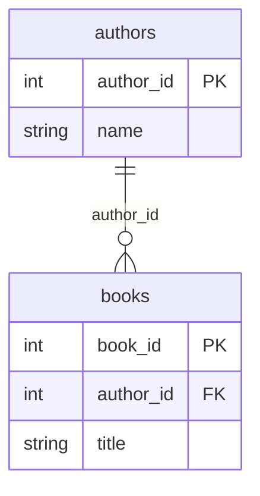

# SQL and Relational Database Fundamentals

## Table of Contents

1. [Why This Matters](#1-why-this-matters)
2. [Prerequisites](#2-prerequisites)
3. [Foundation (L1)](#3-foundation-l1)
4. [Core Concepts (L2)](#4-core-concepts-l2)
5. [How It Works Internally (L3)](#5-how-it-works-internally-l3)
6. [Practical Usage](#6-practical-usage)
7. [Examples](#7-examples)
8. [Common Mistakes](#8-common-mistakes)
9. [Edge Cases](#9-edge-cases)
10. [Performance Implications](#10-performance-implications)
11. [Trade-offs](#11-trade-offs)
12. [Senior-Level Considerations (L3)](#12-senior-level-considerations-l3)
13. [Staff/System-Level Considerations (L4)](#13-staffsystem-level-considerations-l4)
14. [Production Scenarios](#14-production-scenarios)
15. [Interview Questions](#15-interview-questions)
16. [Coding/Practice Exercises](#16-codingpractice-exercises)
17. [Debugging Exercises](#17-debugging-exercises)
18. [Design Exercises](#18-design-exercises)
19. [Further Reading](#19-further-reading)
20. [Mastery Checklist](#20-mastery-checklist)

## 1. Why This Matters

Every other chapter in `06-databases` assumes you can already write a `SELECT` with a `JOIN` and know what a foreign key does — reasonable for the Senior/Staff-only version of this repository, not reasonable once this project explicitly covers Junior through Staff. This chapter is that missing floor, the same role [Java OOP Fundamentals](../02-java/language-core/java-oop-fundamentals-classes-objects-and-interfaces.md) plays for `02-java`. A candidate who cannot explain what a primary key actually guarantees, or why a `LEFT JOIN` can produce more rows than an `INNER JOIN` on the identical query, will stall the moment an interviewer asks a single follow-up question past "write a query that returns X" — and every advanced chapter in this domain (index internals, isolation levels, replication) silently assumes this floor is already solid.

## 2. Prerequisites

None. This is a true entry point into `06-databases`.

## 3. Foundation (L1)

A relational database stores data in **tables** — think of a table as a spreadsheet with a fixed set of named, typed **columns**, where every **row** is one record. An `authors` table might have columns `author_id`, `name`; every author in the system is one row in that table. This is the entire relational model in one sentence: data lives in tables, and relationships between tables are expressed by one table referencing another's identifying column — not by nesting one record inside another the way a document or an object graph would.

A **primary key** is the column (or columns) that uniquely identifies each row in a table — no two rows can share one, and it can never be empty. `author_id` as a primary key guarantees the database itself will refuse a second row with the same `author_id`, rather than trusting every piece of application code to remember not to create a duplicate.

A **foreign key** is a column in one table that references a primary key in another, and it is how relationships are actually expressed. `books.author_id` referencing `authors.author_id` says, in a rule the database itself enforces: "every book row must point at an author row that genuinely exists." Section 7's Example F shows this rule being enforced directly — the database rejecting an attempt to insert a book with an author ID that isn't real, with no application code involved in catching the mistake.

The four operations you do to data are commonly abbreviated **CRUD**: `INSERT` (Create), `SELECT` (Read), `UPDATE`, and `DELETE`. Every one of Section 7's demos runs at least one of these against a real, disposable PostgreSQL database.

### `SELECT`, `FROM`, and `WHERE` — what each one is actually for

A `SELECT` query has three jobs, done by three different clauses, and confusing what each one is *for* is one of the most common beginner mistakes:

- **`FROM`** answers "where does the data come from" — one table, or several tables combined with a `JOIN` (Section 4).
- **`SELECT`** answers "which columns (or computed values) do I want back" — a list of column names, `*` for all of them, or an expression like `salary * 12` for an annual figure computed from a monthly one.
- **`WHERE`** answers "which *rows* actually qualify" — a condition evaluated once per row, keeping only the rows where it's true and discarding the rest before anything else happens to them.

Read in plain English, `SELECT title, published_year FROM books WHERE published_year < 1980` says: "from the `books` table, keep only the rows where `published_year` is less than 1980, then give me back just the `title` and `published_year` columns of what's left." Section 7 Example C is this exact query, run for real.

**The clauses don't execute in the order you type them.** SQL's actual *logical* processing order is: `FROM` (gather the rows) → `WHERE` (filter individual rows) → `GROUP BY` (collapse rows into groups, Section 4) → `HAVING` (filter the groups, Section 4) → `SELECT` (compute the final output columns) → `ORDER BY` (sort the result). This is why `WHERE` can't reference a column alias defined in `SELECT` (the alias doesn't exist yet when `WHERE` runs) and why `HAVING` can filter on an aggregate like `COUNT(*)` while `WHERE` cannot (aggregates aren't computed until after `WHERE` has already run) — both are direct, mechanical consequences of this order, not arbitrary SQL rules to memorize separately.



`books.author_id` (the foreign key) points at `authors.author_id` (the primary key) — Section 7's Example F proves the database itself refuses a `books` row whose `author_id` doesn't point at a real `authors` row.

## 4. Core Concepts (L2)

### The six JOIN types, and what each one actually returns

A **`JOIN`** combines rows from two tables based on a matching condition — almost always "this table's foreign key equals that table's primary key." Each kind answers a genuinely different question, not a stylistic variant of the same query:

| JOIN type | Returns | Unmatched left row | Unmatched right row |
|---|---|---|---|
| `INNER JOIN` | Only rows with a match in *both* tables | Dropped | Dropped |
| `LEFT [OUTER] JOIN` | Every row from the left table, matched or not | Kept, right columns `NULL` | Dropped |
| `RIGHT [OUTER] JOIN` | Every row from the right table, matched or not | Dropped | Kept, left columns `NULL` |
| `FULL [OUTER] JOIN` | Every row from *both* tables, matched or not | Kept, right columns `NULL` | Kept, left columns `NULL` |
| `CROSS JOIN` | Every row of the left table paired with every row of the right table (a Cartesian product) — no matching condition at all | N/A | N/A |
| `SELF JOIN` | Not a distinct keyword — a table joined to itself, using a different alias for each side, to compare rows within one table | Depends on which of the above (`INNER`/`LEFT`/etc.) is used for the self-join itself | Depends |

Section 7 Examples G through M run all six for real, against two different schemas: `authors`/`books` for `INNER` and `LEFT` (Example G, where the foreign key is required, so every book genuinely has a real author), and a second `departments`/`employees` schema for `RIGHT`, `FULL`, `CROSS`, and `SELF` (Examples J–M), where the foreign key is deliberately *nullable* — needed to honestly demonstrate a row unmatched on the *right* side, which the required-foreign-key `authors`/`books` schema cannot produce at all.

**`RIGHT JOIN` is the mirror image of `LEFT JOIN`** — swap which table is "kept in full," and you get the same behavior from the other direction. In practice, most engineers default to writing `LEFT JOIN` and reordering the tables rather than reaching for `RIGHT JOIN` at all, since the two are logically interchangeable this way — Section 7 Example J deliberately uses `RIGHT JOIN` explicitly so both keywords are demonstrated for real, but Section 6 revisits which one to actually reach for.

**`FULL OUTER JOIN` is the real union of `LEFT` and `RIGHT`** — every row that either one alone would keep, with `NULL` on whichever side had no match. Section 7 Example K proves this directly: the zero-employee department ("Empty Dept," which only a `RIGHT`/`FULL` join keeps) and the unassigned employee ("Dev," `dept_id IS NULL`, which only a `LEFT`/`FULL` join keeps) both appear in the same `FULL OUTER JOIN` result.

**`CROSS JOIN` has no matching condition at all** — it pairs every row of one table with every row of the other, producing (row count of table A) × (row count of table B) rows. It looks like a mistake (an accidentally omitted join condition) far more often than it's used deliberately, but it has real, legitimate uses — Section 7 Example L generates one row per (department, quarter) combination, a real pattern for building a report template grid that needs every combination represented, even ones with no data yet.

**`SELF JOIN` isn't a fourth keyword** — it's an ordinary `JOIN` (any of the types above) where both sides are the *same* table, given two different aliases so the query can distinguish "this row" from "the other row it's being compared to." Section 7 Example M joins `employees` to itself (`e` and `m`) via `e.manager_id = m.emp_id`, to list each employee next to their own manager's name — a relationship that only makes sense within one table, not between two different ones.

### Aggregate functions, `GROUP BY`, and `HAVING` vs. `WHERE`

An **aggregate function** computes one value from many rows — `COUNT(*)` (how many rows), `COUNT(column)` (how many rows where that column is not `NULL`), `SUM`, `AVG`, `MIN`, and `MAX` are the five used in essentially every real report query. `GROUP BY` is what makes an aggregate function compute *per group* instead of over the entire table at once — `GROUP BY dept_id` with `COUNT(emp_id)` computes one count *per distinct `dept_id`* value, not one count for the whole table. Every column in the `SELECT` list that isn't wrapped in an aggregate function must appear in the `GROUP BY` clause — this isn't a style preference, it's because SQL needs to know, for a group containing multiple rows, which single value to report for that column, and an aggregate function is the only thing that tells it how to collapse many values into one.

**`WHERE` and `HAVING` both filter, but at different points in the logical order established in Section 3** — this is the entire distinction, not two arbitrary keywords that happen to do similar things:

- **`WHERE` filters individual rows, *before* grouping happens.** It cannot reference an aggregate function, because aggregates haven't been computed yet at the point `WHERE` runs.
- **`HAVING` filters *groups*, after `GROUP BY` and its aggregates have already been computed.** It's the only clause that can say "only keep groups where `COUNT(*) > 5`" or "only keep departments where the average salary exceeds some threshold" — a condition on the *aggregate*, not on any individual row.

Section 7 Example N runs the identical `GROUP BY`/`AVG(salary)` query twice: once filtered by `WHERE is_active = TRUE` (rows are excluded before averaging), and once filtered by `HAVING AVG(salary) > 100000` (whole groups are excluded after averaging) — two structurally different filters, producing two different, both-correct result sets from the same underlying data.

### Key types beyond primary and foreign

A real schema's keys are a small family of related concepts, not just "primary key" and "foreign key":

- **Super key** — any column, or set of columns, that uniquely identifies a row. `(emp_id)` is a super key; so is `(emp_id, emp_name)` — adding an already-unique column to a super key can never break its uniqueness, just makes it larger than necessary.
- **Candidate key** — a *minimal* super key: no column can be removed from it without losing uniqueness. `employees.emp_id` is a candidate key; `employees.email` (declared `UNIQUE` in Section 7 Example I) is a *second*, independent candidate key for the same table — a table can genuinely have more than one column (or column combination) that would have worked as the primary key.
- **Primary key** — the *one* candidate key a table's designer actually chose to be the official row identifier, enforced with a `PRIMARY KEY` constraint. There is exactly one primary key per table, even when multiple candidate keys exist.
- **Alternate key** (sometimes called a **secondary key**) — any candidate key that exists but was *not* chosen as the primary key. `employees.email` is exactly this: a real, `UNIQUE`-enforced alternate key, genuinely capable of identifying a row on its own, deliberately not the table's `PRIMARY KEY`.
- **Composite key** — a key (primary, candidate, or otherwise) made of *more than one column together* — no single column in it is unique alone, but the combination is. Common on join/junction tables (a `(order_id, product_id)` pair uniquely identifying one line item), covered in full in [Data Modelling and Explicit Join Tables](data-modelling-and-explicit-join-tables.md).
- **Natural key vs. surrogate key** — a **natural key** is a real-world, meaningful value that happens to be unique (an ISBN, a national ID number, an email address); a **surrogate key** is a value with no real-world meaning, generated purely to identify a row (an auto-incrementing `SERIAL` integer, or a generated `UUID` like `employees.emp_uuid` in Section 7 Example I). This repository's own examples default to surrogate keys (`author_id`, `book_id`, `emp_id` are all `SERIAL`) — the practical reason is Section 6.

### Constraint types beyond primary and foreign keys

Beyond `PRIMARY KEY` and `FOREIGN KEY` (Section 3), four more constraint types show up in essentially every real schema, each enforcing a different rule directly at the database layer:

| Constraint | Enforces | Real example (Section 7 Example I/O) |
|---|---|---|
| `NOT NULL` | This column can never be empty | `employees.emp_name TEXT NOT NULL` |
| `UNIQUE` | No two rows can share this value (but, unlike a primary key, more than one column can be declared `UNIQUE`, and a `UNIQUE` column can typically hold one `NULL`) | `employees.email TEXT UNIQUE` |
| `CHECK` | An arbitrary boolean condition must hold for every row | `employees.salary NUMERIC(10,2) CHECK (salary > 0)` |
| `DEFAULT` | Not an integrity rule but a real, automatic fallback value applied when a column is omitted from an `INSERT` | `employees.hire_date DATE DEFAULT CURRENT_DATE` |

Section 7 Example O fires a real `INSERT` violating `UNIQUE`, `CHECK`, and `NOT NULL` in turn, capturing each real Postgres error message — and then a fourth `INSERT` that *omits* `hire_date`, `is_active`, and `tags` entirely, proving each one really does receive its declared `DEFAULT` value rather than coming back `NULL`.

### SQL data types, with real examples

Every column has a declared type, and PostgreSQL's real type catalog is considerably richer than "text or number." Section 7 Example I's `employees`/`departments` schema deliberately uses one column of each of these categories, and its `\d` output (also in Example I) shows every type exactly as Postgres itself reports it:

| Category | Common types | Real example from this chapter's own schema |
|---|---|---|
| Integer | `SMALLINT`, `INTEGER`, `BIGINT`, `SERIAL`/`BIGSERIAL` (an auto-incrementing integer, not technically its own type — sugar for an `INTEGER` plus a sequence) | `emp_id SERIAL` |
| Exact decimal | `NUMERIC(precision, scale)` / `DECIMAL(precision, scale)` — exact, no floating-point rounding error, the correct choice for money | `salary NUMERIC(10,2)` — up to 10 total digits, 2 after the decimal point |
| Approximate decimal | `REAL`, `DOUBLE PRECISION` — real floating-point, faster but *can* lose precision; wrong choice for money for exactly that reason | Not used in this chapter's schema, deliberately, given the `salary` column above |
| Text | `CHAR(n)` (fixed-length, space-padded), `VARCHAR(n)` (variable-length, capped), `TEXT` (variable-length, uncapped) — Postgres itself recommends `TEXT` unless a real length cap is a genuine business rule | `emp_name TEXT`, `email TEXT` |
| Boolean | `BOOLEAN` — `TRUE`/`FALSE`, real third state `NULL` (unknown) also possible unless `NOT NULL` | `is_active BOOLEAN DEFAULT TRUE` |
| Date/time | `DATE`, `TIME`, `TIMESTAMP` (no timezone), `TIMESTAMPTZ` (with timezone — the one to default to for anything tracking a real-world moment), `INTERVAL` (a real duration, e.g. `'3 days'`) | `hire_date DATE DEFAULT CURRENT_DATE` |
| Identifier | `UUID` — a 128-bit generated identifier, real alternative to a `SERIAL` integer as a surrogate key when values need to be unguessable or generated outside the database | `emp_uuid UUID DEFAULT gen_random_uuid()` |
| Semi-structured | `JSON`/`JSONB` — real, queryable JSON storage inside a column; `JSONB` (binary, indexable) is the one to default to over plain `JSON` for anything actually queried, not just stored | `metadata JSONB`, queried in Example P with the real `->>` operator |
| Array | `<type>[]` — a real, native array of any other type, queryable with operators like `ANY(...)` | `tags TEXT[]`, queried in Example P with `'lead' = ANY(tags)` |

**A real, observed behavior worth knowing**: `AVG()` applied to a `NUMERIC(10,2)` column does not return a value rounded back to 2 decimal places — Section 7 Example N's real output shows `130000.000000000000`, not `130000.00`. This is real, documented Postgres behavior (`AVG` on an exact numeric type expands its scale rather than preserving the input column's declared scale) — worth explicitly rounding (`ROUND(AVG(salary), 2)`) in a real report query rather than assuming the output already matches the source column's precision.

**Normalization**, at the level this chapter needs, is the practice of storing each fact exactly once and expressing relationships through foreign keys rather than by repeating data. Storing an author's name directly on every one of their book rows means updating that author's name requires updating every book row too, and risks the rows disagreeing with each other; storing `author_id` on `books` and looking the name up through a `JOIN` when needed means the name exists in exactly one place. [Data Modelling and Explicit Join Tables](data-modelling-and-explicit-join-tables.md) takes this idea further, into many-to-many relationships this chapter doesn't cover.

## 5. How It Works Internally (L3)

A `PRIMARY KEY` constraint is not just a naming convention — declaring one causes PostgreSQL to automatically build a unique index on that column (visible directly in Section 7 Example A's `\d` output: `"authors_pkey" PRIMARY KEY, btree (author_id)`), and every `INSERT` or `UPDATE` checks that index before committing, rejecting the operation if the value already exists. A `FOREIGN KEY` constraint works by the referencing table's write path checking the referenced table's primary-key index at the moment of the write — Section 7 Example F's rejected insert is that check firing in real time, not a delayed validation step.

A `JOIN` is executed by the database's own query planner, not by your query dictating a specific algorithm — the same `INNER JOIN` syntax might run as a nested-loop join, a hash join, or a merge join depending on table sizes and available indexes, a decision [Query Planning and EXPLAIN ANALYZE](query-planning-and-explain-analyze.md) covers in full. What matters at this level is only that the *result* (which rows come back) is fully determined by `INNER`/`LEFT`/`RIGHT`/`FULL`, while the *execution strategy* used to produce that result is an internal decision the planner makes independently, invisible in the query's own syntax. `CROSS JOIN` is the one exception worth naming explicitly: with no condition to evaluate, the planner has no matching work to do at all — it's the one join type whose row count is fully predictable in advance, purely from the two input row counts, regardless of the data itself.

A `UNIQUE` constraint works exactly like a `PRIMARY KEY`'s uniqueness check (Section 5, above) — Postgres builds a real unique index for it (Section 7 Example I's `\d` output shows `"employees_email_key" UNIQUE CONSTRAINT, btree (email)`, structurally identical in kind to `employees_pkey`) — the only real differences are that a table can have many `UNIQUE` constraints but only one `PRIMARY KEY`, and a `UNIQUE` column (unlike a `PRIMARY KEY` column) can hold `NULL`, since two `NULL`s are never considered equal to each other in a uniqueness check. A `CHECK` constraint is evaluated per-row at write time, exactly like `NOT NULL` and `UNIQUE` — the constraint expression (`salary > 0`) is checked against the new row's actual values before the write commits, and Section 7 Example O's real rejected `-5000` salary is that check firing, not a delayed validation step run later.

## 6. Practical Usage

Always give every table a primary key, even when nothing seems to require one yet — a table without one cannot reliably be referenced by a future foreign key, and cannot be safely updated or deleted by "this exact row" later. Default to expressing every real relationship between tables as an explicit foreign key rather than trusting application code to keep two tables consistent by convention — Section 8's most common mistake is exactly this shortcut.

**Choosing a JOIN type**: reach for `LEFT JOIN` specifically when the answer needs to account for "zero of something" (Section 7 Example H's book count including authors with zero books); reach for `INNER JOIN` when a row with no match is genuinely irrelevant to the question being asked; reach for `FULL OUTER JOIN` only when the question genuinely needs *both* sides' unmatched rows at once (a data-reconciliation report — "which departments have no employees, and which employees have no department" — is the canonical real case); default to rewriting a would-be `RIGHT JOIN` as a `LEFT JOIN` with the tables swapped, purely for team-wide readability consistency, unless a specific query genuinely reads more naturally the other way; reach for `CROSS JOIN` only when a real Cartesian product is the actual goal (a report template grid, Section 7 Example L) — an *accidental* `CROSS JOIN` (a `JOIN` with a forgotten or wrong `ON` condition) is one of the most common real query-writing mistakes, and Section 8 covers its symptom directly.

**Choosing a key type**: default to a surrogate key (`SERIAL`/`BIGSERIAL`, or `UUID` when values must be generated outside the database or must be unguessable) for a table's primary key, even when a natural key (an email, an ISBN) is also available and `UNIQUE`-constrained as an alternate key — a natural key can turn out to be not-actually-unique later (two people sharing an email due to a typo, a business rule change), or can need to *change* (a corrected email), and a primary key referenced by foreign keys elsewhere is expensive to change once other tables depend on it; a surrogate key never has this problem, because it was never meant to carry business meaning in the first place.

**Choosing a data type**: default to `TEXT` over `VARCHAR(n)` unless a length cap is a genuine, enforced business rule (Postgres itself documents no real performance difference between the two); always use `NUMERIC`/`DECIMAL`, never `REAL`/`DOUBLE PRECISION`, for money or any value where exact arithmetic matters, since floating-point types can genuinely lose precision on repeated arithmetic; default to `TIMESTAMPTZ` over plain `TIMESTAMP` for anything recording a real-world moment (an event time, a `created_at`) so the stored value is unambiguous across time zones; reach for `JSONB` over a wider, sparser table (many nullable columns for rarely-used, per-row-varying attributes) when the actual attribute set is genuinely unpredictable per row, but default to a real, named column for anything queried or filtered on regularly — `JSONB`'s flexibility trades away the query planner's ability to use a normal index on that data as effectively as a real column.

## 7. Examples

All results below are real, executed output from PostgreSQL 16 in a disposable Docker container — [`practice/sql/sql-fundamentals/`](../../practice/sql/sql-fundamentals/), full transcript in `fundamentals-lab-output.txt`.

**A — `CREATE TABLE` with a primary key and a foreign key**, real `\d` output:
```
Table "public.authors"
  Column   |  Type   | Nullable |                  Default
-----------+---------+----------+--------------------------------------------
 author_id | integer | not null | nextval('authors_author_id_seq'::regclass)
 name      | text    | not null |
Indexes:
    "authors_pkey" PRIMARY KEY, btree (author_id)
Referenced by:
    TABLE "books" CONSTRAINT "books_author_id_fkey" FOREIGN KEY (author_id) REFERENCES authors(author_id)
```

**B — `INSERT` and `SELECT`**: 4 authors and 5 books inserted; `SELECT * FROM authors` and `SELECT * FROM books` return every row back, exactly as written.

**C — `SELECT ... WHERE`**: filtering `books` to `published_year < 1980` returns exactly 3 of the 5 rows, correctly excluding the two published after 1980.

**D — `UPDATE`**: `UPDATE books SET published_year = 1975 WHERE title = 'The Dispossessed'` changes exactly that one row (`UPDATE 1`); re-querying it back confirms `1975`, not the original `1974`.

**E — `DELETE`**: `DELETE FROM books WHERE title = 'Parable of the Sower'` removes exactly that row (`DELETE 1`); the table now has 4 rows, not 5.

**F — the foreign key constraint actually rejecting an orphan row**, real Postgres error text:
```
ERROR:  insert or update on table "books" violates foreign key constraint "books_author_id_fkey"
DETAIL:  Key (author_id)=(999) is not present in table "authors".
```

**G — `INNER JOIN` vs. `LEFT JOIN`, same condition, run both ways**: `INNER JOIN` returns 4 rows (one per book); `LEFT JOIN` returns 5 — the extra row is `N. K. Jemisin` (seeded with zero books on purpose), with `title` coming back `NULL` rather than the row being dropped.

**H — `GROUP BY` + `COUNT` with a `LEFT JOIN`**: the same zero-books author correctly shows `book_count = 0` in the result, rather than being absent from a report that should account for every author.

**I — a second schema, `departments`/`employees`**, with a *nullable* `dept_id` foreign key (unlike `authors`/`books`'s required one) — real `\d` output confirms `UNIQUE` (`employees_email_key`), `CHECK` (`employees_salary_check`), a self-referencing `manager_id` foreign key, and real declared types (`UUID`, `NUMERIC(10,2)`, `DATE`, `BOOLEAN`, `TEXT[]`, `JSONB`). Seeded with 4 employees: Alice and Bob in Engineering (Bob managed by Alice), Cara in Sales, and Dev with no department at all (`dept_id` genuinely `NULL`); plus a fourth, empty department ("Empty Dept") with zero employees.

**J — `RIGHT JOIN`**: every department is kept (including zero-employee "Empty Dept," employee columns `NULL`); the unassigned employee ("Dev") is dropped entirely — the mirror image of Example G's `LEFT JOIN` behavior.

**K — `FULL OUTER JOIN`**: the real union of a `LEFT` and a `RIGHT` join — "Empty Dept" (no employees) *and* "Dev" (no department) both appear in the same 6-row result, each with `NULL` on the side that has no match.

**L — `CROSS JOIN`**: 4 departments × 4 quarters = a real 16-row Cartesian product, every (department, quarter) pair present exactly once, with no matching condition at all.

**M — `SELF JOIN`**: `employees` joined to itself via `manager_id = emp_id` — Bob correctly pairs with manager "Alice"; Alice, Cara, and Dev (all with no manager) correctly show a `NULL` manager column rather than being dropped, since this self-join uses `LEFT JOIN` internally.

**N — `WHERE` vs. `HAVING`, same `GROUP BY`/`AVG(salary)` query, filtered two different ways**: with `WHERE is_active = TRUE` (filters rows first), all 3 groups (Engineering avg 130000, Sales avg 95000, unassigned avg 60000) survive, since every seeded employee is active. With `HAVING AVG(salary) > 100000` instead (filters *groups*, after averaging), only Engineering's row survives — the only group whose average actually exceeds 100000.

**O — `UNIQUE`, `CHECK`, and `NOT NULL` constraints actually rejecting real inserts**, real Postgres error text for each:
```
ERROR:  duplicate key value violates unique constraint "departments_dept_name_key"
DETAIL:  Key (dept_name)=(Engineering) already exists.

ERROR:  new row for relation "employees" violates check constraint "employees_salary_check"
DETAIL:  Failing row contains (5, ..., Bad Hire, bad@example.com, null, null, -5000.00, ...).

ERROR:  null value in column "emp_name" of relation "employees" violates not-null constraint
DETAIL:  Failing row contains (6, ..., null, noname@example.com, ..., 50000.00, ...).
```

A fourth insert (`Erin`, omitting `hire_date`, `is_active`, and `tags` entirely) succeeds and, re-queried, really does show today's real date, `true`, and an empty array `{}` — the declared `DEFAULT` for each, not `NULL`.

**P — `JSONB` and array operators**: `metadata ->> 'level'` correctly extracts the real text value (`"senior"`/`"mid"`) from each employee's JSON blob; `'lead' = ANY(tags)` correctly returns only Alice and Cara, the two employees whose `tags` array genuinely contains `'lead'`.

**Q — one report query, built up six times**, each version's real output shown: a plain `SELECT emp_name` (5 rows) → add `WHERE is_active = TRUE` (still 5, since all seeded employees are active) → add a `LEFT JOIN` to `departments` (5 rows, Dev's department now correctly `NULL`) → add `GROUP BY`/`COUNT`/`AVG` (3 real groups: unassigned/2/65000, Engineering/2/130000, Sales/1/95000) → add `HAVING COUNT(emp_id) >= 1` (all 3 groups still qualify, since none is empty) → add `ORDER BY headcount DESC` plus `LIMIT 1` (returns exactly the top group by headcount).

## 8. Common Mistakes

- **Skipping a foreign key and relying on application code to keep two tables consistent** — the exact gap Section 7 Example F closes; without the constraint, a bug in application code can silently insert an orphaned row with no error at all.
- **Using `INNER JOIN` when the question needs to account for "zero of something"** — silently drops the exact rows (Section 7's zero-books author) the report was supposed to include, producing a report that looks complete but isn't.
- **Assuming `DELETE` on a referenced row succeeds automatically** — attempting to delete an author who still has books referencing them fails with a foreign key violation by default (the reverse direction of Section 7 Example F), unless the schema explicitly opts into a cascade or set-null behavior, which changes the failure into a real, possibly-unwanted side effect instead.
- **Comparing `NULL` with `=` and expecting it to match** — `NULL = NULL` evaluates to `NULL` (neither true nor false) in SQL, not `true`; testing for a `NULL` result (like Example G's `LEFT JOIN` unmatched rows) requires `IS NULL`, never `= NULL`.
- **Trying to filter on an aggregate with `WHERE`** — `WHERE COUNT(*) > 5` is a real syntax error, not just bad style, because `WHERE` runs before `GROUP BY`/aggregation in the logical processing order (Section 3); the aggregate simply doesn't exist yet at the point `WHERE` evaluates. This is exactly what `HAVING` exists for (Section 4).
- **Writing a `JOIN` with a forgotten or wrong `ON` condition** — Postgres doesn't reject this; it silently executes as a `CROSS JOIN` (Section 4), producing a row count equal to (left rows × right rows) instead of the intended matched set — a real, common source of a query that "runs fine" but returns a wildly wrong, much larger result set.
- **Choosing a natural key as the primary key because it "looks" permanently unique** — an email, a national ID, or a product SKU can all turn out to be not-actually-unique later, or need to change, at which point every foreign key referencing it becomes expensive to update; Section 6's surrogate-key default exists specifically to avoid this.

## 9. Edge Cases

- A `LEFT JOIN`'s unmatched columns are exactly and only the columns from the *right-hand* table — the left-hand table's own columns are never `NULL` in the result unless the underlying data genuinely contains a `NULL` there. Getting the join direction backwards silently changes which side's missing-match rows get preserved.
- `GROUP BY` with a `LEFT JOIN` (Section 7 Example H) is the specific, easy-to-miss combination that correctly reports a *zero* count for something with no matches; the same query written with `INNER JOIN` instead would drop that row from the report entirely rather than reporting it as zero — two different, both-plausible-looking results from one word changed.
- A primary key does not have to be a single column — a **composite primary key** (two or more columns together forming the uniqueness guarantee) is common on join tables, covered in [Data Modelling and Explicit Join Tables](data-modelling-and-explicit-join-tables.md), not this chapter.
- A `UNIQUE` constraint permits `NULL` — Postgres (like standard SQL) never considers two `NULL`s equal to each other for uniqueness purposes, so a `UNIQUE` column can genuinely hold more than one `NULL` row simultaneously, a real, sometimes-surprising exception to "unique means no duplicates."
- `AVG()` on a `NUMERIC` column returns a value with *more* decimal places than the source column's declared scale (Section 4's real observed `130000.000000000000` from a `NUMERIC(10,2)` column) — worth an explicit `ROUND()` in any query whose output is displayed directly rather than further computed on.

## 10. Performance Implications

A primary key's automatic index (Section 5) is why looking up one row by its primary key is fast even in a table with millions of rows — without it, finding one row would mean scanning every row in the table. A foreign key's own enforcement check similarly benefits from an index on the *referenced* column (which the primary key already provides) — the cost this chapter's fundamentals don't yet cover is indexing the *referencing* column itself (e.g., `books.author_id`) for fast lookups in the other direction, which [Database Index Structures](index-structures-btree-composite-covering.md) covers in full.

## 11. Trade-offs

| Concern | `INNER JOIN` | `LEFT JOIN` |
|---|---|---|
| Rows with no match on the right | Dropped entirely | Kept, with `NULL` in the unmatched columns |
| Correct when | The question only makes sense for rows that have a match | The question needs to account for "zero of something," or a complete list regardless of matches |
| Common failure if used wrongly | Silently under-reports (Section 8) | Requires explicit `IS NULL` handling downstream to distinguish "no match" from real data |

| Concern | `WHERE` | `HAVING` |
|---|---|---|
| Runs | Before grouping (Section 3's logical order) | After grouping and aggregation |
| Can reference an aggregate (`COUNT`, `AVG`, ...) | No — real syntax error | Yes — this is its entire purpose |
| Correct when | Excluding individual rows from consideration at all | Excluding whole groups based on a computed aggregate value |
| Common failure if used wrongly | Attempting `WHERE COUNT(*) > 5` — a real error, not a wrong result | Using `HAVING` for a plain row-level condition that `WHERE` could handle — works, but filters *after* unnecessary rows were already grouped, real wasted work |

## 12. Senior-Level Considerations (L3)

A Senior engineer reviewing a schema checks not just "does this query return the right answer for today's data" but "does this constraint (or its absence) make an entire bug class impossible, or merely unlikely." A foreign key isn't a formality — it's the difference between "this orphaned-row bug can't happen" and "this orphaned-row bug hasn't happened yet." The same discipline applies to choosing `INNER` vs. `LEFT JOIN` deliberately rather than defaulting to whichever one a query happens to return correct-looking results with on today's data — Section 8's under-reporting mistake is specifically dangerous because it produces a plausible, wrong-looking-right report rather than an obvious error.

## 13. Staff/System-Level Considerations (L4)

At Staff scope, the question shifts from one schema to a whole system's data-integrity posture: is enforcement happening at the database layer (foreign keys, `NOT NULL`, `UNIQUE`), where it's guaranteed regardless of which of a dozen services writes to the table, or only in application code, where every new service that touches the table has to independently re-implement the same rule correctly? A Staff engineer pushes integrity constraints down into the schema specifically because it is the one enforcement point every writer — present and future, known and not-yet-written — is forced through, the same design principle [Clean and Hexagonal Architecture](../17-architecture/clean-hexagonal-architecture.md) applies to keeping business rules in one place rather than re-implemented at every caller.

## 14. Production Scenarios

No existing `production-cookbook/` entry has an SQL-fundamentals-specific root cause — the closest adjacent entries are index- and lock-scale, not basic-constraint-scale.

> Planned reference: a future `production-cookbook/` entry covering a real incident caused by a missing foreign key constraint that let an application bug silently insert orphaned rows for months before a report surfaced the inconsistency would be a natural, non-duplicative addition connecting this chapter's Section 8 warning to a genuine production incident.

## 15. Interview Questions

**Q1 (Junior): "What's the difference between a primary key and a foreign key?"**
Expected answer: a primary key uniquely identifies each row in its own table; a foreign key references another table's primary key, expressing a relationship and letting the database enforce that the referenced row actually exists.

**Q2 (Junior/Mid): "What's the difference between `INNER JOIN` and `LEFT JOIN`?"**
Expected answer: Section 4's distinction, ideally illustrated with a concrete example like Section 7 Example G — an unmatched row disappears under `INNER JOIN`, survives with `NULL`s under `LEFT JOIN`. A weak answer describes syntax without describing which rows end up missing.

**Q3 (Mid): "You need a report showing every customer's order count, including customers with zero orders. What goes wrong if you use `INNER JOIN`?"**
Expected answer: customers with zero orders are silently dropped from the report entirely, rather than showing `0` — Section 9's `GROUP BY`-plus-join edge case exactly.

**Q4 (Mid/Senior): "Why enforce a foreign key at the database level instead of checking it in application code?"**
Expected answer: Section 13's framing — a database constraint is the one enforcement point every writer is forced through, regardless of how many services or code paths write to the table; application-level checks must be independently re-implemented correctly everywhere data enters the table.

**Q5 (Senior/Staff): "A table has grown a dozen writers over several years and just failed a data-integrity audit with thousands of orphaned rows. What's your first question?"**
Expected answer: whether the referencing column ever had an actual foreign key constraint — the Staff-level diagnosis is almost always "the relationship was only ever enforced by convention, not by the schema," which Section 13 frames as the real, structural failure, not a one-off bug in any single writer.

**Q6 (Mid): "What's the difference between `WHERE` and `HAVING`, and why can't you just use `WHERE` for both?"**
Expected answer: Section 4's logical-order explanation — `WHERE` filters individual rows before grouping; `HAVING` filters groups after aggregation, and is the only clause that can reference an aggregate function like `COUNT` or `AVG` in its condition. A weak answer says "they're basically the same" or can't explain why `WHERE COUNT(*) > 5` fails.

**Q7 (Mid/Senior): "Explain the difference between a candidate key, a primary key, and an alternate key."**
Expected answer: Section 4's key-types breakdown — a candidate key is any minimal set of columns that could uniquely identify a row; a table can have more than one; the primary key is the one actually chosen; every other candidate key that exists but wasn't chosen is an alternate (or secondary) key, typically still enforced with a `UNIQUE` constraint. A weak answer treats "primary key" and "candidate key" as synonyms.

**Q8 (Junior/Mid): "When would you choose a `UUID` over an auto-incrementing integer as a primary key?"**
Expected answer: when IDs need to be generated outside the database (e.g., client-side, before an `INSERT`) without risking a collision, or when sequential integer IDs would leak real information (row count, creation order) to anyone who can see them (e.g., in a public API URL). Trade-off: a `UUID` is larger (16 bytes vs. 4/8) and, unless generated in a way that preserves rough insertion order, indexes worse than a sequential integer — a real cost, not a free upgrade.

## 16. Coding/Practice Exercises

1. Add a `publishers` table (`publisher_id` primary key, `name`) and a `publisher_id` foreign key column on `books`. Insert at least one publisher with zero books and one book with a publisher, then write both an `INNER JOIN` and a `LEFT JOIN` between `books` and `publishers`, confirming the same disappearing-row behavior Example G demonstrates for `authors`.
2. Attempt to `DELETE` an author who still has books referencing them (e.g., `Ursula K. Le Guin`, who has 2). Capture the real error message and explain, in your own words, why Postgres refuses by default.
3. Rewrite Example H's query to also include a `HAVING book_count = 0` clause, isolating only the authors with zero books, and confirm it returns exactly the one seeded author.
4. Using the `employees`/`departments` schema, write a `FULL OUTER JOIN` query and confirm both "Empty Dept" and "Dev" appear in the same result, per Example K. Then rewrite it as a `LEFT JOIN` `UNION` a `RIGHT JOIN` (with `WHERE` excluding already-matched rows from one side) and confirm the two approaches produce the same result — a real, hands-on proof that `FULL OUTER JOIN` is genuinely a union of the other two, not a separate mechanism.
5. Add a `CHECK` constraint to `departments` requiring `dept_name` to be at least 2 characters long, attempt to insert a 1-character department name, and capture the real rejection.

## 17. Debugging Exercises

Given this query, run against the lab's real schema, predict the output before running it:

```sql
SELECT a.name, COUNT(b.book_id) AS book_count
FROM authors a
INNER JOIN books b ON a.author_id = b.author_id
GROUP BY a.name;
```

The zero-books author (`N. K. Jemisin`) does **not** appear in this result at all — not with a `0`, simply absent — because `INNER JOIN` drops the row before `GROUP BY`/`COUNT` ever see it. A candidate expecting to see `N. K. Jemisin | 0` is making exactly the Section 8 mistake: assuming `INNER JOIN` behaves like `LEFT JOIN` when the count would be zero.

Given this second query, also predict the output before running it:

```sql
SELECT dept_id, COUNT(*) AS headcount
FROM employees
WHERE COUNT(*) > 1
GROUP BY dept_id;
```

This is **not** a query that returns a wrong answer — it's a real syntax error (`aggregate functions are not allowed in WHERE`), because `WHERE` executes before `GROUP BY`/aggregation in the logical processing order (Section 3), so `COUNT(*)` doesn't exist yet at the point `WHERE` evaluates. The fix is `HAVING COUNT(*) > 1`, placed after `GROUP BY`, exactly Section 4's `WHERE`-vs-`HAVING` distinction.

## 18. Design Exercises

Design the tables (with explicit primary and foreign keys) for a simple blog: `users`, `posts` (each written by one user), and `comments` (each on one post, written by one user). State, for each foreign key, what real-world mistake it makes structurally impossible — e.g., what does `posts.author_id REFERENCES users(user_id)` prevent that a plain, unconstrained integer column would not?

For each of `users.email`, `posts.post_id`, and `posts.slug` (a URL-friendly title, assumed unique), name which key concept from Section 4 it is (primary key, alternate/secondary key, or a plain non-key `UNIQUE` column) and justify your choice — a real exercise in applying the candidate-key/alternate-key distinction to a schema you designed yourself, not just reciting the definitions.

## 19. Further Reading

- [Data Modelling and Explicit Join Tables](data-modelling-and-explicit-join-tables.md) — the next step once single-foreign-key relationships are solid: many-to-many relationships and composite keys.
- [Database Index Structures](index-structures-btree-composite-covering.md) — what actually makes a primary-key lookup, or a foreign-key join, fast at scale.
- [Query Planning and EXPLAIN ANALYZE](query-planning-and-explain-analyze.md) — how the database actually decides to execute a `JOIN`, referenced in Section 5.
- [PostgreSQL: Data Types](https://www.postgresql.org/docs/current/datatype.html) — the full, authoritative type catalog Section 4's data-types table summarizes a small, practical slice of.

## 20. Mastery Checklist

- [ ] Can state what a primary key guarantees and what a foreign key enforces, in plain language.
- [ ] Can predict, for any of the six JOIN types (Section 4), which rows survive and which are dropped, for a given pair of tables.
- [ ] Can explain why `NULL = NULL` is not `true` in SQL, and why `IS NULL` exists because of it.
- [ ] Can correctly answer both Section 17 debugging exercises before running them — including *why* `WHERE COUNT(*) > 1` is a real error, not just a wrong-but-valid query.
- [ ] Can name the difference between a candidate key, a primary key, and an alternate/secondary key, and give a real example of each from this chapter's own schema.
- [ ] Can name at least five real PostgreSQL data type categories (Section 4) and state one column from this chapter's schema for each.
- [ ] Can explain, in Staff-level terms, why a foreign key enforced at the database is stronger than the same rule enforced only in application code.
