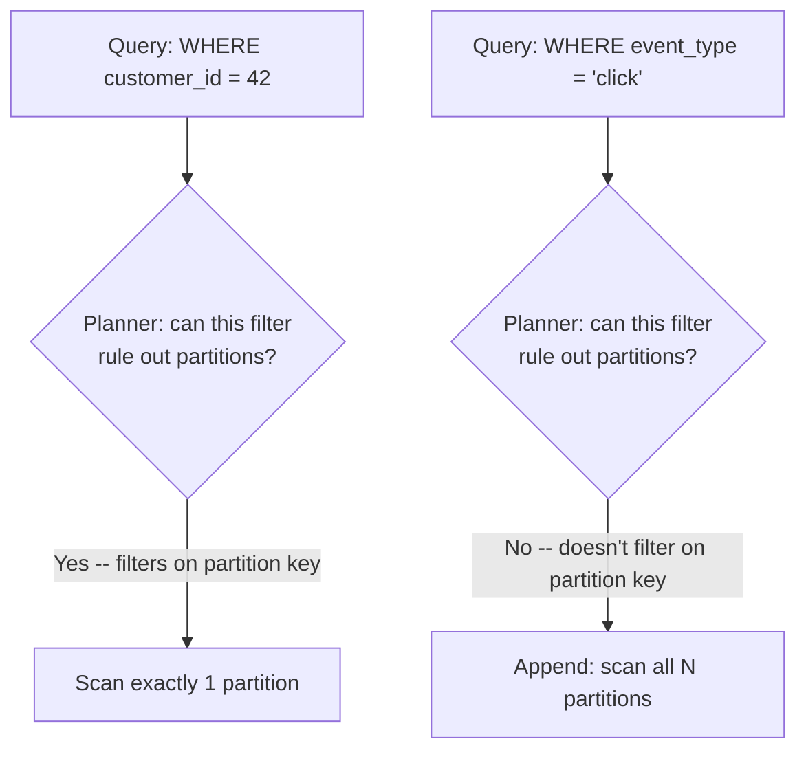

# Table Partitioning and Sharding Strategies

> **Topic register:** T-614 · IWI 7.60 · Staff tier
> **Provenance:** the `EXPLAIN` output in this chapter is real, executed against a live PostgreSQL 16 (Docker), a genuine hash-partitioned table with 40,000 seeded rows across 4 partitions. Reproducible source: [`practice/sql/week-10/sharding/setup.sql`](../../practice/sql/week-10/sharding/setup.sql).

## Table of Contents

1. [Learning Objectives](#learning-objectives)
2. [Why This Matters in Interviews](#why-this-matters-in-interviews)
3. [Mental Model](#mental-model)
4. [Definition and Purpose](#definition-and-purpose)
5. [Core Concepts](#core-concepts)
6. [Internal Implementation](#internal-implementation)
7. [Diagrams](#diagrams)
8. [Production Scenarios](#production-scenarios)
9. [Trade-offs](#trade-offs)
10. [Decision Framework](#decision-framework)
11. [Common Mistakes](#common-mistakes)
12. [Anti-Patterns](#anti-patterns)
13. [Best Practices](#best-practices)
14. [Interview Answer Framework](#interview-answer-framework)
15. [Interview Questions](#interview-questions)
16. [Summary](#summary)
17. [Key Takeaways](#key-takeaways)
18. [Cheat Sheet](#cheat-sheet)
19. [Flashcards](#flashcards)
20. [Practice Exercises](#practice-exercises)
21. [Solutions](#solutions)
22. [Additional Reading](#additional-reading)
23. [Official References](#official-references)

---

## Learning Objectives

By the end of this chapter you can:

- Explain partition pruning with a measured example, and state exactly which queries benefit from it.
- Explain why shard/partition key selection is a one-way door, with named failure modes for choosing wrong.
- Distinguish range from hash partitioning by their opposite failure modes (hot partitions vs. no range pruning).
- State why Postgres's own declarative HASH partitioning has the identical repartitioning-cost problem as naive `hash % N` application-level sharding.

## Why This Matters in Interviews

Partitioning and sharding questions test whether a candidate treats data-distribution decisions as permanent architectural commitments or as a tunable knob. The topic is Staff-tier because the cost of a wrong shard key is not discovered until real data volume makes correction a multi-week migration project — the same category of decision as [Kafka's partition-key choice](../09-messaging-event-driven/producer-semantics-and-partition-keys.md), one level up the stack.

## Mental Model

**A partition/shard key is a promise about which queries stay cheap forever.** Every query that filters by the key gets to skip all the data that provably can't match; every query that doesn't must scan (or fan out to) everything. The promise is made once, when the key is chosen, and honoring a different query pattern later means moving data, not changing a setting.

## Definition and Purpose

**Partitioning** splits one logical table into physically separate storage units by a key, either within one database instance (declarative partitioning, as demonstrated here) or across separate database instances entirely (**sharding**). Both split data by the same underlying idea — a partition/shard key that determines where a row lives — but sharding adds the additional concern of routing queries to the right physical database, not just the right storage segment within one.

A single table (or single database) eventually hits limits on write throughput, storage, and index size that no amount of vertical scaling resolves. Partitioning/sharding exists to let a dataset grow past what one machine can hold or serve, at the cost of losing some query patterns that were trivial when everything lived in one place (cross-partition joins, global uniqueness constraints, global `ORDER BY`).

## Core Concepts

### Partition pruning only helps queries that filter by the key

The query planner can only skip a partition when it can *prove at plan time* that partition cannot contain matching rows — which requires the query to filter on the partition key itself. Any other filter forces the planner to check every partition.

### Shard-key selection is a one-way door

The partition/shard key choice determines every query pattern's cost from that point forward, and **changing it later means physically moving data**. Two named failure modes:

- **Wrong key chosen up front**: queries that don't filter by the shard key fan out to every shard/partition forever, and there's no query-time fix — only a migration.
- **Cross-shard queries and joins**: a join between two tables sharded by different keys can't be pushed down to a single shard; it either requires application-level fan-out-and-merge, or denormalizing the data so the join isn't needed cross-shard at all.

### Range vs. hash partitioning have opposite failure modes

Range partitioning (e.g., by date) is natural for time-series data and lets old partitions be dropped cheaply, but concentrates all current writes into the newest range — a hot partition. Hash partitioning spreads writes evenly with no natural hot spot, but range queries ("all events this month") can't prune at all, since a hash gives no ordering information.

### Postgres's own declarative partitioning has the same repartitioning cost as sharding

Changing the number of hash partitions in a single Postgres database remaps rows the same way naive `hash % N` sharding does across databases — it's a different layer (partitions within one database vs. shards across databases), but the identical mathematical problem: nearly every row's target partition changes when `N` changes. [Consistent hashing](../10-distributed-systems/data-partitioning-and-consistent-hashing.md) fixes this at the application-sharding layer by moving only roughly `1/N` of the data on a node change; Postgres's built-in HASH partitioning does not have an equivalent mechanism.

## Internal Implementation

**Real schema**: `events` table, hash-partitioned into 4 partitions by `customer_id`, 40,000 rows across 1,000 distinct customers.

**Real `EXPLAIN`, querying by the partition key:**

```
EXPLAIN (ANALYZE, COSTS OFF, TIMING OFF) SELECT count(*) FROM events WHERE customer_id = 42;

 Aggregate (actual rows=1 loops=1)
   ->  Seq Scan on events_p2 events (actual rows=40 loops=1)
         Filter: (customer_id = 42)
         Rows Removed by Filter: 11000
 Planning Time: 0.216 ms
 Execution Time: 0.727 ms
```

**Real `EXPLAIN`, querying by a non-partition-key column:**

```
EXPLAIN (ANALYZE, COSTS OFF, TIMING OFF) SELECT count(*) FROM events WHERE event_type = 'click';

 Aggregate (actual rows=1 loops=1)
   ->  Append (actual rows=40000 loops=1)
         ->  Seq Scan on events_p0 events_1 (actual rows=10360 loops=1)
               Filter: (event_type = 'click'::text)
         ->  Seq Scan on events_p1 events_2 (actual rows=9360 loops=1)
               Filter: (event_type = 'click'::text)
         ->  Seq Scan on events_p2 events_3 (actual rows=11040 loops=1)
               Filter: (event_type = 'click'::text)
         ->  Seq Scan on events_p3 events_4 (actual rows=9240 loops=1)
               Filter: (event_type = 'click'::text)
 Planning Time: 0.232 ms
 Execution Time: 2.667 ms
```

**The query filtering by `customer_id` (the partition key) touches exactly ONE of the 4 partitions** (`events_p2`, a `Seq Scan` visible directly in the plan, no `Append` node at all — the planner proved at plan time the other 3 partitions can't contain matching rows and skipped them entirely). **The query filtering by `event_type` touches all 4** (the `Append` node fanning out to every partition), because `event_type` isn't the partition key. Real execution time: 0.727ms (pruned) vs. 2.667ms (unpruned) — roughly proportional to the ~4x difference in partitions scanned, on a table this small; the gap widens dramatically at real production scale, where each unpruned partition might be tens of gigabytes.

## Diagrams



## Production Scenarios

### Scenario: a shard key chosen for launch-day query patterns becomes a scaling bottleneck 18 months later

**Symptoms.** A multi-tenant SaaS product sharded its primary `events` table by `customer_id` at launch, matching the dominant query pattern at the time (per-customer dashboards). Eighteen months later, a new cross-customer analytics feature needs to query `event_type` across all customers, and every such query fans out to every shard, with latency scaling linearly as shard count and per-shard data volume grow.

**Impact.** The analytics feature's latency degrades every time a new shard is added (more shards to fan out to), the opposite of the scaling benefit sharding is supposed to provide for this specific access pattern.

**Initial hypotheses.** Missing an index on `event_type` (checked — an index exists on every shard, but each shard still must be queried); a query-planner regression (checked — each individual shard's query plan is efficient); the cross-shard access pattern itself being fundamentally unsuited to a `customer_id`-sharded scheme (correct).

**Evidence.** Query latency for the analytics feature scales linearly with shard count in load testing, while per-customer dashboard queries (the original design target) remain flat — confirming the shard key serves one access pattern well and the other poorly, exactly as this chapter's measured pruned-vs-unpruned gap predicts at larger scale.

**Diagnosis.** The shard key was chosen correctly for the launch-day dominant pattern, but a new, materially different query pattern (`event_type` across all customers) was never going to prune under a `customer_id` key — no amount of indexing or query tuning fixes a fan-out that's structural to the sharding scheme itself.

**Immediate mitigation.** Route the analytics feature to a read replica set explicitly provisioned for fan-out queries, accepting the cost, to stop the feature from degrading the primary shards' latency for the original access pattern.

**Permanent remediation.** Build a separate, denormalized analytics store (e.g., a columnar warehouse or a materialized, `event_type`-indexed rollup) fed by change-data-capture from the sharded primary, rather than querying the sharded primary directly for a pattern it was never designed to serve.

**Alternatives considered.** Re-sharding by a composite or different key — rejected as solving today's problem while likely creating the identical problem for whatever access pattern emerges next; a single shard key cannot serve every future query pattern well.

**Trade-offs.** Maintaining a separate analytics store adds operational surface (a CDC pipeline, eventual consistency between the two stores) — accepted, since the alternative is degrading the primary sharded system's core access pattern for every customer.

**Prevention.** Shard-key selection should be validated against the two or three most likely *future* access patterns the team can anticipate, not just the current dominant one, and any genuinely cross-cutting query pattern (analytics, reporting, search) should be routed to a purpose-built store from the start rather than assumed to work against the primary sharded system.

**Interview lesson.** This is Interview Question 1's underlying scenario at full production scale: a correct-at-the-time shard key becoming a structural bottleneck once the query pattern changes, with no query-time fix available.

## Trade-offs

| Choice | Benefit | Cost |
|---|---|---|
| Shard key = the most common query filter | Most queries prune to one shard/partition (measured 4x+ speedup here) | Queries filtering by anything else fan out to every shard |
| More partitions/shards | More parallel write throughput, smaller working sets per unit | More cross-partition query cost for anything not filtered by the key; more operational surface |
| Range partitioning (e.g., by date) | Natural for time-series data, easy to drop old partitions | Can create hot partitions (all current writes hit the newest range) |
| Hash partitioning | Spreads writes evenly, no natural hot partition | Range queries can't prune at all |

## Decision Framework

1. **What is the dominant query pattern, today and for the next 1-2 anticipated features?** Choose the shard/partition key to match it, not just today's traffic.
2. **Is the data naturally time-ordered and does old data become cold/droppable?** Range partition by time; accept the hot-partition trade-off or mitigate it (e.g., sub-partitioning the newest range).
3. **Do writes need to spread evenly with no natural key ordering?** Hash partition; accept that range queries won't prune.
4. **Is there a genuinely cross-cutting query pattern (analytics, search, reporting) that won't align with any single shard key?** Route it to a separate, purpose-built store fed by CDC rather than querying the sharded primary directly.
5. **Before committing a shard key to real data**, validate it against every query pattern the team can currently anticipate — this is a one-way door.

## Common Mistakes

- Treating sharding as a pure performance tweak rather than a permanent architectural commitment.
- Choosing a shard key without checking it against the actual dominant query pattern.
- Not recognizing that Postgres's declarative HASH partitioning has the same repartitioning-cost problem as application-level `hash % N` sharding — same math, different layer.

## Anti-Patterns

- **Picking a shard key that matches only today's traffic** without considering the next 1-2 anticipated features' access patterns.
- **Querying a sharded primary directly for a fundamentally cross-cutting access pattern** (analytics, global search) instead of building a purpose-built store for it.
- **Assuming Postgres's declarative HASH partitioning avoids sharding's repartitioning cost** just because it's a database feature rather than application code.

## Best Practices

- Validate a candidate shard key against every query pattern the team can currently anticipate before committing real data to it.
- Match range partitioning to genuinely time-ordered, age-out-able data; match hash partitioning to write-heavy data with no natural range-query need.
- Route cross-cutting query patterns (analytics, reporting) to a separate store fed by CDC, not the sharded primary.
- Treat adding or removing a partition/shard as a data-movement operation with the same rigor as a schema migration — see [Zero-Downtime Schema Migration](zero-downtime-schema-migration.md).

## Interview Answer Framework

### 30-Second Answer

Partitioning/sharding splits a table by a key so queries filtering on that key touch only the relevant slice — measured here at a 4x+ execution-time gap between a pruned and unpruned query. The key choice is a one-way door: getting it wrong means a real data migration, not a config change.

### 2-Minute Answer

Definition: partitioning splits a table by a key, within one database (partitioning) or across databases (sharding). Why it exists: a single table/database eventually hits throughput, storage, or index-size limits vertical scaling can't fix. How it works: the planner can only prune partitions for queries filtering on the partition key; anything else fans out to every partition. One important trade-off: range partitioning risks hot partitions on the newest range, hash partitioning can't prune range queries. Production example: a real measured 0.727ms (pruned, one partition) vs. 2.667ms (unpruned, all four partitions) gap on a 40,000-row table, widening dramatically at production scale.

### 10-Minute Deep Dive

Cover, in order: the mental model — a shard key is a promise about which queries stay cheap (mental model); the measured pruned-vs-unpruned `EXPLAIN` comparison (internals, real evidence); why shard-key selection is a one-way door, with the two named failure modes (core concepts); range vs. hash partitioning's opposite failure modes (trade-offs); the decision framework for choosing a key against anticipated future patterns (decision framework); and close with the production scenario — a launch-correct shard key becoming a structural bottleneck once a new cross-cutting access pattern emerged.

### Whiteboard Explanation

Draw the [§ Diagrams](#diagrams) flowchart: a query filtered by the partition key branches to "prune to 1 partition"; a query filtered by anything else branches to "fan out to all N partitions via Append." Circle the fan-out branch and annotate "this is permanent unless the key changes — and changing it means migrating data."

### Production Example

The scaling bottleneck in [§ Production Scenarios](#production-scenarios): a `customer_id` shard key, correct for launch-day per-customer dashboards, became a structural bottleneck for a later cross-customer analytics feature that could never prune under that key — fixed by routing analytics to a separate CDC-fed store, not by re-sharding.

### Trade-offs to Mention

State unprompted: the shard key choice is effectively permanent once real data exists on it; range and hash partitioning have opposite failure modes (hot partitions vs. no range pruning); Postgres's own declarative partitioning has the identical repartitioning cost as naive application-level sharding.

### Common Candidate Mistakes

Treating sharding as a reversible performance tweak; picking a shard key without checking it against the dominant query pattern; assuming a database's built-in partitioning feature is immune to the repartitioning-cost problem.

### Typical Follow-Up Questions

1. "Chose the wrong shard key. Recovery plan?"
2. "Add a node to your shard cluster — how much data moves?"
3. "Why would you ever use naive hash % N then?"

### Senior-Level Expectations

Correctly identifies that a wrong shard key requires a real migration, not a setting change; names consistent hashing as the fix for minimizing data movement on a node change.

### Staff-Level Discussion

The measured 4x-plus query-cost gap is a small-scale preview of what becomes a correctness-and-availability-defining decision at real scale: a shard key chosen to match today's dominant access pattern can become actively wrong as the product evolves, and by the time that mismatch is discovered, the data volume makes correcting it a multi-week migration project, not a config change. A Staff engineer treats shard-key selection with the same design-time rigor as a public API contract, because it has similar one-way-door consequences — deliberately validating it against every query pattern the team can anticipate, not just the current dominant one, before committing real data to it.

## Interview Questions

### Question 1 — Chose the wrong shard key. Recovery plan?

**Why interviewers ask it.** Tests whether the candidate understands that shard-key mistakes require genuine data migration, not reconfiguration.

**Expected answer.** There's no query-time fix — the data must be physically migrated to a new sharding scheme, typically via a dual-write/backfill/cutover process (the same expand-contract discipline as [Zero-Downtime Schema Migration](zero-downtime-schema-migration.md)), not a configuration change.

**Minimum acceptable answer.** States that changing the shard key requires moving data, even without naming the specific migration technique.

**Strong Senior answer.** Correctly identifies this requires a real migration, not a setting change.

**Staff-level extension.** Connects explicitly to zero-downtime migration technique (dual writes to old and new schemes, backfill, verify, cutover) and names the operational cost as the reason shard-key selection deserves real design-time investment.

**Common mistakes.** Treating this as a quick reconfiguration rather than a genuine data migration project.

**Likely follow-ups.** "How do you migrate without downtime?"

**Evaluation criteria (1–5).** 1: proposes a config change. 3: correctly identifies a real migration is needed. 5: correct identification plus names the expand-contract-style migration technique.

**Related references.** [§ Core Concepts](#core-concepts); [Zero-Downtime Schema Migration](zero-downtime-schema-migration.md).

---

### Question 2 — Add a node to your shard cluster — how much data moves?

**Why interviewers ask it.** Tests whether the candidate distinguishes sharding schemes by their data-movement cost on cluster changes.

**Expected answer.** Depends entirely on the partitioning scheme — naive `hash % N` remaps nearly everything (measured directly in [Consistent Hashing](../10-distributed-systems/data-partitioning-and-consistent-hashing.md#internal-implementation): 92.5%); consistent hashing moves only roughly `1/N` of the data.

**Minimum acceptable answer.** States that the answer depends on the hashing scheme, even without the precise numbers.

**Strong Senior answer.** Names consistent hashing as the fix for this specific problem.

**Staff-level extension.** Notes that Postgres's own declarative HASH partitioning has the same naive-remap problem as `hash % N` if partition count changes — a different layer, but the identical mathematical issue.

**Common mistakes.** Assuming this is a fixed, small cost regardless of scheme.

**Likely follow-ups.** "Why would you ever use naive hash % N then?"

**Evaluation criteria (1–5).** 1: "a fixed, small amount." 3: correctly distinguishes naive hashing from consistent hashing. 5: correct distinction plus names the identical Postgres-partitioning repartitioning cost.

**Related references.** [§ Core Concepts](#core-concepts); [Consistent Hashing](../10-distributed-systems/data-partitioning-and-consistent-hashing.md).

## Summary

Partition pruning is real and measurable: a query filtered by the partition key touches one partition (0.727ms here); the identical query filtered by anything else touches all of them (2.667ms here) — a gap that widens dramatically at production scale. Shard/partition key selection is a one-way door: getting it wrong means a genuine data migration, not a reconfiguration, which is why the choice deserves the same design-time scrutiny as any other irreversible architectural decision.

## Key Takeaways

- Partition pruning only works for queries that filter by the partition key — measured 4x+ real cost gap here, much larger at production scale.
- Shard/partition key choice is effectively permanent once real data exists on it.
- Range partitioning risks hot partitions on the newest range; hash partitioning spreads writes but can't prune range queries.
- Postgres's own declarative HASH partitioning has the same repartitioning-cost problem as naive `hash % N` sharding — same underlying math.

## Cheat Sheet

| Need | Approach |
|---|---|
| Most queries filter by one column | Shard/partition by that column |
| Time-series data, want to drop old data cheaply | Range partition by time |
| Want writes spread evenly, no hot partition | Hash partition |
| Changed your mind about the shard key | No shortcut — plan a real migration |

## Flashcards

### Card: What partition pruning requires

**Prompt:**
What does partition pruning require to work?

**Answer:**
The query must filter by the partition/shard key — anything else fans out to every partition.

**Why it matters:**
The single condition that determines whether sharding actually helps a given query.

**Common trap:**
Assuming sharding speeds up every query, not just ones filtering by the key.

**Related:**
[Internal Implementation](#internal-implementation)

### Card: Why shard-key selection is a one-way door

**Prompt:**
Why is shard-key selection called a "one-way door"?

**Answer:**
Changing it after data exists requires physically migrating the data, not a configuration change.

**Why it matters:**
The reason shard-key selection deserves design-time rigor comparable to a public API contract.

**Common trap:**
Treating shard-key changes as a quick reconfiguration.

**Related:**
[Production Scenarios](#production-scenarios)

### Card: Postgres HASH partitioning's hidden cost

**Prompt:**
Does Postgres's own HASH partitioning avoid the naive `hash % N` remapping problem?

**Answer:**
No — changing partition count remaps nearly all data, the same underlying math as sharding's `hash % N` problem, just one layer down.

**Why it matters:**
A common assumption (database feature = safer) that doesn't hold here.

**Common trap:**
Assuming a built-in database feature is automatically immune to a well-known distributed-systems problem.

**Related:**
[Core Concepts](#core-concepts)

## Practice Exercises

1. Reproduce: [`practice/sql/week-10/sharding/setup.sql`](../../practice/sql/week-10/sharding/setup.sql), then run both `EXPLAIN` queries yourself.
2. Add a 5th partition to the `events` table and predict, before running it, roughly what fraction of existing rows would need to move under redistribution — then verify against the consistent-hashing chapter's naive-hash measurement for the same node-count change.
3. Design a shard key for a multi-tenant SaaS product where one tenant is 1000x larger than a typical tenant — what breaks with a naive `tenantId` key, and what's the fix?

## Solutions

**Exercise 1.** Expected output matches this chapter's measured traces: the `customer_id`-filtered query prunes to one partition (0.727ms); the `event_type`-filtered query fans out to all four (2.667ms).

**Exercise 2.** Adding a 5th hash partition remaps nearly all rows (the same ~90%+ order of magnitude the consistent-hashing chapter measures for naive `hash % N`), since Postgres's HASH partitioning uses the same modulo-style assignment without a consistent-hashing mechanism.

**Exercise 3.** A naive `tenantId` key creates a severe hot-shard problem: the 1000x-larger tenant's shard receives 1000x the load of a typical tenant's shard, while every other shard sits comparatively idle. The fix is either a composite key (tenant + a sub-key that splits the large tenant's data across multiple shards) or dedicating an isolated shard (or shards) specifically to oversized tenants, detected and migrated deliberately rather than discovered as a production hotspot.

## Additional Reading

- [PostgreSQL documentation — Table Partitioning](https://www.postgresql.org/docs/16/ddl-partitioning.html)
- [Replication, Read Replicas, and Replica Lag](replication-read-replicas-and-replica-lag.md) — a related but distinct scaling strategy: copying the same data across nodes, versus this chapter's splitting data across nodes.

## Official References

- [PostgreSQL documentation — Partition Pruning](https://www.postgresql.org/docs/16/ddl-partitioning.html#DDL-PARTITION-PRUNING)
