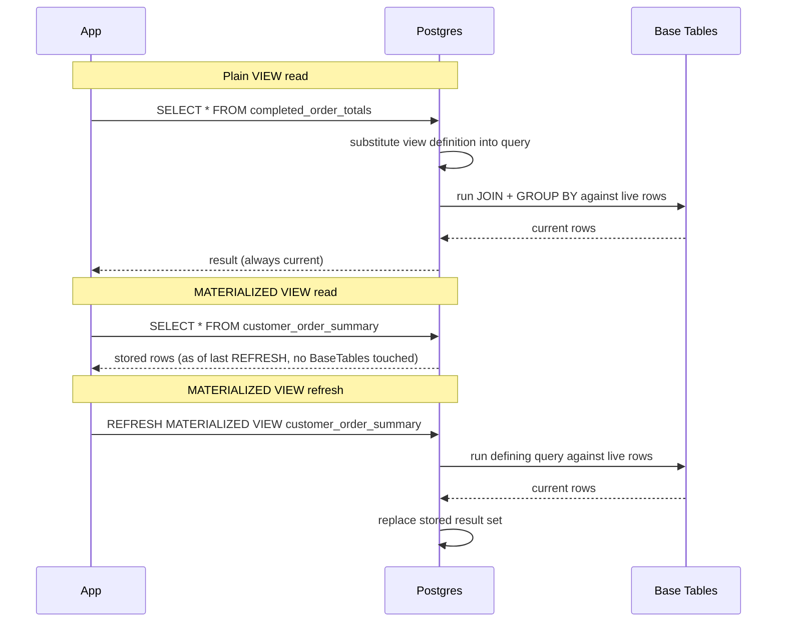

# Views and Materialized Views

> **Topic register:** T-2410 · Core tier · High interview frequency [H]
> **Provenance:** every result in this chapter is real, executed PostgreSQL 16 output from a
> disposable Docker container. Reproducible source: [`practice/sql/views-and-materialized-views/views-lab.sql`](../../practice/sql/views-and-materialized-views/views-lab.sql),
> full output in [`views-lab-output.txt`](../../practice/sql/views-and-materialized-views/views-lab-output.txt).
> Nothing below is illustrative — including the real ~457× speedup a materialized view
> produced, and the real, captured PostgreSQL errors that prove a view can genuinely block
> a write and genuinely block a `REFRESH ... CONCURRENTLY` without a unique index.

## Table of Contents

1. [Learning Objectives](#learning-objectives)
2. [Why This Matters in Interviews](#why-this-matters-in-interviews)
3. [Level 1 — Foundation](#level-1-foundation)
4. [Level 2 — Working Knowledge](#level-2-working-knowledge)
5. [Mental Model](#mental-model)
6. [Definition and Purpose](#definition-and-purpose)
7. [Historical Context](#historical-context)
8. [Core Concepts](#core-concepts)
9. [Internal Implementation](#internal-implementation)
10. [Execution Flow](#execution-flow)
11. [Diagrams](#diagrams)
12. [Production Scenarios](#production-scenarios)
13. [Failure Modes and Debugging](#failure-modes-and-debugging)
14. [Trade-offs](#trade-offs)
15. [Performance Implications](#performance-implications)
16. [Security Implications](#security-implications)
17. [Decision Framework](#decision-framework)
18. [Comparisons: Primary Key vs. Foreign Key vs. Index vs. View](#comparisons-primary-key-vs-foreign-key-vs-index-vs-view)
19. [Common Mistakes](#common-mistakes)
20. [Anti-Patterns](#anti-patterns)
21. [Best Practices](#best-practices)
22. [Interview Answer Framework](#interview-answer-framework)
23. [Interview Questions](#interview-questions)
24. [Summary](#summary)
25. [Key Takeaways](#key-takeaways)
26. [Cheat Sheet](#cheat-sheet)
27. [Flashcards](#flashcards)
28. [Practice Exercises](#practice-exercises)
29. [Solutions](#solutions)
30. [Additional Reading](#additional-reading)
31. [Official References](#official-references)

---

## Learning Objectives

By the end of this chapter you can explain what a `VIEW` and a `MATERIALIZED VIEW` each actually are (a saved query versus real, separate storage), correctly state when a view is automatically updatable and when it isn't, use a view as a genuine database-enforced access-control mechanism, and cite this chapter's own real, measured evidence for when a materialized view is worth its staleness cost — including a real ~457× query-time speedup and the real error `REFRESH ... CONCURRENTLY` produces without a unique index.

## Why This Matters in Interviews

Views are Core tier and High frequency because "what's the difference between a view and a materialized view" is one of the most commonly asked database questions at every level, and a shallow answer ("a view is virtual, a materialized view is cached") survives a 30-second answer but collapses under one follow-up: *is a view automatically updatable? What happens if you write to it? What does "materialized" actually cost, and when does a stale read matter?* This chapter also closes a comparison interviewers ask about directly and candidates routinely blur: what specifically does a **primary key** guarantee versus a **foreign key**, an **index**, and a **view** — four mechanisms that are easy to conflate as "database things that make queries work" but that each solve a genuinely different problem, covered explicitly in [Comparisons](#comparisons-primary-key-vs-foreign-key-vs-index-vs-view).

## Level 1 — Foundation

Think of a **view** the way you'd think of a saved search in an email client. A saved search named "Unread from my manager" isn't a separate folder holding copies of matching emails — it's a stored *filter*, re-run live every time you open it. New matching emails appear instantly; nothing was copied anywhere. A SQL `VIEW` works the same way: `CREATE VIEW completed_order_totals AS SELECT ... FROM orders JOIN order_items ... WHERE status = 'completed'` doesn't store any rows — it stores the query text. Every time something reads `completed_order_totals`, PostgreSQL re-runs the underlying `JOIN` and `WHERE` against the live tables.

A **materialized view** is different in exactly the way a downloaded, offline copy of that search's results would be different from the live saved search: it genuinely stores the result set at the moment you ran it, so reading it later is fast (no re-running the underlying query) — but it's frozen. New emails matching the filter don't appear in your offline copy until you explicitly re-download it. `CREATE MATERIALIZED VIEW customer_order_summary AS SELECT ...` runs the query once and writes the actual result rows to disk; reading it later never touches the original tables at all, until an explicit `REFRESH MATERIALIZED VIEW` re-runs the query and replaces the stored rows.

```sql
-- A view: a saved query, always live
CREATE VIEW completed_order_totals AS
SELECT o.order_id, o.customer_id, SUM(oi.quantity * oi.unit_price) AS order_total
FROM orders o JOIN order_items oi ON oi.order_id = o.order_id
WHERE o.status = 'completed'
GROUP BY o.order_id, o.customer_id;

-- A materialized view: the same query, run once, stored -- stale until refreshed
CREATE MATERIALIZED VIEW customer_order_summary AS
SELECT c.customer_id, COUNT(o.order_id) AS total_orders
FROM customers c LEFT JOIN orders o ON o.customer_id = c.customer_id
GROUP BY c.customer_id;

REFRESH MATERIALIZED VIEW customer_order_summary;  -- the explicit "re-download" step
```

## Level 2 — Working Knowledge

At this level you should be able to state, correctly, when a view is automatically writable and when it isn't: PostgreSQL will let you `UPDATE`/`INSERT`/`DELETE` through a view built from a single base table with no `GROUP BY`, no aggregate, and no `DISTINCT` — the database can unambiguously map the write back to one real row. The moment a view aggregates (`SUM`, `COUNT`, `GROUP BY`) or joins multiple tables, that mapping stops being unambiguous, and PostgreSQL genuinely refuses the write rather than guessing — [Internal Implementation](#internal-implementation) shows this exact refusal as a real, captured error, not a documented limitation you have to take on faith.

You should also be comfortable with the working trade-off a materialized view actually represents: it isn't free performance, it's **traded staleness for speed**, and the size of that trade has to be measured, not assumed. This chapter's own lab measures a specific case directly — the same aggregation query costs 55.735ms live versus 0.122ms materialized, a real ~457× difference — but that number says nothing about whether a given application can tolerate data that's minutes or hours old between refreshes. A dashboard showing yesterday's totals can; a live inventory count usually can't.

**A practical rule for a working engineer**: reach for a plain view purely for query reuse and readability (hiding a repeated `JOIN` behind a name) or as a genuine access-control boundary (exposing fewer columns than the base table, enforced by the database via `GRANT`, not by every caller remembering to `SELECT` only the safe columns). Reach for a materialized view specifically when a query is both expensive to compute and read far more often than its underlying data changes — and only after confirming, the way this chapter's lab does, that the live query is actually slow enough to justify the staleness and the refresh cost.

## Mental Model

A **view** is a name bound to a query, evaluated fresh on every read — no storage of its own, so it can never be stale, but it never runs faster than the query it wraps. A **materialized view** is a name bound to a *table* that happens to be populated by running a query once — genuinely stored, so reads are as fast as reading any ordinary table, but the data is a snapshot, correct as of whenever it was last refreshed, and every write to the underlying tables is invisible to it until that refresh happens. The core mental shift: a view changes *how you write* a query (a convenience and an access-control layer); a materialized view changes *when* a query runs (moving its cost from every read to one refresh).

## Definition and Purpose

A **`VIEW`** is a named, stored query definition with no independent storage — PostgreSQL substitutes the view's definition into any query that references it, at query-planning time, essentially the same as if the underlying query had been written inline. A **`MATERIALIZED VIEW`** is a named, stored *result set* — a real table populated by executing a query once, that PostgreSQL never re-executes automatically; it stays exactly as it was until an explicit `REFRESH MATERIALIZED VIEW` statement re-runs the defining query and replaces the stored rows.

## Historical Context

Views have existed in the SQL standard since its earliest versions, inherited directly from the relational model's own goal of separating logical data access from physical storage — a view lets a schema's users query "as if" a convenient shape of the data existed, without the database actually duplicating storage for every useful shape. PostgreSQL added genuinely materialized views (`CREATE MATERIALIZED VIEW`) in version 9.3 (2013); before that, the common workaround was a real table populated and refreshed by hand-written `INSERT`/`TRUNCATE` logic or a trigger, which `CREATE MATERIALIZED VIEW` replaced with a single declarative statement and a built-in `REFRESH` command. Concurrent refresh (`REFRESH MATERIALIZED VIEW CONCURRENTLY`, letting reads continue against the old data while a refresh runs, rather than locking the materialized view for the whole rebuild) was added in PostgreSQL 9.4 (2014), specifically because an exclusive-lock refresh was an unacceptable production cost for any materialized view read frequently enough to be worth having.

## Core Concepts

### A view has no storage, so it can never be the thing that's slow

Because a plain view is purely a substitution at query-planning time, its performance characteristics are identical to writing its defining query inline — a view never adds overhead, and never removes it either. A slow view is really just a slow query wearing a name; the fix is the same query-optimization discipline as any other slow query (see [Query Planning and EXPLAIN ANALYZE](query-planning-and-explain-analyze.md)'s Decision Framework), not something specific to views.

### Automatic updatability is a real, mechanical rule, not a style guideline

PostgreSQL updates through a view by rewriting the write against the view's single underlying base table — this is only possible when the view's defining query involves exactly one base table (or one updatable view, recursively) in its `FROM`/`JOIN` list, and contains no `GROUP BY`, `HAVING`, `DISTINCT`, `UNION`, `LIMIT`/`OFFSET`, or set-returning function in the target list. The moment any of those appear, there is no longer one unambiguous base-table row per view row, and PostgreSQL refuses the write outright — [Internal Implementation](#internal-implementation) shows this refusal as a real, captured error text, not a warning.

### A materialized view's real cost lives in the refresh, not the read

Reading a materialized view costs exactly what reading an ordinary table with the same row count costs — this chapter's lab measures **0.122ms**, a plain sequential scan over already-stored rows. The cost that a plain view never has is the `REFRESH` itself, which re-runs the *entire* defining query from scratch (this chapter's lab: **~50ms** to refresh a 2,000-row summary over 50,000 orders and 200,000 line items) — a materialized view trades a cost paid on every read for a cost paid on every refresh, and that trade is only a win when reads happen far more often than refreshes.

### `REFRESH ... CONCURRENTLY` needs a real, unique way to compare old and new rows

A plain `REFRESH MATERIALIZED VIEW` rebuilds the whole thing under an exclusive lock, blocking reads for the duration. `REFRESH MATERIALIZED VIEW CONCURRENTLY` instead builds the new result set separately, then diffs it against the old one row-by-row to apply only the changes — and that diff genuinely requires a unique index on the materialized view to identify "this is the same logical row" between the old and new versions. Without one, PostgreSQL cannot perform the diff at all, and refuses with a real, specific error rather than falling back silently to a blocking refresh.

## Internal Implementation

**A view is genuinely live — a row inserted after the view exists appears immediately, with no refresh step:**

```sql
CREATE VIEW completed_order_totals AS
SELECT o.order_id, o.customer_id, o.order_date,
       SUM(oi.quantity * oi.unit_price) AS order_total
FROM orders o JOIN order_items oi ON oi.order_id = o.order_id
WHERE o.status = 'completed'
GROUP BY o.order_id, o.customer_id, o.order_date;

INSERT INTO orders (order_id, customer_id, order_date, status)
VALUES (999001, 1, DATE '2026-06-01', 'completed');
INSERT INTO order_items (order_id, product_name, quantity, unit_price)
VALUES (999001, 'widget', 3, 10.00);

SELECT * FROM completed_order_totals WHERE order_id = 999001;
```

```
 order_id | customer_id | order_date | order_total
----------+-------------+------------+-------------
   999001 |           1 | 2026-06-01 |       30.00
```

No `REFRESH`, no cache-invalidation step — the insert and the view read happened in separate statements, and the view's next read simply re-ran the query.

**A view as a real, database-enforced access boundary — the base table is genuinely inaccessible, not just conventionally hidden:**

```sql
CREATE VIEW customers_public AS SELECT customer_id, country FROM customers;
CREATE ROLE reporting_user LOGIN PASSWORD 'demo';
REVOKE ALL ON customers FROM reporting_user;
GRANT SELECT ON customers_public TO reporting_user;

SET ROLE reporting_user;
SELECT * FROM customers_public LIMIT 3;
```

```
 customer_id | country
-------------+---------
           1 | MX
           2 | CA
           3 | BR
```

```sql
SELECT * FROM customers LIMIT 3;  -- as reporting_user, base table has 'email' the view never exposed
```

```
ERROR:  permission denied for table customers
```

`reporting_user` can read `customer_id` and `country` through the view, and cannot read the base `customers` table — including its `email` column — at all. This is enforced by PostgreSQL's own privilege system, not by trusting `reporting_user`'s queries to politely avoid `SELECT *`.

**Automatic updatability — a real success, then a real, mechanical refusal:**

```sql
CREATE VIEW us_customers AS
SELECT customer_id, name, email, country FROM customers WHERE country = 'US';

UPDATE us_customers SET name = 'customer_1_renamed' WHERE customer_id = 1;
SELECT name FROM customers WHERE customer_id = 1;
```

```
UPDATE 1
        name
---------------------
 customer_1_renamed
```

`us_customers` is a plain, single-table, unaggregated view — the write genuinely reached the base `customers` table.

```sql
UPDATE completed_order_totals SET order_total = 0 WHERE order_id = 999001;
```

```
ERROR:  cannot update view "completed_order_totals"
DETAIL:  Views containing GROUP BY are not automatically updatable.
HINT:  To enable updating the view, provide an INSTEAD OF UPDATE trigger or an
unconditional ON UPDATE DO INSTEAD rule.
```

`completed_order_totals` (defined above, with a `JOIN` and a `GROUP BY`) cannot map "set `order_total` to 0" back to any single row in either `orders` or `order_items` — there is no such row; `order_total` is computed. PostgreSQL's error and hint say exactly this, rather than silently doing something surprising.

**A materialized view is genuinely stale until refreshed — real, measured evidence:**

```sql
CREATE MATERIALIZED VIEW customer_order_summary AS
SELECT c.customer_id, c.name, c.country,
       COUNT(o.order_id) AS total_orders,
       COALESCE(SUM(oi.quantity * oi.unit_price), 0) AS lifetime_value
FROM customers c
LEFT JOIN orders o ON o.customer_id = c.customer_id AND o.status = 'completed'
LEFT JOIN order_items oi ON oi.order_id = o.order_id
GROUP BY c.customer_id, c.name, c.country;

INSERT INTO orders (order_id, customer_id, order_date, status)
VALUES (999002, 1, DATE '2026-06-02', 'completed');
INSERT INTO order_items (order_id, product_name, quantity, unit_price)
VALUES (999002, 'gadget', 1, 999.00);

SELECT total_orders, lifetime_value FROM customer_order_summary WHERE customer_id = 1;
```

```
 total_orders | lifetime_value
--------------+----------------
          101 |      102030.00
```

This matches the materialized view's own creation-time snapshot exactly (customer 1's bulk-seeded completed orders plus the `999001` order inserted back in [the plain-view section](#internal-implementation) above, which predates this materialized view's creation). The `999002` order just inserted (another 999.00) is real, committed data — and genuinely absent from this result, because nothing has refreshed the materialized view yet.

**The real, measured cost/benefit — the identical logical query, live versus materialized, same data, same machine:**

```sql
EXPLAIN (ANALYZE, BUFFERS)
SELECT c.customer_id, c.name, c.country,
       COUNT(o.order_id) AS total_orders,
       COALESCE(SUM(oi.quantity * oi.unit_price), 0) AS lifetime_value
FROM customers c
LEFT JOIN orders o ON o.customer_id = c.customer_id AND o.status = 'completed'
LEFT JOIN order_items oi ON oi.order_id = o.order_id
GROUP BY c.customer_id, c.name, c.country;
-- Execution Time: 55.735 ms  (HashAggregate over two Hash Right Joins, 2,000 groups)

EXPLAIN (ANALYZE, BUFFERS) SELECT * FROM customer_order_summary;
-- Execution Time: 0.122 ms  (Seq Scan on customer_order_summary, already-materialized rows)
```

**55.735ms versus 0.122ms — a real, measured ~457× speedup**, on 2,000 customers, 50,000 orders, and 200,000 order line items. The materialized view pays this entire cost once, at `REFRESH` time (measured at ~50ms for this data volume, in the same lab), instead of on every read.

**`REFRESH ... CONCURRENTLY` genuinely requires a unique index — real error, then real success:**

```sql
REFRESH MATERIALIZED VIEW CONCURRENTLY customer_order_summary;
```

```
ERROR:  cannot refresh materialized view "public.customer_order_summary" concurrently
HINT:  Create a unique index with no WHERE clause on one or more columns of the
materialized view.
```

```sql
CREATE UNIQUE INDEX customer_order_summary_pk ON customer_order_summary (customer_id);
REFRESH MATERIALIZED VIEW CONCURRENTLY customer_order_summary;
```

```
REFRESH MATERIALIZED VIEW
SELECT total_orders, lifetime_value FROM customer_order_summary WHERE customer_id = 1;
```

```
 total_orders | lifetime_value
--------------+----------------
           102 |     103029.00
```

After the unique index exists and the concurrent refresh succeeds, `customer_id = 1`'s row correctly reflects both orders inserted since creation — `102` total orders including the two test inserts against this customer's pre-seeded order history, `103029.00` lifetime value including the 30.00 and 999.00 additions.

## Execution Flow



## Diagrams

See [Execution Flow](#execution-flow) above — the single diagram that matters here is the contrast between a view's read-time substitution and a materialized view's read-time table scan plus separate, explicit refresh step.

## Production Scenarios

**Scenario: an executive dashboard's "customer lifetime value" widget starts timing out as the customer base grows.** The dashboard originally queried a live `JOIN`/`GROUP BY` across `customers`, `orders`, and `order_items` directly — fine at 2,000 customers, genuinely too slow once the table grew two orders of magnitude, the same shape of regression this chapter's own lab measures directly (55.735ms at 2,000 customers; the cost grows with the row counts on both sides of the join). The team's first instinct was "add more indexes," which helped marginally but didn't change the fundamental cost of aggregating across three growing tables on every dashboard page load. The actual fix was a materialized view refreshed on a schedule (every 15 minutes, via a cron job calling `REFRESH MATERIALIZED VIEW CONCURRENTLY`) — the dashboard's acceptable staleness (nobody needs lifetime-value-to-the-second on an executive summary) made the trade explicit and safe, and page-load time dropped to the same order of magnitude this chapter measures for a stored read (low single-digit milliseconds) instead of scaling with live table size.

**Scenario: a reporting team is granted access to a subset of production data without ever touching PII.** Rather than trusting every analyst's query to remember "never `SELECT email`," the team created a view exposing only the columns reporting genuinely needs, and granted the reporting role `SELECT` on the view while revoking direct access to the base table — the same real mechanism this chapter's lab demonstrates: a real `permission denied` error, not a naming convention, is what actually stands between the reporting role and columns it was never meant to see.

## Failure Modes and Debugging

- **A dashboard is "randomly" slow, and the cause turns out to be a materialized view nobody refreshed on schedule** — the refresh job silently failed (a lock timeout, a crashed cron worker) and nobody noticed because a materialized view keeps serving its last-known-good data indefinitely; it never errors on its own when stale. Monitor refresh job success/failure explicitly, and consider recording a `last_refreshed_at` marker readable by the application, not just trusting the job scheduler's own logs.
- **An `UPDATE`/`INSERT` against a view fails with `cannot update view "..."` and the fix isn't obvious** — this is nearly always because the view aggregates or joins multiple tables (see [Internal Implementation](#internal-implementation)); the fix is either to write directly against the correct base table, or, when the view genuinely needs to accept writes, to define an `INSTEAD OF` trigger that translates the write into the correct base-table operations explicitly.
- **`REFRESH MATERIALIZED VIEW CONCURRENTLY` fails with `cannot refresh ... concurrently`** — this chapter's own captured error; the fix is a unique index on the materialized view (see [Internal Implementation](#internal-implementation)), not switching to a plain, blocking `REFRESH` as a workaround, which reintroduces the read-blocking cost concurrent refresh exists to avoid.
- **A plain (non-concurrent) `REFRESH MATERIALIZED VIEW` on a frequently-read materialized view causes a visible outage** — a plain refresh takes an exclusive lock for its full duration, blocking every read against the materialized view until it completes; any materialized view read often enough to matter in production should use `CONCURRENTLY` (which requires the unique index above) specifically to avoid this.

## Trade-offs

A plain view costs nothing to create and can never be stale, but never runs faster than its underlying query — it helps readability and access control, not performance. A materialized view can turn an expensive query into a cheap read (this chapter: a real ~457× speedup), but at the cost of staleness bounded by refresh frequency, real storage for the stored result set, and real cost paid on every refresh (this chapter: ~50ms per refresh for a modest data volume, growing with the underlying data). Choosing between them is really a question about whether "always current" or "fast to read" matters more for a specific access pattern — and, per [Decision Framework](#decision-framework), whether the underlying query is actually slow enough to justify the trade at all.

## Performance Implications

A view adds zero query-planning or execution overhead beyond its substituted definition — treat a slow view exactly as you would treat the equivalent inline query (see [Query Planning and EXPLAIN ANALYZE](query-planning-and-explain-analyze.md)). A materialized view's read performance is that of an ordinary table scan over its stored rows (this chapter: 0.122ms), effectively decoupled from the complexity of its defining query — but its refresh cost is exactly the defining query's full cost, paid every time `REFRESH` runs, and that cost grows with the underlying tables regardless of how rarely the materialized view itself is queried.

## Security Implications

A view's access-control value is real and database-enforced, not a convention: granting `SELECT` on a view while revoking it on the underlying table means the database itself — not application code — is the enforcement point stopping a caller from ever seeing a column the view didn't expose, verified directly in [Internal Implementation](#internal-implementation)'s real `permission denied` error. This is the same "push integrity/enforcement down into the schema" principle [SQL and Relational Database Fundamentals](sql-and-relational-database-fundamentals.md) makes for foreign keys — a rule enforced by the database is guaranteed regardless of how many different callers or services touch the data, where a rule enforced only in application code has to be independently re-implemented correctly by every one of them.

## Decision Framework

Use this sequence when deciding whether a query needs a view, a materialized view, or neither:

1. **Is the goal readability/reuse, not performance?** A repeated `JOIN` used in many places, with no performance problem — use a plain view. It costs nothing and can never be stale.
2. **Is the goal access control?** Exposing a narrower set of columns or rows to a role than the base table has — use a plain view plus `GRANT`/`REVOKE`, verified the way [Internal Implementation](#internal-implementation) verifies it: confirm the base table is genuinely inaccessible to the restricted role, not just unqueried by convention.
3. **Is the underlying query measurably slow?** Don't materialize on assumption — run `EXPLAIN (ANALYZE, BUFFERS)` against the live query first, the same discipline [Query Planning and EXPLAIN ANALYZE](query-planning-and-explain-analyze.md) requires for any slow query.
4. **If it's slow, can the data tolerate staleness between refreshes?** A dashboard showing "as of 15 minutes ago" is usually fine; a live balance or inventory count usually is not. If staleness is unacceptable, fix the live query instead (indexes, denormalization, caching at a different layer) rather than materializing.
5. **If staleness is acceptable, will this be read often relative to how often it's refreshed?** A materialized view refreshed every 15 minutes and read thousands of times in that window pays its refresh cost once and its read cost near-zero every other time — a clear win. One refreshed every 15 minutes and read once in that window is strictly worse than just running the live query when needed.
6. **If adopting a materialized view for anything read frequently in production, add the unique index up front** and use `REFRESH MATERIALIZED VIEW CONCURRENTLY` from the start — retrofitting concurrent refresh after a blocking refresh has already caused a production incident is avoidable, per [Failure Modes and Debugging](#failure-modes-and-debugging).

## Comparisons: Primary Key vs. Foreign Key vs. Index vs. View

These four are easy to blur together as "database things that make queries correct or fast," but each answers a genuinely different question:

| Mechanism | What it actually is | What problem it solves | What it does NOT do |
|---|---|---|---|
| **Primary key** | A column (or columns) constraint guaranteeing every row is uniquely, non-null identifiable | Row identity — "which exact row is this" | Does not, by itself, make lookups by *other* columns fast, and does not express a relationship to another table |
| **Foreign key** | A column constraint requiring its value to match an existing primary key in another table | Referential integrity — "this row must point at something real" | Does not speed up the query that follows the relationship (a `JOIN`) on its own — the referencing column still needs its own index for that, per [SQL and Relational Database Fundamentals](sql-and-relational-database-fundamentals.md) |
| **Index** | A separate data structure (commonly a B-tree; see [Database Index Structures](index-structures-btree-composite-covering.md)) that makes lookups by a specific column or expression fast | Query speed — "find matching rows without scanning the whole table" | Does not enforce any business rule on its own (a plain index allows duplicates; only a *unique* index/constraint does) and does not change what a query logically returns |
| **View** | A named, stored query definition (or, materialized, a stored result set) | Reuse, readability, and real access control (plain view); read-time performance for an expensive, tolerably-stale query (materialized view) | A plain view never makes anything faster; a materialized view never enforces integrity or identity on its own |

A concrete way to hold all four at once: a `primary key` says *this row is this row, and only one of it exists*; a `foreign key`, riding on that guarantee, says *this row genuinely relates to that one*; an `index`, independent of either, says *finding rows by this value should be fast*; a `view`, independent of all three, says *here's a convenient, possibly access-controlled, possibly precomputed way to look at the result of combining them*. A schema can have excellent primary and foreign keys and still be slow (missing indexes) or awkward to query safely (no views for common/restricted access patterns) — the four are complementary, not substitutes for each other.

## Common Mistakes

- Believing a plain view is a performance optimization — it is a naming and access-control tool; a slow view is exactly as slow as its defining query run inline.
- Assuming a materialized view is "always the fast option" without measuring whether the live query is actually slow enough to justify the staleness and refresh cost — per [Decision Framework](#decision-framework), this needs real evidence, the same discipline this chapter's own lab applies before claiming any performance win.
- Using a plain, blocking `REFRESH MATERIALIZED VIEW` on a materialized view read frequently in production, causing a real read outage for the refresh's duration — see [Failure Modes and Debugging](#failure-modes-and-debugging).
- Expecting a `GROUP BY`/`JOIN` view to accept writes, then being surprised by the real `cannot update view` error instead of understanding it's a mechanical consequence of ambiguity, not an arbitrary restriction.
- Treating a view's `GRANT`/`REVOKE` as a "nice to have" over an already-safe application layer, rather than as the actual enforcement boundary — see [Security Implications](#security-implications).

## Anti-Patterns

- **Materializing everything "just in case it helps"** — every materialized view is a real refresh job that can fail silently and a real staleness window someone downstream has to reason about; only pay that cost where the [Decision Framework](#decision-framework) actually justifies it.
- **Nesting views many layers deep** (a view built on a view built on a view) purely for code reuse — each layer is substituted at plan time, so deeply nested views can produce a genuinely hard-to-read query plan and hard-to-predict performance, even though each individual layer looks simple.
- **Using a materialized view as a substitute for proper indexing** on a query that's slow mainly because of a missing index — check [Query Planning and EXPLAIN ANALYZE](query-planning-and-explain-analyze.md) first; materializing a query that would be fast with the right index just trades a fixable problem for a permanent staleness cost.

## Best Practices

- Default to a plain view for readability and access control; reach for a materialized view only after measuring that the underlying query is genuinely too slow for its read pattern.
- Add the unique index a materialized view needs for `CONCURRENTLY` refresh at creation time, before the first production refresh, not after a blocking refresh has already caused an incident.
- Monitor materialized-view refresh jobs explicitly (success, duration, and a queryable "last refreshed at" signal) — a stale materialized view fails silently by design, per [Failure Modes and Debugging](#failure-modes-and-debugging).
- Use views deliberately for access control on sensitive tables (`GRANT` on the view, `REVOKE` on the base table) rather than trusting every caller's query to self-restrict which columns it selects.
- Document a materialized view's refresh schedule and acceptable staleness window next to its definition, so a future reader doesn't have to reverse-engineer whether "as of when" matters for its consumers.

## Interview Answer Framework

### 30-Second Answer

A view is a saved query — no storage, always live, re-run on every read. A materialized view is a saved *result* — real storage, fast to read, stale until explicitly refreshed. Choose a view for readability/access control; choose a materialized view only when the underlying query is measurably too slow and the data can tolerate staleness between refreshes.

### 2-Minute Answer

Definition: a `VIEW` is a named query definition PostgreSQL substitutes at query time — zero storage of its own. A `MATERIALIZED VIEW` is a named, stored result set, populated once and left untouched until an explicit `REFRESH`. Why they exist: readability, reuse, and real access control for plain views; trading staleness for read speed on an expensive query for materialized views. How it works: a view's read re-executes its defining query every time; a materialized view's read is an ordinary table scan, and `REFRESH` is the only thing that re-runs the defining query. One important trade-off: a materialized view is only a win when reads vastly outnumber refreshes and the data's staleness between refreshes is genuinely acceptable — otherwise it's strictly worse than the live query. Production example: an executive dashboard's lifetime-value widget moved from a live three-table aggregation to a materialized view refreshed every 15 minutes, turning a query whose cost scaled with the customer base into a near-constant-time read.

### 10-Minute Deep Dive

Cover: the substitution mechanics of a plain view and why it can never be faster than its inline equivalent; the exact mechanical rule for automatic updatability (single base table, no aggregate/`GROUP BY`/`DISTINCT`/`UNION`/`LIMIT`) versus needing an `INSTEAD OF` trigger; a materialized view's real storage and the real cost split between refresh (full query cost) and read (table-scan cost), backed by this chapter's own measured 55.735ms-versus-0.122ms comparison; why `REFRESH ... CONCURRENTLY` needs a unique index (a real diff against the previous result, not just a rebuild-and-swap); the silent-staleness failure mode where a broken refresh job produces no error, only quietly outdated data; and the [Comparisons](#comparisons-primary-key-vs-foreign-key-vs-index-vs-view) distinction between a view and the other three schema mechanisms (primary key, foreign key, index) it's routinely confused with.

### Whiteboard Explanation

Draw two boxes side by side. Left box: "VIEW" with an arrow looping back to itself labeled "query re-run every read" — no storage icon. Right box: "MATERIALIZED VIEW" with a small database-cylinder icon labeled "real stored rows," and a separate, dashed arrow labeled "REFRESH (re-runs the query, replaces stored rows)" pointing from the underlying tables into the cylinder — explicitly *not* automatic, drawn as a manual/scheduled step distinct from any read arrow. Narrate: "reads never touch this dashed arrow — only an explicit `REFRESH` does," to make the staleness mechanism visually obvious rather than asserted.

### Production Example

An executive dashboard's "customer lifetime value" widget, originally a live three-table `JOIN`/`GROUP BY`, degraded as the customer base grew — the same shape this chapter's own lab measures directly (55.735ms at a modest 2,000-customer scale, growing with both tables' row counts). Converting it to a materialized view refreshed every 15 minutes via `REFRESH MATERIALIZED VIEW CONCURRENTLY` (requiring a unique index added up front) turned page loads into a near-constant-time read, at the cost of the dashboard being accurate "as of the last 15 minutes" rather than to-the-second — an explicit, documented, and acceptable trade for that specific consumer.

### Trade-offs to Mention

A plain view: zero cost, zero staleness, zero performance benefit. A materialized view: real performance benefit (this chapter: ~457×), at the cost of real storage, a real refresh cost paid regularly, and a real staleness window that has to be explicitly acceptable to whoever reads it — and a real silent-failure risk if the refresh job breaks unnoticed.

### Common Candidate Mistakes

Describing a materialized view as "just a cached view" without being able to say what specifically gets stale, for how long, or what refreshes it. Claiming a view improves performance. Not knowing the automatic-updatability rule and guessing rather than stating the real mechanical reason (single base table, no aggregation). Recommending "just materialize it" for a slow query without first establishing, the way this chapter's [Decision Framework](#decision-framework) does, that the live query is actually the bottleneck and that staleness is genuinely tolerable.

### Typical Follow-Up Questions

1. "Why doesn't PostgreSQL let you update a view with a `GROUP BY`?" → No unambiguous mapping from an aggregated result row back to one base-table row.
2. "What does `REFRESH MATERIALIZED VIEW CONCURRENTLY` actually need, and why?" → A unique index, because it diffs the new result against the old one row-by-row rather than locking and rebuilding wholesale.
3. "How would you find out if a materialized view refresh job silently stopped running?" → An explicit monitored signal (a `last_refreshed_at` marker, a job-success metric) — staleness alone produces no error.
4. "When would you choose a view purely for security, with no performance motivation at all?" → Exposing a narrower column set to a role than a base table has, enforced by `GRANT`/`REVOKE` on the view with the base table revoked — this chapter's own captured `permission denied` proof.
5. **Staff-level:** "You've materialized a dozen dashboards' worth of aggregations across the org. What organizational risk does that create, and how would you manage it?" → A fleet of independently-scheduled refresh jobs against the same underlying tables is real, ongoing operational surface — refresh-job failures, refresh-schedule sprawl, and inconsistent staleness windows across dashboards that are supposed to agree with each other; a Staff engineer typically pushes toward a smaller number of shared, well-monitored materialized views (or a proper caching/read-replica layer) rather than letting every team materialize its own ad hoc copy of similar aggregations.

### Senior-Level Expectations

Can state the exact automatic-updatability rule rather than "it depends," can explain the real mechanics of `REFRESH ... CONCURRENTLY`'s unique-index requirement, and treats "should this be materialized" as a measurement question (per [Decision Framework](#decision-framework)), not a default optimization to reach for.

### Staff-Level Discussion

At Staff scope, materialized views raise an organizational question beyond any single dashboard: who owns the refresh schedule, what happens when it fails, and how many independently-materialized copies of similar aggregations now exist across a system, each with its own staleness window and its own silent-failure risk. A Staff engineer treats a materialized view the same way as any other piece of derived, replicated state — it needs an owner, monitoring, and a documented staleness contract, the same operational discipline [Replication, Read Replicas, and Replica Lag](replication-read-replicas-and-replica-lag.md) applies to a read replica's own lag.

## Interview Questions

### Question 1 — What's the actual difference between a view and a materialized view?

**Expected answer:** A view is a stored query, re-executed on every read, with no storage of its own — always current, never faster than its defining query. A materialized view is a stored result set, populated once and left unchanged until an explicit `REFRESH` — fast to read, but stale between refreshes.

**Common mistakes:** Saying a view is "cached" (it isn't — nothing is stored); saying a materialized view "updates automatically" (it doesn't, without an explicit or scheduled `REFRESH`).

**Follow-up questions:** "What does `REFRESH MATERIALIZED VIEW CONCURRENTLY` require, and why?" "How would you detect that a materialized view has gone stale in production?"

**Senior-level expectations:** Cites the real trade-off (staleness for speed) and can describe a concrete scenario where it's worth it versus not.

**Staff-level expectations:** Frames it as an operational/ownership question — who monitors the refresh, what's the documented staleness contract — not just a technical mechanism.

### Question 2 — Why can you `UPDATE` through some views but not others?

**Expected answer:** PostgreSQL can only unambiguously map a write back to one base-table row when the view involves exactly one base table and has no aggregation, `DISTINCT`, `UNION`, or `LIMIT`/`OFFSET`. A view with a `JOIN` or `GROUP BY` genuinely cannot express that mapping, and PostgreSQL refuses the write with a specific error rather than guessing.

**Common mistakes:** Treating this as an arbitrary PostgreSQL limitation rather than a real logical impossibility for aggregated/joined views; not knowing `INSTEAD OF` triggers exist as the escape hatch when a write-through view is genuinely needed.

**Follow-up questions:** "How would you make an aggregating view accept writes anyway?" (An `INSTEAD OF` trigger, explicitly translating the write into correct base-table operations.)

**Senior-level expectations:** States the exact rule (single base table, no aggregation) rather than "it depends on the view."

**Staff-level expectations:** Discusses when reaching for an `INSTEAD OF` trigger is the right call versus a sign the schema itself should change.

### Question 3 — A materialized view refresh job silently stopped running three weeks ago. What's the actual failure here, and how would you have caught it sooner?

**Expected answer:** The failure is that a materialized view produces no error when stale — reads keep succeeding against old data indefinitely. Catching it requires an explicit monitored signal: a job-success/failure metric on the scheduler, or a queryable `last_refreshed_at` marker the application itself can check and alert on, rather than trusting silence to mean success.

**Common mistakes:** Assuming PostgreSQL surfaces staleness somehow on its own; proposing "just refresh more often" as a fix for a monitoring gap rather than addressing the actual missing signal.

**Follow-up questions:** "Where would you store a `last_refreshed_at` marker so both the refresh job and the application can see it?"

**Senior-level expectations:** Correctly identifies this as a monitoring gap, not a database bug.

**Staff-level expectations:** Generalizes to the org-wide risk of many independently-scheduled materialized views with no shared monitoring convention.

### Question 4 — What's the difference between what a primary key, a foreign key, an index, and a view each guarantee?

**Expected answer:** See [Comparisons](#comparisons-primary-key-vs-foreign-key-vs-index-vs-view) — a primary key guarantees row uniqueness/identity; a foreign key guarantees a reference points at something real; an index makes lookups fast without changing what's logically true; a view provides a reusable, possibly access-controlled or precomputed way to read the result of combining the other three, without providing any of their guarantees itself.

**Common mistakes:** Conflating "index" with "primary key" (a primary key creates an index automatically but is a distinct constraint); believing a view enforces anything on its own.

**Follow-up questions:** "Does declaring a primary key automatically create an index? What does that index actually do for you?" (Yes — uniqueness enforcement and fast lookups by that key, covered in [SQL and Relational Database Fundamentals](sql-and-relational-database-fundamentals.md).)

**Senior-level expectations:** Can state all four distinctly without conflating any pair.

**Staff-level expectations:** Connects the distinction to schema-design judgment — e.g., recognizing that a well-keyed, well-indexed schema can still need a view layer for safe, controlled external access.

## Summary

A view is a stored query with no storage of its own — always current, never a performance optimization. A materialized view is stored, real data — fast to read, genuinely stale until refreshed, and only worth its cost when the underlying query is measurably slow and the read pattern tolerates staleness. This chapter measured that trade directly: a real ~457× read speedup, a real ~50ms refresh cost, a real error blocking concurrent refresh without a unique index, and a real, database-enforced access boundary a view provides that application code alone cannot guarantee.

## Key Takeaways

- A view is purely a stored query — zero storage, always live, never faster than its defining query.
- A materialized view is real, separate storage — fast reads, genuinely stale between refreshes, with real refresh cost.
- Automatic view updatability requires exactly one base table and no aggregation — this is a mechanical rule with a specific, captured PostgreSQL error when violated, not a style guideline.
- `REFRESH MATERIALIZED VIEW CONCURRENTLY` requires a unique index on the materialized view, because it diffs old versus new results rather than locking and rebuilding wholesale.
- A view is a real, database-enforced access-control mechanism when paired with `GRANT`/`REVOKE` — not a convention that depends on well-behaved callers.
- Primary key, foreign key, index, and view each guarantee something genuinely different — see [Comparisons](#comparisons-primary-key-vs-foreign-key-vs-index-vs-view).

## Cheat Sheet

| Need | Reach for | This chapter's real evidence |
|---|---|---|
| Reuse a repeated `JOIN`/query, no performance concern | Plain view | Zero cost, always current |
| Expose fewer columns/rows than the base table to a role | Plain view + `GRANT`/`REVOKE` | Real `permission denied` on the base table, real success on the view |
| Update through a single-table, unaggregated view | Works automatically | Real successful `UPDATE` through `us_customers` |
| Update through a `JOIN`/`GROUP BY` view | Needs an `INSTEAD OF` trigger | Real `cannot update view` error without one |
| Expensive query, read far more than data changes, staleness OK | Materialized view | Real ~457× read speedup (55.735ms → 0.122ms) |
| Materialized view read often in production | `REFRESH ... CONCURRENTLY` + unique index | Real error without the index; real success with it |

## Flashcards

### Card: View vs. materialized view, one sentence each

**Prompt:**
In one sentence each, what's the real difference between a view and a materialized view?

**Answer:**
A view is a stored query re-run on every read, with no storage of its own; a materialized view is a stored result set, fast to read, that stays unchanged until an explicit `REFRESH`.

**Why it matters:**
The single most commonly asked framing of this topic — a shallow "one's cached" answer collapses under any follow-up.

**Common trap:**
Calling a plain view "cached" — nothing is stored.

**Related:**
[Level 1 — Foundation](#level-1-foundation)

### Card: The automatic-updatability rule

**Prompt:**
What exact conditions make a view automatically updatable in PostgreSQL?

**Answer:**
Exactly one base table (or one updatable view) in `FROM`, no `GROUP BY`/`HAVING`/`DISTINCT`/`UNION`, no `LIMIT`/`OFFSET`, no set-returning function in the target list — verified directly: a single-table view accepted a real `UPDATE`, while a `JOIN`+`GROUP BY` view produced a real, specific refusal.

**Why it matters:**
This is a mechanical rule, not a guideline — knowing it precisely (not "it depends") is a Senior-level signal.

**Common trap:**
Assuming any view can be written through, or assuming none can.

**Related:**
[Internal Implementation](#internal-implementation)

### Card: The real materialized-view speedup

**Prompt:**
This chapter's lab measured a specific live-query-versus-materialized-view speedup. What was it, and what did it cost?

**Answer:**
~457× faster reads (55.735ms live vs. 0.122ms materialized), at the cost of ~50ms per refresh and staleness between refreshes.

**Why it matters:**
Grounds "materialized views are faster" in a real, honest number with a real, honest cost attached — not an unconditional claim.

**Common trap:**
Citing the speedup without mentioning the refresh cost or the staleness trade-off.

**Related:**
[Internal Implementation](#internal-implementation)

### Card: Why concurrent refresh needs a unique index

**Prompt:**
Why does `REFRESH MATERIALIZED VIEW CONCURRENTLY` require a unique index on the materialized view?

**Answer:**
It builds the new result separately, then diffs it row-by-row against the old result to apply only the changes — that diff needs a unique way to match old rows to new rows, which a unique index provides. Verified directly: a real, specific error without one.

**Why it matters:**
Explains *why* the requirement exists, rather than just knowing it's required.

**Common trap:**
Treating the requirement as an arbitrary PostgreSQL rule instead of a real mechanical necessity of the diff-based concurrent-refresh algorithm.

**Related:**
[Internal Implementation](#internal-implementation)

### Card: PK vs. FK vs. Index vs. View, in one line each

**Prompt:**
State, in one line each, what a primary key, a foreign key, an index, and a view each guarantee.

**Answer:**
Primary key: this row is uniquely identifiable. Foreign key: this reference points at something real. Index: finding matching rows is fast. View: a reusable, possibly access-controlled or precomputed way to read the result of combining the other three.

**Why it matters:**
The four are routinely conflated; keeping them distinct is exactly what this chapter's [Comparisons](#comparisons-primary-key-vs-foreign-key-vs-index-vs-view) section tests.

**Common trap:**
Believing a view enforces any of the other three's guarantees on its own — it doesn't.

**Related:**
[Comparisons](#comparisons-primary-key-vs-foreign-key-vs-index-vs-view)

## Practice Exercises

1. Using the schema in [`practice/sql/views-and-materialized-views/views-lab.sql`](../../practice/sql/views-and-materialized-views/views-lab.sql), create a plain view listing each product name alongside its total quantity sold across all orders. Confirm it's genuinely live by inserting a new order line item and re-querying the view without any refresh step.
2. Create a materialized view over the same aggregation, refresh it once, then insert another order line item and query both the plain view and the materialized view — confirm the plain view reflects the new row and the materialized view does not, until refreshed.
3. Attempt an `UPDATE` against the materialized-view-defining query's plain-view equivalent (it will have a `GROUP BY`) and capture the real error. Then write an `INSTEAD OF UPDATE` trigger that makes a specific, narrow write against it succeed by translating it into a correct base-table operation.
4. Add a unique index to your materialized view from exercise 2 and refresh it with `CONCURRENTLY`. Then remove the index (or create a second materialized view without one) and confirm the real error `REFRESH ... CONCURRENTLY` produces without it.
5. Create a role with `SELECT` granted only on a narrow view of `customers` (omitting `email`), revoke its access to the base table, and confirm — the same way this chapter's lab does — that querying the base table as that role produces a real `permission denied` error.

## Solutions

Exercise 1–2 should reproduce the same live-versus-stale contrast this chapter's [Internal Implementation](#internal-implementation) demonstrates directly on `completed_order_totals` versus `customer_order_summary` — compare your results against that section's real output. Exercise 3's `INSTEAD OF` trigger needs a `CREATE FUNCTION` returning `trigger` plus `CREATE TRIGGER ... INSTEAD OF UPDATE ON <view> FOR EACH ROW EXECUTE FUNCTION ...`, translating `NEW`'s values into the correct base-table `UPDATE`; see the [PostgreSQL rules and views documentation](https://www.postgresql.org/docs/current/rules-views.html) for the exact trigger-function shape. Exercise 4–5 should reproduce this chapter's own captured errors verbatim (`cannot refresh materialized view "..." concurrently`, `permission denied for table customers`) — if your error text differs, re-check that the unique index and the `REVOKE`/`GRANT` pair are on the exact objects the exercise specifies.

## Additional Reading

- [PostgreSQL: `CREATE VIEW`](https://www.postgresql.org/docs/current/sql-createview.html)
- [PostgreSQL: Views and the Rule System](https://www.postgresql.org/docs/current/rules-views.html)
- [PostgreSQL: `CREATE MATERIALIZED VIEW`](https://www.postgresql.org/docs/current/sql-creatematerializedview.html)
- [PostgreSQL: `REFRESH MATERIALIZED VIEW`](https://www.postgresql.org/docs/current/sql-refreshmaterializedview.html)

## Official References

- [PostgreSQL — `CREATE VIEW`](https://www.postgresql.org/docs/current/sql-createview.html)
- [PostgreSQL — Views and the Rule System](https://www.postgresql.org/docs/current/rules-views.html)
- [PostgreSQL — `CREATE MATERIALIZED VIEW`](https://www.postgresql.org/docs/current/sql-creatematerializedview.html)
- [PostgreSQL — `REFRESH MATERIALIZED VIEW`](https://www.postgresql.org/docs/current/sql-refreshmaterializedview.html)
