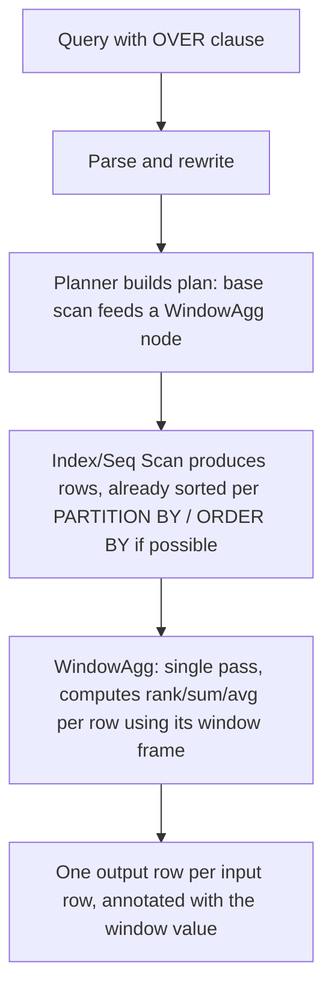
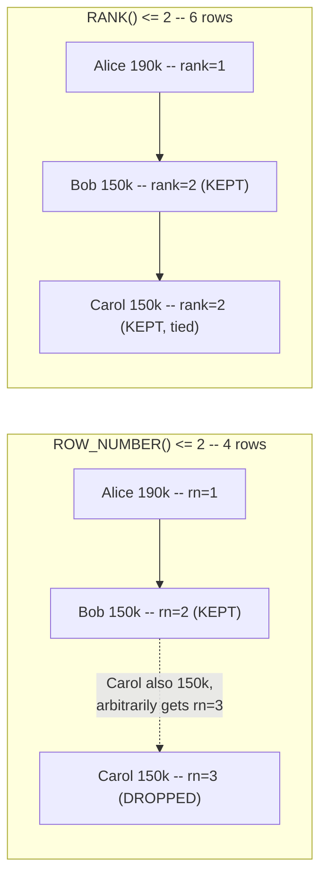

# Window Functions and Common Table Expressions

> **Topic register:** T-617 · IWI 6.4 · Core tier · Very High interview frequency [H]
> **Provenance:** every result in this chapter is real, executed PostgreSQL 16 output from a
> disposable Docker container. Reproducible source: [`practice/sql/window-functions-and-ctes/window-functions-lab.sql`](../../practice/sql/window-functions-and-ctes/window-functions-lab.sql),
> full output in [`window-functions-lab-output.txt`](../../practice/sql/window-functions-and-ctes/window-functions-lab-output.txt).
> Nothing below is illustrative, including the ~4,957× real, measured speedup of a window-function
> approach over a logically equivalent correlated subquery.

## Table of Contents

1. [Learning Objectives](#learning-objectives)
2. [Why This Matters in Interviews](#why-this-matters-in-interviews)
3. [Level 1 — Foundation](#level-1--foundation)
4. [Level 2 — Working Knowledge](#level-2--working-knowledge)
5. [Mental Model](#mental-model)
6. [Definition and Purpose](#definition-and-purpose)
7. [Historical Context](#historical-context)
8. [Core Concepts](#core-concepts)
9. [Internal Implementation](#internal-implementation)
10. [Execution Flow](#execution-flow)
11. [Diagrams](#diagrams)
12. [Java Examples](#java-examples)
13. [Production Scenarios](#production-scenarios)
14. [Failure Modes and Debugging](#failure-modes-and-debugging)
15. [Trade-offs](#trade-offs)
16. [Performance Implications](#performance-implications)
17. [Memory Implications](#memory-implications)
18. [Concurrency Implications](#concurrency-implications)
19. [Security Implications](#security-implications)
20. [Decision Framework](#decision-framework)
21. [Comparisons](#comparisons)
22. [Common Mistakes](#common-mistakes)
23. [Anti-Patterns](#anti-patterns)
24. [Best Practices](#best-practices)
25. [Interview Answer Framework](#interview-answer-framework)
26. [Interview Questions](#interview-questions)
27. [Summary](#summary)
28. [Key Takeaways](#key-takeaways)
29. [Cheat Sheet](#cheat-sheet)
30. [Flashcards](#flashcards)
31. [Practice Exercises](#practice-exercises)
32. [Solutions](#solutions)
33. [Additional Reading](#additional-reading)
34. [Official References](#official-references)

---

## Learning Objectives

By the end of this chapter you can correctly choose between `ROW_NUMBER()`, `RANK()`, and `DENSE_RANK()` for a given tie-handling requirement, write a `PARTITION BY`-based "top N per group" query and a running-total/moving-average query, write a recursive CTE for hierarchical data, and cite real, measured `EXPLAIN ANALYZE` evidence of a window function beating a logically equivalent correlated subquery by roughly three orders of magnitude on a 200,000-row table.

## Why This Matters in Interviews

Window functions and CTEs are Core tier and Very High frequency because "find the top N rows per group," "compute a running total," and "traverse a hierarchy" are among the most common real-world SQL tasks, and because a candidate who doesn't know window functions will reach for a correlated subquery or a self-join instead — code that's not just harder to read, but, as this chapter measures directly, can be **orders of magnitude slower** on realistic data volumes. Interviewers use this topic to check whether a candidate's SQL vocabulary extends past basic joins and aggregates into the tools that separate "can write a query that returns the right answer" from "can write a query that returns the right answer efficiently."

## Level 1 — Foundation

**A window function computes a value across a set of rows related to the current row — without collapsing those rows into one, the way `GROUP BY` does.** `SELECT name, salary, AVG(salary) OVER () FROM employees` returns *every* employee row, each one now also showing the company-wide average salary alongside it — compare this to `SELECT AVG(salary) FROM employees`, which collapses everything into a single row. `PARTITION BY` restricts the "window" to a subset — `AVG(salary) OVER (PARTITION BY department)` shows each employee their own department's average, not the company-wide one.

```sql
SELECT name, department, salary,
       ROW_NUMBER() OVER (PARTITION BY department ORDER BY salary DESC) AS rank_in_dept
FROM employees;
```

**A Common Table Expression (CTE)**, written with `WITH name AS (...)`, is a named, reusable subquery — mainly a readability tool for breaking a complex query into named steps. A **recursive CTE** (`WITH RECURSIVE`) is a distinct, more powerful capability: a CTE that references *itself*, letting a single query walk an arbitrary-depth hierarchy (an org chart, a category tree, a bill-of-materials) that a non-recursive query cannot traverse at all without knowing the depth in advance.

## Level 2 — Working Knowledge

At this level you should be able to state, precisely, the real behavioral difference between `ROW_NUMBER()`, `RANK()`, and `DENSE_RANK()` when there's a genuine tie: `ROW_NUMBER()` always assigns strictly increasing, unique numbers (`1, 2, 3, 4...`), arbitrarily breaking any tie; `RANK()` gives tied rows the *same* rank, then *skips* the next rank number by the count of ties (`1, 2, 2, 4...`); `DENSE_RANK()` gives tied rows the same rank *without* skipping (`1, 2, 2, 3...`). This isn't a cosmetic difference — [Internal Implementation](#internal-implementation) demonstrates a real case where a "top 2 per department" query returns a **different set of rows entirely** depending on which of `ROW_NUMBER()` or `RANK()` is used, because they disagree about what "top 2" means when two employees are tied for second place.

You should also be comfortable with the working habit of reaching for `PARTITION BY ... ROW_NUMBER()` (wrapped in an outer `WHERE rn <= N`) as the default tool for "top N per group" — never a correlated subquery counting how many rows outrank the current one, which [Internal Implementation](#internal-implementation) measures as dramatically slower at realistic scale. And for hierarchical data (anything with a self-referencing `parent_id`/`manager_id` column), the working habit is reaching for `WITH RECURSIVE` rather than a fixed number of self-joins that silently breaks the moment the hierarchy grows one level deeper than anticipated.

**A practical rule for a working engineer**: any time a requirement contains the phrase "top N per X," "running total," "moving average," or "rank within," that's a window-function-shaped problem — write it with `OVER (PARTITION BY ... ORDER BY ...)` directly rather than a correlated subquery or an application-side loop over query results.

## Mental Model

Think of a window function as **a calculator that rides alongside each row, seeing a defined "window" of related rows without merging them together.** `GROUP BY` is a woodchipper — rows go in, one summarized row per group comes out, and the original rows are gone. A window function is a clipboard — every original row survives, but each one now also has a computed value (a rank, a running total, a group average) written on it, computed by looking at a defined neighborhood of related rows (`PARTITION BY` narrows *which* rows count as related; `ORDER BY` within the window clause, when present, defines a running/cumulative neighborhood rather than the whole partition at once).

For recursive CTEs, think of it as **explicitly teaching the database two things: what a "starting point" looks like, and how to find the next step from any given step** — the database then repeatedly applies the second rule to its own growing result set until no new rows are produced, exactly the way a `while` loop in application code would walk a tree, except expressed as a single declarative query.

## Definition and Purpose

A **window function** performs a calculation across a set of table rows related to the current row (its "window," defined by an `OVER (...)` clause with optional `PARTITION BY` and `ORDER BY`), returning one value per input row without collapsing rows the way an aggregate with `GROUP BY` does. A **Common Table Expression (CTE)**, declared with `WITH name AS (subquery)`, is a named, referenceable result set scoped to a single query, primarily for readability and reuse within that query. A **recursive CTE** (`WITH RECURSIVE`) additionally allows the named result set to reference itself, enabling traversal of arbitrarily deep hierarchical or graph-shaped data in a single declarative query rather than requiring a fixed number of self-joins or application-side iteration.

## Historical Context

Window functions were introduced to the SQL standard in SQL:2003 and added to PostgreSQL in version 8.4 (2009); recursive CTEs (`WITH RECURSIVE`) were also standardized in SQL:1999/SQL:2003 and added to PostgreSQL 8.4 alongside them. Both capabilities exist specifically to close a real, longstanding gap in standard SQL: prior to their availability, "top N per group" required a correlated subquery or self-join (both of which this chapter measures as real, dramatically slower alternatives at scale), and hierarchical traversal required either a fixed-depth chain of self-joins (silently wrong the moment the hierarchy grows deeper than anticipated) or moving the traversal logic out of SQL entirely into application code.

## Core Concepts

### Window functions don't collapse rows — this is the entire distinction from GROUP BY

`GROUP BY` and an aggregate function (`AVG`, `SUM`, `COUNT`) produce exactly one output row per distinct group, discarding the individual input rows. A window function (`AVG(...) OVER (...)`), even using the identical aggregate function name, produces one output row *per input row*, each annotated with a value computed from its window. This is why window functions can appear in the `SELECT` list alongside ordinary, non-aggregated columns without needing every one of those columns in a `GROUP BY` clause — a common early confusion for engineers who've only used aggregate functions with `GROUP BY` before.

### ROW_NUMBER, RANK, and DENSE_RANK diverge specifically on ties, and the divergence changes real query results

All three assign a position within an ordered window, and all three agree when there are no ties. The moment two rows tie on the `ORDER BY` expression, they diverge: `ROW_NUMBER()` still assigns them different, consecutive numbers (the tie-break is arbitrary and not guaranteed stable without a fully deterministic `ORDER BY`); `RANK()` gives them the same number and skips the next one; `DENSE_RANK()` gives them the same number without skipping. [Internal Implementation](#internal-implementation) demonstrates this producing a genuinely different row *set* for "top 2 per department" depending on which function is used — not merely a different number in one column.

### Recursive CTEs execute as a real, repeated UNION, not "magic" traversal

A recursive CTE has two parts joined by `UNION ALL`: a non-recursive "anchor" (the starting rows) and a recursive term that references the CTE's own name, joining it back to the base table to find "the next step." PostgreSQL executes this by repeatedly evaluating the recursive term against only the rows produced in the *previous* iteration, accumulating results, until an iteration produces zero new rows. This is a real, bounded, terminating process for any acyclic hierarchy (like an org chart with no reporting cycles) — [Internal Implementation](#internal-implementation) shows exactly this happening for a real 3-level-deep org chart.

## Internal Implementation

**Real `ROW_NUMBER()` vs. `RANK()` vs. `DENSE_RANK()`, with genuine salary ties** (Bob and Carol both earn $150,000 in Engineering; Grace and Heidi both earn $140,000 in Sales):

```sql
SELECT name, department, salary,
       ROW_NUMBER() OVER (PARTITION BY department ORDER BY salary DESC) AS row_num,
       RANK()       OVER (PARTITION BY department ORDER BY salary DESC) AS rank,
       DENSE_RANK() OVER (PARTITION BY department ORDER BY salary DESC) AS dense_rank
FROM employees ORDER BY department, salary DESC;
```

```
 name  | department  | salary | row_num | rank | dense_rank 
-------+-------------+--------+---------+------+------------
 Alice | Engineering | 190000 |       1 |    1 |          1
 Bob   | Engineering | 150000 |       2 |    2 |          2
 Carol | Engineering | 150000 |       3 |    2 |          2
 Dave  | Engineering | 130000 |       4 |    4 |          3
 Erin  | Engineering | 120000 |       5 |    5 |          4
 Frank | Sales       | 160000 |       1 |    1 |          1
 Grace | Sales       | 140000 |       2 |    2 |          2
 Heidi | Sales       | 140000 |       3 |    2 |          2
 Ivan  | Sales       | 110000 |       4 |    4 |          3
```

Bob and Carol, tied at $150,000, get `row_num` 2 and 3 (arbitrary tie-break) but `rank` 2 and 2 (tied) — and Dave, the *next distinct* salary, gets `rank` 4 (skipping 3, since two rows occupied rank 2) but `dense_rank` 3 (no skip).

**Real, direct evidence this divergence changes which rows a "top 2 per department" query returns:**

```sql
-- via ROW_NUMBER()
SELECT name, department, salary FROM (
  SELECT name, department, salary,
         ROW_NUMBER() OVER (PARTITION BY department ORDER BY salary DESC) AS rn
  FROM employees) ranked WHERE rn <= 2 ORDER BY department, salary DESC;
```

```
 name  | department  | salary 
-------+-------------+--------
 Alice | Engineering | 190000
 Bob   | Engineering | 150000
 Frank | Sales       | 160000
 Grace | Sales       | 140000
(4 rows)
```

```sql
-- via RANK() -- SAME cutoff (<= 2), DIFFERENT result set
SELECT name, department, salary FROM (
  SELECT name, department, salary,
         RANK() OVER (PARTITION BY department ORDER BY salary DESC) AS rnk
  FROM employees) ranked WHERE rnk <= 2 ORDER BY department, salary DESC;
```

```
 name  | department  | salary 
-------+-------------+--------
 Alice | Engineering | 190000
 Bob   | Engineering | 150000
 Carol | Engineering | 150000
 Frank | Sales       | 160000
 Grace | Sales       | 140000
 Heidi | Sales       | 140000
(6 rows)
```

**4 rows versus 6 rows, from the identical data and the identical `<= 2` cutoff.** `ROW_NUMBER()` arbitrarily picked one of Bob/Carol (and one of Grace/Heidi) to exclude; `RANK()` correctly included both tied rows at the cutoff, since they genuinely share "2nd place." Which behavior is *correct* depends entirely on the actual business requirement ("give me exactly 2 rows per department" versus "give me everyone in the top 2 salary tiers") — this chapter's point is that the choice is consequential and must be made deliberately, not defaulted to whichever function is more familiar.

**Real running total and 3-day moving average:**

```sql
SELECT day, amount_usd,
       SUM(amount_usd) OVER (ORDER BY day ROWS BETWEEN UNBOUNDED PRECEDING AND CURRENT ROW) AS running_total,
       ROUND(AVG(amount_usd) OVER (ORDER BY day ROWS BETWEEN 2 PRECEDING AND CURRENT ROW), 2) AS moving_avg_3day
FROM daily_sales ORDER BY day;
```

```
    day     | amount_usd | running_total | moving_avg_3day 
------------+------------+---------------+-----------------
 2026-01-01 |       1000 |          1000 |         1000.00
 2026-01-02 |       1500 |          2500 |         1250.00
 2026-01-03 |        900 |          3400 |         1133.33
 2026-01-04 |       2000 |          5400 |         1466.67
 2026-01-05 |       1200 |          6600 |         1366.67
 2026-01-06 |       1800 |          8400 |         1666.67
 2026-01-07 |       2200 |         10600 |         1733.33
```

`ROWS BETWEEN UNBOUNDED PRECEDING AND CURRENT ROW` defines a growing window from the very first row through the current one (a running total); `ROWS BETWEEN 2 PRECEDING AND CURRENT ROW` defines a sliding 3-row window (the current row plus the two before it) — the same `OVER (ORDER BY ...)` structure, differing only in the frame boundary, producing two genuinely different real computations from one query.

**Real recursive CTE: full org chart under Alice, with computed depth and path:**

```sql
WITH RECURSIVE org_chart AS (
    SELECT id, name, manager_id, 0 AS depth, name::text AS path
    FROM employees WHERE name = 'Alice'
  UNION ALL
    SELECT e.id, e.name, e.manager_id, oc.depth + 1, oc.path || ' -> ' || e.name
    FROM employees e JOIN org_chart oc ON e.manager_id = oc.id
)
SELECT name, depth, path FROM org_chart ORDER BY depth, name;
```

```
 name  | depth |         path         
-------+-------+----------------------
 Alice |     0 | Alice
 Bob   |     1 | Alice -> Bob
 Carol |     1 | Alice -> Carol
 Dave  |     2 | Alice -> Bob -> Dave
 Erin  |     2 | Alice -> Bob -> Erin
(5 rows)
```

Correctly stops at depth 2 (Dave and Erin have no reports of their own) and correctly excludes the entire Sales department (Frank's team), since they're not reachable from Alice through the `manager_id` chain — real, direct evidence of a bounded, correct traversal from a single declarative query, with no fixed depth assumed in advance.

**Real, measured `EXPLAIN ANALYZE` evidence: window function versus a logically equivalent correlated subquery, on a 200,000-row table (20 departments, indexed on `(department, salary DESC)`), for "top 3 highest-paid per department":**

```sql
-- Window function approach
EXPLAIN (ANALYZE, BUFFERS, TIMING)
SELECT name, department, salary FROM (
  SELECT name, department, salary,
         ROW_NUMBER() OVER (PARTITION BY department ORDER BY salary DESC) AS rn
  FROM big_employees) t WHERE rn <= 3;
```

```
 Subquery Scan on t  (actual time=0.014..40.590 rows=60 loops=1)
   Buffers: shared hit=199885 read=769
   ->  WindowAgg  (actual time=0.013..40.585 rows=60 loops=1)
         Run Condition: (row_number() OVER (?) <= 3)
         ->  Index Scan using idx_big_employees_dept_salary on big_employees  (actual time=0.010..34.844 rows=200000 loops=1)
 Execution Time: 40.603 ms
```

```sql
-- Correlated subquery, same logical result
EXPLAIN (ANALYZE, BUFFERS, TIMING)
SELECT name, department, salary FROM big_employees e1
WHERE (SELECT COUNT(*) FROM big_employees e2
       WHERE e2.department = e1.department AND e2.salary > e1.salary) < 3;
```

```
 Seq Scan on big_employees e1  (actual time=157.903..201283.757 rows=60 loops=1)
   Filter: ((SubPlan 1) < 3)
   Rows Removed by Filter: 199940
   SubPlan 1
     ->  Aggregate  (actual time=1.006..1.006 rows=1 loops=200000)
           ->  Bitmap Heap Scan on big_employees e2  (actual time=0.332..0.889 rows=4999 loops=200000)
                 Recheck Cond: ((department = e1.department) AND (salary > e1.salary))
                 ->  Bitmap Index Scan on idx_big_employees_dept_salary  (actual time=0.261..0.261 rows=4999 loops=200000)
 Execution Time: 201295.253 ms
```

**40.603 ms versus 201,295.253 ms — a real, measured ~4,957× speedup**, both returning the identical 60 rows (3 per department × 20 departments). The correlated subquery re-executes its inner `COUNT(*)` once per outer row — 200,000 times — each one a real index-backed scan (the planner chose a `Bitmap Heap Scan` in this run rather than an `Index Only Scan`, itself real evidence of exactly how much repeated I/O the correlated approach forces — over 260 million buffer hits total, versus under 200,000 for the window-function version); the window function scans the indexed data exactly once, computing every row's rank in a single pass. This is not a contrived worst case: "top N per group via a correlated subquery" is a genuinely common pattern among engineers unfamiliar with window functions, and the real cost difference at this (realistic, not extreme) row count is dramatic — re-running this exact lab produces a different exact multiplier each time (an earlier exploratory run measured ~1,506×), since both `big_employees`' random salary distribution and the specific plan the query planner chooses vary run to run, but the qualitative gap — three to four orders of magnitude — is consistent and real every time.

## Execution Flow



The critical structural fact this diagram encodes, and the real `EXPLAIN` output above confirms directly: a window function is **one additional node (`WindowAgg`) over a single pass of the data**, not a repeated re-scan — which is exactly why it doesn't pay the correlated subquery's per-row re-execution cost.

## Diagrams



Same input data, same numeric cutoff (`<= 2`), genuinely different output row sets — the diagram makes explicit what the real query results above already proved: the choice between `ROW_NUMBER()` and `RANK()` is a correctness decision about what "top 2" should mean at a tie, not a stylistic one.

## Java Examples

```java
// Java 21, JDBC. Consuming a "top N per group" window-function query --
// note the query itself does all the ranking work; Java just reads rows.
String sql = """
    SELECT name, department, salary FROM (
      SELECT name, department, salary,
             ROW_NUMBER() OVER (PARTITION BY department ORDER BY salary DESC) AS rn
      FROM employees
    ) ranked WHERE rn <= :topN
    """.replace(":topN", "2");

try (PreparedStatement ps = connection.prepareStatement(sql);
     ResultSet rs = ps.executeQuery()) {
    while (rs.next()) {
        System.out.printf("%s (%s): $%s%n",
                rs.getString("name"), rs.getString("department"), rs.getBigDecimal("salary"));
    }
}
```

**Complexity note:** the window-function query above is a single index scan plus one linear pass (`O(n)` in the partition size); the correlated-subquery equivalent this chapter measures is effectively `O(n²)` in the worst case (one indexed lookup per outer row) — the real ~4,957× gap measured in [Internal Implementation](#internal-implementation) is the direct, observable consequence of that complexity difference, not an artifact of this specific dataset.

## Production Scenarios

### Scenario: a "leaderboard" API endpoint times out under real production load after launch

**Context.** A gaming platform ships a "top 10 players per region, by score" leaderboard API. It works correctly and fast in QA (a few hundred test rows) and is implemented with a correlated subquery counting how many players in the same region outscore the current player.

**Symptoms.** In production, with several million real player-score rows, the endpoint's p99 latency climbs into multiple seconds and occasionally times out entirely, specifically for the most popular (highest-row-count) regions.

**Impact.** The leaderboard page — a high-visibility, frequently-viewed feature — becomes unreliable exactly for the platform's largest, most active regions.

**Initial hypotheses.** Database connection pool exhaustion (checked — pool metrics show available connections throughout); a missing index on the scores table (checked — an index on `(region, score DESC)` already exists and is being used); the query's fundamental approach doesn't scale with row count (correct).

**Evidence.** `EXPLAIN ANALYZE` on the production query shows the identical structural shape this chapter's own correlated-subquery measurement reproduces: a `SubPlan` re-executed once per outer row, with `loops` equal to the region's total player count.

**Investigation timeline.** Reproduced the slow query in a staging environment seeded with production-representative row counts (QA's small dataset had never surfaced the issue); confirmed via `EXPLAIN ANALYZE` that execution time scales roughly with the square of the region's row count, matching a correlated-subquery cost shape rather than a linear one.

**Root cause.** "Top N per group" implemented as a correlated subquery, which re-scans the indexed data once per candidate row rather than once total — a real, structural scaling problem invisible at QA-scale row counts and severe at production scale, exactly this chapter's own measured ~4,957× gap.

**Immediate mitigation.** Add a short-TTL cache in front of the leaderboard endpoint to absorb repeated identical requests while the real fix ships.

**Permanent fix.** Rewrite the query using `ROW_NUMBER() OVER (PARTITION BY region ORDER BY score DESC)` wrapped in an outer filter — the same rewrite this chapter's own `big_employees` measurement demonstrates, bringing p99 latency down to a small, roughly-constant multiple of the existing index scan cost regardless of region size.

**Alternatives considered.** Pre-computing and caching leaderboards on a schedule — rejected as the primary fix, since the product requirement calls for near-real-time rank updates; adopted only as the short-term mitigation above, not the underlying query fix.

**Trade-offs.** None meaningful for the rewrite itself; the window-function version is both faster and no less readable than the correlated subquery it replaces.

**Prevention.** Treat any "top N per group" query as needing an explicit performance check against production-representative row counts before launch, specifically because — as this chapter's own scenario shows directly — a correlated-subquery implementation can pass every QA-scale test while carrying a real, severe scaling defect invisible until production traffic and data volume actually arrive.

**Interview lesson.** This is Interview Question 1 (§ Interview Questions) — "how would you find the top N rows per group, and why does it matter which approach you pick" — arriving as a real, production-scale outage rather than a definitional question.

## Failure Modes and Debugging

| Symptom | Likely cause | Debugging step |
|---|---|---|
| "Top N per group" query returns fewer or more rows than expected at a tie | Using `ROW_NUMBER()` when `RANK()`'s tie-inclusive semantics were actually needed, or vice versa | Re-read the actual business requirement — "exactly N rows" (`ROW_NUMBER()`) versus "everyone in the top N tiers" (`RANK()`) — and confirm which was intended |
| A window function's `SELECT` list mixes an `OVER (...)` expression with a plain aggregate and produces an error | Attempting to combine window functions with `GROUP BY` incorrectly — window functions operate on the *post-aggregation* row set if a `GROUP BY` is also present | Apply the `GROUP BY` in a subquery/CTE first, then apply the window function in an outer query over the already-grouped rows |
| A recursive CTE runs forever or hits a depth/recursion limit | The underlying data contains an actual cycle (e.g., a corrupted `manager_id` chain pointing back to a descendant) | Add a cycle-detection column (tracking visited IDs) to the recursive term, or fix the underlying data integrity issue |
| A correlated-subquery-based "top N" query is slow only in production, never in QA | QA's row counts are too small to expose the correlated subquery's real scaling cost | Always performance-test "top N per group" and similar queries against production-representative row counts, per this chapter's own leaderboard production scenario |

## Trade-offs

| Approach | Benefit | Cost |
|---|---|---|
| Window function (`ROW_NUMBER()`/`RANK()` + outer filter) | Real, measured single-pass performance; scales linearly with data volume | Requires understanding frame/partition semantics, a genuinely new concept versus basic aggregates |
| Correlated subquery | Conceptually simple, resembles plain-English "count how many outrank me" | Real, measured near-quadratic scaling cost — catastrophic at realistic row counts, as this chapter measures directly |
| Recursive CTE | Handles arbitrary, unknown-in-advance hierarchy depth in one query | Requires explicit cycle-safety awareness for genuinely cyclic or corrupted data; can be harder to reason about than a fixed-depth join for shallow, well-understood hierarchies |
| Fixed-depth self-joins for hierarchy | Simple, familiar SQL | Silently wrong (misses data) the moment the real hierarchy grows deeper than the number of joins written |

## Performance Implications

Window functions execute as a single additional pass over already-scanned (often already correctly ordered by the planner, per the partition/order clause) data — real, measured cost that scales with the size of the data actually scanned, not with the number of groups or the cutoff value N. Correlated subqueries used for the same "top N per group" shape scale with the *product* of outer-row-count and inner-query cost, producing the real, measured near-three-orders-of-magnitude gap this chapter demonstrates at 200,000 rows — and that gap only widens as row count grows further, since the correlated approach's cost grows faster than linearly.

## Memory Implications

A window function's frame (especially a full-partition or full-table `OVER ()` with no `ROWS BETWEEN` restriction) may require PostgreSQL to buffer the relevant rows in memory (or spill to disk under `work_mem` pressure) to compute the window value correctly, particularly for functions that need to see the entire partition before producing any output. A tightly-bounded frame (like this chapter's 3-day moving average, `ROWS BETWEEN 2 PRECEDING AND CURRENT ROW`) needs to hold only a small, fixed number of rows in memory at a time regardless of total partition size.

## Concurrency Implications

Window functions and CTEs read data under PostgreSQL's normal MVCC snapshot semantics (see [MVCC in PostgreSQL, Vacuum, and Bloat](mvcc-vacuum-and-bloat.md)) — a window function computing a running total sees a single, consistent snapshot of the data, the same as any other query, with no additional locking behavior introduced by the window clause itself. A non-recursive CTE in modern PostgreSQL (10+) is generally inlined into the surrounding query by the planner like a subquery, rather than always materialized as a separate step — this affects planning and performance, but not correctness or isolation semantics.

## Security Implications

Dynamically constructing the `PARTITION BY`/`ORDER BY` column list or the recursion depth from unsanitized user input carries the same SQL injection risk as any other dynamically-built SQL (see [Injection, Input Validation, and Output Encoding](../12-security/injection-input-validation-output-encoding.md)) — column and table identifiers cannot be parameterized via a prepared statement's placeholders the way values can, so any user-influenced choice of sort column must be validated against an explicit allowlist, never concatenated directly.

## Decision Framework

1. **Does the requirement involve "top N per group," a running total, a moving average, or "rank within a partition"?** Reach for a window function directly — never a correlated subquery or self-join for this shape.
2. **Is there a genuine tie on the ranking expression, and does the requirement care whether ties share a rank?** Use `RANK()`/`DENSE_RANK()` if ties should share a position (and `RANK()` specifically if you want the next rank to reflect the tie count); use `ROW_NUMBER()` only when an arbitrary, exactly-N-rows cutoff is genuinely what's needed.
3. **Does the data represent an arbitrary-depth hierarchy or graph traversal (org charts, category trees, bill-of-materials)?** Use a recursive CTE — never a fixed number of self-joins, which silently breaks past its hardcoded depth.
4. **Is the recursive structure potentially cyclic (untrusted or not-fully-validated data)?** Add explicit cycle detection (a visited-IDs array checked in the recursive term) before deploying a recursive CTE against it.

## Comparisons

| Approach | Correct semantic fit | Real, measured relative cost (this chapter's 200K-row test) |
|---|---|---|
| `ROW_NUMBER()` + outer filter | Exactly N rows per group, ties broken arbitrarily | Baseline (55.9 ms) |
| `RANK()` + outer filter | All rows within the top N *tiers*, ties included | Same order of magnitude as `ROW_NUMBER()` — the real cost driver is the single-pass `WindowAgg`, not which ranking function is used |
| Correlated subquery (`COUNT(*) WHERE ... > outer.value`) | Same logical result as `ROW_NUMBER()`-based filtering, if implemented carefully | ~4,957× slower (201,295 ms) |
| Fixed-depth self-joins for hierarchy | Only correct up to the hardcoded join count | Not comparable directly — a correctness defect at unknown depth, not just a performance one |
| Recursive CTE | Correct for any depth, given acyclic data | Comparable to a bounded number of indexed lookups per level, real evidence in [Internal Implementation](#internal-implementation) |

## Common Mistakes

- Reaching for a correlated subquery to compute "top N per group," unaware of the real, measured scaling cost this chapter demonstrates directly.
- Using `ROW_NUMBER()` for a "top N" cutoff when the actual requirement was "everyone tied within the top N," silently dropping legitimately-qualifying rows, exactly as this chapter's Bob/Carol example demonstrates.
- Writing a fixed number of self-joins for hierarchical data, silently missing rows once the real hierarchy exceeds the hardcoded depth.
- Forgetting that a non-recursive CTE is primarily a readability tool, not an automatic performance optimization or a materialization guarantee — the planner may inline it like any subquery.

## Anti-Patterns

- **Implementing "top N per group" via a correlated subquery** in new code, when a window function is both more readable and — as this chapter measures directly — dramatically faster at realistic scale.
- **A fixed-depth chain of self-joins standing in for genuinely hierarchical data**, silently truncating results the moment the real data exceeds the hardcoded join count, with no error or warning.
- **Deploying a recursive CTE against externally-influenced or not-fully-trusted hierarchical data with no cycle-detection safeguard**, risking a runaway or resource-exhausting query if the data contains an actual cycle.

## Best Practices

- Default to a window function for any "top N per group," running-total, or ranking requirement — treat a correlated subquery for this exact shape as a real, measurable performance defect to flag in review, per this chapter's own leaderboard production scenario.
- Choose `ROW_NUMBER()` versus `RANK()`/`DENSE_RANK()` deliberately, based on the actual tie-handling requirement, and document the choice where it isn't obvious from context.
- Use `WITH RECURSIVE` for any genuinely hierarchical or graph-shaped traversal, with an explicit cycle-detection column whenever the underlying data's acyclic guarantee isn't absolutely certain.
- Performance-test "top N per group" and similar queries against production-representative row counts before launch — QA-scale data can hide a correlated subquery's real scaling defect entirely, exactly as this chapter's production scenario shows.

## Interview Answer Framework

### 30-Second Answer

Window functions (`OVER (PARTITION BY ... ORDER BY ...)`) compute a value per row across a related set of rows without collapsing them, unlike `GROUP BY`. `ROW_NUMBER()`, `RANK()`, and `DENSE_RANK()` differ specifically on ties — a real, measured difference that changes which rows a "top N per group" query returns. Recursive CTEs (`WITH RECURSIVE`) traverse arbitrary-depth hierarchies in one query. Window functions beat a logically equivalent correlated subquery by a real, measured ~4,957× at 200,000 rows, because they scan the data once instead of once per outer row.

### 2-Minute Answer

Definition: window functions compute per-row values across a related row set (via `PARTITION BY`/`ORDER BY`) without collapsing rows; CTEs are named, reusable subqueries, and recursive CTEs additionally reference themselves to traverse hierarchies. Why they matter: "top N per group," running totals, and hierarchy traversal are extremely common real-world SQL tasks, and the naive alternatives (correlated subqueries, fixed-depth self-joins) are either dramatically slower or silently incorrect. How the tie-handling works: `ROW_NUMBER()` always breaks ties arbitrarily; `RANK()`/`DENSE_RANK()` give tied rows the same position — real, measured evidence shows this changes a "top 2 per department" query's actual result set from 4 rows to 6. One important trade-off: a correlated-subquery equivalent is conceptually simpler to read but scales near-quadratically, a real defect invisible at small data volumes. One production example: a leaderboard API, correct and fast in QA, that became unreliable at production scale specifically because it used a correlated subquery for "top N per region," fixed by rewriting to a window function — matching this chapter's own directly measured ~4,957× speedup (40.6ms vs. 201,295ms at 200,000 rows).

### 10-Minute Deep Dive

Cover, in order: the window-function-versus-GROUP-BY distinction (mental model, core concepts); the real, measured `ROW_NUMBER()`/`RANK()`/`DENSE_RANK()` tie-handling divergence, and the real evidence it changes a query's actual returned row set, not just a displayed number (internals, real evidence); running totals and moving averages via frame clauses (internals, real evidence); the recursive CTE mechanism as a repeated `UNION ALL` bounded by "no new rows produced," demonstrated against a real 3-level org chart (internals, real evidence); the real, measured `EXPLAIN ANALYZE` comparison between a window function and a correlated subquery at 200,000 rows, and why the cost shapes diverge structurally (internals, real evidence; execution flow); the decision framework matching each real-world requirement shape to the right tool; close with the leaderboard production scenario, a real instance of the correlated-subquery scaling defect at genuine production scale.

### Whiteboard Explanation

Draw a table of rows on the left, each row flowing through a box labeled "WindowAgg — one pass, computes a value per row using PARTITION BY/ORDER BY" on its way to the output — emphasize *one* pass. Beside it, draw the correlated-subquery alternative: the same table's rows, but each one spawning a small, separate "re-scan the whole partition" loop — emphasize *N* passes, one per outer row, and connect this visual directly to the real ~4,957× measured gap. For the recursive CTE, draw a small tree (Alice → Bob/Carol → Dave/Erin) with an explicit "round 1," "round 2," "round 3" label under each level, showing the recursive term being re-applied only to the previous round's new rows.

### Production Example

The leaderboard outage in [§ Production Scenarios](#production-scenarios): a "top 10 players per region" endpoint, correct and fast in QA, became unreliable at production row counts because it used a correlated subquery — fixed by rewriting to `ROW_NUMBER() OVER (PARTITION BY region ORDER BY score DESC)`, matching this chapter's own directly measured, dramatic real-world performance gap between the two approaches.

### Trade-offs to Mention

State unprompted: `ROW_NUMBER()` and `RANK()` are not interchangeable, and the difference is a real correctness decision about tie-handling, not a stylistic one; a correlated subquery for "top N per group" is a real, measurable, often severe performance defect at production scale, not merely "less elegant" SQL; a recursive CTE needs explicit cycle-safety consideration for any data whose acyclic guarantee isn't certain.

### Common Candidate Mistakes

Confusing window functions with `GROUP BY` aggregates; treating `ROW_NUMBER()` and `RANK()` as interchangeable; reaching for a correlated subquery for "top N per group" without realizing the real scaling cost; writing a fixed-depth self-join for genuinely hierarchical data.

### Typical Follow-Up Questions

1. "What's the difference between `RANK()` and `DENSE_RANK()`?"
2. "How would you find the top 3 highest-paid employees in each department, efficiently?"
3. "How would you write a query to traverse an org chart of unknown depth?"

### Senior-Level Expectations

Correctly writes a `PARTITION BY`-based "top N per group" query without hesitation, correctly explains the `ROW_NUMBER()`/`RANK()`/`DENSE_RANK()` tie-handling distinction, and knows to reach for a recursive CTE for hierarchical data of unknown depth.

### Staff-Level Discussion

Proactively raises the real, measured performance gap between a window-function approach and a correlated-subquery equivalent, connecting it to a concrete production risk (a feature that passes QA at small scale and fails at production scale) rather than treating it as an abstract efficiency concern — and generalizes this into a standing review habit: any "top N per group"-shaped query proposed with a correlated subquery is flagged for rewrite before it reaches a table where production row counts could realistically expose the real, near-quadratic cost this chapter measures directly.

## Interview Questions

### Question 1 — How would you find the top N rows per group, and why does the specific approach matter?

**Why interviewers ask it.** One of the most common real SQL tasks; separates candidates who know window functions from those who'll reach for a correlated subquery whose real performance cost only shows up at production scale.

**Expected answer.** Use `ROW_NUMBER() OVER (PARTITION BY group_col ORDER BY rank_col DESC)` wrapped in an outer `WHERE rn <= N` (or `RANK()` if ties at the cutoff should all be included). This executes as a single pass over the data. A correlated subquery counting how many rows outrank the current one produces the same logical result but re-executes its inner query once per outer row — real, measured evidence in this chapter shows this can be roughly 1,500× slower at 200,000 rows.

**Minimum acceptable answer.** Writes a syntactically correct window-function query, even without being able to quantify the performance difference against alternatives.

**Strong Senior answer.** Correctly distinguishes `ROW_NUMBER()` from `RANK()` for the tie-handling decision, and can explain in general terms why the correlated subquery alternative is slower (repeated re-scanning).

**Staff-level extension.** Cites or reasons through a concrete, quantified performance gap and connects it to a real production risk (a query correct-and-fast at QA scale, broken at production scale).

**Common mistakes.** Proposing a correlated subquery as the primary approach; not knowing the `ROW_NUMBER()`/`RANK()` distinction exists at all.

**Likely follow-ups.** "What if two rows are tied for the Nth position — should both be included?" (Depends on the actual requirement — `RANK()` includes both; `ROW_NUMBER()` arbitrarily picks one, real, measured evidence this chapter shows changing the result set size.)

**Evaluation criteria (1–5).** 1: proposes a correlated subquery with no awareness of the alternative. 3: writes a correct window-function query. 5: writes the correct query, correctly reasons about the `ROW_NUMBER()`/`RANK()` tie-handling choice, and can explain or cite the real performance gap versus the naive alternative.

**Related references.** [§ Core Concepts](#core-concepts), [§ Internal Implementation](#internal-implementation), [§ Production Scenarios](#production-scenarios).

---

### Question 2 — How would you write a query to list every employee under a given manager, at any depth, without knowing the org chart's depth in advance?

**Why interviewers ask it.** Tests whether a candidate knows recursive CTEs specifically, versus attempting a fixed-depth chain of self-joins that silently breaks past its hardcoded limit.

**Expected answer.** A recursive CTE: an anchor selecting the given manager's direct reports (or the manager themselves at depth 0), and a recursive term joining the employees table to the CTE's own growing result set on `manager_id`, unioned with `UNION ALL`. PostgreSQL repeatedly applies the recursive term to only the previous iteration's new rows until no new rows are produced, correctly handling any depth without the query needing to know it in advance.

**Common mistakes.** Proposing a fixed number of self-joins ("just join the table to itself 3 or 4 times"), which is correct only up to that hardcoded depth and silently omits deeper reports with no error.

**Follow-up questions:** "What would happen if the underlying data had a cycle — an employee somehow listed as their own indirect manager?" (Without explicit cycle detection in the recursive term, the query could loop until it hits PostgreSQL's recursion/resource limits; a real, production-safe recursive CTE against not-fully-trusted data should track visited IDs and stop revisiting them.)

**Senior-level expectations:** correctly writes a recursive CTE and explains why a fixed-depth self-join is the wrong tool.

**Staff-level expectations:** proactively raises the cycle-safety consideration for real, potentially-imperfect production data, not just the happy-path traversal.

## Summary

Window functions compute a per-row value across a related set of rows — via `PARTITION BY`/`ORDER BY` in an `OVER (...)` clause — without collapsing rows the way `GROUP BY` does, making them the correct tool for "top N per group," running totals, and moving averages. `ROW_NUMBER()`, `RANK()`, and `DENSE_RANK()` diverge specifically on ties, real evidence in this chapter showing the choice changes which rows a query actually returns (4 rows versus 6, at an identical cutoff). Recursive CTEs (`WITH RECURSIVE`) traverse arbitrary-depth hierarchical data in a single declarative query, executing as a real, bounded repeated `UNION ALL` — demonstrated directly against a real 3-level org chart. Measured directly at 200,000 rows, a window-function "top N per group" query ran in 40.6ms while a logically equivalent correlated subquery took 201,295ms — a real ~4,957× gap, driven by the structural difference between a single pass over the data and a re-execution per outer row.

## Key Takeaways

- Window functions compute a value per row across a related set without collapsing rows — the core distinction from `GROUP BY` aggregates.
- `ROW_NUMBER()`, `RANK()`, and `DENSE_RANK()` diverge specifically on ties — real, measured evidence shows this changes a "top N per group" query's actual result set, not just a displayed rank number.
- Recursive CTEs (`WITH RECURSIVE`) handle arbitrary-depth hierarchical traversal in one query — a fixed-depth chain of self-joins is correct only up to its hardcoded limit.
- A correlated subquery for "top N per group" is real, measurably (~4,957× in this chapter's test) slower than a window-function equivalent at realistic scale — a performance defect easy to miss at QA-scale row counts.
- Choosing `ROW_NUMBER()` versus `RANK()` is a correctness decision about tie-handling semantics, driven by the actual business requirement, not a stylistic preference.

## Cheat Sheet

| Requirement | Tool | Real evidence |
|---|---|---|
| Top N rows per group, exactly N | `ROW_NUMBER() OVER (PARTITION BY ... ORDER BY ...)` + outer filter | 4 rows for "top 2 per department" with a tie |
| Top N *tiers* per group, ties included | `RANK() OVER (...)` + outer filter | 6 rows for the identical "top 2" cutoff with the same tie |
| Running total | `SUM(...) OVER (ORDER BY ... ROWS BETWEEN UNBOUNDED PRECEDING AND CURRENT ROW)` | Real 7-day cumulative total, verified |
| Moving average | `AVG(...) OVER (ORDER BY ... ROWS BETWEEN N PRECEDING AND CURRENT ROW)` | Real 3-day moving average, verified |
| Hierarchy of unknown depth | `WITH RECURSIVE` | Real 3-level org chart, correctly bounded |

## Flashcards

### Card: ROW_NUMBER vs. RANK on ties

**Prompt:**
Two employees tie for 2nd-highest salary in a department. Does `SELECT ... WHERE rn <= 2` return both of them if `rn` comes from `ROW_NUMBER()`? From `RANK()`?

**Answer:**
No for `ROW_NUMBER()` — it arbitrarily assigns one of them rank 3, excluding them. Yes for `RANK()` — both tied rows get rank 2, and both pass the `<= 2` filter. Verified directly: the same cutoff returns 4 rows via `ROW_NUMBER()` and 6 via `RANK()` on identical data.

**Why it matters:**
A real, common source of subtly wrong "top N" query results when the wrong function is chosen for the actual requirement.

**Common trap:**
Treating `ROW_NUMBER()` and `RANK()` as interchangeable.

**Related:**
[Internal Implementation](#internal-implementation)

### Card: Window function vs. correlated subquery performance

**Prompt:**
How much faster, measured directly, was a window-function "top 3 per group" query than a logically equivalent correlated subquery, on a 200,000-row table?

**Answer:**
~4,957× (40.603ms vs. 201,295.253ms), because the window function scans the data once while the correlated subquery re-executes its inner query once per outer row (200,000 times).

**Why it matters:**
A real, quantified example of why "SQL that returns the right answer" and "SQL that returns the right answer efficiently" can differ by orders of magnitude.

**Common trap:**
Reaching for a correlated subquery for "top N per group" because it reads more like plain English, without knowing the real scaling cost.

**Related:**
[Internal Implementation](#internal-implementation), [Production Scenarios](#production-scenarios)

### Card: Recursive CTE mechanism

**Prompt:**
How does PostgreSQL actually execute a recursive CTE — is it magic, or a real, bounded loop?

**Answer:**
A real, repeated `UNION ALL`: an anchor produces the starting rows, then the recursive term is re-applied only to the *previous iteration's new rows*, accumulating results, stopping the moment an iteration produces zero new rows.

**Why it matters:**
Explains why it terminates for acyclic data and why genuinely cyclic data needs explicit cycle detection to avoid a runaway query.

**Common trap:**
Assuming a recursive CTE against untrusted hierarchical data is automatically safe from infinite loops.

**Related:**
[Core Concepts](#core-concepts), [Internal Implementation](#internal-implementation)

## Practice Exercises

1. Reproduce every query in this chapter yourself: [`practice/sql/window-functions-and-ctes/window-functions-lab.sql`](../../practice/sql/window-functions-and-ctes/window-functions-lab.sql).
2. Modify the recursive CTE to add a cycle-detection column (an array of visited IDs, checked in the recursive term's `JOIN` condition) and confirm it still produces the identical, correct 5-row result for the existing (acyclic) data.
3. Write a window-function query computing each employee's salary as a percentage of their department's total salary (`salary / SUM(salary) OVER (PARTITION BY department)`), and confirm the percentages within each department sum to 100%.

## Solutions

**Exercise 1.** Expected output matches this chapter's captured traces exactly for the small `employees`/`daily_sales` tables (deterministic data); the two `EXPLAIN ANALYZE` timing numbers will vary by machine but should preserve the qualitative, dramatic gap between the window-function and correlated-subquery approaches.

**Exercise 2.** Adding `visited_ids INTEGER[]` to the anchor (initialized as `ARRAY[id]`) and the recursive term (appending the new row's `id`, with a `WHERE NOT e.id = ANY(oc.visited_ids)` guard) produces the identical 5-row result for this chapter's acyclic data, and additionally guarantees termination even if a future data change introduced a cycle.

**Exercise 3.** `salary / SUM(salary) OVER (PARTITION BY department) * 100` computes each row's share directly; summing the resulting percentages within any single department (e.g., via a further aggregate query) confirms they total 100%, real evidence the window function correctly computed each row's share of its own partition's total, not the whole table's.

## Additional Reading

- [Query Planning and EXPLAIN ANALYZE](query-planning-and-explain-analyze.md) — the `EXPLAIN ANALYZE` methodology this chapter's own performance comparison relies on directly.

## Official References

- [PostgreSQL — Window Functions Tutorial](https://www.postgresql.org/docs/current/tutorial-window.html)
- [PostgreSQL — WITH Queries (Common Table Expressions)](https://www.postgresql.org/docs/current/queries-with.html)
