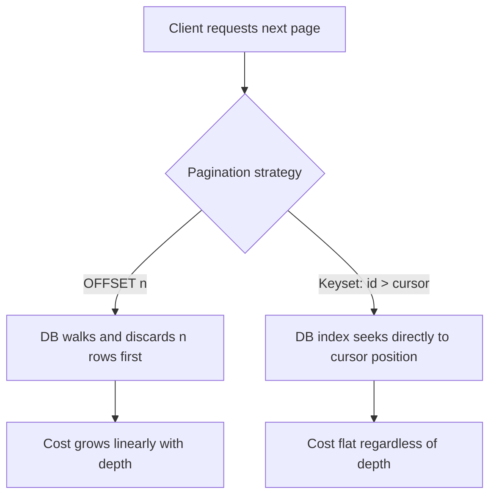

# API Design

> **Topic register:** T-803 · IWI 7.90 (#15 tied of 198) · Advanced tier · Very High interview frequency [H]
> **Provenance:** the pagination comparison in this chapter is real, executed PostgreSQL 16 output against a 2-million-row table. Reproducible source: [`practice/sql/week-04/pagination-lab.sql`](../../practice/sql/week-04/pagination-lab.sql).
> **Gap-audit addition (2026-09-18):** HATEOAS/Richardson Maturity Model, RFC 9457 Problem Details, filtering/sorting query parameters, and bulk operations had zero or link-only coverage in this chapter. Closed with real, executed Spring MVC evidence — [`practice/java/api-design/`](../../practice/java/api-design/README.md).

## Table of Contents

1. [Learning Objectives](#learning-objectives)
2. [Why This Matters in Interviews](#why-this-matters-in-interviews)
3. [Level 1 — Foundation](#level-1-foundation)
4. [Level 2 — Working Knowledge](#level-2-working-knowledge)
5. [Mental Model](#mental-model)
6. [Definition and Purpose](#definition-and-purpose)
7. [Core Concepts](#core-concepts)
8. [Internal Implementation](#internal-implementation)
9. [Diagrams](#diagrams)
10. [Production Scenarios](#production-scenarios)
11. [Trade-offs](#trade-offs)
12. [Decision Framework](#decision-framework)
13. [Comparisons](#comparisons)
14. [Common Mistakes](#common-mistakes)
15. [Anti-Patterns](#anti-patterns)
16. [Best Practices](#best-practices)
17. [Interview Answer Framework](#interview-answer-framework)
18. [Interview Questions](#interview-questions)
19. [Summary](#summary)
20. [Key Takeaways](#key-takeaways)
21. [Cheat Sheet](#cheat-sheet)
22. [Flashcards](#flashcards)
23. [Practice Exercises](#practice-exercises)
24. [Solutions](#solutions)
25. [Additional Reading](#additional-reading)
26. [Official References](#official-references)

---

## Learning Objectives

By the end of this chapter you can:

- Explain, with a measured number, why `OFFSET` pagination degrades with depth and keyset pagination doesn't.
- Design a resource-naming and standard-methods scheme that lets client code generalize across endpoints.
- Design a consistent error envelope and explain why the status code matters for idempotency reasoning specifically.
- State precisely what makes an API idempotent and connect it to safe client retry behavior.
- Explain HATEOAS and place a given API on the Richardson Maturity Model, with real evidence of state-dependent links.
- Return a real RFC 9457 Problem Details response instead of an ad hoc error shape.
- Design filtering, sorting, and bulk-operation endpoints that a client can use predictably.

## Why This Matters in Interviews

API design decisions, once shipped, are among the most expensive to change in a system — a pagination scheme, a resource shape, or an error format is depended upon by every client the moment it's public. This topic is Very-High-frequency because it appears in nearly every design round's API phase, and because the pagination question specifically has a clean, measurable right answer that separates candidates who've hit this at scale from those who haven't.

## Level 1 — Foundation

Think of a library's card catalog versus a librarian who knows exactly where every book is. A well-designed API is the second librarian: you ask for "customer #4521's orders" and get back a predictable, consistent answer shaped the same way every time you ask about any customer. A poorly designed API is like being handed the raw shelving instructions and having to walk the aisles yourself — the shape of the answer depends on which part of the library you asked, and if the librarian rearranges the shelves, your instructions break.

Pagination is the clearest place this shows up. Imagine flipping through a phone book one page at a time versus using a bookmark. `OFFSET`-based pagination is the first: to get to page 500, you (or the database) have to physically flip past pages 1 through 499 first, every single time. Keyset (cursor) pagination is the bookmark: you remember exactly where you left off ("the last name I saw was Garcia"), and next time you open straight to that spot — no matter how far into the book it is, opening to a bookmark takes the same effort. The catch: a bookmark can't jump you to "page 500" out of nowhere — it can only continue from where it already is.

Idempotency is a simpler idea than the word suggests: it just means "doing it twice has the same effect as doing it once." Pressing an elevator call button five times doesn't summon five elevators — the elevator is already coming, so extra presses are safe. A `GET` (read), `PUT` (full replace), and `DELETE` are elevator-button operations: safe to retry. A plain `POST` that charges a credit card is not — pressing it twice really can charge twice, unless the API is explicitly built to recognize a repeat request.

## Level 2 — Working Knowledge

At this level you're not designing new APIs from scratch yet, but you can read an existing API's design and recognize whether it will hold up. Given an endpoint like `GET /orders?page=500`, you should immediately ask: does this table grow large, and does the cost of jumping to page 500 grow with the page number? If the answer is yes and yes, that's an `OFFSET`-pagination endpoint waiting to become a production complaint — exactly the failure this chapter measures directly in [Internal Implementation](#internal-implementation).

You should also be able to look at an HTTP method and correctly reason about retry safety without looking anything up: a `GET`, `PUT`, or `DELETE` can be retried freely if a request times out and you're not sure it landed; a bare `POST` cannot, unless the API documents an idempotency-key mechanism (a client-supplied unique ID that lets the server recognize "I've already handled this exact request" and return the original result instead of repeating the side effect).

Practically, this means: when you integrate against a third-party API, check its pagination style before writing a loop that walks "all pages" (an `OFFSET`-based API doing this at scale will get slower with every iteration); when you design a new endpoint yourself, default to keyset pagination and a client-supplied idempotency key for any `POST` with a real side effect, rather than reaching for the simplest option and discovering the cost later, as the production scenario in this chapter shows happening to a real admin tool.

## Mental Model

**An API is a contract, and every contract decision made today is a constraint on every client written tomorrow.** The specific decisions in this chapter — pagination strategy, resource naming, error format — all trade a small amount of upfront design discipline for a large amount of avoided client-side breakage later. The pagination question is the sharpest example: the difference between `OFFSET` and keyset pagination is invisible at low volume and catastrophic at scale, which is exactly why it needs to be decided deliberately up front rather than discovered painfully later.

## Definition and Purpose

**API design** is the discipline of choosing a stable, predictable contract at a system's boundary — resource shapes, standard methods, error formats, and pagination — that client code can be written against without needing to know the implementation behind it. It exists because, without deliberate design, an interface tends to leak implementation details directly: endpoint shapes that mirror internal database tables, pagination that mirrors whatever the ORM's default query happened to produce, error responses inconsistent across endpoints because each was implemented independently. A consistent design discipline exists specifically so that a client written against one endpoint transfers its assumptions correctly to the next one.

## Core Concepts

### Pagination: OFFSET vs. keyset

`OFFSET n` requires the database to walk and discard `n` rows before it can return the next page — cost grows linearly with page depth. Keyset (cursor) pagination — `WHERE id > last_seen_id ORDER BY id LIMIT n` — costs the same regardless of depth, because the index condition seeks directly to the right starting point. The honest trade-off: keyset pagination cannot jump directly to "page 500,000" the way an offset-based UI control can — it can only move forward/backward from a known cursor.

### Resource naming and standard methods

| Standard method | HTTP verb | Idempotent? |
|---|---|---|
| List | `GET /resources` | Yes |
| Get | `GET /resources/{id}` | Yes |
| Create | `POST /resources` | No (unless an idempotency key is supplied) |
| Update | `PUT/PATCH /resources/{id}` | `PUT` yes (full replace), `PATCH` depends on semantics |
| Delete | `DELETE /resources/{id}` | Yes (deleting an already-deleted resource is still "gone") |

Resource naming convention: plural nouns for collections (`/orders`, not `/order` or `/getOrders`), nesting reflecting genuine ownership (`/orders/{id}/lines`, not a flat `/order-lines?orderId=`), and no verbs in the path — the HTTP method *is* the verb.

### Error design

A consistent error envelope — status code, machine-readable error code, human-readable message, and (where applicable) which field caused a validation failure — lets client code handle errors programmatically rather than string-matching a message. The specific status code matters for idempotency reasoning too: a `409 Conflict` on a duplicate `POST` (with idempotency key) tells the client definitively "already handled," versus a `500` which is genuinely ambiguous (see [Distributed Systems Failure Modes](../10-distributed-systems/distributed-systems-failure-modes.md)).

RFC 9457 (Problem Details for HTTP APIs, obsoleting RFC 7807) standardizes exactly this envelope instead of leaving every API to invent its own shape: `type` (a URI identifying the error kind), `title`, `status`, `detail`, `instance` (a URI identifying this specific occurrence), plus any custom extension fields an API needs. Spring 6 ships a built-in `org.springframework.http.ProblemDetail` type implementing this directly — this chapter's lab returns one from a real `@ExceptionHandler`, and Spring's own `ExceptionHandlerExceptionResolver` automatically sets the response's content type to the real `application/problem+json` media type, verified directly rather than configured by hand.

### HATEOAS and the Richardson Maturity Model

**HATEOAS** (Hypermedia as the Engine of Application State) means a response includes the *actions currently available* on a resource as real links, rather than a client hardcoding "if status is PENDING, I know I can call DELETE on it." This chapter's lab proves it concretely: the identical `GET /orders/{id}` endpoint returns a `cancel` and `ship` link for a `PENDING` order, and only a `return` link for a `DELIVERED` one — the available actions are computed from the resource's real current state, not asserted by the client.

The **Richardson Maturity Model** ranks REST API designs by how much of HTTP's own design they actually use: **Level 0** is a single URI and a single verb (usually `POST`) with an `action` field carrying what should be the method and resource — this chapter's lab includes a real `POST /rpc {"action":"getOrder","id":1}` endpoint returning byte-for-byte the same data as the proper resource endpoint, to make the contrast concrete rather than abstract. **Level 1** introduces separate resource URIs. **Level 2** uses HTTP verbs and status codes meaningfully (`GET`/`POST`/`PUT`/`DELETE`, real `404`s, real `409`s) — most production REST APIs stop here. **Level 3** adds HATEOAS. Most interview-relevant fact: Level 3 is rare in practice — the operational cost of maintaining accurate, state-dependent links often isn't justified unless clients are meant to be built generically against link relations rather than hardcoded endpoint knowledge.

### Filtering and sorting via query parameters

List endpoints need a predictable, generalizable way to narrow and order results — `GET /orders?status=PENDING&sort=amount,desc` in this chapter's lab, filtering to a real subset and returning it in a real, verified descending-amount order. The convention worth being consistent about: a single field name per filterable attribute (`status=PENDING`, not a bespoke query-language string for simple cases), and a `sort=field,direction` convention (comma-separated, direction defaulting to ascending) rather than one query parameter per possible sort field. Unsupported filter/sort fields should fail with a real, specific `400`, not silently ignore the parameter — a client that misspells `sort=amonut` should find out immediately, not get unsorted results with no indication why.

### Bulk operations and partial success

A bulk endpoint (`POST /orders/bulk` accepting an array) cannot collapse its outcome into one HTTP status code, because some items in the batch can succeed while others fail for reasons specific to that one item. This chapter's lab returns a real `207 Multi-Status` with a per-item result array — each entry carrying its original index, a success flag, and either a generated ID or an error message — verified directly with a 3-item batch where item 2 fails validation while items 1 and 3 succeed. The design principle: a bulk operation's response shape must let the caller map every outcome back to the specific input item that produced it; a single aggregate status code cannot do that.

## Internal Implementation

**Design pagination for a 500M-row endpoint. Why not `OFFSET`?**

Real `EXPLAIN ANALYZE` output, PostgreSQL 16, 2-million-row table:

```
OFFSET, shallow page (offset 100):        Execution Time: 0.028ms
OFFSET, deep page (offset 1,000,000):     Execution Time: 86.006ms   (rows=1000020 walked before returning 20)
Keyset, equivalent depth (id > 1000000):  Execution Time: 0.020ms    (Index Cond jumps directly there)
```

**~3,000× difference at depth, same table, same index.** This is the same B+Tree indexing mechanism from [Database Index Structures](../06-databases/index-structures-btree-composite-covering.md), applied to a specific API-level design decision: `OFFSET` forces the database to walk past every skipped row; `WHERE id > cursor` lets the index seek directly.

```
POST /feed?limit=20                              -- first page
  -> {items: [...], nextCursor: "1000020"}

GET /feed?limit=20&after=1000020                  -- next page, keyset-based
  -> {items: [...], nextCursor: "1000040"}
```

**Real trade-off, stated honestly:** for a UI that needs arbitrary page-number jumping (rare in practice for feeds; common for admin back-office tools), a hybrid is often used: keyset for the common "next page" case, with an approximate, separately-computed count/estimate for a jump-to-page control that doesn't need to be exact.

**HATEOAS, RFC 9457, filtering/sorting, and bulk operations — real Spring MVC evidence** (`practice/java/api-design/`):

```
PENDING order _links: {"id":1,"status":"PENDING","amount":50.0,"_links":{"self":{"href":"/orders/1","method":"GET"},"cancel":{"href":"/orders/1","method":"DELETE"},"ship":{"href":"/orders/1/ship","method":"POST"}}}
DELIVERED order _links: {"id":2,"status":"DELIVERED","amount":120.0,"_links":{"self":{"href":"/orders/2","method":"GET"},"return":{"href":"/orders/2/return","method":"POST"}}}

RFC 9457 Problem Details body: {"type":"https://api.example.com/errors/order-not-found","title":"Order Not Found","status":404,"detail":"order 999 not found","instance":"/orders/999","errorCode":"ORDER_NOT_FOUND"}

Filtered (status=PENDING): [order id=1, order id=3]   -- id=2 (DELIVERED) correctly excluded
Sorted (sort=amount,desc): [id=4 amount=200.0, id=2 amount=120.0, ..., id=100 amount=10.0]

Bulk create (2 valid, 1 invalid) -> real HTTP 207: [{"index":0,"success":true,"id":100,...},{"index":1,"success":false,"error":"amount must be positive"},{"index":2,"success":true,"id":101,...}]
```

Full real transcript and 6/6 passing tests: [`practice/java/api-design/README.md`](../../practice/java/api-design/README.md).

## Diagrams



## Production Scenarios

### Scenario: an admin back-office tool becomes unusable as a table grows

**Symptoms.** An internal admin tool listing customer records, built early with simple `OFFSET`-based pagination and a page-number control, works fine for the first year; as the customer table grows past a few million rows, support staff report the tool becoming unusably slow specifically when jumping to later pages, while the first few pages remain fast.

**Impact.** Internal tooling degradation affecting support-team productivity, discovered gradually rather than via a sudden outage.

**Initial hypotheses.** General database load (checked — other queries against the same table remain fast); a missing index (checked — the underlying `ORDER BY id` column is indexed); the `OFFSET` pagination mechanism itself (correct).

**Evidence.** `EXPLAIN ANALYZE` on the admin tool's actual query at a deep page shows exactly this chapter's measured pattern — a large `rows=` walked-and-discarded count, execution time scaling with the requested offset.

**Diagnosis.** The `OFFSET`-based pagination was never expected to be queried at meaningful depth when originally built, and nobody revisited the decision as the table grew — exactly the "optimize later" trap this chapter's Staff-level discussion warns against, since by the time the problem became visible, the tool had existing users depending on its page-jump behavior.

**Immediate mitigation.** Cap the maximum page-jump depth exposed in the UI as a stopgap, preventing the worst-case query from being triggered while a proper fix is designed.

**Permanent remediation.** Migrate the "next/previous page" interactions (the overwhelming majority of actual usage) to keyset pagination, and implement a separate, approximate jump-to-page control using a periodically-refreshed row-count estimate rather than an exact `OFFSET` count — the hybrid approach this chapter names explicitly.

**Alternatives considered.** Adding more database resources to absorb the cost — rejected as treating the symptom, since the cost scales with table growth regardless of available resources, and would need to be revisited again at the next order of magnitude.

**Trade-offs.** The hybrid approach means the jump-to-page control shows an approximate rather than exact page count — accepted, since exact counts at this depth were never actually load-bearing for the admin tool's real usage pattern.

**Prevention.** Any endpoint queried against a table expected to grow past a few hundred thousand rows should default to keyset pagination unless arbitrary page-jump is a genuine, load-bearing requirement — and even then, prefer the hybrid approach over exact `OFFSET` at scale.

**Interview lesson.** This is Interview Question 1 (§ Interview Questions) — "design pagination for a 500M-row endpoint, why not OFFSET" — arriving as a real, gradually-discovered incident, exactly matching the Staff-level discussion's point that API decisions become expensive specifically once clients depend on them.

## Trade-offs

| Approach | Benefit | Cost |
|---|---|---|
| Offset pagination | Simple, supports arbitrary page-jump | Cost grows linearly with depth — unusable at scale, demonstrated at ~3,000× |
| Keyset pagination | Flat cost regardless of depth | Cannot jump to an arbitrary page number directly |
| `PUT` (full replace) | Simple, idempotent by definition | Requires the client to send the full resource even for a one-field change |
| `PATCH` (partial update) | Efficient for small changes | Idempotency and merge semantics must be defined explicitly, or aren't guaranteed |
| HATEOAS (Level 3) | Clients discover valid actions from the response instead of hardcoding state rules | Real operational cost maintaining accurate, state-dependent links; most production APIs stop at Level 2 |
| RFC 9457 Problem Details | Standardized, tooling-friendly error shape instead of a bespoke one | Requires adopting `application/problem+json` and the `type`/`instance` URI conventions consistently |
| Bulk endpoint with per-item results | One round trip for many operations, precise per-item outcome | Response shape is more complex than a single status code; caller must handle partial success |

## Decision Framework

1. **Will this endpoint ever be queried at meaningful depth** (thousands of rows deep or more)? If yes, default to keyset pagination.
2. **Does the UI genuinely need arbitrary page-number jumping**, or only "next page" navigation? If only the latter, keyset alone is sufficient; if the former is a real requirement, use the hybrid approach.
3. **Is this endpoint's operation naturally idempotent** (a `GET`, `PUT`, or `DELETE`)? If it's a `POST` with a real side effect that shouldn't duplicate, require a client-supplied idempotency key.
4. **Does every endpoint in this API return errors in the same envelope shape**? If not, client code cannot generalize error handling across endpoints. Default to RFC 9457 Problem Details rather than inventing a bespoke shape.
5. **Are clients meant to be built generically against link relations, rather than hardcoded per-endpoint knowledge?** If yes, HATEOAS (Level 3) is worth its maintenance cost; if clients are always purpose-built against documented endpoints, Level 2 is the realistic, sufficient target.
6. **Does a list endpoint need narrowing/ordering beyond pagination?** If yes, add explicit `status=`-style filters and a `sort=field,direction` convention, failing loudly (`400`) on unsupported fields rather than ignoring them.
7. **Will clients ever need to submit many items in one request?** If yes, design the bulk response as a per-item result array from the start, not a single aggregate status code retrofitted later.

## Comparisons

| Aspect | OFFSET pagination | Keyset pagination |
|---|---|---|
| Cost at shallow depth | Fast | Fast |
| Cost at deep depth | Grows linearly — measured ~3,000× slower at depth | Flat — same cost regardless of depth |
| Arbitrary page-number jump | Yes | No — only forward/backward from a cursor |
| Mechanism | Database walks and discards skipped rows | Index seeks directly to the cursor position |

| Richardson Maturity Level | What it adds | This chapter's lab evidence |
|---|---|---|
| Level 0 | One URI, one verb, an `action` field carries the real intent | Real `POST /rpc {"action":"getOrder",...}` endpoint, contrasted directly |
| Level 1 | Separate URIs per resource | `/orders/{id}` vs. a single `/rpc` endpoint |
| Level 2 | HTTP verbs and status codes used meaningfully | Real `404`, `201`, `207` throughout this chapter's lab |
| Level 3 (HATEOAS) | Responses include real, state-dependent action links | Real `_links` differing between a `PENDING` and a `DELIVERED` order |

## Common Mistakes

- Choosing `OFFSET` pagination by default without checking whether the endpoint will ever be queried at depth.
- Inconsistent error response shapes across different endpoints in the same API.
- Verbs in resource paths (`/getOrders`, `/createOrder`) instead of letting the HTTP method carry that meaning.
- Inventing a bespoke error envelope instead of RFC 9457 Problem Details, then having to document it from scratch for every consumer.
- Assuming a client can infer available next actions on a resource without either HATEOAS links or separate, hand-maintained documentation.
- Collapsing a bulk operation's outcome into one status code, leaving the caller unable to tell which specific items failed.

## Anti-Patterns

- **Defaulting to `OFFSET` pagination "because it's simpler"** without checking the endpoint's expected data volume and query depth over the system's lifetime, not just at launch.
- **Building each endpoint's error responses independently**, producing an API where client error-handling code cannot generalize.
- **Encoding verbs in the URL path** rather than using the HTTP method to carry that meaning.
- **Treating idempotency as equivalent to "read-only"** — a `PUT` is idempotent and can still be a write.
- **Silently ignoring an unsupported filter or sort field** instead of returning a real `400` — a misspelled query parameter should fail loudly, not produce quietly wrong results.
- **Adding HATEOAS links that don't actually reflect current resource state** — links that are always present regardless of state are worse than no links, because they actively mislead a client into attempting an invalid transition.

## Best Practices

- Default new list endpoints to keyset pagination unless arbitrary page-jump is a genuine, stated requirement.
- Use a single, consistent error envelope shape across every endpoint in an API — default to RFC 9457 Problem Details rather than a bespoke format.
- Follow standard resource-naming conventions (plural nouns, no verbs in paths, nesting reflecting real ownership).
- Require an idempotency key for any `POST` with a real, costly side effect.
- Treat pagination and error-format decisions as expensive-to-change contracts, worth getting right before the first client depends on them.
- Fail loudly (`400`) on unsupported filter/sort query parameters rather than silently ignoring them.
- Design a bulk endpoint's response as a per-item result array from the start, so partial success is representable.

## Interview Answer Framework

### 30-Second Answer

`OFFSET` pagination's cost grows linearly with page depth because the database walks and discards every skipped row; keyset pagination (`WHERE id > cursor`) costs the same at any depth because the index seeks directly there. The honest trade-off: keyset can't jump to an arbitrary page number, only move from a known cursor.

### 2-Minute Answer

Definition: API design is choosing a stable contract at a system's boundary — resource shapes, standard methods, errors, pagination — that clients can be written against without knowing the implementation. Why it exists: without deliberate design, an API leaks implementation details and produces inconsistent client-handling requirements. How it works: `OFFSET n` makes the database walk and discard `n` rows before returning a page; keyset pagination seeks directly via an index condition. One important trade-off: keyset loses arbitrary page-jump capability in exchange for flat cost at any depth. Production example: a real, measured ~3,000× execution-time difference between a shallow and a deep `OFFSET` query on identical data, versus a flat, fast keyset query at the same depth.

### 10-Minute Deep Dive

Cover, in order: the mental model — an API is a contract that gets expensive to change (mental model); the measured `OFFSET` vs. keyset comparison, with the precise mechanism (walk-and-discard vs. index-seek) (internals, real evidence); resource naming and standard methods, and why idempotency matters specifically for retry safety (internals); error envelope design and its connection to idempotency status-code reasoning (edge case); and close with the production scenario — an admin tool's pagination degrading gradually as its table grew, exactly the "optimize later" trap this topic exists to prevent.

### Whiteboard Explanation

Draw the [§ Diagrams](#diagrams) flowchart: a client request branching into "OFFSET" (drawn as a long walked-and-discarded row of boxes before the returned page) versus "keyset" (drawn as a direct arrow jumping straight to the cursor position). This makes the walk-vs-seek distinction visually obvious rather than asserted.

### Production Example

The admin-tool degradation in [§ Production Scenarios](#production-scenarios): `OFFSET`-based pagination worked fine for a year, then became unusably slow at deep pages as the underlying table grew — fixed with a keyset migration for the common case and a hybrid approximate-count jump-to-page control for the rare one.

### Trade-offs to Mention

State unprompted: `OFFSET`'s cost grows with depth for a specific, nameable reason (row walk-and-discard), not just "it's slower"; keyset pagination trades away arbitrary page-jump for flat cost; API contract decisions become expensive to change the moment real clients depend on them.

### Common Candidate Mistakes

Citing "OFFSET is slower" without the specific mechanism or real numbers; conflating "idempotent" with "read-only"; inconsistent error shapes across endpoints; verbs baked into resource paths.

### Typical Follow-Up Questions

1. "What do you lose by switching to keyset pagination?"
2. "Is `POST` ever idempotent?"
3. "How would you design the hybrid jump-to-page control specifically?"

### Senior-Level Expectations

Correctly explains why `OFFSET` degrades and proposes keyset pagination; states the idempotency definition correctly and connects it to safe retries.

### Staff-Level Discussion

API design decisions, once shipped, are among the most expensive to change in a system — a pagination scheme, a resource shape, or an error format is depended upon by every client the moment it's public, and changing it requires either a breaking change (coordinated client migration) or permanent dual-support. This is why the pagination decision is worth getting right from the start rather than "optimizing later" — by the time an `OFFSET`-based endpoint's depth problem becomes visible in production, it usually has existing clients depending on the exact page-jump behavior a keyset migration would need to give up.

## Interview Questions

### Question 1 — Design pagination for a 500M-row endpoint. Why not `OFFSET`?

**Why interviewers ask it.** Has a clean, measurable right answer that separates candidates who've hit this at real scale from those who haven't.

**Expected answer.** The measured result and mechanism — cost grows linearly with offset depth because the database walks and discards every skipped row; keyset pagination avoids this by seeking directly via an index condition.

**Minimum acceptable answer.** States that `OFFSET` gets slower at depth, even without the precise mechanism.

**Strong Senior answer.** Correctly explains why `OFFSET` degrades and proposes keyset pagination.

**Staff-level extension.** Names the honest trade-off (no arbitrary page-jump) and proposes the hybrid approach for UIs that need it.

**Common mistakes.** Citing "it's slower" without the specific mechanism (rows walked and discarded) or without real numbers.

**Likely follow-ups.** "What do you lose by switching to keyset pagination?"

**Evaluation criteria (1–5).** 1: "OFFSET is fine." 3: correct mechanism and keyset proposal. 5: mechanism, keyset proposal, plus the honest trade-off and hybrid solution.

**Related references.** [§ Internal Implementation](#internal-implementation); [Database Index Structures](../06-databases/index-structures-btree-composite-covering.md).

---

### Question 2 — What makes an API idempotent, and why does it matter for retries?

**Why interviewers ask it.** Tests whether the candidate connects the formal definition to the retry-safety reasoning it exists to support.

**Expected answer.** An idempotent operation produces the same end state no matter how many times it's applied; it matters because a client that isn't sure whether a request succeeded can safely retry an idempotent operation without risk.

**Minimum acceptable answer.** States the definition correctly, even without connecting it to retries.

**Strong Senior answer.** States the definition correctly and connects it to safe retries.

**Staff-level extension.** Explicitly ties this back to the idempotency-key mechanism for making `POST` safe under retry.

**Common mistakes.** Conflating "idempotent" with "read-only" — a `PUT` is idempotent and can still be a write.

**Likely follow-ups.** "Is `POST` ever idempotent?"

**Evaluation criteria (1–5).** 1: conflates idempotent with read-only. 3: correct definition plus retry connection. 5: definition, retry connection, plus the idempotency-key mechanism for `POST`.

**Related references.** [Idempotency at System Edges](../11-system-design/idempotency.md); [Distributed Systems Failure Modes](../10-distributed-systems/distributed-systems-failure-modes.md).

---

### Question 3 — What is HATEOAS, and where does a typical production REST API actually sit on the Richardson Maturity Model?

**Why interviewers ask it.** Tests whether a candidate can name a concept beyond "REST uses HTTP verbs" and knows most real APIs don't reach the model's top level.

**Expected answer.** HATEOAS means a response includes real, state-dependent links describing the actions currently available on that resource. Most production APIs sit at Level 2 (verbs and status codes used meaningfully) — Level 3 (HATEOAS) is comparatively rare because of its real maintenance cost.

**Minimum acceptable answer.** Defines HATEOAS correctly, even without naming the maturity model levels.

**Strong Senior answer.** Defines HATEOAS, names the maturity model levels, and correctly states most APIs stop at Level 2.

**Staff-level extension.** Frames the Level 2-vs-3 decision around whether clients are meant to be built generically against link relations, versus always purpose-built against documented endpoints.

**Common mistakes.** Confusing HATEOAS with "using HTTP verbs correctly," which is Level 2, not Level 3.

**Likely follow-ups.** "Give a concrete example of a link that would change based on resource state."

**Evaluation criteria (1–5).** 1: conflates Level 2 and Level 3. 3: correct definition and levels. 5: correct definition, levels, and the generic-client trade-off.

**Related references.** [§ Core Concepts](#core-concepts); [§ Comparisons](#comparisons).

---

### Question 4 — Design the error response for a `404`. Why prefer RFC 9457 Problem Details over a custom JSON shape?

**Why interviewers ask it.** Tests whether a candidate defaults to inventing a bespoke format or knows a standardized one exists and why it's preferable.

**Expected answer.** RFC 9457 standardizes `type`, `title`, `status`, `detail`, `instance`, plus custom extension fields, served as `application/problem+json` — client tooling and other teams don't need to learn a bespoke format per API.

**Minimum acceptable answer.** Designs a reasonable custom shape with status code, message, and error code, even without naming RFC 9457.

**Strong Senior answer.** Names RFC 9457 specifically and its standard fields.

**Staff-level extension.** Notes that Spring 6's built-in `ProblemDetail` type makes this essentially free to adopt, removing "it's more work" as a reason not to.

**Common mistakes.** Treating a custom error shape as equally good as a standardized one, ignoring the tooling/consistency cost across many APIs.

**Likely follow-ups.** "What content type does a real Problem Details response use?"

**Evaluation criteria (1–5).** 1: ad hoc shape with no standard named. 3: names RFC 9457 correctly. 5: names RFC 9457, its fields, and the framework support making adoption low-cost.

**Related references.** [§ Core Concepts](#core-concepts); [§ Internal Implementation](#internal-implementation).

---

### Question 5 — A list endpoint needs to support filtering and sorting. A caller sends `sort=amonut` (misspelled). What should happen?

**Why interviewers ask it.** Tests whether a candidate defaults to silent, hard-to-debug behavior or a loud, specific failure for malformed input.

**Expected answer.** A real `400` naming the unsupported field — silently ignoring it and returning unsorted results with no indication why is a debugging trap for the caller.

**Minimum acceptable answer.** States some validation should happen, even without specifying the status code.

**Strong Senior answer.** Specifies a real `400` with a message naming the invalid field.

**Staff-level extension.** Connects this to the broader principle from [§ Anti-Patterns](#anti-patterns): any mechanism that resolves ambiguous/invalid input silently defers a real bug to whoever debugs the resulting confusion later.

**Common mistakes.** Silently ignoring the unsupported parameter and returning a 200 with unsorted/unfiltered data.

**Likely follow-ups.** "How would you design the query-parameter convention for filtering by multiple fields at once?"

**Evaluation criteria (1–5).** 1: silent ignore. 3: correct 400 with a named field. 5: correct 400 plus the general "fail loudly on ambiguity" principle.

**Related references.** [§ Core Concepts](#core-concepts).

---

### Question 6 — A client submits 100 items to a bulk-create endpoint. Item 47 fails validation. What should the response look like?

**Why interviewers ask it.** Tests whether a candidate understands why bulk operations can't collapse to one status code.

**Expected answer.** A real `207 Multi-Status` (or an equivalent 200 with a structured body) containing a per-item result array — each entry with its original index, success/failure, and either a result or an error — so the caller can map every outcome back to the specific input item.

**Minimum acceptable answer.** States the response needs per-item detail, even without naming a specific status code.

**Strong Senior answer.** Proposes a per-item result array keyed by index, with a specific status code.

**Staff-level extension.** Discusses whether the 99 valid items should commit independently of the 1 failure (partial success) or whether the whole batch should be all-or-nothing, and that this is a deliberate design decision, not a default.

**Common mistakes.** Returning a single `400` for the whole batch, losing which 99 items actually succeeded.

**Likely follow-ups.** "Should the successful items in the batch be rolled back if one fails?"

**Evaluation criteria (1–5).** 1: single aggregate status code. 3: correct per-item array design. 5: per-item array plus the partial-success-vs-all-or-nothing trade-off discussion.

**Related references.** [§ Core Concepts](#core-concepts); [§ Internal Implementation](#internal-implementation).

## Summary

API design choices — pagination, resource naming, error format — are contracts that become expensive to change once clients depend on them. `OFFSET` pagination has a real, measured, linear-with-depth cost (demonstrated at ~3,000× between shallow and deep pages on identical data); keyset pagination avoids it at the cost of losing arbitrary page-jump capability, a trade-off worth stating explicitly rather than treating as a free upgrade. HATEOAS, RFC 9457 Problem Details, filtering/sorting conventions, and bulk-operation response design round out the contract decisions a production REST API needs beyond pagination and basic error handling — all four verified directly against real Spring MVC dispatch in this chapter's own lab.

## Key Takeaways

- `OFFSET`'s cost grows linearly with page depth because the database must walk and discard every skipped row — measured at ~3,000× in this chapter.
- Keyset pagination's cost is flat regardless of depth, at the honest cost of losing arbitrary page-jump.
- Idempotency (via `PUT`'s definition, or a client-supplied key for `POST`) is what makes retries safe.
- Resource naming and error-format consistency exist to let client code be written once and generalize across endpoints.
- HATEOAS (Richardson Maturity Level 3) means responses carry real, state-dependent action links — verified directly, a `PENDING` order's links differ from a `DELIVERED` order's.
- RFC 9457 Problem Details standardizes the error envelope (`type`/`title`/`status`/`detail`/`instance`); Spring 6's built-in `ProblemDetail` makes adopting it essentially free.
- Filtering/sorting query parameters should fail loudly (`400`) on unsupported fields rather than silently ignoring them.
- A bulk operation's response must be a per-item result array — a single status code can't represent partial success.

## Cheat Sheet

| Situation | What to reach for |
|---|---|
| List endpoint, table may grow large | Keyset pagination by default |
| UI needs arbitrary page-number jumping | Hybrid: keyset for next/prev, approximate count for jump-to-page |
| A `POST` with a real, costly side effect | Require a client-supplied idempotency key |
| Designing error responses | RFC 9457 Problem Details (`type`/`title`/`status`/`detail`/`instance`), not a bespoke shape |
| Clients need to discover valid next actions from a response | HATEOAS links (Level 3) — but only if clients are built generically against them |
| List endpoint needs narrowing/ordering | Explicit `status=`-style filters + `sort=field,direction`, real `400` on unsupported fields |
| Client submits many items in one request | Per-item result array (e.g., real `207 Multi-Status`), not one aggregate status code |

## Flashcards

### Card: Why OFFSET gets slower with depth

**Prompt:**
Why does `OFFSET` pagination get slower with depth?

**Answer:**
The database must walk and discard every skipped row before returning the requested page — cost grows linearly with offset.

**Why it matters:**
A measured, ~3,000× real-world difference, not a theoretical concern.

**Common trap:**
Assuming pagination cost is roughly constant regardless of implementation.

**Related:**
[Internal Implementation](#internal-implementation)

### Card: What keyset pagination gives up

**Prompt:**
What does keyset pagination give up in exchange for flat cost at any depth?

**Answer:**
Arbitrary page-number jumping — it can only move forward/backward from a known cursor.

**Why it matters:**
The honest trade-off a Staff-level answer states unprompted.

**Common trap:**
Presenting keyset pagination as a strict, cost-free upgrade.

**Related:**
[Core Concepts](#core-concepts)

### Card: PUT vs POST idempotency

**Prompt:**
Is `PUT` idempotent? Is `POST`?

**Answer:**
`PUT` yes, by definition (full replace). `POST` only with a client-supplied idempotency key.

**Why it matters:**
The precise distinction that resolves the "is idempotent the same as read-only" confusion.

**Common trap:**
Assuming only read-only methods can be idempotent.

**Related:**
[Core Concepts](#core-concepts)

### Card: HATEOAS in one sentence

**Prompt:**
What does HATEOAS mean, in terms of what a response actually contains?

**Answer:**
A response includes real, state-dependent links describing the actions currently available on that resource — a client discovers what it can do next from the response, rather than hardcoding state-based rules client-side.

**Why it matters:**
This is what separates Richardson Maturity Level 3 from Level 2 — most production APIs stop at Level 2.

**Common trap:**
Confusing "uses HTTP verbs correctly" (Level 2) with HATEOAS (Level 3).

**Related:**
[Core Concepts](#core-concepts)

### Card: RFC 9457 Problem Details' standard fields

**Prompt:**
Name the standard fields RFC 9457 Problem Details defines for an error response.

**Answer:**
`type` (a URI identifying the error kind), `title`, `status`, `detail`, `instance` (a URI identifying this specific occurrence) — plus any custom extension fields an API needs.

**Why it matters:**
Spring 6's built-in `ProblemDetail` implements this directly, and Spring automatically sets the real `application/problem+json` content type.

**Common trap:**
Inventing a bespoke error shape instead of reaching for this standard one.

**Related:**
[Core Concepts](#core-concepts)

## Practice Exercises

1. Reproduce the pagination measurement yourself: [`practice/sql/week-04/pagination-lab.sql`](../../practice/sql/week-04/pagination-lab.sql).
2. Design a hybrid pagination scheme for an admin UI that needs both efficient "next page" behavior and an approximate jump-to-page control.
3. Take an endpoint in a system you know using `OFFSET` pagination. Estimate the row count at which its cost would become noticeable, using this chapter's measured growth pattern as a reference.
4. Run this chapter's own lab (`practice/java/api-design/`) and add a `SHIPPED` order's `_links` branch a real test doesn't yet cover — verify it exposes only a `deliver` link.
5. Change the bulk-create endpoint to make the whole batch all-or-nothing (any single invalid item rolls back the entire batch) instead of partial success, and write a test proving the new behavior.

## Solutions

**Exercise 1.** Expected output matches this chapter's measured numbers: sub-millisecond execution for a shallow `OFFSET` and for keyset pagination at any depth, and a multi-order-of-magnitude increase for `OFFSET` at deep pages.

**Exercise 2.** A correct hybrid design: expose keyset-based `after`/`before` cursors for next/previous navigation as the primary interaction, and a separate, periodically-refreshed (not real-time-exact) row-count estimate to power a jump-to-page control, explicitly documenting that the jump-to-page count is approximate.

**Exercise 3.** No single expected answer — complete when the candidate has estimated a concrete row-depth threshold (informed by this chapter's measured pattern: noticeable degradation typically becomes visible in the tens-of-thousands-to-low-millions-of-rows-deep range, depending on row width and index characteristics) and connected it to the specific table's current and projected size.

**Exercise 4.** A `SHIPPED` order (per `OrderResource`'s existing `switch`) already exposes only a `deliver` link — the exercise is complete once a real test asserts `deliver` is present and `cancel`/`ship`/`return` are all absent for that state.

**Exercise 5.** A correct all-or-nothing redesign validates every item first, and only performs any inserts if every item passes — returning a single `400` naming every failing index if any item is invalid, rather than the partial-success `207` this chapter's lab implements. Both designs are valid; the point of the exercise is recognizing it's a deliberate choice, not a default.

## Additional Reading

- [Google API Design Guide](https://cloud.google.com/apis/design) — resource naming, standard methods, error design
- [Martin Fowler — Richardson Maturity Model](https://martinfowler.com/articles/richardsonMaturityModel.html) — the four levels this chapter's HATEOAS section references

## Official References

- [RFC 9457 — Problem Details for HTTP APIs](https://www.rfc-editor.org/rfc/rfc9457) — a standardized error-response format
