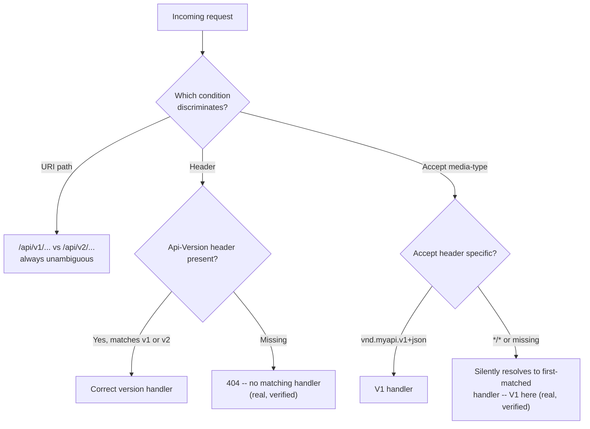

# API Versioning Strategies

> **Topic register:** T-919 · Core tier · High interview frequency [H] — gap-audit addition (2026-09-16):
> `api-design.md` (T-803) was originally scoped as "API design: REST, gRPC, GraphQL, **versioning**," and
> GraphQL/gRPC were later split into their own full chapters (T-917/T-918) when the bundled T-803 named
> them but never covered them — versioning was the fourth topic in that same original scope, and had the
> identical gap: named, never written. This chapter closes it, following the exact same split precedent.
> **Provenance:** every claim about Spring MVC's real dispatch behavior below is real, executed output
> from a real Spring Framework 6.1.14 app (`practice/java/api-versioning-strategies/`), including two
> genuinely unplanned findings about what happens when a caller's version signal is missing or generic.

## Table of Contents

1. [Learning Objectives](#learning-objectives)
2. [Why This Matters in Interviews](#why-this-matters-in-interviews)
3. [Level 1 — Foundation](#level-1-foundation)
4. [Level 2 — Working Knowledge](#level-2-working-knowledge)
5. [Mental Model](#mental-model)
6. [Definition and Purpose](#definition-and-purpose)
7. [Core Concepts](#core-concepts)
8. [Internal Implementation](#internal-implementation)
9. [Diagrams](#diagrams)
10. [Java Examples](#java-examples)
11. [Production Scenarios](#production-scenarios)
12. [Trade-offs](#trade-offs)
13. [Decision Framework](#decision-framework)
14. [Comparisons](#comparisons)
15. [Common Mistakes](#common-mistakes)
16. [Anti-Patterns](#anti-patterns)
17. [Best Practices](#best-practices)
18. [Interview Answer Framework](#interview-answer-framework)
19. [Interview Questions](#interview-questions)
20. [Summary](#summary)
21. [Key Takeaways](#key-takeaways)
22. [Cheat Sheet](#cheat-sheet)
23. [Flashcards](#flashcards)
24. [Practice Exercises](#practice-exercises)
25. [Additional Reading](#additional-reading)
26. [Official References](#official-references)

## Learning Objectives

By the end of this chapter you can:

- Name the four real API versioning strategies (URI path, query parameter, custom header, media-type/content-negotiation), with a real, working Spring MVC example of three of them.
- State the real, verified trade-off each strategy has when a caller's version signal is missing, malformed, or too generic.
- Choose a versioning strategy for a given API using a concrete decision framework, not a preference.
- Explain deprecation and sunset policy as a real operational commitment, not a one-time announcement.

## Why This Matters in Interviews

"How would you version this API?" comes up in almost every backend API-design interview, because every
real API eventually needs a breaking change and the answer reveals whether a candidate has actually shipped
a versioned API or only read about the four strategies as a list. A weak answer names URI-path versioning
(`/v1/`, `/v2/`) as if it were the only option. A strong answer can name all four real strategies, state a
real trade-off for each — not "it depends," a specific, concrete cost — and explain what a deprecation
policy actually commits an organization to once a new version ships.

## Level 1 — Foundation

Picture a restaurant that reprints its menu every year. If the new menu drops a dish a regular customer
loved, that's a **breaking change** — anyone who orders the old way gets nothing. **API versioning** is
how a service keeps serving customers who still have the old menu memorized (V1 callers) while also
serving anyone using the new one (V2 callers) — at the same time, without forcing everyone to switch on
the same day. The simplest version of this: put the year right on the menu's cover (`/v1/menu`,
`/v2/menu`) so nobody's confused about which one they're holding.

## Level 2 — Working Knowledge

There are four real ways a caller tells an API which "menu" (version) they want, and this chapter's own
lab implements three of them against the identical real breaking change (a `name` field split into
`firstName`/`lastName`):

1. **URI path** — `/api/v1/users/{id}` vs. `/api/v2/users/{id}`. The version is part of the URL itself.
2. **Query parameter** — `/api/users/{id}?version=1`. The version rides along as a request parameter.
3. **Custom header** — same URL, a header like `Api-Version: 1` picks the version.
4. **Media-type / content negotiation** — same URL, the standard `Accept` header
   (`Accept: application/vnd.myapi.v1+json`) picks the version, using HTTP's own existing
   content-negotiation mechanism rather than inventing a new header.

All four exist because real APIs accumulate real consumers who can't all upgrade simultaneously — mobile
apps with users who haven't updated, other teams' services with their own deploy schedules, third-party
integrators who may never update. Versioning is the mechanism that buys those consumers time.

## Mental Model

Every versioning strategy answers the exact same question — "which version does this specific request
want?" — using a different part of the HTTP request to carry that signal: the **URL** (path or query
string) or a **header** (custom, or the standard `Accept`). The strategies differ in how visible that
signal is (a URL is visible in browser history, logs, bookmarks; a header is invisible unless you inspect
the raw request) and in what happens when the signal is **absent or generic** — this chapter's own lab
found that absence behaves very differently across the three it implements, and that difference is the
single most interview-relevant fact about this topic.

## Definition and Purpose

**API versioning** is a deliberate strategy for exposing more than one contract (request/response shape,
or behavior) for the same logical resource simultaneously, so that a breaking change can ship without
requiring every existing caller to migrate the instant it deploys. It exists because a backend team does
not control every consumer's deploy schedule — mobile app store review times, other teams' sprint
cadences, and third-party integrators who may never update all mean a breaking change deployed
"immediately for everyone" is, in practice, usually not possible without an outage for someone.

## Core Concepts

### URI path versioning puts the version where every tool already looks

`/api/v1/users/{id}` and `/api/v2/users/{id}` are two entirely separate route registrations — in this
chapter's own lab, `@GetMapping("/api/v1/users/{id}")` and `@GetMapping("/api/v2/users/{id}")` on two
different methods. There is no ambiguity about which handler a request reaches: the URL itself is the
routing key, visible in browser history, server access logs, curl commands, and API documentation without
any special tooling. This is the most operationally simple strategy and the reason it's the default choice
for public APIs consumed by parties the provider has no direct relationship with.

### Header and media-type versioning keep the URL identical, at a real cost when the signal is missing

`@GetMapping(value = "/api/header/users/{id}", headers = "Api-Version=1")` and the sibling `Api-Version=2`
mapping look declaratively similar to the URI-path pair, but they share one URL and let Spring's real
`HandlerMapping` disambiguate by header value. This chapter's own lab found the real, verified consequence
of that design: a request to `/api/header/users/1` with **no** `Api-Version` header at all gets a genuine
`404` — not a default version, not an error message naming the missing header, just "no mapping found."
Media-type versioning (`produces = "application/vnd.myapi.v1+json"`) has the opposite failure mode: a
generic `Accept: */*` — what curl sends by default, and what many HTTP clients send if a caller forgets to
set `Accept` explicitly — does **not** `406`. This chapter's lab confirmed it silently resolves to whichever
version-specific handler Spring's content negotiation finds first, with no signal to the caller that they
got a specific version rather than "the API's current default."

### Query parameter versioning is the easiest to try casually, and the easiest to lose track of

`/api/users/{id}?version=1` requires no special header tooling — a version can be typed directly into a
browser URL bar — which makes it popular for quick manual testing and internal tools. Its real cost is
that a query parameter is easy to omit accidentally (unlike a header set by an SDK/client library
consistently) and easy to leave dangling in cached URLs, bookmarks, and copy-pasted support tickets long
after that version is meant to be retired.

## Internal Implementation

Spring MVC's `RequestMappingHandlerMapping` builds one `RequestMappingInfo` per `@RequestMapping`-family
annotation, each carrying a set of **request conditions** — path pattern, HTTP method, `headers`,
`params`, `consumes`, `produces`. On every incoming request, `HandlerMapping` evaluates every registered
`RequestMappingInfo`'s conditions against the real request and picks the single most specific full match.
URI path versioning uses the **path condition** to discriminate (trivial: different literal paths never
collide). Header versioning uses the **headers condition** — this is why an absent header isn't "no
condition to check," it's "the `Api-Version=1`/`Api-Version=2` conditions both evaluate false," leaving
zero matching handlers, hence the real `404`. Media-type versioning uses the **produces condition**
combined with real HTTP content negotiation (`ContentNegotiationManager`), which is why a generic
`Accept: */*` doesn't fail outright — content negotiation's whole design goal is to always find *some*
acceptable representation rather than reject an under-specified request, and this chapter's lab shows that
goal concretely favoring the first-matched handler.

## Diagrams



Both dashed-feeling outcomes (F and I) are the two real gotchas this chapter's lab captured directly —
neither is a hypothetical edge case.

## Java Examples

```java
@RestController
public class VersionedUserController {

    // Strategy 1: URI path versioning
    @GetMapping("/api/v1/users/{id}")
    public UserV1Response getUserPathV1(@PathVariable long id) {
        return new UserV1Response(id, "Ada Lovelace");
    }

    @GetMapping("/api/v2/users/{id}")
    public UserV2Response getUserPathV2(@PathVariable long id) {
        return new UserV2Response(id, "Ada", "Lovelace");
    }

    // Strategy 2: header versioning -- same URI, Spring's real `headers` condition
    @GetMapping(value = "/api/header/users/{id}", headers = "Api-Version=1")
    public UserV1Response getUserHeaderV1(@PathVariable long id) {
        return new UserV1Response(id, "Ada Lovelace");
    }

    @GetMapping(value = "/api/header/users/{id}", headers = "Api-Version=2")
    public UserV2Response getUserHeaderV2(@PathVariable long id) {
        return new UserV2Response(id, "Ada", "Lovelace");
    }

    // Strategy 3: media-type / content-negotiation versioning -- real `produces` condition
    @GetMapping(value = "/api/media/users/{id}", produces = "application/vnd.myapi.v1+json")
    public UserV1Response getUserMediaV1(@PathVariable long id) {
        return new UserV1Response(id, "Ada Lovelace");
    }

    @GetMapping(value = "/api/media/users/{id}", produces = "application/vnd.myapi.v2+json")
    public UserV2Response getUserMediaV2(@PathVariable long id) {
        return new UserV2Response(id, "Ada", "Lovelace");
    }
}
```

Real, captured output driving all three strategies (`practice/java/api-versioning-strategies/`):

```
URI path v1: {"id":1,"name":"Ada Lovelace"}
URI path v2: {"id":1,"firstName":"Ada","lastName":"Lovelace"}
Header v1: {"id":1,"name":"Ada Lovelace"}
Header v2: {"id":1,"firstName":"Ada","lastName":"Lovelace"}
Accept: */* (no explicit version) -> real response: {"id":1,"name":"Ada Lovelace"}
No Api-Version header -> real HTTP status: 404
Media-type v1 (Content-Type echoed back): {"id":1,"name":"Ada Lovelace"}
Media-type v2 (Content-Type echoed back): {"id":1,"firstName":"Ada","lastName":"Lovelace"}
```

## Production Scenarios

**Scenario: a mobile app's old version starts 404ing after a "clean" API migration to header-based
versioning.** The backend team migrates from URI-path versioning to header-based versioning to "clean up"
the URL scheme, updating every internal service and their own test suite to send `Api-Version`. Six months
later, a spike of `404`s appears from a specific mobile app version still in production on users' phones
who haven't updated — that old client build was written against the URI-path scheme and never sends
`Api-Version` at all. Per this chapter's own verified behavior, that's not a soft-degradation or a
default-version fallback; it's a hard `404`, indistinguishable in most logging setups from "the resource
doesn't exist," making the real cause (missing version header, not a missing resource) much harder to
diagnose than the equivalent URI-path mistake (a wrong version number in the path is visible in the log
line itself). The permanent fix: header/media-type versioning strategies need an explicit, documented
default-version fallback for missing signals, decided deliberately rather than left to fall out of
whatever Spring's real dispatch mechanics happen to do.

## Trade-offs

- **URI path**: unambiguous and debuggable from a log line alone (its real strength), but "pollutes" the
  URL/resource identity with a version number, and every internal link/bookmark embeds a version that
  will eventually need retiring.
- **Query parameter**: easiest to test manually and cache-bust deliberately, but easiest to omit by
  accident and easiest to leave dangling in stale, copy-pasted URLs long after a version should be retired.
- **Header**: keeps the URL/resource identity version-free, but — this chapter's own verified finding — a
  caller that forgets the header gets a real `404` with no indication that a missing header, not a missing
  resource, is the actual cause.
- **Media-type/content negotiation**: the most "correct" per HTTP's own design (content negotiation is a
  first-class HTTP mechanism, not a bespoke header), but — this chapter's own verified finding — a generic
  `Accept: */*` silently resolves to whichever version Spring's content negotiation matches first, with no
  signal to the caller that a specific, possibly outdated, version was chosen for them.

## Decision Framework

| Question | Lean toward |
|---|---|
| Public API, consumers you have no direct relationship with? | URI path (most visible, most debuggable) |
| Internal API, every caller is a service you control and can guarantee sends a header? | Header or media-type versioning |
| Need quick manual testing/cache-busting during development? | Query parameter |
| Worried about callers silently landing on the wrong version with no error? | URI path (the only strategy where a wrong/missing version is loud) |
| Already have a strong HTTP content-negotiation convention elsewhere in the API? | Media-type versioning, for consistency |

## Comparisons

| Strategy | Visible in URL? | Missing-signal behavior (verified) | Best for |
|---|---|---|---|
| URI path | Yes | N/A -- always explicit | Public APIs, third-party integrators |
| Query parameter | Yes | Silently falls to whatever the handler treats as default, or a query-required 400 if you enforce it | Manual testing, internal tools |
| Custom header | No | Real `404`, no matching handler | Internal APIs with guaranteed client libraries |
| Media-type / `Accept` | No | Silently resolves to first-matched handler, no error | APIs already using content negotiation elsewhere |

## Common Mistakes

- Naming only URI-path versioning as if it were the sole strategy.
- Assuming header or media-type versioning has a sensible "default version" fallback without explicitly
  configuring one — verified in this chapter's own lab that Spring's real behavior is a hard 404 (header)
  or a silent, unannounced pick (media-type), neither of which is a deliberate default.
- Treating a version bump as a one-time event rather than a standing deprecation-and-sunset commitment
  (see Best Practices).

## Anti-Patterns

- **Versioning the whole API instead of the specific breaking resource**: bumping every endpoint to `/v2/`
  because one resource changed forces every consumer to migrate everything at once, even endpoints that
  never changed.
- **Silent breaking changes with no version bump at all**: relying on "clients should just handle new
  optional fields gracefully" for a genuinely breaking change (a removed field, a changed type) rather
  than a real version increment.

## Best Practices

- Pick one strategy per API and apply it consistently — mixing URI-path versioning for some endpoints and
  header versioning for others multiplies the operational surface for no benefit.
- Publish and enforce a real deprecation/sunset policy: an announced date, a `Deprecation`/`Sunset` HTTP
  header (RFC 8594) on responses from the deprecated version, and a hard cutoff date communicated well in
  advance — not an indefinite "we'll support v1 forever" that never actually gets retired.
- For header/media-type versioning specifically: explicitly decide and document what happens when the
  version signal is missing (400 requiring it explicitly, vs. a documented default) — don't leave it to
  fall out of whatever the framework's dispatch mechanics happen to do, per this chapter's own two
  findings.

## Interview Answer Framework

### 30-Second Answer

Four real strategies: URI path (`/v1/`, `/v2/`), query parameter (`?version=1`), custom header
(`Api-Version: 1`), and media-type/content-negotiation (`Accept: application/vnd.api.v1+json`). URI path is
the most visible and debuggable; the others keep the URL clean at the cost of a harder-to-diagnose failure
mode when the version signal is missing.

### 2-Minute Answer

Definition: versioning lets an API serve more than one contract for the same resource so a breaking change
doesn't force every consumer to migrate simultaneously. Why it exists: backend teams don't control every
consumer's deploy schedule. How it works: each strategy uses a different part of the request (path, query
string, or a header) as the discriminator a router/handler-mapping resolves against. One important
trade-off, verified directly: header-based versioning 404s with no explanation when the header is missing;
media-type versioning silently picks a version when `Accept` is generic. Production example: a mobile
client migration exposing exactly this gap after a "clean URL" migration to header versioning.

### 10-Minute Deep Dive

Cover: all four strategies with a real trade-off each; Spring MVC's real `RequestMappingInfo`/request
condition mechanism (path, headers, produces) as the actual dispatch mechanism, not an abstraction;
the two concretely verified gotchas (404 on missing header, silent resolution on generic `Accept`); the
mobile-client production scenario; deprecation/sunset policy as an ongoing operational commitment
(`Deprecation`/`Sunset` headers, RFC 8594) rather than a single announcement.

### Whiteboard Explanation

Draw one box "Client" and one box "API," with three separate arrows between them labeled "URL path,"
"header," and "Accept header" — under each arrow, write what happens when that signal is missing: "N/A"
for path, "404" for header, "silent pick" for media-type. This single three-row table is the chapter's
entire practical payload.

### Production Example

The mobile-client migration scenario in this chapter's own Production Scenarios section above.

### Trade-offs to Mention

URL visibility/debuggability vs. clean-URL aesthetics; explicit failure (URI path, header) vs. silent
failure modes (media-type); the real, verified missing-signal behavior of each strategy.

### Common Candidate Mistakes

Naming only URI-path versioning; claiming header/media-type versioning "just works" for missing signals
without knowing the real, verified failure mode of each.

### Typical Follow-Up Questions

"What happens if a caller sends no version signal at all, for each strategy?" · "How would you deprecate
v1 once v2 ships?" · "Would you version the whole API or just the changed resource?"

### Senior-Level Expectations

Names all four strategies with a real trade-off each, and states the missing-signal behavior correctly
without being prompted.

### Staff-Level Discussion

At scale, versioning strategy becomes a platform-wide consistency question: a company with dozens of
internal APIs each choosing versioning ad hoc creates real onboarding cost (every new consumer has to
learn a different discovery mechanism) and real operational risk (a shared API gateway enforcing one
consistent versioning convention is far easier to reason about than one where every team improvised its
own). Staff-level framing also includes owning the deprecation lifecycle organizationally — tracking which
internal consumers are still on a deprecated version, and having the organizational authority to force a
migration deadline rather than letting "just one more team still needs v1" extend indefinitely.

## Interview Questions

### Question 1 — Your team migrated from URI-path versioning to header-based versioning. What real failure mode should you expect from that migration, and why?

**Expected answer:** any existing caller that never sends the new `Api-Version` header gets a real `404`
from Spring's real `headers` request condition having no matching handler — not a default version, not a
descriptive error naming the missing header. This is the exact, verified behavior in this chapter's lab.

**Common mistakes:** assuming there's a sensible default version returned automatically.

**Follow-up questions:** "How would you make that failure mode safer before shipping this migration?" ·
"Would you keep the old URI-path routes running in parallel during the transition?"

**Senior-level expectations:** correctly predicts the 404 and proposes an explicit default-version
fallback or a transition period keeping both schemes live.

**Staff-level expectations:** frames this as an organizational rollout risk (which teams/clients haven't
migrated yet) rather than only a technical dispatch detail.

### Question 2 — A caller hits your media-type-versioned endpoint with `Accept: */*`. What real HTTP status do they get, and why does that matter?

**Expected answer:** a real `200`, not a `406` — Spring's content negotiation resolves the generic `Accept`
against whichever version-specific `produces` handler it matches first, silently. It matters because the
caller has no signal that they received a specific, possibly outdated, version rather than "the API's
current behavior."

**Common mistakes:** assuming an ambiguous `Accept` header is rejected outright.

**Follow-up questions:** "How would you make this fail loudly instead of silently?"

**Senior-level expectations:** correctly predicts the silent resolution and can name the underlying reason
(content negotiation is designed to always find something acceptable).

**Staff-level expectations:** connects this to a broader API-contract-clarity principle: any mechanism
that resolves ambiguity silently, rather than rejecting it, defers a real bug to whoever debugs the
resulting confusion later.

## Summary

Four real versioning strategies exist — URI path, query parameter, custom header, and media-type/content
negotiation — each using a different part of the HTTP request to signal which version a caller wants.
This chapter's own real Spring MVC lab verified the two most interview-relevant, easy-to-miss facts about
them directly: header-based versioning 404s with no explanation when the version signal is missing, and
media-type versioning silently resolves a generic `Accept` header to whichever version its content
negotiation matches first — neither a safe default nor a loud error. A real versioning strategy needs an
explicit, documented decision about both of these missing-signal cases, plus a real deprecation/sunset
policy, not just a version-bumping mechanism.

## Key Takeaways

- Four real strategies: URI path, query parameter, custom header, media-type/content negotiation.
- Spring MVC dispatches all of them through the same real mechanism — `RequestMappingInfo` request
  conditions (path, headers, produces) evaluated by `HandlerMapping`.
- Verified directly: a missing `Api-Version` header produces a real 404, not a default version.
- Verified directly: a generic `Accept: */*` silently resolves to the first-matched version handler, not
  a 406.
- Versioning is an ongoing operational commitment (deprecation/sunset policy), not a one-time version bump.

## Cheat Sheet

See `cheat-sheets/api-versioning-strategies.md`.

## Flashcards

### Card: What happens when a header-versioned endpoint gets no version header at all?

**Prompt:**
An endpoint uses `@GetMapping(headers = "Api-Version=1")` / `"Api-Version=2"` for its two versions. A
caller sends the request with no `Api-Version` header. What real HTTP status do they get?

**Answer:**
A real `404` — verified directly. Spring's `headers` request condition has no matching handler when the
header is absent; there is no default-version fallback unless you explicitly build one.

**Why it matters:**
This 404 is indistinguishable from "resource doesn't exist" in most logs, making a missing-header bug much
harder to diagnose than an equivalent URI-path mistake.

**Common trap:**
Assuming header-based versioning has a sensible default.

**Related:**
[API Versioning Strategies](api-versioning-strategies.md)

### Card: Does a generic `Accept: */*` fail on a media-type-versioned endpoint?

**Prompt:**
An endpoint uses `produces = "application/vnd.myapi.v1+json"` / `v2+json` for its two versions. A caller
sends `Accept: */*`. What happens?

**Answer:**
A real `200` — verified directly, not a `406`. Content negotiation resolves the generic Accept against
whichever version-specific handler it matches first, silently.

**Why it matters:**
The caller gets a specific, possibly outdated version with zero signal that a choice was made for them.

**Common trap:**
Assuming an ambiguous `Accept` header gets rejected rather than silently resolved.

**Related:**
[API Versioning Strategies](api-versioning-strategies.md)

## Practice Exercises

1. Run this chapter's own lab (`practice/java/api-versioning-strategies/`) and add a fourth strategy —
   query-parameter versioning (`@GetMapping(params = "version=1")`) — then verify what happens when the
   `version` query parameter is omitted entirely.
2. Modify `VersionedUserController` to make the header-versioned endpoint default to V1 when
   `Api-Version` is absent, and write a real test proving the new fallback behavior.
3. Add a real `Deprecation`/`Sunset` response header (RFC 8594) to the V1 handlers and write a test
   asserting they're present on V1 responses but absent on V2.

## Additional Reading

- [Spring Framework Reference — `@RequestMapping`](https://docs.spring.io/spring-framework/reference/web/webmvc/mvc-controller/ann-requestmapping.html)
- [RFC 9110 — HTTP Semantics, Accept header](https://www.rfc-editor.org/rfc/rfc9110#name-accept)

## Official References
