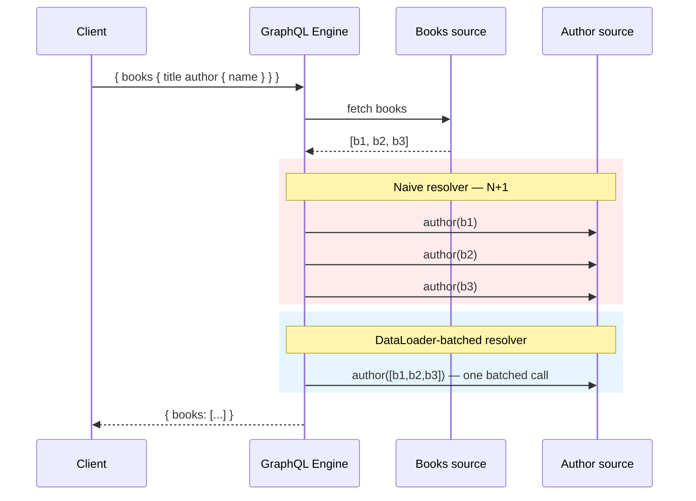

# GraphQL API Design

> **Topic register:** T-917 · split out of T-803 ("API design: REST, gRPC, GraphQL, versioning") on 2026-09-09 because the bundled topic named this protocol but never taught it — see `00-project/knowledge-architecture-blueprint.md` D8 and `00-project/syllabus-transformation-plan.md`'s extension note for the full reasoning.
> **Provenance:** every query result, error shape, and call-count in this chapter is real, executed output from graphql-java 26.1. Reproducible source: [`practice/java/graphql-api-design/`](../../practice/java/graphql-api-design/).

## Table of Contents

1. [Learning Objectives](#learning-objectives)
2. [Why This Matters in Interviews](#why-this-matters-in-interviews)
3. [Level 1 — Foundation](#level-1--foundation)
4. [Level 2 — Working Knowledge](#level-2--working-knowledge)
5. [Mental Model](#mental-model)
6. [Definition and Purpose](#definition-and-purpose)
7. [Historical Context](#historical-context)
8. [Core Concepts](#core-concepts)
9. [Internal Implementation](#internal-implementation)
10. [Diagrams](#diagrams)
11. [Production Scenarios](#production-scenarios)
12. [Trade-offs](#trade-offs)
13. [Decision Framework](#decision-framework)
14. [Comparisons](#comparisons)
15. [Common Mistakes](#common-mistakes)
16. [Anti-Patterns](#anti-patterns)
17. [Best Practices](#best-practices)
18. [Interview Answer Framework](#interview-answer-framework)
19. [Interview Questions](#interview-questions)
20. [Summary](#summary)
21. [Key Takeaways](#key-takeaways)
22. [Cheat Sheet](#cheat-sheet)
23. [Flashcards](#flashcards)
24. [Practice Exercises](#practice-exercises)
25. [Solutions](#solutions)
26. [Additional Reading](#additional-reading)
27. [Official References](#official-references)

---

## Learning Objectives

By the end of this chapter you can:

- Explain, with real measured evidence, why the naive GraphQL resolver pattern causes an N+1 backend-call problem, and how `DataLoader` batching fixes it.
- State precisely when a field failure produces a partial response versus wiping the entire response, and why that depends on schema nullability rather than being a fixed GraphQL behavior.
- Design a GraphQL schema's query, mutation, and type shape for a real domain, and explain what a client gains over the equivalent REST endpoints.
- Give a defensible, trade-off-aware answer to "should this API be GraphQL or REST?" rather than treating GraphQL as a strict upgrade.

## Why This Matters in Interviews

GraphQL appears in system-design and API-design interview rounds specifically because it inverts a decision REST makes implicitly: instead of the server deciding what shape each endpoint returns, the client asks for exactly the fields it needs in a single request. That inversion solves real problems (over-fetching, under-fetching, multiple round-trips for nested data) and introduces new ones (the N+1 resolver problem, uncapped query cost, cache-unfriendliness) that a Senior or Staff candidate is expected to name unprompted, with the specific mechanism, not just "it's more flexible."

## Level 1 — Foundation

Think of a restaurant with two very different ordering systems. REST is a fixed-menu restaurant: each dish (endpoint) comes as the kitchen decided to plate it — if you only want the protein, you still get the whole dish, and if you want the protein *and* a side that isn't on that plate, you place a second order. GraphQL is made-to-order: you tell the kitchen exactly which ingredients you want on your plate, in one order, and that's exactly what you get back — no more, no less.

Concretely: a REST endpoint like `GET /books/1` returns whatever fields that endpoint was built to return — every field, every time, whether the client needs them or not (over-fetching), and if the client also needs the book's author's name, that's usually a second request to `GET /authors/{id}` (under-fetching, forcing multiple round-trips). A GraphQL query in the same situation looks like this and returns exactly this, in one request:

```graphql
{ book(id: "1") { title author { name } } }
```

```
{book={title=Designing Data-Intensive Applications, author={name=Martin Kleppmann}}}
```

That's real output from this chapter's demo — one request, exactly the two fields asked for, nothing else.

## Level 2 — Working Knowledge

At this level you can read a GraphQL schema and correctly predict what a given query will return, and — more importantly — you can spot the specific failure mode that catches most engineers who are new to GraphQL: the **N+1 problem**. When a query asks for a list of items and a related field on each one (like `books { author { name } }`), a naively-written resolver calls its data source once *per item* — for 3 books, that's 3 separate calls to the author service, not 1. This chapter's demo proves this with a real counter: the naive resolver logs exactly `3` calls for 3 books; the same query against a `DataLoader`-batched resolver logs exactly `1`.

You should also be able to predict null-propagation behavior from a schema's nullability alone, without running anything: if a field is declared non-null (`author: Author!`) and its resolver throws, GraphQL doesn't just null out that one field — it walks *up* to the nearest field that's allowed to be null and nulls that instead, which can be the entire response. If the field is declared nullable (`author: Author`), the same failure only nulls that one field, and the rest of the response ships. This chapter measures both outcomes directly against the identical failure — see [Failure Modes](#internal-implementation).

## Mental Model

**GraphQL trades a fixed, server-decided response shape for a client-decided one, at the cost of moving complexity from "how many endpoints do I call" to "how do I resolve this field efficiently no matter how the client shaped the query."** Every core concept in this chapter follows from that trade: the schema is the contract that makes arbitrary client-shaped queries safely resolvable; the resolver-per-field model is what makes that flexibility possible; and the N+1 problem is the direct, unavoidable consequence of resolving a flexible query tree naively, one field at a time.

## Definition and Purpose

**GraphQL** is a query language and runtime for APIs, built around a single endpoint, a strongly-typed schema, and client-specified field selection. It exists to solve two concrete problems that show up hardest on mobile and low-bandwidth clients consuming REST APIs: **over-fetching** (an endpoint returns fields the client discards) and **under-fetching** (a client must issue several sequential requests to assemble one screen's worth of data, because the data spans REST resources). A single GraphQL query can request exactly the fields needed, across what would be several REST resources, in one round trip.

## Historical Context

GraphQL was developed internally at Facebook starting in 2012 to solve exactly the over/under-fetching problem for the Facebook mobile app, where every unnecessary field and every extra round-trip had a real, measurable cost on constrained mobile networks. Facebook open-sourced the specification in 2015. It is now governed by the GraphQL Foundation (under the Linux Foundation) as a vendor-neutral specification, with graphql-java (used in this chapter's demo), Apollo Server, and many other implementations across languages.

## Core Concepts

### Schema and type system (SDL)

A GraphQL API is described by a strongly-typed schema written in Schema Definition Language (SDL) — this chapter's demo schema:

```graphql
type Query {
  books: [Book!]!
  book(id: ID!): Book
}

type Mutation {
  addBook(title: String!, authorId: ID!): Book!
}

type Book {
  id: ID!
  title: String!
  author: Author!
}

type Author {
  id: ID!
  name: String!
}
```

`!` marks a field or argument as non-null — a schema-level guarantee that shapes both client expectations and the null-propagation behavior covered in [Internal Implementation](#internal-implementation). Every field in the schema is backed by a **resolver** (called a `DataFetcher` in graphql-java) — a small function that knows how to produce that field's value given its parent object.

### Queries, mutations, and subscriptions

Queries read data and are side-effect-free by convention; mutations perform writes and are the schema's explicit, named side-effect boundary (`addBook`, not an implicit side effect hidden inside a query). Subscriptions (not exercised in this chapter's demo, which focuses on the three call types that appear in almost every interview: query, mutation, and the N+1/DataLoader pattern) provide a long-lived connection over which the server pushes events to a subscribed client — the GraphQL equivalent of a REST API needing WebSockets or Server-Sent Events for real-time updates.

### The N+1 problem and DataLoader batching

Because each field has its own independent resolver, a query like `{ books { author { name } } }` resolves in two passes: first, `books` resolves to a list; then, for *each* book in that list, the `author` resolver runs independently. A naive `author` resolver that calls out to a data source directly therefore makes one call per book — for a list of `N` books, that's `N` calls plus the original `1` call for the list, hence "N+1."

`DataLoader` (the `java-dataloader` library, wired directly into graphql-java) fixes this by deferring each individual `load()` call within a single execution "tick," collecting the requested keys, and issuing exactly one batched call for all of them once every resolver in that tick has asked. This chapter's demo wires the identical query against both an unbatched and a `DataLoader`-batched `author` resolver and counts the real backend calls — see [Internal Implementation](#internal-implementation) for the exact numbers.

### Error handling and null propagation

GraphQL distinguishes two categories of error, and conflating them is a common, interview-visible mistake:

- **Validation-time errors** — the query itself is malformed (an unknown field, a type mismatch). The entire request is rejected before execution begins; `data` comes back `null`, and `errors` describes what was wrong with the query.
- **Execution-time errors** — the query is valid, but a specific resolver throws while running. GraphQL still returns HTTP `200` either way (GraphQL does not use HTTP status codes to carry error semantics — this is a common point of confusion for REST-background engineers) with a per-field error in the `errors` array, and how much of `data` survives depends entirely on **schema nullability**: a failure under a non-null field bubbles the null upward to the nearest nullable ancestor, which can wipe the entire response; a failure under a nullable field only nulls that one field.

### Query complexity and depth limiting

Because a client can shape arbitrary, deeply-nested queries against the same schema, an unbounded GraphQL API is exposed to a query that's cheap to *send* but extremely expensive to *resolve* — for example, a deeply nested query that fans out into thousands of resolver calls. Production GraphQL APIs defend against this with query complexity scoring (assigning a cost to each field and rejecting queries above a budget) and maximum query depth limits, the GraphQL-specific equivalent of REST's simpler per-endpoint rate limiting.

## Internal Implementation

**Prove the N+1 problem is real, then prove the fix, with actual call counts.**

Real, executed output from this chapter's demo (`practice/java/graphql-api-design/`), running the identical query `{ books { title author { name } } }` against 3 books:

```
=== Naive per-object resolver ===
>>> author backend was called 3 times for 3 books (N+1)

=== DataLoader-batched resolver ===
>>> author backend was called 1 time(s) for the same 3 books
```

The naive resolver's `author` `DataFetcher` calls the author data source directly, once per book, exactly as the schema's field-per-resolver model implies. The `DataLoader`-batched version instead calls `DataLoader.load(authorId)` — which does not hit the backend immediately, but queues the key — and graphql-java dispatches all queued loads for the current execution level in one batch, invoking the registered `BatchLoader` exactly once with all three author IDs. Same query, same data, real 3-to-1 reduction in backend calls.

**Prove null propagation depends on nullability, not on GraphQL itself.**

Real, executed output for the identical resolver failure (an exception thrown for one book's author), against two schemas that differ only in one field's nullability:

```
=== author: Author!  (non-null) ===
data:   null
errors: [ExceptionWhileDataFetching{path=[books, 1, author], ...}]

=== author: Author   (nullable) ===
data:   {books=[{title=..., author={name=...}}, {title=..., author=null}, {title=..., author={name=...}}, ...]}
errors: [ExceptionWhileDataFetching{path=[books, 1, author], ...}]
```

Identical failure, identical error entry in both — the only difference is the schema's nullability declaration on one field, and it's the difference between "the whole response is gone" and "one field is null, everything else survives." This is the concrete mechanism behind the common, half-true claim that "GraphQL always partially succeeds."

## Diagrams



## Production Scenarios

### Scenario: a new mobile screen quietly overloads the author service

**Symptoms.** A mobile team ships a new "library" screen that queries `{ books { title author { name } } }` for a scrollable list. Shortly after rollout, the author service's request rate and p99 latency both spike, and its on-call is paged for a service that "nothing changed" for on its own side.

**Impact.** Elevated latency and error rate on the author service, cascading into slower responses for every other client of that service, not just the new screen.

**Initial hypotheses.** A deploy to the author service itself (checked — no recent deploy); a traffic spike from an unrelated client (checked — the request pattern's timing lines up exactly with the new screen's rollout); the GraphQL layer resolving `author` per-book rather than batched (correct).

**Evidence.** Request logs on the author service show request volume scaling linearly with the number of books rendered per screen load — exactly the N+1 pattern this chapter measures directly (3 calls for 3 books, not 1).

**Diagnosis.** The `author` field's resolver was written as a direct, per-object call to the author service with no batching — the default, easiest way to write a GraphQL resolver, and exactly the trap this chapter's Core Concepts section names.

**Immediate mitigation.** Add a response-time budget / rate limit in front of the author service to protect it while a proper fix ships, accepting degraded (but bounded) latency on the library screen in the interim.

**Permanent remediation.** Replace the direct-call resolver with a `DataLoader`-batched one, exactly as demonstrated in this chapter — collapsing the per-screen-load call count from `O(books per page)` to `O(1)`.

**Alternatives considered.** Caching author lookups — rejected as a first fix, since it reduces load only for repeated lookups of the *same* author and does nothing for the first page load, whereas batching fixes the root cause for every load.

**Trade-offs.** `DataLoader` batching requires resolvers to be written to defer and batch rather than call out directly — a small amount of upfront resolver-design discipline, in exchange for avoiding O(N) backend calls on every list-shaped query.

**Prevention.** Any resolver for a field reachable from a list should default to a `DataLoader`-batched implementation, not a direct call — treat the direct-call pattern as the anti-pattern, not the default.

**Interview lesson.** This is Interview Question 1 below, arriving as a real incident: the N+1 problem is not a theoretical concern raised only in interviews — it reproduces at real production scale the moment a list-shaped query reaches a nested field.

## Trade-offs

| Approach | Benefit | Cost |
|---|---|---|
| GraphQL, single endpoint, client-shaped queries | No over/under-fetching; one round trip for nested data | Uncapped query cost risk; requires complexity/depth limiting |
| Naive per-object resolver | Simple to write | Real N+1 backend-call blowup, proportional to list size |
| `DataLoader`-batched resolver | Collapses N+1 to O(1) per level | Resolvers must be written to defer/batch, not call out directly |
| Non-null (`!`) schema fields | Strong guarantees for clients | A single failure can null the entire response |

## Decision Framework

1. **Do multiple client screens need overlapping-but-different shapes of the same underlying data** (the classic mobile over/under-fetching problem)? If yes, GraphQL's client-shaped queries are a strong fit.
2. **Does every field reachable from a list have a resolver that could be called once per item?** If yes, that resolver must be `DataLoader`-batched before shipping, not after a production incident.
3. **Should a given field's failure be allowed to null the entire response, or just that field?** Decide this explicitly per field via schema nullability — don't let it be an accident of "whatever felt natural when writing the schema."
4. **Is the team prepared to operate query complexity/depth limiting?** A GraphQL API without this is exposed to a single client query that's cheap to send and arbitrarily expensive to resolve — REST's simpler per-endpoint rate limiting doesn't have a direct equivalent here.

## Comparisons

| Aspect | REST | GraphQL |
|---|---|---|
| Response shape | Fixed per endpoint (over/under-fetching risk) | Client-specified per request |
| Round trips for nested data | Often multiple | Typically one |
| Caching | HTTP-cache-friendly (GET + URL as cache key) | Harder — single endpoint, POST-shaped queries by default |
| Error transport | HTTP status codes | HTTP 200 + `errors` array; status codes don't carry error semantics |
| Cost-control mechanism | Per-endpoint rate limiting | Query complexity / depth limiting |
| N+1 risk | Not inherent to the protocol | Inherent to the resolver-per-field model unless batched |

## Common Mistakes

- Writing a resolver for a field reachable from a list as a direct per-object call, without checking whether it will be N+1 in production.
- Assuming GraphQL "always partially succeeds" without checking the specific field's nullability — a non-null field's failure can null the entire response.
- Treating HTTP status codes as carrying GraphQL error semantics (a GraphQL error still returns HTTP `200`).
- Shipping a GraphQL API with no query complexity or depth limit.

## Anti-Patterns

- **Resolving list-nested fields with direct, unbatched calls** — the default way to write a resolver, and the direct cause of the N+1 problem this chapter measures.
- **Making every field non-null "for simplicity"** without considering that a single failure anywhere in that non-null chain nulls everything up to the nearest nullable ancestor.
- **Shipping a public GraphQL endpoint with no query cost limit**, leaving it exposed to a single expensive client query.
- **Building a GraphQL wrapper that just proxies one-to-one to existing REST endpoints** without addressing the N+1 problem that emerges the moment those calls are composed into a single query.

## Best Practices

- Default every resolver for a field reachable from a list to a `DataLoader`-batched implementation.
- Decide each field's nullability deliberately, based on whether that field's failure should be allowed to null its ancestors.
- Implement query complexity scoring or depth limiting before exposing a GraphQL API publicly.
- Keep mutations as the explicit, named boundary for side effects — never hide a side effect inside a query resolver.

## Interview Answer Framework

### 30-Second Answer

GraphQL lets a client request exactly the fields it needs, across what would be several REST resources, in one request — solving REST's over/under-fetching. The honest cost: resolving a field per object naively causes a real N+1 backend-call problem, fixed with `DataLoader` batching, which collapses N calls into 1.

### 2-Minute Answer

Definition: GraphQL is a single-endpoint, strongly-typed query language where the client specifies exactly which fields it wants. Why it exists: to eliminate REST's over-fetching (unused fields) and under-fetching (multiple round trips for nested data), which mattered most for Facebook's mobile clients where it originated. How it works: each schema field has its own resolver, executed independently — which is exactly why nested list fields resolve one-per-item unless batched. One important trade-off: `DataLoader` batching fixes N+1 but requires resolvers to be written to defer and batch rather than call out directly. Production example: a real, measured 3-calls-for-3-books naive result versus 1 call for the same 3 books once batched.

### 10-Minute Deep Dive

Cover, in order: the mental model — GraphQL trades a fixed response shape for a client-decided one, at the cost of per-field resolution complexity (mental model); the schema/resolver model and why it makes N+1 essentially the default outcome, not an edge case (internals); the real, measured N+1-to-1 reduction via `DataLoader` (internals, real evidence); the null-propagation mechanism and its dependence on schema nullability, with the real "whole response gone" vs. "one field null" comparison (edge case, real evidence); and close with the production scenario — a new mobile screen's N+1 query overloading a downstream service, exactly the failure this topic exists to prevent.

### Whiteboard Explanation

Draw the [§ Diagrams](#diagrams) sequence: one client query, one `books` fetch, then branch into the red "naive" box (three separate arrows to the author source) versus the blue "batched" box (one arrow carrying all three IDs). The visual contrast — three arrows collapsing into one — makes the batching fix obvious without narration.

### Production Example

The mobile-screen incident in [§ Production Scenarios](#production-scenarios): a new list screen's nested `author` field, resolved naively, scaled the author service's load linearly with books-per-page until it was batched.

### Trade-offs to Mention

State unprompted: GraphQL's flexibility moves complexity from "how many endpoints" to "how efficiently does each field resolve," and the N+1 problem is the direct, measurable cost of getting that wrong; null propagation is a schema-nullability decision, not a fixed behavior; query cost must be actively bounded since the client controls query shape.

### Common Candidate Mistakes

Describing GraphQL purely as "flexible REST" without naming N+1; claiming GraphQL responses "always" partially succeed; not knowing that GraphQL errors still return HTTP `200`.

### Typical Follow-Up Questions

1. "Walk through exactly what `DataLoader` does differently from a direct resolver call."
2. "If `author` were nullable instead of non-null, what would the response look like for the same failure?"
3. "How would you protect this API from an intentionally expensive, deeply-nested query?"

### Senior-Level Expectations

Correctly names the N+1 problem and proposes `DataLoader` batching with the right mechanism (deferred, batched load within an execution tick, not just "caching").

### Staff-Level Discussion

The N+1 problem is not a GraphQL bug — it's the direct, structural consequence of a resolver-per-field execution model, which means it recurs at every new nested field a team adds, not just the ones caught in code review. Staff-level ownership means establishing `DataLoader` batching (or an equivalent) as the *default* resolver pattern for anything reachable from a list, enforced via review or lint rather than relying on every engineer to remember it, plus deliberate, field-by-field nullability decisions and query cost limiting established before the API is public — because by the time an unbatched resolver or an unbounded query becomes a production incident, it typically already has real client traffic depending on the exact (accidental) shape of the current behavior.

## Interview Questions

### Question 1 — A GraphQL API's response times degrade badly on a specific nested query. Diagnose it.

**Why interviewers ask it.** Tests whether the candidate can connect a vague symptom ("it's slow") to the specific, nameable mechanism (N+1) rather than guessing at generic causes.

**Expected answer.** Identifies that a field resolved for each item in a list, backed by a direct per-object call, causes one backend call per item — proposes `DataLoader` batching as the fix.

**Minimum acceptable answer.** Recognizes "N+1" by name, even without explaining the batching mechanism.

**Strong Senior answer.** Correctly names the mechanism and proposes `DataLoader` batching with the right explanation (deferred, batched dispatch within one execution tick).

**Staff-level extension.** Frames this as a recurring, structural risk for every new nested field, not a one-off bug, and proposes making batched resolvers the enforced default.

**Common mistakes.** Proposing caching as the primary fix (helps repeated lookups, does nothing for the first load); blaming the database or network without checking the resolver's call pattern.

**Likely follow-ups.** "What does `DataLoader` do if two different fields request the same key in the same tick?"

**Evaluation criteria (1–5).** 1: "GraphQL is just slow." 3: correctly names N+1 and proposes batching. 5: names N+1, explains the batching mechanism precisely, and frames it as a structural/organizational risk.

**Related references.** [§ Internal Implementation](#internal-implementation); [§ Production Scenarios](#production-scenarios).

---

### Question 2 — A resolver throws partway through a query. What comes back to the client?

**Why interviewers ask it.** Separates candidates who understand GraphQL's null-propagation mechanism from those who've memorized "GraphQL partially succeeds" as a slogan.

**Expected answer.** Depends on the failing field's nullability: if nullable, only that field is null and the rest of the response ships; if non-null, the null bubbles up to the nearest nullable ancestor, which can null the entire response.

**Minimum acceptable answer.** States that GraphQL returns HTTP `200` with an `errors` array either way, even without the nullability distinction.

**Strong Senior answer.** Correctly states the nullability-dependent bubbling behavior.

**Staff-level extension.** Connects this to deliberate schema design — nullability should be a considered decision about failure blast radius, not an implementation detail.

**Common mistakes.** Assuming GraphQL always returns partial data regardless of schema; assuming a GraphQL error changes the HTTP status code.

**Likely follow-ups.** "Why does GraphQL use HTTP 200 even when a resolver throws?"

**Evaluation criteria (1–5).** 1: assumes error changes HTTP status or always partially succeeds. 3: correct nullability-dependent bubbling behavior. 5: bubbling behavior plus the schema-design framing.

**Related references.** [§ Core Concepts — Error handling and null propagation](#core-concepts); [§ Internal Implementation](#internal-implementation).

## Summary

GraphQL replaces REST's fixed, server-decided response shape with a client-specified one, solving over/under-fetching at the cost of new failure modes: the N+1 resolver problem (measured in this chapter at a real 3-to-1 call reduction once batched) and nullability-dependent null propagation (measured as the literal difference between an empty response and a mostly-intact one for the identical failure).

## Key Takeaways

- The N+1 problem is structural, not incidental — a field resolver per list item runs once per item unless explicitly batched.
- `DataLoader` fixes it by deferring and batching loads within one execution tick — measured here as a real 3-to-1 call reduction.
- Null propagation bubbles up to the nearest nullable ancestor on failure — schema nullability decides the blast radius of any one field's failure.
- GraphQL errors return HTTP `200`; error semantics live in the response body's `errors` array, not the status code.

## Cheat Sheet

| Situation | What to reach for |
|---|---|
| A field reachable from a list needs a backend/DB lookup | `DataLoader`-batched resolver, by default |
| Deciding a field's nullability | Ask: should this field's failure be allowed to null its ancestors? |
| Protecting a public GraphQL endpoint from expensive queries | Query complexity scoring or max depth limiting |
| Explaining a GraphQL error to a REST-background engineer | Still HTTP 200; check the `errors` array, not the status code |

## Flashcards

### Card: Why N+1 happens in GraphQL

**Prompt:**
Why does a naive GraphQL resolver cause an N+1 problem?

**Answer:**
Each field has its own independent resolver; a field on every item in a list runs once per item unless explicitly batched.

**Why it matters:**
Measured directly in this chapter: 3 backend calls for 3 books, naive; 1 call, batched.

**Common trap:**
Assuming GraphQL handles this automatically without `DataLoader` or an equivalent.

**Related:**
[Internal Implementation](#internal-implementation)

### Card: What decides partial vs. total failure

**Prompt:**
What determines whether a resolver failure nulls one field or the entire response?

**Answer:**
The failing field's nullability in the schema — non-null bubbles the null up to the nearest nullable ancestor.

**Why it matters:**
The precise mechanism behind the oversimplified claim "GraphQL always partially succeeds."

**Common trap:**
Assuming partial success is guaranteed regardless of schema design.

**Related:**
[Core Concepts](#core-concepts)

### Card: GraphQL errors and HTTP status

**Prompt:**
What HTTP status code does a GraphQL API return when a resolver throws?

**Answer:**
Still `200` — error semantics live in the response body's `errors` array, not the status code.

**Why it matters:**
A common source of confusion for engineers moving from REST.

**Common trap:**
Expecting a `4xx`/`5xx` status the way a REST API would return one.

**Related:**
[Core Concepts](#core-concepts)

## Practice Exercises

1. Reproduce the N+1-to-1 measurement yourself: [`practice/java/graphql-api-design/`](../../practice/java/graphql-api-design/).
2. Modify the demo's schema so `Book.author` is a list of co-authors (`[Author!]!`) instead of a single `Author!`, and update the `DataLoader` batch loader accordingly.
3. Design a query complexity scoring scheme for the demo's schema: assign a cost to `books`, `book`, and `author`, and decide what total budget a single request should be allowed.

## Solutions

**Exercise 1.** Expected output matches this chapter's measured numbers: `3` backend calls for the naive resolver, `1` for the `DataLoader`-batched resolver, against the identical 3-book query.

**Exercise 2.** A correct solution changes the schema field to `author: [Author!]!` (or keeps a single primary author plus a separate co-authors list), updates the in-memory data model to carry multiple author IDs per book, and updates the `BatchLoader` to still key by author ID — the batching mechanism doesn't change, only the field's cardinality.

**Exercise 3.** No single expected answer — a reasonable scheme assigns a low fixed cost to scalar fields, a cost proportional to `first`/`limit` arguments for list fields, and a multiplicative cost for nested fields (since `books { author { name } }` costs more than `books { title }`), with a total request budget low enough to block a deliberately deep, fanned-out query while allowing normal client usage.

## Additional Reading

- [GraphQL: A data query language](https://engineering.fb.com/2015/09/14/core-data/graphql-a-data-query-language/) — Meta's original announcement of the open-sourced specification

## Official References

- [GraphQL Specification](https://spec.graphql.org/) — the language and execution specification
- [graphql-java Documentation](https://www.graphql-java.com/documentation/) — the library used in this chapter's demo
