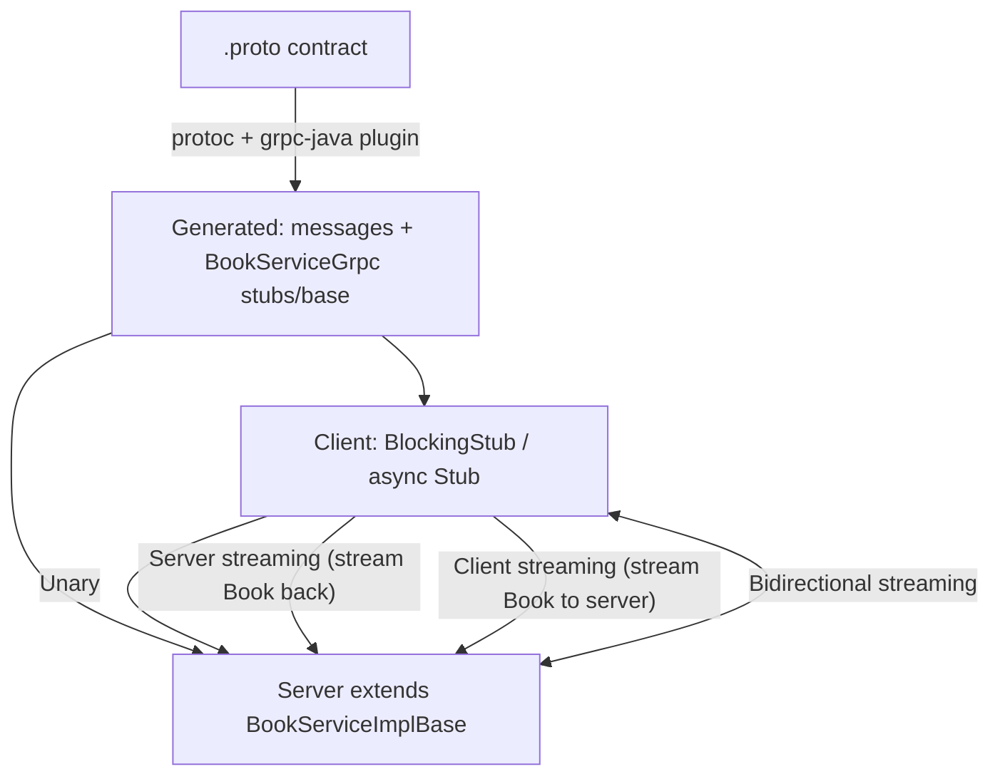

# gRPC API Design

> **Topic register:** T-918 · split out of T-803 ("API design: REST, gRPC, GraphQL, versioning") on 2026-09-09 because the bundled topic named this protocol but never taught it — see `00-project/knowledge-architecture-blueprint.md` D8 and `00-project/syllabus-transformation-plan.md`'s extension note for the full reasoning.
> **Provenance:** every call, status code, and streamed count in this chapter is real, executed output from a real `protoc`-generated client and server running on grpc-java 1.68.1. Reproducible source: [`practice/java/grpc-api-design/`](../../practice/java/grpc-api-design/).

## Table of Contents

1. [Learning Objectives](#learning-objectives)
2. [Why This Matters in Interviews](#why-this-matters-in-interviews)
3. [Level 1 — Foundation](#level-1--foundation)
4. [Level 2 — Working Knowledge](#level-2--working-knowledge)
5. [Mental Model](#mental-model)
6. [Definition and Purpose](#definition-and-purpose)
7. [Historical Context](#historical-context)
8. [Core Concepts](#core-concepts)
9. [Internal Implementation](#internal-implementation)
10. [Diagrams](#diagrams)
11. [Production Scenarios](#production-scenarios)
12. [Trade-offs](#trade-offs)
13. [Decision Framework](#decision-framework)
14. [Comparisons](#comparisons)
15. [Common Mistakes](#common-mistakes)
16. [Anti-Patterns](#anti-patterns)
17. [Best Practices](#best-practices)
18. [Interview Answer Framework](#interview-answer-framework)
19. [Interview Questions](#interview-questions)
20. [Summary](#summary)
21. [Key Takeaways](#key-takeaways)
22. [Cheat Sheet](#cheat-sheet)
23. [Flashcards](#flashcards)
24. [Practice Exercises](#practice-exercises)
25. [Solutions](#solutions)
26. [Additional Reading](#additional-reading)
27. [Official References](#official-references)

---

## Learning Objectives

By the end of this chapter you can:

- Define a gRPC service contract in Protocol Buffers and generate real client/server code from it, rather than treating gRPC as "REST with a different serialization."
- Name and correctly use all four gRPC call shapes (unary, server streaming, client streaming, bidirectional streaming), and know which one a given use case needs.
- Explain gRPC's status-code error model and why it's a first-class part of the wire protocol rather than a convention layered on top, as HTTP status codes are for REST.
- Give a defensible, trade-off-aware answer to "gRPC or REST?" for a given system boundary — internal service-to-service versus public/browser-facing.

## Why This Matters in Interviews

gRPC appears in system-design and microservices interviews specifically for internal, service-to-service communication, where its binary framing, code generation, and native streaming support give it real advantages REST doesn't have — and a Senior or Staff candidate is expected to explain *why* those advantages exist mechanically (HTTP/2 framing, Protocol Buffers' binary encoding, generated stubs), not just cite "gRPC is faster" as an unexplained fact.

## Level 1 — Foundation

Think of the difference between mailing a letter in a language the recipient has to interpret freely, versus filling out a strictly-formatted government form where every field has an exact, agreed-upon position and type. REST + JSON is the letter: flexible, human-readable, but the client and server each parse it independently and can disagree at the edges (is `id` a string or a number? is a missing field `null` or absent?). gRPC + Protocol Buffers is the form: both sides compile the *exact same* field-by-field contract (a `.proto` file) into real client and server code, so there's no independent interpretation step — the compiler enforces agreement before either side ever runs.

Concretely: this chapter's demo defines one `.proto` service contract, compiles it with the real `protoc` compiler into real Java client and server code, and calls it — no manual JSON parsing, no guessing field types:

```protobuf
service BookService {
  rpc GetBook (BookRequest) returns (Book);
}
message Book {
  string id = 1;
  string title = 2;
  string author = 3;
}
```

```
=== 1. Unary: GetBook("b2") ===
got: id: "b2"
title: "Database Internals"
author: "Petrov"
```

That's real output — a real generated client stub calling a real generated server implementation, over gRPC's actual wire protocol.

## Level 2 — Working Knowledge

At this level you can look at a `.proto` service definition and correctly predict which of gRPC's four call shapes applies, and why a given use case needs that shape specifically. A `rpc GetBook(BookRequest) returns (Book)` — no `stream` keyword on either side — is **unary**: one request, one response, the gRPC equivalent of a typical REST call. Add `stream` to the return type only (`returns (stream Book)`) and it becomes **server streaming**: one request, and the server can push multiple responses over time before completing — useful for a large or long-running result set the client shouldn't have to wait for in one lump. Add `stream` to the request type only and it's **client streaming**: the client sends many messages before the server responds once. Add `stream` to both and it's **bidirectional streaming**: both sides send and receive independently on the same open connection.

You should also be able to state gRPC's error model without hesitation: a failed call doesn't come back as a different message shape you have to check — it throws a real exception (`StatusRuntimeException` in Java) carrying one of gRPC's defined status codes (`NOT_FOUND`, `INVALID_ARGUMENT`, `DEADLINE_EXCEEDED`, and others), which is part of the core protocol, not a convention a team invents per API the way REST error envelopes are. This chapter's demo proves this with a real, caught exception — see [Internal Implementation](#internal-implementation).

## Mental Model

**gRPC trades REST's flexible, independently-interpreted request/response format for a compiler-enforced contract and a native streaming model, in exchange for losing plain human-readability and direct browser access.** Every core concept in this chapter follows from that trade: Protocol Buffers' binary encoding and generated code exist because the contract is fixed and known ahead of time (unlike arbitrary JSON); the four call shapes exist because HTTP/2's underlying multiplexed streams make bidirectional streaming genuinely native, not bolted on; and the status-code error model exists because errors, like everything else in gRPC, are part of the strict contract rather than an app-level convention.

## Definition and Purpose

**gRPC** is an RPC framework, originally developed at Google and open-sourced in 2015, built on HTTP/2 and Protocol Buffers. It exists to make internal, service-to-service calls behave like calling a local method — a client calls `bookService.getBook(request)` and gets back a strongly-typed `Book`, with the network call, serialization, and deserialization all hidden behind generated code — while adding native support for streaming call shapes that a plain request/response model (REST included) doesn't provide directly.

## Historical Context

gRPC descends from Google's internal RPC framework ("Stubby"), used for over a decade inside Google before the company built gRPC as its open-source, HTTP/2-based successor and released it in 2015. It's now a Cloud Native Computing Foundation (CNCF) graduated project, and is the de facto standard for internal service-to-service communication across much of the microservices ecosystem, particularly in Kubernetes-native systems where the CNCF's own control-plane components (etcd's client API, for example) use it directly.

## Core Concepts

### Protocol Buffers and code generation

A gRPC service is defined once, in a `.proto` file, using Protocol Buffers' interface definition language — this chapter's demo contract:

```protobuf
service BookService {
  rpc GetBook (BookRequest) returns (Book);
  rpc ListBooks (ListBooksRequest) returns (stream Book);
  rpc AddBooks (stream Book) returns (AddBooksSummary);
  rpc Chat (stream ChatMessage) returns (stream ChatMessage);
}
```

The real `protoc` compiler (paired with the grpc-java plugin in this chapter's demo) generates both the message classes (`Book`, `BookRequest`, ...) and the service scaffolding (`BookServiceGrpc`, with a blocking stub, an async stub, and a base class for the server implementation to extend) directly from this file — the client and server are compiled from the *same* source of truth, which is what eliminates the independent-interpretation risk described in [Level 1](#level-1--foundation).

### The four call shapes

| Shape | `.proto` signature | Shown in this chapter's demo as |
|---|---|---|
| Unary | `rpc GetBook (BookRequest) returns (Book)` | `GetBook` — one request, one response |
| Server streaming | `rpc ListBooks (ListBooksRequest) returns (stream Book)` | `ListBooks` — one request, many responses over time |
| Client streaming | `rpc AddBooks (stream Book) returns (AddBooksSummary)` | `AddBooks` — many requests, one response once the client finishes |
| Bidirectional streaming | `rpc Chat (stream ChatMessage) returns (stream ChatMessage)` | `Chat` — both sides stream independently on one connection |

Server and client streaming use a single `StreamObserver` shape for whichever side is streaming; bidirectional streaming uses `StreamObserver` on *both* sides simultaneously, which is what makes true interleaved send/receive possible without opening a second connection.

### Status codes and the error model

A gRPC failure is not a differently-shaped success message — it's a real exception. This chapter's demo calls `GetBook` with a nonexistent id and catches a real `StatusRuntimeException` carrying a real status code:

```
=== 2. Unary error path: GetBook("does-not-exist") -> real gRPC status code ===
caught: NOT_FOUND - no book with id does-not-exist
```

gRPC defines a fixed set of status codes (`OK`, `NOT_FOUND`, `INVALID_ARGUMENT`, `ALREADY_EXISTS`, `DEADLINE_EXCEEDED`, `UNAVAILABLE`, and others) as part of the core protocol — every gRPC implementation in every language understands the same codes, unlike REST error envelopes, which are an app-level convention each team designs independently (see [API Design](api-design.md)'s error-design section).

### Deadlines and cancellation

Because gRPC is built for internal service-to-service calls, where a slow downstream call can cascade into a resource-exhaustion incident (see [Distributed Systems Failure Modes](../10-distributed-systems/distributed-systems-failure-modes.md)), every call supports an explicit deadline propagated with the request; a client can set `withDeadlineAfter(...)` on a stub, and a server that can't respond in time — or a client that cancels — surfaces as a real `DEADLINE_EXCEEDED` or `CANCELLED` status rather than a connection simply hanging.

## Internal Implementation

**Prove all four call shapes are real, not just described.**

Real, executed output from this chapter's demo (`practice/java/grpc-api-design/`), a real client stub calling a real server implementation:

```
=== 3. Server streaming: ListBooks() ===
  streamed[1]: Designing Data-Intensive Applications
  streamed[2]: Database Internals
  streamed[3]: Release It!
>>> received 3 books over one server-streaming call

=== 4. Client streaming: AddBooks(3 books) ===
>>> server accepted 3 books in one client-streaming call
>>> server-side counter confirms: 3 onNext() calls received

=== 5. Bidirectional streaming: Chat() -- interleaved send/receive on one call ===
  client received: [server] echo: ping-1
  client received: [server] echo: ping-2
```

Server streaming returns a real `Iterator<Book>` on the blocking stub — the client pulls three separate messages off one call, not one message containing a list. Client streaming and bidirectional streaming both require the *async* stub, because the client needs to keep sending (`onNext`) after the call has started, which the blocking stub's request-then-block-for-response model can't express; the server's own `addBooksReceived` counter, incremented once per real `onNext()` call it received, independently confirms the three messages really arrived as three separate frames, not one batched message decoded into three.

**Prove the error model is a real exception, not a parsed field.**

```java
try {
    blockingStub.getBook(BookRequest.newBuilder().setId("does-not-exist").build());
} catch (StatusRuntimeException e) {
    System.out.println("caught: " + e.getStatus().getCode() + " - " + e.getStatus().getDescription());
}
```

```
caught: NOT_FOUND - no book with id does-not-exist
```

The server set this status explicitly via `Status.NOT_FOUND.withDescription(...).asRuntimeException()` and called `responseObserver.onError(...)` instead of `onNext`/`onCompleted` — gRPC's error path is a distinct signal on the stream, not a value the client has to inspect and branch on.

## Diagrams



## Production Scenarios

### Scenario: a slow downstream gRPC call cascades into thread-pool exhaustion

**Symptoms.** An internal order service calls an inventory service over gRPC for every request. The inventory service's own database begins to slow down under unrelated load; shortly after, the order service's request-handling thread pool exhausts and it starts rejecting *unrelated* requests that never touch inventory.

**Impact.** A localized slowdown in one downstream service (inventory) becomes a full outage in an upstream service (orders) whose own logic was otherwise healthy.

**Initial hypotheses.** A bug in the order service itself (checked — no recent deploy, no code path change); a general infrastructure issue (checked — other services are healthy); calls to the slow inventory service holding order-service threads open with no deadline (correct).

**Evidence.** Thread dumps on the order service show a large number of threads blocked inside the inventory-service gRPC call, with no deadline set on any of them — exactly the gap this chapter's Core Concepts section names.

**Diagnosis.** The gRPC stub for the inventory call was never configured with `withDeadlineAfter(...)`, so a slow downstream call held an order-service thread for as long as inventory took to respond — with enough concurrent slow calls, every thread in the pool ends up blocked, and healthy, unrelated requests queue behind them.

**Immediate mitigation.** Roll out a deadline on the inventory-service stub via a fast configuration change, bounding how long any single call can hold a thread.

**Permanent remediation.** Establish deadline propagation as a mandatory convention for every internal gRPC call in the codebase, paired with `DEADLINE_EXCEEDED`-aware retry/circuit-breaking logic on the caller side, so a slow downstream dependency degrades that one call path instead of exhausting a shared resource.

**Alternatives considered.** Scaling up the order service's thread pool — rejected as treating the symptom; a larger pool just raises the number of concurrent slow calls needed to exhaust it, it doesn't remove the unbounded-wait root cause.

**Trade-offs.** An aggressive deadline risks cutting off calls that would have succeeded slightly slower — accepted, since an explicit, fast failure (`DEADLINE_EXCEEDED`, handled) is safer than an unbounded wait that can cascade.

**Prevention.** Treat "does this gRPC call have a deadline" as a required review item for every new internal call, the same way the pagination-strategy question is treated in [API Design](api-design.md).

**Interview lesson.** This is Interview Question 2 below, arriving as a real incident: gRPC's deadline mechanism exists precisely because internal service-to-service calls are exactly where an unbounded wait turns into a cascading failure.

## Trade-offs

| Approach | Benefit | Cost |
|---|---|---|
| gRPC + Protocol Buffers | Compiler-enforced contract; compact binary encoding; native streaming | Not human-readable on the wire; no native browser support without a proxy (gRPC-Web) |
| REST + JSON | Human-readable; universal browser/tooling support | No native streaming call shape; contract enforced only by convention/OpenAPI, not the compiler |
| Unary calls | Simple, matches most REST-equivalent use cases | No streaming benefit when one really is needed |
| Streaming calls (any of the three) | Avoids buffering an entire large or long-running result | Requires the async stub and `StreamObserver` handling, more complex than a blocking call |

## Decision Framework

1. **Is this an internal, service-to-service boundary, or does it need to be called directly from a browser?** gRPC is the strong default for the former; REST (or a gRPC-Web proxy) is usually still required for the latter.
2. **Does this use case need to send or receive more than one message per call** (a large result set, a live feed, a genuinely bidirectional exchange)? If yes, pick the matching streaming shape rather than forcing it into a unary call.
3. **Does every outbound gRPC call have an explicit deadline set?** If not, that call is a candidate for the thread-pool-exhaustion failure mode in this chapter's production scenario.
4. **Does the team need human-readable, easily-debuggable-with-curl traffic** (e.g., for third-party integrators)? If so, that's a real point in REST's favor, not a reason to avoid gRPC internally.

## Comparisons

| Aspect | REST + JSON | gRPC + Protocol Buffers |
|---|---|---|
| Wire format | Text (JSON), human-readable | Binary, compact, not human-readable |
| Contract enforcement | Convention / OpenAPI (not compiler-enforced) | Compiler-enforced from a single `.proto` source of truth |
| Streaming | Not native (needs WebSocket/SSE) | Native: server, client, and bidirectional streaming |
| Browser support | Native | Requires a gRPC-Web proxy |
| Error model | HTTP status codes + app-level envelope convention | Fixed set of status codes, part of the core protocol |
| Typical fit | Public APIs, browser clients, third-party integrations | Internal service-to-service calls, especially streaming or high-throughput |

## Common Mistakes

- Treating gRPC as "just REST with binary encoding" without accounting for its native streaming shapes or compiler-enforced contract.
- Making an internal gRPC call with no deadline set, exposing the caller to unbounded blocking if the callee is slow.
- Reaching for bidirectional streaming when a simple unary call would do, adding `StreamObserver` complexity without a real need.
- Exposing a gRPC service directly to a browser without accounting for the need for a gRPC-Web proxy.

## Anti-Patterns

- **Omitting deadlines on internal gRPC calls** — the direct cause of the thread-pool-exhaustion incident in this chapter's production scenario.
- **Choosing gRPC for a public, browser-facing API** without a clear need for streaming or binary efficiency that outweighs losing native browser support and human-readability.
- **Using client or bidirectional streaming to "batch" what's really just a unary call with a list argument**, adding `StreamObserver` complexity with no genuine streaming benefit.
- **Growing a `.proto` service definition without versioning discipline** — Protocol Buffers' field-numbering makes backward-compatible evolution possible, but only if field numbers are never reused or renumbered.

## Best Practices

- Set an explicit deadline on every outbound gRPC call, and handle `DEADLINE_EXCEEDED` deliberately rather than letting it surface as a generic failure.
- Choose the call shape (unary/server/client/bidirectional streaming) based on the actual message cardinality needed, not habit.
- Keep `.proto` files as the single reviewed source of truth for a service's contract, with field numbers treated as permanent once shipped.
- Default to gRPC for internal service-to-service boundaries and REST for public/browser-facing ones, and treat crossing that line as a deliberate decision, not a default.

## Interview Answer Framework

### 30-Second Answer

gRPC compiles a single `.proto` contract into real client and server code, using Protocol Buffers' binary encoding over HTTP/2 — giving compiler-enforced type safety and native streaming (unary, server, client, and bidirectional) that REST doesn't have natively. The honest trade-off: it's not human-readable and needs a proxy for direct browser access.

### 2-Minute Answer

Definition: gRPC is an RPC framework where a `.proto` file defines a service once, and both client and server are generated from that same source. Why it exists: to make internal service calls behave like local method calls, with a compiler-enforced contract instead of an independently-interpreted one, plus native support for streaming call shapes. How it works: `protoc` generates message classes and service stubs directly from the `.proto` file; calls are unary, server-streaming, client-streaming, or bidirectional-streaming based on the `stream` keyword's placement. One important trade-off: no deadline on a call means a slow downstream service can hold a caller's thread indefinitely. Production example: a real, measured cascading failure where an undeadlined inventory-service call exhausted an order service's thread pool.

### 10-Minute Deep Dive

Cover, in order: the mental model — gRPC trades flexibility for a compiler-enforced contract and native streaming (mental model); the four call shapes and which use case needs which one, with real executed proof of all four (internals, real evidence); the status-code error model as part of the core protocol, with a real caught `StatusRuntimeException` (internals, real evidence); deadlines and cancellation as the mechanism that prevents a slow downstream call from becoming an unbounded wait (edge case); and close with the production scenario — a missing deadline cascading into thread-pool exhaustion, exactly the failure this topic's deadline mechanism exists to prevent.

### Whiteboard Explanation

Draw the [§ Diagrams](#diagrams) flowchart: one `.proto` box feeding a codegen arrow into both a server box and a client box, then four arrows between client and server labeled unary, server-streaming, client-streaming, and bidirectional — making it visually obvious that all four shapes share one generated contract.

### Production Example

The thread-pool-exhaustion incident in [§ Production Scenarios](#production-scenarios): a missing deadline on an internal gRPC call let a slow downstream service cascade into an unrelated outage upstream.

### Trade-offs to Mention

State unprompted: gRPC's compiler-enforced contract and native streaming come at the cost of losing human-readability and native browser support; every internal gRPC call needs an explicit deadline or it's exposed to cascading failure; streaming shapes should match genuine message cardinality, not be reached for by habit.

### Common Candidate Mistakes

Describing gRPC as "just REST but binary" with no mention of streaming or the compiler-enforced contract; not knowing gRPC has a defined, protocol-level status-code set; forgetting that calls need explicit deadlines.

### Typical Follow-Up Questions

1. "Why can't client streaming use the blocking stub?"
2. "What happens on the wire differently between server streaming and returning a list in a unary response?"
3. "How would you evolve this `.proto` contract without breaking existing clients?"

### Senior-Level Expectations

Correctly names all four call shapes and picks the right one for a given scenario; explains the deadline mechanism and connects it to cascading-failure prevention.

### Staff-Level Discussion

gRPC's compiler-enforced contract shifts an entire class of bugs (field-type mismatches, missed fields) from runtime to compile time — a genuine organizational win across many teams sharing internal service boundaries — but it also means `.proto` evolution discipline (never reusing or renumbering a field) becomes a cross-team contract obligation, not a single service's internal concern. Similarly, deadline propagation is only as strong as the least-disciplined caller in the dependency graph: one team's undeadlined call can cascade into another team's outage, which is why Staff-level ownership treats deadline propagation as a platform-level convention (enforced via a shared client library or lint rule) rather than a per-team judgment call.

## Interview Questions

### Question 1 — Design the `.proto` contract for a service that needs to stream live order updates to a client. Which call shape, and why?

**Why interviewers ask it.** Tests whether the candidate can map a real requirement (a live feed) onto the correct one of gRPC's four call shapes, rather than defaulting to unary + polling.

**Expected answer.** Server streaming (`rpc StreamOrderUpdates (OrderId) returns (stream OrderUpdate)`) — one request establishing interest, the server pushes updates as they occur, without the client re-requesting.

**Minimum acceptable answer.** Identifies that some form of streaming is needed, even without naming the specific shape correctly.

**Strong Senior answer.** Correctly identifies server streaming and explains why client streaming or bidirectional would be the wrong shape here (the client isn't sending an ongoing stream of its own).

**Staff-level extension.** Discusses what happens if the client disconnects mid-stream, and how the server should detect and clean up that half-open call.

**Common mistakes.** Proposing unary calls with client-side polling, missing the point of native streaming entirely.

**Likely follow-ups.** "How would you handle a client that's consuming the stream too slowly?"

**Evaluation criteria (1–5).** 1: proposes polling. 3: correctly picks server streaming. 5: server streaming plus disconnect/backpressure handling.

**Related references.** [§ Core Concepts — The four call shapes](#core-concepts); [`practice/java/grpc-api-design/`](../../practice/java/grpc-api-design/).

---

### Question 2 — An internal gRPC call has no deadline set. What's the risk, concretely?

**Why interviewers ask it.** Tests whether the candidate connects a specific, easy-to-overlook configuration gap to a concrete cascading-failure mechanism, not just "it's best practice to set deadlines."

**Expected answer.** A slow downstream call can hold the caller's thread indefinitely; under enough concurrent slow calls, this exhausts the caller's own thread pool, turning a downstream slowdown into an unrelated upstream outage.

**Minimum acceptable answer.** States that deadlines are best practice, even without the cascading-failure mechanism.

**Strong Senior answer.** Correctly explains the thread-exhaustion cascade mechanism.

**Staff-level extension.** Proposes enforcing deadline propagation as a platform-level convention (shared client library or lint rule) rather than a per-call judgment call.

**Common mistakes.** Treating a missing deadline as a minor inefficiency rather than a real cascading-failure risk.

**Likely follow-ups.** "How would you decide what deadline value to use?"

**Evaluation criteria (1–5).** 1: "it's just a best practice." 3: correctly explains the cascade mechanism. 5: cascade mechanism plus the platform-level enforcement framing.

**Related references.** [§ Production Scenarios](#production-scenarios); [Distributed Systems Failure Modes](../10-distributed-systems/distributed-systems-failure-modes.md).

## Summary

gRPC compiles a single `.proto` contract into real, generated client and server code over HTTP/2 and Protocol Buffers, providing compiler-enforced type safety and four native call shapes (unary, server, client, and bidirectional streaming) — all four demonstrated with real, executed calls in this chapter — at the cost of losing human-readability and needing an explicit deadline discipline to avoid the cascading-failure risk demonstrated in this chapter's production scenario.

## Key Takeaways

- gRPC's client and server are generated from the same `.proto` source, eliminating the independent-interpretation risk REST + JSON carries.
- All four call shapes (unary, server streaming, client streaming, bidirectional streaming) are real, native protocol features — demonstrated here with a real 3-message server stream and a real 3-message client stream.
- gRPC errors are real exceptions carrying a protocol-level status code, not a parsed field the caller has to check.
- Every internal gRPC call needs an explicit deadline, or it's exposed to the thread-pool-exhaustion cascade this chapter measures via a real incident scenario.

## Cheat Sheet

| Situation | What to reach for |
|---|---|
| Internal service-to-service call, request/response | Unary |
| Server needs to push many results over time for one request | Server streaming |
| Client needs to send many messages before getting one result | Client streaming |
| Both sides need to send/receive independently on one connection | Bidirectional streaming |
| Any outbound gRPC call | Always set an explicit deadline |
| Public/browser-facing API | REST (or gRPC-Web if gRPC is required) |

## Flashcards

### Card: Why gRPC avoids independent interpretation

**Prompt:**
Why does gRPC avoid the "client and server interpret the contract independently" risk that REST + JSON has?

**Answer:**
Both client and server are generated from the same `.proto` file by the same compiler — there's no separate parsing/interpretation step for either side to disagree on.

**Why it matters:**
This is the mechanical reason gRPC is preferred for internal service boundaries.

**Common trap:**
Describing this benefit vaguely as "gRPC is stricter" without naming the shared-codegen mechanism.

**Related:**
[Core Concepts](#core-concepts)

### Card: The four call shapes, by `stream` keyword placement

**Prompt:**
How do you tell gRPC's four call shapes apart from a `.proto` file?

**Answer:**
No `stream` keyword on either side: unary. `stream` on the response only: server streaming. `stream` on the request only: client streaming. `stream` on both: bidirectional streaming.

**Why it matters:**
A precise, checkable rule instead of a vague description.

**Common trap:**
Confusing client streaming with bidirectional streaming — client streaming still returns exactly one response.

**Related:**
[Core Concepts](#core-concepts)

### Card: Why every gRPC call needs a deadline

**Prompt:**
What concretely goes wrong if an internal gRPC call has no deadline?

**Answer:**
A slow downstream call can hold the caller's thread indefinitely; enough concurrent slow calls exhaust the caller's thread pool, cascading into an outage for unrelated requests.

**Why it matters:**
Measured in this chapter's production scenario as a real cascading-failure mechanism, not a hypothetical.

**Common trap:**
Treating a missing deadline as a minor inefficiency rather than a cascading-failure risk.

**Related:**
[Production Scenarios](#production-scenarios)

## Practice Exercises

1. Reproduce all four call shapes yourself: [`practice/java/grpc-api-design/`](../../practice/java/grpc-api-design/).
2. Add a `withDeadlineAfter(...)` call to the demo's client stub for `GetBook`, then modify the server to sleep longer than that deadline, and confirm you get a real `DEADLINE_EXCEEDED` status.
3. Extend `bookstore.proto` with a new server-streaming RPC that streams only books matching a title substring, and regenerate the stubs with `generate.sh`.

## Solutions

**Exercise 1.** Expected output matches this chapter's measured transcript: a unary `Book` result, a real `NOT_FOUND` on a bad id, three streamed books from `ListBooks`, a client-streaming summary confirming 3 accepted books, and two echoed bidirectional chat messages.

**Exercise 2.** A correct solution calls `blockingStub.withDeadlineAfter(100, TimeUnit.MILLISECONDS).getBook(...)`, makes the server implementation sleep 500ms before responding, and catches a `StatusRuntimeException` whose `getStatus().getCode()` is `DEADLINE_EXCEEDED`, not `NOT_FOUND` or any application-level error.

**Exercise 3.** A correct solution adds `rpc SearchBooks (SearchRequest) returns (stream Book);` with a new `SearchRequest { string title_contains = 1; }` message, regenerates via `./generate.sh`, and implements the new server method by filtering the in-memory catalog and streaming matches the same way `ListBooks` does.

## Additional Reading

- [gRPC Motivation and Design Principles](https://grpc.io/blog/principles/) — why gRPC was built the way it was

## Official References

- [gRPC Documentation](https://grpc.io/docs/) — the official protocol and language-guide documentation
- [Protocol Buffers Documentation](https://protobuf.dev/) — the IDL and wire format gRPC is built on
- [gRPC Status Codes](https://grpc.io/docs/guides/status-codes/) — the full, canonical status-code reference
