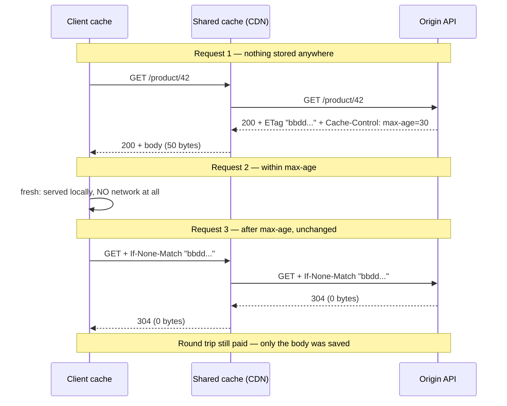
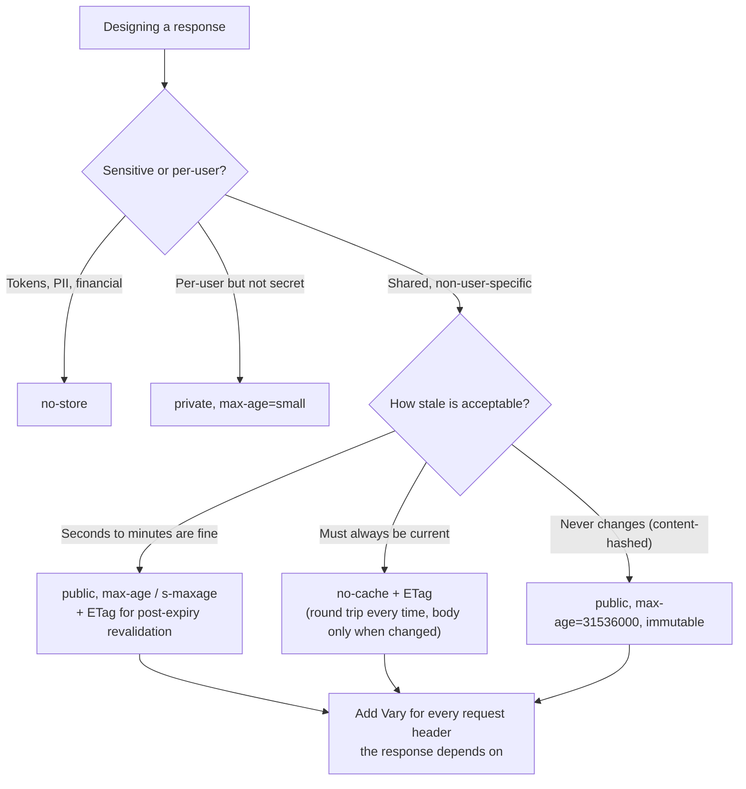

# HTTP Caching for APIs

> **Topic register:** T-2435 · Core tier · High interview frequency [H]
> **Provenance:** every claim below is real, executed output from
> [`practice/java/api-design/http-caching/`](../../practice/java/api-design/http-caching/README.md)
> (OpenJDK 21.0.12) — a real server and a real `HttpClient` exchanging
> conditional requests, measuring a 50-byte body against a 0-byte `304` and
> 2 server-side renders across 4 requests.
> **Scope:** this chapter owns the *protocol* layer — what the client and any
> intermediary do with your headers. Server-side caches (Redis, Caffeine), cache
> invalidation strategy, and stampede protection are owned by
> [Caching Strategies and Invalidation](../11-system-design/caching-strategies-and-invalidation.md)
> and are not repeated here.

## Table of Contents

1. [Learning Objectives](#learning-objectives)
2. [Why This Matters in Interviews](#why-this-matters-in-interviews)
3. [Level 1 — Foundation](#level-1-foundation)
4. [Level 2 — Working Knowledge](#level-2-working-knowledge)
5. [Mental Model](#mental-model)
6. [Definition and Purpose](#definition-and-purpose)
7. [Core Concepts](#core-concepts)
8. [Internal Implementation](#internal-implementation)
9. [Diagrams](#diagrams)
10. [Java Examples](#java-examples)
11. [Production Scenarios](#production-scenarios)
12. [Trade-offs](#trade-offs)
13. [Decision Framework](#decision-framework)
14. [Common Mistakes](#common-mistakes)
15. [Anti-Patterns](#anti-patterns)
16. [Best Practices](#best-practices)
17. [Interview Answer Framework](#interview-answer-framework)
18. [Interview Questions](#interview-questions)
19. [Summary](#summary)
20. [Key Takeaways](#key-takeaways)
21. [Cheat Sheet](#cheat-sheet)
22. [Flashcards](#flashcards)
23. [Practice Exercises](#practice-exercises)
24. [Solutions](#solutions)
25. [Additional Reading](#additional-reading)
26. [Official References](#official-references)

---

## Learning Objectives

By the end of this chapter you can:

- State the difference between *freshness* and *validation*, and explain why only one of them removes a network round trip.
- Choose `Cache-Control` directives deliberately, including the three whose meanings are routinely guessed wrong (`no-cache`, `private`, `must-revalidate`).
- Implement `ETag` and `If-None-Match` correctly, and explain when a weak validator is the right choice.
- Explain what `Vary` is for and what happens to a shared cache without it.
- Decide when *not* to cache an API response at all, and defend that as a design choice rather than an omission.

## Why This Matters in Interviews

Most backend candidates can describe Redis caching and cannot describe HTTP caching, which is odd given that every API they have ever built emits cache headers — usually accidental defaults nobody chose. Interviewers use this topic to check whether a candidate sees the client, the CDN, and any intermediary as part of the system, or only the code they wrote.

It also produces one of the cleanest "explain the trade-off" moments available. `max-age` removes the round trip but risks serving stale data for the whole window. A validator keeps data fresh but still costs a round trip. Nearly every real design question here is choosing between those two, and a candidate who has only ever thought about server-side caches does not have the vocabulary for it.

The failure mode is also memorable: a missing `Vary` header on a shared cache can serve one user's authorized response to another. Getting that wrong is a security incident, not a performance regression, which is why the topic sits in API design rather than in performance.

## Level 1 — Foundation

A cache stores a copy of a response so the next request for the same thing can be answered without redoing the work. In HTTP there are several caches between your code and a user, and they are not all yours:

- The **client's own cache** — a browser, a mobile SDK, an HTTP library.
- A **shared cache** — a CDN, a reverse proxy, an API gateway. Shared means one stored copy can be served to *many different users*.
- Anything else on the path that decided to be helpful.

You do not control any of them directly. You control them entirely through **response headers**, which is the whole subject.

There are exactly two ways to avoid re-sending a body:

1. **Freshness.** You tell the client "this is good for 30 seconds." For 30 seconds the client answers from its own copy and sends no request at all. Fastest possible outcome: zero network.
2. **Validation.** The client has an old copy plus a *validator* — a small token identifying the version it holds. It asks "has this changed since version X?" If not, you reply `304 Not Modified` with no body. The client reuses what it has.

Real, executed output showing validation working:

```text
--> GET /product/42   If-None-Match: "bbddaf275528fffc"
<-- 304 Not Modified
    ETag:          "bbddaf275528fffc"
    Cache-Control: private, max-age=30, must-revalidate
    body:          (empty)  [0 bytes]
```

The body went from 50 bytes to 0. But notice what did **not** happen: the request was still sent, and the client still waited for a reply. Validation saves bandwidth and server rendering work; only freshness saves the round trip.

## Level 2 — Working Knowledge

Three directives cause most of the confusion, and interviewers ask about them because the names are actively misleading.

**`no-cache` does not mean "do not cache."** It means "you may store this, but you must revalidate with the origin before using it." The directive that means "do not store this at all" is `no-store`. If you meant to protect sensitive data and wrote `no-cache`, the response is still sitting in a cache somewhere.

**`private` is not about privacy features; it is about *which* cache may store the response.** `private` means only a single-user cache (the browser) may store it — shared caches must not. `public` means shared caches may. For any response that depends on who is asking, `private` is the floor, and `no-store` is the answer for genuinely sensitive material.

**`must-revalidate` only matters after expiry.** It says: once this response is stale, do not serve it — revalidate first. Without it, a cache may serve stale content in some situations (notably when it cannot reach the origin). It does not force revalidation while the response is still fresh.

The other essential piece is **`Vary`**. A shared cache keys its stored copies by URL. If your response varies by request header — `Accept`, `Accept-Encoding`, `Accept-Language`, or worst of all `Authorization` — the cache has no way to know that unless you say so:

```text
Vary: Accept, Accept-Encoding
```

Get this wrong on a shared cache and one user's response can be served to another. That is the security failure mentioned above, and it is why per-user responses should be `private` (or `no-store`) rather than relying on `Vary: Authorization`, which caches handle inconsistently.

## Mental Model

Think of a library book with an edition number.

**Freshness** is the librarian saying "this edition is current until Friday." Until Friday, you read your copy and do not call. Fast, but if a correction is published Wednesday, you do not know.

**Validation** is you calling and asking "is edition 7 still current?" The librarian says yes, and you keep reading your copy. You made a call — that is the round trip — but nobody mailed you a new book.

`ETag` is the edition number. `If-None-Match` is the question. `304` is "yes, still current." `max-age` is "until Friday."

The design question is always the same: how stale is acceptable, and is a round trip cheaper than a body? For a 50-byte JSON object over a fast link, a `304` saves almost nothing and `max-age` saves everything. For a 2 MB report, the reverse.

## Definition and Purpose

HTTP caching is defined by [RFC 9111](https://www.rfc-editor.org/rfc/rfc9111). Its purpose is to let any participant reuse a prior response without contacting the origin, or without transferring the body again, under rules that the origin controls.

It exists because the alternatives are worse. Without a protocol-level contract, every client would invent its own staleness policy, every CDN would guess, and an origin would have no way to say "this is immutable" or "never store this." The headers are that contract, and the reason they are worth learning precisely is that the defaults, when you say nothing, are *heuristic* — caches are permitted to guess a freshness lifetime from `Last-Modified`, and they do.

That is the single most important reason to set headers deliberately even when you want no caching: saying nothing does not mean "do not cache," it means "guess."

## Core Concepts

### The directive table you actually need

| Directive | Meaning | Use when |
|---|---|---|
| `no-store` | Do not store this response anywhere | Genuinely sensitive data: tokens, PII, financial detail |
| `no-cache` | May store, must revalidate before every reuse | Content that changes unpredictably but is expensive to send |
| `private` | Only a single-user cache may store it | Any response that depends on the authenticated user |
| `public` | Shared caches may store it, even with `Authorization` present | Genuinely shared, non-user-specific data |
| `max-age=N` | Fresh for N seconds (client caches) | You can name an acceptable staleness window |
| `s-maxage=N` | Fresh for N seconds in *shared* caches, overriding `max-age` | CDN should hold it longer or shorter than browsers |
| `must-revalidate` | Once stale, never serve without revalidating | Correctness matters more than availability on origin failure |
| `immutable` | Will never change while fresh; skip revalidation | Content-hashed static assets |
| `stale-while-revalidate=N` | Serve stale up to N seconds while refreshing in the background | Latency matters more than perfect freshness |

### ETag versus Last-Modified

`ETag` is an opaque token identifying a specific version of a resource. `Last-Modified` is a timestamp. Prefer `ETag` for three concrete reasons: `Last-Modified` has one-second granularity, so two changes in the same second are indistinguishable; timestamps invite clock-skew bugs across instances; and a resource can change without its logical modification time changing in a way you track.

**Strong versus weak validators.** A strong `ETag` (`"abc123"`) promises byte-for-byte identity. A weak one (`W/"abc123"`) promises only semantic equivalence — useful when a response is regenerated with insignificant differences such as key ordering or a timestamp field. Range requests require a strong validator; if you serve partial content, weak tags are not an option.

The demo derives a strong ETag from a hash of the body, which is the simplest correct approach for small payloads. Real, executed: changing the price changed the ETag, and the client's now-stale `If-None-Match` correctly produced a `200` with a new validator rather than a `304`:

```text
=== 3. Resource changes on the server ===
--> GET /product/42   If-None-Match: "bbddaf275528fffc"
<-- 200 OK
    ETag:          "70b829ff9c98a964"
    body:          {"id":42,"name":"Widget","price":2499,"version":2}  [50 bytes]
```

Hashing the body is O(body) per request, which is fine for small JSON and wrong for large payloads — there, derive the ETag from a version column, an update timestamp plus a row version, or an aggregate version you already maintain.

### Conditional requests do more than caching

The same machinery powers optimistic concurrency. `If-Match` on a `PUT` or `PATCH` means "apply this only if the resource is still the version I read." If it is not, the server returns `412 Precondition Failed` and the client re-reads and retries. This is the HTTP-level expression of the same idea as [Optimistic vs. Pessimistic Locking](../06-databases/optimistic-vs-pessimistic-locking.md), and mentioning it turns a caching answer into an API-design answer.

`If-None-Match: *` on a `POST`/`PUT` means "only if it does not already exist," which is a useful creation guard.

### What you should not cache

Not caching is a legitimate, defensible design decision. Responses that are per-user and sensitive, responses that must reflect a write immediately (read-your-writes after a mutation), and anything with a token in it belong behind `no-store`. The interview-grade answer is not "cache everything possible"; it is knowing that a wrong `max-age` on a per-user endpoint is far more expensive than the bandwidth it saved.

## Internal Implementation

**How a cache decides.** On a request, a cache looks for a stored response matching the URL *and* the headers named in the stored response's `Vary`. If it finds one, it computes freshness: if `max-age` (or `s-maxage` for shared caches) has not elapsed since the response was stored, it serves it directly — no origin contact. If it has elapsed, the entry is *stale*, and the cache either revalidates using a stored validator or, where permitted, serves stale. A stale entry is not deleted; it is a candidate for cheap revalidation.

**What `304` must contain.** A `304` carries no body, and it must carry the headers that would affect cache behavior — the demo sets `ETag`, `Cache-Control`, and `Vary` on both the `200` and the `304`. Omitting `Cache-Control` on a `304` is a real bug: the cache updates its stored entry with the new metadata, and if the directives are missing, it falls back to heuristics.

In the demo, `sendResponseHeaders(304, -1)` is how the JDK's `HttpServer` expresses "no body," distinct from `0`, which would mean a zero-length body with a `Content-Length`.

**The measured effect on the server, not just the wire:**

```text
200 response body: 50 bytes
304 response body: 0 bytes  (50 bytes saved on the wire per revalidation)
Server-side renders performed: 2 for 4 requests -- the 304s skipped serialization entirely.
```

Two of four requests never rendered a body. For a JSON object that is negligible; for a response assembled from three service calls, the saving is the *work*, not the bytes — provided the validator can be computed without doing that work. An ETag derived from a hash of a fully-rendered body saves the transfer and nothing else. An ETag derived from a cheap version number saves the rendering too. That distinction is the highest-value implementation detail in this chapter.

**Why `Authorization` is special.** By default, shared caches must not store responses to requests carrying `Authorization`. `public` explicitly overrides that. So writing `Cache-Control: public` on an authenticated endpoint is not a small mistake — it is an instruction to a CDN to store and reuse an authorized response.

## Diagrams





## Java Examples

Full, runnable sources at [`practice/java/api-design/http-caching/`](../../practice/java/api-design/http-caching/README.md).

**Server side — validator, directives on both paths, and the correct empty `304`:**

```java
String etag = "\"" + sha256(body).substring(0, 16) + "\"";

// Set on BOTH 200 and 304 -- a 304 missing these lets the client
// fall back to heuristic freshness, which is a real bug.
exchange.getResponseHeaders().add("ETag", etag);
exchange.getResponseHeaders().add("Cache-Control", "private, max-age=30, must-revalidate");
exchange.getResponseHeaders().add("Vary", "Accept, Accept-Encoding");

String ifNoneMatch = exchange.getRequestHeaders().getFirst("If-None-Match");
if (etag.equals(ifNoneMatch)) {
    exchange.sendResponseHeaders(304, -1);   // -1 == no body, per the spec
    exchange.close();
    return;
}
// ... render and send the 200 ...
```

**Spring equivalent, for the version that avoids the render entirely:**

```java
@GetMapping("/product/{id}")
ResponseEntity<Product> get(@PathVariable long id) {
    long version = repository.findVersion(id);          // cheap: no full load
    return ResponseEntity.ok()
            .eTag("\"" + version + "\"")                 // version-based, not body-hash
            .cacheControl(CacheControl.maxAge(30, TimeUnit.SECONDS).cachePrivate())
            .body(repository.findById(id).orElseThrow());
}
```

Spring's `ShallowEtagHeaderFilter` is the opposite trade: it hashes the rendered body, so it saves bandwidth but does all the work first. Use it when bandwidth is the constraint; use a version-derived ETag when server work is.

**Client side — the conditional request, for completeness:**

```java
HttpRequest request = HttpRequest.newBuilder(uri)
        .header("If-None-Match", storedEtag)
        .GET()
        .build();
HttpResponse<String> response = client.send(request, BodyHandlers.ofString());
String body = response.statusCode() == 304 ? cachedBody : response.body();
```

## Production Scenarios

### Scenario: a CDN serves one customer's invoice list to another

**Symptoms.** A support ticket reports seeing another company's data on a list endpoint. It is not reproducible on demand, appears only for a minority of users, and never happens in staging — which has no CDN.

**Initial hypotheses.** A tenant-filtering bug in the query; a thread-safety issue in a shared request context.

**Evidence collected.** Application logs show only one request reaching the origin for that URL in the window, while multiple users reported seeing the response. Response headers on the affected endpoint include `Cache-Control: public, max-age=60` and no `Vary`.

**Diagnosis.** The response is tenant-specific but marked `public`, which explicitly permits a shared cache to store a response to an `Authorization`-carrying request, and there is no `Vary` to key it by anything other than the URL. The CDN correctly followed instructions: one stored copy, served to everyone. The origin code was never wrong.

**Immediate mitigation.** Purge the CDN entry and change the header to `private, no-store` for that path. Header changes take effect on the next response, so this is minutes, not a deploy cycle, if headers are configurable at the edge.

**Permanent remediation.** A default `private, no-store` for every authenticated route, with `public` requiring an explicit, reviewed opt-in per endpoint. Add a contract test asserting that authenticated endpoints never emit `public`.

**Trade-offs.** The blanket default gives up real CDN offload on the handful of endpoints that could legitimately use it. That is the correct direction for a default: the cost of the wrong `public` is a data exposure, and the cost of a missing `public` is bandwidth.

**Interview lessons.** This is the strongest available answer to "why do cache headers matter?" — the failure is a confidentiality breach caused by a header, with no bug in the business logic.

### Scenario: a mobile client burns battery revalidating a config endpoint

**Symptoms.** A configuration endpoint receives one request per app foreground per user. Nearly all return `304`. Origin CPU is low, but mobile users report battery drain and the endpoint dominates request counts.

**Diagnosis.** The endpoint sets `no-cache` plus an `ETag`. That combination is *working exactly as specified*: revalidate every time, transfer the body only when it changed. The bytes were already saved; the round trip never was, and on mobile the round trip — radio wake-up included — is the expensive part.

**Remediation.** `max-age=300` plus `stale-while-revalidate=600`. The client now answers from its own cache for five minutes with no network at all, and for the following ten minutes serves the stale copy instantly while refreshing in the background.

**Trade-offs.** A config change can take up to five minutes to reach a client. That is acceptable for configuration and would not be for, say, a feature kill-switch — which argues for a separate, uncached endpoint for the small number of values that must be immediate, rather than making the whole config endpoint uncacheable.

**Interview lessons.** "We added an ETag and it did not get faster" is a real, common outcome, and the explanation — validators save bytes, not round trips — is the crispest demonstration that a candidate understands the two mechanisms rather than one blurred notion of "caching."

## Trade-offs

| Approach | Gains | Costs |
|---|---|---|
| `max-age` (freshness) | Zero network on a hit — the only approach that removes the round trip | Stale data for the whole window; you cannot recall what you already served |
| `ETag` + revalidation | Always current; saves the body and possibly the rendering | Still one round trip every time |
| `stale-while-revalidate` | Instant response plus background refresh | Some users deliberately see stale data |
| `s-maxage` at a CDN | Huge origin offload | Purging becomes an operational concern; CDN and browser lifetimes diverge |
| `no-store` | No exposure, no staleness | Every request is full cost |
| Body-hash ETag | Trivial to implement, correct by construction | Full render happens before you learn you could have sent a `304` |
| Version-derived ETag | Skips the render too | Requires a cheap, reliable version source |

## Decision Framework

1. **Is the response sensitive or per-user?** Sensitive → `no-store`. Per-user but benign → `private` with a small `max-age`. Never `public`.
2. **How stale can it be before someone is harmed?** That number, not a round one, is your `max-age`. If the honest answer is zero, you want `no-cache` plus a validator, not a `max-age` of 1.
3. **Is the expensive part the bytes or the work?** Bytes → any ETag will do. Work → derive the validator from a version you can read cheaply, or you have saved nothing server-side.
4. **Does the response depend on a request header?** Then `Vary` must name it — and if that header is `Authorization`, prefer `private`/`no-store` over trusting `Vary`.
5. **Is there a shared cache in the path?** Then decide `s-maxage` separately from `max-age`, and decide who can purge it.
6. **Immutable?** Content-hashed URLs get `max-age=31536000, immutable`, which is the one case where a year is the right number.

## Common Mistakes

- **Believing `no-cache` means "do not cache."** It means "revalidate before reuse." `no-store` is the one that prevents storage.
- **`public` on an authenticated endpoint.** This explicitly overrides the default protection for `Authorization`-carrying requests.
- **Omitting `Vary`** on a response that varies by `Accept`, `Accept-Encoding`, or `Accept-Language`.
- **Omitting `Cache-Control` on the `304`**, causing the cache to fall back to heuristic freshness.
- **Expecting an ETag to reduce request count.** It reduces bytes; only freshness reduces requests.
- **Body-hash ETags on expensive endpoints**, which do the full work before discovering a `304` was possible.
- **Relying on `Last-Modified` alone** for a resource that can change twice within one second.

## Anti-Patterns

- **Long `max-age` on anything you might need to correct.** You cannot recall what a client already stored; the only remedy is a new URL.
- **Caching authenticated responses at a shared cache** without a per-user key. The failure mode is a confidentiality breach.
- **`Vary: *`** — technically valid, effectively "never reuse this," which is a confusing way to write `no-store`.
- **Silently emitting whatever the framework defaults to.** Saying nothing licenses heuristic caching; it does not prevent caching.
- **Treating cache headers as a performance-only concern.** Half the decisions here are correctness or confidentiality decisions.

## Best Practices

- Set `Cache-Control` explicitly on every endpoint, including the ones you do not want cached. Default the whole API to `private, no-store` and opt in per route.
- Always pair a `max-age` with a validator, so the post-expiry request can still be cheap.
- Prefer version-derived ETags over body hashes where the work, not the bandwidth, is the cost.
- Name every varying request header in `Vary`, and keep that list short by design.
- Decide `s-maxage` deliberately when a CDN is in the path, and know who can purge it.
- Test cache behavior the way the demo does — assert on the status code and the body length of a conditional request, not on the code path.
- Treat `public` as a reviewed exception on authenticated routes, not a default.

## Interview Answer Framework

### 30-Second Answer

HTTP caching has two mechanisms. Freshness — `Cache-Control: max-age` — lets a client reuse a response with no network at all until it expires. Validation — an `ETag` with `If-None-Match` — still costs a round trip but returns `304` with no body when nothing changed. Freshness saves the request; validation saves the bytes. Most designs need both: a `max-age` for the common case and a validator for the request after it expires.

### 2-Minute Answer

Add the directives people get wrong and one real number. `no-cache` means "revalidate before reuse," not "do not cache" — `no-store` is that one. `private` means only a single-user cache may store it, which is the floor for anything user-specific; `public` explicitly permits a shared cache to store responses to `Authorization`-carrying requests, which is how tenant data ends up cross-served. `Vary` tells a shared cache which request headers form part of the key. I have measured the validation path directly: a 50-byte body versus a 0-byte `304`, and two server-side renders across four requests — but both `304`s still cost a full round trip, which is exactly why adding an ETag to a mobile config endpoint does not reduce its request count. Close with the `If-Match` / `412` connection to optimistic concurrency.

### 10-Minute Deep Dive

Structure: freshness versus validation and what each saves; the directive table with the three misread names; `Vary` and the shared-cache confidentiality failure; strong versus weak ETags and why `Last-Modified` alone is weaker; what a `304` must carry and why omitting `Cache-Control` on it is a bug; the body-hash versus version-derived ETag trade-off and which cost each one actually removes; `stale-while-revalidate` as the latency answer; `If-Match`/`412` as optimistic concurrency; and closing on `no-store` as a defensible design choice rather than a gap.

### Whiteboard Explanation

Draw client, CDN, origin. Draw three requests. Label the first "200, full body." Label the second with an arrow that stops at the client — "fresh, no network." Label the third going all the way to the origin and back as `304`, with "0 bytes, but a full round trip" written under it. Those three arrows are the whole model, and the third is the one candidates forget.

### Production Example

The CDN serving one tenant's invoice list to another: `public, max-age=60`, no `Vary`, one origin request serving many users. No bug in the query — the header was the defect.

### Trade-offs to Mention

`max-age` cannot be recalled once served; validators cost a round trip; `stale-while-revalidate` deliberately serves stale to buy latency; body-hash ETags save bandwidth but not work.

### Common Candidate Mistakes

Only describing server-side caching; misreading `no-cache`; expecting an ETag to reduce request volume; never mentioning `Vary`.

### Typical Follow-Up Questions

"What is the difference between `no-cache` and `no-store`?" → "Where does `Vary` matter and what breaks without it?" → "Would an ETag reduce our request count?" → "How would you cache a per-user response?" → "How do you invalidate something you already sent with a one-year `max-age`?" → "What is `412` used for?"

### Senior-Level Expectations

Distinguishes the two mechanisms cleanly, names the confidentiality failure mode, and picks a validator strategy based on whether bytes or work is the constraint.

### Staff-Level Discussion

Treats cache headers as an API contract with an operational tail. Once a response is served with a long `max-age`, the organization has no recall mechanism — the only remedy is changing the URL — so lifetimes belong in the same review conversation as [API versioning](api-versioning-strategies.md) and deprecation, not in an individual handler. The safe default is `private, no-store` with `public` as a reviewed exception, because the asymmetry is stark: the cost of a wrong `public` is a confidentiality incident, and the cost of a missing one is bandwidth. Where a CDN is in the path, purge authority and purge latency become part of the incident-response plan — a team that cannot purge quickly has made its `s-maxage` a hard commitment. And the cross-cutting version of this decision belongs at the edge or gateway ([API Gateway, BFF, and Edge Concerns](api-gateway-bff-and-edge-concerns.md)) so that every service inherits a correct default rather than each one rediscovering `Vary`.

## Interview Questions

### Question 1 — What is the difference between `no-cache`, `no-store`, and `must-revalidate`?

**Why interviewers ask it.** The names are misleading enough that guessing produces a confidently wrong answer, which is exactly what it is testing for.

**Expected answer.** `no-store` forbids storing the response anywhere — the only one that truly prevents caching. `no-cache` permits storing but requires revalidation with the origin before any reuse. `must-revalidate` applies once a response is already stale: it forbids serving that stale copy without revalidating, closing the window where a cache may serve stale content (typically when the origin is unreachable).

**Minimum acceptable answer.** Knows `no-store` is the one that prevents storage.

**Strong Senior answer.** Adds that `no-cache` plus an `ETag` is a deliberate and useful combination — always current, body transferred only on change — and that it saves bytes but never the round trip. Notes that saying nothing at all is worse than any of these, because caches may then apply heuristic freshness derived from `Last-Modified`.

**Staff-level extension.** Frames the default as an organizational decision: `private, no-store` everywhere with `public` as a reviewed per-route exception, because the cost asymmetry between a wrong `public` and a missing one is enormous.

**Common mistakes.** Reading `no-cache` as "do not cache"; believing `must-revalidate` forces revalidation while still fresh.

**Likely follow-ups.** "Which would you use for a JWT-bearing response?" (`no-store`.) "What happens if you set nothing?" (Heuristic freshness — a cache may guess a lifetime.)

**Evaluation criteria.** All three defined correctly, and awareness that silence is not the same as prohibition.

### Question 2 — We added ETags and request volume did not drop. Why?

**Why interviewers ask it.** It is a real outcome, and the explanation requires holding both mechanisms separately in mind.

**Expected answer.** ETags implement *validation*, not *freshness*. The client still sends a request every time; a match just means the response comes back as `304` with no body. Request count is unchanged by design — bandwidth and possibly server rendering are what improved. Reducing request count requires `max-age`, which lets the client answer from its own cache with no network at all.

**Minimum acceptable answer.** Knows a `304` still involves a request.

**Strong Senior answer.** Distinguishes what each saves and names `stale-while-revalidate` as the way to get instant responses without giving up eventual refresh. Points out the server-side subtlety: if the ETag is a hash of the rendered body, the server did all the work before deciding to send a `304`, so a version-derived ETag is what actually saves work — measured in the demo as 2 renders across 4 requests.

**Staff-level extension.** Raises the mobile dimension explicitly: on a radio link the round trip, not the payload, is the expensive part, so the right fix for a config endpoint is a `max-age` with an escape hatch for the few values that must be immediate, rather than making the whole endpoint uncacheable.

**Common mistakes.** Claiming the ETag implementation must be broken; conflating bandwidth savings with request savings.

**Likely follow-ups.** "How would you cut the request count?" (`max-age`, sized by acceptable staleness.) "What if the data must always be current?" (`no-cache` plus a validator, and accept the round trip.)

**Evaluation criteria.** Separates the two mechanisms cleanly and identifies the body-hash-versus-version distinction without prompting.

### Question 3 — A CDN served one customer's data to another. The query filtering is correct. What happened?

**Why interviewers ask it.** It reframes caching as a correctness and confidentiality topic, and rewards candidates who think about intermediaries.

**Expected answer.** The response was marked `Cache-Control: public` on an authenticated endpoint, which explicitly overrides the default rule that shared caches must not store responses to `Authorization`-carrying requests, and there was no `Vary` making the key user-specific. The CDN stored one copy keyed by URL and served it to everyone. The origin code was never wrong; the header was the defect. Fix: `private` or `no-store` for authenticated routes, and purge the cached entry.

**Minimum acceptable answer.** Identifies that a shared cache stored a user-specific response.

**Strong Senior answer.** Names `public` as the specific override and explains why `Vary: Authorization` is a poor substitute — support across caches is inconsistent, and it makes a confidentiality guarantee depend on an intermediary's correctness rather than on not storing the data at all. Notes the diagnostic tell: one origin request in the logs while many users saw the response.

**Staff-level extension.** Moves the control to the edge — a default `private, no-store` applied at the gateway so every service inherits it, with `public` requiring an explicit reviewed opt-in and a contract test asserting authenticated routes never emit it. Adds that purge authority and purge latency belong in the incident plan, since a team that cannot purge quickly has made its `s-maxage` an irrevocable commitment.

**Common mistakes.** Hunting for a tenant-filtering bug; proposing `Vary: Authorization` as the primary fix; forgetting the already-cached copy must be purged.

**Likely follow-ups.** "How would you prevent this class of bug?" (Safe default plus contract test.) "Would `private` alone be enough?" (For non-sensitive per-user data, yes; for tokens or financial detail, `no-store`.)

**Evaluation criteria.** Identifies the header as the cause, knows what `public` overrides, and proposes a default rather than a one-endpoint patch.

## Summary

HTTP caching gives you two distinct levers and most mistakes come from treating them as one. Freshness (`max-age`, `s-maxage`, `stale-while-revalidate`) removes the network round trip and cannot be recalled once served. Validation (`ETag` with `If-None-Match`, yielding `304`) keeps data current and removes the body — measured here as 50 bytes down to 0, with 2 of 4 requests skipping serialization entirely — but never removes the round trip. `Vary` is what keeps a shared cache from serving one user's response to another, and `public` on an authenticated route is the header that turns a caching decision into a confidentiality incident. Set these headers deliberately on every endpoint, including the ones you do not want cached, because silence licenses a cache to guess.

## Key Takeaways

- Freshness saves the request; validation saves the body. Only one of them removes the round trip.
- `no-cache` means "revalidate before reuse"; `no-store` is the one that prevents storage.
- `public` on an `Authorization`-carrying response explicitly permits shared caches to store it.
- `Vary` must name every request header the response depends on.
- A `304` must carry the cache-relevant headers, or the cache falls back to heuristics.
- Body-hash ETags save bandwidth; version-derived ETags also save the server's work.
- `If-Match` plus `412` is the same machinery applied to optimistic concurrency.

## Cheat Sheet

Condensed version: [`cheat-sheets/http-caching-for-apis.md`](../../cheat-sheets/http-caching-for-apis.md).

## Flashcards

Review deck: [`flashcards/http-caching-for-apis.md`](../../flashcards/http-caching-for-apis.md).

## Practice Exercises

1. Run the demo, then remove `Cache-Control` from the `304` path only. Explain what a real shared cache would now be permitted to do with the stored entry.
2. Change the ETag from a body hash to a version counter that increments on write. Measure how many renders the four-request sequence performs, and explain the difference.
3. Add an endpoint whose response depends on `Accept-Language`, first without `Vary` and then with it. Describe what a shared cache would serve in each case.
4. Write the `Cache-Control` header for: a public product catalogue, a per-user cart, an OAuth token response, and a content-hashed JavaScript bundle. Justify each in one sentence.
5. Implement `If-Match` on an update endpoint and trigger a real `412` by using a stale ETag.

## Solutions

1. Without directives on the `304`, the cache updates its entry with no freshness information and may apply heuristic freshness — typically a fraction of the time since `Last-Modified` — so the response can be reused for a window nobody chose.
2. With a version-derived ETag the two `304` paths never render the body, so renders drop from 2 to 2 for the `200`s only — the point being that the body-hash version *had* to render before it could decide, which is invisible in a 50-byte demo and dominant on an expensive endpoint.
3. Without `Vary`, whichever language was cached first is served to everyone. With `Vary: Accept-Language`, the cache keeps one entry per language value.
4. `public, max-age=300` (shared, tolerant of a few minutes stale); `private, no-store` (per-user and sensitive enough that staleness is a correctness problem); `no-store` (credentials, never stored anywhere); `public, max-age=31536000, immutable` (the URL changes when the content does).
5. A `412 Precondition Failed` means the resource moved on since you read it — the correct client behavior is to re-read, re-apply, and retry, exactly as with an optimistic-locking version conflict.

## Additional Reading

- [REST API Fundamentals](rest-api-fundamentals.md) — status codes and resource semantics this chapter builds on.
- [API Gateway, BFF, and Edge Concerns](api-gateway-bff-and-edge-concerns.md) — where a safe caching default belongs.
- [API Versioning Strategies](api-versioning-strategies.md) — the other contract decision with a long operational tail.
- [Caching Strategies and Invalidation](../11-system-design/caching-strategies-and-invalidation.md) — the server-side half: Redis, stampedes, hot keys, invalidation.
- [Optimistic vs. Pessimistic Locking](../06-databases/optimistic-vs-pessimistic-locking.md) — the database expression of `If-Match`/`412`.

## Official References

- [RFC 9111 — HTTP Caching](https://www.rfc-editor.org/rfc/rfc9111)
- [RFC 9110 §8.8 — Validator Fields](https://www.rfc-editor.org/rfc/rfc9110#section-8.8)
- [MDN — HTTP Caching](https://developer.mozilla.org/en-US/docs/Web/HTTP/Caching)
