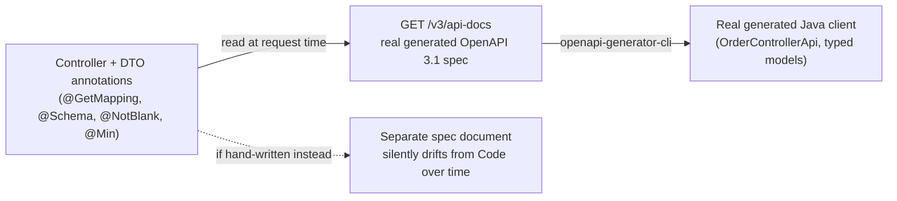

# OpenAPI and Contract-First API Design

> **Topic register:** T-2414 · Core tier · High interview frequency [H] — gap-audit addition (2026-09-18):
> `api-design.md` (T-803) covers resource shapes, pagination, and error design, but this domain had zero
> coverage of the artifact that actually *documents and enforces* those decisions at scale — an OpenAPI
> specification, and the difference between hand-writing one after the fact versus generating it from the
> real, running code.
> **Provenance:** every claim below is real, executed output from a real Spring Boot 3.5.16 app with
> springdoc-openapi 2.9.1 (`practice/java/openapi-and-contract-first-api-design/`), including a real,
> unplanned dependency bug discovered while building it.

## Table of Contents

1. [Learning Objectives](#learning-objectives)
2. [Why This Matters in Interviews](#why-this-matters-in-interviews)
3. [Level 1 — Foundation](#level-1-foundation)
4. [Level 2 — Working Knowledge](#level-2-working-knowledge)
5. [Mental Model](#mental-model)
6. [Definition and Purpose](#definition-and-purpose)
7. [Core Concepts](#core-concepts)
8. [Internal Implementation](#internal-implementation)
9. [Diagrams](#diagrams)
10. [Java Examples](#java-examples)
11. [Production Scenarios](#production-scenarios)
12. [Trade-offs](#trade-offs)
13. [Decision Framework](#decision-framework)
14. [Comparisons](#comparisons)
15. [Common Mistakes](#common-mistakes)
16. [Anti-Patterns](#anti-patterns)
17. [Best Practices](#best-practices)
18. [Interview Answer Framework](#interview-answer-framework)
19. [Interview Questions](#interview-questions)
20. [Summary](#summary)
21. [Key Takeaways](#key-takeaways)
22. [Cheat Sheet](#cheat-sheet)
23. [Flashcards](#flashcards)
24. [Practice Exercises](#practice-exercises)
25. [Additional Reading](#additional-reading)
26. [Official References](#official-references)

## Learning Objectives

By the end of this chapter you can:

- Explain what an OpenAPI specification actually is and why a *generated* one behaves differently from a hand-maintained one.
- Explain, with real evidence, how validation and documentation annotations on real code become real fields in a real generated spec.
- Generate a real client from a real spec and explain what that buys a consuming team.
- State the real, discovered limitation of annotation-driven spec generation this chapter's own lab ran into.

## Why This Matters in Interviews

"Walk me through how you'd document this API for another team to consume" is a very common follow-up once
an interview's design phase settles on a resource shape, and a surprising number of candidates answer with
"I'd write a Swagger file" — describing the *format* without ever having generated one from real code, and
without being able to say what breaks when a hand-written spec and the actual implementation drift apart.
This topic separates candidates who have shipped an API a separate team consumed from candidates who have
only designed APIs read by nobody but their own team.

## Level 1 — Foundation

Think of an OpenAPI spec as a restaurant's printed menu, and the actual kitchen as the running API. A
**hand-written spec** is a menu printed once, by hand, and never updated when the kitchen changes a recipe
— it's accurate the day it's printed and increasingly wrong afterward. A **generated spec** is a menu that
reprints itself automatically every time the kitchen's actual recipe book changes, because it's derived
from the same source. **OpenAPI** is the standard *format* for that menu — a machine-readable JSON/YAML
document describing every endpoint, every field, every possible response. **springdoc-openapi** is the
tool this chapter uses to generate that document directly from a real, running Spring Boot app, rather than
writing it by hand.

## Level 2 — Working Knowledge

A generated OpenAPI spec is built by reading the same annotations a Spring MVC app already has for other
reasons: `@GetMapping`/`@PostMapping` (which methods exist, at which paths), the request/response DTOs'
field types (what shape the JSON is), and — this is the part many candidates haven't actually seen —
`jakarta.validation` constraint annotations like `@NotBlank` and `@Min(1)`, which were written for runtime
validation but get read a second time by the spec generator and become real fields in the generated schema
(`"required"`, `"minimum"`). This chapter's lab verifies that concretely. Once a spec exists, a second real
tool — `openapi-generator-cli` — can read it and generate a typed client in another language/framework,
so a consuming team never hand-writes HTTP calls against your API by re-reading your documentation and
guessing at field names.

## Mental Model

**A generated spec cannot silently drift from the code, because it has no independent existence to drift
from — it's read fresh from the code every time it's requested.** A hand-maintained spec is a second
artifact a human has to remember to update every time the code changes, and in practice, it doesn't get
updated every time — that's not a hypothetical risk, it's the default outcome of maintaining two sources of
truth by hand. The entire value of contract-first tooling in this chapter is collapsing "the code" and "the
documented contract" into one source.

## Definition and Purpose

**OpenAPI** (formerly Swagger) is a specification format for describing an HTTP API's paths, operations,
parameters, request/response schemas, and authentication requirements as a single machine-readable
JSON/YAML document. **Contract-first (or contract-driven) API design** is the practice of treating that
document as the authoritative source of truth a client is built against — either by generating the document
from real server code (this chapter's approach) or, less commonly, by hand-writing the spec first and
generating server stubs from it. It exists because REST APIs have no compiler-enforced contract the way a
gRPC `.proto` file gives you (see [gRPC API Design](grpc-api-design.md) for that comparison) — without a
deliberately maintained spec, a REST API's real contract is whatever the server currently happens to do,
discoverable only by reading source code or making trial requests.

## Core Concepts

### The spec is derived from annotations already on the code, not written separately

`@Schema(description = "...", example = "...")` — a springdoc/swagger annotation purely for documentation
— sits directly alongside `jakarta.validation` constraints like `@NotBlank` and `@Min(1)`, which exist for
an entirely different reason (runtime input validation). springdoc reads both. This chapter's lab verified
directly: a field annotated `@Min(1)` produces a real `"minimum": 1` in the generated schema, and
`@NotBlank` produces both a real `"minLength": 1` and adds the field to the schema's real `"required"`
array — with zero OpenAPI-specific syntax written for either constraint. The validation logic and the
documented contract are the same annotations, read twice, for two different purposes.

### A generated spec is one HTTP request away, always current

`GET /v3/api-docs` (springdoc's default path) returns the real spec computed from the currently-running
application's currently-registered handler mappings, every time it's requested — there's no build step that
produces a stale artifact. Deploy a new version of the controller and the very next request to
`/v3/api-docs` reflects it immediately, with no separate "update the docs" step for anyone to forget.

### Real client-code generation closes the loop from spec to consumer

`openapi-generator-cli` (this chapter uses the real, self-contained CLI jar — no Maven plugin) reads any
OpenAPI spec — generated or hand-written — and emits a typed client in dozens of target languages. This
chapter's lab generates a real Java client from the real spec produced above; the generated
`OrderControllerApi.createOrder(CreateOrderRequest)` method's signature matches the real controller's
`@PostMapping` exactly, and the generated `CreateOrderRequest` model marks `customerName` `@Nonnull` —
the same `@NotBlank`-driven `"required"` constraint, now enforced on the *consuming* side too, without a
human transcribing it by hand into client code.

## Internal Implementation

**A real, unplanned finding from building this chapter's lab:** running the demo the very first time,
before adding Hibernate Validator to the classpath, produced a real `NoClassDefFoundError:
org/hibernate/validator/constraints/Range` from `/v3/api-docs` — not a graceful fallback. Tracing it:
springdoc-openapi-starter-common's `SchemaUtils.hasValidationConstraints` method has a direct compile-time
reference to `org.hibernate.validator.constraints.Range`, a Hibernate-Validator-specific annotation class,
inside its constraint-scanning code path — not a properly guarded, reflection-based optional check the way
Spring Boot's own `OptionalValidatorFactoryBean` degrades to a harmless `WARN` log line when no Bean
Validation provider is present. Practical consequence, verified directly: `jakarta.validation-api` alone
(the interfaces) is **not sufficient** for springdoc's schema generation to function — a concrete provider
(Hibernate Validator, in this chapter's fix) must be on the classpath even though this demo never triggers
actual runtime validation, purely because springdoc's own annotation-scanning code references a
provider-specific class unconditionally.

```
Real error before the fix:
NoClassDefFoundError: org/hibernate/validator/constraints/Range
  at org.springdoc.core.utils.SchemaUtils.lambda$hasValidationConstraints$5(SchemaUtils.java:323)

Real success after adding hibernate-validator + its transitive chain (jboss-logging, classmate,
expressly, jakarta.el-api) to the classpath:
GET /v3/api-docs -> 200, real generated spec, "minimum": 1 and "required": ["customerName"] present
```

## Diagrams



The dashed path is the one this chapter's approach eliminates entirely — there is no separate document to
drift, because the solid path regenerates it from the code on every request.

## Java Examples

```java
public class CreateOrderRequest {

    @NotBlank
    @Schema(description = "Customer's full name", example = "Ada Lovelace")
    public String customerName;

    @Min(1)
    @Schema(description = "Order amount, in USD cents", example = "1999")
    public long amountCents;
}
```

Real generated schema for this exact class, from `/v3/api-docs`:

```json
"CreateOrderRequest": {
  "type": "object",
  "properties": {
    "customerName": {
      "type": "string",
      "description": "Customer's full name",
      "example": "Ada Lovelace",
      "minLength": 1
    },
    "amountCents": {
      "type": "integer",
      "format": "int64",
      "description": "Order amount, in USD cents",
      "example": 1999,
      "minimum": 1
    }
  },
  "required": ["customerName"]
}
```

Real generated client method from that same spec (`openapi-generator-cli`, Java native library):

```java
public OrderDto createOrder(@javax.annotation.Nonnull CreateOrderRequest createOrderRequest) throws ApiException { ... }
```

Full real transcript: [`practice/java/openapi-and-contract-first-api-design/`](../../practice/java/openapi-and-contract-first-api-design/README.md).

## Production Scenarios

### Scenario: a hand-maintained Swagger doc silently falls behind, and a partner integration breaks silently instead of loudly

**Symptoms.** A partner engineering team integrates against a REST API using a hand-written Swagger/OpenAPI
document the provider team maintains manually in a separate repository. Months later, the provider team
renames a response field during an unrelated refactor and updates the hand-written doc for the *new*
primary use case, but misses one less-common response variant. The partner's integration, built against the
now-incorrect doc for that variant, starts silently receiving `null` for a field it expects to always be
present — no error, no 4xx, just a field quietly becoming absent in a response the partner didn't test as
thoroughly as the main path.

**Impact.** A partner-facing data-quality bug traced back weeks later, with no clear "this changed on this
date" signal, because nothing in the provider's own deploy pipeline was aware the doc had drifted.

**Initial hypotheses.** A partner-side parsing bug (checked — their code correctly reads whatever field the
API actually returns); a provider-side regression (checked — the actual behavior matches the *new* shape,
not a bug); documentation drift (correct).

**Evidence.** Diffing the hand-written doc against the real API's actual current responses (via direct
`curl` against the real endpoint) shows the doc still describes the old field name for that one response
variant.

**Diagnosis.** The hand-written spec has no mechanism forcing it to reflect reality — it only reflects
whatever a human remembered to update, for the cases they remembered to update it for.

**Immediate mitigation.** Manually correct the stale section of the hand-written doc and notify the partner
team directly, since there's no automated signal that would have caught this on its own.

**Permanent remediation.** Migrate the doc to a generated one (this chapter's approach): the same
annotations already on the real controllers and DTOs become the one and only source of truth, so a field
rename in the code is a field rename in the spec, automatically, on the next request to `/v3/api-docs` —
with no separate step to forget.

**Alternatives considered.** A CI check that fails the build if the hand-written doc's checksum doesn't
change alongside relevant code — rejected as strictly worse than generation, since it still requires a
human to write the doc correctly by hand every time, just with an extra reminder.

**Trade-offs.** A generated spec is only as good as the annotations on the code — a controller with no
`@Schema` description still generates a technically-correct but under-documented spec; generation solves
drift, not thoroughness.

**Prevention.** Default new APIs intended for external or cross-team consumption to a generated spec from
day one, rather than treating spec generation as a migration to perform only after a drift incident.

**Interview lesson.** This is Interview Question 1 below — "what happens when a hand-written spec and the
real API drift" — arriving as an actual, gradually-discovered partner-integration incident, not a
hypothetical.

## Trade-offs

| Approach | Benefit | Cost |
|---|---|---|
| Generated spec (this chapter) | Cannot silently drift from the running code; zero separate maintenance step | Only as thorough as the annotations already on the code; requires the generation library (and its full transitive dependency chain) on the classpath |
| Hand-written spec | Full control over wording, structure, examples independent of code structure | A second artifact a human must remember to update every single time the code changes — the realistic failure mode, not an edge case |
| Contract-first (spec written first, server stubs generated) | Forces API design discussion before implementation; server can't diverge from an agreed contract | Requires the spec to be written and reviewed before code exists, a workflow change many teams resist adopting |

## Decision Framework

1. **Is this API consumed by a team you don't directly pair-program with** (another team, a partner, a
   public API)? If yes, generate a real spec from day one rather than treating documentation as optional.
2. **Does the framework already support annotation-driven generation** (springdoc for Spring MVC, similar
   tooling exists for most major frameworks)? If yes, prefer generation over hand-writing.
3. **Is API design agreement needed *before* implementation starts** (multiple teams building client and
   server in parallel)? If yes, consider genuine contract-first (spec authored first, both sides generate
   from it), not just post-hoc generation.
4. **Does a consuming team need a typed client rather than hand-rolled HTTP calls?** If yes, run
   `openapi-generator-cli` against the generated spec rather than asking them to hand-write a client against
   your documentation.

## Comparisons

| Aspect | Generated OpenAPI spec | Hand-written OpenAPI spec | gRPC `.proto` contract |
|---|---|---|---|
| Can silently drift from real behavior? | No — read fresh from code | Yes — the default failure mode | No — compiler-enforced |
| Requires a separate authoring step? | No (annotations already serve other purposes) | Yes | Yes (but compiler-checked) |
| Works for an existing REST API with no code changes? | Requires only adding annotations/dependency | Yes, describes whatever exists | N/A — requires adopting gRPC itself |
| See also | | | [gRPC API Design](grpc-api-design.md) |

## Common Mistakes

- Writing a Swagger/OpenAPI document by hand and treating it as permanently accurate without a mechanism keeping it synchronized with the real code.
- Adding `@Schema` descriptions without also relying on the `jakarta.validation` constraints already on a DTO — duplicating constraint information by hand in a `@Schema` field instead of letting the real constraint annotation drive it.
- Assuming annotation-driven spec generation works with `jakarta.validation-api` alone — this chapter's own lab found a real provider (Hibernate Validator) is required on the classpath for springdoc's schema generation specifically, even without triggering runtime validation.
- Generating a client once and hand-editing it, rather than regenerating it whenever the spec changes — reintroducing the exact drift problem generation exists to prevent, just one layer downstream.

## Anti-Patterns

- **A stale, hand-maintained spec published as if it were current** — worse than no documentation at all, because it actively misleads a consumer into trusting an incorrect contract.
- **Generating a spec once at project start and never regenerating it in CI/deploy** — turns a would-be-always-current artifact back into a stale one through operational neglect rather than a technical limitation.
- **Treating spec generation as a substitute for API design discipline** — a generated spec faithfully documents a poorly designed API just as accurately as a well-designed one; generation solves drift, not design quality (see [API Design](api-design.md) for the design discipline itself).

## Best Practices

- Default new cross-team or external APIs to a generated spec (springdoc for Spring MVC) rather than a hand-written one.
- Regenerate and republish the spec as part of the normal deploy pipeline, not as a manual, occasionally-remembered step.
- Let `jakarta.validation` constraints already on request DTOs drive the generated schema's `required`/`minimum`/`maxLength` fields rather than duplicating that information by hand in `@Schema` annotations.
- When a consuming team needs a typed client, generate one with `openapi-generator-cli` from the real spec rather than asking them to hand-write HTTP calls against documentation.
- Verify a Bean Validation provider (e.g., Hibernate Validator), not just the `jakarta.validation-api` interfaces, is actually on the classpath when using springdoc — per this chapter's own discovered dependency gap.

## Interview Answer Framework

### 30-Second Answer

An OpenAPI spec generated directly from real code (via annotations already on controllers/DTOs, e.g.
springdoc for Spring) cannot silently drift from the running API the way a hand-written spec routinely
does, because it's recomputed from the code on every request rather than maintained as a second, separate
artifact.

### 2-Minute Answer

Definition: OpenAPI is a machine-readable spec format for an HTTP API's contract; contract-first design
treats that spec as the source of truth. Why it exists: REST has no compiler-enforced contract the way
gRPC's `.proto` does, so without deliberate tooling, an API's real contract is only discoverable by reading
source or making trial requests. How it works: springdoc reads the same `@GetMapping` and
`jakarta.validation` annotations already on the code and turns them into real spec fields — verified
directly, `@Min(1)` becomes `"minimum": 1`. One important trade-off: generation is only as thorough as the
annotations present; it solves drift, not documentation completeness. Production example: a hand-written
Swagger doc silently falling behind a real field rename, breaking a partner integration with no loud error.

### 10-Minute Deep Dive

Cover: the mental model (a generated spec has no independent existence to drift from); the real annotation
-> schema mechanism with concrete evidence (`@NotBlank` -> `required` + `minLength`, `@Min` -> `minimum`);
the real, unplanned Hibernate Validator dependency finding and what it reveals about relying on
`jakarta.validation-api` alone; real client generation with `openapi-generator-cli` closing the loop from
spec to a typed consumer; the production scenario of a stale hand-written spec breaking a partner
integration silently; and close with the Staff-level discussion of API-contract governance across many
teams.

### Whiteboard Explanation

Draw the [§ Diagrams](#diagrams) flowchart: code with annotations feeding a live spec endpoint feeding a
generated client, with a dashed side-branch showing a hand-written spec silently drifting away from the
same code over time. The single dashed arrow *is* the entire argument for generation.

### Production Example

The partner-integration drift incident in [§ Production Scenarios](#production-scenarios): a hand-written
Swagger doc missed one response variant's field rename, breaking a partner silently rather than loudly,
fixed permanently by migrating to a generated spec.

### Trade-offs to Mention

State unprompted: generation eliminates drift but not documentation thoroughness — a generated spec is only
as good as the annotations present; contract-first (spec-first, code generated from it) is a bigger
workflow change than generating from existing code, and worth naming as a distinct, heavier-weight option.

### Common Candidate Mistakes

Describing OpenAPI only as "a format for API docs" without connecting it to the drift problem generation
solves; claiming a hand-written spec is "just as good" as a generated one; not knowing that constraint
annotations written for validation get reused for documentation.

### Typical Follow-Up Questions

1. "What happens to your generated spec the moment you rename a field in the DTO?"
2. "How would you get a typed client for a frontend or another backend team from this spec?"
3. "What's the difference between this and gRPC's contract enforcement?"

### Senior-Level Expectations

Correctly explains why a generated spec can't drift the way a hand-written one does, and can point to a
concrete annotation -> schema-field example.

### Staff-Level Discussion

At organizational scale, the real question isn't "generate vs. hand-write" for a single API — it's whether
every team generates specs consistently, publishes them somewhere discoverable (an internal API catalog),
and regenerates client SDKs as part of a shared pipeline, versus each team inventing its own documentation
convention ad hoc. A Staff engineer frames spec generation as infrastructure other teams build on (internal
API discovery, automated client generation, contract-testing gates in CI comparing a proposed change's spec
diff against known consumers) rather than a one-team documentation nicety.

## Interview Questions

### Question 1 — A hand-written Swagger doc and the real API you're documenting have drifted apart. How does that happen, and how would you prevent it?

**Why interviewers ask it.** Tests whether a candidate has actually maintained API documentation for real
consumers, versus only having read about OpenAPI as a format.

**Expected answer.** A hand-written spec is a second artifact with no mechanism forcing it to track the
real code; it drifts whenever a change is made without a human remembering to update the doc too. Prevented
by generating the spec directly from the running code's own annotations instead.

**Minimum acceptable answer.** Recognizes that hand-written docs can go stale, even without proposing
generation as the fix.

**Strong Senior answer.** Proposes annotation-driven generation (e.g., springdoc) and can describe the
basic mechanism (reading `@GetMapping` and DTO fields).

**Staff-level extension.** Frames this as an organizational tooling decision (consistent generation across
every team's APIs, published to a shared catalog) rather than a single-API fix.

**Common mistakes.** Proposing "more frequent manual reviews" of the hand-written doc as the fix, rather
than removing the manual step entirely.

**Likely follow-ups.** "What would you do if the framework didn't support annotation-driven generation?"

**Evaluation criteria (1–5).** 1: "just keep the docs updated." 3: proposes generation correctly. 5:
proposes generation, explains the underlying mechanism, and frames it organizationally.

**Related references.** [§ Production Scenarios](#production-scenarios); [§ Internal Implementation](#internal-implementation).

### Question 2 — Your validation annotation (`@Min(1)`) and your API documentation both need to say "amount must be at least 1." How do you avoid maintaining that fact twice?

**Why interviewers ask it.** Tests whether a candidate understands that generation reuses annotations
written for a different purpose, rather than requiring separate documentation annotations for everything.

**Expected answer.** `jakarta.validation` constraints like `@Min(1)` are read by the spec generator too —
verified directly in this chapter, it becomes a real `"minimum": 1` in the generated schema with zero
OpenAPI-specific syntax added.

**Minimum acceptable answer.** States that some overlap exists between validation and documentation
annotations, even without a concrete example.

**Strong Senior answer.** Names the specific mechanism (constraint annotations read by the schema
generator) and a concrete before/after example.

**Staff-level extension.** Connects this to the broader principle of a single source of truth: the fewer
places a fact is expressed, the fewer places it can silently disagree with reality.

**Common mistakes.** Assuming `@Schema` annotations are the only way to express constraints in the spec,
duplicating what `@Min`/`@NotBlank` already provide.

**Likely follow-ups.** "What happens to the generated spec if you remove the `@Min` constraint?"

**Evaluation criteria (1–5).** 1: unaware of the overlap. 3: correctly names the mechanism. 5: names the
mechanism with a concrete example and the single-source-of-truth principle.

**Related references.** [§ Core Concepts](#core-concepts); [§ Java Examples](#java-examples).

## Summary

A generated OpenAPI spec — built from the same `@GetMapping` and `jakarta.validation` annotations already
on real code, via springdoc — cannot silently drift from the API's real behavior the way a hand-written
spec routinely does, because it's recomputed from the code on every request rather than maintained as a
separate document. This chapter verified the annotation-to-schema mechanism directly
(`@Min(1)` → `"minimum": 1`), generated a real typed client from that spec with `openapi-generator-cli`, and
surfaced a real, easy-to-miss dependency requirement: springdoc's schema generation needs an actual Bean
Validation provider (not just the `jakarta.validation-api` interfaces) on the classpath to function at all.

## Key Takeaways

- A generated spec has no independent existence to drift from the code; a hand-written one does, and does drift in practice.
- Validation constraints (`@NotBlank`, `@Min`) are read a second time by the spec generator and become real schema fields (`required`, `minimum`, `minLength`) — verified directly, not asserted.
- `openapi-generator-cli` closes the loop, generating a real typed client from the real spec — no hand-transcribed HTTP calls.
- springdoc requires a real Bean Validation provider (e.g., Hibernate Validator) on the classpath, not just `jakarta.validation-api`, or schema generation throws a real `NoClassDefFoundError`.
- Generation solves drift, not documentation thoroughness or API design quality — those still require deliberate effort.

## Cheat Sheet

| Situation | What to reach for |
|---|---|
| New API consumed by another team or a partner | Generate a spec from day one (e.g., springdoc for Spring MVC) |
| A request DTO already has `@NotBlank`/`@Min`/etc. | Let those drive the schema's `required`/`minimum` — don't duplicate by hand in `@Schema` |
| A consuming team needs a typed client | `openapi-generator-cli` against the real generated spec |
| springdoc's `/v3/api-docs` throws `NoClassDefFoundError` on a Hibernate-Validator class | Add a real Bean Validation provider (Hibernate Validator) to the classpath, not just `jakarta.validation-api` |
| Multiple teams need to agree on a contract before either side is built | Consider genuine contract-first (spec authored first), not just post-hoc generation |

## Flashcards

### Card: Why can't a generated OpenAPI spec drift from the real API?

**Prompt:**
Why can't a spec generated by a tool like springdoc silently drift from the API's real behavior, the way a hand-written Swagger doc can?

**Answer:**
It has no independent existence — it's recomputed from the running code's own annotations on every request to `/v3/api-docs`, rather than maintained as a second, separate document a human has to remember to update.

**Why it matters:**
Drift between documentation and real behavior is the default, realistic failure mode of hand-maintained specs, not a hypothetical.

**Common trap:**
Assuming disciplined manual updates are a sufficient substitute for generation.

**Related:**
[Mental Model](#mental-model)

### Card: What does `@Min(1)` become in a generated OpenAPI schema?

**Prompt:**
A request DTO field has `@Min(1)` on it (a `jakarta.validation` constraint written for runtime validation). What does springdoc's generated schema show for that field, verified directly?

**Answer:**
A real `"minimum": 1` in the generated JSON schema — with zero OpenAPI-specific syntax added; the same annotation is read for two purposes.

**Why it matters:**
This is the concrete mechanism behind "the spec can't drift from the constraints" — they're the same annotation.

**Common trap:**
Assuming documentation constraints must be expressed separately via `@Schema`.

**Related:**
[Core Concepts](#core-concepts)

### Card: What real dependency gap did this chapter's lab find in springdoc?

**Prompt:**
What real error did this chapter's lab hit before adding Hibernate Validator to the classpath, and why?

**Answer:**
A real `NoClassDefFoundError: org/hibernate/validator/constraints/Range` from `/v3/api-docs` — springdoc's own schema-scanning code has a direct compile-time reference to a Hibernate-Validator-specific class, not a properly guarded optional check.

**Why it matters:**
`jakarta.validation-api` alone (interfaces only) is not sufficient for springdoc's schema generation, even without triggering runtime validation.

**Common trap:**
Assuming the `jakarta.validation-api` interfaces are enough without an actual provider implementation present.

**Related:**
[Internal Implementation](#internal-implementation)

## Practice Exercises

1. Run this chapter's own lab (`practice/java/openapi-and-contract-first-api-design/`), then remove the `@Min(1)` constraint from `CreateOrderRequest` and re-request `/v3/api-docs`. Confirm the `"minimum"` field disappears from the generated schema.
2. Add a new endpoint (`DELETE /orders/{id}`) to the lab's controller with a `@Operation` summary, regenerate the spec, and confirm it appears with zero hand-written spec changes elsewhere.
3. Regenerate the Java client after your Exercise 2 change and confirm `openapi-generator-cli` produces a new `deleteOrder` method matching the new endpoint.

## Additional Reading

- [springdoc-openapi documentation](https://springdoc.org/)
- [OpenAPI Generator documentation](https://openapi-generator.tech/)

## Official References

- [OpenAPI Specification v3.1.0](https://spec.openapis.org/oas/v3.1.0)
