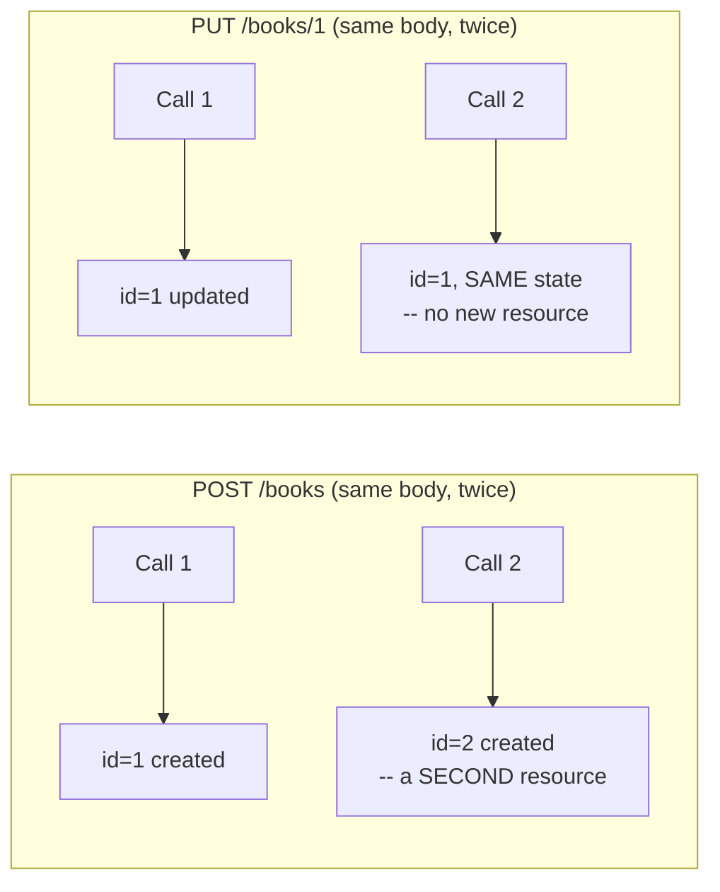

# REST API Fundamentals

## Table of Contents

1. [Why This Matters](#1-why-this-matters)
2. [Prerequisites](#2-prerequisites)
3. [Foundation (L1)](#3-foundation-l1)
4. [Core Concepts (L2)](#4-core-concepts-l2)
5. [How It Works Internally (L3)](#5-how-it-works-internally-l3)
6. [Practical Usage](#6-practical-usage)
7. [Examples](#7-examples)
8. [Common Mistakes](#8-common-mistakes)
9. [Edge Cases](#9-edge-cases)
10. [Performance Implications](#10-performance-implications)
11. [Trade-offs](#11-trade-offs)
12. [Senior-Level Considerations (L3)](#12-senior-level-considerations-l3)
13. [Staff/System-Level Considerations (L4)](#13-staffsystem-level-considerations-l4)
14. [Production Scenarios](#14-production-scenarios)
15. [Interview Questions](#15-interview-questions)
16. [Coding/Practice Exercises](#16-codingpractice-exercises)
17. [Debugging Exercises](#17-debugging-exercises)
18. [Design Exercises](#18-design-exercises)
19. [Further Reading](#19-further-reading)
20. [Mastery Checklist](#20-mastery-checklist)

## 1. Why This Matters

Every other chapter in `07-api-design` assumes you already know what a resource is, why `PUT` and `POST` mean different things, and what `404` versus `500` communicates — reasonable for the Senior/Staff-only version of this repository, not reasonable once it explicitly covers Junior through Staff. This is the fifth and final chapter in this repository's Junior Fundamentals initiative (see [Java OOP Fundamentals](../02-java/language-core/java-oop-fundamentals-classes-objects-and-interfaces.md) for the first, and the audit that started it), closing the same gap for API design that the other four closed for Java, SQL, Spring, and testing. Nearly every backend interview includes some form of "design an API for X," and a candidate who reaches for the wrong HTTP verb or the wrong status code signals a gap an interviewer will probe immediately.

## 2. Prerequisites

[Spring MVC Fundamentals](../05-spring/spring-mvc-fundamentals.md) — this chapter's own demo extends that one's `@RestController` mechanics with a second, REST-conventions-focused application.

## 3. Foundation (L1)

**REST** (Representational State Transfer) is a set of conventions for designing APIs around **resources** — nouns, not verbs. A well-designed REST API names its endpoints after the *thing* being manipulated (`/books`, `/books/42`) and lets the **HTTP verb** carry the *action*: `GET /books/42` retrieves book 42; it never spells the action into the URL as `/getBook?id=42`.

The four verbs this chapter's demo uses, and what each one means by convention:

- **`GET`** — retrieve a resource (or a list of them). Never changes anything.
- **`POST`** — create a new resource. Calling it twice creates two resources.
- **`PUT`** — replace an existing resource's full state. Calling it twice with the same body leaves the resource in the same state both times.
- **`DELETE`** — remove a resource.

An HTTP **status code** tells the caller what actually happened, in a single number a client can branch on without parsing the response body: `200 OK` (success, a body follows), `201 Created` (a new resource now exists), `204 No Content` (success, deliberately no body), `404 Not Found` (no resource at that URL), `500 Internal Server Error` (the server itself failed).

## 4. Core Concepts (L2)

**Idempotency** — the property that calling an operation multiple times produces the same end state as calling it once — is the single most interview-relevant REST concept, and it is a real, verb-specific guarantee, not a vague notion of "safety." `GET`, `PUT`, and `DELETE` are all idempotent by convention: repeating any of them leaves the system in the same state as doing it once (Section 7's `PUT` demo shows this directly: two identical calls, identical resulting resource, identical status both times). `POST` is deliberately **not** idempotent: it means "create a new thing," and calling it twice with the identical body genuinely creates two separate resources — Section 7's `POST` demo proves this directly with two different `id` values from an identical request body, not by assertion.



This is exactly what Section 7's real transcript proves with actual `curl` output: two identical `POST` calls produce two different `id`s; two identical `PUT` calls on the same URL leave the resource in the identical end state both times.

Resource naming follows a small number of real conventions worth internalizing: plural nouns for collections (`/books`, not `/book`), a nested path for a specific item within that collection (`/books/{id}`), and no verbs in the path at all — the verb is the HTTP method, stated once, not duplicated into the URL as well.

`201 Created`'s real convention includes more than the status number: a **`Location` header** pointing at the URL of the newly created resource (Section 7's `POST` response: `Location: /books/1`), so a client can immediately `GET` the resource it just created without having to construct that URL itself from the response body.

**The full status-code vocabulary a backend interview actually expects, organized by range:**

The five codes in Section 3 cover the common-case path; a real interview (and a real API) needs the rest of each range, not just its most frequent member. Every status code's first digit names its range, and that range is itself the useful mental model: `1xx` = the exchange isn't finished yet, `2xx` = success, `3xx` = the resource exists but the client should do something else first (usually: use a cached copy, or go elsewhere), `4xx` = the client's request is the problem, `5xx` = the server is the problem. A code's exact number within a range is a refinement of that range's meaning, never a contradiction of it — a `4xx` is always the client's fault in some specific way, a `5xx` always the server's.

**`1xx` — Informational.** Rare in ordinary REST API work; this range means "keep going, more is coming," not a final outcome. `100 Continue` (a client asking "should I bother sending the request body?") and `101 Switching Protocols` (the real mechanism a WebSocket upgrade uses, covered in [WebSocket and Server-Sent Events for Real-Time UI](../21-frontend-web/websocket-and-server-sent-events-for-realtime-ui.md)) are the two worth recognizing by name; neither is demonstrated here, since a plain JSON REST API essentially never emits one deliberately.

**`2xx` — Success.** The request was received, understood, and accepted — *what* succeeded, and whether a body follows, is what the specific number states.

| Code | Real meaning | Status in this chapter |
|---|---|---|
| `200 OK` | Generic success, a body follows | Real (Section 3/7) |
| `201 Created` | A new resource now exists, `Location` header included | Real (Section 3/7) |
| `202 Accepted` | Request accepted, but processing hasn't finished yet — for a genuinely asynchronous operation (a background job, a queued task) | Conceptual only — this chapter's `BookController` has no real async operation to demonstrate it honestly; a fabricated one would be a fake, not real evidence |
| `204 No Content` | Success, deliberately no body | Real (Section 3/7) |
| `206 Partial Content` | A real, partial response to a `Range` header request (resumable downloads, video streaming) | Conceptual only — the same honesty rule as `202`: this API serves whole JSON objects, never byte ranges, so a real demo would need a genuinely different kind of endpoint |

**`3xx` — Redirection.** The resource the client asked about isn't what it should actually use right now — either a cached copy is still valid, or the real content lives somewhere else.

| Code | Real meaning | Status in this chapter |
|---|---|---|
| `301 Moved Permanently` | This resource's real location has changed forever; update your bookmarks/links | Conceptual |
| `302 Found` | Go here *for now* — the target may change again later, so don't cache this redirect itself | **Real** (Section 7, new Example 11: `GET /books/latest`, a real, computed redirect to whichever id is currently highest) |
| `304 Not Modified` | Your cached copy is still current; no body follows | **Real** (Section 7, Example 10, via `ETag`/`If-None-Match`) |
| `307 Temporary Redirect` | Like `302`, but explicitly guarantees the client repeats the *same* HTTP method and body at the new location (`302`'s behavior here is famously inconsistent across old clients) | Conceptual |
| `308 Permanent Redirect` | `301`'s same-method-guaranteed counterpart, for the same historical reason `307` exists relative to `302` | Conceptual |

**`4xx` — Client Error.** The request itself is the problem — something about what the client sent (or who the client is) is wrong.

| Code | Real meaning | Status in this chapter |
|---|---|---|
| `400 Bad Request` | The request couldn't even be parsed (malformed JSON, wrong shape) — fails before any controller code runs | **Real** (Section 7, Example 6) |
| `401 Unauthorized` | No identity established at all (missing/invalid credentials) — an authentication failure | Conceptual; real mechanism in [OAuth 2.0, OIDC, and JWT](../12-security/oauth2-oidc-and-jwt.md) |
| `403 Forbidden` | Identity *is* established, but this caller can't do this specific thing — an authorization failure | Conceptual; real, related mechanics in [CSRF, CORS, and Session Security](../12-security/csrf-cors-and-session-security.md) |
| `404 Not Found` | No resource at this URL | **Real** (Section 3/7) |
| `405 Method Not Allowed` | The path exists, but not for this verb — a real `Allow` header names what *is* mapped | **Real** (Section 7, Example 7) |
| `409 Conflict` | Well-formed and valid in isolation, but conflicts with current state (a real business-key collision, not the generated id) | **Real** (Section 7, Example 9) |
| `410 Gone` | The resource used to exist and is now deliberately, permanently removed — distinct from `404`'s "was this ever here at all" | Conceptual — Section 9 already covers this exact ambiguity for repeated `DELETE` (`404` versus `204`); a real `410` would be a third defensible answer to that same debate |
| `415 Unsupported Media Type` | The body's declared `Content-Type` isn't one this endpoint accepts | **Real** (Section 7, new Example 12: a `text/plain` body against a JSON-only endpoint) |
| `422 Unprocessable Entity` | Parsed fine, but the *content* violates a semantic rule | **Real** (Section 7, Example 8) |
| `429 Too Many Requests` | The caller is rate-limited | Conceptual here; real, working token-bucket demo in [Rate Limiting and Throttling Algorithms](../11-system-design/rate-limiting-and-throttling-algorithms.md) |

**`5xx` — Server Error.** The client did nothing wrong; the failure is on the server side (or an intermediary acting on the server's behalf).

| Code | Real meaning | Status in this chapter |
|---|---|---|
| `500 Internal Server Error` | The server itself failed in some unhandled way | **Real** (Section 3) |
| `501 Not Implemented` | The server doesn't support this request method *at all*, as a general capability (rare — `405` is almost always the code that actually applies when one specific endpoint doesn't support one specific verb) | Conceptual |
| `502 Bad Gateway` | An intermediary got an invalid response from an upstream server it was proxying to | Conceptual — cannot be produced by one service acting alone; see [API Gateway, BFF, and Edge Concerns](api-gateway-bff-and-edge-concerns.md) |
| `503 Service Unavailable` | The server (or an intermediary) is temporarily unable to handle the request (overloaded, in maintenance) | Conceptual, same reason |
| `504 Gateway Timeout` | An intermediary's upstream request timed out | Conceptual, same reason |

Three new endpoints/behaviors in this chapter's own real app back every "Real" row added in this update: `GET /books/latest` (a genuinely computed `302` redirect), the existing endpoints' automatic `415` behavior (zero new code — Spring's own message-converter negotiation), and the existing endpoints' automatic `400`/`405`/`422`/`409`/`304` behavior from earlier in this same update.

## 5. How It Works Internally (L3)

None of these conventions are enforced by HTTP itself — a server can technically return `200` for everything, or accept a `DELETE` request that actually creates a resource, and the protocol will not stop it. REST conventions are a shared agreement between API designers and API consumers, enforced by the code you write (Section 7's [`BookController`](../../practice/java/rest-api-fundamentals/src/demo/BookController.java) explicitly chooses `ResponseEntity.created(location)` rather than defaulting to `200`), not by the transport layer underneath it. This is exactly why Section 8's mistakes are possible at all — the framework will happily let you return the "wrong" status code if you don't deliberately choose the right one.

Spring's `ResponseEntity` is the mechanism that makes choosing a specific status code explicit rather than implicit: returning a plain object (as [T-2203's `TaskController.createTask`](../../practice/java/spring-mvc-fundamentals/src/demo/TaskController.java) does) defaults to `200 OK`; wrapping it in `ResponseEntity.created(location).body(...)` (this chapter's own [`BookController.createBook`](../../practice/java/rest-api-fundamentals/src/demo/BookController.java)) states the status explicitly. `ResponseEntity.status(HttpStatus.NO_CONTENT).build()` for `DELETE` similarly states, in code, "success, no body" rather than letting a default apply.

## 6. Practical Usage

Choose the HTTP verb by what actually happens to the resource's existence, not by which verb feels closest to the action's English name — a "toggle availability" operation still updates an existing resource's state, so it's a `PUT` (or a narrower `PATCH`, not covered in this fundamentals chapter), never a `POST` just because it "does something." Return `201` with a `Location` header from every resource-creating endpoint, not `200` — Section 8's most common mistake. Choose `404` over `500` deliberately for "the requested thing doesn't exist" — a `500` communicates "the server itself broke," a fundamentally different signal to a caller (and to whoever is paged for it) than "you asked for something that isn't there."

## 7. Examples

All output below is real, from a live Spring Boot 3.5.16 app on embedded Tomcat, `localhost:8081` — [`practice/java/rest-api-fundamentals/`](../../practice/java/rest-api-fundamentals/), full transcript in `curl-transcript.txt`.

**`POST /books` is not idempotent — two identical requests, two real, distinct resources:**
```
$ curl -s -i -X POST http://localhost:8081/books -d '{"title":"Design Patterns"}'
HTTP/1.1 201
Location: /books/1
{"id":1,"title":"Design Patterns","available":true}

$ curl -s -i -X POST http://localhost:8081/books -d '{"title":"Design Patterns"}'
HTTP/1.1 201
Location: /books/2
{"id":2,"title":"Design Patterns","available":true}
```
Both requests sent the identical body; the response has two different `id`s and two different `Location` headers, because `POST` means "create a new one" every time it's called.

**`PUT /books/1` is idempotent — two identical requests, the identical resulting state and status both times:**
```
$ curl -X PUT http://localhost:8081/books/1 -d '{"title":"Design Patterns (2nd ed.)","available":false}'
{"id":1,"title":"Design Patterns (2nd ed.)","available":false}
HTTP status: 200

$ curl -X PUT http://localhost:8081/books/1 -d '{"title":"Design Patterns (2nd ed.)","available":false}'
{"id":1,"title":"Design Patterns (2nd ed.)","available":false}
HTTP status: 200
```

**`PUT` on a missing id, and `DELETE` twice** — real `404`s where the resource genuinely doesn't (or no longer does) exist:
```
$ curl -X PUT http://localhost:8081/books/999 -d '{"title":"Ghost","available":true}'
HTTP status: 404

$ curl -X DELETE http://localhost:8081/books/2
HTTP status: 204
$ curl -X DELETE http://localhost:8081/books/2
HTTP status: 404
```

All output below is real, from the same live app, extending `BookController` with a new, optional `isbn` field and a real, built-in Spring `ETag` filter — full transcript in `curl-transcript-status-codes.txt`.

**Example 6 — `400 Bad Request`: malformed JSON, rejected before the controller even runs:**
```
$ curl -i -X POST http://localhost:8081/books -d '{"title": "Broken JSON"'
HTTP/1.1 400
{"timestamp":"2026-09-11T22:07:18.152+00:00","status":400,"error":"Bad Request","path":"/books"}
```

**Example 7 — `405 Method Not Allowed`: a real, unmapped verb, with a real `Allow` header naming the mapped ones:**
```
$ curl -i -X PATCH http://localhost:8081/books/1
HTTP/1.1 405
Allow: PUT, DELETE, GET
{"timestamp":"2026-09-11T22:07:18.178+00:00","status":405,"error":"Method Not Allowed","path":"/books/1"}
```

**Example 8 — `422 Unprocessable Entity`: syntactically valid JSON, semantically invalid content:**
```
$ curl -i -X POST http://localhost:8081/books -d '{"title":"","available":true}'
HTTP/1.1 422
{"error":"title must not be blank"}
```

**Example 9 — `409 Conflict`: a real business-key (isbn) conflict, deliberately distinct from title duplication:**
```
$ curl -i -X POST http://localhost:8081/books -d '{"title":"Refactoring","isbn":"978-0-13-475759-9"}'
HTTP/1.1 201
Location: /books/1
{"id":1,"title":"Refactoring","available":true,"isbn":"978-0-13-475759-9"}

$ curl -i -X POST http://localhost:8081/books -d '{"title":"Refactoring (different title)","isbn":"978-0-13-475759-9"}'
HTTP/1.1 409
{"error":"isbn 978-0-13-475759-9 already exists"}
```
The second request's *title* is different — only the *isbn* collides. This is the real distinction from Section 4's title-duplication proof: two books may legitimately share a title, but not the same real-world business key.

**Example 10 — `304 Not Modified`: a real conditional `GET`, then a real cache invalidation after a genuine change:**
```
$ curl -i http://localhost:8081/books/1
HTTP/1.1 200
ETag: "0e0d0607f2ab905eb95c27d74732f1aa2"
{"id":1,"title":"Refactoring","available":true,"isbn":"978-0-13-475759-9"}

$ curl -i http://localhost:8081/books/1 -H 'If-None-Match: "0e0d0607f2ab905eb95c27d74732f1aa2"'
HTTP/1.1 304
ETag: "0e0d0607f2ab905eb95c27d74732f1aa2"
(no body)

$ curl -X PUT http://localhost:8081/books/1 -d '{"title":"Refactoring, 2nd Edition","available":true,"isbn":"978-0-13-475759-9"}'
$ curl -i http://localhost:8081/books/1 -H 'If-None-Match: "0e0d0607f2ab905eb95c27d74732f1aa2"'
HTTP/1.1 200
ETag: "06258bb760a3545b16fda4bedecd16a72"
{"id":1,"title":"Refactoring, 2nd Edition","available":true,"isbn":"978-0-13-475759-9"}
```
The same, now-stale `If-None-Match` value from before the `PUT` no longer matches — a real, new `ETag` (Spring's own `ShallowEtagHeaderFilter`, an MD5 hash of the response body) forces a real `200` with the updated state, not a stale `304`.

**A real bug this exact demo caught before shipping:** the `PUT` handler originally rebuilt the stored resource with a 3-argument constructor that never carried `isbn` through at all — a `PUT` request that explicitly included `isbn` would have silently lost it, exactly the accidental data loss PUT's "replace with what I sent" contract exists to prevent, not cause. Fixed to carry every field through; the transcript above is the corrected, real output.

**Example 11 — `302 Found`: a real, computed redirect — the target genuinely changes as new books are created:**
```
$ curl -i http://localhost:8081/books/latest
HTTP/1.1 404
(no books yet)

$ curl -i -X POST http://localhost:8081/books -d '{"title":"First"}'
HTTP/1.1 201
Location: /books/1

$ curl -i -X POST http://localhost:8081/books -d '{"title":"Second"}'
HTTP/1.1 201
Location: /books/2

$ curl -i http://localhost:8081/books/latest
HTTP/1.1 302
Location: /books/2

$ curl -i -X POST http://localhost:8081/books -d '{"title":"Third"}'
HTTP/1.1 201
Location: /books/3

$ curl -i http://localhost:8081/books/latest
HTTP/1.1 302
Location: /books/3
```
`/books/latest` is not itself a resource — `latestId()` recomputes the real, current highest id on every call, so the `Location` a client is redirected to genuinely tracks the collection's real state. This is exactly why `302` (not `301`) is correct here: a client caching this redirect permanently would eventually follow it to a stale id.

**Example 12 — `415 Unsupported Media Type`: a real, automatic Spring rejection, zero controller code:**
```
$ curl -i -X POST http://localhost:8081/books -H "Content-Type: text/plain" -d '{"title":"Wrong Type"}'
HTTP/1.1 415
Accept: application/json, application/*+json
{"timestamp":"2026-09-11T22:16:13.258+00:00","status":415,"error":"Unsupported Media Type","path":"/books"}
```
The identical, valid JSON body this chapter's other examples use, sent with the wrong `Content-Type` header, is rejected before `createBook` ever runs — the same "fails before the controller sees it" mechanism as `400`, but for a different reason (the format Spring was told to expect, not whether the bytes themselves parse).

## 8. Common Mistakes

- **Returning `200 OK` from a resource-creating endpoint instead of `201 Created`** — loses the explicit "a new thing now exists" signal, and usually loses the `Location` header along with it, forcing the client to construct the new resource's URL itself from the response body.
- **Putting a verb in the URL** (`/createBook`, `/getBookById`) — duplicates information the HTTP method already carries, and is the single most common tell that a candidate is designing an RPC-style API while calling it REST.
- **Using `POST` for an update because it "felt closer to the action"** — Section 6's warning; the actual test is "does this create a new resource (`POST`) or replace an existing one (`PUT`)," not which verb's English name sounds right.
- **Returning `500` for "resource not found"** instead of `404` — conflates "the server is broken" with "you asked for something that doesn't exist," two signals a caller (and an on-call engineer) need to distinguish immediately.
- **Using `400` and `422` interchangeably** — Section 4's real distinction: `400` means the request couldn't even be parsed; `422` means it parsed fine but violates a semantic rule. Collapsing them into "some kind of 4xx" loses information a client could otherwise branch on (a malformed-request bug in the client's own serialization code, versus a real, user-facing validation message).
- **Confusing `401` and `403`** — `401` means "I don't know who you are" (or your credentials are invalid); `403` means "I know exactly who you are, and you can't do this." Returning `401` for an authorization failure (or vice versa) actively misleads a client's retry logic — retrying with the same, already-valid credentials will never fix a real `403`.

## 9. Edge Cases

- **`DELETE` on an already-deleted resource** genuinely has two defensible answers, not one correct one: this chapter's own demo returns `404` (Section 7's second `DELETE /books/2`), treating "already gone" as "not found"; some real APIs instead return `204` again, treating repeated deletion as an equally successful idempotent outcome regardless of whether anything was actually removed on this specific call. Section 11 states both positions explicitly — knowing this is a real, debatable design decision (and picking one, with a stated reason) matters more than which one you pick.
- **`PUT` to a URL that doesn't exist yet** could either create the resource at that exact id (a real, valid REST pattern called "PUT to create," used when the client controls the id) or return `404` (this chapter's own choice, since [`BookController`](../../practice/java/rest-api-fundamentals/src/demo/BookController.java) generates ids server-side via `POST`) — which one is correct depends entirely on whether the API design lets clients choose resource ids at all.
- **A `POST` request that's a genuine network retry**, not a deliberate second creation (a client's connection dropped after the server processed the request but before the response arrived) is the real-world reason `POST`'s non-idempotency becomes an operational problem, not just a definitional one — [Idempotency at System Edges](../11-system-design/idempotency.md) covers the actual mechanism (an idempotency key) systems use to make retried `POST` requests safe, at a scale and depth beyond this fundamentals chapter.
- **Two fields on the same resource can have genuinely different duplication rules** — Section 7's Example 9 demo deliberately keeps `title` freely duplicable (Section 4's own proof) while treating `isbn` duplication as a real `409` conflict. A single blanket "no duplicate resources" rule would be wrong here; the real question is always "duplicate *which specific field*, and does that field function as a business key."

## 10. Performance Implications

None of this chapter's conventions carry an inherent performance cost of their own — choosing the correct status code and verb is a design decision made once per endpoint, not a runtime cost paid per request. The real performance-relevant API design questions (pagination at scale, caching headers, payload size) belong to [API Design](api-design.md) and [API Gateway, BFF, and Edge Concerns](api-gateway-bff-and-edge-concerns.md), both of which assume this chapter's fundamentals as a starting point.

## 11. Trade-offs

| Concern | Treat repeated `DELETE` as `404` (this chapter's choice) | Treat repeated `DELETE` as `204` |
|---|---|---|
| Semantics | "Not found" is honest — the resource genuinely isn't there | "Success" emphasizes the caller's desired end state (the resource is gone) was achieved either way |
| Client retry safety | A client retrying a `DELETE` after a dropped connection must treat `404` as "probably fine, but check" | A client retrying gets a clean, uniform success signal regardless of whether this exact call did the deleting |
| Consistency with `GET`/`PUT` on a missing resource | Matches the same `404` those verbs already return for a missing id | Is the one verb behaving differently from the others for the same "resource doesn't exist" condition |

## 12. Senior-Level Considerations (L3)

A Senior engineer designing a new endpoint states, out loud, which of Section 9's genuinely-debatable design decisions (repeated-`DELETE` semantics, whether `PUT` can create) the API is choosing and why — not because there's one universally correct answer, but because an unstated, inconsistent choice (some endpoints return `404` on repeat-delete, others `204`, with no one having decided) is a real API-quality smell an interviewer will notice in a design-round follow-up question.

## 13. Staff/System-Level Considerations (L4)

At Staff scope, the actual leverage in this chapter's conventions is consistency across an entire API surface, not correctness on any one endpoint — a system with a dozen services each making its own independent, undocumented choice about repeated-`DELETE` semantics or when to use `201` versus `200` produces an API that's exhausting to integrate against, because every new integration has to rediscover each service's own local conventions by testing rather than reading a shared standard. A Staff engineer's real leverage here is establishing (and enforcing, via API review or a shared style guide) one answer to each of Section 9's genuinely-open questions across an organization's services, the same organizational-consistency argument [Spring MVC Fundamentals](../05-spring/spring-mvc-fundamentals.md)'s own Staff section makes for controller/service/repository layering.

## 14. Production Scenarios

No existing `production-cookbook/` entry has a REST-fundamentals-specific root cause — the closest adjacent entries are pagination- and idempotency-key-scale, not basic-verb/status-code-scale.

> Planned reference: a future `production-cookbook/` entry covering a real incident caused by a client blindly retrying a non-idempotent `POST` after a timeout (genuinely unaware the original request had already succeeded server-side), producing duplicate resources, would be a natural, non-duplicative addition connecting this chapter's Section 9 edge case to [Idempotency at System Edges](../11-system-design/idempotency.md)'s system-scale fix.

## 15. Interview Questions

**Q1 (Junior): "What's the difference between PUT and POST?"**
Expected answer: `POST` creates a new resource (not idempotent — calling it twice creates two); `PUT` replaces an existing resource's state at a known location (idempotent — calling it twice leaves the same end state). A weak answer says "PUT updates, POST creates" without the idempotency distinction, which is the part interviewers actually probe.

**Q2 (Junior/Mid): "What status code should a successful DELETE return, and why no body?"**
Expected answer: `204 No Content` — the operation succeeded, and there is deliberately nothing left to describe, since the resource no longer exists.

**Q3 (Mid): "Why does a well-designed API return 201 instead of 200 from a creation endpoint, and what should come with it?"**
Expected answer: `201` communicates "a new resource now exists" specifically, distinct from a general success; convention also includes a `Location` header pointing at the new resource's real URL (Section 4/7).

**Q4 (Mid/Senior): "Is DELETE idempotent? What happens if you call it twice on the same resource?"**
Expected answer: `DELETE` is conventionally idempotent in the sense that the end state (resource gone) is the same either way, but the *response* to a second call is a genuinely debatable design choice (Section 9/11: `404` versus `204`) — the strongest answers name both options and state a reasoned preference rather than asserting only one is correct.

**Q5 (Senior/Staff): "You're reviewing an API where some endpoints return 404 and others return 204 for repeated deletes, with no stated reason. What do you do?"**
Expected answer: Section 13's framing — flag it as an unstated-inconsistency issue, not a bug in either individual endpoint; push for a documented, organization-wide convention rather than a per-endpoint fix, since the same inconsistency will otherwise keep recurring as new endpoints are added.

**Q6 (Mid): "What's the real difference between 400 and 422, and why does it matter?"**
Expected answer: `400` means the request body itself couldn't be parsed (malformed JSON, wrong content type) — the failure happens before any application code runs. `422` means the body parsed successfully but its content violates a semantic/business rule. It matters because a client can react differently: a `400` usually indicates a bug in the client's own serialization; a `422` indicates a real, user-facing validation message is needed.

**Q7 (Mid): "What's the difference between 401 and 403?"**
Expected answer: `401 Unauthorized` means the caller's identity isn't established at all — no credentials, or invalid ones (an authentication failure). `403 Forbidden` means identity *is* established, but that specific caller isn't allowed to perform this specific action (an authorization failure). A weak answer treats them as interchangeable "access denied" codes.

**Q8 (Mid/Senior): "How would you implement a cache-friendly GET endpoint that avoids re-sending an unchanged resource's full body on every request?"**
Expected answer: Conditional GET via `ETag`/`If-None-Match` — the server computes a real `ETag` for the current representation; a client resending the same `ETag` in `If-None-Match` gets a real, empty-bodied `304 Not Modified` if nothing changed, or a full `200` with a new `ETag` if it did. Spring provides this via `ShallowEtagHeaderFilter` with no hand-rolled hashing code.

**Q9 (Mid): "You need an endpoint that always points at 'whichever resource is currently newest.' What status code should the redirect use, and why does it matter?"**
Expected answer: `302 Found`, not `301 Moved Permanently` — the target genuinely changes over time (this chapter's own `GET /books/latest` redirects to a different id as new books are created), and `301`/`308` tell clients to cache the redirect permanently, which would eventually point them at a stale location. A weak answer treats all redirects as interchangeable, or defaults to `301` without checking whether the target is actually permanent.

## 16. Coding/Practice Exercises

1. Add a `PATCH /books/{id}` endpoint that updates only the `available` field (leaving `title` untouched if not supplied), and explain in a one-line comment why this is a genuinely different operation from the existing `PUT`, not just a smaller version of it.
2. Change `deleteBook` to return `204` on a repeat delete instead of `404` (Section 9's alternative), and update the transcript to show the new, real behavior.
3. Add a `GET /books?available=true` query parameter that filters the list, and state which HTTP status code an empty (zero-match) result should return — `200` with an empty array, or `404` — with a one-sentence justification.

## 17. Debugging Exercises

Given this real API behavior, predict the output before checking Section 7's transcript:

```
POST /books {"title":"A"}   -> ?
POST /books {"title":"A"}   -> ?
GET /books                  -> ?
```

Both `POST` calls return `201`, each with a **different** `id` (`1` and `2`) and a different `Location` header, and `GET /books` afterward shows **two** separate book resources with the identical title `"A"`. A candidate predicting the second `POST` would "update" the first, or that the two calls would collapse into one resource, is treating `POST` as idempotent — the exact misunderstanding Section 4 exists to correct.

## 18. Design Exercises

Design the endpoints (verb + path + expected status codes) for a simple shopping cart: adding an item, removing an item, viewing the cart, and clearing the entire cart. For "adding an item," state explicitly whether adding the same item twice should create two line entries or increment a quantity on one — and which HTTP verb that decision implies.

## 19. Further Reading

- [API Design](api-design.md) — pagination, resource naming at scale, and error-response design, building directly on this chapter's fundamentals.
- [API Gateway, BFF, and Edge Concerns](api-gateway-bff-and-edge-concerns.md) — what happens to these conventions once multiple services and a gateway sit between the client and the resource.
- [Idempotency at System Edges](../11-system-design/idempotency.md) — the system-scale mechanism (idempotency keys) that makes a retried, non-idempotent `POST` safe, referenced in this chapter's Section 9/14.
- [Rate Limiting and Throttling Algorithms](../11-system-design/rate-limiting-and-throttling-algorithms.md) — the real, working `429 Too Many Requests` mechanism referenced in Section 4, not re-demonstrated here.
- [OAuth 2.0, OIDC, and JWT](../12-security/oauth2-oidc-and-jwt.md) — the real authentication mechanism behind a genuine `401`, referenced in Section 4.
- [CSRF, CORS, and Session Security](../12-security/csrf-cors-and-session-security.md) — related session-identity mechanics referenced alongside the `401`/`403` distinction in Section 4.

## 20. Mastery Checklist

- [ ] Can state what `GET`, `POST`, `PUT`, and `DELETE` each conventionally mean, including which are idempotent.
- [ ] Can explain why `POST` creating two resources from an identical body is correct behavior, not a bug.
- [ ] Can state what `201 Created` communicates that `200 OK` does not, and what header should come with it.
- [ ] Can distinguish `404` from `500` and explain why conflating them is a real mistake, not just a style nitpick.
- [ ] Can correctly predict the Section 17 debugging exercise's real output before checking it.
- [ ] Can name at least one genuinely open, debatable REST design question (Section 9) and argue a reasoned position on it.
- [ ] Can state the real difference between `400` and `422`, and between `401` and `403`, with a concrete example of each.
- [ ] Can explain what a `405 Method Not Allowed` response's `Allow` header tells a client, and why Spring produces it automatically.
- [ ] Can explain what a real conditional `GET` (`ETag`/`If-None-Match`/`304`) actually saves, and name the Spring mechanism that provides it with zero hand-rolled code.
- [ ] Can explain why `502`/`503`/`504` can never be produced by a single backend service acting alone.
- [ ] Can state what each status-code range's first digit means (`1xx`–`5xx`) without naming a specific code, and correctly reason about an unfamiliar code from its first digit alone.
- [ ] Can explain why `GET /books/latest` uses `302 Found` rather than `301 Moved Permanently`, and name a real bug a wrongly-permanent redirect would cause.
