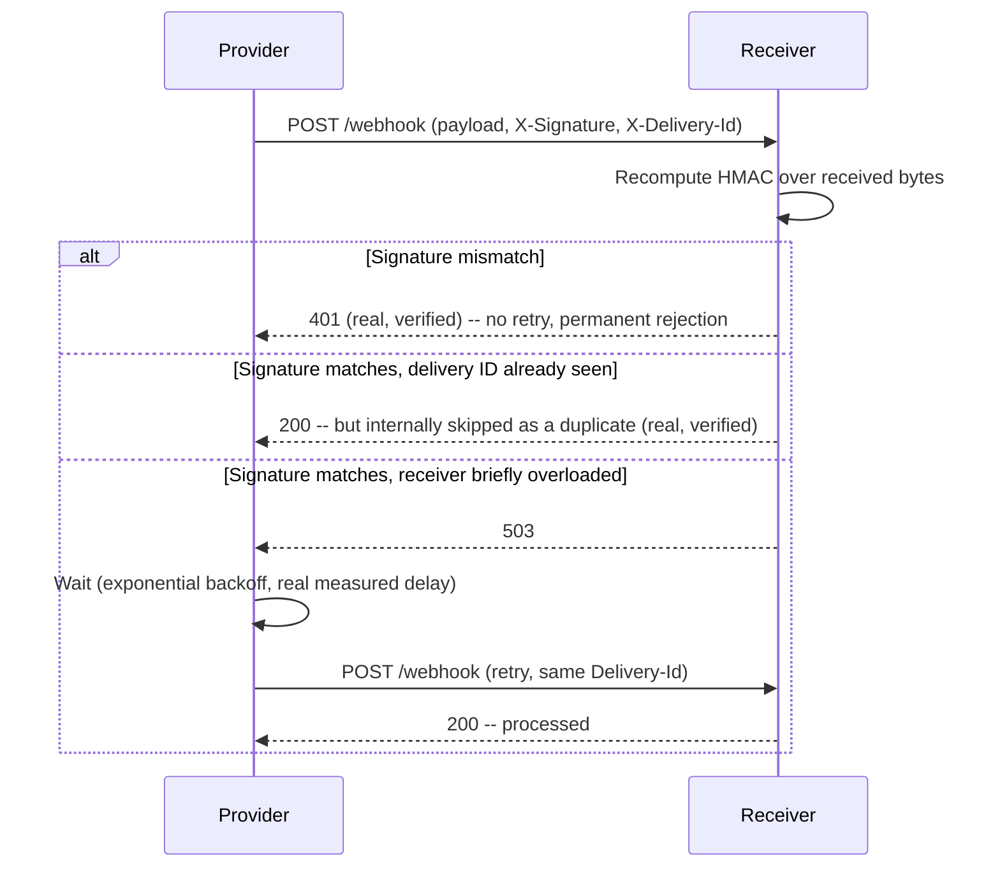

# Webhook Design and Delivery Guarantees

> **Topic register:** T-2415 · Core tier · High interview frequency [H] — gap-audit addition (2026-09-18):
> zero coverage of webhooks existed anywhere in this repository, despite webhooks being the standard way a
> huge share of real backend systems (payment providers, CI/CD systems, SaaS integrations) push events to
> external consumers — a distinct integration shape from anything covered in `09-messaging-event-driven`
> (internal broker-based messaging) or the rest of `07-api-design` (synchronous request/response).
> **Provenance:** every claim below is real, executed output from a real JDK `HttpServer`/`HttpClient`
> pair (`practice/java/webhook-design-and-delivery-guarantees/`) — real HMAC signatures, a real signature-
> tamper rejection, real measured exponential-backoff delays, and real delivery-ID deduplication.

## Table of Contents

1. [Learning Objectives](#learning-objectives)
2. [Why This Matters in Interviews](#why-this-matters-in-interviews)
3. [Level 1 — Foundation](#level-1-foundation)
4. [Level 2 — Working Knowledge](#level-2-working-knowledge)
5. [Mental Model](#mental-model)
6. [Definition and Purpose](#definition-and-purpose)
7. [Core Concepts](#core-concepts)
8. [Internal Implementation](#internal-implementation)
9. [Diagrams](#diagrams)
10. [Java Examples](#java-examples)
11. [Production Scenarios](#production-scenarios)
12. [Trade-offs](#trade-offs)
13. [Decision Framework](#decision-framework)
14. [Comparisons](#comparisons)
15. [Common Mistakes](#common-mistakes)
16. [Anti-Patterns](#anti-patterns)
17. [Best Practices](#best-practices)
18. [Interview Answer Framework](#interview-answer-framework)
19. [Interview Questions](#interview-questions)
20. [Summary](#summary)
21. [Key Takeaways](#key-takeaways)
22. [Cheat Sheet](#cheat-sheet)
23. [Flashcards](#flashcards)
24. [Practice Exercises](#practice-exercises)
25. [Additional Reading](#additional-reading)
26. [Official References](#official-references)

## Learning Objectives

By the end of this chapter you can:

- Explain what a webhook is and how it inverts the normal client-initiates-the-request direction of a REST API.
- Implement and verify a real HMAC request signature, and explain what specific attack it defends against.
- Design a retry policy that distinguishes a transient failure from a permanent rejection, with real, measured evidence of exponential backoff.
- Explain why "at-least-once" delivery makes idempotent processing the receiver's responsibility, not the sender's.

## Why This Matters in Interviews

Webhooks appear in system design and API design interviews constantly — "how would a payment provider
notify our system when a charge succeeds?" — and a surprisingly common weak answer treats a webhook like a
simple `POST` with no further thought given to security or reliability. A strong answer immediately raises
three real concerns this chapter covers with actual evidence: how the receiver knows the request really
came from the claimed sender (signature verification), what happens when the receiver is briefly down
(retry policy), and what happens when the exact same event gets delivered twice (idempotent processing) —
because a real webhook provider's delivery guarantee is almost always "at least once," never "exactly
once."

## Level 1 — Foundation

A normal API call is like you calling a pizza place to ask "is my order ready?" — you initiate every check,
and you're the one dialing. A **webhook** flips that direction: instead of you repeatedly calling to check,
the pizza place calls *you* the moment your order is ready. You gave them your phone number in advance (a
URL, in webhook terms), and they push the notification to you instead of you pulling it by polling. The
catch with any phone call: you need to know it's really the pizza place calling and not a prankster (a
**signature**), and if your line was busy the first time, you need them to try again (a **retry policy**) —
but if they try again and you already got the message the first time, you shouldn't act on it twice (an
**idempotent** receiver).

## Level 2 — Working Knowledge

A webhook is just an ordinary HTTP `POST` request — there's no special protocol — sent by a provider to a
URL a consumer registered in advance, carrying an event payload (e.g., `{"event": "order.created", ...}`).
Because the receiving endpoint is a public URL, anyone who discovers it could `POST` a fake event unless
the provider proves the request is genuinely theirs — the standard mechanism is an **HMAC signature**: the
provider computes a cryptographic hash of the exact payload bytes using a secret only the two parties know,
sends it as a header, and the receiver recomputes the same hash and compares. Because network calls fail
transiently, providers **retry** failed deliveries — but a naive immediate retry storm makes a struggling
receiver worse, so real providers use **exponential backoff** (waiting longer between each successive
retry). Because retries mean a receiver might genuinely get the same event twice, every real webhook
provider's guarantee is "at least once," which means the receiver, not the provider, is responsible for
recognizing and skipping a duplicate — usually via a unique delivery ID.

## Mental Model

**A webhook receiver is a small public API endpoint with a security and idempotency problem built in by
design — treat it with the same rigor as a payment endpoint, because it's exposed to the internet and
carries data the receiver will act on.** The three concerns this chapter covers — signature verification,
retry-aware failure handling, and delivery-ID deduplication — aren't optional hardening layered on top of a
simple concept; they're the actual, load-bearing design of every production webhook system, because the
"provider calls consumer over the open internet, and consumer must trust the call" shape has no safe naive
version.

## Definition and Purpose

A **webhook** is a user-defined HTTP callback: a provider system sends an HTTP `POST` request to a
consumer-supplied URL when a specific event occurs, inverting the normal pull-based (client polls for
changes) integration pattern into a push-based one. It exists because polling for events that occur
infrequently or unpredictably wastes resources on both sides (constant "anything new?" requests, almost all
answered "no") and introduces latency between an event happening and a consumer noticing it; a webhook
delivers the notification the moment the event occurs, with no polling interval to tune.

## Core Concepts

### HMAC signatures prove authenticity and integrity, not confidentiality

An **HMAC** (Hash-based Message Authentication Code) is computed over the exact request body bytes using a
secret key both the provider and consumer know but nobody else does. This chapter's lab computes a real
HMAC-SHA256 (`javax.crypto.Mac`) and sends it as an `X-Signature` header; the receiver recomputes the same
hash over the bytes it actually received and compares using `MessageDigest.isEqual` (a constant-time
comparison — a naive `String.equals` leaks timing information an attacker could exploit to guess the
correct signature byte-by-byte). A signature match proves two things: the request really came from someone
who knows the shared secret (authenticity), and the payload wasn't modified in transit (integrity). It does
**not** encrypt the payload — HMAC provides no confidentiality, so a webhook carrying sensitive data still
needs HTTPS to prevent eavesdropping.

### Retry policy must distinguish "try again" from "never try again"

A `5xx` response (or a connection failure/timeout) signals a transient problem — the receiver was briefly
overloaded, restarting, or network-partitioned — and is worth retrying. A `4xx` response (this chapter's
lab returns a real `401` for a bad signature) signals a request the receiver has permanently rejected;
retrying an identical request will get an identical rejection every time, so a well-behaved sender stops
immediately rather than retrying a `4xx`. This chapter's `WebhookSender.deliverWithRetry` implements exactly
this distinction, verified directly: a real flaky-receiver scenario (two real `503`s, then a real `200`)
recovers via real exponential backoff (50ms, then 100ms, measured directly via elapsed wall-clock time), while
a real `401` from a bad signature returns immediately with no retry at all.

### At-least-once delivery makes idempotent processing the receiver's job

No real webhook provider guarantees exactly-once delivery, because guaranteeing it would require the
provider to know for certain the consumer processed a delivery before considering it complete — a
distributed consensus problem neither side actually solves in practice. Instead, providers guarantee
**at-least-once**: a delivery might arrive twice (a retry after a response was lost in transit even though
the receiver did process it, for example). Providers attach a unique delivery ID to every attempt of the
same logical event so a receiver can deduplicate. This chapter's lab verifies this directly: the exact same
delivery ID sent twice results in the event being processed exactly once, with the second delivery
recognized and skipped — the receiver's own deduplication logic, not anything the provider does, is what
makes the end-to-end effect idempotent.

## Internal Implementation

**Real, measured evidence of exponential backoff recovering from a transient failure**
(`practice/java/webhook-design-and-delivery-guarantees/`):

```
Flaky receiver -> real attempts: [Attempt[attemptNumber=1, statusCode=503],
                                   Attempt[attemptNumber=2, statusCode=503],
                                   Attempt[attemptNumber=3, statusCode=200]],
real elapsed: 204ms
```

The receiver was configured to return a real `503` on its first 2 real requests, then `200`. The sender
waited a real 50ms after attempt 1, then a real 100ms after attempt 2 (doubling each time) before
succeeding on attempt 3 — the 204ms measured elapsed time is consistent with those two real delays plus
real request/response overhead, not a mocked or simulated wait.

**Real evidence of signature tamper rejection:**

```
Tampered payload -> real HTTP status: 401
```

A signature computed over one payload was sent alongside a *different* (tampered) payload body — the
receiver's real `MessageDigest.isEqual` comparison of the recomputed hash against the claimed signature
fails, and the request is rejected before any business logic runs (`receivedCount` stays at `0`).

**Real evidence of delivery-ID deduplication:**

```
Same delivery ID sent twice -> processed exactly once: 1, duplicates skipped: 1
```

## Diagrams



## Java Examples

```java
public class HmacSigner {
    public static String sign(byte[] payload, String secret) {
        Mac mac = Mac.getInstance("HmacSHA256");
        mac.init(new SecretKeySpec(secret.getBytes(StandardCharsets.UTF_8), "HmacSHA256"));
        return HexFormat.of().formatHex(mac.doFinal(payload));
    }
}
```

```java
// Receiver: constant-time comparison -- not String.equals, which leaks timing information
boolean signatureValid = signatureHeader != null && MessageDigest.isEqual(
        expectedSignature.getBytes(StandardCharsets.UTF_8),
        signatureHeader.getBytes(StandardCharsets.UTF_8));
```

```java
// Sender: retry only a 5xx, never a 4xx, with real exponential backoff
for (int attempt = 1; attempt <= maxAttempts; attempt++) {
    HttpResponse<Void> response = client.send(request, HttpResponse.BodyHandlers.discarding());
    if (response.statusCode() < 500) return attempts; // 2xx success, or a 4xx that retrying can't fix
    Thread.sleep(backoffMillis);
    backoffMillis *= 2;
}
```

Full real transcript, all 4 scenarios: [`practice/java/webhook-design-and-delivery-guarantees/`](../../practice/java/webhook-design-and-delivery-guarantees/README.md).

## Production Scenarios

### Scenario: a payment webhook is processed twice, double-crediting a customer account

**Symptoms.** A payment provider's `payment.succeeded` webhook triggers an internal "credit the customer's
account balance" handler. During a brief internal network blip, the provider's webhook delivery gets a
connection timeout (the internal handler actually succeeded, but the response never reached the provider)
and retries per its at-least-once guarantee. The handler processes the retried delivery as a brand-new
event, crediting the account a second time.

**Impact.** A real financial discrepancy — a customer's balance is credited twice for one payment — caught
during a routine reconciliation days later, not immediately.

**Initial hypotheses.** A provider-side duplicate charge (checked with the provider — only one real charge
occurred); an internal double-processing bug in the handler (correct).

**Evidence.** The provider's own delivery logs show two delivery attempts for the same delivery ID, minutes
apart, consistent with a retried delivery after a lost response — not two distinct events.

**Diagnosis.** The internal handler had no delivery-ID deduplication at all — it treated every incoming
webhook `POST` as a new, independent event to process, with no tracking of which delivery IDs had already
been handled.

**Immediate mitigation.** Manually reverse the duplicate credit and audit recent webhook-driven balance
changes for the same pattern.

**Permanent remediation.** Add real delivery-ID deduplication (this chapter's `processedDeliveryIds` set,
or a persistent equivalent backed by a database unique constraint in production) so a retried delivery of
an already-processed event is recognized and skipped before any balance-mutating logic runs.

**Alternatives considered.** Asking the provider to guarantee exactly-once delivery — not something any
major real provider offers, since it would require a distributed handshake neither side actually implements
in practice; deduplication on the receiving side is the standard, correct fix.

**Trade-offs.** Deduplication requires durably storing processed delivery IDs (at least for a reasonable
retention window matching the provider's own retry window) — a small but real storage and lookup cost on
every webhook received.

**Prevention.** Every webhook receiver that performs a mutating action should deduplicate by delivery ID
before that action runs, treated as a mandatory part of the design, not an optional hardening step added
after an incident.

**Interview lesson.** This is Interview Question 2 below — "why can a webhook be delivered twice, and whose
job is it to handle that" — arriving as a real financial-impact incident.

## Trade-offs

| Design choice | Benefit | Cost |
|---|---|---|
| HMAC signature verification | Real protection against forged/tampered requests | Both sides must securely provision and rotate a shared secret |
| Exponential backoff retry | Real resilience to transient receiver outages, without hammering a struggling receiver | Adds real delivery latency during a retry sequence; a receiver down for longer than the retry window still needs a dead-letter/manual-recovery path |
| Delivery-ID deduplication | Makes at-least-once delivery effectively exactly-once from the consumer's perspective | Requires durable storage of processed IDs for at least the provider's retry window |

## Decision Framework

1. **Does this endpoint receive requests from a system outside your own trust boundary?** If yes, HMAC
   signature verification is mandatory, not optional hardening.
2. **Will the provider retry on failure?** If yes (true of virtually every real provider), your handler
   must be idempotent by delivery ID — assume any event might arrive more than once.
3. **What should happen if your receiver is down longer than the provider's retry window expires?** Decide
   this deliberately (a dead-letter queue, a manual reconciliation job, a provider-side "list missed events"
   API if offered) rather than silently losing events.
4. **Does the payload contain sensitive data?** If yes, HMAC alone doesn't provide confidentiality — the
   endpoint must also be served over HTTPS.

## Comparisons

| Aspect | Webhook (push) | Polling (pull) | Message broker (e.g., Kafka) |
|---|---|---|---|
| Who initiates each notification? | Provider, to a consumer-registered URL | Consumer, repeatedly | Producer publishes; consumer subscribes |
| Delivery guarantee | At-least-once (typical) | N/A — consumer decides freshness | Configurable, often at-least-once or exactly-once with care |
| Latency | Near-immediate | Bound by polling interval | Near-immediate |
| Requires a publicly reachable consumer endpoint? | Yes | No | No — consumer connects outward to the broker |
| See also | | | [Messaging and Event-Driven Architecture](../09-messaging-event-driven/) |

## Common Mistakes

- Accepting any `POST` to a webhook endpoint without verifying a signature — treating "the URL is a secret" as sufficient protection.
- Comparing signatures with a plain string-equality check instead of a constant-time comparison, leaking timing information.
- Retrying a `4xx` response the same way as a `5xx` — retrying a permanently rejected request forever accomplishes nothing but wasted load.
- Assuming a webhook will only ever be delivered once, and writing a handler with no delivery-ID deduplication.

## Anti-Patterns

- **Treating "the URL is unguessable" as a security measure** instead of real signature verification — URLs leak into logs, browser history, and referrer headers far more easily than a properly secret HMAC key.
- **Immediate, unbounded retries with no backoff** — turns a receiver's brief transient blip into a self-inflicted retry storm that keeps it down longer.
- **Processing side effects (charging a card, crediting an account) directly inside the webhook handler with no idempotency check** — the exact production scenario this chapter documents.

## Best Practices

- Verify an HMAC signature on every webhook request using a constant-time comparison, before any business logic runs.
- Serve webhook endpoints over HTTPS — HMAC provides authenticity and integrity, not confidentiality.
- Implement retry-aware handling: `5xx`/timeout retried with exponential backoff; `4xx` never retried.
- Deduplicate by the provider's delivery ID before performing any mutating action, treating every webhook as potentially delivered more than once.
- Respond quickly (return `200` immediately after durably queuing the event) and process the actual business logic asynchronously, so a slow downstream step doesn't cause the provider to time out and retry unnecessarily.

## Interview Answer Framework

### 30-Second Answer

A webhook is a provider-initiated `POST` to a consumer-registered URL. Real production design requires
three things: HMAC signature verification (proves authenticity/integrity, not confidentiality), retry with
exponential backoff distinguishing transient `5xx` failures from permanent `4xx` rejections, and
delivery-ID-based deduplication on the receiver, because every real provider guarantees only at-least-once
delivery.

### 2-Minute Answer

Definition: a webhook inverts normal request/response — the provider pushes an event to a consumer URL
instead of the consumer polling. Why it exists: push notification avoids polling latency and wasted
requests. How it works: a shared-secret HMAC signature over the payload proves the request is genuine and
unmodified; a receiver verifies it with a constant-time comparison. One important trade-off, verified
directly: at-least-once delivery means the same event can arrive twice, so idempotent processing (via a
delivery ID) is the receiver's responsibility, not something the provider can guarantee away. Production
example: a payment webhook processed twice during a network blip, double-crediting an account, fixed by
adding delivery-ID deduplication.

### 10-Minute Deep Dive

Cover: the mental model (a webhook receiver is a small public endpoint with a security and idempotency
problem built into its design); real HMAC signature verification with the constant-time-comparison detail;
real exponential backoff distinguishing `5xx` (retry) from `4xx` (don't retry), with measured evidence;
at-least-once delivery and why exactly-once isn't realistically offered by real providers; the
delivery-ID-deduplication production incident; and close with the Staff-level discussion of designing a
webhook *system* (dead-letter handling, replay tooling) versus a single handler.

### Whiteboard Explanation

Draw the [§ Diagrams](#diagrams) sequence diagram: Provider, Receiver, three branches (signature mismatch →
401, duplicate delivery ID → 200 but internally skipped, transient failure → 503 → backoff → retry → 200).
The three branches *are* the whole design.

### Production Example

The double-credited payment account in [§ Production Scenarios](#production-scenarios): a retried delivery
after a lost response was processed as a new event, fixed by delivery-ID deduplication.

### Trade-offs to Mention

State unprompted: HMAC provides authenticity/integrity, not confidentiality (HTTPS still required); retry
must distinguish transient from permanent failure or it's actively harmful; at-least-once is the realistic
guarantee every provider offers, making receiver-side idempotency mandatory, not optional.

### Common Candidate Mistakes

Treating an unguessable URL as sufficient security; not knowing HMAC doesn't encrypt the payload; assuming
a webhook fires exactly once; retrying every failure the same way regardless of status code.

### Typical Follow-Up Questions

1. "How would your receiver detect a duplicate delivery, concretely?"
2. "What should your sender do differently for a 401 versus a 503?"
3. "How would you handle a receiver that's been down longer than your retry window?"

### Senior-Level Expectations

Correctly designs signature verification, retry-with-backoff distinguishing failure types, and delivery-ID
deduplication, without being prompted for all three.

### Staff-Level Discussion

At scale, webhook delivery becomes a small distributed system of its own: a provider needs a durable
delivery queue (so a receiver outage doesn't lose events), a dead-letter mechanism for receivers down longer
than the retry window, delivery observability (so both provider and consumer teams can see delivery
success/failure rates), and often a replay API letting a consumer request redelivery of a specific time
range after recovering from an outage. A Staff engineer evaluating "should we build our own webhook system
or use a provider's" weighs this real operational surface against simpler alternatives (a message broker for
internal-only consumers, or polling for low-frequency, latency-insensitive integrations).

## Interview Questions

### Question 1 — How does a webhook receiver know a request really came from the claimed provider, and not an attacker who found the URL?

**Why interviewers ask it.** Separates candidates who've actually secured a public-facing endpoint from
those who've only built internal, trusted-network APIs.

**Expected answer.** HMAC signature verification: the provider computes a hash of the payload using a
shared secret and sends it as a header; the receiver recomputes it and compares, using a constant-time
comparison to avoid a timing side-channel.

**Minimum acceptable answer.** Names "some kind of signature/secret" without the specific mechanism.

**Strong Senior answer.** Correctly names HMAC, explains it's computed over the exact payload bytes, and
knows it proves authenticity/integrity but not confidentiality.

**Staff-level extension.** Discusses secret rotation and what happens to in-flight signed requests during a
rotation.

**Common mistakes.** Treating a hard-to-guess URL as sufficient security.

**Likely follow-ups.** "Does this signature encrypt the payload?"

**Evaluation criteria (1–5).** 1: "the URL is secret enough." 3: correctly names HMAC. 5: HMAC, constant-time
comparison, and the authenticity-vs-confidentiality distinction.

**Related references.** [§ Core Concepts](#core-concepts); [OWASP Top 10 for Backend Services](../12-security/owasp-top-10-for-backend-services.md).

### Question 2 — Why can a webhook be delivered twice for the same logical event, and whose responsibility is it to handle that?

**Why interviewers ask it.** Tests understanding of at-least-once delivery semantics and where idempotency
responsibility actually lives.

**Expected answer.** A provider can't always know for certain a delivery was processed (a response can be
lost even after successful processing), so real providers retry rather than risk losing an event, meaning a
receiver can genuinely see the same event twice. It's the receiver's responsibility to deduplicate, using
the provider's delivery ID.

**Minimum acceptable answer.** States duplicates can happen, even without explaining why exactly-once isn't
realistically achievable.

**Strong Senior answer.** Explains the at-least-once mechanism and correctly places deduplication
responsibility on the receiver.

**Staff-level extension.** Connects this to the general distributed-systems principle that exactly-once
delivery is not achievable without idempotent processing on the receiving side — see
[Idempotency at System Edges](../11-system-design/idempotency.md).

**Common mistakes.** Assuming a provider's "retry" mechanism implies duplicates are the provider's bug to
fix, rather than an inherent property of at-least-once delivery.

**Likely follow-ups.** "How would you implement deduplication at scale, beyond an in-memory set?"

**Evaluation criteria (1–5).** 1: unaware duplicates are possible. 3: correctly explains at-least-once and
receiver responsibility. 5: full explanation plus the general idempotency principle.

**Related references.** [§ Production Scenarios](#production-scenarios); [Idempotency at System Edges](../11-system-design/idempotency.md); [Distributed Systems Failure Modes](../10-distributed-systems/distributed-systems-failure-modes.md).

## Summary

A webhook inverts the normal request direction — a provider pushes events to a consumer-registered URL
instead of the consumer polling. Production-grade webhook design requires three real, verified mechanisms:
HMAC signature verification (this chapter measured a real tamper rejection, a real `401`), retry logic that
distinguishes a transient `5xx` (retry with real, measured exponential backoff) from a permanent `4xx`
(never retried), and delivery-ID-based deduplication on the receiver, since every real provider guarantees
only at-least-once delivery, never exactly-once.

## Key Takeaways

- A webhook is an ordinary `POST`, inverted in direction — the provider initiates it, not the consumer.
- HMAC signatures (verified with a constant-time comparison) prove authenticity and integrity, not confidentiality — HTTPS is still required.
- Retry only `5xx`/transient failures, with exponential backoff — verified directly, real delays of 50ms then 100ms recovered a real flaky receiver.
- At-least-once delivery is the realistic guarantee every real provider offers; deduplication by delivery ID is the receiver's responsibility, verified directly (processed exactly once despite two real deliveries).
- A production webhook system eventually needs dead-letter handling and replay tooling for receivers down longer than the retry window.

## Cheat Sheet

| Situation | What to reach for |
|---|---|
| Any webhook receiver on a public endpoint | HMAC signature verification with a constant-time comparison, before any business logic |
| Receiver returns a 5xx or times out | Sender retries with exponential backoff |
| Receiver returns a 4xx (e.g., bad signature) | Sender does not retry — it's a permanent rejection |
| Same delivery ID arrives twice | Receiver recognizes and skips it — deduplicate before any mutating action |
| Payload contains sensitive data | HMAC alone isn't enough — also require HTTPS |

## Flashcards

### Card: What does an HMAC webhook signature actually prove?

**Prompt:**
A webhook request includes an HMAC signature header. What does a valid signature actually prove, and what does it NOT provide?

**Answer:**
Proves authenticity (the sender knows the shared secret) and integrity (the payload wasn't modified in transit). Does NOT provide confidentiality — HMAC doesn't encrypt the payload, so HTTPS is still required for sensitive data.

**Why it matters:**
A common mistake is assuming a valid signature means the payload was also encrypted in transit.

**Common trap:**
Skipping HTTPS because "the payload is already signed."

**Related:**
[Core Concepts](#core-concepts)

### Card: Should a webhook sender retry a 401 the same way as a 503?

**Prompt:**
A webhook delivery gets a real `401` (bad signature) on one attempt and a real `503` (receiver overloaded) on another. Should the sender retry both the same way?

**Answer:**
No. A `503` is transient and worth retrying with backoff. A `401` is a permanent rejection — retrying an identical request gets an identical rejection every time, so a well-behaved sender stops immediately.

**Why it matters:**
Retrying a permanent rejection wastes load on both sides for zero benefit.

**Common trap:**
Treating every non-2xx response as equally retry-worthy.

**Related:**
[Core Concepts](#core-concepts)

### Card: Why is exactly-once webhook delivery not realistically offered?

**Prompt:**
Why do real webhook providers guarantee "at least once" delivery instead of "exactly once"?

**Answer:**
A provider can't always be certain a delivery was processed — a response can be lost even after the receiver successfully processed the event — so providers retry rather than risk silently losing an event, meaning the same event can genuinely arrive twice.

**Why it matters:**
This makes receiver-side deduplication (by delivery ID) mandatory, not optional hardening.

**Common trap:**
Assuming duplicate delivery is a provider bug rather than an inherent property of at-least-once semantics.

**Related:**
[Production Scenarios](#production-scenarios)

## Practice Exercises

1. Run this chapter's own lab (`practice/java/webhook-design-and-delivery-guarantees/`), then modify `WebhookReceiver` to fail 4 times instead of 2 before succeeding, using a `maxAttempts` of only 3 in the sender. Confirm delivery ultimately fails and explain what a real system should do next (dead-letter queue, alerting).
2. Add a real maximum backoff cap (e.g., never wait longer than 500ms between attempts) to `WebhookSender`, and write a test proving the cap is respected even after several doublings.
3. Change `MessageDigest.isEqual` in `WebhookReceiver` to a plain `String.equals` and explain, in writing, the specific timing-attack risk this reintroduces — do not ship this change, only reason about it.

## Additional Reading

- [GitHub — Validating webhook deliveries](https://docs.github.com/en/webhooks/using-webhooks/validating-webhook-deliveries)
- [Stripe — Webhooks](https://docs.stripe.com/webhooks)

## Official References

- [RFC 2104 — HMAC: Keyed-Hashing for Message Authentication](https://www.rfc-editor.org/rfc/rfc2104)
