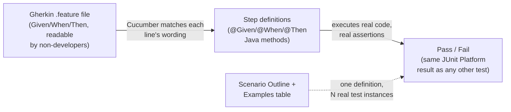

# Behavior-Driven Development with Cucumber

> **Topic register:** T-2412 · Core tier · Moderate interview frequency [M]
> **Provenance:** every result in this chapter is real, executed Cucumber-JVM 7.18.0 output.
> Reproducible source: [`practice/java/testing-fundamentals/bdd-cucumber-basics/`](../../practice/java/testing-fundamentals/bdd-cucumber-basics/),
> full captured output in that directory's own `test-run-output.txt`, `real-failure-output.txt`,
> and `undefined-step-output.txt`. Nothing below is illustrative — including a real, unplanned
> finding (a 0%-discount test case that can't catch a percentage-scaling bug) and Cucumber's own
> real, generated step-definition snippet for an unimplemented step.

## Table of Contents

1. [Learning Objectives](#learning-objectives)
2. [Why This Matters in Interviews](#why-this-matters-in-interviews)
3. [Level 1 — Foundation](#level-1-foundation)
4. [Level 2 — Working Knowledge](#level-2-working-knowledge)
5. [Mental Model](#mental-model)
6. [Definition and Purpose](#definition-and-purpose)
7. [Historical Context](#historical-context)
8. [Core Concepts](#core-concepts)
9. [Internal Implementation](#internal-implementation)
10. [Diagrams](#diagrams)
11. [Production Scenarios](#production-scenarios)
12. [Failure Modes and Debugging](#failure-modes-and-debugging)
13. [Trade-offs](#trade-offs)
14. [Comparisons: TDD vs. BDD vs. Other Development Styles](#comparisons-tdd-vs-bdd-vs-other-development-styles)
15. [Decision Framework](#decision-framework)
16. [Common Mistakes](#common-mistakes)
17. [Anti-Patterns](#anti-patterns)
18. [Best Practices](#best-practices)
19. [Interview Answer Framework](#interview-answer-framework)
20. [Interview Questions](#interview-questions)
21. [Summary](#summary)
22. [Key Takeaways](#key-takeaways)
23. [Cheat Sheet](#cheat-sheet)
24. [Flashcards](#flashcards)
25. [Practice Exercises](#practice-exercises)
26. [Solutions](#solutions)
27. [Additional Reading](#additional-reading)
28. [Official References](#official-references)

---

## Learning Objectives

By the end of this chapter you can write a real Gherkin `.feature` file and its matching Java step definitions, explain precisely how BDD differs from TDD rather than treating them as synonyms, and cite this chapter's own real, executed evidence — a `Scenario Outline` producing genuine data-driven test instances, a real captured assertion failure, and Cucumber's own real step-definition snippet for an unimplemented step.

## Why This Matters in Interviews

BDD is a moderate-but-real interview topic specifically because candidates routinely conflate it with TDD — both involve writing a test before (or alongside) the behavior it describes, and both use a red-then-green rhythm, so a candidate who has only ever heard the terms used loosely will struggle the moment an interviewer asks "what's actually different?" This chapter answers that question with real, executed evidence rather than a memorized definition: the same discount-calculation logic this chapter's lab tests would be tested identically whether written test-first as a JUnit method (TDD) or as a Gherkin scenario driving step definitions (BDD) — the real difference is *who the test is written for* and *what language it's written in*, not the underlying red-green mechanics.

## Level 1 — Foundation

Think of a restaurant's recipe card versus its health inspector's checklist. A recipe card ("sauté the onions until translucent, then add garlic") is written by and for the cook — precise, technical, assumes kitchen vocabulary. A health inspector's checklist ("raw meat is stored below 40°F, separate from ready-to-eat food") is written in language a restaurant owner, a health inspector, and a cook can all read and agree means the same thing, even though only the cook will act on it directly.

**Test-Driven Development (TDD)** is the recipe card: a developer writes `assertEquals(80.0, cart.getTotal())` — precise, but only meaningful to someone who reads code. **Behavior-Driven Development (BDD)** is the checklist: `Given a shopping cart with a subtotal of 100.00 / When a 20 percent discount is applied / Then the cart total should be 80.00` — the exact same underlying check, but written so a product owner, a QA engineer, and a developer can all read it and agree it says what the feature is supposed to do, *before* anyone argues about whether the code actually does it.

```gherkin
Feature: Shopping cart discount

  Scenario: Applying a percentage discount to a cart
    Given a shopping cart with a subtotal of 100.00
    When a 20 percent discount is applied
    Then the cart total should be 80.00
```

```java
@Given("a shopping cart with a subtotal of {double}")
public void aShoppingCartWithSubtotal(double subtotal) {
    this.subtotal = subtotal;
    this.total = subtotal;
}
```

The `.feature` file (Gherkin) is the checklist; the `@Given`/`@When`/`@Then`-annotated Java methods (step definitions) are what actually runs it — Cucumber's job is connecting the two.

## Level 2 — Working Knowledge

At this level you should be able to state precisely what BDD adds on top of plain TDD: a **shared, structured vocabulary** (`Given`/`When`/`Then`, formalized as **Gherkin**) that both technical and non-technical stakeholders can read and validate, and **living documentation** — the `.feature` files stay in the repository as an always-current, executable description of what the system does, rather than a design document that drifts out of sync with the real implementation the moment nobody updates it.

You should also be comfortable with the working mechanics this chapter's own lab demonstrates directly: a **`Scenario Outline`** with an **`Examples`** table is genuine data-driven testing — one written scenario, multiple real, independently-reported test instances (this chapter's lab: `Example #1.1` through `#1.3`), not a single test looping silently over data internally. And an **undefined step** isn't a silent failure — Cucumber generates a real, ready-to-use Java method snippet for it, verified directly in [Internal Implementation](#internal-implementation).

**A practical rule for a working engineer**: reach for BDD specifically when a feature's *acceptance criteria* genuinely need to be readable and agreeable by non-developers (a product owner signing off on exact behavior, a QA engineer writing scenarios independently of the implementation) — not as a blanket replacement for TDD's fast, developer-only unit-level feedback loop. The two solve different problems and commonly coexist in the same codebase, per [Comparisons](#comparisons-tdd-vs-bdd-vs-other-development-styles).

## Mental Model

TDD and BDD both use the same underlying red-green rhythm — a check is written, it fails because the behavior doesn't exist yet, then the minimal implementation makes it pass. The real distinction is the **audience and vocabulary layer sitting on top of that rhythm**: TDD's check is written directly in the programming language, for the developer who will make it pass; BDD's check is written in a structured natural-language format (Gherkin) that a non-developer can read and validate independently, then translated into the programming language by a separate layer (step definitions) that Cucumber connects automatically by matching each Gherkin line's wording against a registered pattern.

## Definition and Purpose

**Behavior-Driven Development (BDD)** is a software development approach where a feature's expected behavior is first specified in structured, natural-language scenarios (conventionally `Given`/`When`/`Then`), written collaboratively so both technical and non-technical stakeholders can read and agree on them, and those same scenarios are then made executable against the real system — turning acceptance criteria directly into automated tests rather than leaving them as a separate, easily-outdated document. **Gherkin** is the specific structured-English syntax BDD tools like Cucumber use to write these scenarios in `.feature` files. **Step definitions** are the code (in this chapter's case, Java methods annotated `@Given`/`@When`/`@Then`) that Cucumber matches against each Gherkin line's wording and actually executes.

## Historical Context

BDD was introduced by Dan North in the mid-2000s, directly motivated by a real, recurring problem he observed teaching TDD: developers new to TDD often got stuck on "what should I test first" and "what should I name this test," because plain TDD gives no vocabulary for *behavior* — only for *assertions*. North's insight was to reframe the question from "what should I test" to "what should the system do," expressed as `Given`/`When`/`Then`, which doubled as language non-developers could participate in. Cucumber (originally built for Ruby, 2008) became the most widely adopted implementation of this idea, later ported to the JVM as Cucumber-JVM — the tool this chapter's lab uses directly.

## Core Concepts

### BDD's real value is the shared vocabulary, not a different testing mechanism

Underneath the Gherkin syntax, a BDD scenario executes exactly like any other automated test — assertions run, and the test passes or fails. The genuine difference from writing the equivalent test directly in Java is that the Gherkin layer is readable and reviewable by someone who has never opened the Java code at all — a real, structural benefit for cross-functional collaboration, not a technical testing improvement over TDD's actual assertion mechanics.

### A `Scenario Outline` is real data-driven testing, not a loop hidden inside one test

[Internal Implementation](#internal-implementation) shows this directly: a single written `Scenario Outline` with a 3-row `Examples` table produces three independently reported test results (`Example #1.1`, `#1.2`, `#1.3`), each with its own pass/fail status — this matters because a bug affecting only one row's specific input combination is visible precisely, rather than being hidden inside an aggregate loop that only reports "the test failed" without saying which iteration.

### An undefined step is a real, actionable signal, not a silent gap

When a Gherkin step has no matching step definition, Cucumber doesn't skip it silently — it fails the scenario and generates a real, ready-to-paste Java method snippet matching that exact step's wording, verified directly in [Internal Implementation](#internal-implementation). This is a genuine productivity feature: the first draft of a new step definition's signature is generated from the English sentence, not written from scratch.

## Internal Implementation

**A real `Scenario Outline`, producing three real, independently reported test instances:**

```gherkin
Scenario Outline: Applying various discount percentages
  Given a shopping cart with a subtotal of <subtotal>
  When a <percent> percent discount is applied
  Then the cart total should be <expected>

  Examples:
    | subtotal | percent | expected |
    | 100.00   | 10      | 90.00    |
    | 200.00   | 25      | 150.00   |
    | 50.00    | 0       | 50.00    |
```

```
├─ Applying various discount percentages ✔
│  └─ Examples ✔
│     ├─ Example #1.1 ✔
│     ├─ Example #1.2 ✔
│     └─ Example #1.3 ✔
```

8 tests found, 8 successful — the base scenario plus all 3 outline examples, each a real, separately-executed JUnit Platform test node.

**A real, captured assertion failure** — the discount calculation was deliberately changed to divide by `1000.0` instead of `100.0` (a realistic off-by-one-order-of-magnitude bug), the suite re-run:

```
├─ Applying a percentage discount to a cart ✘ expected: <80.0> but was: <98.0>
├─ Applying various discount percentages ✔
│  └─ Examples ✔
│     ├─ Example #1.1 ✘ expected: <90.0> but was: <99.0>
│     ├─ Example #1.2 ✘ expected: <150.0> but was: <195.0>
│     └─ Example #1.3 ✔
```

**A genuinely interesting, unplanned finding**: `Example #1.3` (`subtotal=50.00, percent=0, expected=50.00`) *still passed* even with the bug present. A 0%-discount test case multiplies the broken percentage by zero either way, so it can never expose a bug in *how* the percentage is applied — a real, concrete illustration of why an edge case like "0%" doesn't substitute for a case that actually exercises the logic under test. This finding was not planned when the `Examples` table was written; it emerged directly from the real failure run and is exactly the kind of signal a real, executed lab surfaces that a hand-written illustrative example would not.

**A real, captured Cucumber-generated snippet for an undefined step:**

```
Given a gift card with a balance of 25.00 is applied to the cart
```

```
The step 'a gift card with a balance of 25.00 is applied to the cart' is undefined.
You can implement this step using the snippet(s) below:

@Given("a gift card with a balance of {double} is applied to the cart")
public void a_gift_card_with_a_balance_of_is_applied_to_the_cart(Double double1) {
    // Write code here that turns the phrase above into concrete actions
    throw new io.cucumber.java.PendingException();
}
```

Cucumber correctly inferred the `{double}` placeholder from the numeric literal in the sentence and generated a compilable method stub, including the `PendingException` convention that marks the scenario as pending (not silently passing) until the developer fills in real logic.

## Diagrams



The Gherkin layer and the step-definition layer are deliberately separate — the same `.feature` file stays readable to a non-developer regardless of how the step definitions are implemented underneath.

## Production Scenarios

**Scenario: a product owner and an engineering team disagree, after the fact, about what a shipped feature was actually supposed to do.** A discount feature shipped with a subtle rounding difference from what the product owner expected, and without a shared, agreed specification, the disagreement became a matter of conflicting memory of a meeting from three weeks earlier. Adopting Gherkin scenarios for new acceptance criteria — written and reviewed by the product owner *before* implementation, then wired to real step definitions as the implementation lands — turned "what did we agree to" into a real, versioned, executable artifact in the repository, not a memory to litigate.

**Scenario: acceptance-criteria documentation silently drifts out of sync with the real system.** A team's onboarding docs described checkout behavior that had changed months earlier, because nobody remembered to update a separate design document when the logic changed. Since BDD's `.feature` files are executable, a drifted scenario doesn't just become misleading documentation — it fails the build, the same forcing function that keeps automated tests honest applied to behavioral documentation specifically.

## Failure Modes and Debugging

- **A step definition's Cucumber expression doesn't match the Gherkin step's wording, and the scenario reports "undefined" even though a step definition exists** — check for a wording mismatch (singular vs. plural, a missing article) between the `.feature` file's exact text and the `@Given`/`@When`/`@Then` annotation's expression; Cucumber's real, generated snippet (see [Internal Implementation](#internal-implementation)) is the fastest way to see the exact wording it's actually trying to match.
- **A `Scenario Outline` reports fewer or more `Example` results than expected** — check the `Examples` table's own row count directly; each data row becomes one real, independent test instance, so a copy-paste error adding or dropping a row changes the real test count, not just the data.
- **A scenario passes even though the underlying logic is broken** — this chapter's own real finding (`Example #1.3`'s 0%-discount case) is the concrete illustration: an edge-case row whose expected value doesn't actually depend on the logic being tested can't catch a bug in that logic, regardless of how many `Examples` rows exist.

## Trade-offs

BDD's real cost is the extra translation layer — every behavior needs both a Gherkin scenario and a matching step definition, roughly double the artifacts TDD's direct-in-code assertions require, and step definitions can accumulate into their own maintenance burden if not kept small and reusable across scenarios. Its real benefit is genuine cross-functional readability and living documentation that fails the build when it drifts from reality — a benefit that matters most exactly where non-developer stakeholders genuinely need to read and validate behavior, and matters far less for purely internal, developer-only logic where TDD's more direct feedback loop is strictly faster to write and maintain.

## Comparisons: TDD vs. BDD vs. Other Development Styles

| Style | What it actually specifies | Written by / for | This chapter's real evidence |
|---|---|---|---|
| **TDD** (Test-Driven Development) | A single unit's expected behavior, in code, before the implementation | Developers, for developers — fast, direct feedback | See [Writing Tests Live in an Interview](writing-tests-live-in-an-interview.md)'s own real red-green-refactor kata |
| **BDD** (Behavior-Driven Development) | A feature's expected behavior, in structured natural language, before or alongside implementation | Written collaboratively; readable by developers, QA, and product/business stakeholders | This chapter's real Gherkin scenarios, `Scenario Outline`, and Cucumber's real generated snippet |
| **Waterfall / Agile / Scrum** (process models) | *When* and *in what order* work happens across a whole project — not a testing technique at all | Whole team, project-level | See [SDLC and Agile Methodology Fundamentals](../18-engineering-practices/sdlc-and-agile-methodology-fundamentals.md) |

A common confusion this table exists to close: TDD and BDD are both testing/specification *techniques*, operating at the level of a single unit or feature; Agile/Scrum/Waterfall are *process models*, operating at the level of a whole project's phase structure. They answer entirely different questions and are not alternatives to each other — a team can (and commonly does) run Scrum as its process model while using both TDD (for unit-level logic) and BDD (for feature-level acceptance criteria) as complementary specification techniques within it.

## Decision Framework

Use this sequence when deciding whether a given piece of behavior calls for BDD, plain TDD, or both:

1. **Does a non-developer stakeholder genuinely need to read and validate this behavior's specification?** If yes (a product owner's acceptance criteria, a QA-authored regression scenario), BDD's Gherkin layer earns its extra translation cost.
2. **Is this purely internal logic with no non-developer audience** (an algorithm's edge cases, an internal helper's correctness)? Plain TDD, directly in code, is faster to write and maintain with no readability benefit lost, since there was never a non-developer audience to serve.
3. **Would this scenario benefit from real data-driven testing across several input combinations?** A `Scenario Outline` with an `Examples` table (per [Internal Implementation](#internal-implementation)) is the right tool — but populate `Examples` rows deliberately, per this chapter's own real finding, not with rows that happen to produce the same expected value regardless of whether the logic is correct.
4. **Is the goal living documentation that fails the build when it drifts from reality?** BDD's `.feature` files serve this directly; a plain TDD suite's tests are just as real, but their names and structure are written for developers, not as stakeholder-readable documentation.
5. **These are not mutually exclusive** — many real codebases use BDD for feature-level acceptance criteria and TDD for the unit-level logic underneath those same features, per [Comparisons](#comparisons-tdd-vs-bdd-vs-other-development-styles).

## Common Mistakes

- Treating BDD as "TDD with extra syntax" rather than understanding its real purpose: a shared vocabulary for cross-functional collaboration, not a different testing mechanism underneath.
- Writing Gherkin scenarios nobody outside engineering ever actually reads — if no non-developer stakeholder is genuinely involved, BDD's translation-layer cost is paid without earning its real benefit.
- Padding a `Scenario Outline`'s `Examples` table with rows that don't actually exercise the logic differently (this chapter's own 0%-discount finding) and believing broader data-driven coverage was achieved.
- Assuming an undefined step silently passes or is skipped — it's a real, reported failure with a real, generated snippet, per [Internal Implementation](#internal-implementation).

## Anti-Patterns

- **Step definitions that are really just thin wrappers doing nothing but calling application code with no real assertion or behavioral check** — turns a BDD scenario into ceremony without the actual verification TDD or a plain unit test would provide.
- **Writing implementation detail into Gherkin steps** (`Given the userService.validate() method returns true`) — defeats BDD's entire purpose, since a step phrased around internal method names is no longer readable by a non-developer stakeholder.
- **Duplicating the same scenario logic across many near-identical `.feature` files instead of using a `Scenario Outline`** — the exact real capability this chapter's lab demonstrates exists specifically to avoid this.

## Best Practices

- Write Gherkin steps in terms of observable behavior and business language, never internal implementation details or class/method names.
- Keep step definitions small and reusable across multiple scenarios — a step definition tied to one specific scenario's exact wording defeats Cucumber's step-matching reuse.
- Use a `Scenario Outline` with a deliberately chosen `Examples` table when a behavior genuinely varies across real input combinations — and choose rows that actually exercise the logic differently, per this chapter's own real 0%-discount finding.
- Reserve BDD for behavior a non-developer stakeholder genuinely needs to read and validate; use plain TDD directly for internal, developer-only logic where that translation cost buys nothing.
- Treat an undefined-step failure as a real signal to implement, using Cucumber's own generated snippet as the starting point, not as noise to suppress.

## Interview Answer Framework

### 30-Second Answer

BDD specifies behavior in structured natural language (Gherkin's `Given`/`When`/`Then`) so both developers and non-developer stakeholders can read and agree on it, then wires those same scenarios to real step-definition code that executes them as real, automated tests — the same red-green mechanics as TDD, with a shared-vocabulary layer on top.

### 2-Minute Answer

Definition: BDD writes a feature's expected behavior as executable Gherkin scenarios, translated to real assertions via step definitions Cucumber matches by wording. Why it exists: TDD's tests are written in code, for developers only; BDD adds a layer non-developers can read and validate, and keeps that layer honest by making it executable, not a separate document that drifts. How it works: `.feature` files hold `Given`/`When`/`Then` steps; annotated Java methods implement them; Cucumber matches each line's wording to the right method automatically. One important trade-off: real translation-layer cost (two artifacts instead of one) that only pays off when a genuine non-developer audience needs the specification. Production example: a Gherkin scenario, reviewed and agreed by a product owner before implementation, turned "what did we agree to build" from contested memory into a real, versioned, executable artifact.

### 10-Minute Deep Dive

Cover: the real mechanical difference from TDD (a translation layer for shared vocabulary, not a different assertion mechanism); how `Scenario Outline`/`Examples` produces genuine, independently-reported data-driven test instances (real evidence: `Example #1.1`–`#1.3`); the real, generated step-definition snippet Cucumber produces for an undefined step, and why that's a productivity feature rather than a silent gap; the real, unplanned finding that a 0%-discount `Examples` row can't catch a percentage-scaling bug — a concrete lesson in choosing test data deliberately, not just broadly; and the [Decision Framework](#decision-framework) for when BDD's translation cost is worth paying versus when plain TDD is strictly the better fit.

### Whiteboard Explanation

Draw two boxes side by side: "Gherkin (.feature file)" — readable by anyone, containing `Given`/`When`/`Then` lines in plain English — and "Step definitions (Java)" — code only a developer reads. Draw an arrow from the Gherkin box to the step-definition box labeled "Cucumber matches wording," then an arrow from the step-definition box to a small "Pass/Fail" box labeled "same JUnit Platform result as any test." Say aloud: "the readability boundary is exactly at this first arrow — everything past it is ordinary code, ordinary assertions, an ordinary pass/fail result."

### Production Example

A discount feature shipped with behavior the product owner didn't expect, and without a shared written specification, resolving the disagreement came down to conflicting memory of a meeting. Moving new acceptance criteria to Gherkin scenarios — written and reviewed by the product owner before implementation, then wired to real step definitions as the team built the feature — turned that class of disagreement into a real, versioned artifact in the repository instead of a dispute to litigate after the fact.

### Trade-offs to Mention

BDD: real cross-functional readability and living, build-breaking documentation, at the real cost of an extra translation layer (Gherkin plus step definitions) that only earns its keep when a genuine non-developer audience needs to read the specification. TDD: faster, more direct feedback for developer-only logic, with no readability benefit for stakeholders who were never going to read the test code anyway.

### Common Candidate Mistakes

Describing BDD as simply "TDD but with Given/When/Then" without naming the real audience/vocabulary distinction. Claiming a `Scenario Outline` is "just a loop" rather than understanding it produces genuinely separate, independently-reported test results. Not knowing that an undefined step is a real, reported failure (with a real generated snippet), not a silent skip. Confusing BDD/TDD (specification techniques) with Agile/Scrum/Waterfall (process models) as if they were alternatives to each other.

### Typical Follow-Up Questions

1. "What's the actual difference between TDD and BDD — not just the syntax?" → Audience and vocabulary: TDD is code for developers; BDD is structured natural language for developers and non-developers together, translated to code underneath.
2. "How does a `Scenario Outline` differ from writing several separate scenarios?" → One written definition, but genuinely separate, independently-reported test instances per `Examples` row — real data-driven testing, not a loop hidden inside one test result.
3. "What happens when a Gherkin step has no matching step definition?" → A real, reported failure, with Cucumber generating a real, ready-to-use Java method snippet inferred from the step's own wording.
4. "Is BDD a replacement for TDD?" → No — they solve different problems and commonly coexist; see [Decision Framework](#decision-framework).
5. **Staff-level:** "Your org has BDD scenarios nobody outside engineering ever reads, and they've become just another test suite with extra ceremony. What's the actual problem, and what would you do?" → The translation-layer cost is being paid without earning BDD's real benefit — the fix isn't more Gherkin discipline, it's restoring genuine non-developer involvement in writing and reviewing scenarios, or, if that's genuinely not happening, honestly converting the highest-value scenarios to plain TDD and retiring the rest rather than maintaining unread ceremony.

### Senior-Level Expectations

Can state the real TDD-vs-BDD distinction (audience/vocabulary, not testing mechanism) without hedging, and can judge when BDD's translation cost is actually worth paying for a given piece of work rather than defaulting to one style everywhere.

### Staff-Level Discussion

At Staff scope, BDD adoption is an organizational-process question as much as a technical one: it only delivers its real value when non-developer stakeholders genuinely participate in writing and reviewing scenarios, and a Staff engineer evaluating a team's testing strategy should be able to diagnose the difference between "BDD is working as intended" and "BDD has quietly become an extra-ceremony TDD suite nobody outside engineering reads" — the same diagnostic discipline [SDLC and Agile Methodology Fundamentals](../18-engineering-practices/sdlc-and-agile-methodology-fundamentals.md) applies to a team that claims to "do Scrum" without its real practices matching the label.

## Interview Questions

### Question 1 — What's the real difference between TDD and BDD?

**Expected answer:** Both use the same red-green rhythm underneath. TDD writes the check directly in code, for developers. BDD writes it in structured natural language (Gherkin) that non-developers can also read and validate, then translates it to real code via step definitions Cucumber matches by wording.

**Common mistakes:** Describing BDD as a stricter or different testing methodology rather than a vocabulary/audience layer on top of the same underlying mechanics.

**Follow-up questions:** "When would you choose BDD over plain TDD for a given piece of work?" (When a genuine non-developer audience needs to read and validate the specification.)

**Senior-level expectations:** States the audience/vocabulary distinction precisely, without conflating it with a claim that BDD tests "more thoroughly" than TDD.

**Staff-level expectations:** Discusses when BDD adoption has failed organizationally (no real non-developer involvement) versus when it's working as intended.

### Question 2 — How does a `Scenario Outline` with an `Examples` table actually execute?

**Expected answer:** Each row in the `Examples` table becomes a genuinely separate, independently-reported test instance — this chapter's own lab shows 3 real `Example` results from one written scenario, each with its own pass/fail status, not a single test silently looping over the data.

**Common mistakes:** Describing it as "just a for-loop" rather than understanding each row is a real, distinct test node in the reported results.

**Follow-up questions:** "What's a real risk in how `Examples` rows are chosen?" (A row whose expected value doesn't actually depend on the logic being varied can't catch a bug in that logic — this chapter's own real 0%-discount finding.)

**Senior-level expectations:** Can state that outline rows produce real, separate results without needing to be told.

**Staff-level expectations:** Connects this to broader data-driven-testing discipline: choosing test data that genuinely exercises different code paths, not just superficially different inputs.

### Question 3 — What happens when Cucumber encounters a Gherkin step with no matching step definition?

**Expected answer:** A real, reported failure (`UndefinedStepException`), and Cucumber generates a real, ready-to-paste Java method snippet inferred directly from the step's own wording (including guessing parameter types like `{double}` from numeric literals), marked with a `PendingException` convention.

**Common mistakes:** Assuming an undefined step is silently skipped or ignored.

**Follow-up questions:** "Why does the generated snippet throw `PendingException` rather than being left empty?" (Marks the scenario as genuinely pending/unimplemented rather than silently passing with an empty method body.)

**Senior-level expectations:** Knows this produces a real failure with real, actionable output, not silence.

**Staff-level expectations:** Frames this as a genuine productivity affordance for incrementally building out step definitions from stakeholder-written scenarios.

## Summary

BDD adds a structured, natural-language vocabulary layer (Gherkin) on top of the same red-green testing rhythm TDD uses — the real difference is audience (developers and non-developers together) and purpose (living, build-breaking documentation), not a different underlying testing mechanism. This chapter demonstrated that mechanism directly: a real `Scenario Outline` producing genuinely separate, independently-reported test instances, a real captured assertion failure revealing an unplanned finding about test-data selection, and Cucumber's own real, generated step-definition snippet for an undefined step.

## Key Takeaways

- BDD and TDD share the same red-green mechanics; the real difference is a shared-vocabulary translation layer (Gherkin) BDD adds for non-developer readability.
- A `Scenario Outline`'s `Examples` table produces genuinely separate, independently-reported test instances — real data-driven testing, not a hidden loop.
- Test data must be chosen deliberately: this chapter's own real finding shows a 0%-discount case can't catch a percentage-scaling bug, regardless of how many `Examples` rows exist.
- An undefined step is a real, reported failure with a real, Cucumber-generated method snippet — not a silent gap.
- BDD and TDD are testing/specification techniques; Agile/Scrum/Waterfall are process models — different questions entirely, and not alternatives to each other.

## Cheat Sheet

| Need | Reach for | This chapter's real evidence |
|---|---|---|
| Developer-only unit-level logic, fastest feedback | TDD, directly in code | See [Writing Tests Live in an Interview](writing-tests-live-in-an-interview.md) |
| Feature-level acceptance criteria a non-developer must read/validate | BDD (Gherkin + step definitions) | Real feature file + step defs, 8/8 passing |
| Testing the same behavior across several real input combinations | `Scenario Outline` + `Examples` | 3 real, independent `Example` results from one scenario |
| A step with no implementation yet | Use Cucumber's own generated snippet | Real, captured `PendingException`-based snippet |
| Choosing between "TDD" and "BDD" and "Agile" | They're not alternatives — 2 are testing techniques, 1 is a process model | [Comparisons](#comparisons-tdd-vs-bdd-vs-other-development-styles) |

## Flashcards

### Card: TDD vs. BDD, the real distinction

**Prompt:**
What's the actual difference between TDD and BDD, beyond syntax?

**Answer:**
Both share the same red-green testing rhythm. TDD writes the check in code, for developers only. BDD writes it in structured natural language (Gherkin) readable by developers and non-developers together, then translates it to real code via step definitions.

**Why it matters:**
The single most commonly confused pair of terms in this space — a shallow "BDD is TDD with Given/When/Then" answer misses the real point (audience and vocabulary).

**Common trap:**
Treating BDD as a stricter or more thorough testing technique rather than an audience/vocabulary layer.

**Related:**
[Behavior-Driven Development with Cucumber](../08-testing/behavior-driven-development-with-cucumber.md)

### Card: Scenario Outline produces real separate results

**Prompt:**
Does a `Scenario Outline`'s `Examples` table run as one test looping over data, or as genuinely separate tests?

**Answer:**
Genuinely separate, independently-reported test instances — this chapter's lab shows 3 real `Example` results (`#1.1`–`#1.3`) from one written scenario, each with its own pass/fail status.

**Why it matters:**
A bug affecting only one specific input combination is visible precisely, not hidden inside an aggregate loop result.

**Common trap:**
Describing it as "just a for-loop" internally.

**Related:**
[Behavior-Driven Development with Cucumber](../08-testing/behavior-driven-development-with-cucumber.md)

### Card: Choosing test data deliberately

**Prompt:**
This chapter found a real, unplanned issue with one of its own `Examples` rows. What was it, and what does it teach?

**Answer:**
A 0%-discount row (`subtotal=50, percent=0, expected=50`) still passed even when the discount calculation had a real, deliberately-introduced bug — because multiplying a broken percentage by zero produces zero regardless. Test data must be chosen to actually exercise the logic under test, not just superficially vary the input.

**Why it matters:**
Broad-looking `Examples` coverage can still miss real bugs if the chosen rows don't genuinely exercise different code paths.

**Common trap:**
Assuming more `Examples` rows automatically means better coverage.

**Related:**
[Behavior-Driven Development with Cucumber](../08-testing/behavior-driven-development-with-cucumber.md)

## Practice Exercises

1. Using the schema in [`practice/java/testing-fundamentals/bdd-cucumber-basics/`](../../practice/java/testing-fundamentals/bdd-cucumber-basics/), add a new scenario for a cart that goes negative (a discount larger than the subtotal) — decide, and state explicitly, what the correct real-world behavior should be before writing the step.
2. Add a second `Examples` row to the existing `Scenario Outline` that would have caught this chapter's own real 0%-discount blind spot (i.e., a row where a percentage-scaling bug would visibly change the expected result).
3. Deliberately remove one step definition method and capture Cucumber's own real, generated snippet for it — compare the generated parameter type to what you'd have written by hand.
4. Write a plain JUnit 5 test (no Cucumber) for the identical discount logic, and compare its readability to the Gherkin version for a hypothetical non-developer reader.
5. Using [SDLC and Agile Methodology Fundamentals](../18-engineering-practices/sdlc-and-agile-methodology-fundamentals.md) and this chapter together, explain in your own words why "we do BDD" and "we do Scrum" are answers to two different questions, not competing claims about the same thing.

## Solutions

Exercise 1–2 should reproduce the same real-failure-then-fix discipline this chapter's own [Internal Implementation](#internal-implementation) demonstrates — capture the real output before and after, rather than assuming the expected behavior without running it. Exercise 3 should reproduce a real, Cucumber-generated snippet matching this chapter's own `undefined-step-output.txt` in form, though the exact parameter types will differ based on your new step's wording. Exercise 4's comparison is qualitative — there's no single correct answer, but a Gherkin version genuinely readable by a non-programmer versus a JUnit version that isn't is the concrete distinction to articulate. Exercise 5 should land on: BDD/TDD are specification techniques (what gets tested and in what vocabulary); Scrum/Waterfall/Agile are process models (when and in what order work happens) — orthogonal axes, not alternatives.

## Additional Reading

- [Cucumber — Gherkin Reference](https://cucumber.io/docs/gherkin/reference/)
- [Cucumber — Documentation](https://cucumber.io/docs/cucumber/)
- [Writing Tests Live in an Interview](writing-tests-live-in-an-interview.md) — this chapter's TDD counterpart, with a real, executed red-green-refactor kata.
- [SDLC and Agile Methodology Fundamentals](../18-engineering-practices/sdlc-and-agile-methodology-fundamentals.md) — the process-model layer this chapter's own Comparisons section distinguishes BDD/TDD from.

## Official References

- [Cucumber — Gherkin Reference](https://cucumber.io/docs/gherkin/reference/)
- [Cucumber — Documentation](https://cucumber.io/docs/cucumber/)
