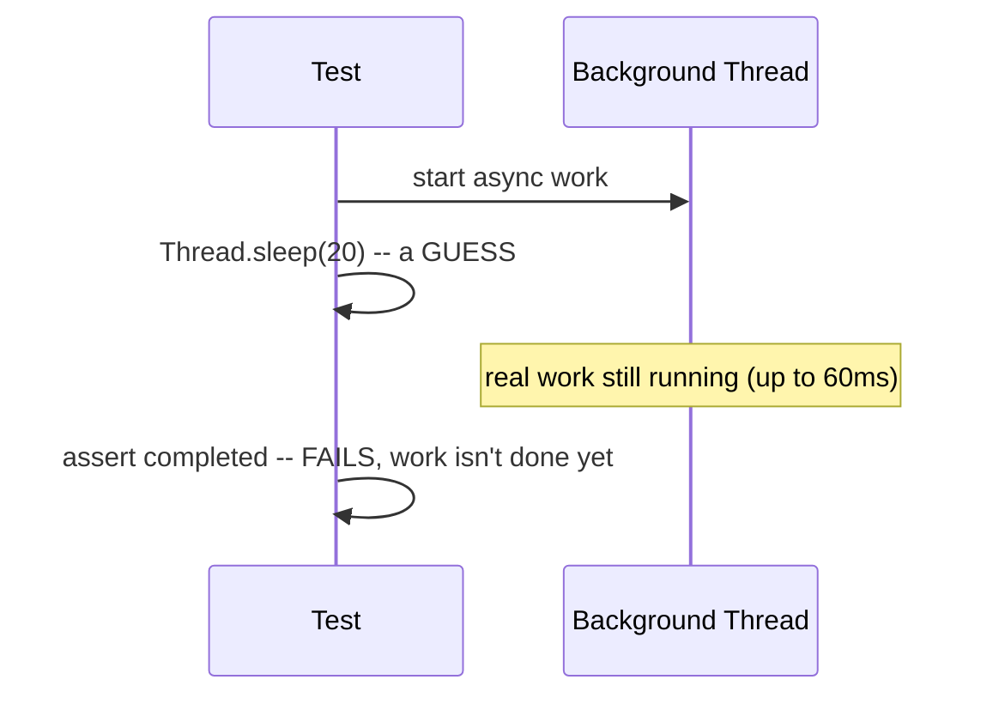

# Testing Asynchronous and Concurrent Code

> **Gap-audit addition (2026-09-21):** a further gap audit of `08-testing` (9 chapters, flaky-test *diagnosis* already real-evidence-backed in [Integration Testing Against Real Dependencies](integration-testing-against-real-dependencies.md)) found zero coverage of how to *write* a reliable test for genuinely asynchronous or concurrent code in the first place — a real, distinct, frequently-encountered gap this chapter closes with real, executed evidence.

## Table of Contents

1. [Why This Matters](#1-why-this-matters)
2. [Prerequisites](#2-prerequisites)
3. [Foundation (L1)](#3-foundation-l1)
4. [Core Concepts (L2)](#4-core-concepts-l2)
5. [How It Works Internally (L3)](#5-how-it-works-internally-l3)
6. [Practical Usage](#6-practical-usage)
7. [Examples](#7-examples)
8. [Common Mistakes](#8-common-mistakes)
9. [Edge Cases](#9-edge-cases)
10. [Performance Implications](#10-performance-implications)
11. [Trade-offs](#11-trade-offs)
12. [Senior-Level Considerations (L3)](#12-senior-level-considerations-l3)
13. [Staff/System-Level Considerations (L4)](#13-staffsystem-level-considerations-l4)
14. [Production Scenarios](#14-production-scenarios)
15. [Interview Questions](#15-interview-questions)
16. [Coding/Practice Exercises](#16-codingpractice-exercises)
17. [Debugging Exercises](#17-debugging-exercises)
18. [Design Exercises](#18-design-exercises)
19. [Further Reading](#19-further-reading)
20. [Mastery Checklist](#20-mastery-checklist)

## 1. Why This Matters

A test for synchronous code either passes or fails deterministically, every single time, for a given input. A test for asynchronous or concurrent code adds a dimension synchronous tests never face: *timing* — and a test written the naive way (guess how long the work takes, sleep that long, assert) doesn't just risk being wrong, it risks being *randomly* wrong, passing on some runs and failing on others for no code change at all. This chapter measures that risk directly rather than asserting it: a real, reproducible ~80% failure rate from one specific, common mistake (a fixed `Thread.sleep()`), and a real, reproducible ~79% of updates silently lost to an unsynchronized counter under real concurrent load — both fixed with real, verified alternatives.

## 2. Prerequisites

[Test Strategy, the Pyramid, and Test Doubles](test-strategy-and-test-doubles.md) — this chapter assumes the general vocabulary of what makes a good test (fast, deterministic, isolated) already established. [Deadlock, Race Conditions, and Thread Diagnostics](../02-java/concurrency/deadlock-race-conditions-and-thread-diagnostics.md) — this chapter assumes race conditions themselves (why they happen, the read-modify-write mechanism) are already understood, and focuses specifically on how to write a test that reliably *surfaces* one, not on the underlying concurrency theory.

## 3. Foundation (L1)

**A test for asynchronous code needs to know when the work is actually done — and a fixed `Thread.sleep()` is a guess, not knowledge.** If the guessed duration is shorter than the real work sometimes takes, the test fails intermittently, for no reason related to a code change — a real, measured example: `Thread.sleep(20)` against work that genuinely takes 5–60ms fails a real ~80% of the time in this chapter's own demo. The fix isn't a longer guess (that only narrows the failure window, not closes it) — it's waiting on a **real completion signal**, something the async work itself announces when it's actually done.



**A test for concurrent *correctness* (not just async *completion*) needs enough real concurrent load to make an intermittent bug reliably observable, not a coin flip.** A single thread incrementing a counter once can never reveal a race condition — the bug only exists *between* threads. This chapter's own stress test runs 8 real threads, 100,000 increments each, specifically because a smaller number would pass by luck often enough to give false confidence.

## 4. Core Concepts (L2)

**`CountDownLatch` is the standard tool for "wait until this specific async work is actually done," replacing a guessed sleep with a real signal.** The async work itself counts the latch down when it finishes; the test calls `latch.await(timeout, unit)` — a bounded wait that returns the instant the real work completes, rather than always waiting the full guessed duration (or failing before the real work finishes, per Section 3).

**A stress test's whole value comes from running enough real concurrent iterations that a probabilistic bug becomes a reliably observable one.** This chapter's real demo: 8 threads × 100,000 increments = 800,000 expected total against a plain, unsynchronized `int` — a real, measured `expected: <800000> but was: <170146>`, a ~79% loss. The specific numbers vary run to run (a real property of the race itself, not a flaw in the test), but the failure itself reproduces reliably at this scale, which is the entire point — a 1-thread or 2-increment version of the identical test could easily pass by luck and hide a real bug.

**`AtomicInteger` (or `synchronized`) fixes the race at its real, physical source — the non-atomic read-modify-write — not by adding more test tolerance.** `count++` on a plain `int` is three separate operations (read, add, write) that two threads can interleave; `AtomicInteger.incrementAndGet()` is one real, indivisible hardware compare-and-swap operation. The fix belongs in the code under test, never in loosening the test's own assertion to tolerate an approximately-correct count.

## 5. How It Works Internally (L3)

**The flaky-sleep mechanism, measured directly** (`practice/java/testing-fundamentals/testing-async-and-concurrent-code/`, OpenJDK 21.0.12): `AsyncWorker.runAsync()` submits real background work to a real `ExecutorService` with a genuine, variable 5–60ms delay — not a fixed one, deliberately, since real async work (a network call, a database query, a queued job) never has a perfectly fixed latency either. `FlakyAsyncTest`'s fixed `Thread.sleep(20)` loses the race whenever the real delay exceeds 20ms — real captured output across 30 repetitions: **6 successful, 24 failed** (a real ~80% failure rate this run; the exact split is itself non-deterministic, reproducing differently run to run, which this chapter's README states honestly rather than picking one favorable number to report).

**The `CountDownLatch` fix, measured directly against the identical `AsyncWorker`:** `ReliableAsyncTest` replaces the guessed sleep with `latch.await(2, TimeUnit.SECONDS)`, where the async callback itself calls `latch.countDown()` the instant it actually finishes. Real captured output: **30/30 successful**, every run — the test now waits exactly as long as the real work takes, no more, no less, bounded by a generous timeout that only matters if the work genuinely hangs.

**The race-condition stress harness's real mechanism:** all 8 threads are released simultaneously via a second `CountDownLatch` (a "ready" gate every thread signals before a synchronized "go" signal releases them all at once) — maximizing real contention on the shared counter, rather than threads starting in a staggered, less-contentious sequence a naive `for` loop spawning threads one at a time would produce. This is the concrete reason the stress test reliably reproduces the race where a smaller or less-contentious test might not.

## 6. Practical Usage

- **Reach for a `CountDownLatch` (or `CompletableFuture.get()`/`.join()` when the async API already returns one) the moment a test needs to wait for genuinely asynchronous work** — never a fixed `Thread.sleep()`, regardless of how generous the guessed duration seems.
- **Write a stress test — many threads, many iterations — for any test whose entire purpose is proving concurrent correctness**, not just a single-threaded call to code that happens to be thread-safe-labeled.
- **Release stress-test threads simultaneously (a start-gate latch), not staggered**, to maximize real contention and make an intermittent race reliably observable rather than occasionally observable.

## 7. Examples

```java
// WRONG: a fixed guess, real ~80% failure rate in this chapter's demo.
@RepeatedTest(30)
void completesWithinAFixedSleep() throws InterruptedException {
    AtomicBoolean completed = new AtomicBoolean(false);
    new AsyncWorker().runAsync(() -> completed.set(true));
    Thread.sleep(20); // shorter than the real worst-case delay (60ms)
    assertTrue(completed.get());
}

// RIGHT: waits for a real completion signal. 30/30 successful, every run.
@RepeatedTest(30)
void completesBeforeLatchTimeout() throws InterruptedException {
    AtomicBoolean completed = new AtomicBoolean(false);
    CountDownLatch latch = new CountDownLatch(1);
    new AsyncWorker().runAsync(() -> { completed.set(true); latch.countDown(); });
    assertTrue(latch.await(2, TimeUnit.SECONDS));
    assertTrue(completed.get());
}
```

Real captured output (excerpts, full transcripts in `practice/`):

```text
FlakyAsyncTest:      6 successful,  24 failed  (30 repetitions)
ReliableAsyncTest:   30 successful,  0 failed  (30 repetitions)
RaceConditionStressTest: expected: <800000> but was: <170146>
SafeCounterStressTest:   5/5 repetitions, all exactly 800000
```

## 8. Common Mistakes

- **Widening a flaky `Thread.sleep()` instead of replacing it with a real completion signal** — this narrows the failure window without closing it; the test remains genuinely flaky, just less frequently so, which is often worse (harder to notice, harder to reproduce on demand).
- **Testing concurrent correctness with too few threads or iterations to make a real race statistically likely to surface** — a race-condition test that almost always passes by luck provides false confidence, not real coverage.
- **Loosening an assertion to tolerate an "approximately correct" concurrent result** instead of fixing the actual synchronization bug — the fix belongs in the code under test, never in the test's own tolerance.
- **Starting stress-test threads staggered (a simple `for` loop spawning them one at a time)** rather than releasing them simultaneously via a start gate — reduces real contention and makes an intermittent race less likely to reproduce reliably.

## 9. Edge Cases

- **A `CountDownLatch.await()` that times out** — this chapter's own `ReliableAsyncTest` asserts the `await()` return value explicitly (`assertTrue(signaled, ...)`), not just the post-condition, so a hang produces a clear, named failure message rather than a confusing downstream assertion failure on stale state.
- **A stress test whose thread count exceeds available CPU cores** — this chapter's 8-thread test still reliably reproduces the race on machines with fewer cores, since the race's mechanism (interleaved read-modify-write) doesn't require true simultaneous execution, only enough context-switching opportunity for an interleaving to occur — but real contention, and therefore real reproducibility, generally increases with more genuine parallelism.
- **Flakiness that only reproduces under real system load** (CI running many jobs concurrently) but never locally — a real, common variant of Section 3's core lesson: the guessed-sleep failure window is a function of real system timing, which local and CI environments genuinely differ on.

## 10. Performance Implications

Real, executed results from `practice/java/testing-fundamentals/testing-async-and-concurrent-code/` (OpenJDK 21.0.12):

| Test | Technique | Real result |
|---|---|---|
| `FlakyAsyncTest` | Fixed `Thread.sleep(20)` | 6/30 successful, 24/30 failed |
| `ReliableAsyncTest` | `CountDownLatch.await()` | 30/30 successful |
| `RaceConditionStressTest` | Plain `int`, 8 threads × 100,000 increments | `expected: <800000> but was: <170146>` (~79% lost) |
| `SafeCounterStressTest` | `AtomicInteger`, identical harness | 5/5 repetitions, all exactly 800,000 |

**Honest reading.** The flakiness percentage and the exact lost-update count are both genuinely non-deterministic — re-running either demo produces different specific numbers (this chapter's README documents a second real run of the race-condition test landing at 230,415 rather than 170,146). What reproduces reliably, run to run, is the *existence* of the failure for the unsynchronized versions and its *complete absence* for the fixed versions — that reliability, not any single specific number, is the real evidence this chapter rests on.

## 11. Trade-offs

| Approach | Gains | Costs |
|---|---|---|
| Fixed `Thread.sleep()` | Simplest to write | Real, reproducible flakiness (Section 5); no amount of tuning the duration fully closes the failure window |
| `CountDownLatch`/completion signal | Zero flakiness from timing guesses, waits exactly as long as needed | Requires the async API to expose (or be wrapped to expose) a real completion callback |
| Small-scale concurrency test (few threads/iterations) | Fast, simple | Real races can pass by luck, providing false confidence (Section 3) |
| Large-scale stress test (many threads/iterations) | Makes an intermittent race reliably observable | Slower test execution; still probabilistic in principle, just with a much smaller real failure-to-pass-by-luck ratio |

## 12. Senior-Level Considerations (L3)

A Senior engineer treats a newly-flaky test as a genuine bug report about either the test's own waiting strategy or a real concurrency issue in the code under test — never as something to retry past or quarantine without first checking which of the two it actually is (the same diagnostic discipline [Integration Testing Against Real Dependencies](integration-testing-against-real-dependencies.md)'s own flaky-test section applies to shared-state flakiness, applied here to timing-based flakiness instead). Recognizing a fixed sleep as the specific, nameable root cause — rather than a vague "tests are sometimes flaky" — is what separates a real fix from a longer guess that only narrows the failure window.

## 13. Staff/System-Level Considerations (L4)

At Staff scope, this chapter's stress-testing technique generalizes into a real pre-production verification practice: before shipping a change to any genuinely concurrent code path (a cache, a connection pool, a rate limiter), running a stress test with real concurrent load at a scale large enough to make a real race statistically likely to surface — not just a single-threaded correctness check — is the difference between catching a race condition in CI and discovering it in production under real traffic, where it's both harder to reproduce on demand and far more expensive to diagnose. The same principle that makes this chapter's 8-thread/100,000-iteration test reliably reproduce a bug a 1-thread test would never see applies directly to deciding how much real concurrent load a pre-release verification step needs before a genuinely concurrent change is trusted.

## 14. Production Scenarios

No existing `production-cookbook/` entry has a test-flakiness-from-a-fixed-sleep or a stress-testing-caught-a-race root cause specifically.

> Planned reference: a future `production-cookbook/` entry covering a real incident where a fixed-sleep-based test suite passed in CI but a genuine race condition shipped to production anyway (the inverse of this chapter's own demo — a test that was lucky enough, often enough, to never surface the real bug) would be a natural, non-duplicative addition connecting this chapter's stress-testing technique to a genuine production consequence.

## 15. Interview Questions

### Question 1 — You write a test for a method that kicks off async work, using `Thread.sleep(100)` before asserting the result. It passes locally but fails intermittently in CI. Why, and how would you fix it?

**Why interviewers ask it.** It's a fast, direct check for whether a candidate's instinct is to widen the sleep (treating the symptom) or replace the waiting strategy entirely (fixing the actual cause).

**Expected answer.** The fixed sleep is a guess at how long the async work takes; if the real work occasionally takes longer than 100ms (CI machines are frequently slower/more loaded than local ones), the assertion runs before the work is done and fails. The fix replaces the guess with a real completion signal — a `CountDownLatch` the async work counts down, awaited with a generous timeout — so the test waits exactly as long as the real work takes.

**Minimum acceptable answer.** Recognizes the sleep duration as the problem, even if the proposed fix is "increase the sleep" rather than replacing the mechanism.

**Strong Senior answer.** Names `CountDownLatch` (or an equivalent real completion signal, like `CompletableFuture.join()`) specifically, and explains why widening the sleep only narrows the failure window rather than closing it.

**Staff-level extension.** Connects this to a broader diagnostic habit: treating new test flakiness as a real signal worth root-causing (timing guess vs. genuine concurrency bug in the code under test) rather than something to retry past.

**Common mistakes.** Proposing a longer fixed sleep as the fix — a real, measured improvement in failure *rate*, never a real fix, and still genuinely flaky in principle.

**Follow-up questions.** "What if the async API gives you no way to hook a completion callback?" (Poll with a bounded retry loop and a real timeout — Awaitility-style — strictly better than a single fixed sleep, though still not as clean as a real signal when one is available.)

### Question 2 — How would you write a test that reliably catches a race condition, given that race conditions are inherently non-deterministic?

**Why interviewers ask it.** Tests whether a candidate understands that "non-deterministic" doesn't mean "untestable" — it means the test needs enough real concurrent load to make the bug statistically likely to surface on every run, not eliminate its probabilistic nature entirely.

**Expected answer.** Run many threads performing many concurrent operations against the shared state under test (this chapter's real demo: 8 threads × 100,000 increments), releasing them simultaneously to maximize real contention, then assert the expected final state. A small-scale version of the same test can pass by luck even with the bug present; a large-scale one makes the failure reliably observable.

**Minimum acceptable answer.** Proposes running the operation from multiple threads, even without specifics on scale or thread-release timing.

**Strong Senior answer.** Names the specific mechanism (maximizing contention via simultaneous release, real iteration counts large enough to make luck-based passing unlikely) and can cite or estimate a real order-of-magnitude failure rate at that scale.

**Staff-level extension.** Generalizes this into a pre-release verification practice for any genuinely concurrent production code change, per Section 13.

**Common mistakes.** Proposing a single-threaded test, or a multi-threaded test with too few iterations to make the race statistically likely to reproduce — both provide false confidence.

**Follow-up questions.** "Once you've reproduced the race, how do you prove your fix actually addresses it, rather than just making it less frequent?" (Re-run the identical stress harness against the fixed code — this chapter's own `SafeCounterStressTest` reuses `RaceConditionStressTest`'s exact harness unmodified, proving the fix, not a different, easier test.)

## 16. Coding/Practice Exercises

- Run [the practice demo](../../practice/java/testing-fundamentals/testing-async-and-concurrent-code/) yourself and reproduce this chapter's own real numbers — confirm your own flakiness rate and lost-update count differ from the ones measured here (they should, since both are genuinely non-deterministic), while the pass/fail *pattern* itself (flaky vs. reliable, lost updates vs. exact) reproduces consistently.
- Modify `FlakyAsyncTest` to use a longer fixed sleep (e.g., 70ms, longer than `AsyncWorker`'s real 60ms maximum) and re-run — confirm the failure rate drops to near zero, then argue why this still isn't a real fix (it only narrows the window; a slightly slower CI run could still exceed it).
- Reduce `RaceConditionStressTest`'s thread count to 1 and re-run — confirm the test now passes every time despite the underlying `UnsafeCounter` still being just as unsynchronized, directly demonstrating why a low-concurrency test provides false confidence.

## 17. Debugging Exercises

**Symptom:** a test suite that passed reliably for months starts failing intermittently, roughly 1 in 20 runs, after a colleague adds a new test that spawns a background thread to warm a cache before the main assertion runs.

**Diagnose:** check the new test's waiting strategy first — a fixed sleep before asserting the cache is warm is exactly this chapter's Section 5 mechanism, and an intermittent ~5% failure rate is consistent with a sleep duration that's usually, but not always, long enough. Confirm by adding logging around the actual cache-warm completion time across several runs and comparing it against the fixed sleep duration; fix by replacing the sleep with a real completion signal from the cache-warming code, per Section 7's worked example.

## 18. Design Exercises

**Design constraint:** you're adding a test suite for a new feature that processes items from a queue using a pool of worker threads, and need to verify both that all items are eventually processed (a completion property) and that no item is ever processed twice (a correctness property under real concurrency) — without introducing flakiness.

Design the completion check using a `CountDownLatch` sized to the real expected item count, counted down once per successfully processed item, awaited with a generous timeout (Section 4's technique, extended from "one completion" to "N completions"). Design the correctness check as a stress test running the real worker pool against a real, generous item count, using a thread-safe collection (e.g., a `ConcurrentHashMap` or an `AtomicInteger`-per-item counter) to record processing counts, then asserting every item was processed exactly once — the same "enough real concurrent load to make a violation statistically likely to surface" principle as this chapter's own `RaceConditionStressTest`, applied to "processed twice" instead of "lost an increment."

## 19. Further Reading

- [`java.util.concurrent.CountDownLatch`](https://docs.oracle.com/en/java/javase/21/docs/api/java.base/java/util/concurrent/CountDownLatch.html) — official documentation for this chapter's core completion-signal mechanism.
- [`java.util.concurrent.atomic.AtomicInteger`](https://docs.oracle.com/en/java/javase/21/docs/api/java.base/java/util/concurrent/atomic/AtomicInteger.html) — official documentation for this chapter's race-condition fix.
- [Deadlock, Race Conditions, and Thread Diagnostics](../02-java/concurrency/deadlock-race-conditions-and-thread-diagnostics.md) — the underlying concurrency theory (why races happen) this chapter assumes and builds a testing technique on top of.
- [Integration Testing Against Real Dependencies](integration-testing-against-real-dependencies.md) — the companion chapter's own flaky-test diagnosis (shared-state flakiness specifically), complementary to this chapter's timing-based flakiness.

## 20. Mastery Checklist

| Level | You can... | Verify with |
|---|---|---|
| L1 | Explain why a fixed `Thread.sleep()` before an async assertion is a real, reproducible source of flakiness, not a theoretical risk | [Section 3](#3-foundation-l1) |
| L2 | Replace a guessed sleep with a `CountDownLatch`-based real completion signal, and explain why a stress test needs many concurrent iterations to reliably surface a race | [Section 4](#4-core-concepts-l2) |
| L3 | Explain the exact mechanism behind both this chapter's real measured failures (guessed-sleep timing loss; unsynchronized read-modify-write) and their fixes, and correctly read the chapter's own non-deterministic-but-reliably-reproducing evidence | [Section 5](#5-how-it-works-internally-l3), [Section 10's real measurements](#10-performance-implications) |
| L4 | Diagnose a real intermittent CI failure as this exact class of bug (Section 17), and design a stress-testing strategy for a new concurrent feature covering both completion and correctness properties (Section 18) | [Debugging Exercise](#17-debugging-exercises), [Section 13](#13-staffsystem-level-considerations-l4) |
