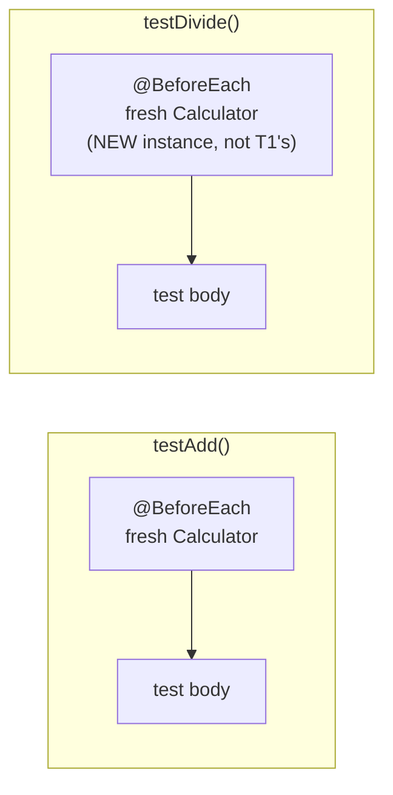

# Unit Testing Fundamentals with JUnit

## Table of Contents

1. [Why This Matters](#1-why-this-matters)
2. [Prerequisites](#2-prerequisites)
3. [Foundation (L1)](#3-foundation-l1)
4. [Core Concepts (L2)](#4-core-concepts-l2)
5. [How It Works Internally (L3)](#5-how-it-works-internally-l3)
6. [Practical Usage](#6-practical-usage)
7. [Examples](#7-examples)
8. [Common Mistakes](#8-common-mistakes)
9. [Edge Cases](#9-edge-cases)
10. [Performance Implications](#10-performance-implications)
11. [Trade-offs](#11-trade-offs)
12. [Senior-Level Considerations (L3)](#12-senior-level-considerations-l3)
13. [Staff/System-Level Considerations (L4)](#13-staffsystem-level-considerations-l4)
14. [Production Scenarios](#14-production-scenarios)
15. [Interview Questions](#15-interview-questions)
16. [Coding/Practice Exercises](#16-codingpractice-exercises)
17. [Debugging Exercises](#17-debugging-exercises)
18. [Design Exercises](#18-design-exercises)
19. [Further Reading](#19-further-reading)
20. [Mastery Checklist](#20-mastery-checklist)

## 1. Why This Matters

Every other chapter in `08-testing` assumes you can already write a `@Test` method and know what an assertion is — reasonable for the Senior/Staff-only version of this repository, not reasonable once it explicitly covers Junior through Staff. This chapter is that missing floor, the same role [Java OOP Fundamentals](../02-java/language-core/java-oop-fundamentals-classes-objects-and-interfaces.md) plays for `02-java`. "Write a test for this method" is one of the most common live-coding requests at every level, and an interviewer watching a candidate hesitate over how to structure a basic test — before any question about mocking, test doubles, or strategy — is watching a Junior-level gap, not a Senior-level one.

## 2. Prerequisites

[Java OOP Fundamentals: Classes, Objects, and Interfaces](../02-java/language-core/java-oop-fundamentals-classes-objects-and-interfaces.md) — a test class is an ordinary class, and understanding one requires the same basics.

## 3. Foundation (L1)

A **unit test** is a small, automated piece of code that calls a specific method with a specific input and checks that it produces the expected output — replacing the manual, repetitive work of running a program by hand and eyeballing the result. `@Test` marks a method as one JUnit will run automatically; inside it, an **assertion** (`assertEquals(expected, actual)`, most commonly) states what must be true for the test to pass. If `calculator.add(2, 3)` doesn't equal `5`, `assertEquals(5, calculator.add(2, 3))` fails the test and reports exactly what it expected versus what it actually got — Section 7's real failure transcript shows exactly this message.

A test class groups related test methods together — [`CalculatorTest`](../../practice/java/testing-fundamentals/junit-basics/src/CalculatorTest.java) holds every test for `Calculator`. Running the whole suite (Section 7) executes every `@Test` method and reports how many passed, how many failed, and — critically — the exact reason each failure happened, not just a pass/fail count.

## 4. Core Concepts (L2)

**`@BeforeEach`** marks a method that runs immediately before *every* `@Test` method in the class — [`CalculatorTest.setUp()`](../../practice/java/testing-fundamentals/junit-basics/src/CalculatorTest.java) constructs a brand-new `Calculator` before each test, which is what makes every test start from a known, identical state regardless of what any other test already did. This is the mechanism behind **test isolation**: a well-written test's outcome does not depend on which other tests ran before it, or in what order.



Each test method gets its own, freshly-constructed `Calculator` — nothing `testAdd()` does to its instance can leak into `testDivide()`'s, which is the entire mechanism behind test isolation, not just a stated rule.

Testing that an exception is thrown correctly uses **`assertThrows`**, not a manual `try`/`catch` with a `fail()` call in the `try` block — `assertThrows(ArithmeticException.class, () -> calculator.divide(10, 0))` runs the given code, and the test passes only if that exact exception type is thrown; if no exception is thrown at all, `assertThrows` itself fails the test with a clear message, rather than the test silently passing because nothing crashed.

A **`@ParameterizedTest`** runs the same test logic once per input value, instead of writing near-identical `@Test` methods by hand. `@ValueSource(ints = {2, 4, 100, 0, -6})` supplies five single values, one test execution each; `@CsvSource` supplies multiple values per execution, unpacked directly into the test method's parameters — Section 7's `addProducesExpectedSum` demonstrates this directly, one test method producing four real, independently-reported test executions.

## 5. How It Works Internally (L3)

The JUnit 5 architecture splits into two independent halves: the **Jupiter API** (`@Test`, `@BeforeEach`, `assertEquals`, and everything else this chapter uses to *write* a test) and the **JUnit Platform** (the engine that actually *discovers and runs* tests, independent of which testing API wrote them — the same platform can run JUnit 4 tests via a compatibility layer, `JUnit Vintage`, visible in Section 7's real output tree). This chapter runs tests via `junit-platform-console-standalone` — a single shaded jar bundling the platform, the Jupiter engine, and the console launcher together, specifically so tests can run without Maven or Gradle managing the dependency graph. [JUnit 5 Architecture and Advanced Features](junit5-architecture-and-advanced-features.md) covers this platform/engine separation, and what it enables, in full depth.

`@ParameterizedTest` works by having JUnit's engine invoke the annotated method once per value the source (`@ValueSource`, `@CsvSource`, or others) supplies, each invocation reported as its own, independently pass/fail-able test — Section 7's real output tree shows exactly this: `addProducesExpectedSum(int, int, int)` as a parent node with four real child test results underneath it, not one combined result.

## 6. Practical Usage

Name test methods for the specific behavior they verify (`divisionByZeroThrowsArithmeticException`, not `test3`) — the name is the first thing a failure report shows, and a descriptive one tells you what broke before you read a single line of stack trace. Use `@BeforeEach` for setup every test genuinely needs, rather than constructing shared state once and reusing it across tests — Section 8's most common mistake is exactly the failure this discipline prevents. Reach for `@ParameterizedTest` the moment you notice two or more `@Test` methods that are structurally identical except for one or two literal values.

## 7. Examples

All output below is real, from `junit-platform-console-standalone` 1.10.3 — [`practice/java/testing-fundamentals/junit-basics/`](../../practice/java/testing-fundamentals/junit-basics/), full transcript in `test-run-output.txt`.

**The full real run, 17/17 tests passing**, including both `@ParameterizedTest` methods expanded into their real, individually-reported executions:
```
├─ CalculatorTest ✔
│  ├─ divisionByZeroThrowsArithmeticException() ✔
│  ├─ addsTwoPositiveNumbers() ✔
│  ├─ addsNegativeNumbers() ✔
│  ├─ addProducesExpectedSum(int, int, int) ✔
│  │  ├─ [1] 2, 3, 5 ✔
│  │  ├─ [2] 0, 0, 0 ✔
│  │  ├─ [3] -1, 1, 0 ✔
│  │  └─ [4] 100, 200, 300 ✔
│  ├─ isEvenReturnsTrueForEvenNumbers(int) ✔
│  │  ├─ [1] 2 ✔  [2] 4 ✔  [3] 100 ✔  [4] 0 ✔  [5] -6 ✔
│  ├─ dividesTwoNumbers() ✔
│  └─ isEvenReturnsFalseForOddNumbers(int) ✔
│     ├─ [1] 1 ✔  [2] 3 ✔  [3] 99 ✔  [4] -7 ✔

[ 17 tests successful ]
[  0 tests failed     ]
```

**A real failure, deliberately produced and captured, not invented** — `addsTwoPositiveNumbers()`'s assertion was temporarily changed to expect `6` instead of the correct `5`:
```
✘ addsTwoPositiveNumbers() — expected: <6> but was: <5>

=> org.opentest4j.AssertionFailedError: expected: <6> but was: <5>
   ...
   CalculatorTest.addsTwoPositiveNumbers(CalculatorTest.java:26)
```
This is exactly what a real assertion failure looks like: the expected and actual values stated explicitly, plus the real source line where the failing assertion lives — see `real-failure-output.txt` for the complete, unedited stack trace. The file was reverted to its correct, passing state immediately after this capture; the broken version was never the committed code.

## 8. Common Mistakes

- **Sharing mutable state across tests instead of resetting it in `@BeforeEach`** — a `static` field or a field initialized once outside `@BeforeEach` can make a test's outcome depend on which other test happened to run first, producing a test suite that passes or fails differently depending on execution order — exactly what Section 4's `@BeforeEach` mechanism exists to prevent.
- **Testing an exception with a manual `try`/`catch` and a `fail()` call**, instead of `assertThrows` — easy to write incorrectly (e.g., forgetting to call `fail()` in the `try` block if no exception occurs), where `assertThrows` gets this right by construction every time.
- **Writing several near-identical `@Test` methods that only differ in one literal value** — Section 6's `@ParameterizedTest` signal, missed.
- **Asserting on ordering-independent behavior with `assertEquals` on an unordered collection** — a genuine and common source of tests that appear to fail randomly, called out here as an edge case (Section 9), not demonstrated in this chapter's own tests, which use only ordered types.

## 9. Edge Cases

- A `@ParameterizedTest` with zero values supplied by its source (an empty `@ValueSource` array, or a data provider returning no rows) runs zero times and is reported as neither passed nor failed by default — a genuinely easy-to-miss silent gap, since "zero executions" looks nothing like a failure in a summary count.
- `assertEquals` on floating-point numbers (`double`/`float`) can fail for values that are mathematically equal but differ in the last few bits of floating-point representation — JUnit provides an overload accepting a `delta` tolerance specifically for this (`assertEquals(expected, actual, 0.0001)`), not used in this chapter's own integer-only demo but a real, common trap once a test involves `double` arithmetic.
- `@BeforeEach` methods run before every single test, including ones that don't need the setup they perform — for an expensive setup step, this chapter's per-test-fresh-state guarantee (Section 4) trades a small performance cost for correctness; [JUnit 5 Architecture and Advanced Features](junit5-architecture-and-advanced-features.md) covers the once-per-class alternative (`@BeforeAll`) and its own trade-off.

## 10. Performance Implications

This chapter's entire suite (17 tests, including 9 parameterized executions) ran in 50ms real, measured time (Section 7) — unit tests, by definition, exercise a single class's logic directly with no database, network, or filesystem access, which is exactly what keeps them fast enough to run on every code change. [Integration Testing Against Real Dependencies](integration-testing-against-real-dependencies.md) covers the deliberately slower, more realistic tests this speed trade-off doesn't apply to.

## 11. Trade-offs

| Concern | Manual `try`/`catch` exception testing | `assertThrows` |
|---|---|---|
| Correctness by construction | Easy to write incorrectly (forgetting `fail()`) | Cannot be written incorrectly in the same way |
| Readability | Requires reading the whole block to see what's being tested | States the expected exception type directly in the assertion |
| Access to the thrown exception | Requires capturing it in a variable inside `catch` | Returned directly by `assertThrows` (Section 7's `thrown.getMessage()`) |

## 12. Senior-Level Considerations (L3)

A Senior engineer reviewing a test suite checks for Section 8's shared-mutable-state mistake specifically, because it produces one of the most confusing categories of bug a team encounters: a test suite that passes locally, in a specific order, and fails intermittently in CI when tests run in a different order or in parallel — a failure mode that looks like flakiness in the *code under test* when the actual defect is in the *tests themselves*. Recognizing "this test failure only happens sometimes" as a test-isolation question first, before assuming the production code has a race condition, is a genuine differentiator at this level.

## 13. Staff/System-Level Considerations (L4)

At Staff scope, the value of Section 3's basic mechanics compounds across an entire codebase: a test suite that consistently follows the isolation discipline in Section 4 and 8 can be run in parallel, safely, at scale — a suite that doesn't must run serially, or accept intermittent, unexplainable failures as a cost of doing business. A Staff engineer's leverage here is rarely writing more tests personally; it's establishing (via review standards, or a linter/static check) that the isolation discipline in this chapter is followed consistently enough that the whole suite remains trustworthy as it grows from dozens of tests to thousands.

## 14. Production Scenarios

No existing `production-cookbook/` entry has a unit-testing-fundamentals-specific root cause — the closest adjacent entries are test-strategy-scale (contract testing, test doubles), not basic-assertion-scale.

> Planned reference: a future `production-cookbook/` entry covering a real incident caused by a flaky, order-dependent test suite that was silenced with retries instead of fixed, eventually masking a real regression that a properly-isolated test would have caught deterministically, would be a natural, non-duplicative addition connecting this chapter's Section 12 warning to a genuine production incident.

## 15. Interview Questions

**Q1 (Junior): "What's the difference between `@Test` and `@BeforeEach`?"**
Expected answer: `@Test` marks a method JUnit runs as an actual test with a pass/fail outcome; `@BeforeEach` marks a setup method that runs before every `@Test` in the class, not itself a test.

**Q2 (Junior/Mid): "How do you test that a method throws an exception?"**
Expected answer: `assertThrows(ExceptionType.class, () -> methodCall())`, ideally with a note on why this is more reliable than a manual `try`/`catch`/`fail()` (Section 8/11).

**Q3 (Mid): "You have four nearly-identical test methods differing only in one input value. What would you do?"**
Expected answer: `@ParameterizedTest` with `@ValueSource` or `@CsvSource` — Section 4/6's signal, plus a concrete before/after description.

**Q4 (Mid/Senior): "A test suite passes locally but fails intermittently in CI. What's your first hypothesis?"**
Expected answer: Section 12's framing — check test isolation (shared mutable state, order dependence) before assuming the production code has a concurrency bug; a genuinely strong answer states this as the *first* hypothesis, not the last one tried.

**Q5 (Senior/Staff): "How do you keep a 3,000-test suite trustworthy as a team scales?"**
Expected answer: Section 13's framing — isolation discipline enforced by review/tooling rather than individual diligence, enabling safe parallel execution; a Staff-level answer connects this to the actual cost of an untrustworthy suite (engineers ignoring "flaky" failures, eventually missing a real one).

## 16. Coding/Practice Exercises

1. Add a `Calculator.multiply(int, int)` method and a corresponding `@ParameterizedTest` with `@CsvSource`, covering at least one case involving a negative number.
2. Deliberately introduce Section 8's shared-mutable-state mistake — add a `static int counter` field incremented in one test and asserted on in another — and observe (do not fix yet) that the second test's outcome now depends on whether the first one ran. Then fix it by moving the counter into `@BeforeEach`-reset instance state, and explain in one sentence why this fixes it.
3. Add a `@ParameterizedTest` using `@CsvSource` for `divide`, including at least one case with a negative numerator, and confirm integer division truncation behaves as expected (e.g., `divide(-7, 2)` producing `-3`, not `-4`).

## 17. Debugging Exercises

Given this real failure output (identical to Section 7's captured example):

```
✘ addsTwoPositiveNumbers() — expected: <6> but was: <5>
```

State, before checking the source: is the bug in the test, or in `Calculator.add()`? The answer requires knowing which value is genuinely correct — `2 + 3` is mathematically `5`, so the assertion's expected value (`6`) is the one that's wrong, not `add()`'s implementation. This is worth internalizing as a habit: a failing assertion tells you *what* disagreed, never automatically *which side* was wrong — that judgment is the test-reader's, not the framework's.

## 18. Design Exercises

Design the test methods (not the implementation) for a `PasswordValidator.isValid(String password)` method that should require at least 8 characters, at least one digit, and at least one uppercase letter. List each test method's name and what single behavior it verifies, and identify which cases are good candidates for a single `@ParameterizedTest` versus which genuinely need their own separate `@Test` method.

## 19. Further Reading

- [JUnit 5 Architecture and Advanced Features](junit5-architecture-and-advanced-features.md) — the Platform/Jupiter/Vintage architecture this chapter's Section 5 only summarizes, plus extension points and lifecycle callbacks beyond `@BeforeEach`.
- [Test Strategy and Test Doubles](test-strategy-and-test-doubles.md) — what to do once a class under test has its own dependencies to isolate, which this chapter's dependency-free `Calculator` deliberately avoids.
- [Writing Tests Live in an Interview](writing-tests-live-in-an-interview.md) — applying this chapter's mechanics under real interview time pressure.

## 20. Mastery Checklist

- [ ] Can write a `@Test` method with a correct `assertEquals` call from scratch.
- [ ] Can explain what `@BeforeEach` does and why it matters for test isolation.
- [ ] Can test that a method throws an exception using `assertThrows`, not a manual `try`/`catch`.
- [ ] Can identify when several `@Test` methods should be collapsed into one `@ParameterizedTest`.
- [ ] Can correctly answer the Section 17 debugging exercise (which side of a failed assertion needs to be examined).
- [ ] Can explain, in Staff-level terms, why test isolation is what allows a suite to scale to thousands of tests safely.
