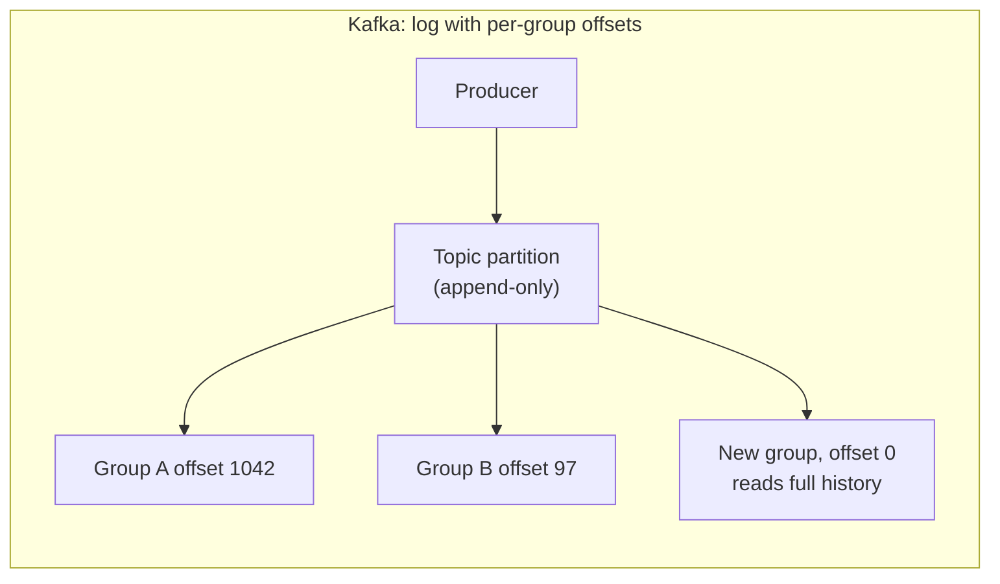
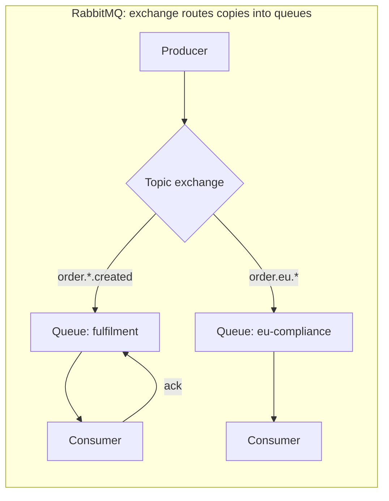

# Broker Selection: Kafka vs. RabbitMQ vs. SQS

> **Topic register:** T-2433 · Core tier · High interview frequency [H]
> **Scope note:** this chapter is a comparison and selection guide, not a
> tutorial for any one broker. Kafka's internals are covered in depth across
> this domain's other chapters; this one exists because the repository taught
> Kafka thoroughly and never answered the question interviewers actually ask —
> *why this broker and not another one?* All behavioral claims are sourced
> from official documentation, cited inline; no performance numbers are
> asserted here that were not measured on the system being discussed.

## Table of Contents

1. [Learning Objectives](#learning-objectives)
2. [Why This Matters in Interviews](#why-this-matters-in-interviews)
3. [Level 1 — Foundation](#level-1-foundation)
4. [Level 2 — Working Knowledge](#level-2-working-knowledge)
5. [Mental Model](#mental-model)
6. [Definition and Purpose](#definition-and-purpose)
7. [Core Concepts](#core-concepts)
8. [Internal Implementation](#internal-implementation)
9. [Diagrams](#diagrams)
10. [Comparison Matrix](#comparison-matrix)
11. [Production Scenarios](#production-scenarios)
12. [Trade-offs](#trade-offs)
13. [Decision Framework](#decision-framework)
14. [Common Mistakes](#common-mistakes)
15. [Anti-Patterns](#anti-patterns)
16. [Best Practices](#best-practices)
17. [Interview Answer Framework](#interview-answer-framework)
18. [Interview Questions](#interview-questions)
19. [Summary](#summary)
20. [Key Takeaways](#key-takeaways)
21. [Cheat Sheet](#cheat-sheet)
22. [Flashcards](#flashcards)
23. [Practice Exercises](#practice-exercises)
24. [Solutions](#solutions)
25. [Additional Reading](#additional-reading)
26. [Official References](#official-references)

---

## Learning Objectives

By the end of this chapter you can:

- State the one architectural difference — log versus queue — that drives nearly every behavioral difference between Kafka and RabbitMQ.
- Explain what a consumer can and cannot do after a message is consumed on each broker, and why replay is a Kafka property and not a general messaging property.
- Choose a broker from workload characteristics rather than familiarity, and defend the choice with ordering, retention, routing, and operational arguments.
- Explain what a managed queue (SQS) removes from your operational burden and what it takes away in exchange.
- Recognize the small number of cases where running more than one broker is the correct answer rather than an accident.

## Why This Matters in Interviews

"Why did you use Kafka?" is asked constantly, and the weak answer is a description of Kafka. The question is comparative: it is checking whether the candidate chose a broker or inherited one. A Senior answer names the workload property that made Kafka right — replay, fan-out to independent consumer groups, ordered partitioned streams, retention as a feature — and names the case where it would have been the wrong call.

The question also probes operational honesty. Kafka is a distributed log with real running costs: partition planning, consumer group rebalancing, retention sizing, and (for self-managed clusters) an operational skill set a small team may not have. A candidate who describes Kafka as strictly better than a queue has usually not operated either.

This is also one of the few topics where saying "it depends" is the correct opening, provided the next sentence says *on what*.

## Level 1 — Foundation

Both kinds of system move messages from producers to consumers so the two do not have to be available at the same time. The difference is what happens to a message after it is read.

**A queue is a to-do list.** A producer adds an item; a consumer takes it; once it is acknowledged, it is gone. That is RabbitMQ's and SQS's core model. If you want two different systems to react to the same event, the broker must deliver a *copy* to each — in RabbitMQ that is what an exchange binding to multiple queues does.

**A log is a notebook.** Producers append entries; entries stay for as long as the retention policy says, whether or not anyone read them. Each consumer group keeps its own bookmark (an *offset*) recording how far it has read. That is Kafka. Two systems reading the same topic do not consume from each other; they each track their own position. A new consumer can start at the beginning and read history that already happened.

That single difference — deleted on acknowledgement versus retained with per-reader bookmarks — is the root of almost everything else. Replay is possible in a log because the data is still there. Per-message retry with a delay is natural in a queue because the broker tracks individual messages rather than a position in a shared sequence.

**SQS** is a queue, like RabbitMQ, but fully managed by AWS: no servers, no cluster, no version upgrades, and a per-request price. In exchange, it offers far fewer routing features and its ordering guarantee only exists in its FIFO variant.

## Level 2 — Working Knowledge

Four properties separate these systems in practice, and an interview answer that covers these four is already a strong one.

**Ordering.** Kafka guarantees order *within a partition*, and the partition is chosen by the message key — so all events for one order ID are ordered relative to each other, while the topic as a whole is not. RabbitMQ delivers in order from a single queue to a single consumer, but adding a second consumer for throughput breaks the global order immediately. SQS standard queues make no ordering guarantee at all; SQS FIFO queues order within a *message group ID*, which is the same idea as Kafka's key-based partition ordering, with a documented throughput ceiling.

**Retention and replay.** Kafka retains by time or size regardless of consumption, so reprocessing a week of events is a matter of resetting an offset. RabbitMQ and SQS delete on acknowledgement; replay requires that you stored the messages somewhere else yourself. This is the single most common reason a team genuinely needs Kafka.

**Routing.** RabbitMQ's exchange types (direct, topic, fanout, headers) let the broker decide which queues a message lands in, based on routing keys evaluated per message. Kafka has no routing layer — a consumer subscribes to a topic and filters in application code, or you create more topics. For complex, rule-based dispatch, RabbitMQ does in the broker what Kafka makes you do in your consumers or your topic taxonomy.

**Per-message operations.** A queue tracks each message individually, which makes per-message acknowledgement, redelivery, dead-lettering, and delay natural. Kafka tracks a position, so a single poisoned message cannot be "left behind" without the consumer implementing that logic itself — see [Consumer Lag, Backpressure, and DLQ Strategy](consumer-lag-backpressure-and-dlq-strategy.md). Work-queue semantics, where each task is independent and one bad task should not block the rest, is the shape queues were designed for.

## Mental Model

**Kafka is a shared, durable timeline that consumers read at their own pace.** The data is the point; consumers come and go.

**RabbitMQ is a smart post office.** Messages are addressed, routed by rules, delivered, and then gone. The routing is the point.

**SQS is a mailbox someone else maintains.** Simple, effectively infinite, and you never think about the building — as long as you only need a mailbox.

If a question is about *history, streams, or multiple independent readers of the same data*, you are in log territory. If it is about *tasks, routing rules, or per-message handling*, you are in queue territory.

## Definition and Purpose

**Apache Kafka** is a distributed, partitioned, replicated commit log. Topics are split into partitions; each partition is an ordered, immutable sequence appended to by producers and read by consumers tracking offsets. Per the [Kafka design documentation](https://kafka.apache.org/documentation/#design), the log structure is deliberate: sequential disk I/O and a `sendfile`-based zero-copy read path are what let it serve many consumers from disk without a per-consumer cost proportional to message count. It exists for high-throughput, multi-consumer event streams where data has value beyond the first read.

**RabbitMQ** is an AMQP 0-9-1 message broker organized around exchanges, bindings, and queues. Producers publish to an exchange with a routing key; bindings determine which queues receive a copy; consumers read from queues. It exists for flexible message routing and reliable task distribution. Its [quorum queues](https://www.rabbitmq.com/docs/quorum-queues), the current recommendation for durable replicated queues, use a Raft-based replication protocol.

**Amazon SQS** is a fully managed queue service. Standard queues offer at-least-once delivery with best-effort ordering and effectively unlimited throughput; [FIFO queues](https://docs.aws.amazon.com/AWSSimpleQueueService/latest/SQSDeveloperGuide/FIFO-queues.html) offer exactly-once *processing* within a deduplication window and strict ordering within a message group, at a documented lower throughput ceiling. It exists to remove broker operations from your team's responsibilities entirely.

## Core Concepts

### Consumption models decide everything downstream

| Concern | Kafka (log) | RabbitMQ / SQS (queue) |
|---|---|---|
| After a successful read | Message stays; offset advances | Message is acknowledged and deleted |
| Second independent consumer | New consumer group, own offsets, full history | Needs a separate queue and a broker-side copy |
| Replay | Reset offset | Not possible unless you stored it elsewhere |
| Retry one bad message | Consumer must implement it (retry topic, DLQ) | Native: nack, redelivery, dead-letter, visibility timeout |
| Ordering unit | Partition (chosen by key) | Queue with a single consumer, or FIFO message group |
| Scaling consumers | Up to the partition count | Add consumers freely, losing order |

The scaling row is the trade-off people miss. Kafka's parallelism is bounded by partition count: adding a twelfth consumer to an eleven-partition topic leaves one consumer idle. A queue lets you add consumers without limit, precisely because it does not promise ordering across them.

### Fan-out is not the same as work distribution

Two consumers on the same Kafka topic in *different* consumer groups both get every message (fan-out). Two consumers in the *same* group split the partitions between them (work distribution). This one distinction answers a large share of Kafka interview follow-ups, and the mechanics are in [Consumer Groups and Rebalancing](consumer-groups-and-rebalancing.md).

RabbitMQ expresses the same two shapes differently: a fanout exchange bound to two queues gives fan-out; two consumers on one queue gives work distribution.

### Delivery semantics are broadly similar, and the differences are in the details

All three default to at-least-once, so consumers must be idempotent — see [Idempotency](../11-system-design/idempotency.md) and [Delivery Semantics and Exactly-Once](delivery-semantics-and-exactly-once.md). Kafka's transactional producer plus `read_committed` consumers provides exactly-once semantics *within Kafka* (read-process-write between topics), which is narrower than the phrase suggests: it does not extend to a database write unless that write participates in an outbox pattern. SQS FIFO provides exactly-once processing within a five-minute deduplication window based on a deduplication ID. RabbitMQ provides publisher confirms and consumer acknowledgements, not distributed exactly-once.

Design for idempotent consumers regardless of broker. Every "exactly-once" feature is scoped more narrowly than its name.

### Operational cost is a first-class selection criterion

A real selection argument includes who operates it. Self-managed Kafka means capacity planning per partition, retention sizing against disk, consumer lag monitoring, broker upgrades, and rebalancing behavior under deploys. Managed Kafka (MSK, Confluent Cloud) removes much of that at a price. RabbitMQ is generally simpler to stand up and has its own operational edges — queue length as a memory concern, and clustering behavior under partitions being the classic ones. SQS has essentially no operational burden and a per-request bill that grows linearly with traffic.

For a small team with a moderate event volume and no replay requirement, "SQS, and revisit if we need replay" is a stronger Staff-level answer than an elaborate Kafka design.

## Internal Implementation

**Why Kafka's read path scales with consumer count.** A partition is an append-only segment file. Consumers track offsets; the broker does not maintain per-consumer message state, so adding consumer groups adds reads, not bookkeeping. The documented design relies on the OS page cache and a zero-copy transfer path so that reads served from cache avoid copying data through user space. The practical consequence: many independent consumers of the same stream is Kafka's best case, and it is exactly the case a queue handles worst.

**Why RabbitMQ's routing is expressive.** The exchange evaluates a routing key against bindings per message, so dispatch rules live in broker configuration rather than in consumer code. Topic exchanges support wildcard patterns, so `order.*.created` style hierarchies are a broker concern. Nothing in Kafka corresponds to this; the equivalent is more topics, or filtering in consumers.

**Why queue depth matters differently.** In a queue, unconsumed messages are pending work the broker holds; a large backlog is an operational problem, historically a memory one in RabbitMQ. In Kafka, "unconsumed" messages are just log entries within retention; a consumer 10 million offsets behind is a lag problem for that consumer, not a broker memory problem. This is why Kafka absorbs traffic spikes and slow consumers more gracefully, and why lag monitoring rather than queue depth is the Kafka health signal.

**Why partition count is a long-lived decision.** Increasing a topic's partitions changes key-to-partition mapping for future messages, so ordering guarantees for a key can be broken across the change. Partition count is close to a schema decision. Nothing similar constrains queue systems, where adding consumers is a runtime action.

## Diagrams

The two diagrams are the whole comparison. In the first, one copy of the data serves every reader and history survives. In the second, the broker makes copies according to rules, and each copy disappears when acknowledged.

## Comparison Matrix

| Dimension | Kafka | RabbitMQ | SQS (Standard / FIFO) |
|---|---|---|---|
| Model | Distributed log | Queue with routing exchanges | Managed queue |
| Retention after read | Yes, by time/size policy | No, deleted on ack | No, deleted on delete-call |
| Replay | Native, offset reset | Not supported | Not supported |
| Ordering | Per partition, by key | Per queue, single consumer | None / per message group |
| Fan-out to independent readers | Native, consumer groups | Exchange bound to N queues | One queue per consumer, or SNS in front |
| Routing rules in broker | No | Yes, rich | No |
| Per-message retry / delay | Application-implemented | Native | Native, visibility timeout |
| Dead-letter | Convention, DLQ topic | Native dead-letter exchange | Native redrive policy |
| Consumer parallelism limit | Partition count | Unbounded | Unbounded / group count |
| Backlog tolerance | High, retention-bounded | Operationally sensitive | High, managed |
| Operational burden | High self-managed, moderate managed | Moderate | Effectively none |
| Typical strong fit | Event streams, analytics, multi-consumer, replay | Task routing, RPC-ish workflows, complex dispatch | Simple decoupling on AWS, low ops |

## Production Scenarios

### Scenario: a team needs to reprocess three days of events after a bug in a consumer

**Symptoms.** A pricing consumer wrote incorrect values for three days because of a rounding bug. The fix is trivial; recovering the data is not.

**On Kafka.** Deploy the fixed consumer under a new consumer group, set its starting offset to a timestamp three days back, and let it reprocess. The data was never deleted; the only questions are whether downstream writes are idempotent and whether reprocessing rate will overwhelm anything.

**On RabbitMQ or SQS.** The messages are gone. Recovery depends on whether anyone archived them — an S3 sink, an audit table, or an event store. If not, the data must be reconstructed from source systems, if that is even possible.

**Diagnosis of the real decision.** The question "do we need replay?" is often answered *no* during design and *yes* during the first serious incident. This scenario is the single strongest argument for a log, and it is the one to reach for when asked why Kafka.

**Trade-offs.** Replay is not free: retention costs storage, and a reprocessing run puts real load on every downstream system. Idempotent consumers are a precondition, not an optimization.

### Scenario: an image-processing pipeline with one very slow task type

**Symptoms.** A queue of image jobs, where 4K video thumbnails take 40x longer than photo thumbnails. On a partitioned log, one slow key stalls its whole partition, and consumers on other partitions sit idle while one falls hours behind.

**Diagnosis.** This is a work-distribution problem, not an event-stream problem. Each task is independent, ordering between tasks is irrelevant, and the desirable behavior is "any free worker takes the next task." That is exactly queue semantics, and exactly what partition-bound consumption prevents.

**Remediation.** A queue (RabbitMQ or SQS) with a visibility timeout sized for the slowest task, a separate queue per task class so a slow class cannot starve a fast one, and workers scaled per queue. Dead-lettering after N attempts handles genuinely bad inputs.

**Interview lesson.** "We put our job queue on Kafka" is a common and defensible-sounding answer that is often wrong. Named here so you can recognize it, in your own systems or in an interviewer's scenario.

### Scenario: a small team on AWS adds asynchronous email sending

**Symptoms.** None yet — this is a design decision. A four-engineer team wants to decouple email sending from the request path.

**Analysis.** Volume is thousands per day. No replay requirement. No routing rules. No ordering requirement. Nobody on the team has operated a broker.

**Decision.** SQS, with a dead-letter queue after three attempts. Setup is minutes, ops burden is zero, cost at that volume is negligible.

**Why this matters at Staff level.** Choosing the smaller technology when the requirements are small is a judgment signal. A Kafka cluster for thousands of emails a day is a real, ongoing operational cost paid for an unused capability. The right framing is: what would have to become true for this choice to be wrong, and how would we notice? Here: a replay requirement, or multiple independent consumers of the same events. Both are visible well before they are urgent.

## Trade-offs

| If you choose | You gain | You pay |
|---|---|---|
| Kafka | Replay, retention, independent multi-consumer fan-out, high sustained throughput, backlog tolerance | Partition planning, rebalancing behavior, retention storage, DLQ/retry built by hand, real operational skill |
| RabbitMQ | Broker-side routing, per-message retry/delay/dead-letter, unbounded consumer scaling, simpler mental model | No replay, backlog is an operational concern, ordering lost as soon as you scale consumers |
| SQS | Near-zero operations, elastic scale, native redrive and visibility timeout | No replay, no routing, AWS coupling, per-request cost, FIFO throughput ceiling |

## Decision Framework

Ask in this order; the first *yes* usually decides it.

1. **Does any consumer need to re-read messages it already processed — for recovery, for a new feature, or for a new consumer reading history?** Yes → log (Kafka). This is the highest-signal question.
2. **Do multiple independent systems need every message, with independent progress?** Yes → Kafka, or a queue per consumer with broker-side fan-out (RabbitMQ exchange, SNS in front of SQS).
3. **Is ordering required, and at what granularity?** Global ordering is unrealistic anywhere; per-key ordering means Kafka partitions or SQS FIFO message groups.
4. **Is this really a work queue** — independent tasks, variable durations, one bad task must not block others? Yes → queue. Partition-bound consumption is the wrong shape.
5. **Do you need broker-side routing rules?** Yes → RabbitMQ.
6. **Who operates it, and how much do they want to?** Small team, AWS, modest volume → SQS. This question is not a tiebreaker; it can override answers 3 through 5.
7. **Only after all that:** what does the team already run? Adding a second broker has a real, permanent cost. An existing broker that covers the requirement adequately usually wins.

## Common Mistakes

- **Describing Kafka instead of comparing it** when asked why Kafka was chosen.
- **Claiming Kafka guarantees global ordering.** It orders within a partition only.
- **Treating Kafka's exactly-once as end-to-end.** It covers read-process-write within Kafka, not your database write.
- **Using Kafka for a job queue** where tasks are independent and durations vary wildly — a single slow message blocks its partition.
- **Forgetting that consumer parallelism is capped by partition count.**
- **Assuming a queue can replay.** Once acknowledged, the message is gone.
- **Ignoring the ops question.** A technically superior broker nobody can operate is not superior.

## Anti-Patterns

- **The accidental multi-broker estate.** Three brokers because three teams each picked their favorite, with no team owning the integration between them.
- **Kafka as a database.** Infinite retention plus log compaction can look like a key-value store; it does not offer query, index, or transaction semantics. See [Storage Selection Trade-offs](../11-system-design/storage-selection-tradeoffs.md).
- **One topic for everything.** A single topic with a `type` field forces every consumer to read and discard everything.
- **A partition per entity.** Tens of thousands of partitions to preserve per-entity ordering; the key-based partitioner already provides that with a sane partition count.
- **Unbounded retry in place of a DLQ.** A poison message retried forever is an outage that looks like a busy consumer.

## Best Practices

- Write down the replay requirement explicitly during design; it is the decision's pivot and is usually answered by assumption.
- Make consumers idempotent regardless of broker — every delivery guarantee here is at-least-once by default.
- Choose partition count for both throughput and ordering granularity, and treat it as close to irreversible.
- Give every consumer a dead-letter path before the first poison message, not after.
- Monitor consumer lag for logs and queue depth plus age-of-oldest-message for queues; they are not the same signal.
- Prefer one broker for the whole estate unless a second has a written, workload-specific justification.
- Revisit the choice when the workload changes shape, not on a schedule.

## Interview Answer Framework

### 30-Second Answer

Kafka is a durable, partitioned log: messages stay for a retention period and each consumer group tracks its own offset, so replay and independent multi-consumer fan-out are native. RabbitMQ and SQS are queues: messages are deleted on acknowledgement, with rich per-message handling — retry, delay, dead-letter — and, in RabbitMQ, broker-side routing. Choose the log when history has value; choose a queue when the unit of work is a task.

### 2-Minute Answer

Add the four differentiators: ordering (Kafka per partition by key; RabbitMQ per queue, lost as soon as you add a consumer; SQS FIFO per message group), retention and replay (the decisive one), routing (RabbitMQ's exchanges have no Kafka equivalent), and per-message operations (native in queues, hand-built in Kafka). Then give a concrete selection: for a pipeline where a pricing consumer had to reprocess three days after a bug, Kafka made that an offset reset; on a queue the messages would have been gone. For an image-processing pipeline with wildly variable task durations, a queue is right and Kafka's partition-bound consumption is actively harmful. Close on operations: for a small team on AWS with no replay requirement, SQS is the right answer and a Kafka cluster is a real cost paid for an unused capability.

### 10-Minute Deep Dive

Structure it as: the log-versus-queue root difference; consumption model consequences (the table); why Kafka's read path scales with consumer count and why queue backlogs are operationally different from log lag; delivery semantics and the narrower-than-advertised scope of every exactly-once feature; partition count as a near-irreversible decision that caps consumer parallelism; the decision framework with replay as question one; and the operational-ownership question as a legitimate override.

### Whiteboard Explanation

Draw a horizontal line of boxes — the log — with three arrows underneath pointing at different positions, labeled with consumer group names. Then draw a separate box with messages entering, one arrow out, and messages disappearing after the arrow. Say: "left, the data stays and readers have positions; right, the data leaves when someone takes it." Then add a diamond before the right-hand box and label it "routing rules," which is RabbitMQ's addition.

### Production Example

The three-day reprocessing incident: on Kafka a new consumer group and an offset reset; on a queue, recoverable only if someone had independently archived the messages.

### Trade-offs to Mention

Replay costs storage and load. Partition count caps parallelism and is hard to change. Queues scale consumers freely by giving up cross-consumer ordering. SQS trades routing and replay for essentially zero operations.

### Common Candidate Mistakes

Describing rather than comparing; asserting global ordering; treating exactly-once as end-to-end; ignoring who operates the cluster.

### Typical Follow-Up Questions

"How does Kafka guarantee ordering?" → "What happens when you add a consumer beyond the partition count?" → "How would you replay on RabbitMQ?" → "When is Kafka the wrong choice?" → "What breaks if you increase partition count?" → "How would you dead-letter on Kafka?"

### Senior-Level Expectations

Selects from workload properties, names the failure mode of the choice, and can argue the opposite case credibly.

### Staff-Level Discussion

Treats broker choice as a long-lived platform commitment rather than a per-service decision. The costs that dominate are not throughput but standardization: schema governance and compatibility (see [Schema Registry and Compatibility Evolution](schema-registry-and-compatibility-evolution.md)), a shared DLQ and retry convention, consistent lag alerting, and one team accountable for the broker's availability. A second broker roughly doubles that surface, so the bar for introducing one should be a workload property the first genuinely cannot serve — not preference. Conversely, forcing every workload onto one broker has a real cost too: running job queues on a partitioned log leads to per-team workarounds that are worse than the second broker would have been. The Staff judgment is knowing which of those two costs is currently larger for this organization, and being able to state what would change the answer.

## Interview Questions

### Question 1 — When would you choose RabbitMQ over Kafka?

**Why interviewers ask it.** It is the fastest way to tell whether a candidate chose Kafka or inherited it. Someone who cannot argue the other side has not made the decision.

**Expected answer.** When the workload is task distribution rather than event streaming: independent jobs, no replay requirement, wildly variable processing times, and a need for per-message retry, delay, and dead-lettering — all native in RabbitMQ and hand-built on Kafka. Also when dispatch rules belong in the broker: topic and header exchanges route per message, with no Kafka equivalent short of more topics or consumer-side filtering. Also when consumer parallelism must exceed what a partition count allows.

**Minimum acceptable answer.** Knows RabbitMQ is queue-based and Kafka is log-based, and that queues suit task distribution.

**Strong Senior answer.** Adds the ordering consequence — RabbitMQ preserves order per queue only with a single consumer, so scaling out gives up ordering, which is fine for independent tasks and fatal for per-entity sequences — and names the backlog difference: unconsumed queue messages are broker-held pending work, while unconsumed log entries are just data within retention.

**Staff-level extension.** Frames it as a platform decision: adding a second broker doubles the governance surface (schemas, DLQ conventions, lag alerting, on-call), so the bar is a workload property the existing broker genuinely cannot serve. Also notes the inverse failure — forcing job queues onto a log produces per-team workarounds worse than the second broker.

**Common mistakes.** Answering "RabbitMQ for low volume, Kafka for high volume," which is a throughput caricature rather than a model difference.

**Likely follow-ups.** "How would you replay on RabbitMQ?" (You cannot; you archive independently.) "What if you need both routing and replay?" (Kafka plus consumer-side dispatch, or an archive behind the queue — state the cost either way.)

**Evaluation criteria.** Argues the non-Kafka case credibly, names at least two queue-native capabilities, and does not reduce the choice to throughput.

### Question 2 — Your consumer processed three days of events with a bug. How do you recover on each broker?

**Why interviewers ask it.** Replay is the decisive differentiator and this is its concrete form.

**Expected answer.** On Kafka: deploy the fix, start a new consumer group at an offset corresponding to three days ago, reprocess. The data is still in the log within retention. On RabbitMQ or SQS: the messages were deleted on acknowledgement, so recovery depends entirely on an independent archive; without one, the data must be rebuilt from source systems.

**Minimum acceptable answer.** Knows Kafka can replay and queues cannot.

**Strong Senior answer.** Names the preconditions: retention must actually cover three days, downstream writes must be idempotent or reprocessing double-applies, and reprocessing load on downstream systems must be controlled. Notes that a new consumer group avoids disturbing the existing one.

**Staff-level extension.** Points out that "do we need replay?" is usually answered *no* at design time and *yes* at incident time, so the question belongs in a written design decision with an explicit revisit trigger — and that on a queue-based estate the mitigation is a cheap archival sink, which buys most of the recovery value without a broker migration.

**Common mistakes.** Claiming a queue can replay by re-publishing (that requires already having the messages); forgetting retention might be shorter than the incident window.

**Likely follow-ups.** "What if retention is 24 hours?" (Data is gone; same position as a queue — retention is the real guarantee, not the technology.) "How do you avoid double-applying?" (Idempotency keys, or a reprocessing sink that writes to a new table.)

**Evaluation criteria.** Correct mechanism on both sides, names retention and idempotency as preconditions, and offers the cheap mitigation for queue-based systems.

### Question 3 — Why not just use Kafka for everything?

**Why interviewers ask it.** It probes whether the candidate can argue against the currently fashionable choice, which is a proxy for genuine judgment.

**Expected answer.** Because several common workloads fit it badly. Job queues with independent tasks and variable durations suffer from partition-bound consumption — one slow message blocks its partition while other consumers idle. Per-message retry, delay, and dead-lettering must be built by hand. Broker-side routing does not exist. Consumer parallelism is capped by partition count. And a self-managed cluster carries a real operational burden that a small team may not be able to staff.

**Minimum acceptable answer.** Names operational cost and at least one workload that fits badly.

**Strong Senior answer.** Gives the concrete failure — the 40x-slower task type stalling a partition — and the alternative design (a queue per task class, visibility timeout sized to the slowest task, workers scaled per queue).

**Staff-level extension.** Reframes it as choosing the smallest technology that meets the requirement, with an explicit written trigger for revisiting: a replay requirement or a second independent consumer of the same events. Notes that both triggers are visible well before they become urgent, which is what makes starting small a responsible choice rather than a deferral.

**Common mistakes.** Answering only "it's complex" with no workload-specific failure; treating the question as a trap rather than a genuine design discussion.

**Likely follow-ups.** "What would make you migrate to Kafka later?" (Replay or independent multi-consumer fan-out.) "Is the migration hard?" (Producers are easy; consumer semantics and any accumulated queue-specific behavior are the real work.)

**Evaluation criteria.** Names a specific workload mismatch with its mechanism, and states a concrete revisit trigger rather than a vague "if we grow."

## Summary

Kafka is a retained log with per-consumer-group offsets; RabbitMQ and SQS are queues that delete on acknowledgement. That single difference produces the rest: replay exists only on the log, per-message retry and dead-lettering are native only in the queues, ordering is per-partition versus per-queue-with-one-consumer, consumer parallelism is capped by partitions versus unbounded, and a backlog is retained data versus pending broker-held work. RabbitMQ adds broker-side routing that Kafka has no equivalent for; SQS removes operations entirely in exchange for routing, replay, and portability. Choose by asking about replay first, work-queue shape second, routing third, and who operates it fourth — with the last able to override the rest.

## Key Takeaways

- Log versus queue is the root difference; everything else follows from it.
- Replay is the highest-signal selection question, and it is usually answered by assumption rather than analysis.
- Kafka orders within a partition, not globally; consumer parallelism is capped by partition count.
- Every exactly-once guarantee here is narrower than its name; design idempotent consumers regardless.
- Job queues with independent, variable-duration tasks fit queues and fit logs badly.
- Operational ownership is a legitimate, sometimes decisive, selection criterion.
- A second broker roughly doubles the governance surface; introduce one only for a workload the first genuinely cannot serve.

## Cheat Sheet

Condensed version: [`cheat-sheets/broker-selection-kafka-rabbitmq-and-sqs.md`](../../cheat-sheets/broker-selection-kafka-rabbitmq-and-sqs.md).

## Flashcards

Review deck: [`flashcards/broker-selection-kafka-rabbitmq-and-sqs.md`](../../flashcards/broker-selection-kafka-rabbitmq-and-sqs.md).

## Practice Exercises

1. For a system emitting order events consumed by fulfilment, analytics, and fraud detection, write the broker choice and the three strongest reasons. Then write the strongest argument against your own choice.
2. A consumer must reprocess 48 hours of events. Write the recovery procedure for Kafka, for RabbitMQ, and for SQS, including every precondition.
3. A topic has 6 partitions and 10 consumers in one group. State exactly what happens, and what you would change.
4. Design dead-lettering for a Kafka consumer. Compare it, feature by feature, with RabbitMQ's dead-letter exchange.
5. Estimate the monthly cost shape of SQS versus a three-broker managed Kafka cluster for 10 million messages per day, in terms of what each bill scales with. Do not invent prices — name the cost drivers.
6. Write the one-paragraph decision record for adding a second broker to an organization that already runs Kafka.

## Solutions

1. Three independent consumers with different processing rates is the textbook Kafka case (consumer groups, independent offsets, replay for new consumers). The strongest counter-argument is operational: if the team has no broker experience and all three consumers are simple, SNS fan-out into three SQS queues delivers the same decoupling with no cluster — at the cost of losing replay.
2. Kafka: new consumer group, offset by timestamp, provided retention exceeds 48 hours and downstream writes are idempotent. RabbitMQ and SQS: only possible from an independent archive; otherwise rebuild from source systems. Note that Kafka with 24-hour retention is in exactly the same position as the queues.
3. Four consumers are idle — partitions are the unit of assignment. Either increase partitions (accepting that key-to-partition mapping changes for new messages, which can break per-key ordering across the change) or accept six-way parallelism. If the real need is unbounded worker scaling, the workload is a work queue and the broker choice deserves revisiting.
4. On Kafka you build it: catch, publish to a `<topic>.DLT` with failure metadata, commit the offset. Spring Kafka's `DeadLetterPublishingRecoverer` is the common implementation. RabbitMQ gives dead-lettering, per-message TTL, and redelivery counting as broker configuration. The Kafka version is more code and more explicit; the RabbitMQ version is configuration and less visible in the codebase.
5. SQS scales with request count (sends, receives, deletes — long polling reduces empty receives), so the bill tracks traffic linearly with near-zero fixed cost. Managed Kafka scales with provisioned broker instances and storage, so the bill is largely fixed regardless of whether you send 1 million or 10 million messages a day. The crossover is a volume question, and at low volume the fixed-cost option is strictly worse.
6. It should name the workload property the existing broker cannot serve, the governance cost being accepted (schemas, DLQ convention, lag alerting, on-call ownership), the team accountable, and the condition under which the second broker would be retired.

## Additional Reading

- [Kafka Architecture Fundamentals](kafka-architecture-fundamentals.md) — partitions, replication, and the log in depth.
- [Event-Driven Architecture Integration Styles](event-driven-architecture-integration-styles.md) — point-to-point versus pub-sub, choreography versus orchestration.
- [Delivery Semantics and Exactly-Once](delivery-semantics-and-exactly-once.md) — what each guarantee actually covers.
- [Consumer Lag, Backpressure, and DLQ Strategy](consumer-lag-backpressure-and-dlq-strategy.md) — building queue-like per-message handling on a log.
- [Retention, Log Compaction, and Tiered Storage](retention-log-compaction-and-tiered-storage.md) — what replay actually costs.
- [Storage Selection Trade-offs](../11-system-design/storage-selection-tradeoffs.md) — the same selection discipline applied to databases.

## Official References

- [Apache Kafka — Design](https://kafka.apache.org/documentation/#design)
- [RabbitMQ — Quorum Queues](https://www.rabbitmq.com/docs/quorum-queues)
- [RabbitMQ — AMQP 0-9-1 Concepts](https://www.rabbitmq.com/tutorials/amqp-concepts)
- [Amazon SQS — FIFO Queues](https://docs.aws.amazon.com/AWSSimpleQueueService/latest/SQSDeveloperGuide/FIFO-queues.html)
