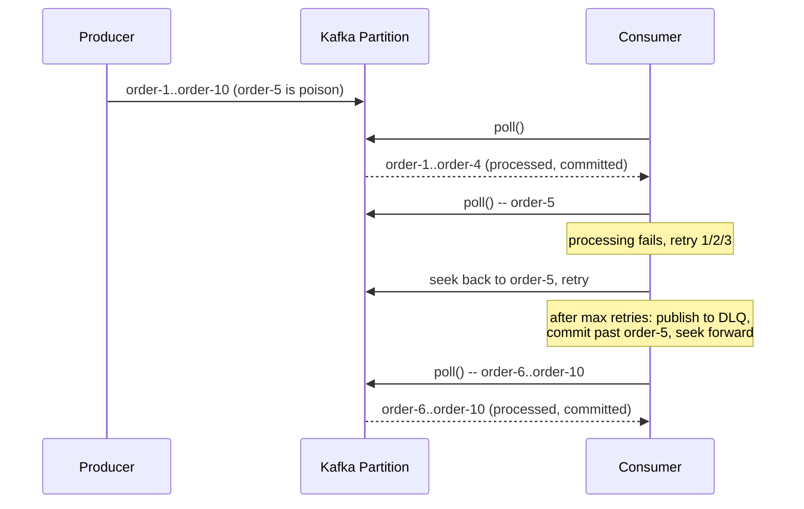
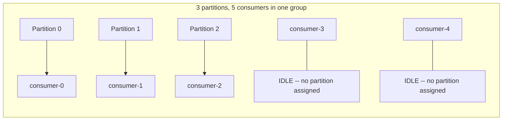

# Consumer Lag, Backpressure, and DLQ Strategy

> **Topic register:** T-707 · IWI 7.2 · Staff tier · Moderate interview frequency.
> **Provenance:** every measured number in this chapter is real, executed output
> against a real `apache/kafka:3.7.0` broker running in Docker — real poison
> messages, real dead-letter routing, and a real 5-consumers-on-3-partitions
> rebalance, not a description of expected Kafka behavior. Reproducible source:
> [`practice/java/kafka/consumer-lag-backpressure-and-dlq-strategy/`](../../practice/java/kafka/consumer-lag-backpressure-and-dlq-strategy/README.md).

## Table of Contents

1. [Learning Objectives](#learning-objectives)
2. [Why This Matters in Interviews](#why-this-matters-in-interviews)
3. [Mental Model](#mental-model)
4. [Definition and Purpose](#definition-and-purpose)
5. [Core Concepts](#core-concepts)
6. [Internal Implementation](#internal-implementation)
7. [Execution Flow](#execution-flow)
8. [Diagrams](#diagrams)
9. [Java Examples](#java-examples)
10. [Production Scenarios](#production-scenarios)
11. [Failure Modes and Debugging](#failure-modes-and-debugging)
12. [Trade-offs](#trade-offs)
13. [Performance Implications](#performance-implications)
14. [Decision Framework](#decision-framework)
15. [Comparisons](#comparisons)
16. [Common Mistakes](#common-mistakes)
17. [Anti-Patterns](#anti-patterns)
18. [Best Practices](#best-practices)
19. [Interview Answer Framework](#interview-answer-framework)
20. [Interview Questions](#interview-questions)
21. [Summary](#summary)
22. [Key Takeaways](#key-takeaways)
23. [Cheat Sheet](#cheat-sheet)
24. [Flashcards](#flashcards)
25. [Practice Exercises](#practice-exercises)
26. [Solutions](#solutions)
27. [Additional Reading](#additional-reading)
28. [Official References](#official-references)

## Learning Objectives

After this chapter you should be able to:

- Define consumer lag precisely and explain why it's the right SLO for a consuming
  service's health, not just a diagnostic curiosity.
- Explain, with a concrete reproduction, why a single poison message can block every
  message behind it on the same partition.
- Design a real dead-letter queue strategy: retry bound, routing, and safe continuation.
- Explain why adding consumers beyond a topic's partition count does not increase
  parallelism, and what actually does.
- Reason about the ordering trade-off a DLQ strategy accepts, and when that trade-off
  is and isn't acceptable.

## Why This Matters in Interviews

The register names two extremely common interview traps on this topic directly: the
misconception that adding consumers beyond partition count helps (it doesn't — Kafka's
own assignment protocol gives each partition to at most one consumer per group, full
stop), and the sharp, deceptively simple follow-up "one bad message blocks the
partition — options?" which tests whether a candidate actually understands why that
happens (partition-level ordering) and has a concrete, real strategy for it (bounded
retry plus dead-lettering) rather than a vague "handle errors gracefully." Consumer
lag itself is also one of the most commonly misunderstood Kafka metrics — treated as
a vague health indicator rather than the precise SLO it should be for any
consumer-based system's on-call practice.

## Mental Model

A Kafka partition is a strictly ordered log, and a consumer reads it strictly in
order — there is no way to skip ahead to message 6 while message 5 is still
"in progress" without an explicit action that says so. This single fact explains
almost everything in this chapter: consumer lag is just "how far behind the end of
the log is my current read position," a poison message blocks everything behind it
because the consumer literally cannot advance past an uncommitted offset without
being told to, and a DLQ strategy is nothing more than an explicit, deliberate way of
saying "skip this one, I've dealt with it elsewhere."

## Definition and Purpose

**Consumer lag** is the difference between a partition's latest offset (the end of
the log) and a consumer group's current committed offset for that partition — it
measures how far behind real-time the consumer is. **Backpressure**, in this Kafka
context, is what happens when a consumer cannot keep up with the produce rate: lag
grows, and the system needs an explicit strategy (scale consumers, shed load, or
accept growing lag temporarily) rather than an implicit one. A **dead-letter queue
(DLQ)** is a separate topic where messages a consumer cannot successfully process
after a bounded number of attempts are routed, so the consumer can commit past them
and continue processing the rest of the partition. These concepts exist because
Kafka's ordering guarantee — the property that makes partition-level processing
predictable and simple to reason about — has a direct, unavoidable cost: it also
means one truly unprocessable message can, without an explicit mitigation, halt
everything behind it indefinitely.

## Core Concepts

- **Lag as an SLO, not just a metric.** A consumer's lag trending toward zero under
  normal load, and bounded during a legitimate burst, is a real, actionable service
  objective — alertable and dashboard-worthy in the same way latency and error rate
  are, not an incidental diagnostic number.
- **Partition-level ordering blocks the whole partition, not just the poison
  message.** This is the mechanical cause of "one bad message blocks the partition" —
  proven directly in [Java Examples](#java-examples) below.
- **Consumers beyond partition count sit idle.** Kafka's consumer-group protocol
  assigns each partition to at most one consumer in a group at a time — a fifth
  consumer added to a three-partition topic simply receives no partitions and
  processes nothing, proven directly in this chapter's practice code.
- **A DLQ trades strict ordering for continued progress.** Dead-lettering a message
  and continuing means later messages on that partition are now processed before the
  dead-lettered one is ever resolved (if it ever is) — an explicit, deliberate
  trade-off, not a free fix.

## Internal Implementation

This chapter's practice code demonstrates the blocking mechanism directly rather than
describing it. [`PoisonMessagePartitionBlockingDemo.java`](../../practice/java/kafka/consumer-lag-backpressure-and-dlq-strategy/src/PoisonMessagePartitionBlockingDemo.java)'s
naive consumer catches a processing failure, explicitly avoids committing past the
failed offset, and seeks back to retry it — the real mechanism by which "not
committing" becomes "nothing after this point is ever fetched again."
[`DlqRecoveryDemo.java`](../../practice/java/kafka/consumer-lag-backpressure-and-dlq-strategy/src/DlqRecoveryDemo.java)
adds a bounded retry counter; once exceeded, it publishes the failed record to a
separate DLQ topic and explicitly calls `consumer.seek(partition, record.offset() + 1)`
to move the real consumer position past it — a `seek()` this chapter's own build
process discovered was required the hard way (see
[Failure Modes and Debugging](#failure-modes-and-debugging)).

## Execution Flow



## Diagrams



## Java Examples

The naive, blocking retry (never routes the failure anywhere):

```java
} catch (NumberFormatException e) {
    // does NOT commit past this offset -- will retry the same record forever
    hitPoisonThisRound = true;
    break;
}
if (hitPoisonThisRound) {
    consumer.seek(partition, consumer.committed(Collections.singleton(partition)).get(partition).offset());
}
```

The real, measured result: **4 of 10 messages processed, lag stuck at 6, across 5
real retry rounds** — no number of additional rounds changes this outcome.

The DLQ-aware version, with the fix this chapter's own build process needed:

```java
if (retriesOnCurrentRecord >= MAX_RETRIES_PER_MESSAGE) {
    producer.send(dlqRecord).get();
    deadLettered.add(record.key());
    consumer.commitSync(Collections.singletonMap(partition, new OffsetAndMetadata(record.offset() + 1)));
    // Required fix: poll() already advanced the real fetch position past this whole
    // batch. Without this seek(), the consumer silently stalls at the true end of
    // the topic and orders 6-10 are never processed.
    consumer.seek(partition, record.offset() + 1);
}
```

The real, measured result: **9 of 10 messages processed, 1 dead-lettered, 0 lost** —
verified by a second, independent consumer actually reading the DLQ topic's real
contents back.

The real, measured consumers-vs-partitions result (3 partitions, 5 consumers):

```
consumer-0: 11 messages received
consumer-1: 9 messages received
consumer-2: 10 messages received
consumer-3: 0 messages received  <-- IDLE
consumer-4: 0 messages received  <-- IDLE
```

## Production Scenarios

**Scenario: an on-call engineer added consumer instances to fix a lag alert, and
nothing changed.** Symptoms: a paging alert fired for "consumer lag > 10,000" on an
order-events topic; the on-call engineer, under pressure, doubled the consumer
deployment's replica count from 3 to 6, expecting lag to drop as messages were
processed in parallel by more workers. Lag did not improve. Initial hypothesis: the
new consumers hadn't started up yet, or there was a deployment issue. Evidence: a
check of the consumer group's partition assignment (exactly what
`ConsumersExceedPartitionsDemo` reproduces directly) showed the topic had only 3
partitions — the original 3 consumers were each already assigned one partition at
100% utilization, and the 3 new consumers had been assigned nothing at all, sitting
completely idle. Diagnosis: the actual bottleneck was partition count, not consumer
count — the register's own named misconception, encountered live during an incident
rather than in an interview. Immediate mitigation: reverted the consumer scale-up
(the idle instances added no value and only extra infrastructure cost) and instead
identified that the actual per-message processing time had regressed after a recent
deployment. Permanent remediation: fixed the processing-time regression directly, and
separately opened a capacity-planning discussion about increasing the topic's
partition count for future headroom (a change requiring careful handling of key-based
ordering guarantees, since it affects which keys land on which partition going
forward). Trade-off accepted: repartitioning a topic is a nontrivial operational
change and was deliberately scheduled as planned work, not an emergency incident
response. Prevention: the team's lag runbook now states explicitly, as its first
troubleshooting step, "check partition count vs. consumer count before scaling
consumers" — turning a live, costly mistake into a documented first check. Interview
lesson: this is the real, live-incident form of the register's own named
misconception — a clean demonstration that this isn't just an interview trivia
question but a genuine, costly on-call mistake.

## Failure Modes and Debugging

- **Silently stuck consumer position after dead-lettering** (a real bug this
  chapter's own demo hit while being built) — committing an offset does not move the
  consumer's actual fetch position; without an explicit `seek()`, a consumer that
  dead-letters a message and expects to continue can silently stall, appearing to
  have "finished" while actually stopped mid-partition. Debug signal: lag stops
  decreasing at a specific, reproducible point that lines up with a known
  dead-lettered message.
- **Consumers beyond partition count, sitting idle** (the production scenario above)
  — debug signal: scaling consumer replica count has zero measurable effect on lag,
  and a partition-assignment check shows idle group members.
- **Retry storms amplifying load on a struggling downstream dependency** — a naive
  retry-forever strategy on a poison message can also apply to a legitimately
  overloaded (not malformed) downstream call, in which case blind retry makes the
  underlying problem worse; see [Resilience Patterns: Circuit Breaker, Retry Jitter, Timeouts, and Bulkheads](../11-system-design/resilience-patterns.md)
  for the broader family of patterns that address this specific failure mode.
- **A DLQ that's never monitored or drained** — messages route there correctly but
  accumulate forever unexamined, silently losing the business value that record
  represented with no alert ever firing.

## Trade-offs

Bounded retry + DLQ: the partition keeps flowing, and a real, inspectable record of
every failure is preserved — at the real cost of accepting out-of-order processing
for anything dead-lettered relative to the messages that come after it, and the
operational burden of monitoring and eventually replaying the DLQ. Unbounded retry
(the naive approach): preserves strict ordering absolutely — at the real cost this
chapter measures directly: total, indefinite blockage of everything behind the
poison message. Scaling consumers: real, effective parallelism up to the partition
count — and zero effect beyond it, which is the register's own named misconception
made concrete.

## Performance Implications

Consumer lag as an SLO should be tracked per-partition, not only aggregated across a
topic — an aggregate lag number can look healthy while one partition is completely
stalled behind a poison message, exactly as this chapter's demo reproduces (lag of 6
on the affected partition, while a healthy topic's other partitions show zero). The
maximum real parallelism available to a consumer group is bounded strictly by
partition count — this chapter measured that boundary directly: 3 partitions, 5
consumers, exactly 3 doing any work regardless of how long the other 2 ran.

## Decision Framework

| Question | If yes, lean toward |
|---|---|
| Is lag on a specific partition growing while others are healthy? | Check for a poison message or a hot key, not a broad capacity problem |
| Has consumer scaling stopped improving lag? | Check partition count vs. consumer count before adding more consumers |
| Can this message type tolerate being processed out of order relative to a failed one? | Bounded retry + DLQ |
| Is preserving strict per-key ordering absolutely required, even at the cost of blocking? | Unbounded retry with alerting, or a manual intervention process — not a DLQ |
| Is the downstream failure a data problem (poison message) or a capacity problem (overload)? | Data problem → DLQ; capacity problem → see [Rate Limiting and Throttling Algorithms](../11-system-design/rate-limiting-and-throttling-algorithms.md) |

## Comparisons

| Strategy | Preserves ordering | Unblocks the partition | Real cost |
|---|---|---|---|
| Unbounded retry | Yes | No — proven here: total blockage | Total processing halt on that partition |
| Bounded retry + DLQ | No, for the dead-lettered message | Yes — proven here: 9 of 10 processed | DLQ monitoring and replay burden |
| Adding consumers beyond partition count | N/A | No effect | Wasted infrastructure, zero benefit — proven here |
| Increasing partition count | Preserved (per new key distribution) | Yes, real added parallelism | Nontrivial operational change, key-to-partition mapping shifts |

## Common Mistakes

- Assuming adding consumers always increases throughput — the register's own named
  misconception, and a real, costly on-call mistake in the production scenario above.
- Treating "one bad message blocks the partition" as surprising or as a bug, rather
  than as the direct, unavoidable consequence of the ordering guarantee that makes
  Kafka predictable in the first place.
- Building a DLQ strategy with no bound on retries, effectively recreating the
  unbounded-retry blockage with extra steps.
- Monitoring aggregate topic-level lag only, missing a single stalled partition
  hiding behind otherwise-healthy averages.

## Anti-Patterns

- **Scaling consumer replicas as the default response to a lag alert**, without
  first checking partition count — the exact anti-pattern behind this chapter's
  production scenario.
- **A DLQ with no owner, no monitoring, and no replay process** — messages are
  correctly routed out of the main flow and then effectively lost, since nothing
  ever looks at them again.
- **Catching and logging a processing exception without deciding whether to commit,
  retry, or dead-letter** — the passive default (whatever the client library does
  when you don't explicitly control offset management) is rarely the deliberately
  chosen right answer for every failure type.

## Best Practices

- Track and alert on consumer lag per-partition, not only in aggregate, so a single
  stalled partition can't hide behind a healthy topic-wide average.
- Set an explicit, bounded retry count for message processing failures, with a
  defined DLQ destination once that bound is exceeded — don't let "handle errors" be
  implicit.
- Assign a real owner and a real replay process to every DLQ — a dead letter with no
  plan to revisit it is a silent data-loss mechanism wearing a safety net's name.
- Before scaling consumer count in response to a lag alert, check partition count
  first — this chapter's production scenario is the cost of skipping that check.

## Interview Answer Framework

### 30-Second Answer

Consumer lag is how far behind the end of a partition's log a consumer's committed
offset is — a real SLO, not just a diagnostic number. A single unprocessable message
blocks everything behind it on its partition because Kafka's ordering guarantee means
you can't skip ahead without an explicit action; a bounded retry plus dead-letter
queue is that explicit action. Adding consumers beyond partition count doesn't help —
Kafka assigns at most one consumer per partition per group.

### 2-Minute Answer

A Kafka partition is a strictly ordered log, and a consumer can't jump ahead of an
uncommitted offset — that's the mechanism, not a bug, and it's what makes "one bad
message blocks the partition" true. A naive retry-forever strategy preserves ordering
perfectly but blocks indefinitely; this chapter's own measured demo showed exactly
4 of 10 messages processed and the rest permanently unreachable across five retry
rounds. The fix is a bounded retry count, followed by publishing the failed message to
a dead-letter topic and explicitly moving the consumer's position past it — which
this chapter's own build process discovered requires an explicit `seek()`, since
committing an offset doesn't by itself move the consumer's real fetch position.
Separately, and just as commonly misunderstood: adding consumer instances beyond a
topic's partition count does nothing, because Kafka's consumer-group protocol assigns
each partition to at most one consumer at a time — extra consumers just sit idle.

### 10-Minute Deep Dive

Cover: the real partition-blocking demonstration and its exact mechanism (uncommitted
offset, ordering guarantee); the DLQ fix and the real `seek()` bug encountered while
building it; the ordering trade-off a DLQ accepts, explicitly; the
consumers-vs-partitions demonstration and its real numbers; lag as a per-partition
SLO, not an aggregate; and the production scenario's cost of skipping the
partition-count check before scaling consumers.

### Whiteboard Explanation

Draw a horizontal line of 10 boxes labeled order-1 through order-10, with order-5
marked in red. Draw a consumer arrow that reaches order-5 and stops — draw it
literally unable to move past that point, with the boxes to its right greyed out.
Then redraw the same line with order-5 removed to a separate box below labeled "DLQ,"
and show the consumer arrow continuing cleanly to order-10. This single before/after
picture makes both the blocking mechanism and the fix immediately clear.

### Production Example

Use the on-call scaling scenario from [Production Scenarios](#production-scenarios):
doubling consumer replicas on a 3-partition topic with zero effect on lag, because the
new instances were simply never assigned a partition.

### Trade-offs to Mention

Strict ordering (unbounded retry) vs. continued progress (DLQ, at the cost of
out-of-order handling for the dead-lettered message); real parallelism up to
partition count vs. zero benefit beyond it.

### Common Candidate Mistakes

Proposing "add more consumers" as a generic fix for lag without checking partition
count; describing error handling vaguely without a concrete bounded-retry-then-DLQ
mechanism; treating the partition-blocking behavior as a bug rather than the direct
cost of Kafka's ordering guarantee.

### Typical Follow-Up Questions

"One bad message blocks the partition. Options?" "Why doesn't adding more consumers
help here?" "How would you decide the retry bound before dead-lettering?" "How do you
replay a DLQ safely without reintroducing the same failure?"

### Senior-Level Expectations

Correctly explain why a poison message blocks its partition, and propose a bounded
retry + DLQ strategy without prompting.

### Staff-Level Discussion

Discuss the ordering trade-off a DLQ strategy makes explicit, and how to decide when
that trade-off is unacceptable (financial transactions requiring strict per-key
ordering) versus routine (most independent business events); the operational
requirement that a DLQ have real ownership and a replay process, not just existence;
and the organizational cost of a live incident (like this chapter's production
scenario) caused by a well-intentioned but wrong scaling decision made under paging
pressure.

## Interview Questions

### Question 1: One bad message blocks the partition. Options?

**Why interviewers ask it.** It's the register's own named follow-up, testing both
mechanism understanding and a concrete remediation strategy.

**Expected answer.** The message can't simply be skipped without explicit action,
because Kafka won't deliver anything past an uncommitted offset. The standard
strategy: retry a bounded number of times, then publish the message to a dead-letter
topic and explicitly move the consumer's position past it, accepting an ordering
trade-off for that one message.

**Minimum acceptable answer.** Suggests "skip it somehow" without the specific
bounded-retry-then-DLQ mechanism.

**Strong Senior answer.** Names bounded retry and DLQ specifically, and explains that
committing an offset alone isn't necessarily sufficient — the consumer's actual
position must be moved.

**Staff-level extension.** Discusses when this trade-off is unacceptable (strict
ordering requirements) and what the alternative looks like there (alerting plus
manual intervention, not automated dead-lettering).

**Common mistakes.** Proposing to simply skip and forget the message with no DLQ,
silently losing it.

**Likely follow-ups.** "How would you decide the retry count?" "What happens if the
DLQ consumer also needs the messages in order?"

**Evaluation criteria.** Correct mechanism (2), names bounded retry + DLQ (2),
addresses the ordering trade-off at Staff level (1).

### Question 2: Does adding more consumers always increase throughput?

**Why interviewers ask it.** It's the register's own named misconception, and a fast
way to distinguish real Kafka experience from a surface-level understanding.

**Expected answer.** No — Kafka's consumer-group protocol assigns each partition to
at most one consumer per group, so real parallelism is capped at the partition count;
additional consumers beyond that sit idle.

**Minimum acceptable answer.** States the cap exists without a precise mechanism.

**Strong Senior answer.** Names the partition-assignment protocol explicitly as the
reason, with a concrete example (3 partitions, 5 consumers, 2 idle).

**Staff-level extension.** Connects this to a real incident-response consequence (see
this chapter's production scenario) — checking partition count before scaling
consumers as a required first step, not an afterthought.

**Common mistakes.** Assuming more consumer instances always means more parallel
processing, without reference to partition count at all.

**Likely follow-ups.** "How would you actually increase throughput here?" (repartition
the topic, or speed up per-message processing.)

**Evaluation criteria.** Correct cap (2), names the mechanism (2), connects to
real-world incident cost at Staff level (1).

## Summary

Consumer lag measures how far a consumer's committed offset trails a partition's end
— a real SLO, not just a diagnostic. Kafka's ordering guarantee means an unprocessable
message blocks everything behind it on its partition until the consumer takes
explicit action; this chapter proves that blockage directly (4 of 10 processed, lag
stuck at 6) and proves its resolution directly (9 of 10 processed, 1 safely
dead-lettered, verified in the DLQ topic's real contents). Adding consumers beyond a
topic's partition count provides zero additional parallelism — proven directly with 2
of 5 consumers left completely idle.

## Key Takeaways

- A poison message really blocks every message behind it on its partition — measured
  directly at 4 of 10 processed and a stuck lag of 6.
- Bounded retry plus DLQ really resolves it — measured directly at 9 of 10 processed
  and 1 safely dead-lettered, verified by independently reading the DLQ topic back.
- Committing an offset does not by itself move a consumer's real fetch position —
  this chapter's own build process needed an explicit `seek()` to fix a real,
  reproducible stall after dead-lettering.
- Consumers beyond partition count sit idle, full stop — measured directly at 2 of 5
  consumers receiving zero messages across a full 15-second run.

## Cheat Sheet

- **Consumer lag**: end offset minus committed offset. Track per-partition, alert on
  it as a real SLO.
- **One bad message blocks the partition**: direct consequence of ordering — can't
  skip an uncommitted offset without explicit action.
- **Fix**: bounded retry count, then dead-letter and `seek()` past it explicitly.
- **DLQ trade-off**: continued progress, at the cost of ordering for the
  dead-lettered message. Deliberate, not free.
- **Consumers beyond partition count**: zero additional parallelism. Check partition
  count before scaling consumers.
- **Committing an offset ≠ moving the consumer's fetch position** — `seek()` may be
  required explicitly.

## Flashcards

### Card: Why does one bad message block the whole partition?

**Prompt:**
Why can a single unprocessable message halt processing of every message behind it on
the same Kafka partition?

**Answer:**
Because a partition is a strictly ordered log and a consumer cannot skip past an
uncommitted offset without explicit action — this is the direct, unavoidable cost of
the ordering guarantee that makes Kafka predictable, not a bug.

**Why it matters:**
It's the register's own named follow-up question, and measured directly in this
chapter: 4 of 10 messages processed, lag stuck at 6, across 5 real retry rounds.

**Common trap:**
Treating this as a surprising defect rather than the expected consequence of ordering.

**Related:**
[[consumer-lag-backpressure-and-dlq-strategy]]

### Card: Does adding consumers always help?

**Prompt:**
Does adding more consumer instances to a group always increase processing
parallelism?

**Answer:**
No. Kafka assigns each partition to at most one consumer per group — real
parallelism is capped at partition count. This chapter measured it directly: 3
partitions, 5 consumers, exactly 2 sitting completely idle.

**Why it matters:**
It's the register's own named misconception, and a real, costly on-call mistake
(scaling consumers instead of checking partition count first) documented in this
chapter's production scenario.

**Common trap:**
Assuming more replicas always means more throughput, without reference to partition
count.

**Related:**
[[consumer-lag-backpressure-and-dlq-strategy]]

### Card: Why is an explicit seek() needed after dead-lettering?

**Prompt:**
After committing an offset past a dead-lettered message, why might the consumer still
stall?

**Answer:**
Because `poll()` sets the consumer's real fetch position at fetch time — advancing
past the whole batch immediately — not per-record as the caller iterates it.
Committing an offset only updates committed-offset metadata; it does not move the
consumer's actual position. An explicit `seek()` is required.

**Why it matters:**
This is a real bug this chapter's own practice code hit and fixed while being built —
not a hypothetical gotcha.

**Common trap:**
Assuming `commitSync()` alone is sufficient to make the consumer continue from the
right place.

**Related:**
[[consumer-lag-backpressure-and-dlq-strategy]]

## Practice Exercises

1. Extend `DlqRecoveryDemo` to include a real replay mechanism: a separate program
   that consumes from the DLQ topic, allows a (simulated) fix to be applied, and
   republishes corrected messages back to the original topic — verify with real
   output that a "fixed" message is then processed successfully.
2. Modify `ConsumersExceedPartitionsDemo` to measure real rebalance time when a 4th
   consumer joins a stable 3-consumer, 3-partition group, and again when one of the 3
   active consumers is killed mid-run — compare the two real rebalance durations.
3. Build a real per-partition lag dashboard: an `AdminClient`-based script that
   polls a consumer group's committed offsets and each partition's end offset every
   few seconds, printing real per-partition lag, and use it to watch
   `PoisonMessagePartitionBlockingDemo`'s lag stay stuck in real time while a healthy
   companion topic's lag drains normally.

## Solutions

Exercise 1 is a direct extension using the DLQ topic already populated by
`DlqRecoveryDemo` — consume `orders-dlq-target`, republish to `orders-dlq-source`
with corrected content, and verify with a fresh consumer that it's now processed
successfully; left as self-directed practice since the existing demo provides every
needed piece. Exercise 2 requires instrumenting `ConsumersExceedPartitionsDemo`'s
existing per-consumer thread with timestamps around the assignment callback; left as
self-directed practice. Exercise 3 is a real, buildable extension using
`AdminClient.listConsumerGroupOffsets()` and `KafkaConsumer.endOffsets()`, the same
APIs `PoisonMessagePartitionBlockingDemo` already uses for its own lag measurement,
generalized into a polling loop; left open-ended since a real dashboard's refresh
interval and display format are a design choice, not a fixed answer.

## Additional Reading

- The official Apache Kafka consumer configuration and semantics documentation (see
  [Official References](#official-references)) is the authoritative source for
  `enable.auto.commit`, `max.poll.records`, and the consumer-group rebalance protocol
  this chapter's demos exercise directly.
- [Consumer Groups and Rebalancing](consumer-groups-and-rebalancing.md) covers the
  rebalance protocol itself in depth — this chapter uses it directly (see
  `ConsumersExceedPartitionsDemo`) without re-deriving it.

## Official References

- Apache Kafka, [Consumer Configs](https://kafka.apache.org/documentation/#consumerconfigs)
- Apache Kafka, [Message Delivery Semantics](https://kafka.apache.org/documentation/#semantics)
